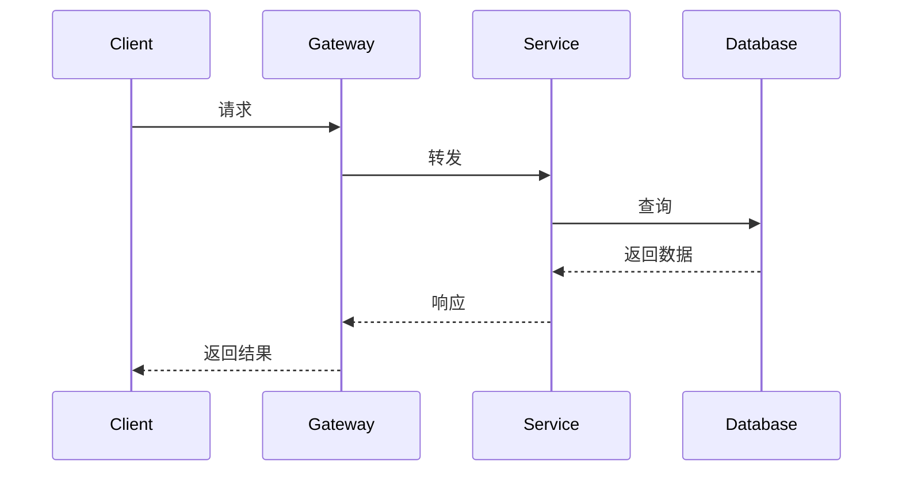
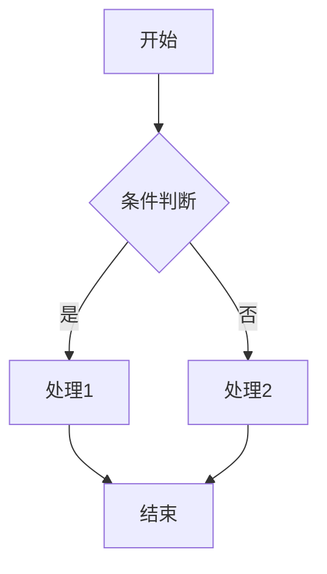

## 需求分析

### 功能需求
1. **核心功能**
   - [功能1]
   - [功能2]
   - [功能3]

2. **扩展功能**
   - [功能1]
   - [功能2]

### 非功能需求
- **性能要求**
  - QPS：[数值]
  - 响应时间：[要求]
  - 并发用户：[数值]

- **可用性要求**
  - SLA：[百分比]
  - 故障恢复时间：[时间]

- **可扩展性要求**
  - 用户增长预期：[说明]
  - 数据增长预期：[说明]

- **安全性要求**
  - [要求1]
  - [要求2]

### 约束条件
- 技术栈：[限制]
- 预算：[限制]
- 时间：[限制]
- 团队：[限制]

## 容量估算

### 用户规模
- DAU（日活跃用户）：[数值]
- MAU（月活跃用户）：[数值]
- 峰值QPS：[数值]

### 存储估算
```
单条记录大小：[大小]
每日新增记录：[数量]
数据保留时间：[时间]

总存储需求 = [计算过程]
            = [结果]
```

### 带宽估算
```
平均请求大小：[大小]
平均响应大小：[大小]
峰值QPS：[数值]

带宽需求 = [计算过程]
         = [结果]
```

## 系统架构

### 整体架构图
```
[使用Mermaid或Excalidraw绘制]
```

### 核心组件

#### 1. [组件名称]
**职责：**
[组件职责描述]

**技术选型：**
- [技术1]：[选择原因]
- [技术2]：[选择原因]

**接口设计：**
```
[API定义]
```

#### 2. [组件名称]
[类似结构]

### 数据流


## 数据库设计

### 数据模型

#### 表1：[表名]
```sql
CREATE TABLE [表名] (
    id BIGINT PRIMARY KEY,
    [字段1] [类型] [约束],
    [字段2] [类型] [约束],
    created_at TIMESTAMP,
    updated_at TIMESTAMP,
    INDEX idx_[字段] ([字段])
);
```

**字段说明：**
- `id`：[说明]
- `[字段1]`：[说明]

**索引设计：**
- 主键索引：`id`
- 普通索引：`[字段]`，用于[查询场景]

#### 表2：[表名]
[类似结构]

### 分库分表策略
**分片键：**
[选择的分片键]

**分片算法：**
```
[算法描述]
```

**路由规则：**
```
[路由逻辑]
```

## API设计

### RESTful API

#### 创建资源
```http
POST /api/v1/[resources]
Content-Type: application/json

{
    "[字段1]": "[值]",
    "[字段2]": "[值]"
}
```

**响应：**
```json
{
    "code": 200,
    "message": "success",
    "data": {
        "id": "xxx",
        "[字段]": "[值]"
    }
}
```

#### 查询资源
```http
GET /api/v1/[resources]/{id}
```

#### 更新资源
```http
PUT /api/v1/[resources]/{id}
```

#### 删除资源
```http
DELETE /api/v1/[resources]/{id}
```

### 错误码设计
| 错误码 | 说明 | HTTP状态码 |
|--------|------|------------|
| 1000 | 成功 | 200 |
| 2001 | 参数错误 | 400 |
| 2002 | 资源不存在 | 404 |
| 3001 | 未授权 | 401 |
| 5001 | 服务器错误 | 500 |

## 核心流程

### 流程1：[流程名称]
**流程图：**


**详细步骤：**
1. [步骤1]
2. [步骤2]
3. [步骤3]

**异常处理：**
- 场景1：[处理方式]
- 场景2：[处理方式]

## 高可用设计

### 服务高可用
- **负载均衡**
  - 算法：[轮询/加权轮询/一致性哈希]
  - 健康检查：[方式]

- **熔断降级**
  - 熔断阈值：[设置]
  - 降级策略：[说明]

- **限流**
  - 限流算法：[令牌桶/漏桶]
  - 限流阈值：[设置]

### 数据高可用
- **主从复制**
  - 复制方式：[同步/异步]
  - 故障切换：[自动/手动]

- **数据备份**
  - 备份策略：[全量/增量]
  - 备份频率：[频率]
  - 保留时间：[时间]

## 可扩展性设计

### 水平扩展
- **无状态服务**
  - [说明如何实现无状态]

- **数据分片**
  - [分片策略]

### 垂直扩展
- **服务拆分**
  - [拆分原则]
  - [拆分方案]

## 性能优化

### 缓存策略
- **缓存层级**
  - L1：[本地缓存]
  - L2：[分布式缓存]

- **缓存更新**
  - 策略：[Cache Aside/Write Through]
  - 过期时间：[设置]

- **缓存穿透/击穿/雪崩**
  - 防护措施：[说明]

### 数据库优化
- **索引优化**
  - [优化措施]

- **查询优化**
  - [优化措施]

- **连接池**
  - 配置：[参数]

### 异步处理
- **消息队列**
  - 选型：[Kafka/RabbitMQ/Redis]
  - 场景：[使用场景]

## 安全设计

### 认证授权
- **认证方式**
  - [JWT/OAuth2/Session]

- **权限模型**
  - [RBAC/ABAC]

### 数据安全
- **传输加密**
  - [HTTPS/TLS]

- **存储加密**
  - [敏感数据加密方案]

### 防护措施
- **SQL注入防护**
  - [措施]

- **XSS防护**
  - [措施]

- **CSRF防护**
  - [措施]

## 监控告警

### 监控指标
- **系统指标**
  - CPU使用率
  - 内存使用率
  - 磁盘IO
  - 网络流量

- **应用指标**
  - QPS
  - 响应时间
  - 错误率
  - 成功率

- **业务指标**
  - [业务相关指标]

### 告警规则
| 指标 | 阈值 | 级别 | 处理方式 |
|------|------|------|----------|
| CPU使用率 | >80% | 警告 | [处理] |
| 错误率 | >5% | 严重 | [处理] |

## 部署方案

### 环境划分
- 开发环境
- 测试环境
- 预发布环境
- 生产环境

### 部署架构
```
[部署架构图]
```

### 发布流程
1. [步骤1]
2. [步骤2]
3. [步骤3]

### 回滚方案
[回滚策略]

## 成本估算

### 服务器成本
| 资源 | 规格 | 数量 | 单价 | 月成本 |
|------|------|------|------|--------|
| 应用服务器 | [规格] | [数量] | [价格] | [金额] |
| 数据库 | [规格] | [数量] | [价格] | [金额] |
| 缓存 | [规格] | [数量] | [价格] | [金额] |

**总计：** [金额]/月

### 带宽成本
[估算]

### 存储成本
[估算]

## 技术选型对比

### [技术选型1]
| 方案 | 优势 | 劣势 | 适用场景 |
|------|------|------|----------|
| [方案A] | [优势] | [劣势] | [场景] |
| [方案B] | [优势] | [劣势] | [场景] |

**最终选择：** [方案] 
**原因：** [说明]

## 风险评估

### 技术风险
- **风险1：** [描述]
  - 影响：[影响程度]
  - 应对：[应对措施]

### 业务风险
- **风险1：** [描述]
  - 影响：[影响程度]
  - 应对：[应对措施]

## 未来规划

### 短期规划（3个月）
- [计划1]
- [计划2]

### 中期规划（6-12个月）
- [计划1]
- [计划2]

### 长期规划（1年以上）
- [计划1]
- [计划2]

## 总结

### 设计亮点
- [亮点1]
- [亮点2]

### 权衡取舍
- [取舍1]
- [取舍2]

### 经验教训
- [教训1]
- [教训2]

## 参考资料
1. [资料1] - [链接]
2. [资料2] - [链接]
