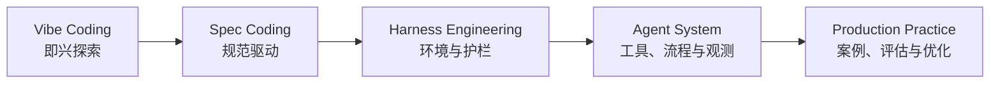

# 书籍介绍

欢迎阅读《AI 工程实践：从编程到 Agent 的完整指南》。

这不是一本单纯介绍工具按钮怎么点的书。它关注的是一个更长期的问题：当 AI 已经可以读代码、改代码、调用工具、规划任务、甚至并行协作时，工程师应该怎样重新设计自己的工作方式、项目规范和系统架构。

## 本书解决什么问题

AI 工程实践里最容易踩的坑，不是模型不会写代码，而是我们把不清楚的意图、不完整的上下文和没有验证回路的流程交给了模型。结果往往是：第一版看起来很聪明，第二版开始补洞，第三版引入新问题，最后人和 AI 一起在上下文里迷路。

本书的主线是把这种不稳定的协作方式，逐步收敛成可复用、可审查、可验证的工程系统：

读完之后，你应该能够回答三类问题：

- **个人效率**：什么时候让 AI 自由探索，什么时候必须先写 Spec？
- **项目协作**：如何用规则、上下文、工具和验证回路约束 AI 的行为？
- **系统落地**：什么时候值得做 Agent，怎样把 Agent 接入真实业务系统并持续评估？

## 适合谁读

本书主要面向已经参与过真实软件项目的读者，包括后端工程师、AI 应用工程师、技术负责人，以及正在把 AI 编程引入团队流程的人。

你不需要是大模型研究员，但最好具备以下基础：

- 能读懂一种主流编程语言的代码示例；
- 理解 API、数据库、测试、日志、部署等基本工程概念；
- 对 LLM、RAG、Agent 等术语有初步印象，遇到细节时愿意回查。

如果你刚开始接触 AI 编程，也可以先按“快速上手路径”阅读；如果你已经在团队里落地 Agent，则可以直接跳到第二、第三部分。

## 内容结构

### 第一部分：AI 编程实战

从 Vibe Coding 到 Spec Coding，再到 Harness Engineering，重点讨论 AI 编程的工作方式如何从“会用工具”升级为“会设计协作环境”。

你会获得：

- AI 编程范式的判断框架；
- Cursor 与 Claude Code 的典型工作流；
- Spec 模板、项目规则、验证回路的设计方法；
- 面向团队协作的 Harness Engineering 清单。

### 第二部分：AI Agent 系统设计

从“为什么需要 Agent”开始，逐步拆解架构模式、工具系统、MCP、多 Agent 协作、可观测性和成本优化。

你会获得：

- Agent 与传统后端的技术选型框架；
- ReACT、Plan-and-Execute、多 Agent 等模式的适用边界；
- 工具设计、权限控制和 MCP 接入方法；
- 生产环境中的追踪、评估、告警和成本治理思路。

### 第三部分：完整实战案例

用两个案例把前面的概念串起来：一个面向企业生产环境的 Developer on Duty Agent，一个面向个人知识系统的知识管理 Agent。

你会获得：

- 从需求分析到架构落地的完整决策过程；
- 状态机、ReACT、RAG、工具系统的组合方式；
- 案例中的取舍、失败模式和迭代路径；
- 可迁移到自己项目里的设计模板。

### 第四部分：基础理论补充

补齐 LLM 能力边界、Prompt Engineering、上下文管理、RAG 和评估优化等基础知识。它不是理论百科，而是服务于前面工程实践的“必要背景”。

### 第五部分：Agent 应用工程师面试实战

面向一个月内准备 Agent 应用工程师面试的读者，把前面的知识重新组织成能力地图、冲刺计划、评估体系、安全设计、工具/MCP 深化、Mini Agent 项目、系统设计题库和失败复盘模板。

你会获得：

- Agent 应用工程师岗位能力地图与 30 天复习计划；
- Evals、Guardrails、Tool Calling、MCP 的面试级表达框架；
- 一个可讲、可演示、可扩展的 Mini Agent 项目骨架；
- 高频系统设计题和项目作品集模板。

## 阅读路径

### 快速上手：2-3 天

适合想快速改善 AI 编程效率的读者：

1. 第 1 章：理解 Vibe Coding 与 Spec Coding 的差异；
2. 第 2 章或第 3 章：选择你正在使用的工具链深入；
3. 第 8 章：看一个生产级 Agent 案例如何组装起来。

### 系统学习：1-2 周

适合准备系统建立 AI 工程方法论的读者：

1. 按顺序阅读第一部分，先建立个人与团队协作方法；
2. 按顺序阅读第二部分，理解 Agent 系统设计；
3. 阅读第三部分案例，把模式映射到真实项目；
4. 回查第四部分和附录，补齐理论与工具细节。

### 项目驱动：随用随查

适合手上已经有项目的读者：

1. 先读第 4 章，判断问题是否真的适合 Agent；
2. 需要接工具时读第 5 章，需要多人/多 Agent 协作时读第 6 章；
3. 准备上线前读第 7 章；
4. 用第 8 章或第 9 章作为实现参考。

### 面试冲刺：30 天

适合准备 Agent 应用工程师面试的读者：

1. 先读第 12 章，建立能力地图和复习节奏；
2. 精读第 13-15 章，补齐 Evals、安全和工具/MCP；
3. 按第 16 章准备一个 Mini Agent 项目；
4. 用第 17 章练系统设计题；
5. 用第 18 章整理失败复盘和作品集。

## 在线阅读

- **GitHub Pages**：https://wxquare.github.io/ai-book/
- **源码仓库**：https://github.com/wxquare/wxquare.github.io

## 反馈与贡献

欢迎通过 Issue、Pull Request 或博客留言提供反馈。尤其欢迎三类反馈：

- 哪些章节读起来跳跃，缺少承上启下；
- 哪些代码或架构图难以复现；
- 哪些工具、模型或最佳实践已经过时。

## 版本信息

- **当前版本**：v1.0
- **发布日期**：2026 年 4 月
- **更新计划**：持续更新，优先深化案例、评估体系和团队协作实践。
