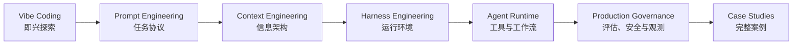

# 书籍介绍

欢迎阅读《AI 工程实践：从编程到 Agent 的完整指南》。

这不是一本单纯介绍工具按钮怎么点的书。它关注的是一个更长期的问题：当 AI 已经可以读代码、改代码、调用工具、规划任务、检索知识、长期运行甚至并行协作时，工程师应该怎样重新设计自己的工作方式、上下文系统、工具接口、验证回路和生产治理。

## 本书解决什么问题

AI 工程实践里最容易踩的坑，不是模型不会生成内容，而是我们把不清楚的意图、不完整的上下文、没有边界的工具和没有验证回路的流程交给了模型。结果往往是：第一版看起来很聪明，第二版开始补洞，第三版引入新问题，最后人和 AI 一起在上下文里迷路。

本书的主线是把这种不稳定的协作方式，逐步收敛成可复用、可审查、可验证、可治理的工程系统：

读完之后，你应该能够回答五类问题：

- **个人效率**：什么时候让 AI 自由探索，什么时候必须先写 Spec 和任务协议？
- **模型控制**：如何通过 Prompt Engineering 降低任务歧义和输出漂移？
- **信息架构**：如何通过 Context Engineering 管理项目规范、知识库、工具结果、记忆和上下文预算？
- **系统落地**：如何通过 Harness Engineering 把模型放进工具、工作流、验证、权限和观测组成的运行环境？
- **生产治理**：如何评估、监控、调试、回滚并持续优化一个 Agent 系统？

## 适合谁读

本书主要面向已经参与过真实软件项目的读者，包括后端工程师、AI 应用工程师、技术负责人，以及正在把 AI 编程或 Agent 系统引入团队流程的人。

你不需要是大模型研究员，但最好具备以下基础：

- 能读懂一种主流编程语言的代码示例；
- 理解 API、数据库、测试、日志、部署、权限等基本工程概念；
- 对 LLM、RAG、Agent、MCP、Evals 等术语有初步印象，遇到细节时愿意回查。

如果你刚开始接触 AI 编程，可以先按“快速上手路径”阅读；如果你已经在团队里落地 Agent，则可以直接从 Agent 架构、知识系统和生产治理部分切入。

## 内容结构

### 第一部分：AI 工程方法论基础

这一部分是全书的方法论主干：从 Vibe Coding 到 Spec Coding，再深入 Prompt Engineering、结构化输出、Context Engineering 和 Harness Engineering。

你会获得：

- AI 编程范式的判断框架；
- Prompt 作为任务协议的设计方法；
- 结构化输出作为后端契约的设计方法；
- Context 作为信息架构的组织方法；
- Harness 作为 Agent 运行环境的设计方法；
- Claude Code 中 Plan、CLAUDE.md、Skills、Hooks、MCP 的实践映射。

### 第二部分：Agent 架构与运行时设计

这一部分讨论当 AI 不再只是回答问题，而要在系统中执行任务时，运行时架构如何设计。

你会获得：

- LLM 能力边界和架构约束；
- Agent 与传统后端的技术选型框架；
- Tool Calling、MCP、权限、超时、重试和审计设计；
- 状态机、DAG、Router、Plan-and-Execute、多 Agent 编排的适用边界。

### 第三部分：知识、上下文与记忆系统

这一部分深入 Agent 如何获得事实、保持连续性，并避免上下文污染。

你会获得：

- RAG 与检索系统工程的完整链路：文档摄取、chunk、metadata、hybrid search、rerank、上下文构建和评估；
- Agentic RAG、multi-hop retrieval、GraphRAG、tool-augmented retrieval 和复杂知识任务的证据治理；
- working memory、conversation memory、long-term memory、episodic memory 的边界；
- 记忆写入、压缩、遗忘、污染防护和 eval 方法。

### 第四部分：生产级 Agent 治理

这一部分回答如何证明 Agent 有效，如何限制风险，如何定位失败，如何持续改进。

你会获得：

- Agent Evals 的分层评估体系；
- Guardrails 的输入、上下文、工具、输出四层安全架构；
- trace、metrics、cost、failure category 等可观测性设计；
- 从需求澄清到上线灰度、回滚、持续优化的全生命周期方法；
- Agent 失败模式、Debug 和持续改进闭环。

### 第五部分：完整架构案例

这一部分用完整案例把前面的能力栈串起来。

你会获得：

- 电商告警 DoD Agent 的生产级架构设计；
- 个人知识管理 Agent 中 RAG、Memory 和工作流的组合方式；
- 一个可复现、可观测、可扩展的 Mini Agent 项目骨架；
- 案例中的取舍、失败模式和迭代路径。

### 第六部分：Agent 应用工程师面试与作品集

这一部分不是新的知识主线，而是把前五部分的工程能力转译成面试表达、系统设计题回答和作品集材料。

你会获得：

- Agent 应用工程师能力地图与 30 天冲刺计划；
- 高频系统设计题的回答框架；
- 项目复盘、作品集模板和面试表达方法。

## 阅读路径

### 快速上手：2-3 天

适合想快速改善 AI 编程效率的读者：

1. 第 1 章：理解 Vibe Coding 与 Spec Coding 的差异；
2. 第 2 章：学习如何把需求写成任务协议；
3. 第 3 章：学习如何把模型输出变成可校验的系统契约；
4. 第 4 章：学习如何给 AI 准备正确上下文；
5. 第 5 章：理解工具、验证和护栏如何组成 Harness；
6. 选择第 19 章或第 21 章，看一套完整案例如何组装起来。

### 系统学习：1-2 周

适合准备建立完整 AI 工程方法论的读者：

1. 按顺序阅读第一部分，建立 Prompt、结构化输出、Context、Harness 的基础链路；
2. 阅读第二部分，理解 Agent 运行时架构；
3. 阅读第三部分，掌握知识、检索和记忆系统；
4. 阅读第四部分，补齐评估、安全、观测和生命周期治理；
5. 阅读第五部分案例，把模式映射到真实系统。

### 项目驱动：随用随查

适合手上已经有 Agent 项目的读者：

1. 先读第 7 章，判断问题是否真的适合 Agent；
2. 需要接外部系统时读第 9 章；
3. 需要处理知识库或私有数据时读第 11-13 章；
4. 准备上线前读第 14-17 章；
5. 出现质量、安全、成本或 Debug 问题时回查第 14-18 章。

### 面试冲刺：30 天

适合准备 Agent 应用工程师面试的读者：

1. 先读第一部分，确保能讲清 Prompt、Context、Harness 的递进关系；
2. 精读第二至第四部分，补齐架构、工具、RAG、Memory、Evals、Guardrails 和 Observability；
3. 用第五部分准备一个可讲、可演示、可复盘的项目；
4. 最后阅读第六部分，把工程能力转成岗位能力地图、系统设计回答和作品集表达。

## 在线阅读

- **GitHub Pages**：https://wxquare.github.io/ai-book/
- **源码仓库**：https://github.com/wxquare/wxquare.github.io

## 反馈与贡献

欢迎通过 Issue、Pull Request 或博客留言提供反馈。尤其欢迎三类反馈：

- 哪些章节读起来跳跃，缺少承上启下；
- 哪些代码或架构图难以复现；
- 哪些工具、模型或最佳实践已经过时。

## 版本信息

- **当前版本**：v1.0
- **发布日期**：2026 年 4 月
- **更新计划**：持续更新，优先深化 Prompt Engineering、Context Engineering、Harness Engineering、案例、评估体系和生产治理实践。
