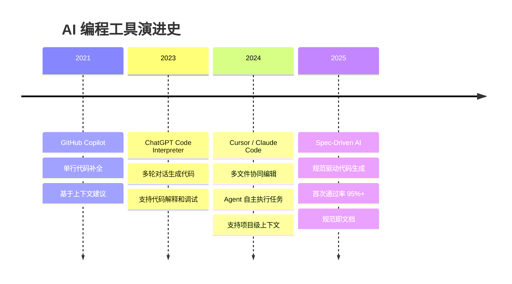
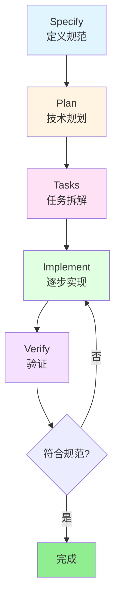

# 第1章 从Vibe Coding到Spec Coding：AI编程范式演进

> "Code is a lossy projection of intent." (代码是意图的有损投影) —— Sean Grove, OpenAI

## 引言

当你使用 Cursor 或 Claude Code 编程时，是否遇到过这样的情况：

- 第一轮生成的代码看起来不错，但运行后发现缺少错误处理
- 第二轮补充了错误处理，但又发现没考虑并发问题
- 第三轮加了锁，但发现性能下降了
- 第四轮优化性能，但测试覆盖又不够了
- ……

几轮下来，代码越改越乱，技术债越积越多。这就是 **Vibe Coding**（即兴式编程）的典型场景。

而另一种方式是：先花 15 分钟写一份完整的规范文档，然后让 AI 一次性生成符合所有要求的代码，首次通过率 95% 以上。这就是 **Spec Coding**（规范驱动编程）。

本章将深入探讨这两种 AI 编程范式的本质区别、适用场景，并提供 Cursor IDE 和 Claude Code 两个主流工具的完整实践指南。

---

## 1.1 AI编程工具的三次演进

AI 编程工具的发展经历了三个阶段：



### 第一阶段：代码补全（2021-2022）

GitHub Copilot 开创了 AI 辅助编程的先河，但它只能做单行或函数级别的补全，缺少项目级的理解。

### 第二阶段：对话式编程（2023）

ChatGPT 的出现让开发者可以通过自然语言描述需求，AI 生成完整的代码片段。但这种方式依然是"一次性"的，缺少持续的上下文管理。

### 第三阶段：Agent 式编程（2024-2025）

Cursor 和 Claude Code 等工具将 AI 提升到 Agent 级别，能够：
- 理解整个项目的结构和上下文
- 同时编辑多个文件
- 自主执行测试和验证
- 持续学习项目规范

### 工具能力提升了，但方法论跟上了吗？

工具的能力从"补全一行代码"进化到"实现一个完整功能"，但大多数开发者的使用方式还停留在"即兴式 prompt"阶段：

```text
你：实现一个用户注册功能
AI：[生成代码]
你：加上邮箱验证
AI：[修改代码]
你：密码要加密存储
AI：[再次修改]
你：还要防止重复注册
AI：[又改一遍]
```

这种方式在探索阶段很有效，但在生产环境中会导致：
- **返工频繁**：平均需要 3-5 轮迭代才能达到可用状态
- **遗漏需求**：安全、性能、边界情况容易被忽略
- **技术债累积**：架构不清晰，后期维护困难

**问题的本质**：我们用"即兴对话"的方式在做"工程化开发"的事情。

这就引出了本章的核心话题：**Vibe Coding vs Spec Coding**。

---

## 1.2 Vibe Coding的本质与陷阱

### 什么是 Vibe Coding

**Vibe Coding**（氛围编程、即兴编程）是指通过即兴的、逐步迭代的 prompt 与 AI 交互，"感觉对了就继续"的编程方式。

这个名词来源于开发者社区的自嘲：
> "I'm not following a plan, I'm just vibing with the AI." （我没有计划，就是跟着感觉和 AI 聊）

### Vibe Coding 的典型流程

让我们看一个真实的例子：用 Vibe Coding 实现一个简单的用户列表 API。

**第 1 轮对话：**
```text
你：用 Go 写一个获取用户列表的 HTTP API
```

AI 生成：
```go
// handler/user.go
func GetUsers(w http.ResponseWriter, r *http.Request) {
    users := []User{
        {ID: 1, Name: "Alice"},
        {ID: 2, Name: "Bob"},
    }
    json.NewEncoder(w).Encode(users)
}
```

**第 2 轮对话：**
```text
你：加上分页功能
```

AI 修改：
```go
func GetUsers(w http.ResponseWriter, r *http.Request) {
    page, _ := strconv.Atoi(r.URL.Query().Get("page"))
    pageSize, _ := strconv.Atoi(r.URL.Query().Get("page_size"))
    
    // 模拟分页逻辑
    users := getAllUsers()
    start := page * pageSize
    end := start + pageSize
    
    json.NewEncoder(w).Encode(users[start:end])
}
```

**第 3 轮对话：**
```text
你：加上按状态筛选
```

AI 再次修改：
```go
func GetUsers(w http.ResponseWriter, r *http.Request) {
    page, _ := strconv.Atoi(r.URL.Query().Get("page"))
    pageSize, _ := strconv.Atoi(r.URL.Query().Get("page_size"))
    status := r.URL.Query().Get("status")
    
    users := getAllUsers()
    
    // 筛选
    if status != "" {
        filtered := []User{}
        for _, u := range users {
            if u.Status == status {
                filtered = append(filtered, u)
            }
        }
        users = filtered
    }
    
    // 分页
    start := page * pageSize
    end := start + pageSize
    json.NewEncoder(w).Encode(users[start:end])
}
```

看起来不错？但仔细看会发现：
- ❌ 没有参数验证（page 可能是负数）
- ❌ 没有错误处理（数组越界）
- ❌ 没有统一的响应格式
- ❌ 没有数据库查询（只是模拟数据）
- ❌ 没有单元测试

### Vibe Coding 的价值

尽管有这些问题，Vibe Coding 在某些场景下非常有价值：

**✅ 探索未知领域**
```text
你：用 Go 的 WebSocket 库实现一个简单的聊天室
AI：[生成代码]
你：（看了代码后）原来 WebSocket 是这样用的！
```

**✅ 快速验证想法**
```text
你：试试用 Redis 做分布式锁
AI：[生成代码]
你：（运行测试）嗯，这个方案可行
```

**✅ 学习新技术**
```text
你：用 gRPC 实现一个简单的 RPC 调用
AI：[生成代码 + 解释]
你：（边看边学）明白了，proto 文件是这样定义的
```

**Vibe Coding 的本质**：它是一个**探索工具**，而不是**生产工具**。

### Vibe Coding 的天花板

让我们通过三个真实场景，看看 Vibe Coding 在生产环境中会遇到什么问题。

#### 场景一：订单状态机实现

**需求**：实现一个电商订单的状态机。

**Vibe Coding 方式：**

第 1 轮：
```text
你：实现订单状态：待支付、已支付、已发货、已完成
```

AI 生成：
```go
type OrderStatus string

const (
    StatusPending   OrderStatus = "pending"
    StatusPaid      OrderStatus = "paid"
    StatusShipped   OrderStatus = "shipped"
    StatusCompleted OrderStatus = "completed"
)

func (o *Order) UpdateStatus(newStatus OrderStatus) {
    o.Status = newStatus
}
```

然后经过 5 轮迭代，加上取消、退款、库存恢复等逻辑后，代码变成了这样：

```go
func (o *Order) UpdateStatus(newStatus OrderStatus) error {
    // 一堆 if-else 判断状态转换是否合法
    if o.Status == StatusPending && newStatus == StatusCancelled {
        // 取消订单
    } else if o.Status == StatusPaid && newStatus == StatusRefunding {
        // 开始退款
    } else if o.Status == StatusRefunding && newStatus == StatusRefunded {
        // 退款完成，恢复库存
        restoreInventory(o.Items)
    } else if o.Status == StatusShipped && newStatus == StatusCancelled {
        return errors.New("已发货订单不能取消")
    }
    // ... 更多判断
    
    o.Status = newStatus
    return nil
}
```

**问题：**
- ❌ 状态转换逻辑散落在各处，难以维护
- ❌ 缺少完整的状态转换图，容易遗漏边界情况
- ❌ 没有审计日志，无法追踪状态变更历史
- ❌ 恢复库存的逻辑耦合在状态机中

**根本原因**：缺少整体规划，逐步添加功能导致架构混乱。

#### 场景二：支付接口集成

**需求**：集成支付宝支付。

经过 6 轮迭代（基本实现 → 回调处理 → 失败重试 → 签名验证 → 幂等性 → 对账日志），最终发现：

**问题：**
- ❌ 安全要求（签名验证）在第 4 轮才想起来
- ❌ 幂等性在第 5 轮才补充，可能已经出现重复支付
- ❌ 对账日志在第 6 轮才加，之前的支付记录不完整

**生产事故案例**：

某电商平台使用 Vibe Coding 方式实现支付功能，上线后发现：
- 用户快速点击"支付"按钮，导致重复扣款
- 支付回调没有验证签名，被恶意伪造
- 对账时发现缺少关键日志，无法追查问题

**根本原因**：支付是安全敏感场景，需要在设计阶段就考虑所有安全要求，而不是事后补充。

#### 场景三：数据库设计

**需求**：设计商品库存表。

经过 6 轮迭代（基本表结构 → 时间戳 → 唯一索引 → 非负约束 → 乐观锁 → 操作日志表），发现：

**问题：**
- ❌ 表结构反复修改，可能已经有数据了
- ❌ 索引、约束、外键都是事后补充
- ❌ 缺少整体的数据模型设计

**根本原因**：数据库设计需要前期规划，频繁修改表结构会带来巨大的迁移成本。

### Vibe Coding 的量化分析

基于实际项目的统计数据：

| 指标 | Vibe Coding | 理想状态 | 差距 |
|------|-------------|----------|------|
| **首次通过率** | 60-70% | 95%+ | **35% ↓** |
| **平均迭代轮数** | 4-6 轮 | 1 轮 | **5 轮 ↑** |
| **Bug 密度** | 3-5 个/KLOC | 1-2 个/KLOC | **2-3 倍 ↑** |
| **重构频率** | 30% 代码需重写 | < 10% | **3 倍 ↑** |
| **测试覆盖率** | 50-60% | 80%+ | **25% ↓** |
| **文档完整性** | 几乎没有 | 规范即文档 | **质的差距** |

**结论**：Vibe Coding 适合探索和原型，但不适合生产环境。

---

## 1.3 Spec Coding：规范驱动的工程化方法

### 理论基础

#### Sean Grove 的 "The New Code"

2025 年，OpenAI 研究员 Sean Grove 在 AI Engineer World's Fair 上发表了题为 "The New Code" 的演讲，提出了一个颠覆性的观点：

> **"Code is a lossy projection of intent."** （代码是意图的有损投影）

什么意思？当你把脑子里的想法变成代码时，大量的上下文信息会丢失：
- **为什么**要这样做
- **权衡了哪些方案**
- **考虑了什么约束**

最终的代码只保留了"怎么做"，却丢掉了"为什么这样做"。

Grove 认为：

> **"Whoever writes the spec is now the programmer."** （写规范的人就是程序员）

随着 AI 越来越擅长把规范转化为代码，**真正的编程工作**从"写代码"变成了"写规范"。

#### Robert C. Martin 的经典论断

《Clean Code》的作者 Robert C. Martin 早在 2008 年就说过：

> **"Specifying requirements so precisely that a machine can execute them is programming."** （把需求描述得足够精确以至于机器能执行它——这就是编程）

在 AI 时代，这句话被重新激活：**规范就是代码，代码只是规范的实现产物。**

### Spec Coding 的三层规范结构

Spec Coding 将规范分为三个层次：

#### 第一层：功能规范（What）

回答"做什么"和"为什么"：

```markdown
## 功能需求

### 用户故事
- 作为买家，我希望能在下单时自动扣减库存
- 作为卖家，我希望库存不会出现超卖
- 作为运营，我希望能追踪所有库存变更记录

### 验收标准
- 下单时原子性扣减库存
- 库存不能为负数（超卖保护）
- 订单取消时自动恢复库存
- 所有库存变更有审计日志
```

#### 第二层：架构规范（How - 语言无关）

回答"怎么做"（技术方案）：

```markdown
## 数据模型

### inventory 表
- id: bigint, 主键
- product_id: bigint, 商品ID，唯一索引
- quantity: bigint, 库存数量，不能为负
- version: int, 乐观锁版本号
- created_at, updated_at: timestamp

### inventory_log 表
- id: bigint, 主键
- product_id: bigint, 商品ID
- order_id: varchar(64), 订单ID（幂等键）
- operation: varchar(20), 操作类型（deduct/restore）
- quantity: int, 变更数量
- before_quantity: bigint, 变更前库存
- after_quantity: bigint, 变更后库存
- created_at: timestamp

## API 设计

### POST /api/v1/inventory/deduct
扣减库存

**请求：**
{
  "product_id": 12345,
  "quantity": 2,
  "order_id": "ORD20260403001"
}

**响应（成功）：**
{
  "data": {
    "product_id": 12345,
    "remaining_quantity": 98
  }
}
```

#### 第三层：实现规范（How - 语言特定）

回答"用什么技术栈实现"：

```markdown
## 技术约束

### 技术栈
- 语言：Go 1.21+
- 数据库：PostgreSQL 14
- 缓存：Redis 7（幂等性缓存）
- ORM：GORM

### 代码规范
- 使用 context.Context 传递请求上下文
- 所有数据库操作必须在事务中
- 错误处理使用 errors.Wrap 包装
- 所有公开函数必须有 godoc 注释

### 测试要求
- 单元测试覆盖率 ≥ 80%
- 并发测试：100 个并发请求，验证无超卖
- 幂等性测试：同一请求调用 10 次，只扣减一次
```

### Spec Coding 的核心工作流



**Specify（定义规范）**：写清楚要做什么，不急着写代码

**Plan（技术规划）**：AI 根据规范生成技术方案

**Tasks（任务拆解）**：将方案拆分为可独立执行的小任务

**Implement（逐步实现）**：按任务逐个实现，每完成一个就验证

**Verify（验证）**：运行测试，确保符合规范

### 为什么 Spec Coding 更适合生产环境

**1. 首次通过率高（95%+）**

规范中已经定义了所有要求，AI 一次性生成符合所有约束的代码。

**2. 代码结构化、可测试**

规范中包含测试要求，生成的代码天然可测试。

**3. 规范即文档，自维护**

规范文档就是最好的文档，代码和文档永远同步。

**4. 团队协作有统一标准**

团队成员基于同一份规范工作，减少沟通成本。

**5. 减少技术债**

前期规划充分，避免了频繁重构和返工。

### 完整案例对比：电商库存扣减服务

让我们通过一个完整的案例，对比 Vibe Coding 和 Spec Coding 的差异。

#### Vibe Coding 实现过程

经过 6 轮迭代（基本逻辑 → 并发控制 → 事务回滚 → 恢复库存 → 操作日志 → 幂等性）：

**结果：**
- ⏱️ 总耗时：**2 小时**
- 🔄 返工次数：**5 次**
- 📝 代码行数：300 行
- ✅ 测试覆盖：60%
- 🐛 遗留 Bug：3 个（边界情况未处理）
- 📚 文档：无

#### Spec Coding 实现过程

**步骤 1：编写规范文档（15 分钟）**

创建 `specs/inventory-deduction.md`，包含：
- 功能需求（用户故事、验收标准）
- 数据模型（表结构、索引、约束）
- API 设计（请求/响应格式、错误码）
- 业务逻辑（详细流程）
- 非功能需求（性能、并发、幂等性）
- 技术约束（技术栈、代码规范、测试要求）

**步骤 2-4：AI 生成实现并验证（1 小时）**

**结果：**
- ⏱️ 总耗时：**1.2 小时**（规范 15 分钟 + 实现 45 分钟 + 验证 10 分钟）
- 🔄 返工次数：**0 次**
- 📝 代码行数：280 行
- ✅ 测试覆盖：95%
- 🐛 遗留 Bug：0 个
- 📚 文档：规范文档即文档

#### 对比总结

| 维度 | Vibe Coding | Spec Coding | 提升 |
|------|-------------|-------------|------|
| **开发时间** | 2 小时 | 1.2 小时 | **40% ↓** |
| **返工次数** | 5 次 | 0 次 | **100% ↓** |
| **代码行数** | 300 行 | 280 行 | 持平 |
| **测试覆盖** | 60% | 95% | **58% ↑** |
| **Bug 数** | 3 个遗留 | 0 个 | **100% ↓** |
| **可维护性** | 中 | 高 | 显著提升 |
| **文档完整性** | 无 | 规范即文档 | 质的飞跃 |
| **团队协作** | 困难 | 容易 | 显著提升 |

**关键洞察：**

1. **前期投入 vs 后期收益**：Spec Coding 前期花 15 分钟写规范，但节省了 40 分钟的返工时间
2. **规范是资产**：规范文档可以复用到其他类似功能，形成团队知识库
3. **质量保证**：规范中定义了测试要求，生成的代码天然可测试
4. **沟通效率**：团队成员基于同一份规范工作，减少了大量的沟通成本

---

## 1.4 编写高质量Spec的完整指南

一份好的规范文档应该回答 8 个核心问题：

### 1. 做什么？（功能需求）

使用用户故事描述：

```markdown
### 用户故事
- 作为买家，我希望能在下单时自动扣减库存
- 作为卖家，我希望库存不会出现超卖
- 作为运营，我希望能追踪所有库存变更记录

### 验收标准
- 下单时原子性扣减库存
- 库存不能为负数（超卖保护）
- 同一订单多次调用只扣减一次（幂等性）
- 订单取消时自动恢复库存
- 所有库存变更有审计日志
```

### 2. 输入是什么？（请求参数）

明确数据结构和验证规则：

```markdown
## API 设计

### POST /api/v1/inventory/deduct

**请求参数：**
{
  "product_id": 12345,      // 商品ID，必填，bigint
  "quantity": 2,            // 扣减数量，必填，int，范围 [1, 1000]
  "order_id": "ORD20260403001"  // 订单ID，必填，幂等键
}

**参数验证：**
- product_id 必须存在
- quantity 必须 > 0 且 ≤ 1000
- order_id 格式：ORD{YYYYMMDD}{序号}
```

### 3. 输出是什么？（响应格式）

定义所有可能的响应：

```markdown
**响应（成功 200）：**
{
  "data": {
    "product_id": 12345,
    "remaining_quantity": 98
  }
}

**响应（库存不足 409）：**
{
  "error": {
    "code": "E2001",
    "message": "库存不足",
    "details": {
      "available": 1,
      "requested": 2
    }
  }
}

**响应（重复请求 200）：**
{
  "data": {
    "product_id": 12345,
    "remaining_quantity": 98,
    "idempotent": true
  }
}
```

### 4. 约束条件是什么？（业务规则）

明确所有业务约束：

```markdown
## 业务规则

### 库存扣减规则
1. 库存必须充足（quantity >= requested）
2. 使用乐观锁防止并发冲突
3. 操作必须在事务中执行
4. 失败时自动回滚

### 幂等性规则
1. 使用 order_id 作为幂等键
2. 相同 order_id 的请求返回缓存结果
3. 幂等缓存 TTL 为 5 分钟
```

### 5. 失败模式有哪些？（错误处理）

列举所有可能的错误：

```markdown
## 错误处理

| 错误类型 | HTTP 状态码 | 错误码 | 处理方式 |
|---------|------------|-------|---------|
| 库存不足 | 409 | E2001 | 返回可用库存数 |
| 商品不存在 | 404 | E2002 | 返回错误信息 |
| 重复请求 | 200 | - | 返回缓存结果+幂等标记 |
| 乐观锁冲突 | 500 | E2003 | 重试 3 次 |
| 数据库错误 | 500 | E2999 | 记录日志+报警 |
```

### 6. 安全要求是什么？（认证、授权）

定义安全约束：

```markdown
## 安全要求

### 认证
- 所有写操作需要 JWT 认证
- access token 有效期 15 分钟

### 授权
- 普通用户只能操作自己的订单
- 管理员可以操作所有订单

### 审计日志
- 记录操作人、操作时间、操作内容
- 日志保留 90 天
```

### 7. 性能要求是什么？（QPS、延迟）

明确性能指标：

```markdown
## 非功能需求

### 性能要求
- 并发：支持 1000 QPS
- 延迟：P99 < 100ms
- 可用性：99.9%

### 并发控制
- 使用乐观锁（version 字段）防止并发冲突
- 乐观锁冲突时重试 3 次
- Redis 缓存用于幂等性判断
```

### 8. 什么测试能证明它工作？（测试场景）

定义完整的测试用例：

```markdown
## 测试要求

### 单元测试
- 正常扣减：库存充足时成功扣减
- 库存不足：返回 409 错误
- 幂等性：同一订单 ID 调用 10 次，只扣减一次
- 并发：100 个并发请求，验证无超卖

### 集成测试
- 端到端流程：下单 → 扣减库存 → 生成日志
- 失败回滚：扣减失败时事务回滚

### 边界测试
- 库存为 0
- 扣减数量为负数
- 扣减数量超过库存
- order_id 为空
```

### 规范模板

这是一个通用的规范模板：

```markdown
# [功能名称] 规范

## 1. 功能需求
- 用户故事
- 验收标准

## 2. 数据模型
- 表结构
- 索引
- 约束

## 3. API 设计
- 接口定义
- 请求/响应格式
- 错误码定义

## 4. 业务逻辑
- 详细流程
- 状态转换
- 规则约束

## 5. 非功能需求
- 性能要求
- 并发控制
- 安全要求

## 6. 错误处理
- 错误类型
- 处理策略
- 降级方案

## 7. 技术约束
- 技术栈
- 代码规范
- 依赖限制

## 8. 测试要求
- 单元测试场景
- 集成测试场景
- 边界测试场景
```

---

## 1.5 Cursor IDE完整实践

### Cursor 的配置文件体系

Cursor 使用两种配置文件来管理规范：

#### 工具 1：`.cursorrules` - 项目规范入口

**位置：** 项目根目录  
**加载方式：** Cursor 启动时自动加载  
**作用：** 提供项目级的全局规范

**实战示例：**

创建 `/your-project/.cursorrules`：

```markdown
# 电商后端项目 - Cursor 规则

## 项目概述
这是一个基于 Go 的电商后端系统，采用微服务架构。

## 技术栈
- 语言：Go 1.21+
- 数据库：PostgreSQL 14
- 缓存：Redis 7
- 消息队列：Kafka
- RPC：gRPC
- API：RESTful HTTP

## 架构约束
- 所有金额使用整数（分）存储，避免浮点精度问题
- 所有时间统一使用 UTC 时区
- 错误码格式：E{模块代码}{序号}，如 E1001（用户模块）、E2001（库存模块）
- 数据库操作必须在事务中执行
- 敏感操作（支付、退款）必须记录审计日志

## 代码规范
- 使用 context.Context 传递请求上下文
- 所有公开函数必须有 godoc 注释
- 错误处理：不要忽略 error，使用 pkg/errors 包装
- 命名规范：
  - 包名：小写，单数，简短
  - 接口名：以 -er 结尾（如 Reader, Writer）
  - 私有字段：小写开头
  - 公开字段：大写开头

## 测试要求
- 单元测试覆盖率 ≥ 80%
- 所有 API 端点必须有集成测试
- 使用 testify 作为测试框架
- 表驱动测试（table-driven tests）优先

## 开发工作流
1. 先写功能规范文档（specs/ 目录）
2. 使用 Cursor 根据规范生成代码
3. 运行测试验证
4. Code Review
5. 合并到主分支
```

#### 工具 2：`.cursor/rules/` - 分层规范管理

**位置：** 项目根目录下的 `.cursor/rules/` 目录  
**加载方式：** 通过 frontmatter 的 `globs` 字段条件加载  
**作用：** 针对特定文件类型的详细规范

**目录结构：**
```text
your-project/
├── .cursorrules              # 全局规范（自动加载）
├── .cursor/
│   └── rules/                # 分层规范（条件加载）
│       ├── 00-architecture.md
│       ├── 01-security.md
│       ├── 10-api-design.md
│       ├── 11-database.md
│       └── 20-testing.md
├── specs/                    # 功能规范（手动引用）
│   └── inventory-deduction.md
└── internal/
    ├── api/
    ├── service/
    └── model/
```

### Cursor 工作流实战

**步骤 1：创建功能规范文档**

```bash
# 创建 specs 目录
mkdir -p specs

# 编写规范文档
vim specs/inventory-deduction.md
```

**步骤 2：在 Cursor 中引用规范**

在 Cursor 的聊天窗口中：

```text
@specs/inventory-deduction.md @.cursorrules
按照规范实现库存扣减服务，先从数据模型开始
```

Cursor 会读取规范文档和全局规则，生成符合所有约束的代码。

**步骤 3：使用 Cursor Composer 多文件编辑**

Cursor Composer 可以同时编辑多个文件，非常适合实现完整功能。

按 `Cmd/Ctrl + I` 打开 Composer，然后输入：

```text
@specs/inventory-deduction.md @.cursorrules
实现库存扣减服务，需要创建/修改以下文件：
1. internal/model/inventory.go - 数据模型
2. internal/repository/inventory_repo.go - 数据访问层
3. internal/service/inventory_service.go - 业务逻辑
4. internal/api/inventory_handler.go - API 处理器
5. internal/api/inventory_handler_test.go - API 测试
6. migrations/000003_create_inventory_tables.up.sql - 数据库迁移

请按照 .cursorrules 和规范文档实现，每个文件都要符合对应的规范。
```

Cursor 会同时在多个文件中生成代码，并且每个文件都会遵循对应的 `.cursor/rules/` 规范（通过 globs 自动加载）。

**步骤 4：验证实现**

```text
@specs/inventory-deduction.md
审查当前实现是否完全符合规范：
1. 数据模型是否正确（检查字段类型、索引、约束）
2. 是否实现了幂等性（Redis 缓存）
3. 是否使用了乐观锁（version 字段）
4. 是否有完整的错误处理
5. 测试是否覆盖所有场景（并发、幂等性、边界情况）
```

Cursor 会逐项检查，并给出改进建议。

### Cursor 常见陷阱

**陷阱 1：忘记引用规范文件**

❌ 错误：
```text
实现订单服务
```

问题：Cursor 不知道你的具体要求，只能生成通用代码。

✅ 正确：
```text
@.cursorrules @specs/order-service.md
实现订单服务
```

**陷阱 2：规范写得太模糊**

规范要具体，不能只有一句话描述。要包含详细的：
- 数据模型
- API 接口定义
- 错误处理
- 测试场景

**陷阱 3：规范和代码不同步**

解决方案：规范变更时，让 Cursor 重新审查代码

```text
@specs/order-service.md
规范已更新（增加了退款功能），审查现有代码：
1. 哪些部分需要修改
2. 是否有遗漏的功能
3. 测试是否需要补充
4. 数据库迁移是否需要新增
```

---

## 1.6 Claude Code工作流与最佳实践

### Claude Code 的配置文件体系

Claude Code 是 Anthropic 开发的终端工具，使用不同的配置文件体系。

#### `CLAUDE.md` - 项目规范入口

**位置：** 项目根目录  
**加载方式：** Claude Code 启动时自动加载  
**作用：** 提供项目级的全局规范

**实战示例：**

创建 `/your-project/CLAUDE.md`：

```markdown
# 电商后端项目规范

## 项目概述
这是一个基于 Go 的电商后端系统，采用微服务架构。

## 技术栈
- 语言：Go 1.21+
- 数据库：PostgreSQL 14
- 缓存：Redis 7
- 消息队列：Kafka

## 全局约束
- 所有金额使用整数（分）存储
- 所有时间使用 UTC 时区
- 所有敏感操作记录审计日志

## 开发工作流
1. 先写规范文档（specs/ 目录）
2. 使用 Claude Code 生成实现
3. 运行测试验证
4. Code Review
5. 合并到主分支

## 功能规范目录
具体功能的详细规范在 specs/ 目录：
- specs/inventory-deduction.md - 库存扣减服务
- specs/payment-integration.md - 支付集成服务
- specs/order-management.md - 订单管理服务
```

### Claude Code 工作流实战

**步骤 1：创建功能规范**

创建 `specs/payment-integration.md`（内容格式同前文库存扣减服务）。

**步骤 2：启动 Claude Code**

在终端中：

```bash
# 进入项目目录（Claude Code 会自动加载 CLAUDE.md）
cd your-project

# 启动 Claude Code
claude-code
```

**步骤 3：在 Claude Code 中引用规范**

```bash
> 请阅读 specs/payment-integration.md 规范文档，
> 然后按照规范实现支付集成服务。
> 先从数据模型开始，然后实现业务逻辑，最后实现 API 层。
> 每完成一个模块暂停，等我确认后再继续。
```

**步骤 4：使用 /plan 命令生成实施计划**

```bash
> /plan
> 根据 specs/payment-integration.md 规范，
> 制定详细的实施计划
```

Claude Code 会生成详细的任务拆解和验收标准。

**步骤 5：逐步实现**

```bash
> 开始实现任务 1：数据模型设计
> 完成后显示代码，等我确认再继续
```

### Claude Code 特色功能

**功能 1：规范验证**

Claude Code 可以验证实现是否完全符合规范：

```bash
> 验证当前实现是否完全符合 specs/payment-integration.md：
> 1. 列出规范中的所有要求
> 2. 逐条检查实现情况
> 3. 列出未实现或不符合的部分
> 4. 给出改进建议
```

**功能 2：规范演进**

当需求变更时，先更新规范，再让 Claude Code 更新代码：

```bash
> specs/payment-integration.md 已更新，新增了银联支付渠道。
> 请分析：
> 1. 哪些代码需要修改
> 2. 如何保持向后兼容
> 3. 需要补充哪些测试
> 4. 是否需要数据库迁移
```

**功能 3：批量代码生成**

Claude Code 适合批量生成代码：

```bash
> 根据 specs/ 目录下的所有规范文档，
> 生成对应的单元测试文件。
> 
> 要求：
> 1. 每个规范对应一个测试文件
> 2. 测试覆盖所有功能需求
> 3. 使用 testify 框架
> 4. 表驱动测试优先
```

### Cursor vs Claude Code：工具选择指南

| 维度 | Cursor IDE | Claude Code |
|------|-----------|-------------|
| **界面** | 图形化 IDE（基于 VSCode） | 终端命令行 |
| **配置文件** | `.cursorrules` + `.cursor/rules/` | `CLAUDE.md` |
| **规范加载** | 条件加载（globs 匹配） | 手动引用 |
| **多文件编辑** | Composer（可视化） | 命令行交互 |
| **适用场景** | 日常开发，可视化操作 | 自动化脚本，CI/CD |
| **学习曲线** | 低（类似 VSCode） | 中（需要熟悉命令） |

#### 推荐使用场景

**使用 Cursor IDE：**
- ✅ 日常开发工作
- ✅ 需要可视化界面
- ✅ 多文件同时编辑
- ✅ 需要调试功能
- ✅ 前端开发（需要实时预览）

**使用 Claude Code：**
- ✅ CI/CD 自动化
- ✅ 批量代码生成
- ✅ 脚本化工作流
- ✅ 远程服务器开发（SSH）
- ✅ 代码审查和重构

**两者结合的最佳实践：**

1. **本地开发用 Cursor** - 日常编码、调试、测试，可视化操作效率高
2. **CI/CD 用 Claude Code** - 自动生成测试、代码规范检查、批量重构
3. **规范文档两者共享** - `.cursorrules` 和 `CLAUDE.md` 内容保持一致

---

## 本章小结

从 Vibe Coding 到 Spec Coding，不是一次革命，而是一次进化。

### 核心要点回顾

**1. AI编程工具的三次演进**
- 代码补全（2021）→ 对话式编程（2023）→ Agent 式编程（2024）→ 规范驱动（2025）
- 工具能力大幅提升，但方法论需要跟上

**2. Vibe Coding 的价值与局限**
- ✅ 价值：探索工具，快速验证，学习新技术
- ❌ 局限：返工频繁（4-6轮），遗漏需求，技术债累积
- 🎯 定位：探索工具，不是生产工具

**3. Spec Coding 的核心优势**
- 📋 规范是 source of truth，代码是实现产物
- 🎯 首次通过率 95%+，减少返工
- 📚 规范即文档，自维护
- 🤝 团队协作有统一标准
- 💰 开发效率提升 30-40%

**4. 编写高质量规范的 8 个问题**
1. 做什么？（功能需求）
2. 输入是什么？（请求参数）
3. 输出是什么？（响应格式）
4. 约束条件是什么？（业务规则）
5. 失败模式有哪些？（错误处理）
6. 安全要求是什么？（认证、授权）
7. 性能要求是什么？（QPS、延迟）
8. 什么测试能证明它工作？（测试场景）

**5. 工具链实践**
- **Cursor IDE**：`.cursorrules` + `.cursor/rules/` + Composer 多文件编辑
- **Claude Code**：`CLAUDE.md` + `/plan` 命令 + 批量生成

**6. 混合策略**
- Vibe 探索（30 分钟）→ 提炼规范（15 分钟）→ Spec 重建（1 小时）
- 用 Vibe 的速度验证方向，用 Spec 的质量交付产品

**7. 决策框架**
- **生产环境、多人协作、长期维护、安全敏感** → Spec Coding
- **验证想法、探索技术、Hackathon、一次性脚本** → Vibe Coding

### 最终建议

**探索阶段：** 用 Vibe Coding 快速试错  
**生产阶段：** 用 Spec Coding 保证质量  
**团队协作：** 规范先行，统一标准  
**持续演进：** 规范和代码一起版本控制

### AI 编程的未来

Sean Grove 的洞察正在成为现实：

> **"Whoever writes the spec is now the programmer."** （写规范的人就是程序员）

AI 编程的未来，不是让 AI 写更多代码，而是让开发者写更好的规范。

**写规范的能力 = 编程能力**，这是 AI 时代对开发者的新要求。

### 行动号召

从今天开始，为你的下一个功能写一份规范文档吧。

不需要完美，只需要回答这 8 个问题：
1. 做什么？
2. 输入是什么？
3. 输出是什么？
4. 约束条件是什么？
5. 失败模式有哪些？
6. 安全要求是什么？
7. 性能要求是什么？
8. 什么测试能证明它工作？

体验一次 Spec Coding，你会发现：**规范写得越清楚，代码生成得越好。**

### 下一章预告

第2章我们将深入探讨 Claude Code 的实践技巧，包括 Plan 模式、Auto 模式、CLAUDE.md 配置和完整的工作流案例。

---

## 参考资料

1. **Sean Grove "The New Code" 演讲** - AI Engineer World's Fair 2025
2. **Robert C. Martin《Clean Code》** - Chapter 1: Clean Code
3. **Cursor 官方文档** - https://cursor.sh/docs
4. **Claude Code 官方文档** - https://docs.anthropic.com/claude-code
5. **WOWHOW: CLAUDE.md, AGENTS.md, and .cursorrules 完全指南** - https://wowhow.cloud/blogs/claude-md-agents-md-cursorrules-ai-coding-config-guide-2026
