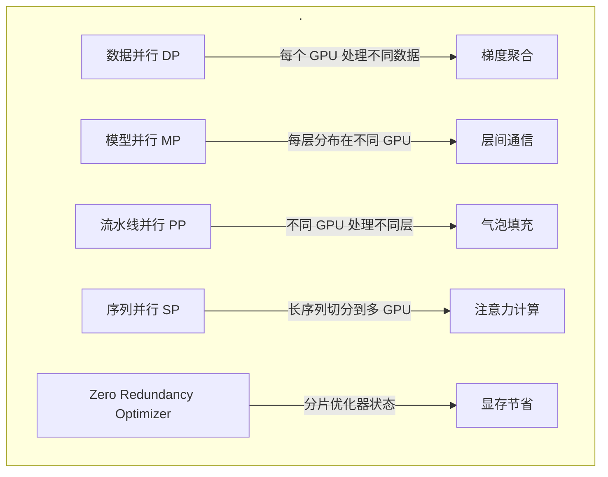
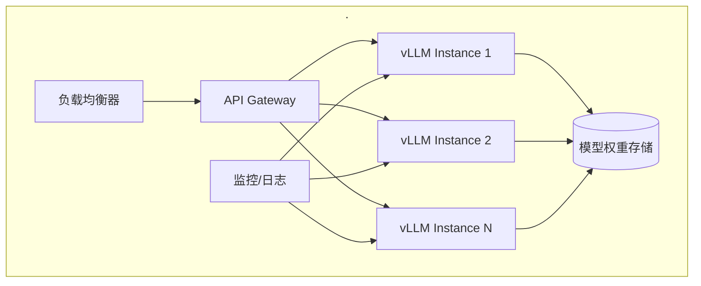
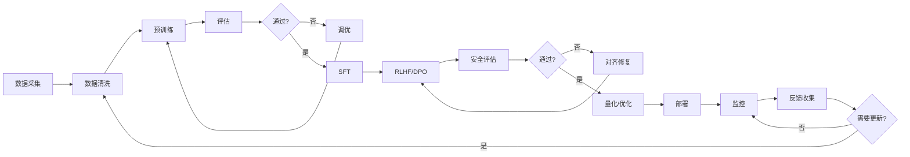

# 第 2 章 训练、微调与推理工程

## 本章导读

本章深入大语言模型从训练到服务的完整链路。你将了解：

- 预训练与后训练的技术细节
- 模型微调的多种范式及其适用场景
- 推理优化的工程实践
- 不同部署形态的权衡与选择

## 2.1 预训练技术详解

### 2.1.1 数据工程：从原始文本到训练语料

数据质量直接决定模型能力上限。预训练数据处理是一个系统工程：

**数据采集 pipeline**：


**去重策略**：

| 去重层级 | 方法 | 目的 |
|----------|------|------|
| 文档级 | MinHash/LSH 近似去重 | 消除完全重复或高度相似文档 |
| 段落级 | 滑动窗口指纹比对 | 去除模板化内容（如导航栏、版权声明） |
| 行级 | 精确匹配或近似匹配 | 去除重复代码、引用 |

**质量过滤**：

1. **启发式规则**：
   - 长度过滤（过短/过长文档）
   - 标点比例（异常高的标点符号占比）
   - 行尾重复（如 `"\n\n\n"` 出现频率）
   - 词表覆盖率（过滤包含过多未识别字符的文档）

2. **基于分类器的过滤**：
   - 训练质量评分模型
   - 预测文档的语言、主题、写作质量
   - 过滤低质量类别（如 spam、机器生成内容）

**内容清洗实践**：

```python
# 示例：网页内容清洗的关键步骤
def clean_web_content(html_content):
    # 1. 提取正文（去除导航、广告、侧边栏）
    main_content = extract_main_content(html_content)
    
    # 2. 标准化空白字符
    text = normalize_whitespace(main_content)
    
    # 3. 修复编码问题
    text = fix_encoding_issues(text)
    
    # 4. 处理特殊字符
    text = normalize_unicode(text)
    
    return text
```

### 2.1.2 分词（Tokenization）

分词将文本转换为模型可处理的 token 序列，是连接人类语言与机器表示的关键环节。

**主流分词算法**：

| 算法 | 原理 | 代表 | 特点 |
|------|------|------|------|
| **BPE** | 从字符开始，迭代合并最高频的字符对 | GPT-2/3, RoBERTa | 简单高效，适合多语言 |
| **WordPiece** | 基于语言模型概率的合并 | BERT, DistilBERT | 保留完整单词，适合理解任务 |
| **SentencePiece** | 将空格视为特殊字符，统一处理 | T5, Llama, Qwen | 语言无关，无需预分词 |
| **Unigram** | 从大的词表开始，逐步删除低概率 token | Albert, XLNet | 概率建模，更灵活 |

**BPE 训练过程示例**：

```
初始词表：{'a', 'b', 'c', ..., 'z', '</w>'}
语料：{"low</w>": 5, "lower</w>": 2, ...}

迭代 1：最高频对 (e, r) → 合并为 "er"
词表新增：{'er'}

迭代 2：最高频对 (er</w>) → 合并为 "er</w>"
词表新增：{'er</w>'}

...直到达到目标词表大小
```

**词表大小权衡**：

- **小词表（32K-50K）**：序列更长，但每个 token 信息密度高，适合生成任务
- **大词表（100K-250K）**：减少罕见词被拆分为子词，改善多语言支持
- **多语言考量**：中文等字符集大的语言需要更大的基础字符覆盖

**中文分词的特殊性**：

```python
# 中文文本的 BPE 处理挑战
中文文本 = "机器学习是人工智能的重要分支"

# 问题：如果不预处理，可能得到字符级分割
# 理想：保留语义单元如 "机器学习"、"人工智能"

# 解决方案：
# 1. 使用语言特定的预分词
# 2. 在 BPE 前用中文分词器（如 jieba）做初步切分
# 3. 增大训练数据中的中文占比，让 BPE 学习中文常用组合
```

### 2.1.3 预训练目标与任务设计

**自回归语言建模（Causal LM）**：

```
目标：最大化序列的联合概率
L = Σ log P(x_t | x_{<t})

示例：
输入："今天 天气 很 好"
预测：P(今天) × P(天气|今天) × P(很|今天天气) × P(好|今天天气很)
```

适用于：GPT 系列，Llama、Qwen 等 Decoder-only 模型

**掩码语言建模（Masked LM）**：

```
目标：预测被掩码的 token
输入："今天 [MASK] 气 很 [MASK]"
预测：天、好
```

适用于：BERT、RoBERTa 等 Encoder-only 模型

**前缀语言建模（Prefix LM）**：

```
目标：输入双向编码，输出自回归生成
输入（双向可见）："翻译：今天天气很好 →"
输出（自回归）："The weather is nice today"
```

适用于：T5、GLM 等 Encoder-Decoder 模型

### 2.1.4 训练优化技术

**分布式训练策略**：



**混合精度训练（Mixed Precision）**：

```python
# PyTorch 自动混合精度示例
from torch.cuda.amp import autocast, GradScaler

scaler = GradScaler()

for data, target in dataloader:
    optimizer.zero_grad()
    
    # 前向传播使用 FP16
    with autocast():
        output = model(data)
        loss = criterion(output, target)
    
    # 反向传播放大梯度避免下溢
    scaler.scale(loss).backward()
    scaler.step(optimizer)
    scaler.update()
```

**显存优化技术**：

| 技术 | 原理 | 节省空间 | 开销 |
|------|------|----------|------|
| **梯度检查点** | 前向时只保留关键激活，反向时重计算 | 30-50% | 20-30% 时间 |
| **激活重计算** | 类似梯度检查点，更细粒度 | 20-40% | 15-25% 时间 |
| **ZeRO** | 分片优化器状态、梯度、参数 | 高达 8 倍 | 通信开销 |
| **8-bit 优化器** | 使用 INT8 存储优化器状态 | 2-4 倍 | 微小精度损失 |

**学习率调度**：

```python
# Warmup + Cosine Decay 示例
def get_lr(step, warmup_steps, max_steps, max_lr, min_lr):
    if step < warmup_steps:
        # 线性 warmup
        return max_lr * step / warmup_steps
    else:
        # Cosine 衰减到 min_lr
        progress = (step - warmup_steps) / (max_steps - warmup_steps)
        return min_lr + (max_lr - min_lr) * 0.5 * (1 + cos(pi * progress))
```

## 2.2 微调（Fine-tuning）范式

### 2.2.1 全参数微调（Full Fine-tuning）

更新模型的所有参数，适用于数据充足、算力充裕的场景。

**适用场景**：
- 领域适配（医疗、法律、金融等专业领域）
- 任务特化（情感分析、命名实体识别等）
- 风格迁移（特定写作风格、品牌语调）

**数据要求**：

| 模型规模 | 建议最少数据量 | 理想数据量 |
|----------|----------------|------------|
| 7B | 1K-10K 样本 | 50K+ |
| 13B | 5K-50K 样本 | 100K+ |
| 70B | 10K-100K 样本 | 500K+ |

**训练超参建议**：

```yaml
learning_rate: 1e-5 to 5e-5  # 比预训练小 1-2 个数量级
num_epochs: 3-5              # 避免过拟合
batch_size: 根据显存最大化
warmup_ratio: 0.03-0.1        # 短 warmup
weight_decay: 0.01            # 防止过拟合
```

### 2.2.2 参数高效微调（PEFT）

**LoRA（Low-Rank Adaptation）**：

核心思想：冻结预训练权重，在注意力层旁路注入低秩可训练矩阵。

```
原始计算：h = Wx
LoRA 适配：h = Wx + BAx

其中：
- W ∈ R^{d×k}：冻结的预训练权重
- B ∈ R^{d×r}：可训练
- A ∈ R^{r×k}：可训练
- r << min(d, k)：低秩约束
```

**LoRA 优势**：

| 方面 | 全参数微调 | LoRA |
|------|-----------|------|
| 可训练参数 | 100% | 0.1%-1% |
| 显存占用 | 高（存储梯度、优化器状态） | 低（仅存储低秩矩阵） |
| 多任务切换 | 需保存完整模型副本 | 仅保存小适配器文件 |
| 部署方式 | 替换完整模型 | 动态加载适配器 |

**LoRA 配置实践**：

```python
from peft import LoraConfig, get_peft_model

# 典型 LoRA 配置
lora_config = LoraConfig(
    r=16,                    # 秩，常见取值 8, 16, 32, 64
    lora_alpha=32,           # 缩放因子，通常 2*r
    target_modules=[        # 应用 LoRA 的模块
        "q_proj", "k_proj", "v_proj", "o_proj",  # 注意力
        "gate_proj", "up_proj", "down_proj"      # MLP
    ],
    lora_dropout=0.05,       # 防止过拟合
    bias="none",             # 是否训练 bias
    task_type="CAUSAL_LM"    # 任务类型
)

model = get_peft_model(base_model, lora_config)
model.print_trainable_parameters()  # 查看可训练参数量
```

**其他 PEFT 方法**：

| 方法 | 原理 | 特点 |
|------|------|------|
| **Prompt Tuning** | 学习软提示嵌入 | 极简，仅几十到几百参数 |
| **P-Tuning v2** | 深层提示编码 | 适合 NLU 任务 |
| **Prefix Tuning** | 在每层前添加可训练前缀 | 较早的 PEFT 方法 |
| **IA³** | 学习逐元素缩放向量 | 比 LoRA 更省参，效果接近 |
| **DoRA** | 权重分解低秩适配 | LoRA 的改进版，分解幅度和方向 |
| **QLoRA** | LoRA + 4-bit 量化 | 单卡微调 70B 模型 |

**QLoRA 实战**：

```python
# 使用 bitsandbytes 进行 4-bit 量化 + LoRA
from transformers import AutoModelForCausalLM, BitsAndBytesConfig
from peft import LoraConfig, get_peft_model, prepare_model_for_kbit_training

# 4-bit 量化配置
bnb_config = BitsAndBytesConfig(
    load_in_4bit=True,
    bnb_4bit_compute_dtype=torch.bfloat16,
    bnb_4bit_use_double_quant=True,      # 嵌套量化
    bnb_4bit_quant_type="nf4"            # 4-bit Normal Float
)

# 加载量化模型
model = AutoModelForCausalLM.from_pretrained(
    "meta-llama/Llama-2-70b",
    quantization_config=bnb_config,
    device_map="auto"                    # 自动分配层到 GPU/CPU
)

# 预处理用于训练
model = prepare_model_for_kbit_training(model)

# 添加 LoRA
model = get_peft_model(model, lora_config)
```

### 2.2.3 指令微调（Instruction Tuning）

将预训练模型转化为遵循指令、进行对话的助手。

**指令数据格式**：

```json
{
  "instruction": "将以下中文翻译成英文",
  "input": "人工智能正在改变我们的生活方式",
  "output": "Artificial intelligence is changing the way we live."
}
```

或对话格式：

```json
{
  "messages": [
    {"role": "user", "content": "解释什么是深度学习"},
    {"role": "assistant", "content": "深度学习是机器学习的一个子领域..."},
    {"role": "user", "content": "它和传统机器学习有什么区别？"},
    {"role": "assistant", "content": "主要区别包括..."}
  ]
}
```

**开源指令数据集**：

| 数据集 | 规模 | 特点 |
|--------|------|------|
| **Alpaca** | 52K | GPT-3.5 生成的指令数据 |
| **Dolly** | 15K | 人工编写，Databricks |
| **ShareGPT** | 100K+ | 真实用户对话 |
| **UltraChat** | 1.5M+ | 多样化主题，大规模 |
| **OpenHermes** | 1M+ | 高质量过滤 |

**指令微调最佳实践**：

1. **数据多样性**：覆盖对话、问答、代码、推理、创意写作等多种类型
2. **质量优先**：过滤语法错误、事实错误、有害内容
3. **长度平衡**：避免过长样本主导梯度
4. **系统提示统一**：保持一致的角色设定和约束

### 2.2.4 持续预训练与领域适配

在特定领域数据上继续预训练，提升模型对该领域的语言理解和知识掌握。

**适用场景**：
- 医学、法律、金融等专业领域
- 特定编程语言或框架
- 企业内部知识库

**技术要点**：

```yaml
# 持续预训练配置
data:
  domain_corpus: "medical_texts/"  # 领域语料
  mixing_ratio: 0.7               # 领域:通用 = 7:3

training:
  learning_rate: 5e-5             # 比初始预训练小
  batch_size: 2M tokens           # 较大的 batch
  max_steps: 10000                # 相对较少的步数
  warmup_steps: 1000
  
optimization:
  resume_from: "Llama-2-7b"       # 基于开源模型
  freeze_layers: 0                # 全参数更新
```

**数据混合策略**：

```python
# 领域数据与通用数据混合，防止灾难性遗忘
def mixed_data_loader(domain_data, general_data, domain_ratio=0.7):
    while True:
        if random.random() < domain_ratio:
            yield next(domain_data)
        else:
            yield next(general_data)
```

## 2.3 推理工程与优化

### 2.3.1 推理性能瓶颈

**计算瓶颈分析**：

```
Transformer 推理主要开销：
1. 线性层矩阵乘法 (70-80%)
2. 注意力计算 (15-25%)
3. LayerNorm, Embedding 等 (5-10%)
```

**内存瓶颈**：

| 组件 | 7B 模型 FP16 | 70B 模型 FP16 |
|------|-------------|---------------|
| 模型权重 | 14 GB | 140 GB |
| KV Cache (4K 上下文) | ~2 GB | ~20 GB |
| 激活值 | ~1 GB | ~5 GB |
| **总计** | ~17 GB | ~165 GB |

**解码方式特性**：

- **自回归生成**：每次只生成一个 token，需要重复计算
- **KV Cache**：缓存历史 key/value，避免重复计算，但占用显存

### 2.3.2 推理优化技术

**量化（Quantization）**：

将 FP16/FP32 权重压缩到更低精度，减少显存占用和计算量。

| 精度 | 压缩率 | 性能影响 | 典型方法 |
|------|--------|----------|----------|
| **FP16** | 2x | 基准 | 原生支持 |
| **INT8** | 2x | 极小 | SmoothQuant, LLM.int8() |
| **INT4** | 4x | 较小 | GPTQ, AWQ, GGUF |
| **FP8** | 2x | 微小 | NVIDIA Transformer Engine |

**GPTQ 后训练量化**：

```python
# 使用 AutoGPTQ 进行 4-bit 量化
from auto_gptq import AutoGPTQForCausalLM, BaseQuantizeConfig

quantize_config = BaseQuantizeConfig(
    bits=4,
    group_size=128,          # 量化组大小
    desc_act=False,          # 是否降序激活
)

model = AutoGPTQForCausalLM.from_pretrained(
    model_name,
    quantize_config
)

# 使用少量数据校准
model.quantize(calibration_data)
model.save_quantized(quantized_model_dir)
```

**KV Cache 优化**：

```python
# 优化 1: Multi-Query Attention (MQA)
# 所有头共享一组 K/V，显著减少 cache 大小

# 优化 2: Grouped-Query Attention (GQA)
# 头分组共享 K/V，平衡性能和效果

# 优化 3: 分页 KV Cache (vLLM)
# 动态分配，减少碎片，支持更大 batch
```

**批处理优化（Continuous Batching）**：

```
传统批处理：
Batch: [req1(100tokens), req2(10tokens), req3(50tokens)]
必须等最长请求完成才能处理下一批

Continuous Batching：
- req1 完成后立即从 batch 移除
- 立即加入新请求填补空缺
- 提高 GPU 利用率
```

**投机采样（Speculative Decoding）**：

```
原理：用 draft 小模型快速生成候选序列
       再由 target 大模型并行验证

速度提升：2-3x（取决于 draft 模型质量）

Draft 模型选择：
- 蒸馏小模型
- n-gram 查找
- 早退机制
```

### 2.3.3 推理框架与部署

**主流推理框架对比**：

| 框架 | 特点 | 适用场景 |
|------|------|----------|
| **vLLM** | PagedAttention, 高吞吐 | 高并发 API 服务 |
| **TGI (HuggingFace)** | 功能全面，生态好 | 快速部署，多样化需求 |
| **TensorRT-LLM** | NVIDIA 优化极致 | NVIDIA GPU 生产环境 |
| **llama.cpp** | CPU 推理，量化友好 | 边缘部署，消费级硬件 |
| **MLC LLM** | 跨平台，移动端支持 | 手机、嵌入式设备 |

**vLLM 部署示例**：

```python
from vllm import LLM, SamplingParams

# 初始化模型
llm = LLM(
    model="meta-llama/Llama-2-7b",
    tensor_parallel_size=1,      # GPU 并行数
    gpu_memory_utilization=0.9,   # GPU 显存利用率
    max_model_len=4096
)

# 配置采样参数
sampling_params = SamplingParams(
    temperature=0.7,
    top_p=0.95,
    max_tokens=512
)

# 批量推理
prompts = ["你好", "什么是机器学习", "解释 Transformer"]
outputs = llm.generate(prompts, sampling_params)
```

**生产级部署架构**：



### 2.3.4 成本优化策略

**按需选择模型规模**：

| 场景 | 推荐模型 | 成本节约 |
|------|----------|----------|
| 简单分类/抽取 | 7B 蒸馏模型 | 10-20x |
| 一般对话 | 13B 模型 | 5-10x |
| 复杂推理 | 70B+ 或 GPT-4 | 基准 |

**缓存策略**：

```python
# Embedding Cache：缓存常见查询的向量表示
# 适用：RAG 检索、相似度计算

# 响应 Cache：缓存确定性问题的答案
# 适用：FAQ、定义类查询

# KV Cache 复用：多轮对话共享上下文缓存
```

**请求批处理**：

```python
# 动态批处理：累积请求到 batch 再处理
# 适用：异步任务、非实时场景

# 预填充与解码分离：
# - Prefill Phase：并行处理 prompt
# - Decode Phase：自回归生成
# 分别优化，整体提速
```

## 2.4 从训练到服务的完整链路

### 2.4.1 MLOps 流水线



### 2.4.2 模型版本管理

**版本命名规范**：

```
{base_model}-v{major}.{minor}-{specialization}

示例：
- Llama-2-7b-v1.0-base      # 基础版本
- Llama-2-7b-v1.1-zh        # 中文增强
- Llama-2-7b-v2.0-sft       # 指令微调后
- Llama-2-7b-v2.1-dpo       # DPO 优化后
```

**版本控制实践**：

1. **权重存储**：使用 DVC、Git LFS 或对象存储（S3、OSS）
2. **配置版本**：训练配置、数据版本与代码一起版本化
3. **实验追踪**：使用 MLflow、WandB 记录超参和指标
4. **模型卡片**：记录模型能力、局限、使用建议

### 2.4.3 监控与可观测性

**关键监控指标**：

| 维度 | 指标 | 预警阈值 |
|------|------|----------|
| **性能** | TTFT (Time To First Token) | > 1s |
| | TPOT (Time Per Output Token) | > 100ms |
| | 吞吐量 (tokens/s) | 低于基线 20% |
| **质量** | 用户满意度评分 | < 4.0/5 |
| | 幻觉率（抽样评估） | > 5% |
| | 拒绝率 | > 20% |
| **资源** | GPU 利用率 | < 60% 或 > 95% |
| | 显存使用率 | > 90% |
| | 请求队列深度 | > 100 |
| **安全** | 有害内容生成率 | > 0.1% |
| | 越狱尝试检测 | 实时监控 |

**日志记录要点**：

```python
{
  "timestamp": "2024-01-15T10:30:00Z",
  "request_id": "req-abc-123",
  "model_version": "Llama-2-7b-v2.1",
  "input_tokens": 150,
  "output_tokens": 512,
  "generation_time_ms": 2500,
  "finish_reason": "stop",
  "safety_scores": {
    "harmful": 0.01,
    "bias": 0.05
  }
}
```

## 小结

本章覆盖了大模型从训练到服务的全链路技术：

**核心要点**：

1. **数据工程是基础**：预训练数据的质量和多样性决定了模型能力的天花板，数据清洗投入回报极高

2. **微调范式分层选择**：
   - 全参数微调：数据充足、算力充裕、追求最佳效果
   - LoRA/QLoRA：资源受限、多任务切换、快速迭代
   - 提示工程：零样本或少样本场景

3. **推理优化是多维度的**：量化减少显存，批处理提高吞吐，投机采样降低延迟，需根据场景组合使用

4. **MLOps 是工程化核心**：版本管理、监控可观测性、持续迭代决定了模型能否在生产环境稳定服务

**关键权衡**：

| 维度 | 选项 A | 选项 B | 决策因素 |
|------|--------|--------|----------|
| 训练成本 | 全参数微调 | PEFT | 数据量、算力预算 |
| 推理成本 | 大模型 | 小模型/量化 | 任务复杂度、延迟要求 |
| 部署方式 | 云端 API | 私有化 | 数据隐私、合规要求 |
| 质量优先 | 高质量数据 | 更多数据 | 任务类型、领域特点 |

**下一步**：

理解了模型训练和部署的技术细节后，第 3 章将聚焦于**提示工程、上下文管理与 RAG**——这是将大模型能力转化为实际应用价值的关键工程技能。

## 思考题

1. 假设你有 10K 条领域标注数据，目标是让 7B 基础模型适应该领域，列出完整的技术方案（数据准备、训练配置、评估方案）。

2. 分析你当前使用或关注的 LLM 应用，识别推理性能瓶颈，提出至少 3 个优化方向。

3. 对比 LoRA、Prompt Tuning、全参数微调在你所在场景下的适用性，列出决策依据。

4. 设计一个 LLM 服务的监控 dashboard，列出关键指标和可视化方案。

## 延伸阅读

- Touvron, H., et al. (2023). "Llama 2: Open Foundation and Fine-Tuned Chat Models". arXiv:2307.09288.
- Dettmers, T., et al. (2023). "QLoRA: Efficient Finetuning of Quantized LLMs". NeurIPS.
- Hu, E., et al. (2022). "LoRA: Low-Rank Adaptation of Large Language Models". ICLR.
- Yao, Z., et al. (2023). "A Comprehensive Survey on Pretrained Foundation Models: A History from BERT to ChatGPT". arXiv:2302.09419.
- Kwon, W., et al. (2023). "Efficient Memory Management for Large Language Model Serving with PagedAttention". SOSP.
- Sheng, Y., et al. (2023). "High-throughput Generative Inference of Large Language Models with a Single GPU". ICML.
