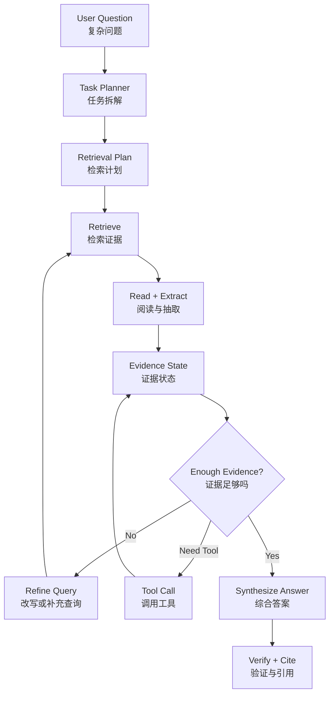

# 第9章 Agentic RAG 与高级检索模式：从单次问答到复杂知识任务

> 当问题不能被一次检索回答时，RAG 就不再是一个静态 pipeline，而会变成由 Agent 驱动的规划、检索、阅读、验证和再检索循环。

## 引言

上一章讲的是生产级 RAG 的主链路：文档摄取、chunk、metadata、embedding、hybrid search、rerank、上下文构建和评估。

这类 RAG 适合回答明确、局部、证据集中型问题：

```text
order-service CPU 高的 runbook 是什么？
这个错误码 ERR_PAYMENT_1042 怎么处理？
某个 API 的参数含义是什么？
```

但真实 Agent 系统经常面对更复杂的问题：

```text
最近两次 order-service 事故是否有共同根因？
这个功能为什么在 staging 正常、production 失败？
这份设计方案和我们现有系统有哪些冲突？
帮我调研某个领域，整理出技术路线、代表论文和工程取舍。
```

这些问题无法靠一次 Top-K 检索解决。它们需要：

- 拆解问题；
- 选择知识源；
- 多轮检索；
- 跨文档连接证据；
- 识别缺失信息；
- 验证假设；
- 必要时调用工具；
- 控制检索预算；
- 在证据不足时停止。

这就是 Agentic RAG 的位置。



Agentic RAG 不是把 Agent 和 RAG 两个词拼在一起。它的核心是：让检索过程从单次函数调用变成可规划、可观察、可验证的任务执行过程。

---

## 9.1 为什么普通 RAG 不够

普通 RAG 的默认假设是：

```text
一个问题 -> 一次检索 -> 一组相关文档 -> 一个答案
```

这个假设在简单问答里成立，但在复杂任务里经常失效。

### 失败场景 1：问题需要多跳证据

用户问：

```text
为什么 order-service 昨天发布后支付成功率下降？
```

回答这个问题可能需要连接多个证据：

1. 昨天有哪些发布；
2. 发布涉及哪些代码变更；
3. order-service 调用了哪些 payment API；
4. 支付成功率下降发生在哪个时间窗口；
5. 日志里是否出现新错误码；
6. 历史上是否有类似事故。

一次检索很难同时召回所有证据。

### 失败场景 2：用户问题太宽

```text
帮我分析这个系统的稳定性问题。
```

这个问题没有明确实体、时间窗口和知识源。普通 RAG 可能随机召回几篇“稳定性”相关文档，然后生成一段泛泛而谈的答案。

Agentic RAG 应先澄清或拆解：

```yaml
analysis_plan:
  dimensions:
    - incidents
    - SLO
    - error budget
    - dependency failures
    - deployment rollback
    - observability gaps
  required_sources:
    - incident_postmortems
    - metrics
    - deploy_records
    - architecture_docs
```

### 失败场景 3：证据需要验证

历史文档说：

```text
payment-service 超时会导致 order-service 重试风暴。
```

这只是历史经验。当前是否发生同样问题，需要查实时指标和日志。

普通 RAG 可能把历史案例当成当前事实。Agentic RAG 应该把它作为假设，然后触发验证：

```text
Hypothesis: payment-service timeout caused retry storm
Need evidence:
  - current payment latency
  - order-service retry rate
  - logs with timeout errors
```

### 失败场景 4：需要比较和综合

```text
比较方案 A 和方案 B，哪个更适合我们的现有架构？
```

这需要检索：

- 方案 A 文档；
- 方案 B 文档；
- 当前系统架构；
- 性能约束；
- 团队能力；
- 迁移成本；
- 历史技术债。

然后按维度综合，而不是简单回答“文档里说 A 更好”。

### Agentic RAG 的判断标准

当问题满足以下任意条件，就应该考虑 Agentic RAG：

- 需要多份证据才能回答；
- 需要多跳关系连接；
- 需要跨知识源检索；
- query 不明确，需要规划；
- 需要验证假设；
- 需要工具调用；
- 需要比较多个方案；
- 需要生成报告、决策建议或执行计划。

---

## 9.2 Agentic RAG 的控制循环

Agentic RAG 的本质是一个控制循环。

```text
Plan
  ↓
Retrieve
  ↓
Read
  ↓
Update Evidence State
  ↓
Decide Next Step
  ↓
Synthesize
  ↓
Verify
```

### Plan：先决定要找什么

普通 RAG 直接拿用户问题检索。Agentic RAG 会先生成检索计划。

```yaml
retrieval_plan:
  task: "analyze order-service incident"
  sub_questions:
    - id: "q1"
      question: "昨天 order-service 有哪些发布？"
      source: "deploy_system"
    - id: "q2"
      question: "支付成功率下降的时间窗口是什么？"
      source: "metrics"
    - id: "q3"
      question: "日志中是否出现新的 payment 错误码？"
      source: "logs"
    - id: "q4"
      question: "历史上是否有类似重试风暴案例？"
      source: "incident_postmortems"
  stop_condition: "all required evidence collected or budget exhausted"
```

Plan 不是为了让模型显得会思考，而是为了让检索过程可控、可追踪、可评估。

### Retrieve：按子问题检索

每个子问题可以使用不同检索器：

| 子问题 | 检索方式 |
|:---|:---|
| 发布记录 | release API / DB |
| 指标变化 | metrics tool |
| 错误日志 | log search |
| 历史案例 | RAG vector + keyword |
| 架构依赖 | graph search |
| 代码调用链 | code search |

Agentic RAG 不应该把所有东西都塞进一个向量库。它需要 source routing。

### Read：从文档里抽取结构化证据

检索到文档后，Agent 不应该立刻生成最终答案，而应该先抽取证据。

```yaml
evidence_item:
  id: "e_deploy_1"
  claim: "order-service v2.3.8 was deployed at 14:05"
  source: "release_system"
  time: "2026-04-28T14:05:00+08:00"
  trust_level: "authoritative"
  supports:
    - "deployment_timeline"
```

结构化证据比自然语言摘要更适合后续验证和综合。

### Update Evidence State

Agentic RAG 需要维护证据状态：

```yaml
evidence_state:
  task: "analyze payment success rate drop"
  collected:
    deployment_timeline:
      status: "complete"
      evidence_ids:
        - "e_deploy_1"
    metrics_window:
      status: "complete"
      evidence_ids:
        - "e_metric_1"
    log_errors:
      status: "partial"
      missing:
        - "payment timeout logs"
    historical_cases:
      status: "not_started"
  hypotheses:
    - id: "h1"
      claim: "new deployment caused payment timeout"
      status: "needs_more_evidence"
```

这和上一章的 Context Package 不同。Evidence State 是多步任务中的工作状态。

### Decide Next Step

每一轮结束后，Agent 要决定：

- 证据是否足够；
- 是否需要补充检索；
- 是否需要换知识源；
- 是否需要调用工具；
- 是否需要向用户澄清；
- 是否应该停止。

```yaml
next_step_decision:
  action: "retrieve_more"
  reason: "log evidence is missing for payment timeout hypothesis"
  next_query:
    source: "logs"
    query: "order-service payment timeout errors after 14:05"
```

### Synthesize + Verify

最终答案应该来自 Evidence State，而不是来自散乱的检索片段。

综合时要区分：

- 已确认事实；
- 高置信推断；
- 未验证假设；
- 缺失证据；
- 建议动作。

验证时要检查：

- 每个关键结论是否有证据；
- citation 是否支持句子；
- 是否有未处理冲突；
- 是否超过权限；
- 是否应该拒答或降级。

---

## 9.3 Query Planning：把问题拆成可检索任务

复杂问题的关键不是“检索更多”，而是“检索得有计划”。

### 子问题拆解

用户问题：

```text
最近两次 order-service 事故是否有共同根因？
```

可以拆成：

```yaml
sub_questions:
  - id: "q1"
    question: "最近两次 order-service 事故分别是什么？"
    expected_evidence: "incident list"
  - id: "q2"
    question: "每次事故的症状、时间线和根因是什么？"
    expected_evidence: "postmortem"
  - id: "q3"
    question: "两次事故是否共享依赖、代码模块或配置变更？"
    expected_evidence: "dependency and change records"
  - id: "q4"
    question: "共同因素是否有当前证据支持？"
    expected_evidence: "cross-case comparison"
```

拆解后的每个问题都可以单独检索、评估和追踪。

### 检索计划 Schema

```yaml
retrieval_plan:
  task_id: "compare_incidents_order_service"
  user_goal: "判断最近两次事故是否有共同根因"
  constraints:
    - "不能把历史相似性当成当前事实"
    - "每个根因判断必须引用 postmortem 或工具结果"
  steps:
    - step_id: "s1"
      query: "order-service recent incidents last 90 days"
      source: "incident_db"
      output: "incident_ids"
    - step_id: "s2"
      query_template: "postmortem for {incident_id}"
      source: "postmortem_index"
      output: "incident_summary"
    - step_id: "s3"
      query_template: "changes and dependencies for {incident_id}"
      source:
        - "deploy_system"
        - "service_graph"
      output: "shared_factors"
  budget:
    max_steps: 8
    max_retrieval_calls: 12
    max_tokens: 12000
```

计划里必须有 budget。没有 budget 的 Agentic RAG 容易无限搜索。

### Query Rewrite

有些用户问题不适合直接检索。

```text
用户：这个问题之前是不是发生过？
```

需要结合当前任务上下文改写：

```yaml
rewritten_query:
  original: "这个问题之前是不是发生过？"
  resolved:
    service: "order-service"
    symptom: "CPU high after deployment"
    environment: "production"
  queries:
    - "order-service CPU high after deployment incident"
    - "order-service deployment caused CPU increase"
    - "生产发布后 CPU 升高 order-service"
```

Query Rewrite 要保留 resolved entities，否则后续 trace 很难解释。

### Query Decomposition 的风险

拆解过度会带来：

- 成本升高；
- 检索噪音增加；
- 子问题偏离原始目标；
- Agent 自己创造不存在的任务；
- 最终答案结构臃肿。

所以 query planning 应该由任务类型驱动，而不是所有问题都拆成十步。

---

## 9.4 Multi-hop Retrieval：跨证据链路检索

Multi-hop Retrieval 指答案需要通过多个证据节点连接得到。

### 单跳与多跳

单跳问题：

```text
order-service CPU 高 runbook 在哪里？
```

一个 runbook 就能回答。

多跳问题：

```text
哪个下游依赖最可能导致 order-service 昨晚错误率上升？
```

需要连接：

```text
order-service 错误率上升
  -> 错误日志中的下游调用失败
  -> 服务依赖图
  -> 下游服务指标
  -> 发布记录或故障记录
```

### Iterative Retrieval

最常见的 multi-hop 做法是迭代检索：

```text
Initial Query
  ↓
Retrieve Evidence A
  ↓
Extract Entity / Hypothesis
  ↓
Build Next Query
  ↓
Retrieve Evidence B
  ↓
Repeat Until Enough
```

例如：

```yaml
hop_1:
  query: "order-service error rate spike 2026-04-28 20:00"
  found:
    - "errors mention payment timeout"

hop_2:
  query: "payment-service timeout metrics 2026-04-28 20:00"
  found:
    - "payment-service p99 latency increased"

hop_3:
  query: "payment-service deployment around 2026-04-28 20:00"
  found:
    - "payment-service v4.1.2 deployed at 19:45"
```

最后综合：

```text
order-service 错误率上升与 payment-service 超时高度相关，payment-service 在 19:45 有发布，时间线支持该假设。
```

注意这里仍然是“支持假设”，不是绝对根因。

### Bridge Entity

多跳检索的关键是桥接实体（bridge entity）。

常见 bridge entity：

- 服务名；
- 错误码；
- 用户 ID；
- 订单号；
- 函数名；
- 配置项；
- 时间窗口；
- 版本号；
- 工单 ID；
- 论文概念；
- 法规条款。

检索器需要从第一跳结果中抽取这些实体，生成下一跳查询。

```yaml
bridge_entities:
  - type: "service"
    value: "payment-service"
    source_evidence: "e_log_1"
  - type: "error_code"
    value: "PAYMENT_TIMEOUT"
    source_evidence: "e_log_2"
  - type: "time_window"
    value: "2026-04-28 19:45-20:15"
    source_evidence: "e_metric_1"
```

### Stop Condition

Multi-hop 必须有停止条件。

```yaml
stop_conditions:
  - "all required evidence types collected"
  - "top hypothesis has supporting evidence from at least two independent sources"
  - "no new bridge entities found"
  - "retrieval budget exhausted"
  - "evidence remains insufficient, ask user or report uncertainty"
```

没有停止条件，Agent 可能不断“再查一下”。

---

## 9.5 GraphRAG：当关系比文本相似更重要

GraphRAG 适合关系密集型问题。

普通向量检索回答“哪些文本语义相似”。图检索回答“实体之间如何连接”。

### 适合 GraphRAG 的场景

| 场景 | 关系 |
|:---|:---|
| 微服务架构 | service -> depends_on -> service |
| 代码仓库 | function -> calls -> function |
| 企业知识 | person -> owns -> project |
| 金融风控 | account -> transfers_to -> account |
| 法规合规 | regulation -> constrains -> process |
| 学术研究 | paper -> cites -> paper |

用户问：

```text
如果 payment-service 延迟升高，哪些上游服务会受影响？
```

这不是纯文本相似问题，而是图遍历问题。

### Graph Schema

```yaml
graph_schema:
  nodes:
    - Service
    - Team
    - API
    - Database
    - Incident
    - Deployment
  edges:
    - Service DEPENDS_ON Service
    - Team OWNS Service
    - Service CALLS API
    - Incident AFFECTS Service
    - Deployment CHANGED Service
```

GraphRAG 可以先用图找到相关实体，再用 RAG 拉取对应文档。

```text
Graph Traversal
  ↓
Relevant Entity Set
  ↓
Document Retrieval by Entity
  ↓
Context Builder
```

### Local Query 与 Global Query

GraphRAG 常见两类问题。

Local Query：

```text
order-service 依赖哪些服务？
```

回答局部实体邻域。

Global Query：

```text
我们系统里最脆弱的依赖链路在哪里？
```

需要图聚合、社区摘要和全局分析。

### 图谱构建风险

GraphRAG 的难点不在查询，而在图谱质量。

常见风险：

- 实体抽取错误；
- 同名实体合并错误；
- 关系过期；
- 边缺少来源；
- 图谱和文档索引不同步；
- 模型从文本中抽出不存在的关系。

每条关系都应该有来源：

```yaml
edge:
  from: "order-service"
  relation: "DEPENDS_ON"
  to: "payment-service"
  source: "service_catalog"
  confidence: 0.98
  updated_at: "2026-04-20"
```

不要让模型自由生成一张没有来源的“知识图谱”。

---

## 9.6 Tool-Augmented Retrieval：检索不只来自文档

复杂 Agent 的证据不只来自文档库，还来自工具。

### 文档检索与工具查询的区别

| 来源 | 适合回答 | 风险 |
|:---|:---|:---|
| 文档 RAG | 规则、流程、背景知识 | 过期、召回错 |
| 数据库查询 | 结构化事实 | 权限、SQL 安全 |
| Metrics | 当前系统状态 | 时间窗口、聚合粒度 |
| Logs | 错误细节 | 噪音、敏感信息 |
| Traces | 调用链路 | 数据量大 |
| Code Search | 实现逻辑 | 符号解析、版本 |
| Web Search | 外部最新信息 | 可信度、引用 |

Agentic RAG 应该把这些都看成 evidence source。

### Source Router

```yaml
source_routing_policy:
  incident_triage:
    required:
      - metrics
      - logs
      - runbook
    optional:
      - incident_postmortems
      - deployment_records
  code_question:
    required:
      - code_search
      - symbol_index
    optional:
      - design_docs
      - issues
  product_policy:
    required:
      - policy_docs
    optional:
      - support_tickets
```

Source Router 防止 Agent 对所有问题都只查文档。

### Evidence Normalization

不同工具返回格式不同，需要归一化成统一证据。

```yaml
evidence:
  id: "e_metric_latency"
  type: "metric"
  claim: "payment-service p99 latency increased from 120ms to 2400ms"
  source: "metrics"
  time_window: "2026-04-28T19:45:00+08:00/2026-04-28T20:15:00+08:00"
  trust_level: "current_observation"
  raw_ref: "trace://metrics/query/9281"
```

统一证据格式让后续综合和 eval 更容易。

### 工具结果优先级

当前工具结果通常高于历史文档。

```text
current metrics > active runbook > recent postmortem > historical case > old discussion
```

历史案例可以提出假设，但当前状态必须由工具验证。

---

## 9.7 Self-Verification：让 Agent 证明答案有依据

Agentic RAG 的关键能力不是“多检索几次”，而是知道什么时候证据足够。

### Evidence Sufficiency Check

在生成最终答案前，Agent 应做证据充分性检查。

```yaml
evidence_sufficiency:
  answerable: true
  required_claims:
    - claim: "payment latency increased after deployment"
      supported_by:
        - "e_metric_latency"
        - "e_deploy_payment"
    - claim: "order-service errors are payment timeout errors"
      supported_by:
        - "e_log_timeout"
  missing:
    - "direct code-level root cause"
  confidence: 0.78
```

如果缺少关键证据，应输出限制：

```text
当前证据支持“payment-service 延迟升高导致 order-service 错误率上升”的判断，但还不足以证明具体代码根因。
```

### Claim-level Citation

最终答案可以拆成 claim：

```yaml
claims:
  - text: "payment-service 在 19:45 发布了 v4.1.2。"
    citations:
      - "e_deploy_payment"
  - text: "发布后 15 分钟内 payment-service p99 延迟从 120ms 上升到 2400ms。"
    citations:
      - "e_metric_latency"
  - text: "order-service 日志中出现 PAYMENT_TIMEOUT 错误。"
    citations:
      - "e_log_timeout"
```

这种结构比整段答案后面挂几个链接更可靠。

### 反证检索

复杂判断最好做反证检索。

如果假设是：

```text
payment-service 发布导致 order-service 错误率上升
```

可以主动检索：

- order-service 是否同时发布；
- 数据库是否异常；
- 网络是否异常；
- 其他上游是否也报错；
- payment-service 是否有已知无关告警。

反证检索能减少“只找支持自己假设的证据”。

### Hallucination Guard

生成后需要检查：

```text
每个事实句是否有 citation？
每个 citation 是否支持该句？
有没有把历史案例说成当前事实？
有没有把假设说成结论？
有没有建议越权动作？
```

这一步可以由规则、模型评审或专门 evaluator 完成。

---

## 9.8 Long-context 与 RAG 的组合

长上下文模型让我们可以塞更多文档，但它没有消灭 RAG。

### 长上下文解决什么

长上下文适合：

- 阅读少量长文档；
- 保留完整代码文件；
- 分析长会议记录；
- 对比几份大文档；
- 减少过度 chunk 带来的语义断裂。

### 长上下文不能替代什么

长上下文不能替代：

- 权限过滤；
- 文档选择；
- 版本管理；
- citation；
- 增量更新；
- 成本控制；
- 多源路由；
- eval。

把所有资料塞进长上下文不是架构，只是延迟和成本更高的暴力方案。

### Long-context RAG 模式

一种更好的组合方式：

```text
RAG 负责筛选候选文档
  ↓
Long-context 负责深读少量完整文档
  ↓
Agent 负责比较、提取和综合
```

例如：

```yaml
long_context_plan:
  retrieve:
    top_documents: 5
  expand:
    include_full_parent_docs: true
  read:
    extract_claims: true
    compare_sections: true
  synthesize:
    answer_with_citations: true
```

这样既避免漏掉关键上下文，又不把无关文档塞满窗口。

---

## 9.9 生产编排：预算、状态与可恢复性

Agentic RAG 是多步流程，必须有运行时约束。

### 状态机

推荐把复杂检索任务建模为状态机。

```text
INIT
  -> PLAN
  -> RETRIEVE
  -> READ
  -> UPDATE_EVIDENCE
  -> DECIDE
  -> SYNTHESIZE
  -> VERIFY
  -> DONE
```

每一步都记录输入、输出和 trace。

```yaml
agentic_rag_state:
  task_id: "rag-task-123"
  phase: "update_evidence"
  plan_version: 2
  completed_steps:
    - "retrieve_deployments"
    - "retrieve_metrics"
  evidence_count: 7
  open_questions:
    - "whether logs contain payment timeout"
  budget:
    retrieval_calls_used: 5
    retrieval_calls_limit: 12
    tokens_used: 6200
    tokens_limit: 16000
```

### 预算控制

Agentic RAG 比普通 RAG 更容易成本失控。

预算维度：

- 检索次数；
- 工具调用次数；
- rerank 候选数；
- token 数；
- 总延迟；
- 最大迭代轮数；
- 最大知识源数量。

```yaml
budget_policy:
  max_iterations: 4
  max_retrieval_calls: 10
  max_tool_calls: 5
  max_context_tokens: 12000
  max_latency_ms: 30000
  on_budget_exceeded: "return_partial_with_missing_evidence"
```

预算耗尽时，不应该继续硬编答案，而应该返回“已有证据”和“缺失证据”。

### 缓存

可以缓存：

- query rewrite；
- embedding；
- 检索结果；
- rerank 结果；
- 文档摘要；
- 工具查询结果；
- evidence extraction。

但缓存必须考虑：

- 用户权限；
- 文档版本；
- 工具结果时效；
- tenant 隔离；
- query 参数。

不要把 A 用户的检索结果缓存给 B 用户。

### 可恢复性

长任务可能中断。恢复时需要读取：

- retrieval plan；
- evidence state；
- 已完成步骤；
- 预算使用；
- 工具结果引用；
- 未解决问题；
- 最后一次验证结果。

这和 Agent Memory 有关系，但不要把运行状态只写进长期记忆。关键执行状态应由任务状态存储维护。

---

## 9.10 Agentic RAG 的评估

Agentic RAG 的评估比普通 RAG 更复杂，因为它不仅要评估答案，还要评估过程。

### 过程指标

| 指标 | 含义 |
|:---|:---|
| Plan Quality | 子问题是否覆盖任务需求 |
| Source Routing Accuracy | 是否选择了正确知识源 |
| Hop Recall | 每一跳是否找到关键证据 |
| Evidence Completeness | 证据是否覆盖关键结论 |
| Evidence Precision | 证据是否相关 |
| Iteration Efficiency | 是否用较少步骤完成任务 |
| Stop Accuracy | 是否在证据足够或不足时正确停止 |

### 答案指标

| 指标 | 含义 |
|:---|:---|
| Faithfulness | 答案是否忠于证据 |
| Claim Support Rate | 每个 claim 是否有证据支持 |
| Citation Accuracy | citation 是否真实支持 |
| Uncertainty Calibration | 不确定性表达是否合理 |
| Missing Evidence Reporting | 是否说明缺失证据 |
| Action Safety | 是否避免越权和高风险动作 |

### Eval Case 示例

```yaml
eval_case:
  id: "agentic-rag-incident-001"
  user_query: "为什么 order-service 昨晚错误率上升？"
  expected_plan_contains:
    - "query metrics"
    - "query logs"
    - "query deployment records"
    - "retrieve runbook or postmortem"
  expected_evidence:
    - id: "payment_latency_spike"
      required: true
    - id: "payment_deployment"
      required: true
    - id: "order_payment_timeout_logs"
      required: true
  must_not:
    - "state root cause without evidence"
    - "recommend rollback without approval"
  expected_answer:
    should_include:
      - "time correlation"
      - "supporting evidence"
      - "missing code-level root cause"
```

### Trace 评审

Agentic RAG 的 trace 应包括：

```json
{
  "task_id": "agentic-rag-123",
  "plan": ["retrieve deployments", "retrieve metrics", "retrieve logs"],
  "steps": [
    {
      "step": "retrieve metrics",
      "source": "metrics",
      "query": "payment-service latency 19:45-20:15",
      "result_count": 3,
      "selected_evidence": ["e_metric_latency"]
    }
  ],
  "final_claims": [
    {
      "claim": "payment latency increased after deployment",
      "citations": ["e_metric_latency", "e_deploy_payment"]
    }
  ],
  "budget": {
    "retrieval_calls": 6,
    "tokens": 9700
  }
}
```

有了 trace，才能判断 Agent 是真的找到了证据，还是偶然答对。

---

## 9.11 三个典型案例

### 案例一：生产事故分析 Agent

用户问题：

```text
帮我分析 order-service 错误率突然升高的原因。
```

Agentic RAG 计划：

```yaml
plan:
  - query_metrics:
      service: "order-service"
      metrics:
        - "error_rate"
        - "latency"
  - query_logs:
      service: "order-service"
      window: "incident_window"
  - query_deployments:
      services:
        - "order-service"
        - "dependencies"
  - retrieve_runbooks:
      topic: "order-service error rate"
  - retrieve_postmortems:
      similar_symptoms:
        - "payment timeout"
        - "retry storm"
```

输出应该分层：

- 当前事实；
- 支持证据；
- 候选根因；
- 缺失证据；
- 建议下一步；
- 高风险动作审批要求。

### 案例二：代码仓库问答 Agent

用户问题：

```text
这个登录失败问题可能是哪里引起的？
```

需要组合：

- issue 描述；
- 错误日志；
- 代码搜索；
- 调用图；
- 最近提交；
- 测试结果；
- 设计文档。

Agentic RAG 的证据链：

```text
错误日志出现 INVALID_TOKEN
  -> 搜索 INVALID_TOKEN 定义
  -> 找到 auth middleware
  -> 查最近提交
  -> 发现 token audience 校验逻辑变更
  -> 查测试覆盖
  -> 发现 staging 配置缺少 audience 字段
```

这不是单次文档检索，而是跨日志、代码、提交和配置的检索推理。

### 案例三：研究助手 Agent

用户问题：

```text
帮我调研 Agent Memory 的主流设计模式，并给出工程取舍。
```

Agentic RAG 计划：

- 检索论文和技术博客；
- 按主题聚类；
- 提取 memory 类型；
- 比较实现方式；
- 识别工程风险；
- 生成引用清晰的报告。

Evidence State 可以按主题组织：

```yaml
themes:
  working_memory:
    evidence_ids:
      - "paper_a"
      - "blog_b"
  long_term_memory:
    evidence_ids:
      - "paper_c"
  memory_eval:
    evidence_ids:
      - "benchmark_d"
  safety:
    evidence_ids:
      - "paper_e"
```

研究型任务的风险是 citation hallucination，所以 claim-level citation 很重要。

---

## 9.12 常见反模式

### 反模式 1：所有复杂问题都多轮检索

不是所有问题都需要 Agentic RAG。

如果问题很明确：

```text
Redis SETNX 的作用是什么？
```

一次检索或直接回答可能足够。过度规划会增加延迟和成本。

### 反模式 2：Agent 自己创造子问题

有些 Agent 会把简单问题扩展成庞大研究任务。

修复方式：

- 按 task type 限制 plan 模板；
- 设置 max_steps；
- 对每个子问题要求说明必要性；
- 允许 early stop。

### 反模式 3：历史案例当当前事实

历史案例只能提供假设。

```text
历史上 CPU 高是慢 SQL
```

不能直接推出：

```text
这次 CPU 高也是慢 SQL
```

必须查当前 metrics、logs 或 DB。

### 反模式 4：把工具结果和文档混成一段上下文

工具结果、权威文档、历史案例和模型摘要应该有不同 trust level。

否则模型会把所有文本当成同等可信。

### 反模式 5：没有预算

Agentic RAG 如果没有预算，就可能无限检索、反复总结、成本失控。

必须限制：

- 最大迭代；
- 最大工具调用；
- 最大候选数；
- 最大 token；
- 最大延迟。

---

## 9.13 面试表达与设计清单

如果面试官问“复杂问题下 RAG 怎么做”，可以这样回答：

```text
普通 RAG 适合单次问答，但复杂问题往往需要多跳证据和跨知识源检索。

我会把它设计成 Agentic RAG 控制循环：先做 query planning，把用户问题拆成子问题；然后根据子问题做 source routing，分别查文档、代码、指标、日志、数据库或图谱；每一步把结果抽取成结构化 evidence，更新 evidence state。

每轮之后，Agent 判断证据是否足够：如果缺少关键证据，就继续检索或调用工具；如果证据冲突，就标记冲突；如果预算耗尽，就返回已有证据和缺失信息。

最终答案不是直接基于散乱 Top-K 文档生成，而是基于 evidence state 综合，每个关键 claim 都要有 citation。
生产上还要控制 max iterations、tool calls、token budget，并用 trace 评估 plan quality、hop recall、evidence completeness、faithfulness 和 citation accuracy。
```

### 设计清单

```text
1. 是否判断过问题是否真的需要 Agentic RAG？
2. 是否有 query planning，而不是直接 Top-K？
3. 子问题是否有明确 source routing？
4. 是否维护 evidence state？
5. 是否区分文档证据、工具证据、历史案例和模型摘要？
6. 是否支持 multi-hop retrieval？
7. 是否有 bridge entity 抽取？
8. 是否有 evidence sufficiency check？
9. 是否做 claim-level citation？
10. 是否有反证检索或冲突检测？
11. 是否有预算和停止条件？
12. 是否记录完整 trace？
13. eval 是否覆盖 plan、retrieval、evidence 和 final answer？
```

---

## 本章小结

Agentic RAG 解决的是普通 RAG 难以处理的复杂知识任务。

它把一次性检索变成一个可控循环：

1. 规划问题；
2. 拆解子任务；
3. 路由知识源；
4. 多轮检索；
5. 抽取结构化证据；
6. 更新 evidence state；
7. 判断证据是否足够；
8. 必要时继续检索或调用工具；
9. 基于证据综合答案；
10. 用 citation 和 eval 验证结果。

Agentic RAG 的目标不是“让 Agent 多查几次”，而是让复杂问题的证据收集过程变得可追踪、可停止、可验证、可评估。

这也是 RAG 从知识库问答走向生产级 Agent 系统的关键一步。
