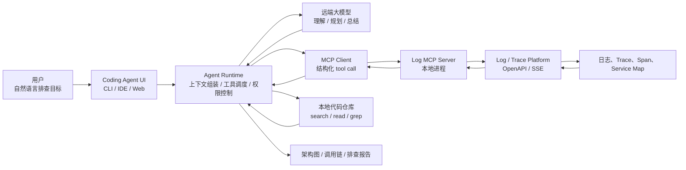
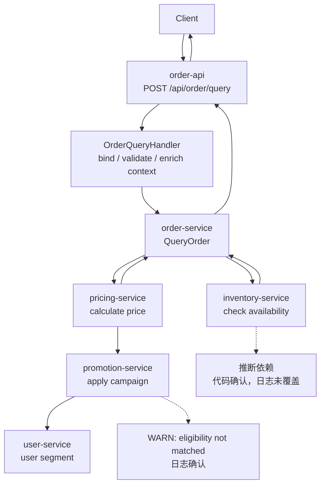

# 第12章 AI Coding Agent 系统解析：从 Vibe Coding、Spec Coding 到可复现原型

> AI Coding Agent 的本质，不是“自动写代码”，而是把软件工程任务转化为可规划、可执行、可验证、可回滚的工程闭环。

## 引言

前两部分讨论了大模型基础、Prompt、Context、Harness，以及 Agent 的工具、RAG、Memory、Eval、Guardrails 和可观测性。本章开始进入成熟系统解析。

我们选择 AI Coding Agent 作为第一个成熟系统案例，因为它几乎包含了 Agent 工程的全部核心问题：

- 需要理解自然语言需求；
- 需要读取大型代码库上下文；
- 需要规划多步修改；
- 需要调用文件、Shell、Git、测试等工具；
- 需要处理失败、回滚和权限；
- 需要把人的意图转化为可审查的代码变更。

Claude Code、Cursor 和 Codex 的产品形态不同：一个偏终端，一个偏 IDE，一个偏云端任务执行。但从系统设计视角看，它们都在回答同一个问题：

> 如何让不确定的大模型可靠地参与确定性的软件工程流程？

本章的目标不只是比较产品，而是让你读完之后可以复现一个最小 Coding Agent 原型。这个原型不追求“像商业产品一样强”，但必须具备真实 Coding Agent 的关键骨架：

- 能读取项目上下文；
- 能选择和调用工具；
- 能修改文件；
- 能运行验证命令；
- 能输出 diff、总结和失败原因；
- 能通过权限、预算和审计降低风险。

---

## 12.1 AI 编程范式演进：从补全到 Agent

AI 编程工具大致经历了四个阶段。

```text
代码补全
   │
   ▼
对话式代码生成
   │
   ▼
项目级上下文编程
   │
   ▼
Coding Agent 闭环执行
```

### 阶段一：代码补全

代码补全工具把模型放在编辑器里，主要能力是根据当前文件上下文预测下一段代码。

它的优势是低延迟、低风险、低学习成本；局限是只能处理局部代码，无法理解完整任务。

### 阶段二：对话式代码生成

ChatGPT 类工具让开发者可以用自然语言描述需求，再复制代码片段到项目中。

这一步的变化是：模型开始参与“设计解释”和“调试建议”，但仍然缺少项目级上下文和自动验证。

### 阶段三：项目级上下文编程

Cursor 这类 IDE 原生工具把代码库、文件搜索、规则文件、编辑器状态整合进模型上下文。

这一步的变化是：模型不再只看一个文件，而是可以跨文件理解调用链和项目规范。

### 阶段四：Coding Agent 闭环执行

Claude Code、Codex 这类工具进一步把模型接入工具系统：

- 搜索代码；
- 修改文件；
- 执行测试；
- 查看失败输出；
- 再次修复；
- 生成 diff 或 PR。

这时模型不再只是“建议者”，而是进入了一个由工具、权限、状态、验证、审计组成的执行环境。

---

## 12.2 Vibe Coding：探索式编程的价值与天花板

**Vibe Coding** 是指通过即兴 prompt 和多轮对话与 AI 共同摸索代码实现的方式。

它不是坏方法。恰恰相反，在探索阶段它非常有效：

- 快速了解新框架；
- 验证一个技术方案是否可行；
- 写一次性脚本；
- 做原型和 Demo；
- 让模型解释陌生代码。

问题在于：Vibe Coding 容易被误用为生产交付方式。

### 典型问题

```text
你：实现一个用户注册功能
模型：生成基础代码

你：加邮箱验证
模型：补一段逻辑

你：密码要加密
模型：继续修改

你：还要防重复注册
模型：再改一轮

你：补测试
模型：补测试，但测试只覆盖快乐路径
```

几轮之后，代码可能“看起来能跑”，但常见问题会积累：

- 需求边界不清晰；
- 错误处理不完整；
- 安全约束靠后补；
- 测试覆盖滞后；
- 结构随着对话漂移；
- 模型为了满足最新指令破坏早期约束。

Vibe Coding 的本质是**探索工具**，不是**交付协议**。

---

## 12.3 Spec Coding：Coding Agent 的工作协议

Spec Coding 的核心思想是：**先把意图写成规范，再让 Agent 执行。**

```text
Intent
  │
  ▼
Spec
  │
  ▼
Plan
  │
  ▼
Implementation
  │
  ▼
Verification
```

这不是为了“写更多文档”，而是为了把人的隐性判断显式化，让模型有一个稳定的任务协议。

### 一个高质量 Spec 至少回答八个问题

1. 做什么？
2. 输入是什么？
3. 输出是什么？
4. 业务规则是什么？
5. 失败模式有哪些？
6. 安全要求是什么？
7. 性能和并发要求是什么？
8. 什么测试能证明它工作？

对 Coding Agent 来说，Spec 不是文档资产，而是**任务接口**。它相当于传统系统里的 API Contract：输入、输出、约束、错误、验收标准都必须清楚。

### Spec 为什么适合 Coding Agent

Coding Agent 有三个特点：

- 能读大量上下文，但容易被无关内容稀释；
- 能做多步任务，但容易在中途偏航；
- 能调用工具，但工具调用必须受约束。

Spec 正好补上这些缺口：

- 给 Agent 一个稳定目标；
- 给计划提供验收标准；
- 给测试提供依据；
- 给人工 review 提供对照物；
- 给失败复盘提供事实基线。

### Spec 不是瀑布

Spec Coding 不要求一开始写出完美方案。更健康的流程是：

```text
Vibe 探索 → 提炼 Spec → Agent 执行 → 验证反馈 → 修订 Spec
```

探索阶段允许混沌，交付阶段需要约束。

---

## 12.4 从成熟产品抽象出通用架构

成熟 Coding Agent 通常包含八个核心模块。

```text
┌──────────────────────────────────────────────────────────────┐
│                    Coding Agent Runtime                       │
├──────────────────────────────────────────────────────────────┤
│                                                              │
│  User Intent / Issue / Spec                                   │
│      │                                                        │
│      ▼                                                        │
│  Task Planner                                                 │
│      │                                                        │
│      ▼                                                        │
│  Context Builder ─────► Code Index / Git / Docs / Rules       │
│      │                                                        │
│      ▼                                                        │
│  Tool Registry ───────► read/search/edit/shell/git/test       │
│      │                                                        │
│      ▼                                                        │
│  Policy Engine ───────► allow / deny / ask / sandbox          │
│      │                                                        │
│      ▼                                                        │
│  Agent Loop ──────────► think / act / observe / repair        │
│      │                                                        │
│      ▼                                                        │
│  Verifier ────────────► test / lint / typecheck / diff        │
│      │                                                        │
│      ▼                                                        │
│  Review Surface ──────► patch / PR / explanation / trace      │
│                                                              │
└──────────────────────────────────────────────────────────────┘
```

| 模块 | 职责 | 最小原型怎么做 | 关键风险 |
|:---|:---|:---|:---|
| Task Planner | 把需求拆成步骤 | 让模型输出 JSON plan | 计划过粗、遗漏验证 |
| Context Builder | 找到相关代码和规则 | repo map + search + read_file | 上下文过多或漏掉关键文件 |
| Tool Registry | 暴露可调用能力 | Python 函数注册表 | 工具语义模糊 |
| Policy Engine | 管控危险动作 | allowlist + path sandbox | 越权、破坏用户改动 |
| Agent Loop | 驱动多轮执行 | while step < max_steps | 死循环、偏航 |
| Verifier | 运行检查 | pytest/lint/build 命令 | 只验证快乐路径 |
| Review Surface | 展示变更 | git diff + summary | 解释和实际变更不一致 |
| Eval Loop | 复盘失败样本 | 保存 trace 和失败任务 | 没有持续改进闭环 |

如果只看表面，Coding Agent 像是“LLM + 工具调用”。但真正的工程难点在工具调用之外：

- 上下文怎么选；
- 工具能做什么、不能做什么；
- 修改前如何知道文件没有被用户改动；
- 测试失败后如何把错误反馈给模型；
- 任务失败时如何保留证据；
- 最后如何让人相信这个 diff 可以 review。

---

## 12.5 Claude Code、Cursor、Codex 的架构取舍

### Claude Code：终端原生 Runtime

Claude Code 的核心选择是：**把 Agent 放在终端里，而不是只放在 IDE 里。**

这带来几个工程优势：

- 终端天然连接项目中的真实工具链；
- 可以执行测试、构建、脚本、Git 命令；
- 不绑定特定 IDE；
- 适合远程开发和自动化工作流；
- 容易与 MCP、Hooks、Subagents 等扩展机制组合。

Claude Code 的典型循环可以概括为 TAOR：

```text
Think
  │  分析需求、上下文和约束
  ▼
Act
  │  调用文件、搜索、编辑、Shell、Git 等工具
  ▼
Observe
  │  读取工具结果、测试输出、错误信息
  ▼
Repeat
     未完成则继续，完成则给出总结和 diff
```

`CLAUDE.md` 的价值不是保存模型记忆，而是把项目约束变成每次任务都会读取的上下文。它适合写项目结构、构建命令、测试命令、不可触碰的目录、发布前检查、过去犯过的错误。

Hooks 则把“确定性约束”插进 Agent Runtime。例如编辑前检查路径，Shell 执行前拦截危险命令，测试结束后自动收集日志。Subagents 则把复杂任务拆给专门角色，例如 reviewer、test runner、debugger。

### Cursor：IDE 原生 Context Control Plane

Cursor 的核心选择是：**把 Agent 放在开发者正在编辑代码的界面里。**

它的优势在于：

- 与编辑器 selection、文件树、诊断信息天然结合；
- 适合局部修改和交互式重构；
- 对 UI、前端、局部调用链修改体验更顺；
- 规则系统能为不同目录提供 scoped instruction。

Cursor 的 Rules 用来控制 Agent 和 Inline Edit 的行为。Project Rules 存放在 `.cursor/rules`，适合进入版本控制；User Rules 则表达个人偏好。

从架构上看，Rules 是一种轻量级 Context Control Plane：

```text
User Request
  │
  ├─ Active File / Selection
  ├─ Project Rules
  ├─ User Rules
  ├─ Retrieved Code Context
  ▼
Model / Agent
```

IDE Agent 很适合“人和模型共同编辑”，但对长时间后台任务、独立沙箱、跨仓库并行任务并不一定是最优形态。

### Codex：云端任务型 Sandbox

Codex 的核心选择是：**把软件工程任务放进云端沙箱里执行。**

这种形态适合：

- 修复明确 bug；
- 实现小到中等规模功能；
- 批量处理 issue；
- 生成 PR；
- 并行探索多个方案。

云端任务型 Agent 的关键不是“模型更强”，而是执行环境不同：

```text
Issue / Task
  │
  ▼
Cloud Sandbox
  ├─ Repository Checkout
  ├─ Dependency Setup
  ├─ Code Edit
  ├─ Test / Lint
  ├─ Commit / Patch
  └─ PR Proposal
```

它把每个任务放在独立环境中，降低了污染本地工作区的风险，也更适合并行。代价是环境初始化成本更高、私有依赖和内网服务接入更复杂、权限和数据边界更敏感。

### 三类 Coding Agent 的架构对比

| 维度 | Claude Code | Cursor | Codex |
|:---|:---|:---|:---|
| 核心界面 | 终端 | IDE | 云端任务 |
| 最强场景 | 端到端任务、脚本、测试、Git | 交互式编辑、局部重构、前端开发 | 并行 issue、PR 生成、后台任务 |
| 上下文来源 | 文件系统、命令、规则、MCP | 编辑器、选区、代码索引、Rules | 仓库快照、任务描述、沙箱结果 |
| 执行环境 | 本地/远程终端 | 本地 IDE | 云端沙箱 |
| 风险重点 | Shell 和文件权限 | 错误上下文和误编辑 | 数据边界和环境复现 |
| 质量保障 | 测试、hooks、人工确认 | 编辑器诊断、diff review | 沙箱测试、PR review |

一个成熟团队不一定只选择一种形态。更现实的组合是：

- Cursor 负责高频交互式开发；
- Claude Code 负责终端原生任务和本地自动化；
- Codex 负责并行 issue 和云端 PR 任务；
- 统一用 Spec、测试、代码审查和 CI 把它们约束到同一工程标准。

---

## 12.6 一个可复现 Coding Agent MVP 的目标

为了避免一上来就被商业产品复杂度压垮，我们先定义一个最小可用原型。

这个 MVP 只处理单仓库、单任务、单 Agent 的代码修改场景。

### MVP 能做什么

```text
输入：
  一段任务说明，例如“给 calculator.py 的 divide 函数补充除零错误处理，并添加测试”

输出：
  1. 修改过的文件
  2. 运行过的验证命令
  3. git diff
  4. Agent 执行摘要
  5. 失败时的原因和下一步建议
```

### MVP 不做什么

- 不做多 Agent 协作；
- 不做长期记忆；
- 不做跨仓库任务；
- 不自动推送远程分支；
- 不自动发布；
- 不直接执行任意 Shell 命令；
- 不保证能修复所有复杂 bug。

这很重要。一个好的原型不是功能越多越好，而是边界清楚、主链路完整、失败可解释。

### 最小闭环

```text
Task
  │
  ▼
Load Rules
  │
  ▼
Build Context
  │
  ▼
Plan
  │
  ▼
Tool Loop
  │
  ├─ read/search
  ├─ edit
  └─ run verification
  │
  ▼
Review Diff
  │
  ▼
Final Report
```

如果你只能实现一个版本，优先实现这个闭环，而不是优先追求花哨的 UI。

---

## 12.7 原型目录结构

推荐用下面的目录开始：

```text
mini-coding-agent/
├── agent.py          # Agent Loop
├── context.py        # 上下文构建
├── llm.py            # LLM 适配器
├── models.py         # 数据结构
├── policy.py         # 权限策略
├── tools.py          # 工具实现
├── run.py            # CLI 入口
├── AGENT.md          # 项目规则
└── traces/           # 每次执行的 trace
```

这里故意不引入复杂框架。早期原型最需要的是把边界写清楚：

- LLM 只负责决策，不直接操作文件系统；
- Tool Runtime 只执行注册过的工具；
- Policy Engine 决定工具能不能执行；
- Context Builder 决定模型看什么；
- Agent Loop 负责把观察结果继续喂给模型；
- Verifier 决定任务有没有证据证明完成。

---

## 12.8 核心数据结构

原型可以从四个数据结构开始。

```python
# models.py
from dataclasses import dataclass, field
from typing import Any, Literal


@dataclass
class ToolCall:
    name: str
    args: dict[str, Any]


@dataclass
class ToolResult:
    ok: bool
    content: str
    error: str = ""


@dataclass
class AgentStep:
    thought: str
    tool_call: ToolCall | None = None
    tool_result: ToolResult | None = None


@dataclass
class AgentState:
    task: str
    repo_root: str
    messages: list[dict[str, str]] = field(default_factory=list)
    steps: list[AgentStep] = field(default_factory=list)
    changed_files: set[str] = field(default_factory=set)
    status: Literal["running", "done", "failed"] = "running"
```

这四个结构背后的设计原则是：**Agent 的每一步都必须可追踪。**

不要只保存最后的回答。真正排查问题时，你需要知道：

- 模型当时看到了什么上下文；
- 它为什么选择某个工具；
- 工具输入是什么；
- 工具输出是什么；
- 哪一步开始偏离任务；
- 最终 diff 是如何产生的。

---

## 12.9 Context Builder：让模型看到正确的代码

Coding Agent 的效果很大程度取决于上下文。上下文不是越多越好，而是要回答三个问题：

1. 这个任务可能涉及哪些文件？
2. 这些文件里哪些片段最相关？
3. 哪些项目规则必须始终注入？

### 最小实现

```python
# context.py
from pathlib import Path

IGNORE_DIRS = {
    ".git",
    "__pycache__",
    ".venv",
    "node_modules",
    "dist",
    "build",
    "public",
    "book",
}


def load_rules(repo_root: Path) -> str:
    for name in ["AGENT.md", "CLAUDE.md", ".cursorrules"]:
        path = repo_root / name
        if path.exists():
            return path.read_text(encoding="utf-8")[:4000]
    return ""


def build_repo_map(repo_root: Path, limit: int = 300) -> str:
    files: list[str] = []
    for path in repo_root.rglob("*"):
        if path.is_dir():
            continue
        if any(part in IGNORE_DIRS for part in path.parts):
            continue
        if path.suffix in {".py", ".js", ".ts", ".go", ".java", ".md", ".yaml", ".yml"}:
            files.append(str(path.relative_to(repo_root)))
        if len(files) >= limit:
            break
    return "\n".join(files)
```

### 上下文分层

实际系统里，建议把上下文分成四层：

| 层级 | 内容 | 是否每轮注入 |
|:---|:---|:---|
| System Contract | Agent 行为规范、输出格式、工具协议 | 是 |
| Project Rules | 构建命令、代码风格、禁区目录 | 是 |
| Task Context | 用户需求、验收标准、当前计划 | 是 |
| Retrieved Context | 搜索到的文件片段、测试输出、diff | 按需 |

最容易犯的错误是把整个仓库塞进 prompt。这样会产生两个问题：

- 关键文件被无关内容稀释；
- 模型以为自己“知道项目”，但实际上没有聚焦任务。

更可靠的方法是：先给 repo map，再让模型主动 search/read。

---

## 12.10 Tool Runtime：工具不是函数，而是能力边界

最小 Coding Agent 至少需要六类工具。

| 工具 | 作用 | 默认权限 |
|:---|:---|:---|
| `list_files` | 查看仓库文件 | 自动允许 |
| `read_file` | 读取文件片段 | 自动允许 |
| `search_code` | 搜索代码 | 自动允许 |
| `replace_in_file` | 精确替换文本 | 需要路径校验 |
| `run_shell` | 执行验证命令 | 只允许白名单 |
| `git_diff` | 查看变更 | 自动允许 |

### 路径沙箱

第一条规则：工具只能访问 repo root 内的文件。

```python
# tools.py
from pathlib import Path


class Workspace:
    def __init__(self, root: str):
        self.root = Path(root).resolve()

    def resolve(self, relative_path: str) -> Path:
        path = (self.root / relative_path).resolve()
        if not str(path).startswith(str(self.root)):
            raise ValueError(f"path escapes workspace: {relative_path}")
        if any(part in {".git", "node_modules", ".venv"} for part in path.parts):
            raise ValueError(f"path is forbidden: {relative_path}")
        return path
```

不要让模型直接传绝对路径。所有文件路径都应该是 repo root 下的相对路径。

### 读工具

```python
# tools.py
import fnmatch
from models import ToolResult


def list_files(ws: Workspace, pattern: str = "*") -> ToolResult:
    matched: list[str] = []
    for path in ws.root.rglob("*"):
        if path.is_dir():
            continue
        rel = str(path.relative_to(ws.root))
        if any(part in {".git", "node_modules", ".venv", "__pycache__"} for part in path.parts):
            continue
        if fnmatch.fnmatch(rel, pattern):
            matched.append(rel)
    return ToolResult(True, "\n".join(matched[:500]))


def read_file(ws: Workspace, path: str, start: int = 1, limit: int = 200) -> ToolResult:
    file_path = ws.resolve(path)
    lines = file_path.read_text(encoding="utf-8").splitlines()
    begin = max(start - 1, 0)
    end = min(begin + limit, len(lines))
    body = "\n".join(f"{idx + 1}: {line}" for idx, line in enumerate(lines[begin:end], begin))
    return ToolResult(True, body)
```

### 搜索工具

```python
# tools.py
def search_code(ws: Workspace, query: str, pattern: str = "*") -> ToolResult:
    results: list[str] = []
    for path in ws.root.rglob("*"):
        if path.is_dir():
            continue
        rel = str(path.relative_to(ws.root))
        if not fnmatch.fnmatch(rel, pattern):
            continue
        if any(part in {".git", "node_modules", ".venv", "__pycache__"} for part in path.parts):
            continue
        try:
            lines = path.read_text(encoding="utf-8").splitlines()
        except UnicodeDecodeError:
            continue
        for idx, line in enumerate(lines, 1):
            if query.lower() in line.lower():
                results.append(f"{rel}:{idx}: {line}")
                if len(results) >= 100:
                    return ToolResult(True, "\n".join(results))
    return ToolResult(True, "\n".join(results) if results else "no matches")
```

生产系统可以用 `ripgrep`、AST 索引、Language Server、embedding 检索来增强搜索。但原型阶段，字符串搜索足够完成闭环。

### 编辑工具

不要一开始就实现“任意写文件”。更安全的方式是提供精确替换：

```python
# tools.py
def replace_in_file(ws: Workspace, path: str, old: str, new: str) -> ToolResult:
    file_path = ws.resolve(path)
    text = file_path.read_text(encoding="utf-8")
    if old not in text:
        return ToolResult(False, "", "old text not found; read the file again before editing")
    updated = text.replace(old, new, 1)
    file_path.write_text(updated, encoding="utf-8")
    return ToolResult(True, f"updated {path}")
```

为什么不用 `write_file`？

因为 `write_file` 容易让模型重写整个文件，破坏格式、注释和用户未提交修改。`replace_in_file` 迫使模型先读取文件，再基于精确片段做局部修改。

如果需要新增文件，可以单独实现 `create_file`，并要求目标文件不存在：

```python
# tools.py
def create_file(ws: Workspace, path: str, content: str) -> ToolResult:
    file_path = ws.resolve(path)
    if file_path.exists():
        return ToolResult(False, "", "file already exists; use replace_in_file")
    file_path.parent.mkdir(parents=True, exist_ok=True)
    file_path.write_text(content, encoding="utf-8")
    return ToolResult(True, f"created {path}")
```

### Shell 工具

Shell 是 Coding Agent 最危险也最有价值的工具。原型阶段只允许验证类命令。

```python
# tools.py
import shlex
import subprocess

ALLOWED_COMMANDS = {
    "pytest",
    "python",
    "ruff",
    "mypy",
    "npm",
    "pnpm",
    "make",
    "go",
}

DENY_TOKENS = {
    "rm",
    "sudo",
    "curl",
    "wget",
    "ssh",
    "scp",
    "chmod",
    "chown",
    "git",
}


def run_shell(ws: Workspace, command: str, timeout: int = 30) -> ToolResult:
    parts = shlex.split(command)
    if not parts:
        return ToolResult(False, "", "empty command")
    if parts[0] not in ALLOWED_COMMANDS:
        return ToolResult(False, "", f"command not allowed: {parts[0]}")
    if any(token in DENY_TOKENS for token in parts):
        return ToolResult(False, "", f"dangerous token found in command: {command}")

    proc = subprocess.run(
        parts,
        cwd=ws.root,
        text=True,
        capture_output=True,
        timeout=timeout,
    )
    output = (proc.stdout + "\n" + proc.stderr).strip()
    return ToolResult(proc.returncode == 0, output[:12000], f"exit code {proc.returncode}" if proc.returncode else "")
```

这里有一个刻意的取舍：原型不允许 `git` 写操作，只提供 `git_diff` 读操作。

```python
# tools.py
def git_diff(ws: Workspace) -> ToolResult:
    proc = subprocess.run(
        ["git", "diff", "--"],
        cwd=ws.root,
        text=True,
        capture_output=True,
        timeout=20,
    )
    return ToolResult(proc.returncode == 0, proc.stdout[:20000], proc.stderr)
```

---

## 12.11 Policy Engine：把安全规则从 Prompt 里拿出来

只在 Prompt 里告诉模型“不要做危险操作”是不够的。模型可能忘记，也可能在复杂上下文里误判。

更可靠的做法是：把安全规则写成确定性代码。

```python
# policy.py
from models import ToolCall


READ_ONLY_TOOLS = {"list_files", "read_file", "search_code", "git_diff"}
WRITE_TOOLS = {"replace_in_file", "create_file"}
SHELL_TOOLS = {"run_shell"}


class Policy:
    def __init__(self, auto_edit: bool = True, auto_shell: bool = False):
        self.auto_edit = auto_edit
        self.auto_shell = auto_shell

    def decide(self, call: ToolCall) -> str:
        if call.name in READ_ONLY_TOOLS:
            return "allow"
        if call.name in WRITE_TOOLS:
            return "allow" if self.auto_edit else "ask"
        if call.name in SHELL_TOOLS:
            return "allow" if self.auto_shell else "ask"
        return "deny"
```

商业产品里的权限系统更复杂，通常还会包含：

- 路径级权限；
- 命令级权限；
- 网络访问权限；
- secret 访问权限；
- MCP server 权限；
- 单次会话权限；
- 项目级默认权限；
- 企业审计策略。

但最小原型里，只要先做到 `allow / deny / ask`，就已经比“让模型自由发挥”可靠很多。

---

## 12.12 LLM 输出协议：不要让模型随意说话

Agent Loop 最怕模型输出一大段自然语言，然后 Runtime 不知道该执行什么。最小方案是要求模型每轮输出 JSON。

```json
{
  "thought": "我需要先搜索 divide 函数在哪里。",
  "action": {
    "name": "search_code",
    "args": {
      "query": "def divide",
      "pattern": "*.py"
    }
  }
}
```

任务完成时输出：

```json
{
  "thought": "实现和测试都完成了。",
  "final": {
    "summary": "为 divide 增加了除零检查，并补充了测试。",
    "verification": "pytest 通过",
    "changed_files": ["calculator.py", "test_calculator.py"]
  }
}
```

系统提示词可以这样设计：

```text
You are a coding agent working inside a repository.

You can only act by returning JSON.

Available tools:
- list_files(pattern)
- read_file(path, start, limit)
- search_code(query, pattern)
- replace_in_file(path, old, new)
- create_file(path, content)
- run_shell(command, timeout)
- git_diff()

Rules:
1. Read files before editing them.
2. Prefer replace_in_file over rewriting full files.
3. Run verification after edits.
4. If a tool fails, inspect the error and repair.
5. Finish only when you have evidence.

Return exactly one JSON object:
- For tool use: {"thought": "...", "action": {"name": "...", "args": {...}}}
- For final answer: {"thought": "...", "final": {"summary": "...", "verification": "...", "changed_files": [...]}}
```

这个协议的价值是把模型输出变成 Runtime 可解析的结构。真实系统可以使用模型原生 tool calling；原型阶段用 JSON 协议就能复现核心思想。

---

## 12.13 Agent Loop：Coding Agent 的心脏

Agent Loop 不复杂，但它决定了系统是否可靠。

```text
while not done:
    prompt = system + rules + task + context + observations
    response = llm(prompt)
    if response.action:
        policy check
        execute tool
        append observation
    if response.final:
        verify diff and report
```

最小实现如下：

```python
# agent.py
import json
from pathlib import Path

from context import build_repo_map, load_rules
from policy import Policy
from tools import Workspace, create_file, git_diff, list_files, read_file, replace_in_file, run_shell, search_code
from models import AgentState, AgentStep, ToolCall, ToolResult


TOOL_REGISTRY = {
    "list_files": list_files,
    "read_file": read_file,
    "search_code": search_code,
    "replace_in_file": replace_in_file,
    "create_file": create_file,
    "run_shell": run_shell,
    "git_diff": git_diff,
}


SYSTEM_PROMPT = """You are a coding agent working inside a repository.
Return exactly one JSON object.
Use tools to inspect, edit, verify, and review.
Do not claim success without verification evidence.
"""


def build_prompt(state: AgentState, repo_root: Path) -> str:
    rules = load_rules(repo_root)
    repo_map = build_repo_map(repo_root)
    observations = []
    for step in state.steps[-8:]:
        observations.append(f"thought: {step.thought}")
        if step.tool_call:
            observations.append(f"tool_call: {step.tool_call.name} {step.tool_call.args}")
        if step.tool_result:
            observations.append(
                f"tool_result: ok={step.tool_result.ok}\n{step.tool_result.content}\n{step.tool_result.error}"
            )

    return f"""
{SYSTEM_PROMPT}

Project rules:
{rules}

Repository map:
{repo_map}

Task:
{state.task}

Recent observations:
{chr(10).join(observations)}

Available tools:
- list_files(pattern)
- read_file(path, start, limit)
- search_code(query, pattern)
- replace_in_file(path, old, new)
- create_file(path, content)
- run_shell(command, timeout)
- git_diff()

Return JSON:
Tool: {{"thought":"...","action":{{"name":"read_file","args":{{"path":"..."}}}}}}
Final: {{"thought":"...","final":{{"summary":"...","verification":"...","changed_files":["..."]}}}}
"""


def parse_model_output(text: str) -> dict:
    try:
        return json.loads(text)
    except json.JSONDecodeError as exc:
        return {
            "thought": "model returned invalid JSON",
            "error": str(exc),
        }


def execute_tool(ws: Workspace, call: ToolCall) -> ToolResult:
    tool = TOOL_REGISTRY.get(call.name)
    if not tool:
        return ToolResult(False, "", f"unknown tool: {call.name}")
    return tool(ws, **call.args)


def run_agent(task: str, repo_root: str, llm, max_steps: int = 20) -> AgentState:
    ws = Workspace(repo_root)
    policy = Policy(auto_edit=True, auto_shell=True)
    state = AgentState(task=task, repo_root=repo_root)

    for _ in range(max_steps):
        prompt = build_prompt(state, Path(repo_root))
        raw = llm.complete(prompt)
        data = parse_model_output(raw)

        if "final" in data:
            state.status = "done"
            state.steps.append(AgentStep(thought=data.get("thought", "done")))
            return state

        if "action" not in data:
            state.steps.append(
                AgentStep(
                    thought=data.get("thought", "invalid model response"),
                    tool_result=ToolResult(False, raw, "missing action or final"),
                )
            )
            continue

        action = data["action"]
        call = ToolCall(name=action["name"], args=action.get("args", {}))
        decision = policy.decide(call)
        if decision == "deny":
            result = ToolResult(False, "", f"policy denied tool: {call.name}")
        elif decision == "ask":
            result = ToolResult(False, "", f"tool requires approval: {call.name}")
        else:
            result = execute_tool(ws, call)

        if call.name in {"replace_in_file", "create_file"} and result.ok:
            path = call.args.get("path")
            if path:
                state.changed_files.add(path)

        state.steps.append(
            AgentStep(
                thought=data.get("thought", ""),
                tool_call=call,
                tool_result=result,
            )
        )

    state.status = "failed"
    state.steps.append(AgentStep(thought="max steps reached"))
    return state
```

这段代码已经包含 Coding Agent 的关键机制：

- 每轮构造上下文；
- 模型输出结构化动作；
- Runtime 做权限判断；
- 工具执行后把观察结果写回状态；
- 循环直到 final 或超过步数。

真实系统会更复杂，但主干就是这个。

---

## 12.14 LLM 适配器：把模型隔离在边界之外

不要让全系统依赖某个模型厂商的 SDK。建议定义一个很窄的接口。

```python
# llm.py
from typing import Protocol


class LLMClient(Protocol):
    def complete(self, prompt: str) -> str:
        ...
```

本地调试时，可以先写一个假模型来跑通工具链：

```python
# llm.py
class FakeLLM:
    def __init__(self, responses: list[str]):
        self.responses = responses
        self.index = 0

    def complete(self, prompt: str) -> str:
        if self.index >= len(self.responses):
            return '{"thought":"no more responses","final":{"summary":"stopped","verification":"none","changed_files":[]}}'
        value = self.responses[self.index]
        self.index += 1
        return value
```

接真实模型时，只需要实现同一个接口：

```python
# llm.py
import os
from openai import OpenAI


class OpenAICompatibleLLM:
    def __init__(self, model: str):
        self.client = OpenAI(api_key=os.environ["OPENAI_API_KEY"])
        self.model = model

    def complete(self, prompt: str) -> str:
        response = self.client.chat.completions.create(
            model=self.model,
            messages=[{"role": "user", "content": prompt}],
            temperature=0,
        )
        return response.choices[0].message.content
```

如果你使用支持原生 tool calling 的模型，可以把 JSON 协议替换成模型原生工具调用；但建议保留 Tool Registry、Policy Engine、Trace、Verifier 这些 Runtime 抽象。

---

## 12.15 CLI 入口：让原型真正跑起来

```python
# run.py
import argparse
import os

from agent import run_agent
from llm import OpenAICompatibleLLM
from tools import Workspace, git_diff


def main() -> None:
    parser = argparse.ArgumentParser()
    parser.add_argument("task")
    parser.add_argument("--repo", default=".")
    parser.add_argument("--model", default=os.environ.get("CODING_AGENT_MODEL", "your-model-name"))
    args = parser.parse_args()

    if args.model == "your-model-name":
        raise SystemExit("set --model or CODING_AGENT_MODEL")

    llm = OpenAICompatibleLLM(args.model)
    state = run_agent(args.task, args.repo, llm)

    print(f"status: {state.status}")
    print(f"changed_files: {sorted(state.changed_files)}")

    for idx, step in enumerate(state.steps, 1):
        print(f"\n--- step {idx} ---")
        print(step.thought)
        if step.tool_call:
            print(f"tool: {step.tool_call.name} {step.tool_call.args}")
        if step.tool_result:
            print(f"ok: {step.tool_result.ok}")
            print(step.tool_result.content[:2000])
            if step.tool_result.error:
                print(f"error: {step.tool_result.error}")

    diff = git_diff(Workspace(args.repo))
    print("\n--- git diff ---")
    print(diff.content)


if __name__ == "__main__":
    main()
```

运行方式：

```bash
export OPENAI_API_KEY=...
export CODING_AGENT_MODEL=...
python run.py "给 calculator.py 的 divide 函数补充除零错误处理，并添加 pytest 测试" --repo ./demo
```

这个 CLI 很朴素，但已经可以支撑真实实验：

- 给一个小仓库；
- 让 Agent 搜索代码；
- 让 Agent 修改文件；
- 让 Agent 运行测试；
- 查看 diff；
- 根据 trace 分析失败。

### 用一个 demo 仓库跑通

建议先用一个极小仓库验证主链路，而不是直接拿生产仓库实验。

```text
demo/
├── calculator.py
└── test_calculator.py
```

`calculator.py`：

```python
def divide(a: int, b: int) -> float:
    return a / b
```

`test_calculator.py`：

```python
from calculator import divide


def test_divide():
    assert divide(6, 3) == 2
```

给 Agent 的任务：

```text
给 calculator.py 的 divide 函数补充除零错误处理，并添加 pytest 测试。
要求：
1. b 为 0 时抛出 ValueError；
2. 保留原有正常除法行为；
3. 运行 pytest 验证。
```

预期过程应该是：

```text
1. search_code("def divide")
2. read_file("calculator.py")
3. read_file("test_calculator.py")
4. replace_in_file("calculator.py", old, new)
5. replace_in_file("test_calculator.py", old, new)
6. run_shell("pytest")
7. git_diff()
8. final report
```

如果 Agent 一开始就调用 `replace_in_file`，说明 System Prompt 约束不够；如果它不运行测试就 final，说明完成条件不够硬；如果它试图执行不在白名单里的命令，说明 Policy Engine 生效了。

---

## 12.16 Verifier：没有验证就没有完成

Coding Agent 的 final answer 不应该由模型自己决定，而应该由验证证据支撑。

最小 Verifier 可以做三件事：

1. 运行用户或项目规则指定的测试命令；
2. 检查 `git diff` 是否为空；
3. 检查模型是否报告了验证结果。

```python
# verifier.py
from tools import Workspace, git_diff, run_shell


def verify(ws: Workspace, commands: list[str]) -> tuple[bool, str]:
    outputs: list[str] = []
    for command in commands:
        result = run_shell(ws, command, timeout=60)
        outputs.append(f"$ {command}\n{result.content}\n{result.error}")
        if not result.ok:
            return False, "\n\n".join(outputs)

    diff = git_diff(ws)
    if not diff.content.strip():
        return False, "no code changes detected"

    return True, "\n\n".join(outputs)
```

更进一步，可以把 Verifier 分成三层：

| 层级 | 例子 | 作用 |
|:---|:---|:---|
| Syntax | format、lint、typecheck | 快速发现低级错误 |
| Behavior | unit test、integration test | 证明功能行为 |
| Review | diff summary、risk note | 帮助人类审查 |

Agent 最终报告应该包含：

- 修改了哪些文件；
- 为什么这么改；
- 运行了哪些验证；
- 验证是否通过；
- 剩余风险是什么；
- 如果失败，下一步该查什么。

---

## 12.17 Trace：让每次执行都可复盘

没有 trace 的 Coding Agent 很难调试。最小 trace 可以保存为 JSONL。

```python
# trace.py
import json
from dataclasses import asdict
from pathlib import Path

from models import AgentStep


class TraceWriter:
    def __init__(self, path: str):
        self.path = Path(path)
        self.path.parent.mkdir(parents=True, exist_ok=True)

    def write_step(self, step: AgentStep) -> None:
        with self.path.open("a", encoding="utf-8") as f:
            f.write(json.dumps(asdict(step), ensure_ascii=False) + "\n")
```

Trace 至少要回答：

- 用户任务是什么；
- 每轮 prompt 的摘要是什么；
- 模型输出了什么；
- 调用了什么工具；
- 工具返回什么；
- 哪些文件发生变化；
- 验证命令是什么；
- 最终状态是成功还是失败。

有了 trace，后续才能做 eval：

```text
失败任务
  │
  ├─ 上下文不足？补 Context Builder
  ├─ 工具不够？补 Tool
  ├─ 权限太大？补 Policy
  ├─ 测试缺失？补 Verifier
  └─ Prompt 漂移？补 System Contract
```

---

## 12.18 从 MVP 到生产系统的演进路线

实现出最小原型后，不要立刻堆功能。建议按风险顺序演进。

### 第一阶段：Read-only Agent

只允许 `list_files`、`read_file`、`search_code`、`git_diff`。

目标是让 Agent 能回答：

- 这个需求可能涉及哪些文件；
- 当前代码是怎么工作的；
- 应该怎么改；
- 需要哪些测试。

Read-only Agent 是最安全的第一步，适合接入真实大仓库。

### 第二阶段：Patch Agent

开放 `replace_in_file` 和 `create_file`，但不开放任意 shell。

目标是让 Agent 能生成小范围 patch，并由人运行测试。

这一阶段要重点做：

- path sandbox；
- old text 精确匹配；
- diff 输出；
- 人工确认。

### 第三阶段：Verified Agent

开放测试类 Shell 命令。

目标是让 Agent 能自己形成“修改 -> 测试 -> 修复”的闭环。

这一阶段要重点做：

- command allowlist；
- timeout；
- 输出截断；
- flaky test 处理；
- 失败重试预算。

### 第四阶段：Workflow Agent

加入计划、任务状态和多步骤工作流。

目标是支持更长的任务，例如：

- 重构一个模块；
- 迁移一个 API；
- 增加一组测试；
- 修复一类 lint 问题。

这一阶段要重点做：

- plan step 状态；
- 每步验收标准；
- 中途汇报；
- 可暂停和恢复。

### 第五阶段：Team Agent

加入 subagent、reviewer、eval、CI 集成。

目标是让 Agent 进入团队工程流程，而不是只服务个人本地实验。

这一阶段要重点做：

- reviewer agent；
- test runner agent；
- 失败样本库；
- 代码审查模板；
- PR bot；
- 企业权限审计。

---

## 12.19 设计自己的 Coding Agent 工作流

### 1. 把 Spec 当成任务接口

不要直接把复杂需求丢给 Agent。先写最小 Spec：

```markdown
# 功能：订单取消

## 目标
用户可以在订单未支付前取消订单。

## 业务规则
- 只有 `pending_payment` 状态可以取消；
- 已支付订单不能直接取消；
- 取消后释放库存；
- 重复取消必须幂等。

## 验收测试
- pending_payment -> canceled 成功；
- paid -> canceled 失败；
- 重复取消返回相同结果；
- 库存释放只执行一次。
```

### 2. 把规则写进项目上下文

规则文件不是越长越好。推荐只写三类内容：

- Agent 无法从代码推断的约束；
- 经常被模型犯错的地方；
- 必须执行的验证命令。

### 3. 把验证命令标准化

每个仓库都应该有明确的验证入口：

```bash
make test
make lint
make typecheck
make build
```

Agent 最怕的是“测试怎么跑”也要猜。

### 4. 把高风险动作交给人

以下操作不应该自动执行：

- 删除数据；
- 修改生产配置；
- 推送远程分支；
- 发布上线；
- 大范围重构；
- 绕过失败测试。

### 5. 把失败沉淀为规则和 eval

每次 Agent 犯错，都应该问：

- 是 Spec 没写清楚？
- 是上下文给错了？
- 是工具权限太大？
- 是测试没有覆盖？
- 是模型能力边界？

修复不能只靠“下次小心”，而要进入规则、测试或评估集。

---

## 12.20 原型实现检查清单

如果你准备自己实现一个 Coding Agent，最小检查清单如下：

### Runtime

- 是否有明确的 `AgentState`？
- 每一步是否保存 thought、tool call、tool result？
- 是否有最大步数？
- 是否有失败状态？
- 是否能输出最终 diff？

### Context

- 是否加载项目规则？
- 是否有 repo map？
- 是否让模型按需 search/read？
- 是否避免一次性塞入整个仓库？
- 是否截断过长输出？

### Tools

- 是否只暴露注册过的工具？
- 是否有路径沙箱？
- 是否优先局部替换而不是整文件重写？
- Shell 是否有 allowlist？
- 工具失败是否会进入下一轮上下文？

### Verification

- 是否有标准验证命令？
- 是否捕获 stdout/stderr？
- 是否处理超时？
- final answer 是否包含验证证据？
- 验证失败时是否返回失败而不是假装成功？

### Safety

- 是否禁止访问 repo 外路径？
- 是否禁止危险命令？
- 是否避免读取 secret 文件？
- 是否区分 read、write、shell 权限？
- 是否保留 trace 供审计？

---

## 12.21 真实工作流：Codex + MCP + 日志 + 代码仓库生成架构图

前面的章节从原型角度解释了 Coding Agent Runtime。但真实工作中，Coding Agent 的价值往往不只是“改代码”，而是把多个证据源串成一条可审查的工程分析链路。

一个典型场景是：

```text
用户给出线上 trace id
  │
  ▼
Codex 通过 MCP 查询日志和 trace
  │
  ▼
从日志里提取服务、接口、错误、耗时和关键字段
  │
  ▼
再搜索本地代码仓库
  │
  ▼
把日志事实和代码结构对齐
  │
  ▼
生成接口调用链、数据流程图或排查报告
```

这类工作很容易被误解为“模型查了日志并画了图”。真实机制更像一个受控的多层系统协作。

### 端到端架构



各层职责要分清：

| 层 | 职责 | 不是 |
|:---|:---|:---|
| 大模型 | 理解目标、规划步骤、选择工具、解释证据 | 不是日志存储，也不直接访问生产系统 |
| Agent Runtime | 组装上下文、校验工具调用、执行工具、维护 trace | 不是业务智能本身 |
| MCP Server | 把工具调用转换成日志平台 API 请求 | 不负责判断业务含义 |
| Log / Trace Platform | 返回日志、span、service map 等事实 | 不理解本地代码实现 |
| 本地代码仓库 | 提供 route、handler、processor、client、日志打印点 | 不代表线上一定部署同一版本 |
| 绘图流程 | 把分析结果转成可读图形 | 不制造新事实 |

这条链路的本质是：**模型负责推理，Runtime 负责执行，MCP 负责连接，日志平台负责事实，代码仓库负责结构。**

### 一次请求的生命周期

假设用户提出一个脱敏后的请求：

```text
请用 live 日志工具查询 trace_id=<trace-id> 最近 20 分钟的日志，
并结合当前代码仓库画出订单查询接口的调用链。
```

Agent 不会直接“知道”答案，而是会经历多轮循环。

```text
第 1 轮：解析任务
  环境: live
  查询对象: trace_id
  时间范围: now - 20min 到 now
  输出目标: 日志摘要 + 调用链图

第 2 轮：调用 MCP 日志工具
  search_log_by_trace_id(trace_id, start_time, end_time)

第 3 轮：分析日志结果
  提取入口 API、服务名、错误级别、时间线、span 信息

第 4 轮：搜索代码仓库
  search_code("/api/order/query")
  search_code("OrderQueryHandler")
  search_code("CalculatePrice")
  search_code("inventory availability")

第 5 轮：读取关键文件
  route -> handler -> processor -> rpc client -> log statement

第 6 轮：合成图
  标注哪些节点来自日志，哪些边来自代码

第 7 轮：输出结论
  请求是否成功、异常是否影响主流程、剩余不确定性
```

这就是 Agent Loop 在真实排障中的样子：每一轮不是闲聊，而是围绕证据继续推进。

### MCP 工具调用不是网络请求本身

模型生成的通常不是 HTTP 请求，而是结构化工具调用意图：

```json
{
  "tool": "log_live.search_log_by_trace_id",
  "arguments": {
    "trace_id": "<redacted-trace-id>",
    "start_time": "2026-04-30T10:00:00+08:00",
    "end_time": "2026-04-30T10:20:00+08:00",
    "limit": 100
  }
}
```

真正执行链路是：

```text
模型输出 tool call
  -> Runtime 校验工具名和参数
  -> MCP Client 找到对应 MCP Server
  -> 本地 MCP Server 请求远端日志平台
  -> 日志平台返回结果
  -> Runtime 把 tool result 放回下一轮模型上下文
```

这个边界非常重要。模型没有直接访问日志平台的能力，它只是提出“我需要调用哪个工具”。能不能执行、怎么执行、执行结果是什么，都由 Runtime 和工具系统决定。

### Runtime 每一轮给模型什么

一次模型调用前，Runtime 会把当前任务打包成上下文：

```text
System / Developer Instructions
  工具使用规则、sandbox、文件编辑规则、安全要求

User Request
  当前最新任务目标

Environment Envelope
  cwd、日期、时区、shell、可写目录、审批策略

Tool Schema
  当前可用 MCP 工具、shell 工具、文件读取工具、绘图工具

Observed Evidence
  已查到的日志、已读取的代码片段、命令输出、生成文件路径

Process State
  当前 plan、已完成步骤、失败工具调用、修改过的文件
```

模型看不到全量代码仓库，也看不到全量日志平台数据。它只能基于 Runtime 放进上下文的材料推理；材料不够时，就要继续调用工具收集证据。

### 日志事实如何变成代码搜索线索

日志平台返回的通常是事实字段：

| 日志字段 | 模型可提取的信息 |
|:---|:---|
| timestamp | 请求时间线和相对顺序 |
| application | 涉及服务列表 |
| severity | ERROR/WARN/FATAL 过滤 |
| message | 错误类型、业务语义、关键函数名 |
| trace_id / span_id | 同一次请求关联 |
| path / method | 入口接口 |
| source file / line | 代码定位线索 |
| status / error code | 请求是否失败 |

这些字段会被模型转换成代码搜索任务：

```bash
rg "/api/order/query"
rg "OrderQueryHandler"
rg "CalculatePrice"
rg "inventory availability"
rg "promotion eligibility"
```

日志告诉我们“线上发生了什么”，代码告诉我们“为什么会这么走”。两者必须对齐，才能形成可靠结论。

### 证据等级：哪些能写进图里

从日志到架构图，最容易犯的错误是把推断画成事实。建议把证据分成三档：

| 证据等级 | 来源 | 可怎么表达 |
|:---|:---|:---|
| 强证据 | 日志包含 source file / line，代码中能找到同一日志打印点 | “日志确认” |
| 中证据 | 日志 message 与代码中的 log format 匹配 | “代码匹配” |
| 弱证据 | 服务名、方法名、业务名相似，但没有直接日志点 | “推断路径” |

架构图最好显式区分：

```text
实线：日志和代码都确认
虚线：代码推断，日志未直接覆盖
红色标注：日志中出现的 ERROR/WARN
灰色节点：可能的异步或外部依赖
```

这样图不是“看起来很完整”，而是“知道哪里有证据，哪里只是推断”。

### 脱敏后的示例图

下面是一个公开可用的脱敏示例：



这个图的价值不在于节点多，而在于它能说明：

- 入口接口来自日志 path 和 route 代码；
- `order-service` 来自 trace application 和 handler 调用；
- `pricing-service` 来自代码中的 client 调用；
- `promotion-service` 的 WARN 来自日志；
- `inventory-service` 只在代码里确认，当前 trace 未必覆盖。

### 公开发布时必须脱敏

如果把这类案例写进公开文章，必须做脱敏。建议按下面清单处理：

| 类型 | 不要公开 | 推荐替换 |
|:---|:---|:---|
| 公司和组织 | 真实公司名、团队名、仓库名 | `ExampleCorp`、`demo-repo` |
| 内网域名 | 真实日志平台域名、内部 API 域名 | `log.example.internal` |
| Token 和配置 | API key、cookie、secret、内部代理配置 | `<redacted>` |
| Trace 信息 | 真实 trace id、span id、request id | `<trace-id>` |
| 服务名 | 真实应用名、CMDB 名 | `order-api`、`pricing-service` |
| 接口路径 | 真实业务 path | `/api/order/query` |
| 代码路径 | 真实仓库目录和文件名 | `api/router.go`、`service/handler.go` |
| 日志内容 | 真实用户、订单、价格、商户、权益信息 | 摘要化错误类型 |
| 图产物 | 内部文件路径 | `docs/diagrams/example-trace-flow.svg` |

脱敏不是简单替换几个字符串，而是要避免通过组合信息反推出业务、组织和系统结构。

### 最佳实践 Prompt

用户可以这样向 Coding Agent 提需求：

```text
请基于 trace_id=<trace-id> 查询最近 20 分钟日志，
并结合当前代码仓库还原调用链。

要求：
1. 先按时间线列出日志事实；
2. 再用代码搜索定位 route、handler、processor、client；
3. 区分“日志确认”“代码确认”“模型推断”；
4. 生成 Mermaid 调用链图；
5. 输出剩余不确定性；
6. 不输出任何 token、内部域名、真实用户数据。
```

这类 prompt 的关键不是“画个图”，而是要求 Agent 保持证据边界。

### 常见失败点

| 现象 | 可能原因 | 修复方式 |
|:---|:---|:---|
| 日志为空 | 时间窗口错、环境错、trace id 错、权限不足 | 明确时区，扩大窗口，检查 live/test 环境 |
| 图很完整但不可信 | 模型用常识补全太多 | 要求标注证据等级 |
| ERROR 被误判成请求失败 | 业务诊断日志也可能用 ERROR 打印 | 同时检查 status、error code、最终响应 |
| 代码搜索不到 | 关键词来自日志但代码命名不同 | 改搜 path、日志 message、RPC method |
| 调用链缺边 | trace 只覆盖同步路径，异步链路缺失 | 标注为未确认异步路径 |
| 暴露敏感信息 | 原样贴日志或配置 | 输出前做字段级脱敏 |

### 对 Coding Agent 设计的启示

这个案例说明，一个成熟 Coding Agent 不只是代码编辑器里的“自动补丁生成器”。它还可以成为工程分析工作台：

```text
外部事实源  -> MCP / API / Browser / DB
本地实现源  -> Code Search / File Read / AST / LSP
推理与表达  -> Model
执行与边界  -> Runtime / Policy / Sandbox
证据沉淀    -> Trace / Report / Diagram
```

当 Agent 能同时连接“线上事实”和“代码实现”，它就可以完成传统 IDE 很难完成的任务：从一次真实请求出发，还原系统行为，并生成可以 review 的架构解释。

---

## 本章小结

AI Coding Agent 的成熟，不是因为模型能写更多代码，而是因为系统开始围绕模型建立工程闭环：

- Vibe Coding 适合探索；
- Spec Coding 适合交付；
- Claude Code 展示了终端原生 Agent Runtime 的价值；
- Cursor 展示了 IDE 原生上下文控制的价值；
- Codex 展示了云端沙箱和并行任务的价值；
- 可复现的 Coding Agent MVP 至少需要 Context Builder、Tool Runtime、Policy Engine、Agent Loop、Verifier 和 Trace；
- Codex + MCP + 日志 + 代码仓库展示了“外部事实源 + 本地实现源 + 模型推理”的证据链工作流；
- 真正可靠的 Coding Agent 工作流，需要 Spec、Context、Tools、Verification、Review 和 Eval 同时存在。

最重要的结论是：

> AI 编程的核心能力，正在从“亲手写代码”转向“定义任务、组织上下文、约束执行、审查结果”。

如果你要从零实现原型，不要先追求“全自动程序员”。先实现一个能读文件、搜代码、局部修改、运行测试、输出 diff、保留 trace 的最小 Agent。这个原型足够小，却已经包含了 Coding Agent 的本质。

---

## 参考资料

1. [Claude Code Subagents - Anthropic Docs](https://docs.anthropic.com/en/docs/claude-code/sub-agents)
2. [Claude Code Hooks - Anthropic Docs](https://docs.anthropic.com/en/docs/claude-code/hooks)
3. [Cursor Rules - Cursor Docs](https://docs.cursor.com/context/rules)
4. [Introducing Codex - OpenAI](https://openai.com/index/introducing-codex/)
