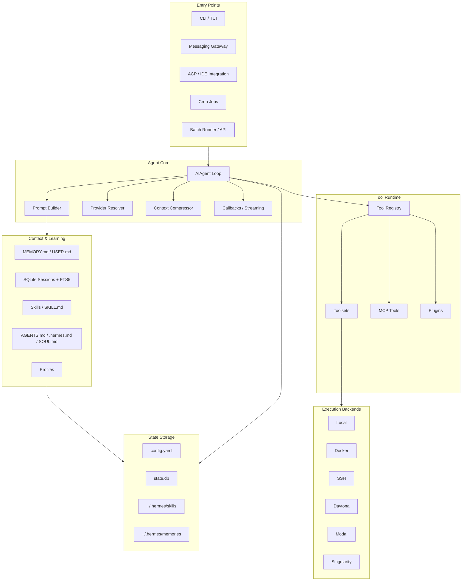
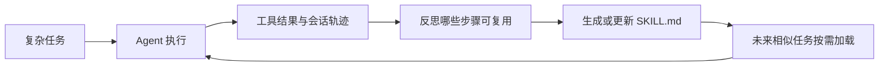
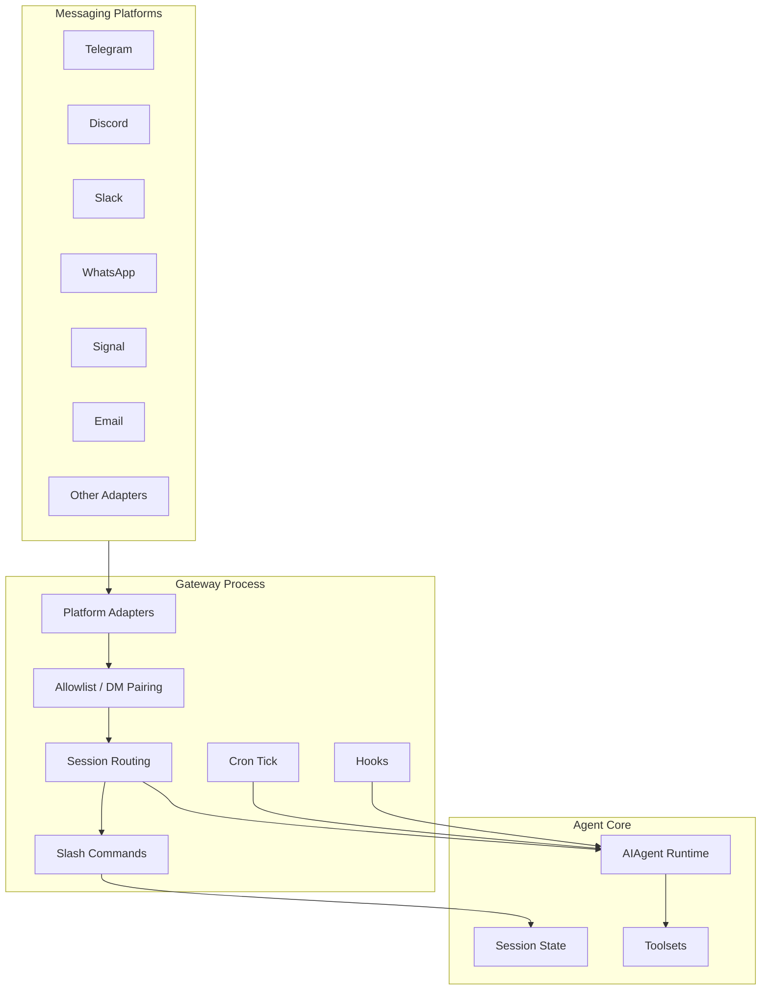

# 第16章 Hermes Agent 架构解析：自我进化、记忆与多入口 Agent Gateway

> Hermes Agent 的核心价值，不是“多一个聊天入口”，而是把长期运行的 Agent 做成一个会积累记忆、沉淀技能、跨入口工作、可扩展工具并能生成训练轨迹的个人运行时。

## 引言

前几章分别分析了 Coding Agent、企业知识助手、Agent 平台和 OpenClaw。OpenClaw 让我们看到个人 AI 助手可以从聊天机器人升级为 Gateway：它把 WhatsApp、Telegram、Slack、WebChat、CLI 等入口接到同一个 Agent Runtime。

Hermes Agent 和 OpenClaw 处在相近的问题空间，但设计重心不同：

- OpenClaw 更像一个个人 Agent Gateway，强调多渠道接入、插件生态和本地优先；
- Hermes Agent 更像一个长期运行、自我进化的 Agent Runtime，强调记忆、技能、工具、子 Agent、执行后端和研究数据闭环。

如果用一句话概括：

```text
OpenClaw 解决“Agent 如何到达用户所在的地方”
Hermes 解决“Agent 如何在长期使用中变得更懂用户、更会做事”
```

本章基于 2026 年 4 月 30 日可访问的 Hermes Agent 官方 README 与文档进行分析。Hermes Agent 正在快速演进，具体命令和模块数量以后可能变化，但它的架构思想很值得借鉴。

本章关注六个问题：

1. Hermes Agent 为什么要做成长运行的多入口 Agent？
2. 它的自我进化闭环到底由哪些系统组成？
3. Memory、Skills、Session Search 和 Context Files 如何协作？
4. 它如何组织工具、工具集、执行后端和 MCP？
5. Gateway、Cron、ACP、Profiles 如何把 Agent 从聊天扩展成工作平台？
6. 如果我们自研个人或团队 Agent，可以借鉴哪些设计？

---

## 16.1 系统定位：从一次性会话到长期运行的 Agent

很多 AI 产品仍然是“一次性会话”：

```text
User Prompt -> LLM -> Answer
```

这种形态适合问答，但不适合真正的助手。真实助手需要具备连续性：

- 记得用户偏好；
- 记得项目背景；
- 记得过去解决过什么问题；
- 能把一次复杂任务沉淀成可复用技能；
- 能从 CLI、Telegram、Slack、Discord、WhatsApp、Email 等入口继续同一类工作；
- 能在本地、Docker、SSH、Modal、Daytona、Singularity 等环境里执行任务；
- 能把运行轨迹导出，用于评估、微调或强化学习。

Hermes Agent 的定位可以抽象成：

```text
Hermes Agent
  = Long-running Agent Runtime
  + Persistent Memory
  + Procedural Skill System
  + Multi-platform Gateway
  + Tool / Toolset Registry
  + Execution Backends
  + Research Trajectory Pipeline
```

它和普通聊天机器人的本质区别是：普通聊天机器人围绕“单次回复”设计，Hermes 围绕“长期能力增长”设计。

### 关键判断：Agent 的能力不只来自模型

Hermes 的设计隐含了一个重要判断：

> 长期 Agent 的能力，不只来自模型参数，而来自模型、记忆、技能、工具、入口、执行环境和历史轨迹共同组成的系统。

同一个模型，如果每次都从空白上下文开始，就是普通聊天；如果它能读取项目规则、调用工具、搜索旧会话、更新记忆、创建技能、定时执行任务，并在不同平台保持身份连续性，就开始接近真正的个人 Agent。

---

## 16.2 总体架构

Hermes Agent 可以分成八个核心层：



这张图背后有三个核心分离：

| 分离点 | 设计含义 |
|:---|:---|
| Entry 与 Core 分离 | CLI、Gateway、ACP、Cron 都复用同一个 Agent Core |
| Context 与 Tools 分离 | 记忆和技能决定“知道什么”，工具系统决定“能做什么” |
| Toolsets 与 Execution 分离 | 同一个 terminal 工具可以跑在 local、Docker、SSH 或云端后端 |

这种分层让 Hermes 不只是一个 CLI 工具，而是一个可嵌入不同入口、不同执行环境、不同研究工作流的 Agent Runtime。

---

## 16.3 Agent Loop：统一多入口的运行核心

Hermes 的核心是一个同步编排引擎，可以理解为：

```text
load profile
  -> load config / memory / skills / context files
  -> assemble system prompt
  -> resolve provider and model
  -> receive user turn
  -> call model
  -> dispatch tool calls
  -> stream progress via callbacks
  -> persist session and tool results
  -> compress context when needed
  -> update memory / skills when appropriate
```

伪代码如下：

```python
def run_turn(user_message, profile, entry_point):
    config = load_config(profile)
    memory = load_memory(profile)
    skills = select_relevant_skills(user_message, profile)
    context_files = discover_context_files()
    sessions = load_session_state(entry_point, profile)

    prompt = build_prompt(
        personality=config.personality,
        memory=memory,
        skills=skills,
        context_files=context_files,
        tools=enabled_toolsets(entry_point),
        session=sessions.current,
    )

    while not done:
        response = model.complete(prompt)
        if response.tool_calls:
            results = tool_registry.dispatch(response.tool_calls)
            callbacks.stream_tool_results(results)
            prompt = append_observations(prompt, results)
            persist(results)
        else:
            callbacks.stream_answer(response.text)
            persist(response)
            done = True
```

这个循环和第 12 章 Coding Agent 的循环很像，但 Hermes 多了三个面向长期运行的能力：

- **Prompt Assembly**：每次会话开始时把人格、记忆、技能、项目上下文和工具指南组装成稳定系统提示；
- **Session Persistence**：会话写入 SQLite，并用 FTS5 支持跨会话搜索；
- **Learning Loop**：把经验沉淀到 memory 或 skill，而不是只留在一次对话里。

### 可中断和可观测

长期运行 Agent 必须可中断。用户可能在 CLI 里按 `Ctrl+C`，也可能在消息平台发新消息打断当前任务。Hermes 的设计强调：

- 工具调用过程对用户可见；
- 模型输出可以流式返回；
- 当前任务可以被用户中断或重定向；
- 背景进程可以被查询、等待、查看日志或终止。

这和传统后端的“请求进来、响应出去”不同。Agent 的执行可能持续几十秒甚至几分钟，用户需要知道它正在做什么、卡在哪里、是否可以停止。

---

## 16.4 Prompt System：稳定上下文而不是动态拼贴

Hermes 的 Prompt System 不只是把用户输入发给模型，而是一个上下文控制面。

一次系统提示通常由这些部分组成：

```text
System Prompt
  ├─ Personality / SOUL.md
  ├─ MEMORY.md
  ├─ USER.md
  ├─ Relevant Skills
  ├─ Context Files
  │   ├─ AGENTS.md
  │   ├─ CLAUDE.md
  │   ├─ .hermes.md
  │   └─ .cursorrules
  ├─ Tool Guidance
  ├─ Model-specific Instructions
  └─ Conversation State
```

这里有一个很关键的工程取舍：**记忆在会话开始时注入为 frozen snapshot**。

也就是说，Agent 在本轮会话中可以更新 memory 文件，但这些变更不会立刻改变当前系统提示，而是下一次会话开始时生效。

这个设计看起来“不实时”，但它有两个好处：

- 保持系统提示前缀稳定，利于 prompt caching；
- 避免会话中途系统身份和长期记忆突然变化，降低行为漂移。

很多 Agent 原型会犯一个错误：每次工具调用后都重新拼一个完全不同的系统提示。短任务问题不大，长任务就容易出现行为不一致。Hermes 的 frozen snapshot 是一个值得学习的稳定性设计。

---

## 16.5 Memory：长期事实的稀缺预算

Hermes 的内置 Memory 不是无限知识库，而是一个很小、很克制的长期事实层。

它主要由两个文件组成：

| 文件 | 作用 | 典型内容 |
|:---|:---|:---|
| `MEMORY.md` | Agent 的个人笔记 | 环境事实、项目约定、工具经验、已完成任务 |
| `USER.md` | 用户画像 | 沟通偏好、角色、时区、工作习惯、表达偏好 |

这两个文件被注入到系统提示里，因此必须非常短、非常高密度。Hermes 文档中给出了字符预算，这说明它把 Memory 当成“提示词预算里的稀缺资源”，不是普通文档库。

### Memory 解决什么问题

Memory 适合保存这些内容：

- 用户偏好，例如“回答要简洁，先给结论”；
- 环境事实，例如“项目在某目录，测试命令是某个 make target”；
- 反复出现的工具坑，例如“这个服务器 SSH 端口不是 22”；
- 项目约定，例如“后端使用 Go + sqlc，迁移脚本在 migrations/”；
- 任务结果摘要，例如“某次迁移已经完成，风险点是什么”。

Memory 不适合保存：

- 大段日志；
- 大段代码；
- 原始文档；
- 一次性临时路径；
- 可以随时重新检索到的通用知识。

这和第 10 章讲的 Agent Memory 原则一致：**长期记忆应该保存高价值、低频变化、可执行的信息，而不是把上下文垃圾永久化。**

### Session Search：长期历史的第二层

如果 MEMORY.md 和 USER.md 是“每次都必须知道的关键事实”，Session Search 则是“需要时再搜索的历史记录”。

Hermes 把 CLI 和消息平台的会话存进 SQLite，并用 FTS5 做全文检索。它可以回答类似问题：

```text
我们上周是不是讨论过这个部署失败？
之前那个 Postgres 连接池参数最后怎么改的？
我在哪次会话里让你记住了这个项目约定？
```

这形成了两级记忆：

| 层级 | 注入方式 | 适合内容 |
|:---|:---|:---|
| Memory Snapshot | 每次会话自动注入 | 必须稳定存在的事实 |
| Session Search | 工具按需检索 | 过去会话里的细节 |

这比“把全部历史塞进上下文”更可控，也比“完全不记得历史”更有连续性。

---

## 16.6 Skills：把经验变成可复用程序性记忆

Hermes 最有代表性的设计是 Skills System。

Memory 保存“事实”，Skills 保存“做法”。一个 Skill 通常是一个 Markdown 文档，描述某类任务的步骤、约束、工具选择、常见失败和验证方法。

可以这样理解：

```text
Memory = 我知道什么
Skill  = 我下次怎么做
Tool   = 我实际能执行什么
```

### 从一次任务到技能

一个典型闭环是：



这比普通“记忆”更强，因为它保存的是可执行流程：

- 什么时候先搜索；
- 什么时候读配置；
- 哪个命令能验证；
- 常见错误怎么修复；
- 产物应该放在哪里；
- 什么操作必须先询问用户。

### Progressive Disclosure

Skills 也会占上下文预算，所以不能每次全部塞进 prompt。更合理的方式是 progressive disclosure：

1. 先只让模型看到 skill 名称和简短描述；
2. 当任务匹配时，再加载对应 `SKILL.md`；
3. 如果 skill 引用脚本、模板或资源，再按需读取。

这和本书前面讲的 Context Engineering 是同一个思想：不是让模型“知道所有东西”，而是让它在需要时拿到正确材料。

### Hermes 的 Skill 演化管道

如果说 OpenClaw 更强调 Skill 的加载优先级和插件生态，那么 Hermes 更值得关注的是：**Skill 如何从长期使用轨迹中演化出来**。

结合第 6 章对 Skills 的定义，Hermes 的成熟实现可以抽象成一条管道：

```text
Session Trace
  │
  ├─ 用户反复要求同类任务
  ├─ 某次任务形成稳定成功路径
  ├─ 工具调用序列可复用
  ├─ 验证命令稳定
  └─ 人工纠正减少
      │
      ▼
Skill Candidate
      │  提取触发条件、步骤、工具、约束、验证方式
      ▼
Review / Eval
      │  检查是否安全、是否过度泛化、是否真的提升质量
      ▼
Skill Registry
      │  保存版本、owner、适用范围和依赖工具
      ▼
Future Sessions
```

这条链路让 Skill 不只是“手写说明”，而是长期 Agent 的能力沉淀机制。一次成功任务本身没有价值，能被压缩成可验证、可复用、可审查的程序性知识，才有价值。

一个 Hermes-style Skill 需要保存的不只是步骤，还应保存这些元信息：

```yaml
skill:
  name: repo_release_check
  source_trace_ids:
    - trace_20260430_001
    - trace_20260430_019
  trigger:
    - "发布前检查"
    - "release validation"
  required_tools:
    - file_search
    - shell
    - git_diff
  verification:
    - "run tests"
    - "check diff"
    - "summarize risk"
  status: reviewed
  version: "0.3.0"
```

`source_trace_ids` 很重要。它让后续 review 能回到原始任务，判断这个 Skill 是从真实成功经验中总结出来的，还是模型凭空概括出来的。

### 风险：技能会固化错误经验

Skills 的风险也很明显：如果一次任务的解法本身是错误的，Agent 把它沉淀成 skill，下次会更稳定地犯同样错误。

因此生产级 Skills System 需要：

- skill 创建前有验证证据；
- skill 更新时保留版本或变更记录；
- skill 里写清适用条件和不适用条件；
- 定期清理过期技能；
- 对高风险技能增加人工 review。

真正可靠的自我进化，不是“做完就记住”，而是“验证后再沉淀”。

---

## 16.7 Tool Runtime：注册表、工具集与执行后端

Hermes 的工具系统可以拆成三层：

```text
Tool Registry
  ├─ Toolsets
  │   ├─ web
  │   ├─ terminal
  │   ├─ file
  │   ├─ browser
  │   ├─ memory
  │   ├─ session_search
  │   ├─ cronjob
  │   ├─ delegation
  │   └─ mcp-*
  └─ Execution Backends
      ├─ local
      ├─ docker
      ├─ ssh
      ├─ daytona
      ├─ modal
      └─ singularity
```

### Tool Registry

工具注册表负责：

- 收集工具 schema；
- 判断工具是否可用；
- 分发工具调用；
- 包装错误；
- 支持插件或 MCP 扩展；
- 根据平台配置启用不同工具集。

这和第 6 章 Tool Calling 的原则一致：模型不能直接执行任意函数，必须通过 Runtime 暴露的工具边界行动。

### Toolsets

Toolsets 是对工具能力的打包。比如：

- CLI 可以启用 terminal、file、web、browser；
- Telegram 可以启用 web、memory、send_message，但限制危险 terminal；
- 某个 profile 可以只启用 read-only 工具；
- MCP server 可以动态形成 `mcp-<server>` 工具集。

Toolsets 的价值是把“能不能用某类能力”变成配置，而不是散落在 prompt 里。

### Execution Backends

Hermes 的 terminal tool 不只是在本地跑命令，它可以选择多个执行后端：

| 后端 | 适合场景 |
|:---|:---|
| local | 本机开发、可信任务 |
| docker | 隔离执行、可复现环境 |
| ssh | 远程服务器或隔离机器 |
| daytona | 持久云端开发环境 |
| modal | serverless 执行和弹性任务 |
| singularity | HPC 或 rootless 容器场景 |

这说明 Hermes 把“执行环境”作为一等公民。对于长期 Agent 来说，这非常重要：同一个工具调用，在本地执行和在 Docker/SSH 执行，风险完全不同。

---

## 16.8 Gateway：让 Agent 活在用户所在的平台里

Hermes 的 Gateway 是一个长期运行进程，负责把不同消息平台接入同一个 Agent Core。



Gateway 不是简单 webhook 转发器。它至少承担六类职责：

- 平台适配：把不同平台消息标准化；
- 用户授权：限制谁可以访问 Agent；
- 会话路由：把不同平台、不同用户、不同线程映射到正确 session；
- Slash Commands：支持 `/new`、`/model`、`/skills`、`/stop` 等控制命令；
- Cron：定时触发 Agent 任务并把结果发送到平台；
- Hooks：在平台事件和 Agent Runtime 之间插入扩展逻辑。

这也是为什么 Hermes 不是“聊天机器人包装器”。它把 messaging gateway 做成了 Agent 的长期控制面。

---

## 16.9 Cron：Agent Task，而不是 Shell Cron

普通 cron 是执行命令：

```text
0 9 * * * /scripts/report.sh
```

Hermes 的 cron 更接近“定时 Agent 任务”：

```text
每天 9 点：
  读取相关数据
  使用指定 skill
  调用必要工具
  生成报告
  发到 Telegram 或 Slack
```

这类任务和 Shell Cron 的区别是：

| 维度 | Shell Cron | Hermes Cron |
|:---|:---|:---|
| 执行对象 | 命令或脚本 | Agent 任务 |
| 上下文 | 环境变量和文件 | 记忆、技能、工具、模型 |
| 输出 | stdout、文件、邮件 | 多平台消息、报告、行动结果 |
| 失败处理 | 依赖脚本自己处理 | 可通过 Agent 解释和总结 |
| 复用 | 主要复用脚本 | 复用 skill、memory、toolsets |

这对个人自动化很有价值。比如：

- 每天早上总结 GitHub issue；
- 每周检查服务器磁盘和证书；
- 每晚整理当天笔记；
- 定期生成项目风险报告；
- 监控某个网页或数据源变化。

从系统角度看，Cron 把 Agent 从“被动回答”推向“主动运行”。

---

## 16.10 Profiles：隔离长期身份

Hermes 支持 profile，每个 profile 有自己的 home、配置、memory、sessions、gateway PID 等。

这个设计看起来像多账户，但工程意义更深：

- 工作项目和个人生活不混在一起；
- 不同客户或团队有不同 memory；
- 不同 profile 可以启用不同工具和模型；
- 高风险 profile 可以只启用受限执行后端；
- 多个 profile 可以并行运行。

长期 Agent 最怕“上下文串线”。如果一个 Agent 既记住公司 A 的规则，又记住公司 B 的凭据，还在同一个 session 里切换任务，迟早会出问题。

Profile Isolation 是防止这种问题的第一道边界。

---

## 16.11 Plugin 与 MCP：扩展能力，但保持边界

Hermes 的扩展可以来自三类路径：

```text
Built-in Tools
  系统自带工具，例如 web、terminal、memory、browser

Plugins
  用户、项目或 pip entry point 提供的扩展

MCP Servers
  外部工具能力通过 MCP 协议接入
```

### Plugin System

Plugin 可以注册：

- tools；
- hooks；
- CLI commands；
- memory provider；
- context engine。

其中 memory provider 和 context engine 是特殊插件类型，通常是单选：同一时间只激活一个外部 memory provider 或一个 context engine。这个约束很重要，因为多个记忆系统同时改写上下文，很容易产生冲突。

### MCP Integration

MCP 的价值是把外部工具系统标准化接入 Hermes，例如：

- GitHub；
- 数据库；
- 内部服务；
- 日志平台；
- 浏览器工具；
- 文档系统。

但 MCP 也扩大了权限面。一个成熟系统必须做：

- MCP server 级别授权；
- 工具 allowlist / denylist；
- secret 环境变量过滤；
- tool schema 审查；
- tool result 截断；
- 高风险工具人工确认。

这和第 12 章 Coding Agent 里的 MCP + 日志工作流是同一个问题：MCP 不是魔法，它只是把“外部能力”接进 Agent Runtime。真正可靠的是 Runtime 的权限、审计和上下文边界。

---

## 16.12 Security：长期 Agent 的攻击面更大

Hermes 官方文档把安全模型拆成多层，包括用户授权、危险命令审批、容器隔离、MCP 凭据过滤、上下文文件扫描、跨会话隔离和输入清洗。

这非常合理，因为长期运行 Agent 的风险比普通 Chatbot 大得多：

- 它连接消息平台；
- 它可能能执行命令；
- 它有长期记忆；
- 它能读项目文件；
- 它能调用浏览器；
- 它能运行 cron；
- 它能通过 MCP 访问外部系统；
- 它可能在服务器上 24 小时运行。

### 防御分层

| 层 | 典型风险 | 防御方式 |
|:---|:---|:---|
| 用户授权 | 陌生人给 bot 发消息触发工具 | allowlist、DM pairing |
| 命令执行 | 删除文件、泄露 secret、破坏系统 | 危险命令审批、工具策略 |
| 执行环境 | 本地权限过大 | Docker、SSH、Modal、Singularity |
| MCP | 外部 server 读取不该读取的凭据 | 环境变量过滤、工具白名单 |
| Context Files | 项目文件里藏 prompt injection | 扫描和隔离 |
| Session | 平台或 profile 间串线 | session/profile isolation |
| Cron | 后台任务误触发高风险动作 | 审批、审计、可暂停 |

安全设计的核心原则是：

> 不能因为 Agent 长期运行，就默认它值得长期信任。

它必须在每个入口、每个工具、每个执行后端、每次持久化时重新经过边界检查。

---

## 16.13 Research Pipeline：从使用轨迹到训练数据

Hermes 还有一个很特别的方向：它不仅是产品形态的 Agent，也是面向模型训练和研究的 Agent 平台。

它支持：

- batch trajectory generation；
- tool-calling 轨迹压缩；
- ShareGPT 格式导出；
- RL environments；
- Atropos 相关训练集成。

这说明 Hermes 把 Agent 运行看成一种可积累的数据资产：

```text
真实任务
  -> Agent 工具调用轨迹
  -> 成功/失败/人工修正
  -> 压缩与标注
  -> eval dataset
  -> fine-tuning / RL
  -> 更好的 agent behavior
```

这对团队自研 Agent 很有启发。很多团队只关心“Agent 当前能不能完成任务”，但忽略了“Agent 的失败能不能变成下一轮改进的数据”。真正长期可进化的系统，需要把每次执行都变成可复盘、可评估、可训练的材料。

---

## 16.14 Hermes 与 OpenClaw 的架构对比

Hermes 和 OpenClaw 很容易被放在一起比较，因为它们都强调个人 AI 助手、多渠道入口、本地运行和工具生态。但它们的重心不同。

| 维度 | OpenClaw | Hermes Agent |
|:---|:---|:---|
| 核心定位 | Personal Agent Gateway | Self-improving Long-running Agent |
| 入口 | 多聊天平台、WebChat、CLI、节点 | CLI/TUI、Messaging Gateway、ACP、Cron、Batch/API |
| 记忆 | 个人上下文和长期配置 | MEMORY.md、USER.md、SQLite Session Search、外部 Memory Provider |
| 技能 | 技能与插件生态 | 自动创建/改进 Skills，兼容 agentskills.io |
| 工具 | 工具、技能、插件、MCP | Tool Registry、Toolsets、MCP、Plugins、执行后端 |
| 执行环境 | 本地和沙箱为主 | local、Docker、SSH、Daytona、Modal、Singularity |
| 研究闭环 | 更偏产品使用 | 轨迹生成、压缩、RL/eval 数据 |
| 架构气质 | Gateway-first | Learning-loop-first |

两者不是谁替代谁，而是代表两种长期 Agent 的设计方向：

- 如果重点是“如何让用户从各种渠道触达 Agent”，OpenClaw 的 Gateway 思路更突出；
- 如果重点是“如何让 Agent 在长期使用中积累能力”，Hermes 的 Memory + Skills + Session + Trajectory 思路更突出。

---

## 16.15 如果自研 Hermes 类系统，最小可行架构是什么

不要一开始就实现完整 Hermes。一个可落地的最小版本可以这样设计：

```text
hermes-like-agent/
├── cli.py
├── agent/
│   ├── loop.py
│   ├── prompt_builder.py
│   ├── provider.py
│   └── callbacks.py
├── context/
│   ├── memory.py
│   ├── skills.py
│   ├── session_store.py
│   └── context_files.py
├── tools/
│   ├── registry.py
│   ├── terminal.py
│   ├── file.py
│   └── web.py
├── gateway/
│   ├── telegram.py
│   └── router.py
├── cron/
│   └── scheduler.py
└── state/
    ├── config.yaml
    ├── state.db
    ├── memories/
    └── skills/
```

优先级建议：

1. **Agent Loop**：先跑通模型、工具、回调、持久化；
2. **Memory**：只做两个小文件，限制字符数；
3. **Session Search**：SQLite + FTS5，先支持按关键词召回；
4. **Skills**：先手工创建技能，再考虑自动生成；
5. **Toolsets**：把工具按平台和 profile 配置；
6. **Gateway**：先接一个平台，例如 Telegram；
7. **Cron**：只允许低风险 read-only 任务；
8. **Security**：命令审批、路径沙箱、allowlist 必须尽早做。

不要过早做的事情：

- 不要一开始接十几个消息平台；
- 不要一开始做复杂 external memory provider；
- 不要自动生成并自动执行高风险 skill；
- 不要给 messaging gateway 默认开放 terminal；
- 不要把所有历史会话无脑注入 prompt。

---

## 16.16 设计启示

Hermes Agent 给 Agent 工程带来几个重要启示。

### 1. 长期 Agent 的核心是连续性

连续性不是“把聊天记录都放进去”，而是分层组织：

- Memory 保存关键事实；
- Session Search 保存历史细节；
- Skills 保存操作流程；
- Context Files 保存项目规范；
- Profiles 保存身份边界。

### 2. 自我进化必须受验证约束

Agent 会记忆、会写 skill、会复用经验，这听起来很强，但如果没有验证和审查，就会把错误经验固化。

更健康的闭环是：

```text
执行 -> 验证 -> 复盘 -> 沉淀 memory/skill -> eval 检查 -> 再复用
```

### 3. Gateway 让 Agent 从工具变成服务

CLI Agent 是工具；Gateway Agent 是服务。

一旦 Agent 进入 Telegram、Slack、Discord、Email，它就不再只服务“坐在电脑前的人”，而变成一个长期在线的数字工作者。此时必须重新设计授权、会话、审计、中断和后台任务。

### 4. Toolsets 是权限治理的基本单位

不要只用 prompt 控制工具。把工具分成 toolsets，再按平台、profile、任务类型启用，是更可靠的设计。

例如：

```text
CLI profile: web + file + terminal + memory
Telegram profile: web + memory + send_message
Cron profile: web + read-only file + send_message
Research profile: batch + trajectory + eval tools
```

### 5. 轨迹是 Agent 的资产

每一次工具调用、失败、修复、用户纠正，都可以成为 eval、fine-tuning 或 RL 的材料。

如果一个团队认真做 Agent，就应该尽早记录：

- task；
- system prompt version；
- tool calls；
- tool results；
- user corrections；
- final output；
- verification result；
- failure reason。

这就是 Agent 系统的“数据飞轮”。

---

## 本章小结

Hermes Agent 展示了长期运行 Agent 的另一条成熟路径：不是只做更强的单次推理，而是围绕模型建立记忆、技能、工具、入口、执行环境和数据闭环。

本章核心结论：

- Hermes 的本质是一个自我进化的长期 Agent Runtime；
- Memory 保存关键事实，Session Search 保存历史细节，Skills 保存可复用做法；
- Gateway 让同一个 Agent 活在 CLI、消息平台和自动化任务中；
- Tool Registry、Toolsets、Execution Backends 把行动能力拆成可治理的边界；
- Profiles 是长期 Agent 防止上下文串线的重要机制；
- Security 必须覆盖用户授权、命令审批、容器隔离、MCP 凭据过滤、上下文扫描和 session 隔离；
- Research Pipeline 把 Agent 执行轨迹变成 eval、fine-tuning 和 RL 的数据资产。

如果 OpenClaw 让我们看到“个人 Agent Gateway 如何把用户和模型连起来”，Hermes 则让我们看到“长期 Agent 如何在使用中积累能力”。对自研 Agent 来说，最值得学习的不是某个具体命令，而是它把长期性拆成了可工程化的系统组件。

---

## 参考资料

1. [Hermes Agent GitHub Repository - NousResearch/hermes-agent](https://github.com/NousResearch/hermes-agent)
2. [Hermes Agent Documentation](https://hermes-agent.nousresearch.com/docs/)
3. [Hermes Agent Architecture](https://hermes-agent.nousresearch.com/docs/developer-guide/architecture)
4. [Hermes Agent Tools & Toolsets](https://hermes-agent.nousresearch.com/docs/user-guide/features/tools/)
5. [Hermes Agent Persistent Memory](https://hermes-agent.nousresearch.com/docs/user-guide/features/memory/)
6. [Hermes Agent Security](https://hermes-agent.nousresearch.com/docs/user-guide/security)
