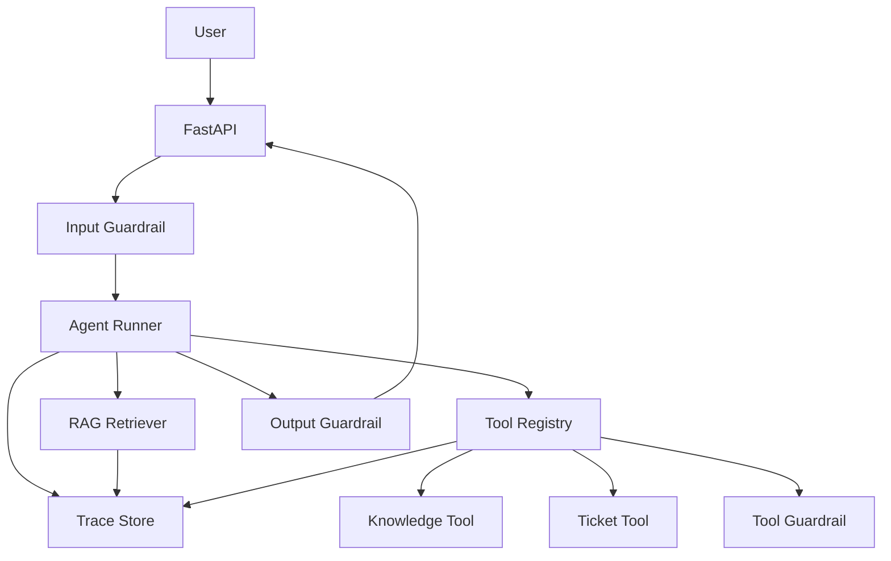

# 第19章 从零实现一个可观测 Mini Agent

> 面试中最有说服力的项目，不一定复杂，但必须闭环。

## 引言

如果你准备 Agent 应用工程师面试，最好有一个可以讲清楚的 Mini Agent 项目。它不需要覆盖庞大业务，但要展示生产化意识：有工具、有 RAG、有 guardrails、有 trace、有 eval。

本章设计一个“文档问答 + 工单创建”的 Mini Agent，用最小范围覆盖 Agent 应用工程的核心能力。

---

## 19.1 项目目标

项目名称：Support Agent

目标：帮助用户查询内部知识库，并在无法解决时创建支持工单。

能力范围：

- 回答产品 FAQ；
- 检索内部文档；
- 查询工单状态；
- 创建工单；
- 对高风险请求转人工；
- 记录 trace；
- 跑离线 eval。

非目标：

- 不做复杂多 Agent 协作；
- 不直接修改生产数据；
- 不处理支付、退款等高风险业务；
- 不追求大规模并发。

---

## 19.2 目录结构

```text
support-agent/
├── README.md
├── app/
│   ├── main.py
│   ├── agent/
│   │   ├── runner.py
│   │   ├── prompts.py
│   │   └── state.py
│   ├── tools/
│   │   ├── registry.py
│   │   ├── ticket.py
│   │   └── kb.py
│   ├── rag/
│   │   ├── ingest.py
│   │   ├── retriever.py
│   │   └── store.py
│   ├── guardrails/
│   │   ├── input.py
│   │   ├── output.py
│   │   └── tool.py
│   ├── observability/
│   │   ├── trace.py
│   │   └── metrics.py
│   └── evals/
│       ├── dataset.yaml
│       └── runner.py
├── docs/
│   ├── faq.md
│   └── refund-policy.md
├── tests/
└── docker-compose.yml
```

这个结构的价值是清楚展示工程边界：

- `agent/` 负责决策；
- `tools/` 负责行动；
- `rag/` 负责知识；
- `guardrails/` 负责安全；
- `observability/` 负责复盘；
- `evals/` 负责质量回归。

---

## 19.3 核心架构



---

## 19.4 Agent Runner

Runner 不要一开始就设计得过度复杂。第一版可以采用“Router + Tool Calling”的轻量模式。

```python
class AgentRunner:
    def __init__(self, llm, retriever, tool_registry, tracer):
        self.llm = llm
        self.retriever = retriever
        self.tool_registry = tool_registry
        self.tracer = tracer

    async def run(self, user, message: str) -> dict:
        trace = self.tracer.start_trace(user_id=user.id, input=message)

        intent = await self.classify_intent(message)
        trace.add_event("intent", {"intent": intent})

        if intent == "knowledge_qa":
            docs = await self.retriever.search(message)
            answer = await self.answer_with_context(message, docs)
            trace.add_event("rag", {"doc_count": len(docs)})
            return answer

        if intent == "ticket_status":
            tool = self.tool_registry.get("get_ticket_status")
            result = await tool.call(user=user, args=self.extract_ticket_args(message))
            trace.add_event("tool_call", result)
            return self.format_tool_result(result)

        if intent == "create_ticket":
            tool = self.tool_registry.get("create_ticket")
            result = await tool.call(user=user, args=self.extract_ticket_args(message))
            trace.add_event("tool_call", result)
            return self.format_tool_result(result)

        return {
            "answer": "这个问题超出我的处理范围，我会转给人工支持。",
            "handoff": True
        }
```

面试时可以解释：第一版选择 Router 而不是自由 ReACT，是为了降低不可控循环和工具误用风险。

---

## 19.5 工具注册表

```python
class Tool:
    def __init__(self, name, description, risk_level, handler):
        self.name = name
        self.description = description
        self.risk_level = risk_level
        self.handler = handler

    async def call(self, user, args):
        guardrail_result = check_tool_permission(user, self.name, args)
        if not guardrail_result.allowed:
            return {
                "status": "rejected",
                "reason": guardrail_result.reason
            }

        return await self.handler(args)

class ToolRegistry:
    def __init__(self):
        self.tools = {}

    def register(self, tool):
        self.tools[tool.name] = tool

    def get(self, name):
        return self.tools[name]
```

示例工具：

```python
async def create_ticket(args):
    return {
        "status": "success",
        "ticket_id": "T-10086",
        "message": "Support ticket created"
    }
```

---

## 19.6 RAG最小实现

第一版 RAG 不追求复杂，重点是可解释和可评估。

```python
class Retriever:
    def __init__(self, vector_store):
        self.vector_store = vector_store

    async def search(self, query: str, top_k: int = 5):
        docs = await self.vector_store.similarity_search(query, k=top_k)
        return [
            {
                "doc_id": doc.id,
                "title": doc.metadata["title"],
                "content": doc.content,
                "source": doc.metadata["source"]
            }
            for doc in docs
        ]
```

回答时要求引用来源：

```text
请只基于 <context> 中的内容回答。
如果上下文不足，明确说明不知道。
回答末尾列出引用来源。
```

---

## 19.7 Trace设计

Trace 不需要一开始接入复杂平台，先落本地 JSON 也可以。

```json
{
  "trace_id": "tr_001",
  "user_id": "u_123",
  "input": "如何查看退款进度？",
  "intent": "knowledge_qa",
  "events": [
    {
      "type": "retrieval",
      "query": "如何查看退款进度？",
      "doc_ids": ["refund-policy.md"],
      "latency_ms": 120
    },
    {
      "type": "generation",
      "model": "gpt-4.1-mini",
      "prompt_version": "qa-v1",
      "latency_ms": 900
    }
  ],
  "final_answer": "...",
  "cost_usd": 0.003
}
```

面试时要说明 trace 的用途：

- debug 单次失败；
- 聚合分析失败模式；
- 生成 eval case；
- 对比版本效果；
- 计算成本和延迟。

---

## 19.8 Eval Dataset

```yaml
- id: qa_refund_001
  input: "我想知道退款一般多久能到账"
  expected:
    must_mention:
      - "退款处理时间"
      - "支付渠道"
    must_cite:
      - "refund-policy.md"
    should_not:
      - "承诺固定到账时间"

- id: ticket_create_001
  input: "我的订单一直失败，帮我建个工单"
  expected:
    tool_call:
      name: "create_ticket"
    final_contains:
      - "ticket_id"
```

Eval runner：

```python
async def run_eval(dataset, agent):
    results = []
    for case in dataset:
        output = await agent.run(user=case.user, message=case.input)
        score = judge(case.expected, output)
        results.append({
            "id": case.id,
            "passed": score.passed,
            "reason": score.reason
        })
    return results
```

---

## 19.9 README展示模板

Mini Agent 项目的 README 应该服务面试。

```markdown
# Support Agent

## 目标
内部知识问答与支持工单创建。

## 架构
- FastAPI API 层
- Router-based Agent Runner
- RAG Retriever
- Tool Registry
- Input / Tool / Output Guardrails
- JSON Trace
- Offline Evals

## 核心指标
- Eval pass rate: 86%
- Tool selection accuracy: 92%
- P95 latency: 2.1s
- Average cost per task: $0.004

## Demo
1. 知识问答
2. 工单查询
3. 工单创建
4. 越权请求拦截

## 设计取舍
第一版使用 Router，而不是自由 ReACT，降低不可控工具调用风险。
```

---

## 19.10 面试讲解脚本

3 分钟版本：

```text
我做了一个 Support Agent，用于内部知识问答和工单创建。

架构上我没有直接做一个自由循环的 Agent，而是采用 Router + RAG + Tool Calling。
普通知识问题走 RAG，工单状态查询和创建走工具，高风险或越权请求由 guardrails 拦截。

工程上我重点做了三件事：
第一是工具注册表，每个工具有风险等级、权限校验和结构化错误；
第二是 trace，记录检索、工具调用、模型生成和最终输出；
第三是 eval dataset，用 20 条 case 回归测试回答质量、工具选择和安全边界。

这个项目虽然小，但覆盖了生产 Agent 的关键闭环：能回答、能行动、能防错、能评估、能复盘。
```

---

## 本章小结

一个好的面试项目不一定庞大，但必须体现工程完整性。

Mini Agent 至少应该包含：

- 清晰的业务目标；
- 可解释的架构模式；
- 工具注册表；
- RAG；
- Guardrails；
- Trace；
- Eval dataset；
- README 和架构图。

正文到这里收束。附录提供术语表、参考资料、工具清单，以及系统设计面试题与作品集模板，方便按需查阅。
