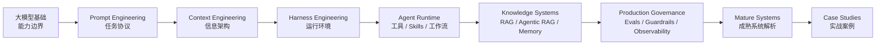

# 书籍介绍

欢迎阅读《AI Agent 工程实践：从大模型基础到生产级智能体系统》。

这不是一本单纯介绍工具按钮怎么点的书。它关注的是一个更长期的问题：当 AI 已经可以读代码、改代码、调用工具、规划任务、检索知识、长期运行甚至并行协作时，工程师应该怎样重新设计自己的工作方式、上下文系统、工具接口、验证回路和生产治理。

## 全书工程主线图

本书从大模型基础出发，逐层进入 Agent Runtime、知识系统、生产治理、成熟系统解析和实战案例。主线不是“学一堆工具名”，而是把不稳定的模型能力放进可复用、可审查、可验证、可治理的工程系统。

## 本书解决什么问题

AI 工程实践里最容易踩的坑，不是模型不会生成内容，而是我们把不清楚的意图、不完整的上下文、没有边界的工具和没有验证回路的流程交给了模型。结果往往是：第一版看起来很聪明，第二版开始补洞，第三版引入新问题，最后人和 AI 一起在上下文里迷路。

本书的主线是把这种不稳定的协作方式，逐步收敛成可复用、可审查、可验证、可治理的工程系统。

读完之后，你应该能够回答五类问题：

- **个人效率**：什么时候让 AI 自由探索，什么时候必须先写 Spec 和任务协议？
- **模型控制**：如何通过 Prompt Engineering 降低任务歧义和输出漂移？
- **信息架构**：如何通过 Context Engineering 管理项目规范、知识库、工具结果、记忆和上下文预算？
- **系统落地**：如何通过 Harness Engineering 把模型放进工具、工作流、验证、权限和观测组成的运行环境？
- **生产治理**：如何评估、监控、调试、回滚并持续优化一个 Agent 系统？

## 适合谁读

本书主要面向已经参与过真实软件项目的读者，包括后端工程师、AI 应用工程师、技术负责人，以及正在把 AI 编程或 Agent 系统引入团队流程的人。

你不需要是大模型研究员，但最好具备以下基础：

- 能读懂一种主流编程语言的代码示例；
- 理解 API、数据库、测试、日志、部署、权限等基本工程概念；
- 对 LLM、RAG、Agent、MCP、Evals 等术语有初步印象，遇到细节时愿意回查。

如果你刚开始接触 AI 编程，可以先按“快速上手路径”阅读；如果你已经在团队里落地 Agent，则可以直接从 Agent 架构、知识系统和生产治理部分切入。

## 内容结构

### 第一部分：大模型基础与 AI 工程方法论

这一部分建立全书的底层方法：先理解 LLM 的能力边界，再学习如何通过 Prompt、Context 和 Harness 把模型放进可约束的工程系统。

你会获得：

- LLM 擅长什么、不擅长什么，以及这些边界如何影响架构设计；
- Prompt 作为任务协议的设计方法；
- 结构化输出作为系统契约的设计方法；
- Context 作为信息架构的组织方法；
- Harness 作为 Agent 运行环境的设计方法。

### 第二部分：Agent 系统设计、运行时与生产治理

这一部分讨论如何基于大模型扩展出真正可运行的 Agent 系统。

你会获得：

- Agent 与传统后端的技术选型框架；
- Tool Calling、Skills、MCP、权限、超时、重试和审计设计；
- 状态机、DAG、Router、Plan-and-Execute、多 Agent 编排的适用边界；
- LangGraph、AutoGen、Microsoft Agent Framework、MCP 生态背后的 Agent 平台抽象；
- RAG、Agentic RAG、Memory 的系统化设计；
- Evals、Guardrails、可观测性、生命周期和失败诊断的生产治理闭环。

### 第三部分：成熟系统解析与实战案例

这一部分把前两部分的方法放到真实系统中观察，分成两段：第 13-16 章是成熟系统解析，第 17-20 章是实战案例。

你会获得：

成熟系统解析：

- Claude Code、Cursor、Codex 等 AI Coding Agent 的系统设计模式；
- Pi 这类终端原生 Coding Agent Runtime 的上下文工程、工具边界、扩展系统和 SDK 嵌入模式；
- OpenClaw 这类个人 AI 助手 Gateway 的架构、工具生态和安全边界；
- Hermes Agent 这类自我进化 Agent 的记忆、技能、工具、Gateway 和研究闭环；

实战案例：

- 电商告警 DoD Agent 的生产级架构设计；
- 企业知识助手中的 RAG、搜索、权限与知识治理落地路径；
- 一个可复现、可观测、可扩展的 Coding Agent 项目骨架。
- 个人知识管理 Agent 中 RAG、Memory 和工作流的组合方式；

### 附录

附录提供术语、参考资料、工具清单，以及系统设计面试题与作品集模板。它们不再作为正文主线，而是作为随用随查的材料。

## 阅读路径

### 快速上手：2-3 天

适合想快速建立 AI 工程方法论的读者：

1. 第 1 章：理解 LLM 能力边界；
2. 第 2 章：学习如何把需求写成任务协议和结构化输出；
3. 第 3 章：学习如何给模型准备正确上下文；
4. 第 4 章：理解工具、验证和护栏如何组成 Harness；
5. 选择第 17 章、第 18 章或第 19 章，看一套完整案例如何组装起来。

### 系统学习：1-2 周

适合准备建立完整 AI 工程方法论的读者：

1. 按顺序阅读第一部分，建立 LLM、Prompt、Context、Harness 的基础链路；
2. 阅读第二部分，理解 Agent 运行时、知识系统和生产治理；
3. 阅读第三部分，学习成熟系统如何取舍，再用完整案例建立工程直觉；
4. 阅读附录，补齐术语、工具、参考资料和面试表达材料。

### 项目驱动：随用随查

适合手上已经有 Agent 项目的读者：

1. 先读第 5 章，判断问题是否真的适合 Agent；
2. 需要接外部系统时读第 6 章；
3. 需要编排多步任务时读第 7 章；
4. 需要理解平台和框架选型时读第 8 章；
5. 需要处理知识库或私有数据时读第 9-11 章；
6. 准备上线前读第 12 章；
7. 想参考成熟系统时读第 13-16 章；
8. 准备面试或作品集时查阅附录D。

## 在线阅读

- **GitHub Pages**：https://wxquare.github.io/ai-book/
- **源码仓库**：https://github.com/wxquare/wxquare.github.io

## 反馈与贡献

欢迎通过 Issue、Pull Request 或博客留言提供反馈。尤其欢迎三类反馈：

- 哪些章节读起来跳跃，缺少承上启下；
- 哪些代码或架构图难以复现；
- 哪些工具、模型或最佳实践已经过时。

## 版本信息

- **当前版本**：v1.0
- **发布日期**：2026 年 4 月
- **更新计划**：持续更新，优先深化大模型基础、Agent 运行时、成熟系统解析、案例、评估体系和生产治理实践。
