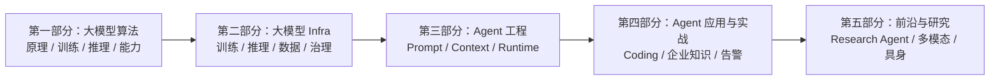

# 书籍介绍

欢迎阅读《AI Engineering：大模型与智能体系统工程》。

这不是一本只介绍工具用法的书，而是一套面向软件工程师与架构师的 AI Engineering 知识体系。它关注一个更长期的问题：如何理解模型能力，如何稳定地生产和交付模型能力，以及如何把这些能力构建成可验证、可治理的应用系统。

全书沿着“**理解模型能力 → 生产与交付能力 → 构建应用系统 → 评估与持续改进**”的工程主线展开，覆盖大模型原理与算法、基础设施、Agent 系统、应用实战和前沿研究。Agent 是重要的应用系统形态，但不代表全书的全部范围。

## 全书工程主线图

本书按“**大模型原理与算法 → 大模型基础设施 → Agent 系统工程 → Agent 应用与实战 → 前沿研究与工程展望**”五部分展开。主线不是“学一堆工具名”，而是先理解模型能力如何形成，再理解模型如何被训练、部署、评估和治理，之后把模型放进可约束、可验证的应用与 Agent 运行环境，最后用真实案例和研究专题判断下一步能力边界。

```mermaid
flowchart LR
    A["第一部分：大模型算法<br/>原理 / 训练 / 推理 / 能力"] --> B["第二部分：大模型 Infra<br/>训练 / 推理 / 数据 / 治理"]
    B --> C["第三部分：Agent 工程<br/>Prompt / Context / Runtime"]
    C --> D["第四部分：Agent 应用与实战<br/>Coding / 企业知识 / 告警"]
    D --> E["第五部分：前沿与研究<br/>Research Agent / 多模态 / 具身"]
```

## 本书解决什么问题

AI 工程实践里最容易踩的坑，不只是模型输出不稳定，也包括训练、推理、数据、评估和应用之间缺少清晰边界。我们把不清楚的意图、不完整的上下文、没有边界的工具和没有验证回路的流程交给模型，结果往往是第一版看起来很聪明，后续版本不断补洞并引入新问题。

本书的主线是把从模型能力到应用交付的过程，逐步收敛成可复用、可审查、可验证、可治理的工程系统。

读完之后，你应该能够回答五类问题：

- **模型边界**：LLM 擅长什么、不擅长什么，这些边界如何影响系统设计？
- **能力交付**：如何设计训练、推理、数据和评估基础设施，让模型能力稳定、经济地交付？
- **任务协议**：如何通过 Prompt、结构化输出和 Context 降低任务歧义与输出漂移？
- **系统落地**：如何通过 Harness、工具、知识、记忆和工作流构建 Agent Runtime？
- **生产治理**：如何评估、监控、调试、回滚并持续优化一个 Agent 系统？
- **现实应用**：如何把大模型与 Agent 用到编程、告警处理、企业知识、个人知识管理和研究任务中？

## 适合谁读

本书主要面向已经参与过真实软件项目的读者，包括后端工程师、AI 应用工程师、技术负责人，以及正在把 AI 编程或 Agent 系统引入团队流程的人。

你不需要是大模型研究员，但最好具备以下基础：

- 能读懂一种主流编程语言的代码示例；
- 理解 API、数据库、测试、日志、部署、权限等基本工程概念；
- 对 LLM、RAG、Agent、MCP、Evals 等术语有初步印象，遇到细节时愿意回查。

如果你刚开始接触 AI 工程，建议按章节顺序建立基础；如果你已经在团队里落地 Agent，则可以直接从第三部分的 Agent 架构、工具、知识系统和生产治理部分切入；如果你负责平台建设，则可以优先阅读第二部分。

## 内容结构

### 第一部分：大模型原理与算法

这一部分建立全书的模型基础：理解 LLM 的能力边界、训练与推理机制，以及模型能力如何影响系统设计。它回答“模型能做什么、不能做什么、工程上为什么不能把模型当成万能组件”。

| 章 | 章节 | 一句话概述 |
| --- | --- | --- |
| 第1章 | [大模型基础与 Transformer 架构](part1/01-llm-foundations-transformer.md) | 从 token、Embedding 和 Transformer 出发，建立理解大模型算法与能力边界的基础。 |
| 第2章 | [预训练：数据、目标与能力形成](part1/02-pretraining-data-scaling.md) | 解释预训练数据、目标函数、规模定律和模型能力形成之间的关系。 |
| 第3章 | [后训练与模型对齐](part1/03-post-training-alignment.md) | 介绍 SFT、RLHF、DPO、RLAIF 和安全对齐如何改变模型行为。 |
| 第4章 | [推理能力与生成算法](part1/04-reasoning-generation-algorithms.md) | 讨论采样、推理预算、验证和生成算法如何影响模型输出。 |
| 第5章 | [微调、压缩与多模态算法](part1/05-finetuning-compression-multimodal.md) | 介绍参数高效微调、模型压缩和多模态模型算法。 |
| 第6章 | [世界模型与具身智能：从预测世界到行动系统](part1/06-world-models-embodied-ai.md) | 介绍世界模型与具身智能的关系，理解“会说”如何走向“会做”。 |

### 第二部分：大模型基础设施

这一部分把算法模型放进真实系统，覆盖资源模型、训练、推理、数据评估、运行时、可靠性与治理。它回答“模型如何稳定训练、低延迟服务、持续评估，并在故障、成本和安全约束下长期运行”。

| 章 | 章节 | 一句话概述 |
| --- | --- | --- |
| 第7章 | [大模型 Infra 总览](part1/07-llm-boundaries.md) | 建立从算法结果到可运行平台的资源、生命周期和验收边界。 |
| 第8章 | [训练 Infra：数据管线、分布式训练与 Checkpoint](part2/infra-08-training.md) | 说明数据供给、并行训练、通信、恢复和训练制品如何形成闭环。 |
| 第9章 | [推理 Infra：Serving、KV Cache、Batching 与模型并行](part2/infra-09-inference.md) | 解释在线推理的请求调度、KV 管理、模型并行、容量和发布。 |
| 第10章 | [数据与评估 Infra：治理、回归与反馈闭环](part2/infra-10-data-eval.md) | 建立数据版本、评估、线上反馈和质量门禁的证据链。 |
| 第11章 | [Agent/模型运行时 Infra](part2/infra-11-runtime.md) | 讨论任务状态、工具、工作流、租户、重试、补偿和人工接管。 |
| 第12章 | [可靠性与治理 Infra](part2/infra-12-reliability-governance.md) | 连接 SLO、观测、成本、安全、供应链、发布和灾备。 |

### 第三部分：Agent 系统工程

这一部分讨论如何把大模型组装为真正可运行、可恢复、可治理的 Agent 系统。基础设施章节关注平台如何提供运行能力；本部分关注任务协议、上下文、Harness、模型协议、工具、知识、记忆、编排和行动控制如何共同形成应用级 Runtime。

| 章 | 章节 | 一句话概述 |
| --- | --- | --- |
| 第13章 | [Agent 的演化与架构总纲：从对话应用到可治理 Runtime](part2/01-agent-architecture.md) | 说明 Agent 为什么不是简单聊天框，而是需要被治理的运行时系统。 |
| 第14章 | [Prompt Engineering 与结构化输出：从提示词到任务协议](part2/02-prompt-engineering.md) | 把提示词升级成可执行的任务协议，让输入和输出更稳定。 |
| 第15章 | [Context Engineering：从上下文注入到信息架构](part2/03-context-engineering.md) | 讲清上下文如何组织、压缩和注入，决定 Agent 的认知上限。 |
| 第16章 | [Harness Engineering：从模型调用到 Agent 运行环境](part2/04-harness-engineering.md) | 构建模型之外的执行外壳，负责控制、状态、权限和失败处理。 |
| 第17章 | [LLM API 协议：模型能力如何被系统消费](part2/05-llm-api-protocol.md) | 把模型接口当成系统契约来设计，而不是只看一次调用是否成功。 |
| 第18章 | [Agent 工具系统工程：Tool Calling、Skills 与 MCP](part2/06-tool-calling-mcp.md) | 说明工具如何成为 Agent 的手脚，以及如何安全、可扩展地接入工具。 |
| 第19章 | [Agent 知识系统：从知识源、RAG 到 Agentic RAG](part2/07-agent-knowledge-systems.md) | 介绍知识检索与增强生成的系统化做法，让 Agent 知道去哪找答案。 |
| 第20章 | [Agent 记忆系统：Memory、会话与长期上下文](part2/08-agent-memory.md) | 讨论记忆如何跨会话保存、更新和检索，支撑长期协作。 |
| 第21章 | [Agent 执行编排与平台架构：工作流、状态机、多 Agent 与框架生态](part2/09-workflow-orchestration.md) | 说明任务如何被拆解、编排和调度成稳定的执行流程。 |
| 第22章 | [Agent 生产治理：Evals、Guardrails 与可观测性](part2/10-agent-evals-guardrails-observability.md) | 把评估、约束和可观测性连成闭环，保证系统可用、可控、可迭代。 |

### 第四部分：Agent 应用与实战

这一部分将前面三部分的能力放到现实工作中：先拆解成熟产品，再落到企业和个人任务。它关心的是“如何用大模型与 Agent 完成一项可交付、可验证、可治理的真实工作”。

| 章 | 章节 | 一句话概述 |
| --- | --- | --- |
| 第23章 | [AI Coding Agent 系统解析：从工作协议到 Harness 工程](part3/01-coding-agent-systems.md) | 从系统视角拆解 Coding Agent，理解它为什么能帮人写代码。 |
| 第24章 | [企业知识助手：RAG、搜索、权限与知识治理落地实践](part3/02-enterprise-knowledge-assistant.md) | 展示企业知识助手如何把检索、权限和知识治理真正结合起来。 |
| 第25章 | [Pi Agent 架构解析：终端原生 Coding Agent Runtime、扩展系统与上下文工程](part3/03-pi-agent-architecture.md) | 分析一个终端原生 Coding Agent 如何组织运行时、扩展和上下文。 |
| 第26章 | [OpenClaw 架构解析：个人 AI 助手的 Gateway、Runtime 与工具生态](part3/04-openclaw-architecture.md) | 讲述个人 AI 助手如何通过 Gateway、Runtime 和工具生态协同工作。 |
| 第27章 | [Hermes Agent 架构解析：自我进化、记忆与多入口 Agent Gateway](part3/05-hermes-agent-architecture.md) | 说明一个可自我进化的 Agent 如何通过记忆和入口管理持续扩展。 |
| 第28章 | [DoD Agent：企业级告警处理与知识答疑系统](part3/06-dod-agent-case-study.md) | 用告警与答疑场景展示企业级 Agent 的生产落地方式。 |
| 第29章 | [从零实现一个可观测 Coding Agent](part3/08-mini-agent-observability.md) | 通过一个不附带配套源码的讲解性案例，展示 Coding Agent 的上下文、工具、权限、验证、观测与扩展方法。 |
| 第30章 | [个人知识管理 Agent 实践](part3/07-pkm-agent-case-study.md) | 说明个人知识管理如何借助 RAG、记忆和工作流形成闭环。 |
| 第31章 | [持续进化的生活 Agent：从日常反馈到可信能力闭环](part3/10-daily-life-evolving-agent.md) | 讨论生活 Agent 如何在反馈、审批和回滚中安全地持续进化。 |

### 第五部分：前沿研究与工程展望

这一部分讨论工程实践之外仍在快速演化的前沿问题。它不局限于 Research Agent，后续可扩展到多模态、具身智能、长期学习和世界模型等专题。

| 章 | 章节 | 一句话概述 |
| --- | --- | --- |
| 第32章 | [AI 智能体研究现状、工程瓶颈与未来理想能力架构报告](part4/01-agent-frontier-research.md) | 从研究和工程两条线梳理智能体的现状、瓶颈与未来方向。 |

### 附录

附录提供术语、参考资料、工具清单、系统设计思考题与项目实践模板。它们不再作为正文主线，而是作为随用随查的材料。

## 在线阅读

- **GitHub Pages**：https://wxquare.github.io/ai-book/
- **源码仓库**：https://github.com/wxquare/wxquare.github.io

## 反馈与贡献

欢迎通过 Issue、Pull Request 或博客留言提供反馈。尤其欢迎三类反馈：

- 哪些章节读起来跳跃，缺少承上启下；
- 哪些代码或架构图难以复现；
- 哪些工具、模型或最佳实践已经过时。

## 版本信息

- **当前版本**：v1.0
- **发布日期**：2026 年 4 月
- **更新计划**：持续更新，优先深化大模型基础、AI 基础设施、Agent 运行时、成熟系统解析、案例、评估体系和生产治理实践。
