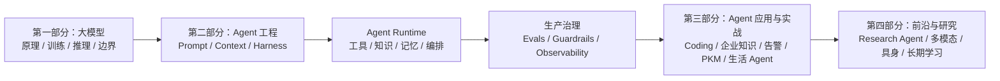

# 书籍介绍

欢迎阅读《AI Agent 工程实践：从大模型基础到生产级智能体系统》。

这不是一本单纯介绍工具按钮怎么点的书。它关注的是一个更长期的问题：当 AI 已经可以读代码、改代码、调用工具、规划任务、检索知识、长期运行甚至并行协作时，工程师应该怎样重新设计自己的工作方式、上下文系统、工具接口、验证回路和生产治理。

## 全书工程主线图

本书按“**大模型 → Agent 工程 → Agent 应用与实战 → 前沿与研究**”四部分展开。主线不是“学一堆工具名”，而是先理解模型能力与边界，再把模型放进可约束、可验证、可治理的 Agent 运行环境，用这套方法完成真实工作，最后以研究型与前沿专题判断下一步能力边界。

```mermaid
flowchart LR
    A["第一部分：大模型<br/>原理 / 训练 / 推理 / 边界"] --> B["第二部分：Agent 工程<br/>Prompt / Context / Harness"]
    B --> C["Agent Runtime<br/>工具 / 知识 / 记忆 / 编排"]
    C --> D["生产治理<br/>Evals / Guardrails / Observability"]
    D --> E["第三部分：Agent 应用与实战<br/>Coding / 企业知识 / 告警 / PKM / 生活 Agent"]
    E --> F["第四部分：前沿与研究<br/>Research Agent / 多模态 / 具身 / 长期学习"]
```

## 本书解决什么问题

AI 工程实践里最容易踩的坑，不是模型不会生成内容，而是我们把不清楚的意图、不完整的上下文、没有边界的工具和没有验证回路的流程交给了模型。结果往往是：第一版看起来很聪明，第二版开始补洞，第三版引入新问题，最后人和 AI 一起在上下文里迷路。

本书的主线是把这种不稳定的协作方式，逐步收敛成可复用、可审查、可验证、可治理的工程系统。

读完之后，你应该能够回答五类问题：

- **模型边界**：LLM 擅长什么、不擅长什么，这些边界如何影响系统设计？
- **任务协议**：如何通过 Prompt、结构化输出和 Context 降低任务歧义与输出漂移？
- **系统落地**：如何通过 Harness、工具、知识、记忆和工作流构建 Agent Runtime？
- **生产治理**：如何评估、监控、调试、回滚并持续优化一个 Agent 系统？
- **现实应用**：如何把大模型与 Agent 用到编程、告警处理、企业知识、个人知识管理和研究任务中？

## 适合谁读

本书主要面向已经参与过真实软件项目的读者，包括后端工程师、AI 应用工程师、技术负责人，以及正在把 AI 编程或 Agent 系统引入团队流程的人。

你不需要是大模型研究员，但最好具备以下基础：

- 能读懂一种主流编程语言的代码示例；
- 理解 API、数据库、测试、日志、部署、权限等基本工程概念；
- 对 LLM、RAG、Agent、MCP、Evals 等术语有初步印象，遇到细节时愿意回查。

如果你刚开始接触 AI 编程，建议按章节顺序建立基础；如果你已经在团队里落地 Agent，则可以直接从第二部分的 Agent 架构、工具、知识系统和生产治理部分切入。

## 内容结构

### 第一部分：大模型

这一部分建立全书的模型基础：理解 LLM 的能力边界、训练与推理机制，以及模型能力如何影响系统设计。它回答“模型能做什么、不能做什么、工程上为什么不能把模型当成万能组件”。

你会获得：

- 大模型范式演进、Token、Embedding、Transformer 等共同语言；
- 训练、推理、微调、量化与部署之间的工程取舍；
- 世界模型与具身智能对未来行动系统的影响；
- 从模型能力边界推导系统约束的方法。

### 第二部分：Agent 工程

这一部分讨论如何把大模型组装为真正可运行的 Agent。它先解释 Agent 如何从对话和 Prompt 应用演化为受控 Runtime，再依次展开任务协议、上下文、Harness、模型协议、工具、知识、记忆、编排和生产治理。

你会获得：

- Agent 与环境、Runtime 和 Harness 的边界；
- Prompt、结构化输出和 Context 作为任务协议与信息架构的设计方法；
- Tool Calling、Skills、MCP、权限、超时、重试和审计设计；
- 状态机、DAG、Router、Plan-and-Execute、多 Agent 编排的适用边界；
- Agent 知识系统、RAG、Agentic RAG、Memory 的系统化设计；
- Evals、Guardrails、可观测性、生命周期和失败诊断的生产治理闭环。

### 第三部分：Agent 应用与实战

这一部分将前两部分的能力放到现实工作中：先拆解成熟产品，再落到企业和个人任务。它关心的是“如何用大模型与 Agent 完成一项可交付、可验证、可治理的真实工作”。

你会获得：

- Claude Code、Cursor、Codex、Pi、OpenClaw 和 Hermes 等成熟系统的设计模式；
- 电商告警 DoD Agent 的生产级架构设计；
- 企业知识助手中的 RAG、搜索、权限与知识治理落地路径；
- 一个可复现、可观测、可扩展的 Coding Agent 项目骨架；
- 个人知识管理 Agent 中 RAG、Memory 和工作流的组合方式；
- 长期运行的生活 Agent 如何通过反馈、评估、审批和回滚，安全演进其知识、Skill 与工作流。

### 第四部分：前沿与研究

这一部分讨论工程实践之外仍在快速演化的前沿问题。它不局限于 Research Agent，后续可扩展到多模态、具身智能、长期学习和世界模型等专题。

你会获得：

- 普通问答、RAG 问答与 Research Agent 的边界；
- 研究型 Agent 的工程瓶颈、评测难题与未来能力架构；
- 将前沿能力判断转化为技术路线与治理取舍的方法。

### 附录

附录提供术语、参考资料、工具清单、系统设计思考题与项目实践模板。它们不再作为正文主线，而是作为随用随查的材料。

## 在线阅读

- **GitHub Pages**：https://wxquare.github.io/ai-book/
- **源码仓库**：https://github.com/wxquare/wxquare.github.io

## 反馈与贡献

欢迎通过 Issue、Pull Request 或博客留言提供反馈。尤其欢迎三类反馈：

- 哪些章节读起来跳跃，缺少承上启下；
- 哪些代码或架构图难以复现；
- 哪些工具、模型或最佳实践已经过时。

## 版本信息

- **当前版本**：v1.0
- **发布日期**：2026 年 4 月
- **更新计划**：持续更新，优先深化大模型基础、Agent 运行时、成熟系统解析、案例、评估体系和生产治理实践。
