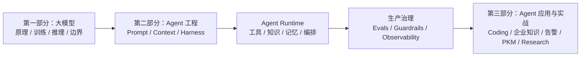

# 书籍介绍

欢迎阅读《AI Agent 工程实践：从大模型基础到生产级智能体系统》。

这不是一本单纯介绍工具按钮怎么点的书。它关注的是一个更长期的问题：当 AI 已经可以读代码、改代码、调用工具、规划任务、检索知识、长期运行甚至并行协作时，工程师应该怎样重新设计自己的工作方式、上下文系统、工具接口、验证回路和生产治理。

## 全书工程主线图

本书按“**大模型 → Agent 工程 → Agent 应用与实战**”三部分展开。主线不是“学一堆工具名”，而是先理解模型能力与边界，再把模型放进可约束、可验证、可治理的 Agent 运行环境，最后用这套方法完成真实工作。

```mermaid
flowchart LR
    A["第一部分：大模型<br/>原理 / 训练 / 推理 / 边界"] --> B["第二部分：Agent 工程<br/>Prompt / Context / Harness"]
    B --> C["Agent Runtime<br/>工具 / 知识 / 记忆 / 编排"]
    C --> D["生产治理<br/>Evals / Guardrails / Observability"]
    D --> E["第三部分：Agent 应用与实战<br/>Coding / 企业知识 / 告警 / PKM / Research"]
```

## 本书解决什么问题

AI 工程实践里最容易踩的坑，不是模型不会生成内容，而是我们把不清楚的意图、不完整的上下文、没有边界的工具和没有验证回路的流程交给了模型。结果往往是：第一版看起来很聪明，第二版开始补洞，第三版引入新问题，最后人和 AI 一起在上下文里迷路。

本书的主线是把这种不稳定的协作方式，逐步收敛成可复用、可审查、可验证、可治理的工程系统。

读完之后，你应该能够回答五类问题：

- **模型边界**：LLM 擅长什么、不擅长什么，这些边界如何影响系统设计？
- **任务协议**：如何通过 Prompt、结构化输出和 Context 降低任务歧义与输出漂移？
- **系统落地**：如何通过 Harness、工具、知识、记忆和工作流构建 Agent Runtime？
- **生产治理**：如何评估、监控、调试、回滚并持续优化一个 Agent 系统？
- **现实应用**：如何把大模型与 Agent 用到编程、告警处理、企业知识、个人知识管理和研究任务中？

## 适合谁读

本书主要面向已经参与过真实软件项目的读者，包括后端工程师、AI 应用工程师、技术负责人，以及正在把 AI 编程或 Agent 系统引入团队流程的人。

你不需要是大模型研究员，但最好具备以下基础：

- 能读懂一种主流编程语言的代码示例；
- 理解 API、数据库、测试、日志、部署、权限等基本工程概念；
- 对 LLM、RAG、Agent、MCP、Evals 等术语有初步印象，遇到细节时愿意回查。

如果你刚开始接触 AI 编程，可以先按“快速上手路径”阅读；如果你已经在团队里落地 Agent，则可以直接从第二部分的 Agent 架构、工具、知识系统和生产治理部分切入。

## 内容结构

### 第一部分：大模型

这一部分建立全书的模型基础：理解 LLM 的能力边界、训练与推理机制，以及模型能力如何影响系统设计。它回答“模型能做什么、不能做什么、工程上为什么不能把模型当成万能组件”。

你会获得：

- 大模型范式演进、Token、Embedding、Transformer 等共同语言；
- 训练、推理、微调、量化与部署之间的工程取舍；
- 世界模型与具身智能对未来行动系统的影响；
- 从模型能力边界推导系统约束的方法。

### 第二部分：Agent 工程

这一部分讨论如何把大模型组装为真正可运行的 Agent。它先解释 Agent 如何从对话和 Prompt 应用演化为受控 Runtime，再依次展开任务协议、上下文、Harness、模型协议、工具、知识、记忆、编排和生产治理。

你会获得：

- Agent 与环境、Runtime 和 Harness 的边界；
- Prompt、结构化输出和 Context 作为任务协议与信息架构的设计方法；
- Tool Calling、Skills、MCP、权限、超时、重试和审计设计；
- 状态机、DAG、Router、Plan-and-Execute、多 Agent 编排的适用边界；
- Agent 知识系统、RAG、Agentic RAG、Memory 的系统化设计；
- Evals、Guardrails、可观测性、生命周期和失败诊断的生产治理闭环。

### 第三部分：Agent 应用与实战

这一部分将前两部分的能力放到现实工作中：先拆解成熟产品，再落到企业和个人任务。它关心的是“如何用大模型与 Agent 完成一项可交付、可验证、可治理的真实工作”。

你会获得：

- Claude Code、Cursor、Codex、Pi、OpenClaw 和 Hermes 等成熟系统的设计模式；
- 电商告警 DoD Agent 的生产级架构设计；
- 企业知识助手中的 RAG、搜索、权限与知识治理落地路径；
- 一个可复现、可观测、可扩展的 Coding Agent 项目骨架；
- 个人知识管理 Agent 中 RAG、Memory 和工作流的组合方式；
- 长期运行的生活 Agent 如何通过反馈、评估、审批和回滚，安全演进其知识、Skill 与工作流。

### 第四部分：前沿与研究

这一部分讨论工程实践之外仍在快速演化的前沿问题。它不局限于 Research Agent，后续可扩展到多模态、具身智能、长期学习和世界模型等专题。

你会获得：

- 普通问答、RAG 问答与 Research Agent 的边界；
- 研究型 Agent 的工程瓶颈、评测难题与未来能力架构；
- 将前沿能力判断转化为技术路线与治理取舍的方法。

### 附录

附录提供术语、参考资料、工具清单，以及系统设计面试题与作品集模板。它们不再作为正文主线，而是作为随用随查的材料。

## 阅读路径

### 快速上手：2-3 天

适合想快速建立 AI 工程方法论的读者：

1. 第 1 章：建立大模型能力演进与工程学习地图；
2. 第 7 章：理解 LLM 能力边界与架构约束；
3. 第 8 章：建立 Agent 架构、Runtime 与模式选择的全局视图；
4. 第 9–11 章：掌握 Prompt、Context 和 Harness 三层工程基础；
5. 选择第 18 章、第 22 章或第 24 章，看一套完整应用如何组装起来；
6. 如果你希望构建会根据反馈受控演进的个人生活 Agent，再读第 26 章；
7. 如果你关注 AI 搜索、研究助手或内容生产，再读第 27 章。

### 系统学习：1-2 周

适合准备建立完整 AI 工程方法论的读者：

1. 按顺序阅读第一部分，建立 LLM 的能力、成本与边界认知；
2. 按顺序阅读第二部分，掌握从任务协议到 Runtime 和生产治理的 Agent 工程链路；
3. 阅读第三部分，学习成熟系统如何取舍，并用真实案例建立工程直觉；
4. 阅读第四部分，了解研究型 Agent 与其他前沿专题的能力边界；
5. 阅读附录，补齐术语、工具、参考资料和面试表达材料。

### 项目驱动：随用随查

适合手上已经有 Agent 项目的读者：

1. 先读第 7 章，判断模型能力边界与问题是否适合 Agent；
2. 需要搭建 Agent Runtime 时读第 8–11 章；
3. 需要接外部系统时读第 12–13 章；
4. 需要处理知识库、私有数据或长期上下文时读第 14–15 章；
5. 需要编排多步任务、状态机、多 Agent 或平台框架选型时读第 16 章；
6. 准备上线前读第 17 章；
7. 想参考真实应用时读第 18–25 章；
8. 需要让个人生活 Agent 基于反馈持续改进时读第 26 章；
9. 需要做 Deep Research、研究型 Agent 或研究系统综述时读第 27 章；
10. 准备面试或作品集时查阅附录D。

## 在线阅读

- **GitHub Pages**：https://wxquare.github.io/ai-book/
- **源码仓库**：https://github.com/wxquare/wxquare.github.io

## 反馈与贡献

欢迎通过 Issue、Pull Request 或博客留言提供反馈。尤其欢迎三类反馈：

- 哪些章节读起来跳跃，缺少承上启下；
- 哪些代码或架构图难以复现；
- 哪些工具、模型或最佳实践已经过时。

## 版本信息

- **当前版本**：v1.0
- **发布日期**：2026 年 4 月
- **更新计划**：持续更新，优先深化大模型基础、Agent 运行时、成熟系统解析、案例、评估体系和生产治理实践。
