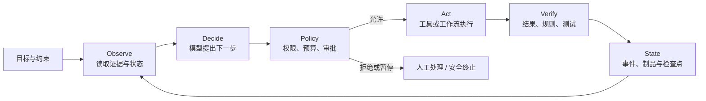

# 第1章 从语言模型到 Agent

## 为什么 LLM 会演进为 Agent？

语言模型能够生成流畅的文字、代码和解释，但“给出一个像样的回答”与“在开放环境中完成一个任务”并不是同一件事。后者需要读取当前事实，选择下一步动作，调用受权限约束的外部系统，在失败后恢复，并根据结果更新后续行为。它不是一次模型调用，而是一段会改变状态的执行过程。

Agent 因而不是“更会调用函数的语言模型”，也不是聊天机器人外接几个插件。它是把模型置于工具、状态、验证、权限和反馈中的系统形态：模型负责从不完整信息中提出候选行动，系统负责约束行动、记录后果并在必要时停止它。模型越强，工程问题并没有消失，而是从“如何训练模型”扩展到“如何运行、评估和治理一个会行动的系统”。

本章的核心判断是：Transformer 和规模化预训练提供了通用表征与生成底座；后训练把概率模型塑造成更可协作的助手；推理期计算把复杂任务从一次生成变成可搜索、可验证的过程；而模型真正走向 Agent，发生在它进入受控环境、能够观察、行动、验证和更新状态的时候。后续章节分别展开这些阶段，本章只建立一张用于设计和诊断 Agent 系统的因果地图。


| 能力跃迁 | 原有瓶颈 | 技术转折 | 获得的能力 | 新的工程问题 | 主责章节 |
| --- | --- | --- | --- | --- | --- |
| 序列建模 | 循环计算慢、远距离依赖困难 | Self-Attention 与 Transformer | 可并行地建模长序列 | 长上下文计算与显存成本 | 本章、第2章 |
| 基础能力 | 每个任务都需专门训练 | 大规模自监督预训练 | 通用语言、知识和代码模式 | 数据、算力、污染与边界 | 第2章 |
| 可协作行为 | 模型只会续写 | SFT、偏好优化、可验证奖励 | 指令遵循与格式约束 | 奖励偏差和能力回归 | 第3章 |
| 复杂推理 | 单次生成容易走偏 | 搜索、验证与预算分配 | 分解、回溯和结果校验 | 延迟、成本与停止条件 | 第4章 |
| 环境行动 | 回答不能取得或改变外部状态 | 工具、Runtime、状态与反馈 | 多步任务执行和恢复 | 权限、副作用、审计与责任 | 第11章、第13--22章 |

这些阶段不是按年份替换旧技术的流水线。今天的模型通常同时包含它们，能力也常由组合而来。图中的箭头表示问题如何累积：前一个阶段解决了一个关键限制，也暴露出下一个阶段必须处理的缺口。理解这种关系，比记住产品发布时间更稳定。

## 1.1 LLM 发展史：从预测文字到参与行动

大语言模型的发展不应被写成一串产品名称。GPT、BERT、ChatGPT、o1 或各类 Agent 框架之所以重要，不在于它们出现得更晚，而在于它们各自改变了“模型解决什么问题、系统还要承担什么责任”。沿着这个视角，LLM 至少经历了五次有连续因果关系的转折。

第一阶段是统计语言模型与早期神经语言模型。它们的目标都是根据上下文预测下一个词或符号，主要服务于输入法、机器翻译、语音识别等任务。n-gram 方法直接统计局部共现，简单可解释，却难以处理长距离依赖和未见组合；神经概率语言模型把词表示与预测目标放进统一网络，开始让模型从数据中学习连续表示 [1]。这一阶段解决了“怎样估计语言概率”，但模型容量有限，任务通常仍需专门训练。

第二阶段是深度表征学习与 Transformer。Word embedding、RNN、LSTM 和 encoder-decoder 模型逐步证明，语言可以被表示为可迁移的向量和状态；但循环计算限制了并行训练，也使很长序列难以稳定处理。Transformer 用 self-attention 改写了序列计算方式，使训练可以充分利用并行硬件 [2]。这不是单纯的结构替换：它为后来的大规模自监督训练提供了现实可行的计算基础。

第三阶段是基础模型与规模化预训练。BERT、T5、GPT-3 等工作显示，一个在海量数据上训练的模型可以迁移到许多任务，甚至仅凭上下文示例完成少样本适配 [3][4][6]。模型的角色从“为一个标签任务训练的组件”变为“可由提示、上下文和少量适配重新配置的能力底座”。与此同时，数据来源、训练成本、污染、记忆与能力评估变成新的核心问题；第2章讨论的正是这一转折的内部机制。

第四阶段是指令对齐和助手化。预训练模型擅长延续文本，却不天然知道用户想要什么、何时应该拒绝、怎样遵循格式。指令微调、RLHF 与偏好优化把示范和人类偏好纳入训练，使模型从“续写器”更接近可交互助手 [8][9]。ChatGPT 所代表的变化并不是模型忽然获得了全部知识，而是默认行为、对话协议和产品入口发生了改变。它也暴露出新的风险：模型可能更会讨好用户，却不一定更真实；因此第3章要继续追问怎样定义、训练和验证可用行为。

第五阶段是推理期扩展与环境行动。复杂数学、代码和规划任务表明，单次生成不总能给出可靠答案；CoT、搜索、验证器和 reasoning training 让模型可以用更多计算尝试、检查和修正路径 [10][11]。随后，ReAct、Toolformer 和各类 Agent 系统把模型接入检索、代码执行、数据库和业务工具 [29][30]。模型从生成答案逐渐参与工作流，但这并不意味着它可以自由行动：工具权限、状态恢复、验证和审计反而成为系统能否上线的前提。

今天的多模态模型、世界模型和具身方向，并非另起炉灶，而是继续扩大模型能够观察和影响的环境。它们把图像、语音、视频、屏幕乃至物理动作带入输入输出链路，也把 grounding、安全和行动后果推到更前面。发展史的主线因此不是“模型越来越大”，而是模型从预测语言，走向在更广泛环境中提出和执行受约束的行动；每次能力扩展都要求系统提供更明确的控制边界。

## 1.2 从序列瓶颈到 Transformer：为什么语言模型能够规模化

语言模型的基本任务是：给定此前出现的符号，估计下一个符号的条件概率。对 token 序列 $x_1, x_2, \ldots, x_T$，自回归模型把整段文本的概率写为：

$$
P(x_1, \ldots, x_T)=\prod_{t=1}^{T}P(x_t\mid x_{<t}).
$$

这个目标并不等于“理解世界”。它要求模型从大量样本中压缩有助于预测后续文本的规律：词义、语法、叙事结构、程序模式、常识关联，以及人们如何描述任务和结果。早期统计语言模型依赖 n-gram 计数，窗口变长后会遇到稀疏性；神经概率语言模型把符号表示与概率预测放进同一套可学习参数中，说明分布式表示可以缓解组合爆炸 [1]。但在大规模数据上，循环网络仍有两个限制：时间步必须依次计算，训练难以充分并行；远距离信息需要跨越很多状态传递，容易衰减或被覆盖。

Transformer 的技术转折，是把“当前位置应参考哪些历史位置”变成注意力计算。每个 token 的表示被投影成 Query、Key 和 Value，注意力权重由 Query 与 Key 的相似度决定：

$$
\operatorname{Attention}(Q,K,V)=\operatorname{softmax}\left(\frac{QK^T}{\sqrt{d_k}}\right)V.
$$

它不再要求信息沿相邻时间步逐一传递，而允许一个位置直接选择其他位置作为信息来源。多头注意力让不同子空间可以同时关注名称与代词、函数定义与调用、条件与例外；前馈网络再对聚合后的表示做非线性变换。残差连接和归一化帮助深层网络稳定训练 [2][12][13]。最重要的是，训练时同一段序列的大部分位置可并行计算，这使模型、数据和算力能够一起扩展。

从系统视角看，一次模型调用不是“字符串进、字符串出”。Tokenizer 将文本切成词表中的离散 token；Embedding 将 token ID 映射为连续向量；位置编码或相对位置信息提供顺序与距离；多层 Transformer 生成下一位置的 logits；解码策略从概率分布选择下一个 token。训练时，模型通常并行处理整段已知目标；生成时，后一个 token 依赖前一个 token，仍需要逐步 decode。这一区别会直接影响推理服务的延迟、缓存和调度，但具体的 KV Cache、批处理和容量规划属于第9章。


注意力并不是免费的。标准注意力要比较序列中的许多位置，输入变长时计算和内存开销会快速上升；位置外推也不天然保证可靠。ALiBi、RoPE、FlashAttention、GQA 和专家混合结构，分别从位置表示、IO、KV 状态或参数激活等角度缓解不同瓶颈 [14][15][16][17][19][20]。这些改进让模型能处理更长上下文或在相似硬件上取得更高吞吐，却不自动让模型拥有更准确的事实、更安全的工具调用或更好的任务判断。

第一层边界由此出现：Transformer 解决的是可扩展的序列表示与生成，不是任务目标本身。一个模型即使能预测极自然的后续文本，也可能在“应拒绝什么”“应引用什么证据”“何时调用工具”上没有稳定答案。下一步的问题不再只是架构够不够强，而是这种架构怎样在数据和训练目标的共同作用下形成基础能力。

### 从 token 概率到可用能力，中间缺少什么

理解 Transformer 时容易陷入两个相反的极端。一个极端是把它当成只会背诵语料的巨大自动补全器；另一个极端是把注意力权重解释为模型已经拥有可直接读取的、完整的世界知识。两种说法都不准确。next-token prediction 不是逐字背诵：若模型只能记住训练句子，它无法在从未见过的措辞、变量名或组合关系中继续生成。训练迫使模型把重复出现的结构压缩到参数中，因而会形成语义、语法、代码模式和部分因果关联的可迁移表示。

但这种表示仍是为预测而形成的。模型可能知道“退款通常需要订单号”，却不意味着它知道某个订单当前是否可退款；可能知道许多 SQL 模式，却不意味着它有权执行删除操作；可能在大量题目上给出正确推导，却不意味着它能说明这次答案的证据来自哪里。概率模型擅长把已有模式延展为候选，生产系统则需要区分候选、事实、权限和承诺。后面所有工程层，都是在补这条差距。

对 Agent 工程师而言，最实用的不是背诵 Attention 的每个变体，而是知道输入发生变化会影响哪一层。Tokenizer 变化会改变 token 数、截断位置和成本；chat template 变化会改变模型看见的任务协议；位置编码与上下文长度会影响远距离信息的可用性；解码参数会改变候选的多样性；模型版本和量化格式会改变质量与延迟。它们都是同一个“模型调用”的组成部分，不能在发布时被当作无关紧要的配置。

例如，一个固定 JSON 字段偶尔丢失，第一反应不应是“模型不懂 JSON”。先检查 schema 是否进入输入，停止条件是否截断了对象，Tokenizer 是否把特殊符号处理为预期 token，以及输出解析器是否把可恢复的小错误直接归为失败。若这些条件都满足仍不稳定，才需要考察模型能力、示范数据或约束解码。这样的诊断顺序避免把系统契约问题误交给更大的模型解决。

## 1.3 从模型规模到基础能力：能力为什么会涌现

Transformer 提供了可扩展的容器，但容器里能学到什么，取决于训练信号。大规模预训练把大量无标注文本、代码和其他序列组织为预测任务，使同一个模型不必为每个下游任务重新训练。BERT 展示了双向预训练的迁移价值，T5 用统一的文本到文本接口连接不同任务；GPT-3 则表明，当参数、数据和算力跨过一定规模后，模型可以在上下文示例中表现出少样本适配能力 [3][4][6]。

这里最常见的误解是“参数越大，就必然越聪明”。规模规律研究说明，损失会随模型、数据和计算预算变化，但可用能力仍受数据分布、训练配比、Tokenizer、优化稳定性和评估方式影响 [5][7]。训练数据覆盖了许多稳定模式，模型才可能学会这些模式；训练数据缺少某种语言、任务或边界条件，模型规模本身无法补出可信能力。MoE 可以用稀疏激活扩展参数容量，但同时把专家路由、通信和负载均衡带入工程决策 [16][17][18]。

预训练是“形成能力的底座”，不是给产品写好行为规则。它让模型压缩语言和世界中的统计关联，却不会直接告诉模型某个企业今天的库存、一个用户是否拥有权限，或一次转账是否允许执行。时效知识需要检索或工具，业务规则需要确定性策略，副作用操作需要权限、幂等和审批。第2章将回到预训练现场，讨论数据、目标函数、Tokenizer、规模和算力如何共同形成能力，以及数据污染、隐私和训练预算为何不能被一句“继续 scale”带过。

### 规模带来的不是万能性，而是新的选型问题

规模化改变了模型选型的方式。小模型时代，团队往往围绕一个明确标签训练一个专用分类器；基础模型时代，团队先问现有模型能否通过上下文、检索或少量适配完成任务。前者把成本前置在数据标注和训练上，后者把成本分散到模型调用、上下文构建、评估和运行时控制上。没有哪种方式天然更优，关键在任务是否稳定、知识是否频繁变化、输出是否必须严格、风险是否可验证。

把模型扩大也会改变错误形态。小模型的错误常表现为某类样本识别不了；基础模型的错误可能表现为语言极流畅、理由很完整，却引用了不存在的事实或忽略了一个关键条件。模型越通用，越容易让用户误以为它“什么都知道”；因此系统越需要显式标出证据来源、置信边界和拒答条件。第2章讨论能力来源时，不只问训练 loss 是否下降，也要问数据是否覆盖目标分布、评测是否隔离、结果是否能迁移到真实任务。

一个简单的选择例子是企业知识助手。若问题来自每周更新的制度文档，重新预训练或微调通常不是第一步：更合理的路径是先建立授权文档的版本化检索和引用链。若长期、大量出现固定字段抽取或工具参数格式错误，且已排除上下文和协议问题，才可能考虑高质量示范与微调。若质量达到要求但部署成本过高，再评估量化、蒸馏或更小模型。这条路径把知识时效、行为稳定性和成本分别交给正确的层，而不是把所有问题塞回“训练一个更大模型”。

## 1.4 从续写到协作：为什么需要后训练

预训练模型学习的是“在类似训练语料的上下文中，什么 token 最可能出现”。用户需要的却是“理解我的意图，遵守格式，区分已知与未知，并在限制内完成任务”。两者的差异就是后训练出现的原因。指令微调把许多任务表示为自然语言指令，使模型更容易从续写模式切换到任务模式；InstructGPT 将高质量示范、偏好建模和强化学习组合起来，说明模型输出可以朝人类偏好的帮助性与安全性移动 [8]。

后训练不是一个单一算法。SFT 用示范确定默认表达、工具参数形状和任务步骤；偏好优化在多个可行答案间表达“哪个更好”，DPO 则以直接方式利用偏好对 [9]；可验证奖励适合数学、代码测试或字段完整性等能够定义结果判定器的任务，近年来也被用于推理能力训练 [11]。这些方法解决的是不同问题，因此不能用一个“对齐分数”代替全部验收。

代价同样明确。示范数据会继承标注者的偏好和盲点；偏好优化可能奖励更讨好、更长或更保守的回答；奖励函数若只覆盖容易量化的代理指标，会诱发 reward hacking。后训练还可能在提升一种行为时损伤另一种能力，形成对齐税或领域回归。因此，对齐不能替代工具权限、数据库事务、证据校验和人工升级。第3章将比较 SFT、RLHF、DPO、RLAIF 与 RLVR 的选择边界，并讨论如何用评估证明行为变化真的有益。

即使后训练把模型变成了更守指令的助手，复杂任务仍会失败。合同审查、程序修复和多步规划需要保留中间假设、比较多条路径、执行检查，再决定是否继续。一个“默认行为更好”的模型，并不意味着它在一次前向生成中总能找到正确路径。

## 1.5 从一次生成到受预算的推理：为什么需要推理期扩展

自回归生成每一步都在局部概率分布中选择下一个 token。对短问题，直接解码通常足够；对数学证明、代码调试、约束规划和长文档比对，早期一个错误假设会把后续内容带向流畅但错误的结果。Chain-of-Thought 的价值不在于让模型“展示神秘思维”，而在于把原本压缩在一次生成里的中间分解显式化，使模型或外部系统有机会检查步骤 [10]。

推理期扩展进一步把更多计算投入候选生成、路径比较、验证和修正中。可以横向采样多个候选并用验证器选择，也可以纵向延长一条轨迹并在关键节点回溯。对可验证任务，结果验证器、单元测试、编译器或规则约束能把“看起来合理”变成更可检验的信号；对无法稳定验证的开放任务，增加推理 token 只能提高某些任务的成功概率，不能变成正确性承诺。推理强化训练与推理期搜索常相互促进，但两者不等同：前者改变模型的默认策略，后者消耗当前请求的预算 [11]。

这条路线带来直接取舍。更长轨迹、更多候选和额外验证会提高延迟、单位任务成本和隐私暴露面；错误的停止条件可能过早结束，也可能让任务无止境循环。工程上应先按任务可验证性、风险和时延预算决定是否需要搜索，再为结果定义通过、重试、降级或人工接管条件。第4章讨论采样、搜索、CoT、验证器和 test-time scaling 的算法选择；第9章讨论怎样把这些预算稳定交付为在线服务，二者不能混为一谈。

推理期扩展仍发生在模型的计算边界内。它可以帮助模型想得更久，却不能让模型自行取得当前库存、修改生产配置，或保证一项外部操作已经成功完成。要解决这些问题，模型必须进入环境，并且环境必须反过来约束模型。

### 推理预算必须是一项产品和系统决策

“给模型更多时间思考”听起来像纯算法选择，实际却是用户体验和资源策略。在线客服场景可能要求在数秒内返回稳定、可解释的结果；离线代码迁移可以容忍更长等待，并允许运行测试；高风险审批任务即使模型很快给出答案，也应把时间花在证据检索、规则校验和人工复核上。相同模型面对不同任务，应获得不同的推理预算和停止条件。

一个成熟策略至少要回答四个问题。第一，哪些请求值得额外计算：可验证的复杂任务通常收益更高，开放式闲聊则未必。第二，验证器检查什么：语法、单元测试、数值约束、引用完整性还是业务规则。第三，预算耗尽怎么办：返回部分结果、切换更简单路径、请求补充信息还是人工转交。第四，怎样从失败中学习：把失败轨迹、验证器拒绝原因和最终人工结果写入评估集，而不是只记录最终文本。

这也解释了为什么第4章和第9章必须分开。第4章讨论“模型怎样取得更好的候选答案”，包括采样、搜索与验证；第9章讨论“平台怎样在并发和 SLO 下供应这些计算”，包括排队、缓存、路由和容量。若把两者混在一起，读者容易把吞吐优化误认为推理能力，或把更长的思维链误认为系统可靠性。算法和基础设施通过预算、token、延迟和验证结果相连，但承担不同责任。

## 1.6 从回答到行动：为什么模型必须进入受控环境

当任务只要求写一段说明，模型输出的主要风险是内容质量；当任务要求查询订单后决定是否退款、根据仓库状态生成补货申请，或修复代码并运行测试，输出会触发外部状态变化。此时模型不再只是文本生成器，而是行动建议者。它需要读取观察结果、选择工具、处理工具返回的错误、判断是否继续，并在长任务中保留可恢复状态。ReAct 将推理与行动交替组织，Toolformer 研究了把工具调用纳入语言模型训练的可能性，它们都说明模型能力开始与环境反馈结合 [29][30]。

一个最小 Agent 循环可以写成：

```text
observe -> decide -> act -> verify -> update state
```

- **observe**：从用户输入、数据库、检索、传感器或上一步工具结果取得当前事实；
- **decide**：在目标、预算、权限和当前上下文下生成一个可执行的下一步；
- **act**：通过受 schema、权限和幂等键约束的工具请求改变或读取外部状态；
- **verify**：检查工具返回、结构化结果、测试、业务规则或人工审批是否满足继续条件；
- **update state**：记录事实、制品、失败原因和可恢复位置，供重试、回放与评估使用。

Function calling 只覆盖其中一小段：它让模型生成符合 schema 的参数，不能替代观察源可信度、工具授权、执行幂等性、补偿事务、状态持久化或审批。把函数调用等同于 Agent，会掩盖最危险的部分：语言模型可能在不完整信息下提出貌似合理的副作用操作。可靠 Agent 系统应让模型提出候选，由 Runtime 和策略层决定是否允许、怎样执行、怎样记录。第11章定义 Task、Run、Step、Event 与恢复边界；第13--22章再分别展开 Prompt、Context、Harness、工具、记忆、编排、评估与治理。



模型进入环境也扩大了输入和后果。多模态模型使图像、文档、语音、视频和屏幕成为可观察对象；CLIP 与 Flamingo 展示了跨模态对齐和少样本视觉语言能力 [27][28]。但“看见”不等于 grounding 正确：系统仍要保存页码、坐标、时间戳、OCR 结果和原始证据，才能让结论可追溯。第5章讨论模型适配、压缩和多模态能力的选择边界。

当动作离开纯数字系统而进入机器人、设备或其他物理环境，要求会进一步提高。语言或视觉模型可以帮助理解任务和提出候选计划，却不应绕过碰撞检测、速度限制、急停和人工接管。世界模型、仿真和具身策略关心的是状态、动作和后果是否一致，而不只是生成画面是否自然。第6章将把问题组织为感知、世界预测、规划、控制与安全反馈的闭环。输入越接近现实、行动副作用越大，模型的自由度就越应受到确定性控制和可审计证据的约束。

### 行动为何迫使系统拥有状态

一次文本生成失败，通常可以重新发起请求；一次外部行动失败，却必须先回答“已经做到了哪一步”。例如 Agent 先创建工单、再查询库存、再申请退款：若网络在第三步超时，系统不能简单把整段对话重新执行，否则可能重复创建工单或重复退款。它需要区分用户目标、一次执行、每个步骤、工具请求、外部回执和补偿动作，并用幂等键与事件记录决定从哪里恢复。

这就是状态从“聊天记录”升级为运行时事实的原因。聊天记录只保存语言上下文；运行时状态还要保存工具版本、输入制品、权限快照、预算、尝试次数、审批结果和外部副作用。模型可以根据这些状态提出下一步，但不应自行改写历史事实。只有这样，系统才可能在故障后回放、在争议时审计、在版本升级后比较行为。

权限也必须在模型之外强制执行。提示词可以要求模型“不要删除数据”，却不能保证模型在被诱导、误解或上下文污染时仍然遵守；真正的删除权限应由工具网关、身份系统和策略规则判定。对高副作用操作，系统还应把模型提出的动作拆为提议、预览、审批和执行几个阶段。人类不必审阅每个低风险读取，但必须能为不可逆或高影响的行动提供最终控制。

因此，Agent 系统的好坏不能只看最终回答是否漂亮。更重要的指标包括：工具参数是否有效、外部状态是否正确、失败是否可恢复、是否发生越权、人工接管是否及时、每个关键决定是否有足够证据。第10章建立质量与反馈闭环，第11章讨论状态、持久化和回放，第12章再把这些要求放入生产级控制体系。

## 1.7 从模型能力到系统能力：怎样定位失败发生在哪里

从语言模型走向 Agent 后，系统失败不应被笼统称为“模型幻觉”。同一句错误回答可能来自模型不具备所需能力，也可能来自错误证据、错误上下文拼装、过低推理预算、失效工具调用，或没有生效的发布策略。把失败放回所在层，才知道应该改数据、改模型、改检索、改 Runtime，还是改控制面。

```text
应用目标
  Agent / Workflow / Tool Gateway
  Prompt / Context / Retrieval / Memory
  Model Router / Inference Policy / Verifier
  Serving Runtime / Tokenizer / Model Artifact
  Transformer / Kernels / GPU / Network / Storage
```

| 现象 | 首先检查的层 | 典型原因 | 不应误用的补救 | 详细章节 |
| --- | --- | --- | --- | --- |
| 回答缺少最新政策或没有来源 | Context / Retrieval | 文档未召回、版本过期、权限过滤或上下文截断 | 仅靠微调把时效知识写进参数 | 第5章、第19章 |
| 固定 JSON 经常不合法 | 输出契约与验证 | Schema 不完整、约束解码或解析器缺失 | 只把温度调低 | 第4章、第14章 |
| 数学或代码任务偶发错误 | 推理预算与验证 | 一次生成走偏、测试不足、停止过早 | 把 reasoning model 当绝对正确 | 第4章、第10章 |
| 工具重复执行或执行越权 | Runtime / Policy | 缺少幂等键、权限检查、审批或补偿 | 只改工具描述或 system prompt | 第11章、第18章 |
| 并发上升后延迟或成本失控 | Serving / Capacity | 长上下文、KV 状态、排队或路由不当 | 只换更大模型 | 第9章、第12章 |
| 模型升级后质量回退 | Eval / Release | 回归集不足、模板或制品变更未绑定评估 | 凭少量 demo 直接发布 | 第10章、第12章 |

这个栈不是要求每个团队都实现所有层。它的价值在于明确责任边界：基础模型负责把输入变成候选表示和输出；上下文层负责提供当前、授权且可追溯的事实；推理策略负责分配采样、搜索和验证预算；工具与 Runtime 负责外部行动、状态和恢复；生产控制面负责 SLO、发布、安全、成本和审计。某层做得更强，不会自动取消其他层的责任。

### 一个失败案例：把错误退款回答拆回责任层

设想企业助手回答“该订单可以全额退款”，随后又尝试调用退款工具。这个事件至少有五种不同根因。用户问题可能没有说明订单渠道、商品类型或购买时间；检索系统可能没有召回最新政策，或召回了没有权限展示的旧版本；上下文构建可能把例外条款截断；模型可能忽略证据中的限制条件；工具网关也可能没有把“建议退款”与“执行退款”区分开。若只将事件标为模型幻觉，团队几乎无法知道应在哪里修复。

正确的处理顺序是先冻结证据。保存用户请求、检索文档版本、最终上下文、模型与模板版本、采样策略、工具参数和外部返回。然后逐层提问：正确政策是否被授权且被召回？证据是否进入模型上下文？模型是否引用了错误条款？系统是否要求对金额和资格调用确定性规则？工具执行前是否经过审批？这些问题的答案会把同一个“错误回答”拆成数据问题、上下文问题、模型问题、策略问题或运行时问题。

这类分层诊断的价值在于形成可学习闭环。若文档未召回，应补查询和索引评测；若模型忽略条款，应改上下文组织、提示契约或后训练样本；若工具越权，应修策略而非只加一条提示；若人工最终判定不同，应把案例转为带版本的回归样本。模型能力是系统的一部分，失败也应成为系统可消化的输入，而不是一次无法复盘的事故。

### 能力跃迁如何逐步移动系统边界

把大模型发展理解为能力清单，容易产生一种错觉：只要选择更新、更强的模型，系统就可以逐层变简单。真实情况往往相反。每一轮能力提升都会把一部分原先由应用代码处理的工作交给模型，同时把更高阶的约束暴露出来。系统边界不是消失，而是在向外移动。

语言建模阶段，应用主要关心输入是否清晰、输出是否可读；模型能生成更长、更通顺的内容后，问题变成如何避免把过时或无来源的知识当事实。于是检索、引用和上下文构建成为必要层。指令遵循能力提升后，模型更容易按照用户要求行动，问题又变成用户要求是否本身越权、含糊或危险；于是权限、策略和审批不能只由 prompt 承担。推理能力提升后，模型能够花更多计算解决难题，问题则变成怎样证明它没有在错误前提上推得更远；于是验证器、测试和结果门禁变得重要。

当工具使用和多步行动变得可行时，边界移动得最明显。过去一次 API 调用失败，只需记录错误码并重试；现在一个任务可能跨模型、搜索、数据库、代码执行器和人工审批，任何一个步骤部分成功都会留下状态。传统分布式系统中的幂等、超时、重试、补偿、死信队列和审计，不会因为调用者是模型而失效，反而更重要：模型的行为具有概率性，输入也可能被不可信文本影响，系统必须为不确定性准备确定性的控制。

多模态和具身方向继续扩大这个边界。文本错误通常还能由用户阅读后纠正；文档、图像和屏幕理解可能带来坐标、版式、OCR 和证据定位问题；物理动作还会带来时间、空间、碰撞和安全约束。模型可以参与感知和候选规划，但安全回路需要独立运行，不能等待语言模型“意识到风险”。这正是第6章从世界预测走到控制与安全闭环的原因。

因此，评价一个 Agent 系统时应同时问两组问题。第一组是能力问题：模型能否理解任务、生成候选、使用工具、处理多模态输入和完成必要推理。第二组是控制问题：系统是否能提供正确事实、限制权限、验证关键结果、恢复中断任务、观察成本和留存审计证据。前一组决定系统可能做到什么，后一组决定系统是否值得被允许去做。两者缺一不可。

### 从模型选型到任务验收：一条可复用的判断路径

模型选型不应从排行榜开始，而应从任务失败的代价开始。若任务是低风险文本改写，重点通常是表达质量、延迟和单位成本；若任务要求基于公司规则回答问题，重点变成证据覆盖、权限和引用忠实度；若任务要求调用外部系统，重点还要包括 schema 合法率、工具成功率、幂等性和人工接管；若任务影响资金、设备或合规，模型只能参与建议，最终决策必须由可验证规则或有责任主体的审批完成。

可以把一次模型能力引入拆成五个连续问题。第一，目标是否可被清楚定义：输入、输出、成功条件和禁止动作是什么。第二，所需事实来自哪里：参数记忆是否足够，还是必须检索、查询数据库或调用工具。第三，错误是否可自动验证：能否用 JSON schema、编译器、单元测试、数值约束、引用规则或业务策略检查。第四，副作用是否可逆：若不可逆，能否预览、分级审批或建立补偿。第五，怎样收集反馈：哪些失败会进入回归集，哪些指标会阻止版本继续灰度。

这五个问题也能防止“用微调解决一切”的冲动。知识更新快，优先解决来源和检索；行为格式不稳定，才考虑示范和后训练；复杂但可验证，才增加推理预算和验证器；副作用高，先建设策略和人工门禁；成本不达标，再比较模型大小、量化、缓存和路由。技术选择由问题结构驱动，不应由某个方法的热度驱动。

以代码修复 Agent 为例，模型能读懂报错只是起点。它还需要取得正确仓库、理解当前分支和测试命令、在隔离环境修改文件、执行测试、识别测试是否真正覆盖改动，并把 diff 交给人或发布流程。若测试失败，系统要保存失败输出并决定重试、缩小修改范围还是请求帮助；若测试通过，也不代表安全上线，还需要检查依赖、权限和部署门禁。模型能力使这些步骤可被编排，Runtime 与治理层才使它们可被信任。

本书随后采用的章节顺序正对应这条判断路径：第2章解释能力底座怎样形成，第3章解释默认行为怎样被塑形，第4章解释何时值得为推理投入额外计算，第5章解释怎样按业务适配和压缩能力，第6章解释行动进入物理环境后为什么需要闭环；第7--12章再把这些能力放进可生产、可交付、可评估、可恢复和可控制的基础设施中。读者在每章学到的不应只是一个技术名词，而应是它替代了什么旧做法、带来了什么新能力，又把什么责任留给系统。

这也是阅读本书其余部分的一种方法。遇到一个新模型、一个新框架或一篇看起来很强的论文时，可以先把它放到本章的地图中：它是在改进表示与训练，还是在塑造行为；是在增加推理时计算，还是在扩大可观察和可行动的环境；它解决的失败模式是什么，又新增了哪些成本、权限或验证问题。若无法回答这些问题，技术宣传往往只是在替换名词。若能够回答，就能把快速变化的产品信息还原成更稳定的工程判断，并决定它应当进入模型层、上下文层、Runtime 还是生产控制面。

这套判断也保护团队免于两种常见浪费：一是把本可由检索、规则或流程解决的问题送去重新训练模型；二是在缺少数据、评估和控制面时过早把模型接入高副作用任务。前者会制造昂贵而过时的能力，后者会制造难以解释的事故。好的架构不是让模型承担最多职责，而是让模型在最擅长的不确定性判断处发挥作用，并把事实、权限、执行与责任放在更适合的系统组件中。

本章的地图不是对未来路线的预测，而是一种当前可用的分工原则。模型和工具会继续变化，然而“能力从何而来、行为怎样被塑造、结果如何被验证、行动怎样受控”仍会是评审任何 Agent 系统的基本问题。

当一个方案无法同时说清这四件事时，团队应先补足问题定义和证据，而不是急于把它包装成自主智能。可靠性始于边界清楚，而不是能力宣称得足够宏大。

## 1.8 五个会破坏系统判断的误解

| 误解 | 为什么错误 | 应由哪个系统层处理 | 后续章节 |
| --- | --- | --- | --- |
| 模型等于搜索引擎 | 参数记忆没有天然来源、时间和权限边界 | 检索、数据库、证据与访问控制 | 第5章、第19章 |
| Function Calling 等于 Agent | schema 输出不包含状态、恢复、审批和副作用控制 | Runtime、工作流、策略和审计 | 第11章、第18章、第21章 |
| 推理模型保证正确 | 更多计算提高的是某些任务成功概率，不是确定性 | 验证器、测试、人工升级和评估 | 第4章、第10章 |
| 长上下文等于记忆 | 上下文是本次请求可见 token；记忆是跨任务状态 | Context、Memory 与 Serving 分层 | 第9章、第15章、第20章 |
| 模型榜单等于选型结论 | 排行榜不能代表业务分布、时延、成本、权限和工具风险 | 任务评估、路由与发布门禁 | 第10章、第12章 |

模型接口把复杂系统压缩成简单的输入和输出。API 的简洁是好事，但不能掩盖底层事实：生成模型输出的是条件概率下的候选；可信任务结果来自候选、证据、验证与控制的共同作用。工程师要做的不是把所有失败归因于模型，也不是用更多提示词掩盖所有系统缺口，而是为每类失败找到可验证、可修改的责任层。

## 本章结论：Agent 的能力底座仍是训练出来的

Transformer 让序列建模能够并行扩展，预训练让模型从大量数据中获得可迁移的语言和模式能力，后训练让这些能力更符合任务与协作约束，推理期扩展则在某些复杂任务上用更多计算换取更高成功率。它们共同解释了语言模型为什么越来越像通用问题求解组件。

但 Agent 的出现提醒我们，组件能力并不等于系统能力。只要任务要读取外部事实、改变外部状态或承担现实后果，模型就必须进入工具、状态、验证、权限和反馈组成的受控环境。模型越能提出行动，系统越需要明确何时允许行动、怎样恢复和由谁负责。

本章说明了语言模型为何会走向 Agent，但尚未回答基础能力究竟由什么训练信号形成。参数规模本身不能解释模型知道什么、不会什么，以及为什么某些能力只在特定数据和算力预算下出现。第2章因此回到预训练现场，回答数据、目标函数、Tokenizer、规模和算力如何共同塑造模型能力。

## 参考资料

[1] Bengio, Y., et al. A Neural Probabilistic Language Model. JMLR, 2003.
[2] Vaswani, A., et al. Attention Is All You Need. NeurIPS, 2017.
[3] Devlin, J., et al. BERT: Pre-training of Deep Bidirectional Transformers for Language Understanding. NAACL, 2019.
[4] Raffel, C., et al. Exploring the Limits of Transfer Learning with a Unified Text-to-Text Transformer. JMLR, 2020.
[5] Kaplan, J., et al. Scaling Laws for Neural Language Models. arXiv:2001.08361, 2020.
[6] Brown, T. B., et al. Language Models are Few-Shot Learners. NeurIPS, 2020.
[7] Hoffmann, J., et al. Training Compute-Optimal Large Language Models. NeurIPS, 2022.
[8] Ouyang, L., et al. Training Language Models to Follow Instructions with Human Feedback. NeurIPS, 2022.
[9] Rafailov, R., et al. Direct Preference Optimization. NeurIPS, 2023.
[10] Wei, J., et al. Chain-of-Thought Prompting Elicits Reasoning in Large Language Models. NeurIPS, 2022.
[11] Guo, D., et al. DeepSeek-R1: Incentivizing Reasoning Capability in LLMs via Reinforcement Learning. arXiv:2501.12948, 2025.
[12] Ba, J. L., Kiros, J. R., & Hinton, G. E. Layer Normalization. arXiv:1607.06450, 2016.
[13] Zhang, B., & Sennrich, R. Root Mean Square Layer Normalization. NeurIPS, 2019.
[14] Press, O., Smith, N. A., & Lewis, M. Train Short, Test Long. ICLR, 2022.
[15] Su, J., et al. RoFormer: Enhanced Transformer with Rotary Position Embedding. Neurocomputing, 2024.
[16] Shazeer, N., et al. Sparsely-Gated Mixture-of-Experts Layer. ICLR, 2017.
[17] Fedus, W., Zoph, B., & Shazeer, N. Switch Transformers. JMLR, 2022.
[18] Jiang, A. Q., et al. Mixtral of Experts. Mistral AI Technical Report, 2024.
[19] Dao, T., et al. FlashAttention. NeurIPS, 2022.
[20] Dao, T. FlashAttention-2. ICLR, 2024.
[21] Touvron, H., et al. LLaMA. arXiv:2302.13971, 2023.
[22] Bai, J., et al. Qwen Technical Report. arXiv:2309.16692, 2023.
[23] InternLM Team. InternLM: A New Language Model with Extended Training and Evaluation. 2023.
[24] 李沐、Aston Zhang、张岳：《动手学深度学习（第二版）》，人民邮电出版社，2023。
[25] 邱锡鹏：《神经网络与深度学习》，机械工业出版社，2020。
[26] 周志华：《机器学习》，清华大学出版社，2016。
[27] Radford, A., et al. Learning Transferable Visual Models From Natural Language Supervision. ICML, 2021.
[28] Alayrac, J.-B., et al. Flamingo: a Visual Language Model for Few-Shot Learning. NeurIPS, 2022.
[29] Yao, S., et al. ReAct: Synergizing Reasoning and Acting in Language Models. ICLR, 2023.
[30] Schick, T., et al. Toolformer: Language Models Can Teach Themselves to Use Tools. NeurIPS, 2023.
