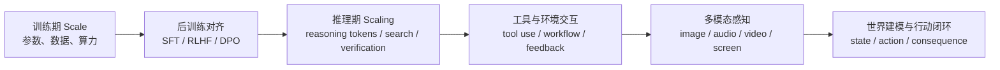
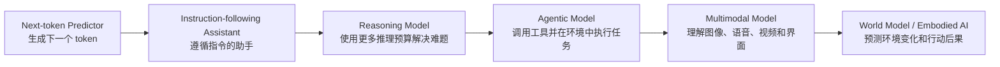
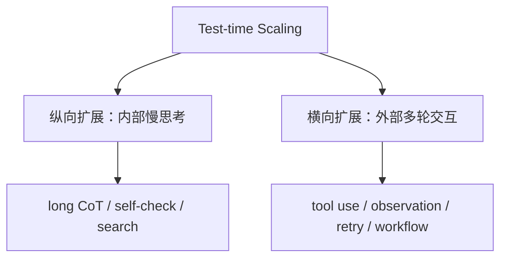
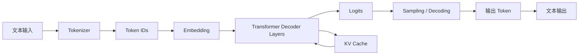

# 第1章 大模型范式演进与工程学习地图

这一部分不是从数学推导开始重新写一本深度学习教材，而是给工程师一张能够服务 Agent 系统设计、模型选型、推理部署和面试表达的基础地图。

本书前面几部分已经讨论了 Prompt、Context、Harness、RAG、Memory、Evals 和 Agent Runtime。它们都是大模型之上的工程层。要把这些系统做稳，不能只知道“怎么调用 API”，还要知道模型能力是如何一步步发展出来的：为什么 Transformer 改变了序列建模，为什么 GPT-3 让 in-context learning 成为主流，为什么 ChatGPT / GPT-4 让对齐和产品化变得重要，为什么 o1、DeepSeek-R1 和 Kimi K1.5 代表 reasoning RL 与 test-time scaling 的兴起，为什么 o3 / o4-mini、Kimi K2 和 GPT-5 thinking 让模型越来越像可嵌入运行时的行动组件，以及为什么多模态和世界模型会把 AI 从“回答问题”推进到“感知环境、预测后果并行动”。

所以，本章的重点不是罗列术语，而是建立一条主线：

```text
语言建模
  -> 规模化与上下文学习
  -> 指令遵循与对齐
  -> 推理强化与 Test-time Scaling
  -> Agentic Model 与工具环境
  -> 多模态基础模型
  -> 世界模型与具身智能
```

理解这条线之后，再去学习 token、embedding、Transformer、KV cache、RLHF、RAG、tool use、world model，就不再是一堆孤立概念，而是能看出每个技术点解决了什么瓶颈，又带来了什么新的工程约束。

## 1.1 为什么要从范式演进理解大模型

大模型发展很容易被讲成产品发布史：GPT-3、ChatGPT、GPT-4、o1、DeepSeek-R1、Kimi、Gemini、Claude、GPT-5。这样记名词很快会失效，因为模型名字更新很快，真正稳定的是背后的范式变化。

更好的理解方式是问三个问题：

- **能力从哪里来**：来自更大的预训练，还是更好的后训练，还是推理时更多计算，还是环境反馈？
- **系统边界在哪里**：模型自己能解决什么，必须依赖 RAG、工具、验证器、权限和工作流解决什么？
- **工程约束如何变化**：新的能力是否引入了新的成本、延迟、安全、评估和可观测性问题？

从这个角度看，大模型不是一条单调的“参数越来越大”的曲线，而是一系列能力增长方式的切换：



这也是 Agent 工程师最需要掌握的视角：模型越强，工程问题不是消失，而是移动位置。GPT-3 时代要解决 Prompt 和 few-shot；GPT-4 时代要解决 RAG、对齐和产品化；o1 / R1 时代要解决 reasoning budget 和 verifier；Agentic 时代要解决工具权限、状态、trace 和 eval；多模态与世界模型时代还要解决 grounding、仿真、安全和行动后果。

## 1.2 总览：从语言模型到行动模型

如果用一句话概括大模型演进：

> 大模型正在从 next-token predictor，演进为能遵循指令、进行深度推理、调用工具、感知世界、预测行动后果的通用智能组件。

可以把这条路线画成下面的图：



这几个阶段不是严格串行替代关系。今天的 frontier model 往往同时具备语言、指令、多模态、推理和工具能力。但按阶段理解有两个好处：

- 能看清楚每次范式转移主要解决了什么问题；
- 能避免把新能力误用到不该承担的工程职责上。

例如，reasoning model 可以提升复杂题成功率，但不能替代验收测试；function calling 可以让模型输出工具参数，但不能替代 Agent Runtime；多模态模型可以看图和读文档，但不能自动保证 grounding 正确；世界模型可以生成或预测环境，但不能天然满足安全评估要求。

## 1.3 阶段一：语言建模范式

代表节点包括 Transformer、GPT、BERT、T5 以及早期大规模预训练模型。这个阶段的核心变化是：NLP 不再主要依赖手工特征和任务专用模型，而是通过大规模自监督学习获得通用表示和生成能力。

### 关注点

语言建模范式关注的是：如何让模型从海量文本中学习语言结构、词义、句法、篇章、事实模式和代码模式。

典型训练目标有两类：

```text
Autoregressive LM:
  predict next token from previous tokens

Masked LM:
  predict masked tokens from surrounding context
```

GPT 系列偏向 decoder-only autoregressive language modeling；BERT 偏向 encoder-only masked language modeling；T5 则把多种 NLP 任务统一成 text-to-text 形式。

### 主要做法

- 使用 Transformer 替代 RNN / CNN 成为主流序列建模架构；
- 用 attention 建模长距离依赖；
- 用大规模无标注文本做自监督预训练；
- 通过 fine-tuning 适配分类、抽取、问答、翻译、摘要等下游任务。

### 解决的问题

这一阶段解决了“每个任务都从零训练一个模型”的低效问题。模型先在通用语料上学习语言和知识模式，再用少量任务数据适配具体任务，NLP 进入了预训练模型时代。

### 新约束

语言模型虽然学到了大量模式，但它还不是一个可靠助手。它可能续写网页、补全代码、模拟对话，却不一定按用户意图回答；它也没有天然的来源、权限、时间戳和事实校验能力。

### 对 Agent 工程的影响

这一阶段给 Agent 打下了底座：模型能理解自然语言、代码和任务描述。但它仍然主要是文本生成器，需要后续的指令对齐、工具调用和运行时约束才能进入生产系统。

## 1.4 阶段二：规模化与上下文学习范式

代表节点包括 scaling law、GPT-3 和 Chinchilla。这个阶段的核心变化是：模型能力开始被系统性地理解为参数量、数据量和训练计算量共同作用的结果。

### 关注点

规模化范式关注的是：当模型、数据和算力持续扩大时，损失、能力和泛化会如何变化。

GPT-3 的关键意义不只是参数大，而是它让行业清楚看到：

- 模型可以在推理时通过 prompt 和 few-shot 示例适配任务；
- 很多任务不再需要为每个场景训练一个专用模型；
- Prompt 开始成为运行时任务协议，而不只是自然语言说明。

Chinchilla 之后，行业进一步意识到：不是参数越大越好，而是在固定训练算力下，参数量和训练 token 数之间存在更优配比。数据质量、去重、配比、代码/数学数据、合成数据过滤，也开始变得和模型规模一样重要。

### 主要做法

- 扩大参数量、训练 token 数和训练计算量；
- 改进数据清洗、去重和质量过滤；
- 通过 prompt、zero-shot、few-shot 做任务适配；
- 用 benchmark 和 scaling law 预测模型能力变化。

### 解决的问题

这一阶段解决的是“通用性”问题。模型不再只是在固定任务上表现好，而是能根据上下文临时适配新任务。对于工程师来说，这意味着系统设计从“训练一个模型解决一个任务”，转向“用上下文把任务描述给一个通用模型”。

### 新约束

规模化带来能力，也带来新的不稳定性：

- Prompt 顺序、示例质量和措辞会影响输出；
- 模型可能把训练数据中的偏差和幻觉模式一起放大；
- benchmark 容易受到数据污染和任务分布差异影响；
- 成本、延迟和上下文窗口开始成为工程约束。

### 对 Agent 工程的影响

GPT-3 时代的工程重心是 Prompt Engineering、few-shot、任务模板和 eval。Agent 的雏形也开始出现：模型可以根据自然语言指令做计划、分类、路由和代码生成，但仍然缺少稳定的工具协议和状态管理。

## 1.5 阶段三：指令遵循与对齐范式

代表节点包括 InstructGPT、ChatGPT、GPT-4、Claude 以及大量经过 SFT / RLHF / DPO 后训练的开源模型。这个阶段的核心变化是：模型从“会补全文本”变成“能遵循人类意图的助手”。

### 关注点

指令遵循与对齐关注的是模型行为，而不只是模型知识。

预训练模型看到一个问题，可能继续写网页、模仿论坛、补全语料；对齐后的助手模型更倾向于理解用户意图、按对话格式回答、遵守系统提示、安全边界和输出格式。

### 主要做法

- **SFT**：用高质量指令-回答数据教模型按任务格式响应；
- **RLHF**：用人类偏好训练 reward model，再优化模型回答；
- **DPO / IPO / KTO / ORPO**：用更直接的偏好优化方法替代复杂 RL loop；
- **RLAIF / Constitutional AI**：用 AI 反馈和显式原则辅助对齐；
- **Chat template / system prompt**：把角色、边界和对话结构产品化。

SFT 和 RL 的关注点不同。SFT 更像“给范文”：用 instruction-answer 数据教模型模仿好答案，重点是格式、语气、任务模板和基础指令遵循。RL 更像“给目标”：通过人类偏好、AI 反馈、自动判题或环境反馈，让模型为了更高 reward 调整行为，重点是偏好取舍、复杂推理、工具策略和任务完成率。

可以用一句话记住：

> SFT 教模型“像好答案那样回答”，RL 教模型“为了目标优化行为”。

### 解决的问题

这一阶段解决的是“可用性”问题。ChatGPT 的成功说明，产品体验不只来自预训练能力，也来自后训练、对话格式、安全策略和交互设计。

GPT-4 则进一步把 frontier model 推到复杂任务、多模态输入和专业 benchmark 上，使大模型成为可以嵌入大量生产流程的通用推理组件。

### 新约束

对齐也会引入新问题：

- 模型可能过度拒答；
- 模型可能讨好用户，生成看似合理但缺少证据的回答；
- 偏好数据会塑造回答风格，也会带来偏见；
- reward 只是目标的代理指标，设计不好会导致 reward hacking，也就是模型学会刷分但没有真正完成任务；
- 安全策略和业务策略可能冲突；
- 对齐提升可用性，但不能替代权限、审计和外部验证。

### 对 Agent 工程的影响

这一阶段让模型可以更稳定地接受角色、工具说明、输出 schema 和任务协议。Prompt Engineering、Context Engineering、RAG、guardrails、LLM-as-Judge 和业务 eval 开始成为生产系统的基础设施。

## 1.6 阶段四：推理强化与 Test-time Scaling 范式

代表节点包括 Chain-of-Thought、o1、DeepSeek-R1、Kimi K1.5，以及数学、代码和科学推理模型。这个阶段的核心变化是：能力增长不再只依赖训练期 scale，也开始依赖推理期计算。

### 关注点

推理强化关注的是：模型如何在复杂任务中分解问题、搜索路径、检查中间结果、纠正错误，并通过更多推理 token 提升成功率。

过去的模型常常直接回答。Reasoning model 则更像在回答前进行慢思考：

```text
problem
  -> decompose
  -> explore candidate paths
  -> verify intermediate results
  -> revise
  -> answer
```

### 主要做法

- **Chain-of-Thought**：用显式中间步骤激发复杂推理；
- **Reasoning RL**：用强化学习塑造长链推理行为；
- **RLVR**：在数学、代码等可验证任务上用结果正确性作为奖励；
- **Process supervision / self-verification**：让模型学习检查过程或自我验证；
- **Long CoT / test-time compute**：推理时投入更多 token、搜索和验证；
- **Distillation**：把强推理模型的推理模式蒸馏到更小模型。

### 解决的问题

这一阶段解决的是“复杂推理还能不能继续 scaling”的问题。数学、代码、逻辑、数据分析和多步规划任务，很难只靠普通补全式生成稳定解决。Reasoning RL 和 test-time scaling 让模型可以用更多计算换更高成功率。

这里有一个非常重要的范式转移：

```text
训练期 Scale:
  训练前投入更多数据、参数和算力，让模型参数更强

推理期 Scale:
  推理时投入更多 token、搜索、工具调用和验证，让单次任务更可靠
```

### 两条 Test-time Scaling 路径

Test-time scaling 可以拆成两条路径。

第一条是**纵向扩展**：增加内部思考深度。模型在给出答案前，用更多 token 做分解、推导、反思、检查和修正。这类似人类的慢思考，适合数学、代码、复杂分析和高风险决策辅助。

第二条是**横向扩展**：增加外部交互轮次。模型不断调用工具、检索信息、运行代码、观察环境反馈、调整计划。这条路径更接近 Agent，用于真实工作流、代码修改、数据分析、网页操作和企业流程自动化。



### 新约束

推理期扩展带来新的工程问题：

- reasoning tokens 成为新的成本项；
- 延迟和质量之间的权衡更明显；
- 长推理仍可能在错误假设上越走越远；
- 不可验证任务未必适合重推理；
- 系统需要 verifier、测试、引用校验和人工升级。

### 对 Agent 工程的影响

Agent 任务天然需要分解、计划、观察和恢复错误。Reasoning model 能提高复杂任务成功率，但不能替代 Harness。工程上要把 reasoning budget 做成策略：简单任务用快模型，复杂任务用强推理模型，高风险任务接验证器和人工门禁。

## 1.7 阶段五：Agentic Model 与工具环境范式

代表节点包括 ReAct、Toolformer、function calling、o3 / o4-mini、Kimi K2、GPT-5 thinking、Coding Agent 和各类企业 Agent Runtime。这个阶段的核心变化是：模型从“回答问题”进入“执行任务”。

### 关注点

Agentic 范式关注的是模型如何在外部环境中行动：

- 什么时候该调用工具；
- 如何把工具结果纳入下一步推理；
- 如何管理多步任务状态；
- 如何从工具失败中恢复；
- 如何在预算内完成任务；
- 如何让行动可审计、可回放、可评估。

### 主要做法

- **ReAct**：把 reasoning 和 acting 交替组织起来；
- **Toolformer / tool-use training**：让模型学习何时调用外部工具；
- **Function calling / structured output**：让工具调用参数结构化；
- **Agentic data synthesis**：合成多步任务、工具轨迹和环境反馈数据；
- **Joint RL / environment feedback**：让模型在真实或合成环境中通过反馈改进行动能力；
- **Workflow / state machine / trace**：用工程运行时约束模型行为。

### 解决的问题

这一阶段解决的是“模型如何做事”的问题。很多生产任务不能靠一次回答完成：修代码要读文件、改文件、跑测试；数据分析要查询、计算、画图、解释；企业流程要查权限、调用 API、生成记录、等待审批。Agentic Model 把模型放进工具和环境闭环中，让它有机会完成长任务。

### Agentic Model 不等于 Function Calling

这是最容易混淆的点。

Function calling 是接口能力：模型输出一个结构化工具调用参数。

Agentic Model 是行为能力：模型能在多步任务中识别目标、规划路径、选择工具、读取观察、修正错误、管理上下文，并在预算内完成任务。

```text
Function calling:
  "call search(query)"

Agentic behavior:
  clarify goal -> search -> read -> compare -> call API -> verify -> recover -> final
```

没有 Runtime、权限、状态、trace 和 eval 的工具调用，只是更容易产生副作用的模型输出。

### 新约束

Agentic 能力越强，系统风险越大：

- 工具有副作用，需要权限和审批；
- 多步任务会累积错误；
- 工具输出可能污染上下文；
- Agent 可能陷入循环或过度探索；
- 成本、延迟和失败恢复必须可控；
- 评估不能只看最终回答，还要看过程轨迹。

### 对 Agent 工程的影响

这一阶段的工程重点从 Prompt 迁移到 Harness：Tool Gateway、Policy Engine、Workflow、State、Trace、Eval、Verifier 和 Human-in-the-loop 成为一等组件。模型只是 Agent Runtime 的一个依赖，不能成为整个系统的唯一控制面。

## 1.8 阶段六：多模态基础模型范式

代表节点包括 CLIP、Flamingo、GPT-4V、Gemini、Claude 多模态、语音模型、视频理解模型和屏幕理解模型。这个阶段的核心变化是：模型从纯文本进入图像、语音、视频、文档和真实界面。

### 关注点

多模态范式关注的是感知入口。现实世界和企业系统里的大量信息不是纯文本：

- 截图、图表、UI 页面；
- PDF、扫描件、表格和票据；
- 图片、视频、语音和会议录音；
- 屏幕状态、浏览器页面和软件界面；
- 机器人和自动驾驶传感器数据。

### 主要做法

- 图文对比学习和跨模态对齐；
- vision encoder + language model 的组合；
- image / audio / video tokenization；
- OCR、layout understanding、document parsing；
- speech-to-text、text-to-speech、端到端语音模型；
- screen grounding 和 computer use 数据。

### 解决的问题

多模态解决的是“模型如何看见和听见”的问题。纯文本模型只能处理被转写成文本的信息；多模态模型可以直接理解图像、图表、截图、语音、视频和复杂文档，让 AI 系统进入更真实的工作场景。

例如，企业知识助手不再只能读 Markdown，还可以读 PDF 表格和截图；Coding Agent 不再只能读文件，还可以看 UI 错误截图；数据分析 Agent 可以理解图表；客服 Agent 可以处理语音和图片证据。

### 新约束

多模态不是“能看图就够了”。它带来新的问题：

- grounding：模型说的区域、对象、数值是否真的来自图像；
- OCR 和 layout 错误会传递到后续推理；
- 图像和视频上下文成本高；
- 文档权限和图像隐私更复杂；
- 多模态 eval 比文本 eval 更难；
- 视觉幻觉可能比文本幻觉更难被用户发现。

### 对 Agent 工程的影响

多模态让 Agent 的输入空间变大，也让上下文工程更复杂。系统需要把图片、文档、语音和视频转成可追踪的证据对象，而不是简单塞进 prompt。对于高风险任务，要保留原始证据、坐标、页码、时间戳和引用链。

## 1.9 阶段七：世界模型与具身智能范式

代表节点包括 World Models、Dreamer、Genie、Cosmos、VLA、机器人基础模型和自动驾驶仿真模型。这个阶段的核心变化是：模型不只理解语言和感知输入，还要预测环境如何变化，以及行动会带来什么后果。

### 关注点

世界模型关注的是状态、动作和后果：

```text
current observation + history + action
  -> predicted next state / reward / risk / affordance
```

具身智能进一步把模型放进真实或仿真环境中，通过传感器、执行器和安全约束完成闭环行动。

### 主要做法

- model-based RL 中的 latent dynamics model；
- 视频世界模型和可交互环境生成；
- JEPA 类表征预测；
- 机器人 VLA 模型；
- 自动驾驶和机器人仿真；
- 数据飞轮、仿真评估和安全层。

### 解决的问题

这一阶段解决的是“模型如何理解行动后果”的问题。软件 Agent 的动作是调用工具、修改文件、查询数据库；具身智能的动作是移动、抓取、导航、避障、操作设备。无论数字世界还是物理世界，智能体都需要预测：如果我采取这个动作，会发生什么？

### 新约束

世界模型和具身智能的约束比文本系统更强：

- 物理行动不可轻易回滚；
- 仿真到真实存在差距；
- 长尾安全场景很难覆盖；
- 传感器噪声和环境变化会影响策略；
- 评估不仅看答案，还要看行动安全和任务完成率。

### 对 Agent 工程的影响

第6章会详细展开世界模型与具身智能。本章只强调它在范式演进中的位置：Agentic Model 让模型在数字环境中行动；多模态模型让模型获得感知入口；世界模型让模型具备预测环境变化和行动后果的能力。三者合在一起，才是从“语言智能”走向“行动智能”的完整路线。

## 1.10 一张表总结大模型技术范式演进

下面这张表可以作为本章的压缩地图。

| 阶段 | 代表节点 | 关注点 | 主要做法 | 解决的问题 | 新约束 |
| --- | --- | --- | --- | --- | --- |
| 语言建模 | Transformer / GPT / BERT | 表示与生成 | 自监督预训练、attention、encoder/decoder 架构 | 学习语言、知识和代码模式 | 幻觉、不可控、缺少指令遵循 |
| 规模化与上下文学习 | Scaling Law / GPT-3 / Chinchilla | scale 与 in-context learning | 扩参数、扩数据、扩算力、few-shot prompt | 不为每个任务单独训练也能适配 | prompt 敏感、成本高、benchmark 不等于业务质量 |
| 指令遵循与对齐 | InstructGPT / ChatGPT / GPT-4 / Claude | 助手行为和产品可用性 | SFT、RLHF、DPO、系统提示、安全对齐 | 从补全文本到遵循人类意图 | 拒答偏置、讨好、偏好数据偏差 |
| 推理强化 | CoT / o1 / DeepSeek-R1 / Kimi K1.5 | 慢思考和推理期计算 | reasoning RL、RLVR、long CoT、self-verification | 数学、代码、规划等复杂任务更可靠 | reasoning token 成本、延迟、仍需 verifier |
| Agentic Model | ReAct / Toolformer / o3 / Kimi K2 / GPT-5 thinking | 工具、环境和多步行动 | tool use、agentic data、workflow、环境反馈 | 从回答问题到执行任务 | 权限、副作用、状态、trace、agentic eval |
| 多模态基础模型 | CLIP / Flamingo / GPT-4V / Gemini | 感知入口 | 跨模态对齐、OCR、语音、视频、screen grounding | 处理图像、语音、文档、视频和界面 | grounding、隐私、证据追踪、视觉幻觉 |
| 世界模型与具身智能 | World Models / Dreamer / Genie / Cosmos / VLA | 环境预测和行动后果 | latent dynamics、仿真、视频世界模型、机器人策略 | 从数字行动走向物理行动闭环 | 安全、仿真迁移、长尾风险、数据成本 |

这张表背后的核心结论是：大模型的能力边界越来越依赖系统边界。越到后期，模型越不是单独工作的黑盒，而是和上下文、工具、运行时、反馈、评估、安全层共同组成系统。

## 1.11 工程视角：范式变化如何影响系统设计

不同范式对应不同工程重心。

### 1. GPT-3 时代：Prompt、Few-shot 与 Eval

工程重点是把任务清楚写进上下文，并通过 few-shot 示例控制输出格式和行为。这个阶段的系统风险主要来自 prompt 敏感、幻觉和评估不足。

### 2. ChatGPT / GPT-4 时代：RAG、对齐与产品化

模型变得更会遵循指令，但企业系统需要实时知识、权限和证据。工程重点转向 RAG、context builder、guardrails、LLM-as-Judge、业务 eval 和监控。

### 3. o1 / R1 时代：Reasoning Budget 与 Verifier

复杂任务可以通过更多推理计算提升成功率。工程重点是 model router、reasoning effort、成本延迟权衡、单元测试、自动判题、引用校验和人工升级。

### 4. Agentic 时代：Tool Runtime、Workflow 与 Trace

模型进入外部环境，系统必须管理工具权限、状态、预算、失败恢复和审计。工程重点从“让模型说对”扩展到“让模型做对，并且可复盘”。

### 5. 多模态时代：Grounding 与证据对象

图片、音频、视频和文档进入上下文后，系统要管理页码、坐标、时间戳、OCR 结果和原始证据。工程重点是跨模态检索、文档解析、视觉 grounding 和多模态 eval。

### 6. 世界模型时代：Simulation、Safety 与 Embodied Feedback

当智能体要预测环境、生成仿真或执行物理动作时，系统必须关注安全层、仿真到真实迁移、长尾场景覆盖和闭环数据飞轮。

一个实用的模型路由策略可以这样表达：

```text
简单、低风险、格式稳定任务 -> small / fast model
需要语义判断或复杂生成 -> strong general model
数学、代码、规划、数据分析 -> reasoning model
需要外部事实或权限数据 -> RAG / tool + model
长任务、多步行动、高副作用 -> workflow / agent runtime + verifier + human gate
图像、语音、文档、屏幕任务 -> multimodal model + evidence tracking
仿真、机器人、自动驾驶任务 -> world model / policy + safety layer
```

## 1.12 大模型系统的全链路

一次 LLM 调用看似是“输入问题，输出答案”，实际经过了多个层次：



这条链路可以拆成几个关键问题：

- **Tokenizer**：文本如何切成模型能处理的离散符号？
- **Embedding**：token ID 如何变成连续向量？
- **Transformer Decoder**：模型如何让当前 token 关注历史 token？
- **Position Encoding**：模型如何知道 token 的顺序和距离？
- **Logits 与 Sampling**：模型如何从概率分布中选出下一个 token？
- **KV Cache**：为什么生成阶段能复用历史 Key / Value？
- **Training 与 Alignment**：模型能力和行为风格如何被训练出来？
- **Reasoning 与 Test-time Compute**：为什么某些模型会在回答前花更多 token 进行搜索、推理和验证？
- **Tool Use 与 Agentic Behavior**：模型如何决定何时调用工具、如何组合工具结果、如何在失败后恢复？
- **Embedding / Rerank / RAG**：如何让模型接入外部知识？
- **World Model / Embodied AI**：模型如何预测环境变化，并把语言、视觉和动作接成闭环？

先理解范式演进，再回来看这条链路，会更容易判断每个基础概念服务于哪一类工程问题。

## 1.13 大模型不是一个单点技术

LLM 通常被称为“模型”，但生产中的 LLM 系统更像一个栈：

```text
Application
  Agent / Workflow / Tool Calling
  Prompt / Context / Memory / RAG
  Model API / Serving Engine
  Tokenizer / Runtime / Scheduler
  Transformer / KV Cache / Kernels
  GPU / Network / Storage
```

一个回答质量问题，可能来自模型能力不足，也可能来自检索召回不准、上下文污染、采样参数不合适、工具协议太弱、权限边界错误、或推理服务在长上下文下被迫降级。

因此，生产系统里真正复杂的是 Foundation Model 与 Application 之间的灰度层：

```text
Foundation Model
  Model Adapter / Router
  Reasoning Budget Policy
  Prompt Template / Policy
  Context Builder
  Retrieval / Tool Gateway
  Output Parser / Verifier
  Eval / Trace / Feedback
Application
```

这层灰度层决定了模型是否能进入生产。

例如，同一个底层模型：

- 换一个 tokenizer 或 chat template，结构化输出成功率可能变化；
- 换一个 context builder，RAG 忠实性可能变化；
- 换一个 sampling 配置，代码生成稳定性可能变化；
- 换一个 reasoning effort，数学题和代码任务的成功率、延迟、成本都会变化；
- 换一个 tool gateway，Agent 的行动边界和安全风险会变化；
- 换一个 eval 集，模型排名可能完全不同。

所以，学习大模型基础不是为了替代 Agent 工程，而是为了知道每一层的边界。

## 1.14 模型能力拆解：从语言到行动

讨论“大模型能力”时，不能只说“强”或“弱”。更好的拆法是把能力映射到范式阶段。

### 1. 语言建模能力

模型能否理解语法、语义、篇章结构、语气和隐含关系。这个能力主要来自预训练规模、数据覆盖和模型结构。

### 2. 知识记忆能力

模型参数里是否包含某类事实或模式。它适合常识和稳定知识，不适合强时效、强权限、强溯源的业务事实。

### 3. 指令遵循能力

模型能否理解“你要它做什么”，并按角色、格式、边界和约束输出。这部分来自 SFT、RLHF/DPO、系统提示和工具协议。

### 4. 推理搜索能力

模型能否在复杂任务中分解问题、尝试路径、检查中间结果、使用更多推理 token 提升成功率。这个能力来自预训练、推理数据、reasoning RL、解码策略和外部 verifier。

### 5. 工具行动能力

模型能否规划多步骤任务、选择工具、读取观察、恢复错误，并在预算内完成任务。这个能力不只来自模型权重，还来自 Agent Runtime、工具系统、状态机和 eval。

### 6. 多模态感知能力

模型能否理解图像、图表、文档、语音、视频和屏幕，并把感知结果 grounded 到具体证据上。这个能力需要跨模态对齐和证据追踪。

### 7. 世界预测能力

模型能否预测环境状态、行动后果、风险和可行动性。这个能力是世界模型和具身智能的核心，也会反过来影响软件 Agent 对数字环境的建模。

面试和系统设计里，如果能把失败定位到这几类能力之一，回答会比泛泛说“模型不够好”更有说服力。

## 1.15 学习路线：从会用 API 到会设计 AI 系统

如果你已经会调用模型 API，下一步不是马上读所有论文，而是按下面的能力阶梯走：

1. **理解输入输出**：token、context、embedding、logits、sampling。
2. **理解模型结构**：decoder-only Transformer、attention、FFN、位置编码。
3. **理解规模化**：pretraining、scaling law、数据质量、compute-optimal。
4. **理解行为塑形**：SFT、RLHF、DPO、RLAIF、安全对齐。
5. **理解推理预算**：reasoning RL、test-time compute、verification、fallback。
6. **理解推理服务**：prefill、decode、KV cache、batching、serving engine。
7. **理解知识增强**：source routing、embedding retrieval、rerank、RAG、GraphRAG、context engineering。
8. **理解工具行动**：tool use、Agent Runtime、workflow、state、trace、eval。
9. **理解多模态 grounding**：图像、语音、视频、文档、屏幕和证据追踪。
10. **理解行动智能**：world model、VLA、embodied reasoning、simulation、safety layer。

达到第 10 层后，你才真正从“会调模型”进入“会设计 AI 系统”，并开始理解模型能力如何进入真实或仿真的行动环境。

本部分后续章节会沿着这条路线展开：

1. 第2章理解 token、embedding、Transformer 和上下文窗口等基础知识。
2. 第3章理解模型如何通过预训练、后训练、SFT 和 RL 获得能力与行为。
3. 第4章理解推理机制、sampling、KV cache 和 reasoning budget。
4. 第5章理解如何微调、量化和部署模型。
5. 第6章理解世界模型和具身智能如何把模型能力扩展到环境预测和行动闭环。

外部知识系统、RAG、rerank 和 Agentic RAG 统一放在第13章展开。这样第1部分前六章聚焦模型本身，第2部分聚焦 Agent 如何把模型接入知识、工具和生产系统。

## 1.16 面试表达：如何讲清楚大模型的发展过程

一句话版：

> 大模型发展不是简单模型变大，而是能力增长方式的变化：早期靠预训练 scale 学语言和知识，GPT-3 证明了上下文学习，ChatGPT / GPT-4 通过指令对齐进入产品化，o1 / DeepSeek-R1 / Kimi K1.5 说明推理期计算可以扩展复杂推理，Agentic Models 把模型接入工具和环境，多模态模型打开感知入口，世界模型进一步让智能体预测环境和行动后果。

展开版：

> 我会按范式演进理解大模型。第一阶段是语言建模，Transformer 和 GPT 通过 next-token prediction 学到语言、知识和代码模式。第二阶段是规模化，GPT-3 和 scaling law 说明参数、数据和算力扩大后会出现 in-context learning。第三阶段是指令对齐，InstructGPT、ChatGPT 和 GPT-4 通过 SFT / RLHF 让模型从补全文本变成可用助手。第四阶段是推理强化，o1、DeepSeek-R1、Kimi K1.5 代表 reasoning RL 和 test-time scaling，让模型用更多推理计算解决数学、代码和复杂规划。第五阶段是 Agentic Model，ReAct、Toolformer、o3 / o4-mini、Kimi K2、GPT-5 thinking 把模型接入工具、环境反馈和多步任务。再往后，多模态模型让模型具备视觉、语音、文档和屏幕理解能力，世界模型和具身智能则把问题推进到环境预测、行动后果和物理安全。

如果面试官追问工程落地，可以继续说：

> 这些范式变化会直接改变系统设计。GPT-3 时代重点是 prompt、few-shot 和 eval；GPT-4 时代重点是 RAG、对齐和产品化；reasoning model 时代重点是 reasoning budget、verifier 和成本延迟权衡；Agentic 时代重点是 tool runtime、workflow、trace 和权限；多模态时代重点是 grounding 和证据追踪；世界模型时代重点是 simulation、safety 和 embodied feedback。所以我不会只看模型榜单，而会同时看模型能力、上下文设计、推理成本、工具边界、验证闭环和可观测性。

## 1.17 常见误区

### 误区 1：把 LLM 当成搜索引擎

搜索引擎返回外部索引中的文档，LLM 返回条件概率下最可能的 token 序列。它可能知道某些事实，但没有天然的来源、时间戳和权限边界。需要可溯源时，必须接 RAG、数据库或工具。

### 误区 2：把 Prompt 当成唯一工程手段

Prompt 很重要，但 Prompt 解决不了所有问题。知识问题需要检索，权限问题需要系统控制，格式问题可能需要 parser 或 constrained decoding，稳定性问题需要 eval 和重试策略。

### 误区 3：把长上下文当成 Memory

上下文窗口只是本次调用可见的 token 序列。Memory 是跨会话、跨任务的状态系统。KV cache 是推理过程中的运行时缓存。三者名字都和“记住”有关，但工程含义完全不同。

### 误区 4：把 reasoning model 当成绝对正确

推理模型会花更多 token 做分解、搜索和验证，但它仍然可能走错方向、误用工具、过度解释或在不可验证任务上自信输出。推理预算提升的是成功概率，不是确定性保证。

### 误区 5：把 function calling 当成 Agent

Function calling 只是结构化接口。Agent 还需要状态、预算、工具权限、失败恢复、human-in-the-loop、trace 和 eval。没有运行时约束的工具调用，只是更容易产生副作用的模型输出。

### 误区 6：把多模态当成“能看图就够了”

多模态的关键不是看见，而是 grounding：模型说的对象、区域、数值、时间和证据是否真的来自输入。工程系统要保留原始证据和引用链。

### 误区 7：把世界模型当普通视频生成

视频生成关注看起来合理，世界模型关注状态、动作和后果的一致性。一个能生成漂亮视频的模型，不一定能作为可靠仿真器或安全评估环境。

### 误区 8：只看模型排行榜

排行榜只覆盖有限任务。真实业务要看任务分布、延迟、成本、权限、安全、上下文长度、结构化输出、工具调用和可观测性。模型选型不是选最高分，而是选最适合系统约束的方案。

### 误区 9：把 reward 当成真实目标

Reward 是目标的代理指标，不是目标本身。如果奖励规则设计得太窄，模型可能学会 reward hacking：看起来分数更高，但真实任务更差。例如代码模型只通过当前测试，却破坏隐藏场景；客服模型学会输出更长更礼貌的回答，却没有解决用户问题。

### 误区 10：认为前沿论文可以直接替代工程设计

论文证明的是某种方法在某些条件下有效。生产系统还要处理灰度发布、回滚、监控、数据漂移、权限隔离和用户体验。真正可靠的系统来自模型能力和工程闭环的组合。

## 1.18 工程案例：一个错误回答如何分层诊断

假设企业知识助手回答了一个错误的退款规则。不要直接说“模型幻觉”，可以按下面路径定位。

### 第一步：检查任务输入

用户问题是否含糊？是否缺少订单类型、地区、渠道、时间、会员等级等关键条件？如果输入缺条件，模型可能只能按常见规则猜。

### 第二步：检查检索

正确文档是否被召回？如果没有召回，是 query rewrite 问题、embedding 问题、BM25 问题、metadata filter 问题，还是权限过滤过严？

### 第三步：检查上下文构建

正确文档召回了，是否进入最终 prompt？有没有被 token 预算裁掉？有没有被低质量 chunk 淹没？是否带了版本、来源和适用范围？

### 第四步：检查模型生成

证据在上下文里，模型是否引用了它？是否把旧规则和新规则混合？是否忽略了条件？是否输出了没有证据支持的扩展结论？

### 第五步：检查推理预算

任务是否需要 reasoning model？如果用了 reasoning model，是否给了过高或过低的 reasoning effort？长推理是否在错误假设上继续展开？是否有 verifier 检查最终结论？

### 第六步：检查工具调用

模型是否选择了正确工具？工具返回是否成功？观察结果是否被正确读取？工具调用是否有权限、幂等性和审计日志？

### 第七步：检查多模态 Grounding

如果答案来自 PDF、图片、截图或表格，OCR 是否正确？页码、坐标、字段和引用是否可追踪？模型有没有把视觉推测当作事实？

### 第八步：检查系统策略

如果证据冲突，系统有没有要求模型说明冲突？如果证据不足，系统有没有允许模型拒答或请求补充信息？如果动作有副作用，是否进入审批或人工升级？

### 第九步：检查 Eval 与 Trace

这类错误是否已经出现在 eval 集中？trace 是否能复盘每一步输入、检索、上下文、工具结果、模型输出和验证结果？能否把这次失败转成回归样本？

这个例子说明：LLM 系统错误通常不是单点错误，而是输入、检索、上下文、生成、推理预算、工具、策略和评估共同作用的结果。

## 1.19 自测问题

读完本章后，应该能回答：

- 为什么说大模型发展不是简单“参数越来越大”？
- Transformer / GPT 解决了什么问题？
- GPT-3 让 in-context learning 变成主线的意义是什么？
- ChatGPT / GPT-4 相比 GPT-3 的范式变化是什么？
- SFT、RLHF、DPO 分别在塑造什么？
- SFT 和 RL 的核心区别是什么？
- reward hacking 为什么说明 reward 不等于真实目标？
- o1 / DeepSeek-R1 / Kimi K1.5 代表的 test-time scaling 是什么？
- 训练期 scale 和推理期 scale 有什么区别？
- 纵向 test-time scaling 和横向 test-time scaling 分别是什么？
- Agentic Model 和 function calling 有什么区别？
- 多模态解决的是不是只是“看图”？
- 世界模型和 LLM 的关系是什么？
- 为什么模型越强，系统工程越重要？
- 如果一个 LLM 系统回答错误，你会如何分层定位问题？

## 1.20 延伸阅读

### Transformer / Scaling

- [Attention Is All You Need](https://arxiv.org/abs/1706.03762)
- [Scaling Laws for Neural Language Models](https://arxiv.org/abs/2001.08361)
- [Language Models are Few-Shot Learners](https://arxiv.org/abs/2005.14165)
- [Training Compute-Optimal Large Language Models](https://arxiv.org/abs/2203.15556)

### Instruction Tuning / Alignment

- [Training language models to follow instructions with human feedback](https://arxiv.org/abs/2203.02155)
- [Direct Preference Optimization](https://arxiv.org/abs/2305.18290)
- [GPT-4 Technical Report](https://arxiv.org/abs/2303.08774)

### Reasoning / Test-time Scaling

- [Chain-of-Thought Prompting Elicits Reasoning in Large Language Models](https://arxiv.org/abs/2201.11903)
- [Learning to reason with LLMs](https://openai.com/index/learning-to-reason-with-llms/)
- [DeepSeek-R1: Incentivizing Reasoning Capability in LLMs via Reinforcement Learning](https://arxiv.org/abs/2501.12948)
- [Kimi k1.5: Scaling Reinforcement Learning with LLMs](https://arxiv.org/abs/2501.12599)

### Tool Use / Agentic Models

- [ReAct: Synergizing Reasoning and Acting in Language Models](https://arxiv.org/abs/2210.03629)
- [Toolformer: Language Models Can Teach Themselves to Use Tools](https://arxiv.org/abs/2302.04761)
- [Introducing OpenAI o3 and o4-mini](https://openai.com/index/introducing-o3-and-o4-mini/)
- [Kimi K2: Open Agentic Intelligence](https://arxiv.org/abs/2507.20534)
- [GPT-5 System Card](https://openai.com/index/gpt-5-system-card/)

### Multimodal

- [Learning Transferable Visual Models From Natural Language Supervision](https://arxiv.org/abs/2103.00020)
- [Flamingo: a Visual Language Model for Few-Shot Learning](https://arxiv.org/abs/2204.14198)

### World Model / Embodied AI

- [World Models](https://arxiv.org/abs/1803.10122)
- [Mastering Diverse Domains through World Models](https://arxiv.org/abs/2301.04104)
- [Learning Interactive Real-World Simulators](https://arxiv.org/abs/2310.06114)
