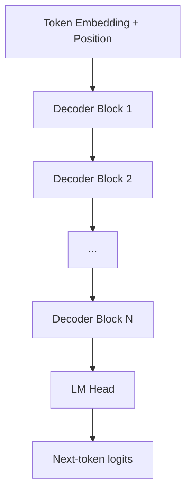

# 第2章 大模型基础知识：Token、Embedding、Transformer 与能力边界

理解大模型，不能只从“会不会回答问题”开始。工程上真正重要的是：文本如何变成模型可以计算的表示，模型如何在上下文中传递信息，哪些能力来自模型权重，哪些能力来自系统设计，以及为什么长上下文、训练、推理和 RAG 会带来不同约束。

本章是第一部分模型基础的基础入口。它不追求把每个公式推到最深，而是建立后续章节需要的共同语言：

```text
文本
→ Token
→ Token ID
→ Embedding
→ Transformer Decoder
→ Hidden State
→ Logits
→ Sampling / Decoding
→ 输出 Token
```

如果把第1章看作大模型范式演进的地图，本章就是读懂这张地图的基础坐标系。

## 2.1 大模型到底是什么

现代 LLM 最核心的训练目标通常可以简化为：

```text
给定前面的 token，预测下一个 token。
```

这叫 next-token prediction。它看起来只是文本续写，但当数据、参数和算力规模足够大时，模型会在这个任务中学到很多可复用能力：

- 语言模式；
- 事实关联；
- 代码结构；
- 数学表达；
- 对话格式；
- 指令模式；
- 常见推理路径；
- 工具调用格式。

因此，LLM 不是一个手写规则系统，也不是一个可审计数据库。它更像一个在大规模序列数据上训练出来的条件概率模型：

```text
P(next_token | previous_tokens)
```

这也解释了它的两面性：它可以生成非常合理的内容，但如果没有外部证据、工具约束和评估闭环，也可能生成看似合理但并不真实的回答。

## 2.2 文本如何进入模型

LLM 不能直接处理“文字”。模型看到的是 token ID 序列。


Tokenizer 负责把文本切成模型词表中的 token。Embedding 层负责把每个 token ID 映射成向量。

注意：token 不等于汉字，也不等于英文单词。

- 一个英文单词可能被切成一个或多个 token。
- 一个中文词可能按字、词或子词切分。
- 空格、换行、标点、缩进、代码符号都可能影响 tokenization。
- 同一句话在不同模型的 tokenizer 下 token 数可能不同。

这就是为什么同样一份文档，换一个模型后 token 数、价格、延迟和上下文占用都可能变化。

## 2.3 Tokenizer 的几类常见方法

### 2.3.1 BPE

BPE（Byte Pair Encoding）从字符或字节开始，反复合并高频片段，得到词表。它常见于 GPT 系模型。

优点是简单、压缩率高、能处理未登录词；缺点是切分结果不一定符合自然语言词边界。

### 2.3.2 WordPiece

WordPiece 常见于 BERT 系模型。它同样使用子词思想，但合并策略与 BPE 不完全相同。

工程上不需要记住所有训练细节，关键是理解：WordPiece 和 BPE 都是在词和字符之间找一个折中，让模型既能表达常见词，又能处理罕见词。

### 2.3.3 SentencePiece

SentencePiece 把输入当成 Unicode 字符序列，不依赖预先分词，因此对多语言更友好。很多开源模型使用 SentencePiece 或类似方案。

### 2.3.4 Byte-level Tokenizer

Byte-level tokenizer 从字节层面处理文本，理论上可以覆盖任意输入，不容易遇到 unknown token。但它可能让某些语言或特殊文本变成长 token 序列。

## 2.4 Tokenizer 为什么是能力边界的一部分

Tokenizer 经常被当成预处理工具，但它实际上是模型能力边界的一部分。模型训练时看到的是 token 序列，而不是原始字符序列。

例如，中文如果被切得更碎，同样一段话会占用更多 token，模型要用更多位置才能表达同样语义。这不仅增加成本，也改变 attention 距离。代码也是如此：缩进、括号、换行、变量名和特殊符号如果切分不稳定，模型学习代码结构会更困难。

Tokenizer 还会影响安全和鲁棒性。有些 prompt injection、越狱字符串、Unicode 混淆和不可见字符攻击，本质上利用了人类可见文本和模型 token 序列之间的不一致。人看到的是一句正常话，模型看到的可能是异常 token 组合。

生产系统至少要在三个地方显式处理 tokenizer：

- 成本估算；
- 上下文预算；
- 安全和输入规范化。

## 2.5 Embedding：从离散符号到连续向量

Tokenizer 输出的是 token ID，例如：

```text
["KV", " cache", " 是", " 什么"] -> [12345, 6789, 3456, 7890]
```

模型不能直接在 ID 上做语义计算。Embedding 层会把每个 ID 映射成一个向量：

```text
token_id -> dense vector
```

这些向量不是人工写的词典，而是在训练中学习出来的参数。相似语境中的 token 往往会形成相似表示，但不要把 embedding 简化成“词义坐标”。在深层 Transformer 中，hidden state 会随着上下文不断变化，同一个 token 在不同句子里的表示也会不同。

## 2.6 两类 Embedding：模型内部表示与 RAG 检索表示

Embedding 这个词容易混淆，因为它在 LLM 内部和 RAG 系统中都出现。

在 LLM 内部，embedding 层把 token ID 映射成初始向量。这些向量随后经过多层 Transformer，不断被上下文改写。第 1 层的 `bank` 可能只是一个 token 表示；到第 20 层时，它可能已经结合上下文变成“河岸”或“银行”的语义状态。

在 RAG 中，embedding model 把一个 query 或文档 chunk 映射成一个向量，用于相似度检索。这个向量通常是整段文本的压缩表示，服务于“找相似内容”。

二者有联系，但不能混为一谈：

```text
LLM token embedding：模型内部表示的起点
RAG text embedding：外部检索系统的语义索引
```

本章只讲模型内部 embedding。RAG 检索 embedding、hybrid retrieval、rerank 和 Agentic RAG 会放在第13章的 Agent 知识系统中讨论。

## 2.7 Transformer Decoder：现代 LLM 的主干结构

大多数现代文本 LLM 使用 decoder-only Transformer。它的目标很简单：

```text
给定前面的 token，预测下一个 token。
```

它只能看当前位置之前的 token，不能偷看未来 token。这种约束叫 causal mask。



每个 Decoder Block 通常包含：

- Attention；
- Feed-Forward Network（FFN 或 MLP）；
- residual connection；
- normalization；
- 有些模型还包含 MoE、SwiGLU、RMSNorm 等变体。

## 2.8 Attention 在解决什么问题

RNN 按顺序读文本，长距离依赖容易衰减。Attention 的核心想法是：当前位置可以直接和历史位置建立关系。

Self-Attention 的简化公式是：

```text
Attention(Q, K, V) = softmax(QK^T / sqrt(d)) V
```

可以把 Q/K/V 理解成三个角色：

- `Q`：当前 token 的查询，“我现在需要看什么”；
- `K`：每个历史 token 的索引，“我有哪些可匹配特征”；
- `V`：每个历史 token 的内容，“如果关注我，就取走什么信息”。

当前 token 用自己的 `Q` 和历史 token 的 `K` 做相似度匹配，再用注意力权重加权汇总历史 token 的 `V`。

Attention 的强项是内容寻址。当前 token 可以根据 query 去历史 token 中找相关 key，再读取对应 value。这使它很适合处理引用、依赖、对齐、复制、代码括号匹配和多处证据汇总。

但 Attention 也有弱点：

- 计算和显存随序列长度增长；
- 长上下文中注意力权重可能被噪声稀释；
- 它不天然理解文档层级和权限边界；
- 它更像软检索，不是精确数据库查询；
- attention 权重不等于可靠解释。

## 2.9 Multi-Head Attention、MQA、GQA 与 MLA

Multi-Head Attention（MHA）让模型同时用多个 head 观察上下文。不同 head 可以关注不同模式，例如局部语法、引用关系、代码括号、长距离依赖等。

MHA 的问题是每个 head 都有自己的 K/V，长上下文下 KV cache 很大。为了降低推理成本，现代模型常见几类变体：

| 结构 | 核心思想 | 工程影响 |
|:---|:---|:---|
| MHA | 每个 query head 都有独立 K/V | 表达能力强，KV cache 大 |
| MQA | 多个 query heads 共享同一组 K/V | KV cache 小，可能损失部分表达 |
| GQA | query heads 分组共享 K/V | 质量和推理效率折中 |
| MLA | 把 K/V 压缩到 latent 表示 | 降低 KV 成本，实现复杂度更高 |

你可以把 MHA、MQA、GQA、MLA 看成同一个方向上的不同取舍：

```text
表达能力、实现复杂度、KV cache 大小、推理带宽
```

这也是为什么模型结构会直接影响第4章要讲的推理性能。

## 2.10 FFN / MLP 在做什么

Attention 负责在 token 之间传递信息，FFN 负责对每个 token 的表示做非线性变换。

一个简化的 Decoder Block 可以写成：

```text
x = x + Attention(Norm(x))
x = x + FFN(Norm(x))
```

FFN 通常占模型参数的大头。很多 MoE 模型就是把 FFN 替换成多个 expert，每个 token 只激活其中一部分 expert，从而用更大的总参数换取相对可控的每 token 计算量。

这解释了为什么 MoE 可以在总参数量很大的情况下保持每 token 计算量相对可控。它不是每次调用都跑所有参数，而是按 token 激活少数 expert。

但 MoE 的代价是工程复杂度：

- expert 负载不均会造成尾延迟；
- 多 GPU 之间需要 all-to-all 通信；
- batch 形状更复杂；
- 量化和 serving 支持更难；
- 热门 expert 可能成为瓶颈。

## 2.11 位置编码：模型如何知道顺序

Attention 本身对顺序不敏感。如果不加位置信息，模型只知道有一堆 token，不知道谁在前谁在后。

常见位置编码包括：

- **绝对位置编码**：给每个位置一个向量；
- **RoPE**：通过旋转位置编码把相对位置信息注入 Q/K；
- **ALiBi**：用 attention bias 表达距离衰减；
- **RoPE scaling / interpolation**：把训练时的上下文长度扩展到更长窗口。

RoPE 是现代开源 LLM 中非常常见的方案。它在长上下文扩展中很重要，但简单扩展位置编码并不等于模型真的会稳定利用长上下文。

把最大位置从 8K 扩展到 128K，至少涉及三层问题：

- 模型训练时有没有见过足够长的序列；
- attention 和位置编码在长距离上是否数值稳定；
- 下游任务是否真的需要跨长距离整合信息。

## 2.12 上下文窗口是什么

上下文窗口指模型一次调用中最多能处理的 token 数。

它包括：

- system prompt；
- developer / instruction 信息；
- 用户输入；
- few-shot 示例；
- 工具说明；
- 检索片段；
- 历史对话；
- 模型已经生成的输出。

上下文窗口不是数据库。它只是本次推理时模型能看到的 token 序列。超过窗口的内容要么被截断，要么需要压缩、检索、分层加载或重新组织。

## 2.13 上下文窗口是软能力，不是硬承诺

模型标称支持 128K 或 1M token，并不意味着它能同等质量地使用窗口中的所有信息。

长上下文能力至少要拆成四件事：

- **可输入**：模型和 serving engine 允许这么长的 token 序列。
- **可保持**：模型不会在长序列下明显退化或丢失中间信息。
- **可定位**：模型能从长文本中找到关键证据。
- **可整合**：模型能跨多个位置组合信息并生成正确答案。

很多长上下文失败不是窗口超限，而是定位和整合失败。常见现象包括：

- 只引用开头和结尾，忽略中间内容；
- 多个证据冲突时选择更近的证据；
- 对长表格或日志做错误聚合；
- 在多文档中混淆来源；
- 回答看似完整但漏掉关键约束。

窗口变大只是给系统更多空间，不等于自动解决信息组织问题。

## 2.14 上下文窗口的三个成本

长上下文不只是“能放更多字”，它有三个成本。

### 1. 价格成本

大多数模型按输入 token 和输出 token 计费。长文档、长历史、长工具结果都会增加输入成本。

### 2. 延迟成本

输入越长，prefill 阶段越慢。用户感受到的首 token 延迟会增加。

### 3. 显存成本

推理时需要保存历史 token 的 KV cache。上下文越长，KV cache 越大，并发能力越受限。第4章会专门解释这个问题。

## 2.15 工业实践：Token 预算怎么做

生产系统不会无脑把所有信息塞进 prompt。常见做法是给不同上下文分配预算：

```text
总预算 = 系统指令 + 用户输入 + 会话状态 + 检索证据 + 工具结果 + 输出预留
```

例如一个 32K token 窗口的企业知识助手，可以这样分配：

- 2K：系统指令、角色、风格和安全边界；
- 4K：用户问题、会话摘要和任务状态；
- 18K：检索证据；
- 4K：工具结果；
- 4K：输出预留。

实际系统还要动态调整：简单问题少取证据，复杂问题多取证据；短回答少预留输出，报告生成多预留输出。

成熟团队不会只在开发阶段估算 token，而会在线上持续监控：

- input tokens 分布；
- output tokens 分布；
- system prompt 占比；
- tool schema 占比；
- evidence 占比；
- discarded context 占比；
- 超预算请求比例；
- prompt cache 命中率；
- 长上下文请求的 TTFT 和错误率。

## 2.16 工业实践：看模型配置时要看什么

读一个模型配置时，重点看：

- `num_hidden_layers`：层数；
- `hidden_size`：隐藏维度；
- `num_attention_heads`：query head 数；
- `num_key_value_heads`：KV head 数，决定 KV cache 规模；
- `intermediate_size`：FFN 宽度；
- `max_position_embeddings`：标称上下文长度；
- `rope_theta` 或 RoPE scaling 配置；
- 是否使用 MoE；
- 是否使用 sliding window attention；
- tokenizer 和 chat template。

这些配置会直接影响：

- 模型质量；
- 推理显存；
- KV cache 大小；
- serving engine 兼容性；
- 长上下文稳定性；
- 微调和量化难度。

参数量不是全部。两个同样参数量的模型，可能因为数据、架构、tokenizer、上下文长度、GQA/MQA、MoE、后训练方法不同，在实际任务中表现差异很大。

## 2.17 科研现状：基础结构的几条主线

截至 2026-05，Transformer 仍是主流 LLM 的核心架构，但基础结构研究在多个方向推进。

### 1. Tokenizer-free / Byte-level

传统 tokenizer 的问题越来越明显：多语言不公平、长尾字符处理差、代码和表格结构不稳定、token 边界和语义边界不一致。因此 byte-level 和 tokenizer-free 路线持续升温。

Byte Latent Transformer（BLT）尝试直接在字节上建模，但不是天真地一个字节一个字节跑完整 Transformer，而是把字节聚合成动态 patch，让模型在信息复杂的地方用更多计算，在可预测的地方用更少计算。

### 2. 高效 Attention

FlashAttention 系列通过 IO-aware 设计减少显存读写，让长序列 attention 更高效。PagedAttention 进一步从 serving 角度管理 KV cache。

### 3. 长上下文架构

研究集中在 RoPE scaling、sliding window、sparse attention、attention sink、long-context eval 和更好的位置外推。真正难点不只是“能输入 1M token”，而是模型是否能稳定找到、整合和引用长距离信息。

### 4. MoE

MoE 让模型拥有很大的总参数量，但每个 token 只激活部分 expert。它提升了训练和推理的性价比，但带来路由、负载均衡、通信和服务部署复杂度。

### 5. KV 表示压缩

MLA、GQA、MQA、KV cache quantization 都在处理同一个问题：decode 阶段 KV cache 和内存带宽是瓶颈。reasoning 模型输出更长，KV 压力更大，这条线会更重要。

### 6. 非 Transformer 路线

Mamba 等 selective state space model 试图用线性时间序列建模替代二次复杂度 attention。它们在长序列效率上有吸引力，但在通用 LLM 生态、工具兼容和大规模实战上仍处于竞争与融合阶段。

## 2.18 常见误区：大模型基础概念

### 误区 1：按字符数控制上下文

字符数和 token 数没有稳定比例。英文、中文、代码、JSON、Markdown 表格、日志、emoji、不可见字符都会改变 token 密度。生产系统必须用目标模型 tokenizer 计算真实 token 数。

### 误区 2：Embedding 能保留所有语义

Embedding 是压缩表示。压缩就会损失细节。版本号、否定、数字、时间、条件、权限、代码符号都可能在向量相似度中被弱化。

### 误区 3：Attention 权重就是解释

Attention 权重能提供一些线索，但不能等同于因果解释。模型输出还受到 FFN、残差连接、层间变换、logits head 和采样影响。

### 误区 4：参数越多一定越好

参数量只是能力的一部分。数据质量、训练策略、上下文长度、tokenizer、后训练、推理预算和模型结构都会影响实际效果。

### 误区 5：支持长上下文就代表理解长上下文

模型能接收长输入，不代表能在长输入中稳定定位、整合、比较和推理。长上下文能力必须用目标任务评估。

### 误区 6：MoE 只是更大的模型

MoE 的关键不是总参数大，而是每 token 激活一部分参数。它改变了训练效率和推理系统形态，也引入路由、通信和负载均衡问题。

## 2.19 工程诊断：如何判断是基础表示问题

当系统出现下面现象时，要怀疑 token、embedding、结构或上下文层：

- 本地测试正常，线上长对话后开始答非所问。
- 检索证据正确，但模型没有引用关键内容。
- 工具 schema 很长，压缩后质量反而提升。
- 中文文档成本明显高于预期。
- 代码任务中模型遗漏文件路径、函数名或错误码。
- prompt cache 命中率低，虽然看起来 system prompt 没变。
- 模型明明能写 JSON，却在线上偶尔输出坏 JSON。

诊断步骤：

1. 打印真实 chat template 后的 token 序列长度。
2. 分解各类上下文占比。
3. 检查被截断的是哪一部分。
4. 对比短上下文和长上下文下的输出差异。
5. 检查输入中是否存在不可见字符、异常 Unicode 或特殊 token。
6. 查看目标模型是否支持当前 attention 结构、上下文长度和 tool format。
7. 评估是否需要结构化上下文、摘要、分层加载或外部工具。

## 2.20 工程案例：设计一个 32K Token 的上下文预算

假设要设计一个企业知识问答 Agent，模型上下文窗口是 32K。一个合理预算不是平均分配，而是按任务价值分配。

```text
System / Policy：2K
Tool Schema：3K
User Query + Conversation State：3K
Retrieved Evidence：16K
Tool Results：4K
Output Reserve：4K
```

这只是初始值。真实系统要动态调节：

- 如果用户问题简单，检索证据可以降到 4K，把预算留给输出。
- 如果用户要求生成报告，输出预留要增加。
- 如果工具 schema 很稳定，可以依赖 prompt caching 或压缩描述。
- 如果证据冲突，要保留更多 metadata 和来源说明。
- 如果会话很长，不要保留完整历史，而是保留结构化状态。

预算还要和质量指标绑定。比如 evidence token 从 8K 增加到 16K，如果准确率没有提升，只是延迟和成本增加，就说明检索或上下文构建没有做好。

## 2.21 工程案例：为什么结构化输出会失败

一个模型明明能写 JSON，却在线上偶尔输出坏 JSON，可能有多个原因：

- sampling temperature 太高；
- stop sequence 截断了括号；
- prompt 中示例格式不一致；
- 输出 token 太长导致后半截漂移；
- tokenizer 把特殊符号切分成不稳定模式；
- 模型后训练不擅长工具调用；
- grammar / constrained decoding 没启用；
- 长上下文噪声干扰了格式约束。

解决路径不是只说“让模型严格输出 JSON”，而是：

1. 降低 temperature。
2. 使用 JSON schema 或 constrained decoding。
3. 缩短无关上下文。
4. 使用明确字段说明和少量一致示例。
5. 增加 parser + retry。
6. 用 eval 统计格式遵循率。

这说明模型结构、采样和工程控制是连在一起的。

## 2.22 面试表达

一句话版：

> LLM 处理的不是字符或单词，而是 tokenizer 切出来的 token。Token 会被映射成 embedding 向量进入 decoder-only Transformer；每层用 causal self-attention 读取历史 token，用 FFN 改写当前位置表示，最后通过 logits 和 decoding 生成下一个 token。上下文窗口限制的是一次推理能看到的 token 序列，它同时影响价格、延迟和 KV cache 显存。

展开版：

> 我理解大模型基础时，会先看输入表示、模型结构和上下文约束。Tokenizer 决定文本如何变成 token，embedding 把 token ID 变成可计算向量，Transformer Decoder 用 attention、FFN 和位置编码逐层改写 hidden state。工程上我会特别关注 tokenizer、chat template、上下文长度、KV head 数、MoE、GQA/MLA 和后训练方式，因为它们会影响成本、延迟、长上下文能力、结构化输出和工具调用稳定性。

## 2.23 自测问题

1. 为什么 token 不等于字符或单词？
2. LLM 内部 token embedding 和 RAG text embedding 的区别是什么？
3. Attention 里的 Q、K、V 分别可以如何理解？
4. 为什么 GQA 能降低推理阶段 KV cache 压力？
5. FFN / MLP 为什么经常是模型参数的重要来源？
6. 位置编码为什么会影响长上下文外推？
7. 为什么 128K 上下文不等于模型能可靠理解 128K 文档？
8. 设计 Agent 系统时，为什么要监控 token 占比和 discarded context？
9. 为什么结构化输出失败不一定是 prompt 写得不够强？
10. 读一个模型配置时，哪些字段会直接影响部署成本？

## 2.24 参考资料

- [Neural Machine Translation of Rare Words with Subword Units](https://arxiv.org/abs/1508.07909)
- [SentencePiece: A simple and language independent subword tokenizer](https://arxiv.org/abs/1808.06226)
- [Hugging Face Tokenizers](https://huggingface.co/docs/tokenizers/index)
- [OpenAI tiktoken](https://github.com/openai/tiktoken)
- [Byte Latent Transformer: Patches Scale Better Than Tokens](https://arxiv.org/abs/2412.09871)
- [Attention Is All You Need](https://arxiv.org/abs/1706.03762)
- [RoFormer: Enhanced Transformer with Rotary Position Embedding](https://arxiv.org/abs/2104.09864)
- [Train Short, Test Long: Attention with Linear Biases Enables Input Length Extrapolation](https://arxiv.org/abs/2108.12409)
- [Fast Transformer Decoding: One Write-Head is All You Need](https://arxiv.org/abs/1911.02150)
- [GQA: Training Generalized Multi-Query Transformer Models from Multi-Head Checkpoints](https://arxiv.org/abs/2305.13245)
- [FlashAttention: Fast and Memory-Efficient Exact Attention](https://arxiv.org/abs/2205.14135)
- [Mamba: Linear-Time Sequence Modeling with Selective State Spaces](https://arxiv.org/abs/2312.00752)
- [DeepSeek-V3 Technical Report](https://arxiv.org/abs/2412.19437)
