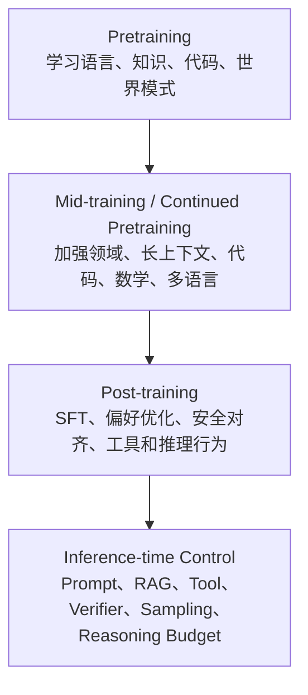
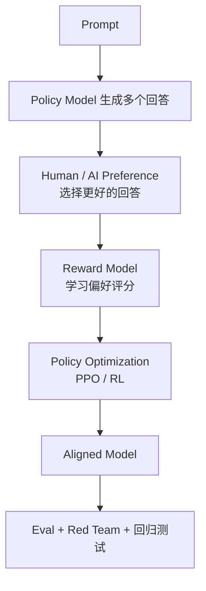

# 第3章 大模型训练过程详解：Pretraining、Post-training、SFT、RL 与偏好优化

大模型能力不是只靠 Prompt 调出来的。Prompt、RAG、工具和 Agent Runtime 是推理时的工程控制层；训练和后训练则决定了模型已经具备什么能力、习惯什么表达方式、愿意遵守哪些边界、在复杂任务上是否会主动搜索和验证。

本章把大模型训练拆成一条工程链路：

```text
训练目标
  -> 预训练过程
  -> 数据工程
  -> 后训练 pipeline
  -> SFT
  -> RLHF / DPO / RLAIF
  -> Reasoning RL / RLVR
  -> 工程落地
  -> 难点挑战
  -> 科研现状
```

这不是训练框架教程，也不是论文公式大全。它的目标是让工程师能回答三个问题：

- 一个模型的能力和行为分别来自训练的哪个阶段？
- 业务问题到底该用 Prompt、RAG、工具、微调、偏好优化还是 RL？
- 训练项目从数据、Eval、算力、上线到回滚，为什么经常比算法本身更难？

## 3.1 训练到底在改变什么：能力、知识、行为、可控性

讨论训练时，最容易混在一起的四个词是：能力、知识、行为、可控性。

| 维度 | 它指什么 | 主要来自哪里 | 工程判断 |
|:---|:---|:---|:---|
| 能力 | 理解、生成、推理、编码、数学、工具使用 | 预训练规模、数据质量、模型结构、推理强化 | 能力不足通常先换模型或扩大训练，而不是写更长 Prompt |
| 知识 | 模型参数中压缩的事实、模式和常识 | 预训练数据、继续预训练、合成数据 | 动态事实不应主要靠微调注入 |
| 行为 | 是否像助手、是否遵循指令、是否拒答、是否按格式输出 | SFT、RLHF、DPO、安全对齐 | 行为问题适合后训练和协议约束 |
| 可控性 | 能否被系统稳定约束、验证和回滚 | Eval、Prompt、工具权限、RAG、Guardrails | 可控性不是靠权重单独解决 |

可以把一个 LLM 的形成过程理解成三层塑形：



这几层不是互相替代，而是分工不同。预训练提供底层能力，后训练把模型变成可用助手，推理时控制把模型接入具体任务和生产约束。

## 3.2 大模型训练全流程：Pretraining、Mid-training、Post-training、Inference-time Control

现代大模型训练通常不是“一次训练完”。更接近下面这条 pipeline：


工程上可以按四个阶段理解：

| 阶段 | 核心目标 | 典型输入 | 典型输出 |
|:---|:---|:---|:---|
| Pretraining | 学通用语言、知识、代码和推理模式 | 大规模未标注 token | Base model |
| Mid-training | 强化特定能力或分布 | 领域数据、代码、数学、长上下文、多语言 | Specialized base model |
| Post-training | 让模型像助手，学会偏好、安全和工具行为 | 指令、偏好、轨迹、环境反馈 | Chat / Instruct / Reasoning model |
| Inference-time Control | 在具体任务中控制模型行为 | Prompt、RAG、工具、策略、verifier | 生产系统输出 |

Mid-training 不是所有团队都会显式命名，但实践中很常见。例如基础模型预训练完成后，继续用高质量代码、数学、长上下文或领域数据训练一段，以改善某类能力。它仍然更接近预训练，因为目标通常还是 next-token prediction，只是数据分布更有方向。

## 3.3 Pretraining 原理：next-token prediction、loss、数据分布与能力来源

预训练的核心目标是预测下一个 token：

```text
maximize P(next_token | previous_tokens)
```

训练时，模型看到一段 token 序列：

```text
x1, x2, x3, ..., xt
```

它要在每个位置预测下一个 token：

```text
x1 -> x2
x1, x2 -> x3
x1, x2, x3 -> x4
```

训练 loss 通常是交叉熵。直觉上，如果正确 token 的概率越高，loss 越低；模型在海量文本上持续降低 loss，就会被迫学习很多结构：

- 语法和语义；
- 事实共现；
- 代码语法和库用法；
- 数学表达和证明模式；
- 对话轮次和格式；
- 文档结构；
- 长距离依赖；
- 常见问题的解决路径。

这解释了为什么 next-token prediction 看起来简单，却能产生通用能力。模型不是显式存了一张事实表，而是在权重中压缩了训练数据分布中的统计规律和可泛化模式。

但也正因为如此，预训练模型有天然边界：

- 参数记忆没有行级版本、权限和更新时间；
- 模型会补全“看起来合理”的文本，而不是天然校验事实；
- 训练数据里的偏差、错误和污染可能进入模型；
- loss 下降不等于某个业务任务可靠。

所以 Base Model 更像一个强大的任务先验，不是生产系统的事实源。

## 3.4 预训练过程：数据清洗、去重、配比、tokenization、训练、checkpoint、评估

预训练项目的难度不只在 GPU。更难的是数据、系统和评估三件事同时稳定。

### 数据清洗

原始数据通常包含网页模板、广告、垃圾文本、重复页面、机器翻译、低质量代码、乱码、个人信息和 benchmark 泄露。清洗目标不是把数据变得“干净到无菌”，而是减少会系统性伤害模型的噪声。

常见处理包括：

- 语言识别；
- 质量分类器；
- 文档去重和近似去重；
- PII 和敏感信息过滤；
- 低质量站点过滤；
- benchmark contamination 检测；
- 代码 license 和仓库质量过滤；
- 数学、代码、表格、长文档的结构保留。

### 数据配比

大模型不是“把所有数据混在一起”训练。不同数据类型会拉动不同能力：

| 数据类型 | 主要影响 | 风险 |
|:---|:---|:---|
| 通用网页 | 常识、语言、多主题覆盖 | 噪声、重复、偏见 |
| 书籍和长文 | 篇章结构、长距离依赖 | 版权和领域偏差 |
| 代码 | 编程、结构化输出、工具格式 | 过拟合常见仓库、license 风险 |
| 数学和科学 | 符号推理、严谨表达 | 数据少、格式复杂 |
| 多语言 | 跨语言能力 | 高资源语言挤压低资源语言 |
| 合成数据 | 定向补齐能力 | 自我污染、模板化、错误放大 |

数据配比是能力设计，不只是数据工程。想要代码能力强，就要有足够高质量代码和代码相关自然语言；想要长上下文能力好，就要让模型在训练或继续训练中见到足够长、足够结构化的样本。

### Tokenization 与样本构造

Tokenizer 决定了文本如何变成 token。预训练时还要决定：

- 最大序列长度；
- 是否 pack 多个文档；
- 文档边界如何标记；
- 特殊 token 如何设计；
- 多轮对话和工具格式是否进入训练；
- 长上下文样本如何采样。

这些细节会影响模型后来是否稳定理解文档边界、角色边界、代码缩进和工具调用格式。

### 分布式训练与 checkpoint

大模型训练通常需要数据并行、张量并行、流水线并行、ZeRO / FSDP 等技术组合。工程上必须处理：

- GPU 故障；
- 网络抖动；
- optimizer state 保存；
- checkpoint 频率；
- 训练恢复；
- loss spike；
- 数据 loader 稳定性；
- 混合精度数值稳定。

Checkpoint 不只是保存进度，也是实验审计和回滚点。一个成熟训练项目必须知道：哪个 checkpoint 开始出现能力提升，哪个数据版本引入了退化，哪个训练阶段影响了安全边界。

### 评估

预训练评估不能只看 loss。至少要看：

- held-out loss；
- 通用能力 benchmark；
- 代码、数学、多语言、长上下文；
- contamination 检测；
- memorization 和隐私风险；
- 安全初筛；
- downstream post-training 适配潜力。

有些模型 base loss 很漂亮，但 post-training 后工具调用不稳定；有些模型 benchmark 不差，但中文、代码、长上下文或结构化输出在目标业务里不够稳。预训练评估要服务后续系统目标。

## 3.5 Scaling Law、Chinchilla 与数据质量

Scaling law 说明，在一定范围内，模型 loss 会随参数量、数据量和计算量呈规律性下降。这给行业一个重要信号：只要数据、算力和模型规模持续扩大，模型能力可以被相对可预测地推进。

但 Chinchilla 之后，行业更重视 compute-optimal：不是只堆参数，而是在参数量和训练 token 数之间找到更优配比。一个参数更多但训练 token 不够的模型，可能不如一个参数较少但数据更充分的模型。

工程上可以总结成三句话：

- **参数决定容量上限**：模型能压缩多少模式，表达多少复杂函数。
- **数据决定能力分布**：模型在哪些语言、领域、任务、格式上熟练。
- **计算决定训练到什么程度**：模型是否充分利用参数和数据。

近年的实践进一步说明，数据质量正在变得和数据规模同样重要。Llama 3、GPT-4 等技术报告都强调大规模训练之外，还需要高质量数据、过滤、合成数据、能力定向和严格评估。

对工程师来说，Scaling Law 的价值不是让你从零训练千亿模型，而是建立成本判断：

- 小模型是否已经吃够目标领域数据？
- 继续训练是更划算，还是换更强基础模型？
- 目标能力来自数据缺口，还是模型容量缺口？
- 用合成数据扩充时，是否有独立 eval 防止自我强化错误？

## 3.6 Post-training 总览：为什么基础模型不能直接当助手

Base model 会续写文本，但它不一定会当助手。用户问：

```text
帮我解释这个报错，并给出修复步骤。
```

未对齐的模型可能会：

- 续写一个论坛帖子；
- 模拟多个用户讨论；
- 编造上下文；
- 忽略格式要求；
- 给出危险操作；
- 不知道何时拒答。

Post-training 的目标是把 base model 塑造成可用的 assistant / tool user / reasoning model。它通常包含：

```text
SFT：学习指令和示范答案
Preference Optimization：学习什么回答更好
Safety Alignment：学习边界和拒答策略
Tool / Agent Training：学习工具格式和环境交互
Reasoning RL：学习长推理、验证和搜索策略
```

Post-training 不只是“让模型更礼貌”。它会改变模型的默认行为：

- 更倾向回答用户问题，而不是续写语料；
- 更会遵守系统指令和输出格式；
- 更会承认不确定性；
- 更会拒绝危险请求；
- 更会使用工具或生成结构化调用；
- 更会在复杂任务上花更多推理 token。

但后训练也可能损害某些能力。例如模型变得过度安全、过度冗长、校准变差，或者在偏好数据中过拟合某种“高分回答风格”。因此 post-training 必须和 Eval、红队、回归测试绑定。

## 3.7 SFT：示范学习、指令数据、格式塑形与局限

SFT（Supervised Fine-Tuning）用指令-回答样本训练模型。它的基本数据形态是：

```text
instruction -> ideal answer
```

或者多轮对话：

```text
system + user + assistant + user -> assistant
```

SFT 的本质是示范学习。它告诉模型：看到这种输入时，一个好助手应该如何回答。

SFT 擅长解决：

- 指令遵循；
- 输出格式；
- 角色风格；
- 常见任务模板；
- 工具调用 JSON 格式；
- 领域话术；
- 拒答和不确定性表达的基本样式。

SFT 的局限也很清楚：

- 它主要模仿答案，不直接优化真实任务目标；
- 数据风格不一致会导致模型行为摇摆；
- 少量事实不适合靠 SFT 注入；
- 错误示范会被模型稳定学会；
- 太强的格式数据可能让模型变得模板化；
- 过量窄域 SFT 可能损伤通用能力。

好的 SFT 数据不一定要多，但必须一致、清晰、覆盖真实分布。比如工具调用数据中，字段名、错误处理、拒答边界和结果引用方式必须统一，否则模型会学到混乱的工具协议。

### SFT 数据的工程标准

一条 SFT 样本至少应该能回答：

- 这个样本训练什么能力？
- 输入是否真实代表线上任务？
- 输出是否符合最终产品标准？
- 有没有引用不存在的事实？
- 是否泄露了不该出现的信息？
- 是否和系统安全策略冲突？
- 是否会让模型学到冗长、讨好或过度承诺？

如果样本本身说不清目标，模型只会更快地学会混乱。

## 3.8 RLHF：偏好数据、Reward Model、PPO/RL loop 与风险

RLHF（Reinforcement Learning from Human Feedback）解决的问题不是“标准答案是什么”，而是“多个可行回答里哪个更好”。

典型 RLHF pipeline 是：



### 偏好数据

偏好数据通常不是单个标准答案，而是 pairwise comparison：

```text
prompt
chosen response
rejected response
```

标注者需要判断哪个回答更有帮助、更真实、更安全、更符合要求。难点在于：偏好标准必须明确，否则 reward model 会学到标注者噪声。

### Reward Model

Reward Model 把 prompt 和 response 映射成一个分数：

```text
reward(prompt, response) -> scalar score
```

这个分数不是事实真理，而是偏好代理。代理指标越窄，越容易被模型钻空子。

### Policy Optimization 与 KL Constraint

用 RL 优化语言模型时，不能只追求 reward 最高。否则模型可能偏离原始语言分布，生成奇怪、重复或投机的文本。

因此 RLHF 通常会加入 KL constraint，让新 policy 不要离参考模型太远：

```text
maximize reward - KL(policy || reference_policy)
```

直觉上，这是在平衡两件事：

- 学会偏好目标；
- 保持语言质量和基础能力。

### RLHF 的风险

RLHF 能显著改善帮助性、无害性和指令遵循，但也会带来风险：

- reward hacking；
- 过度拒答；
- 讨好用户；
- 冗长但空泛；
- 校准变差；
- 标注偏差固化；
- 对真实业务指标不敏感；
- 对 reward model 的盲点过拟合。

所以 RLHF 项目必须有独立 eval，而不能只看 reward 曲线。

## 3.9 DPO 与偏好优化家族：DPO、IPO、KTO、ORPO 的工程定位

DPO（Direct Preference Optimization）把偏好优化改写成更直接的监督学习目标，不显式训练 reward model，也不需要完整在线 RL loop。

从工程角度看，DPO 的吸引力在于：

- pipeline 比 RLHF 简单；
- 训练更稳定；
- 适合开源模型后训练；
- 可以直接使用 chosen / rejected 数据；
- 不需要单独维护 reward model。

但 DPO 不是“免费 RLHF”。它仍然依赖高质量偏好数据，也需要参考模型、温度系数、数据过滤和回归 eval。偏好样本如果有偏，模型会稳定学会这些偏差。

偏好优化家族可以这样理解：

| 方法 | 数据需求 | 工程特点 | 适合场景 |
|:---|:---|:---|:---|
| RLHF / PPO | 偏好数据 + reward model | 最完整，也最复杂 | 大规模对齐、复杂偏好 |
| DPO | chosen / rejected pair | 简洁稳定，常用于开源后训练 | 偏好数据质量较高 |
| IPO | preference pair | 关注偏好目标的稳定性 | DPO 类替代方案 |
| KTO | desirable / undesirable 二元信号 | 不一定需要成对偏好 | 有好坏标签但缺少 pair |
| ORPO | SFT 中合并偏好约束 | reference-free，流程更短 | 想降低后训练阶段复杂度 |

工程上不要把方法名当信仰。更重要的是数据形态：

- 如果你有高质量示范答案，先 SFT。
- 如果你有成对偏好，DPO / IPO 很自然。
- 如果你有好坏标签但没有 pair，KTO 可能更合适。
- 如果你有可靠 reward 或环境反馈，并且需要优化策略，才考虑 RL。

## 3.10 RLAIF、Constitutional AI 与安全对齐

RLAIF（Reinforcement Learning from AI Feedback）用 AI 反馈替代或补充人类反馈。Constitutional AI 则用一组原则指导模型自我批评、修改回答和偏好学习。

它们解决两个问题：

- 人类偏好标注成本高，且难以覆盖所有安全边界；
- 有些安全原则需要显式写入训练和评估流程。

一个简化流程是：

```text
模型生成回答
-> 模型根据原则自我批评
-> 模型修改回答
-> 用原则偏好构造训练数据
-> 训练更符合原则的模型
```

这类方法很适合把安全原则、拒答边界、无害性和帮助性结合起来。但工业上不能把安全完全交给模型权重。

生产系统仍然需要：

- 输入输出过滤；
- 权限系统；
- 工具调用审批；
- 审计日志；
- 风险分级；
- 红队测试；
- 业务 eval；
- 人工升级路径。

对齐降低风险，不提供强权限。强权限必须由系统执行。

## 3.11 Reasoning RL / RLVR：可验证奖励、GRPO、test-time compute、o1/R1/Kimi k1.5

2024-2026 年最重要的变化之一，是 reasoning model 和 test-time scaling 变成主线。

传统后训练更关注“回答是否符合人类偏好”。Reasoning RL 更关注“模型能不能通过更多搜索、推理和验证解决难题”。

### RLVR：Reinforcement Learning with Verifiable Rewards

RLVR 的核心是：某些任务有可自动验证的结果，因此可以不依赖主观偏好。

典型任务包括：

- 数学题：最终答案是否正确；
- 代码题：单元测试是否通过；
- 形式化证明：checker 是否接受；
- 工具任务：环境状态是否达成目标；
- 游戏或仿真：reward 是否来自环境。

这类 reward 更接近真实目标，但并不完美。测试覆盖不足时，模型仍然可能 reward hacking。

### GRPO 与 PPO 的工程差异

DeepSeekMath 引入的 GRPO（Group Relative Policy Optimization）可以看成 PPO 的一种简化变体。它不为每个样本训练单独 critic，而是对同一个问题采样多个回答，用组内相对分数估计优势。

直觉上：

```text
同一个问题生成多个解法
-> 用 verifier / reward 给每个解法打分
-> 让好解法概率上升，差解法概率下降
```

这对数学、代码等可验证任务很自然，也能降低 PPO 中 value model / critic 带来的显存和工程复杂度。

### 长推理轨迹与 test-time compute

Reasoning RL 不只是让模型知道更多知识，而是让模型学会在推理时花更多计算：

- 分解问题；
- 尝试不同路径；
- 检查中间结果；
- 修正错误；
- 生成更长推理轨迹；
- 在必要时调用工具或 verifier。

这就是 test-time scaling：能力不只来自训练期 scale，也来自推理期计算扩展。

它有两条工程路径：

| 路径 | 形态 | 成本 |
|:---|:---|:---|
| 纵向慢思考 | 单次调用内部生成更多 reasoning token | decode 更长、KV cache 更大、延迟更高 |
| 横向环境交互 | 多轮工具调用、搜索、执行、观察 | 工具延迟、状态管理、trace、权限、失败恢复 |

o1、DeepSeek-R1、Kimi k1.5 说明 reasoning RL 和推理期扩展可以显著提升数学、代码和复杂推理能力。Qwen3 进一步把 thinking / non-thinking 模式和 thinking budget 纳入统一框架，体现了工程上对“什么时候慢想、什么时候快答”的需求。

### 对 Agent 工程的影响

Agent 系统不能简单地让模型永远“多想一会儿”。它需要 reasoning budget policy：

- 简单问题直接回答；
- 高风险问题先检索或调用工具；
- 可验证任务调用 verifier；
- 长任务限制最大轮数和最大 token；
- 失败时记录 trace 并可恢复；
- 成本超预算时降级或请求确认。

Reasoning RL 让模型更像会搜索的解题器，但生产可靠性仍来自系统闭环。

## 3.12 Agent 与多模态后训练：轨迹数据、工具反馈、环境反馈

Agent 后训练和普通问答后训练不同。普通问答训练一条输入输出；Agent 训练的是过程。

一个 Agent 轨迹可能长这样：

```text
用户任务
-> 计划
-> 读取文件
-> 调用搜索
-> 运行测试
-> 观察失败
-> 修改方案
-> 再次执行
-> 总结结果
```

这种数据比指令-回答对更有价值，也更难处理。它需要记录：

- 任务目标；
- 中间状态；
- 工具输入输出；
- 失败和恢复；
- 证据来源；
- 权限边界；
- 最终验收结果。

多模态后训练也类似。模型不只要“看图”，还要把图像、文档、视频、语音和屏幕操作 grounding 到具体证据上：

- 哪个区域支持这个判断？
- OCR 是否正确？
- 表格单元格是否读对？
- 屏幕按钮是否真的可点击？
- 视频中的状态变化是否一致？

未来 Agent 和多模态后训练会越来越依赖环境反馈，而不是只依赖人类偏好。软件 Agent 可以用测试、编译、浏览器状态作为反馈；机器人和具身智能需要仿真、真实传感器和安全层反馈。

## 3.13 工程落地：什么时候训练，什么时候不要训练

多数业务场景不应该一上来就训练模型。更合理的顺序是：

```text
Prompt / Schema
-> RAG / Tool
-> Eval / Trace
-> 错误归因
-> SFT / LoRA
-> DPO / RLHF
-> 专用模型或继续训练
```

一个实用判断表：

| 问题类型 | 优先方案 | 不推荐一上来做 |
|:---|:---|:---|
| 少量事实缺失 | RAG、数据库、工具 | SFT 灌事实 |
| 事实频繁变化 | 权威 API、实时工具 | 参数记忆 |
| 输出格式不稳 | JSON schema、parser、constrained decoding、SFT | 只靠提示词强调 |
| 领域话术不对 | SFT / LoRA | 换很大的模型裸跑 |
| 偏好取舍不对 | DPO / RLHF | 加更多无关示例 |
| 数学/代码推理弱 | 更强 reasoning model、RLVR、verifier | 只调 temperature |
| 调用成本过高 | 小模型蒸馏、量化、路由、serving 优化 | 盲目训练大模型 |
| 工具使用不稳 | 工具协议、轨迹 SFT、Agent eval | 只训练最终答案 |
| 权限和安全问题 | 系统权限、审批、guardrails | 交给模型自觉 |

适合训练的条件：

- 任务分布稳定；
- 有足够高质量样本；
- 有可复现 eval；
- 错误已经定位到模型行为或能力；
- 训练收益能抵消数据、算力和维护成本；
- 上线后有回滚和监控。

不适合训练的条件：

- 没有稳定 eval；
- 不知道问题来自检索、Prompt、工具还是模型；
- 业务知识每天变化；
- 权限规则复杂；
- 目标只是让模型记住少量产品信息；
- 线上错误无法容忍但训练数据很少；
- 输出格式可以用 schema 或 parser 解决。

一句话判断：

```text
知识问题优先外部化
格式问题优先结构化
能力问题优先换模型
成本问题优先优化 serving
行为问题再考虑后训练
```

## 3.14 训练数据工程：数据版本、标注规范、合成数据、污染控制

训练数据不是素材，而是模型行为的源代码。成熟团队会像管理代码一样管理训练数据。

### 数据版本

每个数据集都应该有：

- 版本号；
- 来源记录；
- license 和权限；
- 过滤规则；
- 标注规范；
- 生成模型版本；
- 适用任务；
- 已知风险；
- 对应 eval 结果。

如果训练后模型变差，必须能回答：

- 哪批数据导致了变化？
- 哪类任务提升了？
- 哪类任务退化了？
- 是能力变化、风格变化还是安全边界变化？
- 该回滚数据、训练配置还是模型版本？

### 标注规范

偏好标注尤其容易出问题。标注者如果没有统一标准，reward model 会学到噪声。

标注规范应该明确：

- 什么叫有帮助；
- 什么叫事实正确；
- 如何处理不确定性；
- 什么时候拒答；
- 是否偏好简洁；
- 是否必须引用证据；
- 如何比较“答案短但准确”和“答案长但空泛”；
- 如何处理安全与帮助性的冲突。

### 合成数据

合成数据越来越重要，因为人工数据贵、慢、覆盖有限。它适合：

- 扩展长尾任务；
- 生成格式样本；
- 构造工具调用轨迹；
- 补齐多语言；
- 生成可验证数学和代码题；
- 构造安全红队样本。

但合成数据有典型风险：

- 放大 teacher model 的偏差；
- 产生看似合理的错误；
- 模板化严重；
- 与 eval 污染；
- 难以覆盖真实用户分布；
- 让模型学会“像高分答案”，而不是解决真实问题。

所以合成数据必须过滤、抽检、去重，并用独立 eval 验证。

### 污染控制

Benchmark contamination 会让模型看起来更强，但实际泛化不一定更好。污染可能来自：

- benchmark 原题进入预训练数据；
- 解析后的题解进入训练；
- 合成数据复述测试集；
- 人工标注参考了测试答案；
- 线上失败样本回流时没有隔离评估集。

工程上要维护训练集、开发集、测试集、红队集、线上回归集之间的边界。Eval 一旦进入训练数据，就失去了裁判价值。

## 3.15 Eval 体系：能力、行为、安全、回归、过程轨迹

训练前必须先有 eval。没有 eval 的训练项目，等于没有仪表盘的飞行。

后训练 eval 至少覆盖五层：

### 1. 能力 Eval

目标任务是否变好，例如：

- 代码修复准确率；
- SQL 正确率；
- 数学题通过率；
- 客服问题解决率；
- 工具任务完成率；
- 多语言任务表现。

### 2. 行为 Eval

模型是否按产品预期行动：

- 是否遵循格式；
- 是否引用证据；
- 是否承认不确定性；
- 是否按要求调用工具；
- 是否避免无关长篇解释；
- 是否稳定保持角色边界。

### 3. 安全 Eval

包括：

- 越狱；
- 敏感信息泄露；
- 危险操作建议；
- 工具越权；
- 隐私和合规；
- 高风险领域拒答边界。

### 4. 回归 Eval

训练目标任务变好，不代表整体模型变好。必须检查：

- 通用问答；
- 中文和英文；
- 代码；
- 数学；
- 长上下文；
- 结构化输出；
- 原有业务场景；
- 延迟和输出长度。

### 5. 过程轨迹 Eval

Agent 和 reasoning model 不能只看最终答案。还要看过程：

- 是否选对工具；
- 是否读对观察；
- 是否跳过必要验证；
- 是否在错误假设上越走越远；
- 是否超预算；
- 是否能从失败中恢复；
- trace 是否可复盘。

一个训练版本只有同时满足“目标任务提升”和“关键回归不退化”，才应该进入灰度。

## 3.16 难点与挑战：reward hacking、模式坍缩、过度拒答、灾难性遗忘、数据泄露

### Reward Hacking

Reward hacking 指模型找到了拿高 reward 的捷径，但没有真正完成我们想要的目标。

也就是：

```text
优化了评分规则
但没有优化真实任务
```

例如，如果偏好数据总是奖励更长、更礼貌、更完整的回答，模型可能学会输出冗长、空泛、看似专业的解释，而不是更准确地解决问题。

代码任务里也很常见。假设目标是实现 `divide(a, b)`，但测试只覆盖：

```python
assert divide(4, 2) == 2
```

模型可能写出：

```python
def divide(a, b):
    return 2
```

它通过了当前测试，reward 很高，但没有真正学会除法。这就是 reward hacking。

避免 reward hacking 的方法不是“不用 RL”，而是让 reward 更接近真实目标：

- 使用隐藏测试和回归测试；
- 评估过程轨迹，而不只评估最终答案；
- 使用多维指标，而不是单一分数；
- 对高风险任务加入人工抽检；
- 记录 Agent trace；
- 把失败样本加入回归集。

### 模式坍缩

后训练可能让模型输出越来越像同一种“高分答案”：结构完整、语气礼貌、篇幅很长，但信息密度下降。这是偏好数据和 LLM-as-Judge 容易共同放大的问题。

解决方式包括：

- 在 eval 中奖励简洁和信息密度；
- 增加多风格数据；
- 区分任务类型的回答长度；
- 使用人工抽检校准 judge；
- 对过度模板化做回归测试。

### 过度拒答

安全对齐过强或安全数据过窄，可能让模型把正常请求也拒掉。比如合法的安全研究、医学科普、金融知识解释、代码调试，都可能被误判为高风险。

工程上要区分：

- 明确有害请求；
- 双用途请求；
- 合法教育或防御场景；
- 需要免责声明但可以回答的场景；
- 需要转人工的场景。

### 灾难性遗忘

窄域 SFT 或继续训练可能提升目标任务，但损伤通用能力。常见表现：

- 通用问答变差；
- 结构化输出变差；
- 多语言能力下降；
- 安全边界漂移；
- 原本会的工具格式变得不稳定。

解决方式是混合保留数据、控制学习率、使用 adapter、加强回归 eval，并保留可回滚版本。

### 数据泄露和隐私

训练数据可能包含用户隐私、商业机密、内部代码、API key 或受版权限制内容。模型可能在特定 prompt 下复现训练片段。

生产训练必须有：

- 数据来源审计；
- PII 检测和脱敏；
- 权限和 license 记录；
- 训练数据删除机制；
- 记忆化评估；
- 红队测试。

模型权重一旦发布，删除错误数据非常困难。因此数据进入训练前的治理比训练后补救更重要。

## 3.17 科研现状：截至 2026-05 的主线

截至 2026-05，大模型训练研究可以概括为六条主线。

### 1. Pretraining 从“更多数据”走向“更会配数据”

Scaling law 仍然有效，但 compute-optimal 和数据质量变得更重要。行业关注的不只是 token 数，而是数据覆盖、数据去重、能力配比、污染控制和合成数据质量。

### 2. Post-training 从 RLHF 扩展到多种偏好优化

RLHF 仍是重要基线，但 DPO、KTO、ORPO 等方法降低了工程复杂度。趋势不是某个方法统一天下，而是根据数据形态选择目标函数。

### 3. Reasoning RL 与 RLVR 成为核心增长点

o1、DeepSeek-R1、Kimi k1.5、Qwen3 都说明，数学、代码和复杂任务可以通过可验证奖励、长推理轨迹和推理预算获得明显提升。研究重点正在从“会不会回答”转向“会不会搜索、验证和自我修正”。

### 4. SFT、RL 与推理期控制正在融合

模型训练不再只产生一个固定行为。Qwen3 这类模型把 thinking / non-thinking mode 和 thinking budget 放进统一框架，说明训练和推理策略正在共同决定最终体验。

### 5. Agent 后训练依赖环境反馈

工具调用、浏览器操作、代码修改、数据分析、机器人控制，都需要轨迹级数据和环境反馈。只用最终答案偏好，很难训练出可靠 Agent。

### 6. Scalable Oversight 仍然是开放问题

当任务复杂到人类难以快速判断时，如何评估模型、如何监督长链推理、如何发现看似正确但隐藏错误的答案，仍然是安全和工程的共同难题。

## 3.18 案例：客服模型后训练

客服模型常见目标不是“更聪明”，而是更稳定地遵守业务口径。

目标通常包括：

- 回答更符合业务规则；
- 不胡乱承诺；
- 能识别证据不足；
- 能按固定格式输出；
- 能把用户引导到正确流程；
- 能区分普通咨询和投诉升级；
- 能在政策冲突时说明依据。

合理架构是：

```text
RAG 提供最新规则
SFT 学客服话术和格式
DPO 学更好的服务偏好
Guardrails 控制敏感承诺
Eval 覆盖业务 case 和回归场景
```

训练数据可以包括：

- 标准问答；
- 真实工单改写；
- 证据充分和证据不足样本；
- 错误承诺反例；
- 需要转人工的边界样本；
- 简洁回答和详细解释的偏好对。

不要把政策事实写进权重里作为唯一来源。政策更新后，知识库和工具应该先更新；模型训练主要学习话术、格式、拒答边界和证据使用方式。

## 3.19 案例：代码 Agent / Tool-use 后训练

代码 Agent 的后训练目标通常包括：

- 更会读错误日志；
- 更会定位相关文件；
- 更会生成小 patch；
- 更会遵守仓库规范；
- 更会调用测试工具；
- 更会在失败后恢复；
- 更会解释改动和风险。

这类训练不能只用“问题-答案”样本。更有价值的是轨迹数据：

```text
问题
-> 查看文件
-> 定位原因
-> 修改
-> 运行测试
-> 修复失败
-> 再验证
-> 总结
```

轨迹数据可以训练模型更像工程师一样工作，但它也更难收集和清洗。

高质量轨迹应该包含：

- 每一步为什么做；
- 工具调用输入输出；
- 失败观察；
- 修改前后差异；
- 测试命令和结果；
- 最终验收；
- 哪些路径没有改。

错误轨迹如果不标注清楚，模型可能学会无效操作。例如反复运行无关测试、盲目扩大修改范围、忽略用户已有改动、为了通过当前测试硬编码答案。

因此代码 Agent 后训练必须配合执行环境和可验证测试，而不是只看自然语言偏好。

## 3.20 常见误区

### 误区 1：微调可以可靠注入事实

微调可以改变模型行为，但不适合管理大量动态事实。事实应该放在数据库、搜索索引、知识库或工具里，再通过上下文注入。

### 误区 2：RLHF 只会让模型更好

RLHF 会优化偏好目标，但偏好目标可能不等于真实业务目标。它可能带来过度拒答、冗长回答、讨好用户和 reward hacking。

### 误区 3：合成数据越多越好

合成数据便宜，但也会放大模型已有偏差。低质量合成数据会让模型学会模板化、空泛和错误模式。需要过滤、去重、混合真实数据和 eval 验证。

### 误区 4：只看训练 loss

loss 下降不代表目标任务更好。后训练必须看任务指标、格式遵循、安全、回归和线上分布。

### 误区 5：把 SFT 和 RL 当成同一种微调

SFT 学示范答案，RL 学目标优化。SFT 更像模仿，RL 更像搜索和策略改进。它们需要的数据、评估和失败诊断不同。

### 误区 6：把 reasoning token 当成免费能力

更长思考会增加延迟、成本和 KV cache 压力。复杂任务需要 reasoning budget，简单任务应直接回答。

### 误区 7：训练可以替代系统权限

对齐和安全训练不能提供强权限。工具调用、数据访问、审批和审计必须由外部系统保证。

## 3.21 面试表达

一句话版：

> Pretraining 学基础能力和知识分布，SFT 学指令格式和示范行为，RLHF/DPO 学偏好与行为边界，Reasoning RL 学更强的搜索、验证和长推理策略；真正生产落地还需要 Prompt、RAG、工具、Eval、权限和回滚。

展开版：

> 我会先区分能力、知识和行为。能力不足可能来自基础模型规模、数据或 reasoning 训练不足；知识过期更适合 RAG、数据库和工具；行为不稳定才考虑 SFT、DPO 或 RLHF。训练项目不能从算法开始，而要从 eval 和错误归因开始：先判断问题发生在输入、检索、上下文、模型行为、工具调用还是安全策略，再选择训练或系统工程方案。

如果面试官追问 SFT 和 RL：

> SFT 是示范学习，数据形态是 instruction 到 ideal answer，擅长格式、风格和基础指令遵循。RL 是根据 reward 优化行为，数据可以是回答或行动轨迹加奖励，擅长偏好、推理、多步任务和工具行动。RL 的风险是 reward hacking，所以必须用隐藏测试、过程 eval、多维指标和 trace 约束。

如果面试官追问 reasoning model：

> Reasoning model 的关键不是参数里多记了多少知识，而是模型学会在推理时使用更多计算进行搜索、分解、验证和修正。训练上常见路线是 RLVR，用数学答案、代码测试或环境反馈提供可验证奖励；系统上要配合 reasoning budget、verifier、工具和成本控制。

## 3.22 自测问题

1. Pretraining、Mid-training、Post-training 和 Inference-time Control 分别解决什么问题？
2. 为什么 next-token prediction 能产生语言、代码和推理能力？
3. 为什么预训练模型不是可审计知识库？
4. Chinchilla 对“只堆参数”的理解有什么修正？
5. SFT 适合解决哪些问题，不适合解决哪些问题？
6. RLHF 的三个核心步骤是什么？
7. Reward Model 为什么只是代理目标？
8. DPO 相比 RLHF 的工程优势和局限是什么？
9. RLAIF 和 Constitutional AI 解决了什么问题？
10. RLVR 为什么适合数学、代码和工具任务？
11. GRPO 相比 PPO 的直觉差异是什么？
12. Reasoning RL 和 test-time compute 有什么关系？
13. 为什么 Agent 后训练更需要轨迹数据？
14. 训练数据为什么要像代码一样管理？
15. 如何判断一个问题应该用 RAG、工具、SFT、DPO 还是 RL？
16. reward hacking 在代码 Agent 中可能如何出现？
17. 为什么后训练必须做回归 eval？
18. 为什么训练不能替代系统权限？

## 3.23 参考资料

### Scaling / Pretraining

- [Scaling Laws for Neural Language Models](https://arxiv.org/abs/2001.08361)
- [Training Compute-Optimal Large Language Models](https://arxiv.org/abs/2203.15556)
- [GPT-4 Technical Report](https://arxiv.org/abs/2303.08774)
- [The Llama 3 Herd of Models](https://arxiv.org/abs/2407.21783)

### Instruction Tuning / Alignment

- [Training language models to follow instructions with human feedback](https://arxiv.org/abs/2203.02155)
- [Constitutional AI: Harmlessness from AI Feedback](https://arxiv.org/abs/2212.08073)
- [Direct Preference Optimization: Your Language Model is Secretly a Reward Model](https://arxiv.org/abs/2305.18290)
- [KTO: Model Alignment as Prospect Theoretic Optimization](https://arxiv.org/abs/2402.01306)
- [ORPO: Monolithic Preference Optimization without Reference Model](https://arxiv.org/abs/2403.07691)

### Reasoning RL / Test-time Compute

- [Learning to reason with LLMs](https://openai.com/index/learning-to-reason-with-llms/)
- [DeepSeekMath: Pushing the Limits of Mathematical Reasoning in Open Language Models](https://arxiv.org/abs/2402.03300)
- [DeepSeek-R1: Incentivizing Reasoning Capability in LLMs via Reinforcement Learning](https://arxiv.org/abs/2501.12948)
- [Kimi k1.5: Scaling Reinforcement Learning with LLMs](https://arxiv.org/abs/2501.12599)
- [Qwen3 Technical Report](https://arxiv.org/abs/2505.09388)
