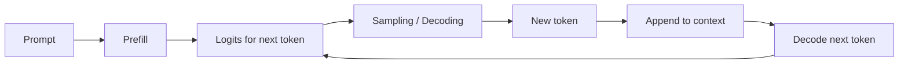

# 第4章 大模型推理机制详解：Prefill、Decode、Sampling、KV Cache 与 Reasoning Budget

LLM 推理不是简单的“跑一次模型”。对自回归模型来说，生成文本是一个循环：每次预测下一个 token，把它追加到上下文，再继续预测下一个 token。

本章先从宏观上理解推理流程，再看工业界如何优化 serving，最后看 KV cache、speculative decoding、paged memory、reasoning budget、量化和长上下文相关研究。

## 4.1 宏观理解：一次生成是怎么发生的

输入 prompt 后，模型并不是一次性吐出完整答案，而是一步步生成：



每一步都会产生一个 logits 向量。logits 可以理解成“词表里每个 token 作为下一个 token 的未归一化分数”。经过 softmax 后，它变成概率分布。

## 4.2 Prefill 与 Decode

LLM 推理通常分为两个阶段。

### 4.2.1 Prefill

Prefill 是处理输入 prompt 的阶段。

假设用户输入了 4K token，模型会一次性处理这些 token，计算每层 attention 的 Key / Value，并得到最后一个位置的 next-token logits。

这个阶段通常并行度高，更像大矩阵计算。prompt 越长，prefill 越慢，TTFT（Time To First Token，首 token 延迟）越高。

### 4.2.2 Decode

Decode 是生成输出 token 的阶段。

每一步 decode 只生成一个 token。模型会读取历史上下文，计算当前 token 对历史 token 的注意力，然后采样出下一个 token。

decode 阶段经常是 memory-bound：瓶颈不一定是算力，而是读取模型权重和 KV cache 的显存带宽。

## 4.3 Sampling：模型如何选择下一个 token

模型输出的是概率分布，但最终必须选出一个 token。

常见策略包括：

- **Greedy decoding**：每次选概率最高的 token，稳定但容易机械。
- **Temperature**：调节分布尖锐程度。低温更保守，高温更多样。
- **Top-k**：只在概率最高的 k 个 token 中采样。
- **Top-p / nucleus sampling**：只在累计概率达到 p 的 token 集合里采样。
- **Repetition penalty**：降低重复 token 的概率。
- **Stop sequence**：遇到特定 token 或字符串时停止生成。

工程上，sampling 参数决定输出的稳定性、创造性和可复现性。代码生成、SQL、JSON、函数调用通常需要更低温度；创意写作可以使用更高温度。

对于 reasoning model，推理还要多一个维度：**reasoning budget**。系统需要决定是否允许模型生成更长的内部思考、是否启用 verifier、是否允许多轮工具调用，以及什么时候因为成本、延迟或证据不足而停止。普通问答关注“选哪个 token”，复杂 Agent 任务还要关注“允许模型花多少推理计算”。

## 4.4 KV Cache 里的 KV 是什么

KV cache 是理解推理性能的核心概念。这里的 KV 不是数据库里的 key-value，而是 Transformer Attention 里的 **Key / Value 向量**。

Self-Attention 的简化公式是：

```text
Attention(Q, K, V) = softmax(QK^T / sqrt(d)) V
```

对当前新 token 来说：

- `Q`：当前 token 的 query；
- `K/V`：历史所有 token 在每一层 attention 中产生的 key/value；
- `KV cache`：把历史 token 的 K 和 V 存下来，下次生成时直接复用。

没有 KV cache 时，每生成一个新 token，都要重新计算整段上下文的 K/V。

有 KV cache 时：

- prefill 阶段一次性处理 prompt，把所有历史 token 的 K/V 存起来；
- decode 阶段每生成一个新 token，只算这个新 token 的 K/V，然后追加到 cache。

所以 KV cache 的本质是：

> 用显存换速度。

## 4.5 KV Cache 的显存成本

KV cache 让 decode 快很多，但显存会线性增长：

```text
KV cache size ≈ 2 × layers × batch × seq_len × kv_heads × head_dim × bytes
```

其中：

- `2` 是 Key 和 Value；
- `layers` 是模型层数；
- `batch` 是同时服务的序列数；
- `seq_len` 是上下文长度，包括输入和已生成输出；
- `kv_heads` 是 Key / Value head 数；
- `head_dim` 是每个 head 的维度；
- `bytes` 是每个元素的字节数，例如 FP16/BF16 通常是 2。

一个直觉例子：

假设模型有 32 层、32 个 KV heads、`head_dim = 128`，使用 FP16：

```text
每个 token 的 KV cache ≈ 2 × 32 × 32 × 128 × 2 = 512 KB
```

那么：

- 4K context 约等于 2 GB；
- 32K context 约等于 16 GB。

这还只是一个请求。如果并发多个长上下文请求，KV cache 会迅速成为推理服务的主要显存瓶颈。

## 4.6 为什么长上下文会降低吞吐

长上下文有三个直接影响：

- prefill 更慢，首 token 延迟更高；
- decode 每一步都要读取更长的 KV cache；
- KV cache 占用显存，减少可同时服务的请求数。

在短 prompt、低并发场景里，模型权重可能是主要显存占用。在长上下文、高并发场景里，KV cache 往往更接近 serving capacity 的决定因素。

这就是为什么“支持 128K context”和“128K context 下高吞吐稳定服务”是两件事。

## 4.7 工业实践：Serving Engine 在优化什么

生产级 LLM serving 关注的是端到端指标：

- TTFT：首 token 延迟；
- TPOT：每个输出 token 的延迟；
- tokens/s：吞吐；
- QPS：请求吞吐；
- GPU memory watermark：显存水位；
- cache hit rate：prefix cache 命中率；
- queueing delay：排队延迟。

常见 serving engine 包括 vLLM、TensorRT-LLM、SGLang、Hugging Face TGI、llama.cpp、LMDeploy 等。它们的优化重点不完全相同，但都会围绕 batch、KV cache、kernel、quantization 和调度展开。

## 4.8 PagedAttention 与 Paged KV Cache

vLLM 的 PagedAttention 把每个请求的 KV cache 切成固定大小的 block/page，不要求连续显存，类似操作系统分页。

好处包括：

- 减少显存碎片；
- 支持 continuous batching；
- 支持 prefix sharing；
- 更容易处理不同长度序列；
- 支持 beam search 等场景下的 cache 共享。

这类设计把 KV cache 从“请求私有的大块连续内存”变成“由 serving engine 管理的 block 资源”。

## 4.9 Continuous Batching 与 In-flight Batching

传统 batching 会等一批请求一起开始、一起结束。LLM 生成长度差异很大，短请求会被长请求拖住。

Continuous batching / in-flight batching 允许新的请求在每个 decode step 加入 batch，也允许完成的请求离开 batch。

这提升 GPU 利用率，但要求调度器实时管理：

- 哪些请求处于 prefill；
- 哪些请求处于 decode；
- batch token 数是否超限；
- KV cache 空间是否足够；
- 长请求是否挤占短请求；
- 是否需要抢占、暂停或降级。

## 4.10 Prefix Reuse 与 Prompt Caching

很多请求共享相同前缀，例如：

- system prompt；
- 工具 schema；
- few-shot 示例；
- 项目规范；
- 长文档开头；
- 多轮对话中的稳定上下文。

Prefix caching 可以复用这部分前缀的 KV cache，减少重复 prefill。

但它有正确性风险：

- token 序列必须完全一致；
- 位置和 chat template 必须一致；
- 多租户、权限和安全边界不能混淆；
- 工具 schema 版本变化后不能复用旧 cache。

## 4.11 模型结构层面的优化：MQA、GQA、MLA

KV cache 大小和 `kv_heads` 成正比。

因此模型结构也会影响推理成本：

- MHA：每个 query head 有自己的 K/V head，表达力强但 KV cache 大。
- MQA：多个 query heads 共享一组 K/V head，KV cache 小但可能影响质量。
- GQA：多个 query heads 分组共享 K/V head，是现代模型常用折中。
- MLA：把 K/V 信息压缩到 latent 表示，进一步降低 KV cache 成本。

这类优化通常比单纯换 serving engine 更底层，因为它改变了模型本身的推理内存结构。

## 4.12 KV Cache 实现策略

Hugging Face Transformers 中有多种 cache 策略：

- `DynamicCache`：动态增长，灵活；
- `StaticCache`：预分配，利于编译优化；
- `QuantizedCache`：降低 KV 精度以节省显存；
- offloaded cache：把部分 cache 放到 CPU，降低 GPU 显存压力。

这些策略对应不同 trade-off：

- 灵活性；
- 编译友好性；
- 显存占用；
- PCIe / NVLink 带宽；
- 输出质量；
- tail latency。

## 4.13 Kernel 优化

FlashAttention、FlashInfer 等库会针对 prefill、decode、paged KV layout、ragged sequence 做专门 kernel。

核心目标是减少 HBM 读写和中间张量，提升 attention 的实际吞吐。

同一个模型、同一张 GPU、同样的上下文长度，在不同 kernel 和 serving engine 上可能有明显吞吐差异。

## 4.14 科研现状：KV Cache 与推理优化

截至 2026-05，推理优化研究主要集中在下面几类。

### 1. 更好的内存管理

PagedAttention 是主流路线。vAttention 则尝试利用虚拟内存机制保持 KV cache 虚拟连续、物理按需分配，降低对特殊 attention kernel 的依赖。

### 2. KV Cache 量化

KIVI、KVQuant、TurboQuant 等方法尝试把 K/V 从 FP16/BF16 压到 INT8、4-bit、2-bit 甚至更低。难点在于长上下文质量、outlier 处理和不同任务的稳定性。

### 3. KV Cache 剪枝与驱逐

H2O、SnapKV 等方法认为不是所有历史 token 都同等重要，可以保留 heavy hitter token、recent token 或 prompt 中的重要 token，驱逐低价值 KV。

风险是错误驱逐会造成不可恢复的信息损失，因此必须用目标任务 eval 验证。

### 4. Speculative Decoding

Speculative decoding 用小模型或 draft head 先生成候选 token，再由大模型验证。目标是在不显著损失质量的情况下减少大模型 forward 次数。

### 5. Disaggregated Prefill / Decode

一些 serving 系统开始把 prefill-heavy 和 decode-heavy workload 分开调度，甚至部署到不同 GPU 资源池。原因是 prefill 更偏 compute-bound，decode 更偏 memory-bound。

## 4.15 工程清单

设计推理服务时，可以检查：

- 是否区分 TTFT 和 TPOT？
- 是否统计输入长度、输出长度和并发分布？
- 是否估算了最大上下文下的 KV cache？
- 是否使用 GQA/MQA/MLA 等降低 KV heads？
- serving engine 是否支持 paged KV cache？
- 是否启用 continuous batching？
- 是否支持 prefix caching？
- 是否有超长 prompt 的 admission control？
- 是否有 cache eviction、offloading 或降级策略？
- sampling 参数是否按任务类型配置？
- JSON / tool calling 是否需要 constrained decoding？

## 4.16 面试表达

一句话版：

> LLM 推理分为 prefill 和 decode。Prefill 处理输入并生成 KV cache，decode 一次生成一个 token 并复用历史 KV。KV cache 能显著加速生成，但显存随 batch size 和 context length 线性增长，所以工业界用 PagedAttention、continuous batching、prefix reuse、GQA/MQA/MLA、量化、offloading 和 cache-aware scheduling 优化。

展开版：

> 我会把推理性能拆成 prefill、decode 和 serving 调度三层。Prefill 决定首 token 延迟，decode 决定每 token 延迟，KV cache 决定长上下文和高并发下的显存容量。生产系统不会只优化单次 forward，而会用 paged KV cache 减少碎片，用 continuous batching 提高利用率，用 prefix caching 复用稳定前缀，用 GQA/MQA/MLA 降低 KV 大小，用量化和 offload 控制显存，并通过 eval 确认这些优化没有破坏质量。

## 4.17 深入理解：Prefill 和 Decode 的资源画像不同

Prefill 和 decode 不是同一种负载。

Prefill 会一次处理大量输入 token，矩阵乘法规模大，GPU 利用率通常较高。它的核心问题是首 token 延迟和长 prompt 带来的瞬时计算压力。

Decode 每次只生成一个 token，batch 中每个序列都要读取模型权重和自己的 KV cache。它的核心问题往往是显存带宽和 KV cache 管理，而不是纯 FLOPS。

这带来一个重要工程判断：

```text
prefill-heavy workload 需要优化 prompt 处理和 chunked prefill
decode-heavy workload 需要优化 KV cache、batching 和 memory bandwidth
```

例如，文档问答通常 prefill-heavy，因为输入长、输出短。写长报告和 reasoning agent 通常 decode-heavy，因为输出和思考轨迹很长。代码 Agent 可能两者都重：上下文里有代码库片段，输出又可能包含长 patch 和多轮工具调用。

成熟 serving 系统会区分这两类负载，而不是把所有请求混进同一个 FIFO 队列。

## 4.18 深入理解：为什么 Decode 经常是 Memory-bound

在 decode 阶段，每生成一个 token 都要经过所有层。对于 batch size 不大的在线请求，矩阵乘法规模相对小，GPU 算力可能吃不满，但模型权重和 KV cache 仍要从显存读取。

因此瓶颈经常是：

- 模型权重读取；
- KV cache 读取；
- attention score 计算中的内存访问；
- batch shape 不规则导致 kernel 效率下降；
- 请求长度差异导致调度碎片。

这解释了为什么量化、GQA、KV cache 压缩、continuous batching 和 speculative decoding 都能提升推理性能。它们本质上都在减少每个输出 token 消耗的内存带宽、forward 次数或调度浪费。

也解释了为什么“换更强 GPU”不一定线性提升吞吐。如果 bottleneck 是显存容量、内存带宽或 batch 形状，单看 TFLOPS 会误判。

## 4.19 工业实践：调度器如何做取舍

LLM serving 的调度器要同时照顾吞吐和用户体验。它面对的不是统一长度的矩阵请求，而是一批动态增长的序列。

调度器通常要考虑：

- 一个 batch 中最多放多少 token；
- prefill 和 decode 是否分开调度；
- 超长请求是否限制并发；
- 是否允许抢占低优先级请求；
- KV cache 空间不足时如何处理；
- prefix cache 命中高的请求是否优先；
- streaming 响应如何避免尾延迟；
- 多租户如何做配额和隔离。

一个常见策略是把 prefill 以 chunk 的方式切开，避免单个超长 prompt 长时间占用 GPU；decode 则通过 continuous batching 尽量保持 GPU 忙碌。

但这也有代价：chunked prefill 会增加调度复杂度，过度追求吞吐可能拉高首 token 延迟，过度照顾短请求可能饿死长请求。

所以 serving 优化不是单指标问题，而是 SLA、成本和公平性的多目标优化。

## 4.20 深入理解：Prefix Cache 不是普通缓存

普通 Web 缓存通常以 URL 或 key 命中。Prefix cache 命中的是 token 前缀和对应的 KV block。

它有几个特殊点：

- cache 内容和模型版本绑定；
- cache 内容和 tokenizer / chat template 绑定；
- cache 内容和 position 绑定；
- cache 内容和 LoRA adapter 或 system prompt 版本绑定；
- cache 内容可能包含权限敏感信息。

因此 prefix cache 的设计不能只看命中率，还要看隔离和失效策略。

例如企业 Agent 的 system prompt 和工具 schema 可以缓存，但用户私有文档不一定能跨用户缓存。多租户场景下，即使 token 序列相同，如果权限域不同，也要谨慎复用。

## 4.21 研究补充：Reasoning 模型放大了 KV Cache 问题

reasoning 模型通常会生成更长的中间推理轨迹。这提升了复杂任务能力，但也放大了 decode 成本：

- 输出 token 更多；
- KV cache 持续增长；
- 长时间占用 batch slot；
- 请求之间长度差异更大；
- 并发下显存压力更强。

从系统角度看，test-time scaling 有两条路径：

- **纵向慢思考**：模型在一次调用内部生成更长推理轨迹，用更多 token 搜索、验证和修正答案。
- **横向多轮环境交互**：Agent 多次调用工具、读取观察、更新状态，再决定下一步。

两条路径都会消耗推理预算。前者主要放大 decode 和 KV cache 压力，后者还会放大工具延迟、状态管理、trace 记录、权限控制和失败恢复成本。

2026 年的 Zipage 这类工作把 compressed PagedAttention 和 token-wise KV eviction 结合起来，目标就是在 reasoning workload 下维持高并发。它反映了一个趋势：KV cache 优化正在从“单请求长上下文”走向“高并发长 reasoning”。

但这类方法落地必须问三个问题：

- 被压缩或驱逐的 KV 是否会影响最终答案？
- 压缩本身是否引入额外延迟？
- 是否兼容 prefix caching、paged memory 和现有 serving engine？

## 4.22 工程诊断：推理慢时怎么定位

线上推理慢，不要直接归因于模型太大。可以按下面路径诊断：

1. **看 TTFT**：高 TTFT 往往来自长 prompt、prefill 排队、chunked prefill 配置或冷启动。
2. **看 TPOT**：高 TPOT 往往来自 decode 带宽、batch 太小、KV cache 压力或 kernel 效率。
3. **看 GPU 利用率**：低利用率可能是 batch 不足、调度碎片或 CPU/tokenizer 瓶颈。
4. **看显存水位**：接近上限时，KV cache 可能限制并发。
5. **看请求长度分布**：少量超长请求可能拖垮 P99。
6. **看 prefix cache 命中率**：低命中说明 prompt 前缀不稳定或模板版本混乱。
7. **看输出长度**：reasoning 或 verbose prompt 可能让 decode 成本暴涨。

只有把这些指标拆开，才能判断该优化 prompt、换模型、改 sampling、加 batching、做量化，还是换 serving engine。

## 4.23 面试加分表达：从单机推理到服务化推理

面试里如果只讲 KV cache 公式，答案还停留在模型层。更好的表达是：

> 单机推理关注一次 forward 怎么快；服务化推理关注多请求、多长度、多租户下如何稳定利用 GPU。KV cache 是连接模型层和系统层的关键状态，它既决定 decode 速度，也决定显存容量和调度策略。因此我会同时考虑模型结构、cache layout、batch scheduler、prefix reuse、admission control 和质量 eval。

这句话的好处是把你从“知道概念”提升到“知道系统怎么设计”。

## 4.24 常见误区：推理性能

### 误区 1：只看 tokens/s

tokens/s 是吞吐指标，但用户还关心 TTFT、TPOT、P95/P99 延迟、排队时间和失败率。一个系统平均 tokens/s 高，不代表交互体验好。

### 误区 2：以为 KV cache 是可选优化

对自回归 decode 来说，KV cache 是现代高效推理的基础。没有 KV cache，每步都重复计算历史上下文，长文本生成成本会不可接受。

### 误区 3：以为 prefix caching 会加速所有阶段

Prefix caching 主要减少重复 prefill。它不直接让后续 decode token 变快。长输出任务仍然会受 decode 和 KV cache 带宽限制。

### 误区 4：只靠量化解决 serving 问题

量化能降低权重或 KV cache 成本，但调度、batching、prefix cache、模型结构和 workload 分布同样重要。量化还可能带来质量退化。

## 4.25 专家问答

**问：为什么有时 batch 变大，单请求延迟也变高？**

batch 变大提升吞吐，但每个请求可能要等待同一批次或更多调度步骤。服务系统要在吞吐和延迟之间取舍，不能只追求 GPU 利用率。

**问：为什么长 prompt 的首 token 慢？**

因为 prefill 必须处理全部输入 token，并构建 KV cache。prompt 越长，首 token 之前要做的计算越多。

**问：为什么 reasoning 模型更考验 serving？**

它们输出更长，decode step 更多，KV cache 增长更久，占用 batch slot 时间更长。高并发下，reasoning token 会显著改变容量规划。

**问：怎么快速估算是否会 OOM？**

先估模型权重显存，再估目标 batch 和最大 seq_len 下的 KV cache，再加上激活、临时 buffer、CUDA graph、fragmentation 和 serving engine 预留。只看模型权重会严重低估长上下文成本。

## 4.26 容量规划案例：三种典型 Workload

### 1. 客服问答

特点：

- prompt 中等；
- 输出较短；
- 并发高；
- 对 TTFT 敏感；
- RAG 证据通常较短。

优化重点：

- prompt caching；
- hybrid retrieval 控制 evidence token；
- continuous batching；
- 小模型路由简单问题；
- 严格限制最大输出。

客服问答通常不需要特别长的 reasoning trace，过长输出反而降低用户体验。

### 2. 代码 Agent

特点：

- prompt 可能很长；
- 工具 schema 和项目上下文稳定；
- 多轮工具调用；
- 输出 patch 可能较长；
- 正确性比速度更重要。

优化重点：

- prefix cache 复用系统提示和工具说明；
- 项目上下文分层加载；
- 文件级检索；
- 长任务异步化；
- trace 和可恢复状态；
- 对 patch 做编译/测试验证。

代码 Agent 的成本不只在模型 token，还在工具执行、环境准备和失败恢复。

### 3. 长文档分析

特点：

- prefill-heavy；
- 输入长；
- 输出可能中等；
- 需要引用证据；
- 容易受中间位置遗忘影响。

优化重点：

- chunked prefill；
- map-reduce 或分层摘要；
- citation-aware context；
- 多阶段检索；
- 先抽取结构再综合；
- 控制单次上下文信息密度。

长文档分析不应该简单把全文塞进窗口，而应该先组织信息结构。

## 4.27 数字化估算：从模型配置到并发上限

假设一个 32 层模型，`kv_heads=8`，`head_dim=128`，FP16，单请求 16K context。

KV cache 约为：

```text
2 × 32 × 1 × 16384 × 8 × 128 × 2 bytes
= 2 GB
```

如果 GPU 剩余可用显存 40 GB，理论上最多放 20 个这样的请求。但真实系统不能按理论值打满，因为还需要：

- 模型权重；
- 临时 buffer；
- CUDA graph；
- fragmentation；
- serving engine 预留；
- 不同请求长度差异；
- 输出继续增长后的 KV。

所以容量规划通常要保守，比如只按 60%-80% 可用 KV 空间做 admission control。

这个估算能力非常适合面试，因为它能把模型结构、显存和服务并发连起来。

## 4.28 专家实践：推理优化的优先级

当系统太慢或太贵时，可以按优先级尝试：

1. **减少无效 token**：压缩 system prompt、工具说明、RAG 噪声。
2. **控制输出长度**：限制 verbose 回答和无意义 reasoning。
3. **启用 batching**：提高 GPU 利用率。
4. **启用 prefix cache**：复用稳定前缀。
5. **换模型结构**：选择 GQA/MQA/MLA 更友好的模型。
6. **量化权重**：降低模型显存和带宽。
7. **量化或压缩 KV cache**：处理长上下文并发。
8. **speculative decoding**：降低大模型 forward 次数。
9. **分离 prefill/decode**：处理大规模服务。

这个顺序的原则是先减少不必要工作，再优化必要工作。

## 4.29 参考资料

- [Efficient Memory Management for Large Language Model Serving with PagedAttention](https://arxiv.org/abs/2309.06180)
- [vLLM Automatic Prefix Caching](https://docs.vllm.ai/en/v0.6.0/automatic_prefix_caching/details.html)
- [TensorRT-LLM KV Cache System](https://nvidia.github.io/TensorRT-LLM/latest/features/kvcache.html)
- [TensorRT-LLM GPT Attention](https://nvidia.github.io/TensorRT-LLM/advanced/gpt-attention.html)
- [Hugging Face Transformers KV Cache Strategies](https://huggingface.co/docs/transformers/main/kv_cache)
- [FlashInfer Attention Kernels](https://docs.flashinfer.ai/api/attention.html)
- [vAttention](https://arxiv.org/abs/2405.04437)
- [KIVI](https://arxiv.org/abs/2402.02750)
- [KVQuant](https://arxiv.org/abs/2401.18079)
- [H2O](https://arxiv.org/abs/2306.14048)
- [SnapKV](https://arxiv.org/abs/2404.14469)
- [TurboQuant](https://arxiv.org/abs/2504.19874)
- [Zipage: Maintain High Request Concurrency for LLM Reasoning through Compressed PagedAttention](https://arxiv.org/abs/2603.08743)
