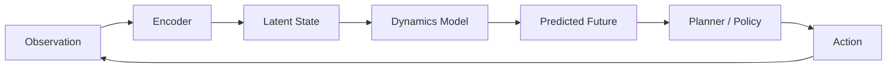
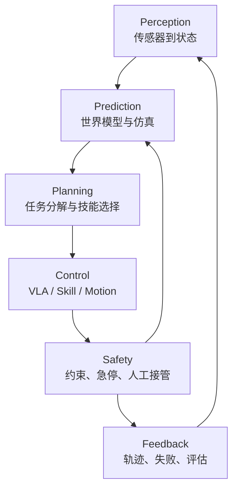
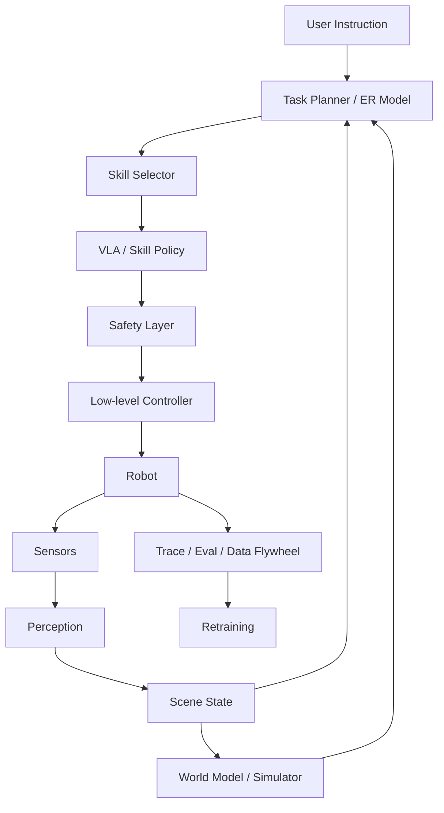

# 第6章 具身智能与 Physical AI

## 当模型进入物理世界，系统闭环发生了什么变化？

前面几章讨论的大模型，大多运行在文本、图像、代码、检索结果和工具调用这些“数字空间”里。世界模型和具身智能把问题推进了一步：模型不仅要回答“下一句话是什么”，还要理解“下一秒世界会怎样变化”“如果我采取这个动作，会发生什么”“这个动作在当前身体和环境里是否可行”。

这也是为什么世界模型和具身智能正在成为大模型之后的重要方向。LLM 让机器学会了语言和知识的压缩，世界模型让机器学会预测环境，具身智能让机器在真实或仿真的环境里闭环行动。

一句话先建立直觉：

> 世界模型是智能体对环境状态、动态变化和行动后果的内部预测模型；具身智能是智能体带着身体、传感器和执行器，在环境中通过感知、决策、行动和反馈完成任务的能力。

注意，这里的“世界模型”不是哲学意义上的世界观，也不是知识图谱，更不是数据库。它强调的是：智能体能不能在内部模拟世界，预测行动后果，并据此规划或学习。

## 6.1 为什么这章放在大模型基础里

很多工程师第一次听到世界模型，会觉得它离 LLM Agent 很远，好像只属于机器人或自动驾驶。但从系统视角看，它和 Agent 工程有同一条主线：

- LLM 通过语言上下文预测下一个 token；
- RAG 通过外部知识约束模型回答；
- Agent 通过工具调用影响数字世界；
- 世界模型通过预测环境状态支持规划；
- 具身智能通过身体在物理世界执行行动。

它们都在解决一个问题：智能体如何在不确定环境中做出更好的下一步动作。

只是动作空间不同：

```text
LLM:
  action = 生成下一个 token

软件 Agent:
  action = 调用工具、编辑文件、访问网页、执行命令

具身智能体:
  action = 移动、抓取、推拉、避障、导航、与人协作
```

如果你能理解 KV cache、RAG、工具调用和 eval，那么世界模型和具身智能也可以用熟悉的工程语言来理解：状态表示、动作空间、反馈信号、评估指标、安全边界和闭环迭代。

## 6.2 宏观理解：世界模型到底是什么

世界模型可以理解为一个“可用于预测的内部环境模型”。给定当前观察、历史状态和候选动作，它输出未来可能发生的事情。

最简化的表达是：

```text
current observation + history + action
  -> world model
  -> predicted next state / reward / risk / affordance
```

其中：

- **observation**：智能体看到或感知到的东西，可以是图像、视频、激光雷达、触觉、文本状态、游戏画面或传感器数据；
- **state**：环境内部状态，可能是显式的，也可能是模型学到的 latent state；
- **action**：智能体可以采取的动作，例如转向、抓取、点击、移动、发出工具调用；
- **prediction**：下一状态、奖励、碰撞风险、任务进度、可行动性或未来视频帧；
- **policy / planner**：根据预测结果选择下一步动作。

所以世界模型不是“知道很多事实”的模型，而是“能预测状态变化”的模型。

可以用驾驶来类比。一个新手看到前车刹车，只知道“前面红灯了”。一个熟练司机会预测：前车可能急停，右侧电动车可能插入，自己如果不减速，2 秒后距离会不安全。后者脑中有一个粗糙但有效的世界模型。

对于 AI 系统也是一样：仅仅识别物体不够，还要预测物体、自己和其他智能体之间的动态关系。

## 6.3 世界模型的几种常见含义

“World Model”在不同论文和公司报告里含义略有差异。阅读材料时要先判断对方说的是哪一种。

### 1. Model-based RL 里的环境动力学模型

这是最经典的技术含义。智能体学习一个模型来预测环境如何变化，然后在模型里“想象”未来，训练策略或做规划。策略、价值和模型预测之间的关系可以用强化学习的状态—动作—回报框架理解 [24]。

例如 Ha 和 Schmidhuber 的 World Models 工作，用视觉编码器学习压缩表示，用循环网络建模时间动态，再用一个很小的 controller 做决策 [1]。Dreamer 系列进一步把这个思路发展成可扩展的 latent dynamics model：先学习世界的隐状态动态，再在想象出来的未来轨迹里训练 actor-critic [2][3][4]。

这里的关键不是生成漂亮视频，而是让策略能利用预测结果提高样本效率和泛化能力。表示学习的基本观点也是先得到适合下游决策的抽象，而不是把所有原始细节等权保留 [23]。

### 2. 生成式视频 / 交互式环境模型

近年来，大模型社区开始把“能生成可交互环境”的视频模型也称为世界模型。Genie、Genie 2、Genie 3 和 NVIDIA Cosmos 都属于这条线 [7][17][18][19]。

普通视频生成模型更像“根据提示生成一段看起来合理的视频”。世界模型要求更高：它要能根据用户或智能体动作持续更新场景，并保持物体、空间、因果和交互的一致性。

差别可以这样看：

```text
视频生成:
  prompt -> video

交互式世界模型:
  prompt + action sequence -> evolving environment
```

如果用户向左走，场景要随视角改变；如果智能体推开门，门的状态要在后续保持；如果物体被移动，它不能下一秒凭空回到原位。这些一致性才是世界模型难的地方。

### 3. JEPA 类的表征预测模型

JEPA 路线强调在 latent space 中做预测，而不是重建像素。I-JEPA、V-JEPA 和 V-JEPA 2 的核心思想是：模型不必生成每个像素，只要预测高层表示即可 [5][6]。

这条线很重要，因为物理世界里很多细节不需要逐像素重建。机器人抓杯子时，不需要预测桌面每个纹理像素，但需要知道杯子位置、姿态、可抓取区域和动作后果。

latent prediction 的优势是更接近决策需要的抽象，可能更高效，也更少陷入像素级生成的噪声。

### 4. 自动驾驶和机器人仿真的世界模型

在自动驾驶、机器人和工业仿真里，世界模型常常是数据生成、极端场景测试和策略训练的一部分。

例如自动驾驶系统需要大量罕见长尾场景：突然横穿的行人、施工改道、异常天气、遮挡后的车辆、复杂无保护左转。真实路测很难穷尽这些情况，生成式世界模型可以帮助构造可控、可重复、可扩展的仿真环境。CARLA 等开放仿真器说明，标准化场景、传感器和交通参与者是评估自动驾驶策略的重要基础 [26]。

这个方向的核心指标不是“视频好不好看”，而是：

- 场景是否物理合理；
- 其他交通参与者行为是否可信；
- 传感器观测是否接近真实；
- 被训练或评估的策略是否能迁移到真实世界；
- 长尾风险是否被覆盖。

## 6.4 世界模型和 LLM 的关系

LLM 和世界模型有相似之处，也有关键差异。

相似之处：

- 都是通过大规模数据学习预测；
- 都把历史上下文压缩成内部表示；
- 都可以作为更大智能体系统的一部分；
- 都依赖数据分布和训练目标；
- 都会在分布外场景失败。

关键差异：

```text
LLM:
  输入输出主要是离散 token
  目标是 next-token prediction
  强项是语言、知识、代码、抽象推理和工具协议

World Model:
  输入输出可以是视频、状态、动作、传感器和 latent representation
  目标是预测环境演化和动作后果
  强项是动态、空间、物理、交互和规划
```

从 Agent 系统看，LLM 更像“高层任务先验和语言接口”，世界模型更像“环境预测器和行动模拟器”。未来很多系统会把二者结合起来：LLM 负责理解任务、分解目标和调用工具，世界模型负责预测动作后果、生成训练场景或辅助规划。

## 6.5 经典路线：从 World Models 到 Dreamer

早期世界模型路线主要来自 model-based reinforcement learning。

典型流程如下：



### Ha 和 Schmidhuber 的 World Models

经典 World Models 架构可以拆成三块 [1]：

- **VAE**：把高维图像压缩到 latent vector；
- **MDN-RNN**：预测 latent state 的时间演化；
- **Controller**：基于 latent state 选择动作。

这个工作的启发在于：智能体可以先学一个紧凑的环境表示，再在这个内部模型中训练策略。论文还展示了“在模型生成的梦境中训练，再迁移回真实环境”的思想。

对工程师来说，最值得记的是：世界模型把“感知表示”和“行动策略”解耦了。策略不必直接处理原始像素，而可以基于压缩后的状态进行决策。

### PlaNet、Dreamer 和 DreamerV3

Dreamer 系列把世界模型推进到更通用的 RL 算法 [2][3]。核心思想是：

1. 从真实交互数据中学习 latent dynamics；
2. 在 latent space 中 rollout 未来轨迹；
3. 用 imagined trajectories 训练 policy 和 value；
4. 把学到的策略放回真实或仿真环境中执行。

DreamerV3 的重要性在于它用单一配置覆盖了很多任务，并在 Minecraft 等复杂环境中展现了从像素和稀疏奖励中学习远期策略的能力 [4]。

这条路线说明：世界模型的价值不只是“生成环境”，更重要的是提升学习效率。真实机器人数据很贵，真实自动驾驶路测很贵，真实工业试错也很贵。如果能在学到的模型里进行想象和试错，就可能减少真实世界探索成本。

### 世界模型的训练目标与状态表示

世界模型并不只有一个统一损失。像素重建要求预测视觉细节，latent prediction 要求保持对决策有用的信息，奖励预测要求理解任务进展，动作条件预测要求学习“采取动作后会发生什么”。这些目标可以联合训练，但各自的误差含义不同：视频看起来清晰，不代表动作因果正确；奖励预测准确，不代表空间细节足够；latent 表示稳定，也不代表能处理未见物体。

状态表示通常包含视觉、语言、机器人本体状态和历史动作。显式状态便于调试和约束，例如物体位姿、速度、关节角和碰撞标志；隐式状态更容易压缩复杂环境，但不易解释和验证。实际系统可以采用混合表示：世界模型维护 latent dynamics，同时由感知模块提供可审计的对象、关系和安全状态。

动作条件是世界模型区别于普通视频模型的关键。训练样本不能只有连续观察，还要记录动作发生的时间、动作参数、执行结果和失败原因。若数据里动作与环境变化没有对齐，模型学到的只是相关性，无法在规划时比较不同动作。对于机器人，还要区分高层技能、轨迹、关节控制和实际执行反馈，避免把计划动作误当成已经完成的动作。

### 长时预测与不确定性

短时预测可能看起来准确，连续 rollout 后却逐渐漂移。误差会在每一步进入下一状态，导致物体消失、场景重复或物理关系崩坏。解决方向包括 latent 状态校正、真实观察重置、分层时间尺度、短 horizon 规划和多候选未来。世界模型不必总是预测唯一未来，更应表达多个可能结果和相应不确定性。

不确定性对安全规划尤其重要。预测道路参与者下一步动作时，模型应给出多个行为假设；预测抓取是否成功时，应保留滑落和遮挡等风险；当模型对某个新物体没有经验时，应触发更保守的动作、重新感知或人工确认。把不确定性压成一个看似确定的视频，会让下游策略过度信任错误预测。

## 6.6 世界基础模型：从环境模型到可交互世界

2024 之后，“World Foundation Model”开始成为产业关键词。它的目标类似 LLM：先用大规模通用数据训练一个基础世界模型，再针对机器人、自动驾驶、游戏、仿真、视频生成等任务做后训练或适配。

可以这样类比：

```text
Language Foundation Model:
  大规模文本/代码/多模态数据 -> 通用语言和知识能力 -> 下游任务适配

World Foundation Model:
  大规模视频/仿真/传感器/动作数据 -> 通用物理和交互先验 -> 下游场景适配
```

### Genie 系列

Google DeepMind 的 Genie 系列把世界模型和可交互环境联系得非常紧。Genie 2 重点展示了从提示生成可行动控制的 3D 环境；Genie 3 进一步强调实时交互、较高分辨率和更长时间一致性。

这类模型对 Agent 研究有两个潜在意义：

- 生成训练环境，让智能体在大量多样化场景中学习；
- 生成评估环境，测试智能体是否真正理解空间、物体和动作后果。

但要保持清醒：交互式世界模型还不是可靠的物理仿真器。它们能生成看起来合理的环境，但是否满足严格物理、传感器和安全评估要求，需要具体验证。

### NVIDIA Cosmos

NVIDIA Cosmos 更偏向 Physical AI 平台：世界基础模型、视频 tokenizers、数据处理、后训练和仿真生态结合起来，服务机器人和自动驾驶开发 [17]。

这代表了一个工业趋势：世界模型不会单独存在，它会和数字孪生、仿真引擎、数据管线、策略模型、评估系统和 GPU 推理平台一起组成栈。

### Waymo World Model

截至 2026-05，一个值得注意的产业案例是 Waymo 把世界模型用于自动驾驶仿真。它强调生成高真实度、可控的驾驶场景，尤其是罕见和危险的长尾情况。

这给工程师的启发是：世界模型最先落地的场景，往往不是“完全替代真实世界”，而是补足真实数据难以覆盖的部分，例如极端天气、危险交互、低频事故和复杂道路参与者行为。

## 6.7 从模型能力到物理闭环

具身智能不是“机器人 + LLM”。它的核心是把模型放进一个会被动作改变的环境中，并让系统在感知、预测、规划、控制和安全反馈之间持续闭环。身体、传感器、执行器、环境、任务目标和数据回流都属于这个闭环的一部分，缺任何一环都不能称为可部署系统。



前文介绍的 Dreamer、Genie、Cosmos、V-JEPA、RT-2、PaLM-E、RT-X、Octo、π0、Gemini Robotics 和 Helix，可以放回这张图里理解：有的强化预测环境动态，有的强化视觉和语言到动作的映射，有的强化跨机器人数据，有的强化连续控制。技术路线很多，但工程问题只有一个：系统能否在真实环境中连续观察、预测、行动、验证并安全恢复。

真实世界比文本世界更苛刻。动作有速度、力、扭矩和碰撞约束；物体会滑落、遮挡、反光、变形或被人移动；传感器有噪声和延迟；失败可能造成硬件损坏或人身风险；真实试错昂贵，不能靠无限重试换正确率。因此，本章后半部分不再按模型名罗列，而按可部署闭环展开。

## 6.8 感知：从传感器到可行动状态

感知层把摄像头、深度、触觉、IMU、激光雷达、麦克风和机器人本体状态转换成可决策状态。这个状态不只是“图像里有什么”，还包括对象位置、姿态、关系、可通行区域、抓取候选、机器人关节状态、环境变化和不确定性。感知错误会直接污染后续规划：杯子位置偏 3 厘米，语言计划再正确也可能抓空。

可行动性，或者 affordance，是感知层与规划层之间的关键概念。它回答的是：在当前环境、当前身体和当前技能集合下，某个动作是否可执行。杯子可以抓，但装满热水时抓取策略要变；抽屉可以拉，但前方有障碍物时不可拉；“把碗放进微波炉”对塑料碗和金属碗安全性不同。SayCan 的核心思想之一，就是把 LLM 的高层语义知识和机器人技能的可行动性结合起来 [9]。

生产系统通常会把感知输出写成结构化状态，而不是把原始图像直接交给高层模型自由解释：

```text
SceneState {
  objects: id, class, pose, confidence, affordance
  robot: joints, gripper, battery, fault_state
  map: free_space, obstacle, restricted_zone
  task_context: instruction, goal, constraints
  freshness: timestamp, sensor_source, uncertainty
}
```

这个状态要有版本、时间和置信度。若状态过期、置信度不足或关键对象不可见，系统应重新感知、移动视角或请求人工，而不是让语言模型猜测。感知层越结构化，后续规划、控制、安全和评估越容易连接。

## 6.9 预测：世界模型、仿真与数字孪生

世界模型在闭环中回答“如果采取这个动作，环境可能怎样变化”。它可以用于生成合成训练数据、预测候选动作后果、做 model-predictive control、生成长尾测试场景、支持自动驾驶和机器人离线评估，也可以作为数字孪生的一部分帮助调试。关键不是画面是否漂亮，而是预测是否能服务行动。

Sim2Real、Real2Sim 和数字孪生是世界模型落地时最常见的系统形态。Sim2Real 在仿真中训练或测试，再迁移到真实世界，难点是材质、摩擦、接触、传感器噪声、执行器磨损和人类行为造成的 simulation gap [20][21][22]。Real2Sim 从真实失败构建仿真场景，用于复现长尾、做反事实测试和验证修复策略。数字孪生偏工程系统和结构化仿真，世界模型偏学习到的生成式或预测式模型，二者可以结合。

世界模型必须和真实数据闭环校准。一个看起来真实但物理不可信的模型，会让策略学到错误行为；一个在短视频上表现稳定的模型，不一定能支持多轮交互和长时记忆。评估时要比较同一 planner 在真实环境、世界模型和混合环境中的任务成功率、动作分布和失败类型。若策略只在模型内部变好，却不能迁移到真实环境，说明它更像视觉生成器，而不是可用于决策的环境模型。

## 6.10 规划：把语言目标变成技能图

任务规划层把自然语言目标、场景状态和技能集合转成可执行任务图。例如“把桌上的杯子放进水槽”不能直接变成一个动作，而要拆成找杯子、靠近桌子、选择抓取姿态、抓起杯子、移动到水槽、放下杯子和检查结果。每个节点都需要前置条件、预期结果、失败策略和安全约束。

LLM 或 embodied reasoning model 适合做高层语义理解和任务分解，但必须接收环境状态、技能可用性、affordance、安全规则和失败反馈。它能提出“语义上合理”的步骤，却不能单独证明步骤在当前身体和环境中可执行。规划层应把候选计划交给规则、仿真、世界模型或技能库验证，再进入控制层。

规划输出最好是结构化技能图：

```text
SkillPlan {
  goal: "cup_to_sink"
  steps: [
    {skill: "locate", target: "cup", precondition: "visible_or_searchable"},
    {skill: "navigate", target_pose: "table_front", safety: "no_human_collision"},
    {skill: "grasp", object: "cup", affordance: "graspable", retry: 2},
    {skill: "place", target: "sink", postcondition: "cup_in_sink"}
  ]
}
```

计划是版本化候选，而不是事实。执行中环境变化、对象丢失、抓取失败或安全约束触发，都可能要求重新规划。这个设计和后续 Agent Runtime 一致：模型提出候选，运行时保存状态、验证前置条件、执行动作、记录观察，再决定继续、回退或人工接管。

## 6.11 控制：VLA、技能策略与低层控制器

VLA，Vision-Language-Action，是近几年具身智能的重要范式。它把视觉、语言和动作放进同一个模型或同一套训练目标中，输入可以是图像、视频、机器人状态和语言指令，输出可以是离散 action token、末端执行器位姿、关节角、轨迹 waypoint、diffusion/flow 生成的连续动作序列，或高层技能调用。

不同代表工作可以按控制接口理解。RT-2 把动作表示成 token，便于复用视觉语言模型能力 [11]；PaLM-E 把真实传感器接入语言模型，强调 grounding [10]；Open X-Embodiment 和 RT-X 通过跨机器人数据推动跨 embodiment 学习 [12]；Octo 提供开源通用机器人策略，方便比较架构和数据 [13]；π0、π0.5 和后续路线强调从 VLM 走向连续控制和开放环境泛化 [14][15]；Gemini Robotics 与 Helix 说明工业界正在把多模态理解推进到物理行动 [16]。

但生产系统很少只依赖一个端到端模型。更常见的结构是高层模型负责泛化和任务理解，中层 VLA 或 skill policy 负责抓取、放置、导航、操作等技能，低层控制器和运动规划器负责轨迹可行性、频率、稳定性和安全限制。端到端模型可以提供更强泛化，但解释和验证困难；模块化系统更可控，却需要清晰接口和大量技能维护。实际系统通常在二者之间取折中。

## 6.12 安全反馈与数据飞轮

具身系统的安全不是输出过滤，而是控制闭环的一部分。常见机制包括速度、力、扭矩和加速度限幅，碰撞检测，安全区域，硬件和软件急停，远程或本地人工接管，任务级危险动作拒绝，以及对用户指令的语义安全判断。LLM 的安全提示不能替代控制安全；物理系统必须有底层硬约束。

数据飞轮决定具身智能能否规模化。一个机器人样本通常包含时间戳、摄像头/深度/触觉/本体状态、语言指令、动作轨迹、成功失败标签、环境元数据和操作者元数据。真实机器人昂贵，任务失败可能损坏硬件，不同机器人动作空间不同，人类遥操作质量不稳定，成功率评估还需要环境状态判断。因此数据来源通常是组合的：遥操作、机器人自主执行日志、仿真数据、视频和网页数据、失败恢复样本、人工示范、偏好反馈和跨机器人共享数据集。Bridge Data 等工作也说明，跨机器人和跨环境数据是提高泛化的重要方向 [27]。

```text
部署 -> 采集轨迹 -> 标注成功失败 -> 挖掘长尾
  -> 仿真扩增 -> 训练 -> 回归评估 -> 再部署
```

这条飞轮和 Agent 系统中的 trace / eval / regression loop 很像，只是成本和风险更高。软件 Agent 的一次错误大多可以回滚，机械臂撞到人不能简单 revert。物理世界把所有约束放大，所以具身系统更需要仿真、限幅、人工接管、长尾评估和清晰的责任边界。

## 6.13 评估：世界模型和具身智能怎么测

评估是这个方向最难的部分之一。

### 世界模型评估

不能只看视频质量。CausalWorld 等基准强调因果交互和可控操作，说明世界模型应评估动作改变环境后的结果，而不是只评估单帧视觉质量 [8]。更有用的指标包括：

- **预测一致性**：物体是否在时间上保持身份和位置一致；
- **动作可控性**：给定动作后，环境变化是否对应；
- **物理合理性**：碰撞、重力、遮挡、接触是否合理；
- **长时记忆**：离开视野的物体再次出现时是否仍然存在；
- **交互稳定性**：多轮动作后是否崩坏；
- **任务有效性**：用它训练或评估的策略能否迁移到真实环境；
- **安全覆盖**：是否能生成高风险和长尾场景。

评估时还要把预测模型放回真实策略闭环：让同一个 planner 分别使用真实环境、世界模型和混合环境，比较任务成功率、动作分布和失败类型。如果世界模型生成的场景只让策略在模型内部变好，却不能迁移到真实环境，说明它更像视觉生成器而不是可用于决策的环境模型。对长时任务要记录误差随 rollout 长度的增长，而不是只报告第一帧或短片段指标。

具身评估还要覆盖硬件和人的因素：不同摩擦、负载、传感器延迟、光照、遮挡和操作者指令都可能改变结果。一个只在固定实验台上成功的策略，不能直接推断在家庭、仓库或道路上可靠。评估报告应明确训练内、训练外、仿真、真实和长尾场景的边界。

这套评估边界决定了世界模型能否真正服务训练、规划和安全验证。没有闭环验证，生成质量不能代表行动价值，也不能代表真实世界中的安全和泛化能力。世界模型区别于普通视频生成模型的地方，正在于它最终要支持可靠行动，而不是只生成漂亮画面。

### 具身智能评估

机器人任务不能只看单次 demo。需要：

- 多场景、多物体、多指令测试；
- 成功率、完成时间、碰撞次数、人工接管次数；
- 新物体、新布局、新语言表达的泛化；
- 失败恢复能力；
- 安全违规率；
- 对人的协作体验；
- 长任务完成率；
- 数据和模型版本的回归测试。

设计评审里如果被问“怎么评估一个家务机器人”，不要只说“看能不能完成任务”。更完整的回答是：

```text
我会拆成任务成功率、泛化、效率、安全和可恢复性五类指标。
每类指标都要覆盖训练内、训练外和长尾场景。
同时保留完整传感器、动作和模型 trace，失败样本进入回归集。
```

### 科研现状：截至 2026-05 的主线

世界模型和具身智能研究非常快，但可以归纳成几条主线。

### 1. 从 model-based RL 到 world foundation model

早期世界模型主要服务 RL，提高样本效率。现在的大方向是把世界模型扩展成基础模型：用大规模视频、仿真和交互数据学习通用物理与空间先验，再适配具体场景。

核心问题是：这种模型能否像 LLM 一样随数据和模型规模提升泛化能力。

### 2. 从视频生成到可交互世界

Genie 3、Cosmos 等方向说明，世界模型正在从“生成视频”走向“生成可交互环境” [18][19][28]。关键挑战是动作条件控制、时间一致性、长时记忆、空间结构、物理约束和多智能体行为。

一个真正有用的世界模型，不能只生成一段漂亮画面，而要支持智能体在其中行动、失败、重试和学习。

### 3. 从像素预测到 latent prediction

JEPA 路线认为，智能体不必预测每个像素，而应该预测高层表示。这可能更接近人类认知：我们预测“杯子会掉下桌子”，不是预测每个像素的 RGB 值。

V-JEPA 2 把视频自监督学习和少量机器人数据结合，展示了 latent world model 用于规划和控制的可能性。

### 4. 从单机器人策略到跨 embodiment 基础模型

RT-X、Octo、π0、π0.5、π0.7、Gemini Robotics 和 Helix 都在推动跨机器人、跨任务、跨环境的模型。这里最大的瓶颈是动作空间和硬件形态不同。

同一句“打开抽屉”，对双臂机器人、单臂机械臂和人形机器人意味着完全不同的控制序列。模型要学到可迁移的任务结构，同时适配具体身体。

### 5. 从离散 action token 到连续轨迹生成

RT-2 把动作 token 化，便于复用语言模型结构。π0 等路线则强调用 flow matching 或 diffusion 类方法生成连续动作，更适合灵巧操作和高频控制。

未来很可能是混合式：

- 高层计划用语言或符号；
- 中层技能用 VLA 或 diffusion / flow policy；
- 低层控制用传统控制器和安全约束。

### 6. 从实验室 demo 到生产安全

机器人 demo 很容易吸引注意，但生产落地更看重稳定性、可恢复性和安全。研究正在从“能不能做一次”转向“能不能在不同家庭、仓库、工厂、天气和人群中长期可靠运行”。

这也是为什么评估、数据飞轮、安全规则、低层控制和仿真系统的重要性正在上升。

### 和 Agent 系统设计的关系

本书主要讨论 LLM Agent。世界模型和具身智能看似更偏机器人，但它们对 Agent 系统有直接启发。

### 1. Agent 也需要“局部世界模型”

软件 Agent 没有机械臂，但它也在环境中行动。它的环境可能是代码库、浏览器、数据库、CI 系统、企业知识库。

一个强的 coding agent 应该理解：

- 修改某个文件会影响哪些测试；
- 执行某个命令会产生什么副作用；
- 依赖升级会破坏哪些 API；
- 当前 repo 的架构约束是什么；
- 一个错误修复会不会引入回归。

这也是一种局部世界模型，只是世界不是物理空间，而是软件系统。

### 2. Tool use 是数字世界的 embodiment

LLM 如果只能生成文本，行动能力有限。接入工具后，它有了“数字身体”：可以搜索、读文件、运行测试、发邮件、调用 API、修改代码。

因此，工具调用可以看作数字具身智能的早期形态。它同样需要：

- action schema；
- 权限控制；
- 环境反馈；
- 失败恢复；
- trace；
- eval；
- 安全边界。

### 3. 物理世界把所有约束放大

物理具身智能比软件 Agent 更难，因为行动不可轻易回滚，反馈更嘈杂，风险更真实。

写错一行代码可以 revert，机械臂撞到人不能简单 revert。这个差异决定了具身系统必须更重视安全层、仿真、限幅、人工接管和验证。

### 系统设计题：设计一个家务机器人助手

这类题可以按下面框架回答。

### 需求澄清

先问清楚：

- 机器人形态：单臂、双臂、人形、移动底盘？
- 场景：家庭、酒店、医院、仓库？
- 任务：拿取、整理、清洁、递送、对话？
- 是否允许接触人？
- 延迟要求和安全等级？
- 是否联网？
- 是否需要持续学习？
- 评估指标是什么？

### 架构草图



### 核心设计点

1. 高层用 LLM / ER 模型理解用户目标、拆解任务。
2. 感知层维护场景状态，包括对象、位置、关系和可行动区域。
3. VLA 或 skill policy 负责具体动作。
4. 世界模型用于预测候选动作后果、生成仿真场景和离线评估。
5. 安全层做硬约束：速度、力、碰撞、禁区、危险动作拒绝。
6. 失败时先暂停、回退、重新感知，再请求人工确认。
7. 所有传感器、动作、模型输出和安全事件进入 trace。
8. 失败样本进入回归集和数据飞轮。

### 关键 trade-off

- 端到端 VLA 泛化强，但可解释性和安全验证难；
- 模块化系统可控性强，但可能受限于手写技能和接口；
- 仿真数据便宜，但 simulation gap 会影响真实表现；
- 真实数据质量高，但采集成本和风险大；
- 云端模型能力强，本地模型低延迟且隐私更好。

### 系统设计题：设计一个世界模型服务

如果题目是“设计一个给机器人团队使用的世界模型平台”，回答重点会不同。

### 输入

- 文本 prompt；
- 初始图像或视频；
- 结构化场景描述；
- 机器人或车辆动作；
- 地图、物体、天气、交通参与者等约束；
- 真实日志片段。

### 输出

- 未来视频或状态轨迹；
- 可交互环境；
- 多个候选未来；
- 风险评分；
- 场景元数据；
- 可用于训练或评估的数据包。

### 服务架构

```text
Scenario API
  Prompt / Scene Parser
  Condition Builder
  World Model Inference
  Physics / Rule Consistency Checker
  Scenario Store
  Evaluation Harness
  Data Export Pipeline
```

### 评估重点

- 是否可控：能否指定动作、天气、道路结构、物体行为；
- 是否一致：多步交互后场景是否稳定；
- 是否真实：传感器和物理是否接近真实；
- 是否有用：用它训练或评估的策略是否提升真实表现；
- 是否安全：能否覆盖高风险场景且避免生成误导性数据。

### 常见误区

从学习系统角度看，世界模型仍然受表示、优化、泛化和评估规律约束。中文深度学习教材对表示学习、序列建模和优化过程的梳理，可以帮助读者把“预测未来状态”还原成可训练的函数近似问题 [29][30]；机器学习中的泛化和模型选择原则，则提醒我们不能只在生成模型自己的场景上评估它 [31]。

### 误区 1：把世界模型当知识图谱

知识图谱表示实体和关系，世界模型预测状态变化和动作后果。二者可以结合，但不是一回事。

### 误区 2：把视频生成模型等同于世界模型

视频生成是必要能力之一，但世界模型还需要可交互、可控、长时一致和任务有效。会生成视频，不代表能支持智能体学习。

### 误区 3：以为具身智能就是给机器人接 ChatGPT

语言理解只是高层能力。机器人还需要感知、控制、可行动性、安全、仿真和数据闭环。

### 误区 4：只看 demo，不看评估分布

机器人 demo 往往展示最成功的一次。工程上要看多场景、多物体、多任务、多轮失败恢复和安全违规率。

### 误区 5：认为仿真可以完全替代真实数据

仿真很重要，但 simulation gap 长期存在。高质量系统通常是仿真、真实数据、世界模型和在线反馈的组合。

### 设计评审表达

一句话版：

> 世界模型是智能体对环境动态和动作后果的内部预测模型；具身智能是带着身体、传感器和执行器，在真实或仿真环境中闭环感知、规划和行动的智能。LLM 擅长语言和语义推理，但具身系统还需要 grounding、affordance、连续控制、世界模型、仿真评估和物理安全。

展开版：

> 我会把世界模型理解成“可用于行动决策的环境预测器”。它不只是知识库，也不只是视频生成，而是给定当前观察和候选动作，预测未来状态、风险和任务进展。具身智能则是在这个基础上把模型放进一个有身体的闭环系统里：传感器感知环境，模型理解和规划，策略输出动作，低层控制器执行，环境反馈再进入下一轮决策。工业上，VLA、Open X-Embodiment、Octo、π0 / π0.5 / π0.7、Gemini Robotics、Cosmos、Genie 和自动驾驶仿真都在推动这个方向。真正落地时，我会重点关注数据飞轮、sim2real、长尾评估、低层安全约束和人工接管，而不是只看一次 demo。

系统设计版：

> 如果设计一个具身智能机器人，我会先澄清身体形态、任务范围、环境、安全等级和成功指标。架构上分成高层任务规划、感知状态估计、VLA/skill policy、世界模型或仿真、低层控制、安全层和数据闭环。世界模型用于预测候选动作后果和生成训练/评估场景，VLA 负责把视觉和语言转成动作，安全层负责硬约束。评估上看任务成功率、泛化、效率、安全违规、失败恢复和人工接管率。

### 自测问题

读完本章后，应该能回答：

- 世界模型和 LLM 的主要区别是什么？
- 为什么说世界模型不是知识图谱，也不是普通视频生成？
- model-based RL 中的世界模型如何帮助策略学习？
- Dreamer 为什么强调在 latent space 中想象未来？
- Genie、Cosmos、V-JEPA 2 分别代表什么路线？
- 具身智能为什么不能只靠 LLM？
- Affordance 如何连接语言计划和物理行动？
- VLA 模型的输入输出是什么？
- 为什么跨 embodiment 数据很重要？
- 如何评估一个家务机器人或自动驾驶世界模型？
- 真实系统为什么需要安全层、仿真和数据飞轮？

## 参考资料

[1] Ha, D., & Schmidhuber, J. *World Models*. NeurIPS Workshop, 2018. https://arxiv.org/abs/1803.10122

[2] Hafner, D., et al. *Learning Latent Dynamics for Planning from Pixels*. ICML, 2019. https://arxiv.org/abs/1811.04551

[3] Hafner, D., et al. *Dream to Control: Learning Behaviors by Latent Imagination*. ICLR, 2020. https://arxiv.org/abs/1912.01603

[4] Hafner, D., et al. *Mastering Diverse Domains through World Models*. arXiv, 2023. https://arxiv.org/abs/2301.04104

[5] Meta AI. *V-JEPA 2: World Model and Benchmarks*. 2025. https://ai.meta.com/blog/v-jepa-2-world-model-benchmarks/

[6] Bardes, A., et al. *Revisiting Feature Prediction for Learning Visual Representations*. arXiv, 2024. https://arxiv.org/abs/2404.08471

[7] Brooks, T., et al. *Video Generation Models as World Simulators*. arXiv, 2024. https://arxiv.org/abs/2412.00568

[8] Ahmed, O., et al. *CausalWorld: A Robotic Manipulation Benchmark for Causal Reasoning*. arXiv, 2020. https://arxiv.org/abs/2010.04963

[9] Ahn, M., et al. *Do As I Can, Not As I Say: Grounding Language in Robotic Affordances*. arXiv, 2022. https://arxiv.org/abs/2204.01691

[10] Driess, D., et al. *PaLM-E: An Embodied Multimodal Language Model*. arXiv, 2023. https://arxiv.org/abs/2303.03378

[11] Brohan, A., et al. *RT-2: Vision-Language-Action Models Transfer Web Knowledge to Robotic Control*. arXiv, 2023. https://arxiv.org/abs/2307.15818

[12] Open X-Embodiment Collaboration. *Open X-Embodiment: Robotic Learning Datasets and RT-X Models*. arXiv, 2023. https://arxiv.org/abs/2310.08864

[13] Octo Model Team. *Octo: An Open-Source Generalist Robot Policy*. arXiv, 2024. https://arxiv.org/abs/2405.12213

[14] Black, K., et al. *π0: A Vision-Language-Action Flow Model for General Robot Control*. arXiv, 2024. https://arxiv.org/abs/2410.24164

[15] Physical Intelligence. *π0.5: A Vision-Language-Action Model with Open-World Generalization*. arXiv, 2025. https://arxiv.org/abs/2504.16054

[16] Google DeepMind. *Gemini Robotics Brings AI into the Physical World*. 2025. https://deepmind.google/blog/gemini-robotics-brings-ai-into-the-physical-world/

[17] NVIDIA. *Cosmos: World Foundation Model Platform for Physical AI*. arXiv, 2025. https://arxiv.org/abs/2501.03575

[18] Bruce, J., et al. *Genie: Generative Interactive Environments*. arXiv, 2024. https://arxiv.org/abs/2402.15391

[19] DeepMind. *Genie 2: A Large-Scale Foundation World Model*. arXiv, 2024. https://arxiv.org/abs/2409.13502

[20] Tobin, J., et al. *Domain Randomization for Transferring Deep Neural Networks from Simulation to the Real World*. arXiv, 2017. https://arxiv.org/abs/1703.06907

[21] Peng, X. B., et al. *Sim-to-Real Transfer of Robotic Control with Dynamics Randomization*. arXiv, 2017. https://arxiv.org/abs/1710.06537

[22] Tremblay, J., et al. *Training Deep Networks with Synthetic Data: Bridging the Reality Gap by Domain Randomization*. CVPR Workshops, 2018. https://arxiv.org/abs/1804.06516

[23] Bengio, Y., Courville, A., & Vincent, P. *Representation Learning: A Review and New Perspectives*. IEEE TPAMI, 2013. https://arxiv.org/abs/1206.5538

[24] Sutton, R. S., & Barto, A. G. *Reinforcement Learning: An Introduction*, 2nd ed. MIT Press, 2018. http://incompleteideas.net/book/the-book-2nd.html

[25] Levine, S., et al. *Offline Reinforcement Learning: Tutorial, Review, and Perspectives on Open Problems*. arXiv, 2020. https://arxiv.org/abs/2005.01643

[26] Dosovitskiy, A., et al. *CARLA: An Open Urban Driving Simulator*. CoRL, 2017. https://arxiv.org/abs/1711.03938

[27] Ebert, F., et al. *Bridge Data: Boosting Generalization of Robotic Skills with Cross-Domain Datasets*. RSS, 2022. https://arxiv.org/abs/2208.13653

[28] Hu, A., et al. *Learning Interactive Real-World Simulators*. arXiv, 2023. https://arxiv.org/abs/2310.06114

[29] Zhang, A., Lipton, Z. C., Li, M., & Smola, A. V. *Dive into Deep Learning*, 2nd ed., 2023. https://zh.d2l.ai/

[30] 邱锡鹏：《神经网络与深度学习》，机械工业出版社，2020。https://nndl.github.io/

[31] 周志华：《机器学习》，清华大学出版社，2016。https://cs.nju.edu.cn/zhouzh/zhouzh.files/publication/MLbook2016.htm

## 版本与范围

“世界模型”在强化学习、视频生成、表征学习和机器人仿真中含义不同；本章以预测、规划和行动之间的接口来比较这些路线，而不把它们视为可互换产品。VLA、机器人基础模型和 Physical AI 的公开能力变化迅速，产品性表述以 **2026-09-21** 可访问的论文或官方资料为准。仿真成功、离线 benchmark 分数和真实环境安全不是同一项证据。

## 工程决策案例

**场景：** 仓库机器人需要识别货箱、规划取放并在人员靠近时停止。视觉/语言模型负责候选物体、任务意图和异常说明；运动规划器、碰撞检测、速度限制和急停回路保持确定性并独立于语言模型。世界模型可用于离线模拟罕见遮挡、抓取失败和路径冲突，但不能成为绕过实体安全互锁的依据。

上线采用分阶段门禁：先离线回放和仿真，再在隔离区域以低速度只读观察，最后才在人工监护下执行。每次动作记录传感器快照、规划版本、模型版本、置信度和安全控制器的拒绝原因；成功率之外，还评估碰撞近失、人工接管率、分布外拒绝率和从仿真到真实的性能落差。

## 参考资料与延伸阅读

- Hafner et al., 2023, [Mastering Diverse Domains through World Models](https://arxiv.org/abs/2301.04104)。
- Brohan et al., 2023, [RT-2: Vision-Language-Action Models Transfer Web Knowledge to Robotic Control](https://arxiv.org/abs/2307.15818)。
- [Google DeepMind Robotics](https://deepmind.google/models/gemini-robotics/), accessed 2026-09-21.
