# 第5章 Agent 架构总纲：边界、Runtime 与模式选择

> "The right question isn't whether to use AI, but whether the problem requires reasoning."
> 关键不是要不要用 AI，而是这个问题是否需要推理、行动、验证和治理。

## 引言

很多团队第一次设计 Agent 系统时，会把注意力放在模型上：用哪个大模型、提示词怎么写、工具调用怎么接。模型当然重要，但从工程架构看，Agent 不是“一个会调用工具的 Prompt”，而是一个围绕模型构建的**运行时系统**。

这个运行时系统至少要回答十二个问题：

1. 用户到底想完成什么任务？
2. 任务应该被拆成哪些步骤？
3. 每一步需要哪些上下文？
4. 哪些历史状态、用户偏好和经验可以被复用？
5. 系统有哪些可复用技能、工具、连接器和工作流？
6. 模型应该选择哪个能力、哪个模型或哪个专家？
7. 哪些动作允许执行，哪些必须拒绝、审批、沙箱或人工接管？
8. 执行过程中如何观察、修复、暂停、恢复和停止？
9. 任务过程如何被记录、回放、审计和评估？
10. 最终结果如何被验证、审查和交接？
11. 用户反馈、失败案例和复盘经验如何进入改进闭环？
12. 哪些能力可以自动沉淀，哪些必须经过人工审核和灰度发布？

本章的目标是建立一个通用的 Agent 架构总纲。它不绑定某一种产品形态，也不局限于某个垂直场景。你可以用它设计企业知识助手、告警处理助手、客服运营助手、数据分析助手、审批助手，也可以用它评估一个现有 Agent 系统到底缺了哪一层。

本章按五层展开：5.1 先判断是否真的需要 Agent，5.2 建立生产级 Agent Runtime 的最小骨架，5.3 展开核心组件的职责边界和后续章节地图，5.4 讨论组件如何组合成不同架构模式，5.5 用场景映射和检查清单校验设计是否完整。

第 5 章不是把每个组件都讲透，而是给第二部分建立一张总图。第 6 章会深入工具、Skills、连接器与 MCP，第 7 章会深入工作流、状态机和多 Agent 协作，第 8 章会讨论平台化架构，第 9 到第 11 章会展开 RAG、Agentic RAG、Memory 与状态管理，第 12 章会系统讨论 Evals、Guardrails、Trace 和可观测性。理解了本章的边界图，后续章节就不再是零散专题，而是同一个 Runtime 的逐层展开。

---

## 5.1 Agent 架构决策：先判断是否需要 Agent

### 5.1.1 从问题出发：为什么不是传统后端

在设计 Agent 系统之前，先不要问“能不能接一个大模型”，而要问：为什么传统后端、规则引擎、工作流系统或搜索系统不够用？

如果一个问题可以被稳定规则、固定流程和确定性接口很好地解决，那么优先使用传统后端。Agent 的价值来自另一类任务：目标表达模糊，信息分散在多个系统里，执行路径需要根据观察动态调整，最终结果还需要证据、验证和人工审查。

| 问题特征 | 传统后端的困难 | Agent 可以补上的能力 |
|:---|:---|:---|
| 输入不稳定 | 很难提前穷举所有表达方式 | 理解自然语言、文档和半结构化事件 |
| 信息分散 | 需要人工跨系统查询和拼接 | 按任务动态收集上下文和证据 |
| 路径不固定 | 固定流程容易过度复杂 | 边观察、边判断、边重规划 |
| 依赖经验 | 规则难以覆盖专家判断 | 复用 Skill、Runbook 和历史案例 |
| 结果需解释 | 只返回状态码不足以交付 | 输出结论、证据、不确定性和下一步 |
| 风险需治理 | 直接自动执行不可接受 | 通过 Policy、审批、Verifier 和 Review 控制边界 |

这一步的结论不是“要不要 AI”，而是判断任务是否需要**推理、行动、验证和治理**同时存在。如果只需要一次性生成或分类，可以是普通 LLM 应用；如果需要在受控边界内多步完成任务，才进入 Agent 架构设计。

---

### 5.1.2 Agent 与传统后端的本质区别

传统后端系统基于确定性逻辑：

```text
Structured Input -> Rules / Code -> Deterministic Output
```

Agent 系统基于受控推理：

```text
Task -> Context -> Reasoning -> Tool Use -> Observation -> Verification -> Result
```

两者不是替代关系，而是分工关系。传统后端擅长高频、稳定、强一致的业务流程；Agent 擅长处理模糊输入、多源上下文、多步骤推理和开放式任务。

| 维度 | 传统后端系统 | Agent 系统 |
|:---|:---|:---|
| 输入形态 | 结构化字段、固定 API | 自然语言、半结构化事件、文档、上下文 |
| 决策方式 | 规则、状态机、确定性算法 | LLM 推理 + 策略约束 + 工具反馈 |
| 流程形态 | 设计时固定 | 运行时规划或动态调整 |
| 外部能力 | 后端服务直接调用 | 模型提出行动，Runtime 裁决和执行 |
| 成功判定 | 状态变更、返回码、事务结果 | 任务契约、证据、验证器、人工审查 |
| 风险来源 | 代码缺陷、配置错误、依赖故障 | 上下文缺失、工具误用、幻觉、越权、不可复现 |
| 治理方式 | 测试、监控、权限、审计 | Evals、Guardrails、Trace、Policy、Review |

一个常见误区是把 Agent 的概率性理解成“不可控”。生产系统的正确做法不是期待模型永远正确，而是把模型放进可控 Runtime：

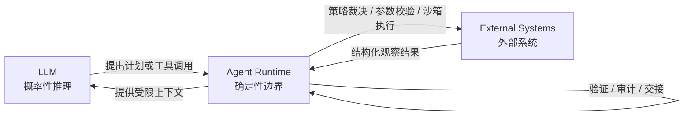

换句话说，Agent 系统的工程目标不是消灭不确定性，而是把不确定性限制在可以观察、可以验证、可以回滚、可以接管的范围内。

---

### 5.1.3 Agent 是运行时系统，不只是模型调用

一个最小的 LLM 应用通常长这样：

```text
User Input -> Prompt -> LLM -> Answer
```

这类系统适合做一次性问答、文本生成、分类、摘要等任务。它的特点是简单、低成本、易上线，但它并不是真正意义上的 Agent。

Agent 系统通常长这样：

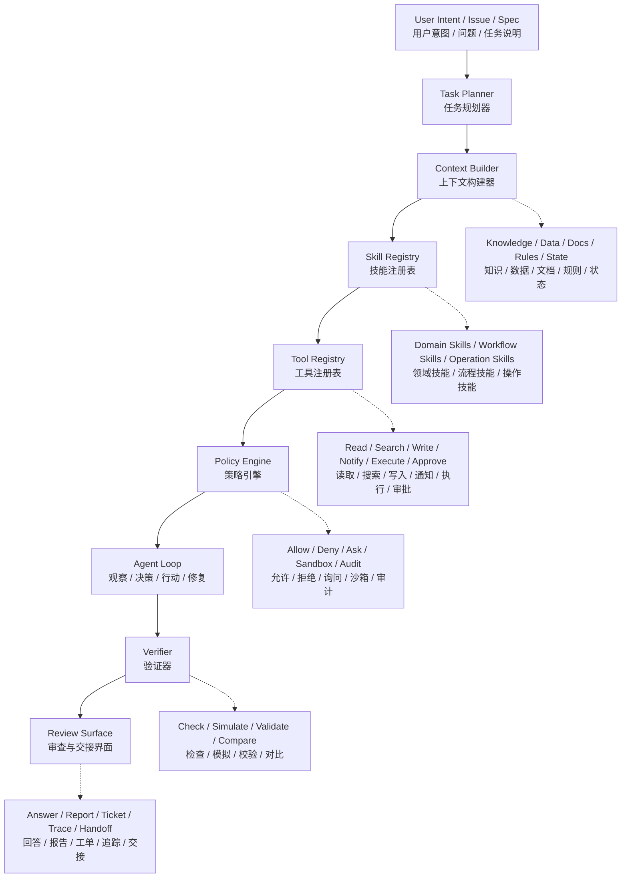

这张图是本章最重要的心智模型。模型只是 Agent Loop 中的推理引擎，真正让系统可用的是 Runtime：

- **Planner** 把模糊任务变成可执行计划；
- **Context Builder** 决定模型能看到什么；
- **Skill Registry** 让系统复用领域经验和操作流程；
- **Tool Registry** 把外部能力变成可审查接口；
- **Policy Engine** 把权限和风险判断从 Prompt 中拿出来；
- **Agent Loop** 负责多轮观察、决策、行动和修复；
- **Verifier** 决定任务是否真的完成；
- **Review Surface** 让人类能审查、接管、复盘和追责。

如果一个系统只有 Prompt 和工具调用，没有上下文治理、策略裁决、执行预算、验证机制和审计界面，它更像“增强版聊天应用”，还不是生产级 Agent。

---

### 5.1.4 决策框架：什么时候需要 Agent

不要因为“可以用 AI”就设计 Agent。先判断问题是否真的需要推理和行动。

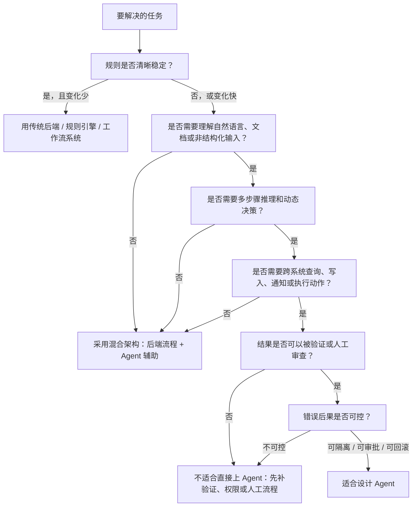

可以用一个更工程化的矩阵判断：

| 判断项 | 倾向传统后端 | 倾向 Agent |
|:---|:---|:---|
| 输入是否模糊 | 输入字段固定，含义明确 | 用户表达多样，包含文档、上下文、事件描述 |
| 规则是否稳定 | 规则清晰、变化少 | 规则多变，依赖经验和上下文 |
| 是否需要探索 | 不需要，路径固定 | 需要边查边判断、根据观察调整计划 |
| 是否跨系统 | 单一系统或少量稳定 API | 多个知识库、业务系统、监控系统、工单系统 |
| 是否能验证 | 结果由数据库状态或返回码确认 | 需要证据、引用、模拟、对比、人工审查 |
| 错误代价 | 错误不可接受且难回滚 | 可以只读、审批、沙箱、灰度或人工兜底 |
| 延迟要求 | 毫秒级 | 秒级或分钟级可接受 |
| 成本形态 | 高频低成本请求 | 低频高价值任务，愿意为推理付费 |

这里不应该写“Agent 准确率通常是多少”这类通用数字。不同模型、任务、上下文、工具、评测集和上线时间都会改变结果。更可靠的做法是定义**任务级 Eval**：

- 对知识问答，看引用准确率、拒答率、幻觉率、权限违规率；
- 对告警诊断，看根因命中率、证据完整度、建议安全性、人工采纳率；
- 对审批助手，看分类准确率、风险漏判率、误拦截率、处理时延；
- 对运营助手，看动作建议命中率、执行回滚率、用户确认率。

Agent 是否可用，必须由你自己的任务、数据和风险边界验证，而不是由一个跨场景的经验准确率决定。

---

### 5.1.5 混合架构：Agent 不应该接管所有东西

生产系统里，最稳妥的架构通常不是“全 Agent”，而是混合架构：

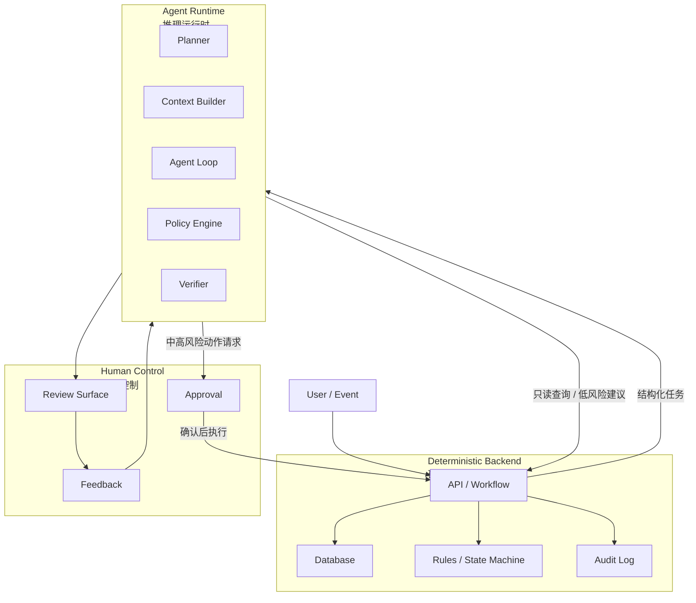

推荐的边界是：

- **传统后端管状态**：订单、工单、审批、资产、权限、任务生命周期；
- **Agent 管推理**：理解意图、规划路径、整合证据、生成建议；
- **Policy 管风险**：动作是否允许、是否需要审批、是否进入沙箱；
- **Verifier 管完成**：结果是否满足任务契约；
- **Human Review 管责任**：关键结论、风险动作、知识沉淀必须可审查。

Agent 的价值不是替代后端系统，而是把后端系统原本无法处理的模糊任务、跨系统任务和专家经验任务，转化成可操作、可验证、可审计的工作流。

---

## 5.2 Agent Runtime：生产级 Agent 的最小骨架

### 5.2.1 最小 Runtime 心智模型

完整 Runtime 图容易让人觉得 Agent 很复杂。真正落地时，可以先记住一个最小骨架：

| Runtime 能力 | 解决的问题 | 如果缺失会怎样 |
|:---|:---|:---|
| Intake | 任务从哪里来，身份和环境是什么 | 聊天、告警、工单、Webhook 混成一团，无法审计和幂等 |
| Context | 模型应该看到什么 | 回答凭感觉，引用和权限失控 |
| Memory | 哪些经验、偏好和历史可以复用 | 每次都从零开始，或错误历史污染当前任务 |
| Capability | Agent 能请求哪些 Skills、Tools、Connectors | 只能聊天，不能行动或查证，或者能力暴露过宽 |
| Policy / Human Control | 哪些动作允许执行，哪些需要人介入 | 高风险动作被 Prompt 软约束，容易越权 |
| State | 当前任务进展到哪里 | 长任务不可恢复，容易重复执行 |
| Loop | 如何观察、决策、行动、修复 | 无法多步推进，也无法处理失败 |
| Model Routing / Handoff | 任务应该交给哪个模型、专家或 Agent | 所有任务都挤在一个通用 Agent 里，成本高且边界混乱 |
| Verifier / Eval | 如何判断当前任务完成，以及版本是否退化 | 模型自己宣布完成，质量不可控 |
| Review / Trace / Audit | 人如何审查、复盘、接管和追责 | 结果不可追责，无法进入生产流程 |
| Learning Loop | 反馈和失败经验如何沉淀 | 系统不会变好，或未经审核的经验污染生产能力 |

这张表是后面所有组件的压缩版。MVP 可以不复杂，但这些边界最好一开始就存在。哪怕它们只是几个模块、几张表、几个配置，也比把所有责任都塞进 Prompt 更可靠。

---

### 5.2.2 通用 Agent Runtime 分层架构

下面是一个更完整的通用架构图：

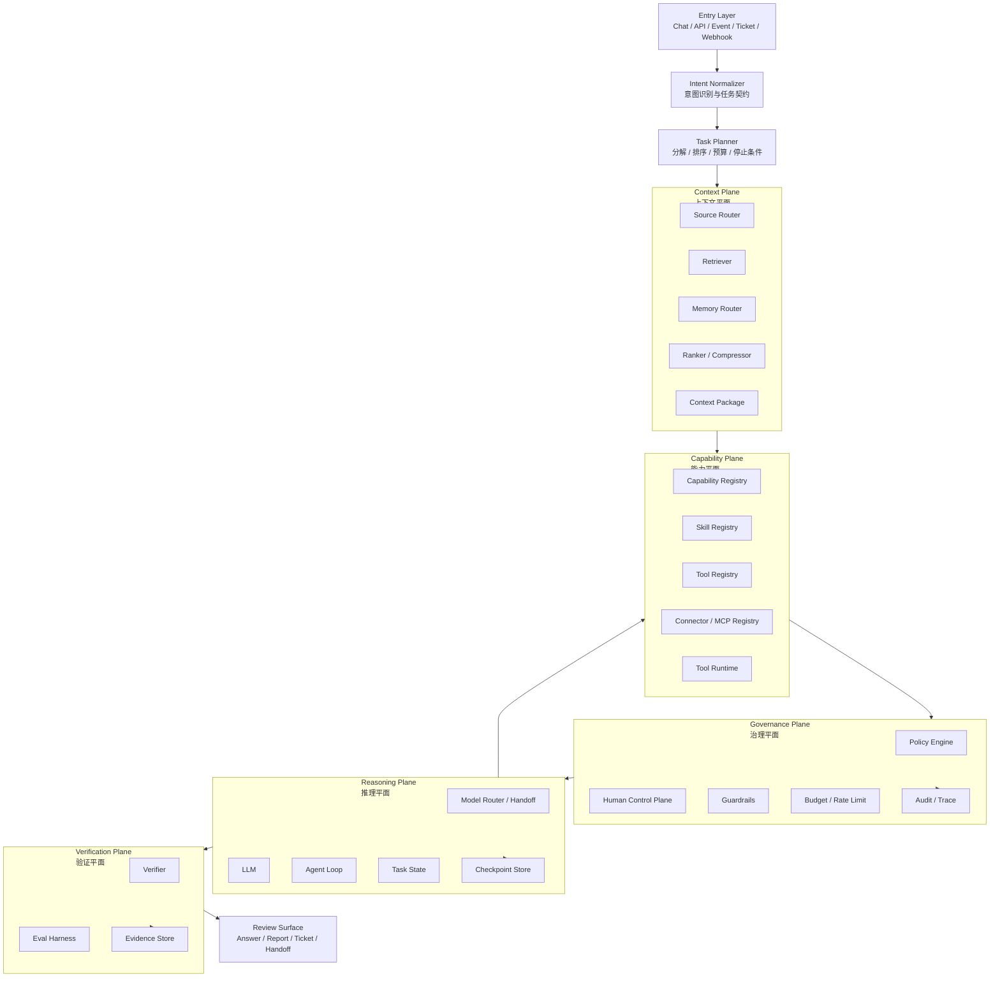

这套架构可以拆成六个平面：

| 平面 | 解决的问题 | 核心组件 |
|:---|:---|:---|
| Entry Plane | 任务从哪里来，如何标准化 | Chat、API、Webhook、Ticket、Intent Normalizer |
| Context Plane | 模型应该看到什么 | Source Router、Retriever、Memory Router、Ranker、Context Package |
| Capability Plane | Agent 能做什么 | Capability Registry、Skill Registry、Tool Registry、Connector / MCP Registry、Tool Runtime |
| Governance Plane | Agent 能不能做，什么时候要人介入 | Policy Engine、Human Control Plane、Guardrails、Budget、Audit |
| Reasoning Plane | Agent 如何推理和行动 | Model Router、LLM、Agent Loop、Task State、Checkpoint Store |
| Verification Plane | 任务是否完成，版本是否退化 | Verifier、Eval Harness、Evidence Store |

注意：这些平面不一定对应独立服务。MVP 可以把它们放在一个进程里，但架构边界要清晰。否则系统越长越像一个巨大 Prompt，最后难以测试、难以调试、难以治理。

---

### 5.2.3 Runtime 初始化：模型、工具、技能、策略与数据源

Agent 的完整链路不是从用户请求才开始。请求进入之前，Runtime 已经完成了一次系统初始化：加载配置、注册模型、注册工具、注册技能、编译策略、连接数据源、初始化可观测性。

如果没有这一步，模型就不知道可用工具有哪些，Runtime 也不知道哪些动作允许执行。

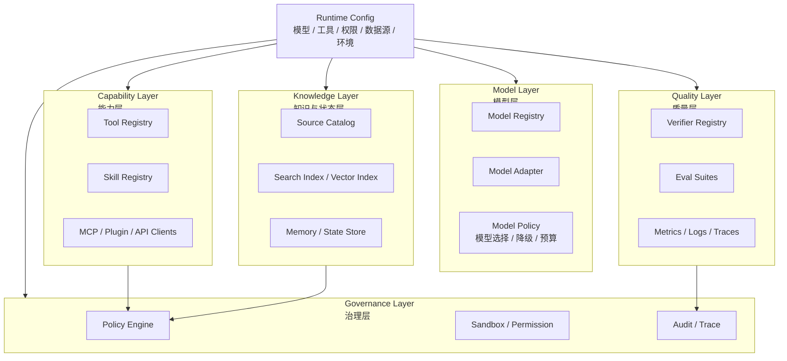

初始化阶段会产生几个关键注册表：

| 注册对象 | 作用 | 典型内容 |
|:---|:---|:---|
| Model Registry | 告诉 Runtime 可以使用哪些模型 | 模型名称、能力、上下文长度、成本预算、降级顺序 |
| Tool Registry | 告诉 Runtime 有哪些可执行能力 | 工具名、描述、输入 Schema、输出 Schema、风险等级、owner |
| Skill Registry | 告诉 Runtime 有哪些可复用方法 | 触发条件、步骤、约束、需要的工具、验证要求 |
| Source Catalog | 告诉 Runtime 可以从哪里取上下文 | 文档库、业务数据库、日志、指标、工单、规则、Memory |
| Policy Store | 告诉 Runtime 什么动作允许执行 | RBAC、ABAC、环境限制、审批策略、沙箱规则 |
| Verifier Registry | 告诉 Runtime 如何判断完成 | 引用校验、格式校验、状态校验、领域规则校验 |
| Observability Config | 告诉 Runtime 如何记录过程 | trace schema、采样率、敏感字段脱敏、指标上报 |

一个简化的 Runtime 配置可以长这样：

```yaml
runtime:
  environment: production
  default_mode: read_only
  max_steps: 12
  max_cost_usd: 0.5

models:
  primary:
    name: general-reasoning-model
    capabilities: [reasoning, tool_calling, structured_output]
  fallback:
    name: fast-summary-model
    capabilities: [summarization, classification]

tools:
  - name: search_docs
    risk_level: low
    side_effect: false
  - name: create_ticket
    risk_level: medium
    side_effect: true
    requires_approval: true

skills:
  - name: policy_question_answering
    triggers: [policy, process, reimbursement]
  - name: incident_initial_diagnosis
    triggers: [alert, incident, degradation]

policies:
  default_write_action: ask
  production_side_effect: ask
  restricted_data_access: deny
```

初始化不是把所有信息都塞给模型。它只是让 Runtime 拥有一张完整的能力地图。真正给模型看的，是后面根据任务动态筛选出来的**本轮可见工具、相关技能和上下文包**。

系统初始化还应该做健康检查：

- 模型 Provider 是否可用；
- MCP Server、插件和外部 API 是否连接正常；
- 工具 Schema 是否能通过校验；
- Policy 规则是否能编译；
- 检索索引是否新鲜；
- Trace、日志和指标是否能写入；
- 高风险工具是否默认关闭或进入审批模式。

这一步的目标是让 Agent 在接收用户请求之前，就已经知道自己的能力边界和安全边界。

---

### 5.2.4 用户请求完整链路：从入口到最终响应

完成初始化后，一次用户请求才真正进入 Runtime。完整链路可以拆成二十个事件：

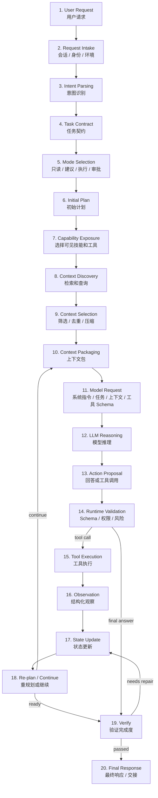

这条链路里，模型和 Runtime 的职责不同：

| 阶段 | 主要数据对象 | 主要责任方 | 说明 |
|:---|:---|:---|:---|
| Request Intake | request envelope | Runtime | 记录用户、会话、入口、时间、环境 |
| Intent Parsing | intent | 模型 + Runtime | 判断是问答、诊断、建议、执行还是审批 |
| Task Contract | task contract | 模型生成，Runtime 校验 | 抽取目标、实体、约束、成功标准、风险等级 |
| Mode Selection | execution mode | Runtime / Policy | 决定 read-only、dry-run、approval 或 execute |
| Initial Plan | plan | 模型 | 拆解步骤、依赖、预算和停止条件 |
| Capability Exposure | visible skills / tools | Runtime | 按任务、权限、风险筛选可见能力 |
| Context Discovery | raw evidence | 工具 | 搜索文档、查数据库、查日志、查状态 |
| Context Selection | selected evidence | Runtime + 模型 | 过滤无关内容，保留来源、时间、权限和证据 ID |
| Context Packaging | context package | Runtime | 组装模型本轮可见上下文 |
| Model Request | messages + tool schema | Runtime | 把任务、上下文、可见工具和约束发送给模型 |
| LLM Reasoning | reasoning result | 模型 | 判断下一步是回答、继续查询还是请求动作 |
| Action Proposal | final answer / tool call | 模型 | 生成结构化输出或工具调用参数 |
| Runtime Validation | validation result | Runtime / Policy | 校验工具名、参数 Schema、权限、风险、预算 |
| Tool Execution | tool result | Tool Runtime | 执行确定性动作，返回结构化观察 |
| Observation | observation envelope | Runtime | 标准化工具结果、错误和证据 |
| State Update | task state | Runtime | 记录已完成步骤、失败原因、预算消耗 |
| Re-plan / Continue | revised plan | 模型 | 根据观察结果决定继续、修复或停止 |
| Verify | verification report | Verifier | 判断输出是否满足任务契约 |
| Final Response | answer / report / handoff | 模型 + Runtime | 生成用户可读结果，并附证据、风险和 trace |

在真正请求模型时，Runtime 通常不会只发送用户原话，而是发送一个被组织过的请求包：

```json
{
  "system_instructions": [
    "你是企业 Agent Runtime 中的推理模块。",
    "只能使用本轮暴露的工具。",
    "所有关键结论必须引用证据。"
  ],
  "task_contract": {
    "intent": "answer_policy_question",
    "goal": "回答员工关于费用报销时限的问题",
    "success_criteria": ["给出直接回答", "引用制度来源", "说明不确定性"]
  },
  "selected_skills": [
    {
      "name": "policy_question_answering",
      "steps": ["识别制度主题", "检索权威文档", "比较冲突条款", "带引用回答"]
    }
  ],
  "context_package": {
    "evidence": [
      {
        "id": "DOC-001#p3",
        "title": "费用报销制度",
        "updated_at": "2026-04-18",
        "excerpt": "差旅住宿费用需要在行程结束后 30 天内提交。"
      }
    ],
    "constraints": {
      "must_cite_sources": true,
      "do_not_expose_restricted_content": true
    }
  },
  "available_tools": [
    {
      "name": "search_docs",
      "description": "按关键词搜索用户有权限访问的内部文档。",
      "input_schema": {
        "type": "object",
        "required": ["query"],
        "properties": {
          "query": {"type": "string"},
          "limit": {"type": "integer"}
        }
      }
    }
  ],
  "task_state": {
    "step": 2,
    "remaining_budget": {"tool_calls": 5, "seconds": 30},
    "observations": []
  }
}
```

这里有一个关键点：**模型看到的是本轮允许使用的工具 Schema，不是完整工具注册表**。完整注册表属于 Runtime。模型只负责在可见能力范围内做选择，不能越过 Runtime 调用隐藏工具。

完整请求链路还应该记录成 trace：

```text
request.received
intent.parsed
task_contract.created
mode.selected
plan.created
tools.exposed
context.retrieved
context.packaged
model.requested
action.proposed
policy.checked
tool.executed
observation.recorded
state.updated
verification.completed
response.sent
```

这组事件让 Agent 任务可以被回放、调试、评估和审计。否则当用户问“为什么它给出这个结论”时，系统只能回答“模型这么说的”，这在生产环境里是不够的。

---

## 5.3 Agent 核心组件：职责边界与后续章节地图

5.3 不是要把每个组件都讲透，而是建立一张生产级 Agent Runtime 的组件地图。后续第 6 到第 12 章，会沿着这张地图逐层展开：工具系统、执行编排、平台化、知识上下文、Memory、Evals、Guardrails 和可观测性。

现代 Agent 系统已经不只是“模型 + 工具调用”。从 OpenAI Agents SDK、AgentKit、LangGraph、Google ADK、MCP、Anthropic Skills 这些工程实践可以看到，生产级 Agent 越来越像一个可治理的 Runtime：它要管理入口、任务契约、上下文、状态、能力、权限、人工控制、模型路由、Trace、评测和学习闭环。

先用一张图把职责边界和后续章节关系串起来：

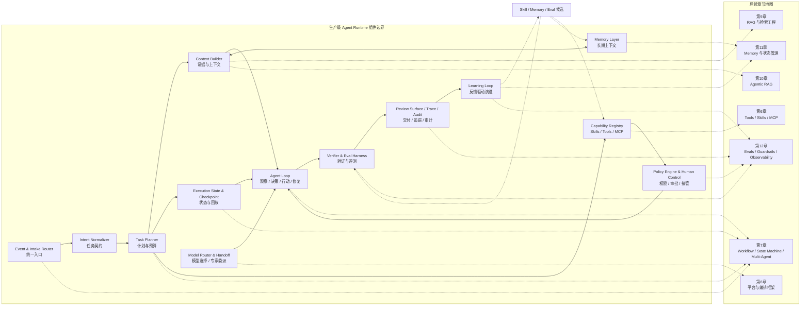

这张图有两个读法：从左到右看，是一次 Agent 任务在 Runtime 内部的主要控制链路；从组件指向右侧章节看，是第二部分后续内容的阅读路线。也就是说，第 6 到第 12 章不是零散专题，而是这张 Runtime 图上的不同区域。

下面这张表再给出组件地图：

| 核心组件 | 主要职责 | 后续展开 |
|:---|:---|:---|
| Event & Intake Router | 接收聊天、API、告警、工单、Webhook、定时任务等入口 | 第7章工作流、第17章 DoD Agent |
| Intent Normalizer | 把模糊输入变成结构化任务契约 | 第7章入口路由、第12章输入治理 |
| Task Planner | 生成可执行、可验证、可修订的计划 | 第7章执行编排 |
| Context Builder | 组织本轮任务需要的证据和上下文 | 第9章 RAG、第10章 Agentic RAG |
| Memory Layer | 管理跨会话偏好、经验、历史任务和长期上下文 | 第11章 Memory |
| Execution State & Checkpoint | 管理任务状态、暂停、恢复、重试、回放和幂等 | 第7章状态机、第11章状态管理 |
| Capability Registry | 统一管理 Skills、Tools、Connectors、MCP、Prompt 和 Workflow | 第6章工具系统、第8章平台架构 |
| Policy Engine & Human Control Plane | 管理权限、风险、审批、接管、降级和回滚 | 第6章工具权限、第12章 Guardrails |
| Agent Loop | 推动观察、决策、行动、修复和停止 | 第7章工作流、第8章平台运行时 |
| Model Router & Handoff Manager | 管理模型选择、专家委派、多 Agent 协作和跨 Agent 通信 | 第7章多 Agent、第8章平台架构 |
| Verifier & Eval Harness | 运行时验证和离线回归评测 | 第12章 Evals |
| Review Surface、Trace & Audit | 提供可审查输出、过程追踪和审计证据 | 第12章可观测性、第17章实战案例 |
| Learning Loop | 把反馈、失败案例和复盘经验转化为能力演进 | 第11章 Memory、第12章 Evals、第16章 Hermes |

这些组件不一定都要独立成服务。MVP 可以从一个进程、几张表、几个配置和一套 trace schema 开始。但职责边界最好一开始就清楚：哪些事情由模型推理，哪些事情由 Runtime 裁决，哪些事情由人工确认，哪些事情只能通过评测和灰度后进入生产。

---

### 5.3.1 Event & Intake Router：Agent 的入口不只是聊天

很多 Agent 原型从聊天框开始，所以会把用户消息当成唯一入口。但生产级 Agent 不只处理自然语言聊天，还要处理各种系统事件：

- 告警系统推送的 incident；
- 工单系统里的升级请求；
- Webhook 触发的业务事件；
- 定时任务产生的巡检结果；
- IDE、CLI 或浏览器插件里的上下文事件；
- 企业 IM、邮件、客服会话中的多轮对话；
- 其他 Agent 或工作流委派过来的子任务。

Event & Intake Router 的职责是把这些入口统一成请求信封，而不是直接让模型读原始事件。

```json
{
  "request_id": "req_20260512_001",
  "channel": "alert_webhook",
  "tenant": "wxquare",
  "actor": {
    "type": "system",
    "id": "prometheus"
  },
  "user_context": {
    "viewer": "u_123",
    "roles": ["sre_oncall"]
  },
  "payload_type": "incident_alert",
  "payload": {
    "service": "payment",
    "severity": "critical",
    "time_window": "2026-05-12T10:00:00+08:00/2026-05-12T10:15:00+08:00"
  },
  "correlation_id": "trace_or_incident_id",
  "idempotency_key": "alert-payment-20260512-1000",
  "environment": "production"
}
```

这一层主要做四件事：

| 职责 | 说明 |
|:---|:---|
| 入口归一 | 把聊天、API、Webhook、工单、告警、定时任务归一成 request envelope |
| 身份绑定 | 绑定用户、系统、租户、角色、环境和权限上下文 |
| 幂等与关联 | 生成 request_id、correlation_id、idempotency_key，避免重复处置 |
| 初步分流 | 判断是否进入问答、诊断、审批、执行、人工转接或拒绝 |

Event & Intake Router 不应该承担复杂推理。它只负责把“事件从哪里来、谁触发、影响什么、属于什么环境”说清楚。真正的任务理解交给 Intent Normalizer，执行路径交给 Planner 和 Workflow。

这一层很容易被忽略，但它决定 Agent 能不能从聊天机器人走向生产系统。DoD Agent、客服 Agent、运营 Agent 和 Coding Agent 的差异，往往首先体现在入口事件不同，而不是模型不同。

---

### 5.3.2 Intent Normalizer：把用户输入变成任务契约

Agent 的输入不应该直接等于用户原话。用户可能说：

```text
这个客户投诉为什么这么久还没解决？
```

这句话里面包含了多个隐含问题：

- 这是查询、诊断、催办，还是升级？
- “这个客户”对应哪个客户、工单或订单？
- “这么久”是超过 SLA，还是超过用户心理预期？
- 系统能否读取客户信息？
- 如果要催办，是否需要审批？

所以第一层应该是 Intent Normalizer。它负责把原始输入转成任务契约：

```json
{
  "task_id": "task_20260511_001",
  "intent": "diagnose_ticket_delay",
  "user_goal": "解释客户投诉工单长时间未解决的原因，并给出下一步建议",
  "domain": "customer_support",
  "entities": {
    "ticket_id": "TCK-1024",
    "customer_id": "C-8801"
  },
  "risk_level": "medium",
  "allowed_actions": ["read", "summarize", "recommend"],
  "requires_approval_for": ["notify_customer", "change_owner", "close_ticket"],
  "success_criteria": [
    "说明当前工单状态",
    "列出延迟原因和证据",
    "给出下一步建议",
    "标注信息来源"
  ]
}
```

任务契约的价值是把模糊请求变成可执行边界：

- Planner 知道要规划什么；
- Context Builder 知道要找什么证据；
- Tool Registry 知道暴露哪些工具；
- Policy Engine 知道哪些动作有风险；
- Verifier 知道如何判断完成；
- Review Surface 知道如何向用户交付。

没有任务契约，Agent Loop 很容易变成“模型想做什么就做什么”。

---

### 5.3.3 Task Planner：计划是可验证的假设

Planner 的职责不是写一段漂亮的推理过程，而是把目标拆成可执行、可观察、可验证的步骤。

一个好的计划应该包含：

- **目标**：这一步要解决什么问题；
- **输入**：需要哪些上下文或工具结果；
- **动作**：要调用什么能力；
- **风险**：是否可能越权、写入、通知、执行；
- **验证**：如何判断这一步成功；
- **停止条件**：什么时候不再继续探索。

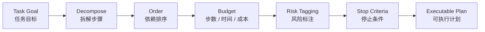

计划可以分三种粒度：

| 计划类型 | 适用场景 | 示例 |
|:---|:---|:---|
| Checklist Plan | 步骤清晰、风险低 | “检索文档 -> 摘要 -> 引用来源” |
| Investigative Plan | 需要边查边判断 | “先查指标，再根据异常维度查日志或变更记录” |
| Workflow Plan | 有状态流转和审批 | “生成处理建议 -> 人工审批 -> 执行 -> 验证 -> 回写工单” |

计划不要追求一次性完美。生产 Agent 中，计划更像一个可修订的假设：

```text
Plan -> Act -> Observe -> Replan -> Verify
```

关键是每次修订都要留下 trace：为什么改计划、基于什么观察、风险等级是否变化。

---

### 5.3.4 Context Builder：上下文是信息架构，不是拼 Prompt

Context Builder 是 Agent 系统最容易被低估的一层。它决定模型能看到什么，也决定模型看不到什么。

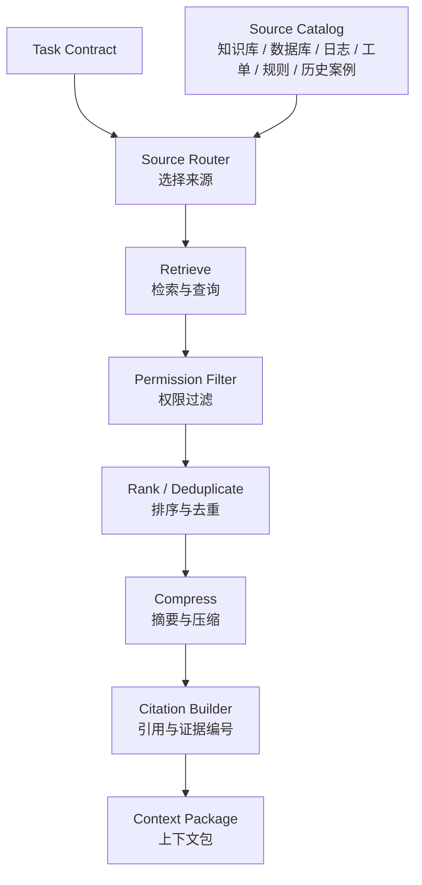

Context Builder 至少要处理六类信息：

| 信息类型 | 作用 | 风险 |
|:---|:---|:---|
| 任务上下文 | 用户目标、实体、约束、成功标准 | 意图识别错误会导致整条链偏航 |
| 领域知识 | 文档、FAQ、Runbook、制度、流程 | 文档过期、权限不匹配、引用缺失 |
| 业务数据 | 订单、工单、客户、资产、配置 | 隐私泄露、越权访问、数据时效问题 |
| 运行状态 | 当前任务状态、已调用工具、失败原因 | 状态丢失会导致重复执行或误判 |
| 历史经验 | 过往案例、用户偏好、团队规则 | 错误经验污染新任务 |
| 安全规则 | 可见范围、动作限制、审批要求 | 只靠 Prompt 提醒会被绕过 |

推荐把上下文组织成结构化 Context Package：

```json
{
  "task": {
    "intent": "answer_policy_question",
    "success_criteria": ["回答问题", "引用来源", "标注不确定性"]
  },
  "sources": [
    {
      "id": "doc_001",
      "type": "policy_doc",
      "title": "费用报销制度",
      "updated_at": "2026-04-18",
      "permission": "allowed",
      "excerpt": "差旅住宿费用需要在行程结束后 30 天内提交。",
      "citation": "DOC-001#p3"
    }
  ],
  "constraints": {
    "answer_must_cite_sources": true,
    "cannot_reveal_restricted_content": true,
    "ask_when_evidence_conflicts": true
  },
  "state": {
    "previous_tool_calls": [],
    "open_questions": ["用户所在地区是否有特殊报销标准"]
  }
}
```

Context Builder 的核心原则：

1. **先权限，后检索结果注入**：用户无权访问的内容不应该进入模型上下文。
2. **先证据，后结论**：让模型围绕证据推理，而不是凭记忆回答。
3. **保留来源和时间**：引用、更新时间、owner、置信度都应进入上下文。
4. **区分事实和推断**：工具返回的是事实，模型总结的是推断，两者要分开。
5. **控制预算**：上下文越多不一定越好，噪声会让模型更难判断。

还要注意，Context Builder 不是 Memory 系统本身。Context 是本轮模型调用的工作区，Memory 是跨轮次、跨会话、跨任务保存的外部状态。Context Builder 可以读取 Memory，并把经过筛选、授权、压缩后的记忆放入本轮上下文，但不能把所有历史对话一股脑塞给模型。

| 来源 | 进入 Context 的方式 | 关键控制点 |
|:---|:---|:---|
| RAG 文档 | 作为外部知识证据进入 | 权限、时效、引用、冲突处理 |
| 工具结果 | 作为当前事实进入 | Schema、时间窗口、错误类型、证据 ID |
| Workflow State | 作为任务执行状态进入 | 当前步骤、审批状态、已执行动作、幂等键 |
| Memory | 作为偏好、经验或历史摘要进入 | 作用域、可信度、过期时间、写入来源 |

第 9 章和第 10 章会展开 RAG 与 Agentic RAG，第 11 章会专门展开 Memory 的读取、写入、遗忘、污染防控和评估。

---

### 5.3.5 Memory Layer：跨会话状态、经验与长期上下文

Memory Layer 是现代 Agent Runtime 的关键组件。它解决的不是“把聊天记录存起来”，而是让 Agent 在合适的边界内拥有连续性、经验和可治理的长期上下文。

Memory 至少要和三个概念区分开：

| 概念 | 生命周期 | 典型内容 | 谁负责治理 |
|:---|:---|:---|:---|
| Context | 单次模型调用 | 当前问题、证据、工具结果、约束 | Context Builder |
| Execution State | 一次任务生命周期 | 当前步骤、已调用工具、审批状态、失败原因 | Workflow / State Store |
| RAG Knowledge | 长期知识库 | 文档、Runbook、制度、FAQ、代码索引 | Knowledge Platform |
| Memory | 跨会话或跨任务 | 用户偏好、历史摘要、成功经验、失败教训 | Memory Layer + Policy |

一个生产级 Memory 系统通常会包含几类记忆：

| Memory 类型 | 示例 | 风险 |
|:---|:---|:---|
| User Preference | “用户偏好中文总结，喜欢先看结论” | 偏好覆盖当前明确指令 |
| Task Memory | “这个客户投诉曾在上周升级过一次” | 旧状态被误当成当前事实 |
| Domain Experience | “支付超时常见原因包括下游网关抖动和幂等锁竞争” | 经验被泛化到不适用场景 |
| Failure Memory | “上次误判因为只看了 5 分钟窗口，没有对比发布记录” | 错误归因污染后续诊断 |
| Team Convention | “SRE 团队要求恢复动作必须先 dry-run” | 规则过期或跨团队误用 |
| Skill Candidate | “这类任务可以沉淀成 incident_initial_diagnosis Skill” | 未审核能力进入生产 |

Memory 读取要经过路由和过滤：

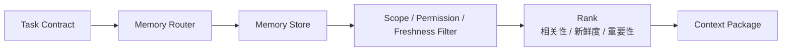

Memory 写入更要谨慎。生产 Agent 不应该默认把所有对话、模型猜测和工具结果写进长期记忆。推荐增加 Memory Write Gate：

```text
candidate memory
-> evidence check
-> sensitivity check
-> scope decision
-> owner review when needed
-> ttl / expiration
-> write or reject
```

可以写入 Memory 的内容通常包括：

- 用户稳定偏好；
- 已验证的任务摘要；
- 人工确认过的复盘结论；
- 可复用的失败案例；
- 服务或团队级注意事项；
- 进入 Skill、Policy、Eval 的候选经验。

不应该直接写入 Memory 的内容包括：

- 未验证的模型推断；
- 本轮临时指令；
- 过期业务状态；
- 敏感数据原文；
- 用户无权长期保存的数据；
- 高风险处置建议的草稿。

Memory 的核心原则是：**可读、可控、可忘、可审计、可评估**。如果没有写入门控、权限边界和遗忘机制，Memory 会从“让 Agent 更懂你”变成“让错误长期污染系统”。

---

### 5.3.6 Execution State 与 Checkpoint：让 Agent 可暂停、恢复与回放

Execution State 管的是“当前任务执行到哪里”。它和 Memory 不同：Memory 是跨任务经验，Execution State 是一次任务生命周期里的事实状态。

生产级 Agent 一旦进入多步骤任务，就必须有状态层。否则系统会遇到几个典型问题：

- 工具调用失败后不知道从哪一步重试；
- 用户审批后无法恢复原来的上下文；
- 长任务中断后只能从头开始；
- 同一告警重复触发导致重复处置；
- 模型忘记已经查过哪些系统；
- 事故复盘时无法重放执行路径。

一个任务状态可以这样建模：

```json
{
  "task_id": "task_20260512_001",
  "status": "waiting_approval",
  "current_step": "recommend_action",
  "plan_version": 3,
  "checkpoints": [
    {
      "step": "collect_evidence",
      "completed_at": "2026-05-12T10:20:00+08:00",
      "evidence_ids": ["metric_001", "log_002", "deploy_003"]
    }
  ],
  "tool_calls": [
    {
      "tool": "query_metric",
      "idempotency_key": "metric-payment-latency-001",
      "status": "success"
    }
  ],
  "approval": {
    "required": true,
    "reason": "生产环境恢复动作需要 SRE Lead 确认",
    "approver_role": "sre_lead"
  },
  "budget": {
    "remaining_steps": 5,
    "remaining_seconds": 120,
    "remaining_tool_calls": 8
  }
}
```

Checkpoint 的价值是让 Agent 支持：

| 能力 | 说明 |
|:---|:---|
| Pause | 等待用户补充信息、等待审批、等待外部系统结果 |
| Resume | 从中断点继续，而不是重新推理整条链 |
| Retry | 对可重试工具调用做幂等重试 |
| Replay | 按 trace 和 checkpoint 重放任务过程 |
| Time Travel Debugging | 回到某个状态观察不同计划或不同模型的表现 |
| Human Takeover | 人工接管时能看到当前状态、证据和建议动作 |

第 7 章讲工作流和状态机时，会把 Execution State 作为核心对象；第 11 章讲 Memory 时，会进一步区分短期会话状态、任务状态和长期记忆。

---

### 5.3.7 Capability Registry：Skills、Tools、Connectors 与 MCP

很多系统会把 Skill、Tool、Connector、Workflow、MCP Server 混在一起，导致权限边界混乱。现代 Agent Runtime 更适合用 Capability Registry 统一管理“系统能提供哪些能力”，再按任务、身份、环境和风险筛选本轮可见能力。

推荐的区分是：

| 概念 | 含义 | 是否执行外部动作 | 示例 |
|:---|:---|:---|:---|
| Skill | 完成某类任务的方法论 | 否 | “如何做事故初步诊断”“如何回答制度问题” |
| Tool | 可调用的外部能力 | 是 | 搜索文档、查询工单、发送通知、创建审批 |
| Connector | 外部系统连接方式 | 可能 | Google Drive、Slack、Jira、内部 CMDB、日志平台 |
| MCP Resource | 可读取的上下文资源 | 否 | 文件、数据库记录、设计稿、代码仓库片段 |
| MCP Prompt | 可复用提示或工作流模板 | 否 | “生成事故复盘报告”“按模板分析 PR 风险” |
| Workflow | 固定或半固定流程 | 可能 | “生成建议 -> 审批 -> 执行 -> 验证” |
| Agent as Tool | 把专家 Agent 暴露为能力 | 间接可能 | “transfer_to_refund_agent”“call_security_reviewer” |
| Policy | 能否执行的裁决规则 | 否，负责裁决 | “发送客户通知必须人工确认” |

它们的关系如下：

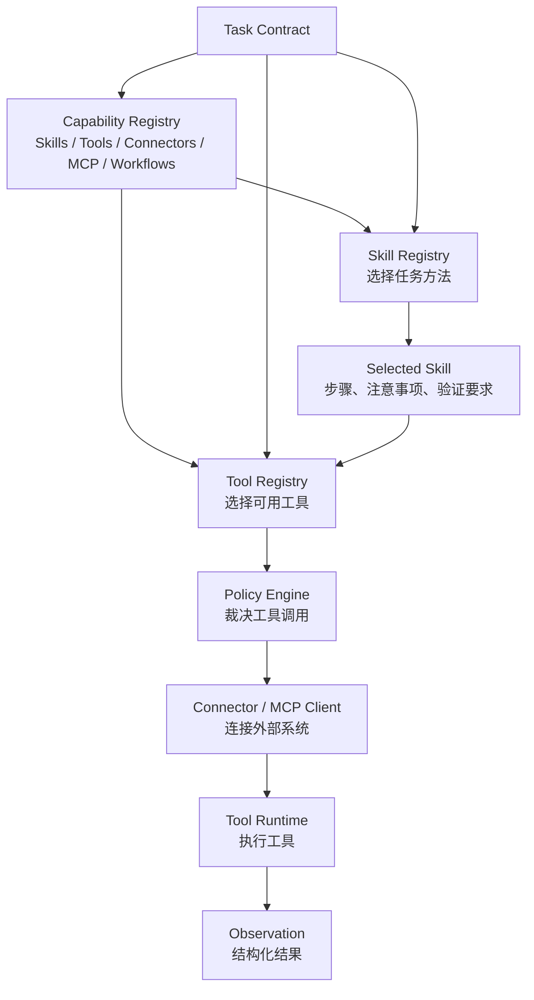

**Skill Registry**

Skill Registry 管的是“做事方法”。一个 Skill 应该描述：

```yaml
name: incident_initial_diagnosis
version: 1.3.0
when_to_use:
  - 出现服务异常、告警、SLA 下降或用户投诉
inputs:
  - alert
  - service
  - time_window
steps:
  - 确认影响范围
  - 查询最近变更
  - 对比关键指标
  - 搜索相关日志
  - 生成带证据的诊断结论
guardrails:
  - 不得直接执行恢复动作
  - 不得隐藏不确定性
verification:
  - 结论必须包含证据 ID
  - 建议必须标注风险等级
owner: sre-platform
```

Skill 不应该拥有权限。它只是告诉 Agent “这类任务的可靠做法是什么”。真正的能力调用仍然要经过 Tool Registry 和 Policy Engine。

**Tool Registry**

Tool Registry 管的是“系统能做什么”。一个 Tool 至少要有：

- 名称和描述；
- 输入 Schema；
- 输出 Schema；
- 风险等级；
- 权限要求；
- 是否有副作用；
- 是否支持 dry-run；
- 连接器或执行后端；
- owner 和审计字段；
- 版本、灰度状态和废弃策略。

```json
{
  "name": "create_support_ticket",
  "description": "创建一条客户支持工单",
  "input_schema": {
    "type": "object",
    "required": ["customer_id", "title", "priority"],
    "properties": {
      "customer_id": {"type": "string"},
      "title": {"type": "string"},
      "priority": {"type": "string", "enum": ["low", "medium", "high"]}
    }
  },
  "risk_level": "medium",
  "side_effect": true,
  "requires_approval": true,
  "supports_dry_run": true,
  "owner": "support-platform"
}
```

Capability Registry 还应该支持按需暴露。模型不应该看到完整能力列表，而只能看到本轮经过筛选后的能力子集：

```text
all capabilities
-> task filter
-> permission filter
-> risk filter
-> environment filter
-> budget filter
-> visible skills / tools / connectors
```

这也是 MCP、连接器和插件体系必须被治理的原因。MCP 可以标准化外部系统接入，但它不是安全边界本身。一个 MCP Server 暴露的资源、工具和 Prompt，都要经过 Capability Registry、Policy Engine、Trace 和 Review Surface 才能进入生产 Agent。

第 6 章会深入展开 Tool Calling、Skills 与 MCP。第 5 章只需要建立一个关键边界：**Skill 是流程知识，Tool 是外部能力，Connector 是连接方式，Policy 是执行裁决**。

---

### 5.3.8 Policy Engine 与 Human Control Plane：权限、审批、接管与降级

“请不要执行危险操作”不是安全机制，只是提示词愿望。生产 Agent 必须有独立于模型的 Policy Engine。

Policy Engine 的输入不是一句自然语言，而是一组可裁决对象：

```json
{
  "user": {
    "id": "u_123",
    "role": "support_lead",
    "department": "customer_success"
  },
  "task": {
    "intent": "notify_customer",
    "risk_level": "medium"
  },
  "tool_call": {
    "name": "send_customer_email",
    "args": {
      "customer_id": "C-8801",
      "template": "delay_explanation"
    },
    "side_effect": true
  },
  "context": {
    "environment": "production",
    "confidence": "medium",
    "evidence_count": 2
  }
}
```

Policy Engine 的输出应该是结构化决策：

```json
{
  "decision": "ask",
  "reason": "向客户发送通知属于有副作用动作，需要人工确认",
  "required_approver_role": "support_lead",
  "allowed_in_dry_run": true,
  "audit_tags": ["customer_communication", "side_effect"]
}
```

核心决策类型可以是五种：

| 决策 | 含义 | 示例 |
|:---|:---|:---|
| allow | 直接允许 | 读取公开文档、查询自己有权限的工单 |
| deny | 直接拒绝 | 读取无权限客户数据、绕过审批关闭工单 |
| ask | 需要人工确认 | 发送外部通知、变更负责人、执行恢复动作 |
| sandbox | 只允许沙箱或 dry-run | 模拟一条规则变更的影响 |
| audit | 允许但加强审计 | 读取敏感但授权的数据 |

Policy Engine 不只看工具名，还要看上下文：

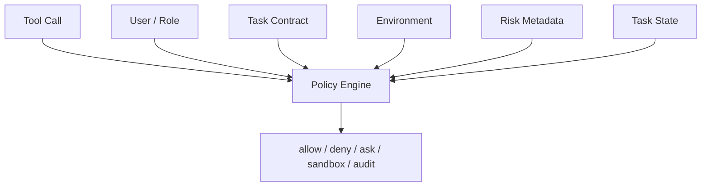

例如“发送通知”在内部测试环境可能是低风险，在生产客户环境就是中高风险；“读取文档”对公开制度是低风险，对客户隐私文档就是高风险。

Policy Engine 解决“能不能做”，Human Control Plane 解决“人如何介入”。生产 Agent 不能只有自动化路径，还必须有清晰的人工控制点：

| 控制点 | 说明 |
|:---|:---|
| Confirmation | 执行有副作用动作前，让用户确认 |
| Approval | 高风险动作需要指定角色审批 |
| Interrupt | 人可以打断正在运行的 Agent Loop |
| Takeover | 人可以接管任务，继续执行或关闭 |
| Escalation | 风险过高、证据不足或预算耗尽时升级给人 |
| Rollback | 对可回滚动作生成回滚计划或触发回滚流程 |
| Degrade | 工具、模型或权限异常时降级为只读建议模式 |

Human Control Plane 不等于“所有事情都弹确认”。真正好的设计是按风险分层：低风险只读任务自动完成，中风险动作要求确认，高风险生产动作进入审批，极高风险任务直接拒绝或转人工。这样既不牺牲效率，也不会把生产责任交给模型。

---

### 5.3.9 Agent Loop：观察、决策、行动、修复

Agent Loop 是模型、状态、上下文、工具和策略之间的执行闭环。

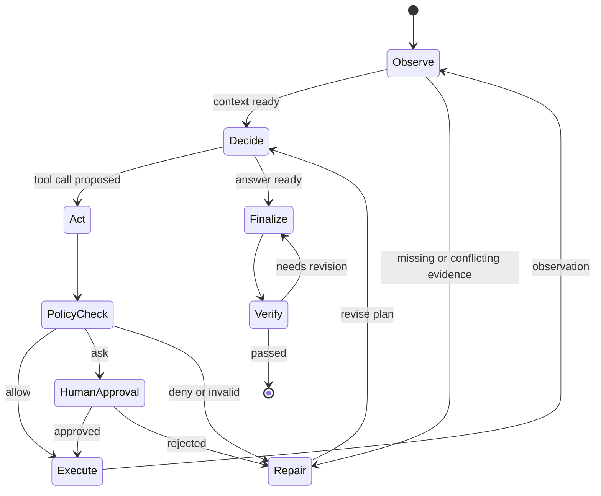

一个生产级 Loop 至少要有这些机制：

- **最大步数**：防止无限循环；
- **时间预算**：防止长任务拖垮系统；
- **Token 预算**：控制成本和上下文长度；
- **工具预算**：限制昂贵查询和高风险动作；
- **状态持久化**：任务中断后可以恢复；
- **错误分类**：区分工具失败、权限失败、模型格式错误、证据不足；
- **修复策略**：格式错误可重试，证据不足可补检索，权限不足要询问或拒绝；
- **停止条件**：达到成功标准、风险过高、预算耗尽、用户取消。

伪代码可以这样理解：

```text
while not done:
    context = build_context(task, state)
    model_output = llm(context, available_skills, available_tools)
    action = parse_and_validate(model_output)

    if action.type == "final_answer":
        verification = verifier.check(action.answer, task, evidence)
        if verification.passed:
            return review_surface.render(action.answer, trace)
        state.add_feedback(verification.errors)
        continue

    decision = policy.check(action.tool_call, task, user, state)
    if decision == "deny":
        state.add_observation("policy_denied", decision.reason)
        continue
    if decision == "ask":
        approval = request_human_approval(decision)
        if not approval.approved:
            state.add_observation("approval_rejected", approval.reason)
            continue

    observation = tool_runtime.execute(action.tool_call)
    state.add_observation(observation)
```

这段伪代码背后的原则是：模型可以提出行动，但不能绕过解析、校验、策略裁决和验证。

在更完整的 Runtime 里，Agent Loop 每一轮都应该写入 checkpoint。这样当任务进入审批、等待外部系统、工具超时或人工接管时，系统可以从最近的稳定状态恢复。Loop 不是“模型一直想”，而是“Runtime 按状态推进，模型在必要位置提供推理和选择”。

---

### 5.3.10 Model Router 与 Handoff Manager：模型选择、专家委派与多 Agent 协作

现代 Agent 系统通常不会只依赖一个模型、一个 Prompt、一个通用 Agent。不同任务对模型能力、成本、延迟、上下文长度、工具调用能力和安全要求都不一样。Model Router 与 Handoff Manager 负责把任务交给合适的模型、专家 Agent 或外部 Agent 系统。

Model Router 关注“用哪个模型”：

| 路由依据 | 示例 |
|:---|:---|
| 任务复杂度 | 简单分类用低成本模型，复杂诊断用强推理模型 |
| 上下文长度 | 长文档分析选择长上下文模型 |
| 工具能力 | 需要稳定工具调用时选择工具调用能力更强的模型 |
| 风险等级 | 高风险任务使用更强模型，并增加 Verifier 和人工审查 |
| 成本和延迟 | 实时客服优先低延迟，离线分析可以接受慢模型 |
| 数据边界 | 敏感任务限制在特定供应商、区域或私有部署模型 |

Handoff Manager 关注“交给哪个专家”。它可以把任务从通用 Agent 委派给专业 Agent：

```text
triage agent
-> billing specialist
-> refund specialist
-> security reviewer
-> human approver
```

Handoff 不应该只是自然语言“你来处理一下”。一个可靠的 Handoff 至少要包含：

- 交接原因；
- 任务摘要；
- 已收集证据；
- 当前状态；
- 风险等级；
- 可用工具范围；
- 不应该重复执行的动作；
- 返回结果的结构化协议。

```json
{
  "handoff_to": "refund_specialist_agent",
  "reason": "用户问题涉及退款规则和订单状态",
  "task_summary": "解释订单 O-1024 为什么退款失败，并给出下一步建议",
  "evidence_ids": ["order_001", "payment_002"],
  "current_state": "investigating",
  "risk_level": "medium",
  "allowed_actions": ["read", "summarize", "recommend"],
  "blocked_actions": ["execute_refund_without_approval"]
}
```

多 Agent 协作要特别警惕两个问题。第一，多个 Agent 之间不能互相绕过权限和审计；第二，Handoff 不能让上下文无限膨胀。每次交接都应该经过 input filter、证据压缩和权限重算。

第 7 章会展开多 Agent 协作和状态机，第 8 章会讨论平台框架如何支持 Handoff、Agent Team、A2A 和跨系统协作。

---

### 5.3.11 Verifier 与 Eval Harness：运行时验证与回归评测

Agent 最危险的句子之一是：“任务已经完成。”

是否完成，不应该由模型自己宣布，而应该由 Verifier 判断。

不同任务需要不同 Verifier：

| 任务类型 | 验证方式 |
|:---|:---|
| 知识问答 | 引用是否存在、引用是否支持结论、是否越权、是否承认不确定性 |
| 告警诊断 | 证据是否覆盖时间窗口、根因是否有指标或日志支撑、建议是否安全 |
| 业务处理 | 状态是否变化、审批是否完成、通知是否发送、审计是否记录 |
| 数据分析 | 查询是否可复现、口径是否明确、图表是否和数据一致 |
| 流程建议 | 是否满足约束、是否遗漏关键步骤、是否需要人工确认 |

Verifier 可以分层：

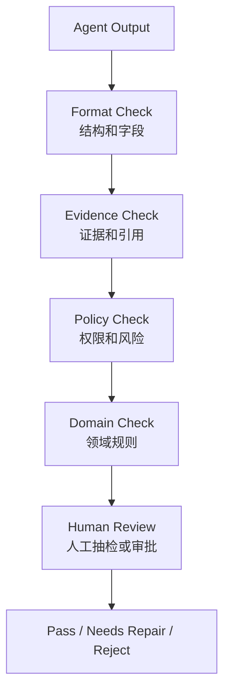

常见的 Verifier 设计：

- **格式验证**：输出是否符合 JSON Schema 或报告模板；
- **引用验证**：每个关键结论是否能映射到证据；
- **权限验证**：是否包含用户无权查看的信息；
- **一致性验证**：前后结论是否冲突；
- **动作验证**：执行结果是否真的改变了目标状态；
- **回归验证**：新版本 Agent 是否比旧版本退化；
- **人工验证**：高风险任务必须有人确认。

Verifier 失败后，不一定要直接报错。更好的做法是把失败原因放回 Agent Loop：

```text
Verifier: 结论 2 缺少引用，建议补充来源或删除该结论。
Agent Loop: 重新检索证据，修正回答。
```

这让 Agent 从“生成答案”变成“生成、检查、修复答案”的闭环。

Eval Harness 和 Verifier 不同。Verifier 是运行时守门员，Eval Harness 是上线前和迭代中的回归系统。

| 维度 | Verifier | Eval Harness |
|:---|:---|:---|
| 发生时机 | 每次任务运行中 | 发布前、灰度中、线上抽样后 |
| 目标 | 判断当前输出能否交付 | 判断版本是否整体变好或退化 |
| 输入 | 当前任务、证据、输出、状态 | 数据集、历史 trace、失败案例、人工标注 |
| 输出 | pass、needs_repair、reject | 分数、维度评估、回归报告、改进建议 |

Agent 的 Eval 不应该只评估最终答案，还要评估执行轨迹：

- 是否选择了正确工具；
- 是否遗漏关键证据源；
- 是否错误调用高风险工具；
- 是否在证据不足时承认不确定性；
- 是否正确进入审批或人工接管；
- 是否比上一个版本增加成本、延迟或失败率；
- 是否在历史失败案例上发生回归。

这也是为什么 Trace 很重要。没有可回放的 trace，就很难做 trajectory eval，也很难知道 Agent 到底是因为检索失败、工具失败、计划错误还是模型误判而失败。

---

### 5.3.12 Review Surface、Trace 与 Audit：可审查的交付界面

Review Surface 是人类和 Agent 系统之间的交接界面。它决定用户看到什么，也决定系统如何被审计和复盘。

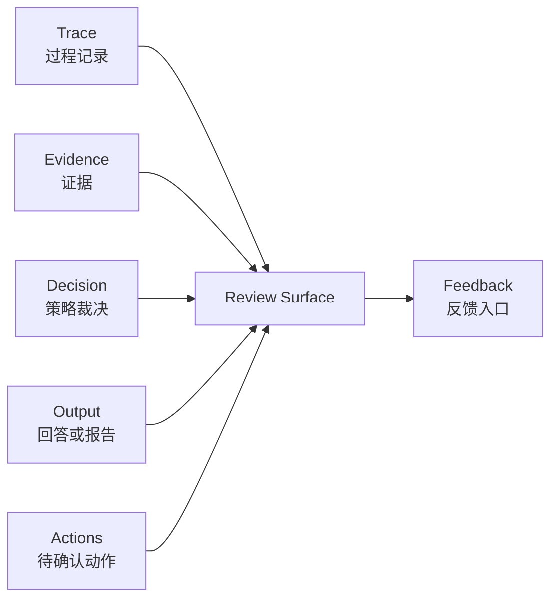

不同场景的 Review Surface 不一样：

| 场景 | 合适的输出界面 |
|:---|:---|
| 企业知识问答 | 带引用回答、相关文档、置信度、不确定性说明 |
| 告警诊断 | 影响范围、根因候选、证据时间线、建议动作、风险等级 |
| 客服运营 | 工单摘要、客户影响、推荐回复、下一步处理人 |
| 审批辅助 | 申请摘要、风险点、历史对比、建议决策、审批按钮 |
| 数据分析 | 查询口径、结果表、图表、异常解释、可复现查询 |

一个好的 Review Surface 应该包含：

- **结论**：用户真正关心的答案；
- **证据**：支撑结论的来源；
- **不确定性**：哪些地方证据不足；
- **动作建议**：下一步可以做什么；
- **风险等级**：哪些动作需要审批；
- **Trace 链接**：需要时能追溯每一步；
- **反馈入口**：用户可以标注有用、错误、遗漏、过期。

不要把所有内部推理都暴露给用户。用户需要的是可审查的证据链，不是模型的全部思考过程。

Trace 和 Audit 是 Review Surface 的底座。Trace 面向调试、评测和复盘，Audit 面向责任、合规和安全。

一个完整 trace 至少应该记录：

```text
request.received
intent.normalized
plan.created
context.retrieved
memory.recalled
capability.exposed
model.selected
model.called
tool.proposed
policy.checked
human.approval.requested
tool.executed
checkpoint.created
verifier.completed
response.rendered
feedback.received
learning.candidate.created
```

Audit 记录则更关注不可抵赖的信息：

| 审计对象 | 示例 |
|:---|:---|
| 谁触发 | 用户、系统、其他 Agent、定时任务 |
| 看了什么 | 文档、数据表、日志、客户信息、代码文件 |
| 做了什么 | 查询、生成、通知、创建工单、执行恢复动作 |
| 谁批准 | 审批人、审批时间、审批理由 |
| 为什么允许 | Policy 决策、风险等级、证据数量 |
| 结果如何 | 成功、失败、部分成功、回滚、转人工 |

对 Coding Agent、数据分析 Agent、文档 Agent 来说，还需要 Artifact / Workspace Store。Agent 的交付物可能不是一段文字，而是代码补丁、报告、表格、图表、配置变更、审批单或事故复盘文档。Review Surface 应该能展示这些产物的版本、diff、来源和验证结果。

---

### 5.3.13 Learning Loop：从反馈到能力演进

有些现代 Agent 会被描述为具备“自学习”能力。这个说法容易误导。生产级 Agent 的学习不应该是模型在后台偷偷改自己，而应该是一个受治理的能力演进闭环。

Learning Loop 的输入通常来自四类信号：

| 信号来源 | 示例 | 可能沉淀到哪里 |
|:---|:---|:---|
| 用户反馈 | “这个回答引用错了”“这个建议有用” | Eval 样本、知识库修订候选 |
| 运行结果 | 工具失败、审批拒绝、Verifier 失败 | Failure Memory、回归集 |
| 人工 Review | 专家修改诊断结论、补充证据 | Skill 候选、Runbook 候选 |
| 事故复盘 | 根因、处置动作、遗漏信号 | Memory、Policy、Eval、监控规则 |

推荐的闭环如下：

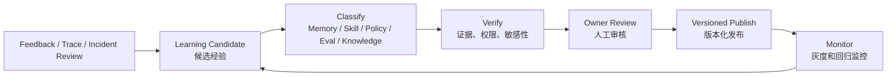

Learning Loop 可以沉淀几类资产：

- **Memory**：用户偏好、团队约定、已验证历史经验；
- **Skill**：稳定可复用的方法论和执行步骤；
- **Policy**：新的风险规则、审批规则、沙箱规则；
- **Eval Case**：失败样本、边界样本、回归样本；
- **Knowledge Update**：Runbook、FAQ、制度文档、事故复盘；
- **Tool Improvement**：更严格的 Schema、更好的错误码、更安全的 dry-run。

这里最重要的是写入门控和版本治理。一个经验从线上 trace 进入生产能力，至少要经过：

1. 证据是否充分；
2. 是否包含敏感信息；
3. 是否只适用于特定租户、团队、系统或时间段；
4. 是否需要 owner 审核；
5. 是否要先进入 Eval，而不是直接进入 Memory 或 Skill；
6. 是否需要灰度发布和回滚方案。

因此，“自学习”更准确地说是**受控自改进**。Agent 可以发现模式、提出候选、生成 Skill 草稿或 Eval 样本，但是否进入生产能力，必须经过验证、审查、版本化和监控。这样既能让系统持续变强，也不会让一次错误经验长期污染未来任务。

---

## 5.4 Agent 架构模式：从组件组合到系统形态

Agent 架构模式不是越复杂越好。应该根据任务复杂度、风险和可验证性选择。

### 5.4.1 架构模式选择矩阵

先用一个矩阵做选择，再进入具体模式。

| 架构模式 | 任务复杂度 | 工具调用 | 状态管理 | 风险动作 | 适合场景 |
|:---|:---|:---|:---|:---|:---|
| Single-shot | 低 | 无或少量只读 | 不需要 | 低 | 摘要、分类、草稿、简单问答 |
| Router + Specialist | 中 | 按领域暴露 | 会话级 | 低到中 | 企业助手、多类型入口、客服辅助 |
| Plan-and-Execute | 中到高 | 多工具 | 任务级 | 中 | 数据分析、复杂检索、跨系统诊断 |
| State Machine + Agent | 高 | 多工具 | 生命周期级 | 中到高 | 告警处置、审批、工单、恢复流程 |
| Multi-Agent | 高 | 多角色、多工具 | 多任务级 | 取决于协调策略 | 复杂研究、互审、并行分析 |

选择时不要从“哪个模式更先进”出发，而要从任务风险出发：如果任务没有生命周期，就不要强行上状态机；如果不需要多角色互审，就不要过早引入 Multi-Agent；如果有生产动作和审批，State Machine + Agent 往往比纯 ReACT 更稳。

---

### 5.4.2 Single-shot Agent

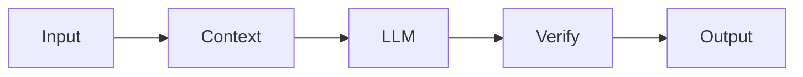

适合低风险、无副作用、上下文清晰的任务，例如摘要、分类、制度问答草稿。

优点是简单、低延迟、成本低。缺点是无法动态补充证据，遇到复杂任务容易猜测。

### 5.4.3 Router + Specialist

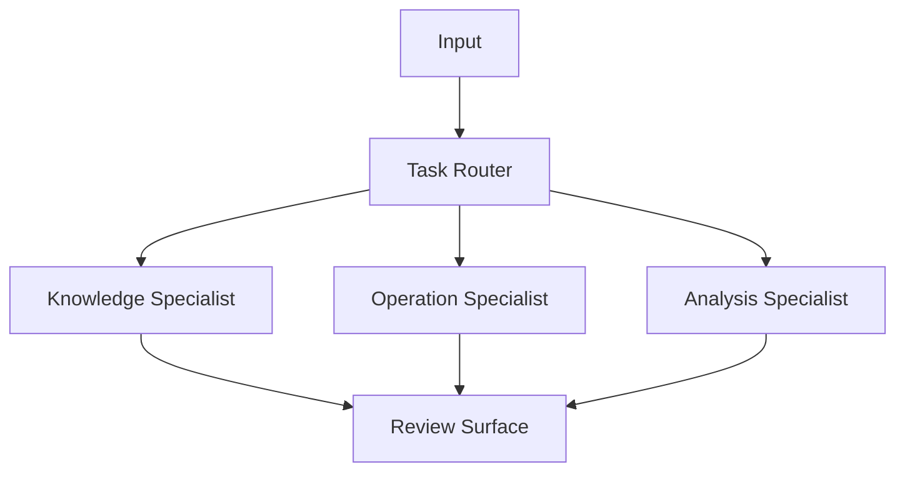

适合任务类型明确但领域不同的系统，例如企业助手同时处理制度问答、流程咨询、工单摘要。

关键是 Router 要能拒绝不确定分类，不要强行把所有问题分到某个 Specialist。

### 5.4.4 Plan-and-Execute

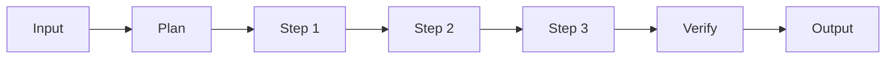

适合步骤相对清晰、需要多工具协作的任务，例如“分析某类投诉最近一周上升原因”。

关键风险是计划过早固定。生产系统应允许基于观察结果局部重规划。

### 5.4.5 State Machine + Agent

```mermaid
flowchart TD
    New["New Task"] --> Triage["Triage"]
    Triage --> Investigate["Investigate"]
    Investigate --> Recommend["Recommend"]
    Recommend --> Approval["Approval"]
    Approval --> Execute["Execute"]
    Execute --> Verify["Verify"]
    Verify --> Close["Close"]

    Approval -->|"rejected"| Recommend
    Verify -->|"failed"| Investigate
```

适合有明确生命周期、风险动作和人工审批的任务，例如告警处置、工单处理、审批辅助。

这是企业生产环境最推荐的形态之一：状态机负责边界，Agent 负责状态内的推理。

### 5.4.6 Multi-Agent

```mermaid
flowchart TD
    Coordinator["Coordinator"]
    Researcher["Research Agent"]
    Analyst["Analysis Agent"]
    Reviewer["Review Agent"]
    Surface["Review Surface"]

    Coordinator --> Researcher
    Coordinator --> Analyst
    Researcher --> Reviewer
    Analyst --> Reviewer
    Reviewer --> Surface
```

适合任务确实需要多角色并行或互审，例如复杂研究、跨部门分析、长周期项目。

不要过早引入 Multi-Agent。很多所谓多 Agent 系统只是把一个本来就可以由状态机和工具完成的流程拆成多个模型调用，成本更高，调试更难。

---

## 5.5 场景映射与落地校验

下面用三个通用场景说明这套框架如何落地。

### 5.5.1 企业知识助手

```mermaid
flowchart TD
    User["员工问题"]
    Intent["Intent Normalizer<br/>制度 / 流程 / 权限 / 操作咨询"]
    Context["Context Builder<br/>知识库 / 制度文档 / FAQ / 工单历史"]
    Policy["Policy Engine<br/>文档权限 / 隐私过滤"]
    Loop["Agent Loop<br/>检索 / 对比 / 澄清 / 回答"]
    Verify["Verifier<br/>引用校验 / 权限校验 / 冲突校验"]
    Review["Answer Surface<br/>带引用回答 / 相关文档 / 反馈"]

    User --> Intent --> Context --> Policy --> Loop --> Verify --> Review
```

设计重点：

- Context Builder 要做权限过滤和引用构建；
- Verifier 要检查回答是否被引用支持；
- Review Surface 要鼓励用户反馈“文档过期”“没有回答我的问题”；
- Learning Loop 可以把失败问题变成知识库更新候选，但不能自动污染正式知识库。

### 5.5.2 告警诊断与处置助手

```mermaid
flowchart TD
    Alert["告警 / 事件 / 用户投诉"]
    Intent["事件归一化<br/>服务 / 时间窗 / 影响范围"]
    Planner["诊断计划<br/>指标 / 日志 / 变更 / 历史案例"]
    Context["Context Builder<br/>监控 / 日志 / 工单 / Runbook"]
    Policy["Policy Engine<br/>只读 / dry-run / 审批 / 禁止"]
    Loop["Agent Loop<br/>观察 / 诊断 / 补证据"]
    Verify["Verifier<br/>证据完整度 / 建议安全性"]
    Review["Incident Surface<br/>根因候选 / 证据 / 建议动作 / 交接"]

    Alert --> Intent --> Planner --> Context --> Policy --> Loop --> Verify --> Review
```

设计重点：

- 诊断可以自动化，恢复动作要分级审批；
- 所有结论必须绑定时间窗口和证据；
- 高风险动作优先提供 dry-run 和人工确认；
- 处置后要把复盘结果沉淀成 Runbook、Eval Case 和 Skill 候选。

### 5.5.3 业务运营助手

```mermaid
flowchart TD
    Request["运营请求<br/>活动分析 / 客群筛选 / 异常解释"]
    Intent["任务契约<br/>目标 / 指标 / 口径 / 时间范围"]
    Planner["分析计划<br/>数据源 / 维度 / 对比方式"]
    Context["Context Builder<br/>指标定义 / 数据表 / 历史活动 / 规则"]
    Tools["Tool Runtime<br/>查询 / 计算 / 生成报告"]
    Policy["Policy Engine<br/>数据权限 / 导出限制 / 外发审批"]
    Verify["Verifier<br/>口径一致 / 数据可复现 / 异常解释"]
    Review["Report Surface<br/>结论 / 图表 / 查询口径 / 下一步建议"]

    Request --> Intent --> Planner --> Context --> Tools --> Policy --> Verify --> Review
```

设计重点：

- 指标口径必须进入 Context Package；
- 查询和图表要可复现；
- 涉及用户数据导出时必须经过权限和审批；
- 输出不应只有结论，还要包含口径、数据范围和不确定性。

这三个场景差异很大，但底层架构是一致的：入口归一、任务契约、上下文、Memory、状态、能力注册、策略、循环、验证、审查、Trace 和学习闭环。

---

### 5.5.4 三类场景横向对比

这三个场景可以放在一起比较：

| 场景 | 主要任务 | 推荐模式 | 核心组件 | 最大风险 |
|:---|:---|:---|:---|:---|
| 企业知识助手 | 回答制度、流程、知识问题 | Router + Specialist / Single-shot | Context、RAG、Memory、Permission、Verifier | 引用错误、越权、文档过期、错误记忆污染 |
| 告警诊断与处置助手 | 诊断告警、建议处置、交接事故 | State Machine + Agent / Plan-and-Execute | Tool、Policy、State、Checkpoint、Trace、Review | 误诊、高风险动作、证据不足、重复处置 |
| 业务运营助手 | 分析数据、解释异常、生成报告 | Plan-and-Execute | Planner、Data Tool、Context、Verifier、Artifact Store | 口径错误、数据不可复现、越权导出 |

同一套 Agent Runtime，在不同场景中重点不同。知识助手的核心是权限和引用，告警助手的核心是证据和风险动作，运营助手的核心是数据口径和可复现性。架构设计不能只复制组件图，必须让组件服务当前场景的主要风险。

---

### 5.5.5 Agent 设计检查清单

设计一个 Agent 系统时，可以按下面的清单逐层检查。

**任务与输入**

- [ ] 是否定义了目标用户和主要任务？
- [ ] 是否定义了聊天、API、Webhook、工单、告警、定时任务等入口？
- [ ] 是否有 request_id、correlation_id、idempotency_key 和环境信息？
- [ ] 是否区分了问答、诊断、建议、执行、审批等意图？
- [ ] 是否把用户输入转换成结构化任务契约？
- [ ] 是否定义了成功标准和停止条件？
- [ ] 是否明确哪些任务不应该由 Agent 处理？

**上下文**

- [ ] 是否有 Source Catalog 管理知识、数据、规则和状态来源？
- [ ] 是否先做权限过滤，再把内容放入模型上下文？
- [ ] 是否保留引用、更新时间、owner 和证据 ID？
- [ ] 是否处理文档冲突、过期和缺失？
- [ ] 是否控制上下文预算，避免把噪声塞给模型？
- [ ] 是否区分了 Context、RAG、Execution State 和 Memory？

**Memory 与状态**

- [ ] Memory 是否有作用域、权限、时效、可信度和遗忘策略？
- [ ] 是否有 Memory Write Gate，避免未验证推断进入长期记忆？
- [ ] 是否持久化任务状态、审批状态、工具观察和失败原因？
- [ ] 是否支持暂停、恢复、重试、回放和人工接管？
- [ ] 是否为有副作用动作设计了幂等键和重复执行保护？

**技能与工具**

- [ ] Skill 是否只描述方法，不拥有执行权限？
- [ ] Tool 是否有明确输入 Schema、输出 Schema 和风险等级？
- [ ] Connector、MCP Resource、MCP Prompt、Workflow 是否纳入 Capability Registry？
- [ ] 模型是否只能看到本轮经过筛选后的能力子集？
- [ ] 有副作用工具是否支持 dry-run、审批和审计？
- [ ] Tool Result 是否结构化，是否区分成功、失败、部分成功？
- [ ] 是否避免把宽泛 Shell、数据库写入、任意 HTTP 请求直接暴露给模型？

**策略与安全**

- [ ] Policy Engine 是否独立于模型执行？
- [ ] 是否支持 allow、deny、ask、sandbox、audit 等决策？
- [ ] 是否按用户、角色、环境、任务、工具、状态综合裁决？
- [ ] 是否对敏感数据、客户数据、生产动作有额外限制？
- [ ] 是否记录每次策略裁决的原因？
- [ ] 是否设计了确认、审批、打断、接管、升级、回滚和降级路径？

**Agent Loop**

- [ ] 是否有最大步数、时间预算、成本预算和工具预算？
- [ ] 是否持久化任务状态和工具观察结果？
- [ ] 是否能处理工具失败、格式错误、证据不足、权限拒绝？
- [ ] 是否支持基于观察结果局部重规划？
- [ ] 是否有明确停止条件，避免无限循环？
- [ ] 是否有 Model Router 和 Handoff Manager 管理模型选择、专家委派和多 Agent 协作？

**验证与审查**

- [ ] 是否有 Verifier 判断任务是否完成？
- [ ] 是否验证引用、权限、格式、状态变化和业务规则？
- [ ] 是否有 Eval Harness 覆盖历史失败样本、边界样本和轨迹评测？
- [ ] 高风险结论和动作是否有人类审查？
- [ ] Review Surface 是否展示结论、证据、不确定性、风险和下一步？
- [ ] 是否能从线上 Trace 生成 Eval Case 和改进候选？

**生产治理**

- [ ] 是否有 Trace 记录每次模型调用、工具调用和策略裁决？
- [ ] Audit 是否能回答谁触发、看了什么、做了什么、谁批准、结果如何？
- [ ] 是否有离线 Eval 和线上质量监控？
- [ ] 是否有灰度、回滚和降级策略？
- [ ] 是否有成本、延迟和错误率监控？
- [ ] 是否定义了知识更新、Skill 更新和策略更新的 owner review 流程？
- [ ] Learning Loop 是否区分 Memory、Skill、Policy、Eval、Knowledge Update 和 Tool Improvement？

---

## 本章小结

本章重新建立了一个从决策到落地的 Agent 架构框架。

第一，Agent 架构设计不能从模型开始，而要从问题开始。只有当任务包含模糊输入、多源上下文、多步骤推理、跨系统行动、结果验证和风险治理时，才值得进入 Agent 设计。

第二，Agent 不是传统后端的替代品，而是和后端形成混合架构。传统后端负责状态、事务、权限和审计，Agent 负责理解、规划、证据整合和建议生成，Policy、Verifier 和 Review Surface 负责把风险关在系统边界内。

第三，生产级 Agent 至少需要 Runtime 骨架：Intake、Context、Memory、Capability、Policy、Human Control、State、Loop、Model Routing、Verifier、Eval、Review、Trace、Audit 和 Learning Loop。MVP 可以简单，但这些职责边界不能缺失。

第四，核心组件要分工清楚：Event & Intake Router 统一入口，Intent Normalizer 把输入变成任务契约，Planner 生成可验证计划，Context Builder 组织可信上下文，Memory Layer 提供受治理的长期上下文，Execution State 和 Checkpoint 支撑暂停、恢复与回放，Capability Registry 管理 Skills、Tools、Connectors 和 MCP，Policy 与 Human Control 负责裁决和人工介入，Agent Loop 推动任务，Model Router 与 Handoff Manager 负责模型和专家委派，Verifier 与 Eval Harness 判断质量，Review Surface、Trace 和 Audit 完成交接与复盘。

第五，架构模式要按任务风险选择。低风险任务可以 Single-shot，多入口任务可以 Router + Specialist，多步骤任务适合 Plan-and-Execute，有生命周期和审批的生产任务更适合 State Machine + Agent，Multi-Agent 应该留给确实需要多角色并行或互审的复杂任务。

最后，场景映射和检查清单是架构设计的落地校验。一个方案图看起来完整不代表可上线，只有当任务、上下文、工具、策略、循环、验证、审查和生产治理都能被回答，Agent 系统才真正具备工程可行性。

这条主线会贯穿后续章节：第 6 章深入 Agent 工具系统、Skills、连接器与 MCP；第 7 章展开工作流、状态机、Checkpoint 和多 Agent 协作；第 8 章讨论平台架构、模型路由和跨 Agent 协作；第 9-11 章进入 RAG、Agentic RAG、Memory、会话和长期上下文；第 12 章系统讨论 Evals、Guardrails、Trace、Audit 和生产可观测性。

**关键洞察**

> Agent 的本质不是“模型能不能自己做事”，而是“系统能不能让模型在正确入口、正确上下文、正确状态、正确能力、正确权限和正确验证下完成任务，并把反馈安全地变成下一轮能力演进”。

---

## 参考资料

1. [ReAct: Synergizing Reasoning and Acting in Language Models](https://arxiv.org/abs/2210.03629) - Shunyu Yao et al., 2022
2. [MRKL Systems: A modular, neuro-symbolic architecture that combines large language models, external knowledge sources and discrete reasoning](https://arxiv.org/abs/2205.00445) - Karpas et al., 2022
3. [Toolformer: Language Models Can Teach Themselves to Use Tools](https://arxiv.org/abs/2302.04761) - Schick et al., 2023
4. [OpenAI Agents SDK](https://platform.openai.com/docs/guides/agents-sdk)
5. [OpenAI AgentKit](https://openai.com/index/introducing-agentkit/)
6. [OpenAI Agents SDK Tracing](https://openai.github.io/openai-agents-python/tracing/)
7. [OpenAI Agents SDK Guardrails](https://openai.github.io/openai-agents-python/guardrails/)
8. [OpenAI Agents SDK Handoffs](https://openai.github.io/openai-agents-js/guides/handoffs/)
9. [LangGraph Persistence](https://docs.langchain.com/oss/python/langgraph/persistence)
10. [LangGraph Memory](https://docs.langchain.com/oss/javascript/langgraph/add-memory)
11. [Model Context Protocol Specification](https://modelcontextprotocol.io/specification/2025-06-18)
12. [Google Agent Development Kit](https://adk.dev/)
13. [A2A Protocol Specification](https://google-a2a.github.io/A2A/specification/)
14. [Anthropic Agent Skills](https://www.anthropic.com/engineering/equipping-agents-for-the-real-world-with-agent-skills)
