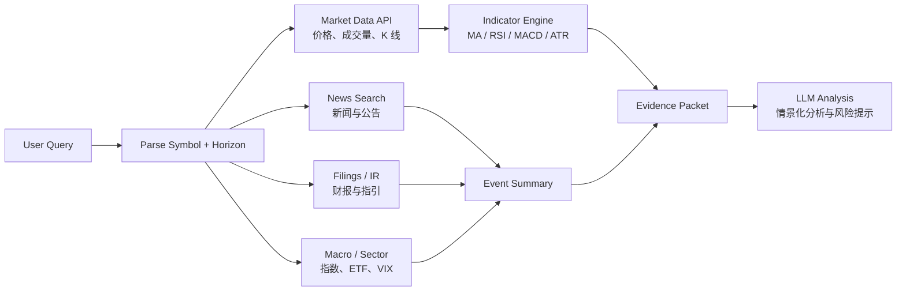

# 第7章 Agent 知识系统：从知识源、RAG 到 Agentic RAG

> Agent 知识系统的目标，不是把更多文本塞进上下文，而是让 Agent 知道该查哪里、信什么、取多少、如何验证，以及如何把证据组织成模型可以可靠使用的上下文。

## 引言：Agent 为什么需要知识系统

LLM 本身不是实时事实源，也不是企业知识库。它可以理解问题、规划步骤、综合证据、生成表达，但它不知道当前数据库里的订单状态，不知道刚刚发布的公司公告，不知道某个内部接口的最新 schema，也不会天然记住项目里刚更新的架构约束。

因此，生产级 Agent 必须有一套外部知识系统。这个系统要解决的不是单纯“检索几段文档”，而是完整回答这些问题：

- 当前任务需要什么知识？
- 这些知识应该来自 Prompt、上下文、文档库、Web Search、数据库、MCP Resource，还是工具调用？
- 哪些来源可信，哪些只能作为参考？
- 检索结果如何变成可引用、可压缩、可验证的 Evidence？
- 普通 RAG 不够时，Agent 如何多轮检索、拆解问题、验证证据和停止？
- 错误答案出现后，如何从 trace 中定位是召回错、重排错、证据不足，还是模型生成错？

本章把 RAG、MCP Resource、MCP Tool、Web Search、外部 API、GraphRAG、Agentic RAG 和知识治理放在同一张图里讨论。主线不是“多接几个知识源”，而是构建一条工程化链路：

```text
知识源选型
→ RAG 工程实现
→ Web Search / MCP / Tool 组合
→ Agentic RAG 控制循环
→ 证据、引用、评估与治理
```

---

## 7.1 Agent 知识系统全景

### 7.1.1 模型不是事实源

很多 Agent Demo 的隐含假设是：模型“知道”答案，只需要问得好一点。这个假设在生产系统里很危险。

模型参数里的知识有几个天然问题：

- **不新鲜**：训练数据有时间边界，无法覆盖实时价格、新闻、部署状态、库存、订单和日志。
- **不可追溯**：模型说出的事实不一定能映射到具体来源。
- **不可授权**：模型不知道当前用户是否有权限查看某个内部文档或业务对象。
- **不可验证**：模型记忆和真实系统冲突时，必须以工具、数据库、官方文档和源代码为准。

所以 Agent 的知识系统应遵循一个基本原则：

```text
模型负责推理与表达，外部系统负责事实与证据。
```

这并不意味着模型没有知识价值。模型的价值在于理解用户意图、判断需要哪些知识、生成查询、综合多源证据、发现缺口和表达结论。但只要涉及实时事实、企业内部事实、权限控制或高风险决策，就不能把模型记忆当作最终依据。

### 7.1.2 Agent 获取知识的基本链路

一个完整的知识获取链路通常不是一次向量检索，而是多阶段 pipeline：

```mermaid
flowchart LR
    A["User Task<br/>用户任务"] --> B["Intent + Need Analysis<br/>意图与知识需求识别"]
    B --> C["Source Routing<br/>知识源路由"]
    C --> D["Retrieval / Tool / Resource<br/>检索、工具或资源读取"]
    D --> E["Evidence Normalization<br/>证据标准化"]
    E --> F["Rank + Filter<br/>排序、权限与可信度过滤"]
    F --> G["Context Package<br/>上下文包"]
    G --> H["LLM Synthesis<br/>模型综合"]
    H --> I["Answer + Citation<br/>回答与引用"]
    I --> J["Trace + Eval<br/>追踪与评估"]
```



可以把它压缩成一个公式：

```text
Agent 获取知识 = Source Routing + Retrieval + Verification + Context Packing + Citation
```

其中最容易被低估的是 Source Routing。很多系统一上来就做向量库，结果把所有问题都当作“文档相似度检索”处理。实际生产里，用户问“订单为什么没有发货”，应该查订单系统、履约系统和日志；用户问“这个接口应该怎么调用”，应该读 API 文档、schema 或源代码；用户问“最近某只股票发生了什么”，应该查行情 API、新闻、公告和财报。

### 7.1.3 知识供给分层：Prompt、Context、Tool、RAG、Memory

Agent 的知识来源应该分层管理，而不是混成一个巨大的 prompt。

| 知识类型 | 常见机制 | 典型内容 | 生命周期 |
|:---|:---|:---|:---|
| 长期规则 | System Prompt、AGENTS.md、CLAUDE.md | 角色、约束、编码规范、项目原则 | 长期稳定 |
| 本轮上下文 | 用户输入、文件片段、工具结果 | 当前任务材料、报错、代码片段 | 单次任务 |
| 流程方法 | Skill | 如何审查文章、如何排查日志、如何写计划 | 中长期 |
| 大量文档 | RAG | Wiki、FAQ、历史工单、产品手册 | 持续更新 |
| 明确资源 | MCP Resource | schema、配置、API 文档、项目索引 | 实时或准实时 |
| 实时事实 | MCP Tool、业务 API、Web Search | 订单、库存、日志、行情、新闻 | 实时 |
| 长期状态 | Memory、Profile | 用户偏好、历史决策、任务经验 | 跨会话 |

这些层次的优先级不同。当前用户指令通常高于长期 Memory；数据库和工具结果高于模型记忆；官方文档高于二手博客；源代码高于过期设计文档。

### 7.1.4 Source Routing：先判断该去哪儿找知识

Source Routing 是知识系统的入口。它把用户问题映射到合适的知识源和检索策略。

| 用户问题类型 | 优先知识源 | 不推荐做法 |
|:---|:---|:---|
| 项目规范、编码约束 | AGENTS.md、CLAUDE.md、Markdown 文档 | 每次都全库语义搜索 |
| API schema、配置、目录 | MCP Resource、源码、配置中心 | 只查历史 Wiki |
| 订单、库存、部署状态 | 业务 API、数据库、日志工具 | 把实时状态写入向量库 |
| 大量历史文档问答 | RAG、hybrid search、rerank | 靠模型记忆回答 |
| 近期新闻、政策、价格 | Web Search、垂直 API | 使用过期训练知识 |
| 用户偏好、历史决策 | Memory + 当前指令过滤 | 直接把所有聊天历史塞进 prompt |
| 复杂研究任务 | Agentic RAG、multi-hop retrieval | 单次 top-k 检索后直接回答 |

工程实现上，Source Router 可以是规则、分类模型、LLM 结构化输出，或者几者组合。关键不是算法多复杂，而是必须显式记录“为什么选择这个知识源”，否则后续评估和 debug 会很困难。

### 7.1.5 知识可信度：一手来源、二手来源与模型记忆

知识系统需要可信度分级。

| 可信度 | 来源 | 使用方式 |
|:---|:---|:---|
| 最高 | 数据库、业务 API、源代码、官方文档、公司公告 | 可作为事实依据 |
| 较高 | 内部正式文档、配置中心、日志、监控 | 可作为系统状态或设计依据 |
| 中等 | 新闻报道、技术博客、研报摘要 | 需要交叉验证 |
| 较低 | 论坛、社交媒体、自动生成内容 | 只能作为线索 |
| 最低 | 模型记忆 | 只能作为启发，不能作为近期事实 |

在金融、医疗、法律、运维等高风险场景中，Agent 不应该只给出“看起来合理”的答案，而要说明依据来自哪里、是否足够、是否存在冲突，以及哪些结论只是推断。

---

## 7.2 知识源形态与选型

### 7.2.1 Markdown / Docs-as-Code：工程化知识沉淀

Markdown repo、mdBook、Docusaurus、VitePress、MkDocs 和 Obsidian vault 都属于 Docs-as-Code 的范式。它们适合工程团队沉淀长期知识：

- 架构设计文档；
- ADR；
- Runbook；
- API 说明；
- 项目规范；
- 技术书和教程。

它的优势是 Git 友好、review 友好、可版本化、容易被 Agent 读取和修改。对于工程团队，Markdown 最大的价值不是排版，而是把知识放进和代码类似的变更流程里。

缺点也明显：非技术人员编辑门槛高，权限和评论体验弱，文档多了以后目录和命名会变成治理问题。因此 Markdown 适合“可审查、可自动化、偏工程”的知识，不一定适合跨部门日常协作。

### 7.2.2 Wiki / 协作文档系统：组织知识协作

Confluence、Notion、飞书知识库、语雀、Outline、Wiki.js 等更适合组织协作：

- 产品文档；
- 运营 SOP；
- 客服 FAQ；
- 会议纪要；
- 跨团队项目空间；
- 组织制度。

它们的优势是编辑体验、权限体系、评论协作和模板能力。缺点是结构容易发散，版本控制不如 Git 精确，导出和迁移成本较高，Agent 读取通常需要 API、连接器、爬虫或同步任务。

Wiki 的治理重点是“信息架构”和“生命周期”。如果没有负责人、目录规范、更新时间和过期机制，Wiki 很容易变成文档坟场。RAG 可以缓解“找不到”的问题，但不能自动解决“文档已经错了”的问题。

### 7.2.3 RAG 知识库：大规模非结构化检索

RAG 适合处理大量非结构化或半结构化文本：

- Wiki；
- FAQ；
- 产品手册；
- 历史工单；
- 事故复盘；
- PDF、Word、网页；
- 代码注释和 README。

它的核心价值是让 Agent 可以从海量文档中召回相关证据，而不是依赖模型记忆。

但 RAG 不是万能知识层。它不擅长实时状态，不擅长精确事务查询，也不擅长维护“当前最佳结论”。如果用户问“这个订单现在在哪个状态”，应该查业务系统；如果问“过去三个月类似故障的处理经验”，RAG 才合适。

### 7.2.4 MCP Resource：标准化暴露明确资源

MCP Resource 的定位是把明确资源以标准协议暴露给 Agent 读取。例如：

```text
docs://order-system/design
schema://order-db/orders
config://order-service/retry-policy
repo://checkout-service/api/openapi.yaml
```

RAG 解决“从大量知识里找什么”，MCP Resource 解决“以标准方式读取某个资源”。两者不是同一层。

| 维度 | RAG | MCP Resource |
|:---|:---|:---|
| 核心问题 | 找到相关内容 | 读取明确资源 |
| 典型访问 | query → top-k chunks | URI → resource content |
| 适合数据 | 大量非结构化文档 | schema、配置、文档、文件 |
| 更新方式 | 索引和增量同步 | 实时读取或服务端生成 |
| Agent 行为 | “帮我搜相关资料” | “读取这个资源” |

在工程系统里，MCP Resource 常用于暴露项目目录、数据库 schema、API 文档、配置片段、日志样本和运行时上下文。它比把这些内容预先切片进向量库更直接、更可控。

### 7.2.5 MCP Tool / 外部 API：实时结构化事实

Tool 适合查询实时状态或执行动作。典型例子：

- `get_order_status(order_id)`；
- `query_logs(service, time_range, keyword)`；
- `get_stock_bars(symbol, range, interval)`；
- `get_deployment_version(service, env)`；
- `run_sql(query)`；
- `create_ticket(payload)`。

结构化事实不应该优先进入向量库。向量检索擅长相似度召回，不擅长精确一致性。对于订单状态、库存数量、监控指标、股票价格这类事实，直接查权威系统更可靠。

### 7.2.6 Web Search：公开互联网与近期事实

Web Search 适合获取公开互联网中的近期事实：

- 新闻；
- 政策变化；
- 公司公告；
- 产品发布；
- 开源项目最新文档；
- 价格、天气、体育等公共数据。

它可以看成一种开放互联网版 RAG：

```text
RAG：检索你的私有知识库
Web Search：检索公开互联网
```

区别在于，Web Search 的数据源更开放，可信度更不稳定，因此更依赖来源筛选、日期判断、交叉验证和引用展示。

### 7.2.7 GBrain 类系统：Agent 长期知识演化

GBrain 类 AI-native knowledge brain 的重点不是“存文档”，而是让 Agent 可以长期维护和演化知识。

常见设计是：

```text
Markdown：人类可读来源
Database：结构化底座
Vector / Hybrid Index：语义检索
MCP：给 Agent 访问
Skill：约束 Agent 如何更新知识
```

它适合个人长期记忆、研究员知识库、投资人知识库、创始人知识系统、项目决策沉淀等场景。核心模式通常是：

```text
compiled truth：当前最佳理解
evidence timeline：证据和变化历史
```

这种系统和普通 Wiki 的区别在于：Wiki 主要服务人类协作，GBrain 类系统同时服务人类阅读和 Agent 读写。风险也更高，因为 Agent 写入长期知识需要门控、审计、回滚和过期机制。

### 7.2.8 知识图谱：关系密集型知识

当问题的关键不在文本相似度，而在人、系统、项目、事件之间的关系时，知识图谱更合适。

适合知识图谱的场景包括：

- 组织、人、项目、会议和决策之间的关系；
- 微服务、数据库、队列、接口和调用链之间的关系；
- 投研中的公司、人物、产品、供应链和事件；
- 故障分析中的服务依赖、变更、指标和日志。

图谱的优势是关系明确、可追踪、适合多跳推理。缺点是建模和维护成本高。早期系统不要一上来就做复杂图谱，除非关系本身就是核心问题。

### 7.2.9 场景选型表

| 场景 | 推荐方案 |
|:---|:---|
| 工程规范、架构文档、技术书 | Markdown / Docs-as-Code |
| 跨部门协作、产品运营制度 | Wiki / Notion / Confluence / 飞书知识库 |
| 大量历史文档问答 | RAG + Hybrid Search + Rerank |
| 明确 schema、配置、API 文档 | MCP Resource |
| 订单、库存、部署、日志、指标 | MCP Tool / 业务 API |
| 近期公共事实 | Web Search + 来源过滤 |
| 金融行情、天气、体育 | 专用数据 API |
| 长期个人或组织知识演化 | GBrain 类系统 |
| 关系密集型分析 | 知识图谱 / GraphRAG |

---

## 7.3 RAG 基础：从文档到检索索引

### 7.3.1 RAG 真正解决什么问题

RAG 的核心不是“让模型读文档”，而是把外部知识变成可检索、可引用、可验证的证据上下文。

基本流程是：

```text
User Query
→ Query Understanding
→ Retrieve candidate chunks
→ Rerank
→ Build Context Package
→ Generate answer with citations
```

RAG 适合的问题有三个特征：

- 答案依赖外部文档；
- 文档规模超过上下文窗口；
- 需要引用或可追溯证据。

不适合只靠 RAG 的问题包括：

- 实时状态查询；
- 强一致事务查询；
- 复杂多步操作；
- 需要权限审批的动作；
- 需要持续探索和验证的研究任务。

### 7.3.2 生产级 RAG 的离线与在线链路

生产级 RAG 通常分成离线链路和在线链路。

```mermaid
flowchart TB
    subgraph Offline["离线链路：知识进入索引"]
        A["Raw Sources<br/>Markdown / Wiki / PDF / Code"] --> B["Parser<br/>解析"]
        B --> C["Cleaner<br/>清洗"]
        C --> D["Chunker<br/>切分"]
        D --> E["Metadata Enrichment<br/>补充元数据"]
        E --> F["Embedding<br/>向量化"]
        F --> G["Index<br/>向量 + 关键词索引"]
    end

    subgraph Online["在线链路：问题变成证据"]
        H["User Query"] --> I["Query Understanding"]
        I --> J["Source Routing"]
        J --> K["Candidate Retrieval"]
        K --> L["Rerank"]
        L --> M["Context Package"]
        M --> N["LLM Answer"]
    end
```



离线链路决定知识质量上限。在线链路决定用户问题能否命中正确证据。只优化 embedding 模型而忽略文档解析、chunk、metadata 和 rerank，通常不会得到稳定效果。

### 7.3.3 文档摄取：解析、清洗、版本与生命周期

文档摄取不是简单读文件。不同来源有不同风险。

| 知识源 | 典型内容 | 摄取难点 |
|:---|:---|:---|
| Markdown / HTML | 技术文档、博客、README | 标题层级、代码块、链接 |
| Wiki | 产品文档、会议纪要 | 权限、页面层级、过期内容 |
| PDF / Word | 研报、合同、手册 | 表格、页眉页脚、段落顺序 |
| 工单 / 事故复盘 | 历史案例 | 噪声、状态变化、结论过期 |
| 代码仓库 | API、注释、配置 | 版本、分支、生成文件 |

解析时要保留结构：

- 标题层级；
- 文档路径；
- section id；
- 表格；
- 代码块语言；
- 图片说明；
- 更新时间；
- 作者和来源；
- 权限标签。

清洗时要删除导航、广告、重复页脚、无意义模板和过期提示，但不能把引用、表格标题和代码上下文误删。

生命周期也很重要。每个文档和 chunk 都应该有稳定 ID、版本、更新时间、失效状态和来源链接。否则引用会漂移，debug 时无法复现。

### 7.3.4 Chunk 策略：检索单位、上下文单位、引用单位

Chunk 不是越小越好，也不是越大越好。它至少有三种角色：

```text
检索单位：用于召回
上下文单位：放入 prompt
引用单位：展示给用户追溯
```

常见切分策略：

| 策略 | 优点 | 缺点 | 适合场景 |
|:---|:---|:---|:---|
| 固定长度切分 | 简单稳定 | 容易切断语义 | 低结构文本 |
| 结构化切分 | 保留标题和段落 | 依赖文档结构 | Markdown、HTML、Wiki |
| 语义切分 | 语义完整 | 成本高、结果不稳定 | 长段落、论文 |
| Parent-child Chunk | 召回细粒度，展示大上下文 | 实现复杂 | 技术文档、代码文档 |

工程上常用 parent-child 模式：

```text
child chunk：用于 embedding 和召回
parent section：用于上下文展示和引用
```

这样可以兼顾召回精度和回答完整性。

### 7.3.5 Metadata：让检索从“相似”走向“可控”

没有 metadata 的 RAG 只能做“相似文本搜索”。生产系统需要可控检索。

推荐 metadata 包含：

```json
{
  "doc_id": "order-system-design",
  "chunk_id": "order-system-design#payment-timeout#003",
  "source_type": "markdown",
  "title": "订单支付超时补偿机制",
  "section": "支付超时处理",
  "path": "docs/order/payment-timeout.md",
  "owner": "order-platform",
  "updated_at": "2026-05-10",
  "version": "git:abc123",
  "visibility": "internal",
  "tags": ["order", "payment", "compensation"]
}
```

metadata 的作用包括：

- 权限过滤；
- 时间过滤；
- source routing；
- 排序加权；
- 引用展示；
- debug 和复现；
- 过期内容治理。

如果 metadata 缺失，系统很难回答“为什么召回了这个 chunk”“这个文档是否过期”“用户是否有权限看”。

### 7.3.6 Embedding 与向量索引

Embedding 把文本映射到向量空间，使语义相近的文本距离更近。选型时要关注：

- 中文、英文、多语言效果；
- 代码和表格支持；
- 向量维度；
- 成本和延迟；
- 是否允许数据出域；
- 是否需要本地部署。

向量索引用于近似最近邻搜索。常见实现包括 HNSW、IVF、PQ 等。工程选型通常由数据规模、召回质量、延迟、更新频率和部署约束决定。

但 embedding 不是搜索的全部。它擅长语义相似，不擅长精确匹配实体、错误码、接口名、类名、订单号和配置 key。

### 7.3.7 Hybrid Search：关键词检索为什么仍然重要

生产级 RAG 通常需要 hybrid search：

```text
Dense Retrieval：语义召回
Sparse Retrieval：关键词 / BM25 召回
Metadata Filter：权限、时间、来源过滤
Rerank：统一排序
```

关键词检索在这些场景里很关键：

- 错误码；
- API 名称；
- 表名、字段名；
- 类名、函数名；
- 精确产品名称；
- 版本号和配置项。

推荐模式是先多路召回，再 rerank：

```text
vector top-k
+ bm25 top-k
+ metadata filtered candidates
→ merge
→ deduplicate
→ rerank
```

---

## 7.4 在线检索 Pipeline

### 7.4.1 Query Understanding：理解用户到底要查什么

用户问题往往不等于检索 query。在线 pipeline 的第一步是理解用户到底需要什么。

需要识别：

- 问题类型：事实查询、解释、比较、排障、设计；
- 实体：服务名、股票代码、订单号、接口名；
- 时间窗口：最近 7 天、当前版本、某次发布之后；
- 权限范围：用户能看哪些文档和数据；
- 输出要求：摘要、步骤、表格、引用、操作建议；
- 风险级别：是否涉及金融、医疗、生产操作。

例如：

```text
用户问题：最近 NVDA 短线怎么看？

知识需求：
- 股票代码：NVDA
- 时间窗口：最近数日到数周
- 数据源：行情 API、新闻、财报、行业 ETF、宏观指标
- 输出：关注指标和情景化操作框架
- 风险：金融建议，需要免责声明和来源
```

### 7.4.2 Query Rewrite 与 Query Expansion

Query Rewrite 把用户问题改写成更适合检索的表达。Query Expansion 补充同义词、实体别名和相关字段。

```text
原问题：支付失败兜底怎么做？

rewrite:
- 支付失败补偿机制
- 交易异常补偿
- payment failure fallback
- payment timeout compensation
```

改写不能失控。过度 expansion 会引入噪声。工程上可以限制 expansion 的数量，并把扩展词记录到 trace 中，方便排查召回为什么偏了。

### 7.4.3 Source Routing：选择知识源

在线检索中的 Source Routing 需要结合问题类型、实体、时间窗口和权限。

```json
{
  "question_type": "incident_diagnosis",
  "entities": ["order-service", "payment-timeout"],
  "time_range": "last_24h",
  "sources": [
    {"type": "logs", "priority": 1},
    {"type": "metrics", "priority": 1},
    {"type": "runbook_rag", "priority": 2},
    {"type": "incident_history_rag", "priority": 3}
  ]
}
```

对于同一个问题，不同知识源承担不同角色：

- 日志和指标提供当前事实；
- Runbook 提供处理步骤；
- 历史事故提供经验；
- 代码和配置提供实现依据。

### 7.4.4 Candidate Retrieval：召回候选证据

Candidate Retrieval 的目标是高召回，不是最终排序。常见做法是：

- 向量召回；
- BM25 召回；
- metadata filter；
- 图谱邻接扩展；
- resource 目录读取；
- 工具查询。

召回阶段应该保留来源信息和命中原因。例如：

```json
{
  "candidate_id": "chunk-123",
  "source": "runbook_rag",
  "retrieval_method": "hybrid",
  "matched_terms": ["payment timeout", "compensation"],
  "vector_score": 0.82,
  "bm25_score": 12.4
}
```

这些信息对后续 debug 很有价值。

### 7.4.5 Rerank：让结果从“相似”变成“有用”

Rerank 解决的是候选结果排序问题。相似不等于有用。一个 chunk 可能和问题很像，但内容过期、权限不匹配、只讲背景、不包含答案。

Rerank 可以考虑：

- 与问题的相关性；
- 是否包含可回答证据；
- 来源权威性；
- 更新时间；
- 文档层级；
- 是否与其他证据重复；
- 用户权限；
- 是否是一手来源。

生产系统里，rerank 往往比单纯换 embedding 模型更能提升最终回答质量。

### 7.4.6 去重、多样性与权限过滤

检索结果容易出现重复：同一文档的相邻 chunk、复制到多个 Wiki 页面、旧版和新版文档同时存在。去重需要在 chunk、section、doc 三个层级做。

多样性也重要。复杂问题需要来自不同来源的证据：

```text
设计文档 + API schema + 最近变更 + 历史事故
```

权限过滤必须发生在进入模型上下文之前。模型不应该看到用户无权访问的证据，再靠 prompt 要求它“不泄露”。权限应该由检索层或资源层强制执行。

### 7.4.7 Context Package：把检索结果变成证据包

最终进入模型的不是原始 top-k，而是 Context Package。

一个好的 Context Package 至少包含：

```json
{
  "question": "订单支付超时后如何补偿？",
  "evidence": [
    {
      "id": "E1",
      "source_type": "runbook",
      "title": "订单支付超时补偿机制",
      "uri": "docs://order/payment-timeout",
      "updated_at": "2026-05-10",
      "trust_level": "official_internal",
      "content": "支付超时后，系统会通过补偿任务扫描 pending_payment 状态订单..."
    }
  ],
  "constraints": {
    "must_cite": true,
    "answer_if_insufficient": "say_insufficient_evidence"
  }
}
```

Context Package 的目标是让模型更容易做正确综合，而不是让模型在杂乱 chunk 中自行猜测。

---

## 7.5 Web Search 与实时外部知识

### 7.5.1 Web Search 的实现原理

Web Search 不是模型“自己上网”，而是模型通过受控工具访问搜索和网页内容。

典型链路是：

```text
用户问题
→ 模型判断需要搜索
→ 生成搜索 query
→ 调用搜索工具
→ 返回候选网页
→ 打开网页或抽取正文
→ 清洗、排序、去重
→ 压缩进上下文
→ 基于来源回答
```

推理模型还可能多轮搜索：先搜概览，再搜一手来源，再打开页面验证细节，最后综合回答。

### 7.5.2 Google API、Bing、Brave、SerpAPI、Tavily、Exa 的角色

Web Search 的底层不一定是 Google API。它可以有多种实现。

| 类型 | 代表 | 特点 |
|:---|:---|:---|
| 搜索引擎 API | Google Programmable Search、Bing Web Search、Brave Search | 返回标题、摘要、URL，通常还需要抓正文 |
| 搜索代理 API | SerpAPI、Serper | 封装搜索结果页，接入快 |
| AI Search API | Tavily、Exa、Perplexity API | 更适合 LLM，常返回正文片段和摘要 |
| 自建索引 | crawler + parser + indexer | 成本高但可控，适合垂直领域 |
| 垂直 API | SEC、PubMed、arXiv、财经 API | 权威、结构化、领域强 |

生产级 Agent 往往会混合多个来源，而不是只依赖一个通用搜索 API。

### 7.5.3 搜索结果、网页正文与内容清洗

搜索 API 返回的 snippet 往往不够。Agent 需要正文、发布时间、作者、标题、表格和引用来源。

网页清洗需要去掉：

- 导航栏；
- 广告；
- 推荐阅读；
- cookie 弹窗；
- 重复页脚；
- 无关评论。

同时要保留：

- 标题；
- 发布时间；
- 正文段落；
- 表格；
- 链接；
- 来源域名；
- 引用位置。

对于近期事实，时间尤其重要。同一家公司新闻，2024 年的消息和 2026 年的消息不能混用。回答里应该明确“截至哪个日期检索到的信息”。

### 7.5.4 自建索引与垂直搜索

大型平台或垂直领域系统可能不会完全依赖第三方搜索 API，而是自建索引：

```text
Crawler
→ Parser
→ Dedup
→ Indexer
→ Search Service
→ Reranker
→ Context Builder
```

自建索引适合：

- 高频查询；
- 垂直领域；
- 合规要求强；
- 需要稳定召回；
- 需要自定义排序；
- 需要权限隔离。

缺点是成本高，尤其是抓取、反爬、内容清洗、增量更新和质量评估。

### 7.5.5 实时事实为什么常常需要专用 API

Web Search 适合查公开网页，但不一定适合查实时结构化事实。

例如股票分析：

- 当前价格、K 线、成交量应该来自行情 API；
- 公司公告应该来自公司 IR、交易所或 SEC；
- 新闻可以来自 Web Search 或新闻 API；
- 技术指标应该由系统用行情数据计算；
- 分析师评级和财务数据应来自专业数据源。

如果只靠网页搜索，可能拿到过期价格、转载新闻、无来源评论或延迟数据。

### 7.5.6 股票分析案例：行情、新闻、财报、技术指标如何组合

当用户问：

```text
结合最近某只股票的趋势和相关新闻，分析短期应该关注的指标。
```

一个可靠 Agent 不应该直接凭模型记忆回答，而应组合多个来源：



短线分析可以关注：

- 1D、5D、1M、3M 走势；
- 成交量是否放大；
- MA20、MA50、MA200；
- RSI 是否过热或超卖；
- MACD 是否转向；
- ATR 和隐含波动率；
- 大盘和行业 ETF；
- 财报日期和业绩指引；
- 近 7-30 天新闻和公告。

输出应是情景化框架，而不是承诺收益。例如：“若价格放量突破某压力位，关注延续；若跌破某支撑位，说明短期趋势失效。”

---

## 7.6 MCP Resource、Tool 与 RAG 的组合

### 7.6.1 RAG 与 MCP Resource 的本质区别

RAG 是检索系统，MCP Resource 是资源访问接口。

```text
RAG：不知道读哪篇文档，所以先搜索
MCP Resource：已经知道资源 URI，所以直接读取
```

这一区分很重要。很多系统把 schema、配置、API 文档都切进向量库，导致回答依赖相似度召回。更好的做法是：明确资源通过 MCP Resource 暴露，需要搜索时再由 RAG 找到资源入口。

### 7.6.2 Resource：读取明确上下文

Resource 适合稳定、明确、可枚举的上下文：

```text
schema://order-db/orders
api://payment-service/openapi
config://checkout-service/retry-policy
repo://pricing-service/README.md
```

Agent 使用 Resource 的模式通常是：

```text
list resources
→ select resource
→ read resource
→ summarize or use as evidence
```

Resource 的优势是可控、可权限化、可审计。它不需要把所有内容提前 embedding，也不依赖语义相似度命中。

### 7.6.3 Tool：查询实时状态或执行动作

Tool 适合带参数的查询和动作：

```json
{
  "tool": "query_logs",
  "arguments": {
    "service": "order-service",
    "env": "prod",
    "time_range": "2026-05-21T10:00:00+08:00/2026-05-21T11:00:00+08:00",
    "keyword": "payment timeout"
  }
}
```

Tool 结果应该被纳入 Evidence，而不是直接拼成自然语言上下文。这样系统才能记录来源、时间、参数和可信度。

### 7.6.4 RAG + MCP Resource：先检索，再读取完整资源

一种常见组合是：

```text
User Query
→ RAG search 找到相关文档片段
→ 返回 resource URI
→ MCP Resource 读取完整章节或 schema
→ 构建 Evidence Packet
```

这样可以避免只引用片段而丢失上下文，也能把最终引用定位到稳定资源。

### 7.6.5 RAG + Tool：把工具结果纳入 Evidence

复杂问题通常需要文档和工具共同提供证据。

例如排查事故：

```text
Runbook RAG：告诉你标准处理流程
Log Tool：告诉你当前错误模式
Metrics Tool：告诉你指标变化
Deployment Tool：告诉你最近是否发布
Incident RAG：告诉你历史类似案例
```

Agent 的任务不是把这些结果混成一段话，而是把它们标准化：

```json
{
  "id": "E3",
  "source_type": "tool_result",
  "tool_name": "query_metrics",
  "query_time": "2026-05-21T11:20:00+08:00",
  "trust_level": "runtime_observation",
  "content": "order-service p95 latency increased from 120ms to 850ms after 10:35."
}
```

### 7.6.6 Tool-Augmented Retrieval 的优先级与风险

工具结果通常比历史文档更接近当前事实，但也有风险：

- 工具参数可能错；
- 时间窗口可能错；
- 权限可能不足；
- 查询结果可能只是局部现象；
- 工具失败可能被模型误解为空结果。

推荐优先级：

```text
当前权威系统状态 > 官方文档 / 源代码 > 内部历史文档 > 新闻 / 博客 > 社交媒体 > 模型记忆
```

同时要保留 tool call trace，包括参数、时间、返回摘要和错误状态。

---

## 7.7 Agentic RAG：复杂知识任务的控制循环

### 7.7.1 为什么普通 RAG 不够

普通 RAG 假设一次检索就能找到足够证据。但很多任务不满足这个假设：

- 问题太宽，需要先拆解；
- 答案需要多跳证据；
- 不同来源互相冲突；
- 需要验证当前事实；
- 需要比较多个方案；
- 需要结合文档、代码、日志、指标和数据库。

例如：

```text
我们最近几次订单超时事故的共同根因是什么？现在这个告警是不是同类问题？
```

这不是一次 top-k 检索能解决的问题。Agent 需要先查历史事故，再抽取共同模式，再查当前日志和指标，最后判断是否相似。

### 7.7.2 什么时候需要 Agentic RAG

满足以下条件时，应该考虑 Agentic RAG：

- 需要拆解成多个子问题；
- 需要跨知识源检索；
- 需要多跳实体追踪；
- 需要验证或反证；
- 需要动态决定下一步；
- 需要维护证据状态；
- 需要过程 trace 和可恢复性。

不应该把所有问题都升级成 Agentic RAG。简单 FAQ、明确文档问答、单资源读取不需要多轮搜索，否则只会增加延迟、成本和不稳定性。

### 7.7.3 Plan：把问题拆成可检索任务

Agentic RAG 的第一步是生成检索计划。

```json
{
  "goal": "分析当前订单超时告警是否与历史支付补偿问题相关",
  "subtasks": [
    {
      "id": "Q1",
      "question": "历史订单超时事故有哪些共同根因？",
      "source": "incident_rag"
    },
    {
      "id": "Q2",
      "question": "当前 order-service 在告警窗口内有哪些错误日志？",
      "source": "log_tool"
    },
    {
      "id": "Q3",
      "question": "当前是否有相关发布或配置变更？",
      "source": "deployment_tool"
    }
  ],
  "budget": {
    "max_rounds": 4,
    "max_sources": 5
  }
}
```

计划必须包含预算。没有预算的 Agentic RAG 容易无限检索。

### 7.7.4 Retrieve：按子问题检索

Retrieve 阶段按子问题选择不同工具和知识源。它不是简单循环调用同一个 search。

```text
Q1 → incident RAG
Q2 → log tool
Q3 → deployment tool
Q4 → runbook Resource
```

每次检索都要记录：

- 子问题；
- 使用的知识源；
- 查询参数；
- 返回候选；
- 是否命中；
- 失败原因；
- 进入 evidence state 的内容。

### 7.7.5 Read：抽取结构化证据

Agentic RAG 不应该把检索结果原样堆进上下文。Read 阶段要把结果抽取成结构化证据。

```json
{
  "evidence_id": "E7",
  "supports": ["Q2"],
  "claim": "当前告警窗口内 payment callback timeout 错误显著增加",
  "source": {
    "type": "log_tool",
    "query": "service=order-service keyword='payment callback timeout'",
    "time_range": "last_30m"
  },
  "confidence": "high",
  "limitations": "只覆盖 prod 环境 order-service 日志"
}
```

结构化证据让后续验证、引用和冲突处理变得可做。

### 7.7.6 Evidence State：维护证据状态

Evidence State 是 Agentic RAG 的工作记忆，不等于长期 Memory。

它应该记录：

- 已回答的子问题；
- 未回答的问题；
- 支持某个结论的证据；
- 反驳某个结论的证据；
- 冲突点；
- 已经访问过的来源；
- 预算消耗；
- 下一步候选动作。

```text
Evidence State
├─ answered_questions
├─ open_questions
├─ supporting_evidence
├─ contradicting_evidence
├─ conflicts
├─ visited_sources
└─ budget_used
```

### 7.7.7 Decide Next Step：继续检索、换源、验证或停止

每轮检索后，Agent 需要决定下一步：

- 证据足够，进入综合；
- 证据不足，继续检索；
- 来源不可信，换源；
- 存在冲突，做反证检索；
- 超出预算，降级回答；
- 用户问题不清晰，要求澄清。

Stop Condition 应该显式定义：

```text
stop if:
- all required subquestions answered
- evidence sufficiency >= threshold
- no new useful evidence in last round
- max_rounds reached
- cost or latency budget exhausted
```

### 7.7.8 Synthesize + Verify：综合与验证

综合阶段不是简单总结所有证据，而是把证据映射到 claim。

输出前应检查：

- 每个关键 claim 是否有 evidence；
- 是否存在未解决冲突；
- 是否有过期证据；
- 是否把历史案例误当当前事实；
- 是否超出证据做了预测；
- 是否需要声明不确定性。

一个可靠回答应该区分：

```text
已证实事实
合理推断
证据不足
建议下一步验证
```

---

## 7.8 高级检索模式

### 7.8.1 Query Decomposition 的风险

Query Decomposition 可以提升复杂问题处理能力，但也会引入风险：

- 拆出的子问题偏离用户目标；
- 子问题过多导致成本失控；
- 子问题之间重复；
- 模型创造不存在的实体；
- 子问题缺少可检索来源。

因此拆解结果应满足：

```text
每个子问题都可检索
每个子问题都服务总目标
每个子问题都有预期来源
子问题数量受预算约束
```

### 7.8.2 Multi-hop Retrieval：跨证据链路检索

Multi-hop Retrieval 用于答案需要跨多个证据节点时。

例如：

```text
哪个配置变更导致了最近的支付超时？
```

可能需要：

```text
告警时间 → 相关服务 → 最近部署 → 配置 diff → 代码路径 → 历史事故
```

每一跳都要产生新的实体或约束，而不是盲目继续搜索。

### 7.8.3 Bridge Entity：通过中间实体继续追踪

Bridge Entity 是多跳检索中的桥梁实体。它可能是服务名、接口名、错误码、配置 key、人员、公司、论文术语或数据库表。

例如：

```text
用户问题：为什么 checkout 最近变慢？

第一跳：checkout latency increase
桥接实体：pricing-service
第二跳：pricing-service timeout
桥接实体：promotion_rule_cache
第三跳：promotion_rule_cache miss spike
```

Bridge Entity 必须来自证据，而不是模型凭空生成。

### 7.8.4 GraphRAG：当关系比文本相似更重要

GraphRAG 适合关系密集问题：

- 服务依赖；
- 调用链；
- 人和项目；
- 公司和供应链；
- 论文概念网络；
- 事故传播路径。

图谱查询通常分为两类：

| 查询类型 | 目标 | 示例 |
|:---|:---|:---|
| Local Query | 从一个实体出发查邻域 | order-service 依赖哪些服务 |
| Global Query | 汇总全图模式 | 哪些服务是稳定性瓶颈 |

GraphRAG 的风险是图谱过期、边关系错误、实体消歧困难。它应该和文本证据、工具结果结合，而不是替代所有检索。

### 7.8.5 Long-context 与 RAG 的组合

长上下文可以减少切片损失，但不能替代 RAG。

长上下文解决的是：

- 可以放入更多文档；
- 保留更完整上下文；
- 减少过度切分。

它不能解决：

- 该读哪些文档；
- 文档是否过期；
- 用户是否有权限；
- 哪些证据最相关；
- 如何引用；
- 如何评估召回质量。

推荐模式是：

```text
RAG 负责选择
Long-context 负责容纳
Rerank 负责排序
Context Builder 负责组织
```

### 7.8.6 反证检索与 Self-Verification

高风险回答需要反证检索。不要只检索支持当前结论的证据，也要检索可能推翻结论的证据。

例如：

```text
初步结论：超时由支付网关变慢导致。

反证检索：
- 是否有 order-service 自身 CPU 异常？
- 是否有数据库慢查询？
- 是否有最近部署？
- 是否只有部分机房受影响？
```

Self-Verification 的目标不是让模型“自信”，而是让系统检查回答是否被证据支持。

---

## 7.9 证据、引用与可信回答

### 7.9.1 Evidence Packet 的结构

Evidence Packet 是知识系统交给模型的事实载体。它应该比原始 chunk 更结构化。

```json
{
  "id": "E12",
  "claim": "order-service 的 p95 latency 在 10:35 后明显升高",
  "content": "p95 latency increased from 120ms to 850ms between 10:35 and 10:50.",
  "source": {
    "type": "metrics_tool",
    "name": "prometheus",
    "query": "histogram_quantile(0.95, order_service_latency)",
    "time_range": "2026-05-21T10:00:00+08:00/2026-05-21T11:00:00+08:00"
  },
  "trust_level": "runtime_observation",
  "updated_at": "2026-05-21T11:05:00+08:00",
  "limitations": "只覆盖 prod 环境"
}
```

Evidence Packet 的关键字段是来源、时间、可信度和限制条件。没有这些字段，模型很容易把局部证据说成全局结论。

### 7.9.2 Token 预算与上下文压缩

上下文不是越多越好。过多证据会带来：

- 成本增加；
- 延迟增加；
- 模型注意力分散；
- 冲突信息增加；
- 引用错误概率上升。

压缩策略包括：

- 只保留与问题相关段落；
- 合并重复证据；
- 保留标题和来源；
- 将工具结果转为结构化摘要；
- 把长文档拆成 evidence summary + resource link；
- 对低可信来源降权或排除。

### 7.9.3 Citation 与 Claim-level Citation

Citation 不应该只是回答末尾的链接列表。更好的方式是 claim-level citation：每个关键事实都能对应证据。

```text
订单超时主要集中在 10:35 之后，因为监控显示 order-service p95 延迟在该时间点后从 120ms 升至 850ms [E12]。
```

Claim-level Citation 的好处是：

- 用户能追溯每个结论；
- 评估系统能检查引用覆盖率；
- debug 时能定位错误证据；
- 模型不容易把多个来源混成一个泛泛结论。

### 7.9.4 Evidence Sufficiency Check

回答前应检查证据是否足够。

```json
{
  "answerable": true,
  "missing_evidence": [],
  "conflicts": [],
  "confidence": "medium",
  "reason": "日志和指标都支持 payment callback timeout 增加，但缺少支付网关侧指标。"
}
```

如果证据不足，应该明确说不足，而不是补全一个看似完整的答案。

### 7.9.5 证据不足时如何回答

证据不足时，推荐回答结构是：

```text
当前证据不足以确认结论。

已知：
- ...

缺失：
- ...

建议下一步：
- ...
```

这比强行给出确定答案更有工程价值。生产环境里，“不知道但知道还差什么”通常比错误自信更可靠。

### 7.9.6 证据冲突时如何处理

证据冲突很常见。例如 Wiki 说接口字段叫 `user_id`，OpenAPI schema 说叫 `buyer_id`，源代码里实际读取 `account_id`。

处理原则：

```text
当前权威实现 > 自动生成 schema > 官方文档 > 历史 Wiki > 二手说明
```

回答时要显式指出冲突：

```text
文档 A 使用 user_id，但当前 OpenAPI schema 使用 buyer_id。若以当前接口为准，应使用 buyer_id。建议同步修正文档 A。
```

### 7.9.7 Hallucination Guard

Hallucination Guard 不是一句 prompt，而是一组机制：

- 强制引用；
- 证据不足拒答；
- claim-level citation；
- 工具结果优先；
- 反证检索；
- 输出 schema；
- 高风险动作人工审批；
- trace 评审。

对知识问答来说，最有效的 guardrail 往往不是“请不要幻觉”，而是“没有证据就不能生成关键事实”。

---

## 7.10 生产治理：评估、观测与失败诊断

### 7.10.1 检索层指标

检索层关注“是否找到了该找的证据”。

常见指标：

- Recall@k；
- Precision@k；
- MRR；
- nDCG；
- source routing accuracy；
- permission filter accuracy；
- stale document rate；
- duplicate rate。

评估集应该包含真实用户问题、期望证据、不可回答问题和权限受限问题。

### 7.10.2 证据层指标

证据层关注“进入上下文的证据是否可用”。

指标包括：

- evidence sufficiency；
- citation coverage；
- evidence freshness；
- evidence diversity；
- conflict detection rate；
- unsupported claim rate。

证据层指标能帮助区分“检索没找到”和“找到了但模型没用好”。

### 7.10.3 生成层指标

生成层关注最终回答。

常见指标：

- factual correctness；
- answer completeness；
- citation correctness；
- refusal correctness；
- instruction following；
- clarity；
- actionability。

对于企业知识助手，不能只看答案是否流畅，而要看是否有证据、有权限、有引用、有边界。

### 7.10.4 Agentic RAG 过程指标

Agentic RAG 还需要过程指标：

- plan quality；
- subquestion relevance；
- tool selection accuracy；
- evidence state correctness；
- stop condition correctness；
- unnecessary retrieval rate；
- budget overrun rate；
- recovery success rate。

这些指标必须依赖 trace。只看最终答案，很难知道 Agent 是靠正确过程得到答案，还是误打误撞。

### 7.10.5 Trace 与可观测性

知识系统 trace 应记录：

```text
user query
→ parsed intent
→ source routing decision
→ rewritten queries
→ retrieval candidates
→ rerank scores
→ selected evidence
→ context package
→ model output
→ citations
→ verification result
```

Agentic RAG 还要记录每一轮计划、工具调用、证据状态和停止原因。

没有 trace 的 RAG 系统很难生产化。用户说“答错了”，你需要知道错在召回、排序、上下文压缩、证据冲突、模型生成，还是数据源本身过期。

### 7.10.6 预算、缓存与可恢复性

知识系统的成本来自：

- embedding；
- 向量检索；
- rerank；
- Web Search；
- 网页抓取；
- 工具调用；
- 长上下文生成；
- 多轮 Agentic RAG。

预算控制包括：

- 最大检索轮数；
- 最大工具调用数；
- 最大来源数量；
- 最大 token；
- 最大延迟；
- 最大成本。

缓存可以放在多个层次：

- query rewrite 缓存；
- retrieval 结果缓存；
- rerank 结果缓存；
- resource 读取缓存；
- 网页正文缓存；
- evidence summary 缓存。

可恢复性要求 Agentic RAG 的状态能 checkpoint。任务中断后，应能从 evidence state 恢复，而不是重新搜索一遍。

### 7.10.7 常见失败模式与修复路径

| 失败模式 | 可能原因 | 修复方向 |
|:---|:---|:---|
| 答非所问 | query understanding 错 | 增加意图识别和 query rewrite 评估 |
| 找不到正确文档 | chunk 或 metadata 差 | 改文档解析、chunk、metadata |
| 找到旧文档 | 生命周期缺失 | 加更新时间、版本、过期过滤 |
| 引用不支持结论 | context package 混乱 | 做 claim-level citation |
| 实时事实错误 | 用 RAG 查实时状态 | 改用 Tool / API |
| 成本过高 | Agentic RAG 无预算 | 加 stop condition 和预算 |
| 权限泄露 | 过滤太晚 | 在检索层和 resource 层做权限 |
| 回答过度自信 | 无证据充分性检查 | 加拒答和不确定性表达 |

Debug 顺序建议：

```text
1. 用户问题是否被正确理解？
2. Source Routing 是否选对？
3. 候选召回是否包含正确证据？
4. Rerank 是否把正确证据排前？
5. Context Package 是否保留了关键内容？
6. 模型是否正确使用证据？
7. 引用是否支持 claim？
8. 数据源本身是否过期或错误？
```

---

## 7.11 系统设计清单与面试表达

### 7.11.1 Agent 知识系统设计清单

设计 Agent 知识系统时，可以按这个清单展开：

```text
1. 知识源
   - 有哪些文档、资源、工具、API、实时数据？
   - 哪些是一手来源？
   - 哪些需要权限？

2. 摄取与索引
   - 如何解析、清洗、切分？
   - metadata 如何设计？
   - 如何处理版本和过期？

3. 检索与路由
   - 哪些问题走 RAG？
   - 哪些问题走 Resource？
   - 哪些问题走 Tool / API？
   - 是否需要 hybrid search 和 rerank？

4. 证据与上下文
   - Evidence Packet 如何定义？
   - token 预算如何控制？
   - citation 如何绑定？

5. Agentic RAG
   - 什么问题需要多轮检索？
   - 如何拆解问题？
   - 如何维护 evidence state？
   - 如何停止？

6. 治理
   - 如何评估？
   - 如何记录 trace？
   - 如何处理权限、成本、缓存、失败恢复？
```

### 7.11.2 企业知识助手设计题回答框架

如果面试或设计评审中被问到“如何设计企业知识助手”，可以这样回答：

```text
我会先把知识源分层，而不是直接建一个向量库。

稳定规则和项目规范放在 Prompt / AGENTS.md / Markdown 中；
大量文档进入 RAG，并做 hybrid search、metadata filter 和 rerank；
明确资源如 schema、API 文档、配置通过 MCP Resource 暴露；
实时状态如订单、日志、指标、部署信息通过 MCP Tool 或业务 API 查询；
近期公开事实通过 Web Search 或垂直 API 获取。

在线链路先做 query understanding 和 source routing，再按知识源检索或调用工具。
所有结果标准化成 Evidence Packet，经过权限过滤、可信度排序和 token 压缩后进入 Context Package。
模型回答时必须引用证据；证据不足时拒答或说明缺口。

复杂问题升级为 Agentic RAG：先拆解子问题，再多轮检索、维护 evidence state、做反证检索，最后综合验证。
生产上用 trace、检索指标、证据指标、生成指标和过程指标持续评估。
```

### 7.11.3 RAG / Agentic RAG 面试表达

RAG 的重点表达：

```text
RAG 不是简单向量搜索，而是从知识源摄取、解析、切分、metadata、hybrid search、rerank、context package 到 citation 的完整证据链路。
```

Agentic RAG 的重点表达：

```text
Agentic RAG 适合复杂知识任务。它把检索从单次函数调用变成可规划、可观察、可验证的控制循环，包括 query planning、multi-hop retrieval、evidence state、反证检索、预算控制和停止条件。
```

MCP 与 RAG 的重点表达：

```text
RAG 解决“从大量知识里找什么”，MCP Resource 解决“读取明确资源”，MCP Tool 解决“查询实时系统或执行动作”。生产系统通常需要三者组合。
```

### 7.11.4 落地选型速查表

| 需求 | 优先方案 | 补充 |
|:---|:---|:---|
| 快速搭建文档问答 | RAG + hybrid search | 先做好 metadata 和权限 |
| 工程文档长期维护 | Markdown / Docs-as-Code | 可再被 RAG 索引 |
| 跨部门知识协作 | Wiki | 需要同步到 RAG 或连接器 |
| 读取 schema / API | MCP Resource | 避免只靠向量召回 |
| 查询订单 / 库存 / 日志 | MCP Tool / API | 工具结果进入 Evidence |
| 获取近期新闻 | Web Search | 需要来源过滤和日期判断 |
| 获取行情 / 天气 / 体育 | 专用 API | 比普通搜索可靠 |
| 复杂研究和多跳问题 | Agentic RAG | 必须加预算和 trace |
| 长期个人知识演化 | GBrain 类系统 | 需要写入门控和审计 |
| 关系分析 | GraphRAG / 知识图谱 | 建模成本较高 |

---

## 本章小结

Agent 知识系统的核心不是“接入更多数据源”，而是把知识获取变成可路由、可验证、可引用、可评估的工程链路。

本章可以压缩成几条原则：

- 模型不是事实源，外部系统负责事实与证据。
- RAG 适合大量非结构化文档，不适合实时结构化状态。
- MCP Resource 适合读取明确资源，MCP Tool 适合查询实时系统或执行动作。
- Web Search 适合近期公开事实，但需要来源过滤、正文清洗、日期判断和引用。
- Agentic RAG 适合复杂知识任务，但必须有计划、证据状态、预算、停止条件和 trace。
- Evidence Packet 和 Context Package 是从“检索结果”走向“可信回答”的关键中间层。
- 生产级知识系统必须评估检索、证据、生成和过程，而不是只看最终回答是否流畅。

最终，一个优秀 Agent 的能力不是“记住更多”，而是更可靠地获取、验证、组织和使用知识。
