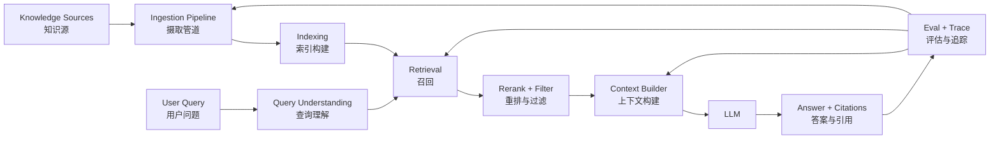
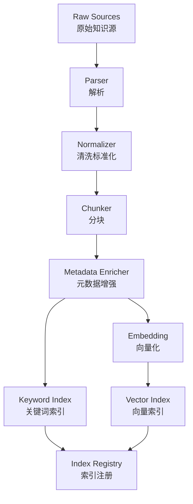
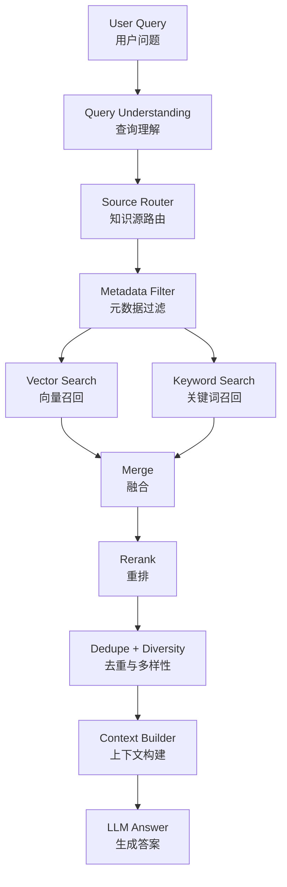

# 第9章 RAG 与检索系统工程：从外部知识到可靠上下文

> RAG 的核心不是“给模型接一个向量数据库”，而是把外部知识转成可检索、可过滤、可引用、可评估的证据上下文。

## 引言

前面的章节已经讨论过 LLM 的能力边界：模型擅长语言理解、模式归纳和生成，但它并不天然知道当前世界、企业内部数据、代码仓库状态、最新工单、实时指标和用户私有知识。

RAG（Retrieval-Augmented Generation，检索增强生成）就是为了解决这类问题。它在模型生成之前，先从外部知识源检索相关内容，再把这些内容组织成上下文，让模型基于证据回答。

很多初学者会把 RAG 简化成：

```text
文档 -> 分块 -> Embedding -> 向量数据库 -> Top-K -> Prompt
```

这个流程适合 demo，但不足以支撑生产级 Agent。真实系统里，RAG 至少要回答这些问题：

- 文档从哪里来，是否可信，是否过期；
- 文档如何解析，标题、表格、代码块和权限是否保留；
- chunk 是检索单位、上下文单位还是引用单位；
- query 是直接搜索，还是需要改写、拆解、路由；
- 向量检索、关键词检索、metadata filter 如何协同；
- 检索结果如何 rerank、去重、压缩和引用；
- 模型在没有证据、证据冲突、证据不足时如何回答；
- 权限过滤发生在哪里；
- RAG 的效果如何评估；
- 检索失败时如何 debug。

所以本章把 RAG 当成一个完整的检索系统工程来讲，而不是一个向量库 API 调用。



本章定位是：把 RAG 从“概念”和“代码片段”推进到“系统设计”。下一章会继续讨论 Agentic RAG、multi-hop retrieval、GraphRAG 和复杂知识任务。

---

## 9.1 RAG 真正解决什么问题

RAG 解决的是模型缺少外部证据的问题。

它并不直接让模型更聪明，也不保证模型一定不会幻觉。它做的是：在模型回答之前，把当前任务需要的外部信息找出来、筛出来、排好序，并用合适格式交给模型。

### RAG 的基本流程

最小 RAG 流程可以写成：

```text
用户问题
  ↓
检索相关文档
  ↓
构建上下文
  ↓
模型基于上下文回答
  ↓
返回答案和来源
```

和纯 LLM 相比：

| 方式 | 输入 | 优点 | 主要风险 |
|:---|:---|:---|:---|
| 纯 LLM | 用户问题 | 简单、低延迟 | 知识过期、无法访问私有数据、容易编造 |
| RAG | 用户问题 + 外部证据 | 可更新、可追溯、能接私有知识 | 检索失败、证据污染、引用错误 |

### 适合 RAG 的问题

RAG 适合解决“答案依赖外部资料”的问题。

典型场景：

- 企业知识库问答；
- 产品文档问答；
- 代码仓库问答；
- 客服工单问答；
- 法规、合同、政策检索；
- 故障 runbook 检索；
- 个人知识管理；
- 内部搜索与辅助写作；
- Agent 执行任务前的证据收集。

例如：

```text
问题：order-service CPU 高应该怎么排查？

RAG 应检索：
- order-service runbook；
- 近期类似故障复盘；
- 服务依赖关系；
- 当前版本发布记录；
- 指标和日志工具结果。
```

这个问题不能只靠模型常识回答。模型可以知道一般排查思路，但不知道你们公司的服务、runbook、权限和当前状态。

### 不适合只靠 RAG 的问题

有些问题即使接入 RAG，也不能简单回答。

| 问题类型 | 为什么 RAG 不够 |
|:---|:---|
| 实时系统状态 | 需要工具查询 metrics、logs、DB，而不是查历史文档 |
| 高风险决策 | 需要审批、权限、审计和回滚机制 |
| 复杂推理 | 可能需要多步检索、工具调用和验证 |
| 结构化计算 | 应调用数据库、代码或计算工具 |
| 权限敏感数据 | 必须先做 ACL 和数据脱敏 |

例如：

```text
问题：现在可以回滚 production order-service 吗？
```

RAG 可以检索回滚流程和历史案例，但不能替代：

- 当前告警状态；
- 当前版本信息；
- 发布审批状态；
- 影响面分析；
- 人工确认。

RAG 是证据层，不是执行权限系统。

### RAG 的核心承诺

一个好的 RAG 系统应该提供四个承诺：

```text
1. 找得到：相关证据能被召回；
2. 筛得准：无关、过期、越权证据不会进入上下文；
3. 引得清：答案能追溯到具体来源；
4. 评得出：系统能知道检索和回答哪里出了问题。
```

如果只实现了“向量搜索 Top-K”，只能算 RAG 的雏形。

---

## 9.2 生产级 RAG 的端到端架构

RAG 系统可以分成两条链路：

- 离线链路：把知识源转成可检索索引；
- 在线链路：把用户问题转成证据上下文和答案。

```text
Offline Indexing
  Document Source
    -> Parser
    -> Cleaner
    -> Chunker
    -> Metadata Enricher
    -> Embedding
    -> Keyword Index
    -> Vector Index

Online Serving
  User Query
    -> Query Understanding
    -> Permission Filter
    -> Candidate Retrieval
    -> Hybrid Merge
    -> Rerank
    -> Context Builder
    -> Answer Generator
    -> Citation Validator
```

这两条链路都很重要。

很多 RAG 失败发生在线下索引阶段：文档解析错误、chunk 切坏、metadata 丢失、权限缺失。在线上再怎么调 prompt，也很难修复底层证据质量。

### 离线链路：知识如何进入索引

离线链路处理的是“知识资产化”。



关键输出不是“向量”，而是可治理的文档单元：

```yaml
indexed_chunk:
  chunk_id: "runbook-order-cpu-v3#section-2#chunk-1"
  parent_doc_id: "runbook-order-cpu-v3"
  content: "当 order-service CPU 高于 85% 时，先检查最近 30 分钟部署记录..."
  metadata:
    title: "order-service CPU 高处理手册"
    doc_type: "runbook"
    service: "order-service"
    team: "order-platform"
    environment: "production"
    source: "confluence"
    version: "v3"
    updated_at: "2026-04-01"
    lifecycle_state: "active"
    permission: "sre:order-service"
  indexes:
    vector: true
    keyword: true
```

### 在线链路：问题如何变成证据上下文

在线链路处理的是“任务相关证据选择”。



在线链路的目标不是把“最相似”的文本找出来，而是把“最能支持回答”的证据找出来。

这两者不总是一样。

例如，用户问：

```text
order-service CPU 高以后能不能直接重启？
```

最相似的文档可能是“重启服务操作手册”，但最应该进入上下文的证据可能是：

- CPU 高排查 runbook；
- 生产变更审批规范；
- 高风险操作确认流程；
- 历史事故中误重启导致的问题。

RAG 的目标是支持正确决策，而不是只追求语义相似度。

---

## 9.3 文档摄取：RAG 质量从源头开始

RAG 系统的第一层质量来自文档摄取。摄取做不好，后面会出现一系列症状：

- 检索不到；
- 检索到了但语义断裂；
- 引用来源不清；
- 旧文档和新文档混在一起；
- 用户看到无权限内容；
- 模型把表格、代码或警告语理解错。

### 常见知识源

企业 RAG 的知识源通常不是单一文档目录，而是一组异构系统：

| 知识源 | 典型内容 | 摄取难点 |
|:---|:---|:---|
| Markdown / HTML | 技术文档、博客、README | 标题层级、代码块、链接 |
| PDF | 合同、报告、论文 | 页眉页脚、表格、扫描件 |
| Confluence / Notion | 内部知识库 | 权限、版本、嵌套页面 |
| Jira / 工单系统 | 历史问题和处理记录 | 评论噪音、状态变化 |
| Git 仓库 | 代码、配置、设计文档 | 文件类型、符号结构 |
| 数据库 | 业务记录、配置 | 结构化查询、权限 |
| 日志系统 | 事件和异常 | 时效、噪音、敏感字段 |

不同源应该有不同解析策略。不要用同一个纯文本抽取器处理所有内容。

### 解析时要保留结构

很多系统只抽纯文本：

```text
title + body -> plain text
```

这会丢掉大量有用信息。RAG 需要保留结构：

- 标题层级；
- 段落边界；
- 列表层级；
- 表格结构；
- 代码块语言；
- 图片说明；
- 链接目标；
- 文档路径；
- 更新时间；
- 作者；
- 版本；
- 权限；
- 生命周期状态。

例如技术文档中的代码块：

```yaml
parsed_block:
  type: "code"
  language: "bash"
  content: "kubectl rollout restart deployment/order-service"
  parent_heading: "重启服务"
  warning_nearby: "生产环境执行前必须获得 SRE lead 审批"
```

如果只抽代码，不保留附近警告语，模型可能建议危险操作。

### 文档清洗

清洗不是越干净越好，而是去掉噪音、保留语义。

常见清洗动作：

- 删除导航栏、页脚、广告、重复目录；
- 归一化空白和标题层级；
- 合并被 PDF 断开的段落；
- 修复表格换行；
- 保留代码块和配置；
- 标记图片、图表和附件；
- 提取更新时间和版本；
- 去重或标记重复文档。

不要盲目删除所有格式。格式本身经常是语义的一部分。

### 文档版本与生命周期

企业知识会过期。RAG 必须知道文档状态。

推荐给每个文档加生命周期字段：

```yaml
document_lifecycle:
  status: "active"        # active | deprecated | archived | deleted
  version: "v3"
  effective_from: "2026-04-01"
  supersedes: "runbook-order-cpu-v2"
  superseded_by: null
  last_verified_at: "2026-04-20"
```

检索时应该优先 active 文档，deprecated 文档默认降权，archived 文档通常不进入上下文。

### 稳定 ID

RAG 索引要支持增量更新。每个文档和 chunk 都需要稳定 ID。

不好的 ID：

```text
chunk_1
chunk_2
chunk_3
```

好的 ID：

```text
doc:{source}:{doc_id}:v{version}
chunk:{doc_id}:{heading_path}:{hash}
```

稳定 ID 的价值：

- 增量更新；
- 删除旧 chunk；
- 引用可追溯；
- eval 可复现；
- trace 可定位。

---

## 9.4 Chunk 策略：检索单位、上下文单位和引用单位

Chunk 是 RAG 里最容易被低估的设计点。

很多人问“chunk size 应该设多少”，但更重要的问题是：

```text
这个 chunk 在系统中扮演什么角色？
```

它可能是：

- 检索单位：用于向量搜索或关键词匹配；
- 上下文单位：最终放进 prompt 的文本；
- 引用单位：答案展示 citation 的最小单元；
- 权限单位：ACL 过滤的最小范围；
- 更新单位：增量索引的最小对象。

这几个单位不一定相同。

### 固定长度切分

固定长度切分简单可控：

```text
每 500 tokens 一个 chunk，overlap 50 tokens
```

适合：

- 长文档；
- 结构不明显的文本；
- 早期 baseline；
- 快速验证。

问题：

- 容易切断语义；
- 标题和正文可能分离；
- 表格和代码块可能被截断；
- citation 不自然。

### 结构化切分

技术文档更适合按结构切分：

```text
H1
  H2
    H3
      paragraph / list / table / code block
```

结构化 chunk 应保留标题路径：

```yaml
chunk:
  title_path:
    - "order-service CPU 高处理手册"
    - "排查步骤"
    - "检查慢查询"
  content: "查询最近 30 分钟 slow query 指标..."
```

标题路径本身可以进入 embedding 文本，让 chunk 在语义空间里更容易被召回：

```text
order-service CPU 高处理手册 > 排查步骤 > 检查慢查询

查询最近 30 分钟 slow query 指标...
```

### 语义切分

FAQ、政策和客服知识库适合按语义单元切分：

- 一个问题和答案；
- 一个流程步骤；
- 一个政策条款；
- 一个错误码说明；
- 一个故障案例。

例如：

```yaml
chunk:
  type: "faq"
  question: "生产环境服务可以直接重启吗？"
  answer: "不可以。需要先完成影响面评估并获得审批。"
  tags:
    - "production"
    - "approval"
    - "restart"
```

语义切分比固定长度更适合回答精准问题。

### Parent-child Chunk

生产系统常用 parent-child 策略：

```text
child chunk: 小，适合召回
parent chunk: 大，适合生成上下文
```

例如：

```yaml
child_chunk:
  id: "runbook#slow-query#child-1"
  content: "先查询最近 30 分钟 slow query 指标。"
  parent_id: "runbook#slow-query-section"

parent_chunk:
  id: "runbook#slow-query-section"
  content: "完整的慢查询排查章节..."
```

流程：

```text
用 child chunk 精确召回
  ↓
根据 parent_id 拉取上下文
  ↓
把 parent section 放入 prompt
```

这能兼顾召回精度和上下文完整性。

### Chunk 策略选择

| 内容类型 | 推荐策略 | 原因 |
|:---|:---|:---|
| 技术文档 | 标题结构 + parent-child | 保留上下文层级 |
| API 文档 | endpoint / method 粒度 | 参数和响应要完整 |
| 代码 | 函数、类、文件结构 | 语义边界明确 |
| FAQ | 问答对 | 检索意图直接 |
| 工单 | 问题、处理、结论分离 | 避免评论噪音 |
| runbook | 流程步骤 + 风险提示 | 支持安全执行 |
| 合同法规 | 条款级 + 上下文窗口 | citation 要精确 |

### Chunk 的反模式

常见错误：

- 只按字符数切所有文档；
- overlap 过大导致重复召回；
- chunk 没有标题路径；
- 表格被切碎；
- 代码块和解释分离；
- 权限在文档级，但 chunk 混入跨权限内容；
- 用一个 chunk 同时承担召回、上下文、引用、权限四种职责。

Chunk 不是预处理小细节，而是 RAG 的信息架构设计。

---

## 9.5 Metadata：让检索从“相似”走向“可控”

向量检索回答的是“语义上像不像”，metadata 回答的是“这个结果能不能用”。

如果没有 metadata，RAG 系统很难处理：

- 权限过滤；
- 服务过滤；
- 时间过滤；
- 文档类型过滤；
- 环境过滤；
- 版本过滤；
- 引用展示；
- 过期降权；
- 多租户隔离。

### 推荐 Metadata Schema

```yaml
metadata:
  identity:
    doc_id: "runbook_order_cpu_high"
    chunk_id: "runbook_order_cpu_high#triage#1"
    source: "confluence"
    url: "https://internal/wiki/runbook_order_cpu_high"

  structure:
    title: "order-service CPU 高处理手册"
    heading_path:
      - "故障处理"
      - "CPU 高"
      - "排查步骤"
    block_type: "paragraph"

  domain:
    doc_type: "runbook"
    service: "order-service"
    team: "order-platform"
    environment: "production"
    tags:
      - "cpu"
      - "incident"

  lifecycle:
    version: "v3"
    status: "active"
    updated_at: "2026-04-01"
    last_verified_at: "2026-04-20"

  access:
    tenant_id: "company-a"
    permission: "sre:order-service"
    sensitivity: "internal"
```

### Metadata Filter

检索时，metadata filter 应尽量前置。

```text
User Identity
  ↓
Permission Scope
  ↓
Metadata Filter
  ↓
Candidate Retrieval
```

例如：

```yaml
retrieval_filter:
  tenant_id: "company-a"
  permission_in:
    - "sre:order-service"
    - "docs:public"
  service: "order-service"
  lifecycle_status: "active"
```

不要把无权限文档召回后再告诉模型“不要使用”。模型不应该看到它无权看到的内容。

### Metadata 也参与排序

metadata 不只是过滤条件，也可以影响排序。

例如：

```text
final_score =
  retrieval_score * 0.50
+ doc_type_boost * 0.15
+ freshness_score * 0.15
+ source_authority * 0.15
+ service_match * 0.10
- stale_penalty * 0.20
```

如果用户问 runbook，runbook 类型文档应该高于普通讨论帖；如果用户问当前版本，最近验证过的文档应该高于旧复盘。

### Metadata 缺失的代价

没有 metadata 的系统通常会出现：

- 旧文档排名靠前；
- 测试环境文档混入生产问题；
- A 团队文档回答 B 团队问题；
- 无法解释为什么引用某个来源；
- 无法增量更新；
- 无法做权限审计；
- eval 只能看自然语言结果，定位不到检索问题。

所以 metadata 是生产 RAG 的控制面。

---

## 9.6 Embedding、索引与 Hybrid Search

Embedding 把文本转成向量，让语义相近的内容在向量空间中靠近。

但生产 RAG 不能只依赖向量检索。

### Embedding 选型

选择 embedding 模型时不要只看排行榜。应该用自己的文档和问题评估。

核心维度：

| 维度 | 要问的问题 |
|:---|:---|
| 语言 | 中文、英文、混合语言效果如何 |
| 领域 | 是否理解业务术语、代码、错误码、产品名 |
| 维度 | 存储成本和索引性能是否可接受 |
| 延迟 | 批量索引和在线 query 是否满足 SLA |
| 成本 | 高频查询和大规模文档是否可承受 |
| 隐私 | 是否允许调用外部 API，是否需要本地部署 |
| 稳定性 | 模型升级是否会导致全量重建索引 |

选型流程建议：

```text
准备 100-300 个真实 query
  ↓
标注 expected docs
  ↓
比较 embedding 模型 Recall@K / MRR
  ↓
比较延迟和成本
  ↓
小流量灰度
```

### 向量索引

常见向量索引：

| 索引 | 特点 | 适用场景 |
|:---|:---|:---|
| Flat | 精确但慢 | 小规模、评估 baseline |
| HNSW | 召回好、查询快 | 常见生产场景 |
| IVF | 适合大规模数据 | 海量向量 |
| PQ | 压缩存储 | 成本敏感场景 |

索引参数会影响 recall 和 latency。不要只追求查询快，必须用检索 eval 衡量召回损失。

### 为什么需要关键词检索

向量检索擅长语义相似，但对精确标识符不一定稳定。

例如：

```text
ERR_PAYMENT_1042
JIRA-1234
order-service
config.max_connections
```

这些更适合关键词检索或结构化过滤。

纯向量检索可能把“支付失败”相关文档召回，却漏掉具体错误码 `ERR_PAYMENT_1042` 的处理记录。

### Hybrid Search

生产 RAG 常用 hybrid search：

```text
vector search
  +
keyword search
  +
metadata filter
  +
rerank
```

一种简单融合方式：

```text
final_score = alpha * vector_score + (1 - alpha) * keyword_score
```

但不同检索器分数尺度可能不同，所以更常用的是 RRF（Reciprocal Rank Fusion）：

```text
score(doc) = Σ 1 / (k + rank_i(doc))
```

RRF 的优点是不用强行比较向量分数和 BM25 分数，只融合排名。

### Query Expansion 与 Query Rewrite

用户 query 往往很短：

```text
登录失败
```

它可能对应：

- 账号密码错误；
- SSO 配置问题；
- token 过期；
- 权限不足；
- 后端 auth-service 异常；
- 浏览器 cookie 问题。

可以用 query rewrite 把问题改写成更适合检索的形式：

```yaml
original_query: "登录失败"
expanded_queries:
  - "用户登录失败 常见原因"
  - "SSO 登录失败 排查"
  - "auth-service error login"
  - "token expired login issue"
filters:
  doc_type:
    - "runbook"
    - "faq"
```

但 query expansion 不能无限扩张。扩张太多会带来噪音和成本。

---

## 9.7 在线检索 Pipeline

一个成熟的在线检索 pipeline 不应该只有 `search(query, top_k)`。

推荐流程：

```text
User Query
  ↓
Intent + Entity Extraction
  ↓
Source Routing
  ↓
Permission + Metadata Filter
  ↓
Candidate Retrieval
  ↓
Hybrid Merge
  ↓
Rerank
  ↓
Dedupe
  ↓
Diversity Control
  ↓
Context Selection
```

### Query Understanding

先理解用户真正需要什么。

```yaml
query_understanding:
  raw_query: "order-service CPU 高怎么处理？"
  intent: "incident_triage"
  entities:
    service: "order-service"
    metric: "cpu"
  desired_doc_types:
    - "runbook"
    - "incident_postmortem"
  required_freshness: "active"
  risk_level: "medium"
```

有了结构化理解，检索才能用 metadata filter，而不是只做全文相似。

### Source Routing

不同问题应该查不同知识源。

| 问题 | 优先知识源 |
|:---|:---|
| “怎么处理 CPU 高” | runbook、历史事故、监控文档 |
| “这个函数谁调用” | 代码索引、符号图 |
| “客户退款政策” | 政策文档、产品 FAQ |
| “现在服务是否异常” | metrics、logs、traces 工具 |
| “上次怎么修的” | 工单、postmortem、memory |

Source Router 可以避免所有 query 都打到同一个向量库。

### Candidate Retrieval

第一阶段召回要适当宽一点。

```text
vector_top_k = 50
keyword_top_k = 50
after_merge = 80
after_rerank = 8
context_final = 3-5
```

第一阶段追求“不漏”，第二阶段 rerank 追求“排准”。

### Rerank

Rerank 用 query-document pair 重新判断相关性。

它尤其适合：

- 文档很多；
- query 很短；
- 初始召回噪音多；
- 相似文档密集；
- 需要精确 citation。

Rerank 的输出不应该只是一组文本，最好包括原因和证据类型：

```yaml
rerank_result:
  doc_id: "runbook_order_cpu_high"
  score: 0.91
  reason: "directly describes triage steps for order-service CPU high"
  evidence_type: "runbook"
```

### 去重与多样性

RAG 经常召回多个几乎相同的 chunk。

如果上下文里全是同一文档的相邻片段，会浪费 token，也会让模型误以为证据很充分。

可以做：

- 相同 parent doc 去重；
- 相似 chunk 聚合；
- 每个 doc 限制最多 N 个 chunk；
- 保留不同来源的证据；
- 保留正反证据。

例如故障诊断场景中，好的上下文可能来自：

```text
1 个 runbook
1 个最近部署记录
1 个 metrics 摘要
1 个历史事故
```

而不是 4 个 runbook 相邻段落。

---

## 9.8 上下文构建：把检索结果变成证据包

检索结果不能直接拼进 prompt。它需要被构造成证据包。

### Context Package

推荐格式：

```yaml
context_package:
  query: "order-service CPU 高怎么处理？"
  evidence:
    - id: "e1"
      source: "runbook_order_cpu_high"
      title: "order-service CPU 高处理手册"
      evidence_type: "runbook"
      trust_level: "authoritative"
      updated_at: "2026-04-01"
      content: "先检查最近 30 分钟部署记录和 slow query 指标..."
      citation: "runbook_order_cpu_high#triage"
    - id: "e2"
      source: "incident_20260401"
      evidence_type: "historical_case"
      trust_level: "historical"
      content: "历史案例显示 v1.8.3 曾因 N+1 查询导致 CPU 升高..."
      usage_rule: "reference_only"
  constraints:
    - "historical_case cannot be treated as current fact"
    - "high risk action requires human confirmation"
```

这里的关键是：上下文不仅包含内容，还包含来源、可信度和使用规则。

### Token 预算

上下文构建需要预算。

```yaml
context_budget:
  total_tokens: 8000
  allocation:
    user_query: 500
    system_instruction: 1000
    retrieved_evidence: 4500
    tool_results: 1500
    output_contract: 500
```

如果证据太多，不能简单按 Top-K 截断。应该按任务价值分配：

| 证据类型 | 优先级 |
|:---|:---|
| 当前工具结果 | 最高 |
| 权威文档 | 高 |
| 当前用户提供信息 | 高 |
| 最新 runbook | 高 |
| 历史案例 | 中 |
| 旧讨论帖 | 低 |

### Citation

RAG 的答案应该能追溯。

不好的引用：

```text
根据资料显示，应该先检查慢查询。
```

更好的引用：

```text
根据《order-service CPU 高处理手册》“排查步骤”章节，应先检查最近 30 分钟部署记录和 slow query 指标。
```

citation 最好绑定到 `chunk_id` 或 `source span`，而不是只绑定文档名。

### 证据不足时如何回答

RAG 不是每次都能找到答案。Prompt 和后端策略都要支持“无证据回答”。

```json
{
  "answerable": false,
  "reason": "retrieved evidence does not mention rollback criteria",
  "missing_evidence": [
    "current deployment status",
    "rollback approval policy"
  ],
  "suggested_next_steps": [
    "retrieve deployment runbook",
    "query release system"
  ]
}
```

不要让模型在证据不足时硬答。

### 证据冲突

检索可能召回冲突内容：

```text
Runbook v2: 可以直接重启服务。
Runbook v3: 生产环境重启必须审批。
```

上下文构建器应标记冲突：

```yaml
conflict:
  type: "version_conflict"
  preferred_evidence: "runbook v3"
  reason: "newer active document supersedes v2"
```

模型可以解释冲突，但不能自己随意选择旧规则。

---

## 9.9 端到端 RAG 参考实现

下面不是可直接复制上线的完整代码，而是展示生产 RAG 的关键接口边界。

### 索引侧接口

```python
from dataclasses import dataclass
from typing import Any, Dict, List


@dataclass
class RawDocument:
    doc_id: str
    source: str
    content: bytes
    metadata: Dict[str, Any]


@dataclass
class ParsedBlock:
    block_id: str
    block_type: str
    text: str
    heading_path: List[str]
    metadata: Dict[str, Any]


@dataclass
class IndexedChunk:
    chunk_id: str
    parent_doc_id: str
    text: str
    metadata: Dict[str, Any]


class IndexingPipeline:
    def __init__(self, parser, chunker, metadata_enricher, embedder, index_writer):
        self.parser = parser
        self.chunker = chunker
        self.metadata_enricher = metadata_enricher
        self.embedder = embedder
        self.index_writer = index_writer

    def index(self, raw_doc: RawDocument) -> None:
        blocks = self.parser.parse(raw_doc)
        chunks = self.chunker.split(blocks)
        chunks = self.metadata_enricher.enrich(chunks, raw_doc.metadata)
        embeddings = self.embedder.embed([chunk.text for chunk in chunks])
        self.index_writer.upsert(chunks, embeddings)
```

这里的重点是 pipeline 边界清晰：

- parser 负责结构解析；
- chunker 负责切分策略；
- metadata_enricher 负责治理字段；
- embedder 负责向量化；
- index_writer 负责写入索引。

不要把所有逻辑写成一个 `index_documents()` 大函数。

### 查询侧接口

```python
@dataclass
class RetrievalRequest:
    query: str
    user_id: str
    tenant_id: str
    task_type: str
    filters: Dict[str, Any]
    top_k: int


@dataclass
class Evidence:
    evidence_id: str
    content: str
    source: str
    citation: str
    score: float
    metadata: Dict[str, Any]


class RAGRetriever:
    def __init__(self, query_analyzer, router, vector_index, keyword_index, reranker):
        self.query_analyzer = query_analyzer
        self.router = router
        self.vector_index = vector_index
        self.keyword_index = keyword_index
        self.reranker = reranker

    def retrieve(self, request: RetrievalRequest) -> List[Evidence]:
        query_plan = self.query_analyzer.analyze(request)
        sources = self.router.route(query_plan)
        filters = self.build_filters(request, query_plan)

        vector_candidates = self.vector_index.search(query_plan.embedding_query, filters, sources)
        keyword_candidates = self.keyword_index.search(query_plan.keyword_query, filters, sources)

        candidates = self.merge(vector_candidates, keyword_candidates)
        candidates = self.reranker.rerank(query_plan.original_query, candidates)
        return self.select_evidence(candidates, request.top_k)
```

注意：权限和 metadata filter 是 request 的一部分，不是 prompt 的一句提醒。

### 生成侧接口

```python
class RAGAnswerer:
    def __init__(self, retriever, context_builder, llm, citation_validator):
        self.retriever = retriever
        self.context_builder = context_builder
        self.llm = llm
        self.citation_validator = citation_validator

    async def answer(self, request: RetrievalRequest) -> dict:
        evidence = self.retriever.retrieve(request)
        context = self.context_builder.build(request.query, evidence)
        response = await self.llm.generate(context.prompt)
        validation = self.citation_validator.validate(response, evidence)

        return {
            "answer": response,
            "evidence": evidence,
            "validation": validation,
            "trace": context.trace,
        }
```

这类分层能让你单独评估：

- 检索是否召回正确文档；
- rerank 是否排序正确；
- context 是否构建合理；
- 模型是否忠于证据；
- citation 是否真实支持答案。

---

## 9.10 RAG 评估与可观测性

RAG 不能只评估最终答案。必须分层评估。

### 检索层指标

| 指标 | 含义 |
|:---|:---|
| Recall@K | 正确证据是否出现在前 K 个候选里 |
| Precision@K | 前 K 个候选里有多少是相关证据 |
| MRR | 第一个正确证据排名是否靠前 |
| nDCG | 排序质量 |
| Coverage | 是否覆盖问题所需的不同证据类型 |
| Freshness | 是否优先召回最新有效文档 |
| ACL Violation Rate | 是否召回无权限内容 |

检索 eval 数据可以这样写：

```yaml
eval_case:
  id: "rag-order-cpu-001"
  query: "order-service CPU 高怎么处理？"
  user:
    tenant_id: "company-a"
    permissions:
      - "sre:order-service"
  expected_evidence:
    - doc_id: "runbook_order_cpu_high"
      required: true
    - doc_type: "deployment_record"
      required: true
  must_not_retrieve:
    - doc_id: "runbook_order_cpu_v1"
      reason: "deprecated"
    - permission: "sre:payment-service"
      reason: "out of scope"
```

### 生成层指标

| 指标 | 含义 |
|:---|:---|
| Faithfulness | 答案是否忠于证据 |
| Answer Relevance | 答案是否回答了问题 |
| Citation Accuracy | 引用是否真的支持对应句子 |
| Abstention Accuracy | 无证据时是否拒绝或说明不足 |
| Conflict Handling | 证据冲突时是否正确处理 |
| Action Safety | 是否建议了越权或高风险动作 |

### Trace

每次 RAG 调用都应该记录 trace：

```json
{
  "rag_trace": {
    "query": "order-service CPU 高怎么处理？",
    "query_understanding": {
      "intent": "incident_triage",
      "entities": {
        "service": "order-service",
        "metric": "cpu"
      }
    },
    "filters": {
      "tenant_id": "company-a",
      "service": "order-service",
      "lifecycle_state": "active"
    },
    "retrieval": {
      "vector_candidates": 50,
      "keyword_candidates": 40,
      "after_merge": 67,
      "after_rerank": 8,
      "final_evidence": 4
    },
    "context": {
      "tokens": 3200,
      "evidence_ids": ["e1", "e2", "e3", "e4"]
    }
  }
}
```

没有 trace，RAG debug 会很痛苦。你无法知道问题出在 query、filter、召回、rerank、context 还是 generation。

---

## 9.11 常见失败模式与修复路径

RAG 失败通常不是随机的。

| 失败模式 | 表现 | 常见原因 | 修复方式 |
|:---|:---|:---|:---|
| 召回不到 | 答案说没资料 | chunk 太碎、embedding 不适配、query 太短 | 改 chunk、hybrid search、query rewrite |
| 召回太多噪音 | 答案绕圈或跑题 | filter 弱、Top-K 过大、rerank 缺失 | 加 metadata filter、rerank、去重 |
| 引用错误 | citation 不支持答案 | context 混乱、模型自由引用 | citation validator、句子级引用 |
| 使用旧文档 | 建议过期流程 | lifecycle 缺失、freshness 不参与排序 | 增加版本和状态字段 |
| 权限泄露 | 回答包含无权数据 | ACL 在 prompt 层而非检索层 | 检索前权限过滤 |
| 证据冲突未处理 | 答案混合两套规则 | 未做冲突检测 | 按版本、权威度、时间解析冲突 |
| 成本过高 | token 和 rerank 费用高 | 召回过宽、上下文不压缩 | 分层召回、预算控制、缓存 |
| 无证据硬答 | 模型编造 | prompt 无 abstain policy | 增加 answerability 判断 |

### Debug 顺序

遇到 RAG 答错，不要第一反应调 prompt。建议顺序：

```text
1. 正确文档是否进入知识库？
2. 文档是否解析正确？
3. chunk 是否包含完整语义？
4. metadata 是否正确？
5. query 是否生成了正确 filter？
6. 正确 chunk 是否出现在 candidate set？
7. rerank 是否把它排到前面？
8. context builder 是否保留了它？
9. 模型是否忠于证据？
10. citation 是否校验通过？
```

这条链路能快速定位问题属于检索、上下文还是生成。

---

## 9.12 面试表达与设计清单

如果面试官问“你怎么设计一个生产级 RAG 系统”，不要只说“我会用向量数据库”。

### 面试表达

可以这样回答：

```text
我会把 RAG 设计成一个端到端检索系统，而不是简单的向量搜索。

离线侧先做文档摄取，包括解析、清洗、结构保留、chunk、metadata 增强、embedding 和索引构建。
chunk 策略会根据文档类型设计，例如技术文档按标题结构切分，runbook 保留流程和风险提示，代码按函数和类切分。

在线侧先做 query understanding，识别 intent、entity、doc_type 和权限范围。
检索时采用 hybrid search，向量召回语义相关内容，关键词检索召回错误码、服务名和编号，再用 reranker 重排。
然后由 context builder 构建带 source、trust_level、updated_at 和 citation 的证据包，而不是直接拼 Top-K 文本。

生产环境里，权限过滤和 freshness filter 必须在模型看到上下文之前完成。
评估上我会拆成检索层和生成层，分别看 Recall@K、MRR、nDCG、citation accuracy、faithfulness、abstention accuracy 和 ACL violation rate。
```

### 设计清单

```text
1. 知识源是否明确？
2. 文档解析是否保留标题、表格、代码、链接和权限？
3. chunk 是否区分检索单位、上下文单位和引用单位？
4. metadata 是否包含 source、doc_type、service、version、updated_at、permission？
5. 是否支持 hybrid search？
6. 是否有 rerank？
7. 权限过滤是否发生在模型看到内容之前？
8. 是否处理过期文档和版本冲突？
9. context 是否包含 citation 和 trust_level？
10. 无证据时是否能拒答或要求更多信息？
11. 是否有检索 eval 数据集？
12. 是否记录 RAG trace？
```

---

## 本章小结

RAG 是让 Agent 获得外部知识和事实依据的关键能力，但它不是“向量数据库 + Prompt”。

一个生产级 RAG 系统至少包括：

1. 文档摄取与解析；
2. 结构化 chunk 策略；
3. metadata 与权限模型；
4. embedding 与向量索引；
5. 关键词索引与 hybrid search；
6. query understanding 与 source routing；
7. rerank、去重和多样性控制；
8. context builder 与 citation；
9. 证据不足和证据冲突处理；
10. 分层 eval 与 trace。

RAG 的目标不是让模型“知道更多”，而是让模型在回答当前问题时看到正确、可信、可追溯的证据。

下一章会进一步讨论 **Agentic RAG 与高级检索模式**：当问题无法通过一次检索回答时，Agent 如何拆解问题、规划检索、多跳推理、使用图结构和工具调用来完成复杂知识任务。
