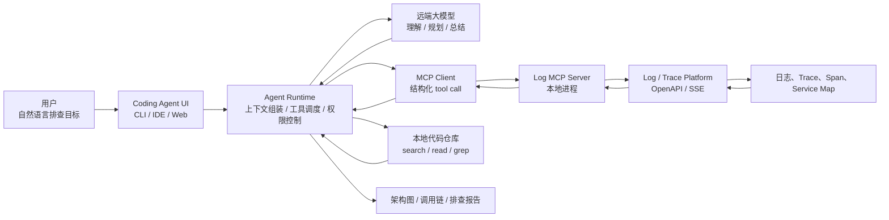
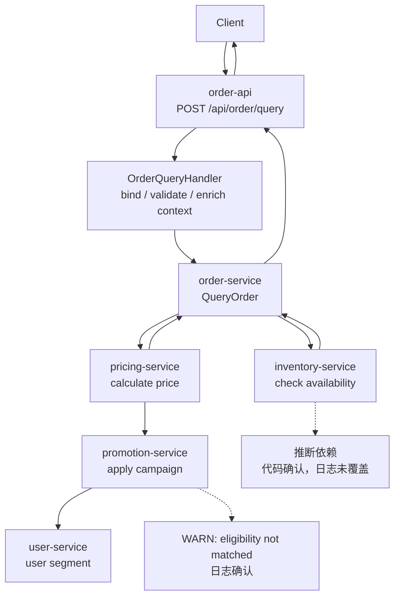

# 第13章 AI Coding Agent 系统解析：从工作协议到 Harness 工程

> AI Coding Agent 的本质，不是“自动写代码”，而是把软件工程任务转化为可规划、可执行、可验证、可隔离、可审查的工程闭环。

## 引言

前两部分已经讨论了 LLM 能力边界、Prompt Engineering、Context Engineering、Harness Engineering，以及 Agent 的工具调用、工作流、RAG、Memory、Eval、Guardrails 和可观测性。从本章开始，我们进入成熟系统解析。

本章选择 AI Coding Agent 作为第一个成熟系统案例，因为它几乎包含了 Agent 工程的全部核心问题：

- 它要理解自然语言需求；
- 它要读取和筛选大型代码库上下文；
- 它要规划多步修改；
- 它要调用搜索、文件、Shell、Git、测试等工具；
- 它要处理权限、失败、回滚和用户中断；
- 它要把人的意图转化为可审查的代码变更。

Claude Code、Cursor 和 Codex 的产品形态不同：一个偏终端，一个偏 IDE，一个偏本地与云端任务执行。但从系统设计视角看，它们都在回答同一个问题：

```text
如何让一个概率模型可靠地参与确定性的软件工程流程？
```

这个问题不能只靠模型能力解决。模型负责理解、推理、规划和生成行动意图；真正让 Agent 能在真实工程环境中工作的，是模型外部的 Harness。

可以把 Coding Agent 看成下面这个组合：

```text
Coding Agent = Model + Harness

Model:
  理解任务、推理方案、选择行动、解释结果

Harness:
  工具、上下文、状态、权限、验证、隔离、审计、交付界面
```

本章的目标不是做产品评测，而是从成熟产品中抽象出可迁移的工程原则。读完本章，你应该能回答：

1. Vibe Coding 和 Spec Coding 分别适合什么阶段；
2. 一个成熟 Coding Agent Harness 由哪些模块组成；
3. Claude Code、Cursor、Codex 的架构取舍有什么差异；
4. 终端原生 Coding Agent 为什么需要 Agent Loop、Tool Plane、Task State、Context Compact、Subagent、Worktree Isolation；
5. 如何从 MVP 演进到生产级 Coding Agent；
6. 如何评价一个 Coding Agent 系统是否可靠。

---

## 13.1 从 AI 编程范式到 Coding Agent 工作协议

AI 编程工具不是突然从“代码补全”跳到“自动程序员”的。它经历了从局部辅助到闭环执行的演进。

```text
代码补全
   ↓
对话式代码生成
   ↓
项目级上下文编程
   ↓
Coding Agent 闭环执行
```

这条演进线的关键变化，不是模型一次能写多少代码，而是模型是否被放进了一个能观察、行动、验证和修复的工程环境里。

### 13.1.1 从代码补全到闭环执行

第一阶段是代码补全。模型根据当前文件和光标附近上下文预测下一段代码。这类工具的优势是低延迟、低风险、低学习成本；局限是只能处理局部代码，不理解完整任务。

第二阶段是对话式代码生成。开发者用自然语言描述需求，模型生成代码片段、解释方案、给出调试建议。相比补全，它开始参与设计和分析，但仍然主要停留在“建议者”角色。

第三阶段是项目级上下文编程。IDE Agent 能读取打开文件、选区、诊断信息、项目规则、代码索引和相关文件。这一步的变化是：模型不再只看一个文件，而是开始围绕代码库工作。

第四阶段是 Coding Agent 闭环执行。Agent 能搜索代码、读取文件、修改文件、运行测试、分析失败、继续修复，并输出 diff、验证结果和剩余风险。这时模型不再只是生成答案，而是进入一个由工具、权限、状态、验证和审计组成的运行环境。

闭环执行可以抽象为：

```text
Intent
  ↓
Plan
  ↓
Context Gathering
  ↓
Tool Use
  ↓
Patch
  ↓
Verification
  ↓
Review
```

这就是 Coding Agent 和普通 Chatbot 的分界线。

### 13.1.2 Vibe Coding：探索式编程的价值

Vibe Coding 指的是开发者通过即兴 prompt、多轮对话和模型共同探索实现方案。

它不是坏方法。在探索阶段，它非常有效：

- 快速了解新框架；
- 验证一个技术方案是否可行；
- 生成一次性脚本；
- 做原型和 Demo；
- 解释陌生代码；
- 比较几种实现路径。

Vibe Coding 的优势是启动快、反馈快、心理负担低。它把“先想清楚再写”变成“边试边看”，特别适合需求还不稳定、技术空间还不清楚的阶段。

例如你想验证“能否把一段日志转成 Mermaid 调用链图”，用 Vibe Coding 很合适：

```text
先让模型写一个解析 demo；
再贴一段脱敏日志；
再让模型生成图；
再观察哪些字段不稳定；
最后决定是否值得工程化。
```

这种阶段的目标不是交付，而是学习。

### 13.1.3 Vibe Coding 的天花板

Vibe Coding 一旦被误用为生产交付方式，问题会快速积累。

典型过程是：

```text
用户：实现一个用户注册功能
模型：生成基础代码

用户：加邮箱验证
模型：补一段逻辑

用户：密码要加密
模型：继续修改

用户：还要防重复注册
模型：再改一轮

用户：补测试
模型：补测试，但只覆盖快乐路径
```

几轮之后，代码可能“看起来能跑”，但系统性问题已经出现：

- 需求边界不清；
- 安全约束靠后补；
- 错误处理不完整；
- 测试覆盖滞后；
- 文件结构随着对话漂移；
- 模型为了满足最新指令破坏早期约束；
- 人很难判断最终代码是否满足最初目标。

Vibe Coding 的本质是探索工具，不是交付协议。探索阶段允许混沌，交付阶段必须有约束。

### 13.1.4 Spec Coding：把意图变成任务协议

Spec Coding 的核心思想是：先把人的意图写成可执行、可验证、可审查的任务协议，再让 Agent 执行。

```text
Intent
  ↓
Spec
  ↓
Plan
  ↓
Implementation
  ↓
Verification
  ↓
Review
```

Spec 不是为了写更多文档，而是为了把隐性判断显式化。

一个高质量 Spec 至少回答八个问题：

| 问题 | 说明 |
|:---|:---|
| 做什么 | 功能目标是什么 |
| 不做什么 | 当前任务边界在哪里 |
| 输入是什么 | API、参数、事件、用户操作 |
| 输出是什么 | 返回值、状态变化、UI 行为 |
| 业务规则是什么 | 状态机、权限、幂等、并发 |
| 失败模式有哪些 | 校验失败、外部依赖失败、超时 |
| 安全要求是什么 | 权限、脱敏、审计、高风险动作 |
| 什么算完成 | 测试、构建、diff、人工验收 |

对 Coding Agent 来说，Spec 是任务接口。它类似传统系统里的 API Contract：输入、输出、约束、错误和验收标准都必须清楚。

一个简化的 Spec 可以这样写：

```markdown
# 功能：订单取消

## 目标
用户可以在订单未支付前取消订单。

## 业务规则
- 只有 `pending_payment` 状态可以取消；
- 已支付订单不能直接取消；
- 取消后释放库存；
- 重复取消必须幂等。

## 验收测试
- pending_payment -> canceled 成功；
- paid -> canceled 失败；
- 重复取消返回相同结果；
- 库存释放只执行一次。
```

这个 Spec 不长，但它已经足够让 Agent 规划修改、寻找相关代码、补测试和判断完成。

### 13.1.5 Spec 不是瀑布，而是探索到交付的转换

Spec Coding 不意味着一开始写出完美方案。更健康的流程是：

```text
Vibe 探索
  ↓
提炼 Spec
  ↓
Agent 执行
  ↓
验证反馈
  ↓
修订 Spec
```

探索阶段可以用 Vibe Coding 打开问题空间；一旦要进入交付，就要把探索结果收束成 Spec。

这也是成熟 Coding Agent 的工作方式：它可以和你一起探索，但当它要修改真实代码、运行命令、提交 diff 时，必须进入任务协议和验证闭环。

---

## 13.2 从成熟 Coding Agent 产品抽象通用 Harness 架构

如果只看表面，Coding Agent 像是“LLM + 工具调用”。但这个理解太浅。

一个能真正参与软件工程的 Coding Agent，至少要解决九类问题：

1. 用户意图如何变成任务；
2. 模型每轮应该看到什么上下文；
3. 模型可以调用哪些工具；
4. 工具调用如何被校验和执行；
5. 高风险动作如何审批；
6. 长任务状态如何维护；
7. 修改如何验证；
8. 结果如何交付给人审查；
9. 失败如何沉淀成规则、Skill 或 eval。

这些问题合在一起，才是 Coding Agent Harness。

### 13.2.1 为什么不能只把 Coding Agent 理解成 “LLM + 工具”

“LLM + 工具”只能解释 Agent 如何行动，不能解释 Agent 如何可靠行动。

例如，模型可以提出：

```json
{
  "tool": "run_shell",
  "arguments": {
    "command": "npm test"
  }
}
```

但真正的系统要回答更多问题：

- 这个命令是否允许执行；
- 当前目录是否正确；
- 是否会访问网络；
- 是否会修改文件；
- 超时多久；
- stdout / stderr 如何截断；
- 失败结果如何回填给模型；
- 测试失败时是否允许继续改代码；
- 最终是否可以声称完成。

工具调用只是一个动作意图。Harness 才负责把动作意图变成受控执行。

### 13.2.2 成熟 Coding Agent 的核心模块

成熟 Coding Agent 通常可以拆成九个模块。

```text
┌──────────────────────────────────────────────────────────────┐
│                    Coding Agent Runtime                       │
├──────────────────────────────────────────────────────────────┤
│                                                              │
│  User Intent / Issue / Spec                                   │
│      ↓                                                        │
│  Task Planner                                                 │
│      ↓                                                        │
│  Context Builder ─────► Code Index / Git / Docs / Rules       │
│      ↓                                                        │
│  Skill Registry ──────► bugfix / test / refactor / incident   │
│      ↓                                                        │
│  Tool Registry ───────► read / search / edit / shell / git    │
│      ↓                                                        │
│  Policy Engine ───────► allow / deny / ask / sandbox          │
│      ↓                                                        │
│  Agent Loop ──────────► observe / decide / act / repair       │
│      ↓                                                        │
│  Verifier ────────────► test / lint / typecheck / build       │
│      ↓                                                        │
│  Review Surface ──────► diff / PR / summary / trace           │
│                                                              │
└──────────────────────────────────────────────────────────────┘
```

| 模块 | 职责 | 最小原型 | 关键风险 |
|:---|:---|:---|:---|
| Task Planner | 把需求拆成步骤 | JSON plan / todo list | 计划过粗、遗漏验证 |
| Context Builder | 找相关代码和规则 | repo map + search + read | 上下文过多或漏掉关键文件 |
| Skill Registry | 加载任务流程 | `skills/*/SKILL.md` | 规则冲突、误触发 |
| Tool Registry | 暴露可调用能力 | 函数注册表 | 工具语义模糊 |
| Policy Engine | 裁决危险动作 | allowlist + sandbox | 越权、破坏用户修改 |
| Agent Loop | 驱动多轮执行 | while loop + tool result | 死循环、偏航 |
| Verifier | 判断是否完成 | test / lint / build | 只验证快乐路径 |
| Review Surface | 展示变更 | git diff + summary | 解释和实际 diff 不一致 |
| Eval Loop | 复盘失败样本 | trace + case store | 没有持续改进闭环 |

这些模块的边界要清楚。模型可以建议行动，但工具和权限由 Runtime 控制；模型可以总结结果，但完成判定必须由 Verifier 和人审共同支撑。

### 13.2.3 Coding Agent 的实现分层

从产品实现看，Coding Agent 不是一个单独的聊天窗口，而是一组围绕模型建立的控制面。

```text
User Surface
  │  CLI / IDE / Web / GitHub / Slack
  ▼
Task Envelope
  │  用户请求、issue、branch、cwd、权限、预算
  ▼
Context Control Plane
  │  规则、代码索引、检索片段、终端输出、Git 状态、Skill
  ▼
Model Reasoning Loop
  │  规划、选择工具、解释工具结果、修复失败
  ▼
Tool Execution Plane
  │  file / search / edit / shell / git / MCP / browser / CI
  ▼
Policy & Sandbox
  │  路径、命令、网络、secret、审批、租户隔离
  ▼
Verification Gate
  │  test / lint / typecheck / build / diff / review / eval
  ▼
Delivery Surface
     patch / PR / commit / review comment / report / trace
```

不同产品的差异，本质上是这些层的取舍不同。

| 层次 | 关键问题 | 设计判断 |
|:---|:---|:---|
| User Surface | 用户在哪里发起任务，在哪里接管结果 | CLI 适合闭环任务，IDE 适合共编，云端适合异步并行 |
| Task Envelope | 每次任务的边界是什么 | cwd、branch、repo、模型、权限、预算、时区都要显式化 |
| Context Control Plane | 模型每轮看到什么 | 规则、证据、工具结果和历史状态要分层 |
| Reasoning Loop | 模型如何推进任务 | action schema、max steps、repair loop、stop condition 缺一不可 |
| Tool Execution Plane | 外部能力如何被调用 | schema、错误返回、超时、幂等和审计是基础能力 |
| Policy & Sandbox | 哪些动作必须系统裁决 | 写文件、Shell、网络、secret、Git 操作不能只靠模型自觉 |
| Verification Gate | 完成由谁判定 | 测试、diff、CI、review 比 final answer 更可信 |
| Delivery Surface | 人如何理解结果 | diff、PR、trace、风险说明和回滚路径是交付的一部分 |

### 13.2.4 Claude Code：终端原生 Runtime

Claude Code 的核心选择是：把 Agent 放在终端里，而不是只放在 IDE 里。

这带来几个工程优势：

- 终端天然连接真实工具链；
- 可以执行测试、构建、脚本、Git 命令；
- 不绑定特定 IDE；
- 适合远程开发和自动化工作流；
- 容易与 MCP、Hooks、Subagents、Skills 等机制组合。

从系统角度看，它更像一个终端原生 Agent Runtime：围绕当前工作目录启动，加载项目规则，读取文件和工具结果，通过 Bash、文件编辑、搜索、Git、MCP 等工具推进任务。

它的关键风险也来自终端：Shell 权限过强、secret 误读、危险 Git 操作、项目规则污染、外部工具信任边界不清。

### 13.2.5 Cursor：IDE 原生 Context Control Plane

Cursor 的核心选择是：把 Agent 放在开发者正在编辑代码的界面里。

它的优势在于：

- 与当前文件、选区、打开 tab、诊断信息天然结合；
- 适合局部修改和交互式重构；
- 对前端、UI、组件级开发体验更顺；
- diff review 和 checkpoint 更贴近人的编辑习惯。

从系统角度看，Cursor 的强项是 IDE 原生 Context Control Plane。它知道用户正在看什么、改什么、选择了什么，也能把 Project Rules、User Rules、代码索引和编辑器状态组合成上下文。

它的主要风险是上下文过度贴近当前焦点：用户正在看的文件不一定是任务的全部边界。IDE Agent 很容易做出“局部看起来合理、全局破坏约束”的修改。

### 13.2.6 Codex：云端任务型 Sandbox

Codex 的核心选择是：同时支持本地配对编程和云端任务委托。

本地形态里，Agent 在开发者工作区中读取仓库、编辑文件、运行命令。云端形态里，Agent 在隔离 sandbox 中接收任务，基于仓库和环境完成修改，生成 patch、PR 或可拉回本地继续工作的结果。

这种形态适合：

- 修复明确 bug；
- 实现小到中等规模功能；
- 批量处理 issue；
- 并行探索多个方案；
- 把任务从“一个终端会话”提升到“任务队列和工程工作台”。

它的主要风险是环境复现、权限边界、私有依赖、云端数据治理和并行任务状态管理。

### 13.2.7 三类 Coding Agent 的架构对比

| 维度 | Claude Code | Cursor | Codex |
|:---|:---|:---|:---|
| 核心界面 | 终端 | IDE | CLI / IDE / App / Cloud |
| 最强场景 | 端到端任务、脚本、测试、Git | 交互式编辑、局部重构、前端开发 | 并行 issue、PR 生成、后台任务 |
| 上下文来源 | 文件系统、命令、项目规则、MCP、hooks | 编辑器、选区、代码索引、Rules、checkpoints | 仓库快照、任务描述、本地状态、worktree、sandbox 结果 |
| 执行环境 | 本地或远程终端 | 本地 IDE + 远程 background agent | 本地工作区 + 云端 sandbox |
| 权限模型 | permissions、hooks、工具权限、MCP 权限 | 模式、review、checkpoint、GitHub app | approval modes、sandbox、RBAC、仓库授权 |
| 审查表面 | 终端总结、diff、hooks、subagent review | 文件级 diff review、selective accept | patch、PR、app review、CI、review agent |
| 风险重点 | Shell 和文件权限 | 错误上下文、误编辑、远程 Agent 外传风险 | 数据边界、环境复现、并行任务治理 |

成熟团队不一定只选择一种形态。更现实的组合是：

- Cursor 负责高频交互式开发；
- Claude Code 负责终端原生任务和本地自动化；
- Codex 负责并行 issue 和云端 PR 任务；
- 统一用 Spec、测试、代码审查和 CI 把它们约束到同一工程标准。

### 13.2.8 共同失败模式：上下文、工具、验证、权限与协作

不同产品形态不同，但失败模式高度相似。

| 失败模式 | 表现 | 应该在哪一层修 |
|:---|:---|:---|
| 上下文误召回 | 修改了相似但无关的文件 | Context Control Plane：改索引、规则、检索和引用 |
| 未读文件直接改 | 生成 patch 覆盖现有逻辑 | Tool Policy：强制 read-before-edit |
| 工具结果误解 | 测试失败被当作通过 | Tool Result Envelope + Verifier |
| 长任务偏航 | 越做越偏，开始重构无关模块 | Task State：计划、预算、stop condition |
| Shell 权限过大 | 执行危险命令或联网外传 | Sandbox + command allowlist + approval |
| Diff 过大 | 大范围格式化或重写文件 | Patch Policy：diff size limit、路径范围、人工确认 |
| 解释和变更不一致 | summary 说改了 A，diff 实际改了 B | Review Surface：自动 diff summary 校验 |
| Prompt injection | README、issue、日志诱导 Agent 忽略规则 | Context Firewall：外部内容降级为 data |
| 版本漂移 | 换模型后老任务变差 | Eval Loop：固定回归集和 release gate |
| 本地状态污染 | 旧会话、旧缓存或旧规则影响新任务 | State Store：作用域、TTL、显式清理 |

这些失败模式说明：Coding Agent 的可靠性不是靠一个更强模型单独解决的，而是靠上下文、工具、策略、验证、隔离和审查共同收敛。

### 13.2.9 从产品取舍反推 Harness 设计原则

从成熟产品反推，可以得到几个通用原则。

第一，**模型负责决策，Harness 负责边界**。模型可以选择工具，但能否执行、如何执行、失败后如何恢复，必须由 Runtime 控制。

第二，**上下文是产品能力，不是 prompt 拼接**。IDE、终端、云端 sandbox 的差异，本质上是上下文来源和上下文控制方式的差异。

第三，**工具是权限边界，不是函数列表**。文件编辑、Shell、Git、网络、MCP、浏览器都必须有 schema、超时、审计和审批策略。

第四，**完成必须可验证**。没有测试、diff、CI、review 或 trace 支撑的“完成”，只是模型声明。

第五，**长任务必须外置状态**。计划、待办、工具结果、失败原因、修改文件和验证结果，不能只存在模型上下文里。

第六，**并行必须隔离**。多 Agent、多任务、云端并行和后台任务，都需要 branch、worktree、sandbox 或任务目录隔离。

---

## 13.3 真实工作流：Codex + MCP + 日志 + 代码仓库生成架构图

在深入 Claude Code 之前，先看一个真实工作流。Coding Agent 的价值不只是“改代码”，还可以把外部事实源和本地实现源串成一条可审查的工程分析链路。

一个典型场景是：

```text
用户给出线上 trace id
  ↓
Codex 通过 MCP 查询日志和 trace
  ↓
从日志里提取服务、接口、错误、耗时和关键字段
  ↓
再搜索本地代码仓库
  ↓
把日志事实和代码结构对齐
  ↓
生成接口调用链、数据流程图或排查报告
```

这类任务非常适合观察成熟 Coding Agent 的系统边界：模型不直接访问生产系统，Runtime 执行工具，MCP 连接外部平台，日志平台返回事实，代码仓库提供实现结构，最终输出必须标注证据等级。

### 13.3.1 任务背景：为什么这个工作流适合观察 Coding Agent

这个工作流同时包含五种能力：

| 能力 | 具体表现 |
|:---|:---|
| 外部工具 | 通过 MCP 查询日志和 trace |
| 本地上下文 | 搜索和读取代码仓库 |
| 证据抽取 | 从日志中提取时间线、服务名、错误码、span |
| 推理合成 | 把日志事实与代码调用关系对齐 |
| 可审查输出 | 生成图、结论、不确定性和脱敏说明 |

它比“修一个 bug”更能暴露 Agent 的架构能力，因为它要求 Agent 区分事实、代码确认和推断。

### 13.3.2 端到端架构



各层职责要分清：

| 层 | 职责 | 不是 |
|:---|:---|:---|
| 大模型 | 理解目标、规划步骤、选择工具、解释证据 | 不是日志存储，也不直接访问生产系统 |
| Agent Runtime | 组装上下文、校验工具调用、执行工具、维护 trace | 不是业务事实源 |
| MCP Server | 把工具调用转换成日志平台 API 请求 | 不负责判断业务含义 |
| Log / Trace Platform | 返回日志、span、service map 等事实 | 不理解本地代码实现 |
| 本地代码仓库 | 提供 route、handler、processor、client、日志打印点 | 不代表线上一定部署同一版本 |
| 绘图流程 | 把分析结果转成可读图形 | 不制造新事实 |

这条链路的本质是：

```text
模型负责推理，Runtime 负责执行，MCP 负责连接，日志平台负责事实，代码仓库负责结构。
```

### 13.3.3 一次请求的生命周期

假设用户提出一个脱敏后的请求：

```text
请用 live 日志工具查询 trace_id=<trace-id> 最近 20 分钟的日志，
并结合当前代码仓库画出订单查询接口的调用链。
```

Agent 不会直接知道答案，而是经历多轮循环：

```text
第 1 轮：解析任务
  环境: live
  查询对象: trace_id
  时间范围: now - 20min 到 now
  输出目标: 日志摘要 + 调用链图

第 2 轮：调用 MCP 日志工具
  search_log_by_trace_id(trace_id, start_time, end_time)

第 3 轮：分析日志结果
  提取入口 API、服务名、错误级别、时间线、span 信息

第 4 轮：搜索代码仓库
  search_code("/api/order/query")
  search_code("OrderQueryHandler")
  search_code("CalculatePrice")

第 5 轮：读取关键文件
  route -> handler -> processor -> rpc client -> log statement

第 6 轮：合成图
  标注哪些节点来自日志，哪些边来自代码

第 7 轮：输出结论
  请求是否成功、异常是否影响主流程、剩余不确定性
```

这就是 Agent Loop 在真实排障中的样子：每一轮不是闲聊，而是围绕证据继续推进。

### 13.3.4 MCP 工具调用不是网络请求本身

模型生成的通常不是 HTTP 请求，而是结构化工具调用意图：

```json
{
  "tool": "log_live.search_log_by_trace_id",
  "arguments": {
    "trace_id": "<redacted-trace-id>",
    "start_time": "2026-04-30T10:00:00+08:00",
    "end_time": "2026-04-30T10:20:00+08:00",
    "limit": 100
  }
}
```

真正执行链路是：

```text
模型输出 tool call
  -> Runtime 校验工具名和参数
  -> MCP Client 找到对应 MCP Server
  -> 本地 MCP Server 请求远端日志平台
  -> 日志平台返回结果
  -> Runtime 把 tool result 放回下一轮模型上下文
```

这个边界非常重要。模型没有直接访问日志平台的能力，它只是提出“我需要调用哪个工具”。能不能执行、怎么执行、执行结果是什么，都由 Runtime 和工具系统决定。

### 13.3.5 Runtime 每一轮给模型什么

一次模型调用前，Runtime 会把当前任务打包成上下文：

```yaml
context_package:
  instruction_layers:
    - system_contract
    - developer_policy
    - project_rules
  user_request:
    goal: "基于 trace id 还原调用链"
  environment:
    cwd: "/workspace/order-service"
    timezone: "Asia/Shanghai"
    approval_mode: "ask_for_network_and_shell"
  available_tools:
    - log_live.search_log_by_trace_id
    - search_code
    - read_file
    - render_mermaid
  selected_skill:
    name: "trace_to_architecture"
  evidence:
    logs: []
    code_snippets: []
  process_state:
    plan:
      - "查询日志"
      - "提取线索"
      - "搜索代码"
      - "生成图"
```

模型看不到全量代码仓库，也看不到全量日志平台数据。它只能基于 Runtime 放进上下文的材料推理；材料不够时，就要继续调用工具收集证据。

### 13.3.6 日志事实如何变成代码搜索线索

日志平台返回的通常是事实字段：

| 日志字段 | 模型可提取的信息 |
|:---|:---|
| timestamp | 请求时间线和相对顺序 |
| application | 涉及服务列表 |
| severity | ERROR / WARN / FATAL 过滤 |
| message | 错误类型、业务语义、关键函数名 |
| trace_id / span_id | 同一次请求关联 |
| path / method | 入口接口 |
| source file / line | 代码定位线索 |
| status / error code | 请求是否失败 |

这些字段会被模型转换成代码搜索任务：

```bash
rg "/api/order/query"
rg "OrderQueryHandler"
rg "CalculatePrice"
rg "inventory availability"
rg "promotion eligibility"
```

日志告诉我们“线上发生了什么”，代码告诉我们“为什么会这么走”。两者必须对齐，才能形成可靠结论。

### 13.3.7 证据等级：哪些能写进图里

从日志到架构图，最容易犯的错误是把推断画成事实。建议把证据分成三档：

| 证据等级 | 来源 | 图中表达 |
|:---|:---|:---|
| 强证据 | 日志包含 source file / line，代码中能找到同一日志打印点 | “日志确认” |
| 中证据 | 日志 message 与代码中的 log format 匹配 | “代码匹配” |
| 弱证据 | 服务名、方法名、业务名相似，但没有直接日志点 | “推断路径” |

架构图最好显式区分：

```text
实线：日志和代码都确认
虚线：代码推断，日志未直接覆盖
红色标注：日志中出现的 ERROR / WARN
灰色节点：可能的异步或外部依赖
```

这样图不是“看起来完整”，而是“知道哪里有证据，哪里只是推断”。

### 13.3.8 脱敏后的示例图

下面是一个公开可用的脱敏示例：



这个图的价值不在于节点多，而在于它能说明：

- 入口接口来自日志 path 和 route 代码；
- `order-service` 来自 trace application 和 handler 调用；
- `pricing-service` 来自代码中的 client 调用；
- `promotion-service` 的 WARN 来自日志；
- `inventory-service` 只在代码里确认，当前 trace 未必覆盖。

### 13.3.9 公开发布时必须脱敏

如果把这类案例写进公开文章，必须做脱敏。

| 类型 | 不要公开 | 推荐替换 |
|:---|:---|:---|
| 公司和组织 | 真实公司名、团队名、仓库名 | `ExampleCorp`、`demo-repo` |
| 内网域名 | 真实日志平台域名、内部 API 域名 | `log.example.internal` |
| Token 和配置 | API key、cookie、secret、内部代理配置 | `<redacted>` |
| Trace 信息 | 真实 trace id、span id、request id | `<trace-id>` |
| 服务名 | 真实应用名、CMDB 名 | `order-api`、`pricing-service` |
| 接口路径 | 真实业务 path | `/api/order/query` |
| 代码路径 | 真实仓库目录和文件名 | `api/router.go`、`service/handler.go` |
| 日志内容 | 真实用户、订单、价格、商户、权益信息 | 摘要化错误类型 |
| 图产物 | 内部文件路径 | `docs/diagrams/example-trace-flow.svg` |

脱敏不是简单替换几个字符串，而是要避免通过组合信息反推出业务、组织和系统结构。

### 13.3.10 最佳实践 Prompt

用户可以这样向 Coding Agent 提需求：

```text
请基于 trace_id=<trace-id> 查询最近 20 分钟日志，
并结合当前代码仓库还原调用链。

要求：
1. 先按时间线列出日志事实；
2. 再用代码搜索定位 route、handler、processor、client；
3. 区分“日志确认”“代码确认”“模型推断”；
4. 生成 Mermaid 调用链图；
5. 输出剩余不确定性；
6. 不输出任何 token、内部域名、真实用户数据。
```

这类 prompt 的关键不是“画个图”，而是要求 Agent 保持证据边界。

### 13.3.11 常见失败点

| 现象 | 可能原因 | 修复方式 |
|:---|:---|:---|
| 日志为空 | 时间窗口错、环境错、trace id 错、权限不足 | 明确时区，扩大窗口，检查 live / test 环境 |
| 图很完整但不可信 | 模型用常识补全太多 | 要求标注证据等级 |
| ERROR 被误判成请求失败 | 业务诊断日志也可能用 ERROR 打印 | 同时检查 status、error code、最终响应 |
| 代码搜索不到 | 关键词来自日志但代码命名不同 | 改搜 path、日志 message、RPC method |
| 调用链缺边 | trace 只覆盖同步路径，异步链路缺失 | 标注为未确认异步路径 |
| 暴露敏感信息 | 原样贴日志或配置 | 输出前做字段级脱敏 |

### 13.3.12 对 Coding Agent 设计的启示

这个案例说明，一个成熟 Coding Agent 不只是代码编辑器里的自动补丁生成器。它还可以成为工程分析工作台：

```text
外部事实源  -> MCP / API / Browser / DB
本地实现源  -> Code Search / File Read / AST / LSP
推理与表达  -> Model
执行与边界  -> Runtime / Policy / Sandbox
证据沉淀    -> Trace / Report / Diagram
```

当 Agent 能同时连接“线上事实”和“代码实现”，它就可以完成传统 IDE 很难完成的任务：从一次真实请求出发，还原系统行为，并生成可以 review 的架构解释。

---

## 13.4 Claude Code 深度解析：终端原生 Coding Agent Harness

Claude Code 是理解 Coding Agent Harness 的好样本。它不是把模型塞进一个聊天窗口，而是把模型放进终端、文件系统、代码仓库、工具链和权限系统组成的工作环境。

本节不会把 Claude Code 当成产品说明书来讲，而是从 Harness 工程角度拆解它代表的核心机制。

### 13.4.1 Claude Code 的产品定位：不是 IDE 插件，而是终端 Runtime

Claude Code 的核心定位是终端原生 Runtime。

这意味着它的默认工作场景不是“补全当前文件”，而是：

```text
在一个真实代码仓库中，
围绕一个任务，
读取上下文，
调用工具，
修改文件，
运行命令，
分析失败，
输出可审查结果。
```

终端原生带来两个特点。

第一，**它贴近真实工程工具链**。测试、构建、包管理、Git、脚本、日志工具、MCP server，本来就通过终端工作。把 Agent 放在终端里，可以让模型参与真实开发流程，而不是只能生成片段。

第二，**它必须面对真实权限风险**。终端可以删除文件、联网、提交代码、读取配置、运行危险脚本。终端 Agent 的设计难点不是“能不能执行命令”，而是“如何让命令执行可裁决、可审计、可恢复”。

### 13.4.2 Claude Code 的核心架构：Model + Harness

可以把 Claude Code 抽象为：

```text
Claude Code
  = Model
  + Agent Loop
  + Tool Registry
  + Context Loader
  + Task State
  + Permission Engine
  + Verification Surface
  + Session / Trace
```

其中 Model 提供理解和决策能力，Harness 提供行动空间。

```text
Model:
  - 理解需求
  - 制定计划
  - 选择工具
  - 解释工具结果
  - 生成修复策略

Harness:
  - 暴露文件、搜索、编辑、Shell、Git、MCP 等工具
  - 加载项目规则和任务上下文
  - 维护任务状态和会话状态
  - 执行权限裁决
  - 运行测试和构建
  - 输出 diff、trace 和总结
```

这个边界很关键。不要试图用代码写死“Agent 应该如何思考”；Harness 的职责是让模型能看见正确材料、调用正确工具、被正确约束、接受正确验证。

### 13.4.3 Agent Loop：Coding Agent 的最小心跳

所有 Coding Agent 的内核都可以简化为一个循环：

```text
messages
  ↓
LLM
  ↓
response
  ↓
stop_reason == tool_use ?
  ├─ yes: execute tool -> append tool_result -> loop
  └─ no: return final answer
```

伪代码如下：

```python
def agent_loop(messages, tools):
    while True:
        response = model.generate(messages=messages, tools=tools)
        messages.append(response.as_assistant_message())

        if response.stop_reason != "tool_use":
            return response.final_text

        tool_results = []
        for call in response.tool_calls:
            result = tool_runtime.execute(call)
            tool_results.append(result.as_tool_result())

        messages.append({
            "role": "user",
            "content": tool_results,
        })
```

这个循环看起来简单，但它定义了 Agent 的基本生命形式：

- 模型观察当前上下文；
- 模型决定下一步行动；
- Runtime 执行工具；
- 工具结果成为下一轮观察；
- 循环直到模型停止或 Runtime 终止。

真正复杂的不是 loop 本身，而是 loop 周围的 Harness。

| 周边机制 | 解决什么问题 |
|:---|:---|
| Tool Registry | 模型能调用什么 |
| Permission Engine | 哪些调用允许执行 |
| Context Builder | 每轮模型看到什么 |
| Task State | 长任务如何不偏航 |
| Verifier | 什么时候算完成 |
| Trace Store | 为什么这么做可复盘 |
| Budget Control | 防止无限循环和成本失控 |

Agent Loop 的设计原则是：**循环保持简单，控制面保持强。**

如果把太多业务规则写进 loop，系统会变得难以扩展；如果 loop 周围没有控制面，Agent 就会变成一个能执行任意命令的聊天模型。

### 13.4.4 Tool Execution Plane：给模型一组受控的手

Coding Agent 的工具不是越多越好，而是要原子化、可组合、可描述、可裁决。

一个终端原生 Coding Agent 至少需要这些工具：

| 工具 | 用途 | 风险 |
|:---|:---|:---|
| `list_files` | 了解仓库结构 | 输出过大 |
| `search_code` | 找符号、错误、调用链 | 误召回相似代码 |
| `read_file` | 阅读相关文件 | 读取 secret 或无关文件 |
| `edit_file` | 局部修改代码 | 覆盖用户改动 |
| `run_shell` | 测试、构建、脚本 | 危险命令、联网、长时间阻塞 |
| `git_diff` | 查看变更 | diff 太大或误读 |
| `git_status` | 识别工作区状态 | 忽略用户未提交改动 |
| `mcp_tool` | 连接外部系统 | 权限、数据泄露、工具结果污染 |

工具注册可以抽象为 dispatch map：

```python
TOOL_HANDLERS = {
    "read_file": read_file,
    "search_code": search_code,
    "edit_file": edit_file,
    "run_shell": run_shell,
}

def execute_tool(call):
    handler = TOOL_HANDLERS[call.name]
    return handler(**call.arguments)
```

但生产系统不能只停在 dispatch map。每个工具都需要 schema、权限、超时、错误封装和审计。

```yaml
tool:
  name: run_shell
  description: "Run a command in the current workspace"
  parameters:
    command:
      type: string
    timeout_seconds:
      type: integer
      maximum: 120
  policy:
    allowed_commands:
      - npm
      - pytest
      - make
      - go
    denied_tokens:
      - rm
      - sudo
      - curl
      - ssh
      - chmod
  audit:
    record_stdout: true
    redact_secrets: true
```

工具调用执行链应该是：

```text
model proposes tool call
  ↓
schema validation
  ↓
policy decision
  ├─ deny -> return rejection as observation
  ├─ ask  -> wait for human approval
  └─ allow
      ↓
sandbox execution
      ↓
tool result envelope
      ↓
trace + next context
```

工具结果也应该标准化，而不是把 stdout 原样丢回模型：

```json
{
  "tool": "run_shell",
  "ok": false,
  "exit_code": 1,
  "stdout": "...",
  "stderr": "...",
  "truncated": true,
  "duration_ms": 12403,
  "retryable": true,
  "risk": "low"
}
```

这样模型下一轮才能判断是继续修复、换工具、请求人工，还是停止。

### 13.4.5 Task State：让多步任务不偏航

模型可以临场规划，但长任务不能只靠模型上下文里的自然语言计划。

Coding Agent 需要显式 Task State：

```yaml
task_state:
  task_id: "fix-order-cancel-idempotency"
  goal: "修复订单取消重复调用导致库存重复释放"
  todos:
    - id: "t1"
      content: "阅读订单取消逻辑"
      status: "completed"
    - id: "t2"
      content: "定位库存释放调用"
      status: "completed"
    - id: "t3"
      content: "增加幂等保护"
      status: "in_progress"
    - id: "t4"
      content: "补充重复取消测试"
      status: "pending"
    - id: "t5"
      content: "运行订单相关测试"
      status: "pending"
  changed_files:
    - "service/order_cancel.go"
  blockers: []
```

Task State 的价值有三点。

第一，**让目标持久化**。上下文压缩、子任务切换、工具输出很长时，模型容易忘记原始目标。Task State 是任务锚点。

第二，**让进度可观察**。人可以看到 Agent 当前在做什么，是否偏离目标。

第三，**让 Runtime 能约束行为**。例如同一时间只允许一个 `in_progress`，任务完成前必须有验证步骤，长时间没有更新计划时提醒模型修正。

一个好的 Task State 不应该保存模型的全部推理，而应该保存可执行状态：

| 不该长期保存 | 应该保存 |
|:---|:---|
| 模型临时猜测 | 当前目标 |
| 未验证根因 | 已确认事实 |
| 大段思考过程 | 当前步骤 |
| 无来源摘要 | 工具结果引用 |
| 模糊计划 | 可检查 todo |

这也解释了 Task State 和 Scratchpad 的区别：

```text
Scratchpad:
  模型临时思考空间，可信度低，通常不长期保存

Task State:
  Runtime 维护的任务状态，影响后续行动和恢复
```

### 13.4.6 Context Control Plane：让模型看到该看的内容

模型无法天然“读懂仓库”。所谓读懂，实际上是 Runtime 不断替模型选择上下文。

终端原生 Coding Agent 的上下文通常来自七类来源：

| 来源 | 示例 | 风险 |
|:---|:---|:---|
| 项目规则 | `AGENTS.md`、`CLAUDE.md`、团队规范 | 规则过期、互相冲突 |
| 代码索引 | 文件树、符号、引用、测试名 | 索引滞后、召回错误 |
| 活动上下文 | 当前目录、Git 状态、最近命令 | 焦点不等于任务边界 |
| 工具结果 | search、read、test、lint、MCP 返回 | 工具错误被当事实 |
| 任务状态 | plan、todos、changed files、blockers | 状态不更新导致误导 |
| 历史摘要 | previous steps、trace、memory | 摘要污染 |
| Skill / Workflow | bugfix、test-writing、trace-to-architecture | 误触发、规则过泛 |

成熟 Context Control Plane 至少做五件事。

第一，**分层注入**。系统指令、项目规则、用户请求、工具结果、任务状态和历史摘要不能混成一段文本。它们的可信度、优先级和生命周期不同。

第二，**按需检索**。大仓库不能一次性塞进上下文。通常先给 repo map，再让模型通过 search / read 逐步取证。

第三，**上下文预算管理**。工具结果、测试输出、diff 和日志都可能很长。Runtime 要截断、摘要、去重，并保留来源和时间。

第四，**污染控制**。README、issue、外部网页、日志都可能包含指令式文本。它们应该作为 data，而不是 instruction。

第五，**压缩与恢复**。长任务上下文总会满。压缩不是把聊天记录缩短，而是把任务重构成稳定状态。

一个更可靠的压缩结果应该像这样：

```yaml
compact_summary:
  original_goal: "修复订单取消重复释放库存"
  confirmed_facts:
    - "重复取消会再次调用 release_inventory"
    - "订单状态 canceled 没有提前返回"
  changed_files:
    - "service/order_cancel.go"
    - "service/order_cancel_test.go"
  current_todos:
    - "运行订单相关测试"
    - "确认库存释放只调用一次"
  open_risks:
    - "未检查并发重复取消"
  forbidden:
    - "不要重构整个订单状态机"
```

这比“我们已经修了一些代码，还需要跑测试”可靠得多。

### 13.4.7 Skill / Command / Workflow：把工程经验变成可复用流程

Skill 是介于“规则文件”和“工具调用”之间的一层能力抽象。

```text
Tool:
  Agent 能调用什么能力

Skill:
  遇到某一类工程任务，应该按什么可靠流程完成
```

例如，修 bug 的稳定流程不是“直接改代码”，而是：

```text
先复现或读取失败证据
  ↓
搜索错误信息和调用链
  ↓
阅读最小相关文件
  ↓
形成根因假设
  ↓
做最小修改
  ↓
补回归测试
  ↓
运行验证
  ↓
输出 diff 和剩余风险
```

这个流程就适合沉淀成 Skill：

```markdown
# Bugfix Skill

## Trigger
当用户要求修复缺陷、失败测试、异常日志或线上报错时使用。

## Procedure
1. 先复现或读取失败证据，不要直接修改代码；
2. 搜索错误信息、函数名、测试名和相关调用链；
3. 阅读最小相关文件，避免一次性加载整个仓库；
4. 做最小修改，优先保持现有接口和行为；
5. 新增或更新回归测试；
6. 运行最小验证命令；
7. 输出 diff、验证结果和剩余风险。

## Stop Conditions
- 无法复现；
- 缺少权限；
- 验证命令持续失败且原因不明；
- 修改范围超过原始任务边界。
```

Skill 的关键是“按需加载”。不要把所有 Skill 都塞进 system prompt。成熟 Runtime 应该：

1. 发现可用 Skill；
2. 根据任务选择少量相关 Skill；
3. 把 Skill 的触发条件、步骤、验证要求注入当前上下文；
4. 记录本次任务加载了哪个 Skill、哪个版本、是否有效；
5. 任务失败后决定是否修改 Skill 或新增 eval case。

这让工程经验从“人脑经验”变成“可版本化、可审查、可评估的上下文资产”。

### 13.4.8 Verification Gate：完成不是模型说了算

Coding Agent 最危险的幻觉，不是编造事实，而是“没有完成却宣布完成”。

成熟系统要把完成判定拆成多层：

| 层级 | 检查内容 | 失败时怎么办 |
|:---|:---|:---|
| 格式层 | final schema 是否完整 | 要求模型修复输出 |
| 变更层 | diff 是否存在、是否超范围 | 阻止提交或请求人工确认 |
| 语法层 | format、lint、typecheck | 把错误回填给模型 |
| 行为层 | unit / integration / regression tests | 进入 repair loop |
| 风险层 | secret scan、权限、依赖、迁移影响 | 阻止自动完成 |
| 人审层 | review summary、PR comment、owner approval | 交给 reviewer |

Verification Gate 的核心原则是：

```text
done criteria > model final answer
```

也就是说，模型说“我完成了”只是一个候选结论。真正的完成必须由测试、构建、diff、CI、审查或用户验收支撑。

验证结果也应该进入下一轮上下文：

```json
{
  "verification": {
    "command": "go test ./service -run TestCancelOrder",
    "status": "failed",
    "exit_code": 1,
    "summary": "TestCancelOrder_Idempotent failed: inventory released twice",
    "retry_budget_remaining": 2
  }
}
```

Agent 看到这个结果后，不应该解释失败为成功，而应该进入 repair loop。

### 13.4.9 Async、Subagent 与 Multi-Agent 协作

终端任务中有很多慢操作：

- 安装依赖；
- 跑完整测试；
- 构建前端产物；
- 查远端日志；
- 运行大规模搜索；
- 等待 CI。

如果主 Agent 被这些操作阻塞，它就无法继续规划。更好的方式是把慢操作变成 background task：

```text
main agent:
  start background test
  continue reading related files
  receive notification when test finishes
```

后台任务需要三个机制：

1. **任务句柄**：Agent 能知道哪个后台任务还在跑；
2. **通知队列**：任务完成后把结果注入上下文；
3. **超时和取消**：防止长命令无限运行。

Subagent 则解决另一个问题：上下文隔离。

大任务可以拆给专门角色：

| Subagent | 适合职责 | 权限 |
|:---|:---|:---|
| Explorer | 阅读代码、找相关文件、总结调用链 | read / search |
| Debugger | 复现失败、定位根因 | read / search / shell |
| Test Runner | 运行测试、分析失败输出 | shell limited |
| Reviewer | 检查 diff 风险、遗漏测试、安全问题 | read / diff |
| Doc Writer | 更新文档和说明 | read / edit docs |

Subagent 的价值不是“多开几个模型更强”，而是：

- 每个子任务有干净上下文；
- 每个角色有更窄权限；
- 主 Agent 不被探索过程污染；
- 多个独立方向可以并行推进。

多 Agent 协作进一步需要协议。最小协议至少包括：

```yaml
message:
  from: "main"
  to: "reviewer"
  task_id: "review-diff-001"
  request: "检查当前 diff 是否遗漏测试或破坏接口"
  expected_output:
    - findings
    - severity
    - suggested_fix
  deadline: "10m"
```

没有协议的多 Agent，很快会变成多个聊天窗口互相制造噪声。

### 13.4.10 Worktree Isolation：并行执行的隔离层

当 Agent 支持并行任务时，只靠“请小心不要互相覆盖”是不够的。并行需要文件系统级隔离。

Git worktree 是 Coding Agent 很自然的隔离手段：

```text
main repo
  ├─ task-101 worktree: fix-login-bug
  ├─ task-102 worktree: refactor-payment-client
  └─ task-103 worktree: add-order-tests
```

Worktree Isolation 解决四个问题：

1. **文件修改隔离**：不同任务不会在同一目录互相覆盖；
2. **依赖状态隔离**：构建产物、临时文件、测试状态不混在一起；
3. **Git diff 清晰**：每个任务有独立 diff；
4. **失败可丢弃**：某个任务失败，可以直接删除对应 worktree。

Task 和 worktree 应该绑定：

```yaml
task:
  id: "task-102"
  branch: "agent/task-102-refactor-payment-client"
  worktree: "/workspace/.worktrees/task-102"
  status: "in_progress"
  owner: "worker-agent-2"
```

设计原则是：

```text
Task 管目标，worktree 管目录。
```

任务系统负责分配、依赖和状态；worktree 负责文件系统隔离。把两者混在一起，会导致任务状态和目录状态互相污染。

### 13.4.11 Permission 与安全边界

终端 Agent 的权限模型必须比普通聊天产品严格得多。

至少要区分四类权限：

| 权限 | 示例 | 风险 |
|:---|:---|:---|
| Read | 读代码、读文档、读 Git 状态 | secret 泄露、越权读取 |
| Write | 修改文件、创建文件 | 覆盖用户改动、误改生成文件 |
| Execute | 运行测试、构建、脚本 | 危险命令、长时间阻塞 |
| Network / External | MCP、浏览器、API、数据库 | 数据外传、权限扩大 |

权限裁决不应该只依赖 prompt。Runtime 应该有明确策略：

```yaml
permission_policy:
  read:
    allowed_paths:
      - "src/**"
      - "tests/**"
      - "docs/**"
    denied_paths:
      - ".env"
      - "secrets/**"
  write:
    allowed_paths:
      - "src/**"
      - "tests/**"
      - "docs/**"
    require_approval:
      - "package-lock.json"
      - "migrations/**"
  shell:
    allowlist:
      - "npm test"
      - "npm run build"
      - "go test ./..."
    require_approval:
      - "git push"
      - "npm install"
    deny:
      - "rm -rf"
      - "sudo"
      - "curl | sh"
```

权限系统的目标不是让 Agent 什么都不能做，而是让风险动作从“模型自觉”变成“系统裁决”。

### 13.4.12 Claude Code 的优势、局限与适用场景

Claude Code 的优势很明确：

- 适合真实仓库中的端到端任务；
- 贴近测试、构建、脚本和 Git；
- 容易把团队流程沉淀成命令、规则、Skill 和 Hook；
- 适合后端、基础设施、CLI、工具链和跨文件修改；
- 能和 MCP 等外部工具结合，形成工程分析工作流。

它的局限也很明确：

- 终端权限风险高；
- 对项目规则和上下文质量敏感；
- 长任务需要压缩、状态和验证机制支撑；
- 不如 IDE Agent 贴近用户当前选区和可视化编辑体验；
- 多 Agent 和并行任务必须有隔离，否则容易污染工作区。

适合使用 Claude Code 的任务：

- 修复明确 bug；
- 补测试；
- 跨文件重构；
- 运行和分析测试失败；
- 生成脚本和工具；
- 根据日志、trace、代码生成排查报告；
- 自动化重复性工程流程。

不适合完全交给它自动执行的任务：

- 高风险生产变更；
- 无明确验收标准的大型重构；
- 涉及敏感数据或凭据的操作；
- 需要大量产品判断或组织协调的任务；
- 测试环境无法复现的业务变更。

### 13.4.13 从 Claude Code 反推 Coding Agent Harness 设计原则

从 Claude Code 这类终端原生 Agent 可以反推出一组通用设计原则。

第一，**相信模型的推理能力，但不要相信模型能自我约束所有风险**。让模型决策，让系统裁决。

第二，**工具要小而清楚**。新增工具时，最好只是新增 handler，不要改 Agent Loop。

第三，**计划要外置**。没有计划的 Agent 会走哪算哪；计划外置后，Runtime 才能提醒、恢复和审查。

第四，**知识按需加载**。用到什么 Skill、规则、文档，就加载什么；不要把所有知识塞进 system prompt。

第五，**上下文总会满**。必须有 compact、summary、task state 和 trace 引用，而不是无限追加聊天记录。

第六，**慢操作异步化**。测试、构建、日志查询应该能后台运行，结果通过通知回到 Agent Loop。

第七，**多 Agent 需要协议**。没有消息协议、任务边界和权限边界的多 Agent，只会放大混乱。

第八，**并行执行必须隔离目录**。worktree、branch、sandbox 是并行 Coding Agent 的基础设施。

第九，**验证是交付的一部分**。没有验证结果的代码生成，只能算候选 patch。

第十，**trace 是系统资产**。失败任务、工具调用、权限裁决、测试结果和人类反馈都应该能进入复盘和 eval。

---

## 13.5 从 MVP 到生产级 Coding Agent

如果要从零实现 Coding Agent，不要一开始就追求“全自动程序员”。更稳妥的路线是按风险递增。

### 13.5.1 MVP 1：Read-only Agent

第一阶段只允许读取和搜索，不允许修改。

开放工具：

- `list_files`
- `read_file`
- `search_code`
- `git_status`
- `git_diff`

目标是让 Agent 能回答：

- 这个需求可能涉及哪些文件；
- 当前代码是怎么工作的；
- 应该怎么改；
- 需要哪些测试。

Read-only Agent 是最安全的第一步，适合接入真实大仓库。

### 13.5.2 MVP 2：Patch Agent

第二阶段开放局部编辑，但不开放任意 shell。

开放工具：

- `replace_in_file`
- `create_file`
- `format_patch`

重点能力：

- path sandbox；
- read-before-edit；
- old text 精确匹配；
- diff 输出；
- 人工确认。

这一阶段的目标不是自动完成，而是生成小范围 patch 供人审查。

### 13.5.3 MVP 3：Verified Agent

第三阶段开放测试类 Shell 命令，让 Agent 形成“修改 -> 测试 -> 修复”的闭环。

新增能力：

- command allowlist；
- timeout；
- stdout / stderr 截断；
- 失败摘要；
- retry budget。

典型流程：

```text
edit file
  ↓
run targeted test
  ↓
observe failure
  ↓
repair
  ↓
run test again
  ↓
summarize diff and verification
```

这一阶段必须明确：验证失败时，Agent 不能假装完成。

### 13.5.4 MVP 4：Workflow Agent

第四阶段加入计划、任务状态和多步骤工作流。

目标是支持更长的任务：

- 重构一个模块；
- 迁移一个 API；
- 增加一组测试；
- 修复一类 lint 问题；
- 根据日志定位线上问题。

需要补齐：

- todo state；
- step status；
- stop condition；
- 中途汇报；
- 任务暂停和恢复；
- 变更范围控制。

### 13.5.5 MVP 5：Skill-enabled Agent

第五阶段加入 Skill Registry，让 Agent 复用团队工程经验。

适合沉淀为 Skill 的流程：

| Skill | 触发场景 | 核心约束 |
|:---|:---|:---|
| `bugfix` | 失败测试、异常日志、用户报 bug | 先复现，后修改，必须补回归测试 |
| `test-writing` | 补单测、提升覆盖率 | 先读现有测试风格，覆盖失败路径 |
| `refactor` | 模块整理、接口迁移 | 保持行为等价，小步验证 |
| `dependency-upgrade` | 升级库、框架、运行时 | 查破坏性变更，跑兼容测试 |
| `trace-to-architecture` | 根据 trace / log 还原调用链 | 区分日志事实、代码确认、模型推断 |
| `release-check` | 发布前检查 | 只读检查优先，高风险动作审批 |

这一阶段要重点做 Skill 的触发条件、版本管理、加载 trace 和 regression eval。

### 13.5.6 MVP 6：Team Agent

第六阶段加入 subagent、background task、worktree、reviewer 和 CI 集成。

目标是让 Agent 进入团队工程流程，而不是只服务个人本地实验。

需要补齐：

- explorer agent；
- test runner agent；
- reviewer agent；
- task queue；
- worktree isolation；
- PR bot；
- 失败样本库；
- 权限审计。

Team Agent 的关键不是“多几个模型”，而是任务边界、通信协议、工作区隔离和质量门禁。

### 13.5.7 从原型到生产系统还缺什么

MVP 能跑，不代表可以生产使用。生产级 Coding Agent 还需要：

| 能力 | 为什么重要 |
|:---|:---|
| RBAC | 不同用户、仓库、环境权限不同 |
| Secret Boundary | 凭据不能进入 prompt、trace 或 diff |
| Audit Log | 能解释谁让 Agent 做了什么 |
| Eval Dataset | 防止模型、prompt、Skill 升级造成回归 |
| CI Integration | 验证不只靠本地命令 |
| Rollback | 失败任务能恢复工作区 |
| Cost Control | 限制步数、token、工具调用和云端资源 |
| Data Retention | 会话、日志、产物要有保留和删除策略 |
| Human Approval | 高风险动作必须人审 |

生产化的核心不是堆更多工具，而是让 Agent 的每一次行动都在可控边界内发生。

---

## 13.6 设计清单与常见反模式

这一节把本章收束成设计清单。你可以用它评估一个 Coding Agent 系统，也可以用它准备系统设计面试。

### 13.6.1 Coding Agent Harness 设计清单

**任务入口**

- 是否支持从自然语言、issue、PR comment、告警、trace 等入口创建任务；
- 是否显式记录 cwd、repo、branch、用户、权限、预算；
- 是否区分探索任务和执行任务；
- 是否有清晰的 done criteria。

**上下文**

- 是否加载项目规则；
- 是否有 repo map 或代码索引；
- 是否让模型按需 search / read；
- 是否避免把全仓库塞进 prompt；
- 是否区分 instruction、data、tool result、memory；
- 是否有上下文压缩和状态恢复。

**工具**

- 是否只暴露注册过的工具；
- 每个工具是否有 schema；
- 是否有路径沙箱；
- 是否优先局部替换而不是整文件重写；
- Shell 是否有 allowlist、timeout 和审批；
- 工具失败是否被结构化返回给模型。

**状态**

- 是否有显式 Task State；
- 是否记录当前步骤、已完成步骤、阻塞点；
- 是否区分 task state、scratchpad、memory；
- 是否能暂停和恢复；
- 是否能处理用户中途修改需求。

**权限**

- 是否区分 read、write、shell、network；
- 是否禁止读取 secret；
- 是否禁止 repo 外写入；
- 是否对 Git push、发布、迁移等高风险动作要求审批；
- 是否记录权限裁决。

**验证**

- 是否有标准验证命令；
- 是否捕获 stdout / stderr；
- 是否处理超时和 flaky test；
- final answer 是否包含验证证据；
- 验证失败时是否返回失败而不是假装成功。

**隔离**

- 并行任务是否使用 branch、worktree 或 sandbox；
- 后台任务是否有句柄、通知、超时和取消；
- subagent 是否有独立上下文和权限；
- 云端任务是否隔离依赖和环境变量。

**交付**

- 是否输出 diff；
- 是否解释修改动机；
- 是否列出验证结果；
- 是否列出剩余风险；
- 是否能生成 PR、review comment 或报告。

**改进闭环**

- 是否记录 trace；
- 是否把失败任务沉淀为 eval；
- 是否把重复流程沉淀为 Skill；
- 是否有 prompt、Skill、Tool、Policy 的版本管理；
- 是否能回滚配置变更。

### 13.6.2 常见反模式：Prompt 堆叠、无验证、无隔离、无状态

**反模式一：把所有规则塞进 system prompt**

表现：

- system prompt 越来越长；
- 规则互相冲突；
- 模型忽略后半段；
- 无法知道哪条规则生效。

修复方式：

```text
稳定规则 -> 项目规则 / policy
任务流程 -> Skill
权限边界 -> Runtime
输出格式 -> Schema
失败样本 -> Eval
```

**反模式二：让模型自己判断是否完成**

表现：

- 测试没跑却说完成；
- 测试失败但 summary 写“已通过”；
- diff 和解释不一致。

修复方式：

- 引入 Verification Gate；
- final answer 必须引用验证结果；
- 没有验证时明确标注“未验证”；
- 高风险任务必须人审。

**反模式三：Shell 权限过大**

表现：

- 模型执行危险命令；
- 联网下载未知脚本；
- 修改 repo 外路径；
- 读取 secret 文件。

修复方式：

- command allowlist；
- path sandbox；
- network approval；
- secret scan；
- shell output trace。

**反模式四：没有 Task State**

表现：

- 长任务中途偏航；
- 重复做同一步；
- 忘记用户约束；
- 上下文压缩后丢失目标。

修复方式：

- 显式 todo；
- 每步状态；
- 当前目标和禁止事项；
- compact 后重建状态；
- Runtime 对长时间无计划更新进行提醒。

**反模式五：并行任务共享同一工作区**

表现：

- 两个 Agent 改同一个文件；
- 测试产物互相污染；
- diff 混在一起；
- 一个任务失败影响另一个任务。

修复方式：

- branch / worktree / sandbox 隔离；
- task id 绑定工作目录；
- 每个任务独立验证；
- 合并前统一 review。

### 13.6.3 面试表达：如何讲清一个 Coding Agent 系统

如果面试官问“你如何设计一个 Coding Agent”，不要只回答“接入 LLM 和工具调用”。可以这样表达：

```text
我会把 Coding Agent 设计成 Model + Harness。

Model 负责理解任务、规划步骤、选择工具和解释结果；
Harness 负责上下文、工具、权限、状态、验证、隔离和审计。

系统入口可以是自然语言、issue 或 PR comment。
任务进入后先形成 Task Envelope，包括 repo、branch、cwd、权限、预算和验收标准。
Context Builder 根据项目规则、repo map、代码搜索、文件读取、工具结果和 Skill 构建上下文。
Agent Loop 让模型在每一轮选择工具行动，Runtime 对工具调用做 schema 校验、权限裁决、sandbox 执行和 trace 记录。
长任务用 Task State 管理进度，慢操作用 background task，复杂任务用 subagent 隔离上下文，并行任务用 worktree 或 sandbox 隔离工作区。
完成不能由模型自我声明，必须经过 test、lint、typecheck、build、diff review 或 CI 验证。
所有失败都进入 trace 和 eval，重复流程沉淀为 Skill。
```

这个回答的重点是：你不是在描述一个聊天机器人，而是在描述一个可治理的软件工程执行环境。

---

## 本章小结

AI Coding Agent 的成熟，不是因为模型能写更多代码，而是因为系统开始围绕模型建立工程闭环。

本章的关键结论是：

1. Vibe Coding 适合探索，Spec Coding 适合交付；
2. Coding Agent 的核心不是“LLM + 工具”，而是 Model + Harness；
3. Claude Code、Cursor、Codex 的差异，本质上是 CLI、IDE、云端 sandbox 在上下文、工具、权限和交付面上的取舍；
4. 真实工作流里，Agent 可以连接外部事实源和本地实现源，但必须保留证据等级；
5. 终端原生 Coding Agent 的核心机制包括 Agent Loop、Tool Plane、Task State、Context Control、Skill Loading、Verification Gate、Subagent、Background Task 和 Worktree Isolation；
6. 完成不是模型说了算，必须由验证、diff、CI、review 或用户验收支撑；
7. 生产级 Coding Agent 要解决权限、隔离、状态、审计、eval、成本和数据治理；
8. 重复的工程经验应该沉淀为 Skill，失败的任务应该沉淀为 eval。

最重要的变化是：

> AI 编程的核心能力，正在从“亲手写代码”转向“定义任务、组织上下文、约束执行、审查结果”。

如果你要从零实现原型，不要先追求“全自动程序员”。先实现一个能读文件、搜代码、局部修改、运行测试、输出 diff、保留 trace 的最小 Agent。这个原型足够小，却已经包含了 Coding Agent 的本质。

---

## 参考资料

1. [Claude Code Documentation - Anthropic Docs](https://docs.anthropic.com/en/docs/claude-code)
2. [Claude Code Subagents - Anthropic Docs](https://docs.anthropic.com/en/docs/claude-code/sub-agents)
3. [Claude Code Hooks - Anthropic Docs](https://docs.anthropic.com/en/docs/claude-code/hooks)
4. [Claude Code Memory - Anthropic Docs](https://docs.anthropic.com/en/docs/claude-code/memory)
5. [Claude Code Slash Commands - Anthropic Docs](https://docs.anthropic.com/en/docs/claude-code/slash-commands)
6. [Claude Code Settings - Anthropic Docs](https://docs.anthropic.com/en/docs/claude-code/settings)
7. [Claude Code MCP - Anthropic Docs](https://docs.anthropic.com/en/docs/claude-code/mcp)
8. [Cursor Rules - Cursor Docs](https://docs.cursor.com/context/rules)
9. [Cursor Agent Modes - Cursor Docs](https://docs.cursor.com/en/chat/agent)
10. [Cursor Diffs & Review - Cursor Docs](https://docs.cursor.com/en/agent/review)
11. [Cursor Background Agents - Cursor Docs](https://docs.cursor.com/en/background-agents)
12. [OpenAI Codex CLI Getting Started - OpenAI Help Center](https://help.openai.com/en/articles/11096431-openai-codex-cli-getting-started)
13. [Using Codex with your ChatGPT plan - OpenAI Help Center](https://help.openai.com/en/articles/11369540-codex-in-chatgpt)
14. [shareAI-lab/learn-claude-code - GitHub](https://github.com/shareAI-lab/learn-claude-code)
