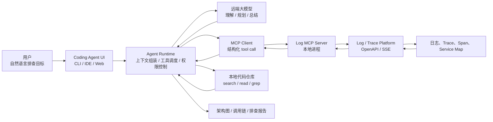
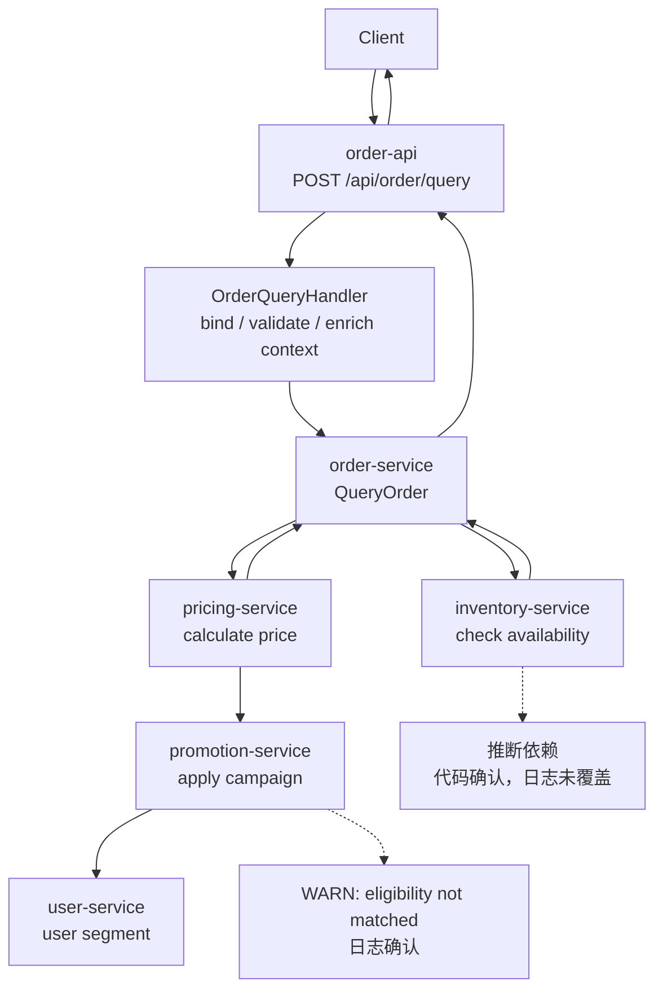

# 第13章 AI Coding Agent 系统解析：从 Vibe Coding、Spec Coding 到 Claude Code / Cursor / Codex

> AI Coding Agent 的本质，不是“自动写代码”，而是把软件工程任务转化为可规划、可执行、可验证、可回滚的工程闭环。

## 引言

前两部分讨论了大模型基础、Prompt、Context、Harness，以及 Agent 的工具、RAG、Memory、Eval、Guardrails 和可观测性。本章开始进入成熟系统解析。

我们选择 AI Coding Agent 作为第一个成熟系统案例，因为它几乎包含了 Agent 工程的全部核心问题：

- 需要理解自然语言需求；
- 需要读取大型代码库上下文；
- 需要规划多步修改；
- 需要调用文件、Shell、Git、测试等工具；
- 需要处理失败、回滚和权限；
- 需要把人的意图转化为可审查的代码变更。

Claude Code、Cursor 和 Codex 的产品形态不同：一个偏终端，一个偏 IDE，一个偏云端任务执行。但从系统设计视角看，它们都在回答同一个问题：

> 如何让不确定的大模型可靠地参与确定性的软件工程流程？

本章的目标不只是比较产品，而是让你读完之后可以复现一个最小 Coding Agent 原型。这个原型不追求“像商业产品一样强”，但必须具备真实 Coding Agent 的关键骨架：

- 能读取项目上下文；
- 能按任务加载合适的 Skill；
- 能选择和调用工具；
- 能修改文件；
- 能运行验证命令；
- 能输出 diff、总结和失败原因；
- 能通过权限、预算和审计降低风险。

---

## 13.1 AI 编程范式演进：从补全到 Agent

AI 编程工具大致经历了四个阶段。

```text
代码补全
   │
   ▼
对话式代码生成
   │
   ▼
项目级上下文编程
   │
   ▼
Coding Agent 闭环执行
```

### 阶段一：代码补全

代码补全工具把模型放在编辑器里，主要能力是根据当前文件上下文预测下一段代码。

它的优势是低延迟、低风险、低学习成本；局限是只能处理局部代码，无法理解完整任务。

### 阶段二：对话式代码生成

ChatGPT 类工具让开发者可以用自然语言描述需求，再复制代码片段到项目中。

这一步的变化是：模型开始参与“设计解释”和“调试建议”，但仍然缺少项目级上下文和自动验证。

### 阶段三：项目级上下文编程

Cursor 这类 IDE 原生工具把代码库、文件搜索、规则文件、编辑器状态整合进模型上下文。

这一步的变化是：模型不再只看一个文件，而是可以跨文件理解调用链和项目规范。

### 阶段四：Coding Agent 闭环执行

Claude Code、Codex 这类工具进一步把模型接入工具系统：

- 搜索代码；
- 修改文件；
- 执行测试；
- 查看失败输出；
- 再次修复；
- 生成 diff 或 PR。

这时模型不再只是“建议者”，而是进入了一个由工具、权限、状态、验证、审计组成的执行环境。

---

## 13.2 Vibe Coding：探索式编程的价值与天花板

**Vibe Coding** 是指通过即兴 prompt 和多轮对话与 AI 共同摸索代码实现的方式。

它不是坏方法。恰恰相反，在探索阶段它非常有效：

- 快速了解新框架；
- 验证一个技术方案是否可行；
- 写一次性脚本；
- 做原型和 Demo；
- 让模型解释陌生代码。

问题在于：Vibe Coding 容易被误用为生产交付方式。

### 典型问题

```text
你：实现一个用户注册功能
模型：生成基础代码

你：加邮箱验证
模型：补一段逻辑

你：密码要加密
模型：继续修改

你：还要防重复注册
模型：再改一轮

你：补测试
模型：补测试，但测试只覆盖快乐路径
```

几轮之后，代码可能“看起来能跑”，但常见问题会积累：

- 需求边界不清晰；
- 错误处理不完整；
- 安全约束靠后补；
- 测试覆盖滞后；
- 结构随着对话漂移；
- 模型为了满足最新指令破坏早期约束。

Vibe Coding 的本质是**探索工具**，不是**交付协议**。

---

## 13.3 Spec Coding：Coding Agent 的工作协议

Spec Coding 的核心思想是：**先把意图写成规范，再让 Agent 执行。**

```text
Intent
  │
  ▼
Spec
  │
  ▼
Plan
  │
  ▼
Implementation
  │
  ▼
Verification
```

这不是为了“写更多文档”，而是为了把人的隐性判断显式化，让模型有一个稳定的任务协议。

### 一个高质量 Spec 至少回答八个问题

1. 做什么？
2. 输入是什么？
3. 输出是什么？
4. 业务规则是什么？
5. 失败模式有哪些？
6. 安全要求是什么？
7. 性能和并发要求是什么？
8. 什么测试能证明它工作？

对 Coding Agent 来说，Spec 不是文档资产，而是**任务接口**。它相当于传统系统里的 API Contract：输入、输出、约束、错误、验收标准都必须清楚。

### Spec 为什么适合 Coding Agent

Coding Agent 有三个特点：

- 能读大量上下文，但容易被无关内容稀释；
- 能做多步任务，但容易在中途偏航；
- 能调用工具，但工具调用必须受约束。

Spec 正好补上这些缺口：

- 给 Agent 一个稳定目标；
- 给计划提供验收标准；
- 给测试提供依据；
- 给人工 review 提供对照物；
- 给失败复盘提供事实基线。

### Spec 不是瀑布

Spec Coding 不要求一开始写出完美方案。更健康的流程是：

```text
Vibe 探索 → 提炼 Spec → Agent 执行 → 验证反馈 → 修订 Spec
```

探索阶段允许混沌，交付阶段需要约束。

---

## 13.4 从成熟产品抽象出通用架构

成熟 Coding Agent 通常包含九个核心模块。

```text
┌──────────────────────────────────────────────────────────────┐
│                    Coding Agent Runtime                       │
├──────────────────────────────────────────────────────────────┤
│                                                              │
│  User Intent / Issue / Spec                                   │
│      │                                                        │
│      ▼                                                        │
│  Task Planner                                                 │
│      │                                                        │
│      ▼                                                        │
│  Context Builder ─────► Code Index / Git / Docs / Rules       │
│      │                                                        │
│      ▼                                                        │
│  Skill Registry ──────► bugfix / test / refactor / incident   │
│      │                                                        │
│      ▼                                                        │
│  Tool Registry ───────► read/search/edit/shell/git/test       │
│      │                                                        │
│      ▼                                                        │
│  Policy Engine ───────► allow / deny / ask / sandbox          │
│      │                                                        │
│      ▼                                                        │
│  Agent Loop ──────────► think / act / observe / repair        │
│      │                                                        │
│      ▼                                                        │
│  Verifier ────────────► test / lint / typecheck / diff        │
│      │                                                        │
│      ▼                                                        │
│  Review Surface ──────► patch / PR / explanation / trace      │
│                                                              │
└──────────────────────────────────────────────────────────────┘
```

| 模块 | 职责 | 最小原型怎么做 | 关键风险 |
|:---|:---|:---|:---|
| Task Planner | 把需求拆成步骤 | 让模型输出 JSON plan | 计划过粗、遗漏验证 |
| Context Builder | 找到相关代码和规则 | repo map + search + read_file | 上下文过多或漏掉关键文件 |
| Skill Registry | 选择任务相关的工程流程 | `skills/*/SKILL.md` + 触发规则 | 加载过多、规则冲突 |
| Tool Registry | 暴露可调用能力 | Python 函数注册表 | 工具语义模糊 |
| Policy Engine | 管控危险动作 | allowlist + path sandbox | 越权、破坏用户改动 |
| Agent Loop | 驱动多轮执行 | while step < max_steps | 死循环、偏航 |
| Verifier | 运行检查 | pytest/lint/build 命令 | 只验证快乐路径 |
| Review Surface | 展示变更 | git diff + summary | 解释和实际变更不一致 |
| Eval Loop | 复盘失败样本 | 保存 trace 和失败任务 | 没有持续改进闭环 |

如果只看表面，Coding Agent 像是“LLM + 工具调用”。但真正的工程难点在工具调用之外：

- 上下文怎么选；
- 工具能做什么、不能做什么；
- 修改前如何知道文件没有被用户改动；
- 测试失败后如何把错误反馈给模型；
- 任务失败时如何保留证据；
- 最后如何让人相信这个 diff 可以 review。

### 成熟 Coding Agent 的实现分层

把成熟 Coding Agent 拆开看，它不是一个单独的“聊天窗口”，而是一组围绕模型建立的控制面。

```text
User Surface
  │  CLI / IDE / Web / GitHub / Slack / Mobile
  ▼
Task Envelope
  │  用户请求、issue、branch、cwd、权限、环境、预算
  ▼
Context Control Plane
  │  规则、代码索引、检索片段、终端输出、Git 状态、记忆、Skill
  ▼
Model Reasoning Loop
  │  规划、选择工具、解释工具结果、修复失败
  ▼
Tool Execution Plane
  │  file / search / edit / shell / git / MCP / browser / CI
  ▼
Policy & Sandbox
  │  路径、命令、网络、secret、审批、租户隔离
  ▼
Verification Gate
  │  test / lint / typecheck / build / diff / review / eval
  ▼
Delivery Surface
     patch / PR / commit / review comment / report / trace
```

这几个层次对应不同实现问题：

| 层次 | 关键实现问题 | 设计判断 |
|:---|:---|:---|
| User Surface | 用户在哪里发起任务，在哪里接管结果 | IDE 适合交互，CLI 适合本地闭环，云端适合异步并行 |
| Task Envelope | 每次任务的运行边界是什么 | cwd、branch、repo、模型、权限、预算、时区都要显式化 |
| Context Control Plane | 模型每轮看到什么 | 规则和证据要分层，不能把全仓库和历史聊天混在一起 |
| Reasoning Loop | 模型如何从开放目标推进到完成 | action schema、max steps、repair loop、stop condition 缺一不可 |
| Tool Execution Plane | 外部能力如何被调用 | 工具必须有 schema、错误返回、超时、幂等和审计 |
| Policy & Sandbox | 哪些动作绝不能只靠模型自觉 | 写文件、shell、网络、secret、Git 操作必须系统裁决 |
| Verification Gate | 完成由谁判定 | 测试、diff、CI、review 和 eval 要比 final answer 更可信 |
| Delivery Surface | 人如何理解和接收结果 | diff、PR、trace、风险说明和回滚路径是交付的一部分 |

这也是为什么成熟 Coding Agent 的实现，通常比普通 LLM 应用复杂得多。普通应用只需要“输入 -> 模型 -> 输出”；Coding Agent 必须把模型放进软件工程生命周期里。

### Context Control Plane：模型不是自己“读懂仓库”的

模型无法天然看到整个代码库。所谓“理解代码库”，其实是 Runtime 不断替模型选择上下文。

成熟 Coding Agent 的上下文通常来自六类来源：

| 来源 | 示例 | 风险 |
|:---|:---|:---|
| 项目规则 | `CLAUDE.md`、`AGENTS.md`、`.cursor/rules` | 规则过长、过期、互相冲突 |
| 代码索引 | 文件树、符号、引用、测试名、路由 | 索引滞后、召回错误 |
| 活动上下文 | 当前文件、选区、打开的 diff、终端输出 | 用户焦点不等于任务全部上下文 |
| 工具结果 | search、read、test、lint、CI、MCP 返回 | 工具错误被模型当事实 |
| 历史状态 | conversation、plan、steps、trace、memory | 摘要污染、旧假设残留 |
| 任务流程 | Skill、workflow、review checklist | 流程过度泛化、误触发 |

一个成熟 Context Control Plane 至少要做四件事。

第一，**分层注入**。系统指令、组织策略、项目规则、任务目标、证据、工具结果和历史摘要不能混成一段文本。它们的可信度、优先级和生命周期不同。

第二，**按需检索**。大仓库不能一次性塞进上下文，通常先给 repo map 或符号索引，再让模型通过 search/read 逐步收集证据。

第三，**上下文预算管理**。工具结果、测试输出、diff 和日志都可能很长。Runtime 要截断、摘要、去重，并保留来源和时间。

第四，**污染控制**。外部文档、README、issue、日志和网页都可能包含不可信指令。它们应该作为 data，而不是 instruction。

可以把每轮模型调用前的上下文看成一个包：

```yaml
task_envelope:
  user_request: "修复订单取消失败"
  repo: "order-service"
  branch: "feature/cancel-order"
  cwd: "/workspace/order-service"
  budget:
    max_steps: 20
    max_shell_seconds: 60

instruction_layers:
  system_contract: "只能通过工具行动；不要声称未验证的完成"
  organization_policy: "不得读取 secret；高风险命令需要审批"
  project_rules: "运行 make test；不要修改 generated/"
  selected_skills:
    - bugfix

evidence:
  repo_map: "..."
  search_results:
    - source: "rg cancel_order"
      trust: "tool_result"
  read_files:
    - path: "service/order_cancel.go"
      lines: "..."
  test_output:
    status: "failed"
    command: "make test"

state:
  current_plan: [...]
  recent_steps: [...]
  changed_files: [...]
```

这类结构化上下文包，比“把所有内容拼到 prompt 里”更接近生产实现。

### Tool Execution Plane：工具调用是一条受控执行链

模型看到的是工具 schema，但真正发生的是 Runtime 执行链。

```text
model proposes tool call
  │
  ▼
schema validation
  │
  ▼
policy decision
  ├─ deny -> return rejection as observation
  ├─ ask  -> wait for human approval
  └─ allow
      │
      ▼
sandbox execution
      │
      ▼
tool result envelope
      │
      ▼
trace + next context
```

这里最关键的是：**工具不是函数列表，而是权限边界。**

例如 `run_shell("pytest")` 和 `run_shell("rm -rf .")` 都是 shell 字符串，但风险完全不同。成熟 Runtime 不会把它们交给模型自己判断，而是把工具参数拆成可裁决对象：

```yaml
tool_call:
  name: run_shell
  args:
    command: "pytest tests/test_order.py -q"
    timeout: 60

policy_context:
  cwd: "/workspace/order-service"
  network: "disabled"
  allowed_commands:
    - pytest
    - make
    - npm
  denied_tokens:
    - rm
    - sudo
    - curl
    - ssh
  risk_level: medium

decision:
  result: allow
  reason: "pytest is in allowlist and command has no denied tokens"
```

工具结果也应该标准化，而不是把 stdout 直接丢回模型：

```json
{
  "tool": "run_shell",
  "ok": false,
  "status": "failed",
  "exit_code": 1,
  "stdout": "...",
  "stderr": "...",
  "truncated": true,
  "duration_ms": 12403,
  "retryable": true
}
```

这样模型下一轮才能判断是继续修复、换工具、请求人工，还是停止。

### Verification Gate：完成不是模型说了算

Coding Agent 最危险的幻觉不是编造事实，而是“没有完成却宣布完成”。

成熟系统通常会把完成判定拆成多层：

| 层级 | 检查内容 | 失败时怎么办 |
|:---|:---|:---|
| 格式层 | final schema 是否完整 | 要求模型修复输出 |
| 变更层 | diff 是否存在、是否超范围 | 阻止提交或请求人工确认 |
| 语法层 | format、lint、typecheck | 把错误回填给模型 |
| 行为层 | unit / integration / regression tests | 进入 repair loop |
| 风险层 | secret scan、权限、依赖、迁移影响 | 阻止自动完成 |
| 人审层 | review summary、PR comment、owner approval | 交给 reviewer |

这也是为什么优秀 Coding Agent 的用户体验里一定有 diff、测试输出、失败原因和剩余风险，而不是只有一段“我已经完成了”。

### Trace / Eval Loop：失败要能变成系统资产

成熟 Coding Agent 会记录的不只是聊天历史，而是可分析的执行轨迹：

```text
task_id
  model_version
  prompt_version
  selected_rules
  selected_skills
  tool_calls
  policy_decisions
  file_reads
  file_writes
  shell_commands
  test_results
  final_diff
  human_feedback
```

这些 trace 可以反哺三类改进：

1. **Prompt / Skill 改进**：某类任务总漏跑测试，就把“必须运行最小验证”写进 Skill；
2. **Tool / Policy 改进**：模型频繁调用危险命令，就收紧 shell schema 或 allowlist；
3. **Eval 改进**：把失败任务变成回归样本，防止下个模型版本重犯。

没有 trace 的 Coding Agent，只能靠用户主观感觉调 prompt；有 trace 的 Coding Agent，才能进入工程化迭代。

### Skill Registry：把工程经验变成可复用能力

在 Coding Agent 里，Skill 是介于“规则文件”和“工具调用”之间的一层能力抽象。

```text
Tool  解决：Agent 能调用什么能力
Skill 解决：某一类工程任务应该按什么方法完成
```

例如：

| 任务 | 需要的工具 | 适合沉淀成 Skill 的经验 |
|:---|:---|:---|
| 修复 bug | search、read、edit、test | 先复现，再定位，再最小修改，再回归测试 |
| 补测试 | read、search、edit、test | 先理解现有测试风格，再覆盖失败路径和边界条件 |
| 重构模块 | search、read、edit、test、diff | 先建立调用面，再小步迁移，再保持行为等价 |
| 升级依赖 | read、edit、shell、diff | 先看 changelog，再改锁文件，再跑兼容测试 |
| 日志排障 | MCP log、trace、search、diagram | 先列日志事实，再对齐代码，再标注证据等级 |

Skill 不应该拥有执行权限。它只是告诉 Agent “这类任务的可靠做法是什么”。真正的文件读写、Shell 执行、MCP 查询和 Git 操作，仍然必须经过 Tool Registry 和 Policy Engine。

一个最小 Skill 可以写成这样：

```markdown
# Bugfix Skill

## Trigger
当用户要求修复缺陷、失败测试、异常日志或线上报错时使用。

## Procedure
1. 先复现或读取失败证据，不要直接修改代码；
2. 搜索错误信息、函数名、测试名和相关调用链；
3. 阅读最小相关文件，避免一次性加载整个仓库；
4. 做最小修改，优先保持现有接口和行为；
5. 新增或更新回归测试；
6. 运行最小验证命令；
7. 输出 diff、验证结果和剩余风险。

## Stop Conditions
- 无法复现；
- 缺少权限；
- 验证命令持续失败且原因不明；
- 修改范围超过原始任务边界。
```

从架构上看，Skill Registry 做三件事：

1. **发现**：从项目、用户目录或内置目录加载 `SKILL.md`；
2. **选择**：根据任务类型、文件类型、工具需求和历史失败样本选择少量相关 Skill；
3. **注入**：把 Skill 的触发条件、步骤、验证要求放进本轮上下文。

不要把所有 Skill 都塞进 prompt。一个成熟 Runtime 应该按需加载，最好还能记录本次任务到底加载了哪个 Skill、哪个版本，以及最终是否帮助任务成功。

---

## 13.5 Claude Code、Cursor、Codex 的架构取舍

### Claude Code：终端原生 Runtime

Claude Code 的核心选择是：**把 Agent 放在终端里，而不是只放在 IDE 里。**

这带来几个工程优势：

- 终端天然连接项目中的真实工具链；
- 可以执行测试、构建、脚本、Git 命令；
- 不绑定特定 IDE；
- 适合远程开发和自动化工作流；
- 容易与 MCP、Hooks、Subagents 等扩展机制组合。

从实现角度看，Claude Code 更像一个终端里的 Agent Runtime，而不是一个补全工具。它围绕当前工作目录启动，递归读取项目记忆文件，把用户请求、项目规则、工具结果和会话状态组装成上下文，然后通过文件、搜索、编辑、Bash、MCP 等工具推进任务。

Claude Code 的典型循环可以概括为 TAOR：

```text
Think
  │  分析需求、上下文和约束
  ▼
Act
  │  调用文件、搜索、编辑、Shell、Git 等工具
  ▼
Observe
  │  读取工具结果、测试输出、错误信息
  ▼
Repeat
     未完成则继续，完成则给出总结和 diff
```

#### Memory：`CLAUDE.md` 是项目级上下文协议

`CLAUDE.md` 的价值不是“模型真的拥有长期记忆”，而是把项目约束变成每次任务都会读取的上下文。它适合写：

- 项目结构和关键目录；
- 常用构建、测试、lint 命令；
- 代码风格和架构边界；
- 不可触碰的目录和文件；
- 发布前检查；
- 过去反复犯过的错误。

Claude Code 的 memory 不是单一文件，而是有层级的：

| 层级 | 典型位置 | 作用 |
|:---|:---|:---|
| 企业策略 | 系统级 `CLAUDE.md` | 组织统一安全、合规和工程规范 |
| 项目记忆 | 仓库内 `CLAUDE.md` | 团队共享的项目规则 |
| 用户记忆 | 用户目录 `CLAUDE.md` | 个人偏好和常用工作流 |
| 子目录记忆 | 子树下的 `CLAUDE.md` | 大仓库里的局部规则 |

这说明成熟 Coding Agent 的“记忆”本质上是 **context loading policy**：什么时候加载、加载哪个层级、冲突时谁优先、如何避免过期规则污染任务。

#### Hooks：把确定性约束插入工具生命周期

Hooks 则把“确定性约束”插进 Agent Runtime。例如编辑前检查路径，Shell 执行前拦截危险命令，测试结束后自动收集日志。

Claude Code 的 hooks 覆盖多个事件：

| Hook 事件 | 发生时机 | 工程用途 |
|:---|:---|:---|
| `UserPromptSubmit` | 用户提交 prompt 后、模型处理前 | 注入 issue、阻止危险请求、补充上下文 |
| `PreToolUse` | 模型生成工具参数后、工具执行前 | allow / deny / ask，拦截写文件和 Bash |
| `PostToolUse` | 工具执行成功后 | 检查结果、追加上下文、提示模型修复 |
| `Stop` | 主 Agent 准备结束时 | 阻止过早完成，要求跑测试或补报告 |
| `PreCompact` | 压缩上下文前 | 保存关键状态，避免压缩丢失任务约束 |
| `SessionStart` | 会话启动或恢复时 | 加载本地开发状态、issue、最近变更 |

这套机制的关键点是：模型提出行动，hooks 和 permission 系统共同裁决行动。比如 `PreToolUse` 可以对某个 Bash 命令返回 `allow`、`deny` 或 `ask`。这就是把“不要执行危险命令”从 prompt 愿望变成 Runtime 机制。

#### Subagents：用独立上下文隔离职责

Subagents 则把复杂任务拆给专门角色，例如 reviewer、test runner、debugger。它们有自己的上下文窗口、系统提示词和工具权限，可以放在项目级 `.claude/agents/` 或用户级目录。

这解决了两个问题：

1. **上下文隔离**：reviewer 不需要继承 main agent 的全部探索过程；
2. **权限收敛**：test runner 可以有 Bash 权限，doc writer 可以只有 read/edit 权限。

成熟团队使用 subagent 时，真正要设计的是职责边界：

```text
main agent:
  负责理解任务、协调流程、汇总结论

debugger subagent:
  负责复现错误、定位根因、给出证据

test-runner subagent:
  负责运行验证命令、分析失败、建议最小修复

code-reviewer subagent:
  负责检查 diff 风险、遗漏测试、安全问题
```

#### 从 `~/.claude` 反推终端原生 Agent Runtime

如果说 `~/.codex` 暴露的是“本地 app + 多任务调度 + 云端 sandbox”的 Runtime 剖面，那么 `~/.claude` 和项目 `.claude/` 暴露的则是另一种形态：**终端原生 Agent Runtime 的配置控制面**。

Claude Code 的公开配置体系很有代表性。它不是只读一个全局配置文件，而是把配置拆成多个 scope：

```text
Managed policy
  │  组织和设备级策略，用户不可覆盖
  ▼
Command line arguments
  │  单次会话临时覆盖
  ▼
Local project settings
  │  当前仓库个人配置，不提交
  ▼
Project settings
  │  当前仓库团队共享配置，可提交
  ▼
User settings
     用户全局配置
```

这套优先级本质上是一个 Scope Resolver。它决定本轮 Agent 到底加载哪些规则、哪些工具、哪些权限和哪些扩展。与普通 CLI 工具不同，Coding Agent 的配置不是“影响 UI 偏好”，而是会直接改变模型能看到什么、能调用什么、能执行什么。

可以把 Claude Code 的本地与项目目录抽象成下面几类数据面：

| 数据面 | 典型位置 | Runtime 职责 | 与 Codex 剖面的对应 |
|:---|:---|:---|:---|
| 身份与全局状态 | `~/.claude.json`、登录态、信任状态、缓存 | 保存 OAuth session、MCP 配置、per-project state 和缓存 | `auth.json`、`state_5.sqlite`、`models_cache.json` |
| 配置与权限 | `~/.claude/settings.json`、`.claude/settings.json`、`.claude/settings.local.json`、managed settings | 管理权限规则、环境变量、sandbox、模型、插件和 hooks | `config.toml`、approval mode、workspace policy |
| 记忆与规则 | `~/.claude/CLAUDE.md`、仓库 `CLAUDE.md`、`.claude/CLAUDE.md`、`CLAUDE.local.md` | 注入项目约束、工程习惯、常用命令和局部规则 | `rules/`、`memories/`、`AGENTS.md` |
| 子 Agent | `~/.claude/agents/`、`.claude/agents/` | 定义专用 agent 的系统提示词、工具权限和触发描述 | review agent、worker agent、subtask agent |
| Skills / Commands | `~/.claude/skills/`、`.claude/skills/`、`.claude/commands/`、plugin skills | 沉淀任务流程，让模型按需加载 | `skills/` |
| 插件与 MCP | `.mcp.json`、`~/.claude.json`、plugin MCP servers | 连接 GitHub、Jira、日志平台、数据库、浏览器等外部系统 | `plugins/`、MCP connector |
| 生命周期拦截 | settings hooks、plugin hooks | 在 prompt、tool call、compact、stop、session start/end 等阶段插入确定性逻辑 | Tool policy、trace hook、verification gate |
| 会话与 transcript | session persistence、cleanup 策略、`/compact`、`/clear` | 控制历史保留、压缩、清理和恢复 | `sessions/`、`archived_sessions/`、`session_index.jsonl` |

这张表说明：Claude Code 并不是简单地把模型接到 Bash 上。它把终端环境拆成五个核心控制器。

```text
Terminal / TTY
  │
  ▼
Claude Code Runtime
  ├─ Scope Resolver
  ├─ Memory Loader
  ├─ Permission & Sandbox Engine
  ├─ Hook Dispatcher
  ├─ Tool / MCP Router
  ├─ Subagent Scheduler
  └─ Session / Transcript Manager
       │
       ├─ Local Repository
       ├─ Shell / Git / Test Toolchain
       ├─ MCP Servers
       └─ Plugins / Skills
```

这里最值得注意的是三点。

第一，**`~/.claude.json` 不是普通上下文文件**。它可能包含 OAuth session、MCP server 配置、per-project state 和缓存。它属于 Runtime 状态层，而不是应该喂给模型的知识层。模型可以通过 MCP 工具访问 GitHub issue 或日志平台，但不应该看到 token、OAuth session 或 connector 细节。

第二，**`.claude/settings.json` 是团队级 Policy as Code**。团队可以把允许的 Bash 命令、拒绝读取的 secret 路径、共享 MCP server、hooks 和插件配置写进仓库。这样一来，新成员 clone 仓库后，Agent 的行为边界就和项目一起版本化，而不是散落在每个人的口头经验里。

第三，**hooks 让终端 Agent 具备“中间件”能力**。传统脚本是用户直接执行命令；Claude Code 是模型先提出工具调用，再由 hooks、permissions 和 sandbox 决定是否允许。`PreToolUse`、`PostToolUse`、`Stop`、`PreCompact` 这些事件把 Agent loop 拆成可插拔阶段，让安全、审计、验证和上下文维护不再完全依赖 prompt。

这也解释了 Claude Code 和 Codex 的架构侧重点差异：

| 维度 | Claude Code | Codex |
|:---|:---|:---|
| Runtime 形态 | 终端原生，围绕当前 shell 和仓库运行 | App / CLI / Cloud 组合，围绕工作区和任务队列运行 |
| 状态暴露方式 | 配置 scope、Markdown memory、JSON settings、hooks、MCP 配置 | 本地 sqlite、sessions、plugins、skills、cloud requirements cache |
| 强项 | 把真实工程工具链纳入可审批的终端循环 | 并行任务、云端 sandbox、本地/云端协同和多工作区编排 |
| 团队化方式 | `.claude/`、`CLAUDE.md`、`.mcp.json`、managed policy | AGENTS.md、skills、plugins、workspace policy、PR / app review |
| 主要风险 | Shell 权限、MCP 信任、项目规则污染、secret 误读 | 数据边界、远程环境复现、并行任务治理、缓存和状态污染 |

所以，Claude Code 对成熟 Coding Agent 的启示是：**终端不是 UI，而是 Runtime substrate**。它天然连接 shell、Git、测试、包管理器、CI 脚本和远程开发环境；而 `~/.claude` / `.claude/` 这套配置面，则负责把这些能力变成可配置、可审批、可拦截、可团队共享的 Agent 系统。

Claude Code 的架构启示是：终端原生 Coding Agent 的核心不是“会不会聊天”，而是能否把真实工程工具链接进一个可审批、可拦截、可复盘的循环。

### Cursor：IDE 原生 Context Control Plane

Cursor 的核心选择是：**把 Agent 放在开发者正在编辑代码的界面里。**

它的优势在于：

- 与编辑器 selection、文件树、诊断信息天然结合；
- 适合局部修改和交互式重构；
- 对 UI、前端、局部调用链修改体验更顺；
- 规则系统能为不同目录提供 scoped instruction。

从实现角度看，Cursor 的强项不是“后台执行”，而是 **IDE 内上下文控制**。它天然知道当前文件、选区、打开的 tab、诊断信息、diff、文件树和用户正在修改的位置。这些信息会显著影响模型做局部修改的质量。

#### Modes：用模式约束工具能力

Cursor 把不同工作方式做成模式：

| 模式 | 适合场景 | 工具能力 |
|:---|:---|:---|
| Ask | 理解代码、规划、问答 | 只读搜索，不自动修改 |
| Agent | 复杂功能、重构、多文件修改 | 可探索、编辑、运行命令 |
| Custom | 团队自定义流程 | 可配置工具和能力 |

这其实是 Policy UX：用户不用理解每个工具的权限细节，只要选择“只读探索”还是“允许修改执行”。成熟产品会把权限模型变成用户能理解的操作模式。

#### Rules：IDE Agent 的轻量上下文控制面

Cursor 的 Rules 用来控制 Agent 和 Inline Edit 的行为。Project Rules 存放在 `.cursor/rules`，适合进入版本控制；User Rules 表达个人偏好；`AGENTS.md` 提供通用 Markdown 指令入口；旧的 `.cursorrules` 仍可兼容但不再是推荐形态。

从架构上看，Rules 是一种轻量级 Context Control Plane：

```text
User Request
  │
  ├─ Active File / Selection
  ├─ Project Rules
  ├─ User Rules
  ├─ Retrieved Code Context
  ▼
Model / Agent
```

Rules 的核心价值不是“写更多提示词”，而是把目录级约束、组件规范、测试习惯、架构边界变成可复用上下文。例如前端目录可以有组件规范，后端目录可以有 API 错误处理规范，Bugbot 还可以用 `.cursor/BUGBOT.md` 为 PR review 提供项目上下文。

#### Diff Review 与 Checkpoints：把人放回交付链路

Cursor 很重视 review surface。Agent 生成变更后，会把 diff 放进熟悉的 review 界面，用户可以按文件接受或拒绝，也可以做细粒度选择。

Checkpoints 则是另一层体验保护：它会保存 Agent 修改前后的状态，让用户能恢复到之前的 Agent 变更点。它不是 Git 的替代品，但能降低交互式试错成本。

这两个机制说明 IDE Agent 的交付不是“模型直接写进仓库就结束”，而是：

```text
agent proposes edits
  │
  ▼
editor shows diff
  │
  ├─ accept selected changes
  ├─ reject selected changes
  └─ restore checkpoint
```

#### Background Agents：从 IDE 走向远程异步执行

Cursor 的 Background Agents 把任务放到远程 Ubuntu 环境中运行，可以克隆 GitHub 仓库、安装依赖、运行命令、在独立分支上修改代码并把结果交回用户。

这让 Cursor 从“IDE 内交互式 Agent”扩展到“异步远程 Agent”。但它也带来新的安全边界：

- 远程环境通常有互联网访问；
- agent 可以自动运行终端命令；
- 需要 GitHub App 权限来 clone、创建分支和推送变更；
- secrets 会进入远程环境配置；
- prompt injection 可能诱导 agent 外传代码或敏感信息。

所以 Background Agent 的关键实现不只是远程机器，而是环境配置、权限、secret 管理、分支隔离和结果接管。

Cursor 的架构启示是：IDE 原生 Agent 的核心优势在“人机共编”和上下文贴合；一旦进入后台执行，就必须补上云端沙箱、权限和审计。

### Codex：云端任务型 Sandbox

Codex 的核心选择是：**同时覆盖本地配对编程和云端任务委托**。

本地形态里，Codex CLI、IDE extension 和 Codex app 让 Agent 在开发者当前环境中读取仓库、编辑文件、运行命令和执行测试。云端形态里，Codex 在隔离 sandbox 中接收任务，基于仓库和环境完成修改，生成可 review、可 merge 或可拉回本地继续工作的结果。

这种形态适合：

- 修复明确 bug；
- 实现小到中等规模功能；
- 批量处理 issue；
- 生成 PR；
- 并行探索多个方案。

#### Local Codex：审批模式就是权限模型

本地 Codex 的一个核心设计是 approval mode。它把工具权限暴露成用户可选择的运行模式：

| 模式 | 允许行为 | 适合场景 |
|:---|:---|:---|
| Suggest | 读文件，提出编辑和命令，需要用户批准 | 探索代码、学习仓库、代码审查 |
| Auto Edit | 自动读写文件，shell 仍需批准 | 重构、批量编辑、重复性修改 |
| Full Auto | 在 sandbox 中自动读写和执行命令 | 较长任务、修复构建、原型开发 |

这和第 19 章 lab 里的 `auto_edit`、`auto_shell` 是同一个设计思想：read、write、exec 是三种不同风险，不能只用一个“允许 Agent 工作”概括。

#### Cloud Codex：每个任务一个隔离执行环境

云端任务型 Agent 的关键不是“模型更强”，而是执行环境不同：

```text
Issue / Task
  │
  ▼
Cloud Sandbox
  ├─ Repository Checkout
  ├─ Dependency Setup
  ├─ Code Edit
  ├─ Test / Lint
  ├─ Commit / Patch
  └─ PR Proposal
```

它把每个任务放在独立环境中，降低了污染本地工作区的风险，也更适合并行。代价是环境初始化成本更高、私有依赖和内网服务接入更复杂、权限和数据边界更敏感。

成熟云端 Coding Agent 通常要解决五个实现问题：

1. **仓库接入**：GitHub 权限、分支、submodule、私有依赖；
2. **环境复现**：setup script、依赖缓存、系统包、测试服务；
3. **并行隔离**：每个任务独立 sandbox，避免互相污染；
4. **交付表面**：patch、PR、review comment、可拉回本地继续；
5. **企业控制**：RBAC、数据保留、审计、合规 API、仓库授权。

#### Codex app：从单 Agent 到多工作区编排

Codex app 进一步把本地和云端工作流组合起来：开发者可以在多个项目间并行运行 agent，使用 worktree、skills、automations 和 git 功能，把任务从“一个终端会话”提升到“一个多任务工程工作台”。

这类形态的实现重点是调度：

```text
task queue
  │
  ├─ local worktree agent
  ├─ cloud sandbox agent
  ├─ review agent
  └─ automation / heartbeat
```

#### 从 `~/.codex` 目录反推本地 Runtime

如果观察一个真实 Codex app 的本地目录，会发现它并不是“一个聊天窗口 + 一个模型 API key”。更准确地说，它是一个小型本地 Agent Runtime，把账号、配置、会话、日志、插件、技能、规则、缓存和云端任务状态拆成不同的数据面。

一个典型的本地目录可以抽象成下面几类：

| 数据面 | 典型文件或目录 | Runtime 职责 | 生产级关注点 |
|:---|:---|:---|:---|
| 身份与配置 | `auth.json`、`installation_id`、`config.toml` | 保存账号凭据、本机实例标识、默认模型、权限和工具配置 | 凭据加密、权限最小化、配置迁移、不要进入模型上下文 |
| 会话与任务状态 | `sessions/`、`archived_sessions/`、`session_index.jsonl` | 恢复历史会话，把 thread、workspace、shell 和任务状态关联起来 | schema 版本、断点恢复、索引一致性、隐私清理 |
| 记忆与规则 | `memories/`、`rules/` | 保存跨会话偏好、全局规则、项目协作约束 | 作用域隔离、优先级、过期机制、prompt injection 防护 |
| 扩展能力 | `skills/`、`plugins/`、`vendor_imports/` | 装载任务流程、MCP / app connector、浏览器和文档工具等能力 | 版本锁定、信任边界、权限声明、依赖隔离 |
| 可观测性 | `logs_2.sqlite`、`shell_snapshots/` | 记录工具调用、终端状态、错误、trace 和运行事件 | 脱敏、留存周期、查询性能、审计接口 |
| 应用状态 | `state_5.sqlite`、`sqlite/` | 保存 app UI 状态、任务队列、后台 agent、工作区映射 | 崩溃恢复、并发写、WAL 清理、数据迁移 |
| 缓存与产物 | `cache/`、`models_cache.json`、`cloud-requirements-cache.json`、`generated_images/`、`tmp/` | 缓存模型元数据、云端环境需求、生成文件和临时结果 | 失效策略、磁盘配额、缓存污染、可重建性 |

这张表很重要，因为它暴露了一个成熟 Coding Agent 的真实边界：**模型只是一轮推理引擎，Agent Runtime 才是把推理变成工程工作的系统**。

可以把它画成一个更通用的本地架构：

```text
User / IDE / CLI
  │
  ▼
Local Agent Runtime
  ├─ Config & Identity Store
  ├─ Session Store
  ├─ Memory & Rule Store
  ├─ Skill / Plugin Registry
  ├─ Tool Execution Plane
  ├─ Event Log / Trace DB
  └─ Cache / Artifact Store
       │
       ├─ Local Workspace
       ├─ MCP / App Connectors
       └─ Cloud Sandbox
```

这个目录结构背后有几条实现启示。

第一，**会话状态和事件日志应该分离**。`sessions/` 负责恢复任务，`logs_2.sqlite` 负责追踪每一步发生了什么。恢复状态要短小、稳定、可迁移；事件日志要完整、可查询、可审计。如果把两者混在一个大 JSON 里，长任务恢复、隐私清理和问题排查都会变得困难。

第二，**规则、技能和插件是不同层级的扩展点**。`rules/` 更像 Context Control Plane，决定模型应该遵守什么；`skills/` 更像工作流资产，告诉 agent 遇到某类任务该怎么做；`plugins/` 更像能力注册中心，让 agent 能调用 Gmail、浏览器、文档、日志平台、MCP server 等外部工具。把这三者混成一类“提示词模板”，会导致权限、依赖和审计边界不清。

第三，**日志数据库是 Agent 的黑匣子**。成熟 agent 不只要回答“最后改了什么”，还要能回答“为什么读了这个文件、为什么执行这个命令、为什么相信这个测试结果”。SQLite + WAL 这类本地存储形态说明：工具调用、shell 快照、模型选择、错误和恢复点都应该被结构化记录，而不是只保存在聊天文本里。

第四，**secret 不能成为上下文资产**。`auth.json` 的存在说明身份凭据属于执行层，不属于推理层。模型可以请求“搜索 Gmail”或“查询日志”，但不应该看到 token 本身。生产级实现里，凭据应该由 tool runtime 或 connector 管理，模型只看到脱敏后的工具结果。

第五，**缓存不是事实源**。`models_cache.json` 和 `cloud-requirements-cache.json` 能提升启动和调度速度，但它们不能替代官方模型列表、真实云端环境或当前仓库状态。任何缓存都需要版本、来源、更新时间和失效策略，否则 agent 会基于过期能力做决策。

如果把这些映射到第 19 章要实现的 lab，可以得到一张更接近生产系统的模块表：

| 第 19 章模块 | 本地 Runtime 对应物 | 要补齐的生产能力 |
|:---|:---|:---|
| `AgentState` | `sessions/`、`state_5.sqlite` | 断点恢复、任务索引、状态迁移 |
| `TraceStore` | `logs_2.sqlite`、`shell_snapshots/` | 结构化事件、脱敏、查询和审计 |
| `ContextBuilder` | `rules/`、`memories/`、项目文件 | 分层上下文、优先级、污染隔离 |
| `SkillRegistry` | `skills/` | trigger 匹配、版本管理、回归评估 |
| `ToolRegistry` | `plugins/`、MCP connector | schema、权限声明、超时和错误封装 |
| `PolicyEngine` | `config.toml`、approval mode | read / write / shell / network 的差异化授权 |
| `ArtifactStore` | `generated_images/`、`tmp/`、`cache/` | 产物生命周期、磁盘配额、可重建性 |
| `CloudRunner` | `cloud-requirements-cache.json`、cloud sandbox | 环境复现、分支隔离、远程执行审计 |

所以，Codex 的架构启示不只是“云端沙箱和并行任务”。更深一层看，它展示的是一个 Coding Agent 如何从无状态聊天，演进成带有本地状态、扩展注册、事件日志、权限控制和云端执行面的工程操作系统。模型只是其中一层，真正的产品壁垒在环境、权限、状态、并行、审查和团队治理。

### 三类 Coding Agent 的架构对比

| 维度 | Claude Code | Cursor | Codex |
|:---|:---|:---|:---|
| 核心界面 | 终端 | IDE | CLI / IDE / App / Cloud |
| 最强场景 | 端到端任务、脚本、测试、Git | 交互式编辑、局部重构、前端开发 | 并行 issue、PR 生成、后台任务 |
| 上下文来源 | 文件系统、命令、`CLAUDE.md`、`.claude/`、MCP、hooks | 编辑器、选区、代码索引、Rules、checkpoints | 仓库快照、任务描述、本地 runtime 状态、worktree、sandbox 结果 |
| 规则机制 | settings scope、memory、subagents、skills、hooks | Project Rules、User Rules、AGENTS.md、Bugbot rules | AGENTS.md / rules / skills / plugins / task prompt / workspace policy |
| 执行环境 | 本地/远程终端 | 本地 IDE + 远程 background agent | 本地工作区 + 云端 sandbox |
| 权限模型 | `/permissions`、hooks、工具权限、MCP 权限 | 模式、review、GitHub app、远程环境配置 | approval modes、sandbox、RBAC、GitHub 授权 |
| 审查表面 | 终端总结、diff、hooks、subagent review | 文件级 diff review、selective accept、checkpoint | patch、PR、app review、自动 code review |
| 风险重点 | Shell 和文件权限 | 错误上下文、误编辑、远程 agent 外传风险 | 数据边界、环境复现、并行任务治理 |
| 质量保障 | 测试、hooks、人工确认 | 编辑器诊断、diff review、Bugbot | sandbox 测试、PR review、CI、code review agent |

一个成熟团队不一定只选择一种形态。更现实的组合是：

- Cursor 负责高频交互式开发；
- Claude Code 负责终端原生任务和本地自动化；
- Codex 负责并行 issue 和云端 PR 任务；
- 统一用 Spec、测试、代码审查和 CI 把它们约束到同一工程标准。

### 成熟 Coding Agent 的共同失败模式

不管产品形态如何，成熟 Coding Agent 都会遇到一组相似失败模式。

| 失败模式 | 表现 | 应该在哪一层修 |
|:---|:---|:---|
| 上下文误召回 | 修改了相似但无关的文件 | Context Control Plane：改索引、规则、检索和引用 |
| 未读文件直接改 | 生成 patch 覆盖现有逻辑 | Tool Policy：强制 read-before-edit |
| 工具结果误解 | 测试失败被当作通过 | Tool Result Envelope + Verifier |
| 长任务偏航 | 越做越偏，开始重构无关模块 | Workflow State：计划、预算、stop condition |
| Shell 权限过大 | 执行危险命令或联网外传 | Sandbox + command allowlist + approval |
| Diff 过大 | 大范围格式化或重写文件 | Patch Policy：diff size limit、路径范围、人工确认 |
| 解释和变更不一致 | summary 说改了 A，diff 实际改了 B | Review Surface：自动 diff summary 校验 |
| Prompt injection | README、issue、日志诱导 Agent 忽略规则 | Context Firewall：外部内容降级为 data |
| 版本漂移 | 换模型后老任务变差 | Eval Loop：固定回归集和 release gate |
| 本地状态污染 | 旧会话、旧缓存或旧规则影响新任务 | State Store：作用域、TTL、显式清理和状态快照 |
| 敏感数据进入上下文 | token、日志、邮箱内容被原样写入 prompt | Secret Boundary：凭据只在工具层，结果脱敏后入上下文 |

这些失败模式说明：Coding Agent 的可靠性不是靠一个更强模型单独解决的，而是靠上下文、工具、策略、验证和审查共同收敛。

### 从 Skill 视角看三类产品

不同产品不一定都把这种能力称为 Skill，但它们都需要某种“任务流程复用机制”。

| 产品形态 | Skill-like 机制 | 适合沉淀的内容 |
|:---|:---|:---|
| Claude Code | 项目规则、命令、Hooks、Subagents、Skills | 终端工作流、发布检查、调试流程、代码审查流程 |
| Cursor | Project Rules、目录级规则、编辑器上下文 | 前端组件规范、目录局部约束、重构习惯 |
| Codex | 任务模板、仓库规则、沙箱验证流程 | issue 修复流程、PR 生成流程、并行验证流程 |

这说明 Skill 不是某个产品的专有功能，而是一种更通用的 Agent 工程模式：把“人类专家做这类任务的稳定方法”写成可版本化、可审查、可评估的上下文资产。

---

## 13.6 从系统解析到可运行实验

本章的定位是成熟系统解析，所以重点放在 AI Coding Agent 的范式、产品形态和架构取舍上，而不是在这里展开完整源码。

真正从零实现一个 Coding Agent，需要连续讲清楚：

- 如何加载项目规则和仓库结构；
- 如何约束模型只输出结构化 action；
- 如何设计文件、搜索、编辑、shell 和 diff 工具；
- 如何用 Policy Engine 控制读、写和命令执行；
- 如何记录 trace；
- 如何运行测试和 verifier；
- 如何从 MVP 演进到团队级 Agent。

这些内容会在第 19 章基于可运行 lab 展开：

```text
books/ai-book/labs/coding-agent-mvp
```

也就是说，本章先回答“成熟 Coding Agent 为什么这样设计”，第 19 章再回答“如何把这些设计落成一个可运行、可测试、可观测的最小系统”。

这种拆分有两个好处：

1. 第 13 章可以集中比较 Claude Code、Cursor、Codex 等系统的架构选择；
2. 第 19 章可以作为完整实战章节，从代码目录、配置、工具、权限、trace、verifier 到生产化路线一口气讲完。

---

## 13.7 从 MVP 到生产系统的演进路线

通过第 19 章的 lab 实现出最小原型后，不要立刻堆功能。建议按风险顺序演进。

### 第一阶段：Read-only Agent

只允许 `list_files`、`read_file`、`search_code`、`git_diff`。

目标是让 Agent 能回答：

- 这个需求可能涉及哪些文件；
- 当前代码是怎么工作的；
- 应该怎么改；
- 需要哪些测试。

Read-only Agent 是最安全的第一步，适合接入真实大仓库。

### 第二阶段：Patch Agent

开放 `replace_in_file` 和 `create_file`，但不开放任意 shell。

目标是让 Agent 能生成小范围 patch，并由人运行测试。

这一阶段要重点做：

- path sandbox；
- old text 精确匹配；
- diff 输出；
- 人工确认。

### 第三阶段：Verified Agent

开放测试类 Shell 命令。

目标是让 Agent 能自己形成“修改 -> 测试 -> 修复”的闭环。

这一阶段要重点做：

- command allowlist；
- timeout；
- 输出截断；
- flaky test 处理；
- 失败重试预算。

### 第四阶段：Workflow Agent

加入计划、任务状态和多步骤工作流。

目标是支持更长的任务，例如：

- 重构一个模块；
- 迁移一个 API；
- 增加一组测试；
- 修复一类 lint 问题。

这一阶段要重点做：

- plan step 状态；
- 每步验收标准；
- 中途汇报；
- 可暂停和恢复。

### 第五阶段：Skill-enabled Agent

加入 Skill Registry，让 Agent 不只是“临场规划”，而是能够复用团队沉淀下来的工程流程。

目标是支持可重复的高质量任务，例如：

- 缺陷修复流程；
- 测试补全流程；
- 依赖升级流程；
- 代码审查流程；
- 日志到调用链分析流程。

这一阶段要重点做：

- Skill 的触发条件；
- Skill 版本管理；
- Skill 与项目规则的优先级；
- Skill 加载 trace；
- Skill 修改后的 regression eval。

### 第六阶段：Team Agent

加入 subagent、reviewer、eval、CI 集成。

目标是让 Agent 进入团队工程流程，而不是只服务个人本地实验。

这一阶段要重点做：

- reviewer agent；
- test runner agent；
- 失败样本库；
- 代码审查模板；
- PR bot；
- 企业权限审计。

---

## 13.8 设计自己的 Coding Agent 工作流

### 1. 把 Spec 当成任务接口

不要直接把复杂需求丢给 Agent。先写最小 Spec：

```markdown
# 功能：订单取消

## 目标
用户可以在订单未支付前取消订单。

## 业务规则
- 只有 `pending_payment` 状态可以取消；
- 已支付订单不能直接取消；
- 取消后释放库存；
- 重复取消必须幂等。

## 验收测试
- pending_payment -> canceled 成功；
- paid -> canceled 失败；
- 重复取消返回相同结果；
- 库存释放只执行一次。
```

### 2. 把规则写进项目上下文

规则文件不是越长越好。推荐只写三类内容：

- Agent 无法从代码推断的约束；
- 经常被模型犯错的地方；
- 必须执行的验证命令。

### 3. 把验证命令标准化

每个仓库都应该有明确的验证入口：

```bash
make test
make lint
make typecheck
make build
```

Agent 最怕的是“测试怎么跑”也要猜。

### 4. 把高风险动作交给人

以下操作不应该自动执行：

- 删除数据；
- 修改生产配置；
- 推送远程分支；
- 发布上线；
- 大范围重构；
- 绕过失败测试。

### 5. 把失败沉淀为规则和 eval

每次 Agent 犯错，都应该问：

- 是 Spec 没写清楚？
- 是上下文给错了？
- 是工具权限太大？
- 是测试没有覆盖？
- 是模型能力边界？

修复不能只靠“下次小心”，而要进入规则、测试或评估集。

### 6. 把重复流程沉淀为 Skill

当同一类任务反复出现，并且它有相对稳定的步骤、检查点和停止条件时，就应该把它沉淀为 Skill。

适合写成 Skill 的流程包括：

| Skill | 触发场景 | 核心约束 |
|:---|:---|:---|
| `bugfix` | 失败测试、异常日志、用户报 bug | 先复现，后修改，必须补回归测试 |
| `test-writing` | 补单测、提升覆盖率 | 先读现有测试风格，覆盖失败路径 |
| `refactor` | 模块整理、接口迁移 | 保持行为等价，小步验证 |
| `dependency-upgrade` | 升级库、框架、运行时 | 查破坏性变更，跑兼容测试 |
| `trace-to-architecture` | 根据 trace/log 还原调用链 | 区分日志事实、代码确认、模型推断 |
| `release-check` | 发布前检查 | 只读检查优先，高风险动作审批 |

不要把 Skill 写成空泛口号，例如“认真修复 bug”。一个有效 Skill 至少要包含：

- 什么时候触发；
- 要按什么顺序做；
- 必须收集什么证据；
- 需要运行什么验证；
- 什么时候停止并请求人工介入。

---

## 13.9 原型实现检查清单

如果你准备自己实现一个 Coding Agent，最小检查清单如下：

### Runtime

- 是否有明确的 `AgentState`？
- 每一步是否保存 thought、tool call、tool result？
- 是否有最大步数？
- 是否有失败状态？
- 是否能输出最终 diff？

### State & Storage

- 是否区分 session store、event log、cache 和 artifact store？
- 是否把凭据保存在工具层，而不是 prompt、trace 或 session 里？
- 是否有状态 schema 版本和迁移策略？
- 是否能从中断会话恢复任务，而不是只能重开一轮对话？
- 是否有日志留存、脱敏和清理策略？
- 缓存是否有来源、更新时间和失效机制？

### Context

- 是否加载项目规则？
- 是否加载了当前任务相关的 Skill？
- 是否有 repo map？
- 是否让模型按需 search/read？
- 是否避免一次性塞入整个仓库？
- 是否截断过长输出？

### Skills

- 是否有清晰的 Trigger？
- 是否有 Procedure、Verification 和 Stop Conditions？
- 是否避免把 Skill 当成工具权限？
- 是否记录本次任务加载了哪些 Skill？
- Skill 修改后是否运行 regression eval？

### Tools

- 是否只暴露注册过的工具？
- 是否有路径沙箱？
- 是否优先局部替换而不是整文件重写？
- Shell 是否有 allowlist？
- 工具失败是否会进入下一轮上下文？

### Verification

- 是否有标准验证命令？
- 是否捕获 stdout/stderr？
- 是否处理超时？
- final answer 是否包含验证证据？
- 验证失败时是否返回失败而不是假装成功？

### Safety

- 是否禁止访问 repo 外路径？
- 是否禁止危险命令？
- 是否避免读取 secret 文件？
- 是否区分 read、write、shell 权限？
- 是否保留 trace 供审计？
- 是否防止旧会话、旧缓存或旧规则污染新任务？

---

## 13.10 真实工作流：Codex + MCP + 日志 + 代码仓库生成架构图

第 19 章会从原型角度实现 Coding Agent Runtime。本节先看一个更贴近真实工作的场景：Coding Agent 的价值往往不只是“改代码”，而是把多个证据源串成一条可审查的工程分析链路。

一个典型场景是：

```text
用户给出线上 trace id
  │
  ▼
Codex 通过 MCP 查询日志和 trace
  │
  ▼
从日志里提取服务、接口、错误、耗时和关键字段
  │
  ▼
再搜索本地代码仓库
  │
  ▼
把日志事实和代码结构对齐
  │
  ▼
生成接口调用链、数据流程图或排查报告
```

这类工作很容易被误解为“模型查了日志并画了图”。真实机制更像一个受控的多层系统协作。

### 端到端架构



各层职责要分清：

| 层 | 职责 | 不是 |
|:---|:---|:---|
| 大模型 | 理解目标、规划步骤、选择工具、解释证据 | 不是日志存储，也不直接访问生产系统 |
| Agent Runtime | 组装上下文、校验工具调用、执行工具、维护 trace | 不是业务智能本身 |
| MCP Server | 把工具调用转换成日志平台 API 请求 | 不负责判断业务含义 |
| Log / Trace Platform | 返回日志、span、service map 等事实 | 不理解本地代码实现 |
| 本地代码仓库 | 提供 route、handler、processor、client、日志打印点 | 不代表线上一定部署同一版本 |
| 绘图流程 | 把分析结果转成可读图形 | 不制造新事实 |

这条链路的本质是：**模型负责推理，Runtime 负责执行，MCP 负责连接，日志平台负责事实，代码仓库负责结构。**

### 一次请求的生命周期

假设用户提出一个脱敏后的请求：

```text
请用 live 日志工具查询 trace_id=<trace-id> 最近 20 分钟的日志，
并结合当前代码仓库画出订单查询接口的调用链。
```

Agent 不会直接“知道”答案，而是会经历多轮循环。

```text
第 1 轮：解析任务
  环境: live
  查询对象: trace_id
  时间范围: now - 20min 到 now
  输出目标: 日志摘要 + 调用链图

第 2 轮：调用 MCP 日志工具
  search_log_by_trace_id(trace_id, start_time, end_time)

第 3 轮：分析日志结果
  提取入口 API、服务名、错误级别、时间线、span 信息

第 4 轮：搜索代码仓库
  search_code("/api/order/query")
  search_code("OrderQueryHandler")
  search_code("CalculatePrice")
  search_code("inventory availability")

第 5 轮：读取关键文件
  route -> handler -> processor -> rpc client -> log statement

第 6 轮：合成图
  标注哪些节点来自日志，哪些边来自代码

第 7 轮：输出结论
  请求是否成功、异常是否影响主流程、剩余不确定性
```

这就是 Agent Loop 在真实排障中的样子：每一轮不是闲聊，而是围绕证据继续推进。

### 把这条链路沉淀成 Skill

这类任务非常适合写成 `trace-to-architecture` Skill，因为它不是一次性的 prompt 技巧，而是一套可以复用的工程分析流程。

```markdown
# Trace to Architecture Skill

## Trigger
当用户提供 trace id、request id、日志片段，要求还原调用链、数据流或生成架构图时使用。

## Procedure
1. 明确环境、时间范围、trace id 和输出格式；
2. 调用日志或 trace 工具，先获得时间线事实；
3. 提取服务名、接口、错误码、日志 message、span 信息；
4. 使用代码搜索定位 route、handler、processor、client 和日志打印点；
5. 把每条边标注为“日志确认”“代码确认”或“模型推断”；
6. 生成 Mermaid 图和文字结论；
7. 输出剩余不确定性和下一步排查建议。

## Verification
- 日志查询结果为空时不能继续编造调用链；
- 图中的关键节点必须有日志或代码证据；
- 对外发布时必须脱敏 trace id、域名、服务名、用户数据和内部路径。

## Stop Conditions
- 时间窗口、环境或权限不明确；
- 日志平台不可用；
- 本地代码版本无法与线上请求对应；
- 发现敏感信息但无法安全脱敏。
```

把它做成 Skill 后，Agent 每次遇到类似任务都能复用同一套证据纪律：先事实、再代码、后推断；先脱敏、再发布。

### MCP 工具调用不是网络请求本身

模型生成的通常不是 HTTP 请求，而是结构化工具调用意图：

```json
{
  "tool": "log_live.search_log_by_trace_id",
  "arguments": {
    "trace_id": "<redacted-trace-id>",
    "start_time": "2026-04-30T10:00:00+08:00",
    "end_time": "2026-04-30T10:20:00+08:00",
    "limit": 100
  }
}
```

真正执行链路是：

```text
模型输出 tool call
  -> Runtime 校验工具名和参数
  -> MCP Client 找到对应 MCP Server
  -> 本地 MCP Server 请求远端日志平台
  -> 日志平台返回结果
  -> Runtime 把 tool result 放回下一轮模型上下文
```

这个边界非常重要。模型没有直接访问日志平台的能力，它只是提出“我需要调用哪个工具”。能不能执行、怎么执行、执行结果是什么，都由 Runtime 和工具系统决定。

### Runtime 每一轮给模型什么

一次模型调用前，Runtime 会把当前任务打包成上下文：

```text
System / Developer Instructions
  工具使用规则、sandbox、文件编辑规则、安全要求

User Request
  当前最新任务目标

Environment Envelope
  cwd、日期、时区、shell、可写目录、审批策略

Tool Schema
  当前可用 MCP 工具、shell 工具、文件读取工具、绘图工具

Skill Context
  trace-to-architecture 的流程、证据等级、脱敏要求、停止条件

Observed Evidence
  已查到的日志、已读取的代码片段、命令输出、生成文件路径

Process State
  当前 plan、已完成步骤、失败工具调用、修改过的文件
```

模型看不到全量代码仓库，也看不到全量日志平台数据。它只能基于 Runtime 放进上下文的材料推理；材料不够时，就要继续调用工具收集证据。

### 日志事实如何变成代码搜索线索

日志平台返回的通常是事实字段：

| 日志字段 | 模型可提取的信息 |
|:---|:---|
| timestamp | 请求时间线和相对顺序 |
| application | 涉及服务列表 |
| severity | ERROR/WARN/FATAL 过滤 |
| message | 错误类型、业务语义、关键函数名 |
| trace_id / span_id | 同一次请求关联 |
| path / method | 入口接口 |
| source file / line | 代码定位线索 |
| status / error code | 请求是否失败 |

这些字段会被模型转换成代码搜索任务：

```bash
rg "/api/order/query"
rg "OrderQueryHandler"
rg "CalculatePrice"
rg "inventory availability"
rg "promotion eligibility"
```

日志告诉我们“线上发生了什么”，代码告诉我们“为什么会这么走”。两者必须对齐，才能形成可靠结论。

### 证据等级：哪些能写进图里

从日志到架构图，最容易犯的错误是把推断画成事实。建议把证据分成三档：

| 证据等级 | 来源 | 可怎么表达 |
|:---|:---|:---|
| 强证据 | 日志包含 source file / line，代码中能找到同一日志打印点 | “日志确认” |
| 中证据 | 日志 message 与代码中的 log format 匹配 | “代码匹配” |
| 弱证据 | 服务名、方法名、业务名相似，但没有直接日志点 | “推断路径” |

架构图最好显式区分：

```text
实线：日志和代码都确认
虚线：代码推断，日志未直接覆盖
红色标注：日志中出现的 ERROR/WARN
灰色节点：可能的异步或外部依赖
```

这样图不是“看起来很完整”，而是“知道哪里有证据，哪里只是推断”。

### 脱敏后的示例图

下面是一个公开可用的脱敏示例：



这个图的价值不在于节点多，而在于它能说明：

- 入口接口来自日志 path 和 route 代码；
- `order-service` 来自 trace application 和 handler 调用；
- `pricing-service` 来自代码中的 client 调用；
- `promotion-service` 的 WARN 来自日志；
- `inventory-service` 只在代码里确认，当前 trace 未必覆盖。

### 公开发布时必须脱敏

如果把这类案例写进公开文章，必须做脱敏。建议按下面清单处理：

| 类型 | 不要公开 | 推荐替换 |
|:---|:---|:---|
| 公司和组织 | 真实公司名、团队名、仓库名 | `ExampleCorp`、`demo-repo` |
| 内网域名 | 真实日志平台域名、内部 API 域名 | `log.example.internal` |
| Token 和配置 | API key、cookie、secret、内部代理配置 | `<redacted>` |
| Trace 信息 | 真实 trace id、span id、request id | `<trace-id>` |
| 服务名 | 真实应用名、CMDB 名 | `order-api`、`pricing-service` |
| 接口路径 | 真实业务 path | `/api/order/query` |
| 代码路径 | 真实仓库目录和文件名 | `api/router.go`、`service/handler.go` |
| 日志内容 | 真实用户、订单、价格、商户、权益信息 | 摘要化错误类型 |
| 图产物 | 内部文件路径 | `docs/diagrams/example-trace-flow.svg` |

脱敏不是简单替换几个字符串，而是要避免通过组合信息反推出业务、组织和系统结构。

### 最佳实践 Prompt

用户可以这样向 Coding Agent 提需求：

```text
请基于 trace_id=<trace-id> 查询最近 20 分钟日志，
并结合当前代码仓库还原调用链。

要求：
1. 先按时间线列出日志事实；
2. 再用代码搜索定位 route、handler、processor、client；
3. 区分“日志确认”“代码确认”“模型推断”；
4. 生成 Mermaid 调用链图；
5. 输出剩余不确定性；
6. 不输出任何 token、内部域名、真实用户数据。
```

这类 prompt 的关键不是“画个图”，而是要求 Agent 保持证据边界。

### 常见失败点

| 现象 | 可能原因 | 修复方式 |
|:---|:---|:---|
| 日志为空 | 时间窗口错、环境错、trace id 错、权限不足 | 明确时区，扩大窗口，检查 live/test 环境 |
| 图很完整但不可信 | 模型用常识补全太多 | 要求标注证据等级 |
| ERROR 被误判成请求失败 | 业务诊断日志也可能用 ERROR 打印 | 同时检查 status、error code、最终响应 |
| 代码搜索不到 | 关键词来自日志但代码命名不同 | 改搜 path、日志 message、RPC method |
| 调用链缺边 | trace 只覆盖同步路径，异步链路缺失 | 标注为未确认异步路径 |
| 暴露敏感信息 | 原样贴日志或配置 | 输出前做字段级脱敏 |

### 对 Coding Agent 设计的启示

这个案例说明，一个成熟 Coding Agent 不只是代码编辑器里的“自动补丁生成器”。它还可以成为工程分析工作台：

```text
外部事实源  -> MCP / API / Browser / DB
本地实现源  -> Code Search / File Read / AST / LSP
推理与表达  -> Model
执行与边界  -> Runtime / Policy / Sandbox
证据沉淀    -> Trace / Report / Diagram
```

当 Agent 能同时连接“线上事实”和“代码实现”，它就可以完成传统 IDE 很难完成的任务：从一次真实请求出发，还原系统行为，并生成可以 review 的架构解释。

---

## 本章小结

AI Coding Agent 的成熟，不是因为模型能写更多代码，而是因为系统开始围绕模型建立工程闭环：

- Vibe Coding 适合探索；
- Spec Coding 适合交付；
- Claude Code 展示了终端原生 Agent Runtime 和配置控制面的价值；
- Cursor 展示了 IDE 原生上下文控制的价值；
- Codex 展示了本地 Agent Runtime、云端沙箱和并行任务编排的价值；
- Pi 展示了小内核、强扩展、Skills、Prompt Templates、Packages 和 SDK 嵌入如何组成可复用的 Coding Agent Harness；
- 成熟 Coding Agent 的实现核心是 Context Control Plane、Tool Execution Plane、Policy & Sandbox、Verification Gate 和 Trace / Eval Loop；
- 一个真实 Coding Agent 本地目录本质上是身份配置、会话状态、规则技能、插件能力、事件日志、缓存产物和云端任务状态的集合；Claude Code 的 `~/.claude` / `.claude/` 更偏配置控制面，Codex 的 `.codex` 更偏 app runtime 与任务状态面；
- Skill 把团队工程经验沉淀成可复用的任务流程，但不能绕过工具权限和安全策略；
- 第 14 章会进一步拆解 Pi 这类可嵌入 Coding Agent Runtime，第 19 章会把 Context Builder、Tool Runtime、Policy Engine、Agent Loop、Verifier 和 Trace 落成一个可运行的 Coding Agent MVP；
- Codex + MCP + 日志 + 代码仓库展示了“外部事实源 + 本地实现源 + 模型推理”的证据链工作流；
- 真正可靠的 Coding Agent 工作流，需要 Spec、Context、Skills、Tools、Verification、Review 和 Eval 同时存在。

最重要的结论是：

> AI 编程的核心能力，正在从“亲手写代码”转向“定义任务、组织上下文、约束执行、审查结果”。

如果你要从零实现原型，不要先追求“全自动程序员”。先实现一个能读文件、搜代码、局部修改、运行测试、输出 diff、保留 trace 的最小 Agent。这个原型足够小，却已经包含了 Coding Agent 的本质。

---

## 参考资料

1. [Claude Code Subagents - Anthropic Docs](https://docs.anthropic.com/en/docs/claude-code/sub-agents)
2. [Claude Code Hooks - Anthropic Docs](https://docs.anthropic.com/en/docs/claude-code/hooks)
3. [Claude Code Memory - Anthropic Docs](https://docs.anthropic.com/en/docs/claude-code/memory)
4. [Claude Code Slash Commands - Anthropic Docs](https://docs.anthropic.com/en/docs/claude-code/slash-commands)
5. [Claude Code Settings - Anthropic Docs](https://docs.anthropic.com/en/docs/claude-code/settings)
6. [Claude Code MCP - Anthropic Docs](https://docs.anthropic.com/en/docs/claude-code/mcp)
7. [Claude Code Plugins - Anthropic Docs](https://code.claude.com/docs/en/plugins)
8. [Cursor Rules - Cursor Docs](https://docs.cursor.com/context/rules)
9. [Cursor Agent Modes - Cursor Docs](https://docs.cursor.com/en/chat/agent)
10. [Cursor Diffs & Review - Cursor Docs](https://docs.cursor.com/en/agent/review)
11. [Cursor Background Agents - Cursor Docs](https://docs.cursor.com/en/background-agents)
12. [OpenAI Codex CLI Getting Started - OpenAI Help Center](https://help.openai.com/en/articles/11096431-openai-codex-ligetting-started)
13. [Using Codex with your ChatGPT plan - OpenAI Help Center](https://help.openai.com/en/articles/11369540-codex-in-chatgpt)
