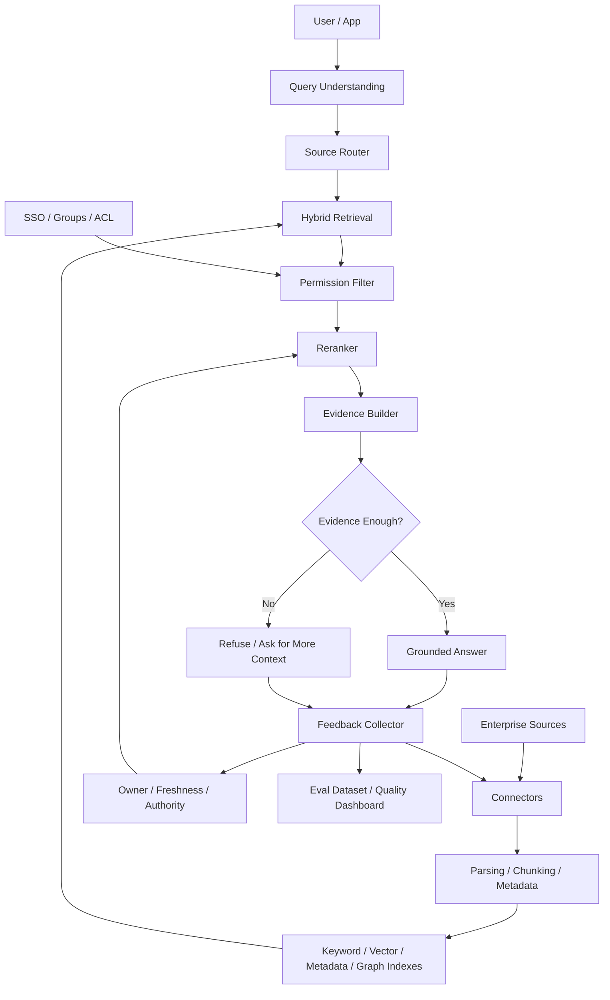

# 第18章 企业知识助手：RAG、搜索、权限与知识治理落地实践

> 企业知识助手不是“把文档丢进向量库”，而是一个带连接器、身份、权限、索引、证据、引用、反馈和治理闭环的知识操作系统。

## 引言

企业知识助手是 Agent 系统里最常见、也最容易被低估的落地形态。很多团队以为它的核心是 Embedding、向量数据库和一个 RAG Prompt，真正上线后才发现主要难点在别处：

- 数据源很多，格式、版本、权限和更新机制各不相同；
- 搜索结果必须严格遵守源系统权限，不能靠 prompt 提醒模型“不要泄露”；
- 文档过期、重复、冲突非常普遍，组织知识不是干净知识库；
- 用户需要答案，也需要证据、引用、口径和不确定性；
- 不同角色对同一个问题的可见范围不同，答案也必须不同；
- 反馈不能只变成“调 prompt”，而要能路由到连接器、索引、排序、权限、文档治理和生成策略；
- 企业上线需要审计、数据保留、SSO、SCIM、DLP、数据驻留和可追责机制。

Glean、Microsoft 365 Copilot、Perplexity Enterprise 这类系统的成熟之处，不是某个模型更强，而是把企业搜索、RAG、权限同步、引用证据、连接器生态、反馈治理和组织管理组合成完整系统。

本章按一个企业内部落地案例展开：假设我们要为一家中大型研发和运营组织建设“企业知识助手”。它需要接入 Confluence / SharePoint、Slack / Teams、Jira / Linear、GitHub、BI 报表和内部 Runbook，让员工可以安全地搜索、提问、分析和追溯证据。

这个案例的目标不是做一个“更会总结文档的聊天机器人”，而是落地一个可上线的知识工作台：

- 普通员工可以问流程、找 owner、查项目背景；
- 工程师可以查 runbook、事故复盘、代码 owner 和历史变更；
- 运营和产品可以跨 BI、工单、发布记录分析业务问题；
- 管理者可以查看知识质量、过期文档、反馈和使用效果；
- 安全与合规团队可以审计谁问了什么、答案引用了什么。

本章会从需求、架构、连接器、索引、权限、证据、生成、治理、评估和上线路线一层层拆解。重点不是介绍某个产品怎么用，而是回答：如果你要在公司里从 0 到 1 落地一个可靠的企业知识助手，应该如何设计和交付。

---

## 18.1 系统定位：从搜索框到知识工作台

在这个案例里，企业知识助手解决的不是“用户找不到文档”这么简单。它至少覆盖四个层次。

| 层次 | 用户问题 | 系统能力 | 风险 |
|:---|:---|:---|:---|
| Search | 这份文档在哪里？ | 跨系统检索、排序、权限过滤 | 搜不到、搜错、越权 |
| Answer | 这个问题的答案是什么？ | RAG、引用、摘要、冲突处理 | 编造、引用不支持结论 |
| Analysis | 为什么会这样？ | 多源证据聚合、口径对齐、时序分析 | 因果误判、证据不足 |
| Action | 下一步该做什么？ | 工具调用、任务创建、订阅指标、通知 owner | 越权执行、错误行动 |

传统企业搜索通常停留在 Search 层；成熟知识助手会进入 Answer、Analysis 和 Action 层。但越往后，系统越需要强证据、强权限、强审计。

### 典型用户工作流

```text
用户：为什么日本站订单取消率上周升高？

系统：
1. 识别问题类型：业务分析 + 时间范围 + 地区
2. 解析实体：JP、订单取消率、上周
3. 判断可用数据源：BI 报表、实验记录、客服工单、发布记录、事故记录
4. 权限过滤：只搜索和读取用户有权访问的内容
5. 证据聚合：指标变化、支付失败、物流异常、最近发布、客服投诉
6. 口径校验：不同系统的统计口径是否一致
7. 生成答案：结论、证据、引用、不确定性
8. 建议动作：创建分析任务、订阅指标、询问有权限同事补充证据
```

这类系统的核心不是一次问答，而是把组织知识转化为可操作判断。

### 企业知识助手与普通 RAG 的区别

| 维度 | 普通 RAG Demo | 企业知识助手 |
|:---|:---|:---|
| 数据源 | 一批文档或网页 | 多 SaaS、多内部系统、多结构化源 |
| 权限 | 通常忽略 | 用户、组、租户、空间、行列级权限 |
| 更新 | 手动重建索引 | 增量同步、删除传播、权限漂移修复 |
| 检索 | 向量 top-k | hybrid search、metadata、graph、rerank、freshness、authority |
| 输出 | 一段答案 | 结论、引用、证据、口径、不确定性、下一步 |
| 治理 | 看起来对就行 | eval、审计、DLP、SLO、owner、反馈闭环 |

所以，本章的主线不是“如何做一个 RAG”，而是“如何把企业知识作为一套受治理的运行系统”。

### 本案例的第一版边界

真实项目最怕一上来就做“公司大脑”。第一版需要克制。

| 范围 | 第一版做 | 第一版不做 |
|:---|:---|:---|
| 数据源 | Confluence / SharePoint、Jira、GitHub、BI dashboard | 全公司所有 SaaS |
| 权限 | SSO 用户、组、空间 / 项目级 ACL | 复杂行列级权限写操作 |
| 检索 | Hybrid Search、metadata filter、rerank | 全量知识图谱推理 |
| 答案 | Grounded Q&A、引用、缺失证据说明 | 自动执行高风险业务动作 |
| 治理 | connector health、query trace、反馈路由 | 完整知识治理平台 |

这个边界让项目可以在 6-10 周内交付一个可用版本，而不是陷入平台大而全。

---

## 18.2 端到端架构：两条链路和四个控制面

企业知识助手可以拆成两条主链路：

- **离线链路**：连接器、摄取、解析、权限同步、索引构建、质量检查；
- **在线链路**：查询理解、权限裁剪、检索编排、证据构建、答案生成、反馈记录。

```text
Offline Indexing Plane
  Data Sources
    │
    ▼
  Connectors
    ├─ content sync
    ├─ metadata sync
    ├─ ACL sync
    └─ deletion / update sync
    │
    ▼
  Document Processing
    ├─ parsing
    ├─ chunking
    ├─ entity extraction
    ├─ freshness / authority labeling
    └─ quality validation
    │
    ▼
  Indexes
    ├─ keyword index
    ├─ vector index
    ├─ metadata index
    ├─ permission index
    └─ knowledge graph

Online Serving Plane
  User Query
    │
    ▼
  Query Understanding
    ├─ intent
    ├─ entities
    ├─ time range
    ├─ source routing
    └─ access context
    │
    ▼
  Retrieval Orchestrator
    ├─ hybrid search
    ├─ metadata / ACL filtering
    ├─ reranking
    ├─ dedup
    └─ evidence selection
    │
    ▼
  Evidence Package
    ├─ facts
    ├─ citations
    ├─ conflicts
    ├─ gaps
    └─ confidence
    │
    ▼
  Answer Generator
    ├─ grounded answer
    ├─ uncertainty
    ├─ sources
    └─ next actions
```

这套架构旁边还需要四个控制面。

| 控制面 | 负责什么 | 典型问题 |
|:---|:---|:---|
| Identity & Permission | 用户、组、源系统 ACL、权限裁剪 | 谁能看什么？权限变更多久生效？ |
| Knowledge Governance | owner、文档生命周期、权威度、过期策略 | 哪些文档可信？过期知识如何降权？ |
| Quality & Eval | 检索、证据、生成、安全和业务指标 | 系统有没有真的帮用户解决问题？ |
| Audit & Compliance | 查询日志、引用日志、数据保留、DLP | 谁问了什么？答案基于哪些内容？ |

架构上最重要的一点是：**权限过滤和证据构建必须发生在答案生成之前**。模型不能看到用户无权访问的内容，也不能在无证据时编造答案。

---

## 18.3 连接器：企业知识助手的第一道护城河

成熟企业知识助手通常通过连接器接入各种数据源：

- 文档系统：Google Drive、SharePoint、Confluence、Notion、Box；
- 协作系统：Slack、Teams、邮件；
- 项目系统：Jira、Linear、GitHub、GitLab；
- 客服和 CRM：Zendesk、Salesforce、ServiceNow；
- BI 和数据平台：Tableau、Looker、内部报表、指标平台；
- 技术知识：代码仓库、Runbook、事故复盘、设计文档；
- 结构化系统：数据库、工单表、配置中心、CMDB。

连接器不只是“拉数据”。它至少要做八件事：

1. **内容同步**：拉取标题、正文、评论、附件、表格、代码块；
2. **结构解析**：保留标题层级、表格、链接、图片 OCR、引用关系；
3. **metadata 同步**：owner、source、space、project、updated_at、doc_type；
4. **权限同步**：用户、组、外部组、deny / grant、继承关系；
5. **删除传播**：源系统删除或撤权后，索引必须及时删除或隐藏；
6. **增量更新**：按变更时间、事件 webhook 或 cursor 递增同步；
7. **错误隔离**：某个连接器失败不能拖垮全局索引；
8. **质量报告**：同步延迟、失败率、权限缺失率、解析失败率。

### 连接器的数据契约

连接器输出最好是一种标准化 `KnowledgeItem`。

```json
{
  "item_id": "confluence:SPACE:12345",
  "source": "confluence",
  "source_url": "https://confluence.example.com/pages/12345",
  "title": "Payment Timeout Runbook",
  "body": "<document body>",
  "metadata": {
    "space": "PAY",
    "doc_type": "runbook",
    "owner": "payments-platform",
    "created_at": "2025-11-03T10:00:00Z",
    "updated_at": "2026-04-21T12:30:00Z",
    "language": "en",
    "authority": "official_runbook"
  },
  "acl": {
    "grants": [
      {"type": "group", "id": "payments-oncall"},
      {"type": "user", "id": "alice@example.com"}
    ],
    "denies": [
      {"type": "group", "id": "contractors"}
    ],
    "inheritance": "source_system"
  },
  "sync": {
    "version": "etag-abc",
    "deleted": false,
    "last_synced_at": "2026-05-06T09:00:00Z"
  }
}
```

这个契约有一个关键点：**权限和内容同等重要**。如果连接器只能同步正文，不能同步 ACL，它就不能直接进入企业知识助手的主索引。

### 权限同步比内容同步更难

企业搜索最怕的不是“搜不到”，而是“搜到了不该看的东西”。权限问题有很多坑：

| 问题 | 例子 | 设计要求 |
|:---|:---|:---|
| 组映射 | Confluence local group 不等于企业 SSO group | external group 映射 |
| deny 优先 | 文档对 Everyone 开放，但 deny 某个用户 | deny 必须优先于 grant |
| 继承权限 | 空间、目录、页面都有权限 | 同步有效权限或可计算权限 |
| 权限漂移 | 文档内容没变，但 ACL 变了 | ACL 单独增量同步 |
| 删除传播 | 源文档删除后索引仍可见 | tombstone 和 hard delete |
| 大组展开 | 一个组有几万成员 | 不要把组展开到每个 item |

查询时再结合用户身份做过滤：

```text
candidate_docs
  │
  ▼
permission_filter(user_id, groups, external_groups, tenant)
  │
  ▼
visible_docs
```

这意味着企业知识助手的检索系统必须同时处理“相关性”和“可见性”。

---

## 18.4 文档处理：Chunk 不是切字符串

文档处理决定 RAG 上限。企业知识库里的内容很脏：

- Confluence 页面包含嵌套表格、展开块、宏和过期链接；
- Google Docs 和 Word 文档有评论、修订、图片和表格；
- Slack / Teams 讨论是线程化和口语化的；
- Jira / Linear 工单有状态、owner、评论、附件和关联 issue；
- BI 报表有指标口径、筛选条件、更新时间和权限。

如果直接把这些内容转成纯文本再按长度切 chunk，会丢掉大量关键信息。

### Chunk 的四种单位

| 单位 | 用途 | 例子 |
|:---|:---|:---|
| 检索单位 | 用于召回 | 一段 runbook、一个 FAQ、一个 issue comment |
| 上下文单位 | 放进模型 | 召回片段 + 标题 + metadata + 邻近段落 |
| 引用单位 | 展示给用户 | 可点击文档位置、页面 anchor、issue comment |
| 权限单位 | ACL 裁剪 | 文档、页面、数据库行、工单字段 |

这四种单位不一定相同。比如一个文档级 ACL 可以覆盖多个 chunk；一个表格行可能是检索单位；引用时需要回到原页面和行号。

### 结构化解析优先于纯文本切分

更稳的处理流程是：

```text
Raw Document
  │
  ▼
Structured Parse
  ├─ headings
  ├─ paragraphs
  ├─ tables
  ├─ code blocks
  ├─ links
  ├─ comments
  └─ attachments
  │
  ▼
Semantic Blocks
  ├─ section
  ├─ table row group
  ├─ decision record
  ├─ incident timeline
  └─ FAQ pair
  │
  ▼
Indexable Chunks
```

表格尤其要小心。很多企业知识藏在表格里，例如接口字段、故障码、价格规则、审批矩阵。表格不能简单 flatten 成一坨文本，至少要保留表头、行号和单位。

### Freshness、Authority 与 Lifecycle

企业知识不是永久事实。每个 item 和 chunk 都应该带生命周期 metadata。

```yaml
freshness:
  updated_at: "2026-04-21"
  expires_at: "2026-07-21"
  stale_after_days: 90
authority:
  level: official_runbook
  owner: payments-platform
  verified_by: alice@example.com
lifecycle:
  status: active
  supersedes: ["confluence:PAY:998"]
  superseded_by: []
```

上线后常见的幻觉不是模型凭空编造，而是系统检索到过期文档，模型基于过期证据给出了“看起来有引用”的错误答案。

---

## 18.5 检索层：Hybrid Search 是默认选择

单纯向量检索不适合企业知识场景，因为企业问题经常包含精确实体：

- 工单号；
- 项目代号；
- 客户名；
- 服务名；
- 文档标题；
- 错误码；
- 表名和字段名；
- 指标名；
- 发布版本。

成熟系统通常使用 Hybrid Search：

```text
Query
  ├─ BM25 / Keyword Search
  ├─ Dense Vector Search
  ├─ Metadata Filter
  ├─ Graph Expansion
  ├─ Reranking
  └─ Freshness / Authority Scoring
```

### Query Understanding

检索前要先理解用户问题。

```json
{
  "raw_query": "为什么日本站订单取消率上周升高？",
  "intent": "business_root_cause_analysis",
  "entities": [
    {"type": "region", "value": "JP"},
    {"type": "metric", "value": "order_cancellation_rate"}
  ],
  "time_range": {
    "start": "2026-04-20",
    "end": "2026-04-27"
  },
  "source_hints": ["bi", "incident", "release_notes", "support_tickets"],
  "requires_fresh_data": true,
  "risk_level": "medium"
}
```

Query Understanding 的价值是把自然语言问题转成检索计划，而不是直接拿原句去向量库里搜。

### Source Routing

不同问题应该路由到不同知识源。

| 问题类型 | 优先源 | 不适合只查 |
|:---|:---|:---|
| “这个流程怎么做？” | Runbook、SOP、FAQ | Slack 讨论 |
| “这个指标为什么变了？” | BI、事故、发布、工单 | 静态文档 |
| “这个字段是什么意思？” | 数据字典、代码、schema | 邮件 |
| “谁负责这个系统？” | CMDB、owner registry、代码 CODEOWNERS | 旧文档 |
| “历史上怎么处理？” | 事故复盘、工单、on-call 记录 | 官方规范 |

Source Routing 能显著减少无关召回，也能降低成本。

### 排序信号

企业知识排序不能只看语义相似度，还要考虑：

| 信号 | 作用 |
|:---|:---|
| 语义相似度 | 找到主题相关内容 |
| 关键词匹配 | 保证精确实体不丢 |
| 更新时间 | 避免旧文档误导 |
| 权威度 | 官方文档高于聊天记录 |
| 用户关系 | 同团队、同项目内容更可能相关 |
| 点击和反馈 | 组织内部使用行为 |
| 引用链 | 被其他文档引用的内容更重要 |
| 任务意图 | 问 runbook 时优先 runbook，问事故时优先 incident |
| 权限稳定性 | 权限不完整的数据源应降权或隔离 |

### Freshness 与 Authority 的冲突

新文档不一定权威，权威文档也可能过期。系统需要显式处理：

```text
高权威 + 新鲜：优先引用
高权威 + 过期：引用但标记过期风险
低权威 + 新鲜：作为辅助证据
低权威 + 过期：默认降权
```

这比“取 top-k 文档”更接近真实企业搜索。

### Rerank 不只是相关性排序

企业场景的 reranker 可以拆成多阶段：

```text
Candidate Recall
  │
  ├─ ACL filter
  ├─ metadata filter
  ├─ source routing
  ▼
Rerank
  ├─ semantic relevance
  ├─ exact entity match
  ├─ freshness
  ├─ authority
  ├─ diversity
  └─ citation quality
```

注意顺序：权限过滤应该在模型看到内容之前完成。不要把无权限文档召回后再让模型“忽略它”。

---

## 18.6 Evidence Package：让答案有证据边界

RAG 的关键中间产物不应该是“拼接后的上下文”，而应该是 Evidence Package。

```json
{
  "question": "为什么日本站订单取消率上周升高？",
  "query_understanding": {
    "intent": "business_root_cause_analysis",
    "time_range": "2026-04-20/2026-04-27",
    "entities": ["JP", "order_cancellation_rate"]
  },
  "evidence": [
    {
      "id": "ev_001",
      "source": "bi://orders/cancellation_dashboard",
      "title": "JP Order Cancellation Dashboard",
      "claim": "JP cancellation rate increased from 2.1% to 4.8%.",
      "snippet": "Cancellation rate increased from 2.1% to 4.8% between Apr 20 and Apr 27.",
      "updated_at": "2026-04-28",
      "authority": "official_metric",
      "permission_checked": true,
      "citation": {
        "url": "bi://orders/cancellation_dashboard",
        "section": "JP weekly trend"
      }
    },
    {
      "id": "ev_002",
      "source": "jira://PAY-8842",
      "title": "Payment timeout increase in JP",
      "claim": "Payment timeouts increased after payment-router-v3 deploy.",
      "snippet": "Timeout errors increased after deploy payment-router-v3.",
      "updated_at": "2026-04-25",
      "authority": "incident_ticket",
      "permission_checked": true,
      "citation": {
        "url": "jira://PAY-8842",
        "section": "incident summary"
      }
    }
  ],
  "conflicts": [
    {
      "description": "Support weekly report says cancellation is stable.",
      "possible_reason": "Support report uses complaint time, BI uses order create time."
    }
  ],
  "gaps": [
    "No logistics dashboard access for current user."
  ],
  "confidence": "medium"
}
```

Evidence Package 有五个价值：

- 让模型只能基于证据回答；
- 让用户能追溯答案来源；
- 让评估系统能检查引用是否支持结论；
- 让权限审计知道答案使用了哪些内容；
- 让系统能在证据不足时拒答或请求补充权限。

### Evidence 不是 Chunk

Chunk 是检索材料，Evidence 是被系统选中、可支撑某个 claim 的证据。

| 维度 | Chunk | Evidence |
|:---|:---|:---|
| 来源 | 索引切片 | 经过筛选的候选 |
| 目标 | 提高召回 | 支撑答案 |
| 内容 | 可能只是相关文本 | 必须能表达事实或观点 |
| 权限 | 必须已过滤 | 必须可审计 |
| 评估 | recall / precision | citation support / claim support |

这也是企业知识助手和普通 RAG Demo 的分界线。

### 证据充分性检查

生成答案前，可以做一次 Evidence Sufficiency Check。

```text
问题：为什么日本站订单取消率上周升高？

必要证据：
- 指标是否确实升高？
- 时间窗口是否明确？
- 是否有候选原因？
- 候选原因是否和时间线对齐？
- 是否有反证？
- 是否说明缺失的数据源？
```

如果必要证据不足，系统应该输出“当前证据不足”，而不是让模型硬答。

---

## 18.7 答案生成：引用、冲突与不确定性

企业知识助手的回答应该避免“全知口吻”。它需要表达五种东西：

1. 结论；
2. 证据；
3. 引用；
4. 不确定性；
5. 下一步动作。

### 好的答案结构

```text
结论：
日本站订单取消率升高，最可能与 payment-router-v3 发布后的支付超时增加有关。

证据：
1. BI 报表显示取消率从 2.1% 升至 4.8%。
2. 支付工单 PAY-8842 显示 JP 支付超时在同一时间窗口上升。
3. 发布记录显示 payment-router-v3 在异常开始前 30 分钟上线。

不确定性：
我没有访问物流异常报表的权限，因此不能排除物流延迟因素。

建议：
1. 检查 payment-router-v3 的 JP 路由超时配置。
2. 让有权限的同事补充物流异常数据。
```

### 引用策略

引用不是装饰，而是答案可信度的接口。

| 引用类型 | 用途 | 要求 |
|:---|:---|:---|
| 文档引用 | 支撑流程、规则、背景 | 指向原文 section 或段落 |
| 工单引用 | 支撑事件、状态、owner | 指向 issue / comment |
| 指标引用 | 支撑数值和趋势 | 保留时间范围和筛选条件 |
| 代码引用 | 支撑实现行为 | 指向文件和行号 |
| 聊天引用 | 支撑非正式信息 | 标记低权威，不单独作为结论 |

引用链接打开时，仍应由源系统校验权限。不能因为答案里出现了引用，就绕过源系统访问控制。

### 冲突处理

当证据冲突时，不要让模型“平均一下”。应该显式输出：

```text
证据冲突：
- BI 报表显示取消率升高；
- 客服周报说取消率无明显变化；
- 两者统计口径不同：BI 按订单创建时间，客服按投诉时间。
```

这类回答比强行给结论更可信。

### 拒答也是产品能力

企业知识助手应该有拒答协议。

```text
我当前无法给出可靠结论，因为：
1. 没有可访问的物流异常数据；
2. 支付工单只有现象，没有根因确认；
3. 发布记录缺少 JP 分流配置。

可以继续做的事：
- 请求 logistics-dashboard 权限；
- 查询支付错误码按渠道分布；
- 找 payment-router-v3 的 owner 确认配置变更。
```

拒答不是失败。无证据自信回答才是失败。

---

## 18.8 企业权限模型：ACL、身份映射与安全裁剪

成熟系统必须把安全设计放在架构里，而不是放在提示词里。

### 身份上下文

```text
User Identity
  ├─ user_id
  ├─ email
  ├─ tenant
  ├─ groups
  ├─ external_groups
  ├─ department
  ├─ region
  └─ role
```

### 文档 ACL

```text
Document ACL
  ├─ grants
  │   ├─ users
  │   ├─ groups
  │   ├─ external_groups
  │   └─ domains
  ├─ denies
  │   ├─ users
  │   └─ groups
  └─ inheritance
```

系统必须保证：

- 检索阶段不返回无权文档；
- 生成阶段不注入无权内容；
- 引用链接打开时仍由源系统校验权限；
- 审计日志能追踪谁问了什么、引用了什么；
- 权限变更能增量同步；
- 源系统删除内容后，索引不可继续暴露。

### 安全裁剪的三种位置

| 位置 | 做法 | 风险 |
|:---|:---|:---|
| Pre-filter | 检索前把权限条件加入 query | 最安全，但需要权限索引强 |
| Mid-filter | 召回后、rerank 前过滤 | 可行，但无权候选不能进模型 |
| Post-filter | 生成后再删敏感内容 | 不可靠，不应作为主方案 |

企业知识助手应该优先使用 pre-filter 或 mid-filter。Post-filter 只能作为防御层，不能作为权限主机制。

### 权限泄露的常见路径

| 路径 | 例子 | 防护 |
|:---|:---|:---|
| 召回泄露 | 无权文档进入上下文 | ACL filter 前置 |
| 摘要泄露 | 老 session 里保留无权摘要 | session 权限重校验 |
| 引用泄露 | answer 显示敏感标题 | 标题也要权限过滤 |
| group 漂移 | 用户已离组但索引未更新 | ACL 增量同步和 TTL |
| connector token 过大 | 连接器用超级权限读取 | 最小权限和源侧审计 |
| 跨租户污染 | 多租户索引 filter 失效 | tenant_id 强制过滤 |

权限不是一个检索参数，而是企业知识助手的生命线。

---

## 18.9 知识治理：让组织知识持续可用

很多企业知识助手上线后，最大问题不是模型，而是知识本身质量差。

常见症状：

- 同一流程有三份文档，互相矛盾；
- runbook 三年没更新，但仍排在第一；
- Slack 里有最新结论，但没有沉淀到正式文档；
- owner 离职后文档无人维护；
- 文档标题很像，但适用地区、版本、业务线不同；
- 用户反馈“答案错了”，但没人负责修源文档。

### Knowledge Owner

每类知识应该有 owner。

| 知识类型 | Owner | 维护动作 |
|:---|:---|:---|
| Runbook | 服务 owner / on-call team | 定期验证、事故后更新 |
| 指标口径 | 数据团队 | schema 和定义变更同步 |
| 产品流程 | 产品运营 | 上线后更新和版本标记 |
| 技术设计 | 工程团队 | 架构变更后更新 |
| 客服 FAQ | 客服运营 | 基于问题频率更新 |

没有 owner 的知识，系统应该降权或标记为 unverified。

### 文档生命周期

```text
draft
  -> reviewed
  -> active
  -> stale
  -> deprecated
  -> archived
```

不同状态应该影响检索排序和答案语气：

- `active`：可以作为主要证据；
- `stale`：可以引用，但必须提示过期风险；
- `deprecated`：默认不引用，除非用户明确查历史；
- `archived`：只用于历史追溯。

### 知识修复闭环

用户反馈应该能路由到具体修复动作：

```text
wrong answer
  │
  ├─ retrieval missed source      -> improve connector / index / rerank
  ├─ citation not supporting      -> fix evidence selection
  ├─ source outdated              -> notify owner / mark stale
  ├─ permission issue             -> fix ACL sync
  ├─ conflicting documents        -> trigger governance review
  └─ generation overconfident     -> adjust answer protocol / eval
```

不要把所有问题都归因于 prompt。

---

## 18.10 反馈闭环与质量评估

企业知识助手的质量不能只看“用户点赞”。需要分层评估。

| 层次 | 指标 | 示例 |
|:---|:---|:---|
| 连接器 | sync latency、parse failure、ACL coverage | 文档和权限是否同步成功 |
| 检索 | Recall@k、MRR、NDCG、zero-result rate | 正确文档是否进入候选集 |
| 权限 | ACL violation rate、permission false negative | 是否越权或误拦 |
| 证据 | citation support、claim support、conflict detection | 结论是否被证据支持 |
| 生成 | groundedness、completeness、refusal quality | 是否在证据不足时停止 |
| 安全 | PII leak、secret leak、cross-tenant leak | 是否泄露敏感信息 |
| 业务 | time saved、task completion、follow-up rate | 是否减少人工查找成本 |

### Eval 数据集

企业知识助手至少需要几类 eval case：

| Case 类型 | 测什么 |
|:---|:---|
| Golden Q&A | 标准问题是否答对 |
| Known Source Retrieval | 指定问题是否召回正确文档 |
| Permission Boundary | 不同用户是否看到不同答案 |
| Conflict Cases | 证据冲突时是否说明冲突 |
| Stale Document Cases | 旧文档是否被降权或标记 |
| No Evidence Cases | 无证据时是否拒答 |
| Sensitive Data Cases | 是否泄露 secret、PII、薪酬等信息 |

### Trace 设计

每次查询都应该记录结构化 trace。

```json
{
  "query_id": "q_123",
  "user_hash": "user_abc",
  "intent": "business_root_cause_analysis",
  "sources_routed": ["bi", "jira", "release_notes"],
  "filters": {
    "tenant": "company_a",
    "groups_count": 12,
    "time_range": "2026-04-20/2026-04-27"
  },
  "retrieval": {
    "keyword_candidates": 42,
    "vector_candidates": 50,
    "visible_candidates": 31,
    "reranked": 10
  },
  "evidence_ids": ["ev_001", "ev_002"],
  "answer": {
    "refused": false,
    "confidence": "medium",
    "citations": 3
  },
  "latency_ms": 2480,
  "created_at": "2026-05-06T10:00:00Z"
}
```

trace 里不要存原始敏感内容，可以存引用、hash、artifact id 和脱敏摘要。

---

## 18.11 工程取舍

### 1. 答案速度 vs 证据完整性

搜索助手需要快，但企业决策需要证据。可以用分层响应：

```text
快速答案：先给初步结论和 3 条证据
深度分析：后台继续检索更多源，更新答案
```

但是，高风险场景不能为了速度牺牲证据。例如合规、财务、权限、生产事故根因分析，应该优先完整证据和人工确认。

### 2. 个性化 vs 信息茧房

个性化排序能提高命中率，但也可能让用户只看到本部门视角。关键问题需要跨源证据，而不是只取“最像用户平时点击的内容”。

### 3. 内部知识 vs 外部知识

内部知识有权限和上下文优势，外部知识有时效和广度优势。成熟系统需要标记来源类型：

```text
internal_verified
internal_unofficial
external_web
premium_data
user_uploaded
```

不同来源进入答案时应有不同置信度和引用方式。

### 4. 权限严格 vs 召回损失

权限过滤越严格，越可能漏掉用户“应该能看但同步失败”的内容。但这类问题不能靠放宽权限解决，应该通过 connector health、ACL coverage 和权限缺失反馈修复。

### 5. 单一索引 vs 多索引

单一索引简单，但很难处理权限、数据类型和排序差异。多索引更复杂，但适合企业场景：

| 索引 | 用途 |
|:---|:---|
| document index | 文档、页面、附件 |
| message index | Slack、Teams、邮件 |
| ticket index | Jira、Linear、Zendesk |
| metric index | 指标、报表、dashboard |
| code index | 代码、设计、owner |
| graph index | 人、系统、项目、文档关系 |

Retrieval Orchestrator 负责 source routing 和结果融合。

---

## 18.12 落地路线：从 MVP 到企业级

企业知识助手不要一开始就做“大一统公司大脑”。更现实的路线是：

### 第一阶段：Read-only Enterprise Search

- 接 2-3 个核心数据源；
- 同步 ACL；
- 做 hybrid search；
- 返回文档和片段，不生成复杂答案；
- 建立 connector health dashboard。

目标是证明“搜得准、搜得安全”。

### 第二阶段：Grounded Q&A

- 构建 Evidence Package；
- 支持引用和不确定性；
- 支持无证据拒答；
- 建立 golden Q&A eval；
- 记录 query trace。

目标是证明“答得有证据”。

### 第三阶段：Multi-source Analysis

- 支持 source routing；
- 接入 BI、工单、发布记录、事故复盘；
- 支持冲突检测和口径说明；
- 支持深度分析异步任务。

目标是从“文档问答”升级为“知识分析”。

### 第四阶段：Action Assistant

- 支持创建工单、订阅指标、通知 owner；
- 工具分风险等级；
- 高风险动作必须审批；
- 审计日志和 DLP 完整接入。

目标是从“给答案”升级为“辅助行动”。

### 第五阶段：Knowledge Governance Platform

- owner 工作台；
- 过期文档提醒；
- 冲突文档治理；
- 用户反馈路由；
- eval 和质量报表进入团队治理。

目标是让知识质量持续改善，而不是靠一次性索引工程。

---

## 18.13 参考架构：企业知识助手控制面



这张图的重点是闭环：不是 query 进来、answer 出去就结束。反馈、评估、文档治理和连接器质量会反过来影响下一次检索和答案生成。

---

## 18.14 面试表达与设计清单

如果面试官问“如何设计一个企业知识助手”，不要只说“向量数据库 + RAG”。

可以这样表达：

> 我会把企业知识助手设计成一个受权限和证据约束的知识操作系统。离线侧通过连接器同步内容、metadata、ACL 和删除事件，经过结构化解析、chunk、embedding、keyword index、metadata index 和 graph index 建立可检索知识层。在线侧先做 query understanding 和 source routing，再做 hybrid retrieval、权限裁剪、rerank、dedup 和 Evidence Package 构建。模型只基于 evidence 生成答案，并必须输出引用、不确定性和缺失证据。生产上还需要 connector health、ACL violation eval、citation support eval、query trace、反馈路由、文档 owner 和过期治理。

### 设计清单

- 是否同步源系统 ACL，而不是只同步内容？
- 是否支持 external group、deny 优先和权限增量更新？
- 是否在模型看到内容之前完成权限过滤？
- 是否保留文档结构、表格、链接、评论和 metadata？
- 是否区分检索单位、上下文单位、引用单位和权限单位？
- 是否使用 hybrid search，而不是只用向量 top-k？
- 是否有 source routing 和 query understanding？
- 是否有 freshness、authority、owner 和 lifecycle metadata？
- 是否构造 Evidence Package，而不是直接拼接 chunk？
- 是否支持冲突证据和无证据拒答？
- 是否记录 query trace、retrieval trace 和 citation trace？
- 是否有权限越界、引用支持率、过期文档、无证据拒答等 eval？
- 用户反馈是否能路由到连接器、索引、rerank、权限、文档治理和生成策略？
- 高风险 action 是否需要审批和审计？

---

## 本章小结

企业知识助手的成熟度，不取决于向量库有多先进，而取决于它是否把知识系统当成工程系统来治理：

- 数据源需要连接器；
- 内容需要结构化解析；
- 权限需要同步和前置过滤；
- 检索需要 hybrid search、metadata、graph 和 rerank；
- 答案需要 Evidence Package、引用、冲突处理和不确定性；
- 反馈需要路由到正确的系统层；
- 质量需要 eval、trace 和治理闭环；
- 企业上线需要身份、审计、DLP、数据保留和 owner 机制。

一句话总结：

> 企业知识助手的核心不是“让模型知道更多”，而是“让模型只基于用户有权访问、足够新鲜、可被引用、可被审计的证据回答”。

---

## 参考资料

1. [Glean Connectors - Glean Docs](https://docs.glean.com/connectors/about)
2. [Microsoft 365 Copilot Connectors API Overview - Microsoft Learn](https://learn.microsoft.com/en-us/graph/connecting-external-content-connectors-api-overview)
3. [Create, update, and delete items in a Microsoft Graph connection - Microsoft Learn](https://learn.microsoft.com/en-us/graph/connecting-external-content-manage-items)
4. [Use external groups to manage permissions to Microsoft 365 Copilot connectors data sources - Microsoft Learn](https://learn.microsoft.com/en-us/graph/connecting-external-content-external-groups)
5. [Hybrid search using vectors and full text in Azure AI Search - Microsoft Learn](https://learn.microsoft.com/en-us/azure/search/hybrid-search-overview)
6. [Semantic ranking in Azure AI Search - Microsoft Learn](https://learn.microsoft.com/en-us/azure/search/semantic-search-overview)
