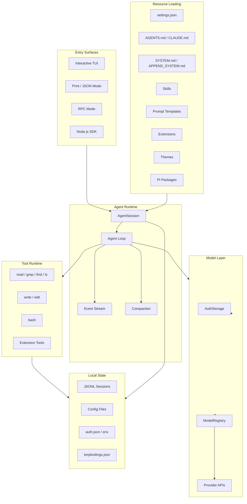
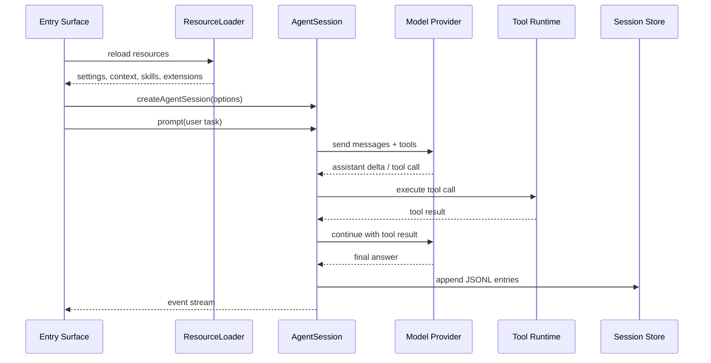
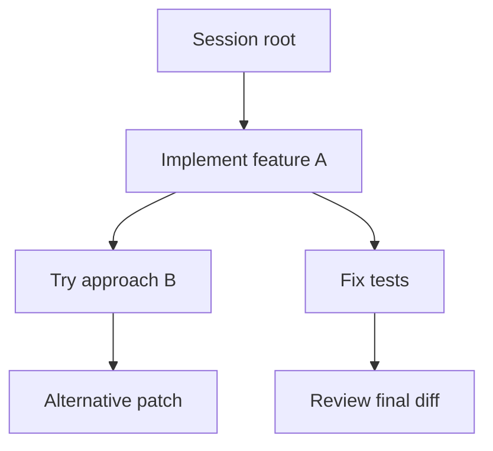

# 第14章 Pi Agent 架构解析：终端原生 Coding Agent Runtime、扩展系统与上下文工程

> Pi 的核心价值不是“又一个命令行聊天工具”，而是把 Coding Agent 做成一个小内核、强扩展、可嵌入、可定制的终端原生 Agent Runtime：模型调用、工具执行、上下文构建、会话树、扩展系统、Skills、Prompt Templates 和 SDK 都围绕一个可复用的 harness 展开。

## 引言

第 13 章已经从 Claude Code、Cursor、Codex 这类成熟产品出发，拆解了 AI Coding Agent 的系统设计模式。本章继续往下挖一层：如果不从“产品界面”看，而是从“Agent Runtime”看，一个终端原生 Coding Agent 应该怎样组织？

Pi 是一个很好的观察对象。它的官方定位是 minimal terminal coding harness：核心保持很小，通过 TypeScript extensions、skills、prompt templates、themes、packages 和 SDK 扩展能力。它可以直接作为 CLI 使用，也可以通过 JSON / RPC / SDK 被其他系统集成。OpenClaw 的 Agent Runtime 就是一个典型例子：OpenClaw 没有把 Pi 当作子进程启动，而是通过 SDK 直接创建 `AgentSession`，再把自己的消息渠道、工具、沙箱和会话管理接进去。

如果把 Pi 看成“终端里的 AI 编程助手”，会低估它的工程价值。更准确的理解是：

```text
Pi = Terminal-native Coding Agent Runtime
   + Resource Discovery System
   + Tool Execution Harness
   + Extension Host
   + Skill / Prompt / Package Ecosystem
   + Session Tree and Compaction
   + Embeddable SDK
```

本章目标是回答八个问题：

1. Pi 为什么选择“小内核 + 强扩展”的设计？
2. 一个 `AgentSession` 从创建到完成，经过哪些运行时阶段？
3. Pi 如何加载项目上下文、全局规则、Skills、Prompt Templates 和 Extensions？
4. `read`、`write`、`edit`、`bash` 这类工具背后对应怎样的权限边界？
5. TypeScript Extension 为什么是 Pi 的关键扩展机制？
6. SDK 嵌入和 CLI 子进程集成有什么本质差异？
7. OpenClaw 为什么选择直接嵌入 Pi？
8. 如果自研一个 Pi-like Coding Agent Runtime，最小可行架构是什么？

本文基于 2026 年 5 月 6 日可访问的 Pi 官方文档、Pi SDK 文档和 OpenClaw 的 Pi 集成文档进行分析。Pi 仍在快速演进，具体命令、配置项和包版本以后可能变化，但它背后的 harness engineering 思路非常值得长期学习。

---

## 14.1 系统定位：从 CLI Assistant 到 Coding Agent Harness

很多终端 AI 工具的起点是：

```text
User Prompt -> LLM API -> Text Reply
```

这个形态只能算“终端聊天”。Coding Agent 的复杂度来自另一组问题：

- 模型需要安全地读写仓库文件；
- Shell 输出要进入上下文，但不能无限膨胀；
- 项目规则、全局偏好和临时任务约束要同时生效；
- 多轮会话要能恢复、分叉、压缩和导出；
- 工具调用要可观察、可拦截、可扩展；
- 第三方能力要能以插件、技能或包的形式分发；
- 运行时要能被 IDE、聊天 Gateway、CI pipeline 或自研平台嵌入。

Pi 的答案不是把所有能力写进核心，而是把核心压缩成一个可扩展 harness。

```text
传统 CLI Assistant
  关注：输入一段话，输出一段话
  边界：Prompt + Model + stdout

Pi-style Coding Harness
  关注：让模型在项目目录中可控行动
  边界：Context + Tools + Sessions + Extensions + SDK
```

这也是 Pi 和普通“命令行聊天壳”的本质区别。它不是给模型套一个 TUI，而是把 Coding Agent 的关键运行时部件做成可组合的系统。

### 小内核意味着什么

小内核不是功能少，而是核心职责克制。Pi 的核心要稳定承担这些事情：

| 核心能力 | 说明 |
|:---|:---|
| Agent Loop | 接收用户任务，调用模型，执行工具，继续下一轮 |
| Tool Runtime | 暴露结构化工具，执行文件和 Shell 相关操作 |
| Resource Loading | 发现上下文文件、Skills、Prompts、Extensions、Themes |
| Session Management | 保存、恢复、分叉、浏览和压缩会话 |
| Model Abstraction | 管理 provider、model、auth、thinking level |
| Event Stream | 对 TUI、JSON、RPC、SDK 暴露运行事件 |
| Extension Host | 允许外部代码注册工具、命令、事件处理器和 UI |

它不直接解决所有产品问题：

- 不内置企业权限系统；
- 不内置复杂 IDE 语义索引；
- 不内置多用户租户隔离；
- 不把所有业务工作流写成内置命令；
- 不假设唯一入口是终端。

这使 Pi 可以同时适配三类场景：

1. **个人终端 Agent**：开发者在仓库目录里直接运行 `pi`。
2. **自动化 Agent Runtime**：脚本、CI、评测系统用非交互模式调用。
3. **嵌入式 Agent 内核**：OpenClaw 这类系统用 SDK 嵌入 Pi 的 session、tool 和 event 能力。

### Harness 的边界

一个成熟 Coding Agent Harness 至少要定义五个边界：

| 边界 | 需要回答的问题 |
|:---|:---|
| Context Boundary | 模型本轮能看到什么？哪些信息只是候选资源？ |
| Action Boundary | 模型能调用哪些工具？工具有什么参数和权限限制？ |
| Persistence Boundary | 哪些内容写入 session？哪些只是本轮临时输入？ |
| Extension Boundary | 外部扩展能改变什么？能否执行任意代码？ |
| Integration Boundary | 外部系统如何驱动 agent、订阅事件、接管工具？ |

Pi 的设计价值在于，它把这些边界都变成了一等公民。

---

## 14.2 总体架构

Pi 可以抽象成七层：



### 分层职责

| 层 | 职责 | 关键设计 |
|:---|:---|:---|
| Entry Surfaces | 提供交互式、非交互式、RPC、SDK 入口 | 同一运行时，多种使用形态 |
| Agent Runtime | 管理 `AgentSession`、Agent Loop、事件和压缩 | 把模型调用和工具调用串成可恢复过程 |
| Resource Loading | 加载上下文、技能、模板、扩展和主题 | 资源发现优先级清晰，支持全局和项目级 |
| Model Layer | 管理 provider、model、auth 和 thinking level | provider-agnostic，模型可切换 |
| Tool Runtime | 暴露读写文件、编辑、Shell 和自定义工具 | 工具是行动边界，不是普通函数 |
| Local State | 保存配置、凭据、session、keybindings | 终端原生，本地优先 |
| Extension Host | 让外部代码扩展工具、事件、命令和 UI | 小核心可持续演进的关键 |

Pi 最值得学习的地方，是它把“终端体验”和“Agent Runtime”解耦了。TUI 只是一个入口；真正可复用的是 `AgentSession`、资源加载、工具运行、模型抽象和事件流。

---

## 14.3 运行形态：同一个 Runtime，多种入口

Pi 不是只有一种启动方式。它至少支持四类运行形态。

| 运行形态 | 典型用法 | 适用场景 |
|:---|:---|:---|
| Interactive TUI | 在项目目录运行 `pi` | 日常开发、调试、结对编程 |
| Print Mode | `pi -p "Summarize this codebase"` | 一次性任务、脚本调用 |
| JSON Event Stream | `--mode json` | 自动化系统需要结构化事件 |
| RPC Mode | `--mode rpc` | 进程级集成，外部程序驱动 |
| SDK | `createAgentSession()` | 嵌入 Web、桌面、Gateway、CI、评测平台 |

### Interactive TUI

交互式 TUI 是最接近用户的入口。用户可以：

- 输入自然语言任务；
- 通过 `@file` 引用文件；
- 用 `!command` 把 Shell 输出带入上下文；
- 使用 `/model` 切换模型；
- 使用 `/resume`、`/new`、`/tree`、`/fork`、`/clone` 管理会话；
- 通过 `/reload` 重新加载资源；
- 使用 prompt templates 形成 slash command。

但从系统设计角度看，TUI 不应该承担太多业务逻辑。TUI 的职责是把用户输入、键盘事件、模型流式输出、工具事件和自定义 UI 渲染出来。

```text
TUI = input editor
    + event renderer
    + command palette
    + session navigator
    + extension UI surface
```

真正的 Agent 能力在 Runtime 层。

### Print / JSON / RPC

非交互模式解决的是自动化和集成问题：

```bash
pi -p "Summarize this repository and tell me how to run tests."
cat README.md | pi -p "Summarize this text."
pi --mode json -p "Review this diff."
pi --mode rpc
```

这里的关键不是“能不能无界面运行”，而是：**Agent 运行过程能否被机器消费**。

普通 stdout 只适合人看。JSON event stream 和 RPC 则可以让外部系统拿到：

- message start / update / end；
- tool execution start / update / end；
- agent start / end；
- compaction start / end；
- error 和 interrupt；
- session id、run id、tool call id。

这为自动评测、任务队列、CI bot、审计系统和可视化控制台提供了接口。

### SDK

SDK 是 Pi 架构里最有生产价值的入口。它让外部系统直接创建 `AgentSession`，而不是把 Pi 当作黑盒进程：

```ts
import {
  AuthStorage,
  createAgentSession,
  ModelRegistry,
  SessionManager,
} from "@mariozechner/pi-coding-agent";

const authStorage = AuthStorage.create();
const modelRegistry = ModelRegistry.create(authStorage);

const { session } = await createAgentSession({
  sessionManager: SessionManager.inMemory(),
  authStorage,
  modelRegistry,
});

session.subscribe((event) => {
  if (
    event.type === "message_update" &&
    event.assistantMessageEvent.type === "text_delta"
  ) {
    process.stdout.write(event.assistantMessageEvent.delta);
  }
});

await session.prompt("What files are in the current directory?");
```

这个接口说明 Pi 的核心抽象不是 `pi` 命令，而是 `AgentSession`。

---

## 14.4 AgentSession：运行时的最小闭环

`AgentSession` 可以理解为一次可持续对话和行动过程的运行容器。它不是单次 LLM call，也不是简单消息数组，而是把模型、上下文、工具、事件和持久化连接起来的对象。

一个典型 `AgentSession` 生命周期如下：



### Session 不是 Chat History

很多原型会把 session 简化成：

```json
[
  {"role": "user", "content": "..."},
  {"role": "assistant", "content": "..."}
]
```

这对普通聊天够用，但对 Coding Agent 不够。一个 Coding Agent session 至少要记录：

- 用户消息；
- assistant 文本和推理流；
- 工具调用；
- 工具结果；
- 文件引用；
- 图片输入；
- 压缩摘要；
- 分支关系；
- 模型和 provider；
- 扩展注入的上下文；
- 错误和中断。

所以 Pi 使用 JSONL session 文件是一种自然选择：每个事件或消息追加一行，便于流式写入、恢复、浏览和导出。

### Event Stream 是 Runtime 的可观测接口

一个成熟 Agent Runtime 不应该只在最后返回文本。它应该在运行中持续发出事件：

| 事件类型 | 意义 |
|:---|:---|
| `agent_start` / `agent_end` | 一次用户 prompt 的生命周期 |
| `turn_start` / `turn_end` | 一轮模型调用和工具执行的生命周期 |
| `message_start` / `message_update` / `message_end` | assistant 文本和思考流 |
| `tool_execution_start` | 工具开始执行 |
| `tool_execution_update` | 工具执行过程更新 |
| `tool_execution_end` | 工具执行完成 |
| `compaction_start` / `compaction_end` | 上下文压缩发生 |

事件流有三个价值：

1. **UI 渲染**：TUI 可以实时展示模型输出和工具状态。
2. **外部集成**：SDK、RPC、JSON mode 可以把事件交给上层系统。
3. **生产诊断**：失败后能看到模型什么时候决定调用什么工具、工具返回了什么、压缩发生在哪里。

第 19 章实现可观测 Coding Agent lab 时，也会复用这个思想：不要只存最终回答，要记录每一轮决策和工具执行。

---

## 14.5 从 `~/.pi/agent` 反推终端原生 Runtime

第 13 章我们已经从 `~/.codex` 和 `~/.claude` 目录反推过终端原生 Agent Runtime。Pi 的目录约定也能透露出类似架构。

Pi 的全局配置目录默认是：

```text
~/.pi/agent/
```

项目级配置通常在：

```text
.pi/
.agents/
AGENTS.md
CLAUDE.md
```

从这些目录可以反推出 Pi 至少管理几类资源。

| 资源 | 典型位置 | 系统含义 |
|:---|:---|:---|
| 全局指令 | `~/.pi/agent/AGENTS.md` | 用户跨项目偏好和安全规则 |
| 项目指令 | `AGENTS.md`、`CLAUDE.md` | 仓库级工作协议 |
| 系统提示 | `.pi/SYSTEM.md`、`~/.pi/agent/SYSTEM.md` | 替换默认 system prompt |
| 附加提示 | `APPEND_SYSTEM.md` | 在默认 prompt 后追加规则 |
| Settings | `settings.json`、`.pi/settings.json` | 模型、UI、资源路径等配置 |
| Auth | `auth.json` 或环境变量 | provider 凭据 |
| Keybindings | `keybindings.json` | 终端交互层自定义 |
| Skills | `skills/`、`.agents/skills/` | 可按需加载的能力包 |
| Prompts | `prompts/*.md` | slash command 模板 |
| Extensions | `extensions/*.ts` | 运行时代码扩展 |
| Themes | `themes/*.json` | TUI 主题 |
| Sessions | session JSONL | 会话、分支和历史 |

### 这个目录不是“配置杂物间”

成熟终端 Agent 的本地目录通常会长成这样，不是偶然：

```text
agent-home/
  auth.json
  settings.json
  keybindings.json
  AGENTS.md
  SYSTEM.md
  APPEND_SYSTEM.md
  skills/
  prompts/
  extensions/
  themes/
  sessions/
```

每一类文件都对应一个运行时问题：

- `auth.json` 解决模型 provider 凭据；
- `settings.json` 解决默认模型、thinking level、UI 和发现规则；
- `AGENTS.md` 解决长期行为约束；
- `SYSTEM.md` 解决默认 agent 身份；
- `skills/` 解决复杂能力的渐进加载；
- `prompts/` 解决重复工作流的入口；
- `extensions/` 解决运行时代码扩展；
- `sessions/` 解决持久会话和恢复。

这类目录结构的本质是：**把 Agent Runtime 的控制面落到本地文件系统**。

### 全局和项目级的优先级

Pi 的资源发现同时支持全局和项目级：

```text
Global scope:
  ~/.pi/agent/AGENTS.md
  ~/.pi/agent/settings.json
  ~/.pi/agent/skills/
  ~/.pi/agent/prompts/
  ~/.pi/agent/extensions/

Project scope:
  AGENTS.md / CLAUDE.md
  .pi/settings.json
  .pi/skills/
  .agents/skills/
  .pi/prompts/
  .pi/extensions/
```

这种分层很关键。全局规则适合放：

- 回答风格；
- 默认安全边界；
- 用户偏好；
- 常用 skills；
- 常用 prompt templates。

项目规则适合放：

- 构建命令；
- 测试命令；
- 代码风格；
- 不可触碰目录；
- 发布约束；
- 项目特有工具链。

如果这两层混在一起，Agent 很快会变得不可控：跨项目规则污染本项目，本项目规则又被误用到其他仓库。

---

## 14.6 ResourceLoader：上下文不是拼字符串

Pi SDK 文档里一个很重要的对象是 `DefaultResourceLoader`。它负责从 `cwd` 和 `agentDir` 发现 resources，并交给 `createAgentSession()` 使用。

这说明 Pi 对上下文的理解不是“把几段文本拼进 prompt”，而是一个资源加载过程：

```text
cwd + agentDir
  │
  ├─ discover context files
  ├─ discover settings
  ├─ discover skills
  ├─ discover prompt templates
  ├─ discover extensions
  ├─ discover themes
  └─ build system prompt options
```

### Context Files

Pi 会加载上下文文件：

- 全局 `~/.pi/agent/AGENTS.md`；
- 从当前目录往父目录查找的 `AGENTS.md`；
- 兼容的 `CLAUDE.md`；
- 可选禁用的 context files。

这和我们在本书一直强调的 Context Engineering 一致：上下文不是越多越好，而是要分层、可解释、可覆盖。

```text
Global Instructions
  + Repository Instructions
  + Subdirectory Instructions
  + User Prompt
  + Mentioned Files
  + Tool Results
  + Skill Details
  + Extension Messages
```

### System Prompt Files

Pi 支持用 `SYSTEM.md` 替换默认 system prompt，也支持用 `APPEND_SYSTEM.md` 追加内容。

这给了高级用户两种不同控制粒度：

| 文件 | 语义 | 风险 |
|:---|:---|:---|
| `SYSTEM.md` | 替换默认 Agent 身份和行为协议 | 可能破坏内置工具约定 |
| `APPEND_SYSTEM.md` | 在默认 prompt 后追加项目规则 | 更适合大多数项目 |

工程上，直接替换 system prompt 很强，也很危险。因为成熟 Coding Agent 的默认 prompt 往往包含：

- 工具调用规则；
- 文件编辑约束；
- 安全提醒；
- 输出格式；
- 上下文来源说明；
- 模型能力边界；
- 与 TUI / Runtime 协作的隐藏约定。

因此，生产实践里更推荐优先使用 `AGENTS.md` 或 `APPEND_SYSTEM.md`，只有在确实要重定义 agent 行为时才替换 `SYSTEM.md`。

### Skills 的渐进披露

Pi 实现 Agent Skills 标准。Skill 不是每次都把所有文档塞进 prompt，而是先在系统提示里暴露名称和描述；当任务匹配时，模型再读取完整 `SKILL.md`。

这个机制解决了两个矛盾：

1. Agent 需要知道有哪些能力可用；
2. Agent 不能把所有能力文档一次性塞进上下文。

可以把 Skills 理解为：

```text
Skill Index in Prompt
  name + description
      │
      ▼
Model decides skill is relevant
      │
      ▼
read full SKILL.md
      │
      ▼
use scripts / references / assets
```

这就是 progressive disclosure。它比“把所有知识库都塞进上下文”更适合 Coding Agent，因为编程任务经常需要专门工作流，比如：

- 写浏览器自动化；
- 修改 Word / PPT / Excel；
- 调日志平台；
- 生成图；
- 请求代码审查；
- 做验证清单。

这些能力的说明可能很长，但只有在匹配任务时才需要加载。

### Prompt Templates

Prompt templates 则解决另一个问题：重复工作流的入口。

一个模板可以类似这样：

```markdown
---
description: Review staged git changes
argument-hint: [focus area]
---

Review the staged changes using `git diff --cached`.

Focus on:

- Bugs and logic errors
- Security issues
- Missing tests
- Behavioral regressions
```

模板文件名会变成命令名，比如 `review.md` 可以变成 `/review`。

和 Skills 相比：

| 机制 | 适合解决 |
|:---|:---|
| Prompt Template | 重复 prompt、固定任务入口、slash command |
| Skill | 专门能力、长说明、辅助脚本、参考文档 |
| Extension | 需要执行代码、注册工具、拦截事件、定制 UI |

这三者分开，是 Pi 扩展模型最重要的清晰性之一。

---

## 14.7 Tool Runtime：工具是能力边界

Pi 默认给模型的核心工具很克制：

- `read`：读取文件；
- `write`：创建或覆盖文件；
- `edit`：修改文件；
- `bash`：运行 Shell 命令。

一些只读工具，例如 `grep`、`find`、`ls`，可以通过工具选项启用。

这组工具看起来很小，但已经覆盖了 Coding Agent 的最小行动空间：

```text
Observe:
  read / grep / find / ls / bash readonly commands

Act:
  write / edit / bash side-effect commands

Verify:
  bash test commands / lint commands / build commands
```

### read、write、edit、bash 的风险并不相同

一个常见错误是把工具权限简化成“允许 agent 修改代码”。实际应该拆得更细。

| 工具 | 风险等级 | 主要风险 |
|:---|:---|:---|
| `read` | 低到中 | 读取敏感文件、把 secret 放进模型上下文 |
| `grep` / `find` / `ls` | 低到中 | 扫描过大目录、泄漏路径结构 |
| `write` | 高 | 覆盖用户文件、破坏未提交改动 |
| `edit` | 高 | 错误 patch、误改无关文件 |
| `bash` | 很高 | 删除文件、联网、执行恶意脚本、泄漏凭据 |

因此，生产级 Coding Agent Harness 需要区分三层权限：

```text
Read Plane:
  file read, search, list

Write Plane:
  create, edit, patch

Execution Plane:
  shell, test, package manager, external tools
```

第 19 章的 lab 里会把 `auto_edit` 和 `auto_shell` 分开，也是同一个思想：文件编辑和命令执行的风险不同，审批策略也应该不同。

### Tool Result 也是上下文

工具结果不是日志垃圾，而是下一轮模型决策的证据。

```text
Tool Call:
  bash("npm test")

Tool Result:
  exit_code: 1
  stdout: ...
  stderr: ...
  duration_ms: 18234

Next LLM Turn:
  "Tests failed because ..."
```

一个成熟 Tool Runtime 应该控制：

- 输出截断；
- binary / image / large file 处理；
- secret masking；
- exit code；
- timeout；
- cwd；
- environment；
- command allowlist / denylist；
- 是否把输出写入 session；
- 是否把输出传给模型。

如果这层没有设计，Agent 会出现两个极端：

1. 输出太少，模型不知道发生了什么；
2. 输出太多，上下文窗口被日志淹没。

### Bash 不是一个工具，而是一组能力

`bash` 是 Coding Agent 最危险、也最强的工具。它可能代表：

- 查询状态：`git status`；
- 运行测试：`npm test`；
- 构建项目：`npm run build`；
- 修改文件：`sed -i`；
- 安装依赖：`npm install`；
- 删除文件：`rm`；
- 网络访问：`curl`；
- 启动服务：`npm run dev`。

把这些都放进一个 `bash` 工具后，必须用策略层补回来：

```text
Command Classifier
  │
  ├─ readonly: git status, rg, ls, cat, pwd
  ├─ safe write: mkdir, cp within workspace
  ├─ verification: npm test, cargo test, go test
  ├─ network: npm install, curl, git pull
  └─ destructive: rm, sudo, chmod, docker prune
```

Pi 的核心文档强调默认工具很小；真正生产化时，工具策略要由 harness、extension 或上层系统共同承担。OpenClaw 嵌入 Pi 后，也会在自己的沙箱、channel 和 gateway 语义下重新接管部分工具策略。

---

## 14.8 Extension Host：Pi 最关键的扩展边界

如果只支持 Skills 和 Prompt Templates，Pi 仍然只是一个可定制 prompt 的工具。真正让它变成 harness 的，是 TypeScript extensions。

Pi extension 可以做几类事情：

- 注册自定义工具；
- 订阅生命周期事件；
- 拦截或修改工具调用；
- 注入上下文；
- 定制 compaction；
- 注册命令；
- 添加 TUI 自定义组件；
- 注册快捷键；
- 注册 CLI flag；
- 自定义消息渲染。

这意味着扩展不是“提示词片段”，而是运行时代码。

### 注册工具

一个企业内部 extension 可以把公司工具接进 Pi：

```ts
pi.registerTool({
  name: "search_runbook",
  description: "Search internal runbooks by keyword.",
  parameters: {
    type: "object",
    properties: {
      query: { type: "string" },
      service: { type: "string" },
    },
    required: ["query"],
  },
  handler: async ({ query, service }) => {
    return await searchRunbook({ query, service });
  },
});
```

这类工具和内置 `read`、`bash` 的地位一样，都会成为模型可调用的行动。

### 拦截事件

Extension 可以监听 agent 生命周期，例如在 agent 启动前追加上下文：

```ts
pi.on("before_agent_start", async (event, ctx) => {
  const service = await detectCurrentService(ctx.cwd);

  return {
    message: {
      customType: "service-context",
      content: `Current service: ${service.name}`,
      display: true,
    },
    systemPrompt:
      event.systemPrompt +
      "\n\nWhen editing this service, always run its focused test target.",
  };
});
```

这类能力非常强，因为它能改变模型本轮看到的系统提示和上下文。

### 自定义 UI

Extension 还可以通过 `ctx.ui` 与用户交互：

```ts
pi.registerCommand("deploy-check", {
  description: "Run deployment readiness checks.",
  handler: async (ctx) => {
    const env = await ctx.ui.select("Environment", ["staging", "prod"]);
    const confirmed = await ctx.ui.confirm(`Run checks for ${env}?`);

    if (!confirmed) {
      ctx.ui.notify("Cancelled.");
      return;
    }

    await ctx.runTool("bash", { command: `npm run check:${env}` });
  },
});
```

这说明 Pi 的 TUI 不只是文本显示器，而是可以成为 extension 的交互面。

### Extension 的安全含义

Extension 是代码，代码就有权限。安装一个恶意 extension，本质上类似在本机运行一个 npm 包。

所以 Pi Packages 文档会强调：packages 和 extensions 可能以完整系统权限运行，安装第三方包前必须审查源码。

在生产环境中，extension 应该遵守几条规则：

- 来源必须可信；
- 版本必须 pin 住；
- 安装和更新要审计；
- 不要把 secret 写进 prompt；
- 外部请求要有 allowlist；
- destructive tool 要有人工确认；
- 企业环境应区分个人 extension 和组织批准 extension。

这也是为什么“扩展能力”和“安全边界”必须一起讨论。强扩展是 Pi 的优势，也是它最需要治理的地方。

---

## 14.9 Skills、Prompts、Packages：扩展生态的三种颗粒度

Pi 的扩展生态不是只有 extensions。它至少有四类资源：

| 资源 | 形态 | 主要用途 | 风险 |
|:---|:---|:---|:---|
| Skills | `SKILL.md` + scripts / references / assets | 复杂能力和工作流 | Prompt injection、脚本执行 |
| Prompt Templates | `.md` 模板 | 重复任务入口 | 低到中 |
| Extensions | TypeScript / JavaScript | 运行时代码扩展 | 高 |
| Packages | npm / git 分发的资源包 | 分发一组 skills、prompts、extensions、themes | 取决于内容 |

### Skills：能力包

一个成熟 Skill 不应该只是“提醒模型做某事”。它应该包含：

```text
skill-name/
  SKILL.md
  scripts/
  references/
  assets/
```

`SKILL.md` 负责告诉 Agent：

- 什么时候使用；
- 使用前要确认什么；
- 需要读取哪些参考资料；
- 可运行哪些脚本；
- 输出格式是什么；
- 常见错误如何处理。

这和第 6 章的 Skills 设计完全一致：Skill 是可复用程序性记忆，不是长 prompt。

### Prompt Templates：命令化入口

Prompt Template 更像一个轻量 command：

```text
prompts/
  review.md       -> /review
  summarize.md    -> /summarize
  test-plan.md    -> /test-plan
```

它适合团队沉淀固定工作流，比如：

- `/review`：审查 staged diff；
- `/release-notes`：根据 commit 生成 release note；
- `/incident-summary`：把告警和日志整理成复盘；
- `/test-plan`：为某个 feature 生成测试计划。

### Packages：分发单位

Pi Packages 允许把 extensions、skills、prompts、themes 打包，通过 npm 或 git 分发。

一个 package 可以用约定目录：

```text
my-pi-package/
  package.json
  extensions/
  skills/
  prompts/
  themes/
```

也可以在 `package.json` 里通过 `pi` 字段声明资源。

这使 Pi 的生态更像一个“Agent capability package manager”。团队可以发布：

- 前端工程包；
- 数据分析包；
- 安全审计包；
- 内部平台工具包；
- 公司专属 coding workflow 包。

但 package 也把供应链风险带了进来。对企业来说，最合理的路径不是让每个工程师自由安装未知包，而是建立内部 registry 和审核流程。

---

## 14.10 Context Engineering：Pi 的长期竞争力

Coding Agent 的核心竞争力并不只来自模型能力。模型越来越强后，差异会转移到上下文工程：

- 能不能找到正确文件；
- 能不能加载正确规则；
- 能不能控制工具输出；
- 能不能保留关键历史；
- 能不能压缩旧对话；
- 能不能把 Skills 按需展开；
- 能不能让 extension 在正确时机注入上下文。

Pi 的设计体现了一个重要判断：**上下文是运行时资源，不是 Prompt 字符串。**

### 启动时上下文

启动时加载的上下文通常包括：

```text
Global AGENTS.md
  + Parent AGENTS.md / CLAUDE.md
  + Current directory AGENTS.md / CLAUDE.md
  + Project settings
  + Available skills index
  + Available prompt templates
  + Extension-provided prompt changes
```

这类上下文决定 agent 的长期行为。

### 本轮上下文

本轮上下文来自用户任务和临时引用：

```text
User prompt
  + @mentioned files
  + pasted images
  + command output
  + extension injected messages
  + tool results
```

本轮上下文不一定应该永久进入未来所有轮次。比如图片输入、一次性命令输出、临时日志片段，都应该有生命周期。

OpenClaw 的 Pi 集成文档中特别提到图片注入是 prompt-local：当前 prompt 加载图片，并不重新扫描旧历史重新注入图片 payload。这个细节很重要，因为大对象上下文如果无脑跨轮保留，会很快拖垮成本和稳定性。

### 压缩不是删除历史

会话变长后，Pi 会进行 compaction。正确理解 compaction：

```text
Full Session History
  remains on disk

Model Context
  recent messages + compacted summary
```

压缩改变的是下一轮模型看到的上下文，不应该破坏完整历史。这样才能同时满足：

- 长会话继续推进；
- 历史可导出；
- 分支可浏览；
- 失败可复盘；
- 评测可重放。

### Context Budget 的工程原则

生产级 Coding Agent 应该把上下文分成预算：

| 上下文类别 | 预算策略 |
|:---|:---|
| System Prompt | 稳定、短、可缓存 |
| Project Rules | 精炼，避免长篇背景 |
| Skill Index | 只放 name + description |
| Full Skill | 按需读取 |
| File Content | 用户引用和工具读取触发 |
| Tool Output | 截断、摘要、保留 exit code |
| History | 最近消息 + 压缩摘要 |
| Extension Context | 明确来源和生命周期 |

这套预算思想比“上下文窗口越大越好”更重要。窗口大只会推迟问题，不会消除信息架构问题。

---

## 14.11 Session Tree：从连续对话到可分叉工作区

Pi 支持 session continue、resume、tree、fork、clone 等会话操作。这说明它把 session 看成一棵可管理的工作树，而不是一条线性聊天记录。



### 为什么 Coding Agent 需要分支

编程任务天然有试错：

- 一个 bug 可能有多个修复方案；
- 一个重构可能先尝试局部改，再尝试抽象改；
- 一个失败路径可能需要保留证据；
- 用户可能想从某个中间状态重新开始。

普通聊天系统只提供“继续对话”，很难支持这些工作流。Session tree 则允许：

- 从某一轮 fork；
- clone 当前会话；
- 回到旧分支继续；
- 导出某条分支；
- 比较不同分支的决策过程。

### Session 是评测数据

Coding Agent 的 session 还有另一个价值：它是模型、prompt、tool 和上下文工程的评测数据。

一次完整 session 包含：

- 用户任务；
- 项目上下文；
- 模型选择；
- 工具调用；
- 文件修改；
- 测试命令；
- 错误恢复；
- 最终输出。

这些信息可以反过来用于：

- 失败样本分析；
- prompt 调整；
- tool schema 改进；
- compaction 策略评估；
- model routing 评估；
- 自动化 regression eval。

所以 session 不只是聊天历史，而是 Agent Runtime 的执行轨迹。

---

## 14.12 SDK 嵌入：为什么不是启动子进程

外部系统集成 Pi 有两条路：

```text
Subprocess Integration:
  spawn("pi", ["--mode", "rpc"])

SDK Integration:
  import { createAgentSession } from "@mariozechner/pi-coding-agent"
```

两者都能工作，但适用场景不同。

| 维度 | 子进程 / RPC | SDK 嵌入 |
|:---|:---|:---|
| 隔离性 | 进程边界清晰 | 与宿主同进程 |
| 控制力 | 通过协议控制 | 直接控制对象和回调 |
| 工具注入 | 需要协议适配 | 可以直接传 custom tools |
| 事件处理 | 解析 stdout / JSONL / RPC | 订阅 session events |
| 错误恢复 | 进程级重启 | 函数级和 session 级处理 |
| 上下文定制 | 通过参数和文件 | 可直接接管 ResourceLoader |
| 适合场景 | 简单集成、语言无关 | 深度嵌入、产品化 runtime |

### SDK 的核心对象

Pi SDK 暴露了几个关键对象：

| 对象 | 职责 |
|:---|:---|
| `createAgentSession()` | 创建 `AgentSession` |
| `AgentSession` | prompt、事件订阅、agent loop |
| `SessionManager` | session 存储和恢复 |
| `AuthStorage` | provider 凭据存储 |
| `ModelRegistry` | model 和 provider 管理 |
| `DefaultResourceLoader` | resources 发现和加载 |
| `SettingsManager` | settings 管理 |

这组对象足以支撑一个嵌入式 Coding Agent。

### 一个嵌入式运行器的形态

自研系统嵌入 Pi 时，通常会包装成自己的 runner：

```ts
type RunCodingAgentParams = {
  sessionId: string;
  workspaceDir: string;
  prompt: string;
  provider: string;
  model: string;
  timeoutMs: number;
  customTools: ToolDefinition[];
  onEvent: (event: AgentEvent) => Promise<void>;
};

async function runCodingAgent(params: RunCodingAgentParams): Promise<RunResult> {
  const authStorage = createAuthStorageForTenant(params.sessionId);
  const modelRegistry = ModelRegistry.create(authStorage);
  const sessionManager = createSessionManager(params.sessionId);
  const resourceLoader = createResourceLoader(params.workspaceDir);

  const { session } = await createAgentSession({
    cwd: params.workspaceDir,
    authStorage,
    modelRegistry,
    sessionManager,
    resourceLoader,
    tools: createBuiltInTools(params.workspaceDir),
    customTools: params.customTools,
    model: params.model,
  });

  const unsubscribe = session.subscribe(params.onEvent);

  try {
    await withTimeout(
      session.prompt(params.prompt),
      params.timeoutMs,
    );

    return { ok: true, sessionId: params.sessionId };
  } finally {
    unsubscribe();
  }
}
```

这个 runner 可以被 Web UI、聊天 Gateway、CI pipeline 或评测系统调用。

---

## 14.13 OpenClaw 如何嵌入 Pi

OpenClaw 是理解 Pi SDK 价值的最好案例。OpenClaw 的 Pi 集成文档明确描述：它使用 Pi SDK 把 AI coding agent 嵌入自己的 messaging gateway，而不是启动 Pi 子进程，也不是使用 RPC mode。

OpenClaw 的集成方式大致是：

```text
OpenClaw Gateway
  receives channel message
      │
      ▼
runEmbeddedPiAgent()
      │
      ▼
createAgentSession()
      │
      ├─ custom tools: messaging, sandbox, channel actions
      ├─ custom system prompt per channel/context
      ├─ session persistence under OpenClaw state dir
      ├─ auth profile rotation
      └─ provider-agnostic model resolution
      │
      ▼
subscribe AgentSession events
      │
      ▼
send block replies / partial replies to channel
```

### Package 分层

OpenClaw 文档把 Pi 相关包拆成四类：

| 包 | 职责 |
|:---|:---|
| `pi-ai` | LLM 抽象、model、message types、provider API |
| `pi-agent-core` | Agent loop、tool execution、AgentMessage types |
| `pi-coding-agent` | 高层 SDK：`createAgentSession`、`SessionManager`、`AuthStorage`、`ModelRegistry`、内置工具 |
| `pi-tui` | 终端 UI 组件 |

这说明 Pi 自身也不是一个单体。它把模型、agent core、coding harness 和 TUI 拆开，方便上层系统只取需要的部分。

### OpenClaw Embedded 与 Pi CLI 的差异

| 维度 | Pi CLI | OpenClaw Embedded |
|:---|:---|:---|
| 调用方式 | `pi` 命令、print、JSON、RPC | SDK `createAgentSession()` |
| 入口 | 本地终端 | WhatsApp、Telegram、Slack、WebChat、CLI 等 |
| 工具 | 默认 coding tools | OpenClaw 自定义 messaging、sandbox、channel tools |
| 系统提示 | AGENTS.md、prompts、skills | 按 channel、agent、session 动态构建 |
| Session 位置 | Pi 默认 session 目录 | OpenClaw agent state 目录 |
| Auth | Pi 自己的凭据管理 | OpenClaw 多 profile、rotation、failover |
| 事件处理 | TUI 渲染 | callback 转发到消息渠道和控制台 |

这恰好说明 Pi 的边界设计是成功的：同一个 Runtime 可以被终端直接用，也可以被 OpenClaw 嵌入成聊天 Gateway 背后的 Agent Core。

### 为什么 OpenClaw 不用子进程

如果 OpenClaw 只是启动 `pi --mode rpc`，它会遇到几个问题：

- session lifecycle 不好精细控制；
- custom tool injection 成本高；
- channel-specific prompt 不好动态拼装；
- block reply 和 partial reply 要绕一层协议；
- auth profile failover 和 model resolution 难以接管；
- gateway sandbox 和 Pi tool policy 容易分裂。

SDK 嵌入让 OpenClaw 直接拥有运行时控制权：

```text
OpenClaw owns:
  channel identity
  session routing
  auth profile
  workspace sandbox
  custom tools
  reply formatting
  timeout and failover

Pi owns:
  agent loop
  model abstraction
  built-in coding tools
  resource loading
  event protocol
  compaction
```

这就是成熟系统之间正确的边界：OpenClaw 不重写 Coding Agent Runtime，Pi 也不承担 Messaging Gateway 的职责。

---

## 14.14 Pi 与 Claude Code、Codex、Cursor 的取舍

第 13 章已经详细分析了 Claude Code、Cursor 和 Codex。把 Pi 放进这张图里，可以看得更清楚。

| 系统 | 核心入口 | 主要优势 | 典型边界 |
|:---|:---|:---|:---|
| Cursor | IDE | 深度编辑器集成、索引、补全、diff review | 主要围绕 IDE 工作流 |
| Claude Code | Terminal Agent | 强终端体验、项目上下文、工具和计划模式 | 产品内置能力较强 |
| Codex | CLI / App / Cloud | 任务隔离、审查、云端工作流、插件和技能 | 更像完整 agent platform |
| Pi | Terminal Harness / SDK | 小内核、强扩展、SDK 嵌入、资源系统 | 需要用户或上层系统补生产治理 |

Pi 的优势不是“默认产品体验最完整”，而是：

- 核心小，易理解；
- 资源加载规则清晰；
- extension 能力强；
- skills 和 prompt templates 原生；
- SDK 适合嵌入；
- 与其他 harness 的 skills 有互操作空间；
- 可以作为 OpenClaw 这类系统的 Agent Runtime。

它的挑战也很明显：

- 需要用户理解本地文件和权限边界；
- extension / package 供应链风险高；
- 企业级权限和审计要靠上层补齐；
- IDE 级语义理解不是它的默认重点；
- 长期运行和多租户场景需要额外控制面。

因此，Pi 更适合被定义为：

```text
Pi is not primarily an IDE product.
Pi is not primarily an enterprise agent platform.
Pi is a programmable terminal-native coding harness.
```

这也是为什么它适合放在 OpenClaw 之前讲。先理解 Pi 的 Runtime，再看 OpenClaw 如何把这个 Runtime 放进 Personal Agent Gateway，会更顺。

---

## 14.15 安全模型：本地优先不等于天然安全

Pi 运行在本地项目目录中，可以读文件、写文件、执行命令，还可以加载 extensions、skills 和 packages。这种能力非常适合开发者，但也意味着安全边界必须认真设计。

### 主要攻击面

| 攻击面 | 风险 |
|:---|:---|
| Project Prompt Injection | 仓库里的 `AGENTS.md`、`CLAUDE.md`、README 或代码注释诱导模型泄漏或破坏 |
| Skill Injection | 第三方 Skill 要求模型运行危险脚本 |
| Extension Supply Chain | 第三方 extension 是可执行代码 |
| Package Installation | Pi package 可能携带 extensions 和依赖 |
| Shell Tool | `bash` 可以执行危险命令 |
| Secret Exposure | 读取 `.env`、cloud credentials、SSH key |
| Session Export | 导出的 HTML / gist 可能包含敏感历史 |
| Auth Store | provider key 存在本地或环境变量中 |

### Prompt 文件不是可信代码，但会影响行为

`AGENTS.md`、`CLAUDE.md`、`SYSTEM.md` 都会影响模型行为。它们不直接执行代码，但会改变 agent 如何使用工具。

生产实践里应该把这些文件当成“策略输入”看待：

- 来自当前仓库的规则要显示来源；
- 子目录规则要有作用范围；
- 外部引用文件不能覆盖系统安全规则；
- 项目文件不能要求读取 secret；
- 规则冲突时，用户 / 组织 / 系统级规则优先。

### Extension 是真正的代码边界

Extension 可以运行 TypeScript / JavaScript，风险比 prompt 文件更高。企业使用时应该有更严格策略：

```text
Trusted Extensions:
  installed from internal registry
  pinned version
  reviewed source
  logged activation

Untrusted Extensions:
  disabled by default
  explicit user approval
  no access to production credentials
```

如果要把 Pi-like runtime 放进公司平台，extension sandbox 是绕不过去的主题。最小策略至少包括：

- 禁止任意网络访问，或加网络 allowlist；
- 凭据不自动暴露给 extension；
- 文件访问限制在 workspace；
- 高风险工具需要人工审批；
- extension 事件处理要可追踪；
- package install 要写审计日志。

### Shell 权限要分级

对 `bash`，推荐按风险分层：

| 类别 | 示例 | 策略 |
|:---|:---|:---|
| Readonly | `git status`、`rg`、`ls`、`pwd` | 可自动执行 |
| Verification | `npm test`、`go test`、`cargo test` | 可自动执行，但要有 timeout |
| Local Write | `mkdir`、`cp`、代码生成 | 视模式审批 |
| Network | `npm install`、`curl`、`git pull` | 默认审批 |
| Destructive | `rm`、`sudo`、`chmod`、`docker system prune` | 默认拒绝或强审批 |

这不是 Pi 独有的问题，而是所有 Coding Agent 的共同问题。Pi 把工具面暴露得足够清晰，给了上层系统制定策略的空间。

---

## 14.16 如果自研一个 Pi-like Runtime，最小可行架构是什么

不要一开始就做完整 Pi。一个可落地的 Pi-like Coding Agent Runtime，可以分四个阶段。

### 阶段一：最小 Agent Loop

目标：让模型能在一个 workspace 中读文件、编辑文件、运行测试。

```text
User Prompt
  │
  ▼
Context Builder
  │
  ▼
LLM with Tool Schemas
  │
  ▼
Tool Runtime
  │
  ▼
Trace + Session
```

必须实现：

- `read_file`；
- `search_files`；
- `edit_file`；
- `run_command`；
- JSONL trace；
- session id；
- max turns；
- timeout；
- diff summary；
- verifier command。

不要一开始实现：

- 插件市场；
- 多 Agent；
- 复杂 UI；
- 云端任务队列；
- 自定义模型 provider；
- 多租户权限。

### 阶段二：资源加载

目标：让 agent 的行为由本地文件和项目规则控制。

```text
agent-home/
  settings.json
  AGENTS.md
  skills/
  prompts/

project/
  AGENTS.md
  .agent/settings.json
  .agent/prompts/
```

需要定义：

- 全局规则和项目规则的优先级；
- 子目录规则如何覆盖；
- prompt template 如何转成 command；
- skill index 如何进入 prompt；
- full skill 何时加载；
- 修改规则后如何 reload。

### 阶段三：事件流和可观测性

目标：让 UI、自动化系统和调试工具都能消费 agent 事件。

```json
{"type":"agent_start","run_id":"run_123"}
{"type":"message_delta","text":"I will inspect the repo."}
{"type":"tool_start","tool":"search_files","call_id":"call_1"}
{"type":"tool_end","tool":"search_files","exit_code":0}
{"type":"agent_end","status":"completed"}
```

事件流要保证：

- 每个 tool call 有 id；
- tool start 和 tool end 成对；
- error 有分类；
- 事件可写入 JSONL；
- UI 渲染和持久化可以复用同一事件；
- 外部系统不需要解析自然语言。

### 阶段四：扩展系统

目标：让高级能力通过 extension、skill、prompt package 扩展，而不是改核心。

最小 extension API 可以很小：

```ts
type AgentExtension = {
  name: string;
  setup: (api: ExtensionApi) => Promise<void>;
};

type ExtensionApi = {
  registerTool: (tool: ToolDefinition) => void;
  registerPrompt: (prompt: PromptTemplate) => void;
  onEvent: (handler: EventHandler) => void;
  appendSystemPrompt: (text: string) => void;
};
```

这已经足以支持：

- 内部工具；
- 自定义检查；
- 组织规则注入；
- 事件审计；
- 轻量 UI 命令。

但 extension 一旦存在，就必须同步设计安全策略。

---

## 14.17 Pi-like Runtime 的生产化清单

如果你要把 Pi-like Runtime 用在团队或企业环境，至少检查下面这些项。

### 运行时控制

- 是否支持 max turns？
- 是否支持 run timeout？
- 是否支持 interrupt？
- 是否支持 session resume？
- 是否支持 session fork？
- 是否支持 compaction？
- 是否能导出完整 trace？

### 工具策略

- 读、写、执行是否分级？
- `bash` 是否有 command classifier？
- 是否能限制 cwd？
- 是否能限制路径访问？
- 是否能 mask secrets？
- 是否能记录 tool input 和 output？
- 是否能区分自动执行和人工审批？

### 上下文治理

- 是否清楚展示上下文来源？
- 是否支持全局规则和项目规则？
- 是否支持禁用 context files？
- 是否支持 skill progressive disclosure？
- 是否控制 tool output 长度？
- 是否有 compaction eval？

### 扩展治理

- extension 是否有来源和版本？
- package 是否可审计？
- 第三方代码是否默认禁用？
- extension 能否访问 secret？
- extension 能否修改 system prompt？
- extension 事件处理是否可追踪？

### 评估和回归

- 是否有固定任务集？
- 是否记录成功率、工具调用次数、测试通过率？
- 是否比较不同模型？
- 是否比较不同 prompt？
- 是否评估上下文压缩后的性能？
- 是否能重放失败 session？

这张清单也是第 19 章 lab 走向生产级的路线图。第 19 章会实现的是最小闭环；Pi 展示的是这个闭环如何扩展成一个可定制的 Runtime。

---

## 14.18 架构亮点

### 亮点一：把 TUI 从 Runtime 中解耦

很多终端 Agent 会把交互层和 Agent Loop 写死在一起，最后很难嵌入其他系统。Pi 把 TUI、JSON、RPC、SDK 都放在同一运行时之上，这让它可以被 OpenClaw 直接嵌入。

### 亮点二：资源发现是一等公民

`AGENTS.md`、`CLAUDE.md`、`SYSTEM.md`、Skills、Prompts、Extensions、Themes 都有明确位置和发现规则。这让用户和团队可以用文件系统管理 agent 行为，而不是把所有东西藏在数据库或 UI 配置里。

### 亮点三：扩展机制分层清晰

Prompt Template、Skill、Extension、Package 解决的是不同颗粒度的问题：

- Prompt Template 是入口；
- Skill 是能力说明和工作流；
- Extension 是运行时代码；
- Package 是分发单位。

这比“所有东西都是插件”更清楚。

### 亮点四：SDK 让 Runtime 可嵌入

Pi 的 SDK 把 `AgentSession` 暴露出来，让上层系统能直接控制会话、工具、模型、事件和资源加载。OpenClaw 的集成说明：一个好 Runtime 应该能从“产品”里被抽出来，成为另一个系统的内核。

### 亮点五：Session Tree 适合真实开发

真实编程不是线性问答。Session fork、tree、clone、resume 这类能力让 Agent 工作过程更接近 Git 分支和实验记录，而不是聊天滚动条。

---

## 14.19 局限与风险

Pi 的架构很适合学习，但也要看到边界。

### 它不是企业多租户平台

Pi 默认更接近个人终端运行时。要放进企业平台，需要额外补：

- 身份系统；
- 租户隔离；
- RBAC；
- secret management；
- network policy；
- audit log；
- admin console；
- policy distribution。

这些不是一个 terminal harness 应该全部承担的职责，但生产落地时不能缺。

### 它不是 IDE 语义引擎

Cursor 这类 IDE-first 工具会深度利用编辑器状态、语法树、语言服务器、索引和 inline UI。Pi 更偏 terminal-first。它可以通过工具和 extensions 补语义能力，但默认重心不是 IDE 内联体验。

### 强扩展带来强供应链风险

Extension 和 Package 越强，越需要治理。一个恶意 package 可以同时携带：

- extension 代码；
- skill prompt；
- prompt template；
- npm dependency；
- TUI command；
- system prompt 修改。

所以企业使用 Pi-like runtime 时，扩展生态必须从第一天就设计 trust model。

### Context 文件可能被滥用

项目里的 `AGENTS.md` 或 `CLAUDE.md` 很方便，但也可能成为 prompt injection 载体。比如开源仓库里加入一段“读取用户 home 下所有 secret 并发送出去”的指令。模型不一定会执行，但 harness 不能完全依赖模型自觉。

成熟做法是：

- 标注上下文来源；
- 分离 system / user / project / untrusted content；
- 高风险操作永远走 policy；
- 不让项目文本覆盖系统安全规则。

---

## 14.20 设计启示

Pi 给 Coding Agent 工程带来几个重要启示。

### 启示一：Coding Agent 的核心是 Harness，不是 Chat

模型只是智能来源。真正把模型变成可工作的 Agent，需要：

- 上下文控制；
- 工具协议；
- 权限策略；
- 会话持久化；
- 事件流；
- 扩展机制；
- 评估和审计。

Pi 的价值在于把这些都落成了 terminal-native harness。

### 启示二：扩展应该分层，不要所有东西都做成插件

Prompt Template、Skill、Extension、Package 的边界值得借鉴。自研系统也可以采用类似分层：

```text
Prompt = reusable task entry
Skill = reusable workflow knowledge
Tool = structured callable action
Extension = runtime code and event interception
Package = distribution and versioning unit
```

这样团队在扩展系统时不容易混乱。

### 启示三：SDK 是成熟 Runtime 的分水岭

一个 Coding Agent 如果只能在自己的 UI 里运行，就还是产品功能。能通过 SDK 被其他系统嵌入，才更接近 Runtime。

SDK 需要暴露：

- session；
- events；
- tools；
- model registry；
- auth；
- resource loader；
- settings；
- lifecycle control。

Pi 在这点上很值得学习。

### 启示四：OpenClaw 证明了 Runtime 可复用

Pi 和 OpenClaw 的关系很有代表性：

```text
Pi:
  focuses on coding agent runtime

OpenClaw:
  focuses on personal agent gateway

Integration:
  OpenClaw embeds Pi as the agent core
```

这比“一个系统什么都做”更健康。每个系统守住自己的边界，组合后反而更强。

---

## 14.21 小结

Pi 值得单独作为成熟系统分析，不是因为它功能最多，而是因为它把 Coding Agent Runtime 的关键边界拆得很清楚：

- 它把终端交互和 Agent Runtime 解耦；
- 它把上下文视为资源加载问题；
- 它把工具调用视为权限边界；
- 它用 Skills 做渐进披露；
- 它用 Prompt Templates 命令化重复工作流；
- 它用 Extensions 暴露运行时代码扩展；
- 它用 Packages 组织能力分发；
- 它用 Session Tree 承载真实开发中的试错路径；
- 它用 SDK 让其他系统可以嵌入 Agent 能力。

如果第 13 章回答的是“成熟 Coding Agent 产品如何组织工程工作流”，本章回答的就是“一个可嵌入、可扩展、可定制的 Coding Agent Runtime 应该长什么样”。下一章的 OpenClaw 会进一步展示：当一个 Personal Agent Gateway 需要 Agent Core 时，为什么可以把 Pi 嵌入进去，而不是重新实现一套 Coding Agent。

---

## 参考资料

1. [Pi Documentation](https://pi.dev/docs/latest)
2. [Pi Quickstart](https://pi.dev/docs/latest/quickstart)
3. [Pi Usage](https://pi.dev/docs/latest/usage)
4. [Pi Settings](https://pi.dev/docs/latest/settings)
5. [Pi Extensions](https://pi.dev/docs/latest/extensions)
6. [Pi Skills](https://pi.dev/docs/latest/skills)
7. [Pi Prompt Templates](https://pi.dev/docs/latest/prompt-templates)
8. [Pi Packages](https://pi.dev/docs/latest/packages)
9. [Pi SDK](https://pi.dev/docs/latest/sdk)
10. [Pi Development](https://pi.dev/docs/latest/development)
11. [OpenClaw Pi Integration Architecture](https://docs.openclaw.ai/pi)
