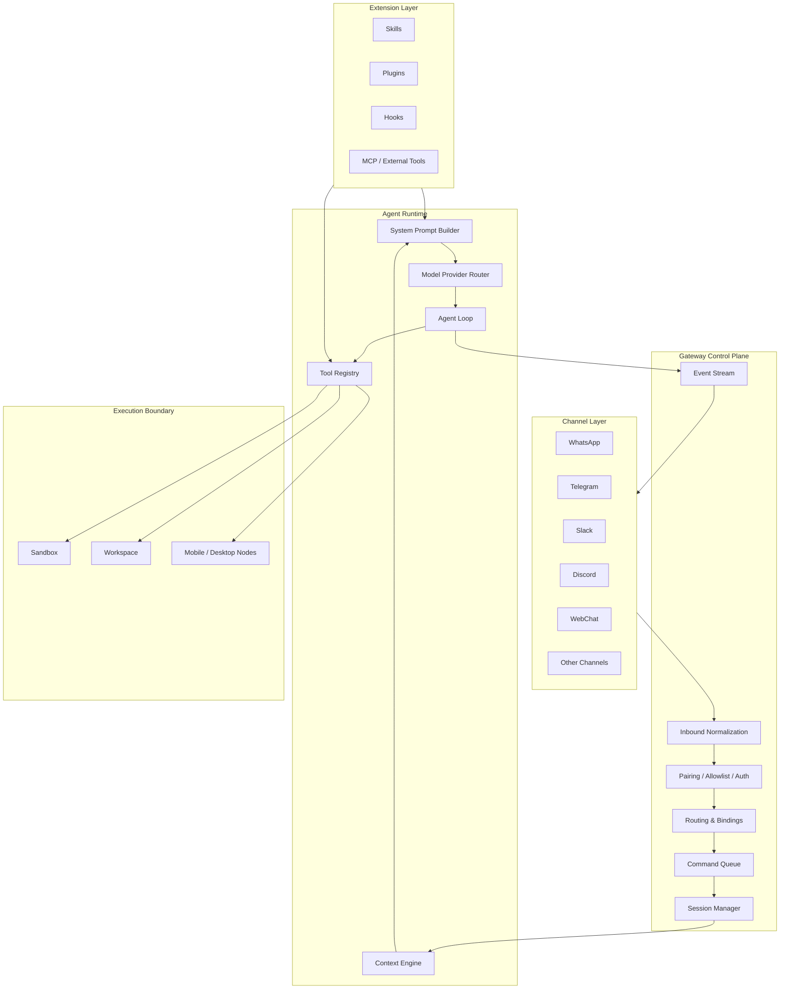
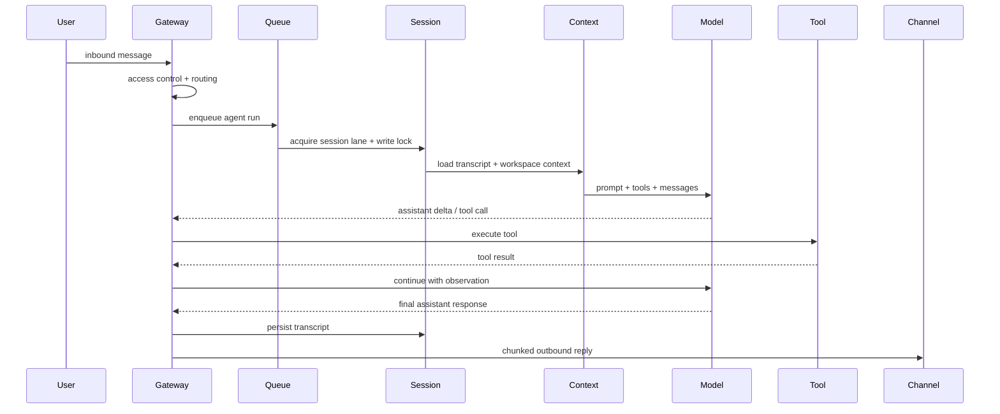

# 第15章 OpenClaw 架构解析：个人 AI 助手的 Gateway、Runtime 与工具生态

> OpenClaw 的核心价值不是“又一个聊天机器人”，而是把个人 AI 助手抽象成一个长期运行的本地 Gateway：接入多渠道消息，管理会话和上下文，调度 Agent Runtime，并用工具、技能、插件和沙箱控制行动边界。

## 引言

第 8 章已经分析了 LangGraph、AutoGen、MCP 这类 Agent 平台与编排框架；第 13 章分析了 AI Coding Agent，第 14 章进一步拆解了 Pi 这类终端原生 Coding Agent Runtime。本章继续分析一个更贴近个人生产力场景的成熟系统：OpenClaw。

OpenClaw 的官方定位是个人 AI 助手。它运行在用户自己的设备或服务器上，通过一个长期运行的 Gateway 接入 WhatsApp、Telegram、Slack、Discord、Signal、iMessage、WebChat 等渠道，并把这些消息路由给 Agent Runtime。它还提供工具、技能、插件、会话、上下文、沙箱、移动节点和控制台等能力。

如果只把 OpenClaw 看成“可以在 WhatsApp 上聊天的 AI bot”，会低估它的架构价值。更准确的理解是：

```text
OpenClaw = Personal Agent Gateway
         + Multi-channel Messaging Hub
         + Embedded Agent Runtime
         + Tool / Skill / Plugin Ecosystem
         + Local-first Security Boundary
```

本章目标是回答六个问题：

1. OpenClaw 为什么以 Gateway 为中心？
2. 一条消息如何从聊天平台进入 Agent Loop？
3. OpenClaw 如何组织会话、上下文、技能和工具？
4. 它的插件系统解决了什么扩展问题？
5. 它的安全模型和沙箱边界是什么？
6. 如果我们自己设计个人 AI 助手系统，可以从 OpenClaw 借鉴什么？

本文基于 2026 年 4 月 30 日可访问的 OpenClaw 官方 README 与文档进行分析。由于 OpenClaw 仍在快速演进，具体配置项和实现细节以后可能变化，但它的架构思想具有长期参考价值。

---

## 15.1 系统定位：从 Chatbot 到 Personal Agent Gateway

传统聊天机器人通常是这样的：

```text
Channel Webhook -> Bot Handler -> LLM API -> Reply
```

这个架构适合问答，但不适合个人 AI 助手。因为真正的个人助手需要长期存在，并且要同时处理：

- 多个消息渠道；
- 多个设备节点；
- 多个模型供应商；
- 多个会话；
- 文件、Shell、浏览器、消息发送等工具；
- 用户偏好、项目规则和长期上下文；
- 权限、沙箱、审计和远程访问。

OpenClaw 的核心抽象是 Gateway。Gateway 不是普通业务后端，而是个人 AI 助手的控制平面：

```text
                ┌───────────────────────────────┐
                │          OpenClaw Gateway       │
                │  session / routing / security   │
                │  tools / plugins / streaming    │
                └───────────────┬───────────────┘
                                │
        ┌───────────────────────┼───────────────────────┐
        │                       │                       │
        ▼                       ▼                       ▼
  Chat Channels            Agent Runtime             Control Surfaces
  WhatsApp/Slack           model + tools             CLI / Web UI / macOS
  Telegram/WebChat         context + sessions        mobile nodes
```

这种设计的关键判断是：**用户真正需要的不是一个模型入口，而是一个稳定、可控、跨渠道的个人 Agent 运行环境。**

### OpenClaw 解决的不是模型问题，而是接入问题

今天的模型已经足够强，但个人助手要落地，难点往往不在模型本身：

- 如何让 AI 出现在用户已经使用的渠道里？
- 如何让不同渠道复用同一套会话状态？
- 如何防止陌生人给 bot 发消息后触发工具调用？
- 如何让助手可以访问本地文件和设备，又不把权限放得过大？
- 如何给不同场景配置不同 agent、workspace 和 tool profile？
- 如何让长会话不因为上下文窗口耗尽而中断？

OpenClaw 的答案是把这些问题集中到 Gateway 层处理。模型只是运行时的一部分，真正复杂的是 Gateway 周围的消息、状态、工具和权限。

---

## 15.2 总体架构

OpenClaw 可以分成九个层次：



### 架构分层

| 层 | 职责 | 关键设计 |
|:---|:---|:---|
| Channel Layer | 接入聊天平台、WebChat、移动端节点 | 多渠道适配，统一消息抽象 |
| Gateway Control Plane | 路由、鉴权、会话、队列、事件 | 长期运行，单一事实源 |
| Agent Runtime | 组装上下文、调用模型、执行工具 | 嵌入式 Agent Loop |
| Extension Layer | 技能、插件、Hook、外部工具 | 让能力可扩展 |
| Execution Boundary | Workspace、Sandbox、Node | 限制工具影响范围 |

OpenClaw 最值得学习的地方，是它没有把所有东西堆进 Agent Loop。它把消息接入、会话路由、工具策略、上下文构建、沙箱执行拆到不同层，每层只承担一个主要职责。

---

## 15.3 Gateway：个人助手的控制平面

OpenClaw 官方文档把 Gateway 描述为会话、路由和渠道连接的单一事实源。它是一个长期运行的 daemon，默认通过本地端口提供 HTTP/WS 服务，并由 launchd、systemd 或用户手动进程保持运行。

### Gateway 管什么

Gateway 至少管理七类状态：

| 状态 | 说明 |
|:---|:---|
| Channel connection | WhatsApp、Telegram、Slack、Discord 等连接状态 |
| Device pairing | CLI、Web UI、移动节点等客户端配对 |
| Session routing | 消息应该进入哪个 agent、哪个 session |
| Agent runs | 当前运行中的 agent 任务、runId、生命周期事件 |
| Tool/event stream | 工具事件、assistant delta、lifecycle event |
| Config | 模型、工具、渠道、权限、sandbox 配置 |
| Transcript | 会话 JSONL 记录和压缩摘要 |

这就是为什么 OpenClaw 不是“每个渠道一个 bot”。它通过单 Gateway 汇聚所有输入，然后统一处理会话和工具权限。

### WebSocket 协议

OpenClaw 的控制面客户端通过 WebSocket 连接 Gateway。协议大致是：

```text
connect handshake
  │
  ├─ req/res:
  │   {type:"req", id, method, params}
  │   {type:"res", id, ok, payload|error}
  │
  └─ events:
      {type:"event", event, payload, seq?, stateVersion?}
```

这个设计有三个好处：

1. CLI、Web UI、移动节点可以共享同一套协议；
2. Agent run 可以通过事件流实时输出生命周期、工具和 assistant 流；
3. 设备配对、鉴权和远程访问可以统一落在 Gateway 层。

### Gateway 的不变量

OpenClaw 的 Gateway 架构隐含几个重要不变量：

- 一个 host 上通常由一个 Gateway 负责控制渠道连接；
- 所有客户端连接都要经过握手；
- 非本地或远程连接需要明确配对和鉴权；
- 事件不保证无限重放，客户端遇到事件缺口要主动刷新；
- side-effecting 请求需要幂等键，避免网络重试造成重复发送或重复执行。

这些约束让 Gateway 更像一个本地控制平面，而不是普通 HTTP 服务。

---

## 15.4 消息进入 Agent Loop 的完整路径

一条用户消息从 Telegram 或 WhatsApp 进入 OpenClaw，大致经过下面的路径：

```text
Inbound Message
  │
  ▼
Channel Adapter
  │  normalize message / account / peer / attachments
  ▼
Access Control
  │  pairing / allowlist / group mention
  ▼
Routing
  │  choose agentId + sessionKey
  ▼
Queue
  │  collect / followup / steer
  ▼
Session Manager
  │  load transcript + write lock
  ▼
Context Engine
  │  assemble messages + system prompt additions
  ▼
Agent Runtime
  │  model call + tool calls + streaming
  ▼
Outbound Shaping
  │  chunk / suppress duplicate confirmations
  ▼
Channel Send
```

### 为什么需要 Queue

个人助手的输入很容易并发：

- 用户连续发三条短消息；
- 群聊里多个人同时提问；
- cron 任务同时触发；
- Web UI 和手机同时发起请求；
- agent 正在执行工具时又来了新消息。

如果不排队，就会出现两个危险：

1. 两个 agent run 同时写同一个 session transcript；
2. 两个工具调用共享状态，导致结果交错或覆盖。

OpenClaw 的设计是按 session lane 串行化运行，同时保留跨 session 的安全并行。换句话说：

```text
同一个 session：严格串行
不同 session：可以并行，但受全局并发上限控制
```

这和数据库事务里的“同一行串行，不同行并行”很像。它牺牲了一点即时性，换来了会话一致性和工具执行稳定性。

### Queue Mode

OpenClaw 还区分不同输入处理模式：

| 模式 | 适合场景 | 含义 |
|:---|:---|:---|
| collect | 用户连续补充上下文 | 合并为下一次 agent turn |
| followup | 当前 run 结束后再处理 | 排队等待下一轮 |
| steer | 希望影响当前 run | 在下一个模型边界注入 |
| interrupt | 强制打断当前 run | 风险更高，适合控制命令 |

这个设计非常实用。真实聊天不是单条完整 prompt，而是“我先说一点，又补一句，再发张图”。Agent 系统必须把这种碎片输入转成稳定的执行单元。

---

## 15.5 Agent Runtime：OpenClaw 的执行核心

OpenClaw 运行一个嵌入式 Agent Runtime。官方文档提到，它在底层依赖 Pi agent core，OpenClaw 自己负责 session 管理、工具接线、发现、路由和渠道投递。

可以把 OpenClaw Agent Runtime 理解为下面的组合：

```text
Agent Runtime
├── Workspace Resolver
├── Session Manager
├── Skills Snapshot
├── Context Engine
├── System Prompt Builder
├── Model Resolver
├── Tool Registry
├── Event Bridge
└── Transcript Writer
```

### Agent Loop 的高层流程



这个流程可以和第 13 章的 Coding Agent Loop 对照：

| Coding Agent | OpenClaw |
|:---|:---|
| 任务来自 CLI / issue / spec | 任务来自多渠道消息 |
| 上下文来自代码仓库 | 上下文来自 workspace、session、skills、attachments |
| 工具多为文件、Shell、测试 | 工具扩展到消息、浏览器、节点、媒体、cron |
| 结果是 diff / PR / summary | 结果是跨渠道回复、工具动作、持久会话 |
| 安全重点是代码和 Shell | 安全重点是身份、消息入口、工具权限和设备边界 |

---

## 15.6 Workspace 与 Bootstrap Context

OpenClaw 要求 agent 有一个 workspace。这个 workspace 不是普通目录，而是 agent 的“人格、规则、工具说明和记忆入口”。

官方文档列出的典型 bootstrap 文件包括：

| 文件 | 作用 |
|:---|:---|
| `AGENTS.md` | 操作指令、项目规则、部分记忆 |
| `SOUL.md` | persona、边界、语气 |
| `TOOLS.md` | 用户维护的工具使用说明 |
| `BOOTSTRAP.md` | 首次运行引导 |
| `IDENTITY.md` | agent 名称、风格、标识 |
| `USER.md` | 用户资料和称呼偏好 |

这些文件会在新 session 的早期被注入到 agent context。它们的设计价值是：把“每次都要告诉模型的稳定信息”从用户临时 prompt 中抽出来，变成工作空间上下文。

### Workspace 不是 Memory 的全部

很多人会把 `AGENTS.md`、`SOUL.md`、`USER.md` 理解成记忆文件。更准确地说，它们是**稳定上下文入口**。真正的上下文还包括：

- session transcript；
- tool call 和 tool result；
- 附件和媒体信息；
- skills prompt；
- context engine 返回的消息和 systemPromptAddition；
- compaction summary；
- memory tool 或插件提供的检索结果。

所以 OpenClaw 的上下文体系是分层的：

```text
Stable Context     -> workspace bootstrap files
Operational Context -> tools, skills, runtime, current time
Session Context    -> transcript, recent messages, tool results
Retrieved Context  -> context engine / memory / search results
Compressed Context -> compaction summary
```

这和第 3 章 Context Engineering 的原则一致：上下文不是“把所有信息塞进去”，而是按稳定性、时效性、权限和预算分层组织。

---

## 15.7 Context Engine：上下文构建的可插拔化

OpenClaw 的 Context Engine 是一个很关键的抽象。它决定每次模型运行时看到哪些消息、如何摘要旧历史、如何跨 subagent 边界管理上下文。

官方文档把 Context Engine 的生命周期拆成四个点：

```text
Ingest
  新消息进入 session 时，可存储或索引

Assemble
  每次模型调用前，组装符合 token budget 的消息

Compact
  上下文接近窗口上限时，摘要旧历史

After Turn
  一轮完成后，持久化状态或更新索引
```

这个设计非常值得借鉴。因为上下文管理往往不是一个固定算法，而是不同系统的差异化能力：

- 个人助手需要长期偏好和历史；
- Coding Agent 需要代码片段和最近 diff；
- 企业知识助手需要权限过滤和引用；
- 多 Agent 系统需要父子会话边界；
- 移动助手需要图片、音频、位置等多模态上下文。

把 Context Engine 做成可插拔槽位，意味着 OpenClaw 可以从默认 legacy engine 演进到更复杂的 memory engine、retrieval engine、lossless context engine，而不需要重写 Gateway 和 Agent Runtime。

### 与 RAG 的区别

Context Engine 不是简单 RAG。RAG 通常解决“从知识库取哪些文档”，而 Context Engine 解决的是更大的问题：

```text
Which messages?
Which summaries?
Which tool results?
Which workspace files?
Which retrieved memories?
Which system prompt additions?
How much token budget?
How to compact?
```

如果用系统设计语言说，Context Engine 是 Agent Runtime 的**上下文调度器**。

---

## 15.8 Tools、Skills、Plugins：三层扩展模型

OpenClaw 的扩展模型分为三层：

```text
Tool   -> agent 可以调用的 typed function
Skill  -> 教 agent 何时、如何使用工具的说明
Plugin -> 打包 channel、tool、skill、model provider、hook 等能力
```

### Tool：行动能力

Tool 是模型可以调用的结构化函数。OpenClaw 内置了多类工具：

- 文件读写与 patch；
- exec / process；
- 浏览器控制；
- web search / web fetch；
- message 发送；
- canvas 和 nodes；
- cron / gateway；
- 图像、音乐、视频生成；
- sessions、subagents、agents list 等。

Tool 的设计重点不是“函数能不能调”，而是：

- schema 是否清晰；
- 输入是否可验证；
- 输出是否可截断和脱敏；
- 是否能被 tools.allow / tools.deny 控制；
- 是否能进入 trace 和 transcript；
- 是否能被 hook 拦截；
- 是否能在 sandbox 中执行。

### Skill：使用说明

Skill 是 `SKILL.md` 文件，用来教 agent 何时、如何使用工具。它更像“运行时可加载的操作手册”，而不是函数实现。

OpenClaw 支持多个 skill 来源，并有明确优先级：

```text
<workspace>/skills
  > <workspace>/.agents/skills
  > ~/.agents/skills
  > ~/.openclaw/skills
  > bundled skills
  > skills.load.extraDirs
```

这个优先级很有工程味道：workspace 规则最具体，所以优先；用户个人技能次之；系统内置技能最后兜底。

从第 6 章的抽象看，OpenClaw 的 Skill 实现抓住了三个关键点。

第一，**Skill 是上下文，不是执行权限**。`SKILL.md` 可以教 Agent 如何做事，但它本身不应该绕过 tools allow/deny、sandbox、approval gate。这样即使某个 Skill 写了高风险步骤，真正执行时仍然会被 Tool Policy 拦住。

第二，**Skill 有明确的 scope 和优先级**。workspace skill 优先于用户 skill，用户 skill 优先于 bundled skill，这等价于把“上下文规则”做成分层覆盖模型。越靠近当前 workspace 的 Skill 越具体，越应该优先生效。

第三，**Skill 和 Plugin 解耦**。Skill 只是方法说明，Plugin 才能注册 tool、channel、hook、model provider。这个边界能降低供应链风险：安装一个 Skill 主要改变 Agent 的行为指导，安装一个 Plugin 才扩大系统能力面。

一个成熟 OpenClaw-like 系统中，Skill 加载链路应该类似这样：

```text
User Message
  │
  ▼
Workspace / Agent Profile
  │
  ▼
Skill Discovery
  │  workspace > user > bundled > extraDirs
  ▼
Skill Selection
  │  只选择与任务匹配的少量 Skill
  ▼
Prompt Assembly
  │  Skill + tools snapshot + policy hints + context
  ▼
Agent Runtime
  │
  ▼
Tool Policy / Sandbox
```

这说明 OpenClaw 的 Skill 系统不是简单的 prompt 文件夹，而是 Context Engine、Tool Runtime 和 Policy 之间的连接层。

### Plugin：能力包

Plugin 可以注册多种能力：

- channel；
- model provider；
- tool；
- skill；
- speech / transcription；
- media understanding；
- image / video generation；
- web fetch / web search；
- context engine；
- hooks。

这让 OpenClaw 可以把“功能扩展”从核心 Gateway 里拆出来。比如一个企业内部插件可以同时注册：

- 企业 IM channel；
- 内部搜索 tool；
- 审批系统 tool；
- 企业知识 skill；
- before_tool_call hook；
- context engine。

### 三层模型的价值

| 层级 | 解决的问题 | 类比 |
|:---|:---|:---|
| Tool | agent 能做什么 | API / Function |
| Skill | agent 什么时候、怎么做 | Runbook / SOP |
| Plugin | 能力如何安装、配置、分发 | Package / Extension |

很多 Agent 框架只强调 Tool，忽略 Skill 和 Plugin。OpenClaw 的设计更接近操作系统：工具是系统调用，技能是手册，插件是驱动和应用包。

---

## 15.9 Tool Policy：工具权限不是 Prompt 问题

OpenClaw 支持通过配置控制工具 allow/deny、tool profile 和 provider-specific restrictions。

一个简化例子：

```json
{
  "tools": {
    "profile": "coding",
    "allow": ["group:fs", "browser", "web_search"],
    "deny": ["exec"]
  }
}
```

Tool profile 则提供基础能力集合：

| Profile | 适合场景 | 特点 |
|:---|:---|:---|
| full | 个人强信任环境 | 几乎不限制 |
| coding | 编码和自动化 | 文件、运行时、web、session、memory |
| messaging | 只做消息助手 | 消息和 session 相关工具 |
| minimal | 高风险入口 | 只保留最小状态读回 |

这背后的原则是：**工具权限必须由确定性配置控制，而不是只靠系统提示词劝模型自觉。**

### Deny wins

安全策略里一个重要原则是 deny 优先。即使某个工具被 profile 间接允许，只要出现在 deny list，就应该拒绝。

```text
base profile -> allow list -> deny list -> provider restriction -> sandbox
```

这条链路要靠 Runtime 强制执行。Prompt 可以解释规则，但不能成为安全边界。

---

## 15.10 Session、Memory 与 Compaction

OpenClaw 按消息来源组织 session：

| 来源 | 默认行为 |
|:---|:---|
| Direct message | 默认共享 main session |
| Group chat | 按群隔离 |
| Room/channel | 按房间隔离 |
| Cron job | 每次运行新 session |
| Webhook | 按 hook 隔离 |

### DM isolation

单用户个人助手里，所有 DM 共享一个 main session 是合理的。因为同一个用户从 WhatsApp、Telegram、WebChat 发消息，本质上都在和同一个助手对话。

但一旦多个人能私聊同一个 bot，就必须启用 DM isolation。否则 Alice 的上下文可能进入 Bob 的对话。

一个典型配置是：

```json
{
  "session": {
    "dmScope": "per-channel-peer"
  }
}
```

这个细节非常重要。很多 bot 系统的隐私问题，不是模型泄漏，而是 session key 设计错误。

### Transcript 与 Compaction

OpenClaw 把 session transcript 存成 JSONL。上下文窗口接近上限时，会把旧消息压缩成 summary，同时保留最近消息。关键是：完整历史仍然在磁盘上，compaction 只改变下一次模型看到的上下文。

这个设计体现了两个原则：

1. **存储层保真**：历史尽量完整留存；
2. **推理层压缩**：模型只看当前预算内最有用的信息。

对于长期个人助手，这是必要能力。否则几天之后，任何持续对话都会被上下文窗口限制卡住。

---

## 15.11 Multi-Agent Routing：一个 Gateway，多种助手

OpenClaw 支持多 Agent 路由。你可以把不同渠道、账号、群组、发送者、Discord role、Slack team 等绑定到不同 agent。

路由规则的核心是 most-specific wins：

```text
peer exact match
  > parentPeer
  > Discord guild + roles
  > Discord guild
  > Slack team
  > accountId
  > channel-level fallback
  > default agent
```

这个能力让 OpenClaw 不只是“一个助手”，而是一个本地 Agent 编排入口：

```text
WhatsApp family group -> family agent
Slack work team       -> work agent
Telegram personal DM  -> personal agent
Discord dev server    -> coding agent
Cron daily digest     -> summary agent
```

每个 agent 可以有自己的：

- workspace；
- model；
- tools profile；
- skills allowlist；
- sandbox；
- session；
- persona。

### 多 Agent 的本质不是“多模型”

多 Agent 容易被误解成同时开多个模型互相聊天。OpenClaw 的多 Agent 更实用：它首先是**权限和上下文隔离**。

不同 agent 服务不同场景，应该拥有不同边界：

| Agent | Workspace | Tools | 风险 |
|:---|:---|:---|:---|
| personal | 个人知识库 | memory、message、web | 隐私泄漏 |
| coding | 代码仓库 | fs、exec、browser | 破坏文件 |
| family | 家庭群聊 | message、calendar | 误发消息 |
| read-only | 公共群 | minimal、web_search | prompt injection |

如果所有场景共用一个 agent、一个 session、一个工具集，系统会非常危险。

---

## 15.12 Sandbox 与安全边界

OpenClaw 的安全文档强调一个基本前提：它主要面向个人助手部署，不是多租户敌对环境的安全隔离边界。如果你要让不可信用户共享一个 agent/gateway，就必须拆分 trust boundary，例如单独 Gateway、凭证、OS 用户或主机。

### 访问控制优先于智能

OpenClaw 的安全理念可以概括成三句话：

```text
Identity first  -> 谁能和 bot 说话？
Scope next      -> bot 能在哪些地方行动？
Model last      -> 假设模型会被诱导，限制爆炸半径。
```

这点非常重要。Agent 安全里最常见的问题不是高深漏洞，而是“某个人给 bot 发了一条消息，bot 照做了”。

### DM 与群聊入口

OpenClaw 对聊天入口提供多种安全控制：

- DM pairing；
- allowlist；
- group mention required；
- channel/account 级别限制；
- session isolation；
- command authorization。

这些控制应该发生在模型之前。也就是说，未授权消息不应该进入 Agent Loop。

### Sandbox workspaceAccess

OpenClaw 的 sandbox 可以控制 agent 工具看到的 workspace：

| workspaceAccess | 含义 | 典型用途 |
|:---|:---|:---|
| none | 工具只看到 sandbox workspace | 默认更隔离 |
| ro | 只读挂载 agent workspace | 分析、问答、review |
| rw | 读写挂载 workspace | 编码、自动修复 |

这和第 13 章 Coding Agent 的权限模型一致：先从 read-only 开始，再逐步开放 write 和 exec。

### 高风险工具

OpenClaw 文档特别提醒 gateway、cron 等控制面工具有持久化影响：

- `gateway` 可以读取或修改配置、触发更新；
- `cron` 可以创建长期运行的计划任务；
- `sessions_spawn` / `sessions_send` 可以扩大影响面。

对任何接收不可信内容的 agent，默认应禁止这些工具：

```json
{
  "tools": {
    "deny": ["gateway", "cron", "sessions_spawn", "sessions_send"]
  }
}
```

### Plugin 也是信任边界

Plugin 在 Gateway 进程内运行。它不是普通 prompt，不是隔离文本，而是代码扩展。因此插件安全策略应该接近浏览器扩展或后端插件：

- 只安装可信来源；
- 使用 plugins.allow allowlist；
- 安装前审查配置；
- 更新后重启并重新审计；
- 高风险环境不要随便启用第三方插件。

---

## 15.13 Control UI、WebChat 与 Nodes

OpenClaw 不只提供聊天渠道，也提供控制面：

- CLI；
- Web Control UI；
- macOS companion app；
- WebChat；
- iOS / Android nodes；
- headless nodes。

### Control UI

Control UI 是 Gateway 的浏览器控制台，用于：

- 聊天；
- 配置；
- 查看 session；
- 管理节点；
- 观察运行状态。

从系统设计角度看，Control UI 不是 Agent Runtime 的一部分，而是 Gateway Control Plane 的客户端。它通过同一套 WS API 和 Gateway 通信。

### Nodes

Nodes 是一个很有意思的设计。macOS、iOS、Android 或 headless node 可以连接 Gateway，并声明自己的能力，例如：

- canvas；
- camera；
- screen recording；
- location；
- device actions；
- voice。

这意味着 OpenClaw 的工具边界不局限于 Gateway 主机。Gateway 可以作为控制平面，节点作为能力平面：

```text
Gateway
  │
  ├─ local workspace tools
  ├─ browser sandbox
  ├─ mobile camera node
  ├─ iOS voice node
  └─ macOS desktop node
```

这种设计让个人助手更接近“多设备 Agent OS”。但它也扩大了安全面，所以节点配对、能力声明和本地审批非常关键。

---

## 15.14 OpenClaw 的架构亮点

### 1. Gateway 中心化，而不是 Channel 中心化

很多 bot 项目从某个渠道开始：先写 Telegram bot，再写 Slack bot，再补 Discord bot。最后每个渠道都有自己的状态、配置和异常处理。

OpenClaw 反过来：先定义 Gateway，渠道只是接入层。这样 session、agent routing、工具、权限、事件和 UI 都可以复用。

### 2. Context Engine 可插拔

上下文管理是 Agent 系统的长期竞争力。OpenClaw 没有把它写死在 Agent Loop 里，而是抽成 Context Engine 生命周期。

这让系统以后可以演进出更复杂的 memory、retrieval、lossless history、subagent context，而不破坏 Gateway 主体。

### 3. Tool / Skill / Plugin 分层清楚

Tool 是能力，Skill 是使用说明，Plugin 是能力包。这三个概念分开后，扩展生态会清晰很多。

### 4. 多渠道消息体验工程做得细

OpenClaw 对消息系统里的很多“脏活”有明确设计：

- inbound dedupe；
- debounce；
- queue mode；
- per-session serialization；
- streaming chunk；
- channel text limit；
- duplicate confirmation suppression。

这些不是模型能力，但直接决定用户体验。

### 5. 安全模型现实

OpenClaw 没有把自己包装成万能安全沙箱。它明确说明个人助手 trust model，并强调身份、范围、模型三层防线。

这种诚实很重要。Agent 系统一旦能读文件、执行命令、发消息，安全边界就必须靠工程系统，而不是靠模型“听话”。

---

## 15.15 局限与风险

### 1. 个人助手模型不等于企业多租户模型

OpenClaw 适合一个用户或一个信任边界内的个人助手。如果要扩展为企业多用户平台，需要额外设计：

- tenant isolation；
- per-user secret vault；
- audit log；
- RBAC；
- DLP；
- admin policy；
- compliance retention；
- enterprise SSO。

不能简单把一个 Gateway 开给所有人用。

### 2. 插件生态带来供应链风险

插件越强，风险越大。OpenClaw 的插件可以注册工具、技能、模型、hooks、context engine。安装恶意插件相当于给 Gateway 装恶意扩展。

### 3. 多渠道身份映射复杂

一个用户可能同时来自 WhatsApp、Telegram、Slack、WebChat。如何判断这些身份属于同一个人？什么时候应该共享 session？什么时候应该隔离？这不是技术小问题，而是隐私和安全问题。

### 4. 长期记忆与上下文压缩有失真风险

Compaction 可以延长会话寿命，但摘要会损失细节。长期个人助手如果过度依赖摘要，可能出现：

- 错误偏好被固化；
- 关键约束被压缩丢失；
- 旧上下文被错误泛化；
- 用户很难知道模型到底记住了什么。

因此长期记忆需要可查看、可编辑、可删除。

### 5. Agent 行动能力越强，误操作成本越高

OpenClaw 可以接消息、文件、Shell、浏览器、节点和设备能力。能力越强，越需要分级授权：

```text
read-only
  -> write with approval
  -> exec allowlist
  -> sandboxed automation
  -> persistent control-plane changes
```

高风险动作应该默认需要确认。

---

## 15.16 如果从零复刻一个 OpenClaw-like 系统

如果你想从零实现一个简化版 OpenClaw，不要一开始支持 20 个渠道。推荐按下面顺序做。

### 第一阶段：单 Gateway + WebChat

目标：

- 本地 Gateway；
- WebChat；
- 一个 Agent Runtime；
- 一个 session transcript；
- 基础工具：web_search、read_file、message self。

核心数据结构：

```typescript
type InboundMessage = {
  channel: "webchat";
  accountId: string;
  peerId: string;
  text: string;
  attachments?: Attachment[];
  messageId: string;
  receivedAt: string;
};

type RouteResult = {
  agentId: string;
  sessionKey: string;
  workspace: string;
};

type AgentRun = {
  runId: string;
  sessionKey: string;
  status: "queued" | "running" | "done" | "error";
  startedAt?: string;
  endedAt?: string;
};
```

### 第二阶段：加入 Channel Adapter

先接 Telegram 或 Slack，因为接入成本较低。设计统一 adapter interface：

```typescript
interface ChannelAdapter {
  id: string;
  start(): Promise<void>;
  stop(): Promise<void>;
  send(peer: PeerRef, payload: OutboundPayload): Promise<void>;
  onMessage(handler: (message: InboundMessage) => Promise<void>): void;
}
```

所有渠道消息都转成统一 `InboundMessage`，不要让 Agent Runtime 关心渠道差异。

### 第三阶段：加入 Routing 与 Session

实现：

- default agent；
- peer-based routing；
- group session；
- DM isolation；
- transcript JSONL。

关键原则：session key 必须显式可解释。

```text
session:webchat:main
session:telegram:peer:123
session:slack:channel:C123
```

### 第四阶段：加入 Tool Registry 与 Policy

实现：

- typed tool schema；
- allow / deny；
- tool groups；
- tool result sanitization；
- before_tool_call / after_tool_call hook。

### 第五阶段：加入 Context Engine

先实现 legacy：

- 读取最近 N 条消息；
- 注入 workspace files；
- 超过预算则截断。

再实现 compaction：

- 对旧消息摘要；
- 保留最近尾部；
- 保存 summary 到 transcript；
- 支持手动 `/compact`。

### 第六阶段：加入 Sandbox

先从 read-only workspace 开始，再允许 rw：

```text
workspaceAccess = none | ro | rw
```

如果支持 Shell，必须有：

- command allowlist；
- timeout；
- cwd sandbox；
- stdout/stderr 截断；
- approval gate；
- audit log。

### 第七阶段：加入 Plugin / Skill

先实现 Skill，再实现 Plugin：

```text
skills/
└── github/
    └── SKILL.md
```

Skill 只影响 prompt，不执行代码。Plugin 才注册工具、渠道、hooks。这样更安全，也更容易调试。

---

## 15.17 对个人 Agent OS 的启示

OpenClaw 展示了一个重要方向：未来的个人 AI 助手可能不是一个 App，而是一层本地 Agent OS。

它的核心不是 UI，而是：

- 统一身份和消息入口；
- 管理长期上下文；
- 管理工具和权限；
- 管理模型供应商；
- 管理多设备能力；
- 管理事件、任务和自动化；
- 让用户拥有数据和控制权。

从这个角度看，OpenClaw 和 Claude Desktop、ChatGPT、Cursor、Claude Code 的关系不是简单替代：

| 系统 | 核心形态 | 适合场景 |
|:---|:---|:---|
| ChatGPT / Claude | 云端对话产品 | 通用问答、写作、分析 |
| Claude Desktop | 桌面模型入口 + MCP | 本地工具连接 |
| Cursor | IDE 原生 Coding Agent | 代码编辑和重构 |
| Claude Code | 终端原生 Coding Agent | 代码任务和工具执行 |
| OpenClaw | 本地个人 Agent Gateway | 多渠道个人助手和自动化 |

OpenClaw 的独特性在于它不把“聊天窗口”当中心，而把“个人消息网络 + 本地执行环境”当中心。

---

## 本章小结

OpenClaw 值得分析，不是因为它支持很多聊天渠道，而是因为它把个人 AI 助手拆成了几个清晰的系统边界：

- Gateway 是控制平面；
- Channel Adapter 是输入输出适配层；
- Agent Runtime 是推理和工具执行层；
- Context Engine 是上下文调度层；
- Tools、Skills、Plugins 是扩展生态；
- Session、Queue、Streaming 是消息体验工程；
- Sandbox、Policy、Pairing 是安全边界；
- Nodes 把能力扩展到多设备。

对我们设计 Agent 系统最重要的启发是：

> 不要把 Agent 做成一个会调用工具的聊天函数，而要把它做成一个有控制平面、会话状态、上下文预算、工具权限、事件流和安全边界的运行系统。

如果第 13 章的 Coding Agent 代表“AI 如何参与软件工程”，OpenClaw 代表的则是另一个方向：**AI 如何成为长期在线、跨渠道、可扩展、可治理的个人助手基础设施。**

---

## 参考资料

1. [OpenClaw GitHub Repository](https://github.com/openclaw/openclaw)
2. [OpenClaw Docs: Overview](https://docs.openclaw.ai/)
3. [OpenClaw Docs: Gateway Architecture](https://docs.openclaw.ai/concepts/architecture)
4. [OpenClaw Docs: Agent Runtime](https://docs.openclaw.ai/concepts/agent)
5. [OpenClaw Docs: Agent Loop](https://docs.openclaw.ai/concepts/agent-loop)
6. [OpenClaw Docs: Context Engine](https://docs.openclaw.ai/concepts/context-engine)
7. [OpenClaw Docs: Tools and Plugins](https://docs.openclaw.ai/tools)
8. [OpenClaw Docs: Skills](https://docs.openclaw.ai/tools/skills)
9. [OpenClaw Docs: Security](https://docs.openclaw.ai/gateway/security)
10. [OpenClaw Docs: Sandboxing](https://docs.openclaw.ai/gateway/sandboxing)
