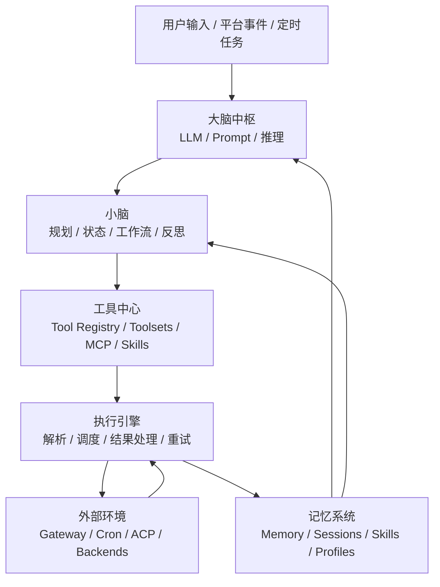
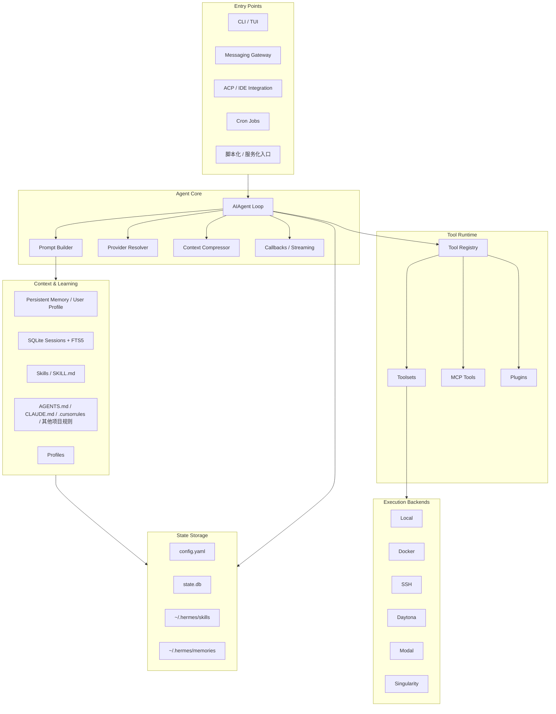
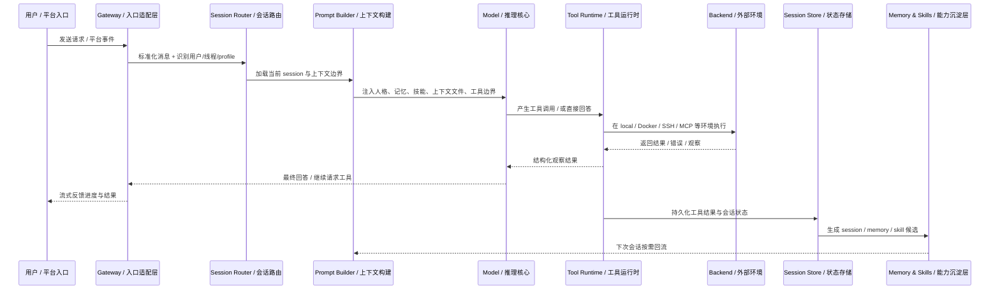
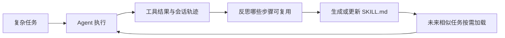
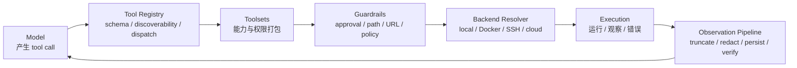
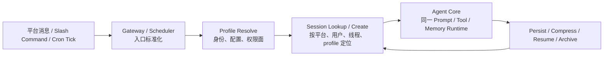

# 第21章 Hermes Agent 架构解析：长期运行、自我进化与多入口 Agent Runtime

> Hermes Agent 的核心价值，不是“多一个聊天入口”，而是把长期运行的 Agent 做成一个会积累记忆、沉淀技能、跨入口工作、可扩展工具并能生成训练轨迹的个人运行时。

## 引言

前几章已经分别分析了 Coding Agent Runtime、Pi 和 OpenClaw。Pi 让我们看到终端原生 Agent Runtime 如何被做成可嵌入、可扩展的执行核心；OpenClaw 则展示了个人 AI 助手如何通过 Gateway 接入多入口渠道。Hermes 更进一步：它关心的不只是 Agent 在哪里和用户相遇，而是 Agent 如何在长期运行中持续积累记忆、沉淀技能、复用会话状态，并把行动轨迹变成新的能力资产。

如果用一句话概括：

```text
OpenClaw 更强调“Agent 如何到达用户所在的平台”
Hermes 更强调“Agent 如何在长期使用中变得更懂用户、更会做事”
```

本章基于 2026 年 5 月 15 日可访问的 Hermes Agent 官方 README 与文档进行分析。Hermes Agent 正在快速演进，工具注册表、平台适配器和闭环学习能力仍在持续变化，因此本章尽量使用“数十个内置工具”“持续增长的工具集”这类稳健表述，而不是绑定某个容易过期的精确数量。

## 21.1 系统定位：Hermes 解决的不是聊天，而是长期 Agent Runtime

### 21.1.1 从一次性会话到长期运行

很多 AI 产品仍然停留在“一次性会话”：

```text
User Prompt -> LLM -> Answer
```

这种形态适合问答，但不适合真正的助手。真实助手需要具备连续性：

- 记得用户偏好；
- 记得项目背景；
- 记得过去解决过什么问题；
- 能把一次复杂任务沉淀成可复用技能；
- 能从 CLI、Telegram、Slack、Discord、WhatsApp、Email 等入口继续同一类工作；
- 能在本地、Docker、SSH、Modal、Daytona、Singularity 等环境里执行任务；
- 能把运行轨迹导出，用于评估、微调或强化学习。

Hermes Agent 的定位可以抽象成：

```text
Hermes Agent
  = Long-running Agent Runtime
  + Persistent Memory
  + Procedural Skill System
  + Multi-platform Gateway
  + Tool / Toolset Registry
  + Execution Backends
  + Research Trajectory Pipeline
```

它和普通聊天机器人的本质区别是：普通聊天机器人围绕“单次回复”设计，Hermes 围绕“长期能力增长”设计。

### 21.1.2 Hermes 与 OpenClaw 的差异

OpenClaw 的核心抽象是 Gateway，Hermes 的核心抽象则更接近长期运行的 Agent Runtime。两者都重视多入口，但 OpenClaw 更强调接入与控制面，Hermes 更强调记忆、技能、轨迹和自我进化闭环。

### 21.1.3 本章分析框架：入口、上下文、行动、学习闭环

后文只沿着一条 Runtime 主线展开：输入如何进入系统，上下文如何被整理，行动如何被执行，结果又如何回流为记忆、会话和技能。前四分之一先回答这条主线依赖的运行时边界，后文再顺着 `输入 -> 上下文 -> 行动 -> 回流` 逐段展开。

---

#### 关键判断：Agent 的能力不只来自模型

Hermes 的设计隐含了一个重要判断：

> 长期 Agent 的能力，不只来自模型参数，而来自模型、记忆、技能、工具、入口、执行环境和历史轨迹共同组成的系统。

同一个模型，如果每次都从空白上下文开始，就是普通聊天；如果它能读取项目规则、调用工具、搜索旧会话、更新记忆、创建技能、定时执行任务，并在不同平台保持身份连续性，就开始接近真正的个人 Agent。

---

## 21.2 总体架构：一个可长期运行的个人 Agent 操作系统

### 21.2.1 结论先行：Hermes 的六个运行时边界

先给结论。Hermes 更适合被理解成一个长期运行的 Agent Runtime，而不是一组并列功能模块。它的关键不是“支持多少工具”或“接了多少平台”，而是把长期 Agent 的复杂性稳定地压缩成六个运行时边界：入口负责把事件送进来，大脑中枢负责理解与推理，小脑负责维持任务推进，工具中心负责声明能力边界，执行引擎负责把决策变成行动，记忆系统负责把结果回流成长期资产。后文的所有证据，都会回到这六个运行时边界。



这里的“大脑中枢”“小脑”“工具中心”等说法，是为了分析运行时边界而使用的抽象，不是 Hermes 源码里的官方模块命名：

| 组件 | 解决的问题 | Hermes 中的代表实现 |
|:---|:---|:---|
| 大脑中枢 | 理解输入、生成推理、决定下一步行动 | LLM Provider、Prompt Builder、Context Compressor、Callbacks |
| 小脑 | 把复杂任务拆成步骤，维持状态，必要时反思和重规划 | AIAgent Loop、Cron 任务配置、脚本化/服务化调用入口、Context Compressor |
| 工具中心 | 定义 Agent 能使用哪些能力，以及这些能力如何注册和治理 | Tool Registry、Toolsets、Plugins、MCP Tools、Skills |
| 执行引擎 | 把模型输出的工具调用变成真实执行，并处理结果、异常和回退 | Tool Dispatch、Execution Backends、Streaming Callbacks、Result Persistence |
| 外部环境 | 让 Agent 接入真实世界，包括消息平台、IDE、文件系统、远程环境和自动化任务 | CLI / TUI、Messaging Gateway、ACP、Cron、local / Docker / SSH / Modal |
| 记忆系统 | 保存长期事实、历史会话、用户偏好和可复用经验 | Persistent Memory / User Profile、SQLite Sessions + FTS5、Skills、Profiles |

把这六个运行时边界连起来，Hermes 讲的是同一个架构命题：输入先被接入，随后被整理成稳定上下文，再通过工具与执行链路落到真实环境，最后以记忆、会话和技能的形式回流为长期状态。

### 21.2.2 证据一：工程分层确实围绕运行时边界展开

如果从源码和运行时模块看，Hermes Agent 可以进一步分成几层工程分工：



这张工程分层图最重要的意义，不是再增加一套抽象，而是说明前面的六个运行时边界在代码组织上确实彼此分离：

| 分离点 | 设计含义 |
|:---|:---|
| Entry 与 Core 分离 | CLI、Gateway、ACP、Cron 都复用同一个 Agent Core |
| Context 与 Tools 分离 | 记忆和技能决定“知道什么”，工具系统决定“能做什么” |
| Toolsets 与 Execution 分离 | 同一个 terminal 工具可以跑在 local、Docker、SSH 或云端后端 |

这种分层说明 Hermes 不是把所有逻辑塞进单一 Agent Loop，而是在入口、上下文、工具、执行和存储之间刻意维持边界。换句话说，前面的六个运行时边界不是人为硬拆，而是能被工程分层反向验证的 Runtime 结构。

### 21.2.3 证据二：目录结构如何落到这套架构

如果把分析抽象进一步压到工程落点，Hermes 的目录结构可以读成一张简洁的证据表：

| 目录或模块 | 对应架构角色 | 证据含义 |
|:---|:---|:---|
| `agent/` | Agent Core | 对话循环、Prompt Builder、压缩和回调集中在这里，证明 Hermes 有共享智能核心 |
| `tools/` | Capability Runtime | terminal、browser、file、memory 等能力与护栏逻辑同处一层，说明“能力”与“治理”一起被 Runtime 管理 |
| `gateway/` | Event Intake & Delivery | 多平台事件、session 路由和流式分发都从这里进入，证明入口与核心循环分离 |
| `hermes_cli/` | Operator Control Plane | `model`、`tools`、`skills`、`gateway`、`cron`、`profile` 等命令集中在这里，说明运行时存在明确控制面 |

其他区域如 `plugins/`、`skills/`、`providers/` 与 `tests/` / `docs/`，可以继续被理解为这四条主干之外的扩展层、记忆层、模型接入层和验证层，但它们不改变前面的主判断。接下来的重点因此不再是逐个目录介绍，而是沿着这套边界继续往下追踪运行时主线。

### 21.2.4 与第11章 Agent 组件地图的对应关系

这一节只做一个交叉校验：如果放回本书通用 Agent 组件地图，Hermes 最强的覆盖仍然是长期运行最关键的几条主线，也就是多入口事件接入、稳定上下文构建、工具与执行边界、长期记忆与学习回流。它因此更适合作为 Learning Loop、Memory Layer 和长期 Agent 的系统案例；至于企业生产所需的审批、合规审计、发布门禁和严格 Eval Harness，则仍然需要在这条 Runtime 主线之外额外补强。这里的目的只是确认前面的判断成立，而不改变后文继续沿着“输入、上下文、执行、回流”展开的叙事顺序。

---

## 21.3 运行时主线：从用户输入到工具执行再到状态持久化

从运行时看，Hermes 的一次任务不是简单的 `Prompt -> Answer`，而是一条带状态、工具、外部环境和记忆回流的数据链路：

```text
用户输入 / 平台事件 / Cron
  -> 入口标准化
  -> 大脑中枢理解任务
  -> 小脑拆解计划
  -> 工具中心选择能力
  -> 执行引擎调度工具
  -> 外部环境返回结果
  -> 执行引擎整理观察结果
  -> 大脑中枢继续推理或输出
  -> 记忆系统按需沉淀事实、会话和技能
```

这条链路里有三类数据流：

| 数据流 | 内容 | 关键风险 |
|:---|:---|:---|
| 任务流 | 用户意图、平台事件、Cron 任务、Slash Command | 入口信息不完整，任务边界不清 |
| 执行流 | tool call、执行后端、工具结果、错误和重试 | 高风险命令、超时、参数错误、结果过长 |
| 学习流 | Memory 更新、Session 归档、Skill 候选、Trajectory 数据 | 错误经验固化、隐私泄露、跨 profile 串线 |

Hermes 的关键点是：**Memory 不只是输入层，也在输出后参与回流。** 每次任务完成后，系统可以把稳定事实写入 persistent memory，把会话写入 SQLite，把可复用过程沉淀成 Skill，把执行轨迹交给 Research Pipeline。这样，Agent 的能力增长不依赖模型参数立即改变，而依赖 Runtime 中的上下文、技能和数据资产持续演进。

但记忆回流必须受约束。不是所有结果都应该写入长期记忆，也不是所有成功路径都应该变成 Skill。可靠的长期 Agent 需要在写入前判断：

- 这条信息是否长期有效；
- 是否属于当前 profile；
- 是否包含凭据、隐私或敏感业务数据；
- 是否经过工具结果或用户确认验证；
- 是否应该进入 Memory、Session、Skill，还是只作为本轮临时上下文。

这个判断决定了 Hermes 这类系统能否长期稳定运行。没有回流，Agent 每次都从头开始；没有约束，Agent 会把错误、噪声和越权信息永久化。

### 21.3.1 一个消息任务的端到端路径

如果把抽象数据流落到一个具体例子里，可以把一条 Telegram 消息在 Hermes 中的处理路径简化为：

1. 用户在 Telegram 中发来请求，例如“帮我检查这个仓库今天的 CI 失败原因”；
2. Gateway 适配器接收消息，并根据用户、线程和 profile 把它路由到正确 session；
3. Prompt Builder 组装人格、长期记忆、用户画像、相关 Skills、项目上下文和工具说明；
4. 模型先判断是否需要调用 GitHub、web、terminal 或 file 等工具；
5. Runtime 在对应 toolset 和执行后端上执行工具调用，并通过 callbacks 向用户流式反馈进度；
6. 工具结果回到 Agent Loop，模型继续推理，决定是追加调用、请求确认，还是直接给出答案；
7. 会话内容写入 session store；只有稳定事实才进入 persistent memory，只有经过验证的流程才进入 Skill 候选。

这个例子说明，Hermes 的核心不在“消息平台接进来了”，而在“平台入口、上下文构建、工具执行、状态持久化和能力沉淀”被串成了一条统一链路。

如果要把这条链路画成一张更适合读者快速浏览的时序图，可以简化为：



---

### 21.3.2 Agent Loop：统一多入口的运行核心

Hermes 的核心是一个同步编排引擎，可以理解为：

```text
load profile
  -> load config / memory / skills / context files
  -> assemble system prompt
  -> resolve provider and model
  -> receive user turn
  -> call model
  -> dispatch tool calls
  -> stream progress via callbacks
  -> persist session and tool results
  -> compress context when needed
  -> update memory / skills when appropriate
```

伪代码如下：

```python
def run_turn(user_message, profile, entry_point):
    config = load_config(profile)
    memory = load_memory(profile)
    skills = select_relevant_skills(user_message, profile)
    context_files = discover_context_files()
    sessions = load_session_state(entry_point, profile)

    prompt = build_prompt(
        personality=config.personality,
        memory=memory,
        skills=skills,
        context_files=context_files,
        tools=enabled_toolsets(entry_point),
        session=sessions.current,
    )

    while not done:
        response = model.complete(prompt)
        if response.tool_calls:
            results = tool_registry.dispatch(response.tool_calls)
            callbacks.stream_tool_results(results)
            prompt = append_observations(prompt, results)
            persist(results)
        else:
            callbacks.stream_answer(response.text)
            persist(response)
            done = True
```

这个循环和第 13 章 Coding Agent 的循环很像，但 Hermes 多了三个面向长期运行的能力：

- **Prompt Assembly**：每次会话开始时把人格、记忆、技能、项目上下文和工具指南组装成稳定系统提示；
- **Session Persistence**：会话写入 SQLite，并用 FTS5 支持跨会话搜索；
- **Learning Loop**：把经验沉淀到 memory 或 skill，而不是只留在一次对话里。

### 21.3.3 可中断和可观测

长期运行 Agent 必须可中断。用户可能在 CLI 里按 `Ctrl+C`，也可能在消息平台发新消息打断当前任务。Hermes 的设计强调：

- 工具调用过程对用户可见；
- 模型输出可以流式返回；
- 当前任务可以被用户中断或重定向；
- 背景进程可以被查询、等待、查看日志或终止。

这和传统后端的“请求进来、响应出去”不同。Agent 的执行可能持续几十秒甚至几分钟，用户需要知道它正在做什么、卡在哪里、是否可以停止。

### 21.3.4 多 Agent 机制：`delegate_task` 驱动的子 Agent 扇出与汇总

Hermes 的多 Agent 不是默认运行模式，也不是在一个会话里让多个“人格”轮流发言。它的触发条件很明确：**只有当父 Agent 当前这一轮的 LLM 输出了 `delegate_task` 这个 tool call，Hermes 才会进入多 Agent 路径。**

也就是说，多 Agent 在运行时里的地位首先是一个工具能力，而不是一个常驻调度框架：

```text
父 Agent run_conversation()
  -> LLM 返回 tool_calls
  -> 其中某个 tool name == delegate_task
  -> Hermes 执行 delegate_task()
  -> 创建一个或多个 child AIAgent
  -> child 各自运行自己的 run_conversation()
  -> 结果汇总回父 Agent
```

这里最容易误解的地方有两个。第一，Hermes 不会在“检测到任务很复杂”时自动偷偷切成多 Agent，触发点必须是模型显式选择了 `delegate_task`。第二，`delegate_task` 并不是让父 Agent 自己开几个线程继续同一段上下文，而是**真的 new 出新的 `AIAgent` 实例**，每个实例都有自己的对话循环、工具调用链和会话状态。

#### 21.3.4.1 `delegate_task` 的参数是模型直接给出的

父 Agent 第一次请求自己的 LLM 时，模型看到的是 `delegate_task` 的 schema。这个 schema 允许模型返回 `goal`、`context`、`tasks`、`role` 等结构化参数。换句话说，Hermes 不是在模型说“我想委派”之后再去补问一次参数，而是模型在 tool call 里一次性把委派参数写完整：

```json
{
  "name": "delegate_task",
  "arguments": {
    "tasks": [
      {"goal": "检查 A 模块", "context": "重点看依赖和边界"},
      {"goal": "检查 B 模块", "context": "重点看职责和测试"}
    ],
    "role": "leaf"
  }
}
```

运行时拿到这段 `arguments` 后，直接解析成 Python dict，再归一化成内部的 `task_list`。所以这里的控制关系是：

```text
父 LLM 决定是否委派
  -> 父 LLM 决定委派参数
  -> Hermes 负责把参数翻译成子 Agent 的 system prompt + user message
```

#### 21.3.4.2 子 Agent 如何启动：不是共享上下文，而是重新组装输入

`delegate_task` 会为每个 task 创建一个新的 child `AIAgent`。这里最关键的设计是：**对子 Agent 的输入不是把父会话的完整消息历史原封不动复制一遍，而是重新组装成聚焦当前子任务的最小上下文。**

可以把 child 的启动输入理解为两部分：

- `goal` 变成 child 的 `user_message`
- `context`、`workspace_path`、`role` 等变成 child 的系统提示词

因此，子 Agent 真正发给自己 LLM 的请求更像：

```json
[
  {"role": "system", "content": "You are a focused subagent... YOUR TASK: 检查 A 模块 ... CONTEXT: 重点看依赖和边界 ..."},
  {"role": "user", "content": "检查 A 模块"}
]
```

这个设计非常重要，因为它避免了把父会话里无关的中间推理、工具结果和噪声一并带进子上下文。Hermes 让父 Agent 负责“定义任务边界”，让子 Agent 负责“在隔离上下文里把这个边界跑完”。

#### 21.3.4.3 每个子 Agent 都有自己的 session，而不是共用父 session

Hermes 的多 Agent 不是共用一个 session。更准确地说，它是**独立 session + 父子关联**：

- 父 Agent 维持自己的主会话；
- 每个子 Agent 会新建自己的会话状态；
- child 会记录 `parent_session_id` 和 `_delegate_from` 等父子关系；
- 最终回到父层的不是“共享同一段消息历史”，而是子会话产出的 summary / tool result。

因此，子 Agent 与父 Agent 的关系更像“派生出的子会话”，而不是“同一会话里的第二个线程”。这也解释了为什么子 Agent 默认没有父会话的完整历史、默认跳过 memory / context files、并且拥有独立的工具循环和执行状态。

#### 21.3.4.4 请求时序：父先决策，子各自求解，父再整合

从 LLM 请求时序看，Hermes 的多 Agent 不是“一次请求里让多个 Agent 同时思考”，而是三段式：

1. 父 Agent 先请求一次父 LLM，决定是否调用 `delegate_task`；
2. Hermes 启动多个 child，每个 child 各自进行自己的多轮 `LLM -> tools -> LLM` 循环；
3. child 结果聚合成 `delegate_task` 的 tool result，再回到父 Agent，由父 LLM 再请求一次，生成最终整合回复。

如果压缩成时序：

```text
父1次请求
  -> 返回 delegate_task
  -> child1 多次请求
  -> child2 多次请求
  -> ...
  -> 汇总为 delegate_task 的 tool result
  -> 父再1次请求
  -> 输出最终答案
```

这说明 Hermes 的多 Agent 不是在父循环内部引入一个模糊的“协作模式”，而是把它明确做成：**父负责拆分与整合，子负责独立求解。**

#### 21.3.4.5 顶层委派与 orchestrator 委派：异步和同步两种模式

Hermes 的委派还有一个很值得记录的细节：**顶层父 Agent 和 orchestrator 子 Agent 的委派模式并不相同。**

- 顶层父 Agent 发起 `delegate_task` 时，Hermes 默认把它当成后台委派处理。父会话不会一直阻塞等待 child，而是继续运行，等子结果稍后重新回流。
- 如果当前调用者本身已经是一个 subagent，尤其是 `role="orchestrator"` 的子 Agent，那么它对子 worker 的委派通常是同步等待的，因为 orchestrator 必须先拿到 worker 的结果，才能向自己的父层做一次汇总。

这形成了一个很清晰的运行时分工：

```text
顶层父 Agent:
  delegate_task -> background delegation

orchestrator 子 Agent:
  delegate_task -> sync fan-out + fan-in
```

这种设计避免了两个问题：一方面，顶层聊天界面不会因为子任务而完全卡死；另一方面，负责中间协调的 orchestrator 又能在自己的回合里完成真正的聚合工作，而不是把“整合责任”继续往外推。

#### 21.3.4.6 desktop 看到的主要是父层视角的汇总

从展示层看，desktop 主聊天区看到的主要是**父 Agent 视角的汇总信息**，而不是每个子 Agent 的完整原始上下文。也就是说，默认主视图里最核心的内容通常是：

- 父 Agent 发起了 delegation；
- 子 Agent 的运行状态和进度事件；
- `delegate_task` 汇总出来的结果；
- 父 Agent 基于这些结果给出的最终回答。

子 Agent 的 `subagent.start`、`subagent.progress`、`subagent.tool`、`subagent.text`、`subagent.complete` 等事件更像监控流或观测流，而不是直接把 child 的完整 transcript 平铺给用户。因此，UI 层默认遵循的是和运行时同样的原则：**子 Agent 负责跑，父 Agent 负责汇总，主聊天区优先展示父层可消费的结果。**

这一点和 session 隔离是一致的。既然 child 自己是独立会话，主聊天区自然也不会把所有 child transcript 混进父会话正文；真正回到父会话的，是经过约束和预算控制后的 summary / tool result。

---

## 21.4 上下文主线：Prompt System 如何保持长期稳定

Hermes 的 Prompt System 不只是把用户输入发给模型，而是一个上下文控制面。它不是把所有材料随机拼在一起，而是按缓存友好度和生命周期把上下文分成 `Stable / Context / Volatile` 三层。这个分层首先是运行时稳定性机制，其次才是提示词组织技巧。

### 21.4.1 Stable / Context / Volatile：先按生命周期，再按来源组装

Hermes 先回答“什么内容应该稳定存在”“什么内容应该按需召回”“什么内容只属于当前 turn”，再决定这些内容怎么进入 prompt：

| 层 | 典型内容 | 进入方式 | 设计目标 |
|:---|:---|:---|:---|
| Stable | `SOUL.md`、`~/.hermes/memories/MEMORY.md`、`~/.hermes/memories/USER.md`、工具边界 | 会话开始时构建 system prompt 前缀 | 让人格、长期事实和行为边界保持稳定 |
| Context | Skills、`AGENTS.md`、`CLAUDE.md`、`.cursorrules`、session search 结果 | 按任务相关性选择或检索 | 只把当前任务真正需要的材料带进来 |
| Volatile | 当前用户消息、工具观察、最新错误、临时计划 | 每轮推理实时追加 | 允许任务在本轮持续演进 |

Prompt System 的关键不是“资料越多越好”，而是“稳定前缀尽量稳定，动态材料尽量后置”。长期 Agent 如果不先做这个分层，很快就会在上下文体积、缓存命中率和行为一致性之间互相打架。

### 21.4.2 文件分工：哪些材料进入稳定前缀，哪些只按需召回

从实现边界看，Hermes 至少在四类来源之间做了明确分工：

| 来源 | 代表文件或对象 | 运行时位置 | 为什么这样放 |
|:---|:---|:---|:---|
| 人格与长期身份 | `SOUL.md`、`~/.hermes/memories/USER.md` | Stable | 这是 Agent 的说话方式和用户长期偏好，不应该在会话中途跳变 |
| 长期事实 | `~/.hermes/memories/MEMORY.md` | Stable | 适合保存环境事实、项目约定、长期约束 |
| 项目规则与程序性经验 | `AGENTS.md`、`CLAUDE.md`、`.cursorrules`、Skills | Context | 只在当前任务相关时加载，避免稳定前缀无意义膨胀 |
| 本轮任务状态 | 当前消息、tool results、运行中计划 | Volatile | 这部分必须随每轮推理变化 |

这里最重要的判断不是“哪些文件存在”，而是“哪些边界允许进入 system prompt 前缀”。Hermes 把 `SOUL.md`、`USER.md` 和 `MEMORY.md` 视为高敏、稀缺、需要缓存稳定性的材料；把历史会话和技能放在按需召回层，避免每轮都重放。

---

### 21.4.3 Prompt Caching 与 frozen snapshot：会话内更新，前缀不重写

源码证据在 `tools/memory_tool.py` 的 `MemoryStore.load_from_disk()` 与 `_system_prompt_snapshot`。Hermes 在会话开始时把 `MEMORY.md` 和 `USER.md` 读成 frozen snapshot。本轮会话里即使 memory store 发生更新，当前 system prompt 也不会立刻被重写；真正生效通常要等到下一次会话或下一次完整重建。这不是“少做一步”，而是在用 prompt caching 稳定前缀并避免会话中途的人格漂移。

这个边界可以简化成：

```text
session start
  -> load MEMORY.md / USER.md
  -> render _system_prompt_snapshot
  -> 整个会话复用同一稳定前缀

mid-session memory update
  -> 更新 memory store
  -> 落盘
  -> 当前 system prompt 不重写
```

因此，Hermes 不是“不支持记忆更新”，而是把“更新长期存储”和“重建 system prompt”刻意拆成两条链路。前者追求实时持久化，后者追求缓存命中和行为稳定。

---

### 21.4.4 Model Transport：统一消息如何落到 Provider 请求

Transport 细节不需要铺开成字段清单，保留最短证据链就够了：

```text
conversation_loop.py
  -> interruptible_api_call(...)
  -> transport.build_kwargs(...)
  -> run_agent.py 中的 provider client
  -> HTTP request
```

这条链说明 Hermes 先在运行时内部维护统一消息对象，再把 provider-specific 参数放到 transport 层处理。换句话说，Prompt System 组织的是统一上下文，transport 负责把它翻译成 OpenAI、Anthropic 或其他 provider 能接受的请求。

### 21.4.5 SessionDB：会话不只在上下文窗口里存在

Hermes 的会话不是只存在于上下文窗口里，而是落到 SQLite SessionDB，并通过 FTS5 支持跨 session 的全文检索。这样 session search 就不是“翻聊天记录”的 UI 功能，而是长期 runtime 的第二层记忆。

如果只保留最关键的实现锚点，可以把它压缩成：`state.db / SessionDB -> messages + sessions -> FTS5（messages_fts / messages_fts_trigram） -> session_search`。这已经足以证明 Hermes 把历史会话当成可检索运行时资产，而不是一次性上下文残留。

---

## 21.5 记忆主线：Memory、Session Search 与 Skills 如何协作

如果说 `SessionDB + FTS5` 解决的是“历史细节如何按需找回”，那么 Memory 解决的就是“哪些长期事实必须稳定进入 system prompt 前缀”。

更准确地说，Memory 分为两个独立的存储目标，每个有自己的文件、预算和加载逻辑：

| 目标 | 文件 | 默认字符上限 | 作用 | 典型内容 |
|:---|:---|:---|:---|:---|
| Persistent Memory | `~/.hermes/memories/MEMORY.md` | 2200 字符 | Agent 的长期事实层 | 环境事实、项目约定、稳定工具经验 |
| User Profile | `~/.hermes/memories/USER.md` | 1375 字符 | 用户画像层 | 沟通偏好、角色、时区、工作习惯 |

这两层**以稳定快照的方式注入系统提示**，因此必须非常短、非常高密度。底层实现既可以是内置的本地文件存储，也可以对接外部 memory provider（如 Honcho、Mem0 等）。

### 21.5.1 Memory 的源码级实现解析

前文介绍了 Memory 的定位和接口层面，本节基于 Hermes Agent 源码，深入到内置 Memory 的实现机制。这部分对理解"Agent 如何在不破坏提示缓存的前提下保持长期记忆"很有帮助。

默认的内置 `MemoryProvider` 会把长期事实写进 `~/.hermes/memories/MEMORY.md`，把用户画像写进 `~/.hermes/memories/USER.md`。即使未来把底层替换成其他 `MemoryProvider`，运行时边界也不变：memory 更新先作用于 provider 或 store，自身可以立刻落盘；system prompt 的重建则仍然沿着 frozen snapshot 边界发生，通常要等到下一次会话或下一次完整重建。

内置 provider 不把这部分长期记忆放进数据库，而是直接落到两个 Markdown 文件。重要的证据不是备份文件名或单个操作参数，而是 **`MemoryStore.load_from_disk()` 会在会话开始时把这两个文件渲染成 `_system_prompt_snapshot`，而后续写入只更新 store 和磁盘，不会立刻回写当前 system prompt**。这正是 memory 更新与 system prompt 重建之间的运行时边界。

因此，`~/.hermes/memories/MEMORY.md` 与 `~/.hermes/memories/USER.md` 应该只保存必须稳定进入前缀的长期事实、偏好和约束，而不应该变成日志、代码片段或完整 transcript。历史细节属于 SQLite `SessionDB` + `FTS5` 支持的 session search；memory 文件属于稳定前缀层。这两层分工，正是 Hermes 避免“把所有历史都塞进 system prompt”的关键。

---

### 21.5.2 Memory 的全生命周期

从生命周期看，关键不是再证明 frozen snapshot，而是说明 memory 有独立于 prompt 组装的写入节奏：会话开始时加载 `MEMORY.md` / `USER.md`，会话进行中可以通过工具调用或后台机制持续更新 store 并落盘，后续会话再读取这些已沉淀的长期事实。实现上还有 background review 等自动写入机制，但它们主要影响的是“什么时候写入 memory”，而不是 memory 文件与 prompt 前缀各自的职责。

---

### 21.5.3 可插拔架构：MemoryProvider 抽象

Hermes 的 Memory 系统不是只有内置实现，而是通过 `MemoryProvider` 抽象把“长期记忆如何存、如何召回、如何同步”从具体后端里拆出来。内置 provider 对应 `~/.hermes/memories/MEMORY.md` 和 `~/.hermes/memories/USER.md`；外部 provider 则可以接管检索与持久化策略。这里新增的证据点不是再次讨论 frozen snapshot，而是 **Memory 的后端可以替换，但章节前面证明过的 prompt 组装机制并不需要跟着改写**。

---

### 21.5.4 配置控制

配置控制的不只是开关，也决定当前启用的是哪个 `MemoryProvider`。当 `provider: "builtin"` 时，Hermes 读取和写入的就是 `~/.hermes/memories/MEMORY.md` 与 `~/.hermes/memories/USER.md`；切到外部 provider 时，变化的是持久化后端和召回策略，而不是这两个文件在内置模式下承担的 stable-prefix 角色。

Memory 系统的行为完全由 `~/.hermes/config.yaml` 控制：

```yaml
memory:
  memory_enabled: true         # 是否启用 MEMORY.md
  user_profile_enabled: true   # 是否启用 USER.md
  provider: "builtin"          # 或 "honcho" / "mem0" 等插件
```

---

### 21.5.5 架构视角：Memory 在 Hermes 中的三层角色

从更大的架构视角看，Hermes 的 Memory 系统承担了三层角色：

**第一层：事实持久化层**（归属 Context & Learning 子架构）。
它保存 Agent 和用户的长期事实，以冻结快照的形式注入 system prompt。这是传统"记忆"的定义，也是 Agent 具备连续存在的关键。

**第二层：自改进闭环的执行器**（归属 Learning Loop 子架构）。
Background Review 机制使 Agent 不需要用户显式指令就能主动写入 memory，构成了"对话 → 分析 → 写入 → 下次读取"的闭环。这是 Hermes 和普通聊天机器人的本质区别。

**第三层：工具交互的语义对象**（归属 Tool Runtime 子架构）。
Agent 通过统一的 `memory` 工具操作 MemoryStore，对 Agent 来说，"记住"和"读文件"一样，都是工具调用。这使记忆管理和工具系统共享同一套执行框架。

---

### 21.5.6 Skills：把经验变成可复用程序性记忆

Hermes 最有代表性的设计是 Skills System。

Memory 保存“事实”，Skills 保存“做法”。一个 Skill 通常是一个 Markdown 文档，描述某类任务的步骤、约束、工具选择、常见失败和验证方法。

可以这样理解：

```text
Memory = 我知道什么
Skill  = 我下次怎么做
Tool   = 我实际能执行什么
```

#### 从一次任务到技能

一个典型闭环是：



这比普通“记忆”更强，因为它保存的是可执行流程：

- 什么时候先搜索；
- 什么时候读配置；
- 哪个命令能验证；
- 常见错误怎么修复；
- 产物应该放在哪里；
- 什么操作必须先询问用户。

#### Progressive Disclosure

Skills 也会占上下文预算，所以不能每次全部塞进 prompt。更合理的方式是 progressive disclosure：

1. 先只让模型看到 skill 名称和简短描述；
2. 当任务匹配时，再加载对应 `SKILL.md`；
3. 如果 skill 引用脚本、模板或资源，再按需读取。

这和本书前面讲的 Context Engineering 是同一个思想：不是让模型“知道所有东西”，而是让它在需要时拿到正确材料。

#### Hermes 的 Skill 演化管道

如果说 OpenClaw 更强调 Skill 的加载优先级和插件生态，那么 Hermes 更值得关注的是：**Skill 如何从长期使用轨迹中演化出来**。

结合第 6 章对 Skills 的定义，Hermes 的成熟实现可以抽象成一条管道：

```text
Session Trace
  │
  ├─ 用户反复要求同类任务
  ├─ 某次任务形成稳定成功路径
  ├─ 工具调用序列可复用
  ├─ 验证命令稳定
  └─ 人工纠正减少
      │
      ▼
Skill Candidate
      │  提取触发条件、步骤、工具、约束、验证方式
      ▼
Review / Eval
      │  检查是否安全、是否过度泛化、是否真的提升质量
      ▼
Skill Registry
      │  保存版本、owner、适用范围和依赖工具
      ▼
Future Sessions
```

这条链路让 Skill 不只是“手写说明”，而是长期 Agent 的能力沉淀机制。一次成功任务本身没有价值，能被压缩成可验证、可复用、可审查的程序性知识，才有价值。

一个 Hermes-style Skill 需要保存的不只是步骤，还应保存这些元信息：

```yaml
skill:
  name: repo_release_check
  source_trace_ids:
    - trace_20260430_001
    - trace_20260430_019
  trigger:
    - "发布前检查"
    - "release validation"
  required_tools:
    - file_search
    - shell
    - git_diff
  verification:
    - "run tests"
    - "check diff"
    - "summarize risk"
  status: reviewed
  version: "0.3.0"
```

`source_trace_ids` 很重要。它让后续 review 能回到原始任务，判断这个 Skill 是从真实成功经验中总结出来的，还是模型凭空概括出来的。

#### 风险：技能会固化错误经验

Skills 的风险也很明显：如果一次任务的解法本身是错误的，Agent 把它沉淀成 skill，下次会更稳定地犯同样错误。

因此生产级 Skills System 需要：

- skill 创建前有验证证据；
- skill 更新时保留版本或变更记录；
- skill 里写清适用条件和不适用条件；
- 定期清理过期技能；
- 对高风险技能增加人工 review。

真正可靠的自我进化，不是“做完就记住”，而是“验证后再沉淀”。

进一步说，Skill 还需要生命周期治理：不是越多越好，而是要有版本、owner、适用边界和清理机制。过期 Skill 应该归档，高风险 Skill 应该人工 review，常用 Skill 需要持续修订。只有这样，程序性记忆才会随着使用变得更可靠，而不是越来越臃肿。

---

## 21.6 行动主线：从 Tool Registry 到 Action Engine 的连续执行链

Hermes 的关键不在“能不能调用工具”，而在“模型选择工具以后，运行时如何可靠地行动”。因此 Tool Registry、Toolsets、Execution Backends 和 Action Engine 需要被当成一条连续的行动主线来理解。



这个主线说明 Hermes 把“工具调用”拆成了四个不同问题：

- **Registry** 回答“系统到底暴露了哪些可调用能力”；
- **Toolsets** 回答“当前入口、身份和任务允许使用哪些能力包”；
- **Backends** 回答“同一个能力应该落到哪个执行环境”；
- **Action Engine** 回答“如何把一次模型决策变成可验证、可恢复、可持久化的行动”。

### 21.6.1 Tool Registry：能力先被声明，再被调用

Tool Registry 的重要性，不在于它列出了多少工具，而在于它把模型可见能力先变成结构化对象，再允许后续治理接手。只有经过 schema、可用性和 dispatch 边界包装后，模型输出的 tool call 才不是“随便执行一个函数”，而是“在 Runtime 承认的能力集合里请求一次行动”。

从这个角度看，Registry 更像行动主线的起点证据：

- 它收集 tool schema，让模型只能在已声明接口内行动；
- 它感知工具是否启用，让同一 Agent 在不同入口或 profile 下看到不同能力面；
- 它把 plugin 与 MCP 暴露的外部能力吸收到统一 dispatch 边界，而不是让扩展直接绕过 Runtime。

因此，Registry 不是目录索引，而是后续权限、后端选择和审计链条的前提。

### 21.6.2 Toolsets：把“能力”打包成可治理的权限单元

如果说 Registry 决定“系统有什么能力”，那么 Toolsets 决定“这次行动被允许动用哪一包能力”。这也是 Hermes 工具治理最值得保留的证据：它没有把权限主要写在 prompt 里，而是把能力按入口、身份和任务类型打包成可配置边界。

| 打包维度 | Toolsets 解决的问题 | 典型结论 |
|:---|:---|:---|
| 入口 | 某个平台是否应暴露高风险能力 | CLI 可以更宽，消息入口通常更窄 |
| 身份 | 不同 profile 是否共享同一权限面 | 工作 / 个人 / 受限 profile 应各自独立 |
| 任务类型 | 读任务、写任务、后台任务是否复用同一工具集 | Cron 与低信任入口应默认更保守 |
| 扩展来源 | MCP / Plugin 工具是否天然可信 | 外部扩展也必须落入已定义 toolset |

因此，Toolsets 的架构意义不是“方便分类工具”，而是把长期 Agent 的权限治理单位从“单个函数”提升为“能力包”。这样 Approval、路径安全、后端隔离才有稳定挂载点；否则所有安全策略都会退化成零散特判。

### 21.6.3 Execution Backends 与 Action Engine：同一能力如何被可靠执行

真正让 Hermes 从“会选工具”走到“会行动”的，是 Toolsets 之后的连续执行链。模型选中的能力不会直接执行，而是继续经过护栏、后端解析、结果处理和失败恢复。

| 阶段 | Runtime 的关键决策 | 为什么重要 |
|:---|:---|:---|
| 参数与风险解析 | tool call 是否符合 schema，参数是否触发高风险模式 | 把模型的模糊输出收敛成确定行动 |
| 能力边界检查 | 当前 toolset、profile、入口是否允许这次调用 | 防止低信任入口越权拿到高风险能力 |
| 后端选择 | 在本地、容器、SSH 还是云端执行 | 同一 terminal/file 动作在不同环境下风险完全不同 |
| 执行与观测 | 如何捕获 stdout/stderr、流式进度与错误状态 | 长任务必须可见、可中断、可解释 |
| 结果回流 | 结果如何截断、脱敏、持久化，并决定是否形成验证证据 | 防止噪声、敏感数据和错误结论继续扩散 |

这也是为什么 `approval.py`、`path_security.py`、`url_safety.py`、`error_classifier.py`、`verification_evidence.py`、`redact.py` 这类模块值得被一起看待。它们不是附属小特性，而是 Action Engine 的连续护栏：

```text
tool call
  -> schema / path / URL / policy check
  -> approval gate
  -> backend dispatch
  -> result capture
  -> error classify / retry / fallback
  -> verify / redact / persist
```

这里保留 Approval、路径安全和 Backend Selection，不是为了罗列安全特性，而是因为它们共同支持同一个结论：**Hermes 把一次工具调用变成了“受身份约束、受环境约束、受证据约束的行动”**。这才是长期 Agent 可长期运行的核心。

### 21.6.4 Plugin 与 MCP：扩展能力也必须回到同一行动主线

Plugin 与 MCP 的价值，不是“又多了一批工具”，而是证明 Hermes 把扩展能力也收编进同一条行动主线。无论工具来自内置模块、插件注册还是 MCP server，它都应该依次经过：

1. 被 Registry 发现和声明；
2. 被 Toolsets 纳入某个能力包；
3. 被 Guardrails 与 Backend Resolver 约束；
4. 被 Action Engine 执行、观测、脱敏和持久化。

这比单纯强调“支持 MCP”更重要。因为对长期 Agent 来说，最大风险从来不是工具数量少，而是外部能力一旦接入后绕过原有治理边界。Hermes 值得借鉴的地方，正是它试图让扩展能力也服从同一条行动主线。

---

## 21.7 多入口主线：Gateway、Cron、Profiles 与 Session 生命周期

这一节不应该被读成四个并列特性，而应该被读成同一个答案：**一个长期运行的 Agent，如何在多个入口、不同任务类型和多重身份之间保持连续性，而不发生串线。** Hermes 的回答是让 Gateway、Cron、Profiles 和 Session Lifecycle 共同组成连续运行控制面。



如果缺了其中任何一环，长期 Agent 都很难成立：

- 没有 Gateway，Agent 只能被单一入口临时调用；
- 没有 Cron，Agent 不能把“持续关注”变成时间驱动的工作；
- 没有 Profiles，连续性会退化成跨任务、跨身份的污染；
- 没有 Session Lifecycle，多入口只会得到一堆彼此无关的短会话。

### 21.7.1 Gateway：把不同入口折叠成同一种会话事件

Gateway 的架构意义，不是“支持 Telegram、Slack、Discord 等很多平台”，而是把这些入口都折叠成同一种会话事件：谁发起、来自哪个线程、属于哪个 profile、是否是控制命令、该继续哪个 session。

因此 Gateway 至少承担四件事：

- 把平台消息、回复链和控制命令标准化；
- 在入口处做 allowlist、DM pairing 等身份筛选；
- 把平台用户 / 线程映射到 Session 与 Profile；
- 把流式进度、中断、停止和结果回传给原入口。

这让 Hermes 的多入口不是“多套 bot 各自调用模型”，而是“多种入口共同驱动同一个 Agent Core”。真正持续的是后面的 Session、Toolsets、Memory 和 Learning Loop，而不是某个平台适配器本身。

### 21.7.2 Cron：把时间也做成入口，而不是旁路脚本

Hermes 的 Cron 值得强调，不是因为它能定时，而是因为它把时间触发也纳入了同一条运行时主线。一个 cron tick 并不会绕过 Gateway / Profile / Session 逻辑直接执行脚本；它更像“系统代表某个 profile 发起一次新的 Agent turn”。

这带来两个后果：

- 定时任务会复用同样的 memory、skills、toolsets 与后端选择逻辑；
- 后台任务的输出不只是 stdout，还可以继续写回 session、回到消息入口、进入学习闭环。

因此 Hermes Cron 更接近“定时 Agent Task”，而不是 Shell Cron。它把长期工作从“用户来问才回答”扩展到“时间到了就继续处理”，但连续性的基础仍然是同一套身份和会话边界。

### 21.7.3 Profiles：连续性的前提是身份隔离

多入口一旦成立，Profile 就不再只是“多账户”体验，而是长期 Agent 的身份边界。Hermes 让不同 profile 拥有自己的 home、配置、memory、sessions、gateway 状态和 toolsets，本质上是在回答一个更严肃的问题：**连续性如何不变成跨身份污染。**

| 连续性需求 | 如果没有 Profile 会发生什么 | Profile 的作用 |
|:---|:---|:---|
| 长期记住项目规则 | 不同客户、团队或生活场景互相污染 | 把 memory、skills、sessions 分桶 |
| 跨入口继续同一任务 | Slack 上的上下文可能误用到 Telegram 或 CLI | 把入口连续性绑定到身份边界 |
| 按风险级别分配能力 | 高风险写工具可能在低信任入口被误用 | 让 toolsets 和 backends 随 profile 收紧 |

所以，Profile 不是附属配置，而是 Gateway 与 Tool Governance 之间的中枢。长期 Agent 可以跨入口连续，但不能跨身份随意串线。

### 21.7.4 Session 生命周期：把“多次进入”变成“同一条长期任务线”

最终决定 Hermes 是否真的“长期运行”的，不是入口数量，而是 Session 生命周期是否完整。至少要回答以下问题：

- 新消息到来时，是续接旧 session 还是创建新 session；
- 用户切换平台、线程或 slash command 时，session 如何重新定位；
- 长任务被打断后，哪些状态会被恢复，哪些会被压缩；
- cron、消息入口和后台协作是否共享同一条任务线；
- 哪些结果只写 session，哪些允许升级为 memory、skill 或 trajectory。

从这个角度看，Session 不只是 transcript 持久化，而是多入口连续性的承重层：

```text
ingest event
  -> resolve profile
  -> locate or create session
  -> run agent turn
  -> persist observations and state
  -> compress / archive / search / resume
```

这也解释了为什么本节必须把 Gateway、Cron、Profiles 和 Session 放在一起看。它们回答的是同一个系统问题：Hermes 如何让一个 Agent 在多入口、长时间、不同任务和不同身份下仍然保持“这是同一个运行时”的连续性。

---

## 21.8 安全主线：长期 Agent 的真实攻击面

Hermes 的安全部分，不能只概括成“多层防御”四个字。更准确的理解方式是：前面那些让 Agent 保持连续行动的机制，本身也定义了长期 Agent 的主要攻击面。入口越多、身份越持久、工具越强、学习回流越深，越需要围绕具体失效路径布防。

### 21.8.1 五个最关键的攻击面

| 攻击面 | 失效方式 | 为什么是长期 Agent 特有风险 | Hermes 对应边界 |
|:---|:---|:---|:---|
| 多入口身份滥用 | 平台用户、线程或 slash command 被错误路由到别人的 session / profile | 一次路由错误会把后续记忆、工具权限和会话连续性全部串线 | allowlist、DM pairing、Gateway 路由、Profile 隔离 |
| 工具越权 | 低信任入口或后台任务拿到了本不该拥有的 terminal / write / MCP 能力 | 长期在线入口更容易把一次误触发放大成持续性损害 | Toolsets、Approval Gate、任务类型收权 |
| 文件系统与后端边界失守 | 路径穿越、本地执行过权、应该进 Docker/SSH 的任务落在 local | 同一个工具名在不同后端的破坏半径完全不同 | path security、URL / policy check、backend resolver |
| 记忆污染 | 注入内容、临时错误或跨 profile 事实被写入 memory / skill | 一次错误写入会在后续会话里被稳定复用 | stable/context/volatile 分层、memory/skill 写入门槛、验证证据 |
| 轨迹泄露 | tool results、日志、凭据或敏感业务数据进入 sessions / trajectories / exports | 长期 Agent 会持续积累可训练数据，泄露面比聊天记录更大 | redact、result truncation、credential filtering、export control |

这个表比“列出很多安全功能”更重要，因为它把安全重新绑回前文的主线：Gateway 决定身份攻击面，Toolsets 与 Backends 决定行动攻击面，Memory 与 Trajectory 决定回流攻击面。

安全设计因此可以被压缩成一句更硬的原则：

> 长期 Agent 不能因为“这是同一个用户、同一个工具、同一个任务”就默认可信；每次跨入口、跨身份、跨后端、跨持久化边界时，都要重新验证。

沿着这个原则回看前文，Hermes 的护栏链就很清晰了：

- **入口前**：先判断是谁、来自哪里、是否允许进入这个 profile；
- **行动前**：先判断当前 toolset 是否允许、路径与 URL 是否安全、是否需要审批、是否该切到隔离后端；
- **行动后**：先判断结果是否该截断、脱敏、持久化，是否足以形成验证证据；
- **学习前**：先判断这次结果是稳定事实、可复用做法，还是只该停留在 session 里。

这也顺手吸收了最小可行架构的一个核心教训：**MVP 版长期 Agent 可以少接几个平台、少接几个工具，但不能没有身份边界、工具边界和回流边界。** 少做功能是可以的，默认信任是不可以的。

---

## 21.9 学习闭环：从运行轨迹到能力资产

Hermes 在学习闭环上的真正亮点，不是“Agent 会自动变强”这种宽泛叙事，而是它把一条更具体、也更工程化的链路暴露了出来：

```text
trajectory
  -> compress / redact / annotate
  -> eval case
  -> skill evolution / policy refinement
  -> validated capability asset
```

从公开能力看，Hermes 已经明确围绕以下证据建设这条链：batch trajectory generation、tool-calling 轨迹压缩、ShareGPT 格式导出、RL environments，以及 Atropos 相关训练集成。仅凭这些证据，我们还不能得出“Hermes 已经完成了全自动自我进化平台”的结论；但完全可以得出另一个更稳健、也更重要的结论：**Hermes 把运行轨迹、评估样本、技能演化和能力资产之间的接口显式化了。**

这使它的学习闭环更像 Runtime 资产管线，而不是模糊的“多记点东西”：

| 阶段 | 产物 | 是否可直接复用 |
|:---|:---|:---|
| 原始 trajectory | 工具调用、错误、用户修正、最终结果 | 不能，噪声和敏感信息过多 |
| eval case | 被压缩、标注、可回放的测试样本 | 可以用于评估，但还不是能力 |
| skill / policy candidate | 被总结出的做法、约束或工具选择策略 | 仍需验证，不能自动信任 |
| capability asset | 通过验证后升级的 skill、tool policy、训练数据 | 才适合长期复用 |

这张表很关键，因为它收紧了“学习”的定义。Hermes 值得借鉴的地方，不是让任何成功路径都自动升格成 Skill，也不是让任何会话都直接流进训练集，而是让**trajectory -> eval -> skill evolution -> capability asset** 这条链有清晰中间层。

因此，自我进化必须被写成带约束的闭环：

- 原始轨迹先做截断、脱敏和压缩；
- 进入 eval 前先确认任务目标与验证标准；
- 生成 skill 或 policy candidate 后先验证，再决定是否推广；
- 只有验证通过的产物，才允许成为跨 session、跨任务、跨时间复用的能力资产。

这也吸收了“最小可行学习闭环”的经验：一个团队一开始不必自动写 skill，更不必立刻做 RL，但至少应该先把 trajectory、verification result 和失败原因系统化记录下来。没有验证记录的“自我进化”，本质上只是自动传播错误。

---

## 21.10 Hermes 与 OpenClaw 的架构对比

Hermes 和 OpenClaw 很容易被放在一起比较，因为它们都强调个人 AI 助手、多渠道入口、本地运行和工具生态。但如果沿着本章一直使用的“长期 Runtime 主线”去看，两者回答的其实不是同一个核心问题。

| 维度 | OpenClaw | Hermes Agent |
|:---|:---|:---|
| 核心定位 | Personal Agent Gateway | Self-improving Long-running Agent |
| 入口 | 多聊天平台、WebChat、CLI、节点 | CLI/TUI、Messaging Gateway、ACP、Cron、脚本化/服务化入口 |
| 记忆 | 个人上下文和长期配置 | Persistent Memory、User Profile、SQLite Session Search、外部 Memory Provider |
| 技能 | 技能与插件生态 | 支持创建/更新 Skills，并将验证过的经验沉淀为可复用流程，兼容 agentskills.io |
| 工具 | 工具、技能、插件、MCP | Tool Registry、Toolsets、MCP、Plugins、执行后端 |
| 执行环境 | 本地和沙箱为主 | local、Docker、SSH、Daytona、Modal、Singularity |
| 研究闭环 | 更偏产品使用 | 轨迹生成、压缩、RL/eval 数据 |
| 架构气质 | Gateway-first | Learning-loop-first |

两者不是谁替代谁，而是代表两种长期 Agent 的设计方向：

- 如果重点是“如何让用户从各种渠道触达 Agent”，OpenClaw 的 Gateway 思路更突出；
- 如果重点是“如何让 Agent 在长期使用中积累能力”，Hermes 的 Memory + Skills + Session + Trajectory 思路更突出。

因此，更准确的比较方式不是问“谁更完整”，而是先问“你的系统瓶颈在入口连续性，还是在能力沉淀与学习闭环”。前者更接近 OpenClaw，后者更接近 Hermes。

---

## 21.11 设计启示

### 21.11.1 关键设计原则：连续性、能力打包、边界优先、验证约束

如果只保留 Hermes 对长期 Agent Runtime 最有价值的设计结论，可以压缩成下面六条：

| 原则 | Hermes 中的体现 | 对自研 Agent 的启发 |
|:---|:---|:---|
| 连续性优先 | Gateway、Cron、Profiles、Session 组成统一控制面 | 多入口不是多 UI，而是同一运行时的连续进入点 |
| 能力打包 | Toolsets 把工具能力变成权限单元 | 不要只靠 prompt 管工具，要靠能力包治理 |
| 执行环境分离 | Backends 与 Action Engine 分开处理 | “能做什么”和“在哪里做”必须是两层决策 |
| 攻击面驱动安全 | 身份、工具、路径、记忆、轨迹分别设边界 | 长期 Agent 的默认姿态应该是重新验证，而不是默认信任 |
| 验证约束学习 | trajectory 先变 eval，再变 skill / capability asset | 不要把“学到东西”简化成“把结果都写进 memory” |
| 全链路可观测 | callbacks、sessions、tool results、verification evidence、trajectory exports | 每次行动都要能被解释、复盘、审计和改进 |

这六条比功能列表更有迁移价值。一个系统即使接了很多平台、很多 MCP server，只要没有连续性控制、能力打包和验证约束，本质上仍然只是一个容易失控的工具调用器。

落地时也不该从“平台越多越好、工具越多越好、自动学习越快越好”开始，而应该先跑通一个受限但闭环完整的 Runtime：先证明单一入口、单一 profile 和 session 生命周期能够连续工作，再把 toolsets、隔离后端、最小安全护栏和验证后的 trajectory 记录补齐。反过来说，过早扩入口、给低信任入口开放高风险工具、或者在没有验证证据前自动升级 skill，都只是在放大失控半径，而不是在建设长期 Agent。

---

## 本章小结

Hermes Agent 展示了长期运行 Agent 的另一条成熟路径：不是只做更强的单次推理，而是围绕模型建立记忆、技能、工具、入口、执行环境和数据闭环，把 Agent 做成一个可以长期运行、持续积累、受边界约束的个人 Runtime。

本章核心结论：

- Hermes 的本质是一个可长期运行、可持续学习的 Agent Runtime；
- 它的底层架构可以拆成大脑中枢、记忆系统、小脑、工具中心、执行引擎和外部环境六个核心组件；
- Memory 保存关键事实，Session Search 保存历史细节，Skills 保存可复用做法；
- 核心数据流不是单向问答，而是用户输入、上下文构建、工具执行、外部结果和记忆回流组成的闭环；
- Gateway 让同一个 Agent 活在 CLI、消息平台和自动化任务中；
- Tool Registry、Toolsets、Action Engine、Execution Backends 把行动能力拆成可治理的边界；
- Profiles 是长期 Agent 防止上下文串线的重要机制；
- Security 必须覆盖用户授权、命令审批、容器隔离、MCP 凭据过滤、上下文扫描和 session 隔离；
- Research Pipeline 把 Agent 执行轨迹变成 eval、fine-tuning 和 RL 的数据资产；
- 连续性、能力打包、边界优先和验证约束，是长期 Agent 从 demo 走向 Runtime 的关键设计原则。

如果 OpenClaw 让我们看到“个人 Agent Gateway 如何把用户和模型连起来”，Hermes 则让我们看到“长期 Agent 如何在使用中积累能力”。对自研 Agent 来说，最值得学习的不是某个具体命令，而是它如何把长期性拆成可工程化的运行时边界，并要求每一次行动、持久化和学习都回到同一条受约束的主线上。

---

## 参考资料

1. [Hermes Agent GitHub Repository - NousResearch/hermes-agent](https://github.com/NousResearch/hermes-agent)
2. [Hermes Agent Documentation](https://hermes-agent.nousresearch.com/docs/)：官方文档入口，包含 Messaging Gateway、Tools & Toolsets、Skills、Architecture，以及 closed learning loop 的总体说明。
3. [Hermes Agent Features Overview](https://hermes-agent.nousresearch.com/docs/user-guide/features/overview/)：功能总览，覆盖工具集、Skills、Persistent Memory、Context Files 等核心能力。
4. [Hermes Agent Architecture](https://hermes-agent.nousresearch.com/docs/developer-guide/architecture)：开发者架构说明，覆盖 Prompt Builder、Tool Registry、Session Persistence、Gateway、Plugin、Cron、ACP、RL / Trajectory 等内部模块。
5. [Hermes Agent Tools & Toolsets](https://hermes-agent.nousresearch.com/docs/user-guide/features/tools/)：工具与工具集说明，列出 web、terminal、file、browser、memory、session_search、cronjob、delegation、MCP 等常见能力类别。
6. [Hermes Agent Toolsets Reference](https://hermes-agent.nousresearch.com/docs/reference/toolsets-reference)：工具集参考，说明 toolset 如何作为按平台、会话和任务控制能力边界的机制。
7. [Hermes Agent Built-in Tools Reference](https://hermes-agent.nousresearch.com/docs/reference/tools-reference/)：内置工具参考，适合追踪当前代码派生出的工具注册表和 MCP 动态工具能力。
8. [Hermes Agent Persistent Memory](https://hermes-agent.nousresearch.com/docs/user-guide/features/memory/)
9. [Hermes Agent Security](https://hermes-agent.nousresearch.com/docs/user-guide/security)
