# 第21章 Hermes Agent 架构解析：长期运行、自我进化与多入口 Agent Runtime

> Hermes Agent 的核心价值，不是“多一个聊天入口”，而是把长期运行的 Agent 做成一个会积累记忆、沉淀技能、跨入口工作、可扩展工具并能生成训练轨迹的个人运行时。

## 引言

前几章已经分别分析了 Coding Agent Runtime、Pi 和 OpenClaw。Pi 让我们看到终端原生 Agent Runtime 如何被做成可嵌入、可扩展的执行核心；OpenClaw 则展示了个人 AI 助手如何通过 Gateway 接入多入口渠道。Hermes 更进一步：它关心的不只是 Agent 在哪里和用户相遇，而是 Agent 如何在长期运行中持续积累记忆、沉淀技能、复用会话状态，并把行动轨迹变成新的能力资产。

如果用一句话概括：

```text
OpenClaw 更强调“Agent 如何到达用户所在的平台”
Hermes 更强调“Agent 如何在长期使用中变得更懂用户、更会做事”
```

本章基于 2026 年 5 月 15 日可访问的 Hermes Agent 官方 README 与文档进行分析。Hermes Agent 正在快速演进，工具注册表、平台适配器和闭环学习能力仍在持续变化，因此本章尽量使用“数十个内置工具”“持续增长的工具集”这类稳健表述，而不是绑定某个容易过期的精确数量。

## 21.1 系统定位：Hermes 解决的不是聊天，而是长期 Agent Runtime

### 21.1.1 从一次性会话到长期运行

很多 AI 产品仍然停留在“一次性会话”：

```text
User Prompt -> LLM -> Answer
```

这种形态适合问答，但不适合真正的助手。真实助手需要具备连续性：

- 记得用户偏好；
- 记得项目背景；
- 记得过去解决过什么问题；
- 能把一次复杂任务沉淀成可复用技能；
- 能从 CLI、Telegram、Slack、Discord、WhatsApp、Email 等入口继续同一类工作；
- 能在本地、Docker、SSH、Modal、Daytona、Singularity 等环境里执行任务；
- 能把运行轨迹导出，用于评估、微调或强化学习。

Hermes Agent 的定位可以抽象成：

```text
Hermes Agent
  = Long-running Agent Runtime
  + Persistent Memory
  + Procedural Skill System
  + Multi-platform Gateway
  + Tool / Toolset Registry
  + Execution Backends
  + Research Trajectory Pipeline
```

它和普通聊天机器人的本质区别是：普通聊天机器人围绕“单次回复”设计，Hermes 围绕“长期能力增长”设计。

### 21.1.2 Hermes 与 OpenClaw 的差异

OpenClaw 的核心抽象是 Gateway，Hermes 的核心抽象则更接近长期运行的 Agent Runtime。两者都重视多入口，但 OpenClaw 更强调接入与控制面，Hermes 更强调记忆、技能、轨迹和自我进化闭环。

### 21.1.3 本章分析框架：入口、上下文、行动、学习闭环

后文只沿着一条 Runtime 主线展开：输入如何进入系统，上下文如何被整理，行动如何被执行，结果又如何回流为记忆、会话和技能。前四分之一先回答这条主线依赖的运行时边界，后文再顺着 `输入 -> 上下文 -> 行动 -> 回流` 逐段展开。

---

#### 关键判断：Agent 的能力不只来自模型

Hermes 的设计隐含了一个重要判断：

> 长期 Agent 的能力，不只来自模型参数，而来自模型、记忆、技能、工具、入口、执行环境和历史轨迹共同组成的系统。

同一个模型，如果每次都从空白上下文开始，就是普通聊天；如果它能读取项目规则、调用工具、搜索旧会话、更新记忆、创建技能、定时执行任务，并在不同平台保持身份连续性，就开始接近真正的个人 Agent。

---

## 21.2 总体架构：一个可长期运行的个人 Agent 操作系统

### 21.2.1 结论先行：Hermes 的六个运行时边界

先给结论。Hermes 更适合被理解成一个长期运行的 Agent Runtime，而不是一组并列功能模块。它的关键不是“支持多少工具”或“接了多少平台”，而是把长期 Agent 的复杂性稳定地压缩成六个运行时边界：入口负责把事件送进来，大脑中枢负责理解与推理，小脑负责维持任务推进，工具中心负责声明能力边界，执行引擎负责把决策变成行动，记忆系统负责把结果回流成长期资产。后文的所有证据，都会回到这六个运行时边界。

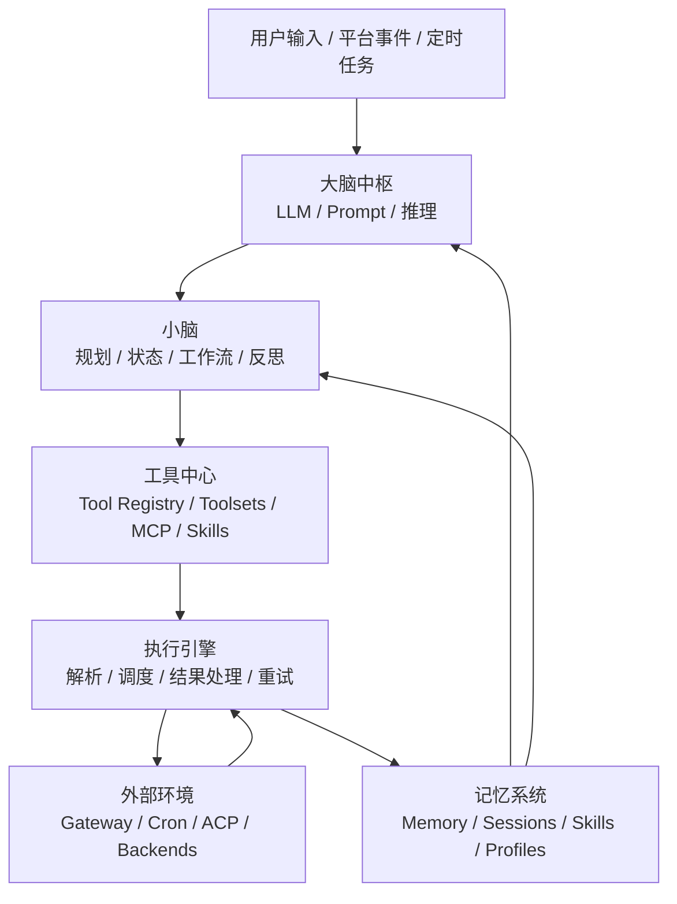

这里的“大脑中枢”“小脑”“工具中心”等说法，是为了分析运行时边界而使用的抽象，不是 Hermes 源码里的官方模块命名：

| 组件 | 解决的问题 | Hermes 中的代表实现 |
|:---|:---|:---|
| 大脑中枢 | 理解输入、生成推理、决定下一步行动 | LLM Provider、Prompt Builder、Context Compressor、Callbacks |
| 小脑 | 把复杂任务拆成步骤，维持状态，必要时反思和重规划 | AIAgent Loop、Cron 任务配置、脚本化/服务化调用入口、Context Compressor |
| 工具中心 | 定义 Agent 能使用哪些能力，以及这些能力如何注册和治理 | Tool Registry、Toolsets、Plugins、MCP Tools、Skills |
| 执行引擎 | 把模型输出的工具调用变成真实执行，并处理结果、异常和回退 | Tool Dispatch、Execution Backends、Streaming Callbacks、Result Persistence |
| 外部环境 | 让 Agent 接入真实世界，包括消息平台、IDE、文件系统、远程环境和自动化任务 | CLI / TUI、Messaging Gateway、ACP、Cron、local / Docker / SSH / Modal |
| 记忆系统 | 保存长期事实、历史会话、用户偏好和可复用经验 | Persistent Memory / User Profile、SQLite Sessions + FTS5、Skills、Profiles |

把这六个运行时边界连起来，Hermes 讲的是同一个架构命题：输入先被接入，随后被整理成稳定上下文，再通过工具与执行链路落到真实环境，最后以记忆、会话和技能的形式回流为长期状态。

### 21.2.2 设计哲学：窄腰与边缘，为什么能力要长在核心之外

上一节把 Hermes 拆成六个运行时边界，但还没回答一个更根本的问题：为什么这些边界要这么画？为什么"工具中心""记忆系统""执行引擎"全是环绕在 Agent Core 之外的一圈，而不是把能力直接塞进核心循环？

答案藏在 Hermes 官方开发指南（AGENTS.md）公开的第一条设计原则里：

> The core is a narrow waist; capability lives at the edges. Every model tool we add is sent on every API call, so the bar for a new core tool is high.

这句话有三个层层递进的判断。

**判断一：核心是"沙漏腰"，必须薄而稳定。** 这是互联网沙漏模型（hourglass model）的隐喻：互联网之所以能无限扩展应用，是因为中间只有一层极薄、极稳定的"腰"——IP 协议。腰之上（HTTP、各种 App）和腰之下（以太网、光纤）可以任意演化，但腰本身几十年不变。Hermes 的"腰"就是 `run_agent.py`（对话循环）、`model_tools.py`（工具编排）以及发送给 LLM 的那份工具 schema。这层必须薄、必须稳定，能力长在它的上下两端。

**判断二：每个模型工具都随每次 API 调用发送——这是"腰必须窄"的技术命门。** LLM 的函数调用机制决定了：每次向模型发请求时，必须把全部工具的 JSON schema（name + description + parameters）放进请求体。一个新 core tool 会带来三重代价，且对每一个用户、每一次调用都生效：

- Token 成本：50 个工具意味着 50 份 schema 在每个 turn 都被 token 化，即使用户从不调用某个工具也一直付费；
- 选择准确率：工具越多，模型在"该调哪个"上越容易出错（tool-choice confusion）；
- 缓存失效：工具 schema 是 system-prompt 前缀的一部分，增删工具会让前缀变化、prompt cache 失效、成本翻倍——这正好和"对话级缓存神圣"那条原则对称。

**判断三：因此"新增 core tool 的门槛极高"。** 这不是审美偏好，是边际成本结构决定的：core tool 的代价被乘上了（用户数 × 调用数）。所以大多数新能力应当作为 CLI 命令、service-gated tool 或 plugin 抵达，而不是增长核心表面。

把沙漏模型画出来，就能看到六个运行时边界其实是从这条哲学推出来的——核心只留一条薄腰，能力繁荣在它的两端边缘：

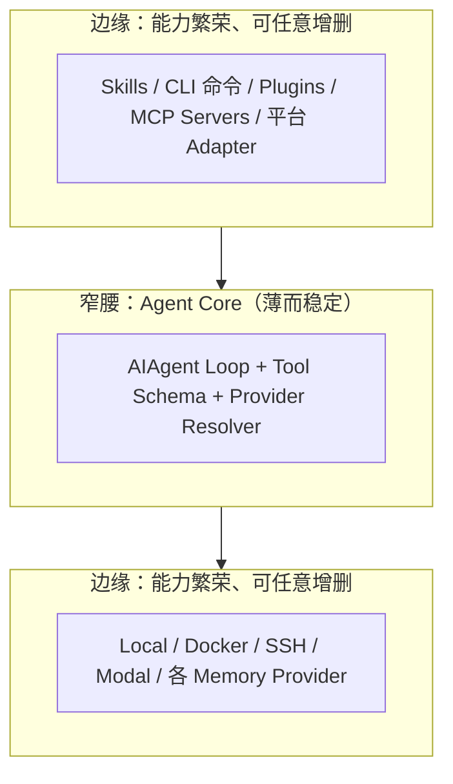

**Footprint Ladder：把这条哲学变成可操作的决策树。** AGENTS.md 给出一条"足迹阶梯"，按"对核心 schema 的永久污染程度"从低到高排列。任何新能力，都从最高（足迹最小）的梯子逐级选择：

| 阶梯 | 方案 | 对 core schema 的足迹 | 机制 |
|:---|:---|:---|:---|
| 1 | 扩展已有代码 | 零 | 能力是已有东西的变体，不新增表面 |
| 2 | CLI 命令 + skill | 零 | agent 走 `terminal` 调 `hermes x`，schema 里根本没有它 |
| 3 | service-gated tool（`check_fn`） | 未配置时零 | 前置条件不满足时根本不进 schema |
| 4 | Plugin | 仅启用时有 | 运行时发现，不装就没有 |
| 5 | MCP server（catalog） | 零永久核心足迹 | 经内置 MCP client 连接，不写进 core schema |
| 6 | New core tool | 永久、每次调用都有 | 进 `_HERMES_CORE_TOOLS`，所有平台继承，最后手段 |

阶梯里"零足迹"出现两次但含义不同：CLI 是"根本不在 schema 里"，service-gated 是"条件满足才出现"。两者都比"常驻 core"轻。正确的 core tool 只有在该能力"基础、对几乎所有用户有用、且 terminal+file 无法触达"时才允许——文档给出的范例是 `terminal`、`read_file`、`web_search`、`browser_navigate`。

**阶梯之外的元规则：同类能力要收敛成一套接口，不要逐个合并。** 文档给了一条容易被忽略但更关键的原则：当 3+ 个 PR 试图集成**同一类东西**（memory backends、providers、notifiers）时，不要一个一个合并——应当设计一套 **ABC（抽象基类）+ orchestrator（编排器）**，把**已有的内置实现作为第一个 provider 接入**，再让那些竞争的 PR 转成这套接口下的 plugin。原因是逐个合并会产出 N 套平行、重复的接入代码，core 每次都要变胖、每次都要改；收敛成一套接口后，core 只长一次（接口本身），之后所有同类能力都只是"实现接口的新 provider"，对 core 零改动。这正好把上面 21.2.2 反复强调的"扩展而不重复"（Extend, don't duplicate）从口号落成架构动作——能力增长不通过"往核心加特例"，而通过"往接口加实现"。

**一个反例：把抽象变具体。** 假设给 Hermes 加"发邮件"能力。(错误) 加一个 `send_email` core tool，结果是每个用户、每次对话、每轮调用的 schema 里都多一份邮件工具定义，哪怕他从不发邮件、连邮箱都没配。(正确) 用 `hermes mail send` CLI 命令 + skill，或做成 service-gated tool——仅在配置了 `EMAIL_*` 凭证时才出现在 schema，未配置用户零代价。三种正确方案的共同点：能力随需求出现，而非随核心常驻。

```text
增量核心 = 对所有用户 × 所有调用 放大成本
边缘能力 = 只对启用者 × 调用时 生效
```

**两条透镜是一枚硬币的两面。** 本章开头提到的"对话级缓存神圣"与这里的"窄腰"并非并列两条原则，而是耦合的：缓存原则说"腰不能动"（中途别改 schema），窄腰原则说"腰不能胖"（别往 schema 加东西）。两者合力推出同一个工程纪律——core toolset 是一个只减不增、至多缓慢增长的固定集合，任何增长冲动都被推到边缘消解。这正好解释了为什么 21.2.1 的六个边界里，"工具中心""记忆系统""执行引擎"全都环绕在 Agent Core 之外：它们被刻意挡在腰之外，以保持腰的薄与稳。

#### 关键判断：可扩展性的真正含义

多数 Agent 框架谈“可扩展”时，指的是“容易往核心加东西”。Hermes 的立场相反：可扩展性来自“尽量不往核心加东西”。把新能力推到 CLI、skill、plugin、MCP 这些边缘通道，核心才能长期保持薄、稳定、可缓存——这正是长期运行 Agent 区别于一次性脚本的关键工程纪律。

### 21.2.3 设计哲学：对话级缓存神圣，为什么中途不能动状态

窄腰原则回答的是“核心应该多小”，另一条设计原则回答的是“核心一旦定下来能不能动”。Hermes 官方开发指南（AGENTS.md）把它列为第一条设计原则：

> Per-conversation prompt caching is sacred. A long-lived conversation reuses a cached prefix every turn. Anything that mutates past context, swaps toolsets, or rebuilds the system prompt mid-conversation invalidates that cache and multiplies the user's cost. We do not do it (the one exception is context compression).

这句话可以拆成三个事实和一个纪律。

**事实一：长期对话每轮复用同一个缓存前缀。** 现代推理 API（如 Anthropic / OpenAI 的 prompt caching）允许把 prompt 的“前缀部分”缓存下来：system prompt、工具 schema、长期记忆等稳定内容只计费一次，后续每轮只要前缀不变，就按大幅折扣的缓存价计费。一个活了几十上百轮的长期 Agent，前缀被复用的次数越多，省下的钱越多。这正是“长期运行”能成立的成本前提——没有缓存，长对话的 token 账单会随轮数线性爆炸。

**事实二：缓存命中的前提是“前缀字节稳定”。** 缓存是按前缀的精确字节匹配的。只要前缀中任何一个字节变了（哪怕只是重新序列化、顺序微调、增删一个工具），缓存键就失效，这一轮起全部按全价重计，且后续轮次要重新累积缓存。换句话说，缓存是“脆弱的”——它奖励稳定，惩罚任何中途变动。

**事实三：三类操作会直接打碎缓存。** AGENTS.md 明确点名：(1) 改写历史上下文（mutates past context）；(2) 中途切换工具集（swaps toolsets）；(3) 中途重建 system prompt（rebuilds the system prompt）。这三类在朴素实现里很常见（比如“用户装了个新 skill，我顺手把它热加载进当前会话”），但在长期 Agent 里代价极高。

**纪律：默认不做，唯一例外是上下文压缩。** 因此 Hermes 的工程纪律是“我们不做”——任何改变过去上下文、切换工具集、重建系统提示的操作，默认都被禁止。唯一的例外是**上下文压缩（context compression）**：当对话超过模型窗口上限时，必须把历史压缩成更小的摘要;这是被迫的、且实现上要小心保持前缀结构。注意这揭示了一个重要次序——压缩是“不得不打碎缓存时的逃生舱”，不是日常手段。

把这条原则对工程行为的约束画成一张红线图：

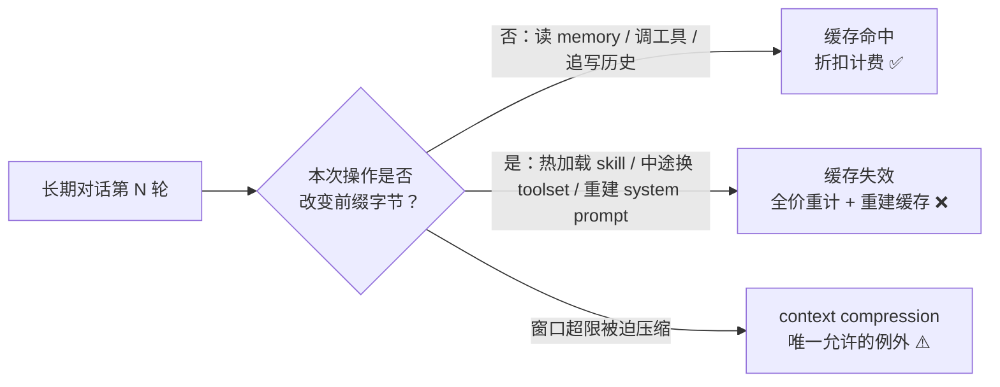

**它要求“缓存感知”的工具治理。** 这一原则直接塑造了 Hermes 的 slash command 设计：凡是会改 system-prompt 状态的操作（装 skill、换 toolset、改 memory），默认采用“延迟失效”——变更在**下一会话**才生效，并提供 `--now` 选项供用户主动选择立即失效。典型如 `hermes skills install --now`。这把“缓存神圣”从一个抽象禁令，落成了一条可执行的 UX 规则：中途想变的，先攒着，会话结束再落。

```text
热变更（中途改前缀）  → 打碎缓存 → 成本翻倍（默认禁止）
冷变更（下会话生效）  → 前缀字节稳 → 缓存持续命中（默认行为，--now 可越权）
```

**两条哲学是一枚硬币的两面，不是并列两条。** 21.2.2 的窄腰说“腰不能胖”（别往 schema 加东西），本节的缓存神圣说“腰不能动”（中途别改 schema）。两者指向同一个工程纪律：

```text
窄腰       → 工具集是固定集合，尽量不增长
缓存神圣   → 工具集是稳定前缀，尽量不变化
            ⇒ core toolset：只减不增、至多缓慢增长、且对话内不可变
```

这正是为什么六个运行时边界里所有“会随用户操作变化的能力”（skill 热装、toolset 切换、memory 重写）都被推到会话边界之外——它们一旦出现在进行中的对话前缀里，就会立刻破坏缓存。窄腰管“增长”，缓存神圣管“稳定”，二者合力把 Agent Core 锁成一条薄而不可变的腰。

#### 关键判断：长期 Agent 的成本纪律

一次性脚本不必在乎缓存，因为对话只有一轮。长期 Agent 的成本不在单轮，而在“前缀被复用了几百轮”的累积效应。Hermes 把“缓存神圣”列为第一条设计原则，本质上是在说：长期 Agent 的架构必须服从它的计费模型——凡是会破坏前缀稳定性的便利功能，都要让位于成本纪律。这是“可长期运行”四个字背后最硬的工程约束。

### 21.2.4 证据一：工程分层确实围绕运行时边界展开

如果从源码和运行时模块看，Hermes Agent 可以进一步分成几层工程分工：

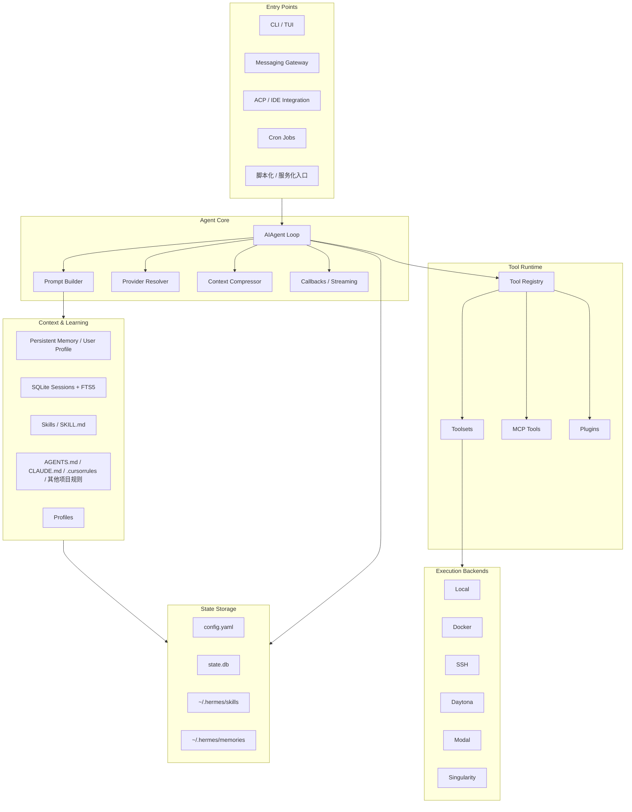

这张工程分层图最重要的意义，不是再增加一套抽象，而是说明前面的六个运行时边界在代码组织上确实彼此分离：

| 分离点 | 设计含义 |
|:---|:---|
| Entry 与 Core 分离 | CLI、Gateway、ACP、Cron 都复用同一个 Agent Core |
| Context 与 Tools 分离 | 记忆和技能决定“知道什么”，工具系统决定“能做什么” |
| Toolsets 与 Execution 分离 | 同一个 terminal 工具可以跑在 local、Docker、SSH 或云端后端 |

这种分层说明 Hermes 不是把所有逻辑塞进单一 Agent Loop，而是在入口、上下文、工具、执行和存储之间刻意维持边界。换句话说，前面的六个运行时边界不是人为硬拆，而是能被工程分层反向验证的 Runtime 结构。

### 21.2.5 证据二：目录结构如何落到这套架构

如果把分析抽象进一步压到工程落点，Hermes 的目录结构可以读成一张简洁的证据表：

| 目录或模块 | 对应架构角色 | 证据含义 |
|:---|:---|:---|
| `agent/` | Agent Core | 对话循环、Prompt Builder、压缩和回调集中在这里，证明 Hermes 有共享智能核心 |
| `tools/` | Capability Runtime | terminal、browser、file、memory 等能力与护栏逻辑同处一层，说明“能力”与“治理”一起被 Runtime 管理 |
| `gateway/` | Event Intake & Delivery | 多平台事件、session 路由和流式分发都从这里进入，证明入口与核心循环分离 |
| `hermes_cli/` | Operator Control Plane | `model`、`tools`、`skills`、`gateway`、`cron`、`profile` 等命令集中在这里，说明运行时存在明确控制面 |

其他区域如 `plugins/`、`skills/`、`providers/` 与 `tests/` / `docs/`，可以继续被理解为这四条主干之外的扩展层、记忆层、模型接入层和验证层，但它们不改变前面的主判断。接下来的重点因此不再是逐个目录介绍，而是沿着这套边界继续往下追踪运行时主线。

### 21.2.6 与第11章 Agent 组件地图的对应关系

这一节只做一个交叉校验：如果放回本书通用 Agent 组件地图，Hermes 最强的覆盖仍然是长期运行最关键的几条主线，也就是多入口事件接入、稳定上下文构建、工具与执行边界、长期记忆与学习回流。它因此更适合作为 Learning Loop、Memory Layer 和长期 Agent 的系统案例；至于企业生产所需的审批、合规审计、发布门禁和严格 Eval Harness，则仍然需要在这条 Runtime 主线之外额外补强。这里的目的只是确认前面的判断成立，而不改变后文继续沿着“输入、上下文、执行、回流”展开的叙事顺序。

---

## 21.3 运行时主线：从用户输入到工具执行再到状态持久化

从运行时看，Hermes 的一次任务不是简单的 `Prompt -> Answer`，而是一条带状态、工具、外部环境和记忆回流的数据链路：

```text
用户输入 / 平台事件 / Cron
  -> 入口标准化
  -> 大脑中枢理解任务
  -> 小脑拆解计划
  -> 工具中心选择能力
  -> 执行引擎调度工具
  -> 外部环境返回结果
  -> 执行引擎整理观察结果
  -> 大脑中枢继续推理或输出
  -> 记忆系统按需沉淀事实、会话和技能
```

这条链路里有三类数据流：

| 数据流 | 内容 | 关键风险 |
|:---|:---|:---|
| 任务流 | 用户意图、平台事件、Cron 任务、Slash Command | 入口信息不完整，任务边界不清 |
| 执行流 | tool call、执行后端、工具结果、错误和重试 | 高风险命令、超时、参数错误、结果过长 |
| 学习流 | Memory 更新、Session 归档、Skill 候选、Trajectory 数据 | 错误经验固化、隐私泄露、跨 profile 串线 |

Hermes 的关键点是：**Memory 不只是输入层，也在输出后参与回流。** 每次任务完成后，系统可以把稳定事实写入 persistent memory，把会话写入 SQLite，把可复用过程沉淀成 Skill，把执行轨迹交给 Research Pipeline。这样，Agent 的能力增长不依赖模型参数立即改变，而依赖 Runtime 中的上下文、技能和数据资产持续演进。

但记忆回流必须受约束。不是所有结果都应该写入长期记忆，也不是所有成功路径都应该变成 Skill。可靠的长期 Agent 需要在写入前判断：

- 这条信息是否长期有效；
- 是否属于当前 profile；
- 是否包含凭据、隐私或敏感业务数据；
- 是否经过工具结果或用户确认验证；
- 是否应该进入 Memory、Session、Skill，还是只作为本轮临时上下文。

这个判断决定了 Hermes 这类系统能否长期稳定运行。没有回流，Agent 每次都从头开始；没有约束，Agent 会把错误、噪声和越权信息永久化。

### 21.3.1 一个消息任务的端到端路径

如果把抽象数据流落到一个具体例子里，可以把一条 Telegram 消息在 Hermes 中的处理路径简化为：

1. 用户在 Telegram 中发来请求，例如“帮我检查这个仓库今天的 CI 失败原因”；
2. Gateway 适配器接收消息，并根据用户、线程和 profile 把它路由到正确 session；
3. Prompt Builder 组装人格、长期记忆、用户画像、相关 Skills、项目上下文和工具说明；
4. 模型先判断是否需要调用 GitHub、web、terminal 或 file 等工具；
5. Runtime 在对应 toolset 和执行后端上执行工具调用，并通过 callbacks 向用户流式反馈进度；
6. 工具结果回到 Agent Loop，模型继续推理，决定是追加调用、请求确认，还是直接给出答案；
7. 会话内容写入 session store；只有稳定事实才进入 persistent memory，只有经过验证的流程才进入 Skill 候选。

这个例子说明，Hermes 的核心不在“消息平台接进来了”，而在“平台入口、上下文构建、工具执行、状态持久化和能力沉淀”被串成了一条统一链路。

如果要把这条链路画成一张更适合读者快速浏览的时序图，可以简化为：

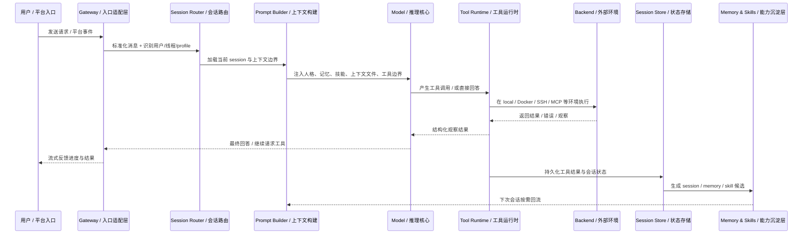

---

### 21.3.2 Agent Loop：统一多入口的运行核心

Hermes 的核心是一个同步编排引擎，可以理解为：

```text
load profile
  -> load config / memory / skills / context files
  -> assemble system prompt
  -> resolve provider and model
  -> receive user turn
  -> call model
  -> dispatch tool calls
  -> stream progress via callbacks
  -> persist session and tool results
  -> compress context when needed
  -> update memory / skills when appropriate
```

伪代码如下：

```python
def run_turn(user_message, profile, entry_point):
    config = load_config(profile)
    memory = load_memory(profile)
    skills = select_relevant_skills(user_message, profile)
    context_files = discover_context_files()
    sessions = load_session_state(entry_point, profile)

    prompt = build_prompt(
        personality=config.personality,
        memory=memory,
        skills=skills,
        context_files=context_files,
        tools=enabled_toolsets(entry_point),
        session=sessions.current,
    )

    while not done:
        response = model.complete(prompt)
        if response.tool_calls:
            results = tool_registry.dispatch(response.tool_calls)
            callbacks.stream_tool_results(results)
            prompt = append_observations(prompt, results)
            persist(results)
        else:
            callbacks.stream_answer(response.text)
            persist(response)
            done = True
```

这个循环和第 13 章 Coding Agent 的循环很像，但 Hermes 多了三个面向长期运行的能力：

- **Prompt Assembly**：每次会话开始时把人格、记忆、技能、项目上下文和工具指南组装成稳定系统提示；
- **Session Persistence**：会话写入 SQLite，并用 FTS5 支持跨会话搜索；
- **Learning Loop**：把经验沉淀到 memory 或 skill，而不是只留在一次对话里。

### 21.3.3 可中断和可观测

长期运行 Agent 必须可中断。用户可能在 CLI 里按 `Ctrl+C`，也可能在消息平台发新消息打断当前任务。Hermes 的设计强调：

- 工具调用过程对用户可见；
- 模型输出可以流式返回；
- 当前任务可以被用户中断或重定向；
- 背景进程可以被查询、等待、查看日志或终止。

这和传统后端的“请求进来、响应出去”不同。Agent 的执行可能持续几十秒甚至几分钟，用户需要知道它正在做什么、卡在哪里、是否可以停止。

### 21.3.4 复杂任务不是单一机制，而是四层运行时能力叠加

Hermes 处理复杂任务时，最容易被误读的地方是：源码里确实同时出现了 `delegate_task`、Kanban、MoA 和并发工具调用，但它们解决的不是同一个问题。更准确地说，Hermes 不是只有一种“复杂任务模式”，而是把复杂任务拆成四层不同的运行时能力：

- 单 Agent 工具链负责在同一个 Agent 回合里并行执行安全的工具调用；
- `delegate_task` 负责在同一个会话里拆分出隔离的子 Agent；
- Kanban 负责把任务持久化成可恢复、可依赖编排的长流程；
- MoA 负责在单轮推理前引入多个参考模型，增强当前决策质量。

如果把这四层并排看，会更容易理解 Hermes 为什么既像一个聊天 Agent，又像一个带调度能力的运行时：

| 维度 | `delegate_task` | Kanban Board | MoA（Mixture of Agents） | 单 Agent 工具链 |
|:---|:---|:---|:---|:---|
| 代表源码 | `tools/delegate_tool.py` | `tools/kanban_tools.py` + `gateway/kanban_watchers.py` | `agent/moa_loop.py` + `agent/moa_trace.py` + `hermes_cli/moa_config.py` | `run_agent.py` + `agent/tool_executor.py` + `toolsets.py` + `tools/registry.py` |
| 入口 | `delegate_task()` | Gateway 内嵌 dispatcher + `kanban_*` tools | `MoAChatCompletions.create()` | `AIAgent._execute_tool_calls()` |
| 核心目标 | 会话内子任务拆分 | 长流程、多 profile、可恢复任务编排 | 单轮推理质量增强 | 同一轮工具执行提速 |
| 持久化 | 否，主要是内存态子会话 | 是，SQLite board DB | 否，只有 turn 内缓存；trace 持久化是可选旁路 | 否，属于当前会话执行态 |
| 隔离方式 | 独立 `AIAgent`、独立 `task_id`、受限工具集 | 独立 task、独立 worker、可继承独立 workspace / profile | advisory view，只读历史文本，无工具权限 | 不额外隔离，仍是同一个 Agent |
| 并行引擎 | `ThreadPoolExecutor`，按 `max_children` fan-out | 独立 worker / task 进程，由 dispatcher 周期推进 | `ThreadPoolExecutor`，最多 8 个 reference models 并发 | `ThreadPoolExecutor`，只并发安全工具批次 |
| 心跳 / 存活 | 父 Agent 定期轮询 child 进度 | board heartbeat + claim TTL + watcher/dispatcher 检测 | 无 | 无任务级心跳，只有 timeout / interrupt 控制 |
| 依赖管理 | 基本无 DAG，偏 fan-out / fan-in | 有 `parents=[]`、link、unblock | 无任务依赖 | 无任务依赖 |
| 工具权限 | 子 Agent 默认会裁剪危险工具 | 由 `check_fn`、task ownership 和 toolset 配置共同约束 | reference 模型无工具权限，只有 aggregator 能行动 | 由 registry `check_fn`、guardrail 和并行安全规则约束 |

这张表背后的关键判断是：Hermes 的“复杂任务处理”并不是一个调度器统一包办，而是按问题类型选层。

- 如果问题只是“这一轮里要同时读几个文件、查几个接口”，那是单 Agent 工具链的问题；
- 如果问题是“把一个会话内的大任务拆成几个隔离子问题”，那是 `delegate_task`；
- 如果问题是“任务要跨 profile、跨时间持续推进，还要能阻塞、恢复和排依赖”，那是 Kanban；
- 如果问题是“当前这一步判断很重要，希望先听几个模型的 advisory opinions”，那是 MoA。

因此，后面要展开的 `delegate_task` 并不能代表 Hermes 的全部复杂任务能力。它只是这四层里最像“多 Agent”的那一层，也是最适合先展开讲清楚的一层。

#### 21.3.4.1 MoA 解决的是推理增强，不是任务编排

MoA 这个名字很容易让人误以为它和 `delegate_task` 一样，也是在运行多个会“行动”的 Agent。实际上源码里的 MoA 更像“多参考模型咨询机制”，而不是任务调度器。

它的运行方式是：

1. 当前 acting model 进入一次 MoA turn；
2. Hermes 先把当前对话压平为 advisory view；
3. 多个 reference models 并发读取这份 advisory view，分别给出建议；
4. aggregator model 读取这些参考意见，再决定下一步真正的输出或工具调用。

这里最关键的隔离点在于，reference models 看到的不是 Hermes 的完整运行时上下文。`_reference_messages()` 会做几件事：

- 剥离系统提示，避免把 Hermes 那段很长的系统前缀直接复制给参考模型；
- 把 `tool_calls` 扁平化成纯文本，例如 `[called tool: name(args)]`；
- 把 tool result 折叠成头尾预览，而不是原样重放整个结果；
- 最终只保留纯 `user/assistant` 文本视图，不给 reference models 任何工具权限。

这意味着 reference models 只能“看”和“评估”，不能真正行动。所以 MoA 的定位不是任务执行层，而是决策增强层。

另外，MoA 的缓存也只在当前 turn 内生效。缓存键由 `preset_name + advisory_view 的 SHA256 + reference_labels` 组成。只要有新的 user message 或新的 tool result，advisory view 就会变化，缓存立即失效，reference fan-out 会重新执行。这再次说明它关注的是“当前状态下这一轮该怎么想”，而不是长期任务状态管理。

#### 21.3.4.2 Kanban 解决的是持久化编排，不是会话内扇出

和 `delegate_task` 相比，Kanban 最大的不同不是“也能创建子任务”，而是它把任务当成 durable workflow 来管理。任务状态、父子依赖、评论、heartbeat、claim TTL 和 dispatcher 调度都在 board DB 里持久化，因此 worker 进程退出之后，任务本身仍然存在。

从这个角度看，Kanban 更接近一层轻量工作流运行时：

```text
task created
  -> 按 assignee / profile 进入 ready/running
  -> worker 进程执行
  -> heartbeat / comment / complete / block
  -> dispatcher 按 parents、状态和超时继续推进
```

这和 `delegate_task` 那种“父会话里起几个子 Agent，等结果回流”是两种完全不同的边界。前者强调 durable state machine，后者强调 in-memory fan-out。

因此，如果要给这一章一个很短的归纳，可以写成：

```text
单 Agent 工具链 = 同一 Agent 内的并行执行
delegate_task    = 同一会话内的隔离子 Agent
Kanban           = 跨 profile 的持久化任务编排
MoA              = 单轮推理前的多模型咨询
```

### 21.3.5 单 Agent 工具链：复杂任务如何在一个 Agent 内被持续推进

理解了四层运行时能力之后，还需要再补一个容易被忽略的点：Hermes 并不是只有进入 `delegate_task` 或 Kanban 才能处理复杂任务。大量真实任务其实都停留在**单 Agent 工具链**这一层，只是任务本身已经包含很多步骤、很多工具调用，以及混合的并行与串行关系。

这类任务的关键难点不是“能不能调用工具”，而是：

- 工具很多，哪些可以并行，哪些必须串行；
- 步骤很多，前一步结果会不会决定后一步动作；
- 工具输出很长，消息历史怎么不把上下文窗口撑爆；
- 任务持续很多轮时，模型怎么不丢失当前状态。

Hermes 处理这类复杂任务时，并不是把整个任务一次性塞进一个超长 prompt 里硬扛，而是把它拆成三条彼此独立、但每轮都会协同工作的控制线：

- **执行控制线**：这一批 tool calls 里哪些可以并行，哪些必须串行；
- **状态控制线**：本轮工具观察结果如何写回消息历史，变成下一轮决策输入；
- **上下文控制线**：哪些历史细节继续保留，哪些压缩成摘要，哪些转移到长期状态层。

把这三条控制线拼起来，可以得到单 Agent 工具链的主线：

```text
用户任务
  -> Agent 先推理出一批动作
  -> 运行时判断这批动作能否并行
  -> tool 执行结果按顺序写回消息历史
  -> 模型基于最新观察继续下一轮决策
  -> 当历史过长时触发上下文压缩
  -> 只保留继续完成任务所需的状态
```

#### 21.3.5.1 并行和串行不是模型自己说了算

模型可以在一次响应里吐出多个 tool calls，但它并不能最终决定这些调用是否并行。Hermes 在运行时先进入 `_execute_tool_calls()`，再根据当前这批工具的性质分流到串行路径或并发路径。真正的并发执行器在 `agent/tool_executor.py`，而是否允许并发，则先经过并行安全判断。

这层判断的核心不是“只要有多个工具调用就并行”，而是更接近下面这组规则：

- 纯读操作更容易并行；
- 带路径作用域的文件工具，只有目标路径不冲突时才适合并行；
- 高副作用或交互式工具通常必须串行；
- MCP 工具还要看 server 是否显式声明自己支持 parallel-safe。

因此，单 Agent 工具链里的并行本质上是**runtime-level parallelism**，而不是模型自由发挥的并行愿望。模型只能提出候选动作批次，真正是否并行，由运行时在安全边界内裁定。

#### 21.3.5.2 复杂任务不是一次走完，而是多轮“推理 -> 执行 -> 观察 -> 再推理”

单 Agent 并不会在任务开始时就把全部步骤一次性规划到底，然后机械执行。它更像一条持续迭代的闭环：

```text
第1轮：
  LLM -> 先查资料、读文件、搜索线索
  tools -> 返回观察结果

第2轮：
  LLM -> 基于新观察决定下一步动作
  tools -> 继续执行

第3轮：
  LLM -> 汇总、修正、补查或进入修改
```

这里最关键的判断是：Hermes 在单 Agent 模式下管理上下文的最小单位，不是“整个复杂任务”，而是“本轮新增的观察结果”。工具结果会被追加回消息历史，成为下一轮模型输入的一部分。换句话说，模型不需要在参数内部记住完整执行过程，运行时替它维护了一层外部工作记忆。

#### 21.3.5.3 上下文窗口靠三层机制维持稳定

复杂任务最容易失败的地方，不是工具不够，而是 tool output 太长，历史轮次太多，导致上下文窗口被无效细节占满。Hermes 在单 Agent 工具链里至少用三层机制处理这件事。

第一层是**工具结果预算控制**。不是每个 tool result 都会原样塞回上下文。执行层会对超长结果做裁剪，并在必要时把完整结果持久化到外部存储，而回灌给模型的是压缩后的可消费版本。这样模型看到的不是“原始输出全集”，而是“足够支撑下一轮决策的观察摘要”。

第二层是**会话内压缩**。当消息历史越来越长时，Hermes 会触发上下文压缩，把前面已经完成的细节收敛成更短的任务状态，例如“已知事实、已完成步骤、未解决问题、当前目标”，而不是永久保留完整 transcript。复杂任务里很多步骤一旦结束，后续轮次真正需要继承的只是结论，而不是原始过程。

第三层是**长期状态与当前状态分层**。当前任务进展主要存在于消息历史和 tool observations；历史细节可以依赖 SessionDB 和 session search 召回；长期稳定事实进入 memory；程序性经验进入 skills。这样，单 Agent 虽然仍是一个会话内循环，但它背后并不是一个无限增长的对话框，而是“当前活跃状态”和“长期状态资产”的分层组合。

#### 21.3.5.4 为什么很多步骤必须串行

单 Agent 工具链里的复杂任务，通常不是全并行的，因为很多步骤存在真实依赖关系。比如：

1. `search_files` 找候选文件；
2. `read_file` 读取命中的文件；
3. `terminal` 跑测试；
4. `read_file` 看失败日志；
5. `patch` 修复；
6. `terminal` 复测。

这条链里，后半段基本必须串行，因为测试结果决定下一步读哪个文件、改哪一段逻辑、是否还需要继续 patch。并行通常只出现在“同层独立观察”里，比如同时读多个文件、同时查多个接口、同时抓几个网页。

因此，单 Agent 工具链更像一种：

```text
串行主干
  + 局部并行观察
  + 每轮结果回灌
  + 超长历史持续压缩
```

它和 Kanban 的区别也正好在这里：Kanban 把依赖关系显式建模成可持久化的工作流状态；单 Agent 则没有真正的任务 DAG，而是让 LLM 在每一轮基于最新观察继续决策。

#### 21.3.5.5 用一个修 CI 故障的例子看单 Agent 工具链

一个很典型的例子是：用户让 Hermes “定位这个仓库今天 CI 失败的原因，修掉它，并确认测试通过”。

这类任务通常有四个特征：

- 步骤很多；
- 有些步骤可以并行；
- 有些步骤必须串行；
- 中间会产生大量 tool output，并持续很多轮。

Hermes 不会把它当成一次问答，而是当成一个单 Agent 工具链循环。

第一轮通常先做并行观察。模型可能一次吐出几个独立的只读工具调用，例如搜索 workflow、读取 `ci.yml`、读取 `pyproject.toml`、读取 `pytest.ini`。运行时先判断这些调用是否都是只读、路径是否冲突、是否夹带高副作用工具，如果安全，再通过线程池并发执行。第一轮的目标不是修复，而是先把“环境事实”建立起来。

第二轮开始进入串行主干。假设 Agent 现在已经知道 CI 跑了什么命令、测试入口在哪里，那么下一步往往是运行一次针对性的 `pytest`。这一步必须先执行，因为后面究竟读哪个源码文件、哪个测试文件，取决于失败堆栈的具体内容。于是运行时会先执行测试，把报错作为 observation 回灌，再让模型决定下一步读哪些文件。

第三轮可能重新出现局部并行。比如失败堆栈显示问题可能同时涉及 `src/foo/bar.py` 和 `src/foo/utils.py`，那两个 `read_file` 又可以并行。整个任务于是呈现出一种典型节奏：串行主干推进任务，局部并行观察加快信息收集。

第四轮进入修改阶段后，通常又回到严格串行。比如先 `patch` 修改实现，再跑 targeted test，如果还失败就继续看日志、再 patch、再复测。这部分几乎不能并行，因为 patch 的结果会影响下一次测试，而测试结果又决定后续修改策略。

如果把这个例子的节奏再压缩成一条时序线，可以写成：

```text
用户：修今天的 CI

第1轮
  LLM -> 并行 read/search
  tools -> 返回 workflow / config / test layout

第2轮
  LLM -> 串行跑 pytest
  tools -> 返回失败堆栈

第3轮
  LLM -> 并行读相关源码和测试
  tools -> 返回代码上下文

第4轮
  LLM -> patch 实现
  tools -> 修改文件

第5轮
  LLM -> 跑 targeted test
  tools -> 返回结果

第6轮以后
  继续补查、再 patch、再验证，直到收敛
```

在这个例子里，Hermes 能完成任务，并不是因为模型一次性“想清楚了全部步骤”，而是因为运行时帮它维持了一个持续更新的工作台：工具负责获取观察，运行时决定哪些调用能并行，结果按轮次回灌，长历史被压缩成状态摘要，而模型每次只需要解决“当前下一步该做什么”。

因此，单 Agent 工具链处理复杂任务时，本质上不是在一次超长 prompt 里预演完整执行过程，而是在一个持续更新的任务现场上做多轮决策。

### 21.3.6 Kanban Board：如何把复杂任务变成持久化工作流

如果说单 Agent 工具链解决的是“**同一个会话里，如何把很多步骤持续做完**”，那么 Kanban Board 解决的就是另一个层级的问题：**任务不再依附某一轮对话，而是被提升为可持久化、可恢复、可依赖编排的工作项**。

这也是为什么 Kanban 不只是“又一种多 Agent”。从源码看，它有自己完整的一套 board runtime：

- 工具面由 [tools/kanban_tools.py](/Users/xianguiwang/hermes-agent/tools/kanban_tools.py) 暴露，例如 `kanban_create`、`kanban_complete`、`kanban_block`、`kanban_heartbeat`；
- 调度面由 [gateway/kanban_watchers.py](/Users/xianguiwang/hermes-agent/gateway/kanban_watchers.py) 的 `_kanban_dispatcher_watcher()` 常驻 tick；
- 状态面落在 SQLite `kanban.db`，而不是某个 Agent 的临时消息历史里。

因此，Kanban 的主线更像下面这样：

```text
任务被创建到 board
  -> dispatcher 周期性扫描可运行任务
  -> 为未被 claim 的 ready task 启动 worker
  -> worker 在独立 profile / 独立 session 中执行
  -> worker 通过 kanban_complete / kanban_block / kanban_heartbeat 回写 board
  -> dispatcher 继续推进后继任务或回收超时 claim
```

这里最关键的变化是：**复杂任务的“当前状态”不再主要靠上下文窗口维持，而是显式写进 board**。单 Agent 模式里，任务进展主要存在于消息历史与外部 observation；Kanban 模式里，任务进展则体现在 task status、依赖关系、评论、claim、heartbeat、run 记录这些持久化字段上。

从运行时角度看，Kanban 有四个核心机制。

第一，**dispatcher 把任务推进从“模型决定下一步”变成“board 决定谁现在可运行”**。`_kanban_dispatcher_watcher()` 会按固定间隔 tick，读取配置，控制 `max_spawn` 和 `max_in_progress`，然后把真正的 dispatch 放到后台线程里执行，避免 SQLite 锁阻塞 gateway 事件循环。也就是说，Kanban 的调度中心不是某个 Agent 的当前推理，而是 board 上“哪些任务已经 ready、哪些任务还能继续抢占执行”。

第二，**worker 生命周期是显式受控的，不是会话自然结束就算完成**。当 dispatcher 启动一个 task worker 时，会把 `HERMES_KANBAN_TASK`、`HERMES_KANBAN_RUN_ID` 之类的环境变量注入进去。随后这个 worker 只被允许操作自己的 task：源码里的 `_enforce_worker_task_ownership()` 会阻止它错误地完成或阻塞别的 task。这一点很重要，因为它意味着 Kanban worker 虽然本质上也是 Agent，但它在运行时被收窄成“只服务这一张 task 卡片”的执行单元。

第三，**heartbeat 和 claim TTL 让长任务具备可回收性**。单 Agent 会话如果挂掉，通常就是这轮对话中断；而 Kanban 不能接受“挂掉就没人知道这张卡现在归谁”。所以 worker 除了显式调用 `kanban_heartbeat`，运行时还会通过 activity bridge 把进程活跃度同步回 board，更新 `last_heartbeat_at`。dispatcher 则据此判断某个 claim 是否已经 stale，是否需要 reclaim 再次调度。这样一来，复杂任务即使跨数小时、跨进程重启，也不会因为某个 worker 消失而永久卡死。

第四，**依赖关系是显式 DAG，不再靠 LLM 临时记忆顺序**。单 Agent 工具链里当然也有“先跑测试再看报错再 patch”这种顺序，但这种顺序只是运行时事实，不会单独落成一张依赖图。Kanban 则不同，父子任务与 `parents=[]` 依赖链本身就是 board 的一等公民。任务何时 ready，不取决于模型是否还记得“上一件事做完了没”，而取决于 board 中前置任务是否真的已经完成。

Kanban 机制里还有一个非常典型、也非常容易被忽略的问题：**前置任务正在产出中间结果时，下游任务是否可能因为“看起来已经差不多完成”而被过早启动。** 例如，调研 Agent 还在运行，只是已经写出了一部分评论、摘要或中间工件；此时编码 Agent 如果把这些中间信号误读为“前置已经完成”，就可能尝试提前认领编码任务，进而把半成品结论传播到后续执行链条中。这本质上是一类分布式竞态条件：不同执行单元对“前置是否完成”这一事实的观察并不同步。

Hermes 对这类问题的处理思路非常明确：**不把自然语言评论当成调度真相，而只把经过事务提交的 board 状态当成调度真相。** 评论、summary 和 artifact 可以作为任务之间的信息共享媒介，但它们本身并不构成依赖完成的判据。真正决定下游任务能否启动的，是父任务在 board 中是否已经正式进入 `done` 或 `archived`，以及 claim 边界上的再次校验是否通过。

第一道防线是 **dispatcher 的单 tick 锁**。`dispatch_once()` 在真正执行 reclaim、promote、claim 和 spawn 之前，会先取得 board 级别的 dispatch lock。这样，同一块 `kanban.db` 在同一时刻只允许一个 dispatcher tick 进入写路径；未获得锁的调度者会直接返回 `skipped_locked=True`，不做任何 DB 变更。这一层防护的作用，不是判断任务语义，而是先消除控制平面上的并发写入：无论是 gateway 内嵌 watcher，还是手工执行的 `hermes kanban dispatch`，都不能并发地对同一批 `ready` 任务做状态推进。

第二道防线是 **状态机中的依赖门控**。dispatcher 在一轮 tick 中，不会简单地根据“任务存在”就拉起 worker，而是先执行 `recompute_ready()`，把仍在 `todo` 中的任务重新检查一遍。只有当所有 parent task 的状态已经是 `done` 或 `archived` 时，子任务才会被提升为 `ready`。这意味着，“评论已经写到一半”“worker 似乎快结束了”“summary 已经初步成形”这些事实，统统不会被视为依赖满足信号。Kanban 真正相信的是 task row 上已经提交的正式状态，而不是中间文本的语义暗示。

不过，Hermes 并没有在 `ready` 这一层停止校验，因为在工程实践中，`ready` 本身也可能因为异常恢复、人工改写或历史 bug 而出现脏状态。因此，第三道防线是 **claim 边界上的二次一致性校验**。`claim_task()` 在事务内部会再次查询这张子任务的所有 parent，并确认它们是否都已经进入 `done` 或 `archived`。如果仍然存在未完成的 parent，Hermes 不会允许任务从 `ready` 进入 `running`，而是会立刻把它重新打回 `todo`，并写入一条 `claim_rejected(reason=parents_not_done)` 事件。换句话说，`ready` 在 Hermes 中只是“具备候选执行资格”的状态，而不是不可推翻的最终准入结果；真正的执行准入点是 `claim_task()` 这一事务化边界。

第四道防线是 **原子 claim 的 compare-and-swap 约束**。即使前置条件已经真实满足，系统仍然必须防止两个下游 worker 同时认领同一张卡。为此，Hermes 在 `claim_task()` 中使用 `WHERE status = 'ready' AND claim_lock IS NULL` 的条件更新，把“检查任务是否可认领”和“写入 claim_lock / claim_expires / running 状态”合并为一次原子操作。结果是，只有一个 claimer 可以成功把任务从 `ready` 改成 `running`；其他并发 claimer 会因为条件不再成立而直接失败。这一层解决的不是依赖语义问题，而是典型的“双认领同一任务”问题。

因此，Hermes 对上述竞态的规避并不是建立在“要求 Agent 更谨慎”之上，而是建立在一个更强的运行时事实之上：**评论和中间结果可以被共享，但它们不能单独触发下游执行；真正的调度权限，始终由 board 中正式提交的父任务状态、状态机中的 promotion 规则、claim 边界的二次校验，以及原子 claim 锁共同决定。** 这使得下游 Agent 即便主观上误判“前置已经差不多完成”，也无法仅凭自身判断越过框架的执行约束。它最多只能发起一次 claim 尝试，而是否真的进入 `running`，最终仍由 Kanban runtime 的状态机和事务控制裁定。

如果把这一过程压缩成一张时序图，可以得到下面这条控制线：

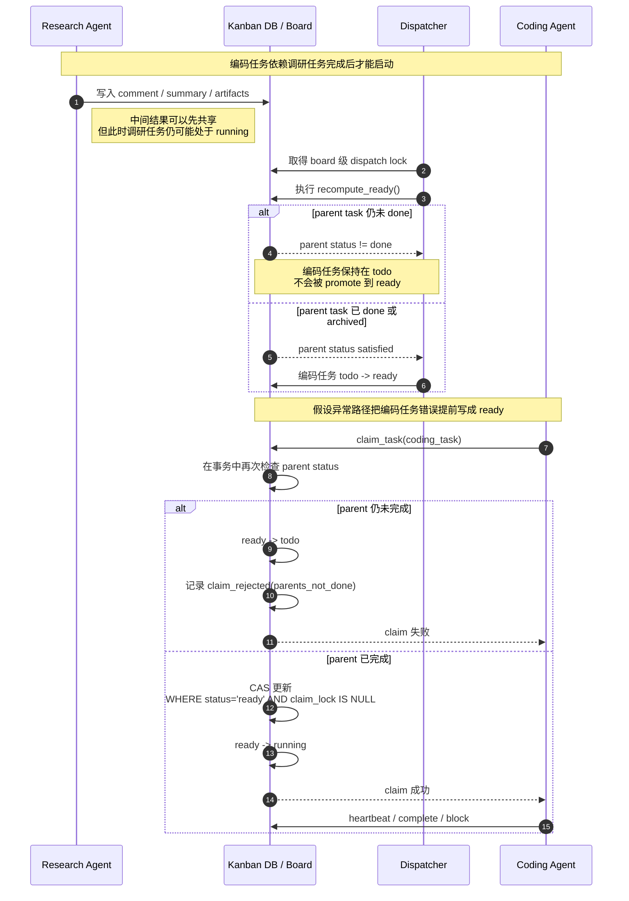

可以用一个非常典型的例子理解两者区别：假设要完成“为一个新功能上线准备完整发布包”，里面有三个子任务：

1. 后端补 API；
2. 前端改页面；
3. 验证通过后更新发布说明。

如果用单 Agent 工具链做，这更像一个长回合里的串行主干加局部并行观察，任务状态主要存在会话上下文里。  
如果用 Kanban 做，Hermes 更可能把它建成：

```text
task A: 后端补 API
task B: 前端改页面
task C: 更新发布说明（parents=[A, B]）
```

然后 dispatcher 可以并发拉起 A、B 两个 worker；只有当 A、B 都完成后，C 才会进入 ready 状态。这里“等待依赖完成”已经不是 prompt 里的文字描述，而是 board runtime 的真实约束。

所以，Kanban Board 的本质不是“让更多 Agent 一起说话”，而是：

```text
把复杂任务从会话内推理循环
提升为可持久化、可恢复、可依赖编排的任务系统
```

这也是为什么在 Hermes 里，Kanban 更适合跨 profile、跨时间、跨任务依赖的长流程协作；而单 Agent 工具链更适合同一 Agent 在当前会话里连续完成一个复杂但局部收敛的问题。

### 21.3.7 多 Agent 机制：`delegate_task` 驱动的子 Agent 扇出与汇总

Hermes 的多 Agent 不是默认运行模式，也不是在一个会话里让多个“人格”轮流发言。它的触发条件很明确：**只有当父 Agent 当前这一轮的 LLM 输出了 `delegate_task` 这个 tool call，Hermes 才会进入多 Agent 路径。**

也就是说，多 Agent 在运行时里的地位首先是一个工具能力，而不是一个常驻调度框架：

```text
父 Agent run_conversation()
  -> LLM 返回 tool_calls
  -> 其中某个 tool name == delegate_task
  -> Hermes 执行 delegate_task()
  -> 创建一个或多个 child AIAgent
  -> child 各自运行自己的 run_conversation()
  -> 结果汇总回父 Agent
```

这里最容易误解的地方有两个。第一，Hermes 不会在“检测到任务很复杂”时自动偷偷切成多 Agent，触发点必须是模型显式选择了 `delegate_task`。第二，`delegate_task` 并不是让父 Agent 自己开几个线程继续同一段上下文，而是**真的 new 出新的 `AIAgent` 实例**，每个实例都有自己的对话循环、工具调用链和会话状态。

#### 21.3.7.1 `delegate_task` 的参数是模型直接给出的

父 Agent 第一次请求自己的 LLM 时，模型看到的是 `delegate_task` 的 schema。这个 schema 允许模型返回 `goal`、`context`、`tasks`、`role` 等结构化参数。换句话说，Hermes 不是在模型说“我想委派”之后再去补问一次参数，而是模型在 tool call 里一次性把委派参数写完整：

```json
{
  "name": "delegate_task",
  "arguments": {
    "tasks": [
      {"goal": "检查 A 模块", "context": "重点看依赖和边界"},
      {"goal": "检查 B 模块", "context": "重点看职责和测试"}
    ],
    "role": "leaf"
  }
}
```

运行时拿到这段 `arguments` 后，直接解析成 Python dict，再归一化成内部的 `task_list`。所以这里的控制关系是：

```text
父 LLM 决定是否委派
  -> 父 LLM 决定委派参数
  -> Hermes 负责把参数翻译成子 Agent 的 system prompt + user message
```

#### 21.3.7.2 子 Agent 如何启动：不是共享上下文，而是重新组装输入

`delegate_task` 会为每个 task 创建一个新的 child `AIAgent`。这里最关键的设计是：**对子 Agent 的输入不是把父会话的完整消息历史原封不动复制一遍，而是重新组装成聚焦当前子任务的最小上下文。**

可以把 child 的启动输入理解为两部分：

- `goal` 变成 child 的 `user_message`
- `context`、`workspace_path`、`role` 等变成 child 的系统提示词

因此，子 Agent 真正发给自己 LLM 的请求更像：

```json
[
  {"role": "system", "content": "You are a focused subagent... YOUR TASK: 检查 A 模块 ... CONTEXT: 重点看依赖和边界 ..."},
  {"role": "user", "content": "检查 A 模块"}
]
```

这个设计非常重要，因为它避免了把父会话里无关的中间推理、工具结果和噪声一并带进子上下文。Hermes 让父 Agent 负责“定义任务边界”，让子 Agent 负责“在隔离上下文里把这个边界跑完”。

#### 21.3.7.3 每个子 Agent 都有自己的 session，而不是共用父 session

Hermes 的多 Agent 不是共用一个 session。更准确地说，它是**独立 session + 父子关联**：

- 父 Agent 维持自己的主会话；
- 每个子 Agent 会新建自己的会话状态；
- child 会记录 `parent_session_id` 和 `_delegate_from` 等父子关系；
- 最终回到父层的不是“共享同一段消息历史”，而是子会话产出的 summary / tool result。

因此，子 Agent 与父 Agent 的关系更像“派生出的子会话”，而不是“同一会话里的第二个线程”。这也解释了为什么子 Agent 默认没有父会话的完整历史、默认跳过 memory / context files、并且拥有独立的工具循环和执行状态。

#### 21.3.7.4 请求时序：父先决策，子各自求解，父再整合

从 LLM 请求时序看，Hermes 的多 Agent 不是“一次请求里让多个 Agent 同时思考”，而是三段式：

1. 父 Agent 先请求一次父 LLM，决定是否调用 `delegate_task`；
2. Hermes 启动多个 child，每个 child 各自进行自己的多轮 `LLM -> tools -> LLM` 循环；
3. child 结果聚合成 `delegate_task` 的 tool result，再回到父 Agent，由父 LLM 再请求一次，生成最终整合回复。

如果压缩成时序：

```text
父1次请求
  -> 返回 delegate_task
  -> child1 多次请求
  -> child2 多次请求
  -> ...
  -> 汇总为 delegate_task 的 tool result
  -> 父再1次请求
  -> 输出最终答案
```

这说明 Hermes 的多 Agent 不是在父循环内部引入一个模糊的“协作模式”，而是把它明确做成：**父负责拆分与整合，子负责独立求解。**

#### 21.3.7.5 顶层委派与 orchestrator 委派：异步和同步两种模式

Hermes 的委派还有一个很值得记录的细节：**顶层父 Agent 和 orchestrator 子 Agent 的委派模式并不相同。**

- 顶层父 Agent 发起 `delegate_task` 时，Hermes 默认把它当成后台委派处理。父会话不会一直阻塞等待 child，而是继续运行，等子结果稍后重新回流。
- 如果当前调用者本身已经是一个 subagent，尤其是 `role="orchestrator"` 的子 Agent，那么它对子 worker 的委派通常是同步等待的，因为 orchestrator 必须先拿到 worker 的结果，才能向自己的父层做一次汇总。

这形成了一个很清晰的运行时分工：

```text
顶层父 Agent:
  delegate_task -> background delegation

orchestrator 子 Agent:
  delegate_task -> sync fan-out + fan-in
```

这种设计避免了两个问题：一方面，顶层聊天界面不会因为子任务而完全卡死；另一方面，负责中间协调的 orchestrator 又能在自己的回合里完成真正的聚合工作，而不是把“整合责任”继续往外推。

#### 21.3.7.6 desktop 看到的主要是父层视角的汇总

从展示层看，desktop 主聊天区看到的主要是**父 Agent 视角的汇总信息**，而不是每个子 Agent 的完整原始上下文。也就是说，默认主视图里最核心的内容通常是：

- 父 Agent 发起了 delegation；
- 子 Agent 的运行状态和进度事件；
- `delegate_task` 汇总出来的结果；
- 父 Agent 基于这些结果给出的最终回答。

子 Agent 的 `subagent.start`、`subagent.progress`、`subagent.tool`、`subagent.text`、`subagent.complete` 等事件更像监控流或观测流，而不是直接把 child 的完整 transcript 平铺给用户。因此，UI 层默认遵循的是和运行时同样的原则：**子 Agent 负责跑，父 Agent 负责汇总，主聊天区优先展示父层可消费的结果。**

这一点和 session 隔离是一致的。既然 child 自己是独立会话，主聊天区自然也不会把所有 child transcript 混进父会话正文；真正回到父会话的，是经过约束和预算控制后的 summary / tool result。

---

### 21.3.8 上下文稳定性与厂商缓存：长期 Agent 的第三个成本维度

21.3.5.3 讲了三层机制解决“上下文窗口装不下”的问题。但对于长期运行的 Agent，上下文还有第三个成本维度，这层我们在 21.3.5.3 里没有展开：**同一条长会话里，系统提示词和已发生历史每轮都被重新发送给模型、重新计费**。窗口稳定不等于成本稳定——如果系统提示词每轮字节都变，模型确实“装得下”，但 LLM 厂商对输入前缀的 prompt caching 就永远命中不了，同一段长 system prompt 会被重复全价计费几十次。

把三个维度放在一起看会更清楚：

| 维度 | 解决的问题 | Hermes 对应机制 | 失败后果 |
|:---|:---|:---|:---|
| 上下文体积 | 窗口装不下 | 工具结果裁剪、会话内压缩、长期/当前状态分层（21.3.5.3） | 超出上下文窗口，任务中断 |
| 行为一致性 | 人格/事实中途跳变 | Stable / Context / Volatile 分层（21.4.1） | Agent 说话方式、已知事实每轮漂移 |
| **前缀缓存命中** | **长会话输入成本爆炸** | **frozen snapshot：系统提示词首轮构建后整体缓存、会话内不重写（21.4.3）** | **同一段前缀被重复全价计费，成本成倍放大** |

关键判断是：**前面两层的“分层”动机，不只为避免窗口溢出和行为漂移，也为保住缓存前缀**。LLM 厂商（Anthropic 系）对稳定的输入前缀做哈希缓存，命中部分按约 1/10 计费；前缀字节一旦中途变动，缓存作废、整段重算重计费。所以“系统提示词会话内字节稳定”是一条跨越“窗口 / 一致性 / 成本”三重目标的统一约束，也是 AGENTS.md 把 "prompt caching is sacred" 列为最高优先级原则的原因。

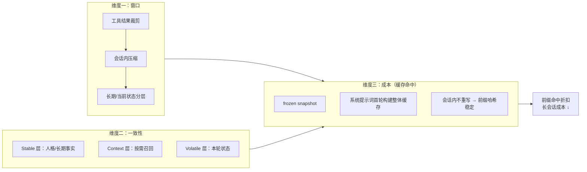

Hermes 在这条主线上的具体落点是：系统提示词在首轮由 `build_system_prompt()`（`agent/system_prompt.py:470`）构建一次、整体缓存到 `agent._cached_system_prompt`；续会话时 `_restore_or_build_system_prompt`（`agent/conversation_loop.py:277`）若发现已存 prompt 与 runtime 匹配，直接复用而非重建。缓存的物理本质、KV 复用过程、厂商两大家族差异与 `system_and_3` 断点布局，详见 **21.4.3**。

---

## 21.4 上下文主线：Prompt System 如何保持长期稳定

Hermes 的 Prompt System 不只是把用户输入发给模型，而是一个上下文控制面。它不是把所有材料随机拼在一起，而是按缓存友好度和生命周期把上下文分成 `Stable / Context / Volatile` 三层。这个分层首先是运行时稳定性机制，其次才是提示词组织技巧。

### 21.4.1 Stable / Context / Volatile：先按生命周期，再按来源组装

Hermes 先回答“什么内容应该稳定存在”“什么内容应该按需召回”“什么内容只属于当前 turn”，再决定这些内容怎么进入 prompt：

| 层 | 典型内容 | 进入方式 | 设计目标 |
|:---|:---|:---|:---|
| Stable | `SOUL.md`、`~/.hermes/memories/MEMORY.md`、`~/.hermes/memories/USER.md`、工具边界 | 会话开始时构建 system prompt 前缀 | 让人格、长期事实和行为边界保持稳定 |
| Context | Skills、`AGENTS.md`、`CLAUDE.md`、`.cursorrules`、session search 结果 | 按任务相关性选择或检索 | 只把当前任务真正需要的材料带进来 |
| Volatile | 当前用户消息、工具观察、最新错误、临时计划 | 每轮推理实时追加 | 允许任务在本轮持续演进 |

Prompt System 的关键不是“资料越多越好”，而是“稳定前缀尽量稳定，动态材料尽量后置”。长期 Agent 如果不先做这个分层，很快就会在上下文体积、缓存命中率和行为一致性之间互相打架。

### 21.4.2 文件分工：哪些材料进入稳定前缀，哪些只按需召回

从实现边界看，Hermes 至少在四类来源之间做了明确分工：

| 来源 | 代表文件或对象 | 运行时位置 | 为什么这样放 |
|:---|:---|:---|:---|
| 人格与长期身份 | `SOUL.md`、`~/.hermes/memories/USER.md` | Stable | 这是 Agent 的说话方式和用户长期偏好，不应该在会话中途跳变 |
| 长期事实 | `~/.hermes/memories/MEMORY.md` | Stable | 适合保存环境事实、项目约定、长期约束 |
| 项目规则与程序性经验 | `AGENTS.md`、`CLAUDE.md`、`.cursorrules`、Skills | Context | 只在当前任务相关时加载，避免稳定前缀无意义膨胀 |
| 本轮任务状态 | 当前消息、tool results、运行中计划 | Volatile | 这部分必须随每轮推理变化 |

这里最重要的判断不是“哪些文件存在”，而是“哪些边界允许进入 system prompt 前缀”。Hermes 把 `SOUL.md`、`USER.md` 和 `MEMORY.md` 视为高敏、稀缺、需要缓存稳定性的材料；把历史会话和技能放在按需召回层，避免每轮都重放。

---

### 21.4.3 Prompt Caching 与 frozen snapshot：会话内更新，前缀不重写

Hermes 在会话开始时把 `MEMORY.md`、`USER.md` 和 `SOUL.md` 读成 frozen snapshot（冻结快照），渲染进系统提示词前缀；整个会话内即使 memory store 发生更新，当前 system prompt 也不会立刻被重写。这不是“少做一步”，而是为了让 LLM 厂商的 prompt caching 命中稳定前缀、并避免会话中途的人格漂移。要理解这条边界，先要弄清楚“prompt caching 到底缓存了什么、为什么前缀一变就作废”。

#### 21.4.3.1 两层缓存内容：逻辑前缀与物理 KV

LLM 厂商的 prompt caching 要分两层理解，二者容易被混为一谈：

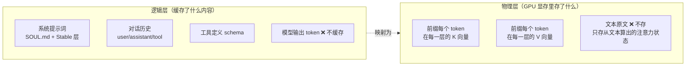

- **逻辑层**：缓存的是“输入前缀的 token 序列”——从请求开头到缓存断点之间的全部输入（系统提示词、对话历史、工具 schema）。模型生成的**输出 token 不缓存**；但上一轮的输出会作为本轮历史进入输入，于是被间接缓存。
- **物理层**：缓存的不是文本，而是该前缀在 Transformer **每一层、每个 token 的 (K, V) 注意力张量**（Key/Value 向量）。下次相同前缀的请求直接加载这些 KV，**跳过对前缀的 prefill（注意力预处理）**，只对新增 token 计算。

> **术语澄清（避免与 21.3.4.1 混淆）**：这里“查缓存命中的钥匙”是**前缀 token 序列的哈希**（cache key）；而注意力 K/V 向量是**被缓存存储的内容**，不是钥匙。另外，21.3.4.1 讲的 MoA 缓存键（advisory view 的 SHA256）是 Hermes 在**应用层**自己做的参考模型结果缓存，与 LLM 厂商在**推理层**做的 prompt caching 是两回事：键空间、失效条件和节省对象都不同。

**一个真实例子：KV 复用到底怎么发生。** 假设系统前缀首句是 `You are a helpful coding assistant.`，模型为其中 7 个 token 在 32 层各算出一对 (K, V) 向量存入显存（文本原文不存，存的是从文本算出的注意力状态）。第 2 轮处理新 token `Now` 时，只新算它的 Query 向量，再拿 Q 与缓存里已存的每个 K 做点积得到注意力分数，对缓存的 V 加权求和——前缀的 K/V 直接复用，前缀的 prefill 算力被省。

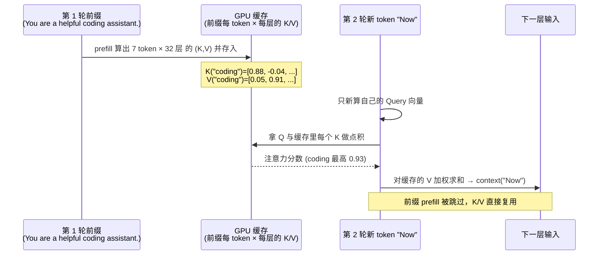

因此缓存同时带来两层收益：**前缀 prefill 算力被省（延迟与 GPU 开销下降）+ 前缀输入 token 计费打折**。代价是：前缀字节一旦中途变动，旧的 K/V 作废需重算——这正是 AGENTS.md 把 "prompt caching is sacred" 列为最高约束的物理根源。

#### 21.4.3.2 两条成本账：prefill 算力 vs 输入计费

一个常见误解是“每轮都要重新推理，所以缓存没用”。澄清三个维度：

| 维度 | 是什么 | 缓存能不能省 | 说明 |
|:---|:---|:---|:---|
| 推理算力（prefill） | 模型每轮必须把整个上下文从头读一遍 | **能省** | 稳定前缀的 K/V 直接复用，跳过 prefill |
| 输入 token 计费 | 按发送的输入 token 数收钱 | **能省** | 命中前缀按折扣（Anthropic 约 0.1×）而非全价 |
| 新增 / 输出 token | 当轮新消息、模型生成 | **省不了** | 永远全价 |

**一个 100 轮会话的成本账（系统提示词 4000 token，每轮新增 200 token）：**

| 方案 | 第 1 轮 | 第 100 轮 | 100 轮总输入计费（相对） |
|:---|:---|:---|:---|
| 不缓存（naive） | 全价 4200 | 全价 23800 | **≈ 141 万 token 全价** |
| 有缓存（Hermes） | system+历史首轮全价，新增全价 | 前缀命中折扣，仅 `msg100` 200 全价 | **≈ naive 的 1/5 ~ 1/10** |

不缓存时同一段历史被重复全价计费数十次；有缓存时系统提示词与历史只在首轮全价一次，之后折扣，仅当轮新增全价。所以“前缀稳定”直接决定长会话成本——这解释了为什么 Hermes 把系统提示词设计成“会话内字节稳定、首轮构建后整体缓存”。

#### 21.4.3.3 Hermes 的 `system_and_3` 断点布局

Hermes 不对整段历史都打缓存断点（Anthropic 每请求最多 4 个断点）。源码 `agent/prompt_caching.py` 采用名为 `system_and_3` 的布局：只在 **系统提示词** 和 **最近 3 条非系统消息** 上注入 `cache_control` 标记，其余消息不打。

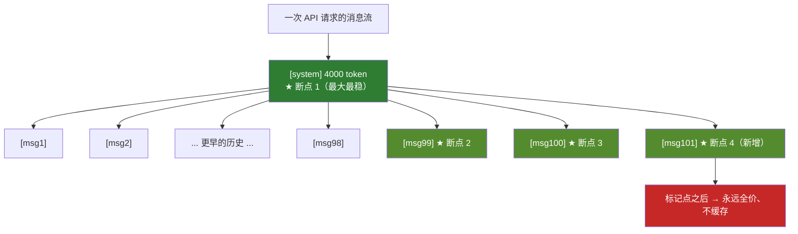

- **系统提示词**是最大且最稳的缓存块（对应 21.4.1 的 Stable 层），命中折扣是大头；
- **最近 3 条**覆盖工具调用的局部回看需求，且很快滚出窗口、写入成本可控；
- 文件 docstring 自述该布局在多轮会话中削减约 **75%** 输入成本（`agent/prompt_caching.py:5`）。
- 一个容易误解的点是“更早的历史滑出 3 条窗口后就按全价计费”。**不准确**：在只追加、字节稳定且 TTL 未过期的会话里，更早的历史通过“最长前缀命中”持续保持缓存读取，并不会因滑出窗口而变全价。3 条滑动窗口的作用见下文——它是在“把增长的历史写进缓存”，而不是“丢弃更早的”。

#### 21.4.3.3.1 为什么是“3 条尾部断点”而不是“1 条”：滑动断点的根本作用是“写”

一个 `cache_control` 断点的语义是“把从请求开头到这个断点为止的前缀写（commit）进缓存”。因此断点有双重身份：**写**（把此前缀存入缓存，供以后读）与**读**（本轮匹配已存在的最长前缀、命中折扣）。关键推论——**如果某段前缀从未被任何断点写过，它就永远不在缓存里，之后也读不到**。

**反例：若只有 system 一个断点**。每轮只在 `[S]` 处写入，更长的前缀 `[S,m1]`、`[S,m1,m2]`… 从未被 commit，于是第 2 轮起 m1、m2… 全部读不到缓存、按全价重算。**这就是尾部断点存在的根本理由：只有在“当前最后一条消息”上打断点，才能把“包含全部历史的最长前缀”写进缓存，下一轮才可能读到它。没有尾部断点，增长的历史根本进不了缓存。**

**断点为何贴着尾部滑动**：会话每轮在尾部追加新内容，要让“含新内容的最长前缀”进缓存，断点就必须追着增长的边缘挪到当前最后一条。`system_and_3` 里 3 条尾部断点的根本作用正是**“写”而非“读”**——Anthropic 只在断点处 commit 前缀，没有尾部断点，历史永远进不了缓存、每轮全价重算；断点贴着尾部滑动，是为了持续把“含最新内容的最长前缀”写入，供下一轮以最长前缀命中读取。

**为何是 3 而非 1**：每个 agentic 回合常一次追加多条 block（user + 多个 tool 结果 + assistant 回复），且受限于 Anthropic 每请求最多 4 个断点上限与写入价（约 1.25×），不能给每条历史都打断点。3 条窗口是“覆盖回合尾部 + 留重叠余量”与“名额上限”的平衡，理由有三：

1. **覆盖多 block 回合**：一个带 2 次工具调用的回合可能一次追加 5~6 条消息。若只在最后一条打 1 个断点，中间 tool_result 都没被单独 commit，下一轮匹配窗口够不到时可能整段回合重写。3 条窗口一次覆盖回合尾部多条 block，保留多个写入锚点。
2. **相邻两轮断点重叠，保证链连续并刷新 TTL**：窗口每轮滑 1 格，相邻两轮共享 2 个断点（如第 4 轮断点 `m2,m3,m4` 与第 5 轮 `m3,m4,m5` 重叠 `m3,m4`）。重叠既保证上一轮写入的最长前缀在本轮被重新命中、缓存链不断裂，又刷新该前缀的 TTL（5m/1h 重新计时），避免稍早历史因到期掉出缓存。
3. **成本与名额上限**：写入要花 1.25×、名额仅 4 个。于是 1 个名额永久留给最大最稳的 system（每轮必命中），3 个名额给尾部滑动窗口（负责写增长边缘 + 重叠兜底）。

> 用一句实际走法收束：第 K 轮把 `[S..m_K]` 通过尾部断点 commit 进缓存（增量按写入价）；第 K+1 轮匹配到已缓存的最长前缀 `[S..m_K]`（命中折扣），只新增 `m_{K+1}` 按写入价。3 个尾部锚点让“多 block 回合 + 断点重叠”下的缓存链既连续又抗 TTL 过期——这正是 `system_and_3` 而非 `system_and_1` 的原因。

#### 21.4.3.3.2 实际例子：同一个请求，四种厂商的缓存标记长什么样

为了看清厂商差异，假设第 101 轮请求的 system 前缀是 `You are a helpful coding assistant.`，最近 3 条消息是 `msg99 / msg100 / msg101`。下面看 Hermes 针对四种厂商**实际生成的请求体片段**（已简化，只保留 cache 相关字段）。`agent/agent_runtime_helpers.py:1408` 的 `anthropic_prompt_cache_policy` 按厂商分派——原生 Anthropic 用内层 content 标记（`use_native_layout=True`），OpenRouter / Nous Portal 上的 Claude、Qwen / 阿里系走外层信封标记（`False`）；对 OpenAI 官方、Gemini 等不认 `cache_control` 的厂商则返回 `(False, False)`，靠服务端自动前缀缓存命中。

**(a) 原生 Anthropic（`use_native_layout=True`）——标记打在 content block 内层**

```json
{
  "system": [
    { "type": "text",
      "text": "You are a helpful coding assistant.",
      "cache_control": { "type": "ephemeral" } }
  ],
  "messages": [
    { "role": "user", "content": "Read main.py", "cache_control": { "type": "ephemeral" } },
    { "role": "assistant", "content": [ { "type": "text", "text": "main.py defines...",
        "cache_control": { "type": "ephemeral" } } ] },
    { "role": "user", "content": [ { "type": "text", "text": "Now refactor it.",
        "cache_control": { "type": "ephemeral" } } ] }
  ]
}
```

注意 `system` 是一个 content 数组，`cache_control` 挂在**数组里最后一个 text block 上**；assistant / user 的 `content` 也被包成数组，标记同样在内层 block。这就是 Anthropic 原生协议要求的"内层布局"。

**(b) OpenRouter 上的 Claude / Qwen-DashScope（`use_native_layout=False`）——标记打在 message 信封层**

```json
{
  "system": "You are a helpful coding assistant.",
  "messages": [
    { "role": "user", "content": "Read main.py",
      "cache_control": { "type": "ephemeral" } },
    { "role": "assistant", "content": "main.py defines...",
      "cache_control": { "type": "ephemeral" } },
    { "role": "user", "content": "Now refactor it.",
      "cache_control": { "type": "ephemeral" } }
  ]
}
```

这里 `system` 是纯字符串，`cache_control` 挂在**整个 message 对象**上（信封层），而不是内层 block。OpenRouter 这类 OpenAI-wire 代理只认这种"松散布局"——如果硬塞内层 content block，代理会忽略或报错。Qwen / 阿里系在 OpenCode、DashScope 上走同一信封布局（`agent_runtime_helpers.py:1504` 的 `provider_is_alibaba_family and model_is_qwen` 分支返回 `(True, False)`）。

**(c) MiniMax / 智谱 GLM（第三方 Anthropic 兼容网关）——同 (a) 内层布局**

这些厂商用自己的模型但实现了 Anthropic 兼容协议，于是 `is_anthropic_wire and is_claude`（`agent_runtime_helpers.py:1473`）或 MiniMax 分支（`:1486`）返回 `(True, True)`，**复用原生内层布局**，享同样的 ~0.1× 读价。

**(d) OpenAI 官方 / Gemini——请求里完全没有 `cache_control`**

Hermes 对这两家返回 `(False, False)`，**不注入任何标记**。请求就是普通的 chat completions / generateContent 调用：

```json
{
  "messages": [
    { "role": "system", "content": "You are a helpful coding assistant." },
    { "role": "user", "content": "Read main.py" },
    { "role": "assistant", "content": "main.py defines..." },
    { "role": "user", "content": "Now refactor it." }
  ]
}
```

那它们怎么命中缓存？靠**服务端自动前缀匹配**：因为 system 前缀 + 历史在连续多轮里字节稳定，OpenAI / Gemini 服务端自动对"近期相同前缀"做哈希缓存（最小长度阈值 1024 / 2048 token），命中即折扣。客户端什么都不用做——这正是家族 B（自动前缀）与家族 A（显式断点）的本质区别。

**四个厂商一句话对比：**

| 厂商 | 请求里有无 `cache_control` | 标记位置 | 命中靠什么 |
|:---|:---|:---|:---|
| 原生 Anthropic | 有 | content block 内层 | 客户端显式断点 |
| OpenRouter-Claude / Qwen | 有 | message 信封层 | 客户端显式断点 |
| MiniMax / 智谱（Anthropic 兼容） | 有 | content block 内层 | 客户端显式断点 |
| OpenAI / Gemini | **无** | — | 服务端自动前缀匹配 |

无论哪种，Hermes 在核心循环里都不关心这些差异——它只在 `prompt_caching.py` 这一小块按 `anthropic_prompt_cache_policy` 的分派结果注入或不注入标记，**系统提示词是否"字节稳定"才是所有厂商共同的前提**。这再次印证 21.4.1 的分层不是为了提示词美观，而是为了跨厂商都能拿到缓存折扣。

#### 21.4.3.4 两大家族与 frozen snapshot 的落点

LLM 厂商的 prompt caching 分两大家族：

| 维度 | 家族 A：显式断点（Anthropic 系） | 家族 B：自动前缀（OpenAI / Gemini 系） |
|:---|:---|:---|
| 代表 | Anthropic、OpenRouter-Claude、MiniMax、智谱、Qwen/DashScope | OpenAI 官方、Google Gemini |
| 客户端要做什么 | 显式打 `cache_control` 标记（如 `system_and_3`） | 什么都不做 |
| 命中折扣 | ~0.1× 输入价 | OpenAI ~0.5× / Gemini ~0.25× |
| 写入费 | 有（~1.25×） | 无 |
| 断点 / 下限 | 最多 4 个断点 | 最小长度阈值（1024 / 2048 token） |
| TTL | 5m / 1h 可配（见 `agent_init.py:519`） | OpenAI ~5–10m / Gemini ~1h |

无论哪一家，命中的前提都是**前缀字节级稳定**。这正落回 Hermes 的 frozen snapshot 机制：系统提示词在首轮由 `build_system_prompt()`（`agent/system_prompt.py:470`）构建一次、整体缓存到 `agent._cached_system_prompt`；续会话时 `_restore_or_build_system_prompt`（`agent/conversation_loop.py:277`）若发现已存 prompt 与 runtime 匹配（`_stored_prompt_matches_runtime`），直接复用而非重建——注释明说 "reuse the exact system prompt … so the cache prefix matches"。

> **证据锚点修正**：21.4.3 原稿把“前缀不重写”的证据只挂在 `tools/memory_tool.py` 的 `MemoryStore.load_from_disk()` 与 `_system_prompt_snapshot`。更准确地说，这两者是 **memory 侧的变更检测**（判断 memory 内容是否变了、要不要触发重建），而“会话内前缀不重写”的主逻辑在 `conversation_loop.py` 的 restore-or-build；`_system_prompt_snapshot` 由 memory 子系统持有，是“memory 是否漂移”的信号，不是 system prompt 重建的唯一闸门。Hermes 把“更新长期存储”（实时落盘，见 21.5）与“重建 system prompt”（保缓存命中、行为稳定）刻意拆成两条链路——前者追求实时，后者追求稳定。

因此，Hermes 不是“不支持记忆更新”，而是把记忆写入与系统提示词重建解耦：会话内 memory 工具更新 `MEMORY.md` / `USER.md` 并落盘，但当前 system prompt 不重写；真正生效通常等到下一次会话或下一次完整重建（压缩事件触发 `invalidate_system_prompt`，`agent/system_prompt.py:496`）。这条边界可以简化成：

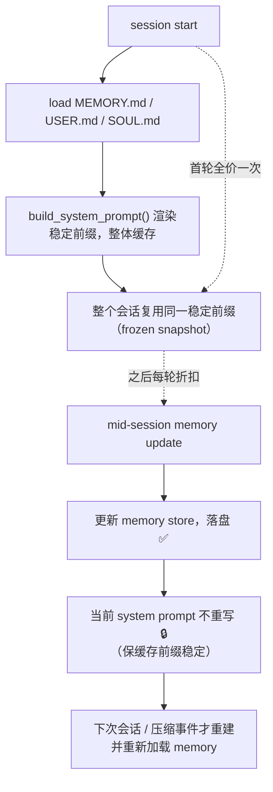

---

### 21.4.4 Model Transport：统一消息如何落到 Provider 请求

Transport 细节不需要铺开成字段清单，保留最短证据链就够了：

```text
conversation_loop.py
  -> interruptible_api_call(...)
  -> transport.build_kwargs(...)
  -> run_agent.py 中的 provider client
  -> HTTP request
```

这条链说明 Hermes 先在运行时内部维护统一消息对象，再把 provider-specific 参数放到 transport 层处理。换句话说，Prompt System 组织的是统一上下文，transport 负责把它翻译成 OpenAI、Anthropic 或其他 provider 能接受的请求。

### 21.4.5 SessionDB：会话不只在上下文窗口里存在

Hermes 的会话不是只存在于上下文窗口里，而是落到 SQLite SessionDB，并通过 FTS5 支持跨 session 的全文检索。这样 session search 就不是“翻聊天记录”的 UI 功能，而是长期 runtime 的第二层记忆。

如果只保留最关键的实现锚点，可以把它压缩成：`state.db / SessionDB -> messages + sessions -> FTS5（messages_fts / messages_fts_trigram） -> session_search`。这已经足以证明 Hermes 把历史会话当成可检索运行时资产，而不是一次性上下文残留。

---

## 21.5 记忆主线：Memory、Session Search 与 Skills 如何协作

如果说 `SessionDB + FTS5` 解决的是“历史细节如何按需找回”，那么 Memory 解决的就是“哪些长期事实必须稳定进入 system prompt 前缀”。

更准确地说，Memory 分为两个独立的存储目标，每个有自己的文件、预算和加载逻辑：

| 目标 | 文件 | 默认字符上限 | 作用 | 典型内容 |
|:---|:---|:---|:---|:---|
| Persistent Memory | `~/.hermes/memories/MEMORY.md` | 2200 字符 | Agent 的长期事实层 | 环境事实、项目约定、稳定工具经验 |
| User Profile | `~/.hermes/memories/USER.md` | 1375 字符 | 用户画像层 | 沟通偏好、角色、时区、工作习惯 |

这两层**以稳定快照的方式注入系统提示**，因此必须非常短、非常高密度。底层实现既可以是内置的本地文件存储，也可以对接外部 memory provider（如 Honcho、Mem0 等）。

### 21.5.1 Memory 的源码级实现解析

前文介绍了 Memory 的定位和接口层面，本节基于 Hermes Agent 源码，深入到内置 Memory 的实现机制。这部分对理解"Agent 如何在不破坏提示缓存的前提下保持长期记忆"很有帮助。

默认的内置 `MemoryProvider` 会把长期事实写进 `~/.hermes/memories/MEMORY.md`，把用户画像写进 `~/.hermes/memories/USER.md`。即使未来把底层替换成其他 `MemoryProvider`，运行时边界也不变：memory 更新先作用于 provider 或 store，自身可以立刻落盘；system prompt 的重建则仍然沿着 frozen snapshot 边界发生，通常要等到下一次会话或下一次完整重建。

内置 provider 不把这部分长期记忆放进数据库，而是直接落到两个 Markdown 文件。重要的证据不是备份文件名或单个操作参数，而是 **`MemoryStore.load_from_disk()` 会在会话开始时把这两个文件渲染成 `_system_prompt_snapshot`，而后续写入只更新 store 和磁盘，不会立刻回写当前 system prompt**。这正是 memory 更新与 system prompt 重建之间的运行时边界。

因此，`~/.hermes/memories/MEMORY.md` 与 `~/.hermes/memories/USER.md` 应该只保存必须稳定进入前缀的长期事实、偏好和约束，而不应该变成日志、代码片段或完整 transcript。历史细节属于 SQLite `SessionDB` + `FTS5` 支持的 session search；memory 文件属于稳定前缀层。这两层分工，正是 Hermes 避免“把所有历史都塞进 system prompt”的关键。

---

### 21.5.2 Memory 的全生命周期

从生命周期看，关键不是再证明 frozen snapshot，而是说明 memory 有独立于 prompt 组装的写入节奏：会话开始时加载 `MEMORY.md` / `USER.md`，会话进行中可以通过工具调用或后台机制持续更新 store 并落盘，后续会话再读取这些已沉淀的长期事实。实现上还有 background review 等自动写入机制，但它们主要影响的是“什么时候写入 memory”，而不是 memory 文件与 prompt 前缀各自的职责。

---

### 21.5.3 可插拔架构：MemoryProvider 抽象

Hermes 的 Memory 系统不是只有内置实现，而是通过 `MemoryProvider` 抽象把“长期记忆如何存、如何召回、如何同步”从具体后端里拆出来。内置 provider 对应 `~/.hermes/memories/MEMORY.md` 和 `~/.hermes/memories/USER.md`；外部 provider 则可以接管检索与持久化策略。这里新增的证据点不是再次讨论 frozen snapshot，而是 **Memory 的后端可以替换，但章节前面证明过的 prompt 组装机制并不需要跟着改写**。

一个很有代表性的例子，是把 Markdown 知识库接成一个只读 `MemoryProvider`。在这个实现里，Hermes 启动时先从 `config.yaml` 的 `memory.provider` 读取 provider 名称，然后通过插件发现机制在 `plugins/memory/` 或用户目录下的 `~/.hermes/plugins/<name>/` 加载实现，再把得到的 provider 注册进 `MemoryManager`。这说明 `MemoryProvider` 抽象首先解决的不是“文件该存哪里”，而是 **Agent Core 如何在不关心具体后端的情况下，把任意记忆能力接进统一生命周期**。

如果顺着这条只读 provider 的源码再往下看，会发现它并没有改写 Agent Loop，而只是接管了自己的初始化和召回逻辑：provider 在 `initialize()` 阶段读取独立配置，例如知识库根目录、`top_k` 和字符预算；随后递归扫描 Markdown 文件，按标题切段、按长度分块，并在内存中构建 TF-IDF 索引。换句话说，Hermes 允许某个 provider 自己决定“如何预处理知识”，只要它最终暴露的仍然是统一的 `initialize / system_prompt_block / prefetch / sync` 这组边界。

这一点在运行时主线上尤其清楚。只读 Markdown provider 会在 `system_prompt_block()` 中向 system prompt 追加一段非常短的能力声明，例如“你有一个只读 Markdown 知识库可以参考”，并注明知识库根路径；真正的内容召回不在启动时整体塞入上下文，而是在每轮用户输入后由 `prefetch()` 触发。调用链可以简化成：

```text
memory.provider = "markdown_kb"
  -> 插件发现并加载 provider
  -> MemoryManager.add_provider()
  -> provider.initialize() 构建 Markdown 索引
  -> build_system_prompt() 注入只读 KB 的存在声明
  -> 每轮用户输入触发 prefetch(query)
  -> 返回 top-k 命中的 Markdown 片段
  -> 以 <memory-context> 形式附加到本次 API 调用
```

这个例子非常适合说明 `MemoryProvider` 抽象的真正价值。Hermes 的 memory 后端不一定都像内置 provider 那样，把稳定事实写入 `MEMORY.md` / `USER.md`；有些 provider 更像长期事实层，有些更像只读检索层，还有些可以同时承担写入与召回。对 Agent Core 来说，这些差异都被压缩在 provider 边界之后：Core 只知道“启动时该初始化 provider，组 prompt 时该请求声明块，处理用户输入时该触发 prefetch，回合同步时再决定是否需要写回”。

从架构上看，这也解释了为什么 `MemoryProvider` 不应该被狭义理解成“长期记忆文件的替身”。它更接近一个统一的记忆接入层，负责把不同形态的上下文资产挂接到同一条运行时主线上：

- 内置 provider 负责把稳定事实冻结成 system prompt 前缀；
- Session Search 负责在 SQLite + FTS5 中找回历史细节；
- 只读知识库 provider 负责按当前 query 做动态 prefetch；
- Skills 则继续承担程序性记忆，而不是通过 `MemoryProvider` 直接注入全文。

因此，`MemoryProvider` 的抽象意义不只是“可替换后端”，而是 **让 Hermes 可以同时容纳 stable-prefix memory、query-time recall 和其他检索型记忆，而不把这些机制硬编码进单一存储实现**。

---

### 21.5.4 配置控制

配置控制的不只是开关，也决定当前启用的是哪个 `MemoryProvider`。当 `provider: "builtin"` 时，Hermes 读取和写入的就是 `~/.hermes/memories/MEMORY.md` 与 `~/.hermes/memories/USER.md`；切到外部 provider 时，变化的是持久化后端和召回策略，而不是这两个文件在内置模式下承担的 stable-prefix 角色。

Memory 系统的行为完全由 `~/.hermes/config.yaml` 控制：

```yaml
memory:
  memory_enabled: true         # 是否启用 MEMORY.md
  user_profile_enabled: true   # 是否启用 USER.md
  provider: "builtin"          # 或 "honcho" / "mem0" 等插件
```

---

### 21.5.5 架构视角：Memory 在 Hermes 中的三层角色

从更大的架构视角看，Hermes 的 Memory 系统承担了三层角色：

**第一层：事实持久化层**（归属 Context & Learning 子架构）。
它保存 Agent 和用户的长期事实，以冻结快照的形式注入 system prompt。这是传统"记忆"的定义，也是 Agent 具备连续存在的关键。

**第二层：自改进闭环的执行器**（归属 Learning Loop 子架构）。
Background Review 机制使 Agent 不需要用户显式指令就能主动写入 memory，构成了"对话 → 分析 → 写入 → 下次读取"的闭环。这是 Hermes 和普通聊天机器人的本质区别。

**第三层：工具交互的语义对象**（归属 Tool Runtime 子架构）。
Agent 通过统一的 `memory` 工具操作 MemoryStore，对 Agent 来说，"记住"和"读文件"一样，都是工具调用。这使记忆管理和工具系统共享同一套执行框架。

---

### 21.5.6 Skills：把经验变成可复用程序性记忆

Hermes 最有代表性的设计是 Skills System。

Memory 保存“事实”，Skills 保存“做法”。一个 Skill 通常是一个 Markdown 文档，描述某类任务的步骤、约束、工具选择、常见失败和验证方法。

可以这样理解：

```text
Memory = 我知道什么
Skill  = 我下次怎么做
Tool   = 我实际能执行什么
```

#### 从一次任务到技能

一个典型闭环是：

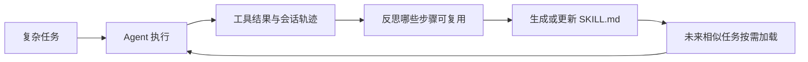

这比普通“记忆”更强，因为它保存的是可执行流程：

- 什么时候先搜索；
- 什么时候读配置；
- 哪个命令能验证；
- 常见错误怎么修复；
- 产物应该放在哪里；
- 什么操作必须先询问用户。

#### Progressive Disclosure

Skills 也会占上下文预算，所以不能每次全部塞进 prompt。更合理的方式是 progressive disclosure：

1. 先只让模型看到 skill 名称和简短描述；
2. 当任务匹配时，再加载对应 `SKILL.md`；
3. 如果 skill 引用脚本、模板或资源，再按需读取。

这和本书前面讲的 Context Engineering 是同一个思想：不是让模型“知道所有东西”，而是让它在需要时拿到正确材料。

#### Hermes 的 Skill 演化管道

如果说 OpenClaw 更强调 Skill 的加载优先级和插件生态，那么 Hermes 更值得关注的是：**Skill 如何从长期使用轨迹中演化出来**。

结合第 6 章对 Skills 的定义，Hermes 的成熟实现可以抽象成一条管道：

```text
Session Trace
  │
  ├─ 用户反复要求同类任务
  ├─ 某次任务形成稳定成功路径
  ├─ 工具调用序列可复用
  ├─ 验证命令稳定
  └─ 人工纠正减少
      │
      ▼
Skill Candidate
      │  提取触发条件、步骤、工具、约束、验证方式
      ▼
Review / Eval
      │  检查是否安全、是否过度泛化、是否真的提升质量
      ▼
Skill Registry
      │  保存版本、owner、适用范围和依赖工具
      ▼
Future Sessions
```

这条链路让 Skill 不只是“手写说明”，而是长期 Agent 的能力沉淀机制。一次成功任务本身没有价值，能被压缩成可验证、可复用、可审查的程序性知识，才有价值。

一个 Hermes-style Skill 需要保存的不只是步骤，还应保存这些元信息：

```yaml
skill:
  name: repo_release_check
  source_trace_ids:
    - trace_20260430_001
    - trace_20260430_019
  trigger:
    - "发布前检查"
    - "release validation"
  required_tools:
    - file_search
    - shell
    - git_diff
  verification:
    - "run tests"
    - "check diff"
    - "summarize risk"
  status: reviewed
  version: "0.3.0"
```

`source_trace_ids` 很重要。它让后续 review 能回到原始任务，判断这个 Skill 是从真实成功经验中总结出来的，还是模型凭空概括出来的。

#### 风险：技能会固化错误经验

Skills 的风险也很明显：如果一次任务的解法本身是错误的，Agent 把它沉淀成 skill，下次会更稳定地犯同样错误。

因此生产级 Skills System 需要：

- skill 创建前有验证证据；
- skill 更新时保留版本或变更记录；
- skill 里写清适用条件和不适用条件；
- 定期清理过期技能；
- 对高风险技能增加人工 review。

真正可靠的自我进化，不是“做完就记住”，而是“验证后再沉淀”。

进一步说，Skill 还需要生命周期治理：不是越多越好，而是要有版本、owner、适用边界和清理机制。过期 Skill 应该归档，高风险 Skill 应该人工 review，常用 Skill 需要持续修订。只有这样，程序性记忆才会随着使用变得更可靠，而不是越来越臃肿。

---

## 21.6 行动主线：从 Tool Registry 到 Action Engine 的连续执行链

Hermes 的关键不在“能不能调用工具”，而在“模型选择工具以后，运行时如何可靠地行动”。因此 Tool Registry、Toolsets、Execution Backends 和 Action Engine 需要被当成一条连续的行动主线来理解。

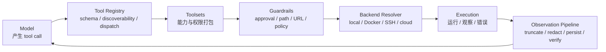

这个主线说明 Hermes 把“工具调用”拆成了四个不同问题：

- **Registry** 回答“系统到底暴露了哪些可调用能力”；
- **Toolsets** 回答“当前入口、身份和任务允许使用哪些能力包”；
- **Backends** 回答“同一个能力应该落到哪个执行环境”；
- **Action Engine** 回答“如何把一次模型决策变成可验证、可恢复、可持久化的行动”。

### 21.6.1 Tool Registry：能力先被声明，再被调用

Tool Registry 的重要性，不在于它列出了多少工具，而在于它把模型可见能力先变成结构化对象，再允许后续治理接手。只有经过 schema、可用性和 dispatch 边界包装后，模型输出的 tool call 才不是“随便执行一个函数”，而是“在 Runtime 承认的能力集合里请求一次行动”。

从这个角度看，Registry 更像行动主线的起点证据：

- 它收集 tool schema，让模型只能在已声明接口内行动；
- 它感知工具是否启用，让同一 Agent 在不同入口或 profile 下看到不同能力面；
- 它把 plugin 与 MCP 暴露的外部能力吸收到统一 dispatch 边界，而不是让扩展直接绕过 Runtime。

因此，Registry 不是目录索引，而是后续权限、后端选择和审计链条的前提。

### 21.6.2 Toolsets：把“能力”打包成可治理的权限单元

如果说 Registry 决定“系统有什么能力”，那么 Toolsets 决定“这次行动被允许动用哪一包能力”。这也是 Hermes 工具治理最值得保留的证据：它没有把权限主要写在 prompt 里，而是把能力按入口、身份和任务类型打包成可配置边界。

| 打包维度 | Toolsets 解决的问题 | 典型结论 |
|:---|:---|:---|
| 入口 | 某个平台是否应暴露高风险能力 | CLI 可以更宽，消息入口通常更窄 |
| 身份 | 不同 profile 是否共享同一权限面 | 工作 / 个人 / 受限 profile 应各自独立 |
| 任务类型 | 读任务、写任务、后台任务是否复用同一工具集 | Cron 与低信任入口应默认更保守 |
| 扩展来源 | MCP / Plugin 工具是否天然可信 | 外部扩展也必须落入已定义 toolset |

因此，Toolsets 的架构意义不是“方便分类工具”，而是把长期 Agent 的权限治理单位从“单个函数”提升为“能力包”。这样 Approval、路径安全、后端隔离才有稳定挂载点；否则所有安全策略都会退化成零散特判。

### 21.6.3 Execution Backends 与 Action Engine：同一能力如何被可靠执行

真正让 Hermes 从“会选工具”走到“会行动”的，是 Toolsets 之后的连续执行链。模型选中的能力不会直接执行，而是继续经过护栏、后端解析、结果处理和失败恢复。

| 阶段 | Runtime 的关键决策 | 为什么重要 |
|:---|:---|:---|
| 参数与风险解析 | tool call 是否符合 schema，参数是否触发高风险模式 | 把模型的模糊输出收敛成确定行动 |
| 能力边界检查 | 当前 toolset、profile、入口是否允许这次调用 | 防止低信任入口越权拿到高风险能力 |
| 后端选择 | 在本地、容器、SSH 还是云端执行 | 同一 terminal/file 动作在不同环境下风险完全不同 |
| 执行与观测 | 如何捕获 stdout/stderr、流式进度与错误状态 | 长任务必须可见、可中断、可解释 |
| 结果回流 | 结果如何截断、脱敏、持久化，并决定是否形成验证证据 | 防止噪声、敏感数据和错误结论继续扩散 |

这也是为什么 `approval.py`、`path_security.py`、`url_safety.py`、`error_classifier.py`、`verification_evidence.py`、`redact.py` 这类模块值得被一起看待。它们不是附属小特性，而是 Action Engine 的连续护栏：

```text
tool call
  -> schema / path / URL / policy check
  -> approval gate
  -> backend dispatch
  -> result capture
  -> error classify / retry / fallback
  -> verify / redact / persist
```

这里保留 Approval、路径安全和 Backend Selection，不是为了罗列安全特性，而是因为它们共同支持同一个结论：**Hermes 把一次工具调用变成了“受身份约束、受环境约束、受证据约束的行动”**。这才是长期 Agent 可长期运行的核心。

### 21.6.4 Plugin 与 MCP：扩展能力也必须回到同一行动主线

Plugin 与 MCP 的价值，不是“又多了一批工具”，而是证明 Hermes 把扩展能力也收编进同一条行动主线。无论工具来自内置模块、插件注册还是 MCP server，它都应该依次经过：

1. 被 Registry 发现和声明；
2. 被 Toolsets 纳入某个能力包；
3. 被 Guardrails 与 Backend Resolver 约束；
4. 被 Action Engine 执行、观测、脱敏和持久化。

这比单纯强调“支持 MCP”更重要。因为对长期 Agent 来说，最大风险从来不是工具数量少，而是外部能力一旦接入后绕过原有治理边界。Hermes 值得借鉴的地方，正是它试图让扩展能力也服从同一条行动主线。

---

## 21.7 多入口主线：Gateway、Cron、Profiles 与 Session 生命周期

这一节不应该被读成四个并列特性，而应该被读成同一个答案：**一个长期运行的 Agent，如何在多个入口、不同任务类型和多重身份之间保持连续性，而不发生串线。** Hermes 的回答是让 Gateway、Cron、Profiles 和 Session Lifecycle 共同组成连续运行控制面。

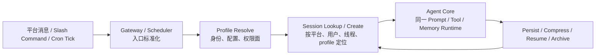

如果缺了其中任何一环，长期 Agent 都很难成立：

- 没有 Gateway，Agent 只能被单一入口临时调用；
- 没有 Cron，Agent 不能把“持续关注”变成时间驱动的工作；
- 没有 Profiles，连续性会退化成跨任务、跨身份的污染；
- 没有 Session Lifecycle，多入口只会得到一堆彼此无关的短会话。

### 21.7.1 Gateway：把不同入口折叠成同一种会话事件

Gateway 的架构意义，不是“支持 Telegram、Slack、Discord 等很多平台”，而是把这些入口都折叠成同一种会话事件：谁发起、来自哪个线程、属于哪个 profile、是否是控制命令、该继续哪个 session。

因此 Gateway 至少承担四件事：

- 把平台消息、回复链和控制命令标准化；
- 在入口处做 allowlist、DM pairing 等身份筛选；
- 把平台用户 / 线程映射到 Session 与 Profile；
- 把流式进度、中断、停止和结果回传给原入口。

这让 Hermes 的多入口不是“多套 bot 各自调用模型”，而是“多种入口共同驱动同一个 Agent Core”。真正持续的是后面的 Session、Toolsets、Memory 和 Learning Loop，而不是某个平台适配器本身。

### 21.7.2 Cron：把时间也做成入口，而不是旁路脚本

Hermes 的 Cron 值得强调，不是因为它能定时，而是因为它把时间触发也纳入了同一条运行时主线。一个 cron tick 并不会绕过 Gateway / Profile / Session 逻辑直接执行脚本；它更像“系统代表某个 profile 发起一次新的 Agent turn”。

这带来两个后果：

- 定时任务会复用同样的 memory、skills、toolsets 与后端选择逻辑；
- 后台任务的输出不只是 stdout，还可以继续写回 session、回到消息入口、进入学习闭环。

因此 Hermes Cron 更接近“定时 Agent Task”，而不是 Shell Cron。它把长期工作从“用户来问才回答”扩展到“时间到了就继续处理”，但连续性的基础仍然是同一套身份和会话边界。

### 21.7.3 Profiles：连续性的前提是身份隔离

多入口一旦成立，Profile 就不再只是“多账户”体验，而是长期 Agent 的身份边界。Hermes 让不同 profile 拥有自己的 home、配置、memory、sessions、gateway 状态和 toolsets，本质上是在回答一个更严肃的问题：**连续性如何不变成跨身份污染。**

| 连续性需求 | 如果没有 Profile 会发生什么 | Profile 的作用 |
|:---|:---|:---|
| 长期记住项目规则 | 不同客户、团队或生活场景互相污染 | 把 memory、skills、sessions 分桶 |
| 跨入口继续同一任务 | Slack 上的上下文可能误用到 Telegram 或 CLI | 把入口连续性绑定到身份边界 |
| 按风险级别分配能力 | 高风险写工具可能在低信任入口被误用 | 让 toolsets 和 backends 随 profile 收紧 |

所以，Profile 不是附属配置，而是 Gateway 与 Tool Governance 之间的中枢。长期 Agent 可以跨入口连续，但不能跨身份随意串线。

### 21.7.4 Session 生命周期：把“多次进入”变成“同一条长期任务线”

最终决定 Hermes 是否真的“长期运行”的，不是入口数量，而是 Session 生命周期是否完整。至少要回答以下问题：

- 新消息到来时，是续接旧 session 还是创建新 session；
- 用户切换平台、线程或 slash command 时，session 如何重新定位；
- 长任务被打断后，哪些状态会被恢复，哪些会被压缩；
- cron、消息入口和后台协作是否共享同一条任务线；
- 哪些结果只写 session，哪些允许升级为 memory、skill 或 trajectory。

从这个角度看，Session 不只是 transcript 持久化，而是多入口连续性的承重层：

```text
ingest event
  -> resolve profile
  -> locate or create session
  -> run agent turn
  -> persist observations and state
  -> compress / archive / search / resume
```

这也解释了为什么本节必须把 Gateway、Cron、Profiles 和 Session 放在一起看。它们回答的是同一个系统问题：Hermes 如何让一个 Agent 在多入口、长时间、不同任务和不同身份下仍然保持“这是同一个运行时”的连续性。

---

## 21.8 安全主线：长期 Agent 的真实攻击面

Hermes 的安全部分，不能只概括成“多层防御”四个字。更准确的理解方式是：前面那些让 Agent 保持连续行动的机制，本身也定义了长期 Agent 的主要攻击面。入口越多、身份越持久、工具越强、学习回流越深，越需要围绕具体失效路径布防。

### 21.8.1 五个最关键的攻击面

| 攻击面 | 失效方式 | 为什么是长期 Agent 特有风险 | Hermes 对应边界 |
|:---|:---|:---|:---|
| 多入口身份滥用 | 平台用户、线程或 slash command 被错误路由到别人的 session / profile | 一次路由错误会把后续记忆、工具权限和会话连续性全部串线 | allowlist、DM pairing、Gateway 路由、Profile 隔离 |
| 工具越权 | 低信任入口或后台任务拿到了本不该拥有的 terminal / write / MCP 能力 | 长期在线入口更容易把一次误触发放大成持续性损害 | Toolsets、Approval Gate、任务类型收权 |
| 文件系统与后端边界失守 | 路径穿越、本地执行过权、应该进 Docker/SSH 的任务落在 local | 同一个工具名在不同后端的破坏半径完全不同 | path security、URL / policy check、backend resolver |
| 记忆污染 | 注入内容、临时错误或跨 profile 事实被写入 memory / skill | 一次错误写入会在后续会话里被稳定复用 | stable/context/volatile 分层、memory/skill 写入门槛、验证证据 |
| 轨迹泄露 | tool results、日志、凭据或敏感业务数据进入 sessions / trajectories / exports | 长期 Agent 会持续积累可训练数据，泄露面比聊天记录更大 | redact、result truncation、credential filtering、export control |

这个表比“列出很多安全功能”更重要，因为它把安全重新绑回前文的主线：Gateway 决定身份攻击面，Toolsets 与 Backends 决定行动攻击面，Memory 与 Trajectory 决定回流攻击面。

安全设计因此可以被压缩成一句更硬的原则：

> 长期 Agent 不能因为“这是同一个用户、同一个工具、同一个任务”就默认可信；每次跨入口、跨身份、跨后端、跨持久化边界时，都要重新验证。

沿着这个原则回看前文，Hermes 的护栏链就很清晰了：

- **入口前**：先判断是谁、来自哪里、是否允许进入这个 profile；
- **行动前**：先判断当前 toolset 是否允许、路径与 URL 是否安全、是否需要审批、是否该切到隔离后端；
- **行动后**：先判断结果是否该截断、脱敏、持久化，是否足以形成验证证据；
- **学习前**：先判断这次结果是稳定事实、可复用做法，还是只该停留在 session 里。

这也顺手吸收了最小可行架构的一个核心教训：**MVP 版长期 Agent 可以少接几个平台、少接几个工具，但不能没有身份边界、工具边界和回流边界。** 少做功能是可以的，默认信任是不可以的。

---

## 21.9 学习闭环：从运行轨迹到能力资产

Hermes 在学习闭环上的真正亮点，不是“Agent 会自动变强”这种宽泛叙事，而是它把一条更具体、也更工程化的链路暴露了出来：

```text
trajectory
  -> compress / redact / annotate
  -> eval case
  -> skill evolution / policy refinement
  -> validated capability asset
```

从公开能力看，Hermes 已经明确围绕以下证据建设这条链：batch trajectory generation、tool-calling 轨迹压缩、ShareGPT 格式导出、RL environments，以及 Atropos 相关训练集成。仅凭这些证据，我们还不能得出“Hermes 已经完成了全自动自我进化平台”的结论；但完全可以得出另一个更稳健、也更重要的结论：**Hermes 把运行轨迹、评估样本、技能演化和能力资产之间的接口显式化了。**

这使它的学习闭环更像 Runtime 资产管线，而不是模糊的“多记点东西”：

| 阶段 | 产物 | 是否可直接复用 |
|:---|:---|:---|
| 原始 trajectory | 工具调用、错误、用户修正、最终结果 | 不能，噪声和敏感信息过多 |
| eval case | 被压缩、标注、可回放的测试样本 | 可以用于评估，但还不是能力 |
| skill / policy candidate | 被总结出的做法、约束或工具选择策略 | 仍需验证，不能自动信任 |
| capability asset | 通过验证后升级的 skill、tool policy、训练数据 | 才适合长期复用 |

这张表很关键，因为它收紧了“学习”的定义。Hermes 值得借鉴的地方，不是让任何成功路径都自动升格成 Skill，也不是让任何会话都直接流进训练集，而是让**trajectory -> eval -> skill evolution -> capability asset** 这条链有清晰中间层。

因此，自我进化必须被写成带约束的闭环：

- 原始轨迹先做截断、脱敏和压缩；
- 进入 eval 前先确认任务目标与验证标准；
- 生成 skill 或 policy candidate 后先验证，再决定是否推广；
- 只有验证通过的产物，才允许成为跨 session、跨任务、跨时间复用的能力资产。

这也吸收了“最小可行学习闭环”的经验：一个团队一开始不必自动写 skill，更不必立刻做 RL，但至少应该先把 trajectory、verification result 和失败原因系统化记录下来。没有验证记录的“自我进化”，本质上只是自动传播错误。

---

## 21.10 Hermes 与 OpenClaw 的架构对比

Hermes 和 OpenClaw 很容易被放在一起比较，因为它们都强调个人 AI 助手、多渠道入口、本地运行和工具生态。但如果沿着本章一直使用的“长期 Runtime 主线”去看，两者回答的其实不是同一个核心问题。

| 维度 | OpenClaw | Hermes Agent |
|:---|:---|:---|
| 核心定位 | Personal Agent Gateway | Self-improving Long-running Agent |
| 入口 | 多聊天平台、WebChat、CLI、节点 | CLI/TUI、Messaging Gateway、ACP、Cron、脚本化/服务化入口 |
| 记忆 | 个人上下文和长期配置 | Persistent Memory、User Profile、SQLite Session Search、外部 Memory Provider |
| 技能 | 技能与插件生态 | 支持创建/更新 Skills，并将验证过的经验沉淀为可复用流程，兼容 agentskills.io |
| 工具 | 工具、技能、插件、MCP | Tool Registry、Toolsets、MCP、Plugins、执行后端 |
| 执行环境 | 本地和沙箱为主 | local、Docker、SSH、Daytona、Modal、Singularity |
| 研究闭环 | 更偏产品使用 | 轨迹生成、压缩、RL/eval 数据 |
| 架构气质 | Gateway-first | Learning-loop-first |

两者不是谁替代谁，而是代表两种长期 Agent 的设计方向：

- 如果重点是“如何让用户从各种渠道触达 Agent”，OpenClaw 的 Gateway 思路更突出；
- 如果重点是“如何让 Agent 在长期使用中积累能力”，Hermes 的 Memory + Skills + Session + Trajectory 思路更突出。

因此，更准确的比较方式不是问“谁更完整”，而是先问“你的系统瓶颈在入口连续性，还是在能力沉淀与学习闭环”。前者更接近 OpenClaw，后者更接近 Hermes。

---

## 21.11 设计启示

### 21.11.1 关键设计原则：连续性、能力打包、边界优先、验证约束

如果只保留 Hermes 对长期 Agent Runtime 最有价值的设计结论，可以压缩成下面六条：

| 原则 | Hermes 中的体现 | 对自研 Agent 的启发 |
|:---|:---|:---|
| 连续性优先 | Gateway、Cron、Profiles、Session 组成统一控制面 | 多入口不是多 UI，而是同一运行时的连续进入点 |
| 能力打包 | Toolsets 把工具能力变成权限单元 | 不要只靠 prompt 管工具，要靠能力包治理 |
| 执行环境分离 | Backends 与 Action Engine 分开处理 | “能做什么”和“在哪里做”必须是两层决策 |
| 攻击面驱动安全 | 身份、工具、路径、记忆、轨迹分别设边界 | 长期 Agent 的默认姿态应该是重新验证，而不是默认信任 |
| 验证约束学习 | trajectory 先变 eval，再变 skill / capability asset | 不要把“学到东西”简化成“把结果都写进 memory” |
| 全链路可观测 | callbacks、sessions、tool results、verification evidence、trajectory exports | 每次行动都要能被解释、复盘、审计和改进 |

这六条比功能列表更有迁移价值。一个系统即使接了很多平台、很多 MCP server，只要没有连续性控制、能力打包和验证约束，本质上仍然只是一个容易失控的工具调用器。

落地时也不该从“平台越多越好、工具越多越好、自动学习越快越好”开始，而应该先跑通一个受限但闭环完整的 Runtime：先证明单一入口、单一 profile 和 session 生命周期能够连续工作，再把 toolsets、隔离后端、最小安全护栏和验证后的 trajectory 记录补齐。反过来说，过早扩入口、给低信任入口开放高风险工具、或者在没有验证证据前自动升级 skill，都只是在放大失控半径，而不是在建设长期 Agent。

### 21.11.2 工程治理：设计哲学如何变成合并准则

前文的两条设计哲学（21.2.2 窄腰、21.2.3 缓存神圣）如果只停留在宣言，对真实的工程组织没有约束力。Hermes 的官方开发指南（AGENTS.md）把哲学落成了一份名为 **Contribution Rubric（贡献准则）** 的合并判据清单，分为 "What We Want"（合并项）与 "What We Don't"（拒绝项，且标注 *rejected even when well-built*——造得再好也拒）。这份准则本身是理解 Hermes "扩张边缘、保守在腰" 平衡的最好反例集。

**哲学 → 准则 → 审查，三层闭环。** 两条哲学不是孤立的审美偏好，而是这样传导的：

```text
设计哲学（21.2.2 窄腰 / 21.2.3 缓存神圣）
   ↓ 操作化为合并判据
Contribution Rubric（什么 PR 进核心、什么被拒）
   ↓ 自动化为审查纪律
Triage Sweeper（机器人只在三种理由下关 PR，口味判断留给人）
```

**"要"的清单：边缘激进、腰上保守。** "What We Want" 九条里，最值得注意的是它与"激进"并不矛盾：新平台、新频道、新模型、新桌面特性都欢迎且常合并（Hermes 在产品面扩张是刻意且高效的）；保守只针对 core agent 与工具 schema 这一处——因为这里的每次新增都被乘上（用户数 × 调用数）。其中两条直接把前文哲学原样搬入审查："Keep the core narrow" 原样复刻 Footprint Ladder；"Cache-, alternation-, and invariant-safe" 原样复刻缓存神圣加角色交替约束。

**"不要"的清单：八条红线都在守同一件事。** "What We Don't" 八条拒绝项，逐条都能追到一条工程约束，没有一条是口味问题：

| 拒绝项 | 它守护的设计约束 | 对应哲学 |
|:---|:---|:---|
| 已有 `terminal+file` / skill 能做的事还加 core tool | 腰不能胖 | 21.2.2 窄腰 |
| 第三方产品塞进核心树、插件碰核心文件 | 腰不被外部后端绑定、扩展靠接口不靠特例 | 21.2.2 扩张边缘但不进腰 |
| 投机基础设施（无消费者的 hook）、裸 `HERMES_*` env var | 腰不预支扩展面、边缘接入要规范 | 21.2.2 最小足迹 |
| 中途破坏缓存、死代码无 E2E 证明 | 腰不能动、缓存神圣 | 21.2.3 缓存神圣 |
| instructional 工具的 `offset/limit` 懒读 | 模型会只读第 1 页就停下 | 21.2.3 同类行为红线 |
| "修复"毁掉所保护特性 | 改限制前先 `git log -p -S` 读原始意图 | 21.2.3 对称：别误伤设计 |
| 无 opt-in 的出站遥测 / 归因 | 用户数据主权是硬门槛 | 治理 / 信任 |

**两条最值得自研团队借鉴的治理纪律。**

第一，**"插件不碰核心"是耦合决策而非质量门槛。** 准则硬规定：插件只能工作在框架提供的 ABC / hooks 内；若需要更多能力，应当**扩宽通用 plugin surface**，绝不在 `run_agent.py` / `cli.py` / `gateway/run.py` 等核心文件里写 plugin 专属逻辑（PR #5295 为此删掉了 95 行硬编码的 argparse）。更极端的是第三方产品插件——可观测性后端、厂商 SaaS 集成、分析仪表盘等必须发布为独立 repo，用户装进 `~/.hermes/plugins/`，而非进本仓库的 `plugins/`。文档的原话点破了本质：*"This is a coupling-and-maintenance decision, not a quality bar — the plugin can be excellent and still be a close."*（这是耦合与维护决策，不是质量门槛；插件再好也会被关。）这对任何想做插件化 Agent 框架的团队都成立：把核心锁死、把扩展面做宽，比"来一个需求就特例塞核心"更可持续。

第二，**"先验证前提，再修"是长期项目的改动纪律。** 准则明确反对建立在错误前提上的修复：修改任何限制性行为前，先用 `git log -p -S <symbol>` 读原始 commit 的意图，找"既修 bug 又保留特性"的解法，而不是用过度限制把特性阉割掉。这与 21.2.3 同源——都是"别为了一个看得见的问题，毁掉一个看不见的设计意图"。自研团队在重构长期运行的 Agent 核心时，这条尤其关键：核心一旦被误伤，代价是跨所有用户、所有会话的回归。

**它对自动审查的治理设计也值得抄。** 准则开头特意给 triage sweeper（自动分类机器人）划了边界：它只在 `implemented_on_main` / `cannot_reproduce` / `incoherent` 三种客观理由下自动关 PR；而 "we don't want this / out of scope" 这种口味判断，**不归机器人管，必须留给人**。机器人唯一的任务恰恰是"识别设计意图、避免误关合法贡献"，而不是替人做"不实现"的决定。这种"客观红线自动化、主观取舍留给人"的分权，是开源 Agent 项目在贡献量爆炸时仍能守住设计一致性的关键机制。

```text
能客观判定的（腰胖了 / 缓存破了 / 插件碰核心）→ 写进 Rubric，可被机器人执行
不能客观判定的（这个功能我们不想做）→ 留给人，机器人不代裁
```

把 Contribution Rubric 放回整章，它恰好证明了 21.11.1 那条原则——"一个系统即使接了很多平台、很多 MCP server，只要没有连续性控制、能力打包和验证约束，本质上仍然只是一个容易失控的工具调用器"。Hermes 不仅把约束写进了架构，还把同样的约束写进了**合并 PR 的门槛**：让"什么是好贡献"和"什么是好架构"服从同一套哲学。

---

## 本章小结

Hermes Agent 展示了长期运行 Agent 的另一条成熟路径：不是只做更强的单次推理，而是围绕模型建立记忆、技能、工具、入口、执行环境和数据闭环，把 Agent 做成一个可以长期运行、持续积累、受边界约束的个人 Runtime。

本章核心结论：

- Hermes 的本质是一个可长期运行、可持续学习的 Agent Runtime；
- 它的底层架构可以拆成大脑中枢、记忆系统、小脑、工具中心、执行引擎和外部环境六个核心组件；
- Memory 保存关键事实，Session Search 保存历史细节，Skills 保存可复用做法；
- 核心数据流不是单向问答，而是用户输入、上下文构建、工具执行、外部结果和记忆回流组成的闭环；
- Gateway 让同一个 Agent 活在 CLI、消息平台和自动化任务中；
- Tool Registry、Toolsets、Action Engine、Execution Backends 把行动能力拆成可治理的边界；
- Profiles 是长期 Agent 防止上下文串线的重要机制；
- Security 必须覆盖用户授权、命令审批、容器隔离、MCP 凭据过滤、上下文扫描和 session 隔离；
- Research Pipeline 把 Agent 执行轨迹变成 eval、fine-tuning 和 RL 的数据资产；
- 连续性、能力打包、边界优先和验证约束，是长期 Agent 从 demo 走向 Runtime 的关键设计原则。

如果 OpenClaw 让我们看到“个人 Agent Gateway 如何把用户和模型连起来”，Hermes 则让我们看到“长期 Agent 如何在使用中积累能力”。对自研 Agent 来说，最值得学习的不是某个具体命令，而是它如何把长期性拆成可工程化的运行时边界，并要求每一次行动、持久化和学习都回到同一条受约束的主线上。

---

## 参考资料

1. [Hermes Agent GitHub Repository - NousResearch/hermes-agent](https://github.com/NousResearch/hermes-agent)
2. [Hermes Agent Documentation](https://hermes-agent.nousresearch.com/docs/)：官方文档入口，包含 Messaging Gateway、Tools & Toolsets、Skills、Architecture，以及 closed learning loop 的总体说明。
3. [Hermes Agent Features Overview](https://hermes-agent.nousresearch.com/docs/user-guide/features/overview/)：功能总览，覆盖工具集、Skills、Persistent Memory、Context Files 等核心能力。
4. [Hermes Agent Architecture](https://hermes-agent.nousresearch.com/docs/developer-guide/architecture)：开发者架构说明，覆盖 Prompt Builder、Tool Registry、Session Persistence、Gateway、Plugin、Cron、ACP、RL / Trajectory 等内部模块。
5. [Hermes Agent Tools & Toolsets](https://hermes-agent.nousresearch.com/docs/user-guide/features/tools/)：工具与工具集说明，列出 web、terminal、file、browser、memory、session_search、cronjob、delegation、MCP 等常见能力类别。
6. [Hermes Agent Toolsets Reference](https://hermes-agent.nousresearch.com/docs/reference/toolsets-reference)：工具集参考，说明 toolset 如何作为按平台、会话和任务控制能力边界的机制。
7. [Hermes Agent Built-in Tools Reference](https://hermes-agent.nousresearch.com/docs/reference/tools-reference/)：内置工具参考，适合追踪当前代码派生出的工具注册表和 MCP 动态工具能力。
8. [Hermes Agent Persistent Memory](https://hermes-agent.nousresearch.com/docs/user-guide/features/memory/)
9. [Hermes Agent Security](https://hermes-agent.nousresearch.com/docs/user-guide/security)
