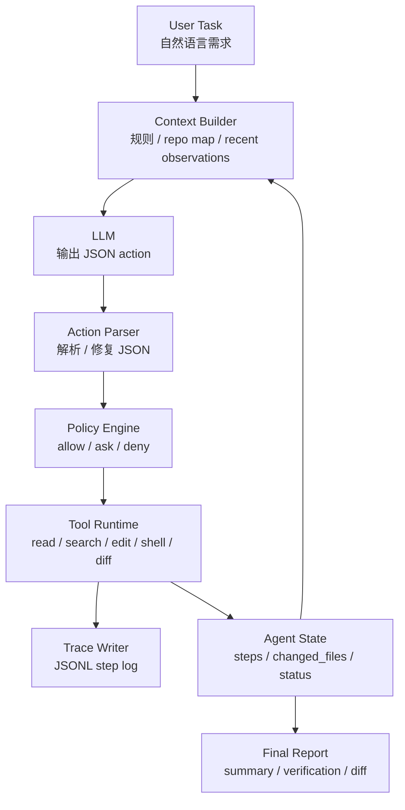

# 第19章 从零实现一个可观测 Coding Agent

> 一个接近生产级的 Agent 原型，不是把模型接到代码仓库上就结束，而是把上下文、工具、权限、验证、trace 和失败复盘都放进同一个闭环。

## 引言

前面的章节已经讨论了 Prompt、Context、Harness、Tool Runtime、Workflow、RAG、Memory、Evals、Guardrails 和可观测性。第 13 章从成熟产品角度拆解了 Claude Code、Cursor、Codex 这类 AI Coding Agent 的系统设计，第 14 章又从 Pi 出发分析了终端原生 Coding Agent Runtime 的上下文、工具、扩展和 SDK 边界。

本章把这些概念压缩进一个可以运行、可以测试、可以审查的实验项目：

```text
books/ai-book/labs/coding-agent-mvp
```

这个 lab 实现的是一个最小但完整的 Coding Agent。它能读取项目规则和仓库结构，让模型输出结构化 JSON action，通过工具注册表执行读文件、搜索、局部编辑、运行测试和查看 diff，并把每一步保存为 JSONL trace。

本章的目标不是复刻商业级 Coding Agent 的全部能力，而是让你亲手搭出一个工程骨架。这个骨架足够小，可以在一章里讲清楚；也足够完整，可以继续演进到生产级系统。

---

## 19.1 项目目标与边界

本章实现的项目叫 **Coding Agent MVP**。

它解决一个窄但典型的问题：

```text
给定一个代码仓库和一段自然语言任务，让 Agent 读取上下文、修改文件、运行验证、输出 diff 和 trace。
```

典型任务是：

```text
给 calculator.py 的 divide 函数补充除零错误处理，并添加 pytest 测试。
要求：b 为 0 时抛出 ValueError；保留原有正常除法行为；运行 pytest 验证。
```

这个 MVP 的能力范围：

- 加载项目规则，例如 `AGENT.md`、`AGENTS.md`、`CLAUDE.md`、`.cursorrules`；
- 构建 repo map，让模型知道仓库有哪些可读文件；
- 要求模型每轮输出一个 JSON action；
- 执行 `list_files`、`read_file`、`search_code`、`replace_in_file`、`create_file`、`run_shell`、`git_diff`；
- 用 Policy 控制读、写和 shell 权限；
- 用路径沙箱限制文件访问范围；
- 保存每一步 thought、tool call、tool result 和 final；
- 输出本次修改的文件和 `git diff`；
- 提供 unit tests 验证工具、配置、trace 和 Agent Loop。

它明确不做：

- 不做多 Agent 协作；
- 不做远程分支、PR、发布或部署；
- 不执行任意 shell 命令；
- 不读取 secret、`.env`、`.pem`、真实 API key 或仓库外文件；
- 不保证复杂重构一次成功；
- 不把模型 final answer 当成完成证据。

边界清楚是生产化的第一步。一个 Agent 如果从第一天就能做任何事，通常也意味着它从第一天就能把问题做大。

---

## 19.2 接近生产级 Coding Agent 的最小闭环

Coding Agent 的核心不是“自动写代码”，而是一个带控制面的执行闭环。



这条链路里，每一层都有明确职责：

| 层 | 职责 | 不应该做什么 |
|:---|:---|:---|
| Context Builder | 给模型准备规则、文件地图和最近观察 | 不直接决定工具权限 |
| LLM | 理解任务、规划下一步、生成 action | 不直接读写文件 |
| Parser | 把模型输出变成结构化数据 | 不默默吞掉错误 |
| Policy Engine | 判断工具调用是否允许 | 不依赖模型自觉 |
| Tool Runtime | 执行确定性外部能力 | 不扩大模型权限 |
| Trace Writer | 记录每一步证据 | 不只保存最终答案 |
| Verifier | 用测试和 diff 验证完成度 | 不相信“看起来完成了” |

如果把这些职责混在一个巨大函数里，Demo 可能能跑，但系统很难调试、扩展和审计。

---

## 19.3 Lab 目录结构

配套源码放在：

```text
books/ai-book/labs/coding-agent-mvp/
```

核心文件如下：

```text
coding-agent-mvp/
├── README.md
├── agent.py
├── config.py
├── context.py
├── llm.py
├── models.py
├── policy.py
├── run.py
├── tools.py
├── trace_writer.py
├── verifier.py
├── agent.config.example.toml
├── requirements.txt
├── demo/
│   ├── AGENT.md
│   ├── calculator.py
│   └── test_calculator.py
└── tests/
    ├── test_config.py
    ├── test_tools.py
    └── test_trace_and_agent.py
```

每个文件只负责一件事：

| 文件 | 职责 |
|:---|:---|
| `models.py` | 定义 Agent 状态、工具调用、工具结果和步骤记录 |
| `context.py` | 加载项目规则，构建 repo map |
| `tools.py` | 实现文件、搜索、编辑、shell 和 diff 工具 |
| `policy.py` | 决定工具调用是 allow、ask 还是 deny |
| `llm.py` | 隔离模型供应商，提供 `complete(prompt)` 接口 |
| `agent.py` | 组织 Agent Loop、解析 action、执行工具、记录状态 |
| `trace_writer.py` | 把每一步写入 JSONL |
| `verifier.py` | 运行验证命令，并检查 diff |
| `run.py` | CLI 入口，把配置、模型、Agent 和 trace 串起来 |
| `tests/` | 验证配置、工具边界和 Agent Loop |

这个拆分方式有一个重要好处：后续要把模型换成 OpenAI、Claude、Gemini 或本地模型时，只需要替换 `llm.py`；要把 shell 权限变严格时，优先改 `policy.py` 和 `tools.py`；要接入 LangSmith 或 OpenTelemetry 时，可以从 `trace_writer.py` 扩展。

---

## 19.4 环境准备与本地测试

进入 lab 目录：

```bash
cd books/ai-book/labs/coding-agent-mvp
```

安装 demo 测试依赖：

```bash
python3 -m pip install -r requirements.txt
```

先运行原型自己的测试：

```bash
python3 -m unittest discover -s tests -v
```

这一步不需要真实模型，也不需要 API key。测试覆盖的是确定性控制面：

- 配置文件是否能正确加载；
- 路径沙箱是否阻止越界访问；
- forbidden 文件是否不能读取；
- shell allowlist 是否生效；
- fake LLM 是否能驱动 Agent Loop 创建文件；
- trace 是否能写出 JSONL。

生产级 Agent 的第一条原则是：**能不用模型测的部分，都不要依赖模型来测。**

---

## 19.5 配置模型和运行参数

复制配置模板：

```bash
cp agent.config.example.toml agent.config.toml
```

示例配置：

```toml
[llm]
provider = "deepseek"
base_url = "https://api.deepseek.com"
api_key = "sk-your-deepseek-api-key"
model = "deepseek-v4-flash"
temperature = 0
max_tokens = 4096
timeout = 120
thinking = "disabled"

[agent]
max_steps = 20
auto_edit = true
auto_shell = true

[shell]
allowed_commands = ["python", "python3", "pytest", "ruff", "mypy", "npm", "pnpm", "make", "go"]
timeout = 60
```

这里有三个控制面：

1. `llm`：模型供应商、地址、模型名、温度、超时；
2. `agent`：最大步数、是否自动编辑、是否自动执行 shell；
3. `shell`：允许执行的命令和超时时间。

`agent.config.toml` 已被 `.gitignore` 忽略，不要提交真实 API key。

### 为什么配置要外置

不要把模型、key、命令白名单和超时时间写死在 `agent.py` 里。它们属于运行时策略，应该可以按环境切换：

| 环境 | 推荐策略 |
|:---|:---|
| 本地 demo | `auto_edit=true`，`auto_shell=true`，只允许测试命令 |
| 团队共享环境 | `auto_edit=true`，高风险 shell 需要审批 |
| CI / eval | 使用固定模型版本、固定 temperature、固定数据集 |
| 生产代码库 | 默认 read-only，按任务逐步开放写权限 |

模型能力会变化，安全策略也会变化。把策略外置，系统才有演进空间。

---

## 19.6 核心数据模型

`models.py` 定义了四个核心结构。

```python
from dataclasses import dataclass, field
from typing import Any, Literal


@dataclass
class ToolCall:
    name: str
    args: dict[str, Any] = field(default_factory=dict)


@dataclass
class ToolResult:
    ok: bool
    content: str
    error: str = ""


@dataclass
class AgentStep:
    thought: str
    tool_call: ToolCall | None = None
    tool_result: ToolResult | None = None
    final: dict[str, Any] | None = None


@dataclass
class AgentState:
    task: str
    repo_root: str
    messages: list[dict[str, str]] = field(default_factory=list)
    steps: list[AgentStep] = field(default_factory=list)
    changed_files: set[str] = field(default_factory=set)
    status: Literal["running", "done", "failed"] = "running"
    final: dict[str, Any] | None = None
```

这些结构看起来简单，但它们决定了系统能不能复盘。

`ToolCall` 表示模型想做什么；`ToolResult` 表示系统实际做了什么；`AgentStep` 把模型意图和工具结果绑定在一起；`AgentState` 保存任务生命周期。

不要只保存最终回答。真正排查失败时，你需要知道：

- 哪一轮模型开始偏航；
- 它当时看到了哪些 observation；
- 它选择了哪个工具；
- 工具参数是否越界；
- 工具失败后模型有没有修复；
- final 是否有验证证据。

这就是为什么 trace 要从第一版就存在。

---

## 19.7 Context Builder：让模型先看边界，再看代码

Coding Agent 的上下文不应该是“把整个仓库塞进 prompt”。更稳妥的做法是先给模型三类信息：

1. 项目规则；
2. 仓库文件地图；
3. 最近几轮工具结果。

`context.py` 里的规则加载很克制：

```python
def load_rules(repo_root: Path) -> str:
    for name in ["AGENT.md", "AGENTS.md", "CLAUDE.md", ".cursorrules"]:
        path = repo_root / name
        if path.exists() and path.is_file():
            return path.read_text(encoding="utf-8")[:4000]
    return ""
```

仓库地图也只收集文本类文件，并跳过缓存、构建产物和 trace：

```python
IGNORE_DIRS = {
    ".git",
    "__pycache__",
    ".mypy_cache",
    ".pytest_cache",
    ".ruff_cache",
    ".venv",
    "book",
    "build",
    "dist",
    "node_modules",
    "public",
    "traces",
}
```

这体现了 Context Engineering 的核心原则：上下文要服务当前任务，不要把噪声包装成“信息充分”。

### 生产级增强方向

MVP 的 repo map 只是文件列表。生产级 Coding Agent 通常还会加入：

- 语言级索引，例如函数、类、接口、路由、测试名；
- 最近修改文件和 git status；
- issue、PR、设计文档、ADR；
- 失败测试输出；
- 依赖图和模块边界；
- 目录级规则；
- 与当前任务相关的 Skill。

但第一版不要急着做复杂索引。先证明 read/search/edit/test/trace 的主链路可靠，再扩展上下文来源。

---

## 19.8 模型输出协议：每轮只返回一个 JSON 对象

Agent Loop 最怕模型输出自由文本，Runtime 不知道该执行什么。

本章的 MVP 不使用模型原生 tool calling，而是要求模型返回 JSON：

```json
{
  "thought": "我需要先搜索 divide 函数在哪里。",
  "action": {
    "name": "search_code",
    "args": {
      "query": "def divide",
      "pattern": "*.py"
    }
  }
}
```

任务完成时返回：

```json
{
  "thought": "实现和测试都完成了。",
  "final": {
    "summary": "为 divide 增加了除零检查，并补充了测试。",
    "verification": "pytest 通过",
    "changed_files": ["calculator.py", "test_calculator.py"]
  }
}
```

`agent.py` 的系统提示词故意很短：

```python
SYSTEM_PROMPT = """You are a coding agent working inside a repository.
You can only act by returning exactly one JSON object.
Use tools to inspect, edit, verify, and review.
Do not claim success without verification evidence.
Read files before editing them.
Prefer replace_in_file over rewriting whole files.
"""
```

更复杂的生产系统可以换成原生 tool calling，但不要丢掉这些 Runtime 抽象：

- 工具注册表；
- 参数校验；
- 权限策略；
- trace；
- verifier；
- final report schema。

原生 tool calling 解决的是“模型如何结构化表达工具调用”，不自动解决“工具是否安全”和“任务是否完成”。

---

## 19.9 Tool Runtime：工具是能力边界，不是普通函数

`tools.py` 暴露七个工具：

| 工具 | 作用 | 风险 |
|:---|:---|:---|
| `list_files` | 查看仓库文件 | 低 |
| `read_file` | 读取文件片段 | 低到中，取决于 secret 过滤 |
| `search_code` | 搜索代码文本 | 低 |
| `replace_in_file` | 精确替换一个片段 | 中 |
| `create_file` | 创建新文件 | 中 |
| `run_shell` | 执行验证命令 | 高 |
| `git_diff` | 查看工作区 diff | 低 |

### 路径沙箱

第一条硬规则：工具只能访问 `--repo` 指定的 workspace 内部。

```python
class Workspace:
    def __init__(self, root: str | Path):
        self.root = Path(root).resolve()

    def resolve(self, relative_path: str | Path) -> Path:
        path = (self.root / relative_path).resolve()
        if path != self.root and self.root not in path.parents:
            raise ValueError(f"path escapes workspace: {relative_path}")
        rel_parts = path.relative_to(self.root).parts
        if any(part in FORBIDDEN_DIRS for part in rel_parts):
            raise ValueError(f"path is forbidden: {relative_path}")
        if path.name in FORBIDDEN_FILES or path.name.endswith(".pem"):
            raise ValueError(f"file is forbidden: {relative_path}")
        return path
```

这个实现同时挡住几类风险：

- `../../secret.txt` 这类路径逃逸；
- `.git`、`.venv`、`node_modules` 这类高噪声或敏感目录；
- `.env`、`agent.config.toml`、`.pem` 这类 secret 文件。

路径沙箱不能依赖 prompt。模型可以被提示词约束，但真正的边界必须由代码执行。

### 局部编辑优先

MVP 没有提供任意 `write_file`，而是提供 `replace_in_file`：

```python
def replace_in_file(ws: Workspace, path: str, old: str, new: str) -> ToolResult:
    try:
        file_path = ws.resolve(path)
        text = file_path.read_text(encoding="utf-8")
    except (OSError, UnicodeDecodeError, ValueError) as exc:
        return ToolResult(False, "", str(exc))
    if old not in text:
        return ToolResult(False, "", "old text not found; read the file again before editing")

    file_path.write_text(text.replace(old, new, 1), encoding="utf-8")
    return ToolResult(True, f"updated {path}")
```

这会逼模型先 `read_file`，再基于精确片段修改。它不能随手重写整个文件，也更容易保护用户未提交的局部改动。

生产系统还可以把编辑工具升级成 patch 工具：

- 要求 unified diff；
- 校验 patch 是否只影响允许路径；
- 显示 diff 让用户确认；
- 自动检测大范围格式化；
- 对并发修改做冲突检查。

### Shell 白名单

Shell 是 Coding Agent 最危险的工具之一。本章的实现只允许配置中的命令：

```python
DEFAULT_ALLOWED_COMMANDS = {
    "python",
    "python3",
    "pytest",
    "ruff",
    "mypy",
    "npm",
    "pnpm",
    "make",
    "go",
}
```

同时拦截危险 token：

```python
DENY_TOKENS = {
    "chmod",
    "chown",
    "curl",
    "git",
    "rm",
    "scp",
    "ssh",
    "sudo",
    "wget",
}
```

这不是最终安全模型，但已经足够表达原则：让 Agent 运行测试，不等于让 Agent 拥有一个无限 shell。

---

## 19.10 Policy Engine：把审批从 Prompt 里拿出来

`policy.py` 把工具分成三类：

```python
READ_ONLY_TOOLS = {"list_files", "read_file", "search_code", "git_diff"}
WRITE_TOOLS = {"replace_in_file", "create_file"}
SHELL_TOOLS = {"run_shell"}
```

决策逻辑很小：

```python
class Policy:
    def __init__(self, auto_edit: bool = True, auto_shell: bool = False):
        self.auto_edit = auto_edit
        self.auto_shell = auto_shell

    def decide(self, call: ToolCall) -> str:
        if call.name in READ_ONLY_TOOLS:
            return "allow"
        if call.name in WRITE_TOOLS:
            return "allow" if self.auto_edit else "ask"
        if call.name in SHELL_TOOLS:
            return "allow" if self.auto_shell else "ask"
        return "deny"
```

MVP 里 `ask` 只是返回“需要审批”，还没有做人机交互。但这个状态很重要，因为生产系统通常会把 `ask` 接到：

- CLI 确认；
- IDE 弹窗；
- Web 审批流；
- Slack / Teams 审批；
- 企业策略中心。

不要让模型自己决定“这个操作安全吗”。模型可以解释风险，但最终裁决必须在确定性系统里完成。

---

## 19.11 Agent Loop：把模型、工具和状态串起来

`agent.py` 是系统主循环。

```python
def run_agent(
    task: str,
    repo_root: str | Path,
    llm: LLMClient,
    max_steps: int = 20,
    auto_edit: bool = True,
    auto_shell: bool = True,
    allowed_commands: list[str] | None = None,
    shell_timeout: int = 30,
    trace_writer: TraceWriter | None = None,
) -> AgentState:
    root = Path(repo_root).resolve()
    ws = Workspace(root)
    policy = Policy(auto_edit=auto_edit, auto_shell=auto_shell)
    state = AgentState(task=task, repo_root=str(root))
```

每一轮做六件事：

1. 构造 prompt；
2. 调用模型；
3. 解析 JSON；
4. 判断 final 或 action；
5. 经过 Policy 执行工具；
6. 记录 step 和 trace。

核心片段如下：

```python
for _ in range(max_steps):
    prompt = build_prompt(state, root)
    raw = llm.complete(prompt)
    data = parse_model_output(raw)
    thought = str(data.get("thought", ""))

    if "final" in data:
        final = data["final"]
        state.status = "done"
        state.final = final
        for path in final.get("changed_files", []):
            state.changed_files.add(str(path))
        _record_step(state, AgentStep(thought=thought or "done", final=final), trace_writer)
        return state

    if "action" not in data:
        _record_step(
            state,
            AgentStep(
                thought=thought or "invalid model response",
                tool_result=ToolResult(False, raw, str(data.get("error", "missing action or final"))),
            ),
            trace_writer,
        )
        continue
```

注意两个细节。

第一，模型输出无效时，系统不会崩溃，而是把错误写回 observation。下一轮模型仍有机会修复。

第二，`max_steps` 是硬停止条件。任何 Agent Loop 都必须有预算，不能让模型无限尝试。

### 当前 MVP 的一个刻意简化

这个版本在收到 `final` 时会把 `state.status` 设为 `done`。生产系统里更稳妥的做法是让 final 进入 verifier：

```text
model final
  │
  ▼
run verifier
  ├─ pass -> done
  └─ fail -> append observation and continue / failed
```

本章保留 `verifier.py`，是为了明确下一步演进方向：完成状态不能只由模型声明，应该由测试、diff 和风险检查共同决定。

---

## 19.12 LLM Adapter：隔离模型供应商

`llm.py` 定义了一个很窄的接口：

```python
class LLMClient(Protocol):
    def complete(self, prompt: str) -> str:
        ...
```

本地测试使用 `FakeLLM`：

```python
class FakeLLM:
    def __init__(self, responses: list[str]):
        self.responses = responses
        self.index = 0

    def complete(self, prompt: str) -> str:
        if self.index >= len(self.responses):
            return json.dumps(
                {
                    "thought": "no more responses",
                    "final": {
                        "summary": "stopped",
                        "verification": "none",
                        "changed_files": [],
                    },
                },
                ensure_ascii=False,
            )
        value = self.responses[self.index]
        self.index += 1
        return value
```

真实运行使用 DeepSeek 兼容接口：

```python
payload: dict[str, object] = {
    "model": self.config.model,
    "messages": [{"role": "user", "content": prompt}],
    "temperature": self.config.temperature,
    "max_tokens": self.config.max_tokens,
    "response_format": {"type": "json_object"},
}
```

为什么不把模型 SDK 直接散落在 `agent.py` 里？

因为生产系统一定会遇到这些变化：

- 模型供应商切换；
- 模型版本灰度；
- 请求超时和重试；
- JSON mode 或 tool calling 能力差异；
- token 成本统计；
- prompt / response 日志脱敏；
- fallback 模型；
- eval 环境固定模型。

模型只是 Agent Runtime 的一个依赖，不应该成为整个系统的中心。

---

## 19.13 Trace：让每一步都能复盘

`trace_writer.py` 把每个 `AgentStep` 写成 JSONL：

```python
class TraceWriter:
    def __init__(self, path: str | Path):
        self.path = Path(path)
        self.path.parent.mkdir(parents=True, exist_ok=True)

    def write_step(self, step: AgentStep) -> None:
        with self.path.open("a", encoding="utf-8") as handle:
            handle.write(json.dumps(asdict(step), ensure_ascii=False) + "\n")
```

运行后会生成类似路径：

```text
traces/20260506-143000.jsonl
```

一条 trace 记录可能长这样：

```json
{
  "thought": "I need to inspect the divide function first.",
  "tool_call": {
    "name": "search_code",
    "args": {
      "query": "def divide",
      "pattern": "*.py"
    }
  },
  "tool_result": {
    "ok": true,
    "content": "calculator.py:1: def divide(a: int, b: int) -> float:",
    "error": ""
  },
  "final": null
}
```

Trace 至少有五个用途：

- 单次失败调试；
- 找出工具误用模式；
- 生成 eval case；
- 对比不同 prompt、模型和 policy；
- 审计高风险任务。

如果没有 trace，Agent 的失败就只能靠猜；有了 trace，失败可以被分类、回归和修复。

---

## 19.14 Verifier：不要让模型自己宣布完成

`verifier.py` 提供了一个最小验证器：

```python
def verify(
    ws: Workspace,
    commands: list[str],
    allowed_commands: list[str] | None = None,
) -> tuple[bool, str]:
    outputs: list[str] = []
    for command in commands:
        result = run_shell(ws, command, timeout=60, allowed_commands=allowed_commands)
        outputs.append(f"$ {command}\n{result.content}\n{result.error}".strip())
        if not result.ok:
            return False, "\n\n".join(outputs)

    diff = git_diff(ws)
    if not diff.content.strip():
        return False, "no code changes detected"
    return True, "\n\n".join(outputs)
```

最小 verifier 检查两件事：

1. 验证命令是否通过；
2. `git diff` 是否非空。

生产系统可以继续加：

- lint、typecheck、unit test、integration test；
- 快速测试和全量测试分层；
- flaky test 重试策略；
- diff 风险分类；
- 代码所有权和影响面分析；
- secret scan；
- 静态安全扫描；
- snapshot 或 golden file 比较；
- 人类 reviewer checklist。

重要原则是：**final answer 是报告，不是证据。证据来自工具结果、测试输出和 diff。**

---

## 19.15 运行 Demo：从任务到 diff

Demo 仓库在 `demo/` 下：

```text
demo/
├── AGENT.md
├── calculator.py
└── test_calculator.py
```

运行命令：

```bash
python3 run.py "给 calculator.py 的 divide 函数补充除零错误处理，并添加 pytest 测试。要求：b 为 0 时抛出 ValueError；保留原有正常除法行为；运行 pytest 验证。" --repo demo --config agent.config.toml
```

理想执行路径大致是：

```text
1. list_files 或 search_code，找到 calculator.py 和 test_calculator.py；
2. read_file 读取现有实现和测试；
3. replace_in_file 修改 divide；
4. replace_in_file 修改测试；
5. run_shell("pytest")；
6. git_diff；
7. final report。
```

CLI 会输出：

```text
status: done
changed_files: ['calculator.py', 'test_calculator.py']
trace: traces/20260506-143000.jsonl

--- step 1 ---
...

--- git diff ---
...
```

如果模型没有按理想路径执行，trace 就是调试入口。

### 常见失败与修复

| 现象 | 可能原因 | 修复方向 |
|:---|:---|:---|
| 模型输出不是 JSON | prompt 约束不足，模型不支持 JSON mode | 强化输出协议，换支持 JSON mode 的模型 |
| 一上来就编辑 | 系统规则不够硬 | 加 “read before edit” 到 prompt 和 eval |
| `old text not found` | 文件已变或模型引用片段不精确 | 让模型重新 `read_file` 再改 |
| shell 被拒绝 | 命令不在 allowlist | 修改配置或让模型选择允许命令 |
| 测试失败后直接 final | verifier 未接入 final gate | 把 final 改为 verifier pass 后才能 done |
| diff 过大 | 模型重写文件或格式化全文件 | 禁用 write_file，限制 replace 范围 |
| 读到 secret | forbidden 文件规则不够 | 扩展 `FORBIDDEN_FILES` 和 secret scan |

Agent 工程的改进方式不是“再劝模型认真一点”，而是把失败映射到 prompt、context、tool、policy、verifier 或 eval 的具体层。

---

## 19.16 测试策略：先测 Runtime，再测模型效果

这个 lab 的 `tests/` 目录故意不依赖真实模型。

`test_tools.py` 应该覆盖：

- 正常读取文件；
- 阻止路径逃逸；
- 阻止读取 forbidden 文件；
- 精确替换文件；
- shell allowlist；
- `git_diff` 只读。

`test_config.py` 应该覆盖：

- TOML 解析；
- 默认配置；
- shell allowlist；
- 模型配置字段。

`test_trace_and_agent.py` 用 `FakeLLM` 驱动 Agent Loop：

```python
llm = FakeLLM(
    [
        json.dumps(
            {
                "thought": "create a note",
                "action": {
                    "name": "create_file",
                    "args": {"path": "note.txt", "content": "hello\n"},
                },
            }
        ),
        json.dumps(
            {
                "thought": "review diff",
                "action": {"name": "git_diff", "args": {}},
            }
        ),
        json.dumps(
            {
                "thought": "done",
                "final": {
                    "summary": "created note",
                    "verification": "git diff reviewed",
                    "changed_files": ["note.txt"],
                },
            }
        ),
    ]
)
```

这类测试的价值是验证 Runtime 可靠，而不是验证某个模型“聪明”。

模型效果需要另一类 eval：

```yaml
- id: divide_zero_guard
  task: "给 divide 函数补充除零错误处理，并添加测试"
  expected:
    changed_files:
      - calculator.py
      - test_calculator.py
    must_run:
      - pytest
    must_not:
      - read agent.config.toml
      - run rm
```

生产级 Coding Agent 通常要同时有两套评估：

- Runtime tests：确定性、快速、无模型；
- Agent evals：端到端、带模型、可回归。

---

## 19.17 从 MVP 演进到生产级 Coding Agent

这个 lab 已经有了核心骨架，但离生产级系统还有明显距离。演进时建议按风险顺序，而不是按功能诱惑。

### 阶段一：Read-only Agent

只开放：

- `list_files`;
- `read_file`;
- `search_code`;
- `git_diff`。

目标是让 Agent 能回答：

- 这个需求可能涉及哪些文件；
- 代码当前怎么工作；
- 应该怎么改；
- 需要哪些测试。

这是接入真实大仓库最安全的第一步。

### 阶段二：Patch Agent

开放局部编辑，但不开放 shell。

重点治理：

- path sandbox；
- precise replace；
- diff preview；
- 人工确认；
- 禁止 secret 和生成文件误改。

这一阶段适合让 Agent 生成小 patch，由人运行测试。

### 阶段三：Verified Agent

开放测试类 shell 命令。

重点治理：

- command allowlist；
- timeout；
- stdout / stderr 截断；
- flaky test 标记；
- 失败重试预算；
- final gate 接入 verifier。

目标是形成“修改 -> 测试 -> 修复 -> 报告”的闭环。

### 阶段四：Workflow Agent

加入计划和任务状态。

适合更长任务：

- 模块迁移；
- API 重构；
- 测试补全；
- 依赖升级；
- lint 批量修复。

此时需要：

- plan step 状态；
- 可暂停和恢复；
- checkpoint；
- 每步验收标准；
- 中途汇报。

### 阶段五：Skill-enabled Agent

引入 Skill Registry，把重复工程流程沉淀成可版本化资产。

典型 Skill：

| Skill | 触发场景 | 验证要求 |
|:---|:---|:---|
| `bugfix` | 失败测试、异常日志、线上 bug | 先复现，后修复，必须补回归测试 |
| `test-writing` | 补测试、提升覆盖率 | 先读现有测试风格，覆盖失败路径 |
| `refactor` | 模块整理、接口迁移 | 保持行为等价，小步验证 |
| `dependency-upgrade` | 升级库或运行时 | 查 breaking changes，跑兼容测试 |
| `release-check` | 发布前检查 | 只读检查优先，高风险动作审批 |

Skill 是过程记忆，不是权限系统。它能告诉 Agent 怎么做，但不能让 Agent 绕过 Policy。

### 阶段六：Team Agent

接入团队工程流：

- PR 创建；
- CI 结果读取；
- reviewer agent；
- code owner；
- branch sandbox；
- issue / ticket 状态同步；
- 企业审计；
- eval gate。

这个阶段的核心问题不再是“模型会不会写代码”，而是“它如何进入团队责任链”。

---

## 19.18 生产级风险清单

Coding Agent 一旦能写文件和运行命令，就必须严肃处理风险。

### 文件风险

- 路径逃逸；
- secret 文件读取；
- 生成文件误改；
- 大范围格式化；
- 覆盖用户未提交修改；
- 误改二进制文件。

推荐措施：

- workspace sandbox；
- forbidden path；
- text suffix allowlist；
- diff size limit；
- dirty worktree warning；
- patch preview。

### 命令风险

- 删除文件；
- 网络下载和执行；
- 修改权限；
- 推送远程分支；
- 运行生产脚本；
- 超时或资源耗尽。

推荐措施：

- command allowlist；
- deny token；
- timeout；
- cwd 限定；
- 网络默认关闭；
- 高风险命令审批。

### 模型风险

- invalid JSON；
- hallucinated file path；
- 未读文件直接编辑；
- 测试失败仍声称成功；
- 被外部文档 prompt injection；
- 长上下文遗忘约束。

推荐措施：

- schema validation；
- read-before-edit eval；
- verifier gate；
- tool result 标注可信度；
- prompt injection guardrail；
- max steps 和 cost budget。

### 组织风险

- 责任不清；
- 自动合并过快；
- 审计缺失；
- 模型版本变化导致行为漂移；
- eval 覆盖不足。

推荐措施：

- agent version；
- release gate；
- trace retention；
- PR reviewer；
- regression eval；
- rollback plan。

---

## 19.19 面试和作品集表达

如果你把这个 lab 做成作品集，不要只说“我做了一个能改代码的 Agent”。更好的表达是：

```text
我实现了一个可观测 Coding Agent MVP。

它不是让模型直接操作文件系统，而是通过 Runtime 把模型输出限制为 JSON action。
Runtime 负责做 policy check、路径沙箱、工具执行、trace 写入和 diff 输出。

第一版支持 read/search/edit/shell/diff 七类工具，其中写文件只能通过精确 replace，shell 只能运行 allowlist 里的验证命令。
每一步都会写入 JSONL trace，因此可以复盘模型为什么做这个操作、工具返回了什么、哪一步失败。

我还写了不依赖真实模型的单元测试，用 FakeLLM 验证 Agent Loop。
这保证了控制面本身可测，而不是把所有稳定性交给模型。

后续如果要生产化，我会优先补 verifier final gate、patch preview、人类审批、eval dataset、模型版本灰度和 OpenTelemetry trace。
```

面试官真正想听的不是“用了哪个模型”，而是你是否理解 Agent 系统的工程边界：

- 模型负责推理；
- Runtime 负责执行；
- Policy 负责权限；
- Tools 负责确定性副作用；
- Verifier 负责完成证据；
- Trace 负责复盘；
- Eval 负责持续改进。

---

## 19.20 构建检查清单

如果你要从零实现自己的 Coding Agent，可以按下面清单验收。

### Runtime

- 是否有 `AgentState`？
- 是否有最大步数？
- 是否能处理 invalid JSON？
- 是否区分 action 和 final？
- 是否记录每一步？

### Context

- 是否加载项目规则？
- 是否构建 repo map？
- 是否避免注入整个仓库？
- 是否截断过长工具结果？
- 是否能把最近 observation 放回下一轮？

### Tools

- 是否有工具注册表？
- 是否只允许相对路径？
- 是否阻止路径逃逸？
- 是否过滤 secret 文件？
- 是否优先局部替换？
- shell 是否有 allowlist 和 timeout？

### Policy

- 是否区分 read、write、shell？
- 是否支持 allow、ask、deny？
- 高风险动作是否能进入人工审批？
- policy decision 是否进入 trace？

### Verification

- 是否运行验证命令？
- 是否捕获 stdout / stderr？
- 是否检查 diff？
- final 是否必须带验证证据？
- 验证失败是否能回到 Agent Loop？

### Observability

- 是否保存 JSONL trace？
- trace 是否包含 tool call、tool result、final？
- 是否能从失败 trace 生成 eval case？
- 是否记录模型、prompt、工具和配置版本？

### Production

- 是否有 eval dataset？
- 是否有 release gate？
- 是否支持灰度和回滚？
- 是否默认 read-only？
- 是否有 secret scan？
- 是否能降级到人工模式？

---

## 本章小结

本章用 `books/ai-book/labs/coding-agent-mvp` 实现了一个可运行、可测试、可观测的 Coding Agent MVP。

它的价值不在于功能复杂，而在于工程边界完整：

1. Context Builder 控制模型看到什么；
2. JSON action 协议控制模型如何表达意图；
3. Tool Runtime 把外部能力变成可审查接口；
4. Policy Engine 把权限从 prompt 里拿出来；
5. Agent Loop 维护状态、预算和执行闭环；
6. LLM Adapter 隔离模型供应商；
7. Trace Writer 让每一步可复盘；
8. Verifier 把“完成”变成证据问题；
9. Tests 先验证 Runtime，再评估模型效果；
10. 演进路线从 read-only、patch、verified、workflow、skill-enabled 到 team agent。

一句话总结：

> 生产级 Coding Agent 不是“一个会写代码的模型”，而是一个围绕模型建立的可控执行系统。

如果第 13 章回答的是“成熟 Coding Agent 产品为什么这样设计”，第 14 章回答的是“可嵌入 Coding Agent Runtime 应该长什么样”，本章回答的就是“如何从零搭出这个设计的最小可运行版本”。

---

## 参考资料

1. [OpenAI Function Calling Guide](https://platform.openai.com/docs/guides/function-calling)
2. [Model Context Protocol Specification](https://modelcontextprotocol.io/specification/2025-03-26/architecture)
3. [Claude Code Hooks - Anthropic Docs](https://docs.anthropic.com/en/docs/claude-code/hooks)
4. [Cursor Rules - Cursor Docs](https://docs.cursor.com/context/rules)
