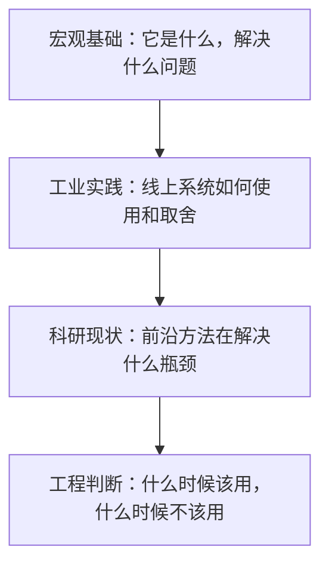
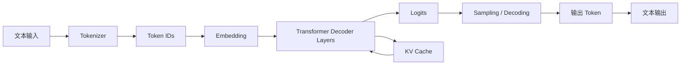

# 第21章 大模型基础学习地图

这一部分不是从数学推导开始重新写一本深度学习教材，而是给工程师一张能够服务 Agent 系统设计、模型选型、推理部署和面试表达的基础地图。

本书前面几部分已经讨论了 Prompt、Context、Harness、RAG、Memory、Evals 和 Agent Runtime。它们都是大模型之上的工程层。要把这些系统做稳，必须知道底层模型大概如何工作：文本怎样变成 token，token 怎样变成向量，Transformer 怎样计算上下文关系，训练如何塑造能力，推理为什么会被 KV cache 和显存限制，Embedding 与 Rerank 为什么是 RAG 的基础设施，以及世界模型和具身智能为什么会把 AI 从“回答问题”推进到“预测环境并行动”。

## 21.1 三层学习法

学习大模型基础时，最容易掉进两个极端：

- 只记术语，不知道工程上有什么用。
- 直接啃论文和公式，但缺少系统主线。

更适合工程实践的方式是三层学习法：



本部分每章都会按这个顺序组织：

- 先建立直觉；
- 再讲工业界怎么做；
- 最后讲截至 2026-05 的研究方向；
- 末尾给出工程和面试表达。

## 21.2 大模型系统的全链路

一次 LLM 调用看似是“输入问题，输出答案”，实际经过了多个层次：



这条链路可以拆成几个关键问题：

- **Tokenizer**：文本如何切成模型能处理的离散符号？
- **Embedding**：token ID 如何变成连续向量？
- **Transformer Decoder**：模型如何让当前 token 关注历史 token？
- **Position Encoding**：模型如何知道 token 的顺序和距离？
- **Logits 与 Sampling**：模型如何从概率分布中选出下一个 token？
- **KV Cache**：为什么生成阶段能复用历史 Key / Value？
- **Training 与 Alignment**：模型能力和行为风格如何被训练出来？
- **Fine-tuning 与 Quantization**：如何把模型适配到业务，并降低部署成本？
- **Embedding / Rerank / RAG**：如何让模型接入外部知识？
- **World Model / Embodied AI**：模型如何预测环境变化，并把语言、视觉和动作接成闭环？

## 21.3 大模型不是一个单点技术

LLM 通常被称为“模型”，但生产中的 LLM 系统更像一个栈：

```text
Application
  Agent / Workflow / Tool Calling
  Prompt / Context / Memory / RAG
  Model API / Serving Engine
  Tokenizer / Runtime / Scheduler
  Transformer / KV Cache / Kernels
  GPU / Network / Storage
```

一个回答质量问题，可能来自模型能力不足，也可能来自检索召回不准、上下文污染、采样参数不合适、工具协议太弱、权限边界错误、或推理服务在长上下文下被迫降级。

所以，学习大模型基础不是为了替代 Agent 工程，而是为了知道每一层的边界。

## 21.4 宏观基础：LLM 到底学到了什么

最朴素的说法是：

> LLM 是在大规模文本上训练出来的 next-token predictor。

给定前面的 token 序列，模型预测下一个 token 的概率分布。

但这个说法容易低估它。为了预测下一个 token，模型被迫学习语言、事实、风格、代码结构、推理模式、世界知识和任务格式。它不是数据库，也不是符号推理机，但它通过参数压缩了大量模式。

可以用四个层面理解 LLM：

- **统计层面**：学习 token 序列中的条件概率。
- **表示层面**：把词、句子、代码和概念映射到高维向量空间。
- **结构层面**：通过 Attention 建模上下文中 token 之间的依赖。
- **行为层面**：通过指令微调和偏好对齐，学会像助手一样响应。

## 21.5 工业实践：工程师真正关心什么

在工业界，大多数团队不会从零训练基础模型，而是在模型之上做工程：

- 选择闭源 API、开源模型或私有化模型；
- 设计 Prompt、工具协议和上下文结构；
- 用 RAG 接入企业知识；
- 用 evals 衡量回答质量；
- 用 guardrails 和权限系统控制风险；
- 用 serving engine 控制延迟、吞吐和成本；
- 必要时做 SFT、LoRA 或 DPO 类偏好优化。

因此，工程师学习大模型基础时，要优先掌握这些“会影响系统设计”的概念：

- token 数如何影响成本、延迟和上下文窗口；
- KV cache 如何影响并发和显存；
- temperature / top-p 如何影响稳定性；
- embedding 与 rerank 如何影响 RAG 质量；
- 微调适合改风格和格式，不适合替代事实更新；
- 对齐提升可用性，但也会引入拒答、过度安全和格式偏置；
- benchmark 不能替代真实业务 eval。

## 21.6 科研现状：截至 2026-05 的主线

大模型研究非常快，但底层主线相对稳定。可以按六类问题看：

### 1. 能力规模化

Scaling law、数据质量、MoE、合成数据和高质量代码/数学数据仍然是提升基础能力的核心路线。研究焦点从“单纯扩大参数”转向“数据、架构、训练效率和推理预算的共同优化”。

### 2. 长上下文与推理效率

长上下文让模型能处理文档、代码库、对话历史和 Agent 轨迹，但它带来 prefill 延迟、KV cache 显存和 attention 计算压力。因此 PagedAttention、GQA、MLA、KV cache quantization、chunked prefill、speculative decoding 等方向都很活跃。

### 3. 后训练与推理能力

SFT、RLHF、DPO、RLAIF、GRPO 和 reasoning RL 改变了模型的行为方式。DeepSeek-R1 之后，如何通过可验证奖励、长链推理和 test-time compute 提升推理能力，成为重要方向。

### 4. 多模态与工具使用

模型不再只是文本补全器，而是在视觉、语音、代码执行、网页浏览、文件系统和外部工具之间编排任务。Agent 能力越来越依赖模型、工具协议、执行环境和评估体系共同演化。

### 5. 检索增强与外部知识

RAG、GraphRAG、agentic retrieval、late interaction reranking 和 context engineering 说明一个事实：很多生产任务不能只依赖模型参数记忆，而需要外部知识、证据和权限系统。

### 6. 世界模型与具身智能

世界模型把预测目标从 next token 扩展到环境状态、行动后果和物理动态；具身智能把模型放进带传感器、执行器和安全约束的闭环系统。这个方向正在从 model-based RL、视频世界模型、JEPA 表征预测、VLA 机器人策略、自动驾驶仿真和 Physical AI 平台多条路线同时推进。

对 Agent 工程师来说，这一章的价值不只在机器人本身。它提醒我们：智能体系统最终要面对环境、行动、反馈和风险。软件 Agent 的工具调用是数字世界中的行动，具身智能则把行动带进物理世界，因此更需要世界模型、仿真、可行动性、安全层和数据飞轮。

## 21.7 本部分学习路线

建议按下面顺序阅读：

1. 第22章先理解 token、embedding 和上下文窗口。
2. 第23章理解 Transformer Decoder 的核心结构。
3. 第24章理解推理机制、sampling 和 KV cache。
4. 第25章理解模型如何通过训练和对齐获得能力与行为。
5. 第26章理解如何微调、量化和部署模型。
6. 第27章理解 embedding、rerank 和 RAG 如何接入外部知识。
7. 第28章理解世界模型和具身智能如何把模型能力扩展到环境预测和行动闭环。

如果你是为了面试，可以重点掌握每章末尾的“面试表达”。如果你是为了做系统，可以重点看“工业实践”和“工程清单”。

## 21.8 面试表达

一句话版：

> 大模型基础可以按数据表示、模型结构、训练对齐、推理服务、知识增强和行动闭环六层理解。Tokenization 决定输入表示，Transformer Decoder 决定上下文建模，训练和对齐决定能力与行为，Prefill/Decode/KV cache 决定推理成本，Embedding/Rerank/RAG 决定外部知识接入能力，世界模型和具身智能决定模型如何预测环境并在反馈中行动。

展开版：

> 我不会把 LLM 只看成一个 API。它底层是 next-token prediction 模型，输入先经过 tokenizer 变成 token，再经过 embedding 和 Transformer Decoder 得到 logits，最后通过 sampling 生成下一个 token。工程上，token 数影响上下文成本，KV cache 影响推理并发，sampling 影响稳定性，训练和对齐影响能力边界，RAG 和工具系统决定模型如何接入外部知识与数字环境。进一步看，世界模型和具身智能把问题扩展到环境预测、行动后果、物理安全和数据闭环。所以做 Agent 系统时，我会同时关注模型能力、上下文设计、推理成本、外部知识、行动边界和评估闭环。

## 21.9 专家视角：把 LLM 看成压缩后的任务先验

LLM 的一个重要直觉是：它不是在调用外部知识库，而是在参数中压缩了训练数据里的统计结构。这个压缩不是无损压缩，也不是结构化数据库，而是一种任务先验。

所谓任务先验，是指模型在看到输入时，会根据训练中见过的模式推断“这像什么任务”“应该用什么格式回答”“哪些词和哪些结构经常一起出现”。这解释了很多现象：

- 模型擅长常见任务，因为训练中有大量相似模式。
- 模型会产生幻觉，因为它在补全高概率文本，而不是查询事实源。
- Prompt 有用，因为 Prompt 改变了模型对任务分布的判断。
- Few-shot 有用，因为示例在上下文中重新塑造了局部任务先验。
- RAG 有用，因为外部证据把参数先验约束到可验证事实上。

从这个视角看，大模型工程不是“命令一个智能体”，而是“用上下文、工具和反馈塑造模型在当前任务上的条件分布”。这也是为什么 Context Engineering 在 Agent 系统中如此重要：你不是单纯塞更多信息，而是在控制模型当前应该相信什么、忽略什么、如何行动。

## 21.10 专家视角：模型能力要拆成四种能力

讨论“大模型能力”时，不能只说“强”或“弱”。更好的拆法是：

### 1. 语言建模能力

模型能否理解语法、语义、篇章结构、语气和隐含关系。这个能力主要来自预训练规模和数据覆盖。

### 2. 知识记忆能力

模型参数里是否包含某类事实或模式。它适合常识和稳定知识，不适合强时效、强权限、强溯源的业务事实。

### 3. 指令遵循能力

模型能否理解“你要它做什么”，并按角色、格式、边界和约束输出。这部分很大程度来自 SFT、RLHF/DPO、系统提示和工具协议。

### 4. 任务执行能力

模型能否在多步骤任务中规划、调用工具、检查结果、恢复错误。这个能力不只来自模型权重，还来自 Agent Runtime、工具系统、状态机和 eval。

面试和系统设计里，如果你能把失败定位到这四类能力之一，回答会比泛泛说“模型不够好”更有说服力。

## 21.11 工程视角：Foundation Model 与 Application 之间的灰度层

很多团队一开始会把系统分成两层：模型层和业务层。但生产中真正复杂的是中间灰度层：

```text
Foundation Model
  Model Adapter / Router
  Prompt Template / Policy
  Context Builder
  Retrieval / Tool Gateway
  Output Parser / Verifier
  Eval / Trace / Feedback
Application
```

这层灰度层决定了模型是否能进入生产。

例如，同一个底层模型：

- 换一个 tokenizer 或 chat template，可能结构化输出成功率变化；
- 换一个 context builder，RAG 忠实性会变化；
- 换一个 sampling 配置，代码生成稳定性会变化；
- 换一个 serving engine，长上下文吞吐会变化；
- 换一个 eval 集，模型排名可能完全不同。

所以本书强调“大模型基础”，不是为了让你从零训练模型，而是为了让你理解这些灰度层为什么会影响结果。

## 21.12 研究视角：为什么前沿不等于可落地

截至 2026-05，前沿研究在快速推进：byte-level 模型、reasoning RL、KV cache 压缩、agentic RAG、长上下文和 MoE 都很热。但工程落地要看四个维度：

- **质量稳定性**：平均分提升不够，长尾任务是否可靠？
- **系统兼容性**：serving engine、量化、并发、监控是否支持？
- **成本结构**：是降低 GPU 成本，还是增加工程复杂度？
- **失败可解释性**：出了问题能否定位到数据、检索、模型、工具或调度？

比如一个 KV cache 压缩方法在论文 benchmark 上效果很好，但如果它不兼容现有 paged KV engine，或者会破坏特定长上下文任务，它在企业系统里就可能暂时不可用。

同理，长上下文模型可以减少部分检索需求，但不会替代权限控制、文档更新、引用溯源和检索 trace。前沿研究提供新的可能性，工程落地需要重新放进系统约束里评估。

## 21.13 学习路线：从“会用 API”到“会设计系统”

如果你已经会调用模型 API，下一步不是马上读所有论文，而是按下面的能力阶梯走：

1. **理解输入输出**：token、context、embedding、logits、sampling。
2. **理解模型结构**：decoder-only Transformer、attention、FFN、位置编码。
3. **理解推理成本**：prefill、decode、KV cache、batching、serving engine。
4. **理解训练塑形**：pretraining、SFT、RLHF、DPO、reasoning RL。
5. **理解适配手段**：Prompt、RAG、tool、LoRA、量化、蒸馏。
6. **理解系统闭环**：eval、trace、guardrails、feedback、monitoring。
7. **理解行动智能**：world model、VLA、embodied reasoning、simulation、safety layer。

达到第 7 层后，你才真正从“会调模型”进入“会设计 AI 系统”，并开始理解模型能力如何进入真实或仿真的行动环境。

## 21.14 常见误区：学习大模型基础时最容易错在哪里

### 误区 1：把 LLM 当成搜索引擎

搜索引擎返回外部索引中的文档，LLM 返回条件概率下最可能的 token 序列。它可能知道某些事实，但没有天然的来源、时间戳和权限边界。需要可溯源时，必须接 RAG、数据库或工具。

### 误区 2：把 Prompt 当成唯一工程手段

Prompt 很重要，但 Prompt 解决不了所有问题。知识问题需要检索，权限问题需要系统控制，格式问题可能需要 parser 或 constrained decoding，稳定性问题需要 eval 和重试策略。

### 误区 3：把长上下文当成 Memory

上下文窗口只是本次调用可见的 token 序列。Memory 是跨会话、跨任务的状态系统。KV cache 是推理过程中的运行时缓存。三者名字都和“记住”有关，但工程含义完全不同。

### 误区 4：只看模型排行榜

排行榜只覆盖有限任务。真实业务要看任务分布、延迟、成本、权限、安全、上下文长度、结构化输出、工具调用和可观测性。模型选型不是选最高分，而是选最适合系统约束的方案。

### 误区 5：认为前沿论文可以直接替代工程设计

论文证明的是某种方法在某些条件下有效。生产系统还要处理灰度发布、回滚、监控、数据漂移、权限隔离和用户体验。真正可靠的系统来自模型能力和工程闭环的组合。

## 21.15 自测问题

读完本章后，应该能回答：

- 为什么说 LLM 是任务先验，而不是事实数据库？
- 大模型系统为什么要分模型层、上下文层、工具层和评估层？
- Prompt、RAG、微调、工具调用分别适合解决什么问题？
- 为什么长上下文不能替代 RAG？
- 为什么 Agent 能力不只取决于模型本身？
- 世界模型和具身智能为什么是大模型基础向行动系统延伸的一部分？
- 如果一个 LLM 系统回答错误，你会如何分层定位问题？

## 21.16 工程案例：一个错误回答如何分层诊断

假设企业知识助手回答了一个错误的退款规则。不要直接说“模型幻觉”，可以按下面路径定位。

### 第一步：检查任务输入

用户问题是否含糊？是否缺少订单类型、地区、渠道、时间、会员等级等关键条件？如果输入缺条件，模型可能只能按常见规则猜。

### 第二步：检查检索

正确文档是否被召回？如果没有召回，是 query rewrite 问题、embedding 问题、BM25 问题、metadata filter 问题，还是权限过滤过严？

### 第三步：检查上下文构建

正确文档召回了，是否进入最终 prompt？有没有被 token 预算裁掉？有没有被低质量 chunk 淹没？是否带了版本、来源和适用范围？

### 第四步：检查模型生成

证据在上下文里，模型是否引用了它？是否把旧规则和新规则混合？是否忽略了条件？是否输出了没有证据支持的扩展结论？

### 第五步：检查系统策略

如果证据冲突，系统有没有要求模型说明冲突？如果证据不足，系统有没有允许模型拒答或请求补充信息？

这个例子说明：LLM 系统错误通常不是单点错误，而是输入、检索、上下文、生成、策略和评估共同作用的结果。

## 21.17 参考资料

- [Attention Is All You Need](https://arxiv.org/abs/1706.03762)
- [Scaling Laws for Neural Language Models](https://arxiv.org/abs/2001.08361)
- [Training Compute-Optimal Large Language Models](https://arxiv.org/abs/2203.15556)
- [Training language models to follow instructions with human feedback](https://arxiv.org/abs/2203.02155)
- [Direct Preference Optimization](https://arxiv.org/abs/2305.18290)
- [Efficient Memory Management for Large Language Model Serving with PagedAttention](https://arxiv.org/abs/2309.06180)
- [World Models](https://arxiv.org/abs/1803.10122)
- [Mastering Diverse Domains through World Models](https://arxiv.org/abs/2301.04104)
- [Genie 3: A new frontier for world models](https://deepmind.google/blog/genie-3-a-new-frontier-for-world-models/)
