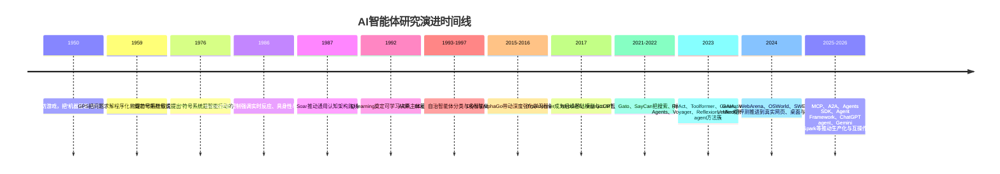
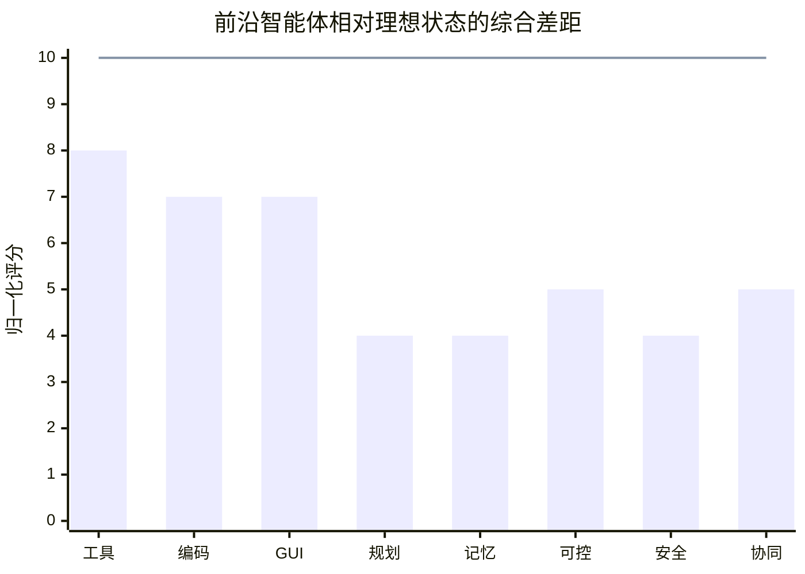

# AI智能体研究现状、工程瓶颈与未来理想能力架构报告

> 本章回答四个问题：AI 智能体从哪里来、现在发展到什么程度、接下来最值得研究什么、以及它距离“理想智能体”还有多远。

## 阅读导航

- `定义与范畴`：澄清“智能体”在不同研究传统中的含义。
- `历史演进`：回顾从符号主义到 LLM agent 的关键里程碑。
- `研究现状`：总结截至 2026 年 6 月 18 日的主流系统栈与代表性进展。
- `研究方向`：区分短期工程重点与中长期能力问题。
- `主要难点与瓶颈`：归纳当前最难被解决的结构性问题。
- `理想智能体与现实差距`：对比目标形态与现状缺口。
- `结论与建议`：给出面向研究、企业和治理的落地建议。
- `附录：参考文章链接`：汇总本章涉及的论文、文档、榜单与治理资料，便于延伸阅读。

## 执行摘要

本报告聚焦“AI智能体”这一概念在不同研究传统中的含义、从二十世纪中后期到二〇二六年六月十八日的历史演进、当下主流技术路线、关键研究方向、主要瓶颈，以及“理想智能体”与现有系统之间的结构性差距。整体结论是：智能体研究并非始于大语言模型，而是长期由三条主线共同推动——符号主义与认知架构、强化学习与行为控制、以及近年的基础模型驱动代理。今天的“智能体热”之所以爆发，本质上是大模型把语言理解、工具调用、跨任务迁移和自然交互统一到了一个可工程化的接口上，但它并没有消除早期研究中关于规划、记忆、信用分配、可解释性和安全控制的根本难题。

从能力进展看，二〇二三年至二〇二六年的提升非常快，但呈现出“局部逼近、整体未解”的特征。网页与桌面操作方面，WebArena 原始论文中的最佳 GPT-4 代理只有 14.41% 任务成功率，而人类为 78.24%；OSWorld 原始论文中最佳模型仅 12.24%，人类超过 72.36%。到二〇二六年，官方或公开来源显示，前沿系统已把 WebArena-Verified、OSWorld-Verified 推进到 67.3% 和 75.0% 一类的水平，某些系统甚至在特定验证集上接近或超过原有人类基线；但与此同时，在更接近真实工作的 TheAgentCompany 上，最强基线自动完成率仍只有约 30%，在长程软件工程基准 SWE-Bench Pro 上，统一脚手架下的最佳公开结果仍低于 25%。这说明“短到中程、规则相对清晰、工具链可控”的任务正在快速被攻克，而“长程、开放世界、跨系统、带隐性约束”的真实工作自动化仍远未解决。

研究前沿已经从“让模型会说”转向“让系统能做、做对、做稳、做得起、做得可审计”。因此，短中期最关键的投资方向并不是继续堆砌单一模型能力，而是围绕验证式执行环境、状态与记忆管理、测试时搜索与校验器、Agentic RL、协议安全、可观测性、人类审批与最小权限运行时等系统工程能力展开。官方开发文档也越来越清楚地把“编排、工具执行、审批、状态管理、可观测性”视为智能体系统的核心，而不再把智能体简化为一个会聊天的模型。

理想智能体不应只是“更强的聊天机器人”，而应是一类具备目标澄清、长期记忆、因果建模、跨环境行动、可自我修复、可解释、可控、低成本、社会适应与安全协作能力的持续运行系统。与这一理想相比，当前主流系统的最大差距不在短时推理，而在长程鲁棒性、可靠记忆、真实世界安全边界、跨任务泛化的稳定性，以及“在不牺牲可审计性的前提下”进行高自主行动。

### 核心判断

- 智能体研究不是从 LLM 才开始，而是符号主义、强化学习和基础模型代理三条路线长期汇流的结果。
- 2023 年到 2026 年的进展非常快，但主要集中在“短到中程、可验证、工具边界清晰”的任务上。
- 当前竞争重点已经从“模型会不会说”转向“系统能不能稳定执行、可审计、可控且成本可接受”。
- 理想智能体与现实系统之间的最大鸿沟，仍然是长程鲁棒性、记忆治理、安全边界与高自主行动的可审计性。

## 定义与范畴

“智能体”在 AI 领域并没有单一、跨范式一致的定义。经典 AI 教材将 agent 定义为“通过传感器感知环境、通过执行器作用于环境的实体”，并进一步强调“理性智能体”应在给定感知历史与先验知识的条件下，选择能最大化期望绩效的行动。这个定义的优点是抽象统一，适用于软件代理、机器人、博弈程序和网络服务，但它对内部实现没有限定。

九十年代的自治智能体研究则更强调“自主性”。Franklin 与 Graesser 把自治智能体刻画为持续处于环境之中、能够自主感知并行动、以实现目标的一类系统；Wooldridge 与 Jennings 则把智能体的关键性质总结为自主性、反应性、主动性与社会能力。前者试图区分“agent”和一般程序，后者则把智能体研究分为 agent theory、agent architectures 与 multi-agent systems 等层面。这一时期的研究关注点更接近软件工程与分布式系统，而不仅是机器学习。

如果按研究传统来划分，至少可以区分五类主要范畴。第一类是**符号主义智能体**，核心是显式知识表示、逻辑推理、规划与规则执行，代表脉络包括 GPS、物理符号系统假说、AOP、BDI 与 Soar。第二类是**连接主义与行为式智能体**，强调感知—行动闭环、分层控制、端到端表征学习与具身反应，Brooks 的 subsumption 体系是一个典型早期起点。第三类是**强化学习智能体**，以状态、动作、奖励与策略优化为中心，从 Q-learning、DQN 到 AlphaGo，再到多智能体 RL 与具身控制。第四类是**多智能体系统**，把多个自治实体之间的通信、协作、竞争与博弈视为研究对象。第五类则是今天最受关注的**LLM 驱动智能体**，它通常以基础模型作为“脑”，配合外部工具、检索、记忆、规划器、执行器和环境反馈，形成可执行的任务闭环。

近两年，工程与产业界对“智能体”的定义又出现了新的收敛。OpenAI 的 Agents SDK 把智能体定义为“能够规划、调用工具、在专家之间协作并保持足够状态以完成多步骤任务的应用程序”；Google 的 ADK 则把重点放在“构建、调试、部署可靠 AI 智能体，并从单智能体扩展到多智能体系统”；Microsoft Agent Framework 进一步把编排、部署、中间件、终止条件和 guardrails 视作 agent runtime 的核心组成。换言之，现代工程语境中的“agent”已经不只是一个模型，而是“模型 + 工具 + 工作流 + 状态 + 审批 + 观测”的复合系统。

为了便于后续讨论，可以先把不同范式的智能体放在同一个视角下比较：

| 范畴                   | 核心定义焦点                         | 典型代表                                                     | 优势                               | 主要局限                             |
| ---------------------- | ------------------------------------ | ------------------------------------------------------------ | ---------------------------------- | ------------------------------------ |
| 符号主义智能体         | 显式知识、逻辑、规划、规则           | GPS、AOP、BDI、Soar  | 可解释、约束清晰、适合高结构任务   | 对开放环境适应差，知识工程成本高     |
| 行为式与连接主义智能体 | 感知—行动耦合、实时反应、表征学习    | Brooks 分层控制、后来的深度控制  | 对动态环境响应快，适合具身与控制   | 难以显式规划与解释，高层目标处理弱   |
| 强化学习智能体         | 奖励驱动策略优化                     | Q-learning、DQN、AlphaGo  | 能从交互中学策略，适合序列决策     | 样本效率低，奖励设计难，泛化脆弱     |
| 多智能体系统           | 通信、协作、竞争、博弈               | MADDPG、QMIX、SMAC  | 能分工协作，适合复杂任务分解       | 非平稳、信用分配难、评估复杂         |
| LLM驱动智能体          | 语言为中枢的规划、工具调用与状态管理 | WebGPT、ReAct、Toolformer、Agents SDK  | 通用性强、开发门槛低、可跨任务迁移 | 长程稳定性、安全边界、成本与记忆仍弱 |
| 具身与多模态智能体     | 语言、视觉、动作统一的闭环           | Gato、SayCan、PaLM-E、RT-2  | 更接近真实世界行动                 | 数据昂贵、泛化与安全验证更难         |

## 历史演进

AI 智能体研究可以看作两次“大融合”的结果。第一次融合发生在二十世纪中后期：符号推理、问题求解、规划、认知架构与软件代理概念逐渐合流，形成了“把智能看作可表征、可推理、可执行的程序过程”的传统。第二次融合则发生在二〇一五年之后：深度学习、强化学习、Transformer、RLHF、多模态模型与工具调用体系逐步汇聚，最终在二〇二三年后形成今天所谓的 LLM agent 范式。

下面的时间线用于快速建立“路线演进感”，表格则补充每个节点的方法与长期影响。

| 时期      | 里程碑                                                       | 贡献                                         | 方法                                           | 主要限制                           | 长期影响                     |
| --------- | ------------------------------------------------------------ | -------------------------------------------- | ---------------------------------------------- | ---------------------------------- | ---------------------------- |
| 1950      | 图灵《Computing Machinery and Intelligence》  | 提出机器能否表现出智能行为的可操作问题框架   | 模仿游戏                                       | 不是可执行 agent 架构              | 设定了“行为可检验”的研究视角 |
| 1959      | GPS                                      | 早期通用问题求解程序                         | means-ends analysis、符号搜索                  | 环境封闭、知识稀缺                 | 奠定了规划式 agent 雏形      |
| 1976      | 物理符号系统假说           | 将智能行动系统化为符号操作                   | 符号表示与搜索                                 | 难处理感知、噪声与具身性           | 深刻影响认知架构与经典 AI    |
| 1986      | Brooks 分层控制            | 反驳“先建模后行动”的唯一路径                 | 行为式、分层、实时反应                         | 高层推理与语言能力弱               | 打开具身与行为式路线         |
| 1987      | Soar                       | 追求通用认知架构与持续学习                   | 规则系统、子目标、chunking                     | 可扩展性与知识获取难               | 影响后续认知架构研究         |
| 1992      | Q-learning                  | 为“会学的 agent”提供通用值函数框架           | 无模型 RL                                      | 离散条件强、样本效率限制大         | 成为现代 RL 基石             |
| 1993      | AOP                                      | 把“信念、能力、决策”作为程序抽象             | mental-state 编程                              | 与真实学习和感知结合弱             | 推动软件代理与 MAS           |
| 1995      | BDI Agents / Intelligent Agents  | 明确自治、反应、主动、社交等属性             | 心智状态 + 工程架构                            | 难处理开放世界不确定性             | 成为软件 agent 教科书框架    |
| 2015      | DQN                          | 用深度网络学习高维感知控制                   | 深度强化学习                                   | 数据与稳定性问题突出               | 让神经智能体真正“能玩能学”   |
| 2016      | AlphaGo                   | 证明深度网络 + 搜索 + 自博弈的威力           | Policy/Value 网络 + MCTS                       | 任务专用、工程复杂                 | 推动“规划 + 学习”的融合      |
| 2017      | Transformer                 | 提供高扩展的通用序列建模底座                 | 自注意力                                       | 本身不是 agent                     | 成为 LLM agent 的基础设施    |
| 2021      | WebGPT                     | 把浏览网页与人类反馈结合到问答代理           | 浏览器动作 + 偏好优化                          | 仍偏单任务问答                     | 预示了“检索/浏览型 agent”    |
| 2022      | InstructGPT / Gato / SayCan  | 对齐、通用策略、具身可供性三条线并进         | RLHF、多任务统一、LM+技能选择                  | 可靠性与尺度成本高                 | 为“通用代理”奠基             |
| 2023      | ReAct / Toolformer / Voyager / Reflexion / MemGPT / Generative Agents  | 形成“推理—行动—反思—记忆—社会模拟”方法簇     | 工具调用、文本反思、技能库、记忆层级           | 多为脚手架式提升，稳定性与评估不足 | 标志 LLM agent 研究范式成形  |
| 2024-2026 | WebArena / GAIA / OSWorld / SWE-bench Verified / MCP / A2A / Agents SDK 等  | 从论文原型走向可复现评测、协议与生产化运行时 | 真实网页、桌面、软件工程、协议互联、工作流编排 | 榜单碎片化、设置差异大、安全面扩大 | 进入“系统化智能体工程”阶段   |

## 研究现状

截至二〇二六年六月十八日，主流智能体技术已经形成一个较为稳定的系统栈：以大模型或多模态模型作为中央策略器，外接搜索、代码执行、数据库、浏览器、桌面、API、文件系统等工具；通过 ReAct 式交替推理—行动循环、plan-and-act 分层规划、反思/校验器、记忆层级和多智能体分工来提升成功率；再用日志、轨迹、评估集、审批节点和 guardrails 去控制风险。这一架构的优势是通用、开发快、跨任务复用强；短板则是：高度依赖脚手架设计，推理成本高，长期状态脆弱，性能常常更多反映“系统编排质量”而不只是“底座模型质量”。

从评测看，智能体领域已从静态 QA 转向交互式环境。GAIA 测通用助理的多步推理、浏览和文件处理；WebArena 测自托管网页任务；OSWorld 测真实桌面与跨应用操作；SWE-bench 系列测真实 GitHub issue 修复；TheAgentCompany 则更进一步，尝试模拟软件公司中的“数字员工”工作。不同基准分别评估 reasoning、tool use、browser use、computer use、coding 和 workplace automation，但它们的环境、允许工具、步数上限、是否验证版、是否自报成绩并不统一，因此跨基准和跨榜单“横向比较”必须非常谨慎。官方或追踪站点本身也明确提醒，很多排名反映的是“系统/脚手架配置”，而不是裸模型性能。

如果只看“趋势”，进步非常显著。GAIA 原始论文中，人类答题者平均 92%，而带插件的 GPT-4 只有 15%；到二〇二六年五月，GAIA 官方测试榜单最高公开成绩已达到 93.02%。WebArena 原始论文中最佳 GPT-4 代理为 14.41%，而 OpenAI 的 CUA 在二〇二五年公开成绩为 58.1%，GPT‑5.4 在二〇二六年官方给出的 WebArena-Verified 成绩达到 67.3%。OSWorld 原始论文中最佳模型只有 12.24%，而 GPT‑5.4 在 OSWorld-Verified 上达到 75.0%。但这种迅速进步并不意味着“现实工作已被解决”：TheAgentCompany 的最强代理仍只能自动完成约 30% 任务；SWE-Bench Pro 统一脚手架下最佳仍低于 25%。这恰恰说明，当前系统擅长的是可验证、有限时长、接口相对清晰的任务，而非开放式企业流程。

| 系统或平台                          | 开源/商用         | 代表能力与公开指标                                           | 样本效率                                                    | 可解释性                                                     | 安全性                                                       | 算力需求                             |
| ----------------------------------- | ----------------- | ------------------------------------------------------------ | ----------------------------------------------------------- | ------------------------------------------------------------ | ------------------------------------------------------------ | ------------------------------------ |
| mini-SWE-agent / SWE-agent          | 开源              | 官方称 mini-SWE-agent 在 SWE-bench Verified 上可达 74% 以上，是当前公开高水平 coding agent 代表之一。 | 高：多数能力来自预训练模型与最小 ReAct 脚手架，无需任务专训 | 中高：轨迹清晰，可复盘命令与补丁                             | 依赖沙箱与执行环境，自身不内置强治理                         | 中到高，取决于底座模型与并发评测规模 |
| OpenHands                           | 开源              | 自托管开发者控制中心，可运行多种 coding agents，并公开 benchmark 基础设施；但平台本身没有单一固定指标，性能取决于后端模型与配置。 | 中高：偏“系统整合”而非环境内学习                            | 高：工程轨迹、控制面清晰                                     | 可把代码与数据留在本地环境，安全边界更易自定义               | 中到高                               |
| OpenAI 智能体栈                     | 商用              | ChatGPT agent 是 Operator 与 deep research 的自然演进；CUA 在 WebArena 为 58.1%，GPT‑5.4 在 WebArena-Verified 67.3%、OSWorld-Verified 75.0%。 | 高：大量任务依赖模型通用先验与工具接口，而不是环境训练      | 中：有 tracing、state、human review，但机理解释有限。 | 较强：官方强调 guardrails、human review、隔离 VM/浏览器。 | 高，尤其在 computer use 与长代理链上 |
| Anthropic Claude computer use + MCP | 商用/开放协议     | 官方文档称 Claude 在 WebArena 上达到单智能体 SOTA，Opus 4.8 在 Online-Mind2Web 为 84%；MCP 已成主流工具接入标准之一。 | 高：主要靠提示、工具与服务端能力                            | 中：轨迹可见，但内部决策仍黑箱                               | 官方持续强化 prompt injection 防御，且要求最小权限 VM/容器。 | 高                                   |
| Google ADK + A2A + Gemini Spark     | 开源框架 + 商用品 | ADK 支持从单智能体扩展到多智能体，A2A 面向 agent 互操作；Gemini Spark 标志 Google 把助手推进为持续运行的主动代理。 | 中高：框架强调工程扩展而非环境样本学习                      | 高：内置构建、运行、评估与扩缩支持。 | 中高：企业集成强，但公开安全量化披露少于部分同行             | 中到高                               |
| Microsoft Agent Framework / AutoGen | 开源/商用混合     | AutoGen 已进入 maintenance mode，新项目推荐 Agent Framework；后者强调中间件、termination、guardrails 与工作流部署。 | 中：偏编排与企业集成                                        | 高：工作流和中间件透明度较好                                 | 高：对 guardrails、终止条件和审批节点支持明确                | 中                                   |
| LangGraph                           | 开源/商用混合     | 面向长时、有状态、多参与者 agent orchestration；强项在部署、管理与观测，不是单一 benchmark 冠军型系统。 | 中：主要依赖外部模型能力                                    | 高：状态图、轨迹、观测链条较清晰                             | 中：取决于外接模型与运行策略                                 | 中                                   |

当前的现实也越来越清楚：**能力前沿正在从“模型尺度竞赛”转向“系统设计竞赛”**。这一变化体现在三点上。第一，很多高分成绩来自模型、工具、检索、验证器、规则和提示工程的组合，而不是单模型调用。第二，协议层已成为研究前沿的一部分，MCP 与 A2A 说明 agent 生态开始把“互操作”当作基础设施问题来解。第三，开发框架越来越重视“可观察性、评估、人工审批、状态管理”，因为智能体已经不是一轮生成任务，而是会在时间中执行的“软件系统”。

如果再往前看一步，二〇二五年至二〇二六年的一个更深层变化是：很多系统增益已经不再主要来自“把底座模型再换强一点”，而是来自**推理期预算、运行时容器与技能抽象层**的共同优化。像 FS-Researcher 这类工作把文件系统工作区当作可持续外部记忆，让证据构建与报告写作解耦，说明长程研究任务的上限并不只由上下文窗口决定，而越来越取决于运行时如何组织状态、检索与分工。[FS-Researcher](https://arxiv.org/abs/2602.01566)

同样值得注意的是，近年的 agent 研究开始更明确地区分“底座模型能力”和“agent harness 能力”。一个稳妥的判断是：当任务跨越浏览器、代码、文件系统、API 与人工审批节点时，决定成功率的往往不是单次推理质量，而是执行循环、工具注册、上下文裁剪、状态存储、生命周期钩子与评估接口这些运行时层能力。也正因此，MCP、A2A、Agents SDK、Agent Framework 之类工作的重要性，不在于它们又提供了一套新语法，而在于它们把智能体逐步推向可组合、可治理、可审计的软件系统。

从这个角度看，今天所谓“能力竞争”，越来越像三层耦合竞争：一是底座模型的推理与多模态能力，二是测试时搜索、reviewer / verifier 与反思回路带来的系统增益，三是 harness、skills、memory、protocol 这些运行时部件的工程质量。前沿系统的差异，已经越来越多地体现在这三层如何协同，而不是体现在“谁有一个更会聊天的模型”。

### 现状小结

- 主流架构已经稳定为“模型 + 工具 + 工作流 + 记忆 + 评估/审批”的系统栈。
- 榜单分数提升很快，但不同 benchmark 的环境、预算和权限差异很大，不能简单横向比较。
- 当下的领先优势，越来越多来自系统编排、验证器和运行时设计，而不只是底座模型本身。

## 研究方向

截至当前，研究方向已经明显分化为“短期可交付的工程增量”和“中长期面向通用智能体的能力问题”两大类。短期内，最有效的方向是提高长程任务成功率、降低成本、减少安全事故并增强可审计性；中期则是把外显脚手架方法沉淀成更可学习的 agent policy；长期才会触及因果世界模型、持续在线学习、具身泛化与 agent society 的治理问题。

可以把这些方向粗略理解为三层：

- `短期工程层`：验证式执行、状态管理、成本优化、审批与可观测性。
- `中期学习层`：把外部脚手架经验沉淀为可训练策略，如 Agentic RL 与在线适应。
- `长期能力层`：世界模型、因果推理、终身学习、具身泛化与社会协同治理。

| 研究方向              | 时间尺度 | 关键问题                                                 | 代表工作                                                     | 更合适的评估指标                                     |
| --------------------- | -------- | -------------------------------------------------------- | ------------------------------------------------------------ | ---------------------------------------------------- |
| 通用智能体            | 中长期   | 如何让同一系统跨网页、代码、文档、桌面、沟通任务稳定迁移 | Gato、GAIA、ChatGPT agent、Gemini Spark  | 跨基准平均成功率、任务覆盖面、迁移降幅               |
| 可解释与可控代理      | 短中期   | 如何让行动理由、状态转移、审批边界可被人类审计           | OpenAI Agents SDK、Microsoft Agent Framework、Google agent observability  | 轨迹完整率、人工接管率、审批命中率、误触发率         |
| 长期记忆与终身学习    | 中长期   | 如何记住什么、何时检索、何时遗忘、何时反思               | Generative Agents、Voyager、Reflexion、MemGPT  | 长程任务成功率、跨会话保持率、遗忘率、恢复成本       |
| Agentic RL 与在线适应 | 中期     | 如何把 tool use、用户交互和多步执行转成可训练策略        | Agent Lightning、MUA-RL、ReTool  | success rate、pass^k、多轮完成率、训练样本效率       |
| 因果推断与世界模型    | 中长期   | 如何从相关性走向因果、从提示走向模拟和反事实规划         | Language Agents Meet Causality、AWM、Blicket causal bias work  | 反事实正确率、探索效率、分布外稳健性                 |
| 多模态与具身交互      | 中长期   | 如何把视觉、语言、动作统一为可靠闭环                     | SayCan、PaLM-E、RT-2、OSWorld  | 真实任务成功率、跨环境泛化、操作精度、恢复能力       |
| 多智能体协作与互操作  | 短中长期 | 何时分工比单体更优，协议如何设计，冲突如何解             | MADDPG、QMIX、SMAC、A2A、AutoGen/Agent Framework  | 团队收益、通信成本、冲突率、协作稳定性               |
| 社会、伦理与安全      | 短中长期 | 如何在高自主系统中控制注入、越权、欺骗和责任归属         | Anthropic prompt injection defenses、OWASP、OpenAI safety docs、CAICT 报告  | 攻击成功率、越权率、误伤率、事件恢复时间             |
| 能效与边缘部署        | 短中期   | 如何让 agent 更快、更便宜、更私密地运行                  | TinyAgent、SLM agent survey、MiniCPM-V edge work  | cost per success、p95 latency、能耗/请求、隐私暴露面 |

值得特别强调的是，**测试时计算**与**验证器/审稿器结构**有望在中短期内带来最现实的收益。ReAct、Tree of Thoughts、Graph of Thoughts、Reflexion、plan-and-act 以及 coding agent 中的 review loop 都说明：与其单纯追求更大的单次前向传播，不如让智能体拥有更好的搜索、回看、反思、校验和回退机制。对 agent 来说，“推理预算如何用”往往比“参数再大一点”更接近生产问题。

进一步说，短中期真正值得投入的并不只是“会不会多想几步”，而是**如何把测试时预算稳定地转化为系统级可靠性**。这意味着 verifier、reviewer、jury、execution-based cross-validation 之类结构会越来越重要，因为它们把推理期扩展从“更长的思维链”推进为“可被环境反馈约束的搜索过程”。对软件工程、研究代理和高风险工具调用任务而言，这类结构往往比单次生成更接近真实工作的质量控制逻辑。

与之并行的另一条主线，是把运行时治理直接视为研究问题而非部署细节。近年的 harness 研究、协议工作和生产框架都在指向同一件事：agent 的关键科学问题已经不只存在于模型内部，也存在于模型外部的执行容器、状态管理、工具权限、日志审计和人机协同边界之中。换言之，未来几年的重要研究方向，将不只是“提升模型能力”，还包括“把系统做得更稳、更可控、更容易验证”。

## 主要难点与瓶颈

当前智能体研究的关键瓶颈，可以概括为六个方面：

1. **长程任务中的误差复利**  
   在多步交互里，任一步的局部误解、错误工具调用、状态遗漏或环境误读，都会在后续步骤不断放大。TheAgentCompany 中最强代理只能完成约 30% 任务、SWE-Bench Pro 最佳公开结果低于 25%，都说明从“能做一步”到“稳定做完一整件事”之间仍有巨大鸿沟。Plan-and-Act 之所以被提出，正是因为长程任务会暴露规划与执行糅合时的脆弱性。

2. **记忆并不等于上下文长度**  
   更长的 context window 当然有帮助，但智能体真正需要的是：什么信息应被长期保留、什么应被压缩、什么时候该检索回来、什么时候该反思重写。MemGPT、Generative Agents、Voyager 和 Reflexion 都在尝试把“记忆”做成一层主动管理机制，而不是被动堆进上下文窗口；这恰恰说明长期记忆尚未被模型原生解决。这个问题在多智能体场景下会进一步放大，因为系统不仅要决定“记什么”，还要决定“谁能看什么、什么时候同步、用哪个版本为准”。如果没有明确的 scoping 规则，所谓共享记忆很容易退化为事实污染、重复劳动和过期上下文传播。

3. **安全边界在 agent 场景里显著外移**  
   传统聊天模型的主要风险是生成不良内容，而 agent 的风险是“被输入影响后去调用外部工具、访问系统、执行动作”。Anthropic 直接把 prompt injection 称为 browser-based agents 最显著的安全挑战之一；OWASP 也把 prompt injection 视为 LLM 应用的核心风险；OpenAI 文档则明确要求在 computer use 中把页面内容视为不可信输入，并把高影响动作置于人工审批下。这意味着 agent 安全不是简单的模型对齐问题，而是输入隔离、权限最小化、审批、日志和运行时策略的系统问题。随着 skills 生态兴起，风险边界又向外扩了一层：第三方 SKILL.md、脚本和权限声明本身已经构成新的供应链攻击面。近期针对恶意 agent skills 的实证研究与检测框架都表明，这类风险既不是传统恶意代码扫描能完全覆盖的，也不是普通提示词安全就能解决的。[SkillSieve](https://arxiv.org/abs/2604.06550)

4. **评价体系碎片化且可比性差**  
   同样叫“网页代理”，WebArena、WebArena-Verified、WebVoyager、BrowseComp 测的是不同事；同样叫“电脑使用”，OSWorld、OSWorld-Verified、不同步数上限和不同输入模态也会产生巨大的分数差异。GAIA、τ-bench、TheAgentCompany、SWE-bench 则分别对应通用助理、协作对话、数字员工和代码修复。今天的一个现实问题是：榜单越多，越容易“各赢一项”；真正缺的是跨环境、跨预算、跨风险等级、可复现实验设置下的综合评价。

5. **训练数据与信用分配**  
   很多 agent 成功来自人工脚手架，而非模型真正学会了在环境中优化策略。Agent Lightning、MUA-RL 和 EDGE 等工作共同说明，agent 学习面临三个核心困难：轨迹长而稀疏、用户与环境是动态的、好的训练样本不容易采。也正因此，agent 训练到今天仍高度依赖合成数据、工具反馈和局部 reward 设计，尚未形成类似语言建模那样统一、稳定的规模化学习范式。

6. **经济性与部署性**  
   前沿 agent 往往需要长上下文、多轮推理、频繁工具调用、截图/DOM/执行环境、日志与缓存，这些都会显著推高成本和延迟。Anthropic 在 computer use 发布时坦言其系统“slow and often error-prone”；而小模型与边缘 agent 方向之所以迅速升温，恰恰是因为现实应用要面对 token 成本、响应延迟、数据隐私和设备约束。换言之，很多 agent 难题并不只是“做不出来”，而是“做得出来但做不起”。在企业集成里，这个问题还会以另外三种更工程化的形式出现：把杂乱知识一股脑灌进向量库的 `Dumb RAG`，直接对接脆弱遗留 API 的 `Brittle Connector`，以及缺乏中断机制、只能靠高频轮询维持状态的 `Polling Tax`。它们共同说明，很多试点失败并不是因为模型完全无能，而是因为系统把非确定性的 agent 强行接在为确定性软件设计的旧接口上。

一个更稳妥的工程方向，是把 agent 从“主动高频询问一切”的流程，改造成“在受控状态下被事件唤醒”的流程。也就是说，长期看企业级 agent 更适合接入事件总线、Webhooks 和消息队列，而不是依赖持续轮询、无限上下文和层层嵌套的同步 API 链路。这样做不只为了省 token，更是为了把延迟、成本和故障传播范围控制在可治理的边界内。

| 难点           | 为什么难                          | 已有尝试                                                     | 仍然存在的局限                       |
| -------------- | --------------------------------- | ------------------------------------------------------------ | ------------------------------------ |
| 长程规划与执行 | 误差复利、状态遗漏、局部最优      | ReAct、plan-and-act、review loops  | 对开放世界仍脆弱，难处理隐性约束     |
| 长期记忆       | “记得住”不等于“记对/记该记的”     | MemGPT、Generative Agents、Voyager  | 容易过时、污染、漂移，更新策略不稳定 |
| 真实世界安全   | 不可信输入会影响工具调用与动作    | Prompt injection defenses、guardrails、human review  | 仍难做到完备防御，误伤与漏判并存     |
| 评估可比性     | 环境、预算、工具权限差异大        | GAIA、WebArena、OSWorld、τ-bench、TheAgentCompany  | 很难形成统一结论，榜单容易“各说各话” |
| 学习与信用分配 | 轨迹长、奖励稀疏、用户动态        | Agent Lightning、MUA-RL、EDGE  | 尚未形成统一可扩展训练范式           |
| 经济性与部署   | 多轮链路带来高延迟和高 token 成本 | 小模型路由、TinyAgent、边缘 MLLM  | 复杂规划、开放推理仍常需大模型兜底   |
| 治理与责任     | agent 会执行动作而非只输出文本    | 中国信通院治理建议、企业审批机制  | 法规、审计、责任划分仍在早期阶段     |

## 理想智能体与现实差距

理想智能体至少应满足八个条件。它应当能主动澄清目标而不是机械执行模糊命令；能建立和更新世界模型，进行因果与反事实规划；拥有可持续但可修正的长期记忆；能跨文本、网页、桌面、API 和物理环境稳健行动；在出错时能定位、解释并自行修复；对人类可解释、可审计、可中断；在安全上默认最小权限、默认高风险需审批；同时具备足够高的效率、隐私保护和社会协作能力。这样的系统更像“具有制度约束的软件同事”，而不只是“更会说话的模型”。这一理想并不是空想，它恰好对应了当前所有主流研究路线正在分别修补的能力缺口。

如果把这些要求进一步落成系统设计语言，理想智能体至少应由四层能力共同支撑。第一层是**运行时容器层**：负责执行循环、沙箱隔离、生命周期钩子、日志审计与最小权限控制，保证 agent 的每一步都在可观测、可中断的边界内。第二层是**技能与动作层**：把工具调用从零散 API 提升到可复用的 skills、可执行代码动作空间和更明确的权限治理，使“会做事”不只是提示词碰运气。第三层是**记忆与协同层**：通过 user / run / agent / app 等不同作用域管理状态存储、共享事实与异步事件唤醒，避免把所有信息都挤进单一上下文。第四层是**安全与伦理层**：在语义防御、审批、多模型审计、危机阻断和合规日志之上，限定 agent 可以做什么、何时必须交还控制权。这样理解“理想智能体”，比单纯追求一个更强的基础模型，更接近真实系统的建设顺序。

如果把这八个条件压缩成一句话，理想智能体应当同时具备：

- `会澄清`：知道什么时候该追问和确认约束。
- `会记忆`：知道什么该保留、什么该遗忘、什么该检索。
- `会行动`：能在多环境中稳定执行，而不是只会生成文本。
- `会纠错`：能发现失败、解释失败并进行恢复。
- `可治理`：始终处于可审计、可中断、最小权限的制度边界内。

下图是一个**综合性、解释性**的能力差距图。它不是单一 benchmark 的原始分数，而是根据上文涉及的公开基准、系统文档和安全资料，对当前前沿智能体在八个关键维度上的大致位置做出的归一化判断：短链工具使用、软件工程和 GUI 操作进展最快；长程规划、长期记忆、安全稳健与社会协同仍是最主要短板。其支撑依据包括 WebArena、OSWorld、TheAgentCompany、SWE-Bench Pro 以及官方安全文档。

| 维度           | 理想状态                             | 当前主流系统大致状态             | 关键证据                                                     | 可行研究路线                                                 | 优先级 |
| -------------- | ------------------------------------ | -------------------------------- | ------------------------------------------------------------ | ------------------------------------------------------------ | ------ |
| 目标理解与澄清 | 会主动追问、确认约束、生成可验证计划 | 多数系统仍偏执行导向，澄清不足   | 长程任务分数低、工作场景成功率有限。 | 计划器 + 约束检查器 + 用户澄清策略                           | 最高   |
| 长程规划       | 能把几十到上百步任务稳定完成         | 仍是最大瓶颈之一                 | TheAgentCompany 约 30%，SWE-Bench Pro <25%。 | 测试时搜索、reviewer/verifier、hierarchical planning、Agentic RL | 最高   |
| 长期记忆       | 跨会话记忆准确、可更新、可遗忘       | 主要依赖外部内存层与检索         | MemGPT、Voyager 等仍属架构补丁。 | 分层记忆、时间衰减、事实核验、记忆编辑                       | 高     |
| 多环境行动     | 文本、网页、桌面、物理世界均鲁棒     | 网页/桌面进展快，物理世界仍难    | WebArena/OSWorld 快速提升，但具身泛化仍有限。 | 统一动作空间、world model、模拟器训练与真实校准              | 高     |
| 自我修复       | 能定位失败原因并重试                 | 已有反思与 reviewer，但不稳定    | Reflexion 有效，但泛化与稳定性不足。     | verifier-guided search、反事实回放、失败模板库               | 高     |
| 可解释与可审计 | 既有行为轨迹，也有决策依据           | 轨迹层解释较好，机理解释较弱     | 开发框架强化 tracing/observability。 | 结构化决策日志、可回放状态机、因果 trace                     | 高     |
| 安全与可控     | 默认最小权限，高风险动作需审批       | 安全实践在进步，但注入仍根本未解 | Anthropic/OpenAI/OWASP 均强调该风险。 | 输入隔离、最小权限、形式化工具约束、人审闭环                 | 最高   |
| 效率与部署     | 低延迟、低成本、可私有化             | 前沿 agent 常常昂贵且慢          | computer use 仍慢，小模型边缘化成新方向。 | 小模型优先 + 大模型兜底、缓存、路由、局部执行                | 高     |
| 社会适应与协同 | 能与人类和其他 agent 稳定协作        | 协议层刚起步，协同收益不稳定     | A2A、MCP、MAS 与 agent society 研究正在形成。 | 互操作协议、信誉机制、冲突解决与责任分配                     | 中高   |

如果只给出一个最现实的研究路径排序，我会建议：**先把“可验证长程任务成功率 + 安全运行时 + 状态管理 + 小模型路由”做到位，再讨论更宏大的通用智能体叙事**。原因很简单：过去三年的经验一再表明，真实世界 agent 的主要收益不是来自“更会聊天”，而是来自“更能稳定完成任务”。而稳定性，来自验证、约束、观测、复盘和最小权限，不只来自模型本体的更强推理。

## 结论与建议

综合历史与现状，可以得出一个相对稳健的判断：AI 智能体研究已经从“概念期与原型期”进入“系统工程期”，但距离“通用、可靠、低成本、可审计的理想智能体”仍有实质差距。这个差距不是单点模型能力差距，而是多方面的系统性缺口：长程规划、状态管理、真实环境 grounding、工具安全、协议治理、评测统一和部署经济性。过去三年最重要的启示，是 agent 不是 LLM 的一个“插件功能”，而是在模型之上重新建立的一层软件体系。

### 面向研究者

对研究者而言，最值得投入的方向不是继续做“又一种脚手架”，而是围绕**可复现环境、统一评测、验证器、agentic RL、长期记忆更新规则、因果/世界模型与协议安全**建立更加通用的科学问题。特别是长程任务、开放约束与错误恢复，应成为比静态 benchmark 更优先的核心评价对象。

### 面向企业与机构

对机构和企业而言，更可操作的建议是把智能体建设分成三个层级：

1. **API-first 的低风险代理**：优先落在检索、文档处理、受限工具调用和结构化工作流上。
2. **带人审的高价值代理**：适合代码修复、分析、报表、内部流程。
3. **GUI/浏览器/桌面型高自主代理**：必须运行在隔离环境、最小权限策略与全量审计日志之下。

不要一开始就把最危险、最不稳定的代理形态投向生产。官方文档和治理报告都明确支持这种“分级部署、先易后难”的路径。

如果再把顺序说得更直接一点，一个常见且可执行的落地路线是：**先做受控 runtime，再做记忆治理，再做技能审计与事件驱动，最后才逐步提高自主性**。原因是，缺乏运行时边界和状态治理时，新增的每一点自主能力都会放大系统风险；而在容器、权限、记忆和事件机制都可控后，智能体的能力扩张才更像“可管理的软件升级”，而不是“把更多不确定性推向生产环境”。

### 面向治理与标准制定

对政策制定者与行业组织而言，优先事项应是**建立 agent 运行时治理标准**，而不是仅按模型名称做静态监管。更重要的标准包括：

- 权限最小化
- 人类审批节点
- 事故与越权日志
- 输入隔离
- 工具注册与白名单
- 第三方协议安全要求
- benchmark 与系统卡的披露规范

就当前行业状态看，MCP、A2A、企业 agent runtime 与可观测性体系正在成为“智能体基础设施层”，这里既是创新高地，也是新的安全与治理边界。

如果用一句话概括本报告的最终判断，那就是：**当前智能体已经在局部任务上接近“可用”，但距离“可信赖的通用行动者”仍相差一个完整的软件与治理层**。未来几年最有价值的研究，不会是单纯追求更像人的输出，而是构建更像“可靠制度”的 agent 系统。

## 附录：参考文章链接

本章正文为了保持书稿可读性，没有在段落中密集保留脚注编号；如果你希望继续追溯原始资料，可以从下面这些公开文章、技术文档与榜单开始。

### 基础定义与经典脉络

- [AIMA 第 2 章：Intelligent Agents](https://aima.cs.berkeley.edu/4th-ed/pdfs/newchap02.pdf?utm_source=chatgpt.com)
- [Computing Machinery and Intelligence](https://cbmm.mit.edu/sites/default/files/documents/turing.pdf?utm_source=chatgpt.com)
- [REPORT ON A GENERAL PROBLEM-SOLVING PROGRAM](https://people.csail.mit.edu/brooks/idocs/GPS1959.pdf?utm_source=chatgpt.com)
- [The Physical Symbol System Hypothesis: Status and Prospects](https://ai.stanford.edu/~nilsson/OnlinePubs-Nils/PublishedPapers/pssh.pdf?utm_source=chatgpt.com)
- [How to Build Complete Creatures Rather than Isolated Cognitive Simulators](https://people.csail.mit.edu/brooks/papers/how-to-build.pdf?utm_source=chatgpt.com)
- [Soar Homepage](https://soar.eecs.umich.edu/?utm_source=chatgpt.com)
- [Agent Oriented Programming](https://robotics.stanford.edu/~shoham/www%20papers/Agent%20Oriented%20Programming.pdf?utm_source=chatgpt.com)
- [BDI Agents: From Theory to Practice](https://cdn.aaai.org/ICMAS/1995/ICMAS95-042.pdf?utm_source=chatgpt.com)
- [Is it an Agent, or just a Program?: A Taxonomy for Autonomous Agents](https://cse-robotics.engr.tamu.edu/dshell/cs631/papers/franklingraesser96agents.pdf?utm_source=chatgpt.com)

### 强化学习与基础模型能力

- [Watkins & Dayan (1992)](https://www.gatsby.ucl.ac.uk/~dayan/papers/wd92.html?utm_source=chatgpt.com)
- [Human-level control through deep reinforcement learning](https://www.nature.com/articles/nature14236?utm_source=chatgpt.com)
- [Mastering the game of Go with deep neural networks and tree search](https://www.nature.com/articles/nature16961?utm_source=chatgpt.com)
- [Attention Is All You Need](https://proceedings.neurips.cc/paper_files/paper/2017/file/3f5ee243547dee91fbd053c1c4a845aa-Paper.pdf?utm_source=chatgpt.com)
- [Training language models to follow instructions with human feedback](https://arxiv.org/abs/2203.02155?utm_source=chatgpt.com)
- [A Generalist Agent](https://arxiv.org/abs/2205.06175?utm_source=chatgpt.com)
- [Do As I Can, Not As I Say: Grounding Language in Robotic Affordances](https://arxiv.org/abs/2204.01691?utm_source=chatgpt.com)

### LLM Agent 方法与记忆研究

- [WebGPT: Browser-assisted question-answering with human feedback](https://arxiv.org/abs/2112.09332?utm_source=chatgpt.com)
- [ReAct: Synergizing Reasoning and Acting in Language Models](https://arxiv.org/abs/2210.03629?utm_source=chatgpt.com)
- [Generative Agents: Interactive Simulacra of Human Behavior](https://arxiv.org/abs/2304.03442?utm_source=chatgpt.com)
- [MemGPT: Towards LLMs as Operating Systems](https://arxiv.org/abs/2310.08560?utm_source=chatgpt.com)
- [Reflexion: Language Agents with Verbal Reinforcement Learning](https://arxiv.org/abs/2303.11366?utm_source=chatgpt.com)
- [Plan-and-Act: Improving Planning of Agents for Long-Horizon Tasks](https://arxiv.org/abs/2503.09572?utm_source=chatgpt.com)
- [Language Agents Meet Causality -- Bridging LLMs and Causal World Models](https://proceedings.iclr.cc/paper_files/paper/2025/hash/5c5bc3553815adb4d1a8a5b8701e41a9-Abstract-Conference.html?utm_source=chatgpt.com)
- [From LLM Reasoning to Autonomous AI Agents: A Comprehensive Review](https://arxiv.org/abs/2504.19678?utm_source=chatgpt.com)
- [Large Language Model Agent: A Survey on Methodology, Applications and Challenges](https://arxiv.org/abs/2503.21460?utm_source=chatgpt.com)

### 推理期扩展与 Agentic RL

- [FS-Researcher: Test-Time Scaling for Long-Horizon Research Tasks with File-System-Based Agents](https://arxiv.org/abs/2602.01566)
- [How Inference Compute Shapes Frontier LLM Evaluation](https://arxiv.org/abs/2606.17930)
- [TEX: Test-Time Scaling Testing Agents via Execution-based Cross-Validation](https://www.salesforce.com/blog/tex-test-time-scaling/)
- [Agent Lightning: Train ANY AI Agents with Reinforcement Learning](https://arxiv.org/abs/2508.03680?utm_source=chatgpt.com)

### 评测、榜单与真实任务环境

- [WebArena: A Realistic Web Environment for Building Autonomous Agents](https://arxiv.org/abs/2307.13854)
- [GAIA: a benchmark for General AI Assistants](https://arxiv.org/abs/2311.12983?utm_source=chatgpt.com)
- [GAIA 论文 PDF](https://arxiv.org/pdf/2311.12983v1?utm_source=chatgpt.com)
- [SWE-bench Leaderboards](https://www.swebench.com/?utm_source=chatgpt.com)
- [TheAgentCompany: Benchmarking LLM Agents on Consequential Real World Tasks](https://proceedings.neurips.cc/paper_files/paper/2025/hash/0d744742f6fac4d1134c019b7cef3c8a-Abstract-Datasets_and_Benchmarks_Track.html?utm_source=chatgpt.com)
- [WebArena Leaderboard 2026](https://leaderboard.steel.dev/leaderboards/webarena/)
- [TinyAgent: Function Calling at the Edge](https://arxiv.org/abs/2409.00608?utm_source=chatgpt.com)

### 工程框架、运行时与互操作

- [Agents SDK | OpenAI API](https://developers.openai.com/api/docs/guides/agents?utm_source=chatgpt.com)
- [Computer use | OpenAI API](https://developers.openai.com/api/docs/guides/tools-computer-use?utm_source=chatgpt.com)
- [Introducing ChatGPT agent: bridging research and action](https://openai.com/index/introducing-chatgpt-agent/?utm_source=chatgpt.com)
- [Introducing GPT‑5.4](https://openai.com/index/introducing-gpt-5-4/?utm_source=chatgpt.com)
- [Computer use tool - Claude API Docs](https://platform.claude.com/docs/en/agents-and-tools/tool-use/computer-use-tool?utm_source=chatgpt.com)
- [Introducing the Model Context Protocol](https://www.anthropic.com/news/model-context-protocol?utm_source=chatgpt.com)
- [智能体开发套件 | Gemini Enterprise Agent Platform](https://docs.cloud.google.com/gemini-enterprise-agent-platform/build/adk?hl=zh-cn&utm_source=chatgpt.com)
- [Announcing the Agent2Agent Protocol (A2A)](https://developers.googleblog.com/en/a2a-a-new-era-of-agent-interoperability/?utm_source=chatgpt.com)
- [microsoft/autogen](https://github.com/microsoft/autogen?utm_source=chatgpt.com)
- [LangGraph overview](https://docs.langchain.com/oss/python/langgraph/overview?utm_source=chatgpt.com)
- [OpenHands](https://github.com/OpenHands/OpenHands?utm_source=chatgpt.com)
- [Agent observability](https://docs.cloud.google.com/stackdriver/docs/observability/agent-observability?utm_source=chatgpt.com)

### Harness、Runtime 与协议

- [Agent Harness for Large Language Model Agents: A Survey](https://www.preprints.org/manuscript/202604.0428)
- [awesome-agent-harness](https://github.com/RUCAIBox/awesome-agent-harness)
- [Introducing the Model Context Protocol](https://www.anthropic.com/news/model-context-protocol?utm_source=chatgpt.com)
- [Announcing the Agent2Agent Protocol (A2A)](https://developers.googleblog.com/en/a2a-a-new-era-of-agent-interoperability/?utm_source=chatgpt.com)

### 多智能体记忆与协同

- [How to Design Multi-Agent Memory Systems for Production](https://mem0.ai/blog/multi-agent-memory-systems)
- [TheAgentCompany: Benchmarking LLM Agents on Consequential Real World Tasks](https://proceedings.neurips.cc/paper_files/paper/2025/hash/0d744742f6fac4d1134c019b7cef3c8a-Abstract-Datasets_and_Benchmarks_Track.html?utm_source=chatgpt.com)

### 安全、治理与风险控制

- [Mitigating the risk of prompt injections in browser use](https://www.anthropic.com/research/prompt-injection-defenses?utm_source=chatgpt.com)
- [Developing a computer use model](https://www.anthropic.com/news/developing-computer-use?utm_source=chatgpt.com)
- [智能体技术和应用研究报告](https://www.lib.szu.edu.cn/sites/szulib/files/2025-07/%E4%B8%AD%E5%9B%BD%E4%BF%A1%E9%80%9A%E9%99%A2%EF%BC%9A%E6%99%BA%E8%83%BD%E4%BD%93%E6%8A%80%E6%9C%AF%E5%92%8C%E5%BA%94%E7%94%A8%E7%A0%94%E7%A9%B6%E6%8A%A5%E5%91%8A.pdf?utm_source=chatgpt.com)

### Skills 与供应链安全

- [SoK: Agentic Skills -- Beyond Tool Use in LLM Agents](https://arxiv.org/abs/2602.20867)
- [Malicious Agent Skills in the Wild: A Large-Scale Security Empirical Study](https://arxiv.org/abs/2602.06547)
- [SkillSieve: A Hierarchical Triage Framework for Detecting Malicious AI Agent Skills](https://arxiv.org/abs/2604.06550)
