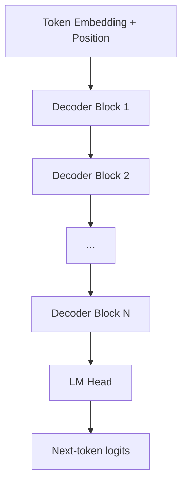

# 第23章 Transformer Decoder：Attention、Q/K/V、FFN 与位置编码

大多数现代文本 LLM 使用 decoder-only Transformer。你不需要先成为深度学习研究员，但必须理解一层 Transformer Decoder 大概在做什么，因为这直接影响上下文、KV cache、长文本、模型结构和推理性能。

## 23.1 宏观理解：Decoder-only 模型

Transformer 最早包含 Encoder 和 Decoder。今天很多 LLM，例如 GPT、Llama、Qwen、Mistral、DeepSeek 等，主要使用 decoder-only 架构。

decoder-only 模型的目标很简单：

> 给定前面的 token，预测下一个 token。

它只能看当前位置之前的 token，不能偷看未来 token。这种约束叫 causal mask。



每个 Decoder Block 通常包含：

- Attention；
- Feed-Forward Network（FFN 或 MLP）；
- residual connection；
- normalization；
- 有些模型还包含 MoE、SwiGLU、RMSNorm 等变体。

## 23.2 Attention 在解决什么问题

RNN 按顺序读文本，长距离依赖容易衰减。Attention 的核心想法是：当前位置可以直接和历史位置建立关系。

Self-Attention 的简化公式是：

```text
Attention(Q, K, V) = softmax(QK^T / sqrt(d)) V
```

可以把 Q/K/V 理解成三个角色：

- `Q`：当前 token 的查询，“我现在需要看什么”；
- `K`：每个历史 token 的索引，“我有哪些可匹配特征”；
- `V`：每个历史 token 的内容，“如果关注我，就取走什么信息”。

当前 token 用自己的 `Q` 和历史 token 的 `K` 做相似度匹配，再用注意力权重加权汇总历史 token 的 `V`。

## 23.3 Multi-Head Attention、MQA、GQA 与 MLA

### 23.3.1 MHA

Multi-Head Attention（MHA）让模型同时用多个 head 观察上下文。不同 head 可以关注不同模式，例如局部语法、引用关系、代码括号、长距离依赖等。

MHA 的问题是每个 head 都有自己的 K/V，长上下文下 KV cache 很大。

### 23.3.2 MQA

Multi-Query Attention（MQA）让多个 query heads 共享同一组 K/V heads。这样可以显著减少 KV cache 和内存带宽，但可能损失部分表达能力。

### 23.3.3 GQA

Grouped-Query Attention（GQA）介于 MHA 和 MQA 之间。多个 query heads 分组共享 K/V heads，是质量和推理效率之间的折中。

很多现代模型使用 GQA，因为它对推理非常友好，尤其是 decode 阶段。

### 23.3.4 MLA

Multi-head Latent Attention（MLA）把 K/V 压缩到更小的 latent 表示中，用于降低 KV cache 成本。DeepSeek-V2/V3 技术报告中，MLA 是降低推理成本的重要结构之一。

你可以把 MHA、MQA、GQA、MLA 看成同一个方向上的不同取舍：

```text
表达能力、实现复杂度、KV cache 大小、推理带宽
```

## 23.4 FFN / MLP 在做什么

Attention 负责在 token 之间传递信息，FFN 负责对每个 token 的表示做非线性变换。

一个简化的 Decoder Block 可以写成：

```text
x = x + Attention(Norm(x))
x = x + FFN(Norm(x))
```

FFN 通常占模型参数的大头。很多 MoE 模型就是把 FFN 替换成多个 expert，每个 token 只激活其中一部分 expert，从而用更大的总参数换取相对可控的每 token 计算量。

## 23.5 位置编码：模型如何知道顺序

Attention 本身对顺序不敏感。如果不加位置信息，模型只知道有一堆 token，不知道谁在前谁在后。

常见位置编码包括：

- **绝对位置编码**：给每个位置一个向量；
- **RoPE**：通过旋转位置编码把相对位置信息注入 Q/K；
- **ALiBi**：用 attention bias 表达距离衰减；
- **RoPE scaling / interpolation**：把训练时的上下文长度扩展到更长窗口。

RoPE 是现代开源 LLM 中非常常见的方案。它在长上下文扩展中很重要，但简单扩展位置编码并不等于模型真的会稳定利用长上下文。

## 23.6 工业实践：看模型配置时要看什么

读一个模型配置时，重点看：

- `num_hidden_layers`：层数；
- `hidden_size`：隐藏维度；
- `num_attention_heads`：query head 数；
- `num_key_value_heads`：KV head 数，决定 KV cache 规模；
- `intermediate_size`：FFN 宽度；
- `max_position_embeddings`：标称上下文长度；
- `rope_theta` 或 RoPE scaling 配置；
- 是否使用 MoE；
- 是否使用 sliding window attention；
- tokenizer 和 chat template。

这些配置会直接影响：

- 模型质量；
- 推理显存；
- KV cache 大小；
- serving engine 兼容性；
- 长上下文稳定性；
- 微调和量化难度。

## 23.7 工业实践：不要只看参数量

参数量不是全部。两个同样参数量的模型，可能因为数据、架构、tokenizer、上下文长度、GQA/MQA、MoE、后训练方法不同，在实际任务中表现差异很大。

工程选型时要同时看：

- 目标任务 benchmark；
- 中文、英文、代码、数学能力；
- 上下文长度和长上下文 eval；
- 推理吞吐和显存；
- 工具调用和结构化输出能力；
- 微调生态；
- serving engine 支持。

## 23.8 科研现状：Transformer 仍是主干，但变体很多

截至 2026-05，Transformer 仍是主流 LLM 的核心架构，但研究在多个方向推进。

### 1. 高效 Attention

FlashAttention 系列通过 IO-aware 设计减少显存读写，让长序列 attention 更高效。PagedAttention 进一步从 serving 角度管理 KV cache。

### 2. 长上下文架构

研究集中在 RoPE scaling、sliding window、sparse attention、attention sink、long-context eval 和更好的位置外推。真正难点不只是“能输入 1M token”，而是模型是否能稳定找到、整合和引用长距离信息。

### 3. MoE

MoE 让模型拥有很大的总参数量，但每个 token 只激活部分 expert。它提升了训练和推理的性价比，但带来路由、负载均衡、通信和服务部署复杂度。

### 4. MLA 与 KV 压缩

MLA、GQA、MQA、KV cache quantization 都在处理同一个问题：decode 阶段 KV cache 和内存带宽是瓶颈。

### 5. 非 Transformer 路线

Mamba 等 selective state space model 试图用线性时间序列建模替代二次复杂度 attention。它们在长序列效率上有吸引力，但在通用 LLM 生态、工具兼容和大规模实战上仍处于竞争与融合阶段。

## 23.9 工程清单

分析一个模型结构时，可以问：

- 它是 dense 还是 MoE？
- 使用 MHA、MQA、GQA 还是 MLA？
- KV head 数是多少？
- 上下文长度是训练得到的，还是通过扩展策略外推的？
- serving engine 是否支持它的 attention 结构？
- 量化后 attention 和 FFN 是否都有稳定支持？
- 长上下文 eval 是否覆盖目标任务？

## 23.10 面试表达

一句话版：

> Transformer Decoder 用 causal self-attention 建模历史 token 对当前 token 的影响，用 FFN 做非线性表示变换，用位置编码注入顺序信息。MHA、MQA、GQA、MLA 的核心差异之一是 KV head 和 KV cache 成本。

展开版：

> 我理解 decoder-only LLM 时，会先看它如何做 next-token prediction。每层里 Attention 负责让当前 token 读取历史 token，FFN 负责对表示做非线性加工，residual 和 normalization 保证深层训练稳定。工程上我会特别关注 attention 变体，比如 GQA 可以减少 KV cache，MoE 可以提升参数效率但增加部署复杂度，RoPE scaling 可以扩展上下文但需要长上下文 eval 验证。

## 23.11 深入理解：Attention 的强项和弱项

Attention 的强项是内容寻址。当前 token 可以根据 query 去历史 token 中找相关 key，再读取对应 value。这使它很适合处理引用、依赖、对齐、复制、代码括号匹配和多处证据汇总。

但 Attention 也有弱点：

- 计算和显存随序列长度增长；
- 长上下文中注意力权重可能被噪声稀释；
- 它不天然理解文档层级和权限边界；
- 它更像软检索，不是精确数据库查询；
- 注意力权重不等于可靠解释。

工程上不要把 “模型能 attend 到某段文本” 等同于 “模型会正确使用这段文本”。长文档问答里，即使关键证据在上下文中，模型也可能因为排序、噪声、冲突或位置偏置而忽略它。

因此上下文工程常常要给 attention 提供更好的结构：

- 用标题和层级帮助定位；
- 用 citation ID 绑定证据；
- 用结构化字段区分事实、指令和示例；
- 用 rerank 减少无关 chunk；
- 用摘要降低噪声；
- 用工具查询替代长文本扫描。

## 23.12 深入理解：FFN 是模型“知识容量”的重要来源

很多人学 Transformer 时只关注 Attention，但 FFN/MLP 同样关键。Attention 负责跨 token 通信，FFN 负责在每个位置上进行非线性变换。大量参数位于 FFN 中，因此它常被认为承载了相当多的模式记忆和特征变换能力。

SwiGLU、GeGLU、RMSNorm、pre-norm 等改进，看起来是结构细节，但会影响训练稳定性、收敛速度和最终质量。MoE 更进一步：它把 FFN 拆成多个 expert，让不同 token 路由到不同 expert。

这解释了为什么 MoE 可以在总参数量很大的情况下保持每 token 计算量相对可控。它不是每次调用都跑所有参数，而是按 token 激活少数 expert。

但 MoE 的代价是工程复杂度：

- expert 负载不均会造成尾延迟；
- 多 GPU 之间需要 all-to-all 通信；
- batch 形状更复杂；
- 量化和 serving 支持更难；
- 热门 expert 可能成为瓶颈。

所以 MoE 是典型的“训练和推理性价比更高，但系统复杂度更高”的架构路线。

## 23.13 深入理解：位置编码决定长上下文外推的上限

位置编码不只是告诉模型“第几个 token”。它决定模型如何理解相对距离、顺序和局部结构。

RoPE 的关键是把位置信息注入 Q/K 的旋转中，使 attention score 带有相对位置信息。它在现代开源 LLM 中非常常见，因为它简单、有效，并且支持一定程度的位置外推。

但 RoPE scaling 不是魔法。把最大位置从 8K 扩展到 128K，至少涉及三层问题：

- 模型训练时有没有见过足够长的序列；
- attention 和位置编码在长距离上是否数值稳定；
- 下游任务是否真的需要跨长距离整合信息。

很多“长上下文支持”来自工程扩展或继续训练，而不是基础模型天然拥有完整长上下文推理能力。评估时不能只做 needle-in-a-haystack，还要做多证据、多跳、冲突信息、表格聚合和代码库级任务。

## 23.14 工业实践：模型配置到成本估算

模型配置可以转化为初步成本判断。

例如：

```text
hidden_size 决定主要矩阵规模
num_layers 决定每 token 经过多少层
num_attention_heads 影响 attention 并行结构
num_key_value_heads 直接影响 KV cache 大小
intermediate_size 决定 FFN 计算量
max_position_embeddings 决定标称上下文长度
```

如果两个模型参数量相近，但一个使用 MHA，一个使用 GQA，那么长上下文 decode 的显存和带宽压力可能完全不同。

如果一个模型是 MoE，总参数量很大，但每 token 激活参数较少，那么单 token 计算成本可能低于 dense 模型，但通信和调度成本更高。

如果模型使用特殊 attention 结构，例如 sliding window、MLA 或混合 attention，serving engine 支持情况会直接决定能不能高效部署。

## 23.15 科研补充：架构创新的几条主线

截至 2026-05，架构研究大致沿着几条线推进：

### 1. 降低 Attention 成本

FlashAttention、PagedAttention、sliding window、sparse attention、linear attention 都在处理长序列成本问题。差异在于它们分别从 kernel、内存管理、局部注意力或数学近似入手。

### 2. 提升参数效率

MoE、expert specialization、shared experts、routing loss 改进都在追求更高训练性价比。DeepSeekMoE、Mixtral 等路线说明 MoE 已经从研究走进生产。

### 3. 压缩 KV 表示

GQA/MQA/MLA 和 KV cache quantization 试图减少 decode 阶段内存带宽。reasoning 模型输出更长，KV 压力更大，这条线会更重要。

### 4. 替代序列建模

Mamba、linear attention、hybrid state-space + attention 等路线试图绕开二次 attention 成本。短期更可能与 Transformer 融合，而不是完全替代成熟生态。

### 5. 动态计算

未来模型可能不是每个 token 走同样计算路径。MoE、early exit、speculative decoding、dynamic patching 都体现了一个趋势：把计算花在更难的位置上。

## 23.16 常见误区：Transformer 结构

### 误区 1：Attention 权重就是解释

Attention 权重能提供一些线索，但不能等同于因果解释。模型输出还受到 FFN、残差连接、层间变换、logits head 和采样影响。分析模型行为不能只看某一层某个 head 的权重。

### 误区 2：参数越多一定越好

参数量只是能力的一部分。数据质量、训练策略、上下文长度、tokenizer、后训练、推理预算和模型结构都会影响实际效果。小模型在窄任务上加 RAG 或工具，可能胜过大模型裸跑。

### 误区 3：支持长上下文就代表理解长上下文

模型能接收长输入，不代表能在长输入中稳定定位、整合、比较和推理。长上下文能力必须用目标任务评估。

### 误区 4：MoE 只是更大的模型

MoE 的关键不是总参数大，而是每 token 激活一部分参数。它改变了训练效率和推理系统形态，也引入路由、通信和负载均衡问题。

## 23.17 专家问答

**问：为什么 GQA 对推理这么重要？**

因为 decode 阶段要频繁读取历史 KV cache。GQA 减少 KV heads，直接降低 KV cache 大小和内存带宽压力。对长上下文和高并发服务，这是实打实的系统收益。

**问：为什么 FFN 参数多却经常被初学者忽略？**

因为 Attention 更直观，更容易画图。但 FFN 是每层中重要的非线性变换模块，许多模型知识和模式变换能力都和 FFN 有关。MoE 本质上也主要是在 FFN 路径上做专家化。

**问：RoPE scaling 为什么需要 eval？**

因为扩展位置范围只解决“能编码位置”的问题，不保证模型训练过这种距离上的任务，也不保证长距离信息会被正确使用。长上下文扩展必须看 needle、多跳、冲突证据、代码库和真实业务 case。

**问：Mamba 类模型会替代 Transformer 吗？**

短期更可能是融合和特定场景应用。Transformer 生态、硬件 kernel、训练经验和 serving 系统非常成熟。替代架构必须同时赢得质量、效率和工程生态。

## 23.18 从一次前向传播看数据流

把一个 token 序列送进 decoder-only Transformer，可以按下面方式理解每一层：

```text
token ids
  -> embedding
  -> add / apply position information
  -> layer 1 attention: 读历史上下文
  -> layer 1 FFN: 改写当前位置表示
  -> layer 2 attention
  -> layer 2 FFN
  -> ...
  -> final hidden states
  -> lm head
  -> logits
```

每一层都在做两件事：

- Attention：从上下文其他位置取信息；
- FFN：在当前位置做非线性变换。

层数越深，表示越抽象。浅层可能更关注词形、局部语法和格式；中层可能关注实体关系、引用和结构；深层更接近任务输出和决策。这个划分不是绝对的，但有助于理解为什么深层模型能做复杂组合。

## 23.19 工程案例：为什么结构化输出会失败

一个模型明明能写 JSON，却在线上偶尔输出坏 JSON，可能有多个结构原因：

- sampling temperature 太高；
- stop sequence 截断了括号；
- prompt 中示例格式不一致；
- 输出 token 太长导致后半截漂移；
- tokenizer 把特殊符号切分成不稳定模式；
- 模型后训练不擅长工具调用；
- grammar / constrained decoding 没启用；
- 长上下文噪声干扰了格式约束。

解决路径不是只说“让模型严格输出 JSON”，而是：

1. 降低 temperature。
2. 使用 JSON schema 或 constrained decoding。
3. 缩短无关上下文。
4. 使用明确字段说明和少量一致示例。
5. 增加 parser + retry。
6. 用 eval 统计格式遵循率。

这说明模型结构、采样和工程控制是连在一起的。

## 23.20 参考资料

- [Attention Is All You Need](https://arxiv.org/abs/1706.03762)
- [RoFormer: Enhanced Transformer with Rotary Position Embedding](https://arxiv.org/abs/2104.09864)
- [Train Short, Test Long: Attention with Linear Biases Enables Input Length Extrapolation](https://arxiv.org/abs/2108.12409)
- [Fast Transformer Decoding: One Write-Head is All You Need](https://arxiv.org/abs/1911.02150)
- [GQA: Training Generalized Multi-Query Transformer Models from Multi-Head Checkpoints](https://arxiv.org/abs/2305.13245)
- [FlashAttention: Fast and Memory-Efficient Exact Attention](https://arxiv.org/abs/2205.14135)
- [Mamba: Linear-Time Sequence Modeling with Selective State Spaces](https://arxiv.org/abs/2312.00752)
- [DeepSeek-V3 Technical Report](https://arxiv.org/abs/2412.19437)
