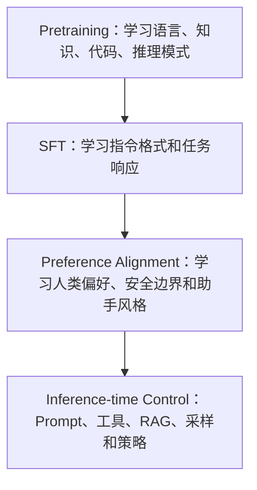

# 第25章 大模型训练与对齐：Pretraining、SFT、RLHF、DPO

大模型能力不是只靠 Prompt 调出来的。模型在训练和后训练阶段已经被塑造成某种能力边界和行为风格。本章解释 Pretraining、SFT、RLHF、DPO 和推理强化学习之间的关系。

## 25.1 宏观理解：能力、知识与行为

可以把 LLM 的形成分成三层：



这三层分别影响：

- **能力**：模型能不能读懂、写出、推理、编码；
- **知识**：模型参数中压缩了哪些训练数据模式；
- **行为**：模型是否遵循指令、是否拒答、是否按格式输出；
- **可控性**：系统能否通过 Prompt、工具和 eval 约束模型。

## 25.2 Pretraining：大规模 next-token prediction

Pretraining 的核心目标是预测下一个 token。

训练数据通常包含：

- 网页文本；
- 书籍；
- 代码；
- 数学和科学文本；
- 对话；
- 合成数据；
- 多语言语料；
- 多模态数据的文本部分或对齐数据。

训练目标简化为：

```text
maximize P(next_token | previous_tokens)
```

为了做好这个任务，模型会学习语言结构、事实模式、代码语法、常识、推理模板和任务分布。

## 25.3 Scaling Law 与数据质量

早期大模型发展强调参数量、数据量和算力的规模化。Scaling law 说明在一定范围内，模型损失会随参数、数据和计算量规律性下降。

Chinchilla 之后，行业更重视 compute-optimal：不是一味加参数，而是在参数量和训练 token 数之间找到更优配比。

近年的实践进一步强调：

- 数据去重；
- 高质量代码和数学数据；
- 合成数据过滤；
- 多语言覆盖；
- benchmark contamination 控制；
- long-context 数据；
- tool-use 和 reasoning 数据。

## 25.4 SFT：让模型学会按指令回答

SFT（Supervised Fine-Tuning）用人工或高质量合成的指令-回答数据微调模型。

Pretrained model 可能会续写网页、补全代码或模拟语料，但不一定像助手一样回答。SFT 的作用是让模型学会：

- 理解用户指令；
- 按对话格式回复；
- 遵守输出格式；
- 学习常见任务模板；
- 形成更稳定的 assistant persona。

SFT 不适合当作事实知识更新的主要手段。少量业务事实用微调灌进去，通常不如 RAG、工具或数据库可靠。

## 25.5 RLHF：用偏好塑造行为

RLHF 通常包含三步：

1. 收集多个候选回答的人类偏好。
2. 训练 reward model。
3. 用强化学习优化模型，让它更倾向于高 reward 的回答。

InstructGPT 是 RLHF 路线的重要代表。RLHF 能提升帮助性、无害性和指令遵循，但也可能带来：

- 过度拒答；
- 讨好式回答；
- 长而空的回答；
- reward hacking；
- 对真实任务指标的偏离。

## 25.6 DPO：不显式训练 Reward Model 的偏好优化

DPO（Direct Preference Optimization）把偏好优化改写成更直接的监督学习目标，不需要显式训练 reward model 和在线 RL loop。

工程上，DPO 往往更简单、更稳定，因此在开源模型后训练中很常见。

但它依赖高质量偏好数据。偏好数据如果有偏，模型会稳定地学会这些偏差。

## 25.7 RLAIF、Constitutional AI 与安全对齐

RLAIF 用 AI 反馈替代或补充人类反馈。Constitutional AI 则通过一组原则来指导模型自我批评和偏好学习。

这类方法的意义在于降低人类标注成本，并把安全原则显式纳入训练流程。

但工业上不能把安全完全交给模型权重。生产系统仍需要：

- 输入输出过滤；
- 权限系统；
- 工具调用审批；
- 审计日志；
- 风险分级；
- 红队测试；
- 业务 eval。

## 25.8 Reasoning RL 与 Test-time Compute

DeepSeek-R1 之后，推理能力训练成为重点方向之一。核心思想是：对数学、代码、逻辑等可验证任务，可以用结果正确性作为奖励，训练模型形成更强的长链推理行为。

同时，test-time compute 也变得重要：模型可以在推理时花更多 token 做分析、搜索、验证和自我修正。

这对 Agent 系统很关键，因为 Agent 任务本质上经常需要多步规划、工具调用和错误恢复。

## 25.9 工业实践：什么时候需要训练

多数业务场景不应该一上来就训练模型。更合理的顺序是：

1. Prompt 和结构化输出；
2. RAG 和工具接入；
3. evals 和错误分析；
4. 少量示例或规则；
5. SFT / LoRA；
6. 偏好优化；
7. 训练专用模型。

适合微调或后训练的情况：

- 输出格式高度稳定；
- 领域语言风格强；
- 任务模式重复；
- 有大量高质量标注数据；
- Prompt/RAG 已经解决不了行为问题；
- 需要降低 prompt 长度和调用成本。

不适合训练的情况：

- 只是补充少量事实；
- 知识频繁变化；
- 权限和实时数据很重要；
- 缺少 eval；
- 错误代价高但无法标注偏好。

## 25.10 工业实践：训练数据比算法更常出问题

训练失败经常不是因为算法不先进，而是数据有问题：

- 指令含糊；
- 答案风格不一致；
- 标注者偏好冲突；
- 正负样本差异太弱；
- 数据泄露到测试集；
- 合成数据错误未过滤；
- 安全策略和业务策略矛盾；
- 线上真实分布与训练集差异过大。

因此训练项目必须先有 eval，再做数据，再训练。

## 25.11 科研现状：截至 2026-05

### 1. 数据质量和合成数据

高质量数据、自动过滤、合成数据生成、self-improvement 和数据配比仍是核心研究方向。模型能力越来越依赖数据工程。

### 2. 偏好优化从 RLHF 到 DPO 系列

DPO、IPO、KTO、ORPO 等方法试图让偏好优化更简单、更稳定、更低成本。不同方法的核心差异在于如何使用正负偏好样本和参考模型约束。

### 3. 可验证奖励和推理能力

数学、代码、工具调用等任务可以用自动判题或环境反馈作为奖励。研究重点是如何避免 reward hacking，并让推理能力泛化到不可验证任务。

### 4. Constitutional / Scalable Oversight

当任务超出人类快速评估能力时，如何使用 AI 辅助标注、辩论、分解任务和原则约束，是安全与对齐研究的重要方向。

### 5. 多模态和 Agent 后训练

新一代模型不只对齐文本回答，还要对齐视觉理解、工具调用、浏览器操作、代码执行和长程任务。Agent 后训练会越来越依赖环境反馈和轨迹级 eval。

## 25.12 面试表达

一句话版：

> Pretraining 学基础能力，SFT 学指令格式，RLHF/DPO 学偏好和行为边界，Prompt/RAG/工具在推理时提供任务控制。微调不是万能知识注入手段，训练前必须先有 eval 和数据质量闭环。

展开版：

> 我会区分能力问题、知识问题和行为问题。能力不足可能需要更强基础模型或训练；知识过期更适合 RAG 或工具；行为不稳定可以用 SFT、DPO 或更强的结构化协议解决。工业上我不会一开始就微调，而会先用 Prompt、RAG、工具和 eval 找到错误类型，再判断是否值得做 SFT 或偏好优化。

## 25.13 深入理解：Pretraining 学到的是分布，不是可审计知识库

预训练模型会记住很多事实，但它的记忆方式和数据库完全不同。

数据库中的事实有 key、schema、版本、权限和更新时间。模型参数中的事实是分布式编码在权重里的统计模式，没有可靠的行级定位，也没有天然版本控制。

这带来三个工程结论：

- 不能要求模型像数据库一样稳定返回精确事实。
- 不能通过少量微调可靠更新大量业务知识。
- 不能把权限控制交给模型“自觉遵守”。

当业务需要最新、准确、可追溯、可删除、可授权的数据时，应该使用 RAG、数据库或工具，而不是依赖参数记忆。

预训练更适合提供通用语言能力、代码能力、常识和推理模式；业务事实应该由外部系统提供，再由模型解释和组织。

## 25.14 深入理解：SFT 学格式，偏好优化学取舍

SFT 和偏好优化经常被混在一起，但它们解决的问题不同。

SFT 像是在教模型“看到这种指令时，应该长什么样地回答”。它对格式、风格、任务模板特别有效。

偏好优化像是在教模型“多个可行回答中，哪个更符合人类偏好或安全原则”。它影响回答的取舍，比如更详细还是更简洁，更主动还是更保守，是否拒答，是否承认不确定性。

一个模型如果 SFT 不足，常见问题是：

- 不遵循指令；
- 输出格式漂移；
- 忽略系统角色；
- 不会使用工具格式。

一个模型如果偏好优化有问题，常见问题是：

- 过度自信；
- 过度拒答；
- 讨好用户；
- 生成冗长但空泛的解释；
- 为了看起来有帮助而编造。

这两个问题要用不同数据和 eval 处理。

## 25.15 工业实践：训练数据应该像代码一样管理

训练数据不是一次性素材，而是模型行为的源代码。成熟团队会像管理代码一样管理训练数据：

- 数据集有版本；
- 样本有来源和 license；
- 标注规则有文档；
- 数据变更有 review；
- 训练集和测试集隔离；
- 合成数据有过滤器；
- 敏感数据有脱敏流程；
- 错误样本能追溯到具体版本；
- 每次训练有可复现实验记录。

如果训练后模型变差，必须能回答：

- 哪批数据导致了变化？
- 哪类任务提升了？
- 哪类任务退化了？
- 是能力变化、风格变化还是安全边界变化？
- 该回滚数据、训练配置还是模型版本？

没有数据治理的训练项目，很容易把问题写进模型权重里，然后失去可解释性。

## 25.16 工业实践：后训练项目的 Eval 设计

后训练 eval 至少要覆盖四层：

### 1. 能力 Eval

目标任务是否变好，例如代码修复准确率、客服回答解决率、SQL 正确率。

### 2. 行为 Eval

是否遵循格式、是否按要求引用、是否承认不确定性、是否使用工具。

### 3. 安全 Eval

是否泄露敏感信息，是否越权调用工具，是否执行危险请求。

### 4. 回归 Eval

原有能力是否退化，例如通用问答、数学、代码、中文、长上下文。

很多训练看起来有效，是因为只看了目标任务平均分，没有看格式、拒答、幻觉和回归。生产后训练必须把“变好”和“不变坏”同时纳入门槛。

## 25.17 研究补充：Reasoning RL 的价值和风险

可验证奖励让模型在数学、代码、逻辑题上可以通过环境反馈学习。这是 reasoning RL 的核心吸引力。

但它有风险：

- 模型可能学会迎合判题器，而不是学会稳健推理；
- 可验证任务上的提升不一定泛化到开放任务；
- 长链推理可能增加成本和幻觉表面积；
- 训练数据和 benchmark 容易污染；
- reasoning trace 是否应该展示给用户也有产品和安全取舍。

DeepSeek-R1 之后，行业更重视“训练时推理”和“测试时推理”的协同。模型可以通过 RL 学会更长的思考策略，系统也可以在推理时通过工具、搜索、验证器和多候选选择提升可靠性。

对 Agent 工程来说，关键不是让模型永远输出更长思考，而是让系统知道什么时候需要多步推理，什么时候应该直接回答，什么时候应该调用工具验证。

## 25.18 专家判断：什么时候不要训练

下面几种情况不要急着训练：

- 你没有稳定 eval。
- 你不知道错误来自检索、Prompt、工具还是模型。
- 业务知识每天变化。
- 权限规则很复杂。
- 目标只是让模型记住少量产品信息。
- 线上错误无法容忍但训练数据很少。
- 输出格式可以用 schema 或 parser 解决。

训练适合优化稳定分布上的重复行为，不适合替代系统设计。

更专业的判断是：

```text
知识问题优先外部化
格式问题优先结构化
能力问题优先换模型
成本问题优先优化 serving
行为问题再考虑后训练
```

## 25.19 常见误区：训练与对齐

### 误区 1：微调可以可靠注入事实

微调可以改变模型行为，但不适合管理大量动态事实。事实应该放在数据库、搜索索引、知识库或工具里，再通过上下文注入。

### 误区 2：RLHF 只会让模型更好

RLHF 会优化偏好目标，但偏好目标可能不等于真实业务目标。它可能带来过度拒答、冗长回答、讨好用户和 reward hacking。

### 误区 3：合成数据越多越好

合成数据便宜，但也会放大模型已有偏差。低质量合成数据会让模型学会模板化、空泛和错误模式。需要过滤、去重、混合真实数据和 eval 验证。

### 误区 4：只看训练 loss

loss 下降不代表目标任务更好。后训练必须看任务指标、格式遵循、安全、回归和线上分布。

## 25.20 专家问答

**问：SFT、DPO 和 RLHF 怎么选？**

如果模型不会按任务格式回答，先 SFT。如果有多个答案都可行但质量偏好不同，可以考虑 DPO。如果需要通过环境反馈优化复杂策略，并且有可验证奖励或可靠 reward model，再考虑 RLHF/RL。

**问：什么时候训练小模型而不是用大模型？**

当任务高频、模式稳定、延迟和成本敏感，并且可以构造可靠数据和 eval 时，小模型微调或蒸馏很有价值。

**问：为什么后训练会让模型变啰嗦？**

偏好数据里人类常常偏好看起来更完整、更礼貌、更解释性的答案，模型会学到这种风格。如果业务需要短答，就要在数据和 eval 中显式奖励简洁。

**问：模型对齐能不能替代 guardrails？**

不能。对齐降低风险，但不能提供强权限、审计、可撤销策略和确定性约束。生产系统仍需要外部 guardrails 和工具权限控制。

## 25.21 案例：客服模型后训练

客服模型常见目标不是“更聪明”，而是：

- 回答更符合业务口径；
- 不胡乱承诺；
- 能识别证据不足；
- 能按固定格式输出；
- 能把用户引导到正确流程。

这类任务可以用 SFT 学习标准回答格式，用 DPO 学习“更好的客服回答”偏好。

但事实规则仍应来自知识库。否则政策更新后，每次都要重新训练模型，且无法保证旧事实被完全覆盖。

合理架构是：

```text
RAG 提供最新规则
SFT 学客服话术和格式
DPO 学偏好和拒答边界
Guardrails 控制敏感承诺
Eval 覆盖业务 case
```

## 25.22 案例：代码 Agent 后训练

代码 Agent 的后训练目标通常包括：

- 更会读错误日志；
- 更会生成 patch；
- 更会遵守仓库规范；
- 更会调用测试工具；
- 更会小步修改；
- 更会在失败后恢复。

这类训练不能只用“问题-答案”样本。更有价值的是轨迹数据：

```text
问题 -> 查看文件 -> 定位原因 -> 修改 -> 运行测试 -> 修复失败 -> 总结
```

轨迹数据可以训练模型更像工程师一样工作，但它也更难收集和清洗。错误轨迹如果不标注清楚，模型可能学会无效操作。

因此代码 Agent 后训练必须配合执行环境和可验证测试，而不是只看自然语言偏好。

## 25.23 参考资料

- [Scaling Laws for Neural Language Models](https://arxiv.org/abs/2001.08361)
- [Training Compute-Optimal Large Language Models](https://arxiv.org/abs/2203.15556)
- [Training language models to follow instructions with human feedback](https://arxiv.org/abs/2203.02155)
- [Constitutional AI: Harmlessness from AI Feedback](https://arxiv.org/abs/2212.08073)
- [Direct Preference Optimization](https://arxiv.org/abs/2305.18290)
- [DeepSeek-R1: Incentivizing Reasoning Capability in LLMs via Reinforcement Learning](https://arxiv.org/abs/2501.12948)
