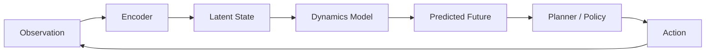
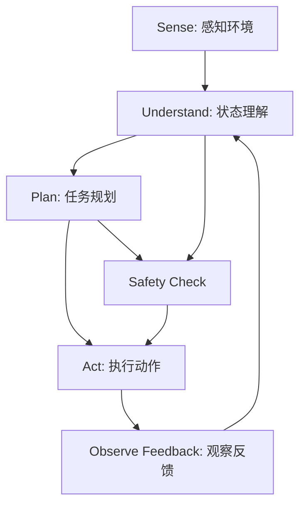
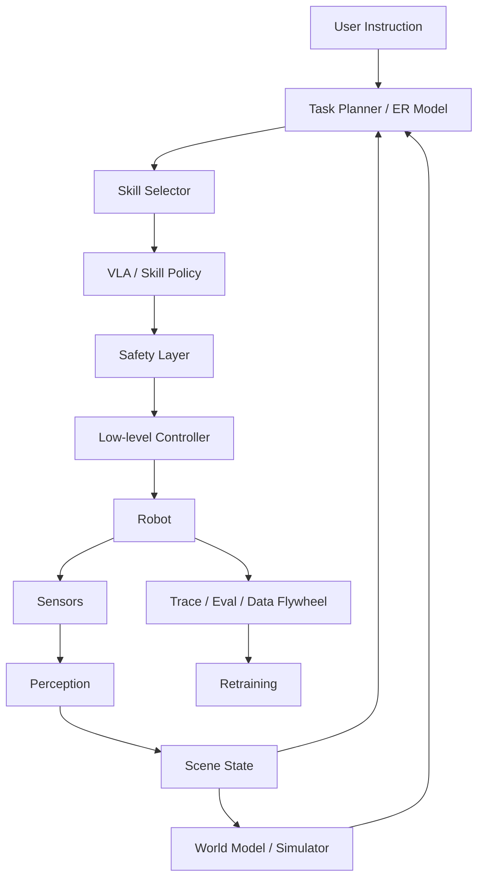

# 第28章 世界模型与具身智能：从预测世界到行动系统

前面几章讨论的大模型，大多运行在文本、图像、代码、检索结果和工具调用这些“数字空间”里。世界模型和具身智能把问题推进了一步：模型不仅要回答“下一句话是什么”，还要理解“下一秒世界会怎样变化”“如果我采取这个动作，会发生什么”“这个动作在当前身体和环境里是否可行”。

这也是为什么世界模型和具身智能正在成为大模型之后的重要方向。LLM 让机器学会了语言和知识的压缩，世界模型让机器学会预测环境，具身智能让机器在真实或仿真的环境里闭环行动。

一句话先建立直觉：

> 世界模型是智能体对环境状态、动态变化和行动后果的内部预测模型；具身智能是智能体带着身体、传感器和执行器，在环境中通过感知、决策、行动和反馈完成任务的能力。

注意，这里的“世界模型”不是哲学意义上的世界观，也不是知识图谱，更不是数据库。它强调的是：智能体能不能在内部模拟世界，预测行动后果，并据此规划或学习。

## 28.1 为什么这章放在大模型基础里

很多工程师第一次听到世界模型，会觉得它离 LLM Agent 很远，好像只属于机器人或自动驾驶。但从系统视角看，它和 Agent 工程有同一条主线：

- LLM 通过语言上下文预测下一个 token；
- RAG 通过外部知识约束模型回答；
- Agent 通过工具调用影响数字世界；
- 世界模型通过预测环境状态支持规划；
- 具身智能通过身体在物理世界执行行动。

它们都在解决一个问题：智能体如何在不确定环境中做出更好的下一步动作。

只是动作空间不同：

```text
LLM:
  action = 生成下一个 token

软件 Agent:
  action = 调用工具、编辑文件、访问网页、执行命令

具身智能体:
  action = 移动、抓取、推拉、避障、导航、与人协作
```

如果你能理解 KV cache、RAG、工具调用和 eval，那么世界模型和具身智能也可以用熟悉的工程语言来理解：状态表示、动作空间、反馈信号、评估指标、安全边界和闭环迭代。

## 28.2 宏观理解：世界模型到底是什么

世界模型可以理解为一个“可用于预测的内部环境模型”。给定当前观察、历史状态和候选动作，它输出未来可能发生的事情。

最简化的表达是：

```text
current observation + history + action
  -> world model
  -> predicted next state / reward / risk / affordance
```

其中：

- **observation**：智能体看到或感知到的东西，可以是图像、视频、激光雷达、触觉、文本状态、游戏画面或传感器数据；
- **state**：环境内部状态，可能是显式的，也可能是模型学到的 latent state；
- **action**：智能体可以采取的动作，例如转向、抓取、点击、移动、发出工具调用；
- **prediction**：下一状态、奖励、碰撞风险、任务进度、可行动性或未来视频帧；
- **policy / planner**：根据预测结果选择下一步动作。

所以世界模型不是“知道很多事实”的模型，而是“能预测状态变化”的模型。

可以用驾驶来类比。一个新手看到前车刹车，只知道“前面红灯了”。一个熟练司机会预测：前车可能急停，右侧电动车可能插入，自己如果不减速，2 秒后距离会不安全。后者脑中有一个粗糙但有效的世界模型。

对于 AI 系统也是一样：仅仅识别物体不够，还要预测物体、自己和其他智能体之间的动态关系。

## 28.3 世界模型的几种常见含义

“World Model”在不同论文和公司报告里含义略有差异。阅读材料时要先判断对方说的是哪一种。

### 1. Model-based RL 里的环境动力学模型

这是最经典的技术含义。智能体学习一个模型来预测环境如何变化，然后在模型里“想象”未来，训练策略或做规划。

例如 Ha 和 Schmidhuber 的 World Models 工作，用视觉编码器学习压缩表示，用循环网络建模时间动态，再用一个很小的 controller 做决策。Dreamer 系列进一步把这个思路发展成可扩展的 latent dynamics model：先学习世界的隐状态动态，再在想象出来的未来轨迹里训练 actor-critic。

这里的关键不是生成漂亮视频，而是让策略能利用预测结果提高样本效率和泛化能力。

### 2. 生成式视频 / 交互式环境模型

近年来，大模型社区开始把“能生成可交互环境”的视频模型也称为世界模型。Genie、Genie 2、Genie 3 和 NVIDIA Cosmos 都属于这条线。

普通视频生成模型更像“根据提示生成一段看起来合理的视频”。世界模型要求更高：它要能根据用户或智能体动作持续更新场景，并保持物体、空间、因果和交互的一致性。

差别可以这样看：

```text
视频生成:
  prompt -> video

交互式世界模型:
  prompt + action sequence -> evolving environment
```

如果用户向左走，场景要随视角改变；如果智能体推开门，门的状态要在后续保持；如果物体被移动，它不能下一秒凭空回到原位。这些一致性才是世界模型难的地方。

### 3. JEPA 类的表征预测模型

JEPA 路线强调在 latent space 中做预测，而不是重建像素。I-JEPA、V-JEPA 和 V-JEPA 2 的核心思想是：模型不必生成每个像素，只要预测高层表示即可。

这条线很重要，因为物理世界里很多细节不需要逐像素重建。机器人抓杯子时，不需要预测桌面每个纹理像素，但需要知道杯子位置、姿态、可抓取区域和动作后果。

latent prediction 的优势是更接近决策需要的抽象，可能更高效，也更少陷入像素级生成的噪声。

### 4. 自动驾驶和机器人仿真的世界模型

在自动驾驶、机器人和工业仿真里，世界模型常常是数据生成、极端场景测试和策略训练的一部分。

例如自动驾驶系统需要大量罕见长尾场景：突然横穿的行人、施工改道、异常天气、遮挡后的车辆、复杂无保护左转。真实路测很难穷尽这些情况，生成式世界模型可以帮助构造可控、可重复、可扩展的仿真环境。

这个方向的核心指标不是“视频好不好看”，而是：

- 场景是否物理合理；
- 其他交通参与者行为是否可信；
- 传感器观测是否接近真实；
- 被训练或评估的策略是否能迁移到真实世界；
- 长尾风险是否被覆盖。

## 28.4 世界模型和 LLM 的关系

LLM 和世界模型有相似之处，也有关键差异。

相似之处：

- 都是通过大规模数据学习预测；
- 都把历史上下文压缩成内部表示；
- 都可以作为更大智能体系统的一部分；
- 都依赖数据分布和训练目标；
- 都会在分布外场景失败。

关键差异：

```text
LLM:
  输入输出主要是离散 token
  目标是 next-token prediction
  强项是语言、知识、代码、抽象推理和工具协议

World Model:
  输入输出可以是视频、状态、动作、传感器和 latent representation
  目标是预测环境演化和动作后果
  强项是动态、空间、物理、交互和规划
```

从 Agent 系统看，LLM 更像“高层任务先验和语言接口”，世界模型更像“环境预测器和行动模拟器”。未来很多系统会把二者结合起来：LLM 负责理解任务、分解目标和调用工具，世界模型负责预测动作后果、生成训练场景或辅助规划。

## 28.5 经典路线：从 World Models 到 Dreamer

早期世界模型路线主要来自 model-based reinforcement learning。

典型流程如下：



### Ha 和 Schmidhuber 的 World Models

经典 World Models 架构可以拆成三块：

- **VAE**：把高维图像压缩到 latent vector；
- **MDN-RNN**：预测 latent state 的时间演化；
- **Controller**：基于 latent state 选择动作。

这个工作的启发在于：智能体可以先学一个紧凑的环境表示，再在这个内部模型中训练策略。论文还展示了“在模型生成的梦境中训练，再迁移回真实环境”的思想。

对工程师来说，最值得记的是：世界模型把“感知表示”和“行动策略”解耦了。策略不必直接处理原始像素，而可以基于压缩后的状态进行决策。

### PlaNet、Dreamer 和 DreamerV3

Dreamer 系列把世界模型推进到更通用的 RL 算法。核心思想是：

1. 从真实交互数据中学习 latent dynamics；
2. 在 latent space 中 rollout 未来轨迹；
3. 用 imagined trajectories 训练 policy 和 value；
4. 把学到的策略放回真实或仿真环境中执行。

DreamerV3 的重要性在于它用单一配置覆盖了很多任务，并在 Minecraft 等复杂环境中展现了从像素和稀疏奖励中学习远期策略的能力。

这条路线说明：世界模型的价值不只是“生成环境”，更重要的是提升学习效率。真实机器人数据很贵，真实自动驾驶路测很贵，真实工业试错也很贵。如果能在学到的模型里进行想象和试错，就可能减少真实世界探索成本。

## 28.6 世界基础模型：从环境模型到可交互世界

2024 之后，“World Foundation Model”开始成为产业关键词。它的目标类似 LLM：先用大规模通用数据训练一个基础世界模型，再针对机器人、自动驾驶、游戏、仿真、视频生成等任务做后训练或适配。

可以这样类比：

```text
Language Foundation Model:
  大规模文本/代码/多模态数据 -> 通用语言和知识能力 -> 下游任务适配

World Foundation Model:
  大规模视频/仿真/传感器/动作数据 -> 通用物理和交互先验 -> 下游场景适配
```

### Genie 系列

Google DeepMind 的 Genie 系列把世界模型和可交互环境联系得非常紧。Genie 2 重点展示了从提示生成可行动控制的 3D 环境；Genie 3 进一步强调实时交互、较高分辨率和更长时间一致性。

这类模型对 Agent 研究有两个潜在意义：

- 生成训练环境，让智能体在大量多样化场景中学习；
- 生成评估环境，测试智能体是否真正理解空间、物体和动作后果。

但要保持清醒：交互式世界模型还不是可靠的物理仿真器。它们能生成看起来合理的环境，但是否满足严格物理、传感器和安全评估要求，需要具体验证。

### NVIDIA Cosmos

NVIDIA Cosmos 更偏向 Physical AI 平台：世界基础模型、视频 tokenizers、数据处理、后训练和仿真生态结合起来，服务机器人和自动驾驶开发。

这代表了一个工业趋势：世界模型不会单独存在，它会和数字孪生、仿真引擎、数据管线、策略模型、评估系统和 GPU 推理平台一起组成栈。

### Waymo World Model

截至 2026-05，一个值得注意的产业案例是 Waymo 把世界模型用于自动驾驶仿真。它强调生成高真实度、可控的驾驶场景，尤其是罕见和危险的长尾情况。

这给工程师的启发是：世界模型最先落地的场景，往往不是“完全替代真实世界”，而是补足真实数据难以覆盖的部分，例如极端天气、危险交互、低频事故和复杂道路参与者行为。

## 28.7 具身智能：不是“机器人 + LLM”这么简单

具身智能的英文是 Embodied AI。它强调智能不是孤立地在文本里推理，而是嵌入身体和环境中。

一个具身智能系统至少包含：

- **身体**：机器人、机械臂、无人车、无人机、虚拟角色或任何有动作约束的执行体；
- **传感器**：摄像头、深度相机、IMU、触觉、力传感器、激光雷达、麦克风等；
- **执行器**：轮子、关节、电机、夹爪、手指、推进器等；
- **环境**：家庭、仓库、道路、工厂、虚拟世界或仿真平台；
- **任务目标**：拿起杯子、整理房间、配送、导航、装配、协作；
- **反馈闭环**：动作改变环境，环境产生新观察，模型再重新决策。

闭环是具身智能的核心：



为什么不能简单地把 LLM 接到机器人上？

因为真实世界有很多文本模型不擅长的约束：

- 动作有连续控制和动力学约束；
- 物体会滑落、遮挡、变形、反光或被人移动；
- 机器人有速度、扭矩、负载和碰撞限制；
- 同一个自然语言指令对应多条可行动路径；
- 失败可能造成物理损坏或人身风险；
- 反馈延迟和传感器噪声会影响闭环控制；
- 训练数据昂贵，真实试错不能无限做。

所以具身智能不是把“语言理解”搬到机器人上，而是把语言、视觉、空间、动作、控制、安全和数据闭环整合成一个系统。

## 28.8 Affordance：可行动性是具身智能的关键概念

Affordance 可以翻译为“可供性”或“可行动性”。它回答的问题是：在当前环境、当前身体和当前技能集合下，某个动作是否可执行。

例如：

- 杯子可以抓，但装满热水时抓取策略要变；
- 抽屉可以拉，但前方有障碍物时不可拉；
- “把碗放进微波炉”对塑料碗和金属碗安全性不同；
- “清理桌面”对双臂机器人、移动机械臂和无人机的可行动性完全不同。

SayCan 的核心思想之一就是把 LLM 的高层语义知识和机器人技能的可行动性结合起来。LLM 知道“清理溢出的饮料”大概需要纸巾、擦拭和丢垃圾，但机器人当前是否能拿到纸巾、是否能靠近桌面、是否掌握擦拭技能，需要由 affordance 或 value function 约束。

面试里可以这样表达：

> LLM 能提出“语义上合理”的步骤，但具身智能还需要判断这些步骤在当前身体和环境中是否可执行。Affordance 是连接语言计划和物理行动的桥。

## 28.9 VLA：Vision-Language-Action 模型

VLA 是近几年具身智能最重要的范式之一。它把视觉、语言和动作放进同一个模型或同一套训练目标里。

最直接的输入输出形式是：

```text
image / video observation + language instruction
  -> VLA model
  -> robot action
```

动作可以有多种表示：

- 离散 action token；
- 末端执行器位姿；
- 关节角或关节速度；
- 轨迹 waypoint；
- diffusion / flow 生成的连续动作序列；
- 高层技能调用。

### RT-2：把动作表示成 token

RT-2 的一个关键想法是把机器人动作也表示成 token，使模型能同时学习自然语言输出和机器人动作输出。这样，视觉语言模型从互联网数据中学到的语义能力，可以迁移到机器人控制中。

优点是统一、简单，便于利用 VLM 预训练能力。难点是动作 token 化会损失连续控制细节，且高频低层控制仍需要控制器或更细粒度策略。

### PaLM-E：把真实传感器接入语言模型

PaLM-E 把视觉、连续状态估计和文本输入整合成多模态句子，让语言模型处理 embodied reasoning 任务。它强调 grounding：语言模型不能只在文本里推理，而要把真实传感器观测接入推理过程。

### Open X-Embodiment 和 RT-X：跨机器人数据

机器人学习长期受限于数据稀缺和平台割裂。Open X-Embodiment 把多个机构、多个机器人、多个技能的数据标准化，推动跨 embodiment 的策略学习。

这点类似大模型的数据规模化：单个机器人、单个实验室、单个任务的数据太少，通用机器人策略需要跨平台、跨任务和跨环境的数据。

### Octo：开源通用机器人策略

Octo 是一个开源 generalist robot policy，基于 Open X-Embodiment 的大规模轨迹训练，支持语言指令或目标图像，并能适配新的传感器和动作空间。

它的价值不仅是模型本身，更是让研究者能在一个较标准的开源策略上比较架构、数据和微调方法。

### π0、π0.5 和 π0.7：从 VLM 到连续控制

Physical Intelligence 的 π0 把预训练 VLM 与 flow matching 结合，面向更通用的机器人控制。π0.5 进一步强调 open-world generalization，通过多机器人数据、高层语义预测、网页数据和低层动作联合训练，尝试让机器人在新环境中完成更长程、更灵巧的任务。

到 2026-04，π0.7 把重点放在 steerable generalist robotic foundation model 和 emergent capabilities 上，强调在未见环境、复杂厨房任务、跨 embodiment 泛化和多阶段任务中的 out-of-the-box 表现。它的信号意义是：机器人基础模型正在从“能按指令完成训练过的技能”，走向“把已有技能组合到新任务里”。

这代表了一个趋势：机器人基础模型不只需要“理解指令”，还要生成稳定、连续、可执行的动作，并在不同机器人身体和任务组合之间泛化。

### Gemini Robotics 和 Helix

Gemini Robotics 把 Gemini 的多模态理解扩展到物理行动，采用 VLA 和 embodied reasoning 模型组合。Figure 的 Helix 则面向人形机器人，强调端到端从像素和语言到连续动作，并在单一权重模型中支持多种家庭任务。

这些系统说明，工业界正在把“机器人控制”从手写任务程序、单任务策略，推进到更通用的基础模型路线。但它们仍然需要大量工程系统支撑：数据采集、仿真、低层控制、安全机制、评估和部署。

## 28.10 工业实践：Physical AI 系统栈

一个生产级具身智能系统通常不是一个模型，而是一整套 Physical AI stack。

```text
User / Task
  High-level planner / LLM / ER model
  Skill library / VLA policy / World model
  Safety layer / Constraint checker
  Low-level controller / Motion planner
  Robot hardware / Sensors / Actuators
  Logging / Telemetry / Evaluation
  Data flywheel / Simulation / Retraining
```

### 1. 感知层

感知层把原始传感器转换成可决策状态：

- 目标检测、分割、跟踪；
- 3D 重建、位姿估计、深度估计；
- 场景图、对象关系、可通行区域；
- 手眼标定、机器人状态估计；
- 多摄像头和多传感器融合。

感知错误会直接污染后续规划。例如杯子位置估计偏了 3 厘米，文本规划再正确也可能抓空。

### 2. 任务规划层

任务规划层把自然语言目标拆成子任务：

```text
把桌上的杯子放进水槽
  -> 找到杯子
  -> 靠近桌子
  -> 选择抓取姿态
  -> 抓起杯子
  -> 移动到水槽
  -> 放下杯子
  -> 检查是否完成
```

LLM 或 embodied reasoning model 可以在这一层发挥作用，但它必须接收环境状态、技能可用性、安全规则和失败反馈。

### 3. 策略层

策略层决定具体动作。可以是：

- VLA 直接输出动作；
- diffusion / flow policy 输出一段轨迹；
- skill policy 执行抓取、放置、导航等技能；
- RL policy 在仿真或真实环境中学习；
- 传统运动规划器生成可行轨迹。

生产系统常常是混合结构：高层用模型做泛化，低层用控制器保证稳定性和安全。

### 4. 世界模型和仿真层

世界模型可以在多个位置发挥作用：

- 生成合成训练数据；
- 预测候选动作后果；
- 做 model-predictive control；
- 生成长尾测试场景；
- 帮助自动驾驶和机器人做离线评估；
- 作为数字孪生的一部分支持调试。

但它必须和真实数据闭环校准。一个看起来真实但物理不可信的世界模型，会让策略学到错误行为。

### 5. 安全层

具身系统的安全不是可选项，而是系统核心。

常见安全机制包括：

- 动作限幅：速度、力、扭矩、加速度上限；
- 碰撞检测：机器人和环境、人之间的距离约束；
- 安全区域：禁止进入区域、虚拟围栏；
- 急停机制：硬件和软件双重停止；
- 人工接管：远程操作或本地控制；
- 任务级安全规则：不能拿刀靠近人，不能把液体倒进插座；
- 语义安全评估：判断用户指令是否危险或不合适。

LLM 的安全提示不能替代控制安全。物理系统必须有底层硬约束。

## 28.11 数据飞轮：具身智能为什么难规模化

LLM 的数据来自互联网、代码仓库、书籍、网页和人类反馈。具身智能的数据要难得多，因为它需要动作、状态、传感器和结果。

一个机器人数据样本通常包含：

```text
timestamp
camera frames / depth / tactile / proprioception
robot state
language instruction
action trajectory
success / failure label
environment metadata
operator metadata
```

收集这些数据有几个困难：

- 真实机器人昂贵，运行时间有限；
- 任务失败可能损坏硬件或环境；
- 不同机器人动作空间不同；
- 不同场景的物体和布局差异巨大；
- 人类遥操作质量不稳定；
- 数据清洗和标注成本高；
- 成功率评估需要环境状态判断。

所以工业界会组合多种数据来源：

- 人类遥操作；
- 机器人自主执行日志；
- 仿真数据；
- 视频和网页数据；
- 失败样本和恢复样本；
- 人工示范和偏好反馈；
- 多机器人、多环境共享数据集。

数据飞轮的目标是：

```text
部署 -> 采集轨迹 -> 标注成功失败 -> 挖掘长尾 -> 仿真扩增 -> 训练 -> 回归评估 -> 再部署
```

这和 Agent 系统中的 trace / eval / regression loop 很像，只是成本和风险更高。

## 28.12 Sim2Real、Real2Sim 与数字孪生

具身智能绕不开仿真。

### Sim2Real

Sim2Real 指在仿真中训练或测试，再迁移到真实世界。难点是 simulation gap：

- 材质、摩擦、碰撞和接触力不准；
- 传感器噪声和延迟不同；
- 光照、遮挡、反光、透明物体难模拟；
- 真实执行器有磨损、回差和标定误差；
- 人类和其他动态主体行为复杂。

常见缓解方式包括 domain randomization、真实数据微调、系统辨识、混合仿真和在线校准。

### Real2Sim

Real2Sim 指从真实数据构建仿真场景。它的价值在于复现失败和长尾：

- 把一次真实失败还原到仿真；
- 在同一场景中修改变量做反事实测试；
- 生成相似但不同的边界条件；
- 测试修复策略是否真正解决问题。

自动驾驶尤其依赖这类能力：一次危险场景不能在现实中重复很多遍，但可以在仿真里反复测试。

### 数字孪生

数字孪生是更系统的概念：为机器人、环境、任务和物理过程建立可观测、可模拟、可分析的数字副本。

世界模型和数字孪生的关系可以这样理解：

- 数字孪生偏工程系统和结构化仿真；
- 世界模型偏学习到的生成式或预测式模型；
- 二者可以结合：数字孪生提供约束和结构，世界模型提供泛化和合成能力。

## 28.13 评估：世界模型和具身智能怎么测

评估是这个方向最难的部分之一。

### 世界模型评估

不能只看视频质量。更有用的指标包括：

- **预测一致性**：物体是否在时间上保持身份和位置一致；
- **动作可控性**：给定动作后，环境变化是否对应；
- **物理合理性**：碰撞、重力、遮挡、接触是否合理；
- **长时记忆**：离开视野的物体再次出现时是否仍然存在；
- **交互稳定性**：多轮动作后是否崩坏；
- **任务有效性**：用它训练或评估的策略能否迁移到真实环境；
- **安全覆盖**：是否能生成高风险和长尾场景。

### 具身智能评估

机器人任务不能只看单次 demo。需要：

- 多场景、多物体、多指令测试；
- 成功率、完成时间、碰撞次数、人工接管次数；
- 新物体、新布局、新语言表达的泛化；
- 失败恢复能力；
- 安全违规率；
- 对人的协作体验；
- 长任务完成率；
- 数据和模型版本的回归测试。

面试里如果被问“怎么评估一个家务机器人”，不要只说“看能不能完成任务”。更完整的回答是：

```text
我会拆成任务成功率、泛化、效率、安全和可恢复性五类指标。
每类指标都要覆盖训练内、训练外和长尾场景。
同时保留完整传感器、动作和模型 trace，失败样本进入回归集。
```

## 28.14 科研现状：截至 2026-05 的主线

世界模型和具身智能研究非常快，但可以归纳成几条主线。

### 1. 从 model-based RL 到 world foundation model

早期世界模型主要服务 RL，提高样本效率。现在的大方向是把世界模型扩展成基础模型：用大规模视频、仿真和交互数据学习通用物理与空间先验，再适配具体场景。

核心问题是：这种模型能否像 LLM 一样随数据和模型规模提升泛化能力。

### 2. 从视频生成到可交互世界

Genie 3、Cosmos 等方向说明，世界模型正在从“生成视频”走向“生成可交互环境”。关键挑战是动作条件控制、时间一致性、长时记忆、空间结构、物理约束和多智能体行为。

一个真正有用的世界模型，不能只生成一段漂亮画面，而要支持智能体在其中行动、失败、重试和学习。

### 3. 从像素预测到 latent prediction

JEPA 路线认为，智能体不必预测每个像素，而应该预测高层表示。这可能更接近人类认知：我们预测“杯子会掉下桌子”，不是预测每个像素的 RGB 值。

V-JEPA 2 把视频自监督学习和少量机器人数据结合，展示了 latent world model 用于规划和控制的可能性。

### 4. 从单机器人策略到跨 embodiment 基础模型

RT-X、Octo、π0、π0.5、π0.7、Gemini Robotics 和 Helix 都在推动跨机器人、跨任务、跨环境的模型。这里最大的瓶颈是动作空间和硬件形态不同。

同一句“打开抽屉”，对双臂机器人、单臂机械臂和人形机器人意味着完全不同的控制序列。模型要学到可迁移的任务结构，同时适配具体身体。

### 5. 从离散 action token 到连续轨迹生成

RT-2 把动作 token 化，便于复用语言模型结构。π0 等路线则强调用 flow matching 或 diffusion 类方法生成连续动作，更适合灵巧操作和高频控制。

未来很可能是混合式：

- 高层计划用语言或符号；
- 中层技能用 VLA 或 diffusion / flow policy；
- 低层控制用传统控制器和安全约束。

### 6. 从实验室 demo 到生产安全

机器人 demo 很容易吸引注意，但生产落地更看重稳定性、可恢复性和安全。研究正在从“能不能做一次”转向“能不能在不同家庭、仓库、工厂、天气和人群中长期可靠运行”。

这也是为什么评估、数据飞轮、安全规则、低层控制和仿真系统的重要性正在上升。

## 28.15 和 Agent 系统设计的关系

本书主要讨论 LLM Agent。世界模型和具身智能看似更偏机器人，但它们对 Agent 系统有直接启发。

### 1. Agent 也需要“局部世界模型”

软件 Agent 没有机械臂，但它也在环境中行动。它的环境可能是代码库、浏览器、数据库、CI 系统、企业知识库。

一个强的 coding agent 应该理解：

- 修改某个文件会影响哪些测试；
- 执行某个命令会产生什么副作用；
- 依赖升级会破坏哪些 API；
- 当前 repo 的架构约束是什么；
- 一个错误修复会不会引入回归。

这也是一种局部世界模型，只是世界不是物理空间，而是软件系统。

### 2. Tool use 是数字世界的 embodiment

LLM 如果只能生成文本，行动能力有限。接入工具后，它有了“数字身体”：可以搜索、读文件、运行测试、发邮件、调用 API、修改代码。

因此，工具调用可以看作数字具身智能的早期形态。它同样需要：

- action schema；
- 权限控制；
- 环境反馈；
- 失败恢复；
- trace；
- eval；
- 安全边界。

### 3. 物理世界把所有约束放大

物理具身智能比软件 Agent 更难，因为行动不可轻易回滚，反馈更嘈杂，风险更真实。

写错一行代码可以 revert，机械臂撞到人不能简单 revert。这个差异决定了具身系统必须更重视安全层、仿真、限幅、人工接管和验证。

## 28.16 系统设计题：设计一个家务机器人助手

这类题可以按下面框架回答。

### 需求澄清

先问清楚：

- 机器人形态：单臂、双臂、人形、移动底盘？
- 场景：家庭、酒店、医院、仓库？
- 任务：拿取、整理、清洁、递送、对话？
- 是否允许接触人？
- 延迟要求和安全等级？
- 是否联网？
- 是否需要持续学习？
- 评估指标是什么？

### 架构草图



### 核心设计点

1. 高层用 LLM / ER 模型理解用户目标、拆解任务。
2. 感知层维护场景状态，包括对象、位置、关系和可行动区域。
3. VLA 或 skill policy 负责具体动作。
4. 世界模型用于预测候选动作后果、生成仿真场景和离线评估。
5. 安全层做硬约束：速度、力、碰撞、禁区、危险动作拒绝。
6. 失败时先暂停、回退、重新感知，再请求人工确认。
7. 所有传感器、动作、模型输出和安全事件进入 trace。
8. 失败样本进入回归集和数据飞轮。

### 关键 trade-off

- 端到端 VLA 泛化强，但可解释性和安全验证难；
- 模块化系统可控性强，但可能受限于手写技能和接口；
- 仿真数据便宜，但 simulation gap 会影响真实表现；
- 真实数据质量高，但采集成本和风险大；
- 云端模型能力强，本地模型低延迟且隐私更好。

## 28.17 系统设计题：设计一个世界模型服务

如果题目是“设计一个给机器人团队使用的世界模型平台”，回答重点会不同。

### 输入

- 文本 prompt；
- 初始图像或视频；
- 结构化场景描述；
- 机器人或车辆动作；
- 地图、物体、天气、交通参与者等约束；
- 真实日志片段。

### 输出

- 未来视频或状态轨迹；
- 可交互环境；
- 多个候选未来；
- 风险评分；
- 场景元数据；
- 可用于训练或评估的数据包。

### 服务架构

```text
Scenario API
  Prompt / Scene Parser
  Condition Builder
  World Model Inference
  Physics / Rule Consistency Checker
  Scenario Store
  Evaluation Harness
  Data Export Pipeline
```

### 评估重点

- 是否可控：能否指定动作、天气、道路结构、物体行为；
- 是否一致：多步交互后场景是否稳定；
- 是否真实：传感器和物理是否接近真实；
- 是否有用：用它训练或评估的策略是否提升真实表现；
- 是否安全：能否覆盖高风险场景且避免生成误导性数据。

## 28.18 常见误区

### 误区 1：把世界模型当知识图谱

知识图谱表示实体和关系，世界模型预测状态变化和动作后果。二者可以结合，但不是一回事。

### 误区 2：把视频生成模型等同于世界模型

视频生成是必要能力之一，但世界模型还需要可交互、可控、长时一致和任务有效。会生成视频，不代表能支持智能体学习。

### 误区 3：以为具身智能就是给机器人接 ChatGPT

语言理解只是高层能力。机器人还需要感知、控制、可行动性、安全、仿真和数据闭环。

### 误区 4：只看 demo，不看评估分布

机器人 demo 往往展示最成功的一次。工程上要看多场景、多物体、多任务、多轮失败恢复和安全违规率。

### 误区 5：认为仿真可以完全替代真实数据

仿真很重要，但 simulation gap 长期存在。高质量系统通常是仿真、真实数据、世界模型和在线反馈的组合。

## 28.19 面试表达

一句话版：

> 世界模型是智能体对环境动态和动作后果的内部预测模型；具身智能是带着身体、传感器和执行器，在真实或仿真环境中闭环感知、规划和行动的智能。LLM 擅长语言和语义推理，但具身系统还需要 grounding、affordance、连续控制、世界模型、仿真评估和物理安全。

展开版：

> 我会把世界模型理解成“可用于行动决策的环境预测器”。它不只是知识库，也不只是视频生成，而是给定当前观察和候选动作，预测未来状态、风险和任务进展。具身智能则是在这个基础上把模型放进一个有身体的闭环系统里：传感器感知环境，模型理解和规划，策略输出动作，低层控制器执行，环境反馈再进入下一轮决策。工业上，VLA、Open X-Embodiment、Octo、π0 / π0.5 / π0.7、Gemini Robotics、Cosmos、Genie 和自动驾驶仿真都在推动这个方向。真正落地时，我会重点关注数据飞轮、sim2real、长尾评估、低层安全约束和人工接管，而不是只看一次 demo。

系统设计版：

> 如果设计一个具身智能机器人，我会先澄清身体形态、任务范围、环境、安全等级和成功指标。架构上分成高层任务规划、感知状态估计、VLA/skill policy、世界模型或仿真、低层控制、安全层和数据闭环。世界模型用于预测候选动作后果和生成训练/评估场景，VLA 负责把视觉和语言转成动作，安全层负责硬约束。评估上看任务成功率、泛化、效率、安全违规、失败恢复和人工接管率。

## 28.20 自测问题

读完本章后，应该能回答：

- 世界模型和 LLM 的主要区别是什么？
- 为什么说世界模型不是知识图谱，也不是普通视频生成？
- model-based RL 中的世界模型如何帮助策略学习？
- Dreamer 为什么强调在 latent space 中想象未来？
- Genie、Cosmos、V-JEPA 2 分别代表什么路线？
- 具身智能为什么不能只靠 LLM？
- Affordance 如何连接语言计划和物理行动？
- VLA 模型的输入输出是什么？
- 为什么跨 embodiment 数据很重要？
- 如何评估一个家务机器人或自动驾驶世界模型？
- 真实系统为什么需要安全层、仿真和数据飞轮？

## 28.21 参考资料

- [World Models](https://arxiv.org/abs/1803.10122)
- [Mastering Diverse Domains through World Models](https://arxiv.org/abs/2301.04104)
- [Genie 3: A new frontier for world models](https://deepmind.google/blog/genie-3-a-new-frontier-for-world-models/)
- [Cosmos World Foundation Model Platform for Physical AI](https://arxiv.org/abs/2501.03575)
- [Introducing the V-JEPA 2 world model and new benchmarks for physical reasoning](https://ai.meta.com/blog/v-jepa-2-world-model-benchmarks/)
- [Do As I Can, Not As I Say: Grounding Language in Robotic Affordances](https://arxiv.org/abs/2204.01691)
- [PaLM-E: An Embodied Multimodal Language Model](https://arxiv.org/abs/2303.03378)
- [RT-2: Vision-Language-Action Models Transfer Web Knowledge to Robotic Control](https://arxiv.org/abs/2307.15818)
- [Open X-Embodiment: Robotic Learning Datasets and RT-X Models](https://arxiv.org/abs/2310.08864)
- [Octo: An Open-Source Generalist Robot Policy](https://arxiv.org/abs/2405.12213)
- [π0: A Vision-Language-Action Flow Model for General Robot Control](https://arxiv.org/abs/2410.24164)
- [π0.5: a Vision-Language-Action Model with Open-World Generalization](https://arxiv.org/abs/2504.16054)
- [π0.7: a Steerable Generalist Robotic Foundation Model with Emergent Capabilities](https://arxiv.org/abs/2604.15483)
- [Physical Intelligence π0.7](https://www.pi.website/blog/pi07)
- [Gemini Robotics brings AI into the physical world](https://deepmind.google/blog/gemini-robotics-brings-ai-into-the-physical-world/)
- [Gemini Robotics 1.5 brings AI agents into the physical world](https://deepmind.google/blog/gemini-robotics-15-brings-ai-agents-into-the-physical-world/)
- [The Waymo World Model: A New Frontier For Autonomous Driving Simulation](https://waymo.com/blog/2026/02/the-waymo-world-model-a-new-frontier-for-autonomous-driving-simulation/)
- [Helix: A Vision-Language-Action Model for Generalist Humanoid Control](https://www.figure.ai/news/helix)
