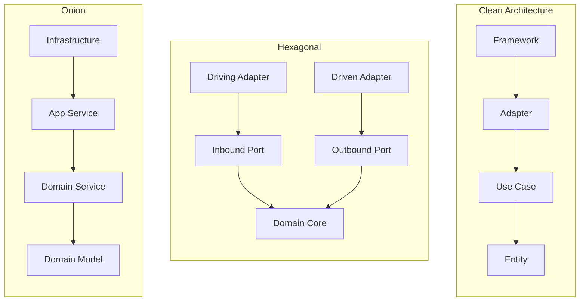
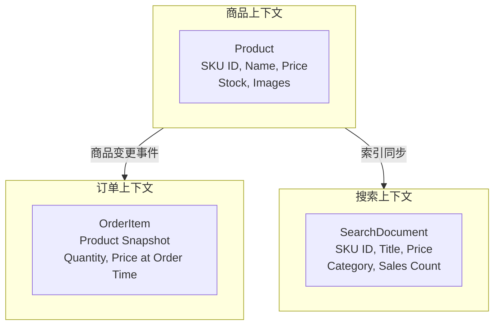
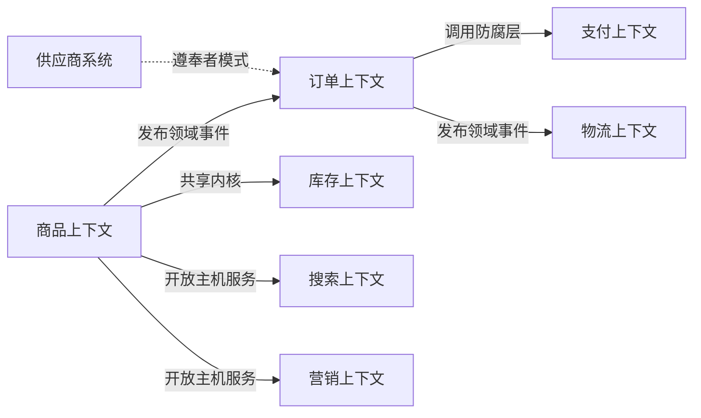
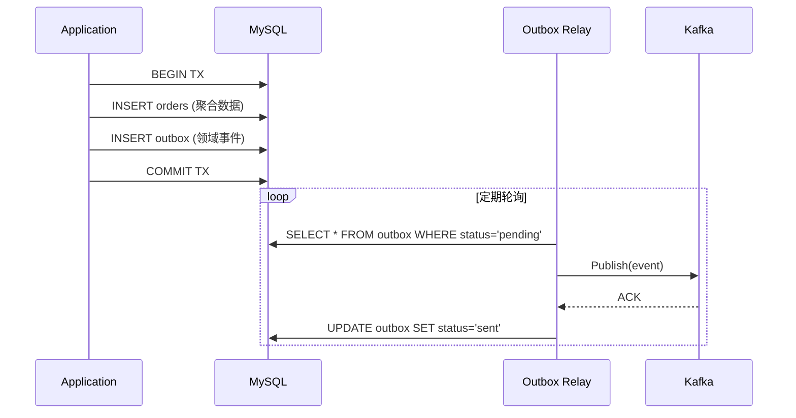
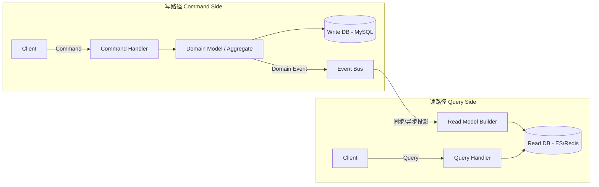
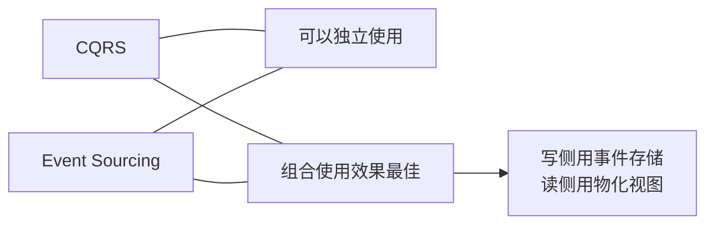
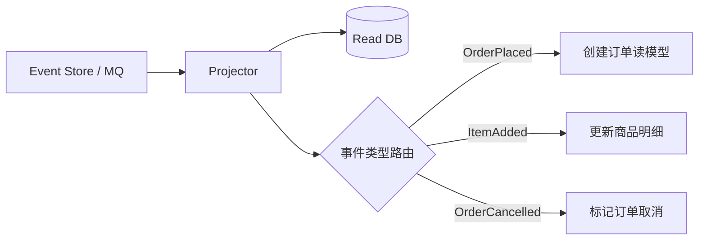

**导航**：[书籍主页](../README.md) | [完整目录](../SUMMARY.md) | [上一章：第2章](./chapter2.md) | [下一章：第4章](./chapter4.md)

---

# 第3章 系统内部结构设计

> 三层架构、Clean Architecture、DDD 战术与 CQRS 的协同落地

---

## 3.1 为什么要单独讨论系统内部结构

如果说第 2 章解决的是「**系统应该被划分成哪些业务边界**」，那么这一章要回答的是另一个同样关键的问题：**在边界已经划定之后，单个系统内部到底应该怎么组织？**

很多团队在架构演进时，会把两个层面混在一起讨论：

- 一边在谈限界上下文怎么划
- 一边又在争论 Handler 能不能直接调 Repository
- 同时还在讨论聚合根、值对象、读写分离和查询性能

这样做的问题是，边界问题、依赖问题、建模问题和数据流问题被混成一团，最后往往谁都没有真正讲清楚。

对架构师来说，系统内部结构设计至少要同时回答四个问题：

1. 代码先按什么方式分层，团队才容易协作？
2. 依赖应该按什么方向流动，外部技术才不会污染核心业务？
3. 复杂业务规则应该由什么模型承载，而不是散落在 Service 里？
4. 当读和写的目标已经出现冲突时，数据流又该如何拆开？

这也正对应了本章的四个关键抓手：

- **三层架构**：先建立最基本的职责秩序
- **Clean Architecture**：再约束依赖方向
- **DDD 战术设计**：让复杂规则回到模型内部
- **CQRS**：当读写目标冲突时，再拆分读写路径

从这个角度看，这四者并不是彼此替代，而是逐层叠加。

### 3.1.1 从业务边界到系统内部结构

第 2 章讲的战略设计，解决的是「地图」问题：哪些能力属于订单，哪些属于库存，哪些属于营销，团队之间怎样通过上下文地图协作。

而本章解决的是「房间内部装修」问题：当我们已经确定了这里是订单上下文、那里是库存上下文之后，订单系统内部又该如何分层、如何建模、如何组织读写路径。

如果没有第 2 章的边界，系统内部结构设计会失去落点；  
如果只有边界、没有内部结构，系统很快又会退化成新的大泥球。

因此，这一章在全书里承担的是承上启下的角色：

- **承接第 2 章**：边界已经划清
- **通向第 4 章**：单个系统内部有了秩序之后，才有条件进一步讨论系统之间如何协作

### 3.1.2 架构师在这一层真正关注什么

在系统内部结构设计这一层，架构师最需要关注的，通常不是“某个类放在哪个目录”，而是以下几类长期成本：

- **变更成本**：一个新需求会不会牵一发而动全身？
- **理解成本**：新人能不能在有限时间内看懂业务主线？
- **测试成本**：核心逻辑能否脱离数据库和消息中间件被验证？
- **扩展成本**：当新促销规则、新支付方式、新查询场景出现时，系统能否局部演进？

这也是为什么系统内部结构设计，不能只靠“项目目录看起来很整齐”来判断。真正重要的是：**职责有没有分清、依赖有没有收束、规则有没有回到模型内部、读写目标有没有被正确拆分。**

---

## 3.2 标准三层架构：多数项目的默认起点


### 3.2.1 为什么三层架构会成为默认起点

在系统设计的早期阶段，最重要的往往不是“架构是否优雅”，而是“职责是否基本清楚”。对于一个刚开始建设的 `order-service` 来说，下单、查询订单、支付后更新状态、超时关单，这些需求虽然已经涉及接口、业务逻辑和数据存储，但复杂度通常还不足以支撑更重的架构方法论。此时，**标准三层架构**往往是一个合适的起点。

它之所以在很多项目里成为默认选择，不是因为它“最先进”，而是因为它在低复杂度阶段最务实。对多数团队而言，先让代码按职责分区、让调用链基本清晰，往往比一开始就引入大量抽象更重要。

### 3.2.2 三层架构的核心分工

三层架构的核心思想很简单：**把系统按职责拆成表现层、业务逻辑层和数据访问层**。如果用更统一的工程命名来表达，这三类职责通常会分别落在 `interfaces`、`application` 和 `infrastructure` 中。这样做的目的不是追求抽象，而是让不同类型的代码各归其位：

- **表现层（Interfaces）**：接收 HTTP、RPC 或消息请求，完成参数解析和响应组装
- **业务逻辑层（Application）**：承载核心业务流程，例如创建订单、计算总价、更新状态
- **数据访问层（Infrastructure 中的 persistence）**：负责和数据库交互，执行查询、插入和更新操作

这里要特别注意，三层架构首先强调的是**职责分层**，而不是**接口隔离**。在这个阶段，层与层之间通常可以直接调用，不需要一开始就为每一层都设计 Port、Adapter 和复杂的依赖注入。

### 3.2.3 Go 项目中的典型目录映射

对于一个订单服务，这种分层通常可以组织成如下结构：

```text
order-service/
├── cmd/
│   ├── order-server/               # 同步服务入口：HTTP / RPC
│   │   └── main.go
│   ├── order-job/                  # 定时任务入口
│   │   └── main.go
│   └── order-consumer/             # 消息消费入口
│       └── main.go
├── internal/
│   ├── interfaces/                 # 表现层：接收外部请求
│   │   ├── http/
│   │   │   └── order.go
│   │   ├── rpc/
│   │   │   └── order.go
│   │   ├── job/
│   │   │   ├── close_timeout_order.go
│   │   │   └── retry_publish.go
│   │   └── event/
│   │       ├── payment_paid.go
│   │       ├── stock_reserved.go
│   │       └── stock_failed.go
│   ├── application/                # 业务逻辑层：创单、支付、取消、关单
│   │   ├── service/
│   │   │   ├── order.go
│   │   │   ├── job.go
│   │   │   ├── consumer.go
│   │   │   └── event.go
│   │   └── dto/
│   │       ├── request.go
│   │       └── response.go
│   ├── model/                      # 早期共享模型，承载数据结构
│   │   ├── order.go
│   │   ├── request.go
│   │   └── event.go
│   ├── infrastructure/             # 基础设施：MySQL、日志、事件总线
│   │   ├── persistence/
│   │   │   ├── order.go
│   │   │   └── transaction.go
│   │   ├── event/
│   │   │   └── event_bus.go
│   │   ├── logger/
│   │   │   └── logger.go
│   │   └── mysql/
│   │       └── mysql_db.go
│   └── bootstrap/
│       └── app.go                  # 程序启动与依赖组装
└── go.mod
```

这里虽然目录名已经统一成了 `interfaces / application / infrastructure` 这套风格，但它的本质仍然是三层架构。`interfaces` 对应表现层，`application` 对应业务逻辑层，`infrastructure/persistence` 对应数据访问层。额外出现的 `model` 只是为了集中承载共享数据结构，例如 `Order`、`CreateOrderRequest`，它还不是后续 DDD 阶段那种真正承担业务规则的 `domain`。

### 3.2.4 一个订单服务的调用链

以“创建订单”接口为例，这条调用链通常是这样的：

```text
HTTP / RPC 请求
    -> interfaces.CreateOrder
    -> application.CreateOrder
    -> infrastructure.persistence.Save
    -> MySQL
```

在这条链路中，每一层都只做自己该做的事情。

**表现层（Interfaces）**负责与外部世界打交道。它知道请求从哪里来，也知道响应该怎么返回，但它不应该承担核心业务判断。一个典型的创单 Handler 通常会做下面几件事：

- 接收 HTTP 或 RPC 请求
- 解析 `customer_id`、商品列表等参数
- 做最基础的参数合法性校验
- 调用 `OrderService.CreateOrder`
- 把结果组装成 API 响应返回

也就是说，表现层回答的是“**外部如何调用系统**”，而不是“**系统内部如何完成下单**”。

**业务逻辑层（Application）**是三层架构的中心。它负责把“创建订单”这个业务动作真正组织起来，例如校验商品列表是否为空、计算订单总价、生成订单号、设置订单初始状态、调用 Repository 持久化订单，以及在需要时发布订单创建事件。

示例代码可以写成这样：

```go
// application/service/order.go — 标准三层架构中的业务逻辑层
type OrderService struct {
    repo *persistence.OrderRepository  // 直接依赖具体实现
    db   *sql.DB
}

func (s *OrderService) CreateOrder(ctx context.Context, req CreateOrderReq) (*Order, error) {
    order := &Order{
        CustomerID: req.CustomerID,
        Items:      req.Items,
    }
    order.Total = s.calculateTotal(order.Items)
    return s.repo.Save(ctx, order)
}
```

这段代码很好地体现了三层架构在早期的特点：**简单、直接、上手快**。`Application Service` 直接依赖持久化实现，不需要先设计接口、适配器、领域对象等抽象。对于一个业务规则还不复杂的系统来说，这种直接性反而能提高开发效率。

**数据访问层（Infrastructure/Persistence）**的职责是把业务层提出的“保存订单”“查询订单”这些需求，翻译成具体的数据库操作。例如，`OrderRepository` 里可能包含下面这些方法：

- `Save(order)`：插入或更新订单
- `FindByID(orderID)`：根据订单 ID 查询订单
- `ListPendingPaymentBefore(t)`：查询超时未支付订单

它的价值在于：**把 SQL、表结构、连接池、事务细节集中到一个位置**。这样，业务层不需要到处散落 SQL 语句，表现层也不必知道数据库长什么样。

### 3.2.5 为什么这种结构在项目初期很好用

在标准三层架构中，层与层之间通常**不需要**一开始就为每一层专门定义接口和适配器。更常见的做法是：

- `interfaces` 直接调用 `application`
- `application` 直接调用 `infrastructure/persistence`
- 各层之间通过普通的函数签名和结构体协作

也就是说，三层架构首先解决的是“代码应该放在哪一层”，而不是“核心业务到底应该依赖谁”。这也是它和后续 Clean Architecture 的关键区别。

这种结构在项目初期很好用，通常有三个原因。

第一，它**容易理解**。即使团队成员没有 DDD 或 Clean Architecture 背景，也能快速知道一个需求应该落在哪一层。

第二，它**开发成本低**。不需要在一开始就设计大量接口和抽象，代码路径短，调试方便，适合快速迭代。

第三，它**足够支撑早期业务**。对于订单创建、订单查询、支付回调、超时关单这类相对直接的业务流程，三层架构通常已经可以胜任。

换句话说，三层架构不是“过时的做法”，而是**在业务复杂度还低时，一种成本最低的秩序化手段**。

### 3.2.6 三层架构的边界与典型问题

三层架构的问题，通常不是一开始就出现，而是在业务逐渐变复杂时慢慢显现。最常见的几个信号是：

- `Application` 层越来越大，开始同时处理业务规则、事务、SQL 细节和外部依赖
- `Infrastructure/Persistence` 和数据库实现耦合过深，换存储成本高
- `Model` 逐渐退化成纯数据结构，真正的业务规则散落在多个 Application Service 方法里
- 单元测试越来越困难，因为业务逻辑强依赖数据库和基础设施
- 同一个“订单”概念，在不同模块里开始出现不一致的含义

例如，当你想把 MySQL 更换为 PostgreSQL 时，可能会发现 `Application` 层虽然没有直接操作数据库连接，但它已经对持久化实现、事务组织方式，甚至某些 MySQL 特有能力形成了隐式依赖。此时，问题就不再只是“换个数据库驱动”这么简单，而是说明：**业务逻辑与基础设施实现已经纠缠在一起了**。

这正是三层架构的边界所在。它非常适合作为系统的起点，但当复杂度继续增长时，仅靠“Interfaces / Application / Persistence”这条主线，已经不足以持续控制系统复杂性。接下来，就需要进一步引入更明确的依赖边界、更强的业务模型表达，以及更清晰的读写分离策略。这也是后续要引入 Clean Architecture、DDD 和 CQRS 的原因。

---

## 3.3 Clean Architecture（整洁架构）


### 3.3.1 核心思想：依赖规则

Clean Architecture 由 Robert C. Martin（Uncle Bob）在 2012 年提出，其核心思想非常简单：

> **业务逻辑应该独立于 UI、数据库、框架或任何外部代理。**

这句话的含义是：当你决定从 MySQL 换到 PostgreSQL，或者把 Web 框架从 Gin 换到 Echo 时，核心的业务逻辑（Use Cases 和 Entities）**不需要改动一行代码**。

**依赖规则**：源代码的依赖方向**只能向内**。外层（如数据库、Web 框架）可以依赖内层，但**内层绝不能知道外层的存在**。

```text
┌──────────────────────────────────────────────────────────────┐
│  Frameworks & Drivers  (Web, DB, External APIs)              │
│  ┌──────────────────────────────────────────────────────┐    │
│  │  Interface Adapters  (Controllers, Gateways, Repos)  │    │
│  │  ┌──────────────────────────────────────────────┐    │    │
│  │  │  Application Business Rules  (Use Cases)     │    │    │
│  │  │  ┌──────────────────────────────────────┐    │    │    │
│  │  │  │  Enterprise Business Rules (Entities) │    │    │    │
│  │  │  └──────────────────────────────────────┘    │    │    │
│  │  └──────────────────────────────────────────────┘    │    │
│  └──────────────────────────────────────────────────────┘    │
└──────────────────────────────────────────────────────────────┘

                   依赖方向 ──────→ 向内
```

### 3.3.2 四层模型

Clean Architecture 将系统划分为四层，每层有清晰的职责：

| 层级 | 职责 | 示例 |
|------|------|------|
| **Entity（实体）** | 最核心的业务规则，与应用无关 | `Order`, `Product` 的领域模型 |
| **Use Cases（用例）** | 特定于应用的业务逻辑 | "处理订单"、"计算运费" |
| **Interface Adapters（接口适配器）** | 数据格式转换，连接内外层 | Controller, Presenter, Repository 接口实现 |
| **Frameworks & Drivers（框架和驱动）** | 具体技术实现 | MySQL, Redis, Gin, gRPC |

**关键理解**：
- **Entity 层**是纯业务逻辑，不知道 HTTP、数据库、消息队列的存在
- **Use Case 层**编排业务流程，依赖 Entity 层的接口，不依赖具体实现
- **Adapter 层**连接内外，实现 Entity/Use Case 层定义的接口
- **Framework 层**是具体的技术选型，可以随时替换

### 3.3.3 Go 项目中的典型目录映射

在 Go 项目中，Clean Architecture 通常可以映射成和前面三层架构相近、但依赖方向更清晰的目录结构。例如，一个 `order-service` 可以演进成这样：

```text
order-service/
├── cmd/
│   ├── order-server/
│   │   └── main.go                     # HTTP / RPC 服务入口
│   ├── order-job/
│   │   └── main.go                     # 定时任务入口
│   └── order-consumer/
│       └── main.go                     # 消息消费入口
├── internal/
│   ├── interfaces/                     # 接口层：所有进入系统的请求入口
│   │   ├── http/
│   │   │   ├── order.go
│   │   │   └── health.go
│   │   ├── rpc/
│   │   │   └── order.go
│   │   ├── event/
│   │   │   ├── payment_paid.go
│   │   │   ├── stock_reserved.go
│   │   │   └── stock_failed.go
│   │   └── job/
│   │       ├── close_timeout_order.go
│   │       └── retry_publish.go
│   ├── application/                    # 应用层：编排业务用例
│   │   ├── service/
│   │   │   ├── create_order.go
│   │   │   ├── cancel_order.go
│   │   │   ├── mark_order_paid.go
│   │   │   └── close_timeout_order.go
│   │   ├── dto/
│   │   │   ├── request.go
│   │   │   ├── response.go
│   │   │   └── event.go
│   │   └── transaction.go             # 应用层依赖的事务抽象（可选）
│   ├── domain/                         # 最内层：业务概念与规则
│   │   ├── order.go                    # Order 实体 / 核心业务规则
│   │   ├── order_item.go               # OrderItem 实体 / 值对象
│   │   ├── repository.go               # Repository Port
│   │   ├── event_publisher.go          # EventPublisher Port
│   │   ├── event.go                    # 领域事件定义
│   │   └── errors.go                   # 领域错误
│   ├── infrastructure/                 # 基础设施层：技术实现
│   │   ├── persistence/
│   │   │   ├── order_repo.go           # Repository Port 的 MySQL 实现
│   │   │   ├── order_po.go             # 持久化对象 / 表映射
│   │   │   └── transaction.go          # 事务实现
│   │   ├── event/
│   │   │   └── publisher.go            # EventPublisher Port 的实现
│   │   ├── cache/
│   │   │   └── order_cache.go
│   │   ├── mysql/
│   │   │   └── db.go
│   │   ├── mq/
│   │   │   └── producer.go
│   │   ├── logger/
│   │   │   └── logger.go
│   │   └── config/
│   │       └── config.go
│   └── bootstrap/
│       ├── app.go                      # 依赖注入
│       ├── router.go                   # HTTP / RPC 路由注册
│       └── wiring.go                   # application / interfaces / infrastructure 组装
├── api/
│   ├── http/
│   │   └── order.md
│   └── proto/
│       └── order.proto
└── go.mod
```

**关键设计原则**：

1. **依赖方向向内**：`interfaces` 依赖 `application`，`application` 依赖 `domain`，`infrastructure` 负责从外层实现内层需要的能力
2. **接口在内层定义**：例如 `internal/domain/repository.go` 定义 Port，`internal/infrastructure/persistence/order_repo.go` 提供实现
3. **框架在外层**：Gin、MySQL、Kafka、Redis 等技术细节都停留在 `interfaces` 或 `infrastructure`，不会侵入核心业务

### 3.3.4 三层架构与 Clean Architecture 的区别

这一点非常容易被误解。很多团队以为自己已经做了三层分层，就等于已经做了 Clean Architecture。其实两者并不等价：

- 三层架构关注的是**分层职责**：表现层、业务层、数据访问层分别负责什么
- Clean Architecture 关注的是**依赖方向**：核心业务是否只依赖抽象，而不是依赖具体实现

所以，三层架构回答的是“代码应该放在哪一层”，而 Clean Architecture 回答的是“核心业务应该依赖谁”。

这也是为什么一个项目可以“已经分层”，但仍然没有真正获得可替换性和可测试性。只要 `application/service` 仍然依赖某个具体的 MySQL repository、具体的消息发布器、具体的框架对象，业务逻辑就还没有真正从基础设施中解耦出来。

### 3.3.5 改造要点：引入 Port，把实现推到外层

阶段 1 的关键动作通常有两个：

- 在内层定义接口，例如 `OrderRepository`
- 让外层提供具体实现，例如 `MySQLOrderRepository`

代码通常会变成这样：

```go
// domain/repository.go — 内层定义接口
package domain

type OrderRepository interface {
    Save(ctx context.Context, order *Order) error
}

// application/service/create_order.go — 应用层依赖接口而非实现
type CreateOrderService struct {
    repo domain.OrderRepository
}

func (svc *CreateOrderService) Execute(ctx context.Context, req CreateOrderRequest) error {
    order := domain.NewOrder(req.CustomerID)
    // ... 应用逻辑 ...
    return svc.repo.Save(ctx, order)
}
```

在这段代码里，`CreateOrderService` 并不知道底层是不是 MySQL，也不知道外面是不是 HTTP Handler 调用它。它只关心“创建订单”这件业务本身。这种内层稳定、外层可替换的结构，就是 Clean Architecture 的核心价值。

### 3.3.6 以一个订单服务的调用链为例

如果把 Clean Architecture 放到一个具体的 `order-service` 中，它的调用链通常会比三层架构多出一层清晰的“依赖反转”：

```text
HTTP 请求
    -> adapter/inbound/http.OrderHandler
    -> usecase.PlaceOrderUseCase
    -> domain.Order / domain.Repository
    -> adapter/outbound/persistence.MySQLOrderRepo
    -> MySQL
```

这条链路的关键，不只是“多了几层目录”，而是每一层的依赖关系开始变得可控：

- **HTTP Handler** 只负责接收请求、解析参数、返回响应
- **Use Case** 只负责组织业务流程，不直接操作数据库
- **Domain** 负责承载核心业务规则和抽象接口
- **Outbound Adapter** 负责把领域层定义的接口落到 MySQL、Redis 或 MQ 上

从外面看，它和三层架构一样，仍然是在处理“下单请求”；但从里面看，业务逻辑和基础设施已经不再直接耦合。也正因为如此，后面不管你是替换存储、补单元测试，还是进一步引入 DDD，都有了更清晰的落脚点。

### 3.3.7 核心价值：技术无关的业务逻辑

让我们通过一个具体的代码示例来理解 Clean Architecture 的价值。

#### 反例：依赖具体实现

```go
// ❌ 反例：OrderService 直接依赖具体的 MySQL 实现
package service

import (
    "database/sql"
    _ "github.com/go-sql-driver/mysql"
)

type OrderService struct {
    db *sql.DB  // 直接依赖 MySQL
}

func (s *OrderService) CreateOrder(ctx context.Context, req CreateOrderReq) (*Order, error) {
    // 业务逻辑和数据库操作混在一起
    tx, err := s.db.BeginTx(ctx, nil)
    if err != nil {
        return nil, err
    }
    defer tx.Rollback()
    
    order := &Order{
        CustomerID: req.CustomerID,
        Items:      req.Items,
        Total:      calculateTotal(req.Items),
    }
    
    // SQL 语句直接写在业务逻辑中
    _, err = tx.ExecContext(ctx, 
        "INSERT INTO orders (customer_id, total, status) VALUES (?, ?, ?)",
        order.CustomerID, order.Total, "pending")
    if err != nil {
        return nil, err
    }
    
    return order, tx.Commit()
}
```

**问题**：
1. 业务逻辑和数据库操作混在一起，难以测试
2. 换数据库（如 PostgreSQL）需要改动业务逻辑代码
3. 无法编写不依赖数据库的单元测试
4. `OrderService` 直接依赖 `database/sql` 和 MySQL 驱动

#### 正例：依赖抽象

```go
// ✅ 正例：Clean Architecture 方式

// domain/order/repository.go — 内层只定义接口
package order

type Repository interface {
    Save(ctx context.Context, order *Order) error
    FindByID(ctx context.Context, id string) (*Order, error)
}

// domain/order/order.go — 领域模型
package order

type Order struct {
    id         string
    customerID string
    items      []OrderItem
    status     Status
    totalPrice Money
}

func NewOrder(customerID string) *Order {
    return &Order{
        id:         generateID(),
        customerID: customerID,
        items:      make([]OrderItem, 0),
        status:     StatusDraft,
    }
}

func (o *Order) AddItem(product Product, qty int) error {
    if o.status != StatusDraft {
        return ErrOrderNotEditable
    }
    if qty <= 0 {
        return ErrInvalidQuantity
    }
    item := NewOrderItem(product, qty)
    o.items = append(o.items, item)
    o.recalculateTotal()
    return nil
}

func (o *Order) Place() error {
    if len(o.items) == 0 {
        return ErrEmptyOrder
    }
    o.status = StatusPlaced
    return nil
}
```

```go
// usecase/place_order.go — Use Case 依赖接口而非实现
package usecase

import "myapp/domain/order"

type PlaceOrderUseCase struct {
    orderRepo order.Repository  // 依赖抽象接口
}

func (uc *PlaceOrderUseCase) Execute(ctx context.Context, req PlaceOrderRequest) (*PlaceOrderResponse, error) {
    // 创建订单聚合
    o := order.NewOrder(req.CustomerID)
    
    // 添加商品
    for _, item := range req.Items {
        product := order.Product{ID: item.ProductID, Price: item.Price}
        if err := o.AddItem(product, item.Quantity); err != nil {
            return nil, err
        }
    }
    
    // 下单
    if err := o.Place(); err != nil {
        return nil, err
    }
    
    // 持久化（通过接口）
    if err := uc.orderRepo.Save(ctx, o); err != nil {
        return nil, err
    }
    
    return &PlaceOrderResponse{OrderID: o.ID()}, nil
}
```

```go
// adapter/persistence/mysql_order_repo.go — 外层实现接口
package persistence

import (
    "database/sql"
    "myapp/domain/order"
)

type MySQLOrderRepo struct {
    db *sql.DB
}

func NewMySQLOrderRepo(db *sql.DB) order.Repository {
    return &MySQLOrderRepo{db: db}
}

func (r *MySQLOrderRepo) Save(ctx context.Context, o *order.Order) error {
    _, err := r.db.ExecContext(ctx,
        "INSERT INTO orders (id, customer_id, total, status) VALUES (?, ?, ?, ?)",
        o.ID(), o.CustomerID(), o.Total().Amount, o.Status().String())
    return err
}

func (r *MySQLOrderRepo) FindByID(ctx context.Context, id string) (*order.Order, error) {
    // 实现查询逻辑
    // ...
    return nil, nil
}
```

```go
// adapter/persistence/mongo_order_repo.go — 换存储只需新增实现
package persistence

import (
    "go.mongodb.org/mongo-driver/mongo"
    "myapp/domain/order"
)

type MongoOrderRepo struct {
    collection *mongo.Collection
}

func NewMongoOrderRepo(col *mongo.Collection) order.Repository {
    return &MongoOrderRepo{collection: col}
}

func (r *MongoOrderRepo) Save(ctx context.Context, o *order.Order) error {
    _, err := r.collection.InsertOne(ctx, bson.M{
        "_id":         o.ID(),
        "customer_id": o.CustomerID(),
        "total":       o.Total().Amount,
        "status":      o.Status().String(),
    })
    return err
}
```

**对比收益**：

| 维度 | 反例（依赖具体实现） | 正例（依赖抽象） |
|------|-------------------|----------------|
| **测试** | 必须启动 MySQL 才能测试 | 用 Mock 实现接口即可测试 |
| **换存储** | 改动业务逻辑代码 | 只需新增一个 Adapter |
| **理解成本** | 业务逻辑和技术细节混在一起 | 业务逻辑清晰独立 |
| **并行开发** | 数据库schema确定后才能开发 | 定义好接口就可以并行开发 |

### 3.3.8 依赖注入的 Go 实现

在 Clean Architecture 中，**组装**（将接口与实现绑定）发生在最外层——通常是 `main.go` 或 `cmd/server/main.go`。

#### 方式一：手动注入（推荐，适合中小项目）

```go
// cmd/server/main.go
package main

import (
    "database/sql"
    "log"
    "myapp/adapter/inbound/http"
    "myapp/adapter/outbound/persistence"
    "myapp/infra/mysql"
    "myapp/usecase"
    
    _ "github.com/go-sql-driver/mysql"
    "github.com/gin-gonic/gin"
)

func main() {
    // 1. Infrastructure 层：初始化基础设施
    db, err := sql.Open("mysql", "user:pass@tcp(localhost:3306)/mydb")
    if err != nil {
        log.Fatal(err)
    }
    defer db.Close()

    // 2. Adapter 层：创建实现（实现 domain 接口）
    orderRepo := persistence.NewMySQLOrderRepo(db)
    productRepo := persistence.NewMySQLProductRepo(db)

    // 3. Use Case 层：注入依赖
    placeOrderUC := usecase.NewPlaceOrderUseCase(orderRepo, productRepo)
    cancelOrderUC := usecase.NewCancelOrderUseCase(orderRepo)

    // 4. Adapter 层（Inbound）：创建 HTTP Handler
    orderHandler := http.NewOrderHandler(placeOrderUC, cancelOrderUC)

    // 5. Framework 层：启动 Web 服务器
    router := gin.Default()
    orderHandler.RegisterRoutes(router)
    router.Run(":8080")
}
```

**优点**：
- 零依赖，不需要引入任何 DI 框架
- 编译时检查，类型安全
- 调试直观，依赖关系一目了然

**缺点**：
- 当依赖超过 20 个时，`main.go` 变得冗长
- 手动管理依赖顺序，容易出错

#### 方式二：Wire（适合大型项目）

Google 的 [Wire](https://github.com/google/wire) 通过代码生成实现依赖注入：

```go
// cmd/server/wire.go
//go:build wireinject

package main

import (
    "myapp/adapter/inbound/http"
    "myapp/adapter/outbound/persistence"
    "myapp/infra/mysql"
    "myapp/usecase"
    
    "github.com/google/wire"
)

func InitializeOrderHandler() (*http.OrderHandler, error) {
    wire.Build(
        // Infrastructure
        mysql.NewConnection,
        
        // Adapters (Outbound)
        persistence.NewMySQLOrderRepo,
        persistence.NewMySQLProductRepo,
        
        // Use Cases
        usecase.NewPlaceOrderUseCase,
        usecase.NewCancelOrderUseCase,
        
        // Adapters (Inbound)
        http.NewOrderHandler,
    )
    return nil, nil
}
```

运行 `wire ./cmd/server` 后，Wire 会自动生成 `wire_gen.go`：

```go
// Code generated by Wire. DO NOT EDIT.

func InitializeOrderHandler() (*http.OrderHandler, error) {
    db, err := mysql.NewConnection()
    if err != nil {
        return nil, err
    }
    orderRepo := persistence.NewMySQLOrderRepo(db)
    productRepo := persistence.NewMySQLProductRepo(db)
    placeOrderUC := usecase.NewPlaceOrderUseCase(orderRepo, productRepo)
    cancelOrderUC := usecase.NewCancelOrderUseCase(orderRepo)
    handler := http.NewOrderHandler(placeOrderUC, cancelOrderUC)
    return handler, nil
}
```

**优点**：
- 自动处理依赖顺序
- 编译时检查，类型安全
- 适合大型项目（100+ 依赖）

**缺点**：
- 需要学习 Wire 的 API
- 代码生成可能影响调试体验

#### 方式三：Uber Fx（运行时注入）

```go
// cmd/server/main.go
package main

import (
    "go.uber.org/fx"
    "myapp/adapter/inbound/http"
    "myapp/adapter/outbound/persistence"
    "myapp/infra/mysql"
    "myapp/usecase"
)

func main() {
    fx.New(
        // Infrastructure
        fx.Provide(mysql.NewConnection),
        
        // Adapters
        fx.Provide(persistence.NewMySQLOrderRepo),
        fx.Provide(persistence.NewMySQLProductRepo),
        
        // Use Cases
        fx.Provide(usecase.NewPlaceOrderUseCase),
        fx.Provide(usecase.NewCancelOrderUseCase),
        
        // HTTP Handler
        fx.Provide(http.NewOrderHandler),
        
        // Start server
        fx.Invoke(func(h *http.OrderHandler) {
            router := gin.Default()
            h.RegisterRoutes(router)
            router.Run(":8080")
        }),
    ).Run()
}
```

**优点**：
- 支持生命周期管理（启动/关闭钩子）
- 支持依赖图可视化
- 适合微服务框架

**缺点**：
- 运行时注入，类型错误要到运行时才能发现
- 学习曲线较陡

**推荐选择**：
- **小型项目（<50 个依赖）**：手动注入
- **中型项目（50-200 个依赖）**：Wire
- **大型项目（200+ 个依赖，微服务）**：Fx

### 3.3.9 为什么这一步通常早于 DDD

很多读者会问：既然后面还要引入 DDD，为什么不一步到位？原因是 Clean Architecture 先解决的是一个更基础的问题：**先把业务逻辑和技术实现拆开**。

在这一步之前，系统最大的问题往往不是“领域模型不够优雅”，而是“业务代码和基础设施绑得太紧”。如果这个问题不先处理，后面即使想引入聚合根、值对象、领域事件，也很容易被外层技术细节拖住，导致模型表达和工程实现互相污染。

所以，从演进顺序上看，先引入 Clean Architecture，往往比直接上 DDD 更稳妥。它为后续的领域建模先清出了一块相对干净的内层空间。

### 3.3.10 收益：可替换、可测试、可演进

引入 Clean Architecture 之后，最直接的收益通常有三个。

第一，**更容易替换基础设施**。MySQL、PostgreSQL、Redis、消息中间件都变成外层实现细节，而不是业务层的一部分。

第二，**更容易做单元测试**。`CreateOrderService` 可以直接注入 Mock Repository 进行测试，不需要启动数据库。

第三，**为后续演进留出空间**。当业务复杂度进一步上升时，你可以在内层继续引入更强的领域模型表达，而不必同时和框架、数据库实现纠缠。

当然，代价也很明显：目录更多、抽象更多、依赖注入也更复杂。对于业务非常简单的项目，这一步可能会显得“有点重”。但一旦系统已经出现“换数据库很痛”“单元测试写不动”“业务层越来越黏住基础设施”这些信号，引入 Clean Architecture 往往是值得的。

### 3.3.11 架构风格对比：Clean vs 六边形 vs 洋葱

在学习 Clean Architecture 时，你可能还会遇到另外两个相似的概念：**六边形架构（Hexagonal Architecture）** 和 **洋葱架构（Onion Architecture）**。它们经常被混用，但实际上有细微差别：

| 维度 | Clean Architecture | 六边形架构 (Hexagonal) | 洋葱架构 (Onion) |
|------|-------------------|----------------------|-----------------|
| **提出者** | Robert C. Martin (2012) | Alistair Cockburn (2005) | Jeffrey Palermo (2008) |
| **核心隐喻** | 同心圆，层层向内 | 六边形，端口与适配器 | 洋葱，层层剥开 |
| **关键概念** | Entity, Use Case, Adapter | Port（接口）, Adapter（实现） | Domain Model, Domain Service, App Service |
| **外部交互方式** | 通过 Interface Adapter 层 | 通过 Port + Adapter 对 | 通过 Infrastructure 层 |
| **核心共识** | 依赖方向向内，业务逻辑不依赖外部技术 | 同左 | 同左 |



**实际差异很小**，三者在 Go 项目中的落地几乎一样——关键是守住一条线：**内层定义接口，外层实现接口**。

#### Port & Adapter 模式的 Go 实现

六边形架构中，**Port（端口）**是接口，**Adapter（适配器）**是实现。在 Go 中天然契合：

```go
// domain/port.go — Outbound Port（领域层定义接口）
package domain

type PaymentGateway interface {
    Charge(ctx context.Context, orderID string, amount Money) (*PaymentResult, error)
}

// adapter/payment/stripe_adapter.go — Driven Adapter（基础设施层实现接口）
package payment

import (
    "myapp/domain"
    "github.com/stripe/stripe-go/v72"
)

type StripeAdapter struct {
    client *stripe.Client
}

func NewStripeAdapter(apiKey string) domain.PaymentGateway {
    return &StripeAdapter{
        client: stripe.NewClient(apiKey),
    }
}

func (a *StripeAdapter) Charge(ctx context.Context, orderID string, amount domain.Money) (*domain.PaymentResult, error) {
    params := &stripe.ChargeParams{
        Amount:   stripe.Int64(amount.Amount),
        Currency: stripe.String(amount.Currency),
    }
    resp, err := a.client.Charges.New(params)
    if err != nil {
        return nil, fmt.Errorf("stripe charge failed: %w", err)
    }
    return &domain.PaymentResult{
        TransactionID: resp.ID, 
        Status:        "success",
    }, nil
}
```

```go
// adapter/payment/mock_adapter.go — 测试时可替换为 Mock
package payment

type MockPaymentAdapter struct {
    ShouldFail bool
}

func NewMockPaymentAdapter() domain.PaymentGateway {
    return &MockPaymentAdapter{ShouldFail: false}
}

func (a *MockPaymentAdapter) Charge(ctx context.Context, orderID string, amount domain.Money) (*domain.PaymentResult, error) {
    if a.ShouldFail {
        return nil, errors.New("mock payment failure")
    }
    return &domain.PaymentResult{
        TransactionID: "mock-txn-001", 
        Status:        "success",
    }, nil
}
```

**关键理解**：
- **Port**（接口）在领域层定义，表达"我需要什么能力"
- **Adapter**（实现）在基础设施层提供，表达"我如何提供这个能力"
- 测试时，可以用 Mock Adapter 替换真实的 Stripe Adapter
- 换支付渠道（如从 Stripe 换到支付宝），只需新增一个 Adapter

### 3.3.12 反模式：常见违规案例

在实际项目中，Clean Architecture 的违规往往不是故意的，而是在时间压力下"顺手"写下的。以下是三个最常见的反模式：

#### Anti-pattern 1：跨层调用

```go
// ❌ 反例：Handler 直接引用了 MySQL 包（跳过了 domain 和 usecase 层）
package handler

import (
    "database/sql"
    "net/http"
)

func GetOrder(db *sql.DB) http.HandlerFunc {
    return func(w http.ResponseWriter, r *http.Request) {
        row := db.QueryRow("SELECT * FROM orders WHERE id = ?", r.URL.Query().Get("id"))
        // 直接在 handler 里写 SQL...
    }
}
```

**问题**：
- Handler 直接依赖数据库，无法测试
- 业务逻辑散落在各个 Handler 中，无法复用
- 换数据库需要改动所有 Handler

```go
// ✅ 正例：Handler 只依赖 Use Case 接口
package handler

type OrderQuerier interface {
    GetOrderDetail(ctx context.Context, id string) (*OrderDetailDTO, error)
}

type OrderHandler struct {
    querier OrderQuerier
}

func NewOrderHandler(q OrderQuerier) *OrderHandler {
    return &OrderHandler{querier: q}
}

func (h *OrderHandler) GetOrder(w http.ResponseWriter, r *http.Request) {
    dto, err := h.querier.GetOrderDetail(r.Context(), r.URL.Query().Get("id"))
    if err != nil {
        http.Error(w, err.Error(), http.StatusInternalServerError)
        return
    }
    json.NewEncoder(w).Encode(dto)
}
```

#### Anti-pattern 2：基础设施泄漏到领域层

```go
// ❌ 反例：领域实体中使用了 sql.NullString（基础设施类型侵入领域）
package domain

import "database/sql"

type Order struct {
    ID       string
    Remark   sql.NullString  // ← 领域层不应该知道 SQL 的存在
    Status   int             // ← 用魔数表示状态
}
```

**问题**：
- `sql.NullString` 是 `database/sql` 包的类型，领域层不应该依赖基础设施包
- 领域模型变得"贫血"，只是数据容器，没有行为

```go
// ✅ 正例：领域层使用纯 Go 类型，转换在 adapter 层完成
package domain

type Order struct {
    id     OrderID       // 强类型 ID
    remark string        // 空字符串表示无备注
    status OrderStatus   // 枚举类型，不是魔数
    items  []OrderItem
}

func (o *Order) UpdateRemark(remark string) error {
    if len(remark) > 500 {
        return ErrRemarkTooLong
    }
    o.remark = remark
    return nil
}

// adapter/persistence/converter.go — 在 Adapter 层做类型转换
func toDomain(po *OrderPO) *domain.Order {
    remark := ""
    if po.Remark.Valid {
        remark = po.Remark.String
    }
    status := domain.StatusFromInt(po.Status)
    return domain.ReconstructOrder(
        domain.OrderID(po.ID),
        remark,
        status,
        toItemList(po.Items),
    )
}

func toPO(o *domain.Order) *OrderPO {
    return &OrderPO{
        ID:     string(o.ID()),
        Remark: sql.NullString{String: o.Remark(), Valid: o.Remark() != ""},
        Status: o.Status().ToInt(),
    }
}
```

#### Anti-pattern 3：循环依赖

```text
❌ domain/order.go imports adapter/notification
   adapter/notification imports domain/order
   → 编译失败：import cycle
```

**问题**：
- Go 不允许循环依赖，编译直接报错
- 即使在允许循环依赖的语言（如 C#），也会导致模块耦合

**解法**：在 domain 层定义 `Notifier` 接口，adapter 层实现它。方向始终**向内**。

```go
// domain/notifier.go — 领域层定义接口
package domain

type Notifier interface {
    NotifyOrderPlaced(ctx context.Context, order *Order) error
}

// usecase/place_order.go — Use Case 依赖接口
type PlaceOrderUseCase struct {
    orderRepo order.Repository
    notifier  domain.Notifier  // 依赖抽象
}

func (uc *PlaceOrderUseCase) Execute(ctx context.Context, req PlaceOrderRequest) error {
    // ... 创建订单 ...
    if err := uc.orderRepo.Save(ctx, o); err != nil {
        return err
    }
    // 通过接口调用通知
    return uc.notifier.NotifyOrderPlaced(ctx, o)
}

// adapter/notification/sms_notifier.go — Adapter 层实现接口
package notification

type SMSNotifier struct {
    smsClient *SMSClient
}

func (n *SMSNotifier) NotifyOrderPlaced(ctx context.Context, order *domain.Order) error {
    message := fmt.Sprintf("您的订单 %s 已创建", order.ID())
    return n.smsClient.Send(ctx, order.CustomerPhone(), message)
}
```

**依赖方向**：
```text
domain (定义 Notifier 接口)
   ↑
usecase (依赖 Notifier 接口)
   ↑
adapter/notification (实现 Notifier 接口)
```

---

## 3.4 DDD（领域驱动设计）


### 3.4.1 战略设计：架构层面

DDD 不是一种架构，而是一套**方法论**。它认为软件的灵魂在于其解决的业务问题（即"领域"）。

DDD 分为两个层面：
- **战略设计**：架构层面，关注如何划分领域、如何确定投资策略、如何划分上下文边界
- **战术设计**：代码层面，关注如何用聚合、实体、值对象等战术模式编写高质量的领域模型

我们先讲战略设计。

### 3.4.2 领域分层与投资策略

#### 为什么需要领域分层？

一个中大型系统往往包含十几个甚至几十个子系统。假设你是一家电商平台的 CTO，面对以下子系统：

- 订单系统、支付系统、商品管理、库存管理
- 用户系统、搜索系统、推荐系统、评价系统
- 消息通知、物流跟踪、风控系统、数据报表

**核心问题**：资源有限（人力、预算、时间），不可能对所有子系统投入同等精力。如何决定：
- 哪些系统必须自研，投入最好的团队？
- 哪些系统可以定制开发，用常规团队？
- 哪些系统直接买现成方案或用开源？

如果投资决策错误：
- ❌ 把资源浪费在通用能力上（如自研消息队列），错失核心业务创新
- ❌ 在核心竞争力上妥协（如用低质量的订单系统），导致业务受限

**DDD 的答案**：按照**业务价值**对领域分层，实施**差异化投资策略**。这就是核心域（Core Domain）、支撑域（Supporting Domain）、通用域（Generic Domain）的由来。

#### 三种领域的定义与特征

| 域类型 | 定义 | 业务价值 | 竞争差异化 | 投资策略 | 组织形式 | 技术选型 |
|-------|------|---------|-----------|---------|---------|---------|
| **核心域<br/>Core Domain** | 平台的核心竞争力，创造差异化价值 | 最高，决定平台成败 | 高度差异化，竞品难模仿 | 重点投入，自研 | 最优秀团队，独立编制 | 自主可控，完全掌握 |
| **支撑域<br/>Supporting Domain** | 支撑核心业务的必要能力 | 中等，必须有但不差异化 | 有一定特色但可被超越 | 适度投入，可定制 | 常规团队，共享资源 | 定制开发，参考业界 |
| **通用域<br/>Generic Domain** | 通用基础能力，行业共性 | 低，无差异化 | 行业标准，无竞争优势 | 最小投入，采购 | 外包/工具团队 | 开源/SaaS/采购 |

**核心域（Core Domain）**：

- **什么是"核心竞争力"？** 直接影响营收、用户体验、留存率的能力，是公司在市场中胜出的关键
- **特点**：频繁变化（紧跟业务创新）、技术复杂、需要领域专家
- **识别标志**：如果这个域做不好，公司会输；如果做得特别好，会赢
- **案例**：电商的订单系统、金融的交易系统、SaaS 的租户管理

**支撑域（Supporting Domain）**：

- **为什么"必须有但不差异化"？** 业务依赖但不产生竞争优势，做到 80 分和 95 分对业务影响不大
- **特点**：相对稳定、有一定复杂度、需要理解业务
- **识别标志**：缺了不行，但不是赢的关键
- **案例**：电商的商品管理、金融的账户系统、SaaS 的权限系统

**通用域（Generic Domain）**：

- **为什么可以采购？** 行业已有成熟方案，无需重复造轮子，自研的投入产出比很低
- **特点**：标准化、变化少、技术成熟
- **识别标志**：市面上有多个成熟产品可选
- **风险**：过度依赖外部服务，但可通过多供应商策略缓解
- **案例**：用户认证（Auth0/Keycloak）、消息推送（Twilio）、存储（AWS S3）

#### 领域划分方法论

**如何判断一个子域属于哪一类？** 下面提供一套可操作的评分框架。

##### 判断维度与评分模型

| 判断维度 | 核心域（8-10分） | 支撑域（4-7分） | 通用域（1-3分） | 评分问题 |
|---------|----------------|----------------|----------------|---------|
| **业务价值** | 直接影响收入/利润/核心指标 | 间接影响业务，必需但不关键 | 不影响业务差异化 | 这个域对营收/留存的影响有多大？ |
| **竞争差异化** | 独特能力，竞品难以模仿 | 有特色但可被超越 | 行业标准，无差异 | 竞品能轻易复制这个能力吗？ |
| **变化频率** | 频繁变化，紧跟业务创新 | 定期调整优化 | 稳定，很少大改 | 多久需要大改一次？ |
| **技术复杂度** | 高度复杂，需要领域专家 | 中等复杂，需要业务理解 | 成熟方案可解决 | 普通团队能否 hold 住？ |

**评分方法**：
- 每个维度打分 1-10 分
- 总分 = 四个维度分数相加（满分 40 分）

**总分判断标准**：
- **32-40 分** → 核心域（Core Domain）
- **16-31 分** → 支撑域（Supporting Domain）
- **4-15 分** → 通用域（Generic Domain）

**注意事项**：
- 边界分数（如 31-32 分）需要结合公司战略、团队能力综合判断
- 初创公司可以适当放宽核心域标准（28 分以上即可），聚焦资源
- 成熟公司标准更严格，避免核心域过多导致资源分散

##### 方法论应用：电商系统实战分析

下面选择电商系统的 3 个典型域，应用评分模型进行深度分析。

###### 案例 1：订单域（核心域）

| 维度 | 评分 | 详细分析 |
|-----|------|---------|
| **业务价值** | 10 | 订单流程直接影响 GMV（成交总额），每提升 1% 转化率就是百万级营收 |
| **竞争差异化** | 9 | 拼团、秒杀、预售、分期等玩法是核心竞争力，竞品难以完全模仿 |
| **变化频率** | 9 | 每个大促（618、双11）都会调整订单流程，支持新的营销玩法 |
| **技术复杂度** | 9 | 分布式事务（Saga）、状态机、高并发、幂等性、最终一致性 |
| **总分** | **37** | **核心域** |

**为什么是核心域？**
- 订单流程的流畅度直接影响用户下单转化率
- 支持的营销玩法越丰富，平台竞争力越强
- 每个促销活动都可能需要调整订单逻辑
- 技术上涉及多个复杂的分布式系统问题

**投资建议**：
- **团队配置**：最优秀的架构师 + 3-5 名资深后端开发，独立团队
- **技术选型**：自研，完全掌控，不依赖外部服务
- **质量要求**：99.99% 可用性，全链路监控，灰度发布
- **迭代策略**：快速响应业务需求，2 周一个迭代
- **文档要求**：完整的设计文档、接口文档、故障预案

###### 案例 2：商品域（支撑域）

| 维度 | 评分 | 详细分析 |
|-----|------|---------|
| **业务价值** | 7 | 商品管理是必需的，但 SPU/SKU 模型本身不产生差异化 |
| **竞争差异化** | 5 | 各家电商的商品模型大同小异，主要差异在类目和属性配置 |
| **变化频率** | 6 | 新品类上线时需要调整，但不频繁（季度级别） |
| **技术复杂度** | 6 | 有一定复杂度（EAV 模型、搜索索引），但方案成熟 |
| **总分** | **24** | **支撑域** |

**为什么是支撑域？**
- 商品管理做到 80 分和 95 分，对用户体验影响不大
- SPU/SKU 模型是行业通用方案，没有太多创新空间
- 但又不能没有（缺了商品管理，电商就玩不转）

**投资建议**：
- **团队配置**：常规开发团队 2-3 人，可以与其他支撑域共享资源
- **技术选型**：参考业界成熟方案（如有赞、Shopify 的商品模型），适度定制
- **质量要求**：99.9% 可用性，降级策略
- **迭代策略**：稳定为主，谨慎迭代，充分测试后再上线
- **文档要求**：基础设计文档和接口文档

###### 案例 3：用户域（通用域）

| 维度 | 评分 | 详细分析 |
|-----|------|---------|
| **业务价值** | 3 | 用户注册登录是基础能力，但不产生差异化（用户不会因为注册流程选择平台） |
| **竞争差异化** | 2 | 注册登录是行业标准（手机号、邮箱、第三方登录），无差异 |
| **变化频率** | 2 | 很少变化，除非监管要求（如实名认证） |
| **技术复杂度** | 3 | SSO、OAuth 2.0 都有成熟方案（Auth0、Keycloak） |
| **总分** | **10** | **通用域** |

**为什么是通用域？**
- 注册登录不会成为平台的竞争优势
- 市面上有大量成熟的身份认证服务
- 自研的投入产出比很低

**投资建议**：
- **团队配置**：外包或使用 SaaS 服务，内部只需 1 人对接
- **技术选型**：采购（Auth0、Keycloak、AWS Cognito）
- **质量要求**：依赖服务商 SLA（通常 99.95%+）
- **迭代策略**：按需对接新的认证方式（如生物识别），最小投入
- **文档要求**：对接文档即可

#### 跨行业对比：方法论的通用性

同样的方法论在不同行业如何应用？下表展示三个典型行业的域划分：

| 行业 | 核心域（差异化竞争力） | 支撑域（业务必需） | 通用域（行业标准） |
|-----|---------------------|------------------|------------------|
| **电商** | • 订单系统（交易流程）<br/>• 支付系统（资金安全） | • 商品管理<br/>• 库存管理<br/>• 计价引擎<br/>• 营销系统 | • 用户认证<br/>• 搜索<br/>• 消息推送<br/>• 物流跟踪<br/>• 风控 |
| **金融** | • 交易系统（买卖撮合）<br/>• 风控系统（反欺诈） | • 账户系统<br/>• 清结算<br/>• 合规报送 | • 用户认证<br/>• 消息通知<br/>• 报表系统<br/>• 存储 |
| **SaaS** | • 租户管理（多租户隔离）<br/>• 计费系统（订阅模式） | • 权限系统（RBAC）<br/>• 审计日志<br/>• 集成中心（API） | • 用户认证<br/>• 消息<br/>• 存储<br/>• 监控告警 |

**关键洞察**：

1. **核心域因行业而异**：
   - 电商的核心是「交易流程」和「资金安全」
   - 金融的核心是「买卖撮合」和「风控合规」
   - SaaS 的核心是「多租户」和「订阅计费」
   - → 核心域反映了行业的本质和竞争焦点

2. **通用域高度相似**：
   - 用户、消息、存储在各行业都是通用域
   - 这些能力已经高度标准化，有大量成熟方案
   - → 通用域是「不需要重新发明轮子」的领域

3. **支撑域体现业务特点**：
   - 电商的商品、库存、计价有一定特色，但不是核心竞争力
   - 金融的账户、清结算是必需的，但各家差异不大
   - SaaS 的权限、审计是基础能力，但实现相对标准
   - → 支撑域是「需要理解业务，但可以参考业界实践」的领域

### 3.4.3 限界上下文（Bounded Context）

同一个"商品"在不同的上下文中有完全不同的含义：

```text
 ┌─────────────────┐     ┌─────────────────┐     ┌─────────────────┐
 │   商品上下文      │     │   订单上下文      │     │   物流上下文      │
 │                  │     │                  │     │                  │
 │  商品 = SKU +    │     │  商品 = 商品快照 + │     │  商品 = 包裹 +    │
 │  价格 + 库存     │     │  购买数量 + 金额   │     │  重量 + 体积      │
 └─────────────────┘     └─────────────────┘     └─────────────────┘
```

**为什么需要限界上下文？**

在一个大型系统中，如果所有模块都对"商品"有统一的定义，会导致：
- ❌ 商品模型越来越臃肿（既要支持展示，又要支持下单，还要支持物流）
- ❌ 一个模块的需求变化影响所有其他模块
- ❌ 团队之间沟通成本巨大（每次讨论都要对齐"商品"的定义）

**Bounded Context 的解决方案**：

- 每个上下文内，"商品"有自己的定义和模型
- 上下文之间通过**明确的接口**或**领域事件**通信
- 上下文内部的变化，不会影响其他上下文

**电商系统的 Bounded Context 示例**：



不同上下文之间通过**防腐层（Anti-Corruption Layer）**或**领域事件**通信，避免概念混淆。我们会在 **3.4.4** 详细讲解。

### 3.4.4 上下文映射（Context Map）

限界上下文划分好之后，它们之间如何协作？Context Map（上下文映射）定义了上下文之间的**关系模式**。

#### 常见的上下文关系模式

| 模式 | 定义 | 适用场景 | 电商案例 |
|------|------|----------|---------|
| **共享内核<br/>Shared Kernel** | 两个上下文共享部分模型代码 | 紧密协作的两个团队 | 商品上下文和库存上下文共享 SKU 定义 |
| **客户-供应商<br/>Customer-Supplier** | 下游依赖上游，上游需要考虑下游需求 | 明确的上下游关系 | 订单上下文依赖商品上下文 |
| **遵奉者<br/>Conformist** | 下游完全遵循上游模型，无话语权 | 接入第三方系统 | 接入微信支付API |
| **防腐层<br/>Anti-Corruption Layer** | 下游通过翻译层隔离上游变化 | 上游模型不稳定或不可控 | 接入供应商API时的适配层 |
| **开放主机服务<br/>Open Host Service** | 上游提供标准化接口供多方使用 | 上游服务多个下游 | 商品中心提供统一的商品查询API |
| **发布语言<br/>Published Language** | 定义标准的数据交换格式 | 跨团队/跨公司协作 | 订单事件的JSON Schema定义 |

#### 电商系统的 Context Map 实例



**关系说明**：

1. **商品 → 订单**：发布领域事件（`ProductPriceChanged`），订单上下文异步消费
2. **订单 → 支付**：通过防腐层调用支付API，隔离支付系统的变化
3. **订单 → 物流**：发布领域事件（`OrderShipped`），物流上下文异步消费
4. **商品 ↔ 库存**：共享内核（共享 SKU 的定义）
5. **供应商 → 订单**：遵奉者模式（完全遵循供应商的履约接口）
6. **商品 → 搜索/营销**：开放主机服务（提供标准化的商品查询API）

### 3.4.5 Go 项目中的典型目录映射

当 DDD 落到 Go 项目时，目录结构通常会围绕“限界上下文”和“聚合”展开，而不是围绕数据库表或接口协议展开。以一个订单服务为例，比较常见的组织方式如下：

```text
order-service/
├── cmd/
│   └── server/
│       └── main.go
│
├── domain/
│   ├── order/                      # 订单上下文 / 订单聚合
│   │   ├── aggregate.go
│   │   ├── entity.go
│   │   ├── value_object.go
│   │   ├── repository.go
│   │   ├── event.go
│   │   └── service.go
│   ├── inventory/                  # 库存上下文
│   │   ├── stock.go
│   │   └── repository.go
│   └── payment/                    # 支付上下文
│       ├── payment.go
│       └── gateway.go
│
├── application/
│   ├── service/
│   │   ├── place_order.go
│   │   ├── cancel_order.go
│   │   └── mark_order_paid.go
│   └── dto/
│       ├── request.go
│       └── response.go
│
├── interfaces/
│   ├── http/
│   │   └── order.go
│   ├── rpc/
│   │   └── order.go
│   └── event/
│       └── payment_paid.go
│
└── infrastructure/
    ├── persistence/
    │   ├── order_repo.go
    │   ├── inventory_repo.go
    │   └── payment_repo.go
    ├── mq/
    └── mysql/
```

和阶段 1 相比，这里的核心变化不是目录变得更深，而是 `domain` 不再只是“放接口和几个结构体的地方”，而是开始真正承载业务语义。换句话说，阶段 1 的 `domain` 更像“业务核心的边界”；阶段 2 的 `domain` 才开始成为“业务规则真正居住的地方”。

### 3.4.6 从贫血模型到充血模型

阶段 1 中，很多项目虽然已经把 `Order` 放进了 `domain`，但这个 `Order` 仍然只是一个贫血模型：它主要承担数据承载作用，真正的规则依旧写在 `application/service` 里。例如：

```go
// 阶段 1 的 "贫血模型"
type Order struct {
    ID     string
    Status int     // 用魔数表示状态
    Total  float64 // 用 float 表示金额
}
```

这类模型的问题在于：它看起来像“领域对象”，但实际上并没有把业务语义和不变量收进去。订单是否允许下单、是否允许取消、金额是否有效、状态能否迁移，仍然需要调用者在外面自己判断。

而在阶段 2 中，`Order` 会逐渐演进成一个真正的聚合根：

```go
// 阶段 2 的 "充血模型"
type Order struct {
    id     OrderID
    status OrderStatus   // 值对象，枚举约束
    total  Money         // 值对象，精度安全
    items  []OrderItem
}

func (o *Order) Place() ([]DomainEvent, error) {
    if len(o.items) == 0 {
        return nil, ErrEmptyOrder  // 聚合根保护不变量
    }
    o.status = OrderStatusPlaced
    return []DomainEvent{OrderPlacedEvent{...}}, nil
}
```

这里的关键不只是把字段从公有变成私有，也不只是把 `int` 改成 `OrderStatus`。真正重要的是：**业务规则开始内聚到模型本身**。订单能否下单、状态如何流转、哪些约束必须被保护，不再由外部调用者“记得去做”，而是由聚合根主动维护。

### 3.4.7 DDD 在这一阶段具体引入什么

阶段 2 最常引入的几个战术设计元素包括：

- **聚合根（Aggregate Root）**：例如 `Order`，它负责维护订单聚合内部的一致性边界
- **实体（Entity）**：例如 `OrderItem`，有身份或生命周期，属于某个聚合的一部分
- **值对象（Value Object）**：例如 `OrderID`、`Money`、`OrderStatus`，用来表达语义并约束非法状态
- **领域事件（Domain Event）**：例如 `OrderPlacedEvent`、`OrderCancelledEvent`，表达“业务事实已经发生”
- **领域服务（Domain Service）**：当某条业务规则不自然属于某个单一聚合时，再用领域服务承载

需要强调的是，DDD 不是要求你“把所有东西都做成值对象和事件”。它真正的目的，是让代码结构尽可能贴近业务语言，而不是贴近数据库表结构。

### 3.4.8 应用层在这一阶段如何变化

引入 DDD 之后，`application/service` 并不会消失，但它的职责会变得更清晰：它不再自己堆满业务规则，而是更像一个应用服务，负责调度聚合根、协调事务和调用 Port。

也就是说：

- 在阶段 1 中，`CreateOrderService` 往往自己承担很多规则判断
- 在阶段 2 中，`PlaceOrderService` 更像一个 orchestrator，它负责加载聚合、调用 `order.Place()`、保存聚合、发布领域事件

这也是为什么 DDD 不是对 Clean Architecture 的替代，而是对其内层表达能力的增强。

### 3.4.9 以一个订单服务的调用链为例

如果把 DDD 放到下单场景里，调用链通常会长这样：

```text
HTTP 请求
    -> interfaces/http.OrderHandler
    -> application/service.PlaceOrderService
    -> domain/order.Order 聚合根
    -> domain/order.Repository
    -> infrastructure/persistence.OrderRepo
    -> 发布 OrderPlacedEvent
```

和三层架构相比，这里最重要的变化不是“步骤变多了”，而是**业务规则开始收拢到聚合根内部**。

例如：

- Handler 不再自己判断订单状态是否合法
- Application Service 不再堆满状态迁移和金额校验
- `Order.Place()`、`Order.Cancel()`、`Order.MarkPaid()` 这类方法开始成为真正的业务入口

这意味着，当我们讨论“订单能不能取消”“订单支付后能不能再次修改”时，答案主要应该在 `domain/order` 里找到，而不是散落在多个应用服务和数据库更新逻辑中。

### 3.4.10 为什么这一步值得做

当业务规则还很少时，把逻辑写在 `application/service` 里看起来并没有问题；但一旦规则数量和状态迁移开始增多，继续让应用层承担所有判断，很快会出现几个典型症状：

- 一个 `application/service` 文件动辄数百行，充满 `if/else`
- 状态迁移规则散落在多个命令处理器里
- 同样的金额校验、状态校验、约束判断在多个地方重复出现
- 新成员很难回答“订单到底有哪些业务规则”

这时，引入 DDD 的最大收益，就是把这些规则收拢回业务概念本身。新成员阅读 `Order.Place()`、`Order.Cancel()`、`Order.MarkPaid()`，就能理解订单生命周期中的核心约束，而不是在多个应用服务文件之间来回跳转。

### 3.4.11 收益：模型更贴近业务，规则更容易维护

阶段 2 最直接的收益通常有三个。

第一，**业务规则开始真正内聚**。规则不再散落在各个 `application/service` 中，而是集中在聚合根和相关值对象里。

第二，**模型表达能力更强**。`Money` 不再只是 `float64`，`OrderStatus` 不再只是魔数，代码本身开始带有业务语义。

第三，**系统更适合继续演进**。当后续要引入领域事件驱动、跨上下文协作，或者进一步拆分读写模型时，一个表达清晰的领域模型会成为非常稳固的基础。

当然，代价也很现实：DDD 的学习门槛比前两阶段更高，过度使用聚合、值对象和事件，也很容易把简单业务写得过于复杂。因此，阶段 2 的关键不是“为了 DDD 而 DDD”，而是在业务规则确实已经复杂到值得建模时，再让模型承担它本来就该承担的职责。

### 3.4.12 通用语言（Ubiquitous Language）

DDD 的战术设计关注的是代码层面的实现：如何用聚合、实体、值对象等战术模式编写高质量的领域模型。

#### 战术设计概述

| 概念 | 定义 | 示例 |
|------|------|------|
| **Aggregate（聚合）** | 一组相关对象的集合，确保数据的一致性边界 | `Order` 聚合包含 `OrderItem` 列表 |
| **Aggregate Root（聚合根）** | 聚合的入口对象，外部只能通过它访问聚合 | `Order` 是聚合根，`OrderItem` 不能被单独访问 |
| **Entity（实体）** | 有唯一标识的对象，按 ID 区分 | `User`（不同 ID = 不同用户） |
| **Value Object（值对象）** | 没有唯一标识，仅由属性定义 | `Money(100, "USD")`、`Address` |
| **Domain Event（领域事件）** | 领域中发生的有意义的事实 | `OrderPlaced`、`PaymentCompleted` |
| **Domain Service（领域服务）** | 不属于任何实体的业务逻辑 | 跨聚合的转账操作 |

#### Go 代码示例：Order 聚合

```go
// domain/order/order.go
package order

import (
    "errors"
    "time"
)

type OrderID string

type Order struct {
    id         OrderID
    customerID string
    items      []OrderItem
    status     OrderStatus
    totalPrice Money
    createdAt  time.Time
}

// 聚合根通过方法保护业务不变量
func (o *Order) AddItem(product Product, qty int) error {
    // 业务规则 1：只有草稿状态的订单才能添加商品
    if o.status != OrderStatusDraft {
        return ErrOrderNotEditable
    }
    // 业务规则 2：数量必须大于 0
    if qty <= 0 {
        return ErrInvalidQuantity
    }
    // 业务规则 3：同一商品不能重复添加（或合并数量）
    for i, item := range o.items {
        if item.ProductID == product.ID {
            o.items[i].Quantity += qty
            o.recalculateTotal()
            return nil
        }
    }
    
    item := NewOrderItem(product, qty)
    o.items = append(o.items, item)
    o.recalculateTotal()
    return nil
}

func (o *Order) Place() ([]DomainEvent, error) {
    // 业务规则 4：订单必须至少有一个商品
    if len(o.items) == 0 {
        return nil, ErrEmptyOrder
    }
    // 业务规则 5：只有草稿状态才能下单
    if o.status != OrderStatusDraft {
        return nil, ErrInvalidOrderStatus
    }
    
    o.status = OrderStatusPlaced
    
    // 发布领域事件
    events := []DomainEvent{
        OrderPlacedEvent{
            OrderID: o.id,
            Total:   o.totalPrice,
            At:      time.Now(),
        },
    }
    return events, nil
}

func (o *Order) recalculateTotal() {
    total := Money{Amount: 0, Currency: "USD"}
    for _, item := range o.items {
        itemTotal, _ := item.Price.Multiply(item.Quantity)
        total, _ = total.Add(itemTotal)
    }
    o.totalPrice = total
}

// Getters（聚合根控制外部访问）
func (o *Order) ID() OrderID { return o.id }
func (o *Order) CustomerID() string { return o.customerID }
func (o *Order) Status() OrderStatus { return o.status }
func (o *Order) Total() Money { return o.totalPrice }
```

```go
// domain/order/money.go — Value Object（值对象）
package order

import "errors"

type Money struct {
    Amount   int64  // 使用分为单位，避免浮点精度问题
    Currency string
}

func (m Money) Add(other Money) (Money, error) {
    if m.Currency != other.Currency {
        return Money{}, ErrCurrencyMismatch
    }
    return Money{
        Amount:   m.Amount + other.Amount,
        Currency: m.Currency,
    }, nil
}

func (m Money) Multiply(factor int) (Money, error) {
    if factor < 0 {
        return Money{}, errors.New("factor must be positive")
    }
    return Money{
        Amount:   m.Amount * int64(factor),
        Currency: m.Currency,
    }, nil
}

func (m Money) String() string {
    return fmt.Sprintf("%d.%02d %s", m.Amount/100, m.Amount%100, m.Currency)
}
```

**关键设计要点**：

1. **业务规则内聚**：所有的业务规则都在聚合根的方法中，而不是散落在 Service 层
2. **不变量保护**：聚合根保证内部数据的一致性（如 `totalPrice` 始终是 `items` 的总和）
3. **领域事件**：聚合根发生重要状态变化时，返回领域事件
4. **值对象**：`Money` 是值对象，保证金额计算的精度和货币一致性

开发者和业务专家用**同一套词汇**交流，代码里的变量名就是业务里的术语：

| 业务术语 | 代码命名 | 反面教材 |
|----------|----------|----------|
| 下单 | `Order.Place()` | `Order.SetStatus(1)` |
| 加入购物车 | `Cart.AddItem()` | `Cart.Insert()` |
| 发起退款 | `Refund.Initiate()` | `Refund.Create()` |
| 库存扣减 | `Stock.Deduct()` | `Stock.Update()` |

**为什么重要？**

在传统的开发模式中，业务专家和开发者之间存在"翻译"过程：
- 业务专家说"用户下单后锁定库存"
- 产品经理翻译成"创建订单后更新库存状态"
- 开发者实现成 `updateInventoryStatus(orderId, status=2)`

**问题**：
- 业务术语（锁定库存）→ 技术术语（更新状态 = 2），中间丢失了业务含义
- 代码中的 `status=2` 没人知道是什么意思
- 业务规则隐藏在魔数和 SQL 中，无法追溯

**通用语言的解决方案**：

```go
// ✅ 代码直接使用业务术语
func (s *InventoryService) LockStock(ctx context.Context, skuID string, qty int) error {
    stock, err := s.stockRepo.FindBySKU(ctx, skuID)
    if err != nil {
        return err
    }
    
    // 业务术语：锁定库存
    if err := stock.Lock(qty); err != nil {
        return err
    }
    
    return s.stockRepo.Save(ctx, stock)
}

// domain/inventory/stock.go
func (s *Stock) Lock(qty int) error {
    if s.available < qty {
        return ErrInsufficientStock
    }
    s.available -= qty
    s.locked += qty
    return nil
}
```

**对比**：
- ❌ `updateInventoryStatus(orderId, status=2)` — 技术术语，无业务含义
- ✅ `stock.Lock(qty)` — 业务术语，直接表达意图

### 3.4.13 聚合设计原则

聚合设计是 DDD 战术层面最难的部分。三条核心原则：

#### 原则一：一个事务只修改一个聚合

```go
// ❌ 反例：一个事务同时修改 Order 和 Inventory 两个聚合
func (s *OrderService) PlaceOrder(ctx context.Context, cmd PlaceOrderCmd) error {
    return s.txManager.RunInTx(ctx, func(tx *sql.Tx) error {
        order := domain.NewOrder(cmd.CustomerID)
        order.AddItem(cmd.ProductID, cmd.Qty)
        order.Place()
        s.orderRepo.SaveTx(tx, order)      // 修改 Order 聚合
        s.inventoryRepo.DeductTx(tx, cmd.ProductID, cmd.Qty) // ← 同时修改 Inventory 聚合
        return nil
    })
}
```

**问题**：
- 两个聚合在同一个事务中修改，导致锁粒度过大
- Order 和 Inventory 强耦合，无法独立演进
- 高并发场景下容易死锁

```go
// ✅ 正例：通过领域事件实现跨聚合协作
func (s *OrderService) PlaceOrder(ctx context.Context, cmd PlaceOrderCmd) error {
    order := domain.NewOrder(cmd.CustomerID)
    order.AddItem(cmd.ProductID, cmd.Qty)
    events, err := order.Place()
    if err != nil {
        return err
    }
    
    // 只保存 Order 聚合
    if err := s.orderRepo.Save(ctx, order); err != nil {
        return err
    }
    
    // 发布事件，由 Inventory 服务异步消费
    s.eventBus.Publish(ctx, events...)
    return nil
}

// inventory 服务的事件处理器
func (h *InventoryEventHandler) OnOrderPlaced(ctx context.Context, e OrderPlacedEvent) error {
    return h.stock.Deduct(ctx, e.ProductID, e.Qty)
}
```

**收益**：
- Order 和 Inventory 解耦，可以独立扩展
- 事务范围缩小，提高并发性能
- 通过事件实现最终一致性

#### 原则二：小聚合优于大聚合

| 维度 | 小聚合 | 大聚合 |
|------|--------|--------|
| 并发冲突 | 低（锁粒度小） | 高（整个大聚合被锁） |
| 内存占用 | 小（按需加载） | 大（整棵树一次加载） |
| 一致性范围 | 单个核心不变量 | 多个不变量混在一起 |
| 适用场景 | 高并发写入 | 强一致性要求的小规模数据 |

**判断标准**：如果两个实体之间没有需要在同一个事务中保护的**业务不变量**，就应该拆成两个聚合。

**示例**：

```go
// ❌ 大聚合：Order 聚合包含 Customer 的完整信息
type Order struct {
    id       OrderID
    customer *Customer  // 包含 Customer 的所有信息
    items    []OrderItem
}

// 问题：加载 Order 时被迫加载 Customer 的所有信息（地址、订单历史等）
```

```go
// ✅ 小聚合：Order 只保存 CustomerID
type Order struct {
    id         OrderID
    customerID CustomerID  // 只存 ID，需要时按需查询
    items      []OrderItem
}

// 需要 Customer 信息时，通过 Repository 查询
func (uc *OrderDetailUseCase) GetOrderDetail(ctx context.Context, orderID string) (*OrderDetailDTO, error) {
    order, err := uc.orderRepo.FindByID(ctx, orderID)
    if err != nil {
        return nil, err
    }
    customer, err := uc.customerRepo.FindByID(ctx, order.CustomerID())
    if err != nil {
        return nil, err
    }
    return &OrderDetailDTO{
        OrderID:      string(order.ID()),
        CustomerName: customer.Name(),
        Items:        order.Items(),
    }, nil
}
```

#### 原则三：通过 ID 引用其他聚合

```go
// ❌ 聚合内直接持有另一个聚合的引用
type Order struct {
    customer *Customer  // 直接引用 → 加载 Order 时被迫加载 Customer
}

// ✅ 通过 ID 引用
type Order struct {
    customerID CustomerID  // 只存 ID，需要时按需查询
}
```

**收益**：
- 聚合边界清晰，加载 Order 不会加载 Customer
- 聚合之间松耦合，可以独立演进
- 减少内存占用和数据库 JOIN

### 3.4.14 Repository 与 Unit of Work 模式

Repository 是领域模型和持久化之间的桥梁，它提供了**类似集合的接口**来访问聚合。

#### 标准 Repository 模式

```go
// domain/order/repository.go — 领域层定义接口
package order

type Repository interface {
    Save(ctx context.Context, order *Order) error
    FindByID(ctx context.Context, id OrderID) (*Order, error)
    FindByCustomerID(ctx context.Context, customerID string, limit int) ([]*Order, error)
}
```

**Repository 的职责**：
- 提供类似集合的接口（Save, FindByID, Remove）
- 隐藏底层存储细节（MySQL/MongoDB/Redis）
- 保证聚合的完整加载和保存

#### Unit of Work 模式

标准 Repository 每个操作独立，但有时需要在一个事务中协调多个 Repository（例如保存聚合根 + 写 Outbox 表）。Unit of Work 模式解决这个问题：

```go
// domain/uow.go — 领域层定义接口
package domain

type UnitOfWork interface {
    OrderRepo() order.Repository
    OutboxRepo() OutboxRepository
    Commit(ctx context.Context) error
    Rollback(ctx context.Context) error
}

// infrastructure/uow_impl.go — 基础设施层实现
package infrastructure

type mysqlUnitOfWork struct {
    tx         *sql.Tx
    orderRepo  *MySQLOrderRepo
    outboxRepo *MySQLOutboxRepo
}

func NewUnitOfWork(db *sql.DB) (domain.UnitOfWork, error) {
    tx, err := db.Begin()
    if err != nil {
        return nil, err
    }
    return &mysqlUnitOfWork{
        tx:         tx,
        orderRepo:  &MySQLOrderRepo{tx: tx},
        outboxRepo: &MySQLOutboxRepo{tx: tx},
    }, nil
}

func (u *mysqlUnitOfWork) OrderRepo() order.Repository  { return u.orderRepo }
func (u *mysqlUnitOfWork) OutboxRepo() OutboxRepository { return u.outboxRepo }
func (u *mysqlUnitOfWork) Commit(ctx context.Context) error   { return u.tx.Commit() }
func (u *mysqlUnitOfWork) Rollback(ctx context.Context) error { return u.tx.Rollback() }
```

```go
// application/command/place_order.go — Use Case 使用 UoW
func (h *PlaceOrderHandler) Handle(ctx context.Context, cmd PlaceOrderCmd) error {
    uow, err := h.uowFactory(ctx)
    if err != nil {
        return err
    }
    defer uow.Rollback(ctx)

    order := domain.NewOrder(cmd.CustomerID)
    events, err := order.Place()
    if err != nil {
        return err
    }

    // 同一个事务中保存聚合和 Outbox
    if err := uow.OrderRepo().Save(ctx, order); err != nil {
        return err
    }
    for _, e := range events {
        if err := uow.OutboxRepo().Save(ctx, toOutboxEntry(e)); err != nil {
            return err
        }
    }
    
    return uow.Commit(ctx)
}
```

### 3.4.15 领域事件异步化：Outbox Pattern

**问题**：保存聚合到数据库后，还要发送事件到 Kafka。这两个操作无法在一个事务中完成（双写问题）。如果先写 DB 再发 Kafka，发送失败则事件丢失；如果先发 Kafka 再写 DB，写 DB 失败则产生幽灵事件。

**解法**：Outbox Pattern——将事件写入本地数据库的 Outbox 表（与业务数据同一事务），再由独立的 Relay 进程异步发送到 Kafka。



#### Outbox 表设计

```sql
CREATE TABLE outbox (
    id          BIGINT AUTO_INCREMENT PRIMARY KEY,
    event_type  VARCHAR(128) NOT NULL,
    event_key   VARCHAR(128) NOT NULL,
    payload     JSON NOT NULL,
    status      ENUM('pending', 'sent', 'failed') DEFAULT 'pending',
    created_at  TIMESTAMP DEFAULT CURRENT_TIMESTAMP,
    sent_at     TIMESTAMP NULL,
    retry_count INT DEFAULT 0,
    INDEX idx_status_created (status, created_at)
);
```

#### Relay 实现

```go
package infrastructure

import (
    "context"
    "log/slog"
    "time"
)

type OutboxRelay struct {
    outboxRepo OutboxRepository
    producer   MessageProducer
}

func (r *OutboxRelay) Run(ctx context.Context) {
    ticker := time.NewTicker(500 * time.Millisecond)
    defer ticker.Stop()

    for {
        select {
        case <-ctx.Done():
            return
        case <-ticker.C:
            entries, err := r.outboxRepo.FetchPending(ctx, 100)
            if err != nil {
                slog.Error("fetch outbox failed", "error", err)
                continue
            }
            for _, entry := range entries {
                if err := r.producer.Publish(ctx, entry.EventType, entry.EventKey, entry.Payload); err != nil {
                    slog.Error("publish event failed", "id", entry.ID, "error", err)
                    r.outboxRepo.MarkFailed(ctx, entry.ID)
                    continue
                }
                r.outboxRepo.MarkSent(ctx, entry.ID)
            }
        }
    }
}
```

**关键保证**：
- **At-least-once delivery**：Relay 崩溃后重启会重新发送 pending 的事件，消费者必须做幂等处理
- **顺序保证**：按 `created_at` 顺序拉取，同一 `event_key` 的事件保持顺序
- **死信处理**：`retry_count > 5` 的事件转入死信表，人工介入

---

## 3.5 CQRS（命令查询职责分离）


### 3.5.1 为什么要读写分离

CQRS 的逻辑非常直白：处理"改变数据"（Command）的逻辑和处理"读取数据"（Query）的逻辑应该**完全分开**。

在复杂系统中，写的逻辑和读的需求往往是**矛盾的**：

| 维度 | 写（Command） | 读（Query） |
|------|---------------|-------------|
| 关注点 | 业务规则、校验、权限、事务 | 跨表关联、全文搜索、分页排序 |
| 数据模型 | 范式化（3NF），保证一致性 | 反范式化（宽表），优化查询速度 |
| 性能目标 | 保证正确性 > 速度 | 保证速度 > 实时性 |
| 扩展方式 | 垂直扩展（事务安全） | 水平扩展（读副本、缓存） |
| 典型存储 | MySQL, PostgreSQL | Elasticsearch, Redis, ClickHouse |

**电商订单详情页的矛盾**：

用户打开订单详情页，需要展示：
- 订单基本信息（订单号、状态、总价）
- 商品信息（名称、图片、规格）
- 价格明细（商品价、运费、优惠券）
- 物流信息（快递公司、运单号、物流轨迹）
- 售后信息（退款状态、退货进度）

如果用写模型（范式化）来查询：

```sql
-- ❌ 需要 JOIN 5-6 张表，性能差
SELECT o.*, oi.*, p.*, l.*, r.*
FROM orders o
JOIN order_items oi ON o.id = oi.order_id
JOIN products p ON oi.product_id = p.id
JOIN logistics l ON o.id = l.order_id
LEFT JOIN refunds r ON o.id = r.order_id
WHERE o.id = ?
```

如果用读模型（反范式化）：

```json
// ✅ 一个宽表或一个 ES 文档，性能极佳
{
  "order_id": "123",
  "status": "delivered",
  "total_price": 299.00,
  "items": [
    {"product_name": "iPhone", "image": "...", "price": 299.00}
  ],
  "logistics": {"company": "SF Express", "tracking_no": "SF123"},
  "refund": null
}
```

### 3.5.2 DDD 与 CQRS 的关系

如果说阶段 2 的 DDD 解决的是“业务逻辑本身应该如何表达”，那么阶段 3 的 CQRS 解决的则是另一个更现实的问题：**这些业务逻辑表达清楚之后，读和写是否还应该继续走同一条路径**。

到了这一阶段，系统的主要矛盾往往已经不再是“模型贫血”或“规则散落”，而是“写模型为了保证一致性必须保持克制，但读场景又越来越追求宽表、搜索、排序和高并发”。也就是说，DDD 帮你把写侧建模建清楚了，但读侧未必适合继续共享同一套模型。

这正是 CQRS 和 DDD 的关系。DDD 让命令侧的模型更有表达力，CQRS 则进一步承认：**命令侧和查询侧本来就不是一回事**。写侧继续走领域模型，读侧则按展示需求单独设计，这样两者才能各自优化。

### 3.5.3 Go 项目中的典型目录映射

当 CQRS 落到 Go 项目中，最常见的变化不是整个项目推倒重来，而是在原有的应用层和适配层中，把读写路径显式拆开。以订单服务为例，比较常见的组织方式如下：

```text
order-service/
├── cmd/
│   └── server/
│       └── main.go
│
├── domain/
│   └── order/
│       ├── aggregate.go
│       ├── value_object.go
│       ├── repository.go
│       └── event.go
│
├── application/
│   ├── command/                    # 写路径
│   │   ├── place_order.go
│   │   ├── cancel_order.go
│   │   └── mark_order_paid.go
│   └── query/                      # 读路径
│       ├── order_detail.go
│       └── order_list.go
│
├── interfaces/
│   ├── http/
│   │   └── order.go
│   └── rpc/
│       └── order.go
│
├── infrastructure/
│   ├── persistence/                # Write DB
│   │   └── order_repo.go
│   ├── readmodel/                  # Read DB / 宽表 / ES
│   │   ├── order_detail_repo.go
│   │   └── order_list_repo.go
│   ├── projection/                 # Event -> Read Model
│   │   └── order_projector.go
│   ├── mq/
│   └── mysql/
```

和前面的 DDD 相比，这里的核心变化不是 `domain` 再次升级，而是 `application` 和 `infrastructure` 开始明确区分“命令处理”和“查询处理”。从这个时候开始，大家讨论问题时，不再只是说“订单接口怎么写”，而是会进一步区分“这是一条命令链路，还是一条查询链路”。

### 3.5.4 以一个订单服务的调用链为例

如果把 CQRS 放到下单和查单场景中，最直观的变化就是系统里开始并存两条调用链。

写路径通常是这样的：

```text
HTTP 请求
    -> interfaces/http.OrderHandler
    -> application/command.PlaceOrderHandler
    -> domain/order.Order 聚合根
    -> infrastructure/persistence.OrderRepo
    -> 发布领域事件
```

读路径则通常是这样的：

```text
HTTP 请求
    -> interfaces/http.OrderHandler
    -> application/query.OrderDetailHandler
    -> infrastructure/readmodel.OrderDetailRepo
    -> Read DB / 宽表 / ES
```

这两条链路最重要的区别不只是“目录不同”，而是它们的目标根本不同：

- **写路径** 关注的是业务规则、一致性和状态变更
- **读路径** 关注的是展示效率、关联结果和查询性能

也正因为如此，CQRS 并不是“把原来的 Service 拆成两个文件”那么简单，而是承认读写两类需求的优化方向从一开始就不一样。

### 3.5.5 架构全景



**关键理解**：
- **Command Side（写路径）**：走领域模型，保证业务规则，数据存储在 MySQL
- **Query Side（读路径）**：绕过领域模型，直接从优化的读库（ES/Redis）返回 DTO
- **同步机制**：通过领域事件 + 投影器（Projector）将写模型同步到读模型

### 3.5.6 Command 与 Query 的设计

#### Command — 表达意图，不返回业务数据

```go
// application/command/place_order.go
package command

type PlaceOrderCommand struct {
    CustomerID string
    Items      []OrderItemDTO
}

type CommandResult struct {
    Success bool
    ID      string
    Error   error
}

type PlaceOrderHandler struct {
    orderRepo order.Repository
    eventBus  EventBus
}

func (h *PlaceOrderHandler) Handle(ctx context.Context, cmd PlaceOrderCommand) CommandResult {
    order := domain.NewOrder(cmd.CustomerID)
    for _, item := range cmd.Items {
        if err := order.AddItem(item.ProductID, item.Qty); err != nil {
            return CommandResult{Error: err}
        }
    }
    
    events, err := order.Place()
    if err != nil {
        return CommandResult{Error: err}
    }
    
    if err := h.orderRepo.Save(ctx, order); err != nil {
        return CommandResult{Error: err}
    }
    
    h.eventBus.Publish(ctx, events...)
    return CommandResult{Success: true, ID: string(order.ID())}
}
```

**Command 的特点**：
- 表达用户的**意图**（下单、取消、退款）
- 走领域模型，执行业务规则
- 只返回操作结果（成功/失败 + ID），不返回完整的业务数据

#### Query — 直接返回展示层需要的 DTO

```go
// application/query/order_detail.go
package query

type OrderDetailQuery struct {
    OrderID string
}

type OrderDetailDTO struct {
    OrderID      string    `json:"order_id"`
    CustomerName string    `json:"customer_name"`
    Items        []ItemDTO `json:"items"`
    TotalPrice   string    `json:"total_price"`
    Status       string    `json:"status"`
    CreatedAt    string    `json:"created_at"`
}

type OrderDetailHandler struct {
    readDB ReadModelRepository
}

func (h *OrderDetailHandler) Handle(ctx context.Context, q OrderDetailQuery) (*OrderDetailDTO, error) {
    // 绕过领域模型，直接从读库获取
    return h.readDB.FindOrderDetail(ctx, q.OrderID)
}
```

**Query 的特点**：
- 绕过领域模型，不触发任何业务逻辑
- 直接从优化的读库（ES/Redis/宽表）返回 DTO
- 数据结构完全匹配前端需求，减少转换

### 3.5.7 为什么这一步值得做

当系统还比较简单时，把读和写放在同一套模型里看起来完全没有问题；但一旦查询开始变宽、流量开始倾斜、读写优化目标开始冲突，继续强行共用同一套模型，通常会出现几个典型症状：

- 写模型为了保证一致性保持范式化，查询却不得不频繁做多表关联
- 一个订单详情页需要拼接商品、价格、物流、售后等多个维度，查询越来越重
- 读流量远高于写流量，但系统却只能按同一套方式扩展
- 业务层为了兼顾读写两端，逐渐长成“既不像领域模型，也不像查询模型”的折中结构

这时，引入 CQRS 的最大收益，就是允许“写侧继续为正确性服务，读侧单独为性能服务”。你不再需要让一套模型同时满足两种天然冲突的目标。

### 3.5.8 核心价值

**极致的性能优化**。你可以针对写操作使用关系型数据库（保证强一致性），针对读操作使用 Elasticsearch 或 Redis（保证高并发）。读写模型可以**独立扩展、独立优化**。

**电商系统的实际案例**：

| 场景 | 写模型（MySQL） | 读模型（Elasticsearch） |
|------|----------------|----------------------|
| 下单 | 保证事务一致性，写入订单表 | 不涉及 |
| 订单详情页 | 不涉及 | 从 ES 读取宽表（包含商品、物流、售后） |
| 订单列表 | 不涉及 | 从 ES 搜索（支持筛选、排序、分页） |
| 数据分析 | 不涉及 | 从 ClickHouse 读取（OLAP） |

### 3.5.9 收益：写侧更稳，读侧更快

引入 CQRS 之后，最直接的收益通常有三个。

第一，**写侧模型可以继续保持克制**。命令处理依旧围绕聚合根和一致性边界展开，不必为了适配复杂查询去牺牲建模质量。

第二，**读侧可以针对场景单独优化**。订单详情页、订单列表页、搜索页、报表页，可以分别使用适合自己的读模型，而不必共享同一套查询结构。

第三，**读写可以独立扩展**。当读 QPS 远高于写 QPS 时，你可以优先扩读模型、缓存和搜索引擎，而不是被迫整体扩容。

当然，代价也很现实：读写分离之后，系统复杂度会上升，读模型同步、最终一致性、幂等处理和投影器维护都需要额外关注。因此，CQRS 不是“默认就该上”的方案，而是在读写矛盾已经明显出现时，才值得付出的复杂性成本。

### 3.5.10 Event Sourcing：事件溯源

Event Sourcing 经常和 CQRS 一起被提及，但它们是**独立的概念**，可以单独使用，也可以组合使用。

#### 核心思想

传统方式存储的是**当前状态**（state），Event Sourcing 存储的是**导致状态变化的事件序列**（events）。当前状态通过重放事件计算得出。

```text
传统方式：
  orders 表: {id: 1, status: "paid", total: 200, updated_at: "2026-04-07"}

Event Sourcing：
  events 表:
    {seq: 1, type: "OrderCreated",  data: {id: 1, customer: "alice"}}
    {seq: 2, type: "ItemAdded",     data: {product: "shoe", price: 100, qty: 2}}
    {seq: 3, type: "OrderPlaced",   data: {total: 200}}
    {seq: 4, type: "PaymentReceived", data: {amount: 200, method: "credit_card"}}
```

#### 与 CQRS 的关系



- **只用 CQRS 不用 ES**：写侧用普通数据库，读侧用独立的读模型。最常见的方式。
- **只用 ES 不用 CQRS**：事件存储 + 重放计算状态，读写用同一个模型。适合审计场景。
- **CQRS + ES**：写侧用事件存储，读侧通过投影事件构建物化视图。适合金融、交易系统。

#### 适用与不适用场景

| 适用 | 不适用 |
|------|--------|
| 需要完整审计追踪（金融、合规） | 简单 CRUD 应用 |
| 需要时间旅行/回放（调试、分析） | 高频更新的状态（计数器、在线人数） |
| 事件本身有业务价值 | 数据模型频繁变更 |
| 需要撤销/补偿操作 | 团队对 ES 没有经验且交期紧 |

**本书立场**：电商系统大部分场景**只用 CQRS 不用 Event Sourcing**。Event Sourcing 适合金融、合规等场景，但对于电商的商品、订单等模块，增加的复杂度超过了收益。

### 3.5.11 最终一致性处理策略

引入 CQRS 后，写模型和读模型之间存在**延迟**（通常毫秒到秒级）。这需要在架构层面和用户体验层面同时处理。

#### 架构层面

**策略一：幂等消费**

投影器可能收到重复事件（at-least-once delivery），必须做幂等处理：

```go
func (p *OrderProjector) Project(ctx context.Context, event DomainEvent) error {
    // 幂等性检查：事件是否已处理
    exists, err := p.readDB.EventProcessed(ctx, event.ID())
    if err != nil {
        return err
    }
    if exists {
        return nil // 已处理过，跳过
    }

    // 处理事件
    switch e := event.(type) {
    case OrderPlacedEvent:
        dto := OrderDetailDTO{
            OrderID:    string(e.OrderID),
            Status:     "placed",
            TotalPrice: e.Total.String(),
            CreatedAt:  e.At.Format(time.RFC3339),
        }
        if err := p.readDB.Upsert(ctx, dto); err != nil {
            return err
        }
    }
    
    // 标记事件已处理
    return p.readDB.MarkEventProcessed(ctx, event.ID())
}
```

**策略二：补偿事务（Saga）**

当跨服务操作中某一步失败，通过发布补偿事件回滚前面的步骤：

```text
正向流程：CreateOrder → ReserveStock → ChargePayment
补偿流程：                ReleaseStock ← RefundPayment ← PaymentFailed
```

我们会在**第4章**详细讲解 Saga 模式。

#### 用户体验层面

**Optimistic UI（乐观更新）**：前端在发送 Command 后立即更新 UI，不等待读模型同步。

```text
用户点击"下单" 
  → 前端立即显示"订单已创建"（乐观更新）
  → 后端 Command 异步处理
  → 读模型延迟 200ms 后更新
  → 用户下次刷新时看到真实状态
```

**Read-your-writes**：Command 成功后返回版本号，Query 时带上版本号，确保读到的是自己写入之后的数据。

```go
// Command 返回版本号
type CommandResult struct {
    Success bool
    ID      string
    Version int64  // 版本号
}

// Query 时带上版本号
type OrderDetailQuery struct {
    OrderID         string
    MinVersion      int64  // 期望读到的最小版本
}

// Query Handler 检查版本
func (h *OrderDetailHandler) Handle(ctx context.Context, q OrderDetailQuery) (*OrderDetailDTO, error) {
    dto, err := h.readDB.FindOrderDetail(ctx, q.OrderID)
    if err != nil {
        return nil, err
    }
    // 如果读模型版本低于期望版本，返回错误或等待
    if dto.Version < q.MinVersion {
        return nil, ErrReadModelNotReady
    }
    return dto, nil
}
```

### 3.5.12 投影器（Projector）实现模式

投影器是 CQRS 架构中将**领域事件**转化为**读模型**的组件。



#### 完整实现

```go
// adapter/projection/projector.go
package projection

type Projector interface {
    Handles() []string // 返回该 Projector 关心的事件类型列表
    Project(ctx context.Context, event DomainEvent) error
}

type OrderReadModelProjector struct {
    readDB ReadModelRepository
}

func (p *OrderReadModelProjector) Handles() []string {
    return []string{"OrderPlaced", "OrderCancelled", "ItemAdded", "PaymentCompleted"}
}

func (p *OrderReadModelProjector) Project(ctx context.Context, event DomainEvent) error {
    switch e := event.(type) {
    case OrderPlacedEvent:
        return p.readDB.Upsert(ctx, OrderReadModel{
            OrderID:   string(e.OrderID),
            Status:    "placed",
            Total:     e.Total.Amount,
            Currency:  e.Total.Currency,
            CreatedAt: e.At,
        })
    case OrderCancelledEvent:
        return p.readDB.UpdateStatus(ctx, string(e.OrderID), "cancelled")
    case PaymentCompletedEvent:
        return p.readDB.UpdateStatus(ctx, string(e.OrderID), "paid")
    default:
        return nil
    }
}
```

#### 投影器的运行模式

| 模式 | 机制 | 延迟 | 适用场景 |
|------|------|------|----------|
| **同步投影** | Command Handler 执行完后同步调用 Projector | 零延迟 | 读写在同一进程、低吞吐 |
| **异步投影** | 事件通过 MQ 传递，Projector 独立消费 | 毫秒~秒级 | 高吞吐、读写分离部署 |
| **Catch-up 投影** | Projector 从事件存储按序号拉取事件 | 可控 | 重建读模型、新增投影视图 |

**电商系统推荐**：**异步投影**，理由：
- 读写可以独立扩展（写用MySQL，读用ES）
- 故障隔离（读模型崩溃不影响写操作）
- 性能最优（异步处理不阻塞写操作）

---

## 3.6 本章小结

本章的核心不是再介绍几个新概念，而是把系统内部结构设计这件事重新排成一条清晰主线：

- 先用三层架构建立最基本的职责秩序
- 再用 Clean Architecture 收紧依赖方向
- 再用 DDD 战术设计把复杂规则收回到模型内部
- 最后在必要时用 CQRS 拆分读写路径

换句话说，系统内部结构设计不是在问“该选哪一种架构”，而是在问：**面对职责、依赖、建模和数据流这四类问题时，架构师应该按什么顺序出招。**

下一章将继续沿着这条主线往外走：当单个系统内部已经有了秩序之后，多个系统之间又该如何集成，怎样在分布式环境中处理协作与一致性问题。

---

**下一章**：[第4章 系统集成与一致性设计](./chapter4.md) 将从跨系统调用、事件驱动、最终一致性、Outbox 与 Saga 等角度，讨论系统之间如何协作。

---

**导航**：[返回目录](../SUMMARY.md) | [上一章：第2章](./chapter2.md) | [书籍主页](../README.md) | [下一章：第4章](./chapter4.md)
