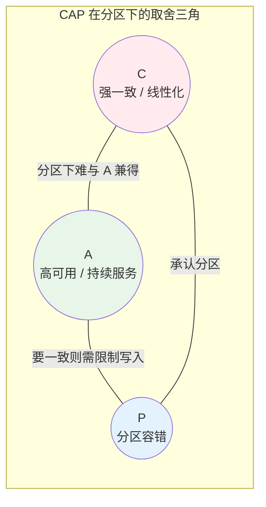
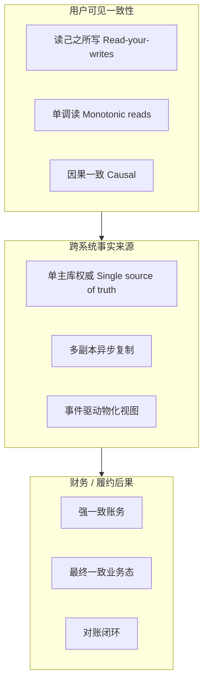
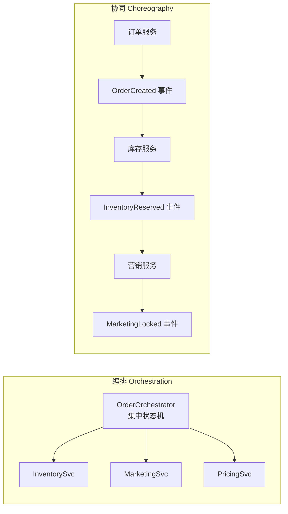
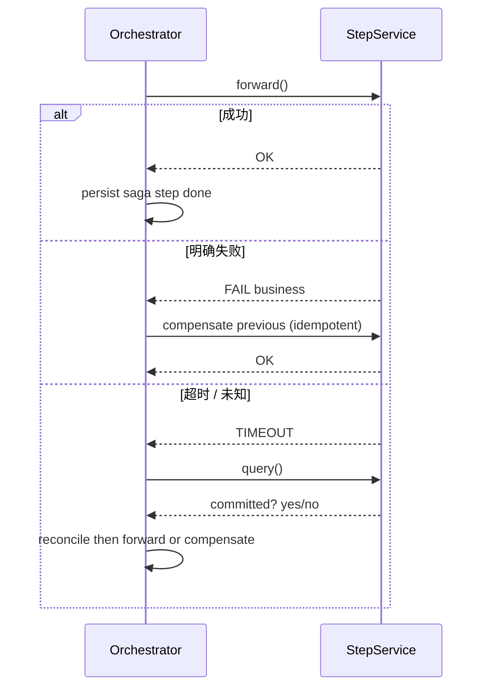
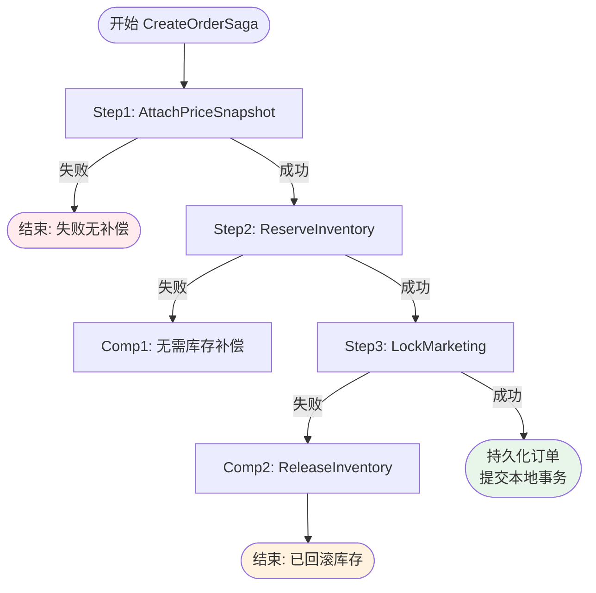
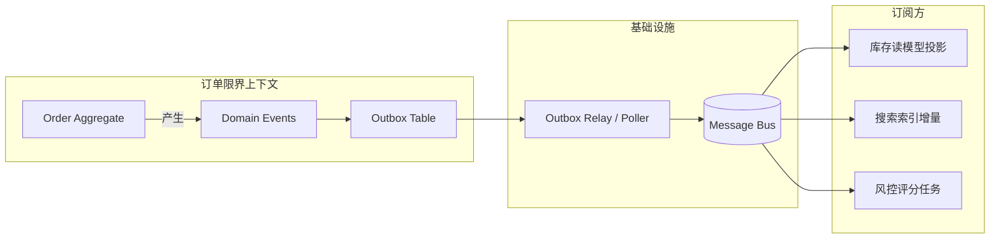
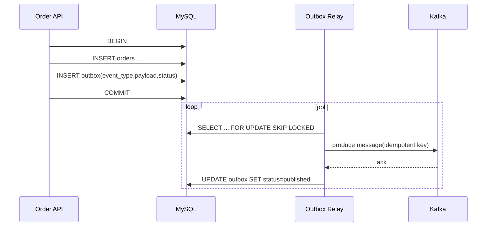
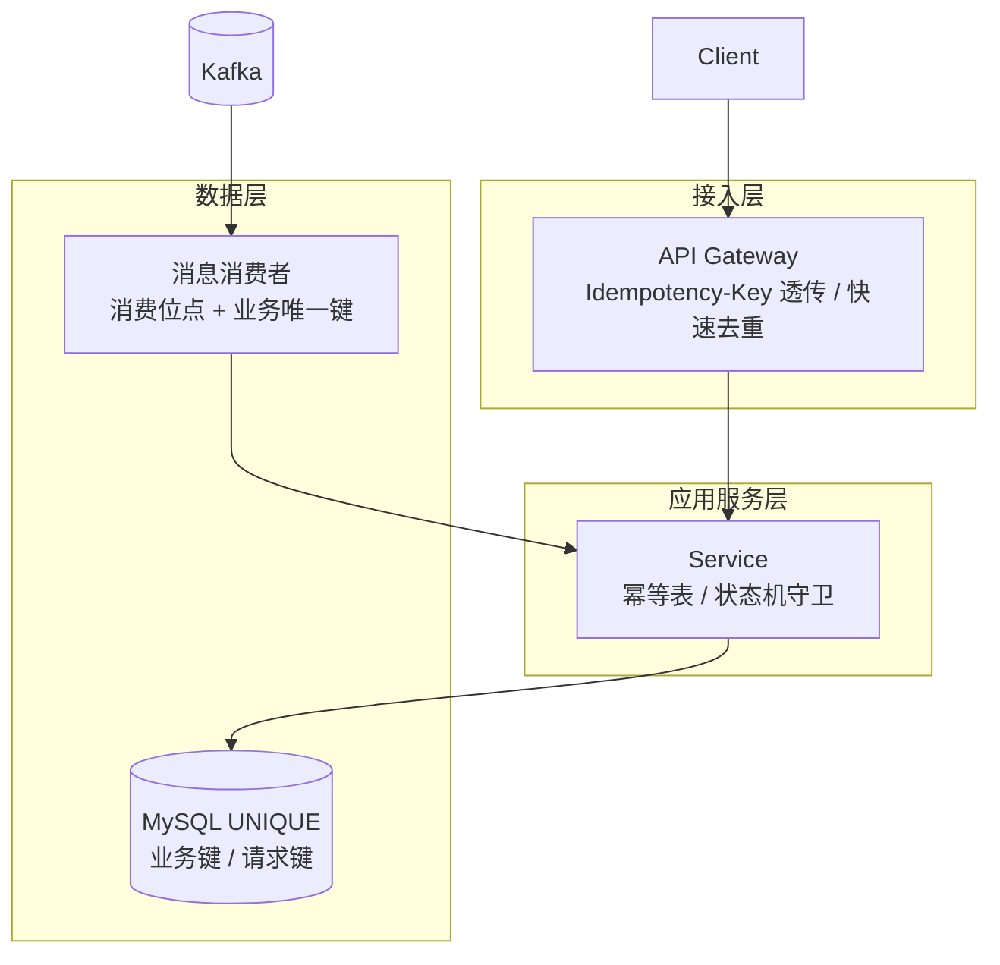
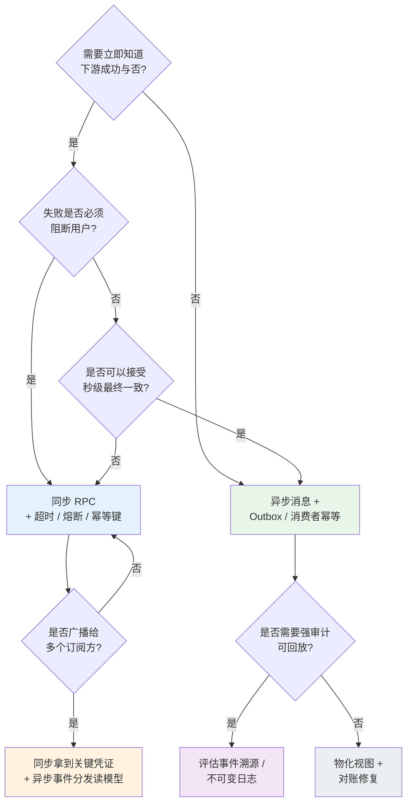

**导航**：[书籍主页](../README.md) | [完整目录](../SUMMARY.md) | [上一章：第3章](./chapter3.md) | [下一章：第5章](./chapter5.md)

---

# 第4章 系统集成与一致性设计

> 事件驱动、集成模式与最终一致性，解决系统之间的协作问题

**本章定位**：前两章分别解决了业务边界与系统内部结构，本章开始讨论第三个层面的问题：**当多个上下文或多个服务开始协作时，系统应该如何集成，以及不再共享同一本地事务后如何保持一致性**。这里的方法论重点不再是分层与建模，而是事件驱动、幂等、补偿、对账、Outbox 与 Saga。

**阅读提示**：若你更熟悉「一个数据库里用本地事务搞定一切」的单体思维，建议带着三个问题读完全章——第一，**分区发生时你更不愿意牺牲哪一项**（一致性、可用性、延迟）；第二，**失败是可逆还是不可逆**（决定补偿语义）；第三，**重复请求与重复消息是否已被建模为一等公民**（决定幂等与 Outbox 是否值得投资）。

**章节衔接**：第 1 章给出组合拳全景，第 2 章划边界，第 3 章解决边界之内的结构设计；本章则把视角抬升到**边界之间**。后续第 7 章到第 16 章在讲商品、库存、营销、计价、购物车、订单与支付时，都会反复回到本章的词汇表与模式库。

**写作约定**：文中 Go 示例为教学裁剪版，聚焦结构与语义；生产落地请补齐超时、退避、注入、鉴权、观测字段与错误码规范，并把「成功 / 业务失败 / 可重试失败」三类语义贯穿全链路。阅读时建议对照你们公司的网关规范、数据库迁移规范与消息平台手册做二次裁剪，并把示例中的表名与字段名映射到真实审计字段、合规要求与数据留存周期。

---

## 6.1 分布式事务挑战

跨服务、跨库、跨供应商的电商链路，本质上是在**没有全局锁**的前提下完成协作。讨论「分布式事务」之前，先要统一语言：我们追求的往往不是银行核心那种「强一致实时可见」，而是**用户可理解的一致性**与**财务可审计的一致性**的组合。

**把一致性目标写成 SLO**：方法论章节最容易停留在概念层，落地时建议把「一致性」翻译成可监控指标。例如：「创单成功后 99.9% 用户在 1 秒内读到订单详情」「支付成功后 5 分钟内订单状态同步完成」「对账差异在 T+1 日内闭环率」。没有指标，团队就会在事故后争论「这算不算一致」。SLO 也会反向约束集成模式：如果你承诺秒级读己之所写，就不能把关键读路径绑在慢消费者之后。

**可观测性是最小一致性保障**：跨系统集成里，最大风险不是「短暂不一致」，而是「不知道不一致发生在哪」。因此链路追踪（Trace）、关联 ID（`order_id` / `payment_id` / `idempotency_key`）、以及跨系统日志检索规范，应被视为一致性基础设施的一部分，而不是「运维锦上添花」。当你能在 5 分钟内从用户投诉定位到具体参与方与具体请求，你已经把大量 P1 事故降级为 P3。

### 6.1.1 CAP 理论在电商中的应用

CAP 指出：在**网络分区（P）**客观存在时，系统只能在 **C（线性化一致性）** 与 **A（可用性：非故障节点可继续响应）** 之间做权衡。电商里更务实的表述是：

- **P 不可逃避**：机架故障、运营商割接、云厂商区域抖动都会制造分区；你的系统要么承认它，要么假装它不存在（后者通常以事故收场）。
- **C 与 A 不是 0/1**：多数业务选择的是 **延迟可接受的一致性**（例如订单创建立即可见、搜索索引秒级滞后）与 **降级后的可用性**（例如暂停个性化推荐但不阻断下单）。

下面的三角图用三个顶点表达「三者不可同时取满」的直觉（示意，非形式化证明）。



**电商映射示例**：

| 场景 | 更偏向 | 原因 |
|------|--------|------|
| 支付记账、余额扣减 | CP 倾向 | 差错成本高，宁可失败重试也不要错账 |
| 商品详情、推荐列表 | AP 倾向 | 短暂旧数据可接受，可用性影响转化 |
| 创单 + 库存预占 | 工程上常选 **BASE + 补偿** | 同步强一致跨多服务代价大，Saga / TCC 更常见 |

在 CAP 之外，工程讨论里还常用 **PACELC**：在**正常（Latency）**与**分区（Partition）**两种状态下，分别在 **C 与 A**、**C 与 L（延迟）**之间权衡。电商系统的真实矛盾往往不在「选 CP 还是 AP」这种标签，而在「**把哪一类不一致暴露给用户**」：用户能容忍搜索列表晚 1 秒，但很难容忍「支付成功却订单仍待付款」这种语义断裂。于是产品与技术要共同定义 **RPO/RTO 的业务翻译**——例如「支付回调最长可延迟多久仍可被用户理解」「库存预占展示与真实可售不一致的上限是多少」。

另一个常见误区是把 **「强一致」当成银弹**。跨服务的两阶段提交（2PC）与其变体在微服务规模下会放大故障域：协调者不可用、参与者长时间持锁、尾延迟抖动都会被交易洪峰放大。更稳妥的工程路径通常是：**在单个聚合 / 单个服务内用数据库事务守住硬约束**，跨边界用 **Saga / TCC / 可靠消息**组合，再用 **对账**兜住不可避免的外部异步。

### 6.1.2 一致性分类

从工程师落地角度，建议把「一致性」从口号拆成**可见性**、**容错模型**与**经济后果**三层，再映射到技术策略。



**谱系速查**：

- **强一致（线性化 / 串行化）**：单个分片内靠数据库事务；跨分片靠分布式协调（代价高、故障域大）。
- **会话一致 / 单调读**：常见于「用户刚下的单，列表里立刻能看到」——可用主从路由策略与 sticky 读实现。
- **最终一致**：允许短暂漂移，但必须有**版本、水位、对账与补偿**兜住边界。
- **因果一致**：适合「评论回复依赖发帖可见」等场景；电商里多用于协作类附属功能，主交易链路仍以订单状态机为准。

为了把「一致性」从论文语言落到排障语言，建议团队在架构评审里强制区分三类问题，并把它们映射到不同手段：

1. **读可见性问题**：用户「刚操作完却看不到」——多数是读写路由、缓存、投影延迟；优先查主从延迟、Outbox 堆积、消费者 lag。
2. **跨系统事实冲突**：订单说已支付、支付说未成功——多数是回调丢失、幂等键不一致、状态机非法迁移；优先查渠道流水与平台流水对齐。
3. **跨时间窗口的统计不一致**：GMV 看板与财务口径对不上——多数是异步汇总、时区、退款冲正口径；优先查离线任务水位与口径文档。

下表给出「用户感知」与「系统手段」的对照，用于和需求方对齐预期（避免把技术极限包装成业务承诺）。

| 用户感知目标 | 典型手段 | 需要额外付出的代价 |
|--------------|----------|--------------------|
| 下单后列表立刻出现 | 读主库 / 读己之所写路由 | 主库压力、热点风险 |
| 全站搜索秒级更新 | Outbox + 近实时索引 | 运维复杂度、契约治理 |
| 支付成功即刻可履约 | 同步确认 + 强校验 + 幂等 | 尾延迟、渠道配额 |
| 大促高峰仍可下单 | 异步化、削峰、降级读 | 短暂不一致、对账压力 |

### 6.1.3 典型场景分析

1. **创单链路（订单、库存、营销、计价）**：跨多个限界上下文，**同步点越多尾延迟越大**；典型解法是「结算页强校验 + 创单 Saga + 异步投影」。
2. **搜索与商品主数据**：索引滞后是常态，关键是**可观测的延迟**与**降级展示**（第 12 章）。
3. **支付回调与渠道对账**：渠道侧状态与平台侧状态**异步收敛**；必须幂等、必须可对账（第 15 章与 6.5 呼应）。
4. **供应商库存**：供应商为权威时，平台侧是**快照 + 同步策略**；分区时以**可解释的拒单 / 延迟确认**交换「永不超卖」承诺（第 8 章）。
5. **退款与售后**：涉及支付渠道、营销回退、库存回冲、供应商拦截等多参与方，**不可逆节点**（已打款、已出票）会把「补偿」切换为「工单 / 人工」。这类链路更需要 **Saga 日志 + 对账批次号 + 幂等退款单号** 三件套，避免重复退款与部分成功。
6. **秒杀与抢购**：热点 SKU 的约束是「库存单调递减」与「请求风暴」叠加。工程上通常是 **Redis 原子预减 + 异步落库对账**，而不是跨服务同步强一致；否则会把尾延迟与失败面扩散到整个站点入口。
7. **清结算与分账**：平台、商家、渠道、营销补贴多方账本需要在 **T+N** 周期收敛。这里的「一致性」更像会计恒等式：**借贷平衡、可追溯、可审计**，而不是用户请求路径上的毫秒级一致。
8. **跨境与多币种**：汇率快照、税费、支付路由使得「金额一致」必须显式引入 **snapshot_id / rate_version**，否则对账会把产品问题误判为技术故障。

这些场景的共同点，是都要求你在架构文档里写清楚一句话：**一致性的责任边界在哪里结束**。例如库存预占由库存服务负责语义，订单只保存 `reserve_id` 凭证；支付金额以支付核心的记账为准，订单侧只保存 `pay_amount` 快照与引用号。边界写清楚，集成才不会退化成「谁都能改一笔」。

---

## 6.2 Saga 编排模式

Saga 把长事务拆为**本地事务序列**，用**补偿事务**撤销已提交步骤的可逆效果。它不要求全局锁表，也不要求所有参与方实现预留接口（对比 TCC 的 Try/Confirm/Cancel），因此在跨团队集成中最常见。

很多团队会把「分布式事务」理解成「找一个中间件把多个数据库一次性提交」。在电商微服务里，这种理解往往会把问题推向两个极端：要么 **过度依赖全局协调**（可用性与尾延迟受损），要么 **完全回避一致性话题**（只能靠人肉修数）。Saga 的价值在于承认现实：**跨服务没有免费的全局原子性**，但可以把不确定性收敛到 **可测试的本地事务 + 可审计的补偿 + 可对账的凭证**。当你能清楚说出「哪一步失败会留下什么外部痕迹」，你就已经比大多数项目更接近可控。

落地时还要区分 **业务失败** 与 **系统失败**：库存不足是业务失败，通常不应触发重试；渠道超时是系统失败，需要退避重试与查询对齐。把两者混在一个 `if err != nil` 里，Saga 会表现为「无意义重试放大雪崩」或「该补偿却不补偿」。建议在错误模型里显式引入 `BusinessError` 与 `TransientError`（或等价错误码），编排器据此分支。

### 6.2.1 Saga 基础概念

- **子事务（Local Transaction）**：在一个服务 / 一个库边界内可原子提交。
- **补偿（Compensation）**：语义上撤销前一步业务效果；**必须幂等**，且要能处理「原操作其实失败」的空补偿。
- **Saga 日志**：记录每一步状态，支撑断点续跑、人工介入与审计。

与 **TCC（Try-Confirm-Cancel）** 相比，Saga 对参与方的接口要求更低，但业务侧要承担更多「补偿语义」的设计成本。可以用下表做模式选型（不是非此即彼，很多系统会在支付子域用更严格的协议，在营销子域用 Saga）。

| 维度 | Saga | TCC |
|------|------|-----|
| 参与方改造 | 低：正向 + 补偿即可 | 高：三阶段接口与资源预留语义 |
| 一致性强度 | 依赖补偿正确性与对账 | Try 成功后可更强约束提交 |
| 失败处理 | 补偿链 + 人工兜底 | Cancel 路径必须可靠 |
| 典型适用 | 创单、结算编排 | 支付、余额、库存强约束场景（团队成熟度高） |

### 6.2.2 编排 vs 协同



**选型经验**：

- **编排**：调试路径清晰，适合**强流程**（创单、退款、结算）；缺点是编排器可能成为热点与变更集中点。
- **协同**：解耦参与者，适合**弱流程扩展**；缺点是全局可观测性与顺序约束更难，需要严格的**事件契约与版本治理**。

电商创单、退款等**有严格顺序与对账要求**的链路，业界更常见的是**编排为主、事件为辅**。

**混合形态**：编排器完成「强一致点的凭证收集」（试算快照、预占号、营销锁），聚合根提交后再通过 **Outbox** 广播 `OrderCreated` 给搜索、推荐、风控等读模型或旁路系统。这样既保留集中调试与审计的主线，又避免把读侧耦合进同步链路。

### 6.2.3 补偿机制设计

补偿不是「数据库回滚」的同义词，而是**业务语义撤销**。设计要点：

1. **可逆性分级**：库存释放、券解锁可逆；已发货、已出票常不可逆，需要转入**人工 / 工单 / 财务**流程。
2. **补偿的幂等**：网络重试会导致补偿重复执行；应用层用**业务幂等键**或**状态检查**保证安全。
3. **失败面分类**：业务拒绝（库存不足）与基础设施故障（超时）要分流，后者才触发重试与退避。
4. **超时与悬挂**：子调用超时后，编排器要通过**查询接口**把「未知」落成「成功 / 失败」之一，再决定前进或回滚。

**Saga 持久化与恢复**：请求线程崩溃、实例重启、发布滚动都会导致「执行到一半」的外部视图。生产系统应至少落一张 `saga_instance` 表（或等价事件日志），字段建议包含：`saga_id`、`biz_key`（幂等键）、`current_step`、`status`（running/compensating/succeeded/failed）、`payload_json`、`started_at`、`updated_at`、`version`（乐观锁）。恢复线程按 `status=running` 扫描，结合每步的 **query** 结果把流程推向下一个合法状态。没有这张表，你只能依赖日志拼凑现场，事故复盘成本会指数级上升。

**并发与重入**：同一个 `biz_key` 的重复请求不应启动第二个 Saga 实例。常见做法是「数据库唯一约束 + 返回进行中的 saga_id」或「Redis 分布式锁（短 TTL + 续期谨慎）」。锁方案要警惕：锁超时后另一个实例进入，会造成双轨执行；因此最终仍应以 **幂等键与 Saga 状态机** 作为真相来源。



### 6.2.4 订单创建的 Saga 实例

下面给出一个**教学裁剪版**但**结构完整**的 Go 示例：三步正向（计价快照绑定、库存预占、营销锁定）与两步补偿（释放库存、解锁营销）。示例省略了真实 RPC、链路追踪与部分错误包装，但保留**编排骨架、幂等键透传、补偿逆序**等关键结构。

**Saga 流程图**：



**Go 编排骨架**（单文件可 `go run`，将下游调用替换为真实 gRPC / HTTP SDK 即可落地）：

**Walk-through（对照流程图读代码）**：

1. `AttachSnapshot` 失败时，系统尚未占用库存与营销资源，因此直接返回错误即可，对应流程图左侧「失败无补偿」分支。
2. `Reserve` 成功后，`reserve_id` 成为库存侧的**外部凭证**；后续任何释放都必须携带它，并在库存服务侧以幂等方式处理。
3. `LockPromo` 失败进入补偿：只释放库存，不解锁营销（因为锁未成功）。若未来某版本 `LockPromo` 变成「部分成功」（例如锁定成功但写审计失败），必须把补偿扩展为「先查锁是否存在再解锁」，否则会出现补偿空转或补偿遗漏。
4. `Run` 成功后，订单服务应在**单一本地事务**中写入订单主表、明细、价格快照引用、外部凭证集合，并写入 Outbox 触发下游投影。不要把「订单持久化」拆到多个没有事务边界的 RPC 里，否则你会重新发明分布式事务。

```go
package main

import (
	"context"
	"errors"
	"fmt"
	"log"
	"net/http"
	"time"
)

// ---- 端口：生产环境应使用 gRPC / 生成代码 ----

type PricingClient interface {
	AttachSnapshot(ctx context.Context, orderID, snapshotID string) error
}

type InventoryClient interface {
	Reserve(ctx context.Context, idempotencyKey, orderID, sku string, qty int) (reserveID string, err error)
	Release(ctx context.Context, idempotencyKey, reserveID string) error
}

type MarketingClient interface {
	LockPromo(ctx context.Context, idempotencyKey, orderID, promoRef string) (lockID string, err error)
	UnlockPromo(ctx context.Context, idempotencyKey, lockID string) error
}

// ---- 编排器 ----

type CreateOrderCommand struct {
	OrderID        string
	IdempotencyKey string
	PriceSnapshot  string
	SKU            string
	Qty            int
	PromoRef       string
}

type CreateOrderSaga struct {
	Pricing   PricingClient
	Inventory InventoryClient
	Marketing MarketingClient
}

func (s *CreateOrderSaga) Run(ctx context.Context, cmd CreateOrderCommand) error {
	if cmd.OrderID == "" || cmd.IdempotencyKey == "" {
		return errors.New("invalid command")
	}

	// Step 1: 绑定计价快照（失败则无资源占用）
	if err := s.Pricing.AttachSnapshot(ctx, cmd.OrderID, cmd.PriceSnapshot); err != nil {
		return fmt.Errorf("attach snapshot: %w", err)
	}

	// Step 2: 库存预占
	reserveID, err := s.Inventory.Reserve(ctx, cmd.IdempotencyKey+":inv", cmd.OrderID, cmd.SKU, cmd.Qty)
	if err != nil {
		return fmt.Errorf("reserve inventory: %w", err)
	}

	// Step 3: 营销锁定
	lockID, err := s.Marketing.LockPromo(ctx, cmd.IdempotencyKey+":mkt", cmd.OrderID, cmd.PromoRef)
	if err != nil {
		// 补偿：释放库存（逆序）
		if relErr := s.Inventory.Release(ctx, cmd.IdempotencyKey+":inv:rel", reserveID); relErr != nil {
			return fmt.Errorf("lock promo failed: %v; release inventory failed: %w", err, relErr)
		}
		return fmt.Errorf("lock promo: %w", err)
	}

	log.Printf("saga ok order=%s reserve=%s lock=%s", cmd.OrderID, reserveID, lockID)
	// Step 4（示意）：在同一服务的数据库事务里插入订单主表与明细
	return nil
}

// ---- 内存桩：演示幂等 + 成功路径 ----

type memPricing struct{}

func (memPricing) AttachSnapshot(ctx context.Context, orderID, snapshotID string) error {
	return nil
}

type memInventory struct {
	released bool
}

func (m *memInventory) Reserve(ctx context.Context, idempotencyKey, orderID, sku string, qty int) (string, error) {
	return "resv_123", nil
}

func (m *memInventory) Release(ctx context.Context, idempotencyKey, reserveID string) error {
	m.released = true
	return nil
}

type memMarketing struct{}

func (memMarketing) LockPromo(ctx context.Context, idempotencyKey, orderID, promoRef string) (string, error) {
	return "lock_456", nil
}

func (memMarketing) UnlockPromo(ctx context.Context, idempotencyKey, lockID string) error {
	return nil
}

// 将 HTTP 客户端映射为 InventoryClient 的示例（真实项目用专用 SDK）
type httpInventory struct {
	client *http.Client
	url    string
}

func (httpInventory) Reserve(ctx context.Context, idempotencyKey, orderID, sku string, qty int) (string, error) {
	// 伪代码：构造 POST /v1/reservations，Header 携带 Idempotency-Key
	return "", errors.New("not implemented in demo")
}

func (httpInventory) Release(ctx context.Context, idempotencyKey, reserveID string) error {
	return errors.New("not implemented in demo")
}

func main() {
	ctx, cancel := context.WithTimeout(context.Background(), 2*time.Second)
	defer cancel()

	saga := &CreateOrderSaga{
		Pricing:   memPricing{},
		Inventory: &memInventory{},
		Marketing: memMarketing{},
	}
	err := saga.Run(ctx, CreateOrderCommand{
		OrderID:        "ord_1",
		IdempotencyKey: "idem_user_click_001",
		PriceSnapshot:  "pshot_9f3c",
		SKU:            "sku_a",
		Qty:            1,
		PromoRef:       "promo_x",
	})
	if err != nil {
		log.Fatal(err)
	}
}
```

**落地清单（从示例走向生产）**：

- 为每一步引入**持久化 Saga 表**（`saga_id`、`step`、`status`、`payload`、`error_code`）。
- 所有 outbound 调用携带**关联 ID**（`order_id`、`trace_id`、`idempotency_key`）。
- 对「超时未知」统一走 **query + reconcile** 状态机，而不是立刻补偿。

**Saga 表结构示例（MySQL，示意）**：落地时按你们公司的审计规范补全操作者与 trace 字段。

```sql
CREATE TABLE saga_instance (
  saga_id       BIGINT PRIMARY KEY AUTO_INCREMENT,
  biz_key       VARCHAR(128) NOT NULL,
  name          VARCHAR(64)  NOT NULL,
  status        VARCHAR(32)  NOT NULL,
  current_step  INT            NOT NULL,
  payload       JSON           NOT NULL,
  version       INT            NOT NULL DEFAULT 0,
  created_at    DATETIME       NOT NULL,
  updated_at    DATETIME       NOT NULL,
  UNIQUE KEY uk_saga_biz (biz_key, name)
);

CREATE TABLE saga_step (
  id         BIGINT PRIMARY KEY AUTO_INCREMENT,
  saga_id    BIGINT NOT NULL,
  step_no    INT    NOT NULL,
  step_name  VARCHAR(64) NOT NULL,
  status     VARCHAR(32) NOT NULL,
  req        JSON,
  resp       JSON,
  err        TEXT,
  created_at DATETIME NOT NULL,
  KEY idx_saga (saga_id, step_no)
);
```

---

## 6.3 事件驱动架构

事件驱动架构（EDA）把系统间的耦合从「知道对方的表结构」变为「订阅对方愿意公布的**事实**」。它与 DDD 的**领域事件（Domain Event）**天然契合：事件名应是业务过去式（`OrderPlaced`），而不是命令式（`PlaceOrder`）。

EDA 并不自动带来解耦：如果事件载荷里塞满下游私有字段，或消费者之间隐式依赖顺序却缺乏分区策略，你只会得到「异步耦合的大泥球」。因此本章强调三件事：**契约**、**顺序边界**、**可观测的投递语义**。与第 16 章的事件发布实践结合时，请把「事件平台能力」与「领域建模能力」分开评估：Kafka 再强也替代不了你对聚合边界的判断。

### 6.3.1 领域事件

领域事件用于表达**聚合内已发生且不可变的事实**。好的事件：

- **自描述**：携带必要标识与版本（`schema_version`）。
- **可演进**：兼容字段新增，慎改语义。
- **与命令分离**：命令可丢弃重试；事件一旦发布，消费者会据此做副作用。

**命名与版本**：事件名建议稳定且可检索（`order.placed.v1`），避免把促销规则编码进 topic 名称。载荷里携带 `occurred_at`、`producer`、`schema_version`，消费者才能做 **向后兼容** 解析。另一个实践是把「业务关键字段」与「展示字段」分层：关键字段用于幂等与投影，展示字段允许缺失并由读模型降级。

**聚合边界**：领域事件应从聚合根的**不变量**中自然产生，而不是为了通知某个下游临时「造事件」。后者会导致事件泛滥、顺序难以推理、回放成本失控。若你发现自己需要 `SomethingMaybeChanged` 这类含糊事件，通常意味着限界上下文边界需要重塑。

### 6.3.2 事件的发布与订阅



**发布订阅的工程细节**：

- **Topic 分区键**：与顺序性强相关的字段（同一 `order_id`）应映射到同一分区，避免乱序消费；但分区键过粗会造成热点分区，需要业务侧权衡。
- **消费者组**：一组消费者共享进度，实现水平扩展；重平衡（rebalance）会带来短暂停顿，要评估是否影响实时性 SLA。
- **至少一次投递**：因此消费者必须 **幂等**；常见实现是 `UNIQUE(consumer, event_id)` 或业务唯一键。
- **顺序与并行**：能并行就并行（不同聚合互不相关），不能并行就必须把「会改变含义的顺序」收敛到单分区或单线程处理器。
- **背压**：投影任务落后时，应有 lag 告警与降级读策略，避免把读路径拖死。

与第 16 章「事件发布」对齐时，把「谁允许发什么事件」纳入治理：事件不是自由文本广播，而是**受版本管理的契约**。建议在仓库中维护 `events/` 目录（或 Buf Schema Registry），把破坏性变更当作发布流程的一部分。

### 6.3.3 事件溯源（Event Sourcing）

事件溯源（ES）把**状态还原为事件流的折叠**：`state = fold(events)`。它带来强大审计与回放能力，但也引入：

- **模型复杂度**：投影、快照、版本迁移成本高。
- **查询压力**：多数业务仍需要物化读模型（CQRS）。

**电商建议**：账务、支付指令、库存流水等**强审计**子域可评估 ES；一般商品展示、搜索索引用**物化视图 + Outbox** 性价比更高（与第 1 章 CQRS 小节呼应）。

**何时值得上 ES**：当你明确需要「按时间回放任意业务态」且愿意投入 **投影重建、快照策略、事件迁移工具链**；否则先用 **审计日志表 + 不可变对象存储归档 + 定期校验** 往往更划算。ES 不是银弹，它是把复杂度从数据库迁移到了事件存储与投影运维。

**快照（Snapshot）**：长生命周期聚合（例如会员账户、长期预售订单）如果每次都从头折叠事件，读路径会不可接受。快照本质是「在某版本截断事件流」，需要定义 **快照写入频率** 与 **快照与事件的版本对齐规则**。

### 6.3.4 实践要点与 Outbox 完整实现

**Outbox 模式**解决的核心矛盾是：**数据库事务提交**与**消息发布**难以跨资源原子化。做法是：在同一本地事务中写入业务表与 `outbox` 表；由独立进程异步投递到消息总线，实现 **at-least-once** 发布且**不丢单**（消费者仍需幂等）。

**Outbox 时序图**：



**Go 实现骨架**（使用 `database/sql`；生产环境可替换为 `sqlx` / ORM，但保持「同事务写两张表」不变）：

```go
package outboxdemo

import (
	"context"
	"database/sql"
	"encoding/json"
	"time"
)

type OutboxEvent struct {
	ID        int64
	Aggregate string
	EventType string
	Payload   json.RawMessage
	Status    string // pending / published / dead
	CreatedAt time.Time
}

type OrderRepository struct {
	DB *sql.DB
}

// CreateOrderWithOutbox 演示：订单写入与 outbox 同事务
func (r *OrderRepository) CreateOrderWithOutbox(ctx context.Context, orderID string, evtType string, payload any) error {
	bytes, err := json.Marshal(payload)
	if err != nil {
		return err
	}

	tx, err := r.DB.BeginTx(ctx, &sql.TxOptions{Isolation: sql.LevelReadCommitted})
	if err != nil {
		return err
	}
	defer func() { _ = tx.Rollback() }()

	if _, err := tx.ExecContext(ctx, `INSERT INTO orders(id, status) VALUES(?, 'CREATED')`, orderID); err != nil {
		return err
	}
	if _, err := tx.ExecContext(ctx,
		`INSERT INTO outbox(aggregate_id, event_type, payload, status, created_at)
		 VALUES(?,?,?,?,?)`,
		orderID, evtType, bytes, "pending", time.Now().UTC(),
	); err != nil {
		return err
	}
	return tx.Commit()
}

// Relay 轮询投递：演示 SKIP LOCKED 多实例安全
type Relay struct {
	DB *sql.DB
}

func (relay *Relay) PollOnce(ctx context.Context, publish func(ctx context.Context, ev OutboxEvent) error) (int, error) {
	tx, err := relay.DB.BeginTx(ctx, nil)
	if err != nil {
		return 0, err
	}
	defer func() { _ = tx.Rollback() }()

	rows, err := tx.QueryContext(ctx, `
		SELECT id, aggregate_id, event_type, payload, status, created_at
		FROM outbox
		WHERE status='pending'
		ORDER BY id ASC
		LIMIT 50
		FOR UPDATE SKIP LOCKED`)
	if err != nil {
		return 0, err
	}
	defer rows.Close()

	var batch []OutboxEvent
	for rows.Next() {
		var ev OutboxEvent
		var agg string
		if err := rows.Scan(&ev.ID, &agg, &ev.EventType, &ev.Payload, &ev.Status, &ev.CreatedAt); err != nil {
			return 0, err
		}
		ev.Aggregate = agg
		batch = append(batch, ev)
	}
	if len(batch) == 0 {
		return 0, tx.Commit()
	}

	for _, ev := range batch {
		if err := publish(ctx, ev); err != nil {
			return 0, err
		}
		if _, err := tx.ExecContext(ctx, `UPDATE outbox SET status='published' WHERE id=?`, ev.ID); err != nil {
			return 0, err
		}
	}
	return len(batch), tx.Commit()
}

func DemoDDL() string {
	return `
CREATE TABLE IF NOT EXISTS orders (
  id VARCHAR(64) PRIMARY KEY,
  status VARCHAR(32) NOT NULL
);
CREATE TABLE IF NOT EXISTS outbox (
  id BIGINT PRIMARY KEY AUTO_INCREMENT,
  aggregate_id VARCHAR(64) NOT NULL,
  event_type VARCHAR(128) NOT NULL,
  payload JSON NOT NULL,
  status VARCHAR(16) NOT NULL,
  created_at DATETIME NOT NULL,
  KEY idx_outbox_pending (status, id)
);`
}
```

**工程清单**：

- Relay 进程要**独立扩容**，与 API 进程分离；发布失败应**退避重试**并将多次失败送入死信队列人工处理。
- 消息体应携带 **`event_id` / `aggregate_id` / `causation_id`**，与消费者表上的唯一约束联合实现端到端幂等。
- 与第 16 章「事件发布」衔接时，把**事件契约**（JSON Schema / Protobuf）纳入 CI，避免「字段悄悄改名」造成投影脏写。

**Outbox 运维要点**：`pending` 堆积通常不是 Kafka 坏了，而是 **Relay 吞吐不足、DB 锁竞争、或下游拒绝消息**。建议把以下指标做成仪表盘：`outbox_pending_count`、`relay_lag_seconds`、`publish_fail_rate`、`dead_letter_count`。出现持续堆积时，优先扩容 Relay 与检查热点 `aggregate_id`（大单事件风暴）。

**顺序投递 vs 批量投递**：某些支付相关事件需要严格顺序，Relay 可以按 `aggregate_id` 分区串行投递；而搜索增量可批量合并，降低总线开销。关键是不要把「所有事件都塞进一个全局顺序」里，否则系统吞吐会被最慢的消费者绑架。

**与第 1 章 Outbox 小节的关系**：第 1 章强调「领域事件异步化」的动机与边界；本章补齐 **实现骨架、时序与运维指标**，便于你在第 7–15 章落地到具体服务时直接对照检查清单。

---

## 6.4 幂等性设计通用方案

### 6.4.1 幂等性的本质

幂等性回答的问题是：**同一个业务意图被执行多次，是否与只执行一次等价**。分布式系统里重复来源包括：用户双击、网关重试、消息重复投递、回调重放。

从接口语义上，幂等还应区分两类返回：

- **语义幂等**：第二次调用返回与第一次**业务等价**的结果（可能 HTTP 状态码不同，但业务码一致），典型是支付创建。
- **严格幂等**：第二次调用应尽可能返回**同一响应体**（含错误），以便客户端无需分支处理；这通常依赖网关或应用侧的 **响应缓存**。

另一个关键维度是 **时间窗口**：创单幂等键可能只需 24 小时；支付幂等键可能要跨结算周期。窗口外的重复请求应被明确拒绝还是进入人工？这属于产品策略，但必须在技术方案里写死，否则会出现「以为幂等永远有效」的误用。

### 6.4.2 实现策略

| 策略 | 适用 | 注意 |
|------|------|------|
| 天然幂等 | `SET status='CANCELLED' WHERE id=? AND status='PAID'` | 仍需防止错误状态迁移 |
| 业务幂等键 | 支付、创单、退款 | 需要落库索引与 TTL 治理 |
| 令牌桶 / 去重表 | 高并发写 | 定期归档，冷热分离 |
| 唯一约束 | DB 层最终防线 | 冲突即视为重复成功需返回同一结果 |

**组合策略才是常态**：接口层挡住「明显重复」；服务层用状态机挡住「非法重放」；数据库用唯一约束挡住「并发双插」。任何单层都可能被绕过（例如内部任务不经过网关），因此不要迷信「只加 Header 就安全」。

**测试清单**：至少覆盖「并发双请求同一幂等键」「第一次超时后重试」「第一次失败第二次成功」「消息重复投递」四类用例；支付与退款还要覆盖「渠道侧已成功但平台超时」的对称场景（与第 15 章联动）。

### 6.4.3 各层的幂等性保证



**接口层示例：幂等键落库**：

```go
type IdempotencyStore interface {
	// TryBegin 返回 true 表示首次；false 表示重复，应返回缓存响应
	TryBegin(ctx context.Context, key, route string) (bool, error)
	SaveResponse(ctx context.Context, key string, code int, body []byte) error
	GetResponse(ctx context.Context, key string) (code int, body []byte, found bool, err error)
}

func WithCreateOrderIdempotency(store IdempotencyStore, next http.Handler) http.Handler {
	return http.HandlerFunc(func(w http.ResponseWriter, r *http.Request) {
		key := r.Header.Get("Idempotency-Key")
		if key == "" {
			http.Error(w, "missing Idempotency-Key", http.StatusBadRequest)
			return
		}
		first, err := store.TryBegin(r.Context(), key, r.URL.Path)
		if err != nil {
			http.Error(w, "idempotency error", http.StatusInternalServerError)
			return
		}
		if !first {
			code, body, found, err := store.GetResponse(r.Context(), key)
			if err != nil || !found {
				http.Error(w, "duplicate without cached response", http.StatusConflict)
				return
			}
			w.WriteHeader(code)
			_, _ = w.Write(body)
			return
		}
		// TODO: 包装 ResponseWriter 捕获状态码与 body，成功后 SaveResponse
		next.ServeHTTP(w, r)
	})
}
```

**服务层**：把幂等键与业务键（`order_id`、`payment_id`）建立映射；对「处理中」状态设置合理超时，避免永久悬挂。

**数据层**：对 `merchant_order_no`、`channel_trade_no` 等建立 **UNIQUE** 索引；冲突时读取已有行并返回**与首次一致**的结果体（支付场景极其关键，见第 15 章）。

**消息消费者层**：除了业务唯一键，还要注意 **at-least-once** 带来的「处理成功但 ack 前崩溃」重复。常见做法是：业务写入与「消费记录」同事务，或采用 **幂等表 + 业务状态机** 组合。Kafka 的幂等 producer 只能保证生产端不重复，不能保证消费端。

**与第 13–15 章的衔接**：购物车提交、结算创单、支付创建与回调，是幂等设计最密集的区域。请把这些链路里的 `Idempotency-Key` 来源、TTL、冲突返回码统一成一份「交易接口规范」，否则每个团队会发明一种错误语义，客户端与对账都会被拖垮。

---

## 6.5 数据一致性保证

### 6.5.1 最终一致性

最终一致性不是「暂时不一致然后祈祷」，而是满足三个条件：

1. **收敛性**：在无新写入时，系统应到达稳定态。
2. **可观测性**：能度量漂移（延迟、差异条数）。
3. **可修复性**：通过对账与补偿把漂移拉回业务可接受范围。

**最终一致的工程含义**：允许短暂不一致，但不允许「永远不一致」。因此必须定义 **最大允许漂移时间（MTTD）** 与 **修复时限（MTTR）** 的业务含义。例如「支付回调最多延迟 5 分钟，对账必须在 T+1 日内闭环」，这类指标比对程序员说「我们最终一致」更有约束力。

**与缓存的关系**：读路径缓存（商品详情、列表价）引入的是另一类一致性。原则是：**写路径更新权威，再异步失效 / 刷新缓存**；不要反过来用缓存驱动写。库存热路径若使用 Redis，必须与第 8 章一样把 **对账与回补** 当作一等能力，而不是事后补丁。

### 6.5.2 对账机制

对账回答的问题是：**两份账本是否在说同一件事**。电商常见对账维度：

- **平台订单 vs 支付渠道**：金额、手续费、状态、退款。
- **库存流水 vs 实物出库**：WMS / OMS 对齐。
- **营销预算 vs 实际核销**：防止薅羊毛与预算透支。

**设计要点**（与第 8 章库存、第 15 章支付呼应）：

1. **对账文件与解析**：渠道侧日终文件 + 平台侧流水导出；解析必须版本化。
2. **三层匹配**：长款（渠道有平台无）、短款（平台有渠道无）、金额不一致。
3. **差错工单**：自动修复仅限白名单场景；其余进入人工复核。
4. **幂等与回放**：同一对账批次重复跑不产生重复账务分录。

**对账批次生命周期（建议）**：`INIT` → `PARSED` → `MATCHED` → `DIFF_GENERATED` → `FIXUP_APPLIED` → `CLOSED`。每一步落审计日志，支持监管问询与内部复盘。短款与长款不要混在一个工单模板里：短款更像「钱可能丢了」，长款更像「重复记账风险」，处理 SLA 与审批链往往不同。

**平台侧数据准备**：对账不只读「业务库」，还要聚合 **渠道回调日志、网关请求日志、消息投递记录**。否则你会出现「业务状态对，但财务凭证缺角」的尴尬。实践中常用 **不可变事件流水** 作为对账输入之一，因为它比业务表更抗「事后改字段」。

**与第 8 章库存对账的衔接**：库存侧常见是 Redis 计数与 MySQL 流水、供应商快照三方对齐。支付侧则是平台支付单与渠道清算文件对齐。两者共享同一套工程套路：**差异分类 → 自动白名单修复 → 人工复核 → 复盘入库**。

```go
package recon

import (
	"context"
	"database/sql"
	"time"
)

type ChannelRow struct {
	TradeNo     string
	AmountCents int64
	Status      string
	OccurredAt  time.Time
}

type PlatformRow struct {
	PaymentID   string
	ChannelRef  string
	AmountCents int64
	Status      string
}

// ReconcileBatch 演示：以 channel_ref 对齐（生产需处理多币种、多清算周期）
func ReconcileBatch(ctx context.Context, db *sql.DB, ch []ChannelRow, pf []PlatformRow) error {
	pidx := map[string]PlatformRow{}
	for _, p := range pf {
		pidx[p.ChannelRef] = p
	}
	tx, err := db.BeginTx(ctx, nil)
	if err != nil {
		return err
	}
	defer func() { _ = tx.Rollback() }()

	for _, c := range ch {
		p, ok := pidx[c.TradeNo]
		if !ok {
			_, _ = tx.ExecContext(ctx, `INSERT INTO recon_diff(batch_at, kind, ref, detail) VALUES(?,?,?,?)`,
				time.Now().UTC(), "SHORT_PLATFORM", c.TradeNo, "channel has, platform missing")
			continue
		}
		if p.AmountCents != c.AmountCents || p.Status != c.Status {
			_, _ = tx.ExecContext(ctx, `INSERT INTO recon_diff(batch_at, kind, ref, detail) VALUES(?,?,?,?)`,
				time.Now().UTC(), "MISMATCH", c.TradeNo, "amount or status")
		}
	}
	return tx.Commit()
}
```

**差错分类与处理策略（支付对账视角的抽象）**：无论渠道是微信、支付宝还是银行卡收单，差异最终都会落到有限几类。

- **状态不一致但金额一致**：常见于回调丢失或延迟。处理上优先以渠道终态为准触发状态迁移，并确保迁移动作幂等。
- **金额不一致**：高风险，通常需要冻结相关支付单与关联订单，禁止自动发货，进入财务复核；同时要回溯是否存在重复退款、重复记账或币种转换错误。
- **手续费 / 分账字段不一致**：多见于规则变更窗口与历史数据混跑。处理上应引入 **规则版本号** 与 **生效时间**，避免用新规则解释旧交易。
- **时间窗口不一致**：渠道文件是「清算日」，平台流水是「交易发生日」。对账前要先把口径写到 SOP：以哪个时区、哪个切分点为准。

**自动化修复的边界**：只有满足「可逆、可证明、可回放」三条件的动作才适合自动化。例如「补写缺失的支付回调记录」可以自动化；「直接给用户退款」通常需要更高等级审批与多重校验。自动化的目标是减少人工 **机械劳动**，不是替代 **风险判断**。

### 6.5.3 补偿任务

补偿任务与 Saga 补偿不同：后者在**请求生命周期**内；前者是**异步修复器**，用于：

- 回调迟到导致的悬挂单；
- 消息堆积造成的投影落后；
- 对账发现的轻微差异批量冲正。

设计清单：**可重入**、**批大小上限**、**死信隔离**、**人工止血的开关**。

**任务编排建议**：补偿任务尽量 **幂等、可观测、可暂停**。出现大面积渠道故障时，最危险的是「自动修复脚本跑得比人还快」，把差错扩散成二次事故。要有 **全局开关 + 分渠道开关 + 最大自动修复笔数阈值**。

**与支付补偿的差异**：Saga 补偿发生在用户请求上下文内，强调快速失败与回滚；异步补偿任务发生在分钟到小时级窗口，强调批处理、限流与审计。两者不要混用同一套重试策略。

**案例化走读：支付回调迟到**（与第 15 章呼应）：用户支付成功，渠道回调因网络抖动晚到 10 分钟。期间订单可能停留在「待支付」，客服系统可能提示用户重复支付。补偿任务不应「直接改状态为成功」了事，而应执行一条可审计的状态迁移：`WAIT_PAY` → `PAID`，并触发 **履约消息、发票消息、积分入账** 等下游；每一步仍要带幂等键，避免回调重复造成重复履约。

**案例化走读：库存 Redis 与 MySQL 漂移**（与第 8 章呼应）：热路径扣减在 Redis，权威在 MySQL。对账发现 Redis 小于 MySQL 的可用量，可能意味着回补丢失；反过来可能意味着 Redis 多扣。修复策略应区分「业务可自动纠正」与「需要冻结 SKU 人工介入」。自动纠正必须带 **上限** 与 **来源证据**（流水号、操作者、任务批次），否则会把数据修复变成新的数据破坏源。

---

## 6.6 集成模式总结

### 6.6.1 同步调用模式

- **适用**：强实时、需要立即失败反馈（试算、库存预占校验）。
- **要点**：超时、重试、熔断、**幂等键**、**向后兼容的 API 版本**。

**常见反模式**：把十几个同步调用串成「上帝编排」，任何一个下游抖动都会放大尾延迟；没有 **bulkhead（舱壁）** 时，还会出现「支付抖动拖垮创单」的级联故障。治理手段包括：**并发化可并行步骤**、**硬超时 + 部分降级**、**把非关键校验挪到异步**。

**接口演进**：同步集成最怕破坏性变更。建议强制 `version` 字段或 URL 版本，并在网关层做 **灰度路由**；同时给客户端明确的 **错误码字典**（业务拒绝 vs 基础设施失败），否则重试风暴不可避免。

### 6.6.2 异步消息模式

- **适用**：解耦峰值、跨团队广播事实、最终一致投影。
- **要点**：Outbox、**消费者幂等**、**严格有序 vs 并行**的权衡、死信队列。

**典型反模式**：业务先写库再「顺手发 Kafka」，崩溃窗口会导致消息丢失；或消费者不做幂等，靠「应该不会重复」的侥幸心理。另一个反模式是 **把异步当同步用**：通过轮询消息结果阻塞用户请求，这会把消息系统的延迟特性原封不动搬进关键路径。

**观测性**：异步链路必须能回答三个问题：消息**发出去了吗**、消息**被处理了吗**、处理**正确吗**。分别对应 Outbox 状态、消费者 lag、对账差异。

### 6.6.3 数据同步模式

- **CDC / Binlog 订阅**：近实时同步到数仓或搜索；关注 schema 变更治理。
- **定时批量**：对账、报表、冷数据归档。
- **双写**：高风险，仅在迁移窗口短期使用，需校验任务护航。

**CDC 的边界**：它擅长复制「事实行变更」，但不自动复制「业务含义」。例如拆表、改主键、把枚举从字符串改成数字，都会让下游投影误读。需要 **契约变更流程** 与 **双读双写过渡期**。

**定时批量的价值**：很多一致性不是实时问题，而是「日终必须平」。批量任务的关键是 **可重跑、可分段、可限流**，并在大促日提前做 **容量演练**。

### 6.6.4 选型决策树



**如何使用决策树（避免误用）**：决策树的每个叶子都不是「唯一正确答案」，而是**默认起点**。真实系统往往处在叶子之间的灰区：例如创单需要同步拿到 `price_snapshot_id`，但搜索索引更新可以异步。灰区的处理原则是：**把「用户当下要看到的结果」留在同步路径**，把「世界最终会知道的结果」放到异步路径，并用对账兜底。

**与实时性相关的常见误判**：团队容易把「运营后台要立即看到」误认为「用户主链路必须同步」。后台可采用 **近实时 CDC + 物化视图**，而用户侧主链路仍应保持最小同步半径。把后台需求塞进核心交易链路，是尾延迟与大促故障的高频来源。

**与后续章节的关系（阅读地图）**：

- 商品、搜索、推荐：AP + 异步投影为主，强调**延迟可观测**（第 7、12 章）。
- 库存、营销：同步预占 / 锁定 + 异步对账（第 8、9 章）。
- 计价、购物车：读路径可弱一致；写路径谨慎用缓存（第 11、13 章）。
- 订单、支付：幂等 + 对账 + 补偿任务三位一体的**资金安全网**（第 14、15 章）。

---

## 6.7 本章小结

本章建立了系统集成的方法论「四件套」：

1. **CAP 与一致性谱系**帮助你在分区现实下做**可解释的取舍**，而不是用「都要」掩盖矛盾。
2. **Saga（编排优先）**给出跨服务长流程的**工程主路径**，补偿必须**可逆且幂等**。
3. **事件驱动 + Outbox** 把「写库再发消息」变成**可验证的本地事务**，为 CQRS 投影与搜索增量提供底座。
4. **幂等与对账** 是分布式世界的**安全带**：前者防重复，后者治漂移；补偿任务负责把系统从边角态拉回主航道。

**落地检查清单（建议你复制到评审模板）**：

- [ ] 每个跨服务写链路是否写明 **一致性级别**（用户可见 / 财务 / 读模型）？
- [ ] 是否存在「先外部成功、后本地提交」的窗口？若有，是否有 **query/reconcile**？
- [ ] 关键接口是否具备 **幂等键** 与 **冲突返回语义**？
- [ ] 是否避免「双写」作为长期方案？若必须双写，是否有 **校验任务**？
- [ ] 事件是否走 **Outbox**？Relay 是否有 **堆积告警**？
- [ ] 是否定义 **对账批次** 与 **差错分级**？自动修复是否有 **阈值与开关**？
- [ ] Saga / 异步任务是否 **可重入**？是否能在发布滚动中恢复？

**给团队负责人的一句话建议**：把「集成复杂度」当作与「业务复杂度」并列的成本项。没有 Outbox、没有对账、没有幂等键的系统也能上线，但它会把成本推迟到 **大促夜、监管审计、渠道切流** 这些最难的时刻一次性兑现。本章的目的，是把这部分成本前移为 **可评审、可测试、可监控** 的工程资产。

**给一线开发者的一句话建议**：写跨服务调用时，默认网络会超时、消息会重复、回调会迟到；把这三条写进单元测试与集成测试的假设里，比写一百行防御性注释更有用。

带着这套语言进入第 7 章之后的各子系统，你会更容易判断：此处该同步还是异步、事件应不应该广播、失败该当场回滚还是记账异步修。下一章（第 7 章）将从**商品中心**开始，把这些模式落实到具体边界与接口之上。

---

**导航**：[书籍主页](../README.md) | [完整目录](../SUMMARY.md) | [上一章：第3章](./chapter3.md) | [下一章：第5章](./chapter5.md)
