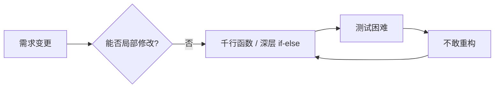
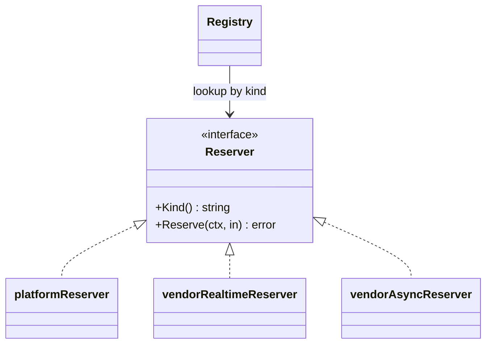
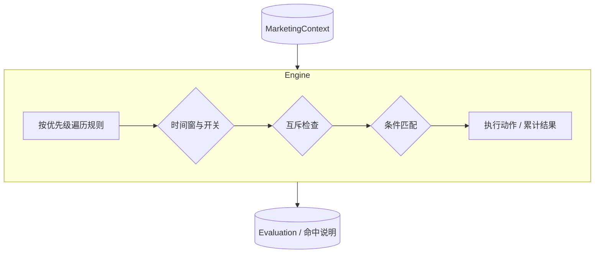

**导航**：[书籍主页](../README.md) | [完整目录](../SUMMARY.md) | [上一章：第4章](./chapter4.md) | [下一章：第6章](./chapter6.md)

---

# 第5章 编码原则与设计模式

> 用整洁代码、Pipeline、策略与规则引擎承接架构设计

---

## 3.1 复杂业务代码的痛点

第1章解决了「系统如何分层、依赖如何向内」的问题；本章解决「**同一层里，代码如何写得可演进、可测试**」。电商的下单、库存、营销是典型的**长流程 + 多分支 + 高频变更**场景，若缺少约束，业务代码会迅速腐化。

### 3.1.1 千行函数的噩梦

下面这段伪代码浓缩了真实项目中常见的「上帝函数」形态：校验、读用户、查库存、算价、营销、风控、落库、支付、通知全部堆在一个入口里。

```go
// ❌ 反例：单函数承载整条下单链路（职责过多、难以测试）
func CreateOrder(req *CreateOrderRequest) (*Order, error) {
	if req == nil || req.UserID == "" || len(req.Items) == 0 {
		return nil, errors.New("invalid request")
	}
	// 用户信息、库存、价格、券、积分、运费、活动、风控……
	// 数百行嵌套在同一函数中，修改任意一步都可能波及其他步骤
	return &Order{}, nil
}
```

**直接后果**：

- 无法为「只改营销校验」写独立单测，只能起全套集成环境；
- Code Review 难以聚焦，合并冲突集中在一个文件；
- 新人需要整段读完才敢改一行。

### 3.1.2 代码腐化的根因

| 根因 | 表现 | 与架构的关系 |
|------|------|----------------|
| **缺少流程骨架** | 步骤顺序靠注释和隐式顺序 | Clean Architecture 只保证分层，不自动拆分函数 |
| **分支爆炸** | `if-else` 按品类、地区、活动维度嵌套 | 领域模型仍在，但**应用编排层**失控 |
| **上下文随意传递** | 十几个参数或「万能 struct」 | 未用显式 **Context 对象**承载流水线状态 |
| **规则与代码绑死** | 运营改文案/门槛就要发版 | 与第9章营销系统呼应：需**数据驱动**的规则层 |

### 3.1.3 技术债的累积

技术债不一定是「烂代码」，更多时候是**当时合理、后来失配**的设计：例如早期用三层 `Service` 足够，随着营销玩法与多仓库存策略叠加，仍坚持在一个 `OrderService` 里堆逻辑，债就滚雪球。

**可操作的止损线**（团队可写入评审清单）：

- 单个导出函数超过约 **80～120 行**（视团队约定）必须拆分或抽 Pipeline；
- 圈复杂度（McCabe）超过约定阈值必须拆解策略或子函数；
- 同一文件内出现 **3 处以上**「复制粘贴再改一点」的折扣/库存分支，优先考虑策略或规则表。



---

## 3.2 函数设计原则

在引入模式之前，先收紧**函数级**的纪律：这是所有模式能落地的前提。

### 3.2.1 单一职责

一个函数应回答**一个**业务问题。例如「校验下单请求」与「持久化订单」不应混在同一函数中。

```go
// ❌ 反例：校验与副作用混在一起
func PlaceOrder(ctx context.Context, req *PlaceOrderRequest, db *sql.DB) error {
	if req.CustomerID == "" {
		return errors.New("customer required")
	}
	_, err := db.ExecContext(ctx, `INSERT INTO orders (...) VALUES (...)`, req.CustomerID)
	return err
}

// ✅ 正例：校验纯函数化，写库由仓储承担
func ValidatePlaceOrder(req *PlaceOrderRequest) error {
	if req.CustomerID == "" {
		return errors.New("customer required")
	}
	if len(req.Lines) == 0 {
		return errors.New("order lines required")
	}
	return nil
}
```

### 3.2.2 函数长度控制

经验法则：**一屏能读完**（含错误处理）较理想。长逻辑不是「拆成很多小函数」就够了，还要让调用方读出**业务流程**，这正是 3.3 节 Pipeline 的价值。

### 3.2.3 参数设计

参数过多往往说明缺少「**用例级上下文**」。把一次下单所需输入收敛为 `PlaceOrderInput`，中间态收敛为 `PlaceOrderState`（或下文 `OrderPipeContext`），Handler 只负责绑定 HTTP → DTO → 用例输入。

```go
// ❌ 反例：参数平面展开
func PriceForCheckout(userID, region, platform string, qty int, skuID string, useCoupon bool, couponCode string) (int64, error) {
	return 0, nil
}

// ✅ 正例：输入聚合为结构体
type CheckoutPriceQuery struct {
	UserID     string
	Region     string
	Platform   string
	SKU        string
	Qty        int
	CouponCode string
}
```

### 3.2.4 错误处理

在 Go 中建议：

- **可预期业务失败**用哨兵错误或自定义类型，便于上层映射 HTTP 4xx；
- **系统/依赖故障**用 `%w` 包装，保留链路与 `errors.Is` / `As` 能力；
- **不要在业务深层 `log.Fatal`**，把决策留在 `main` 或任务入口。

```go
// ✅ 正例：包装依赖错误
func (r *MySQLOrderRepo) Save(ctx context.Context, o *Order) error {
	if _, err := r.db.ExecContext(ctx, `INSERT INTO orders (id, customer_id) VALUES (?, ?)`, o.ID, o.CustomerID); err != nil {
		return fmt.Errorf("order repo save: %w", err)
	}
	return nil
}
```

---

## 3.3 Pipeline 模式

Pipeline（管道）把**阶段化流程**显式化：每一步是一个 `Processor`，共享一个**上下文**，由 `Pipeline` 顺序驱动。它与责任链的共同点都是「链式处理」，不同之处在于：Pipeline 更强调**数据沿管道变换**、阶段职责清晰，常用于下单、结算试算、营销列表组装等。

### 3.3.1 从嵌套到流水线


**对比**：

| 维度 | 深层嵌套 | Pipeline |
|------|-----------|------------|
| 流程可见性 | 靠读完全文 | 组装处即文档 |
| 扩展 | 改中央函数 | 增删 `Processor` |
| 单测 | 难 | 每步独立 Mock |

### 3.3.2 实现要点

1. **上下文对象**：承载输入、中间结果、错误累积标记；避免用包级变量。
2. **早失败**：任一步返回错误即中止管道（或实现可配置的「继续/中止」策略）。
3. **命名**：`Processor.Name()` 便于日志与指标打标签。
4. **与 Clean Architecture**：Pipeline 通常落在 **Application / Use Case 编排层**，领域不变量仍在聚合根内。

### 3.3.3 订单处理的 Pipeline 实例

下面给出一份**可编译思路**的精简实现：创建订单流水线——校验 → 加载商品行 → 预留库存 → 写单。

```go
package orderpipe

import (
	"context"
	"errors"
	"fmt"
)

// OrderPipeContext 承载一次「创单」流水线的输入与中间态。
type OrderPipeContext struct {
	Req            PlaceOrderRequest
	ResolvedLines  []OrderLine
	ReservationID  string
	CreatedOrderID string
}

type PlaceOrderRequest struct {
	CustomerID string
	Lines      []LineRequest
}

type LineRequest struct {
	SKU string
	Qty int
}

type OrderLine struct {
	SKU       string
	Qty       int
	UnitCents int64
}

// Processor 单步处理逻辑。
type Processor interface {
	Name() string
	Process(ctx context.Context, c *OrderPipeContext) error
}

// Pipeline 顺序执行。
type Pipeline struct {
	steps []Processor
}

func NewPipeline(steps ...Processor) *Pipeline {
	return &Pipeline{steps: steps}
}

func (p *Pipeline) Run(ctx context.Context, c *OrderPipeContext) error {
	for _, s := range p.steps {
		if err := ctx.Err(); err != nil {
			return err
		}
		if err := s.Process(ctx, c); err != nil {
			return fmt.Errorf("%s: %w", s.Name(), err)
		}
	}
	return nil
}

// --- Processors ---

type validateProcessor struct{}

func (validateProcessor) Name() string { return "validate" }

func (validateProcessor) Process(_ context.Context, c *OrderPipeContext) error {
	if c.Req.CustomerID == "" {
		return errors.New("customer_id required")
	}
	if len(c.Req.Lines) == 0 {
		return errors.New("at least one line")
	}
	return nil
}

type Catalog interface {
	ResolveLines(ctx context.Context, lines []LineRequest) ([]OrderLine, error)
}

type resolveCatalogProcessor struct{ cat Catalog }

func (p resolveCatalogProcessor) Name() string { return "resolve_catalog" }

func (p resolveCatalogProcessor) Process(ctx context.Context, c *OrderPipeContext) error {
	lines, err := p.cat.ResolveLines(ctx, c.Req.Lines)
	if err != nil {
		return err
	}
	c.ResolvedLines = lines
	return nil
}

type Inventory interface {
	Reserve(ctx context.Context, customerID string, lines []OrderLine) (reservationID string, err error)
}

type reserveInventoryProcessor struct{ inv Inventory }

func (p reserveInventoryProcessor) Name() string { return "reserve_inventory" }

func (p reserveInventoryProcessor) Process(ctx context.Context, c *OrderPipeContext) error {
	rid, err := p.inv.Reserve(ctx, c.Req.CustomerID, c.ResolvedLines)
	if err != nil {
		return err
	}
	c.ReservationID = rid
	return nil
}

type OrderRepository interface {
	Insert(ctx context.Context, c *OrderPipeContext) (orderID string, err error)
}

type persistOrderProcessor struct{ repo OrderRepository }

func (p persistOrderProcessor) Name() string { return "persist_order" }

func (p persistOrderProcessor) Process(ctx context.Context, c *OrderPipeContext) error {
	id, err := p.repo.Insert(ctx, c)
	if err != nil {
		return err
	}
	c.CreatedOrderID = id
	return nil
}
```

**组装处（例如在 `cmd` 或 `application` 包）一眼读完流程**：

```go
func NewPlaceOrderPipeline(cat Catalog, inv Inventory, repo OrderRepository) *Pipeline {
	return NewPipeline(
		validateProcessor{},
		resolveCatalogProcessor{cat: cat},
		reserveInventoryProcessor{inv: inv},
		persistOrderProcessor{repo: repo},
	)
}
```

---

## 3.4 策略模式

当分支维度稳定、而**每个分支内部都很厚**时，用策略（Strategy）把「选谁」与「怎么做」拆开：注册表负责选择，策略对象负责算法。

### 3.4.1 消除 if-else

```go
// ❌ 反例：按库存类型硬编码
func ReserveStock(kind string, sku string, qty int) error {
	if kind == "platform" {
		return platformReserve(sku, qty)
	} else if kind == "vendor_realtime" {
		return vendorRealtimeReserve(sku, qty)
	} else if kind == "vendor_async" {
		return vendorAsyncReserve(sku, qty)
	}
	return errors.New("unknown stock kind")
}
```

新增一种库存来源时，必须修改该函数，违反**开闭原则**，且冲突面大。

### 3.4.2 策略的注册与选择

```go
package stockstrategy

import (
	"context"
	"errors"
	"fmt"
)

type ReserveInput struct {
	SKU string
	Qty int
}

// Reserver 库存预留策略。
type Reserver interface {
	Kind() string
	Reserve(ctx context.Context, in ReserveInput) error
}

type Registry struct {
	byKind map[string]Reserver
}

func NewRegistry(rs ...Reserver) (*Registry, error) {
	m := make(map[string]Reserver, len(rs))
	for _, r := range rs {
		k := r.Kind()
		if _, dup := m[k]; dup {
			return nil, fmt.Errorf("duplicate reserver: %s", k)
		}
		m[k] = r
	}
	return &Registry{byKind: m}, nil
}

func (reg *Registry) Reserve(ctx context.Context, kind string, in ReserveInput) error {
	r, ok := reg.byKind[kind]
	if !ok {
		return errors.New("unknown stock kind")
	}
	return r.Reserve(ctx, in)
}
```

### 3.4.3 库存策略的实例

```go
type platformReserver struct{}

func (platformReserver) Kind() string { return "platform" }

func (platformReserver) Reserve(ctx context.Context, in ReserveInput) error {
	// 调用平台自有库存服务（Redis + DB 等）
	_ = ctx
	if in.Qty <= 0 {
		return errors.New("qty must be positive")
	}
	return nil
}

type vendorRealtimeReserver struct{}

func (vendorRealtimeReserver) Kind() string { return "vendor_realtime" }

func (vendorRealtimeReserver) Reserve(ctx context.Context, in ReserveInput) error {
	// 同步调用供应商库存 API
	_ = ctx
	return nil
}

type vendorAsyncReserver struct{}

func (vendorAsyncReserver) Kind() string { return "vendor_async" }

func (vendorAsyncReserver) Reserve(ctx context.Context, in ReserveInput) error {
	// 写入待同步队列，由异步任务向供应商确认
	_ = ctx
	_ = in
	return nil
}
```



**与 Pipeline 的分工**：Pipeline 回答「**先做啥后做啥**」；策略回答「**同一类步骤里用哪套算法**」。例如「预留库存」这一步内部再根据 `kind` 选策略。

---

## 3.5 规则引擎

### 3.5.1 何时需要规则引擎

**适合**：

- 运营频繁调整的门槛、互斥、叠加（满减、品类券、会员日）；
- 需要**按优先级**尝试多条规则，并输出可追溯的「命中说明」。

**不适合**：

- 极少变化且分支很少（直接写在领域服务里更清晰）；
- 强实时、超低延迟且规则解释执行成本高（需编译型或预计算方案）。

### 3.5.2 轻量级规则引擎设计

核心思想：**规则 = 条件（数据） + 动作（数据）**，引擎负责排序、匹配、互斥与累计。下面示例用内存规则列表演示；生产可替换为从 DB 加载并带版本号缓存。

```go
package rules

import (
	"context"
	"errors"
	"fmt"
	"sort"
	"time"
)

type MarketingContext struct {
	Now       time.Time
	NewUser   bool
	Subtotal  int64 // 分
	VIPLevel  int
	Category  string
}

type Effect struct {
	RuleID   int
	RuleName string
	Discount int64 // 分，正数表示扣减应付
}

type Rule struct {
	ID         int
	Name       string
	Priority   int
	Enabled    bool
	Start, End time.Time
	MutexWith  []int
	When       func(MarketingContext) bool
	Apply      func(*MarketingContext, *Evaluation) error
}

type Evaluation struct {
	Applied []Effect
	used    map[int]struct{}
}

func NewEvaluation() *Evaluation {
	return &Evaluation{used: make(map[int]struct{})}
}

func (e *Evaluation) markUsed(id int) {
	e.used[id] = struct{}{}
}

func (e *Evaluation) hasUsedAny(ids []int) bool {
	for _, id := range ids {
		if _, ok := e.used[id]; ok {
			return true
		}
	}
	return false
}

type Engine struct {
	rules []*Rule
}

func NewEngine(r ...*Rule) *Engine {
	rs := append([]*Rule(nil), r...)
	sort.Slice(rs, func(i, j int) bool { return rs[i].Priority > rs[j].Priority })
	return &Engine{rules: rs}
}

func (eng *Engine) Evaluate(ctx context.Context, mc MarketingContext) (*Evaluation, error) {
	_ = ctx
	out := NewEvaluation()
	for _, rule := range eng.rules {
		if !rule.Enabled {
			continue
		}
		if mc.Now.Before(rule.Start) || mc.Now.After(rule.End) {
			continue
		}
		if out.hasUsedAny(rule.MutexWith) {
			continue
		}
		if rule.When == nil || !rule.When(mc) {
			continue
		}
		out.Applied = append(out.Applied, Effect{RuleID: rule.ID, RuleName: rule.Name})
		if err := rule.Apply(&mc, out); err != nil {
			out.Applied = out.Applied[:len(out.Applied)-1]
			return nil, fmt.Errorf("rule %d: %w", rule.ID, err)
		}
		out.markUsed(rule.ID)
	}
	return out, nil
}
```

### 3.5.3 营销规则引擎实例

```go
func DemoRules() *Engine {
	return NewEngine(
		&Rule{
			ID: 1, Name: "新客首单立减", Priority: 100, Enabled: true,
			Start: time.Date(2026, 1, 1, 0, 0, 0, 0, time.UTC),
			End:   time.Date(2026, 12, 31, 0, 0, 0, 0, time.UTC),
			When: func(m MarketingContext) bool { return m.NewUser },
			Apply: func(m *MarketingContext, ev *Evaluation) error {
				d := int64(2000)
				m.Subtotal -= d
				if m.Subtotal < 0 {
					return errors.New("subtotal underflow")
				}
				ev.Applied[len(ev.Applied)-1].Discount = d
				return nil
			},
		},
		&Rule{
			ID: 2, Name: "满 100 减 15", Priority: 80, Enabled: true,
			Start: time.Date(2026, 1, 1, 0, 0, 0, 0, time.UTC),
			End:   time.Date(2026, 12, 31, 0, 0, 0, 0, time.UTC),
			MutexWith: []int{1},
			When:      func(m MarketingContext) bool { return m.Subtotal >= 10000 },
			Apply: func(m *MarketingContext, ev *Evaluation) error {
				d := int64(1500)
				m.Subtotal -= d
				ev.Applied[len(ev.Applied)-1].Discount = d
				return nil
			},
		},
		&Rule{
			ID: 3, Name: "数码品类满减", Priority: 70, Enabled: true,
			Start: time.Date(2026, 1, 1, 0, 0, 0, 0, time.UTC),
			End:   time.Date(2026, 12, 31, 0, 0, 0, 0, time.UTC),
			When: func(m MarketingContext) bool { return m.Category == "digital" && m.Subtotal >= 5000 },
			Apply: func(m *MarketingContext, ev *Evaluation) error {
				d := int64(500)
				m.Subtotal -= d
				ev.Applied[len(ev.Applied)-1].Discount = d
				return nil
			},
		},
	)
}
```

> 生产落地时，可将 `When` / `Apply` 替换为**声明式条件 AST + 有限动作集**，配合配置中心热更新；与第9章「营销计算引擎」衔接时，注意**资损防控**（双写试算、幂等锁券）。



---

## 3.6 依赖注入与测试

### 3.6.1 接口与依赖反转

Pipeline 的 `Processor`、策略的 `Reserver`、规则引擎依赖的「加载器」都应在**内层**定义接口，由外层适配器实现——这与第1章的 Port-Adapter 一致。

### 3.6.2 依赖注入模式

推荐顺序（与第1章一致）：

1. **手动构造**（依赖数量可控时最清晰）；
2. **Wire** 生成装配代码（中大型服务）；
3. **Fx**（需要生命周期与动态插件时）。

Pipeline 本身通过构造函数注入 `Catalog`、`Inventory`、`OrderRepository`，**不要在 Processor 内部 `sql.Open`**。

### 3.6.3 可测试性设计

```go
// ✅ 正例：假库存用于单测 Pipeline
type fakeInventory struct{}

func (fakeInventory) Reserve(ctx context.Context, customerID string, lines []OrderLine) (string, error) {
	_ = ctx
	_ = customerID
	_ = lines
	return "resv_test_1", nil
}
```

测试用例应覆盖：

- 每步 `Processor` 的**失败路径**（确保错误带上 `Name`）；
- 策略注册表的**重复 Kind**、未知 Kind；
- 规则引擎的**互斥**与**优先级**（同一输入下命中顺序稳定）。

---

## 3.7 本章小结

本章从电商落地视角串联了四件事：

1. **痛点**：千行函数与深层 `if-else` 是技术债的外显，要用团队约定的长度与复杂度红线约束。
2. **函数纪律**：单一职责、参数对象化、`fmt.Errorf` 包装错误，是 Pipeline / 策略能读得懂的前提。
3. **Pipeline**：把「创单」等长流程拆为阶段与共享上下文，编排层即文档。
4. **策略与轻量规则引擎**：策略消除「选算法」的 `if-else`；规则引擎把高频变更从代码挪到数据，并保留优先级与互斥扩展位。
5. **依赖注入**：Processor / Reserver / Loader 均通过接口注入，测试以 Fake 替换，延续第1章的整洁架构边界。

**与全书的关系**：第1章给出组合拳总览，第3章讨论系统内部结构，第4章讨论系统间协作；本章则把这些架构原则继续下沉到代码层，给出**同层内的组织手法**。下一章将进一步从评审与上线检查角度，防止这些工程纪律在落地中回潮。

---

**导航**：[返回目录](../SUMMARY.md) | [上一章：第4章](./chapter4.md) | [书籍主页](../README.md) | [下一章：第6章](./chapter6.md)
