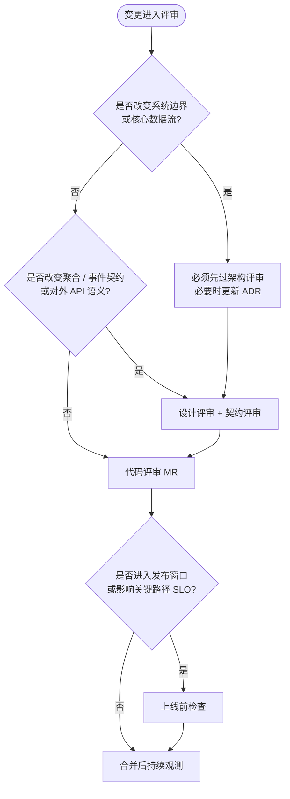

**导航**：[书籍主页](../README.md) | [完整目录](../SUMMARY.md) | [上一章：第5章](./chapter5.md) | [下一章：第7章](../part2/overview/chapter5.md)

---

# 第6章 架构质量保障

> 从设计评审到上线检查，建立架构落地的质量防线

---

## 4.1 为什么需要分阶段评审

软件工程里有一句常被引用的话：**好的代码是重构出来的，不是一次写出来的**。初稿几乎必然欠打磨，真正可靠的质量来自持续、有纪律的迭代。Code Review 把这种迭代前移到合并之前——它把个人习惯拉平到团队标准，把隐性知识显性化，把缺陷拦截在扩散之前。

然而，「随便看看」式的评审往往流于表面：有人只看风格，有人只看有没有明显 bug，有人被 diff 的噪声淹没。结果是：架构层面的失误晚到无法廉价修正，设计层面的模糊在代码里被放大成技术债，上线前才发现性能或可观测性缺口。

### 4.1.1 单次 PR 评审的认知陷阱

| 陷阱 | 典型表现 | 后果 |
|------|----------|------|
| **问题域混杂** | 在讨论 SQL 索引时顺便「拍板」限界上下文 | 决策缺少干系人与记录，后续反复 |
| **噪声淹没信号** | 2000 行 MR 里找架构问题 | 高风险项被 style nitpick 挤出注意力 |
| **缺少外部脚手架** | 依赖评审者当天状态 | 遗漏与团队经验强相关，不可复制 |

**Checklist 的价值**在于降低认知负荷：在疲劳、时间压力或上下文切换时，仍有一个外部脚手架防止遗漏。它并不替代经验与判断力——遇到清单未覆盖的灰区，恰恰说明团队应该把新教训**反哺**进清单或 ADR（Architecture Decision Record）。

### 4.1.2 四阶段评审：在正确时机问正确问题

本书建议按**四个阶段**组织评审，而不是在单次 PR 里眉毛胡子一把抓：

1. **架构评审**：新项目、新服务、新子域或大规模模块拆分——确认分层、边界、读写路径与技术选型。
2. **设计评审**：接口与模型冻结前——核对聚合、命令 / 查询、领域事件与模式选型是否与领域一致。
3. **代码评审**：日常 MR——用 SOLID、函数质量、命名、错误处理与依赖方向守住实现细节。
4. **上线前检查**：发布窗口——补齐性能、并发、可观测性、测试、回滚与文档。


### 4.1.3 运作建议：让清单「活」起来

- **责任人明确**：架构项由 Tech Lead / 架构负责人主评；设计项由领域 Owner 主评；PR 项由作者与至少一名熟悉该域的审阅者共担；上线前项与 SRE / On-call 对齐。
- **粒度分层**：巨型 MR 可先要求作者附「自审清单」勾选说明，再在评论里对争议点逐条引用章节编号，避免无结构的「感觉不对」。
- **与工具链结合**：复杂度、静态检查、依赖图、覆盖率门槛作为**门禁**；清单作为**人工语义层**补充（例如：覆盖率够了但测的是 happy path，仍需人眼过业务不变量）。
- **可追溯结论**：架构与设计阶段的结论落在 ADR、RFC 或设计文档；Code Review 只核对「实现是否背离结论」。PR 中发现架构级问题应**上升**到设计讨论，而不是在局部 hack 里修掉症状。

#### 团队实践案例

**案例 1：架构评审会的标准流程**（某电商团队实践）

**时机**：新服务立项、重大重构（影响 3+ 服务）、技术选型变更

**参与者**：
- **必需**：Tech Lead、系统负责人、相关团队代表
- **可选**：SRE（高可用关注）、DBA（存储关注）、安全（合规关注）

**流程**（60 分钟）：
1. **背景介绍（5分钟）**：系统负责人讲解业务背景、问题域、核心挑战
2. **架构方案宣讲（15分钟）**：分层、限界上下文、读写路径、技术选型
3. **质疑与讨论（30分钟）**：按 4.2 清单逐项检查，重点追问：
   - 依赖方向是否违反？
   - 边界划分是否合理？（参考第 2 章战略设计）
   - 读写比假设是否量化？
   - YAGNI 检查：是否过度设计？
4. **决策与记录（10分钟）**：
   - 通过 / 有条件通过 / 回炉重做
   - 记录到 ADR（Architecture Decision Record）
   - 指定 Follow-up 责任人

**输出示例**（ADR-015）：

```markdown
## ADR-015: 订单域引入 CQRS

### 状态
已批准（2026-04-15）

### 背景
订单查询（订单列表、详情、搜索）QPS 是写入的 50 倍；
当前写模型（含 JOIN）拖慢查询性能。

### 决策
引入 CQRS，读模型使用物化视图（MySQL）+ ES 索引。

### 方案
- 写模型：订单聚合 + Outbox 事件
- 读模型：订阅 OrderPlaced / OrderPaid 事件，更新 order_view 表与 ES
- 一致性：最终一致（可容忍 1-2 秒延迟）

### 风险与对策
- 风险：读写数据不一致
- 对策：对账任务（每小时），差异告警

### 评审结论
通过，需在 Q2 上线前完成性能压测。
```

---

**案例 2：设计评审中发现聚合边界过大**

**背景**：订单团队在设计评审时提交了一个 `Order` 聚合，包含订单基础信息、明细、支付记录、履约记录、售后记录。

**评审意见**：
- **问题**：聚合过大，任何字段变更都需要加载整个对象，性能差
- **追问**：「支付记录」是否需要和订单在同一事务中修改？
- **结论**：不需要——支付成功是外部事件触发，可以通过事件异步更新

**重构方案**：
- **Order 聚合**：订单基础信息 + 明细（需要强一致性）
- **Payment 聚合**：支付记录（独立生命周期）
- **Fulfillment 聚合**：履约记录（独立生命周期）
- **集成**：通过领域事件（`OrderPlaced`、`OrderPaid`）衔接

**收益**：订单聚合从平均 2KB 缩小到 500 字节，查询性能提升 4 倍。

---

**案例 3：PR 评审中拦截的架构违规**

**背景**：开发者在 HTTP Handler 中直接写 SQL，绕过了应用层。

**评审意见**：

```go
// ❌ 违反依赖方向
func HandleCreateOrder(w http.ResponseWriter, r *http.Request) {
    db := mysql.Default() // Handler 直接依赖基础设施
    _, _ = db.ExecContext(r.Context(), "INSERT INTO orders ...")
}
```

**处理流程**：
1. **识别问题**：违反 4.2.1 依赖方向检查
2. **上升讨论**：在 PR 中标记 `needs-architecture-review`
3. **解决方案**：
   - 定义应用层用例：`PlaceOrderUseCase`
   - 定义领域层端口：`OrderRepository`
   - Handler 只依赖应用层
4. **后续**：将此类问题补充到团队的「评审反模式」文档

**经验**：当 PR 中出现架构级违规时，不要在代码层面修修补补，而是**叫停并重新设计**。短期看延迟了交付，长期避免了技术债累积。

### 4.1.4 何时进入哪一阶段：决策树



---

## 4.2 架构评审阶段

**适用时机**：立项、新服务、新子域或大规模模块拆分。目标是在写大量代码之前，把**分层、边界、一致性、读写特征与技术选型**对齐。

### 4.2.1 分层结构检查

**标准**：是否明确定义 **Domain / Application / Adapter / Infrastructure**（或等价四层）？源代码依赖是否**一律指向内层**（Domain 为最内），外层通过接口向内依赖？

**反例（违反依赖方向）**：HTTP Handler 直接 `import` 具体 MySQL 驱动或 ORM 包，绕过应用服务与领域端口。

```go
// BAD: handler depends on concrete DB package
import "github.com/org/repo/infra/mysql"

func HandlePlaceOrder(w http.ResponseWriter, r *http.Request) {
    db := mysql.Default()
    _, _ = db.ExecContext(r.Context(), "INSERT INTO orders ...")
}
```

**合规方向**：Handler 只依赖应用层用例；持久化通过 **Repository 接口**在领域或应用边界声明，由 Infra 实现。

```go
// GOOD: handler -> application port -> domain; infra implements port
type PlaceOrderHandler struct {
    App *application.OrderService
}

func (h *PlaceOrderHandler) ServeHTTP(w http.ResponseWriter, r *http.Request) {
    cmd, err := decodePlaceOrder(r)
    if err != nil {
        http.Error(w, "bad request", http.StatusBadRequest)
        return
    }
    if err := h.App.PlaceOrder(r.Context(), cmd); err != nil {
        http.Error(w, err.Error(), http.StatusConflict)
        return
    }
    w.WriteHeader(http.StatusCreated)
}
```

| 检查点 | 通过标准 | 常见反模式 |
|--------|----------|------------|
| 依赖方向 | `domain` 不引用 `adapter` / `infra` | Handler 内写 SQL |
| 端口归属 | Repository 接口由内层拥有 | 接口定义在 `infra` 被 `domain` 引用 |
| 组装根 | `main` / `cmd` 完成绑定 | 在领域 `New*` 里创建具体 DB |

**评审追问**：若团队暂时未引入完整四层，是否至少在包级约定 **adapter 不得被 domain import**，并在 CI 用 `grep` / 自定义 linter 守护？

### 4.2.2 限界上下文验证

**标准**：是否识别 **核心域、支撑域、通用域**？每个 BC 是否有清晰的 **Ubiquitous Language** 与对外契约（API / 事件），避免「一个大而全的领域模型」？

**反例**：订单子域与库存子域共用同一个 `Product` 结构体，字段含义在两边互相拉扯。

```go
// BAD: one struct serves two contexts with conflicting meanings
type Product struct {
    ID           string
    Title        string
    PriceCent    int64 // pricing in order context
    WarehouseQty int   // stock in inventory context — coupling contexts
}
```

**合规 sketch**：不同 BC 使用不同模型与防腐层翻译；集成通过 API、消息或显式 ACL。

```go
// GOOD: separate models + explicit mapping at boundary
type catalog.ProductView struct{ ID, Title string }

type ordering.OrderLine struct {
    ProductID     string
    UnitPrice     Money
    SnapshotTitle string
}

type inventory.StockUnit struct {
    SKU    string
    OnHand int
}
```

| 检查点 | 通过标准 | 评审问题 |
|--------|----------|----------|
| 模型隔离 | 各 BC 有独立类型与映射层 | 是否共享「富模型」而非仅 ID？ |
| 契约稳定 | 对外 API / 事件有版本与兼容性策略 | 破坏性变更如何灰度？ |
| 语言一致 | `docs/glossary.md` 或等价物 | `Customer` 与 `User` 是否混用？ |

### 4.2.3 读写路径分析

**标准**：是否量化 **读写比**、延迟与一致性要求？读路径若存在重 JOIN、宽表、复杂筛选，是否考虑 **独立读模型 / 投影**，而不是全部堆在写模型上？

**反例**：在命令路径（下单）同步执行多表 JOIN 报表查询，拖慢写入尾延迟。

```go
// BAD: command handler does heavy read for side UI
func (s *OrderService) PlaceOrder(ctx context.Context, cmd PlaceOrderCommand) error {
    _ = s.db.QueryRowContext(ctx, `SELECT ... heavy join for dashboard ...`)
    return s.persistOrder(ctx, cmd)
}
```

```go
// GOOD: split; async projection or query DB
func (s *OrderService) PlaceOrder(ctx context.Context, cmd PlaceOrderCommand) error {
    if err := s.orders.Save(ctx, newOrderFrom(cmd)); err != nil {
        return err
    }
    return s.outbox.Publish(ctx, OrderPlaced{OrderID: cmd.IdempotencyKey})
}
```

| 检查点 | 通过标准 |
|--------|----------|
| 写路径 | 只持久化命令所需最小一致性数据 |
| 读路径 | 物化视图、搜索索引或专用查询服务 |
| 指标 | 是否测量 **p99 写延迟** 与 **读 QPS** |

**评审追问**：若读是写的两个数量级以上，独立读模型往往是经济解（与第 1 章 CQRS 呼应）。

### 4.2.4 技术选型审查

**标准**：存储与中间件是否与 **访问模式** 匹配（点查、范围扫、全文检索、图关系、流处理）？是否记录选型假设与回退方案？

| 维度 | 评审问题 |
|------|----------|
| 数据量与热点 | 预估行数、分区键、热点键 |
| 一致性 | 强一致 / 最终一致是否与业务容忍度一致 |
| 运维成本 | 备份、多 AZ、升级窗口 |
| 合规 | 留存周期、脱敏、跨地域 |

**反例**：全文搜索需求用 `MySQL LIKE '%keyword%'` 扛流量，缺少倒排索引与相关性能力。

#### 过度设计与 YAGNI（纳入技术选型同一关口）

**标准**：是否仅为**已确认**的变更点引入抽象？能否用更简单的模型先交付，再演化？

**反例**：典型 CRUD 后台强行上 **DDD + CQRS + Event Sourcing** 全家桶，团队无力维护投影与版本化事件。

**评审追问**：若去掉 Event Sourcing，业务是否仍成立？若答案是肯定的，则 ES 很可能是**可选优化**而非当前必需。CQRS 是否由**观测到的读写不对称**驱动，而不是由「流行架构标签」驱动？

---

## 4.3 设计评审阶段

**适用时机**：接口评审、领域模型评审、用例与事件清单冻结前。目标是让 **战术设计**（聚合、Repo、Command / Query、事件）与战略分层一致。

### 4.3.1 聚合边界检查

**标准**：**一致性边界**是否以聚合为单位设计？是否避免在单个事务中强行修改多个聚合根，除非有显式的领域规则与补偿策略？

**反例**：一个数据库事务内同时更新 `Order` 与 `Inventory` 聚合，绕过领域事件与最终一致性。

```go
// BAD: one transaction mutates two aggregates directly
func SaveOrderAndDeductStock(ctx context.Context, tx *sql.Tx, o *Order, inv *Inventory) error {
    if err := persistOrder(tx, o); err != nil {
        return err
    }
    inv.Quantity -= o.LineItems[0].Qty
    return persistInventory(tx, inv)
}
```

| 检查点 | 通过标准 |
|--------|----------|
| 聚合根入口 | 外部只能通过根修改状态 |
| 一事务一根 | 跨聚合协作走事件 + 最终一致（或已文档化的 Saga） |
| 暴露集合 | 不返回可变内部 slice 引用 |

**聚合根识别补充**：外部代码禁止绕过根直接改内部实体（如导出 `[]*OrderLine` 被外部改 `Qty`）。若根方法数量爆炸，区分是**聚合过大**还是缺少**领域服务**。

**实体与值对象（本小节一并核对）**：实体有稳定标识、状态变更走受控方法；值对象**不可变**、按值相等；`Money` 等禁止提供可变 setter，对外构造函数保证合法组合。

### 4.3.2 命令查询分离验证

#### Command 设计

**标准**：命令是否表达 **业务意图**（`PlaceOrder`、`CancelSubscription`），而不是贫血 CRUD（`UpdateOrder` + 任意 `map`）？

```go
// BAD: command is just a data bag
type UpdateOrderCommand struct {
    OrderID string
    Patch   map[string]any
}
```

```go
// GOOD: explicit intent
type PlaceOrderCommand struct {
    CustomerID     string
    Items          []OrderItemDTO
    IdempotencyKey string
}
```

| 检查点 | 通过标准 |
|--------|----------|
| 语义 | 动词 + 业务名词，可映射到用例 |
| 幂等 | 携带幂等键 / 乐观锁（如需要） |
| 失败语义 | 可映射为明确业务结果，而非一律 500 |

**Repository（与命令 / 查询配套检查）**：接口定义在**领域层**；方法名表达业务需要（`FindActiveByCustomer`）而非表驱动；复杂筛选优先归入 **Query 侧**，避免 `Repository` 万能方法膨胀。

#### Query 设计

**标准**：查询是否**直接返回 DTO / 读模型**，**不强行加载完整领域图**？是否避免在查询路径上触发写模型副作用？

```go
// BAD: query returns rich aggregate for read-only UI
func (s *QueryService) OrderForUI(ctx context.Context, id string) (*domain.Order, error) {
    return s.orders.LoadFullGraph(ctx, id)
}
```

```go
// GOOD: dedicated read DTO
type OrderSummaryDTO struct {
    OrderID   string
    Status    string
    TotalCent int64
    PlacedAt  time.Time
}
```

### 4.3.3 领域事件设计

**标准**：关键业务状态变更是否发布 **领域事件**？命名是否使用 **过去式**（`OrderPlaced`、`PaymentCaptured`）并携带必要上下文（版本、发生时间）？

```go
// BAD: imperative name
type PlaceOrder struct{ OrderID string }

// GOOD: past tense, domain vocabulary
type OrderPlaced struct {
    OrderID    string
    OccurredAt time.Time
    Version    int
}
```

| 检查点 | 通过标准 |
|--------|----------|
| 命名 | 过去式 + 领域词汇 |
| 载荷 | 消费者演进所需字段（版本、关联 ID） |
| 投递 | Outbox / 至少一次 + 消费者幂等 |

### 4.3.4 模式选型审查

详设阶段可快速对照下表，避免「每个地方都 if-else」或「每个地方都上框架」。

| 场景特征 | 推荐模式 | 说明 |
|----------|----------|------|
| 多步骤顺序流程 | Pipeline（管道） | 与第 3 章 Pipeline 呼应 |
| 同一接口多种实现 | 策略模式 | 扩展点清晰 |
| 频繁变化的业务规则 | 规则引擎 / 规则表驱动 | 需版本化与评审 |
| 跨聚合协作 | 领域事件 + Outbox | 与第 1 章 Outbox 呼应 |

**反例**：全系统统一 `RuleEngine.Execute(ctx, ruleSetID, facts)`，但规则集无人版本化与评审，线上等于「可执行的配置漂移」。

**合规**：规则变更走 **PR + 审计 + 影子流量**；核心不变量仍保留在代码与单测中，引擎只编排**可变的参数化策略**。

---

## 4.4 代码评审阶段

**适用时机**：每次合并请求。把设计约束落到 **Go 代码**的可观察性质上。

### 4.4.1 SOLID 原则检查

对每一项，用「一句检查问句」把握核心；争议点再用第 1 章分层与端口对齐。

| 原则 | 检查问句 | 典型反例 | 合规方向 |
|------|----------|----------|----------|
| **S** | 该类型是否只有一个变化理由？ | `OrderService` 又发邮件又导 CSV | 按职责拆服务 |
| **O** | 扩展新行为是否无需改稳定路径？ | `switch payment` 无限增长 | `PaymentGateway` 接口 + 多实现 |
| **L** | 实现是否可替换且不 surprise？ | `Charge` 静默成功 | 显式 Fake / 诚实错误 |
| **I** | 客户端是否不被迫依赖不需要的方法？ | `Storage` 胖接口 | `Reader` / `Writer` 隔离 |
| **D** | 高层是否依赖抽象？ | `NewApp` 内 `sql.Open` | 构造注入 `Repository` |

**DIP 延伸——包级依赖方向**：`domain` 不 import `adapter` / `infra`；`application` 不直接引用 HTTP、ORM、消息 SDK；无循环依赖（必要时提取 `domain/sharedkernel` 最小类型）。`go list -deps` 或 IDE 依赖图可抽查。

**LSP 反例 sketch**：

```go
// BAD: implementation surprises caller
type NoOpPaymentGateway struct{}
func (NoOpPaymentGateway) Charge(ctx context.Context, amount int64) error {
    return nil // silently skips payment
}
```

### 4.4.2 函数质量审查

| 维度 | 阈值 / 标准 | 工具或手段 |
|------|-------------|------------|
| 长度 | 单函数宜 < 80 行 | 拆私有步骤或 Pipeline 阶段 |
| 圈复杂度 | < 10（团队可校准） | `golangci-lint` / `gocyclo` |
| 嵌套深度 | < 3 | Guard clause 早返回 |
| 参数个数 | < 5 | Options 结构体或 functional options |

```bash
gocyclo -over 10 ./...
```

```go
// GOOD: named steps keep orchestration readable
func (h *PlaceOrderHandler) ServeHTTP(w http.ResponseWriter, r *http.Request) {
    ctx := r.Context()
    if err := h.ensureAuth(ctx, r); err != nil {
        h.writeErr(w, err)
        return
    }
    cmd, err := h.decode(r)
    if err != nil {
        h.writeErr(w, err)
        return
    }
    if err := h.app.PlaceOrder(ctx, cmd); err != nil {
        h.writeErr(w, err)
        return
    }
    w.WriteHeader(http.StatusCreated)
}
```

**评审追问**：`context.Context` 是否作为 **第一个参数** 传递 I/O 边界函数，而不是塞进结构体字段隐式携带？

### 4.4.3 命名与可读性

1. **变量 / 函数名反映业务术语**：名称来自 **Ubiquitous Language**，而非数据库列名机械翻译。
2. **团队内一致**：同一概念只有一个词（`Customer` vs `User` 要治理）。
3. **避免技术术语代替业务术语**：不用 `SetStatus(1)`，而用 `MarkShipped()`。

```go
// BAD: magic status
func (o *Order) SetStatus(s int) { o.status = s }

// GOOD: business verb
func (o *Order) MarkShipped(at time.Time) error {
    if o.status != StatusPaid {
        return ErrInvalidStateTransition
    }
    o.status = StatusShipped
    o.shippedAt = at
    return nil
}
```

### 4.4.4 错误处理验证

1. **禁止静默忽略错误**：是否存在 `_ = xxx` 或空白 `if err != nil { }`？
2. **错误 wrap 携带上下文**：跨层 `fmt.Errorf("place order: %w", err)`。
3. **区分业务错误与系统错误**：调用方能否区分「库存不足」与「应重试的基础设施错误」？

```go
var ErrOutOfStock = errors.New("out of stock")

func (s *InventoryService) Reserve(ctx context.Context, sku string, qty int) error {
    if qty > available(sku) {
        return fmt.Errorf("reserve %s: %w", sku, ErrOutOfStock)
    }
    return nil
}
```

#### DDD 战术与聚合不变量（与错误语义一并核对）

**聚合不变量 sketch**：

```go
func (o *Order) AddLine(sku string, qty int, unitCent int64) error {
    if qty <= 0 {
        return ErrInvalidQty
    }
    if o.status != StatusDraft {
        return ErrOrderNotEditable
    }
    lineTotal := unitCent * int64(qty)
    if lineTotal < 0 {
        return ErrOverflow
    }
    o.lines = append(o.lines, OrderLine{SKU: sku, Qty: qty, UnitCent: unitCent})
    o.totalCent += lineTotal
    return nil
}
```

---

## 4.5 上线前检查

**适用时机**：发布分支、灰度前、重大重构合并前。与功能完成度无关的「生产就绪」项在此收敛。

### 4.5.1 性能与并发

**性能**：

- 关键路径是否有 **benchmark** 或压测基线？
- 是否关注 **alloc/op**、GC 停顿、锁竞争（`mutex` profile）？
- 异步路径是否避免**无界队列**导致内存膨胀？

```go
func BenchmarkPlaceOrder(b *testing.B) {
    b.ReportAllocs()
    for i := 0; i < b.N; i++ {
        // exercise hot path
    }
}
```

**并发安全**：

```go
// BAD: unsynchronized map writes
var cache = map[string]int{}
func Set(k string, v int) { go func() { cache[k] = v }() }

// GOOD: mutex or single-owner goroutine
type SafeCache struct {
    mu sync.RWMutex
    m  map[string]int
}
```

| 检查点 | 通过标准 |
|--------|----------|
| 数据竞争 | `go test -race` 纳入 CI 或发布前门禁 |
| 泄漏 | 长测采样 `NumGoroutine`；channel 不阻塞在默认分支 |
| 锁内 I/O | 避免在持锁时调用慢外部依赖 |

### 4.5.2 可观测性

**标准**：**metrics**（RED / USE）、**trace**（关键 span）、**结构化日志**（`request_id`、`order_id` 等关联字段）。

```go
logger.Info("order_placed",
    "order_id", orderID,
    "customer_id", customerID,
    "duration_ms", elapsed.Milliseconds(),
)
```

| 检查点 | 通过标准 |
|--------|----------|
| 日志 | 键值字段可查询，而非仅拼接长句 |
| 链路 | 跨服务传播 trace 上下文 |
| SLO | 新路径有指标与告警阈值 |

### 4.5.3 测试覆盖

**标准**：核心业务规则覆盖率按团队约定（例如 **> 80%**）；**集成测试**覆盖仓储、消息、外部 HTTP 的 fake / 容器。

| 检查点 | 通过标准 |
|--------|----------|
| 边界 | 表格驱动覆盖错误路径 |
| Flaky | 修复或隔离，避免 `t.Skip` 永久化 |
| 语义 | 覆盖不变量，而非仅「能跑通」 |

```go
func TestPlaceOrder_OutOfStock(t *testing.T) {
    t.Parallel()
    // arrange: 0 stock -> expect ErrOutOfStock
}
```

### 4.5.4 回滚方案

**标准**：**feature flag** 或配置开关；**数据库迁移**可回滚或具备向前兼容的双写 / 双读；事件 schema **向后兼容**或双写新字段。

#### 回滚方案检查清单

| 维度 | 检查项 | 通过标准 |
|------|--------|----------|
| **代码回滚** | Feature Flag | 关键功能可通过配置开关禁用，无需重新发布 |
| **数据库迁移** | 双向脚本 | UP/DOWN 脚本齐全，测试过回滚流程 |
| **事件 Schema** | 向后兼容 | 新增字段可选，旧消费者不受影响 |
| **API 兼容性** | 版本策略 | 新版本 API 与旧版本共存，客户端可选升级 |
| **配置变更** | 灰度发布 | 配置分批推送，每批观察指标后再继续 |
| **依赖服务** | 降级预案 | 下游服务故障时，上游可降级（返回默认值/缓存） |

#### Feature Flag 实践

```go
// 使用 Feature Flag 控制新功能
package order

import "context"

type FeatureFlags interface {
    IsEnabled(ctx context.Context, feature string) bool
}

func (s *OrderService) PlaceOrder(ctx context.Context, cmd PlaceOrderCommand) error {
    // 旧逻辑
    if err := s.validateBasic(cmd); err != nil {
        return err
    }
    
    // 新功能：风控检查（可通过 Feature Flag 关闭）
    if s.flags.IsEnabled(ctx, "order.fraud_detection") {
        if err := s.fraudDetector.Check(ctx, cmd); err != nil {
            return err
        }
    }
    
    return s.repo.Save(ctx, newOrderFrom(cmd))
}
```

**收益**：
- 新功能上线后发现问题，可立即关闭 Feature Flag，无需回滚代码
- 灰度发布：先对 5% 用户开启，观察指标后再逐步放量
- A/B 测试：对不同用户群开启不同策略，对比效果

---

**文档与运维**：架构变更（新 BC、事件契约、SLA）同步到 **README / ADR / 运维手册**；On-call 知道降级、重放消息、解读关键告警；新人能仅凭文档拉起本地依赖（`docker-compose` / `make` 目标）。

**运维文档模板**：

```markdown
## 服务运维手册

### 关键告警
- `order_create_latency_p99 > 500ms`：订单创建延迟过高
  - **可能原因**：数据库慢查询、库存服务超时
  - **处理步骤**：
    1. 查看 Grafana 面板确认瓶颈（DB/库存/计价）
    2. 若库存服务超时，执行降级：`kubectl set env deployment/order INVENTORY_FALLBACK=true`
    3. 通知库存团队排查

### 降级开关
- `INVENTORY_FALLBACK=true`：库存查询降级，使用本地缓存
- `FRAUD_DETECTION=false`：关闭风控检查（紧急情况）
- `PROMOTION_ENABLED=false`：关闭营销试算（性能问题）

### 回滚流程
1. 确认回滚目标版本：`kubectl rollout history deployment/order`
2. 执行回滚：`kubectl rollout undo deployment/order --to-revision=N`
3. 观察监控：关注错误率、延迟、上下游调用
4. 数据库回滚（如需要）：执行 DOWN 脚本
```

---

## 4.6 本章小结

### 4.6.1 全阶段总览表（评审清单）

| 阶段 | 必查项（高杠杆） |
|------|------------------|
| 架构评审 | 依赖向内、BC 划分、聚合边界、读写评估、YAGNI |
| 设计评审 | 聚合根入口、值对象不可变、Repo 在领域层、Command 意图、领域事件 |
| 代码评审 | SRP、函数规模与复杂度、业务命名、错误 wrap、依赖方向 |
| 上线前 | Benchmark / 压测证据、并发与 race、可观测性、测试与集成、回滚与文档 |

### 4.6.2 MR 描述区模板（可复制）

```markdown
## Self review (author)
- [ ] 4.4 SOLID: 新类型职责与扩展点合理
- [ ] 4.4 函数长度 / 复杂度 / 嵌套 / 参数个数
- [ ] 4.4 命名与 glossary 一致
- [ ] 4.4 错误 wrap，无静默 `_ = err`
- [ ] 4.4 依赖方向与 DDD 战术（不变量、VO）

## Release readiness (if applicable)
- [ ] 4.5 Benchmark 或压测链接
- [ ] 4.5 并发 / race 检查
- [ ] 4.5 Metrics + logs + traces
- [ ] 4.5 核心规则测试与集成测试
- [ ] 4.5 回滚 / 迁移 / 双写方案
- [ ] 4.5 文档 / ADR 更新

## Design links
- ADR / RFC: ...
```

### 4.6.3 实战案例与反模式

#### 案例 A：库存预占接口「顺手」改了聚合边界（设计评审失效）

**背景**：结算服务在「创单前预占」需求中，直接在订单聚合的事务内更新库存行，图省事。

**症状**：大促锁竞争升高；库存与订单发布节奏耦合，回滚困难。

**处理**：设计评审阶段强制改为 **OrderPlaced / ReserveStockRequested** 事件驱动或显式 Saga；代码评审拦截「双聚合同一事务」。

#### 案例 B：营销规则 JSON 线上漂移（模式选型 + 运维失守）

**背景**：规则引擎读取未版本化的 JSON，运营后台可直接保存到生产。

**症状**：线上行为与测试环境不一致，难以复盘。

**处理**：规则集 **版本号 + PR 审核 + 审计日志**；核心不变量仍在单测与代码中；影子流量验证。

#### 案例 C：Handler 直连 DB（架构评审后置到 PR）

**背景**：原型代码直接进入主干，后续 MR 只在 SQL 层修修补补。

**症状**：领域规则散落在 SQL；单测必须起库。

**处理**：上升架构评审，引入 **端口 + 用例**；本 MR 仅允许「垂直切片」式重构到合规结构，不接受继续堆 SQL。

---

#### 案例 D：缺少性能测试导致的线上故障

**背景**：订单服务上线了「批量取消」功能，代码评审通过，但未做性能测试。

**线上故障**：
- 运营同学一次性取消 5000 个订单
- 服务在循环中逐个发送取消事件到 Kafka，耗时 30 秒
- 期间所有订单查询请求超时（共享同一个 goroutine 池）
- 用户投诉量激增

**根因分析**：
- **代码评审通过**：功能逻辑正确，无明显bug
- **缺失上线前检查**：没有性能测试，没有评估「批量场景下的资源占用」

**改进方案**：
1. 补充 4.5.1 性能检查：批量操作必须有 Benchmark
2. 异步化：批量取消改为后台任务，分批处理（每批 100 个）
3. 限流：批量接口加频控，防止运营误操作

**经验**：代码评审通过≠生产就绪。上线前检查（4.5）是最后一道防线，必须覆盖性能、并发、可观测性。

---

#### 案例 E：聚合不变量在 PR 中被破坏

**背景**：订单聚合有不变量「总价 = 各明细之和」，某次 PR 为了修复 bug，直接修改了 `TotalAmount` 字段。

**代码变更**：

```go
// BAD: 直接修改总价，破坏不变量
func (o *Order) ApplyDiscount(amount int64) {
    o.TotalAmount -= amount // ❌ 绕过了明细，破坏一致性
}
```

**后果**：
- 订单详情页显示的小计与总价不一致
- 财务对账时发现差异，追溯到这次变更

**评审反思**：
- **设计评审阶段**应明确聚合不变量（4.3.1）
- **代码评审阶段**应检查是否有直接修改聚合字段的行为
- **测试**应覆盖不变量（如 `assert(order.Total == sum(order.Lines))`）

**正确方案**：

```go
// GOOD: 通过明细修改，自动更新总价
func (o *Order) ApplyDiscountToLine(lineIndex int, discountAmount int64) error {
    if lineIndex >= len(o.Lines) {
        return ErrInvalidLineIndex
    }
    o.Lines[lineIndex].UnitPrice -= discountAmount
    o.recalculateTotal() // 重新计算总价，保证不变量
    return nil
}

func (o *Order) recalculateTotal() {
    total := int64(0)
    for _, line := range o.Lines {
        total += line.UnitPrice * int64(line.Qty)
    }
    o.TotalAmount = total
}
```

---

#### 案例 F：缺少回滚方案的数据库迁移

**背景**：库存服务需要新增字段 `reserved_qty`，开发者提交了 PR 包含数据库迁移脚本。

**问题**：
- **只有 UP 脚本**，没有 DOWN 脚本（无法回滚）
- **没有双写策略**：新代码直接依赖新字段，回滚时会报错

**线上故障**：
- 新版本上线后发现性能问题，需要回滚
- 回滚代码后，服务启动失败（读取不存在的字段）
- 被迫紧急修复：手动删除字段、重新上线旧版本

**改进方案**（4.5.4 回滚方案）：
1. **三阶段迁移**：
   - 阶段 1：加字段，代码双写（写新旧两个字段），读旧字段
   - 阶段 2：代码切换为读新字段
   - 阶段 3：删除旧字段
2. **每阶段可独立回滚**：任何一步出问题都能回到上一阶段
3. **UP/DOWN 脚本齐全**：迁移工具（如 migrate）强制要求两个方向

**评审清单补充**：
- [ ] 数据库迁移是否有 DOWN 脚本？
- [ ] 新字段是否通过双写 / 双读策略引入？
- [ ] 回滚后服务是否仍能正常启动？

### 4.6.4 按角色的最小阅读路径

| 角色 | 建议优先阅读 |
|------|----------------|
| 作者（提 MR） | 4.4 全文 + 4.6.2 模板 |
| 审阅者（同域） | 4.4.3–4.4.5 + 与 4.3 冲突点 |
| Tech Lead（新模块） | 4.2、4.3 + 4.5 |
| SRE / On-call | 4.5 + 事件与迁移说明 |

### 4.6.5 核心要点

系统化的 Code Review 不是挑剔，而是**把重构前移到成本最低的阶段**。按 **架构 → 设计 → 代码 → 上线前** 四段清单推进，并与第 1 章方法论、第 2 章战略设计、第 3 章战术实现交叉引用，团队可以在一致语言下讨论分层、边界与实现细节。建议将 **4.6.1** 嵌入 MR 模板，并在复盘时根据失效案例增补**第 21 条**——最好的 Checklist 永远是活文档。

---

**导航**：[返回目录](../SUMMARY.md) | [上一章：第5章](./chapter5.md) | [书籍主页](../README.md) | [下一章：第7章](../part2/overview/chapter5.md)
