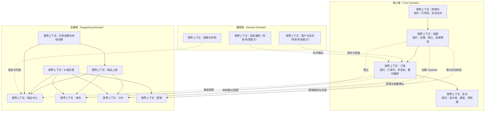
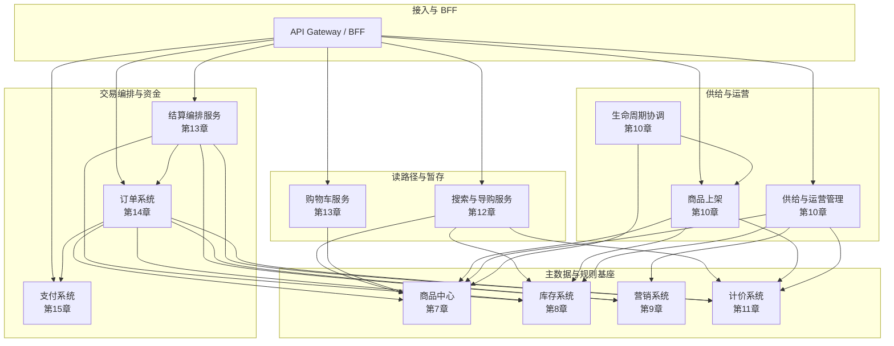
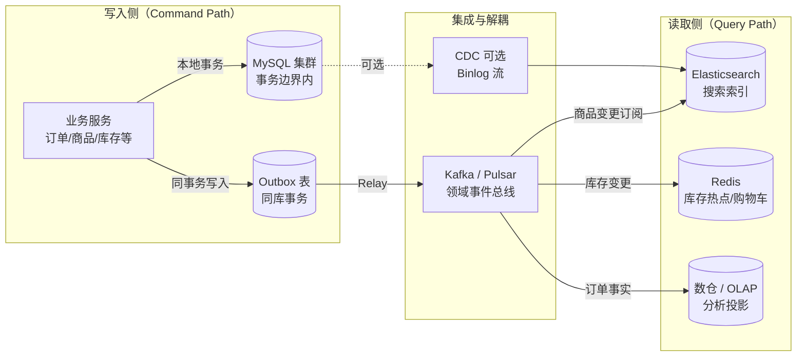
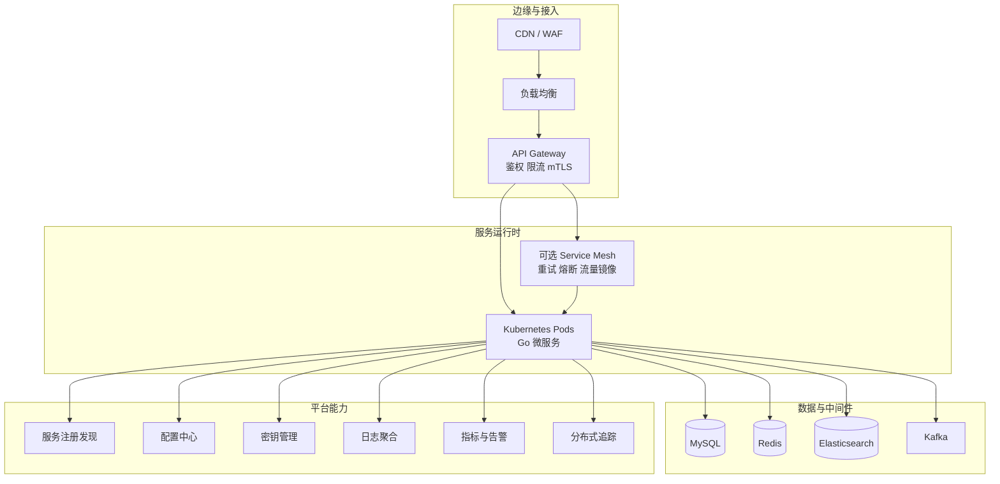
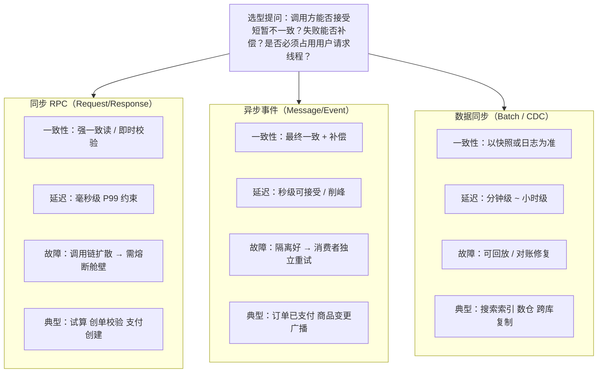
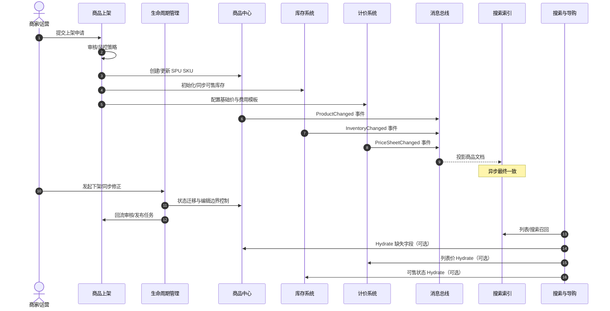
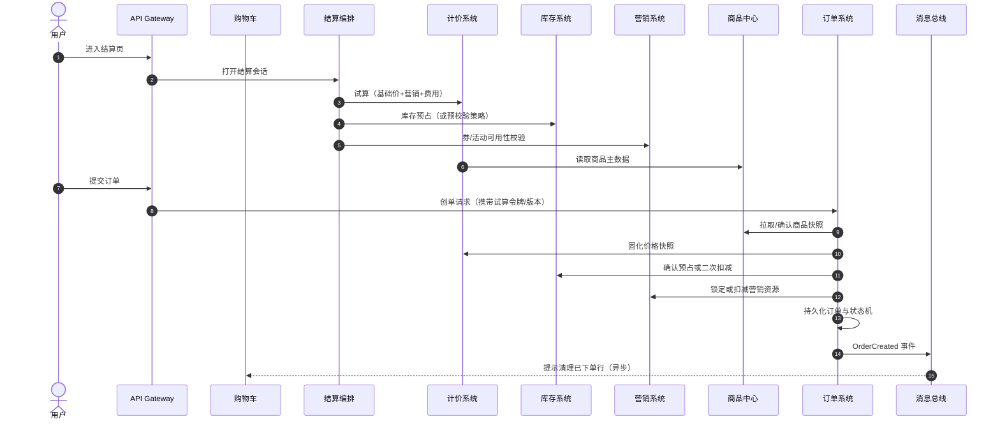
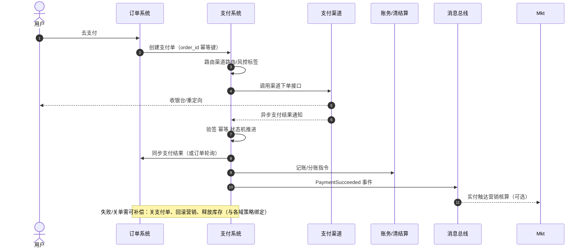

**导航**：[书籍主页](../../README.md) | [完整目录](../../SUMMARY.md) | [上一章：第6章](../../part1/chapter6.md) | [下一章：第8章](../supply/chapter7.md)

---

# 第7章 电商系统全景图

> 本章定位：在读完第一部分的方法论之后，进入第二部分「电商核心系统设计」之前，用一张**可落地的全景图**把业务能力、应用系统、数据资产与技术基础设施对齐到同一坐标系。后续第 8 章至第 16 章将沿本章划定的边界逐域深入；第 4 章已经从方法论层面讨论了跨系统集成与一致性模式。

**阅读建议**：若你已熟悉 DDD 战略术语，可快速浏览 5.2 后进入 5.1 的图示；若你更习惯从接口与数据表入手，建议从 5.1.3 数据架构读起，再回到 5.1.1 校正业务语义。无论哪种路径，都请至少完成 5.4 的三条时序走读，因为后续各章的「集成小节」默认你已经知道**主链路的参与者与先后次序**。

**本章产出物（可用于团队对齐）**：

1. 一页 **限界上下文图**（5.1.1）贴在内网架构 wiki。  
2. 一张 **服务依赖图**（5.1.2）导入架构治理工具（如 Backstage / 内部 CMDB）。  
3. 一份 **主数据清单**（5.1.3 表格）作为数据 Owner 会议的输入。  
4. 一套 **集成模式评审话术**（5.3）写进 RFC 模板。  
5. 一张 **十二系统职责表**（5.5.1）作为新人 Onboarding 必读。

---

## 5.1 系统全景架构

中大型电商平台的架构讨论，如果只停留在「微服务拆分清单」，很容易失去业务语义；如果只停留在「业务功能列表」，又难以指导工程依赖与数据落点。实践中常用 **EA（企业架构）+ 4A** 的多视角方法并行：

| 视角 | 英文缩写 | 回答的问题 | 本章对应小节 |
|------|----------|------------|----------------|
| 业务架构 | BA（Business Architecture） | 平台提供哪些业务能力？投资优先级如何？ | 5.1.1 |
| 应用架构 | AA（Application Architecture） | 系统如何划分？依赖方向与编排关系？ | 5.1.2 |
| 数据架构 | DA（Data Architecture） | 主数据、索引、缓存、事件各自承担什么角色？ | 5.1.3 |
| 技术架构 | TA（Technology Architecture） | 运行时、中间件、可观测性与安全如何承载上述系统？ | 5.1.4 |

下面四节分别给出图示与解读要点。图示刻意与后续各章的术语保持一致，便于你在阅读第 7 章至第 15 章时「对照地图」。

**与博客文章《电商系统设计（一）：全景概览与领域划分》的关系**：原文从 EA + 4A 视角给出了高质量的全景素材与系列文章索引；本书第 5 章在此基础上做了三件事——**按书籍目录重排小节编号**；把 C 端读路径（搜索、购物车）与**结算编排**显式画入应用架构；把**十二个核心系统**与第 7 章至第 15 章的章节锚点一一对齐，便于纸质阅读时的交叉引用。若你在网上已读过该文，可把本章视为其**书籍化、边界化、评审化**的增强版。

**术语对照（避免口语歧义）**：

| 口语 | 本书用语 | 说明 |
|------|----------|------|
| 价格中心 / 促销算价 | 计价系统 + 营销系统 | 「谁制定规则、谁做试算快照」应分开讨论。 |
| 交易中心 | 订单 + 结算 + 购物车 | 交易是链路，不是单服务。 |
| 上架后台 | 商品上架 + 运营平台 | 流程编排与批量工具职责不同。 |
| 搜索推荐 | 搜索与导购（第 12 章） | 推荐可作为子模块，但集成模式与搜索高度相似。 |

**从单体到分布式的认知迁移**：在单体时代，模块边界靠包名与 Code Review 维持；在分布式时代，**网络边界会放大设计缺陷**——原本一次函数调用的地方，变成了超时、重试与部分失败。因此全景章的价值，不在于「数有多少个微服务」，而在于为每个跨边界调用预先分配 **一致性语义、超时预算与观测标签**。当你在第 14 章阅读订单状态机时，应能指出：某次迁移对应 5.4.2 中的哪一步、失败时由谁补偿。

### 5.1.1 业务架构（DDD 视角）

从 DDD 战略设计看，电商平台的业务能力应被组织为一组**限界上下文（Bounded Context）**：每个上下文内部有独立的通用语言与生命周期；上下文之间通过显式关系（客户方 / 供应方、防腐层、发布语言等）协作。下图用「限界上下文 + 域分类」表达业务架构，颜色区分**核心域、支撑域、通用域**（分类标准与第 2 章 2.5 节一致，此处侧重**系统级**映射）。



**读图要点**：

1. **核心域**集中了「钱与承诺」相关的上下文：购物车暂存购买意图，结算把意图推进为**可支付**的约束集合（价格、库存、优惠），订单把承诺**持久化**为合同，支付完成资金侧的闭环。
2. **支撑域**提供可售性、可算价、可营销、可供给四类「规则与主数据」能力；它们高度影响交易，但行业模式相对可参照。
3. **通用域**中的搜索本书会深入（第 12 章），因其在工程上与商品、计价、库存的 **Hydrate 编排**强耦合；用户与消息等更常采购标准方案，在全景中保留接口位即可。

**上下文映射（与第 2 章衔接）**：上图中实线箭头多表示「客户方依赖供应方」的下游调用关系；虚线表示「通过发布语言（Published Language）或 ACL 防腐」的弱耦合。落地时建议显式标出：

- **供应方（Upstream）**：商品中心对「商品快照 ID」、计价系统对「价格快照版本」、库存对「预占凭证」拥有定义权。  
- **客户方（Downstream）**：订单与结算消费上述契约，但不应要求供应方暴露内部表结构。  
- **防腐层（ACL）**：对接供应商、旧单体或外采营销引擎时，把外部模型挡在边界之外，避免污染核心域通用语言。

**答辩提示**：业务架构图的表述模板已统一收录到[附录B](../../appendix/interview.md)。

### 5.1.2 应用架构（微服务视角）

应用架构关注**可部署单元**之间的依赖。原则是：**依赖方向自上而下、由稳定侧指向易变侧**，避免出现「基础数据服务回调订单服务」这类环。下图在博客原文分层思路上，补全 C 端读路径（搜索、购物车）与结算编排，并标注后续章节编号，便于索引。



**依赖解读**：

- **商品中心**是多数读路径与订单快照的**事实来源（System of Record for catalog）**；库存、计价、营销在各自上下文内维护规则，但在创单链路上被订单编排调用。
- **结算服务**常实现为独立部署的「长事务 / Saga 编排器」，在应用层与购物车解耦：购物车偏会话与展示，结算偏资源锁定与一致性门槛（详见第 13 章）。
- **上架、运营、生命周期**在应用层可能合并为一个「供给平台」团队维护的多个服务，逻辑上仍建议按限界上下文拆分数据与发布节奏（第 10 章展开）。

**典型调用链（便于与 5.4 对照）**：

| 用户意图 | 入口服务 | 同步扇出（节选） | 异步副作用（节选） |
|----------|----------|------------------|---------------------|
| 搜索列表 | 搜索与导购 | 商品中心、计价、库存 Hydrate | 曝光日志、排序特征回流 |
| 加购 | 购物车 | 商品中心校验 SKU | 无或弱：会话写 Redis |
| 打开结算页 | 结算编排 | 计价试算、库存预占、营销校验 | 审计日志、风控评分 |
| 提交订单 | 订单系统 | 快照固化、库存确认、营销扣减 | `OrderCreated` 驱动清购物车、发券统计 |
| 去支付 | 支付系统 | 渠道路由、收银台创建 | `PaymentSucceeded` 驱动分账、消息触达 |

**循环依赖治理**：若发现「商品中心回调订单」一类需求，优先改为**事件订阅**或**查询倒置**（由订单侧拉取快照），而不是在数据层打开反向通道。

### 5.1.3 数据架构

数据架构回答三件事：**主数据放哪、派生数据如何构建、事件与缓存如何对齐**。下图描述一条典型的「写主库、异步投影、读多路」路径，与第 1 章 CQRS 与 Outbox 思路衔接。



**落地要点**：

1. **订单、支付、商品主档**等强一致实体以 MySQL（或同类）为权威存储；跨聚合协作优先 **Outbox + 消息**（见第 1 章 1.3.9），避免「双写」在故障时无法对账。
2. **搜索索引、推荐特征、报表**属于派生视图，允许**最终一致**；延迟由业务容忍度与补偿任务共同约束。
3. **库存**常见「Redis 扛热点 + MySQL 审计」的双存储形态，必须单写者（Single Writer）与周期对账（第 8 章）。

**主数据与派生数据清单（评审用）**：

| 数据类型 | 权威存储 | 常见派生副本 | 一致性策略 |
|----------|----------|--------------|------------|
| 商品主档 | MySQL（商品中心库） | ES 文档、CDN 静态化、本地缓存 | Outbox / CDC → 最终一致 |
| 价格规则与快照 | MySQL + 计价服务缓存 | 订单行上的快照 JSON | 创单时以订单持久化为准 |
| 可售库存 | Redis 计数 + MySQL 流水 | 搜索侧的「是否有货」标签 | 单写者 + 定时对账 |
| 订单合同 | MySQL（订单库） | 数仓订单事实表、客服只读库 | Binlog / 事件双播 |
| 支付单与账务 | MySQL（支付库） | 渠道对账文件、会计凭证 | T+0 / T+1 对账任务 |

**数据所有权一句话**：谁对「业务不变量」负责，谁就拥有该数据的写入 API；其余路径只能投影或引用。

**离线数仓与实时数仓的边界**：订单与支付事件进入数仓后，用于分析与风控建模，**不得反向写回在线交易库**作为业务依据；若运营需要「实时看板」，应通过专用 OLAP 或流式聚合服务读取消息总线，而不是直接查询订单主库拖垮 P99。若确需运营干预线上数据，应走带审批的正式 API 与审计日志，而不是「数仓导表回灌」。这类约束也是第 4 章上线前检查中「数据变更路径」的必审项。

### 5.1.4 技术架构

技术架构把应用服务映射到运行时与平台能力：流量入口、服务通信、数据存储、异步集成、可观测性与零信任边界。下图为参考拓扑，实际规模会按环境裁剪。



**与后续章节的关系**：第 7 章至第 15 章主要在**应用与数据架构**层面展开；当你评估「是否需要 Service Mesh」「Kafka 分区策略」时，应回到本节检查**观测性是否先于网格**、**消息是否已成为事实管道**等平台前提。

**非功能需求（NFR）与全景的对应关系**：

- **可用性**：网关限流与服务熔断保护核心交易路径；搜索与报表故障不得拖垮创单。  
- **性能**：读路径大量使用缓存与索引；写路径控制扇出深度，结算页试算可合并批量 RPC（第 13 章）。  
- **安全**：密钥不进仓库；支付回调验签在独立模块；内部服务 mTLS 或网络策略隔离。  
- **可观测性**：以 `trace_id` 贯穿网关、结算、订单、支付；对 Saga 每一步有结构化日志与业务指标（转化率、预占失败率）。  
- **合规与审计**：订单与支付字段变更可追溯；营销补贴与实付金额可对账。

**渐进式演进建议**：早期可用「单体 + 清晰包边界」模拟上图拓扑；当团队规模与发布冲突上升时，再按限界上下文拆出独立部署单元，避免「先拆微服务、后补边界」的高成本路径。

**容灾与多活（点到为止）**：技术架构图未展开「单元化 / 多 Region」，但在全景阶段应预留认知：订单与支付数据往往要求 **Region 内强一致 + 跨 Region 异步复制**；搜索索引与购物车会话更适合 **就近读取**。若在多活场景下仍沿用单 Region 的强同步调用链，容灾切换时容易遭遇「依赖未起、核心不可用」；因此第 4 章在谈 Saga 时也会隐含「地理边界上的超时预算」问题。

---

## 5.2 核心域与支撑域

DDD 强调：**不是所有子域都值得同等投入**。战略设计的产出之一，是一张「域分类表」，用于指导组织排兵布阵与技术选型（自研 / 定制 / 采购）。

### 5.2.1 核心域：交易与支付

**核心域**承载差异化与最高业务风险，典型包括：

| 限界上下文 | 业务价值 | 失败影响 | 工程特征 |
|------------|----------|----------|----------|
| 订单 | 合同与履约编排的单一事实来源 | 错单、重复下单、无法履约 | 状态机、幂等、Saga、审计 |
| 支付 | 资金收付与对账闭环 | 资损、监管与信任危机 | 幂等、渠道适配、账务分录 |
| 结算 | 把「可卖」推进为「可付」 | 转化暴跌、资源错锁 | 长事务编排、降级与超时释放 |
| 购物车 | 购买意图与会话合并 | 体验与转化问题 | 高并发读写、合并策略 |

本书将**订单、支付、购物车与结算**作为交易链路主轴（第 14 章至第 16 章），并在第 4 章从一致性模式上把它们串成可复用的集成语言。

**投资与组织策略（与第 2 章 2.5 节对照）**：

| 维度 | 建议 |
|------|------|
| 团队配置 | 核心域配最强工程与业务分析能力；接口契约由领域 Owner 签字。 |
| 发布节奏 | 核心域应支持高频小步发布 + 特性开关；重大促销前冻结非关键变更。 |
| 质量门禁 | 核心域 PR 适用第 4 章全阶段评审；支付与订单变更默认要求双人审。 |
| 技术债 | 核心域技术债「零容忍排队」；偿债预算单独列项，不与功能挤同一队列。 |

**常见误区**：把「购物车」当成纯前端本地存储。实际上购物车是**高并发有状态服务**，涉及登录合并、库存展示与营销提示，与结算的边界必须在 API 契约上划清（第 13 章）。

### 5.2.2 支撑域：商品、库存、营销、定价与供给

**支撑域**是核心域的「地基」：没有可售商品与可算价格，订单与支付无从谈起；没有库存与营销约束，结算编排也会失去输入。

| 分组 | 限界上下文 | 与核心域的接口关系 |
|------|------------|------------------|
| 商品与供给 | 商品中心、上架、运营、生命周期 | 提供 SPU/SKU、快照、上下架状态；不直接参与支付 |
| 规则与资源 | 库存、营销、计价 | 提供预占、券活动、试算与快照；被结算与订单编排调用 |

第 7 章至第 11 章分别深入各支撑系统；第 10 章从组织上常合并「上架 + 运营 + 生命周期」，但**限界上下文仍建议在模型层分开**，以避免「一个上帝服务」拖垮发布节奏。

**为什么支撑域也值得深度自研**：支撑域虽非「卖点」，却是故障的放大器。例如库存超卖、计价错误、营销叠加漏洞，都会在订单层集中爆发。架构评审中常问：**「若该支撑域宕机 30 分钟，核心域能否优雅降级？」**——答案决定缓存策略、兜底价、降级开关的设计深度。

**与核心域的集成契约（摘要）**：

- 商品中心输出：**快照 ID、类目路径、禁售标签**。  
- 库存输出：**预占凭证、可售数量区间、渠道库存类型**（第 8 章二维模型）。  
- 营销输出：**可叠加规则集、锁定 token、预算占用凭证**。  
- 计价输出：**试算结果哈希或版本号**，供创单时校验「结算页所见即所得」。

### 5.2.3 通用域：用户、搜索、消息等

**通用域**标准化程度高，通常**采购或薄封装**即可；例外是**搜索与导购**：虽然模式成熟，但在中大型平台中与商品、价格、库存的实时编排深度交织，本书第 12 章单独成章。

| 能力 | 常见策略 | 与交易链关系 |
|------|----------|--------------|
| 用户与会员 | SSO、OAuth、IdP | 提供主体身份与风控标签 |
| 消息通知 | 短信、邮件、Push | 订阅订单与支付事件 |
| 搜索 | ES + 召回排序 + Hydrate | PDP/列表需联动计价与库存态 |

**反模式提醒**：把「通用域 = 可以随便写」等同于降低质量要求。正确做法是：**减少自研范围，但不降低 SLO 与可观测性要求**。

**关于搜索域的「重要性升级」**：从严格 DDD 分类看，搜索常被归为通用域（技术方案成熟）；但从**业务入口与 GMV 贡献**看，它又接近核心体验。本书采取工程折中：**在域分类上保留通用属性，在章节权重上按核心链路对待**（第 12 章），因其失败模式会直接影响列表价、库存态与活动标签的呈现。

**用户与消息**：用户域提供主体标识与会员等级，消息域消费订单与支付事件做触达。二者与交易链的耦合主要是**读侧鉴权**与**异步通知**，应避免在下单同步路径强依赖外部推送可用性。

---

## 5.3 系统间的交互模式

跨系统协作可归纳为三类：**同步 RPC**、**异步事件**、**数据同步（批式或流式）**。它们不是互斥的，同一链路常组合使用；选型取决于一致性语义、延迟上限与故障隔离需求。

### 5.3.1 同步调用

**典型场景**：结算页试算、创单前库存确认、支付创建。特征是调用方**阻塞等待**结果，语义接近「读己之写」或强校验。

**优点**：实现直观、调试路径短。  
**风险**：级联故障、线程占用、超时风暴；需配合**超时、重试、熔断、舱壁**与清晰的**错误契约**（第 4 章相关小节）。

**工程要点（Go 服务常见落地）**：为出站 RPC 设置**上下文超时**与**每依赖独立超时**；重试仅对幂等读或带幂等键的写开放；对核心交易路径实施**舱壁线程池**或**并发上限**，避免试算扇出把进程拖死。返回错误时区分**业务可预期错误**（如券不可用）与**基础设施错误**（如超时），前者映射为 4xx 与明确 `code`，后者触发降级与告警。

**电商实例**：结算页打开时，编排服务并行调用计价、库存、营销；只要任一关键依赖超时，应整体返回「请稍后重试」或切换至**缓存兜底价 + 延迟锁券**策略，而不是无限等待（第 13 章详述降级矩阵）。

### 5.3.2 异步事件

**典型场景**：订单已创建、支付已成功、商品变更。特征是**最终一致**，通过消息中间件解耦峰值与异构消费者。

**优点**：吞吐与弹性好，天然适合多订阅者（搜索索引、数仓、营销统计）。  
**风险**：重复消息、乱序、滞后；需**幂等消费、版本号、可补偿流程**（第 1 章 Outbox、第 4 章事件驱动）。

**工程要点**：事件体应携带**聚合 ID、版本号、发生时间、幂等键**；消费者使用「处理表」或唯一索引实现 **at-least-once** 下的精确一次业务效果。对支付成功类事件，建议**以支付系统 Outbox 为唯一发布源**，避免订单与支付双写双发导致重复记账。

**电商实例**：`ProductChanged` 发布后，搜索索引、推荐特征、运营看板可能各自消费；它们失败不应阻塞商品主事务，但需要通过**死信队列与可观测面板**暴露积压，防止索引长期陈旧引发客诉。

### 5.3.3 数据同步

**典型场景**：搜索索引重建、报表 T+1、跨机房冗余。实现路径包括定时批处理、CDC、双写（谨慎）。

**优点**：对在线路径侵入小。  
**风险**：延迟与对账；CDC 需处理 schema 演进与回放。

**工程要点**：优先 **CDC + 消息** 或 **Outbox** 形成可回放管道，避免业务代码里手写双写。若必须双写，应配置**对账任务**比较主从差异并自动修复。搜索全量重建应走**蓝绿索引别名切换**，避免重建期间查询抖动。

**同步 / 异步 / 数据同步对比总览**：三者回答的是不同维度的问题——同步保障「此刻的正确」，异步保障「吞吐与解耦」，数据同步保障「派生视图的规模构建」。架构评审可用下图作开场白板，再落到具体接口与 SLA。



**Go 侧抽象示例**：在应用层用接口表达三种出口，避免在业务代码里散落 HTTP 客户端细节。

```go
package integration

import "context"

// SyncPricing 同步计价试算（RPC）：强一致读、可返回明确业务错误码。
type SyncPricing interface {
	QuoteCheckout(ctx context.Context, req CheckoutQuoteRequest) (*CheckoutQuoteResult, error)
}

// AsyncPublisher 异步领域事件（Outbox relay 之后投递）。
type AsyncPublisher interface {
	PublishOrderPaid(ctx context.Context, evt OrderPaidEvent) error
}

// ProductIndexProjector 数据同步投影（可由 Kafka consumer 或 CDC worker 实现）。
type ProductIndexProjector interface {
	ApplyProductChanged(ctx context.Context, change ProductChangedLog) error
}
```

**结算编排中的幂等键（与第 13、14 章衔接）**：同一用户多次点击「提交订单」时，应以客户端或服务端生成的 `idempotency_key` 贯穿结算会话与创单请求，避免重复扣减与重复订单。下面展示在 Go 中的最小承载方式（字段名可按公司规范调整）：

```go
package checkout

import "time"

// CheckoutSession 表示结算页的一次编排会话。
type CheckoutSession struct {
	SessionID        string
	UserID           string
	IdempotencyKey   string
	QuoteVersion     int64
	ExpiresAt        time.Time
}
```

---

## 5.4 数据流转全景

本节用三条**完整时序链**把 5.1 至 5.3 的静态结构串成动态故事线。图中参与者命名与后续章节标题一致，便于对照。

**三条链路的共同模式（背诵版）**：每条链路都同时存在 **同步确认**（保证局部不变量）与 **异步传播**（放大读模型与运营可见性）两类步骤。设计时请先标出「哪一步失败会导致资损或客诉」——这些步骤应尽量落入**短事务 + 明确幂等键**；其余步骤尽量推出消息总线。另一个共同点是 **Hydrate**：搜索与列表在 C 端读路径上，往往需要二次拉取商品、价格、库存以修补索引延迟；这与订单创单时的「快照固化」是同一思想的不同形态——**用显式版本与快照对抗时间差**。

**与大促场景的关系**：商品流在大促前表现为「批量改价、改库存、改活动」的洪峰；订单流在秒杀瞬间表现为「创单与扣减」的尖峰；支付流在峰值表现为「渠道限流与回调延迟」。全景上需要预留 **降级开关与异步化边界**：例如列表页短时跳过非关键 Hydrate、支付回调与订单状态更新解耦等（细节分散在第 8、12、13、15 章）。

### 5.4.1 商品数据流

覆盖从 B 端提交到 C 端可搜、可算、可卖的闭环。



**阶段解读**：步骤 1～5 属于 **B 端写路径**，强一致要求集中在「商品主档 + 初始库存 + 基础价」三者是否同事务可见；多数平台会拆成多个本地事务 + Saga，用补偿保证最终一致。步骤 6～8 属于 **异步投影**，搜索可见略滞后于库表写入是预期行为，但应对运营提供「索引就绪率」指标。步骤 9～12 体现 **生命周期**对上架与主数据的回流：下架、供应商同步修正、违规处罚都会触发再次审核或索引失效。

**伏笔**：第 7 章讲清商品模型与快照；第 8 章区分预占与实物库存；第 10 章拆解上架与运营编辑的权限与状态机；第 12 章展开 Hydrate 编排与降级。

### 5.4.2 订单数据流

从结算页到订单持久化，强调**编排、快照与回滚责任**。



**阶段解读**：结算阶段（打开结算页）与创单阶段（提交订单）必须对**试算结果**有明确版本策略：常见做法是计价返回 `quote_version` 或签名摘要，订单持久化时校验，防止「页面价与实付不一致」引发纠纷。库存侧若已在结算预占，创单多为**确认**；若仅在结算校验、创单时才预占，则需评估高峰下的**重试风暴**（第 8 章）。营销锁定与扣减宜拆成「锁定 → 确认 / 释放」两阶段，与订单状态机对齐，避免券冻结长期占用。

**异常路径（图中未展开但工程必备）**：创单任一步失败应沿 Saga 反向释放预占与券锁定；若订单已写库但后续异步失败，应依赖订单状态机驱动补偿任务，而不是人工改库。

**伏笔**：第 12 章定义试算与快照边界；第 14 章给出 Saga 步骤与超时释放；第 15 章深入状态机与补偿；第 4 章把这些步骤抽象为可复用的一致性模式。

### 5.4.3 支付数据流

聚焦支付单生命周期与订单回写、清结算衔接。



**阶段解读**：支付创建应以 `order_id`（或业务侧支付请求号）做**天然幂等键**，渠道侧重复调用不产生重复扣款。回调处理必须「先记账、后通知订单」或采用可对账的**两阶段状态**：确保账务系统（Ledger）与支付核心状态一致。`PaymentSucceeded` 事件驱动营销核算、分润、积分等下游时，仍应坚持 Outbox 语义，避免在回调线程堆叠扇出。

**与订单的边界**：订单系统关心「应付金额与履约状态」；支付系统关心「渠道收单结果与资金事实」。订单不应直接保存渠道原始报文全字段，应由支付系统规范化后回写**支付结果摘要**。

**伏笔**：第 16 章展开渠道适配、对账与退款；第 4 章讨论跨系统幂等与补偿事务编排。

---

## 5.5 系统边界总览

### 5.5.1 各系统的职责边界（十二个核心系统）

下表给出本书采用的**十二个核心可部署系统**（与 5.1.2 应用架构及第 7 章至第 15 章对应）。「不负责」列用于架构评审时的**负面清单**，防止边界侵蚀。

| 编号 | 系统 | 核心职责 | 明确不负责 | 深入章节 |
|------|------|----------|------------|----------|
| 1 | 商品中心 | SPU/SKU、类目属性、商品快照与主数据质量 | 库存扣减、营销计算、支付 | [第 7 章](./chapter7.md) |
| 2 | 库存系统 | 可售量、预占/确认/释放、对账与供应商同步 | 价格计算、订单状态机 | [第 8 章](./chapter8.md) |
| 3 | 营销系统 | 券/活动/补贴、圈品、预算与防刷 | 订单持久化、支付渠道 | [第 9 章](./chapter9.md) |
| 4 | 计价系统 | 多场景试算、费用、价格快照与降级 | 营销资金账、库存数量 | [第 11 章](./chapter11.md) |
| 5 | 搜索与导购 | Query、召回、排序、Hydrate 编排 | 不作为订单或支付事实来源 | [第 12 章](./chapter12.md) |
| 6 | 购物车 | 行项目暂存、合并、批量操作 | 不持有支付契约 | [第 13 章](./chapter13.md) |
| 7 | 结算编排 | 结算页 Saga、预占协调、拆单预览 | 不替代订单合同存储 | [第 13 章](./chapter13.md) |
| 8 | 订单系统 | 合同、状态机、拆单、履约协调入口 | 渠道密钥、资金划拨 | [第 14 章](./chapter14.md) |
| 9 | 支付系统 | 支付单、渠道路由、回调、对账与退款 | 商品主数据、库存数量 | [第 15 章](./chapter15.md) |
| 10 | 商品上架 | 上架审核、发布流程、供给侧状态机 | 不复制商品中心全量模型职责 | [第 10 章](./chapter10.md) |
| 11 | 供给与运营管理 | 批量任务、配置工具、权限与审计 | 不绕过商品中心直接写「影子库」 | [第 10 章](./chapter10.md) |
| 12 | 生命周期与供给治理 | 同步/编辑/下架边界、跨系统编排约束 | 不实现全量搜索召回 | [第 10 章](./chapter10.md) |

> **说明**：第 10 章在目录上合并了上架、运营与生命周期；在工程上可拆为多服务，但在**边界表**中仍建议分开陈述职责，以便治理。

**十二系统「一句话职责」扩展（评审口播版）**：

- **商品中心**：维护「卖得是什么」——结构化商品、类目约束与面向订单的快照能力；对外暴露稳定读模型与快照创建接口。  
- **库存系统**：维护「还能卖多少」——把可售量、渠道库存、预占凭证与对账闭环收敛在库存库表与热点缓存中。  
- **营销系统**：维护「怎么促卖」——圈品、券活动、补贴预算与叠加互斥规则；不负责把最终应付金额写入订单。  
- **计价系统**：维护「收多少钱」的规则引擎与快照——对接商品基础价与营销减免，输出可校验的试算版本。  
- **搜索与导购**：维护「怎么找得到」——索引与排序是手段，Hydrate 与场景识别是业务核心；索引永远晚于主库一秒是常态而非事故。  
- **购物车**：维护「用户想买什么」——会话级行项目与合并逻辑，不承担资金与库存的最终承诺。  
- **结算编排**：维护「现在能不能付」——把试算、预占、营销校验收敛为短窗口内的可执行计划，再交给订单持久化。  
- **订单系统**：维护「合同与履约状态」——状态机、拆单、快照引用与对外协调接口；不保存渠道密钥与支付通道报文。  
- **支付系统**：维护「资金事实」——支付单、渠道、回调、账务分录与对账；不反向驱动商品编辑。  
- **商品上架**：维护「供给侧流程」——审核、发布、异步补偿与状态机；它是编排器而非商品主数据的越权写入者。  
- **供给与运营管理**：维护「运营效率」——批量导入导出、配置工具、权限审计；所有落库应通过正式领域 API。  
- **生命周期与供给治理**：维护「时间与责任的边界」——上下架、同步冲突、编辑互斥与跨系统回滚策略的协调者。

**按价值链聚类（便于向业务方解释）**：

| 价值链阶段 | 涉及系统（编号见上表） | 业务语言 |
|------------|------------------------|----------|
| 进场与治理 | 10、11、12、1、2、4 | 「有货、有价、合规可售」 |
| 发现与暂存 | 5、6、1、4、2、3 | 「看得见、算得清、加得进」 |
| 成交与资金 | 7、8、9 | 「锁得住、记得准、收得到」 |

### 5.5.2 边界不清的常见问题

1. **商品中心写库存流水**：库存的并发语义与对账域应收敛在库存上下文，否则易出现双写不一致。  
2. **营销系统直接改订单金额**：优惠「算出来」与订单「记下来」应分离；否则退款与审计难以追溯。  
3. **搜索索引当主库**：索引延迟会导致「搜得到但买不了」，必须在 Hydrate 或结算侧再次以权威服务为准。  
4. **支付系统承载订单状态机**：资金状态与履约状态相关但不同；混写会导致渠道回调与拆单场景难以治理。
5. **计价系统写订单行**：计价负责「算」与试算令牌；订单负责「记」与版本校验。混写会让退款金额拆分失去依据。  
6. **购物车持有库存预占**：预占属于资源锁定，应落在结算或订单编排；购物车仅存意图与展示缓存。  
7. **运营后台直连生产库改价**：绕过计价与审计，极易产生监管与对账风险；应走审批流 + 正式 API。  
8. **搜索服务在召回阶段调用支付**：读路径不应触碰资金系统；价格与活动以 Hydrate 调用计价与营销只读接口为界。

### 5.5.3 边界划分原则（落地检查清单）

1. **单一事实来源（SSOT）**：每个聚合只有一个权威上下文持久化。  
2. **编排与状态分离**：编排服务可以无状态或仅存会话；合同状态由订单上下文持有。  
3. **读模型可替换**：搜索、推荐、报表可重建；**不可重建的是资金流水与订单合同**。  
4. **跨域用契约，不用隐式共享表**：表连接是反模式；用 API、事件与明确 DTO。  
5. **把「能不能买」的最后一次校验放在离钱最近且可审计的一步**（通常是创单或支付创建）。
6. **明确「编排」与「领域服务」**：编排负责步骤顺序与超时；领域服务负责业务规则判定。二者勿混在同一「上帝类」中。  
7. **每个跨系统接口都有 SLI**：例如试算 P99、索引延迟上限、支付回调处理延迟；无指标的接口等于无边界。  
8. **用例驱动的边界测试**：为每个系统维护「本系统拒绝处理的请求样例」，在 CI 或契约测试中固定下来，防止回归侵蚀。

---

## 5.6 本章小结

本章是全书的**总领章**，目标不是替代后续各章的深度，而是建立三样东西：**同一套词汇**（限界上下文与十二个系统）、**同一张依赖图**（应用与数据架构）、**同一套交互纪律**（同步 / 异步 / 数据同步的组合拳）。

**你可以带走的关键结论**：

1. **四视角对齐**：BA 决定投资与语义边界，AA 决定可部署单元与依赖方向，DA 决定权威数据与投影路径，TA 决定规模化运行时能力。缺任一视角，评审容易出现「各说各话」。  
2. **十二个核心系统**：商品中心、库存、营销、计价、搜索、购物车、结算编排、订单、支付、商品上架、供给与运营、生命周期治理——分别对应第 7 章至第 15 章的主体叙事；其中第 10 章在工程上常合并多个部署单元，但在治理上仍建议按职责拆分讨论。  
3. **域分类指导排兵**：核心域（订单、支付、结算、购物车）追求正确性与可审计性；支撑域追求稳定与可替换的集成契约；通用域追求成本与 SLO 的平衡。搜索处于「通用技术 + 核心体验」的交叉带，第 12 章会展开其 Hydrate 与降级策略。  
4. **交互模式不可偏科**：只有同步会导致故障传播；只有异步会拉长不一致窗口；只有批式同步无法满足实时导购。实际架构是在 **SLA、成本、团队成熟度** 约束下的组合。  
5. **三条主链路是阅读地图**：商品流回答「货怎么进来并被发现」；订单流回答「承诺如何形成」；支付流回答「资金如何闭环」。后续章节均可挂载到这三条链上自检：本章的哪个小节、哪张图覆盖了当前话题。

**与第 4 章的衔接**：第 4 章将把 5.3 的交互模式上升为 **Saga、幂等、对账、事件驱动** 等一致性语言，并把 CAP 折中讲透。建议在读第 4 章前，先用 5.4 的时序图遮住文字，尝试**口述一遍**每条箭头上的失败与补偿，检验是否已建立全景肌肉记忆。

**与第 7 章至第 15 章的衔接**：进入任一系统章时，建议先回答四个问题——**谁是上游、谁是下游、我的 SSOT 是什么、我发布哪些事件**。答不上来则回到 5.5.1 边界表补齐。

**面向架构师的自检清单（离开本章前）**：能否在 10 分钟内手绘 5.1.2 依赖图并标出三条可能形成环的依赖？能否用业务语言向非技术干系人解释「为什么搜索不是订单的一部分」？能否列举支付回调失败时的三个系统状态组合及各自补偿动作？若尚不能，建议在笔记中重画一遍 5.4 时序图，再进入第 4 章。

**建议阅读顺序**：若你更熟悉业务，可按 5.4 节三条链路走读，再回看 5.1.1 的限界上下文；若你更熟悉工程，可从 5.1.2 与 5.3 节开始，把依赖与交互模式对齐后再进入各系统章节。若你正在准备架构评审，可携带 5.1.3、5.3.3 与 5.5.3 作为一页纸附录。

---

**导航**：[书籍主页](../../README.md) | [完整目录](../../SUMMARY.md) | [上一章：第6章](../../part1/chapter6.md) | [下一章：第8章](../supply/chapter7.md)
