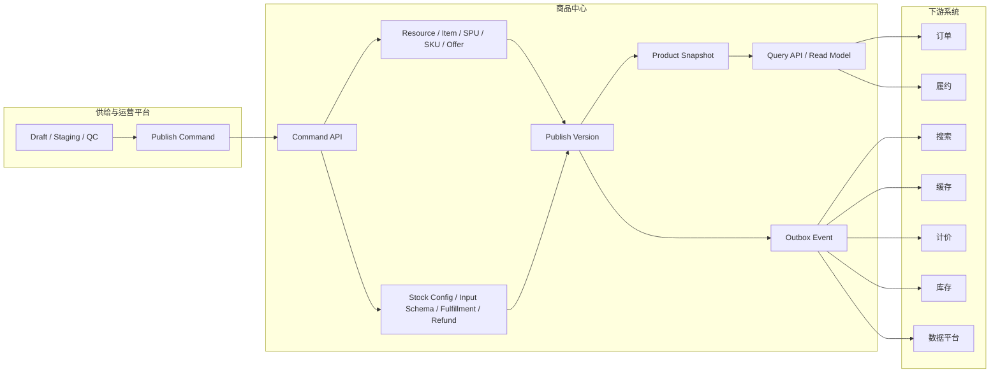
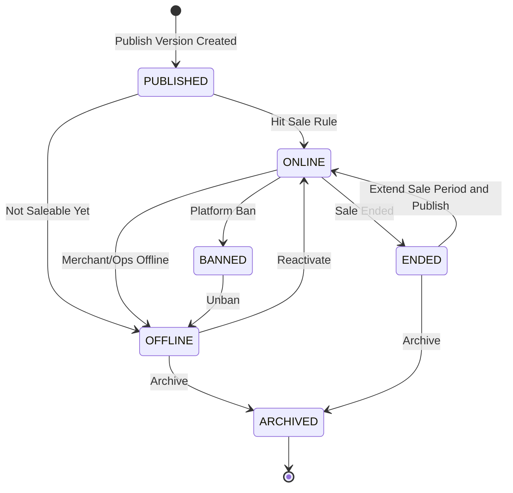

**导航**：[书籍主页](../../README.md) | [完整目录](../../SUMMARY.md) | [上一章：第7章](../overview/chapter5.md) | [下一章：第9章](./chapter8.md)

---

# 第8章 商品中心系统

> **本章定位**：商品中心不是供给后台，也不是商家上传系统。商品中心是平台的正式商品主数据中心和交易前契约中心，负责沉淀已经发布生效的 Resource、SPU/SKU、Offer、库存配置、履约规则、退款规则、发布版本和商品快照。第 11 章讨论商品如何从 Draft、Staging、QC 进入平台；本章讨论商品一旦发布后，平台如何稳定、可追溯、可交易地表达“卖什么、怎么卖、如何履约、历史订单如何解释”。

商品中心最容易被设计成一个“大后台 CRUD”。早期这样做问题不大，但当平台开始支持本地生活、酒店、票务、充值、礼品卡、账单缴费、供应商同步和商家自助上传后，商品中心如果继续直接承接草稿、审核、导入、供应商拉取、搜索刷新、订单快照，就会迅速变成不可维护的大泥球。

更合理的边界是：

```text
供给与运营平台
  → Draft / Staging / QC / Task / DLQ
  → Publish Command
  → 商品中心正式主数据
  → 商品快照 / Outbox / 读模型
  → 搜索、缓存、库存、计价、订单、履约
```

本章回答五个问题：

1. **商品中心到底负责什么？** 正式商品主数据、交易前契约、发布版本和稳定读模型。
2. **为什么不能把 Draft、QC、Rejected 放到商品正式表？** 因为这些是供给流程状态，不是正式商品生命周期状态。
3. **Resource、SPU/SKU、Offer 如何建模？** 用资源层、商品定义层、销售承诺层拆清楚异构品类。
4. **发布版本和商品快照解决什么问题？** 解决回滚、对账、搜索一致性和历史订单解释。
5. **商品中心如何和库存、计价、搜索、订单集成？** 通过交易前契约、Outbox 事件和版本化读模型形成最终一致。

完整的供给治理链路见：

- [第11章：商品供给与运营管理和生命周期管理](./chapter10.md)
- [附录G：商品供给与运营治理平台](../../appendix/product-supply-ops.md)
- [附录F：供应商数据同步链路](../../appendix/supplier-sync.md)

---

## 8.1 系统定位与边界

### 8.1.1 商品中心是什么

商品中心是平台对“商品事实”的正式表达。它不关心商家正在编辑哪份草稿，也不关心某条 Excel 第几行是否解析失败；它关心的是已经发布生效的商品版本。

商品中心至少要回答：

| 问题 | 商品中心的回答 |
|------|----------------|
| 卖的是什么资源 | `Resource`，例如酒店、门店、机场、活动、充值运营商 |
| 商品如何定义 | `SPU/SKU`，例如套餐、面额、房型、服务规格 |
| 用什么销售承诺卖 | `Offer / Rate Plan`，例如价格计划、渠道、销售期、可售规则 |
| 下单前需要什么信息 | `Input Schema`，例如手机号、账单号、入住人、证件 |
| 如何履约 | `Fulfillment Rule`，例如充值、发券、出票、供应商确认 |
| 如何退款售后 | `Refund Rule`，例如随时退、过期退、不可退、取消政策 |
| 哪个版本当前生效 | `publish_version` |
| 历史订单如何解释 | 商品快照、报价快照、履约契约快照、退款规则快照 |

一句话：

> 商品中心负责正式商品和交易前契约，不负责供给过程。

### 8.1.2 商品中心不是什么

商品中心不应该承接所有 B 端流程状态。下面这些内容应该属于第 11 章的供给与运营平台：

| 内容 | 应该归属 | 原因 |
|------|----------|------|
| 草稿保存 | 供给平台 Draft | 草稿允许反复编辑，不影响线上 |
| 商家上传审核 | 供给平台 QC | 审核是发布准入工单，不是正式商品 |
| Excel 导入进度 | 供给平台 Task / Task Item | 属于任务执行状态 |
| 供应商分页同步 | 供应商同步 Batch / Checkpoint | 属于外部拉取和恢复链路 |
| 错误文件 | 供给平台 File / Validation / DLQ | 属于运营修复闭环 |
| 待审、驳回、撤回 | Staging / QC Review | 属于提交快照和审核工单 |

商品正式表不应该出现这些状态：

```text
DRAFT
QC_PENDING
QC_REVIEWING
REJECTED
WITHDRAWN
PARSING
VALIDATING
```

正式商品表应该出现的是线上资产状态：

```text
PUBLISHED
ONLINE
OFFLINE
ENDED
BANNED
ARCHIVED
```

这个边界非常重要。新建商品在 Draft、Staging、QC 阶段还没有正式 `item_id`，只有发布成功后才进入商品中心。如果商品中心提前生成正式商品并把状态设为 `DRAFT`，后面会出现两个问题：

1. 未审核商品容易被搜索、缓存或内部查询误读为正式商品。
2. Draft、QC、正式商品的生命周期混在一起，状态机很快失控。

### 8.1.3 与供给平台的关系

第 11 章的供给平台负责“如何把商品送进来”，商品中心负责“已经发布的商品如何被交易系统稳定使用”。

```text
供给平台：
  Draft
  Staging Ticket
  QC Review
  Change Request
  Publish Record

商品中心：
  Resource
  Product Item
  SPU / SKU
  Offer / Rate Plan
  Stock Config
  Input Schema
  Fulfillment Rule
  Refund Rule
  Publish Version
  Product Snapshot
```

两者通过发布命令连接：

```text
PublishProductVersionCommand
  → 商品中心校验 base_publish_version
  → 写正式商品主数据
  → 生成 publish_version
  → 生成商品快照
  → 写 Outbox 事件
```

商品中心可以保存 `last_publish_id`、`last_operation_id`、`source_type` 等审计引用，但不应该反向保存供给侧的完整流程状态。

---

## 8.2 总体架构

### 8.2.1 架构分层

商品中心建议拆成五层：

```text
Command API
  → Domain Model
  → Versioned Write Model
  → Snapshot / Outbox
  → Read Model / Cache / Search Projection
```

更完整的架构如下：



这张图的关键点是：商品中心的写入口不是运营后台的表单提交，而是供给平台发布出来的命令。这样可以保证所有商品变更都经过 Draft、Staging、Validation、QC 或自动准入策略，再进入正式商品。

### 8.2.2 读写分离

商品中心的写入链路强调一致性和可追溯：

```text
Publish Command
  → 版本校验
  → 正式表事务写入
  → 快照生成
  → Outbox
```

商品中心的读取链路强调低延迟和稳定：

```text
详情页
  → Redis / Local Cache
  → 商品中心 Query API
  → DB 回源

列表页
  → Search
  → 商品中心批量 Hydrate

创单页
  → 商品中心版本化快照
  → 库存确认
  → 计价试算
```

不要让搜索列表直接扫商品中心 MySQL，也不要让商品中心在详情接口里临时计算复杂优惠价和实时库存。商品中心提供交易前契约，计价和库存由各自领域负责。

### 8.2.3 核心原则

商品中心设计要坚持几个原则：

| 原则 | 说明 |
|------|------|
| 正式表只保存发布数据 | Draft、QC、Rejected 不进入商品正式表 |
| 写入必须版本化 | 每次发布递增 `publish_version` |
| 订单只信快照 | 历史订单不回读最新商品解释 |
| 读模型可最终一致 | 搜索、缓存通过 Outbox 异步刷新 |
| 下游按版本幂等消费 | 旧事件不能覆盖新版本 |
| 高变化数据不强塞商品表 | 实时库存、最终成交价、供应商实时房态不属于商品中心唯一事实 |

---

## 8.3 核心领域模型

### 8.3.1 三层商品模型

传统电商常用 SPU/SKU 就够了，但数字商品平台会遇到酒店、票务、账单、充值、本地服务、礼品卡等异构场景。只靠 SPU/SKU 容易把资源、销售单元、交易契约混在一起。

更稳的模型是三层：

```text
资源层 Resource
  → 商品定义层 SPU / SKU / Product Item
  → 销售承诺层 Offer / Rate Plan / Contract
```

| 层级 | 解决的问题 | 示例 |
|------|------------|------|
| Resource | 这个商品背后依附什么现实或虚拟资源 | 酒店、门店、机场、运营商、影院、活动 |
| SPU/SKU | 平台上售卖的商品定义和规格 | 豪华房、50 元券、10GB 流量包、电影票套餐 |
| Offer / Rate Plan | 以什么条件卖给用户 | 价格计划、销售期、渠道、取消政策、库存来源 |

这个拆法的好处是：

1. 同一个 Resource 可以挂多个商品。
2. 同一个 SKU 可以有多个 Offer。
3. 同一个 Offer 可以切换库存、履约、退款策略。
4. 供应商同步可以优先沉淀 Resource，运营再决定如何售卖。

### 8.3.2 Resource

Resource 表达“现实或外部世界里的资源对象”。它不是一定可售的商品，而是商品的承载对象。

| 品类 | Resource 示例 | 商品示例 |
|------|---------------|----------|
| 酒店 | 酒店、房间资源、地理位置 | 房型套餐、Rate Plan |
| 本地生活 | 门店、服务地点 | 双人餐券、洗车券、按摩套餐 |
| 票务 | 演出、场馆、场次 | 门票档位、座位区 |
| 充值 | 运营商、国家、产品线 | 话费面额、流量包 |
| 账单 | 账单机构、缴费类型 | 电费、水费、宽带账单 |

Resource 的状态不等于商品状态。酒店资源可以是有效的，但某个房型 Offer 暂时不可售；门店可以营业，但某张券可以下架。

### 8.3.3 Product Item

`Product Item` 是商品中心对 C 端“一个可展示商品”的正式聚合。它通常对应前台一个详情页或一张商品卡。

它和 SPU 的关系取决于品类：

| 场景 | 建议 |
|------|------|
| 标准零售 | 一个 `item_id` 通常对应一个 SPU |
| 本地生活券 | 一个 `item_id` 可以对应一个套餐 SPU 和默认 SKU |
| 酒店 | 一个 `item_id` 可以对应酒店资源详情，Offer 表达房型和 Rate Plan |
| 充值缴费 | 一个 `item_id` 可以对应运营商或缴费入口，SKU 表达面额或套餐 |

为什么需要 `item_id`？因为 C 端、商家端、订单、搜索通常需要一个统一的商品入口 ID。SPU/SKU 偏商品定义，Resource 偏资源对象，Offer 偏销售承诺；`item_id` 是把这些内容组合成“前台商品”的聚合根。

### 8.3.4 SPU / SKU

SPU 表达商品共性定义，SKU 表达可下单的规格单元。

| 对象 | 作用 | 示例 |
|------|------|------|
| SPU | 商品共性信息 | iPhone 16、KFC 套餐、酒店豪华房 |
| SKU | 可售规格单元 | 黑色 256G、双人套餐、含早可取消 |

不是所有数字商品都需要复杂多 SKU，但建议保留默认 SKU。这样订单、库存、计价、履约都能使用统一结构。

### 8.3.5 Offer / Rate Plan

Offer 表达销售承诺。它不是简单价格字段，而是一组交易前条件：

```text
Offer =
  销售对象
  + 渠道
  + 销售期
  + 价格/价格引用
  + 库存来源
  + 输入要求
  + 履约规则
  + 退款规则
```

酒店和票务等品类还需要 Rate Plan：

| 对象 | 含义 |
|------|------|
| Offer | 平台销售配置 |
| Rate Plan | 供应商或业务侧的价格计划、取消政策、入住条件 |

例如酒店：

```text
Resource: Bangkok Hotel A
SPU: Deluxe Room
SKU: Deluxe Room + 2 Breakfast
Offer: Shopee App Channel + TH Site
Rate Plan: refundable before T-1, pay now, supplier plan RP_001
```

---

## 8.4 类目模板与异构品类

### 8.4.1 为什么需要类目模板

商品中心不能为每个品类硬编码一套表单和校验。类目模板要定义：

1. 需要哪些 Resource。
2. 是否需要 SPU/SKU。
3. 必填属性和枚举。
4. 是否需要库存配置。
5. 是否需要 Input Schema。
6. 支持哪些履约方式。
7. 支持哪些退款规则。
8. 哪些字段可索引、可筛选、可展示。

```text
category_template
  → resource_schema
  → spu_schema
  → sku_schema
  → offer_schema
  → contract_schema
```

类目模板既服务供给平台，也服务商品中心。供给平台用它做表单、校验、QC 风险识别；商品中心用它约束正式数据和生成读模型。

### 8.4.2 属性分类

商品属性至少分四类：

| 属性类型 | 示例 | 是否影响交易 |
|----------|------|--------------|
| 基础展示属性 | 标题、图片、卖点、描述 | 间接影响 |
| 关键决策属性 | 品牌、城市、门店、酒店星级 | 影响搜索和转化 |
| 销售规格属性 | 颜色、尺码、面额、房型 | 影响 SKU |
| 交易契约属性 | 退款规则、履约方式、输入字段 | 直接影响下单和售后 |

不要把所有属性都塞进一个 `ext_info`。适合搜索、筛选、风控、计价、履约使用的字段，要结构化存储或生成专门投影；纯展示和低频字段可以放 JSON 扩展。

### 8.4.3 扩展字段策略

扩展字段有三种方式：

| 方式 | 优点 | 缺点 | 适用 |
|------|------|------|------|
| JSON 扩展 | 上线快，适合异构字段 | 查询和约束弱 | 低频展示字段 |
| 垂直扩展表 | 类型清晰，查询友好 | 表多，建模成本高 | 酒店、门店、票务核心属性 |
| 属性表 EAV | 灵活 | 查询复杂，容易失控 | 通用筛选属性 |

推荐组合：

```text
核心交易字段
  → 结构化列

品类核心字段
  → 垂直扩展表

长尾展示字段
  → JSON

搜索筛选字段
  → 搜索投影
```

---

## 8.5 正式商品状态与版本

### 8.5.1 Item 状态

正式商品的生命周期状态建议放在 `product_item_tab.item_status`：

| 状态 | 含义 |
|------|------|
| `PUBLISHED` | 已有正式发布版本，但未必已经开始售卖 |
| `ONLINE` | C 端可见，满足上线条件 |
| `OFFLINE` | 手动下线或暂不售卖 |
| `ENDED` | 销售期结束 |
| `BANNED` | 平台封禁 |
| `ARCHIVED` | 归档，仅保留历史查询和审计 |

它不应该包含 `DRAFT`、`QC_PENDING`、`REJECTED`。这些状态属于供给侧对象。

### 8.5.2 Sellable 状态

`item_status` 表达商品资产状态，`sellable_status` 表达当前是否可交易：

| 状态 | 含义 |
|------|------|
| `SELLABLE` | 当前允许下单 |
| `UNSELLABLE` | 不允许下单 |
| `NOT_STARTED` | 销售期未开始 |
| `SOLD_OUT` | 库存或券码池不足 |
| `EXPIRED` | 销售期或有效期结束 |
| `RISK_BLOCKED` | 风控或平台规则阻断 |

这两个状态可以不同。例如商品 `ONLINE`，但库存为 0 时 `sellable_status=SOLD_OUT`。列表页可以展示该商品，但下单按钮不可用。

### 8.5.3 Publish Version

每次发布都要生成新的 `publish_version`：

```text
item_id = item_80001
publish_version: 3 → 4
```

版本用于：

1. 防止旧编辑覆盖新版本。
2. 支持回滚和审计。
3. 让搜索、缓存、订单按版本幂等处理。
4. 让历史订单能解释当时看到的商品。

编辑发布前必须校验：

```text
staging.base_publish_version == product_item.current_publish_version
```

如果不相等，说明线上商品已经变化，当前提交应进入版本冲突，不能静默覆盖。

### 8.5.4 商品状态机



注意：这个状态机只描述正式商品。Draft、Staging、QC 的状态机在第 11 章。

---

## 8.6 核心表模型

商品中心表模型围绕“正式主数据 + 交易前契约 + 发布版本 + 快照”设计。

### 8.6.1 Resource 表

```sql
CREATE TABLE resource_tab (
    id BIGINT PRIMARY KEY AUTO_INCREMENT,
    resource_id VARCHAR(64) NOT NULL,
    resource_type VARCHAR(32) NOT NULL COMMENT 'HOTEL/STORE/EVENT/CARRIER/BILLER',
    category_code VARCHAR(32) NOT NULL,
    resource_name VARCHAR(256) NOT NULL,
    country_code VARCHAR(32) DEFAULT NULL,
    city_code VARCHAR(64) DEFAULT NULL,
    address VARCHAR(512) DEFAULT NULL,
    geo_lat DECIMAL(10, 7) DEFAULT NULL,
    geo_lng DECIMAL(10, 7) DEFAULT NULL,
    status VARCHAR(32) NOT NULL COMMENT 'ACTIVE/INACTIVE/ARCHIVED',
    ext_info JSON DEFAULT NULL,
    created_at DATETIME NOT NULL,
    updated_at DATETIME NOT NULL,
    UNIQUE KEY uk_resource_id (resource_id),
    KEY idx_type_city (resource_type, city_code),
    KEY idx_category_status (category_code, status)
) ENGINE=InnoDB DEFAULT CHARSET=utf8mb4 COMMENT='平台资源主表';
```

Resource 是平台沉淀资源的主表。供应商同步通常先映射到 Resource，再由供给平台决定是否生成商品和 Offer。

### 8.6.2 Product Item 表

```sql
CREATE TABLE product_item_tab (
    id BIGINT PRIMARY KEY AUTO_INCREMENT,
    item_id VARCHAR(64) NOT NULL,
    category_code VARCHAR(32) NOT NULL,
    item_type VARCHAR(32) NOT NULL COMMENT 'STANDARD/VIRTUAL/LOCAL_SERVICE/HOTEL/TICKET/BILL',
    resource_id VARCHAR(64) DEFAULT NULL,
    title VARCHAR(256) NOT NULL,
    subtitle VARCHAR(512) DEFAULT NULL,
    main_image VARCHAR(512) DEFAULT NULL,
    item_status VARCHAR(32) NOT NULL COMMENT 'PUBLISHED/ONLINE/OFFLINE/ENDED/BANNED/ARCHIVED',
    sellable_status VARCHAR(32) NOT NULL COMMENT 'SELLABLE/UNSELLABLE/NOT_STARTED/SOLD_OUT/EXPIRED/RISK_BLOCKED',
    current_publish_version BIGINT NOT NULL DEFAULT 1,
    sale_start_at DATETIME DEFAULT NULL,
    sale_end_at DATETIME DEFAULT NULL,
    source_type VARCHAR(32) DEFAULT NULL COMMENT 'LOCAL_OPS/MERCHANT/SUPPLIER/SYSTEM',
    last_publish_id VARCHAR(64) DEFAULT NULL,
    created_at DATETIME NOT NULL,
    updated_at DATETIME NOT NULL,
    UNIQUE KEY uk_item_id (item_id),
    KEY idx_resource (resource_id),
    KEY idx_category_status (category_code, item_status),
    KEY idx_sellable (sellable_status)
) ENGINE=InnoDB DEFAULT CHARSET=utf8mb4 COMMENT='正式商品聚合根';
```

`product_item_tab` 是 C 端商品入口。它不保存 Draft 和 QC 状态，只保存正式商品的线上状态和当前发布版本。

### 8.6.3 SPU 表

```sql
CREATE TABLE product_spu_tab (
    id BIGINT PRIMARY KEY AUTO_INCREMENT,
    spu_id VARCHAR(64) NOT NULL,
    item_id VARCHAR(64) NOT NULL,
    category_code VARCHAR(32) NOT NULL,
    spu_name VARCHAR(256) NOT NULL,
    brand_id BIGINT DEFAULT NULL,
    spec_schema JSON DEFAULT NULL,
    attr_payload JSON DEFAULT NULL,
    status VARCHAR(32) NOT NULL COMMENT 'ACTIVE/INACTIVE/ARCHIVED',
    publish_version BIGINT NOT NULL,
    created_at DATETIME NOT NULL,
    updated_at DATETIME NOT NULL,
    UNIQUE KEY uk_spu_id (spu_id),
    KEY idx_item (item_id),
    KEY idx_category_status (category_code, status)
) ENGINE=InnoDB DEFAULT CHARSET=utf8mb4 COMMENT='商品 SPU 定义';
```

SPU 承载共性信息和规格定义。对于单规格商品，可以只有一个默认 SKU。

### 8.6.4 SKU 表

```sql
CREATE TABLE product_sku_tab (
    id BIGINT PRIMARY KEY AUTO_INCREMENT,
    sku_id VARCHAR(64) NOT NULL,
    item_id VARCHAR(64) NOT NULL,
    spu_id VARCHAR(64) NOT NULL,
    sku_name VARCHAR(256) DEFAULT NULL,
    spec_values JSON DEFAULT NULL,
    barcode VARCHAR(128) DEFAULT NULL,
    sku_status VARCHAR(32) NOT NULL COMMENT 'ACTIVE/INACTIVE/ARCHIVED',
    publish_version BIGINT NOT NULL,
    created_at DATETIME NOT NULL,
    updated_at DATETIME NOT NULL,
    UNIQUE KEY uk_sku_id (sku_id),
    KEY idx_item (item_id),
    KEY idx_spu (spu_id),
    KEY idx_status (sku_status)
) ENGINE=InnoDB DEFAULT CHARSET=utf8mb4 COMMENT='商品 SKU 定义';
```

SKU 是订单行、库存配置和计价试算常用的锚点。即使是虚拟品，也建议保留默认 SKU 来统一交易链路。

### 8.6.5 Offer 表

```sql
CREATE TABLE product_offer_tab (
    id BIGINT PRIMARY KEY AUTO_INCREMENT,
    offer_id VARCHAR(64) NOT NULL,
    item_id VARCHAR(64) NOT NULL,
    spu_id VARCHAR(64) DEFAULT NULL,
    sku_id VARCHAR(64) DEFAULT NULL,
    resource_id VARCHAR(64) DEFAULT NULL,
    offer_type VARCHAR(32) NOT NULL COMMENT 'NORMAL/PACKAGE/RATE_PLAN/PRESELL',
    site_code VARCHAR(32) NOT NULL,
    channel_code VARCHAR(32) DEFAULT NULL,
    currency VARCHAR(16) NOT NULL,
    list_price DECIMAL(18, 4) DEFAULT NULL COMMENT '标价或基础价，不等同最终成交价',
    offer_status VARCHAR(32) NOT NULL COMMENT 'ACTIVE/INACTIVE/ARCHIVED',
    sale_start_at DATETIME DEFAULT NULL,
    sale_end_at DATETIME DEFAULT NULL,
    publish_version BIGINT NOT NULL,
    created_at DATETIME NOT NULL,
    updated_at DATETIME NOT NULL,
    UNIQUE KEY uk_offer_id (offer_id),
    KEY idx_item_status (item_id, offer_status),
    KEY idx_sku (sku_id),
    KEY idx_site_channel (site_code, channel_code)
) ENGINE=InnoDB DEFAULT CHARSET=utf8mb4 COMMENT='商品销售 Offer';
```

Offer 里的价格字段只能表达基础价或标价。最终成交价应该由计价系统根据活动、优惠、会员、渠道和风控规则试算。

### 8.6.6 Rate Plan 表

```sql
CREATE TABLE product_rate_plan_tab (
    id BIGINT PRIMARY KEY AUTO_INCREMENT,
    rate_plan_id VARCHAR(64) NOT NULL,
    offer_id VARCHAR(64) NOT NULL,
    supplier_id BIGINT DEFAULT NULL,
    supplier_rate_plan_code VARCHAR(128) DEFAULT NULL,
    plan_name VARCHAR(256) DEFAULT NULL,
    plan_type VARCHAR(32) DEFAULT NULL COMMENT 'REFUNDABLE/NON_REFUNDABLE/PAY_NOW/PAY_LATER',
    cancellation_policy_ref VARCHAR(128) DEFAULT NULL,
    meal_plan VARCHAR(64) DEFAULT NULL,
    ext_info JSON DEFAULT NULL,
    status VARCHAR(32) NOT NULL COMMENT 'ACTIVE/INACTIVE/ARCHIVED',
    publish_version BIGINT NOT NULL,
    created_at DATETIME NOT NULL,
    updated_at DATETIME NOT NULL,
    UNIQUE KEY uk_rate_plan_id (rate_plan_id),
    KEY idx_offer (offer_id),
    KEY idx_supplier_plan (supplier_id, supplier_rate_plan_code)
) ENGINE=InnoDB DEFAULT CHARSET=utf8mb4 COMMENT='价格计划或供应商 Rate Plan';
```

Rate Plan 适合酒店、票务、活动等复杂供给。简单商品可以不建独立 Rate Plan，只使用 Offer。

### 8.6.7 库存配置表

```sql
CREATE TABLE product_stock_config_tab (
    id BIGINT PRIMARY KEY AUTO_INCREMENT,
    stock_config_id VARCHAR(64) NOT NULL,
    item_id VARCHAR(64) NOT NULL,
    sku_id VARCHAR(64) DEFAULT NULL,
    offer_id VARCHAR(64) DEFAULT NULL,
    stock_type VARCHAR(32) NOT NULL COMMENT 'PLATFORM_STOCK/CODE_POOL/SUPPLIER_REALTIME/NO_STOCK',
    inventory_ref VARCHAR(128) DEFAULT NULL,
    deduct_timing VARCHAR(32) DEFAULT NULL COMMENT 'CREATE_ORDER/PAY_SUCCESS/FULFILL_SUCCESS',
    oversell_policy VARCHAR(32) DEFAULT NULL COMMENT 'FORBID/ALLOW_WITH_LIMIT/SUPPLIER_CONFIRM',
    status VARCHAR(32) NOT NULL COMMENT 'ACTIVE/INACTIVE',
    publish_version BIGINT NOT NULL,
    created_at DATETIME NOT NULL,
    updated_at DATETIME NOT NULL,
    UNIQUE KEY uk_stock_config_id (stock_config_id),
    KEY idx_item (item_id),
    KEY idx_offer (offer_id)
) ENGINE=InnoDB DEFAULT CHARSET=utf8mb4 COMMENT='商品库存配置';
```

这张表保存库存“如何接入”和“扣减时机”，不保存实时库存事实。实时库存属于库存系统或供应商实时确认。

### 8.6.8 输入 Schema 表

```sql
CREATE TABLE product_input_schema_tab (
    id BIGINT PRIMARY KEY AUTO_INCREMENT,
    input_schema_id VARCHAR(64) NOT NULL,
    item_id VARCHAR(64) NOT NULL,
    offer_id VARCHAR(64) DEFAULT NULL,
    schema_version BIGINT NOT NULL,
    schema_payload JSON NOT NULL,
    status VARCHAR(32) NOT NULL COMMENT 'ACTIVE/INACTIVE/ARCHIVED',
    publish_version BIGINT NOT NULL,
    created_at DATETIME NOT NULL,
    updated_at DATETIME NOT NULL,
    UNIQUE KEY uk_input_schema_id (input_schema_id),
    KEY idx_item_offer (item_id, offer_id)
) ENGINE=InnoDB DEFAULT CHARSET=utf8mb4 COMMENT='下单输入 Schema';
```

充值需要手机号，账单缴费需要账单号，酒店需要入住人，机票需要乘机人证件。Input Schema 必须发布为正式契约，否则订单系统无法稳定校验用户输入。

### 8.6.9 履约规则表

```sql
CREATE TABLE product_fulfillment_rule_tab (
    id BIGINT PRIMARY KEY AUTO_INCREMENT,
    fulfillment_rule_id VARCHAR(64) NOT NULL,
    item_id VARCHAR(64) NOT NULL,
    offer_id VARCHAR(64) DEFAULT NULL,
    fulfillment_type VARCHAR(32) NOT NULL COMMENT 'TOPUP/ISSUE_CODE/BOOKING/SUPPLIER_ORDER/MANUAL',
    supplier_id BIGINT DEFAULT NULL,
    fulfillment_params JSON DEFAULT NULL,
    timeout_seconds INT DEFAULT NULL,
    retry_policy JSON DEFAULT NULL,
    status VARCHAR(32) NOT NULL COMMENT 'ACTIVE/INACTIVE/ARCHIVED',
    publish_version BIGINT NOT NULL,
    created_at DATETIME NOT NULL,
    updated_at DATETIME NOT NULL,
    UNIQUE KEY uk_fulfillment_rule_id (fulfillment_rule_id),
    KEY idx_item_offer (item_id, offer_id),
    KEY idx_supplier (supplier_id)
) ENGINE=InnoDB DEFAULT CHARSET=utf8mb4 COMMENT='商品履约规则';
```

履约规则是交易前契约的一部分。订单创建时要保存对应快照，避免商品后续修改供应商参数后影响历史订单。

### 8.6.10 退款规则表

```sql
CREATE TABLE product_refund_rule_tab (
    id BIGINT PRIMARY KEY AUTO_INCREMENT,
    refund_rule_id VARCHAR(64) NOT NULL,
    item_id VARCHAR(64) NOT NULL,
    offer_id VARCHAR(64) DEFAULT NULL,
    refund_type VARCHAR(32) NOT NULL COMMENT 'REFUNDABLE/NON_REFUNDABLE/PARTIAL/CONDITIONAL',
    rule_payload JSON NOT NULL,
    status VARCHAR(32) NOT NULL COMMENT 'ACTIVE/INACTIVE/ARCHIVED',
    publish_version BIGINT NOT NULL,
    created_at DATETIME NOT NULL,
    updated_at DATETIME NOT NULL,
    UNIQUE KEY uk_refund_rule_id (refund_rule_id),
    KEY idx_item_offer (item_id, offer_id)
) ENGINE=InnoDB DEFAULT CHARSET=utf8mb4 COMMENT='商品退款规则';
```

退款规则变更属于高风险变更。它应在第 11 章供给平台中经过 Diff、风险识别和 QC 或强权限确认，再发布到商品中心。

### 8.6.11 发布版本表

```sql
CREATE TABLE product_publish_version_tab (
    id BIGINT PRIMARY KEY AUTO_INCREMENT,
    item_id VARCHAR(64) NOT NULL,
    publish_version BIGINT NOT NULL,
    publish_id VARCHAR(64) NOT NULL,
    publish_type VARCHAR(32) NOT NULL COMMENT 'CREATE/EDIT/OFFLINE/ONLINE/BAN/UNBAN/ROLLBACK',
    source_type VARCHAR(32) DEFAULT NULL COMMENT 'LOCAL_OPS/MERCHANT/SUPPLIER/SYSTEM',
    source_ref_id VARCHAR(64) DEFAULT NULL COMMENT '供给侧 publish_id、operation_id 或 sync batch',
    payload_hash VARCHAR(64) NOT NULL,
    status VARCHAR(32) NOT NULL COMMENT 'ACTIVE/ROLLED_BACK/ARCHIVED',
    created_at DATETIME NOT NULL,
    UNIQUE KEY uk_item_version (item_id, publish_version),
    UNIQUE KEY uk_publish_id (publish_id),
    KEY idx_item_time (item_id, created_at)
) ENGINE=InnoDB DEFAULT CHARSET=utf8mb4 COMMENT='商品发布版本';
```

发布版本是商品中心的核心版本轴。供给侧的 `product_publish_record` 记录发布动作，商品中心的 `product_publish_version_tab` 记录正式版本事实。

### 8.6.12 商品快照表

```sql
CREATE TABLE product_snapshot_tab (
    id BIGINT PRIMARY KEY AUTO_INCREMENT,
    snapshot_id VARCHAR(64) NOT NULL,
    item_id VARCHAR(64) NOT NULL,
    publish_version BIGINT NOT NULL,
    snapshot_type VARCHAR(32) NOT NULL
        COMMENT 'FULL/PRODUCT/OFFER/STOCK_CONFIG/INPUT_SCHEMA/FULFILLMENT/REFUND',
    snapshot_payload JSON NOT NULL,
    payload_hash VARCHAR(64) NOT NULL,
    payload_ref VARCHAR(512) DEFAULT NULL,
    created_at DATETIME NOT NULL,
    UNIQUE KEY uk_snapshot_id (snapshot_id),
    UNIQUE KEY uk_item_version_type (item_id, publish_version, snapshot_type),
    KEY idx_item_version (item_id, publish_version)
) ENGINE=InnoDB DEFAULT CHARSET=utf8mb4 COMMENT='商品发布快照';
```

快照是订单系统解释历史订单的基础。订单不应该回读最新商品表，而应该保存或引用创单时的快照。

### 8.6.13 Outbox 表

```sql
CREATE TABLE product_outbox_event (
    id BIGINT PRIMARY KEY AUTO_INCREMENT,
    event_id VARCHAR(64) NOT NULL,
    aggregate_type VARCHAR(64) NOT NULL COMMENT 'PRODUCT_ITEM/PUBLISH_VERSION',
    aggregate_id VARCHAR(64) NOT NULL,
    event_type VARCHAR(128) NOT NULL
        COMMENT 'ProductPublished/ProductOnline/ProductOffline/ProductSnapshotCreated',
    item_id VARCHAR(64) DEFAULT NULL,
    publish_version BIGINT DEFAULT NULL,
    payload JSON NOT NULL,
    status VARCHAR(32) NOT NULL DEFAULT 'PENDING'
        COMMENT 'PENDING/SENDING/SENT/FAILED/DLQ',
    retry_count INT NOT NULL DEFAULT 0,
    next_retry_at DATETIME DEFAULT NULL,
    last_error_message VARCHAR(1024) DEFAULT NULL,
    created_at DATETIME NOT NULL,
    sent_at DATETIME DEFAULT NULL,
    updated_at DATETIME NOT NULL,
    UNIQUE KEY uk_event_id (event_id),
    KEY idx_status_retry (status, next_retry_at),
    KEY idx_item_version (item_id, publish_version)
) ENGINE=InnoDB DEFAULT CHARSET=utf8mb4 COMMENT='商品中心 Outbox 事件';
```

正式表写入、版本表、快照表、Outbox 必须在同一个事务里完成。搜索和缓存刷新失败时，不回滚商品发布，而是通过 Outbox 重试和补偿。

---

## 8.7 发布写入链路

### 8.7.1 只接受发布命令

商品中心写接口不应该暴露成通用 CRUD：

```text
POST /product/updateTitle
POST /sku/updatePrice
POST /offer/updateRefundRule
```

更合理的是命令式接口：

```text
PublishProductVersion
OfflineProduct
ReactivateProduct
BanProduct
UnbanProduct
ArchiveProduct
RollbackProductVersion
```

原因很简单：商品变更不是字段修改，而是交易前契约变更。每次变更都需要版本、快照、事件和审计。

### 8.7.2 Publish Command

发布命令需要包含完整的发布上下文：

```json
{
  "publish_id": "pub_20260427_0001",
  "operation_id": "op_20001",
  "source_type": "MERCHANT",
  "publish_type": "EDIT",
  "item_id": "item_80001",
  "base_publish_version": 3,
  "category_code": "LOCAL_SERVICE",
  "resource": {},
  "spu_list": [],
  "sku_list": [],
  "offer_list": [],
  "stock_config_list": [],
  "input_schema_list": [],
  "fulfillment_rule_list": [],
  "refund_rule_list": []
}
```

新建商品时 `item_id` 可以为空，由商品中心在发布事务中生成正式 `item_id`。编辑商品时必须带 `item_id` 和 `base_publish_version`。

### 8.7.3 发布前校验

商品中心发布前要做最后一道强校验：

1. `publish_id` 是否幂等。
2. 新建商品是否没有重复外部对象映射。
3. 编辑商品的 `base_publish_version` 是否匹配当前版本。
4. Resource、SPU、SKU、Offer 关系是否完整。
5. 库存配置、输入 Schema、履约规则、退款规则是否满足类目模板。
6. 商品是否被封禁、归档或锁定。
7. 发布 payload hash 是否已经发布过。

如果校验失败，商品中心应该返回结构化错误给供给平台，由供给平台记录 DLQ 或展示给运营。

### 8.7.4 发布事务

发布事务的典型流程：

```text
BEGIN
  → 幂等检查 publish_id
  → 新建商品生成 item_id，编辑商品锁定 item_id 当前版本
  → 写 resource_tab
  → 写 product_item_tab
  → 写 product_spu_tab
  → 写 product_sku_tab
  → 写 product_offer_tab
  → 写 product_stock_config_tab
  → 写 product_input_schema_tab
  → 写 product_fulfillment_rule_tab
  → 写 product_refund_rule_tab
  → 生成 new_publish_version
  → 写 product_publish_version_tab
  → 写 product_snapshot_tab
  → 写 product_outbox_event
COMMIT
```

不要在发布事务里刷新 ES、删除 Redis、通知营销系统。那些动作通过 Outbox 异步执行。

### 8.7.5 幂等与并发

发布幂等建议使用：

| 场景 | 幂等 Key |
|------|----------|
| 发布请求 | `publish_id` |
| 商品版本 | `item_id + publish_version` |
| payload 去重 | `item_id + base_publish_version + payload_hash` |
| Outbox 事件 | `event_id` |

编辑并发使用版本 CAS：

```sql
UPDATE product_item_tab
SET current_publish_version = ?,
    updated_at = NOW()
WHERE item_id = ?
  AND current_publish_version = ?;
```

`rows_affected = 0` 说明线上版本已经变化，本次发布必须失败并返回版本冲突。

---

## 8.8 读取模型与查询接口

### 8.8.1 详情页读模型

详情页需要的信息通常横跨多张表：

```text
item
  + resource
  + spu / sku
  + offer
  + stock config
  + input schema
  + fulfillment rule
  + refund rule
```

在线上高 QPS 场景，不建议每次详情请求都做多表实时 Join。可以生成详情读模型：

```text
ProductDetailView
  item_id
  publish_version
  title
  images
  resource_info
  sku_options
  offer_summary
  input_schema
  fulfillment_summary
  refund_summary
  sellable_status
```

读模型可以存 Redis、文档库或宽表。它是正式表的投影，不是新的事实源。

### 8.8.2 列表页与搜索

列表页通常从搜索系统召回商品，再批量补充商品中心的轻量信息：

```text
Search Query
  → item_id list
  → batch get product summary
  → merge price / inventory / campaign hint
```

搜索索引建议保存：

```text
item_id
publish_version
title
category
resource_location
tags
display_price
sellable_status
updated_at
```

搜索索引不是商品事实源。索引里的 `publish_version` 必须能和商品中心对账。

### 8.8.3 创单前读取

创单前读取和详情页读取不同。详情页可以为了体验返回缓存，创单前必须重新确认交易安全：

```text
Create Order
  → 读取商品当前 publish_version
  → 读取商品快照
  → 库存确认
  → 计价试算
  → 供应商实时确认（如果需要）
  → 保存订单快照
```

对酒店、机票、电影票这类动态品类：

```text
列表页可以缓存
详情页尽量刷新
创单前必须实时确认
```

### 8.8.4 批量查询

商品中心必须提供批量查询接口，否则搜索、购物车、订单、营销会在高峰期打出 N+1 查询。

推荐接口：

```text
BatchGetProductSummary(item_ids)
BatchGetProductSnapshot(item_id, publish_version)
BatchGetOfferContract(offer_ids)
BatchGetInputSchema(item_ids)
```

批量接口要支持部分失败和降级：

```json
{
  "success_items": [],
  "missing_items": ["item_001"],
  "stale_items": ["item_002"]
}
```

---

## 8.9 商品快照与订单契约

### 8.9.1 为什么订单只信快照

商品会持续变化：标题、图片、价格、退款规则、履约参数、供应商映射都可能调整。如果历史订单回读最新商品表，就会出现：

1. 用户下单时看到可退款，售后时变成不可退款。
2. 下单时是供应商 A，履约时商品映射变成供应商 B。
3. 下单时价格计划为 RP_001，后续改成 RP_002，订单对账无法解释。
4. 商品下架后历史订单详情无法展示。

所以订单创建时必须保存商品上下文快照。

### 8.9.2 快照内容

订单至少需要保存或引用：

| 快照 | 内容 |
|------|------|
| 商品快照 | 标题、图片、类目、Resource、SPU/SKU |
| Offer 快照 | 销售期、渠道、基础价、Rate Plan |
| 价格快照 | 计价系统试算结果、优惠、实付金额 |
| 输入 Schema 快照 | 用户下单时需要提供什么 |
| 履约规则快照 | 供应商、履约参数、超时策略 |
| 退款规则快照 | 取消政策、退款条件、售后路径 |
| 供应商映射快照 | 外部商品、资源、Rate Plan 对应关系 |

商品中心负责商品、Offer、输入、履约、退款等交易前契约快照；计价系统负责价格快照；库存系统负责库存预占或扣减记录。

### 8.9.3 快照生成策略

快照可以在发布时生成，也可以在创单时按版本读取。

推荐：

```text
发布时生成版本化商品快照
  → 创单时引用 item_id + publish_version + snapshot_id
  → 订单保存必要字段冗余
```

这样既能减少创单时组装成本，也能保证历史解释稳定。

---

## 8.10 与库存、计价、搜索、订单的边界

### 8.10.1 与库存系统

商品中心保存库存配置，不保存实时库存事实。

| 商品中心 | 库存系统 |
|----------|----------|
| 库存类型 | 实时库存数量 |
| 库存来源引用 | 预占、扣减、释放 |
| 券码池引用 | 券码分配 |
| 扣减时机 | 并发控制 |
| 是否需要供应商确认 | 供应商库存查询 |

例如：

```text
product_stock_config.stock_type = CODE_POOL
inventory_ref = code_pool_10001
```

商品中心只告诉订单系统这个商品使用券码池，真正券码是否可用由库存或券码系统判断。

### 8.10.2 与计价系统

商品中心可以保存基础价、标价、Offer 规则引用，但最终成交价属于计价系统。

```text
商品中心：
  list_price
  currency
  offer_id
  rate_plan_id

计价系统：
  channel price
  campaign price
  coupon
  service fee
  settlement amount
  final payable amount
```

不要把活动价、券后价、会员价直接写死在商品表里，否则退款、对账和营销成本会失去来源。

### 8.10.3 与搜索系统

搜索系统是商品中心的读投影。商品中心通过 Outbox 发送：

```text
ProductPublished
ProductContentChanged
ProductOnline
ProductOffline
ProductSellableChanged
```

搜索消费事件后更新索引。索引要保存 `publish_version`，方便巡检：

```text
product_item.current_publish_version
  vs
search_index.publish_version
```

如果不一致，生成补偿任务重建索引。

### 8.10.4 与订单系统

订单系统使用商品中心的方式是：

1. 创单前读取商品当前版本和快照。
2. 校验商品状态和基础交易契约。
3. 调库存系统确认可售。
4. 调计价系统确认金额。
5. 必要时调供应商实时确认。
6. 保存订单快照。

订单不应该直接依赖商品中心最新表解释历史订单。

### 8.10.5 与履约系统

履约系统需要的不是最新商品详情，而是订单创建时的履约规则快照。

```text
fulfillment_type
supplier_id
supplier_product_code
rate_plan_code
timeout_seconds
retry_policy
```

商品发布后的履约规则变更只影响新订单，不影响旧订单。

---

## 8.11 缓存、索引与一致性

### 8.11.1 缓存策略

商品详情适合多级缓存：

```text
Local Cache
  → Redis
  → DB / Read Model
```

缓存 key 要带版本：

```text
product:detail:{item_id}:{publish_version}
```

这样新版本发布后可以直接读新 key，旧版本仍可供历史订单或短期页面使用。

### 8.11.2 缓存失效

发布成功后，不建议同步删除所有缓存。更稳的方式：

```text
写新版本缓存
  → Outbox 通知缓存失效
  → 旧版本自然过期
```

如果使用不带版本的热 key：

```text
product:detail:{item_id}
```

则必须通过 Outbox 事件失效或刷新，并让消费者按 `publish_version` 幂等，避免旧事件覆盖新缓存。

### 8.11.3 搜索最终一致

商品中心 DB 和搜索索引天然是最终一致。关键不是强行同步刷新，而是：

1. 事件不丢。
2. 消费可重试。
3. 消费按版本幂等。
4. 有巡检发现索引落后。
5. 有补偿任务重建索引。

巡检公式：

```text
索引落后 = product_item.current_publish_version > search_index.publish_version
```

### 8.11.4 Outbox 补偿

Outbox 失败不应影响商品发布成功。失败事件进入重试：

```text
PENDING
  → SENDING
  → SENT

SENDING / FAILED
  → retry
  → DLQ
```

常见补偿任务：

1. 重建搜索索引。
2. 刷新商品详情缓存。
3. 重放商品发布事件。
4. 校验营销圈品是否同步。
5. 校验订单创单快照是否可读取。

---

## 8.12 供应商同步与商品中心

供应商同步属于供给链路，不属于商品中心内部执行链路。商品中心不应该知道某个供应商全量同步跑到哪个城市、哪个 page、哪个 cursor。

正确关系：

```text
Supplier Sync
  → Raw Snapshot
  → Normalize
  → Mapping
  → Diff
  → Product Supply Staging
  → Publish Command
  → Product Center
```

商品中心只接收发布后的正式结果：

```text
Resource 更新
SPU/SKU 更新
Offer 更新
Rate Plan 更新
履约/退款契约更新
```

但商品中心要支持供应商同步带来的特殊要求：

| 要求 | 商品中心怎么支持 |
|------|------------------|
| 供应商资源映射 | Resource、Offer、Rate Plan 保留外部映射引用 |
| 字段主导权 | 商品中心保留字段来源，供给平台判断是否可覆盖 |
| 大批量更新 | 发布命令幂等、限流、分批 |
| 版本追溯 | `source_type`、`source_ref_id`、`publish_version` |
| 下游刷新 | Outbox 事件按版本投递 |

---

## 8.13 商品中心 API 设计

### 8.13.1 Command API

Command API 面向供给平台和内部治理系统。

| API | 作用 |
|-----|------|
| `PublishProductVersion` | 发布新商品或编辑版本 |
| `OfflineProduct` | 下线商品 |
| `ReactivateProduct` | 重新上线 |
| `BanProduct` | 平台封禁 |
| `UnbanProduct` | 解封 |
| `ArchiveProduct` | 归档 |
| `RollbackProductVersion` | 回滚到指定版本 |

Command API 要求：

1. 强幂等。
2. 带 `operator` 和 `source_ref`。
3. 带 `base_publish_version`。
4. 返回结构化错误。
5. 写操作必须产生版本、快照和事件。

### 8.13.2 Query API

Query API 面向前台、订单、搜索 Hydrate 和内部系统。

| API | 作用 |
|-----|------|
| `GetProductDetail` | 商品详情 |
| `BatchGetProductSummary` | 批量商品摘要 |
| `GetProductSnapshot` | 按版本读取商品快照 |
| `BatchGetOfferContract` | 批量读取 Offer 契约 |
| `GetInputSchema` | 读取下单输入 Schema |
| `GetFulfillmentRuleSnapshot` | 读取履约规则快照 |
| `GetRefundRuleSnapshot` | 读取退款规则快照 |

Query API 要区分：

```text
C 端展示读取
  → 可以走缓存和读模型

创单交易读取
  → 必须读取版本化快照并做状态校验
```

### 8.13.3 事件 API

商品中心对外发布事件：

```text
ProductPublished
ProductContentChanged
ProductOfferChanged
ProductContractChanged
ProductOnline
ProductOffline
ProductBanned
ProductArchived
ProductSnapshotCreated
```

事件 payload 至少包含：

```json
{
  "event_id": "evt_001",
  "event_type": "ProductPublished",
  "item_id": "item_80001",
  "publish_version": 4,
  "changed_fields": ["title", "refund_rule"],
  "occurred_at": "2026-04-27T10:00:00Z"
}
```

下游必须按 `event_id` 幂等，按 `publish_version` 防乱序。

---

## 8.14 质量治理与可观测性

### 8.14.1 商品质量维度

商品中心要参与发布后质量巡检，但质量问题的修复流程仍然回到供给平台。

常见质量问题：

| 问题 | 影响 |
|------|------|
| 缺图 | C 端转化下降，搜索降权 |
| 缺价或价格异常 | 详情页不可展示，计价失败 |
| 无库存配置 | 创单不可售 |
| 无履约规则 | 支付后无法履约 |
| 无退款规则 | 售后不可解释 |
| Resource 映射缺失 | 供应商履约失败 |
| 搜索索引版本落后 | 前台搜不到或展示旧数据 |
| 缓存版本落后 | 详情页展示旧内容 |

### 8.14.2 监控指标

| 指标 | 说明 |
|------|------|
| 商品详情 P99 | Query API 延迟 |
| 缓存命中率 | 详情缓存、摘要缓存命中 |
| 发布成功率 | 发布命令成功 / 总命令 |
| 发布版本冲突率 | 版本 CAS 失败比例 |
| 快照生成失败率 | 发布后快照失败比例 |
| Outbox 堆积量 | 待投递商品事件数 |
| 索引版本落后数 | 搜索索引落后商品数 |
| 商品契约缺失率 | 缺库存、履约、退款规则的商品占比 |

### 8.14.3 排查链路

线上商品问题建议从 `item_id` 和 `publish_version` 开始排查：

```text
item_id
  → product_item_tab
  → product_publish_version_tab
  → product_snapshot_tab
  → product_outbox_event
  → search_index publish_version
  → order snapshot
```

如果要追溯商品是怎么进入平台的，再通过 `source_ref_id` 回到第 11 章供给平台：

```text
publish_id / operation_id
  → product_supply_operation_log
  → draft / staging / qc / publish_record
```

---

## 8.15 答辩材料

本章相关问题、总结话术和追问要点已统一收录到[附录B](../../appendix/interview.md)。

**延伸阅读建议**：

- [第9章：库存系统](./chapter8.md)
- [第10章：营销系统](./chapter9.md)
- [第11章：商品供给与运营管理和生命周期管理](./chapter10.md)
- [附录G：商品供给与运营治理平台](../../appendix/product-supply-ops.md)
- [附录F：供应商数据同步链路](../../appendix/supplier-sync.md)

---

**导航**：[书籍主页](../../README.md) | [完整目录](../../SUMMARY.md) | [上一章：第7章](../overview/chapter5.md) | [下一章：第9章](./chapter8.md)
