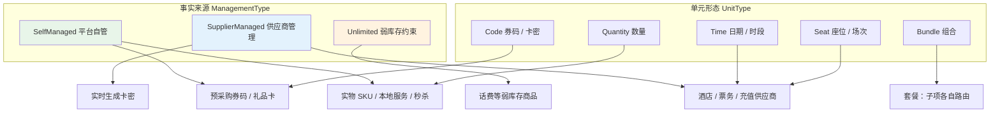
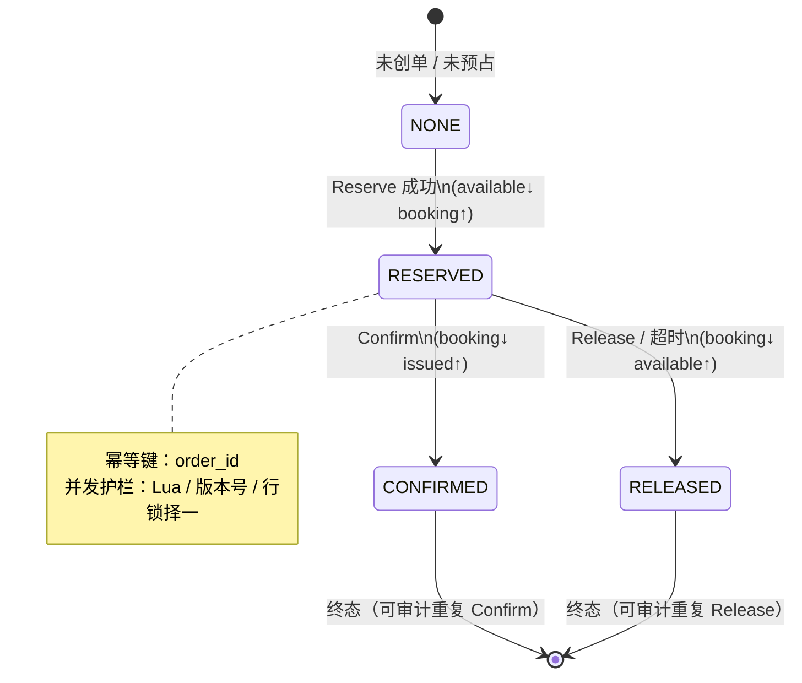
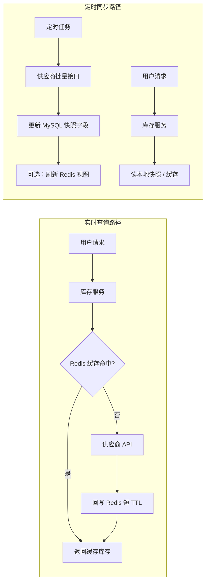
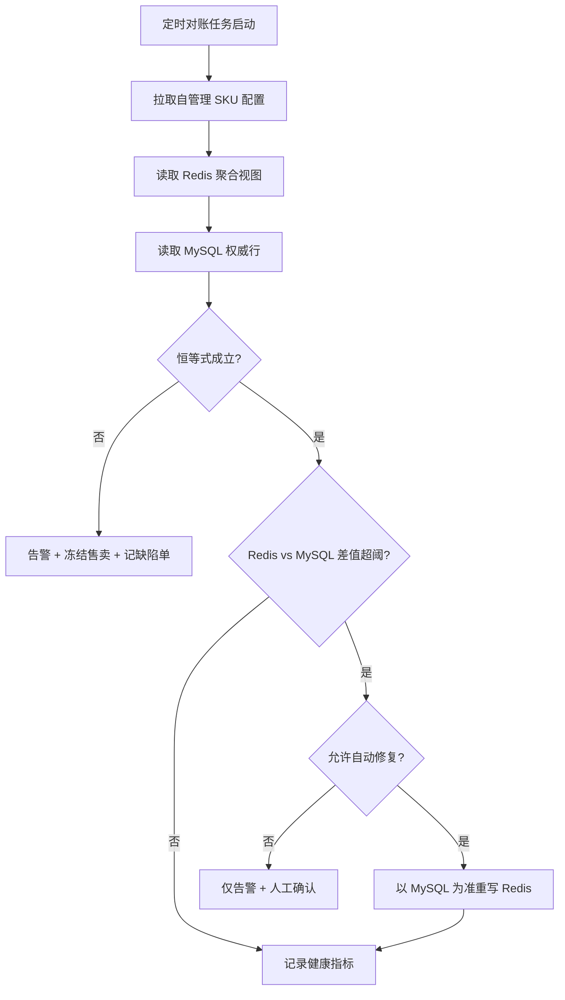
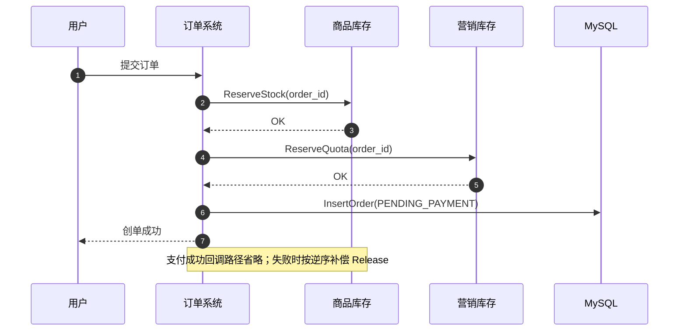

**导航**：[书籍主页](../../README.md) | [完整目录](../../SUMMARY.md) | [上一章：第8章](./chapter7.md) | [下一章：第10章](./chapter9.md)

---

# 第9章 库存系统

> **本章定位**：库存是交易链路的硬约束之一。本章先从通用库存系统出发，解释库存为什么不是一个简单数字，而是一种可承诺供给能力；再用库存对象、库存范围、事实来源、单元形态和扣减时机抽象多品类差异，最后落到虚拟商品库存的券码、充值、供应商实时生成、Redis 原子扣减、账本对账与补偿实践。

---

## 9.1 背景与挑战

### 9.1.1 库存系统的本质

库存系统管理的不是一个简单数字，而是平台对用户的一种**可承诺供给能力**：

```text
某个售卖对象
  在某个库存范围
  某个时间窗口
  某种业务约束下
  还能承诺给用户多少
```

这句话比“SKU 还有多少件”更接近真实电商。实物电商要考虑仓库、门店、调拨、发货；本地生活要考虑门店、券码、活动名额；酒店要考虑日期、房型、供应商确认；票务要考虑场次、座位、出票；虚拟商品要考虑卡密、充值、供应商实时生成和不可逆履约。

因此，库存系统的第一原则不是“扣一个数”，而是：

> 在高并发、可重试、可能失败的交易链路里，稳定地回答“能不能卖”，并把每一次承诺、占用、确认、释放、补偿都记录清楚。

从通用库存视角看，库存至少有五种状态语义：

| 语义 | 含义 | 常见字段 |
|------|------|----------|
| 总库存 | 平台或供应商声明的库存规模 | `total_stock` |
| 可售库存 | 当前还能承诺给用户的数量 | `available_stock` |
| 预占库存 | 已被订单占用但未最终成交 | `booking_stock/reserved_stock` |
| 锁定库存 | 被风控、运营、活动或异常处理临时锁住 | `locked_stock` |
| 已售库存 | 已经确认成交或已经出库 / 出码 / 出票 | `sold_stock/issued_stock` |

库存语义混淆的答辩提示已统一收录到[附录B](../../appendix/interview.md)。

### 9.1.2 从通用库存到虚拟商品库存

通用库存系统先解决“可售承诺”的建模问题，再针对不同品类选择不同策略。虚拟商品没有传统仓库和物流，但它不是更简单，而是把仓储复杂度换成了履约和一致性复杂度：券码不能重复发，充值提交后不能随便撤回，供应商实时生成可能超时，卡密泄露会变成资损。

| 场景 | 库存形态 | 核心难点 | 技术手段 |
|------|----------|----------|----------|
| 实物电商 | 仓库 / 门店 / 批次数量 | 仓配范围、锁库、出库、退货回补 | 库存范围建模、账本流水、WMS 对接、预占释放 |
| 本地生活 | SKU 数量、门店配额、券码 | 门店可用、券码唯一、营销叠加 | Scope 维度、券码池、商品库存 + 营销库存双预占 |
| 酒店 | 房型 + 日期库存 | 连住多晚、供应商同步延迟、下单二次确认 | 日期切片、快照 + 实时刷新、供应商 booking |
| 票务 / 机票 | 场次、座位、舱位 | 强动态库存、出票不可逆 | 短缓存、实时查询、异步出票状态机 |
| 数字券 / 礼品卡 | 卡密 / code | 防重复出码、卡密安全、空池补货 | 码池状态机、Redis LIST、加密存储、出码幂等 |
| 话费 / 充值 | 无限或供应商实时额度 | 平台无实物库存但履约可能失败 | 无限库存策略、供应商错误分级、补偿工单 |

所以这一章的叙事顺序应该是：先建立通用库存系统，再过渡到虚拟商品库存类型。后文的 Redis Lua、供应商同步、对账补偿，本质上都是服务于这些难点，而不是为了展示某个技术组件。

### 9.1.3 核心难点与解决手段

库存系统的技术含量集中在“高并发下把承诺做对，失败后能修回来”。

| 难点 | 典型表现 | 为什么难 | 解决手段 |
|------|----------|----------|----------|
| 并发超卖 | 多个用户同时抢同一 SKU，库存被扣成负数 | Check 和扣减分离会产生竞态 | Redis Lua、DB CAS、行锁、库存分片 |
| 重复扣减 | 支付回调重放、接口超时重试、消息重复消费 | 分布式系统默认至少一次 | `order_id/event_id` 幂等键、唯一约束、状态机 |
| 预占泄漏 | 下单占库存但用户不支付 | 订单、支付、库存异步推进 | TTL、延时队列、定时扫描、幂等 Release |
| 热点库存 | 秒杀单 SKU 形成 Redis 热 Key | 单 Key QPS 打满单线程 | 限流、库存分片、令牌桶、队列削峰 |
| 多库存联动 | 商品库存成功，营销库存失败 | 多资源无法本地事务提交 | Saga、逆序补偿、补偿任务、人工门闩 |
| 供应商不确定 | 查询超时、库存过期、异步确认晚到 | 外部系统不可控 | 快照、实时查询、熔断、供应商 booking 表 |
| 库存漂移 | Redis、MySQL、订单预占记录不一致 | 热路径和账本路径分离 | 库存流水、聚合对账、Outbox、修复任务 |
| 虚拟履约不可逆 | 卡密已发、充值已提交后失败 | 回滚不等于把数字加回来 | 履约状态机、发货幂等、人工核损 |

这张表也决定了本章的技术主线：**账本模型保证可追溯，原子扣减保证并发安全，幂等状态机保证可重试，对账补偿保证最终修复，供应商适配保证外部不确定性可控**。

### 9.1.4 设计目标

| 目标 | 说明 | 优先级 |
|------|------|--------|
| **统一模型** | 用库存对象、库存范围、事实来源、扣减时机抽象多品类 | P0 |
| **强语义 API** | 对外只暴露 Check / Reserve / Confirm / Release / Refund，不暴露表字段 | P0 |
| **高并发安全** | 热路径采用 Redis Lua、DB CAS、分片库存或队列削峰 | P0 |
| **幂等可重试** | 所有写操作都有业务幂等键和状态机终态 | P0 |
| **账本可追溯** | 每次入库、预占、确认、释放、调整都有流水 | P0 |
| **最终一致** | Redis、MySQL、订单、供应商视图通过对账补偿收敛 | P0 |
| **边界清晰** | 库存只负责可售承诺，不负责价格、优惠、履约规则和订单生命周期 | P0 |

**容量与并发视角的补充**：库存系统往往是交易洪峰的第一扇闸门。当创单 QPS 在短时间内抬升一个数量级时，最先暴露的通常不是 CPU，而是热 Key、连接池、消息堆积与下游供应商配额。因此在需求阶段就要区分两类指标：对用户承诺的创单成功率，以及对内部承诺的库存服务自身 SLO，例如 Reserve P99、对账修复时延、补偿积压量。两者混谈会导致“系统看起来没挂，但用户体验已经崩了”。

---

## 9.2 通用库存模型与分类体系

### 9.2.1 四个建模问题

设计库存系统时，不应该先问“用 Redis 还是 MySQL”，而应该先问四个建模问题：

| 问题 | 含义 | 示例 |
|------|------|------|
| 库存对象是什么 | 被承诺和扣减的最小业务对象 | `sku_id`、`offer_id`、房型、场次、券批次 |
| 库存范围是什么 | 这份库存在哪个范围内可用 | 仓库、门店、城市、渠道、日期、批次、供应商 |
| 库存事实来源是谁 | 谁对库存真实性负责 | 平台自管、供应商管理、无限库存 |
| 扣减时机是什么 | 什么时候把可售变成占用或已售 | 下单、支付、发货、供应商确认 |

这四个问题共同决定库存 Key、数据表唯一键、缓存 Key、扣减策略和对账维度。缺少“库存范围”时，系统很容易只支持虚拟商品数量制，一旦接入仓库、门店、酒店日期或活动独占库存，就会开始堆 `if category == xxx`。

### 9.2.2 库存范围：从 SKU 到可售承诺

通用库存的核心 Key 不是单纯 `sku_id`，而是：

```text
inventory_key =
  sku_id
  + scope_type / scope_id
  + calendar_date / time_slot
  + batch_id
  + channel_id
  + supplier_id
```

不同业务可以裁剪维度，但不能把范围概念抹掉。

| 范围维度 | 解决什么问题 | 典型场景 |
|----------|--------------|----------|
| 仓库 / 门店 | 用户从哪里发货或核销 | 实物电商、到店券 |
| 城市 / 站点 | 哪些区域可售 | 本地生活、跨境站点 |
| 日期 / 时段 | 哪一天或哪一场可售 | 酒店、票务、预约服务 |
| 批次 | 哪批货、哪批券码、哪批卡密 | 礼品卡、预采购券码 |
| 渠道 | App、Web、直播、B 端渠道是否共享库存 | 渠道独占、大促限量 |
| 活动 | 活动库存是否从商品库存切出 | 秒杀、限时抢购 |
| 供应商 | 外部库存和预订接口归属 | 酒店、票务、充值 |

工程上建议把库存范围抽象成 `scope_type + scope_id`，再把日期、批次、渠道作为显式字段。这样既能保持查询可控，也能让业务表达足够清晰。

### 9.2.3 账本、聚合与热视图

一个可恢复的库存系统通常至少有四类数据：

| 数据 | 一句话定位 | 技术重点 |
|------|------------|----------|
| `inventory_config` | 这份库存采用什么策略 | 策略路由、供应商、扣减时机、是否允许超卖 |
| `inventory_balance` | 当前聚合库存视图 | 唯一键、CAS 更新、恒等式校验 |
| `inventory_reservation` | 某个订单占了什么库存 | 幂等、过期时间、终态状态机 |
| `inventory_ledger` | 每一次库存变化的事实流水 | 可追溯、可重放、对账依据 |
| Redis 热视图 | 高并发读写投影 | Lua 原子性、TTL、可重建 |

最重要的设计原则是：

> Redis 是热路径投影，不是最终账本。库存事故恢复时，应以 MySQL 账本、预占记录、订单状态和供应商最终态为准。

通用模型可以这样组织：

```sql
CREATE TABLE inventory_config (
  id BIGINT PRIMARY KEY AUTO_INCREMENT,
  inventory_key VARCHAR(128) NOT NULL,
  item_id BIGINT NOT NULL,
  sku_id BIGINT NOT NULL DEFAULT 0,
  scope_type VARCHAR(32) NOT NULL DEFAULT 'GLOBAL'
    COMMENT 'GLOBAL/WAREHOUSE/STORE/CITY/CHANNEL/DATE/SUPPLIER',
  scope_id VARCHAR(64) NOT NULL DEFAULT '0',
  management_type INT NOT NULL COMMENT '1=自管理,2=供应商,3=无限',
  unit_type INT NOT NULL COMMENT '1=券码,2=数量,3=时间,4=组合',
  deduct_timing INT NOT NULL DEFAULT 1 COMMENT '1=下单,2=支付,3=发货,4=供应商确认',
  supplier_id BIGINT NOT NULL DEFAULT 0,
  sync_strategy INT NOT NULL DEFAULT 0 COMMENT '1=定时,2=实时,3=推送',
  oversell_allowed TINYINT NOT NULL DEFAULT 0,
  low_stock_threshold INT NOT NULL DEFAULT 100,
  status INT NOT NULL DEFAULT 1,
  UNIQUE KEY uk_inventory_key (inventory_key),
  KEY idx_item_sku (item_id, sku_id)
);

CREATE TABLE inventory_balance (
  id BIGINT PRIMARY KEY AUTO_INCREMENT,
  inventory_key VARCHAR(128) NOT NULL,
  item_id BIGINT NOT NULL,
  sku_id BIGINT NOT NULL,
  scope_type VARCHAR(32) NOT NULL,
  scope_id VARCHAR(64) NOT NULL,
  batch_id BIGINT NOT NULL DEFAULT 0,
  calendar_date DATE DEFAULT NULL,
  total_stock INT NOT NULL DEFAULT 0,
  available_stock INT NOT NULL DEFAULT 0,
  booking_stock INT NOT NULL DEFAULT 0,
  locked_stock INT NOT NULL DEFAULT 0,
  sold_stock INT NOT NULL DEFAULT 0,
  supplier_stock INT NOT NULL DEFAULT 0,
  supplier_sync_time BIGINT NOT NULL DEFAULT 0,
  version BIGINT NOT NULL DEFAULT 0,
  updated_at DATETIME NOT NULL,
  UNIQUE KEY uk_inventory_key (inventory_key),
  KEY idx_sku_scope (sku_id, scope_type, scope_id),
  KEY idx_date (calendar_date)
);

CREATE TABLE inventory_reservation (
  id BIGINT PRIMARY KEY AUTO_INCREMENT,
  reservation_id VARCHAR(64) NOT NULL,
  inventory_key VARCHAR(128) NOT NULL,
  order_id VARCHAR(64) NOT NULL,
  qty INT NOT NULL,
  status VARCHAR(32) NOT NULL
    COMMENT 'RESERVED/CONFIRMED/RELEASED/EXPIRED/CANCELLED',
  expire_at DATETIME DEFAULT NULL,
  idempotency_key VARCHAR(128) NOT NULL,
  created_at DATETIME NOT NULL,
  updated_at DATETIME NOT NULL,
  UNIQUE KEY uk_reservation_id (reservation_id),
  UNIQUE KEY uk_order_inventory (order_id, inventory_key),
  UNIQUE KEY uk_idempotency (idempotency_key)
);

CREATE TABLE inventory_ledger (
  id BIGINT PRIMARY KEY AUTO_INCREMENT,
  ledger_id VARCHAR(64) NOT NULL,
  inventory_key VARCHAR(128) NOT NULL,
  order_id VARCHAR(64) DEFAULT NULL,
  event_id VARCHAR(64) DEFAULT NULL,
  change_type VARCHAR(32) NOT NULL
    COMMENT 'INBOUND/RESERVE/CONFIRM/RELEASE/REFUND/LOCK/UNLOCK/ADJUST',
  qty_delta INT NOT NULL,
  before_payload JSON DEFAULT NULL,
  after_payload JSON DEFAULT NULL,
  reason VARCHAR(256) DEFAULT NULL,
  operator_type VARCHAR(32) NOT NULL COMMENT 'SYSTEM/ORDER/OPS/SUPPLIER/RECONCILE',
  created_at DATETIME NOT NULL,
  UNIQUE KEY uk_ledger_id (ledger_id),
  UNIQUE KEY uk_event_id (event_id),
  KEY idx_inventory_time (inventory_key, created_at),
  KEY idx_order (order_id)
);
```

对于券码制，还要单独增加 `inventory_code_pool_XX` 分表。这个表不是普通库存表的附属字段，而是虚拟商品、卡密、兑换券、权益码等「唯一资源」的权威账本：**一码一行、状态机驱动，Redis LIST 只保存 `code_id` 热数据，权威仍在 MySQL**。

#### 券码池分表：inventory_code_pool_XX

数量制库存扣减的是 `available_stock`，券码制库存扣减的是某一条真实存在的码。只要业务需要向用户交付一个不可重复的串码，就不能把 Redis LIST 里的字符串当成事实来源，否则会遇到三类严重问题：

- Redis 宕机、回滚或误删后，无法解释哪些码已经分配给哪个订单；
- LIST 里直接存明文券码，内存、日志、监控和排障链路都可能泄漏敏感资源；
- 取消、支付确认、发码失败、售后和过期处理没有统一状态机，极易重复发码或把已交付的码放回可售池。

推荐模型如下：

```sql
CREATE TABLE inventory_code_pool_00 (
  id BIGINT PRIMARY KEY AUTO_INCREMENT,
  code_id BIGINT NOT NULL,
  batch_id VARCHAR(64) NOT NULL,
  inventory_key VARCHAR(128) NOT NULL,
  sku_id BIGINT NOT NULL,
  code_cipher VARBINARY(1024) NOT NULL COMMENT '加密后的券码或卡密',
  code_hash VARCHAR(64) NOT NULL COMMENT '去重与排查使用，不保存明文',
  status VARCHAR(32) NOT NULL
    COMMENT 'AVAILABLE/BOOKING/SOLD/LOCKED/EXPIRED/INVALID',
  reservation_id VARCHAR(64) DEFAULT NULL,
  order_id VARCHAR(64) DEFAULT NULL,
  user_id BIGINT DEFAULT NULL,
  booked_at DATETIME DEFAULT NULL,
  sold_at DATETIME DEFAULT NULL,
  expire_at DATETIME DEFAULT NULL,
  version BIGINT NOT NULL DEFAULT 0,
  created_at DATETIME NOT NULL,
  updated_at DATETIME NOT NULL,
  UNIQUE KEY uk_code_id (code_id),
  UNIQUE KEY uk_batch_hash (batch_id, code_hash),
  KEY idx_batch_status_id (batch_id, status, id),
  KEY idx_order (order_id),
  KEY idx_reservation (reservation_id)
) ENGINE=InnoDB DEFAULT CHARSET=utf8mb4 COMMENT='库存券码池分表00';
```

分表路由通常按 `batch_id` 或 `code_id` 做一致性哈希，也可以按 `inventory_key + batch_id` 固定到某个分片。关键原则是：活动开始后不要改变路由规则；补货、锁码、支付确认、取消释放、对账修复都必须命中同一个权威分片。批次维度可以配合 `inventory_code_batch` 保存供应商、面值、有效期、导入批次、加密密钥版本、总码量和当前水位。

券码池的状态机建议收敛为：

```text
AVAILABLE --reserve--> BOOKING --confirm/pay--> SOLD
BOOKING --cancel/timeout--> AVAILABLE
AVAILABLE --ops/supplier--> LOCKED
AVAILABLE --expire--> EXPIRED
AVAILABLE --quality_check--> INVALID
```

这里有一个重要约束：**已发给用户或已核销链路可见的 `SOLD` 码，不能简单回到 `AVAILABLE`**。退款、补发、作废应走售后和履约状态，而不是把同一串码再次投入可售池。这个约束能显著降低重复发码、用户投诉和供应商对账争议。

高并发出码链路可以这样设计：

```text
1. 大促前按批次把可售 code_id 预热到 Redis LIST：
   inventory:code:pool:{batch_id}:{shard}

2. 下单预占时从 Redis LIST 弹出一批 code_id。

3. 应用逐个执行 MySQL CAS：
   UPDATE inventory_code_pool_XX
   SET status='BOOKING',
       reservation_id=?,
       order_id=?,
       user_id=?,
       booked_at=NOW(),
       version=version+1,
       updated_at=NOW()
   WHERE code_id=? AND status='AVAILABLE';

4. 更新成功才算锁码成功，同时写 inventory_reservation 与 inventory_ledger。

5. 更新失败说明 Redis 中是陈旧 code_id，丢弃后继续取下一个，不把 Redis 结果视为成功。

6. 支付成功后 BOOKING -> SOLD；订单取消或超时后 BOOKING -> AVAILABLE，并通过 Outbox 或补偿任务把 code_id 回填到 Redis LIST。
```

因此 Redis 的角色只是「热队列」：只放 `code_id`，不放明文码；只提升吞吐，不承担库存权威职责。Redis LIST 为空时，补货 Worker 按 `idx_batch_status_id` 用 `id` 游标分页扫描 MySQL 可用码并回填；Redis 故障后，也可以从 MySQL 的 `AVAILABLE` 状态全量重建热队列。监控上要同时看 MySQL 可用码数量、Redis LIST 长度、锁码 CAS 失败率、BOOKING 超时释放量和 SOLD 重复告警。

### 9.2.4 多维分类模型

统一库存的关键，是把品类差异拆成几个正交维度，而不是让每个品类复制一套服务。

```go
// ManagementType：谁拥有库存事实来源
const (
	SelfManaged      = 1 // 平台自管：平台维护可用量与流水
	SupplierManaged  = 2 // 供应商管理：平台保存快照 + 同步策略
	Unlimited        = 3 // 无限库存：不维护可用量，但保留审计与风控
)

// UnitType：库存如何被扣减与表达
const (
	CodeBased     = 1 // 券码制：最小粒度为唯一 code
	QuantityBased = 2 // 数量制：最小粒度为整数数量
	TimeBased     = 3 // 时间维度：按日期 / 时段切片
	BundleBased   = 4 // 组合型：多子项联动扣减
	SeatBased     = 5 // 座位制：场次 + 座位 / 舱位
)

// DeductTiming：什么时候改变库存承诺
const (
	DeductOnOrder           = 1 // 下单预占
	DeductOnPay             = 2 // 支付后确认
	DeductOnFulfillment     = 3 // 发货 / 发码 / 出票时确认
	DeductOnSupplierConfirm = 4 // 供应商确认后确认
)
```

四个维度的组合决定策略路由：

```text
InventoryStrategy =
  ManagementType
  + UnitType
  + ScopeType
  + DeductTiming
```

例如：

```text
自管理 + 数量制 + GLOBAL + 下单预占
  → Redis Lua 数量扣减策略

自管理 + 券码制 + BATCH + 下单预占
  → Redis LIST 取码 + MySQL 码池状态机

供应商管理 + 时间维度 + DATE + 供应商确认
  → 本地快照 + 下单实时刷新 + supplier_booking 轮询

无限库存 + 无范围 + 支付后履约
  → 不扣库存，但写履约审计和风控流水
```

### 9.2.5 品类分类矩阵

下表将常见品类映射到通用模型。它不是为了枚举业务，而是为了帮助团队识别“这类库存难在哪里，应该选哪组技术手段”。

| 品类 | 管理类型 | 单元类型 | 库存范围 | 推荐扣减时机 | 技术重点 |
|------|----------|----------|----------|--------------|----------|
| 实物电商普通 SKU | Self | Quantity | 仓库 / 门店 | 下单预占或支付确认 | 仓配范围、锁库、出库回补 |
| 秒杀商品 | Self | Quantity | 活动 / 渠道 | 下单预占 | 热点 Key、限流、库存分片 |
| 本地生活服务券 | Self | Quantity | 门店 / 城市 | 下单预占 | 门店可用、营销双预占 |
| 电子券 Deal | Self | Code | 券码批次 | 下单预占 | 码池、锁码、出码幂等 |
| 酒店 | Supplier | Time | 日期 / 供应商 | 支付或供应商确认 | 日历库存、实时确认、供应商 booking |
| 机票 / 票务 | Supplier | Seat / Time | 航班 / 场次 / 座位 | 支付前后组合 | 短缓存、强刷新、异步出票 |
| 话费 TopUp | Unlimited / Supplier | Quantity | 供应商 | 支付后履约 | 无平台库存、履约失败补偿 |
| 礼品卡预采购 | Self | Code | 批次 | 下单预占 | 卡密安全、空池补货 |
| 礼品卡实时生成 | Supplier | Code | 供应商 | 支付后生成 | 供应商超时、生成幂等 |
| 组合套餐 | Self / Supplier | Bundle | 子 SKU 各自范围 | 下单预占 | 固定扣减顺序、Saga 补偿 |

下面的矩阵图用“事实来源 × 单元形态”表达组合空间，具体落地时再叠加库存范围和扣减时机。



> **与营销库存的关系**：商品库存回答“有没有货”，营销库存回答“活动名额 / 补贴预算够不够”。秒杀等场景往往需要双扣减（商品 + 营销），本章在 9.7 节说明集成边界；营销细节见第 10 章。

### 9.2.6 库存创建：从商品发布到库存实例

库存系统不能只设计扣减，还要设计 **库存从哪里来、什么时候创建、创建到什么粒度、失败后如何重放**。商品发布只说明“这个 SKU 可以售卖”，不一定说明“库存实例已经准备好”。库存创建的目标，是把商品中心的销售契约转成库存域可扣减、可对账、可恢复的实例。

库存创建通常来自五类入口：

| 创建入口 | 典型触发 | 创建内容 |
|----------|----------|----------|
| 商品发布 | SKU / Offer 生效事件 | `inventory_config`、默认库存范围、初始 `inventory_balance` |
| 运营导入 | 后台填数量、上传券码、批量配置门店 | 数量库存、券码批次、门店库存、日期库存 |
| 供应商同步 | 外部商品 / 房态 / 配额同步 | 供应商映射、本地快照、可售时间切片 |
| 系统生码 | 平台自营券、礼品卡、活动码生成 | `inventory_code_batch`、`inventory_code_pool_XX` |
| 日历物化 | 酒店、预约、场次滚动开放 | 日期 / 时段 / 门店维度的库存行 |

工程上建议把库存创建做成命令和任务，而不是在商品发布事务里直接写完所有库存行：

```text
ProductPublished / OpsImportSubmitted / SupplierSnapshotReady
  → InventoryCreateCommand
  → inventory_create_task
  → InventoryInitWorker
  → inventory_config / inventory_balance / inventory_code_pool_XX
  → Redis 热视图预热
  → InventoryReady / InventoryCreateFailed
```

创建命令至少包含这些字段：

```text
CreateInventoryCommand
├── source_type：PRODUCT_PUBLISH / OPS_IMPORT / SUPPLIER_SYNC / CODE_GENERATION
├── source_id：发布版本、导入任务、供应商批次或生码任务
├── item_id / sku_id / offer_id
├── management_type：平台自管 / 供应商管理 / 无限库存
├── unit_type：数量 / 券码 / 时间 / 座位 / 组合
├── scope_type / scope_id：GLOBAL / STORE / CITY / WAREHOUSE / DATE / CHANNEL
├── batch_id：券码批次或货品批次
├── calendar_date / time_slot：日期或时段
├── initial_quantity：初始数量
├── code_source：IMPORTED / SYSTEM_GENERATED / SUPPLIER_GENERATED
└── idempotency_key：防重复创建
```

任务表可以这样设计：

```sql
CREATE TABLE inventory_create_task (
  id BIGINT PRIMARY KEY AUTO_INCREMENT,
  task_id VARCHAR(64) NOT NULL,
  source_type VARCHAR(32) NOT NULL
    COMMENT 'PRODUCT_PUBLISH/OPS_IMPORT/SUPPLIER_SYNC/CODE_GENERATION/CALENDAR_MATERIALIZE',
  source_id VARCHAR(128) NOT NULL,
  item_id BIGINT NOT NULL,
  sku_id BIGINT NOT NULL,
  inventory_key VARCHAR(128) NOT NULL,
  create_mode VARCHAR(32) NOT NULL
    COMMENT 'QUANTITY/CODE_IMPORT/CODE_GENERATE/TIME_STORE/SUPPLIER_SNAPSHOT',
  payload JSON NOT NULL,
  status VARCHAR(32) NOT NULL
    COMMENT 'PENDING/RUNNING/SUCCESS/FAILED/PARTIAL_SUCCESS/CANCELLED',
  retry_count INT NOT NULL DEFAULT 0,
  error_code VARCHAR(64) DEFAULT NULL,
  error_message VARCHAR(1024) DEFAULT NULL,
  created_at DATETIME NOT NULL,
  updated_at DATETIME NOT NULL,
  UNIQUE KEY uk_task_id (task_id),
  UNIQUE KEY uk_source_inventory (source_type, source_id, inventory_key),
  KEY idx_status_updated (status, updated_at)
) ENGINE=InnoDB DEFAULT CHARSET=utf8mb4 COMMENT='库存创建任务';
```

不同库存形态的创建方式不同：

| 类型 | 创建粒度 | 关键动作 | 风险控制 |
|------|----------|----------|----------|
| 简单数量库存 | `inventory_key` 一行 | 创建 `inventory_config`，写 `inventory_balance(total/available)`，写 `INBOUND/INIT` 流水 | 幂等键防重复入库，调整库存不能绕过账本 |
| 门店数量库存 | `sku_id + store_id` | 每个门店一行 `inventory_balance`，`scope_type=STORE` | 门店上下线要锁定或迁移库存 |
| 日期 / 时段库存 | `sku_id + store_id + date + slot` | 按滚动窗口物化未来 N 天，或首次查询懒创建 | 不要一次性创建无限日历；跨日、节假日、最小提前预约要校验 |
| 外部供应商库存 | `supplier_id + external_sku + date` | 创建配置和映射，写本地快照，扣减前强刷或预订 | 本地快照不是最终承诺，必须保留新鲜度时间 |
| 导入券码库存 | `batch_id + code_id` | 创建 `inventory_code_batch`，逐行写 `inventory_code_pool_XX`，预热 Redis `code_id` | 明文只在导入和加密环节短暂存在，唯一哈希防重复 |
| 系统生成券码 | `batch_id + code_id` 或 `order_id + code_id` | 预生成 N 个码进入码池，或支付后按订单幂等生成并立即落库 | 生成算法要防猜测，返回给用户前必须先有 MySQL 权威行 |

数量库存最简单，但也不应该直接改一个 `stock` 字段。推荐流程是：

```text
1. 校验 SKU / Offer 是否已经发布并可售。
2. 根据 scope 生成 inventory_key。
3. 幂等创建 inventory_config。
4. Upsert inventory_balance：
   total_stock += initial_quantity
   available_stock += initial_quantity
5. 写 inventory_ledger(change_type=INBOUND 或 INIT)。
6. 刷新 Redis 热视图和搜索可售标签。
```

券码库存要多一个批次对象：

```text
inventory_code_batch
├── batch_id
├── inventory_key / sku_id
├── code_source：IMPORTED / SYSTEM_GENERATED / SUPPLIER_GENERATED
├── generation_mode：PRE_GENERATED / ON_DEMAND
├── total_count / available_count
├── expire_at
├── encrypt_key_version
├── route_shard
└── status：CREATING/READY/LOCKED/EXHAUSTED/FAILED
```

如果是运营或供应商导入券码，Worker 要逐行做格式校验、去重、加密、哈希、分表落库，再把 `code_id` 批量灌入 Redis LIST。如果是系统自己生成券码，有两种模式：

- **预生成**：活动开始前生成一批随机不可猜测的券码，全部进入 `inventory_code_pool_XX`，适合大促高并发发码。
- **按需生成**：支付或履约阶段按 `order_id + sku_id` 幂等生成，先写入码池权威行，再展示给用户，适合低峰值或强个性化券码。

无论哪种模式，都不能只把生成出来的字符串返回给用户而不落库。正确顺序是：**生成 / 导入 → 加密落 MySQL → 状态机进入 AVAILABLE 或 BOOKING → 必要时预热 Redis `code_id` → 发码时再解密展示**。

门店、日期和时段库存则要关注“物化范围”。例如本地生活门店券可以是：

```text
inventory_key =
  sku_id
  + scope_type=STORE
  + scope_id=store_1001
  + calendar_date=2026-05-01
  + time_slot=DINNER
```

平台可以提前物化未来 30 天或 90 天的库存行，也可以在首次查询 / 首次预约时懒创建。前者查询快但写放大明显；后者节省存储但需要处理并发首次创建。推荐对高流量品类提前物化，对长尾门店懒创建，并用唯一键保证同一门店同一天同一时段只创建一行。

库存创建的成功标准不是“任务跑完”，而是这些对象都进入可解释状态：

1. `inventory_config` 能解释策略路由；
2. `inventory_balance` 或 `inventory_code_pool_XX` 能解释可售资源；
3. `inventory_ledger` 能解释库存从哪里来；
4. Redis 热视图可从 MySQL 重建；
5. 搜索 / 商品聚合读模型能感知可售状态；
6. 创建失败可以按 `inventory_create_task` 重试、部分成功回滚或人工修复。

### 9.2.7 虚拟商品库存的特化

虚拟商品库存可以复用通用库存模型，但需要额外突出四个风险：

1. **发货不可逆**：充值、出票、发码一旦提交供应商或展示给用户，不能简单回滚。
2. **唯一资源泄露**：卡密、券码属于敏感资产，不能在日志、消息、搜索索引里明文扩散。
3. **供应商最终态晚到**：平台支付成功不代表供应商履约成功，必须有 pending、confirmed、failed、manual 状态。
4. **空池与补货**：预采购券码可能卖空，补货既要高效又不能重复装载同一码。

| 虚拟库存类型 | 通用模型映射 | 特殊难点 | 关键技术点 |
|--------------|--------------|----------|------------|
| 数量制虚拟商品 | Self + Quantity | 高并发超卖 | Redis Lua、幂等预占、异步落库 |
| 券码 / 卡密制 | Self + Code | 一码一货、防重复出码 | 码池状态机、Redis LIST、加密存储 |
| 无限库存 | Unlimited | 无库存但有履约失败 | 审计流水、风控阈值、供应商错误分级 |
| 供应商实时生成 | Supplier + Code | 钱已收但生成失败 | supplier_request 幂等、补偿轮询、人工核损 |
| 时间 / 场次类 | Supplier + Time / Seat | 快照过期、下单二次确认 | 短 TTL、实时刷新、供应商 booking |
| 组合虚拟套餐 | Bundle | 子项部分成功 | Saga、固定顺序、逆序补偿 |

一句话总结：

> 虚拟商品不是“没有库存”，而是库存从仓库货架变成了数量承诺、唯一凭证、供应商额度和不可逆履约状态。

### 9.2.8 可售库存计算

库存系统对外暴露的不是 `total_stock`，而是可售判断。可售库存的计算要分管理类型：

```text
SelfManaged:
  sellable = total_stock - booking_stock - locked_stock - sold_stock

SupplierManaged:
  sellable = min(platform_snapshot, supplier_latest_confirmation)

Unlimited:
  sellable = business_limit_or_sentinel
```

对于自管理库存，要维护恒等式：

```text
total_stock = available_stock + booking_stock + locked_stock + sold_stock
```

对于供应商库存，平台本地的 `supplier_stock` 只是最后一次可见快照，不一定代表下单瞬间真实库存。因此供应商管理品类通常采用两段式：

```text
列表页 / 详情页：
  读本地快照 + 短 TTL 缓存

创单 / 支付前：
  实时刷新或创建 supplier_booking
```

这样可以把“展示性能”和“交易安全”分开，避免为了列表页性能牺牲创单正确性。

---

## 9.3 库存扣减策略

### 9.3.1 扣减时机

扣减时机是交易体验与资损风险的权衡轴：

- **下单预占（Reserve / Book）**：用户体验好（下单即锁货），但占用时长内库存不可用，需要可靠的超时释放。
- **支付后扣减（Sell on pay）**：减少无效占用，更适合供应商成本高或确认链路长的品类。
- **发货扣减**：实物电商更常见；数字商品平台多用前两者的组合。

工程上建议把时机写入 `inventory_config.deduct_timing`，由订单 / 结算编排读取，而不是散落在订单代码的 `switch`。

**配置值与交易编排的契约**：`deduct_timing` 只是标签，真正决定行为的是订单状态机与库存 API 的组合。推荐在内部文档中固定一张「状态 × 库存动作」表，例如：`PENDING_PAYMENT → Release`、`PAID → Confirm`、`CLOSED → Release(幂等)`。当同一品类在不同国家 / 不同供应商合同中扣减时机不同，用配置驱动可以避免为每个市场复制一套订单服务。

### 9.3.2 预占与确认

**预占（Reserve）** 的本质：把「可售」迁移到「已占用（booking）」状态，并保证操作原子、可幂等、可追踪。

**确认（Confirm / Sell）** 的本质：把「占用」迁移到「已售（sold / issued）」，并与支付成功事件对齐。

自管理数量制的状态迁移（Redis HASH 字段视角）：

```text
available --(reserve)--> booking --(confirm)--> issued
available <---(release)--- booking
```

券码制则是 `AVAILABLE → BOOKING → SOLD` 的状态机，失败路径需要可逆。

**策略模式落地（路由与编排解耦）**：业务层只依赖统一的 `InventoryManager`（或应用服务），由它读取 `inventory_config` 后选择策略实现。这样「新品类接入」优先体现为 **配置 + 策略类**，而不是修改订单核心代码。

```go
// InventoryStrategy 抽象了库存生命周期中可被统一编排的动作集合。
type InventoryStrategy interface {
	CheckStock(ctx context.Context, req *CheckStockReq) (*CheckStockResp, error)
	BookStock(ctx context.Context, req *BookStockReq) (*BookStockResp, error)
	UnbookStock(ctx context.Context, req *UnbookStockReq) error
	SellStock(ctx context.Context, req *SellStockReq) error
	RefundStock(ctx context.Context, req *RefundStockReq) error
}

type StrategyRouter struct{}

func (StrategyRouter) MustStrategy(cfg *InventoryConfig) (InventoryStrategy, error) {
	switch cfg.ManagementType {
	case SelfManaged:
		return NewSelfManagedStrategy(cfg), nil
	case SupplierManaged:
		return NewSupplierManagedStrategy(cfg), nil
	case Unlimited:
		return NewUnlimitedStrategy(), nil
	default:
		return nil, fmt.Errorf("unknown management_type=%d", cfg.ManagementType)
	}
}
```

**与「营销锁定」的关系**：数量制 Redis HASH 常会增加 `locked` 以及按 `promotion_id` 维度的动态字段，用于表达「活动独占库存」。商品详情页展示的可售量，与下单强校验使用的可售量，可能不是同一个聚合口径——务必在接口契约里写清楚，避免运营配置误解导致客诉。

### 9.3.3 超时释放

超时释放至少要回答三个问题：**谁来触发？以什么为准？失败如何兜底？**

常见实现组合：

1. **Redis TTL / 预占记录过期**：快速回收「短期锁」。
2. **延时队列**：在创单时投递 `delay=15m` 的任务，到点检查订单是否已支付。
3. **定时扫描**：扫描 `PENDING_PAYMENT` 且超时的订单，幂等调用库存释放接口。

下面的时序图展示「下单预占 → 支付确认 / 超时释放」的主路径（商品库存服务视角）。

```mermaid
sequenceDiagram
  autonumber
  participant O as 订单系统
  participant I as 库存服务
  participant R as Redis
  participant Q as 延时队列
  participant P as 支付系统

  O->>I: ReserveStock(order_id, sku, qty, ttl=15m)
  I->>R: EVAL Lua 原子扣减 available 并增加 booking
  R-->>I: OK
  I-->>O: reserved
  O->>Q: schedule ReleaseStock(order_id) @T+15m

  alt 用户在 TTL 内完成支付
    P-->>O: PaymentSuccess
    O->>I: ConfirmStock(order_id)
    I->>R: booking -= qty; issued += qty
    I-->>O: confirmed
    Note over Q: 可选：取消延时任务（若支持精确去重）
  else 超时未支付
    Q-->>I: ReleaseStock(order_id) 幂等
    I->>R: booking -= qty; available += qty
    I-->>O: released
    O-->>O: CloseOrder(timeout)
  end
```

与上时序图互补，建议再用 **状态机** 固化「预占记录」本身的生命周期（尤其是 Redis 侧 `reservation:{order_id}` 与 DB 影子行并存时）。下图把「可重复进入的幂等终态」标出，避免研发在「重复回调 / 重复释放」上各写一套语义。



**关键细节**：

- **幂等键**：`order_id` 贯穿 Reserve / Confirm / Release，重复调用必须安全。
- **顺序依赖**：若营销与商品双预占，失败回滚顺序应与成功顺序相反（Saga 补偿语义）。

### 9.3.4 超卖防护

超卖防护应分层：

1. **热路径原子性**：Redis Lua 或单分片事务，保证「检查 + 扣减」不可分割。
2. **业务幂等**：同一 `order_id` 重复确认只生效一次。
3. **冷路径校验**：支付回调后，在确认库存前读取 MySQL 侧汇总做二次校验（容忍更高延迟）。
4. **对账兜底**：周期任务发现 `available + booking + sold` 恒等式破坏或 Redis / MySQL 偏差过大，自动冻结商品并告警（见 9.5.2）。

**CheckStock 与 ReserveStock 为什么要拆开？** 只读 Check 适合列表页、加购前的快速失败；但它不能保证并发下的正确性。正确做法是：**创单路径必须以 Reserve 这种「读改写原子操作」为准**，Check 只是辅助。否则会出现「校验时还有货，下单时被抢走」的经典竞态。

**秒杀场景的 Facade（可选优化）**：当商品库存与营销库存必须同事务化编排时，常规做法是订单 Saga 两步调用；在极端 QPS 下可以引入 `FlashSaleInventoryFacade.CheckAndReserve` 聚合接口，把限流、热点治理、重复请求拦截收敛到库存域的专用入口。注意：Facade 是性能与风控的「窄接口」，不要让它反向吞噬订单领域的编排职责。

---

## 9.4 供应商集成

供应商集成本质是 **把「外部库存事实」映射为平台可售视图**，并在预订 / 取消时调用供应商 API 对齐状态。

### 9.4.1 实时查询

**适用**：变化快、对超卖极度敏感（机票、部分热门票务）。

**模式**：

- 读路径：短 TTL 缓存 + 超时控制 + 熔断降级。
- 写路径：同步预订或异步预订（供应商返回 pending 时需轮询，见博客原文异步 booking 状态机）。

**读路径的 Go 骨架（与第 16 章风格一致：先缓存、后供应商、再回写、可观测）**：

```go
// CheckSupplierStock 演示：实时查询 + 短缓存 + 异步快照（示意代码）
func (s *SupplierManagedStrategy) CheckStock(ctx context.Context, req *CheckStockReq) (*CheckStockResp, error) {
	cacheKey := fmt.Sprintf("inventory:supplier:%d:%d:%s", req.ItemID, req.SKUID, req.Date)

	// 1) 先读 Redis 缓存（例如 30s TTL：机票可更短，酒店可更长）
	if v, err := s.rdb.Get(ctx, cacheKey).Int(); err == nil {
		return &CheckStockResp{Available: int32(v), FromCache: true}, nil
	}

	// 2) 供应商调用必须带超时；失败要映射为可重试/不可重试
	ctx, cancel := context.WithTimeout(ctx, 800*time.Millisecond)
	defer cancel()

	resp, err := s.supplier.QueryStock(ctx, &SupplierQuery{
		SupplierID: req.SupplierID,
		ProductID:  req.ExternalProductID,
		Date:       req.Date,
	})
	if err != nil {
		return nil, MapSupplierErr(err) // Retryable / Fatal / Unknown
	}

	// 3) 回写缓存 + 异步落快照（快照用于运营后台、对账与熔断时的最后成功视图）
	_ = s.rdb.Set(ctx, cacheKey, resp.Stock, 30*time.Second).Err()
	go func() {
		bg, cancel := context.WithTimeout(context.Background(), 2*time.Second)
		defer cancel()
		_ = s.snapshot.Save(bg, req.ItemID, req.SKUID, req.Date, resp.Stock, "api")
	}()

	return &CheckStockResp{Available: resp.Stock, FromCache: false}, nil
}
```

**工程要点（把「实时」变成可运营能力）**：

- **缓存击穿**：热点航线/场次在缓存过期瞬间会把供应商 QPS 顶满；需要单飞（singleflight）、随机抖动 TTL、以及网关层按 `supplier_id` 配额限流。
- **错误语义**：`Unknown` 不要当作「0 库存」返回，否则会把用户引导到错误决策；应显式返回「暂不可校验」并由前端降级展示。
- **观测**：必须记录 `from_cache`、`supplier_latency_ms`、`supplier_error_class`，否则线上只能看到「库存服务慢」，无法判断是供应商还是自研逻辑。

### 9.4.2 定时同步

**适用**：变化中等、可接受分钟级延迟（部分酒店库存）。

**模式**：

- 定时任务拉取供应商库存，写入本地 `inventory` 快照字段（如 `supplier_stock`、`supplier_sync_time`）。
- 读路径优先读本地快照，必要时触发「刷新任务」。

### 9.4.3 推送模式

**适用**：供应商能力较强，主动推送房态 / 价格变更。

**要点**：

- Webhook 入口必须鉴权、幂等、重放安全。
- 推送与定时拉取可并存：推送负责快变字段，拉取负责兜底对齐。

### 9.4.4 降级策略

| 触发条件 | 平台行为 | 用户侧体验 |
|----------|----------|------------|
| 供应商超时 | 返回可重试 / 排队；读缓存则明确标注「仅供参考」 | 可能看到「库存紧张」 |
| 连续失败超阈值 | 熔断一段时间，仅允许读取上次成功快照 | 可能暂停售卖 |
| 异步预订 pending 过久 | 进入人工处理队列，避免盲目关单造成纠纷 | 「处理中」 |

下面的架构图对比 **实时查询** 与 **定时同步** 在读路径上的差异（简化）。



**实践建议**：同一家供应商也可能混用（例如酒店：列表页用快照，下单页强刷一次实时），关键是把策略写进配置中心而非写死在代码分支。

**礼品卡横跨多种模式的启示**：预采购卡密（Self + Code）、实时生成卡密（Supplier + Code）、无限库存（Unlimited）往往并存于同一业务线。统一模型的价值在于：团队可以用同一张「策略决策表」讨论边界，而不是在三个服务里分别口述规则。

**异步预订（pending → confirmed）的工程清单**：当供应商只能异步确认时，至少补齐以下构件：`supplier_booking` 映射表、可重入的轮询 worker、超时与人工介入队列、订单侧状态机联动、对账任务对「平台已占 / 供应商未确认」的专项扫描。否则极易出现「钱扣了但供应商没单」或「供应商有单但平台没单」的双向不一致。

---

## 9.5 数据一致性保证

### 9.5.1 Redis 与 MySQL 同步

典型路径是 **「Redis 同步执行，MySQL 异步落库」**：

- **同步**：Lua 脚本更新 Redis 中的 `available/booking/issued` 或券码池。
- **异步**：发送 `InventoryEvent` 到 Kafka，消费者批量写 `inventory_balance` 与 `inventory_ledger`。

| 操作 | Redis | MySQL | 一致性语义 |
|------|-------|-------|--------------|
| 预占 | 同步 Lua | 异步事件 | 最终一致 |
| 确认售出 | 同步 Lua | 异步事件 | 最终一致 |
| 运营强锁 / 黑名单 | 视场景：可同步双写 DB | 强一致需求更高 |

**原则**：

- **Redis 不是账本**：故障恢复应以 MySQL + 日志为准，Redis 可重建。
- **Outbox**（可选）：若要求「绝不丢事件」，在订单或库存事务内写 outbox 表，再异步投递。

**双写与消息丢失的权衡**：纯「先 Redis 后发 Kafka」在进程崩溃时可能丢消息。工程上常见三种增强手段（按成本从低到高）：

1. **同步写库存账本表（简化版 outbox）**：Redis 成功后同步插入 `inventory_ledger`（或写 binlog），再由后台任务投递 MQ；代价是热路径多一次 DB 写。
2. **事务消息 / Outbox**：与业务状态同事务提交，确保「状态变更」与「事件」原子一致。
3. **对账修复为主、消息为辅**：接受短窗口不一致，用对账把差异拉回（适合容忍度稍高、但吞吐极大的场景）。

选型没有银弹：机票酒店类强一致诉求更高，虚拟券码大促类更偏向吞吐与事后修复。

### 9.5.2 对账机制

对账目标不是「每时每刻 Redis == MySQL」，而是 **尽快发现破坏恒等式与异常漂移，并可控修复**。

建议对账维度：

1. **单行恒等式**：`total = available + booking + locked + sold`（字段含义以你的表结构为准）。
2. **跨存储视图**：Redis `available` vs MySQL `available_stock` 差值。
3. **订单侧一致性**：`PENDING_PAYMENT` 订单是否仍存在预占记录；是否出现「仅商品预占成功、营销失败」等半截状态。



**修复策略要谨慎**：自动以 MySQL 覆盖 Redis 适合「Redis 丢数据」类问题；若根因是重复消费导致 MySQL 多减，则应阻断自动修复，先定位消息幂等缺陷。

**对账任务的伪代码骨架（Go）**：对账不仅是数值 diff，更是「缺陷驱动」的运营工具。下面示例强调阈值、恒等式与人工门闩（`auto_reconcile`）。为便于阅读，`abs` / `max` 等函数省略实现。

```go
// 伪代码骨架：abs/max/alert/rewrite 需按项目工具库实现
func ReconcileItem(ctx context.Context, cfg InventoryConfig) error {
	redisAvail := readRedisAvailable(ctx, cfg.ItemID, cfg.SKUID)
	mysqlRow, err := loadInventoryRow(ctx, cfg.ItemID, cfg.SKUID)
	if err != nil {
		return err
	}

	if !mysqlRow.identityOK() {
		return fmt.Errorf("mysql identity broken: item=%d sku=%d", cfg.ItemID, cfg.SKUID)
	}

	diff := redisAvail - mysqlRow.AvailableStock
	if abs(diff) > max(100, mysqlRow.AvailableStock/10) {
		alert(ctx, "large inventory diff", cfg.ItemID, cfg.SKUID, diff)
	}

	if cfg.AutoReconcile {
		return rewriteRedisFromMySQL(ctx, cfg.ItemID, cfg.SKUID, mysqlRow)
	}
	return nil
}
```

### 9.5.3 补偿任务

补偿任务用于处理：

- Kafka 消费失败导致日志未落库。
- 供应商异步预订最终态与本地订单状态不一致。
- Saga 补偿某一步失败后的「人 + 程序」协同修复。

建议补偿任务具备：**可观测进度、可重入、可限流、可人工跳过**，并在执行前获取分布式锁或基于 `order_id` 的行级互斥，避免双写打架。

**补偿与对账的分工**：对账偏「批量、周期性、发现漂移」；补偿偏「单点、事件触发、把状态推进到合法终态」。两者叠加才能覆盖「消息乱序」「重复投递」「供应商晚到回调」等真实世界的粗糙边缘。

**Kafka 消费者的吞吐与顺序**：库存事件消费端建议「按 `item_id` 分区有序 + 批量落库」：`item_id` 分区可以保证同一商品变更串行应用，批量 `INSERT` 日志与合并更新可以降低 MySQL TPS。需要警惕的是：**重试会导致重复消息**，因此 MySQL 写入必须基于 `event_id` 或业务幂等键去重；否则对账会看到「日志重复 / 库存多减」。

**跨库存类型一致性（商品 + 营销）**：秒杀场景下商品预占成功但营销失败时，必须回滚商品预占。回滚失败不要把系统留在「半占用」状态：应记录缺陷单并阻塞该 `order_id` 的继续支付，直到补偿成功或人工判定。该话题与第 4 章 Saga、第 10 章营销库存紧密相关，本章强调 **库存侧 API 必须可单独幂等重放**，以便编排器反复补偿。

---

## 9.6 系统边界与职责

### 9.6.1 库存系统的职责边界

**库存系统应该负责**：

- SKU 维度的可售数量 / 券码 / 日历切片视图的维护。
- 预占、确认、释放、退款相关的原子操作与审计日志。
- 供应商库存同步策略的执行与降级。

**库存系统不应该负责**：

- 订单优惠分摊、支付路由、用户风控评分（可读取必要参数，但不拥有规则）。
- 商品详情文案、主图、类目属性（属于商品中心）。

### 9.6.2 库存 vs 商品：边界划分

| 维度 | 商品中心 | 库存系统 |
|------|----------|----------|
| 核心聚合 | SPU/SKU、属性、类目 | SKU（或批次 / 日期）库存数量与码池 |
| 上架 | 生成可售商品视图 | 根据模板初始化 `inventory_config` / 初始库存 |
| 快照 | 商品快照用于订单展示 | 可选择是否在快照中冗余「库存展示字段」 |

**建议**：商品详情页展示库存「有 / 无」可以来自搜索 / 商品聚合读模型；**下单路径的强校验**必须调用库存服务。

### 9.6.3 平台库存 vs 供应商库存

- **平台自管**：平台能强约束不超卖（在自有数据正确前提下）。
- **供应商管理**：平台只能「尽力而为」，必须定义 **同步延迟下** 的用户协议与技术降级（例如显示「库存紧张」、下单后异步确认）。

**把「可售」定义成合同**：供应商管理并不等于「平台不承担责任」。产品条款、详情页提示、客服话术需要与技术策略一致：例如列表页展示的是「上次同步快照」，下单页展示的是「下单瞬间强刷结果」，支付页又可能进入「供应商二次确认」。这些差异如果只靠前端临时拼接字段，极易引发纠纷；建议由商品 / 库存领域共同产出 **可售声明（availability disclaimer）** 的配置，并在关键触点统一渲染。

**时间维度下的边界**：酒店类库存往往以「入住日」为切片，查询与扣减都携带日期参数。库存服务应提供明确的日期合法性校验（不可售日期、最小连住、跨日边界），但不要吞掉「价格日历」职责——价格仍归计价系统，库存只回答「这一天还有没有房 / 席位」。

### 9.6.4 库存预占的归属

推荐由 **库存服务提供 Reserve / Confirm / Release API**，订单系统编排调用。避免订单服务直接写 Redis，否则：

- 权限边界模糊，排障困难；
- 原子脚本难以复用；
- 监控指标分散。

**进一步建议**：把「预占记录」视为库存域内的聚合片段（可用 Redis HASH、也可用独立表存储影子状态），对外只暴露语义化 API。订单系统持有 `order_id` 与支付超时策略；库存系统持有「这单占了多少、占在哪一批次 / 哪一天」。当两边都要保存时，必须明确 **主键映射与幂等回放** 规则：支付回调重复到达时，Confirm 只能执行一次；超时释放与支付成功并发时，必须以「订单最终状态」为仲裁者。

**组合型（Bundle）扣减的边界**：套餐类商品是「一个售卖单元，多个库存单元」。库存系统可以提供 `BundleReserve` 事务式 API，内部仍以子 SKU 为单位调用原子脚本，但整体成功准则由库存域定义（全成或全败）。不建议把子项拆解交给订单服务循环调用——否则补偿顺序、部分失败、日志关联都会变得脆弱。

---

## 9.7 与其他系统的集成

### 9.7.1 与商品中心集成（商品上架时初始化库存）

商品中心在 SKU 生效时发出领域事件（或消息）是最佳挂钩点：库存服务消费事件后生成 `InventoryCreateCommand`，再由创建任务异步初始化 `inventory_config`、`inventory_balance`、券码批次或日期 / 门店切片。完整创建模型见 9.2.6，本节只强调系统边界。

这里的关键是 **幂等**：同一 SKU 的重复发布 / 回滚发布不得生成重复库存行；建议使用 `source_type + source_id + inventory_key` 或 `item_id + sku_id + scope + publish_version` 做唯一约束，并在消费端用「版本号 / 生效时间窗」判定是否应用变更。

对「供应商管理」品类，初始化阶段就要写入 `supplier_id` 与 `sync_strategy`，并创建供应商适配器所需的 **外部商品编码映射**（否则库存同步与预订调用会在上线后才发现无法对齐）。对于券码制，还要初始化 `batch_id` 维度与分表路由规则，避免大促时临时改路由。

### 9.7.2 与商品供给运营平台和生命周期联动

从长期运营视角看，库存不是商品表里的一个字段，而是商品生命周期能否进入“真实可售”的硬闸门。商品供给运营平台负责“这次变更是否可以发布”，商品生命周期负责“正式商品处于什么线上状态”，库存系统负责“这个商品在某个范围内是否有可承诺资源”。三者必须通过命令、事件和可售投影联动，而不是互相直接改库。

职责可以这样划分：

| 层 | 拥有什么 | 不应该做什么 |
|----|----------|--------------|
| 供给运营平台 | Draft、Staging、QC、Diff、风险审核、发布任务 | 直接写 `inventory_balance` 或券码池分表 |
| 商品生命周期 | `PUBLISHED/ONLINE/OFFLINE/ENDED/BANNED/ARCHIVED`、`publish_version`、生效时间 | 判断具体库存扣减是否成功 |
| 库存系统 | `inventory_config`、`inventory_balance`、码池、预占、账本、供应商库存快照 | 决定商品标题、类目、价格和审核结果 |
| 可售投影 | 商品状态、库存状态、价格状态、履约状态的合成结果 | 不能取代各域权威事实 |

更稳的联动方式是：

```text
供给入口 / 运营编辑 / 供应商同步
  → Draft / Staging / QC / Diff
  → Publish Transaction
      写正式商品、发布版本、交易契约、Outbox
  → InventoryCreateCommand / InventoryAdjustCommand
  → 库存任务创建或调整库存实例
  → InventoryReady / InventoryChanged / InventoryFailed
  → Availability Projector 合成可售状态
  → 搜索、缓存、详情页、运营看板刷新
```

这里的关键判断是：**发布成功不等于可售成功**。发布只说明商品主数据和交易契约已经进入正式版本；真正能不能卖，还要看库存、价格、履约、渠道、风控和搜索投影是否都就绪。

生命周期与库存动作可以用一张表固定下来：

| 商品生命周期动作 | 供给运营动作 | 库存系统动作 | 对外可售影响 |
|------------------|--------------|--------------|--------------|
| 新建 Draft | 运营填写商品、库存来源、券码模式、门店 / 日期范围 | 不创建正式库存，只做表单校验和模拟校验 | 不可见、不可售 |
| Staging 提交 | 冻结候选版本，做交易契约校验 | 校验库存配置是否完整，例如有码池批次、供应商映射、日历范围 | 仍不可售 |
| QC / 风险通过 | 允许进入发布 | 可以预创建低风险库存任务，但不能对 C 端开放 | 仍不可售 |
| Publish 成功 | 写正式商品、`publish_version`、Outbox | 消费事件创建 `inventory_config`、数量行、码池批次或时间切片 | 等待 InventoryReady |
| ONLINE 生效 | 生命周期调度器尝试上线 | 若库存 ready 且未锁定，允许 Reserve；否则返回不可售原因 | 可售投影变为 true |
| 运营调库存 | 创建库存变更单，走权限、Diff、审批 | 执行 `AdjustInventory/ImportCodeBatch/GenerateCodeBatch`，写账本 | 可售水位变化 |
| OFFLINE / 下架 | 生命周期变为下架 | 停止新 Reserve；已有预占按订单状态释放或继续履约 | 搜索下架，详情不可下单 |
| ENDED / 过期 | 销售期结束或活动结束 | 锁定剩余库存、过期未售码、停止供应商 booking | 不可售，只保留售后 |
| BANNED / 风控封禁 | 风险系统或运营封禁 | 立即冻结新预占，必要时锁定码池和供应商调用 | 不可售，进入人工处理 |

供给运营平台和库存系统之间应通过语义化命令交互：

```text
CreateInventory       创建库存配置和初始实例
AdjustInventory       数量调整、补货、扣减修复
ImportCodeBatch       导入供应商或运营上传的券码
GenerateCodeBatch     系统生成券码批次
LockInventory         风控、盘点、质量问题冻结库存
UnlockInventory       审核通过后解锁
EndSale               销售结束，锁定剩余资源
RebuildAvailability   重建可售投影
```

这些命令都要有 `operation_id`、`source_type`、`source_id`、`operator_id`、`reason` 和 `base_publish_version`。原因很简单：库存调整往往是资损敏感操作，不能让运营后台绕过库存账本直接改数量；也不能让供应商同步悄悄覆盖人工修正过的库存策略。

可售投影建议单独建模，而不是让前端临时拼状态：

```text
Sellable =
  product_status == ONLINE
  AND now in sale_time_window
  AND inventory_status in READY/AVAILABLE
  AND price_status == READY
  AND fulfillment_status == READY
  AND channel_policy allows current channel
  AND risk_status not in BLOCKED
```

这样运营后台可以明确展示“商品为什么还不能卖”：

```text
商品已发布，但不可售：
- 库存创建任务失败：券码文件第 183 行重复
- 搜索索引未刷新：等待 Outbox 重试
- 门店 1001 未配置营业时段
- 供应商映射缺失 external_sku_id
```

成熟平台通常会把这个结果沉淀为 `product_availability_projection` 或搜索宽表字段。它不是权威库存，只是读模型；当商品生命周期、库存、价格、履约任一侧变化，都通过事件重建它。

几个容易踩坑的点：

1. **把库存当商品字段**：运营编辑商品时直接改 `stock`，绕过库存账本，后续对账无法解释。
2. **把发布当上线**：商品表 `ONLINE` 了，但码池没导完、日期切片没物化、供应商映射缺失，C 端下单失败。
3. **把下架当删除库存**：下架只是不再接收新交易，历史预占、已售、售后和券码核销仍要保留。
4. **供应商同步直接覆盖人工库存策略**：应通过字段主导权、保护期和变更单处理冲突。
5. **生命周期和库存状态互相递归调用**：建议事件驱动 + 可售投影，避免同步调用链变成大事务。

### 9.7.3 与订单系统集成（预占 / 扣减 / 释放）

创单路径建议以 **Reserve** 作为硬闸门：订单系统先拿到库存服务的成功回执，再写入订单主表为 `PENDING_PAYMENT`。如果顺序反过来，会出现「订单已创建但库存未占」的不可恢复窗口，除非再引入复杂补偿。

支付成功后的 **Confirm** 应与支付回调幂等键绑定（支付单号 / 回调事件 id）。实践中常见错误是：支付重放导致库存二次加 `issued`，或支付失败却误触发 Confirm。**关单 / 超时释放** 应与订单状态机严格对齐：只有从可取消状态进入释放，才调用 `Release`；对于已进入履约的订单，释放必须转为退款域的逆向流程（可能涉及供应商取消接口）。

### 9.7.4 与供应商系统集成（实时查询 / 定时同步）

供应商集成建议落在 **供应商网关** 或 **库存适配器层**，由库存服务调用，而不是让订单服务直连供应商：订单系统只需要知道「库存服务承诺的结果」，不需要理解每家供应商的 OAuth、签名算法与重试语义。

适配器层应统一：超时、重试（仅对幂等读 / 明确幂等写）、熔断、隔离舱（bulkhead）、以及 **错误码映射**。强烈建议把供应商错误抽象为三类：`Retryable`（可重试）、`Fatal`（明确失败）、`Unknown`（需要人工核对）。`Unknown` 类错误不要自动重试写入路径，否则极易造成重复预订。

### 9.7.5 库存变更事件发布

事件字段建议包含：`event_id`、`event_type`、`item_id`、`sku_id`、`order_id`、`quantity`、`before/after` 快照、时间戳。消费者可以是：搜索引擎刷新可售标签、报表、风控。

事件设计要兼顾 **可排序** 与 **可去重**：`event_id` 建议全局唯一；`event_type` 建议稳定枚举；`before/after` 用于审计与对账回放。对于券码制，还应携带 `code_ids` 或哈希摘要（避免明文扩散到不该出现的下游）。如果下游是搜索索引，通常只需要「可售阈值变化」而非每一次微抖动，可增加 **聚合投影**（projector）把高频事件折叠为低频索引更新。

### 9.7.6 集成模式与降级策略

- **同步编排 + 异步对账** 是默认主路径；
- **秒杀聚合接口**（一次网络往返完成商品 + 营销预占）属于性能优化特例，应被清晰标记为「窄场景专用」，避免成为全局耦合点。

**集成时序（常规创单：订单编排库存）**：下图强调「库存服务不创建订单」，只提供原子操作；订单系统承担 Saga 与超时任务。



**降级策略（库存不可用）**：严格模式直接失败；宽松模式允许「先创单后补扣」（极易超卖，仅适合内部试单或供应商兜底能力极强且可取消的场景）。若启用宽松模式，必须同步启用 **更频繁对账 + 更强支付确认校验 + 明确法务条款**。

---

## 9.8 工程实践

### 9.8.1 Lua 脚本原子性

Redis 单线程执行 Lua，可保证脚本内多条命令原子执行，非常适合「读-判断-写」库存扣减。

**数量制预占脚本（示例）**：从 `available` 扣减并增加 `booking`，不足返回 `-1`。

```lua
-- KEYS[1]: inventory:qty:stock:{itemID}:{skuID}
-- ARGV[1]: qty
local key = KEYS[1]
local qty = tonumber(ARGV[1])

local available = tonumber(redis.call('HGET', key, 'available') or '0')
if available < qty then
  return -1
end

redis.call('HINCRBY', key, 'available', -qty)
redis.call('HINCRBY', key, 'booking', qty)
return available - qty
```

**带幂等门的预占（强烈建议）**：仅靠业务层判断「是否已预占」仍可能出现并发双调。更稳妥做法是把幂等状态写进同一个 HASH（或独立 key），让 Lua 一次完成「首次预占 / 重复预占返回成功」。

```lua
-- KEYS[1]: inventory:qty:stock:{itemID}:{skuID}
-- KEYS[2]: inventory:qty:reservation:{orderID}
-- ARGV[1]: qty
-- ARGV[2]: ttlSeconds
local stockKey = KEYS[1]
local resKey = KEYS[2]
local qty = tonumber(ARGV[1])
local ttl = tonumber(ARGV[2])

if redis.call('EXISTS', resKey) == 1 then
  return 1
end

local available = tonumber(redis.call('HGET', stockKey, 'available') or '0')
if available < qty then
  return -1
end

redis.call('HINCRBY', stockKey, 'available', -qty)
redis.call('HINCRBY', stockKey, 'booking', qty)

redis.call('HSET', resKey,
  'qty', qty,
  'status', 'RESERVED'
)
redis.call('EXPIRE', resKey, ttl)
return 0
```

**确认与释放（与预占配对）**：确认时将 `booking` 转为 `issued`；释放时退回 `available`。下面脚本演示「仅当 reservation key 仍存在且状态为 RESERVED 才确认」，用于防止重复支付回调导致二次加 `issued`。

```lua
-- KEYS[1]: inventory:qty:stock:{itemID}:{skuID}
-- KEYS[2]: inventory:qty:reservation:{orderID}
-- ARGV[1]: op -- CONFIRM or RELEASE
local stockKey = KEYS[1]
local resKey = KEYS[2]
local op = ARGV[1]

if redis.call('EXISTS', resKey) == 0 then
  return 2
end

local qty = tonumber(redis.call('HGET', resKey, 'qty') or '0')
local st = redis.call('HGET', resKey, 'status')

if st ~= 'RESERVED' then
  return 3
end

if op == 'CONFIRM' then
  local booking = tonumber(redis.call('HGET', stockKey, 'booking') or '0')
  if booking < qty then return -1 end
  redis.call('HINCRBY', stockKey, 'booking', -qty)
  redis.call('HINCRBY', stockKey, 'issued', qty)
  redis.call('HSET', resKey, 'status', 'CONFIRMED')
  redis.call('PERSIST', resKey)
  return 0
end

if op == 'RELEASE' then
  local booking = tonumber(redis.call('HGET', stockKey, 'booking') or '0')
  if booking < qty then return -1 end
  redis.call('HINCRBY', stockKey, 'booking', -qty)
  redis.call('HINCRBY', stockKey, 'available', qty)
  redis.call('DEL', resKey)
  return 0
end

return 4
```

**Go 侧调用（go-redis v9 示例）**：

```go
package inventory

import (
	"context"
	"fmt"

	"github.com/redis/go-redis/v9"
)

const reserveQtyLua = `
local key = KEYS[1]
local qty = tonumber(ARGV[1])
local available = tonumber(redis.call('HGET', key, 'available') or '0')
if available < qty then return -1 end
redis.call('HINCRBY', key, 'available', -qty)
redis.call('HINCRBY', key, 'booking', qty)
return available - qty
`

type RedisInventory struct {
	rdb redis.UniversalClient
}

func (s *RedisInventory) ReserveQuantity(ctx context.Context, itemID, skuID int64, qty int) (int64, error) {
	key := fmt.Sprintf("inventory:qty:stock:%d:%d", itemID, skuID)
	res, err := s.rdb.Eval(ctx, reserveQtyLua, []string{key}, qty).Int64()
	if err != nil {
		return 0, err
	}
	if res < 0 {
		return 0, ErrNotEnoughStock
	}
	return res, nil
}
```

**券码池取 `code_id` 脚本（示例）**：`LRANGE` + `LTRIM` 同事务化，避免读到数据却在截断前被并发修改。脚本只从 Redis 热队列取 `code_id`，不能视为出码成功；真正成功以 MySQL `AVAILABLE -> BOOKING` 的 CAS 更新为准。

```lua
-- KEYS[1]: inventory:code:pool:{batch}:{shard}
-- ARGV[1]: n
local n = tonumber(ARGV[1])
local codeIds = redis.call('LRANGE', KEYS[1], 0, n - 1)
redis.call('LTRIM', KEYS[1], n, -1)
return codeIds
```

**补货并发与空池短路**：券码制常见问题是 Redis LIST 空时频繁穿透数据库。应组合使用「空池标记（短 TTL）」「补货分布式锁」「MySQL 侧复合索引 + id 游标分页」，避免补货慢事务拖垮热路径。

**脚本版本管理**：生产环境建议把 SHA 载入或显式 `SCRIPT LOAD`，并对脚本变更做版本号控制，避免滚动发布期间混用旧脚本。

### 9.8.2 性能优化

- **热点 Key**：本地缓存、随机副本读、网关限流、拆分活动维度字段。
- **批量落库**：Kafka consumer 批量 `INSERT` 操作日志，减少 MySQL roundtrip。
- **预热**：大促前把可售 `code_id` 批量灌入 Redis LIST，避免冷启动补货抖动；明文券码仍只在 MySQL 加密存储。

**容量与峰值的经验法则（中型平台量级）**：当峰值下单 QPS 相对日均放大两个数量级以上时，瓶颈往往不在「业务 if-else」，而在 **Redis 热 Key、Kafka 消费滞后、MySQL 批量写入窗口**。因此性能优化应优先围绕：热点分散、消息攒批、限流前置、以及「允许短暂最终一致」的产品与风控共识。

**Redis 故障降级**：Redis 不可用时，可短期切到 MySQL 行级锁扣减（`UPDATE ... WHERE available_stock >= ?` 或 `SELECT ... FOR UPDATE`），并把实例标记为 degraded，待恢复后做一次 **以 MySQL 为准的全量回填**。降级期间的延迟与锁竞争上升是预期成本，需要在监控面板明确标注「降级模式」，避免误读 SLO。

### 9.8.3 监控告警

建议至少监控：

- `reserve/confirm/release` 成功率与 P99 延迟；
- Redis / MySQL 差异直方图；
- 供应商调用错误率与熔断状态；
- 对账修复次数与人工介入队列长度。

**告警分级示例（可与 Prometheus 规则结合）**：

| 级别 | 触发条件 | 响应目标 |
|------|----------|----------|
| P0 | 任意 SKU 出现「已售大于总量」或恒等式破坏 | 立即停售 + 紧急修复 |
| P1 | Redis / MySQL 可用量长期分叉且持续扩大 | 1 小时内定位根因 |
| P2 | 供应商同步延迟超阈值但未破坏交易 | 降级展示 + 供应商工单 |

---

## 9.9 本章小结

本章围绕「通用库存模型 + 多维分类 + 策略实现 + 清晰系统边界」展开：

- 用库存对象、库存范围、事实来源、单元形态和扣减时机收敛多品类差异，并以矩阵图帮助团队建立共同语言。
- 用 `inventory_balance`、`inventory_reservation`、`inventory_ledger` 区分聚合视图、预占记录和事实流水，避免把 Redis 当作最终账本。
- 用 `InventoryCreateCommand` 和 `inventory_create_task` 把库存创建独立建模，覆盖数量、券码、系统生码、门店和日期切片等不同初始化方式。
- 用命令、事件和可售投影串联商品供给运营平台、商品生命周期和库存状态，避免把发布成功误读为可售成功。
- 以 **预占 / 确认 / 超时释放** 为主轴设计扣减策略，并用时序图明确订单、库存、延时队列与支付的协作关系。
- 在供应商集成上区分 **实时查询与定时同步** 的读路径差异，并强调降级与产品文案的一致性。
- 在一致性上采用 **Redis 同步 + MySQL 异步 + 对账修复** 的组合拳，避免把 Redis 当作唯一账本。
- 在工程层用 **Go + Lua** 落实热路径原子性，配合监控与补偿任务形成闭环。

**落地检查清单（团队可用）**：

1. 每个 SKU 是否都能解释其 `inventory_key`、库存范围、事实来源、单元形态和扣减时机？
2. 库存创建是否有独立任务、幂等键、失败重试和部分成功处理？
3. 商品发布、生命周期、库存 ready、价格 ready、履约 ready 是否能合成明确的可售投影？
4. 创单路径是否以 **Reserve 原子接口** 为准，而不是仅 Check？
5. `order_id` 是否在 Reserve / Confirm / Release 全链路幂等？
6. 是否同时具备 **TTL、延时队列、定时扫描** 至少两道释放防线？
7. 是否具备 **Redis / inventory_balance / inventory_reservation / 订单状态** 多方对账与人工门闩？
8. 供应商异步确认是否有 **映射表 + worker + 人工队列**？

**阅读建议**：若读者刚完成第 8 章商品中心与第 4 章一致性章节，可按「商品发布 → 库存创建 → 创单预占 → 支付确认 → 对账修复」的顺序对照本章示意图走读一遍；再把自家品类的库存对象、库存范围、事实来源、单元形态和扣减时机填入矩阵，通常能在工作坊中快速对齐产品与工程预期。建议同时准备 1～2 个真实故障案例作为讨论锚点，避免停留在抽象原则层面。

**下一章预告**：第 10 章将深入营销系统，重点讨论优惠计算与营销库存（券、活动、补贴）如何与商品库存协同，避免「算得便宜却卖超了」这类跨域问题。

---

**导航**：[书籍主页](../../README.md) | [完整目录](../../SUMMARY.md) | [上一章：第8章](./chapter7.md) | [下一章：第10章](./chapter9.md)
