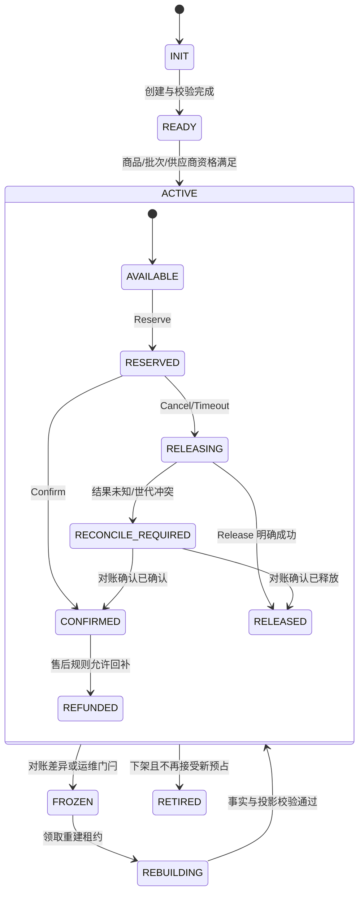
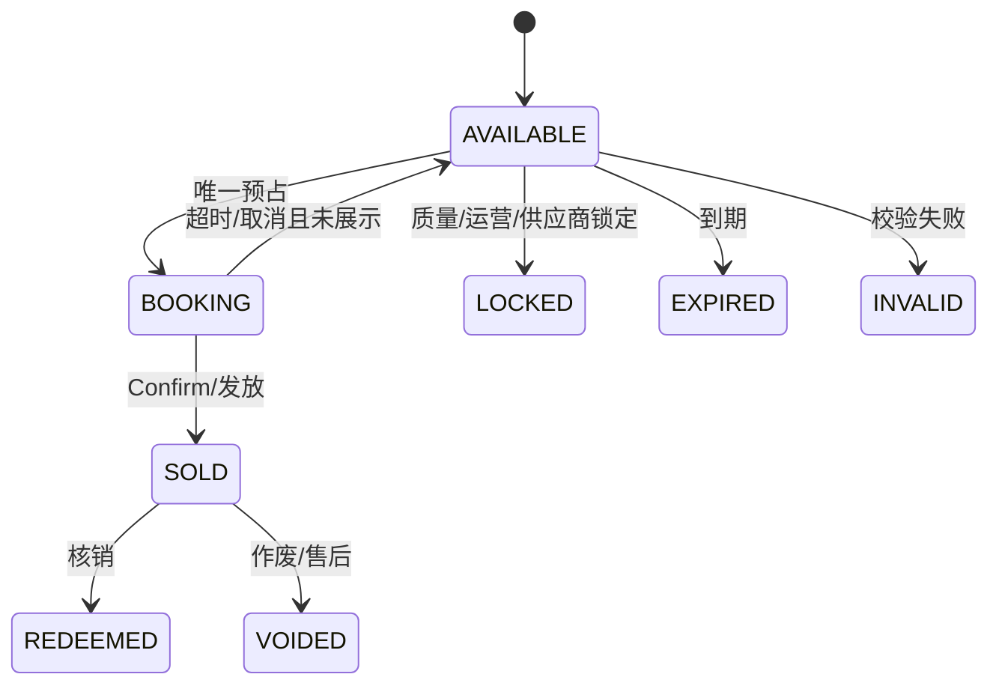
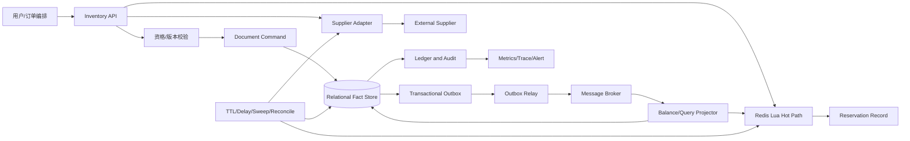
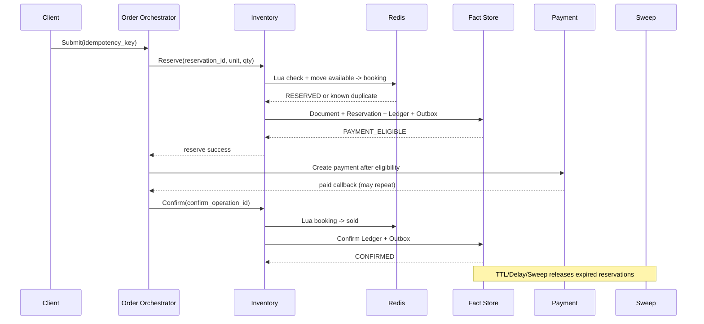

# 第 12 章 库存系统

> **本章定位**：库存系统回答的不是“表里还有多少”，而是“在指定范围、时间窗口和履约约束下，平台现在还能向用户承诺多少”。本章从这个可承诺能力出发，建立库存单元、范围、批次、状态和事实来源模型，再落到数量制、券码制、供应商管理库存和无限库存的实现。重点不在某个中间件，而在高并发、可重试、结果未知和外部依赖不可靠时，系统如何避免重复承诺、如何审计每次变化，以及如何在发生偏差后安全收敛。

## 12.1 问题定义、场景边界与设计目标

### 12.1.1 库存不是一个数字，而是一项承诺

在最简单的例子里，库存似乎就是商品表上的一个整数：某个 SKU 有 100 件，用户买走 1 件之后变成 99 件。这种理解只在单仓库、单渠道、单时间窗口、没有预占、没有供应商、没有营销隔离的练习题里成立。真实交易系统需要回答的句子更接近下面这样：

```text
对于 inventory_unit = 商品 + 规格 + 范围 + 时间窗口 + 批次，
在当前售卖资格、渠道、供应商和履约约束下，
平台还能够向一个新的订单承诺多少资源？
```

这里至少包含五个隐含条件。

第一，库存有对象。实物商品的最小对象可能是 SKU，酒店库存可能是“房型 + 日期”，服务库存可能是“门店 + 时段”，票务库存可能是“场次 + 座位”，券码库存则是一个具体的唯一字符串。对象不同，能够安全扣减的最小粒度不同。

第二，库存有范围。同一个 SKU 在不同仓库、城市、渠道、活动或供应商下，未必可以互相替代。把所有数量合并成一个全局数字，等于默认任何资源都能被任何订单消费，最后会在配送、核销或供应商确认时暴露问题。

第三，库存有时间。日期型服务的 6 月 1 日和 6 月 2 日不是同一份库存；有有效期的券码在过期后不能继续承诺；一次短时预占则把“此刻可卖”变成“某个用户在短窗口内拥有的机会”。

第四，库存有事实来源。平台自管库存由平台的账本负责；供应商管理库存只能由外部系统最终确认；无限库存虽然没有数量桶，仍然可能受供应商配额、风控规则和履约能力限制。缓存、搜索索引和前端展示都只是观察或投影，不能自动变成权威。

第五，库存有不可逆动作。实物出库、券码展示、充值提交、出票和供应商预订一旦成功，不一定能通过“加回 1”恢复原状。释放预占是状态迁移，不是任意方向的算术操作；回滚失败时需要进入补偿和人工处理，而不是把数据库中的数字改回去。

因此，本章采用一个比“扣库存”更严格的定义：

> **库存系统管理的是可承诺供给能力，并负责把 Check、Reserve、Confirm、Release、Refund 这些意图转换为可验证的状态迁移。**

这一定义也解释了为什么库存设计经常和一致性、幂等、过载保护、对账及履约安全交织在一起。长事务不能无限期持有数据库资源，经典 Saga 工作把长事务拆成多个本地事务并用补偿连接起来[1]；在服务边界扩大之后，系统更应保存业务事实、局部状态和可重试的消息，而不是假设所有参与者都能加入一个全局 ACID 事务[2]。

### 12.1.2 场景范围

库存的具体表现形式很多，但可以用“管理方式、库存单元、范围、扣减时机”四个维度描述。下表只列出本章要覆盖的代表性场景，不是产品分类目录。

| 场景 | 最小库存单元 | 常见范围 | 主要不确定性 | 典型策略 |
|---|---|---|---|---|
| 实物商品 | SKU 数量、仓位或批次 | 仓库、门店、区域、渠道 | 配送范围、锁库、出库和退货 | 数量制 + 预占 + WMS/履约对接 |
| 到店服务 | 名额、时段或门店配额 | 门店、城市、日期、时段 | 核销能力和时间冲突 | 时间切片 + 预占/确认 |
| 券码或礼品卡 | 唯一 code | 批次、面值、有效期、渠道 | 码的唯一归属、泄露和不可逆发放 | 码池状态机 + CAS |
| 充值或外部权益 | 供应商配额或请求额度 | 账户、地区、供应商 | 外部请求结果未知、重复充值 | 供应商预订 + 履约状态机 |
| 酒店或票务 | 房型/座位/舱位 | 日期、场次、供应商 | 实时可用性和二次确认 | 快照 + 实时查询 + booking |
| 无限库存商品 | 没有数量桶 | 用户、地区、渠道、风险等级 | 供应商限额和履约容量 | 资格检查 + 配额/审计 |
| 组合商品 | 多个子库存单元 | 子商品、批次、渠道 | 部分成功和补偿顺序 | Saga 编排 + 逆序释放 |

这些场景看起来差异很大，但它们都必须回答同一组问题：

1. 什么实体被承诺？
2. 这个实体在哪个范围、时间窗口和批次内有效？
3. 谁是当前事实来源？
4. 预占是否需要隔离其他请求？
5. 确认、释放和补偿分别意味着什么？
6. 如果请求超时但操作可能已经成功，系统如何查明结果？
7. 如果缓存、消息或外部供应商返回旧数据，哪些操作必须拒绝？

如果这些问题没有先被写入模型，工程实现通常会把差异堆积为 if category == xxx，再用不同表名、不同缓存 key 和不同定时任务掩盖概念重复。统一模型不是让所有品类共用一个表，而是让它们共用一套判断语言。

### 12.1.3 库存系统的职责边界

库存系统的职责可以压缩为四类：

- 保存和解释库存能力：定义库存单元、范围、批次、有效期和可售状态；
- 执行资源状态迁移：处理 Reserve、Confirm、Release、Lock、Unlock、Adjust 和 Refund；
- 对外提供可审计的查询和命令：让调用方知道结果是成功、失败、处理中还是需要人工处理；
- 让派生视图最终收敛：维护热路径、消息、供应商快照和账本之间的对账及修复。

库存系统不应该拥有以下决定：

| 领域 | 归属系统 | 库存系统的协作方式 |
|---|---|---|
| 商品名称、规格和商品发布版本 | 商品中心 | 使用稳定的商品/规格标识和发布版本 |
| 价格、优惠和税费 | 计价/营销系统 | 验证价格快照或优惠资格，不重新计算金额 |
| 订单生命周期 | 订单系统 | 接受带幂等键的 Reserve/Confirm/Release 命令 |
| 支付授权和扣款 | 支付系统 | 只有达到支付资格的订单才能进入支付 |
| 供应商履约细节 | 供应商适配/履约系统 | 通过 provider booking、状态查询和补偿协作 |
| 运营调账原因和审批 | 运营/审计系统 | 接受带操作者、原因和审批号的 Adjustment |
| 用户展示文案 | 前端/交易编排 | 返回明确错误类别、状态和预计等待语义 |

边界不是为了把系统切得更碎，而是为了避免一个系统同时成为商品、订单、支付、营销和供应商的事实来源。跨域事务可以有编排者，但每个参与者仍然只提交自己的本地事实。Azure 的 Saga 设计资料也把每一步定义为本地事务，并强调失败后的补偿、不可逆步骤和可重试步骤必须被显式建模[7]。

### 12.1.4 设计目标与非目标

本章的目标不是承诺“永不超时、绝不失败”，而是让失败变得可分类、可重试、可观测和可修复。

| 目标 | 可验证含义 | 非目标 |
|---|---|---|
| 不超卖 | 在权威库存单元内，成功确认量不违反不变量 | 不保证外部供应商永远有货 |
| 不重复扣减 | 相同业务操作重试只能得到同一结果或同一处理中状态 | 不保证消息只投递一次 |
| 可释放 | 预占最终进入 Confirm、Release 或人工处理终态 | 不保证延时队列永不丢失 |
| 可恢复 | 热视图丢失后能够依据事实重建 | 不把所有异常都自动修成成功 |
| 可解释 | 每次变化都能追溯到请求、订单、操作者或供应商事件 | 不依赖前端展示数字作为审计 |
| 可扩展 | 新品类通过策略和适配器接入，而不是复制服务 | 不强迫所有品类使用 Redis |
| 可控降级 | 依赖故障时返回明确结果并阻止风险扩散 | 不为了成功率静默放行未知库存 |

这组目标之间存在取舍。提高并发通常需要把一部分写操作放到内存热路径，降低同步等待又会扩大暂态不一致窗口；提高用户体验可能要求支付前增加一次权威确认，导致延迟和数据库热点上升。后文会把这些取舍写成条件，而不是把某个组件称为万能方案。

### 12.1.5 库存问题的五种根因

线上看到“库存不对”时，不应马上把问题归类为超卖。相同的表象可能来自五种完全不同的根因：

1. **并发安全失败**：两个不同 operation_id 同时满足了可售条件，导致确认量超过 available。
2. **重复执行失败**：同一个 operation_id 因超时被执行两次，产生两个 Reservation、两条发码记录或两次供应商预订。
3. **投影漂移**：事实库已经释放或确认，Redis、搜索或报表仍停留在旧版本。
4. **边界语义失败**：平台把“请求已发送”解释成“外部已预订”，把“支付成功”解释成“资源已确认”，或把“缓存有值”解释成“事实可售”。
5. **治理失败**：日志不含操作号、没有对账阈值、没有冻结门闩，故障发生后无法判断哪些订单已经改变事实。

不同根因对应不同修复：

| 根因 | 不能解决它的办法 | 应优先验证 |
| --- | --- | --- |
| 并发安全 | 只增加缓存副本 | 条件更新、锁范围、热点分布 |
| 重复执行 | 只提高超时时间 | 唯一键、操作表、参数摘要 |
| 投影漂移 | 直接修改一个缓存数字 | watermark、epoch、重建任务 |
| 边界语义 | 继续增加重试次数 | 状态映射、提交点、API 文案 |
| 治理失败 | 只做事后人工统计 | 审计字段、对账、告警和演练 |

因此，“库存系统是否正确”至少要拆成安全性、活性和可解释性三类问题。安全性要求不能超卖、不能重复确认；活性要求有效预占最终不会永久卡住；可解释性要求能够说明某个结果依据哪个事实、版本和操作。安全性往往需要同步条件，活性通常依赖扫描与补偿，可解释性依赖不可变记录与观测。三者缺一不可。

这也是为什么本章不会把“分布式锁”“Redis”“消息队列”当成单独答案。锁可以降低一段代码的并发，但不能自动形成业务事实；Redis 可以执行原子脚本，但不能为数据库提交作证；消息队列可以保存事件，但不能决定过期的 Reservation 是否应该释放。只有把它们放入明确的不变量和状态机，才能判断它们各自承担什么责任。

## 12.2 约束、容量估算与库存语义

### 12.2.1 先写假设，再讨论组件

库存方案的容量数字必须先标明是测量值还是设计假设。下面给出一个只用于说明方法的假设：

- 平均每日订单量：100 万单；
- 日内峰值是日均的 12 倍；
- 峰值持续 10 分钟；
- 每个订单平均包含 1.4 个库存明细；
- 进入交易页的查询流量是创单流量的 20 倍；
- 峰值时 70% 的请求集中在 2% 的库存单元；
- 预占有效期为 15 分钟；
- 账本异步投影允许的正常延迟为 5 秒。

由此可以做一个粗略的量级估算。日均创单率约为：

```text
1,000,000 / 86,400 ≈ 11.6 order/s
峰值创单率 ≈ 11.6 × 12 ≈ 139 order/s
峰值库存明细写入 ≈ 139 × 1.4 ≈ 195 operation/s
峰值查询率 ≈ 195 × 20 ≈ 3,900 query/s
```

这里的 139、195 和 3,900 都是假设，不是通用阈值。更重要的是，“订单 QPS”和“库存操作 QPS”不是同一个指标；一个组合订单可能同时预占多个库存单元，一个批量查询也可能放大读请求。过载时不应只看平均 QPS，因为不同请求的资源成本可能相差很大。Google SRE 对过载处理的讨论特别强调，单纯用 QPS 作为容量代理会掩盖请求成本差异，系统应结合拒绝、降级、流量分配和资源余量管理[10]。

容量估算至少要拆成五个平面：

1. 用户同步平面：Reserve、Confirm、Release 的延迟和成功率；
2. 热路径平面：Redis 脚本执行、热 key、分片和连接池；
3. 事实写入平面：数据库行锁、CAS 冲突、流水追加和 Outbox；
4. 异步平面：消息积压、投影水位、补偿任务和供应商轮询；
5. 运维平面：对账扫描、重建任务、审计查询和人工处理队列。

任何一个平面出现瓶颈，用户都会看到“库存不足”或“下单失败”，但根因可能完全不同。把这些错误混成一个状态，会导致产品文案、告警和排障都失去方向。

### 12.2.2 约束表和 SLO

| 约束 | 假设 | 设计后果 | 不保证什么 | 验证指标 |
|---|---|---|---|---|
| 热点集中 | 2% 单元承接大部分请求 | Redis Lua、分段库存、排队或限流 | 任意单 key 无限扩展 | key QPS、脚本耗时、排队长度 |
| 支付不希望事后退款 | 支付入口前需确认库存资格 | 主库 CAS 或授权后扣款 | 支付之后绝不发生任何异常 | 支付前库存失败率、退款率 |
| 供应商只支持查询 | 本地不能取得外部锁 | 快照 + 短时有效期 + 重新确认 | 本地可售等于供应商最终确认 | 过期快照命中率、二次确认失败率 |
| 消息至少一次 | 可能重复、延迟和乱序 | event_id、版本、幂等消费者 | 消息物理 exactly-once | 重复消费率、死信量 |
| Redis 可丢失 | 热视图可重建 | 账本/Document/流水保留事实 | Redis 恢复后瞬间无延迟 | 重建时长、重建差异 |
| 预占可过期 | 用户可能不付款 | TTL、延时任务、Sweep | 延时任务单独保证最终释放 | 过期待释放年龄、释放成功率 |
| 业务操作不可逆 | 发码、出票、充值可能不能回滚 | Confirm 前后分开建模 | 所有操作都有对称反向动作 | 人工处理量、不可逆失败率 |

建议至少定义以下库存 SLO，而不是只定义一个“接口可用率”：

- Reserve P99 延迟和业务成功率；
- 可售查询的最大数据新鲜度窗口；
- Confirm/Release 终态收敛时间；
- 最老 Outbox、最老投影和最老补偿任务年龄；
- 账本不变量破坏次数，目标必须为 0；
- 供应商未知结果和人工处理队列的上限；
- Redis 重建期间的冻结时间和恢复成功率。

可观测性不是在系统完成后才加的面板。OpenTelemetry 对可观测性的定义强调，系统应通过 traces、metrics 和 logs 让操作者能够从外部追问“为什么发生”，并让 SLI/SLO 连接到用户期望[18]。对库存而言，“库存接口返回 200”远远不够；还要知道它是否返回了过期快照、是否产生了预占、是否在等待投影和是否进入人工处理。

### 12.2.3 库存桶、操作语义与不变量

对于数量制库存，可以用几个状态桶表示生命周期：

```text
total = available + booking + locked + sold + damaged_or_invalid
sellable = available
```

其中：

- total 是当前库存基线，不等于永远可售；
- available 是在当前范围、时间窗口和业务规则下可以被新订单预占的量；
- booking 是已经被 Reservation 占用但还没有最终确认的量；
- locked 是被活动、风控、运营或异常处理暂时隔离的量；
- sold 是已经确认成交、出库、发码或进入不可逆履约的量；
- damaged_or_invalid 是损坏、失效、作废或质量检查不通过的量，不应重新进入可售池。

所有桶不得出现不符合领域规则的负数。对于供应商库存，平台的 supplier_stock 可能只是最近一次观察值，不能在没有 provider booking 的情况下被宣称为平台已经锁定的资源。对于无限库存，total 不参与数量恒等式，但系统仍然需要记录资格、限流、配额、履约和审计状态。

操作语义必须比字段名更强：

| 操作 | 它承诺什么 | 它不承诺什么 | 典型幂等键 |
|---|---|---|---|
| Check | 在某一时刻观察到可能可售 | 不为调用方保留资源 | 查询条件或版本 |
| Reserve | 以原子条件把可售变成预占 | 不代表已经支付或履约 | reservation_id |
| Confirm | 把预占推进到成交/履约确认 | 不代表下游所有副作用完成 | confirm_operation_id |
| Release | 使仍可释放的预占归还可售或进入终态 | 不允许旧世代盲目加库存 | release_operation_id |
| Lock | 将一部分可售隔离 | 不等于订单预占 | lock_operation_id |
| Refund | 按售后规则处理已确认资源 | 不必然恢复原码、原座位或原供应商资源 | refund_id |
| Adjust | 由授权人员修改基线并留下理由 | 不可绕过不变量和审批 | adjustment_id |

Check 和 Reserve 的差异是库存系统最常被忽略的边界。两个请求都先 Check 到“还有 1”，再分别执行普通更新，便产生典型的 Check-Then-Act 竞态。中文工程资料也用库存超发案例说明，读取和扣减分离会让两个并发请求同时看到充足库存，最终把数量扣成负数[28]。所以商品详情页的库存展示可以调用 Check，但创单必须以 Reserve 的原子结果为准。

### 12.2.4 一致性分层

库存系统不应该笼统地说“最终一致”或“强一致”，而应按操作回答：

| 层级 | 需要的保证 | 例子 | 允许延迟 |
|---|---|---|---|
| 单库存单元的并发安全 | 不能两个请求同时成功占用最后一份资源 | Reserve、Code CAS | 同步返回 |
| 同一请求的重试一致 | 重试不会生成第二个预占或第二条确认 | 网络超时后重复 Reserve | 同一操作窗口 |
| 跨系统业务收敛 | 订单、支付、库存最终进入可解释状态 | 订单取消触发 Release | 秒到分钟 |
| 查询模型新鲜度 | 展示数据不会超过声明的陈旧窗口 | 商品页可售数量 | 由 SLO 定义 |
| 账本可恢复 | 热视图丢失后可以重建 | Redis 重启 | 允许冻结一段时间 |

“强一致”只适用于明确的边界，例如在一个数据库事务中更新同一个 inventory_unit 的可售桶和 Reservation；它不能自动覆盖 Redis、供应商、支付和消息系统。分布式系统的正确设计不是把所有东西都宣称为强一致，而是把安全性要求放到最小的同步边界，把可恢复性和可追踪性放到异步边界。

### 12.2.5 容量估算：从承诺速率而不是页面流量开始

库存系统的容量估算应从业务动作开始，而不是把页面访问量直接等同于扣减量。一个商品详情页可能被反复刷新、被搜索爬虫读取或被推荐系统批量预热；真正改变库存的 Reserve、Confirm、Release 通常只是其中很小的一部分。反过来，一次批量导入或供应商同步虽然 QPS 不高，却可能一次改变数百万条券码。

可以先定义以下变量：

| 符号 | 含义 | 示例假设 |
| --- | --- | --- |
| V | 日活跃商品或库存单元数 | 1,000,000 |
| R | 每个单元日均展示读取次数 | 100 |
| q | 读取请求中需要精确可售判断的比例 | 20% |
| U | 日均有效 Reserve 次数 | 2,000,000 |
| p | 峰值系数，峰值分钟量 / 日均分钟量 | 20 |
| k | 一次操作触及的事实与投影写入数 | 3–8 |

若这些数字只是规划假设，应明确标注为假设，而不是容量承诺。读请求的日均规模可以近似为 V × R，精确判断流量为 V × R × q；Reserve 的峰值吞吐则应按 U ÷ 1440 × p 估算，再根据热点集中度放大。若 1% 的库存单元承载 50% 的 Reserve，就不能只用全局平均值评估数据库锁竞争。

容量估算至少要拆成四条线：

1. **在线读取线**：Check、商品展示和搜索过滤，关注缓存命中、p99 延迟、热点 key 和回源比例。
2. **在线承诺线**：Reserve、Confirm、Release，关注单实体串行化、事务时间和失败重试。
3. **异步变更线**：Outbox、投影、供应商同步和清理任务，关注积压年龄、批次大小和重放速度。
4. **治理线**：对账、审计和重建，关注扫描范围、锁影响、读放大和恢复窗口。

例如，Reserve 峰值为 5,000 次每秒，并不意味着数据库需要稳定承受 5,000 次每秒的随机更新。如果其中 80% 集中在 100 个热点库存单元上，每个单元的有效更新实际上接近串行队列；此时增加数据库副本只能改善读，不能消除写热点。可行的办法包括按库存单元排队、提前分桶、分散券码池、限制单用户并发或把热点商品切成多个独立的库存分区，但每一种方法都会改变分配、审计或公平性语义。

数据规模也需要估算保留周期。台账条数大致为：

```text
daily_ledger_rows =
    daily_reserve
  + daily_confirm
  + daily_release
  + daily_adjustment
  + daily_reconciliation
```

如果每个操作平均追加多条事件，保留三年后，台账规模会明显大于当前库存余额表。可以采用冷热分层、按月分区和归档索引，但归档不能让审计链断裂；旧操作至少应能通过操作号、库存单元和时间范围查询到摘要、原始位置与校验和。

容量估算的结论只能在假设成立时使用。上线前需要用热点分布、批量导入、消费者积压、数据库故障和缓存重建进行压测；上线后要用真实指标校正 p、k 和集中度。阿里云关于大型网站架构的资料强调分层、缓存、异步化和可扩展性的重要性[29][30]，但这些原则不能替代本系统对“哪个动作产生不可逆承诺”的专项测量。

### 12.2.6 SLO 分解与错误预算

库存系统不应只设置一个“接口 p99 小于多少毫秒”的总 SLO，因为 Check、Reserve、Confirm 和 Release 的业务重要性不同。可以把 SLO 分解为：

| 能力 | 可用性目标 | 延迟目标 | 允许的失败形态 |
| --- | --- | --- | --- |
| Check | 高 | 最低 | 返回有界陈旧或确认中 |
| Reserve | 高但需保护热点 | 中 | 明确拒绝、排队或未知 |
| Confirm | 高 | 中 | 可查询、可重试、不可重复 |
| Release | 重点保证收敛 | 可异步 | 进入释放中或对账 |
| Reconcile | 持续运行 | 不要求在线低延迟 | 延迟但不能静默丢失 |

例如，Check 即使有少量陈旧，只要明确 freshness，就可能不违反用户承诺；Reserve 如果返回成功但事实无法证明，则是安全性事故；Release 延迟几分钟可能影响可售量，但如果有明确的 RELEASE_PENDING 和补偿，通常可以通过活性指标治理。SLO 应与错误预算绑定：预算消耗过快时，优先关闭非关键展示、降低新 Reserve 或冻结高风险库存，而不是继续追求所有接口的表面成功率。

错误预算还要按商品和租户隔离。一个低价值、低热度商品的投影延迟不应消耗高价值限量资源的全部预算；一个租户的错误重试不能拖垮其他租户。多维 SLO 会增加监控和运营成本，但它更接近库存风险的实际分布。

SLO 的分母也必须定义清楚。Reserve 成功率应以收到有效命令为分母，还是以通过资格校验的命令为分母；未知结果算失败、处理中还是单独统计；供应商超时是否归平台失败。若分母含义不固定，团队可能通过改变错误分类来“改善”指标，却没有改善实际可靠性。所有业务指标都应保留原始 outcome，派生报表只负责聚合。

## 12.3 统一领域模型：库存单元、范围、批次与状态

### 12.3.1 库存单元的组合键

库存对象的真正主键通常不是单一 sku_id，而是多个维度的组合：

```text
inventory_unit_id =
  product_id
  + sku_id
  + scope_type / scope_id
  + channel_id
  + calendar_date / time_slot
  + batch_id
  + supplier_id
```

不是每个品类都需要所有字段，但字段含义必须先存在于模型中。没有 scope 的数量制模型，接入仓库和渠道隔离时只能新增特判；没有 batch 的券码模型，无法解释码的有效期、来源和导入批次；没有 supplier_id 的外部库存模型，无法在多个供应商之间区分确认结果。

建议把库存单元拆成以下实体：

| 实体 | 作用 | 权威字段 | 主要写入者 |
|---|---|---|---|
| InventoryUnit | 定义承诺对象和策略 | 单元 ID、范围、单位类型、管理方式 | 库存创建/运营 |
| InventoryBatch | 表达批次、有效期和来源 | 批次状态、开始/结束时间、来源、版本 | 批次管理/导入 |
| StockBalance | 当前数量投影 | 各状态桶、版本、epoch | 事务或投影消费者 |
| Reservation | 一次订单占用 | reservation、订单、数量、过期时间、状态 | Reserve/Confirm/Release |
| StockLedger | 不可变变化流水 | operation、前后值、delta、原因、操作者 | 每次有效迁移 |
| InventoryDocument | 业务命令和意图 | 命令类型、业务参数、聚合版本 | 命令入口 |
| InventoryCode | 唯一券码的事实归属 | code hash、密文、状态、订单 | 码池/履约 |
| SupplierBooking | 外部预订和确认映射 | provider request、状态、重试信息 | 供应商适配器 |
| OutboxEvent | 可靠事件发送意图 | event ID、聚合版本、payload、发送状态 | 业务本地事务 |

这些实体可以物理上放在同一个数据库，也可以分库分表，但职责不能混淆。StockBalance 能快速回答“当前投影是多少”，却不能替代 StockLedger 解释“为什么变成这样”；InventoryDocument 能驱动恢复，却不应被当成已经成功扣减的证据，除非它对应的状态迁移和流水已经提交。

### 12.3.2 管理方式、单元类型与扣减时机

把品类差异拆成正交维度，比按品类复制服务更容易演进。

```text
ManagementType:
  SELF_MANAGED       平台自管数量和流水
  SUPPLIER_MANAGED   平台保存观察/预订映射，供应商负责外部事实
  UNLIMITED          不维护有限数量，但维护资格、配额和审计

UnitType:
  QUANTITY           整数数量
  CODE               唯一券码或卡密
  TIME_SLOT          日期/时段名额
  SEAT               场次 + 座位/舱位
  BUNDLE             多个子单元组合

DeductTiming:
  ON_RESERVE         下单时预占
  ON_PAYMENT         支付成功后确认
  ON_FULFILLMENT     出库、发码或出票时确认
  ON_SUPPLIER_CONFIRM 外部供应商确认后确认
```

策略可以表示为：

```text
InventoryStrategy =
  ManagementType
  + UnitType
  + Scope
  + DeductTiming
  + Reversibility
```

例如：

- SELF_MANAGED + QUANTITY + GLOBAL + ON_RESERVE：数据库 CAS 或 Redis Lua 数量预占；
- SELF_MANAGED + CODE + BATCH + ON_RESERVE：Redis 只取 code_id，数据库完成码状态 CAS；
- SUPPLIER_MANAGED + TIME_SLOT + DATE + ON_SUPPLIER_CONFIRM：本地快照、实时刷新和 provider booking；
- UNLIMITED + NONE + REGION + ON_FULFILLMENT：不扣库存数量，但检查地区、供应商额度和履约状态；
- BUNDLE + MULTI_UNIT + CHANNEL + ON_RESERVE：按稳定顺序预占多个单元，失败后逆序补偿。

### 12.3.3 库存状态机

数量库存的状态应表达业务事实，而不是简单映射到某个字段。



FROZEN 不是失败的同义词，而是系统拒绝继续扩大风险的保护状态。冻结期间可以允许查询和对账，但不应继续接受新 Reserve、普通调账或没有证据的 Release。RELEASING 也不能直接解释为“已经加回库存”；它表示释放意图已产生但最终结果尚未确认。

### 12.3.4 批次、有效期和券码状态

批次是多个具有共同属性的库存资源的集合，例如生产日期、供应商批次、面值、有效期规则、导入来源或加密密钥版本。批次状态可以定义为：

```text
CREATED -> IMPORTING -> ACTIVE -> EXPIRED
                         |
                         +-> INVALID / CANCELLED
```

只有批次属性有效、商品售卖窗口有效、码导入完成且可售数量大于 0 时，批次才可以进入 ACTIVE。已经产生销售事实的批次不应直接篡改属性；如果有效期或供应商来源发生变化，应创建新版本或新批次，并通过新的命令留下关系。

券码的状态比数量桶更细：



SOLD 之后不能凭退款把原码放回 AVAILABLE。数字资源一旦被用户看到或交给下游，回滚数量并不等于回滚资源；后续动作应是作废、补发、退款或人工核损。Redis List 中的元素只能是 code_id，不能把明文码放进热队列，因为内存、监控、日志和排障链路都可能成为泄露面。

### 12.3.5 营销库存、渠道库存和组合库存

营销库存经常被误解成另一份完全独立的商品库存。更准确的模型是：营销规则拥有“谁有资格使用”和“活动限额”，库存系统负责把活动配额、普通库存和订单占用作为多个可验证的资源协调起来。

例如一个限量优惠包含普通库存 100 个、活动配额 20 个和渠道配额 5 个。一次活动预占至少有两种实现：

1. 先锁定活动配额，再从普通库存预占；任意一步失败就按逆序解锁；
2. 预先把活动配额从普通可售中切出，活动期间只在一个活动库存单元上扣减。

第一种灵活但跨资源补偿复杂；第二种路径简单但需要在活动变更时重新计算可售边界。两者都必须保存来源：这 1 个预占来自哪一个活动锁定、哪一个订单和哪一个库存世代。不能只根据 SKU 和数量猜测释放对象。

组合库存也一样。例如“套餐 = 1 张券 + 1 个服务名额 + 1 个供应商配额”，应先建立统一的 reservation_id，再按确定顺序完成子预占。一个子资源失败时，释放已经成功的子资源；如果某个子资源不可逆，则 Saga 进入人工或向前恢复，而不是伪造“全局回滚成功”。Seata 的中文 Saga 文档特别强调，正向和补偿服务都需要业务开发者实现，补偿还要处理空补偿和防悬挂[21]。

### 12.3.6 四种库存类型的共同模型与差异

数量、券码、供应商和无限库存之所以可以放进一个领域模型，不是因为它们都能用同一个表，而是因为它们都能回答同一组问题：资源的权威事实是什么、一次 Reserve 产生哪一种承诺、Confirm 是否可逆、Release 需要哪些证据、事实如何映射到可售投影。

| 维度 | 数量库存 | 券码库存 | 供应商库存 | 无限库存 |
| --- | --- | --- | --- | --- |
| 资源单位 | 数量桶 | 单个码或码段 | 外部批次或配额 | 资格规则 |
| Reserve 事实 | 数量从 available 移到 reserved | 码状态从 AVAILABLE 到 RESERVED | 外部预留号或本地待确认 | 记录资格占用或直接通过 |
| Confirm 事实 | reserved 到 committed | 码绑定订单并进入 USED/COMMITTED | 外部确认号 | 订单或权益事实 |
| Release 难点 | 版本与数量不能错加 | 原码是否可再次使用 | 外部释放是否成功 | 防止滥用和重复权益 |
| 主要失败 | 并发扣减、负数 | 重复分配、敏感信息泄露 | 超时、漂移、供应商限流 | 资格绕过、规则不一致 |
| 可售投影 | available - safety_buffer | AVAILABLE 码数量 | 最近一次确认的可售上限 | 规则计算结果 |

统一接口并不意味着统一实现。数量库存可以用 CAS，券码需要唯一状态迁移，供应商库存需要外部状态查询，无限库存需要规则评估。若把券码当成数量直接扣减，可能出现数量正确但实际分配相同码；若把供应商库存当成本地余额，可能把供应商暂时未知误报为零或无限；若把无限库存完全跳过 Reservation，又可能失去防重复领取和审计能力。

统一模型还应保留策略版本。例如 inventory_unit 的 strategy_type 从 QUANTITY 改成 CODE，不应直接覆盖历史记录；应创建新的策略版本或新库存单元，并将老单元置为 RETIRED。这样，历史订单可以按当时的策略解释，重放任务也不会用今天的实现解释昨天的事实。策略版本和数据世代是两个概念：策略版本回答“用什么规则处理”，epoch 回答“这一组投影属于哪一轮事实”。

### 12.3.7 状态迁移的前置条件与后置不变量

状态机真正有价值的部分不是状态名称，而是每条边上的前置条件、写入事实和后置不变量。以数量库存为例，Reserve 的前置条件不仅是 available_qty >= quantity，还包括库存单元处于 ACTIVE、epoch 一致、调用方具备资格、operation_id 未被其他参数占用、预占数量不超过单次上限。后置条件则是 available 减少、booking 增加、Reservation 进入 RESERVED、版本递增、Outbox 已生成。

可以为每个命令写出三元组：

| 命令 | 前置条件 | 后置不变量 |
| --- | --- | --- |
| Reserve | ACTIVE、数量足够、版本匹配、操作未完成 | available + booking + locked + sold = total - invalid |
| Confirm | Reservation=RESERVED、订单归属正确、未过期或有支付例外 | booking 减少、sold/committed 增加、同一资源不能再次确认 |
| Release | Reservation=RESERVED 或 RELEASING、释放权限正确 | 释放数量最多回到对应 epoch 的 available |
| Adjust | 有审批、expected_version 匹配、原因完整 | 调整前后差异有 Ledger，不能绕过负数和上限 |
| Freeze | 发现漂移或人工门闩打开 | 新 Reserve 被拒绝，查询和恢复路径仍可用 |

不变量还需要考虑并发快照。Confirm 读取到 RESERVED 并不等于它可以直接写 CONFIRMED；它必须用状态和版本一起作为条件。Release 也不能只看 expires_at，因为订单可能已经在另一个事务中完成 Confirm。两个命令都使用 state = RESERVED AND version = expected_version，只有一个能够推进，另一个重新读取终态。

跨库存单元的组合操作需要额外的不变量。例如套餐包含 1 个券码和 1 个服务名额，系统可能允许一段时间内只有券码已预占，但最终进入 CONFIRMED 前两者必须都绑定同一 order_id。Saga 的中间状态要能被查询；如果在超时后只看到一个子 Reservation，没有编排记录就无法知道应当释放它还是等待另一个步骤。

状态机应禁止“万能更新接口”。允许任意状态互相转换的管理脚本会让所有线上证明失效。即使为了应急，也应提供有限的人工命令，例如 ForceRelease、FreezeUnit、RebuildProjection，并在命令中保存理由、审批和前置版本。人工命令不是绕过模型，而是模型中显式定义的高权限分支。

## 12.4 事实来源、数据模型与可售投影

### 12.4.1 Document、Ledger、Balance、Reservation、Outbox

一个能恢复的库存系统通常需要把五类数据分开：

| 数据 | 解决的问题 | 能否作为最终恢复依据 |
|---|---|---|
| InventoryDocument | 用户或系统发起了什么命令，当前命令处于什么状态 | 可以作为业务意图依据，但要结合状态和流水 |
| StockLedger | 某次状态迁移改变了什么，前后值是什么 | 是不可变审计和重放依据 |
| StockBalance | 当前数量桶和版本是多少 | 是快速查询和 CAS 目标，不是孤立事实 |
| Reservation | 哪个订单占用了哪个单元、数量和过期时间 | 是释放、确认和对账的关联事实 |
| OutboxEvent | 哪些已经提交的变化还需要向外发送 | 是可靠发布依据，不是库存余额 |

这些数据的职责可以用一条链表示：

```text
Command
  -> InventoryDocument
  -> local transaction
       -> Reservation / StockLedger / StockBalance
       -> OutboxEvent
  -> Outbox Relay
       -> message broker / downstream projector
  -> Redis / query view / supplier worker
```

这里的关键不是表的数量，而是写入边界。一次需要对外传播的本地状态变化，应该在关系型数据库本地事务中同时写入业务状态和 Outbox。AWS 对 Transactional Outbox 的定义正是为了解决数据库写入与消息发送之间的双写窗口：业务表和 Outbox 同事务提交，Relay 再至少一次发送，消费者必须幂等[6]。

### 12.4.2 核心表模型

下面的表名和字段是公开示例，不对应任何内部系统。字段的价值在于表达约束。

```sql
CREATE TABLE inventory_unit (
  inventory_unit_id BIGINT PRIMARY KEY,
  product_id        BIGINT NOT NULL,
  sku_id            BIGINT NOT NULL,
  scope_type        VARCHAR(32) NOT NULL,
  scope_id          VARCHAR(64) NOT NULL,
  unit_type         VARCHAR(32) NOT NULL,
  management_type   VARCHAR(32) NOT NULL,
  deduct_timing     VARCHAR(32) NOT NULL,
  supplier_id       BIGINT NOT NULL DEFAULT 0,
  batch_id          BIGINT NOT NULL DEFAULT 0,
  calendar_date     DATE NULL,
  status            VARCHAR(32) NOT NULL,
  inventory_epoch   BIGINT NOT NULL DEFAULT 1,
  created_at        DATETIME NOT NULL,
  updated_at        DATETIME NOT NULL,
  UNIQUE KEY uk_unit_scope (
    product_id, sku_id, scope_type, scope_id,
    batch_id, calendar_date, supplier_id
  )
) ENGINE = InnoDB;
```

inventory_epoch 是库存单元的世代号。活动重置、全量重建或灾备切换时递增它，任何旧预占、旧释放和旧投影都必须带上旧 epoch；写入新世代时直接拒绝。它解决的是“旧操作写入新库存”的问题，不等价于数据库行版本。

```sql
CREATE TABLE stock_balance (
  inventory_unit_id BIGINT PRIMARY KEY,
  total_qty        BIGINT NOT NULL DEFAULT 0,
  available_qty    BIGINT NOT NULL DEFAULT 0,
  booking_qty      BIGINT NOT NULL DEFAULT 0,
  locked_qty       BIGINT NOT NULL DEFAULT 0,
  sold_qty         BIGINT NOT NULL DEFAULT 0,
  invalid_qty      BIGINT NOT NULL DEFAULT 0,
  balance_version  BIGINT NOT NULL DEFAULT 0,
  inventory_epoch  BIGINT NOT NULL,
  projection_watermark BIGINT NOT NULL DEFAULT 0,
  updated_at       DATETIME NOT NULL,
  CONSTRAINT ck_non_negative
    CHECK (
      total_qty >= 0 AND available_qty >= 0
      AND booking_qty >= 0 AND locked_qty >= 0
      AND sold_qty >= 0 AND invalid_qty >= 0
    )
) ENGINE = InnoDB;
```

生产环境还应在应用层验证：

```text
total_qty =
  available_qty
  + booking_qty
  + locked_qty
  + sold_qty
  + invalid_qty
```

数据库 CHECK 约束是最后一道保护，不能替代领域服务对状态迁移的校验。每次迁移都应记录桶的 delta，例如 Reserve 是 available=-2, booking=+2，而不是写一条没有来源的“库存减 2”。

```sql
CREATE TABLE inventory_reservation (
  reservation_id  VARCHAR(64) PRIMARY KEY,
  inventory_unit_id BIGINT NOT NULL,
  order_id        VARCHAR(64) NOT NULL,
  quantity        BIGINT NOT NULL,
  inventory_epoch BIGINT NOT NULL,
  status          VARCHAR(32) NOT NULL,
  reserve_expire_at DATETIME NULL,
  request_hash    CHAR(64) NOT NULL,
  created_at      DATETIME NOT NULL,
  updated_at      DATETIME NOT NULL,
  UNIQUE KEY uk_order_unit (order_id, inventory_unit_id),
  UNIQUE KEY uk_request_hash (request_hash),
  KEY idx_expire (status, reserve_expire_at)
) ENGINE = InnoDB;
```

```sql
CREATE TABLE stock_ledger (
  ledger_id       BIGINT PRIMARY KEY AUTO_INCREMENT,
  operation_id    VARCHAR(64) NOT NULL,
  inventory_unit_id BIGINT NOT NULL,
  reservation_id  VARCHAR(64) NULL,
  aggregate_version BIGINT NOT NULL,
  change_type     VARCHAR(32) NOT NULL,
  available_delta BIGINT NOT NULL DEFAULT 0,
  booking_delta   BIGINT NOT NULL DEFAULT 0,
  locked_delta    BIGINT NOT NULL DEFAULT 0,
  sold_delta      BIGINT NOT NULL DEFAULT 0,
  before_payload  JSON NOT NULL,
  after_payload   JSON NOT NULL,
  reason          VARCHAR(256) NOT NULL,
  operator_type   VARCHAR(32) NOT NULL,
  created_at      DATETIME NOT NULL,
  UNIQUE KEY uk_operation (operation_id),
  UNIQUE KEY uk_unit_version (inventory_unit_id, aggregate_version),
  KEY idx_reservation (reservation_id, created_at)
) ENGINE = InnoDB;
```

stock_ledger 只允许追加，不允许通过 UPDATE 把过去的错误覆盖掉。纠正错误要追加冲正或修复流水，记录原因、操作者和关联任务。这样对账才能区分原始事实、补偿事实和人工调整。

```sql
CREATE TABLE inventory_outbox (
  event_id        VARCHAR(64) PRIMARY KEY,
  aggregate_id    VARCHAR(64) NOT NULL,
  aggregate_version BIGINT NOT NULL,
  event_type      VARCHAR(64) NOT NULL,
  payload         JSON NOT NULL,
  status          VARCHAR(16) NOT NULL,
  retry_count     INT NOT NULL DEFAULT 0,
  next_retry_at   DATETIME NULL,
  lease_owner     VARCHAR(64) NULL,
  lease_expire_at DATETIME NULL,
  last_error      VARCHAR(512) NULL,
  created_at      DATETIME NOT NULL,
  sent_at         DATETIME NULL,
  UNIQUE KEY uk_aggregate_event (
    aggregate_id, aggregate_version, event_type
  ),
  KEY idx_dispatch (status, next_retry_at, lease_expire_at)
) ENGINE = InnoDB;
```

Outbox 的 event_id 必须稳定。Relay 发送成功但还没来得及标记 SENT 时，重启可能再次发送同一事件；这不是 Outbox 失败，而是至少一次投递下的正常窗口。消费者要按 event_id 或 aggregate_id + aggregate_version 去重。Kafka 官方文档也提醒，at-least-once 允许重复，exactly-once 需要同时说明发布和消费两端的边界，不能只看一句产品宣传[16]。

### 12.4.3 MySQL CAS、锁定读和批量投影

对于不需要 Redis 热路径的数量库存，可以用条件更新实现原子扣减：

```sql
UPDATE stock_balance
SET available_qty = available_qty - :qty,
    booking_qty = booking_qty + :qty,
    balance_version = balance_version + 1,
    updated_at = CURRENT_TIMESTAMP
WHERE inventory_unit_id = :unit_id
  AND inventory_epoch = :epoch
  AND available_qty >= :qty
  AND balance_version = :expected_version;
```

只有 affected_rows = 1 才表示本次预占成功。affected_rows = 0 需要区分库存不足、版本冲突、单元冻结和旧 epoch，不能统一返回“库存不足”。

如果一次事务需要先读取再更新相关行，可以使用 SELECT ... FOR UPDATE 或 FOR SHARE 这样的锁定读。MySQL 文档明确指出，普通 SELECT 在同一事务中并不自动阻止其他事务修改刚刚读到的行，锁定读提供了额外保护[14]；同时，默认隔离级别下的一致性读与锁定读使用不同语义，设计者不能把二者混成一个“读到最新值”的承诺[15]。

批量投影要避免长事务：

1. 用状态和租约批量领取一小批 Outbox 或 Document；
2. 在本地事务中更新连续版本；
3. 快速提交；
4. 提交后发送外部消息或更新 Redis；
5. 结果未知时保留原 operation_id，不新建一条可能重复的操作。

投影消费者应记录 projection_watermark。只有当某个库存单元的 Balance 已处理到目标事件版本，才可以把它与 Redis 快照比较；拿旧 Balance 和新 Redis 直接比较，会把正常的投影延迟误判成库存泄露。

### 12.4.4 Redis 热视图和库存世代

Redis 适合承接高并发读写，但它的定位应是热路径执行层和查询投影。一个数量库存的示例 key 可以是：

```text
inventory:qty:{inventory_unit_id}
inventory:reservation:{reservation_id}
inventory:guard:{inventory_unit_id}
inventory:epoch:{inventory_unit_id}
```

主库存 Hash 至少包含：

```text
available
booking
locked
sold
epoch
balance_version
```

Reservation 记录至少包含：

```text
reservation_id
inventory_unit_id
quantity
epoch
status
reserve_operation_id
expire_at
```

Redis 脚本可以把“检查可售、检查幂等、检查 epoch、移动桶、记录 Reservation”放在一次服务端执行中。Redis 官方文档保证 Lua 脚本在执行期间具有原子执行语义，但脚本会阻塞其他命令，脚本缓存也可能因重启或故障转移而丢失，因此脚本必须短小、版本化并可重新加载[12]。原子执行只保证 Redis 内部的操作不被其他 Redis 命令插入，不会自动把 Redis 和 MySQL 变成本地事务。

### 12.4.5 券码池的权威性

券码池必须支持从事实重建热队列。示例结构如下：

```sql
CREATE TABLE inventory_code_00 (
  code_id          BIGINT PRIMARY KEY,
  batch_id         BIGINT NOT NULL,
  inventory_unit_id BIGINT NOT NULL,
  code_cipher      VARBINARY(1024) NOT NULL,
  code_hash        CHAR(64) NOT NULL,
  status           VARCHAR(32) NOT NULL,
  reservation_id   VARCHAR(64) NULL,
  order_id         VARCHAR(64) NULL,
  inventory_epoch  BIGINT NOT NULL,
  version          BIGINT NOT NULL DEFAULT 0,
  expire_at        DATETIME NULL,
  created_at       DATETIME NOT NULL,
  updated_at       DATETIME NOT NULL,
  UNIQUE KEY uk_batch_hash (batch_id, code_hash),
  KEY idx_pool (batch_id, status, code_id),
  KEY idx_reservation (reservation_id),
  KEY idx_order (order_id)
) ENGINE = InnoDB;
```

Redis List 只保存 code_id，不保存明文 code_cipher。出码时先用 Lua 从 List 弹出候选 ID，再执行数据库条件更新：

```sql
UPDATE inventory_code_00
SET status = 'BOOKING',
    reservation_id = :reservation_id,
    order_id = :order_id,
    inventory_epoch = :epoch,
    version = version + 1,
    updated_at = CURRENT_TIMESTAMP
WHERE code_id = :code_id
  AND status = 'AVAILABLE'
  AND inventory_epoch = :epoch;
```

更新成功才算锁码成功。更新失败说明热队列里存在陈旧候选或世代不一致，应该丢弃候选并继续取码，而不是把 Redis 的弹出结果直接当作发码成功。Redis 丢失后，Worker 可以按批次和状态索引扫描 AVAILABLE 码重新填充热队列。

### 12.4.6 台账、余额和投影的恢复关系

Balance 表适合快速判断当前数量，但它的单行数值不一定能解释“为什么是这个数”。Ledger 适合解释变化，却不一定适合承担每次在线读。Reservation 连接了库存事实和订单意图，Outbox 连接了本地提交和外部传播。四者的恢复关系可以概括为：

```text
initial_balance
  + sum(valid ledger deltas)
  - sum(cancelled or superseded adjustments)
  = reconstructed balance

reconstructed balance
  + active reservation allocation
  + projection watermark
  = query model at a known version
```

公式只是概念模型，不能直接把所有流水相加。Ledger 需要区分授权调账、预占、确认、释放、退款和无效事件；同一个 operation_id 的重复事件只计一次；被拒绝的命令不能改变余额；不同 epoch 的投影事件不能跨世代相加。对账程序应明确事件过滤规则，并输出“使用了哪些版本、忽略了哪些事件、是否存在缺口”。

调账是最容易破坏恢复能力的操作。系统不应提供“把 available 改成 100”这种没有上下文的管理接口，而应要求：

- adjustment_id 和审批人；
- 调整前快照及其版本；
- 增量或目标值的业务原因；
- 关联工单、批次、供应商或盘点证据；
- 调整后的 Ledger 事件；
- 对投影、订单和报表的影响范围。

如果业务确实需要设置绝对值，也应把它表达为“基于 expected_version 的校正命令”。版本不匹配时，管理员重新读取并确认，而不是静默覆盖其他人的新事实。腾讯云的 Redis 命令与版本资料提醒使用者关注命令语义、版本差异和运行环境边界[23][24][25]；同样的原则也适用于库存的恢复脚本：脚本版本、数据版本和运行环境都必须可记录。

归档策略要区分在线恢复与审计恢复。在线系统可能只保留最近几个月的热台账，并把更早的记录写入低成本归档存储；但查询旧订单时仍应能通过摘要索引定位归档分片。归档前计算校验和，恢复时验证校验和，避免“文件存在”被误认为“事实完整”。对于含有券码明文、供应商凭证或用户信息的记录，归档还要执行脱敏、加密和访问控制，不能为了审计而扩大敏感数据暴露面。

这套分层的好处是故障时能选择最小恢复范围：只丢 Redis，重建投影；只丢 Outbox Relay，继续补发；只丢一个消费者分区，按 watermark 重放；只有事实库损坏时，才需要进入更高等级的备份恢复。每种恢复都要定义停止条件，防止修复任务在事实不确定时继续写入新承诺。

### 12.4.7 索引、分片与批量导入

库存表的索引应围绕状态迁移和治理任务设计，而不是给每个查询字段都建立索引。在线 Reserve 通常按 inventory_unit_id 读取并条件更新；过期清理按 state、expires_at 和租约字段扫描；对账按 aggregate_id、epoch、version 读取；券码导入按 batch_id、code_hash 和 status 批量处理。索引列顺序应匹配最常用的过滤条件，否则所谓“有索引”仍可能扫描大量无关记录。

热点库存的分片有三种常见语义：

| 分片方式 | 优点 | 代价 |
| --- | --- | --- |
| 按 inventory_unit_id | 语义简单，单资源易串行化 | 单一热点商品仍可能集中 |
| 按资源桶或码段 | 分散写竞争，可并行处理 | 需要跨桶汇总和公平分配 |
| 按租户、渠道或区域 | 隔离流量和配额 | 跨范围调拨与组合预占复杂 |

分片键一旦进入 operation_id、事件分区和缓存 key，就会影响长期演进。不能只根据当前热点选择一个随机 hash；如果未来需要按渠道冻结、按区域对账或按批次回收，分片键必须保留这些维度，或提供从聚合 ID 到分片位置的稳定目录。

批量导入也应走状态机。文件上传成功只表示原始材料已保存；解析完成、字段校验通过、重复码检查完成、写入事实库、投影预热和发布资格分别对应不同阶段。批量任务需要 batch_operation_id、行号、错误原因、成功数量、失败数量和可重试位置。重试从断点继续时，已经成功的行必须按 code_hash 或行级 operation_id 去重。

大批量写入不能长时间占用在线扣减需要的锁。可以先导入到 staging 表，再分批转入正式表；每批提交后发布版本事件；最后经过数量、校验和与抽样读取校验才把批次置为 ACTIVE。批次半成品不应进入可售投影。若导入中途取消，已写入的码进入 INVALID 或 CANCELLED，并保留导入文件摘要，不能简单删除后让审计记录看起来像从未发生。

分区和归档还会改变查询语义。跨分区的“当前可售总量”可能需要读取多个版本，不能把不同时间的分片结果直接相加；重建任务应先确定快照边界，再在同一个边界内读取各分片。容量、索引和分片选择应通过真实热点和批量恢复压测确认，不应只凭单表基准推导整个库存系统的 SLO。

## 12.5 参考架构与核心交易链路

### 12.5.1 端到端架构

库存服务可以按以下方式组织。同步路径只承担必须立即知道的结果，异步路径负责传播、投影、重试、对账和恢复。



图中的关系型事实库保存命令状态、预占关联、不可变流水和 Outbox；Redis 保存当前热视图和幂等执行记录；消息系统负责至少一次传播；Supplier Adapter 隔离外部协议、超时、熔断和结果查询。任何一个投影都应该能够被删除后重建，任何一个外部调用都应该有明确的未知结果状态。

### 12.5.2 创建库存与商品发布

库存创建不是在商品保存时随手插入一行数字，而是一条可重试的命令：

```text
CreateInventory
  -> 校验 product/sellable 版本和库存策略
  -> 生成 inventory_unit_id、batch_id、inventory_epoch
  -> 创建 Document
  -> 初始化 Balance / code pool / supplier snapshot
  -> 写 Ledger（如果有初始数量）
  -> 写 Outbox: InventoryCreated / InventoryReady
  -> 异步预热 Redis、导入券码或启动供应商同步
```

创建结果应区分：

- CREATED：命令已接受，尚未完成初始化；
- READY：本地事实和必要投影已完成，可进入发布判断；
- ACTIVE：商品、库存、价格、履约和供应商资格都满足；
- PARTIAL：部分批次或码导入完成，需要异步继续；
- FAILED_RETRYABLE：外部或基础设施错误，可以用同一命令重试；
- FAILED_MANUAL：输入或数据冲突，需要人工处理。

商品发布成功不等于库存可以售卖。例如码批次尚未导入、供应商尚未确认、渠道库存未分配或可售时间尚未开始时，库存仍应返回不可售原因。把所有条件合成一个 sellable_projection 可以改善交易体验，但这个投影必须携带版本和失效时间，不能成为新的无来源事实。

### 12.5.3 数量制的正常交易链路

以一个需要支付前锁定的数量制库存为例：



真正的 Reserve 不是“检查一下 Redis 还有没有”，而是一次具备幂等性的状态迁移。应用层可以先创建 reservation_id，但不能在 Redis 失败后生成新的 ID 重新扣减；否则第一次请求可能已经成功，第二个 ID 会造成重复占用。

支付回调也必须以状态机为准。第一次回调推动 PAYMENT_ELIGIBLE -> CONFIRMING -> CONFIRMED；同一回调重试返回第一次的结果；如果 Reservation 已经 RELEASED，则返回业务冲突并触发订单/支付人工策略，不能因为回调晚到而重新增加 sold。

### 12.5.4 支付前的最终库存资格

商品页展示的库存和支付页的 Check 都有时间窗口竞态。若业务不能接受“支付成功后才发现库存不足”，就必须把最终库存资格确认放在创建支付单之前：

```text
提交订单
  -> 价格/营销/风控校验
  -> 创建 INIT Document 和 reservation_id
  -> Redis 快速预占（可选）
  -> 关系型主库 CAS 确认 available >= qty
  -> 同事务写 Reservation + Reserve Ledger + Outbox
  -> 提交成功后才创建支付单
  -> 支付回调只负责 Confirm
```

这个流程的代价是一次额外的数据库往返和热点行竞争。可以用分段库存、固定分片、批量 CAS、支付授权后 capture 或排队模式缓解，但不能通过“先让用户付款，再异步看库存”把风险转给用户。Amazon 对幂等 API 的工程经验也强调，重试只有在操作副作用可以被安全识别和去重时才有意义[19]；支付和库存都属于不能依靠猜测修复的副作用。

### 12.5.5 超时、取消和释放

释放是最常见也最容易被低估的库存操作。至少应有三道触发：

1. Redis Reservation 的 TTL 或过期扫描，尽快发现过期；
2. 延时任务，在订单进入待支付时安排一次低延迟触发；
3. 数据库 Sweep，周期扫描所有 RESERVED 且 reserve_expire_at < now 的记录，作为完整性后盾。

延时任务可以丢失、重复或延迟，所以它不能作为唯一事实来源。Sweep 也不能直接把所有过期行加回库存；它需要先用租约领取 Reservation，再用状态 CAS：

```text
RESERVED
  -> RELEASING(operation_id)
  -> 查询 Redis booking 记录
  -> BOOKED 且 epoch 相同：执行幂等 Release
  -> 已 RELEASED：返回首次成功
  -> KEY_MISSING / EPOCH_MISMATCH / timeout：RECONCILE_REQUIRED
```

只有 Redis 明确返回释放成功，或者冻结重建已经把该 Reservation 计入权威结果，才能写 RELEASED Ledger。没有证据证明“从未扣减”时，不能直接忽略；没有证据证明“已经扣减”时，也不能再执行一次扣减。结果未知首先是状态，不是失败码。

### 12.5.6 降级模式

降级策略必须按风险排序：

| 故障 | 严格模式 | 有条件模式 | 禁止行为 |
|---|---|---|---|
| Redis 不可用 | 切到数据库 CAS 或拒绝 Reserve | 仅冷门库存使用数据库路径 | 先返回成功再等恢复 |
| 主库不可用 | 不创建支付资格 | 只提供陈旧查询 | 使用旧快照放行新订单 |
| 消息堆积 | 同步事实仍可处理，限制新流量 | 降低非关键事件频率 | 无限重试和无限扩容 |
| 供应商超时 | 返回确认中或失败 | 只对明确支持预订的品类重试 | 把超时当作无货或有货 |
| 对账发现偏差 | 冻结单元并重建 | 无风险的查询继续 | 直接加减差值 |

Google SRE 对过载的建议是，系统应在无法提供完整结果时考虑更低成本的降级结果，极端情况下快速返回错误也比继续放大负载更安全[10]。库存系统的“降级结果”不能是一个未经确认的成功；它可以是“库存确认中”“请稍后重试”或“该供应商暂时不可用”。

### 12.5.7 正常路径与异常路径的同一张状态表

系统设计文档如果只画正常时序图，评审者很难判断异常时的责任归属。可以把关键阶段压缩成一张状态表，要求每个状态都有进入条件、允许动作和终态证据：

| 阶段 | 进入条件 | 允许动作 | 终态证据 | 失败后的归宿 |
| --- | --- | --- | --- | --- |
| INIT | 客户端提交有效命令 | 校验、取消 | Document 已记录 | 参数错误或可重试 |
| RESERVE_PENDING | 开始分配资源 | 原子预占、超时 | Reservation + Ledger | 未知、释放或人工 |
| RESERVED | 资源已隔离 | Confirm、Cancel、查询 | 预占版本与过期时间 | Confirm 或 Release |
| CONFIRMING | 下游结果已到达 | 验证归属、提交 | Confirm Ledger | 重试或人工 |
| CONFIRMED | 承诺已完成 | 履约、售后、审计 | 订单与资源绑定 | 按售后规则处理 |
| RELEASING | 释放意图成立 | 状态 CAS、恢复投影 | Release Ledger | 对账或冻结 |
| RECONCILE_REQUIRED | 结果无法判断 | 查询、重放、人工 | 对账证据 | RELEASED、CONFIRMED 或拒绝 |

这张表还有一个用途：识别“不可达状态”。例如，如果 RESERVE_PENDING 没有超时处理，Redis 超时后它会永久占用在线操作；如果 CONFIRMING 没有查询接口，支付重复回调只能靠人工猜测；如果 RECONCILE_REQUIRED 能被普通重试直接跳过，系统就可能绕过对账保护。

每个状态的 API 返回也要与状态机一致。RESERVED 不应返回“已购买”，CONFIRMING 不应返回“已发码”，RELEASING 不应返回“库存已恢复”。如果前端为了简化只显示三种颜色，后台仍要保留完整状态，因为客服、对账和恢复任务需要更细的证据。

跨系统时序图还应标出提交点。请求发送到 Redis 不等于事实提交；数据库提交后 Outbox 生成才表示本地事实已接管异步传播；下游确认事件被事实库接收后，才表示外部副作用达到业务要求。把这些点画出来，可以在评审时直接讨论网络断开发生在哪一条箭头上，以及对应的查询和补偿是谁负责。

### 12.5.8 同步路径、异步路径与用户承诺

同步路径的每一个步骤都会增加请求延迟，但也会减少用户看到“未知”的概率；异步路径可以提高吞吐，却要求系统长期维护处理中状态、查询接口和补偿队列。设计时可以把动作分成三类：

| 动作 | 适合同步完成的部分 | 适合异步完成的部分 |
| --- | --- | --- |
| Reserve | 资格判断、资源隔离、操作结果 | 搜索更新、统计、通知 |
| Confirm | 预占状态推进、订单归属校验 | 履约通知、报表、外部回执 |
| Release | 释放意图和状态 CAS | 缓存修复、历史归档、对账 |
| Provider booking | 幂等请求提交或已有结果读取 | 轮询、超时查询、人工升级 |
| Adjust | 审批和本地事实写入 | 多级投影、报表刷新 |

“同步完成”也不能只按 HTTP 返回判断。一次 Reserve 返回成功，至少要说明成功的是哪一层：是本地事实已提交、Redis 已扣减、外部供应商已锁定，还是仅仅接收了一个异步命令。API 可以用 outcome、state、resource_id、version 和 next_action 字段把这些含义表达出来：

```json
{
  "outcome": "ACCEPTED",
  "state": "RESERVE_PENDING",
  "reservation_id": "res_30001",
  "source_version": 42,
  "next_action": "POLL_STATUS",
  "status_url": "/inventory/operations/op_50001"
}
```

如果调用方只接受 SUCCESS/FAILURE 两个枚举，服务会被迫把 ACCEPTED、UNKNOWN、RETRYABLE_FAILURE 和 BUSINESS_REJECT 混成一个值，最终导致调用方错误重试或错误展示。将结果类型扩展为 ACCEPTED、COMMITTED、REJECTED、UNKNOWN、MANUAL_REQUIRED，可以让订单、支付和客服分别采取正确动作。

异步消费者也要有优先级。释放、取消和风险冻结通常比展示统计重要；一个消费者组长时间处理推荐刷新，不应阻塞库存状态收敛。可以为事件设置 category、priority、deadline 和 retry_class，并把不同类别放入不同队列或分区。队列拆分会增加运维成本，但它把“核心恢复”和“非关键刷新”从同一条拥塞链路中分开。

排队本身也会改变公平性。按用户排队可以防止单个用户占满线程，按商品排队可以保护热点资源，按租户排队可以隔离大客户；但队列过长时必须返回预计等待或明确拒绝，不能让请求无限悬挂。排队记录仍然要带 operation_id，消费者重启后不能因为重新入队生成新的业务意图。

对于高价值、不可逆的资源，宁愿把用户留在“确认中”，也不应在缺少事实证据时返回已确认。对于可补充、低风险的资源，可以在容量允许时使用异步履约，但仍需保留最终失败和人工补发路径。同步/异步的选择由资源可逆性、用户等待容忍度、下游协议和补偿能力共同决定，而不是由“微服务都应该异步”这种口号决定。

## 12.6 数量制、券码制、供应商库存与无限库存

### 12.6.1 数量制热点库存

数量制最容易实现，但也是最容易因为热点而失控的类型。基础 Redis Lua 脚本至少应完成以下操作：

1. 检查库存单元处于 ACTIVE；
2. 检查请求 epoch 与 key epoch 一致；
3. 检查 Reservation 是否已存在；
4. 检查可售量是否足够；
5. 移动 available -> booking；
6. 保存 Reservation 数量、操作 ID、epoch 和过期时间；
7. 返回明确结果码。

示例：

```lua
-- KEYS[1]: inventory:qty:{unit_id}
-- KEYS[2]: inventory:reservation:{reservation_id}
-- ARGV[1]: quantity
-- ARGV[2]: expected_epoch
-- ARGV[3]: expire_seconds
-- ARGV[4]: operation_id
local stock_key = KEYS[1]
local reservation_key = KEYS[2]
local qty = tonumber(ARGV[1])
local expected_epoch = ARGV[2]
local expire_seconds = tonumber(ARGV[3])
local operation_id = ARGV[4]

local existing = redis.call('HGET', reservation_key, 'operation_id')
if existing then
  if existing == operation_id then
    return {1, redis.call('HGET', reservation_key, 'status') or 'RESERVED'}
  end
  return {-3, 'RESERVATION_CONFLICT'}
end

local epoch = redis.call('HGET', stock_key, 'epoch')
if not epoch or epoch ~= expected_epoch then
  return {-4, 'EPOCH_MISMATCH'}
end

local available = tonumber(redis.call('HGET', stock_key, 'available') or '0')
if available < qty then
  return {-1, 'INSUFFICIENT'}
end

redis.call('HINCRBY', stock_key, 'available', -qty)
redis.call('HINCRBY', stock_key, 'booking', qty)
redis.call('HSET', reservation_key,
  'operation_id', operation_id,
  'quantity', qty,
  'epoch', epoch,
  'status', 'RESERVED')
redis.call('EXPIRE', reservation_key, expire_seconds)
return {0, 'RESERVED'}
```

Redis 官方文档说明，Lua 脚本执行时会阻塞其他 Redis 活动，因而能把多步条件更新作为一个原子脚本执行[12]。但脚本越长，阻塞时间越大；脚本中的 key 必须显式传入，集群环境下多个 key 还要落在同一 hash slot。腾讯云中文命令准则也明确区分了原生命令、pipeline 和 Lua，并提醒集群脚本的 key 槽位要求[23]。因此，Lua 适合封装短小的库存状态迁移，不适合在脚本中调用外部服务、扫描大集合或实现复杂 Saga。

热点库存的扩展手段有四类：

- 网关限流和用户维度防刷，减少不会成功的请求进入热路径；
- 分段库存，把一个大数量拆成多个 segment，由分配器选择可用段；
- 排队，把提交变成带结果查询的异步请求，以吞吐换用户交互；
- 本地微缓存只用于读展示，不用于最终 Reserve，避免陈旧数据导致放行。

分段库存不是免费扩容。它会带来库存搬迁、段耗尽不均、回收和对账复杂度。如果业务必须严格按一个全局数量排序，分段会改变公平性；如果业务更重视峰值承载，分段可能是合理的取舍。ADR 中必须把这个牺牲写出来。

### 12.6.2 券码制库存

券码库存的扣减单位不是整数，而是一个可以被用户领取、展示、核销或发送给供应商的唯一资源。推荐链路如下：

```text
批量导入/生成
  -> code_cipher 加密存储
  -> code_hash 唯一去重
  -> AVAILABLE 码池
  -> Redis 预热 code_id
  -> Reserve 弹出候选 code_id
  -> MySQL CAS: AVAILABLE -> BOOKING
  -> Confirm: BOOKING -> SOLD
  -> 履约: SOLD -> REDEEMED / VOIDED
```

Redis 弹出和数据库 CAS 之间存在一个窗口：Redis 可以已经删除候选，但数据库更新失败。这个候选不能立刻视为丢失；对账任务可以根据 AVAILABLE 状态重新回填，或者在短时租约到期后恢复。相反，如果数据库 CAS 成功而回填 Redis 失败，码仍然属于 BOOKING，不能因为 Redis 看不到就再次分配。

券码的安全规则至少包括：

1. 热队列只存内部 code_id；
2. 原文只在受控履约边界解密；
3. code_hash 用于去重和排查，不用于恢复明文；
4. 导入任务有批次、操作者、来源和校验摘要；
5. SOLD、REDEEMED 和 VOIDED 不得直接转回 AVAILABLE；
6. 发码接口使用订单/履约幂等键，重复请求返回相同的展示结果或已处理状态；
7. 日志、Trace、监控和客服工具默认不打印明文。

### 12.6.3 供应商管理库存

平台无法把外部供应商的数据库行锁到自己的事务里，所以供应商管理库存必须区分快照、查询和预订三种语义。

| 模式 | 本地保存什么 | 可售依据 | 主要风险 | 失败处理 |
|---|---|---|---|---|
| 定时快照 | 数量、时间、供应商版本 | 未过期快照 | 窗口内库存已被他人消费 | 缩短 TTL、二次确认 |
| 实时查询 | 请求结果和短缓存 | 当前查询结果 | 延迟、限流、结果未知 | 超时标记 unknown，不能盲重试 |
| 供应商推送 | 变更事件和版本 | 最新已知版本 | 推送丢失、乱序、重复 | 版本校验、定期拉全量 |
| Provider booking | 本地映射和外部预订号 | 外部确认号 | 二次确认失败、取消规则差异 | 轮询、补偿、人工队列 |
| 混合模式 | 快照 + 实时 + booking | 按场景分级 | 状态定义复杂 | 文案标注确认等级 |

如果供应商只支持查询，本地 Reserve 只能表示平台暂时接受订单意图，不能宣称外部资源已经锁定；用户界面应显示“确认中”或在支付前完成 provider booking。若供应商支持 idempotency key，应复用同一 key；若不支持，则至少保存本地 provider request、请求摘要、时间和结果，并限制重试次数。

对外依赖的重试必须区分“明确未执行”和“可能已执行”。Azure 的 Retry 模式建议针对短暂错误设置有限次数、延迟和退避，而不是把重试当作扩容手段[8]；其 Retry Storm 反模式进一步指出，无限或过于密集的重试会阻止故障服务恢复，并把局部故障放大成级联故障[9]。供应商库存尤其不能在超时后简单地重复创建预订。

### 12.6.4 无限库存和组合库存

无限库存不是“不需要库存系统”。例如数字内容、软件授权或实时充值可能没有一个预先装入平台的数量，但仍然有：

- 用户级领取次数；
- 地区、渠道或活动配额；
- 供应商并发限制；
- 风控和反作弊策略；
- 履约请求幂等；
- 供应商回执和失败重试；
- 审计、退款和人工补发。

系统可以把数量扣减替换为资格凭证：

```text
Eligibility Check
  -> quota/risk/provider check
  -> issue fulfillment token
  -> submit provider request idempotently
  -> receive callback or query result
  -> fulfill / compensate / manual review
```

组合库存应把每个子库存作为独立聚合，Saga 编排只保存步骤状态和补偿顺序。不可逆步骤之后，不要用“回滚成功”描述一个实际无法撤销的动作；可以进入“履约完成但退款待处理”“部分成功待补发”等明确终态。

### 12.6.5 类型选择表

| 判断问题 | 数量制 | 券码制 | 供应商管理 | 无限库存 |
|---|---|---|---|---|
| 是否需要逐个资源唯一归属 | 否 | 是 | 取决于供应商 | 否 |
| 平台是否拥有最终数量事实 | 通常是 | 码池是 | 否，通常是观察/映射 | 不适用 |
| 热路径 | Lua/CAS/队列 | 取 ID + CAS | 快照/查询/booking | 资格/配额 |
| 主要安全风险 | 超卖和泄露 | 重复发码和明文泄露 | 过期和双重预订 | 履约重复和供应商限额 |
| 释放是否可逆 | 多数可逆 | 展示后可能不可逆 | 取决于供应商 | 取决于履约 |
| 恢复依据 | Ledger/Document | Code 状态 + Ledger | 外部确认 + 映射 | 履约审计/供应商回执 |

选择策略时，先判断“资源是否能被撤回”，再判断“是否需要高并发”。一个可撤回的数量库存可以优先保证吞吐；一个不可撤回的券码和充值请求，即使流量不高，也必须优先保证唯一归属和结果可查。

### 12.6.6 供应商协议与本地状态的映射

供应商接口的难点不只是网络不稳定，而是双方对状态的词义可能不同。平台的 RESERVED 可能只表示“已向供应商发起请求”，供应商的 RESERVED 才表示“外部资源已锁定”；平台的 CONFIRMED 可能表示订单已支付，供应商的 CONFIRMED 可能表示履约已完成。若不建立映射表，两个系统都返回成功时仍可能出现语义错位。

建议把供应商状态映射显式记录：

| 本地状态 | 供应商状态 | 本地允许动作 | 是否能向用户承诺 |
| --- | --- | --- | --- |
| PROVIDER_PENDING | 未知 | 查询、超时转人工 | 否 |
| PROVIDER_REQUESTED | 请求已接收 | 等待确认、有限重试 | 否 |
| PROVIDER_RESERVED | 已预订 | 创建支付或确认 | 视协议而定 |
| PROVIDER_CONFIRMED | 已确认 | 继续履约 | 是，按协议 |
| PROVIDER_RELEASE_PENDING | 取消中 | 查询取消结果 | 否 |
| PROVIDER_RELEASED | 已释放 | 关闭本地预占 | 是，已释放 |
| PROVIDER_UNKNOWN | 超时或不一致 | 冻结新请求、对账 | 否 |

本地系统还要保存 provider_request_id、provider_version、provider_operation_id、请求摘要和最后一次查询时间。如果供应商没有幂等接口，本地不能通过更换 request_id 来“碰碰运气”；应该把一次未知请求放进查询队列，并在供应商规定的窗口内轮询。超过窗口仍未知时，进入人工队列或业务向前恢复。

供应商推送和主动查询可能同时到达。两者都应先比较外部版本或事件时间，再通过本地状态机推进；事件重复只返回已有结果，旧事件不能把已 CONFIRMED 的资源改回 REQUESTED。没有外部版本时，必须定义冲突裁决，例如以供应商查询的明确终态覆盖旧推送，或以人工核验为唯一入口。这个裁决要写进协议适配器，而不是分散在订单、库存和客服代码中。

合同、配额和限流也属于库存约束。供应商可能按租户、商品、时间窗或并发数限制调用；平台应为每个适配器维护本地令牌桶、超时、并发上限和熔断状态。限流时可以延迟非关键查询，但不能让 Release 永久饥饿。供应商 SLA 变化、字段版本变化和状态枚举增加，都应触发契约测试与重新评估，而不是等到线上出现大规模 UNKNOWN。

### 12.6.7 券码、资格凭证与敏感数据

券码库存的正确性和安全性相互关联。只要明文码被写入日志、缓存、消息或测试数据，攻击者就可能在库存状态正确的情况下提前消耗资源。券码表建议只保存加密密文和不可逆摘要，热队列只保存 code_id；读取明文时在最靠近核销或发放的边界解密，并把访问主体、原因和订单关联到审计记录。

导入、展示和发放应使用不同权限：

| 操作 | 允许读取 | 必须留下的证据 |
| --- | --- | --- |
| 导入 | 原始文件或流式解析内容 | 文件摘要、批次、操作者、行数 |
| Check | 数量和资格状态 | 查询时间、版本和 freshness |
| Reserve | code_id 及不可逆摘要 | reservation_id、订单、epoch |
| Confirm | 单次明文或兑换凭证 | 发放时间、调用者、核销结果 |
| 对账 | 摘要、状态和批次 | 差异原因和修复工单 |

日志、指标和消息中不能直接包含明文码、完整支付信息或供应商密钥。测试环境应使用不可生产兑换的伪造码，并阻止生产快照直接流入开发环境。数据保留期结束后要安全删除密文、密钥引用和临时导出文件；删除操作本身保留摘要和审批记录，以便证明曾经执行过合规清理。

同一个码在状态上只能有一个有效归属，但“码被发放”与“用户已核销”可能是两个不同事实。发放失败后是否可回收、用户复制后是否可撤销、供应商是否允许重新生成，都应由领域规则决定。不要因为数据库里 status 可以改回 AVAILABLE，就默认业务上可以重新销售。

## 12.7 接口契约、系统边界与事件协作

### 12.7.1 Command API 的共同字段

写接口不应暴露“给某字段加 1”这样的底层语义，而应使用强语义命令。以 Reserve 为例：

```json
{
  "request_id": "req_20260921_0001",
  "idempotency_key": "reserve_order_10001_unit_20001",
  "reservation_id": "res_30001",
  "order_id": "order_10001",
  "inventory_unit_id": "unit_20001",
  "quantity": 1,
  "expected_epoch": 7,
  "expire_at": "2026-09-21T12:15:00+08:00",
  "caller": "order-orchestrator",
  "deadline_ms": 500,
  "trace_id": "trace_40001"
}
```

接口实现需要检查：

1. idempotency_key 是否已经处理，若已处理则返回首次结果；
2. 请求参数 hash 是否与第一次一致，防止同一 key 被复用为不同操作；
3. Reservation 是否属于同一订单、库存单元和 epoch；
4. 数量是否为正且不超过调用方权限；
5. deadline 是否已经不足以执行可靠操作；
6. 调用方是否有权使用该渠道、批次和供应商。

Confirm 和 Release 必须引用 Reservation，而不是只带 SKU 和数量。只带数量的释放无法知道应该释放哪一个批次、哪一个活动锁定和哪一个 epoch，最终只能靠猜测平衡。

### 12.7.2 Query API 与错误分类

查询接口应返回状态来源和新鲜度：

```json
{
  "inventory_unit_id": "unit_20001",
  "sellable_quantity": 12,
  "availability": "AVAILABLE",
  "source": "REDIS_PROJECTION",
  "inventory_epoch": 7,
  "projection_watermark": 18342,
  "observed_at": "2026-09-21T11:59:58+08:00",
  "expires_at": "2026-09-21T12:00:03+08:00"
}
```

错误应按调用方可行动性分类：

| 类别 | 例子 | 调用方动作 |
|---|---|---|
| INSUFFICIENT | 已确认没有足够可售量 | 结束本次 Reserve，展示无货 |
| FROZEN | 单元正在对账/重建 | 不重试同一请求，等待或换资源 |
| STALE | 版本/epoch 已过期 | 重新获取最新版本 |
| SUPPLIER_UNKNOWN | 外部结果未知 | 查询状态，不直接创建新预订 |
| DUPLICATE | 同一幂等键已有结果 | 返回原结果 |
| CONFLICT | 同一 Reservation 参数冲突 | 进入业务错误或人工处理 |
| RETRYABLE | 短暂网络/锁冲突 | 在预算内退避重试 |
| MANUAL_REVIEW | 已发生不可逆或无法自动判断 | 创建人工任务并停止放大 |

Stripe 的幂等 API 文档给出了一个有用的边界：服务可以保存某个幂等 key 的第一次状态码和响应体，重复请求得到相同结果；如果参数和第一次不同，则应报错，避免调用方误用同一 key[17]。库存接口可以采用同样原则，但保留期限应覆盖订单和补偿窗口，而不只是短暂的 HTTP 重试。

### 12.7.3 系统职责矩阵

| 系统 | Owns | May call | Must not decide | 失败交接 |
|---|---|---|---|---|
| 商品中心 | 商品、SKU、发布版本 | Inventory Query/Create | 不决定是否成功预占 | 返回版本冲突 |
| 库存系统 | 可售能力、预占和流水 | 商品、订单、支付、供应商 | 不计算价格和优惠 | Reserve/Confirm/Release 结果 |
| 订单系统 | 订单状态和用户交易意图 | Inventory、Payment、Marketing | 不直接改库存数字 | 以 reservation_id 继续推进 |
| 支付系统 | 授权、扣款、退款 | Order、Inventory 状态查询 | 不决定库存是否充足 | 重复回调按 key 处理 |
| 营销系统 | 活动规则和活动配额 | Inventory、Pricing | 不绕过库存状态机 | 补偿锁定或返回资格失败 |
| 供应商适配器 | 外部协议、重试、回执 | Supplier、Inventory | 不把超时当成功 | Provider booking/unknown |
| 履约系统 | 出库、发码、出票、核销 | Inventory、Order | 不回写任意库存数量 | 以履约事件确认 |
| 消息系统 | 事件传递和保留 | Producers/Consumers | 不替代事实库 | 依靠重投和死信 |
| 对账系统 | 差异检测、冻结、重建建议 | Fact Store、Redis、Supplier | 不无证据修正数字 | 人工门闩和修复流水 |

### 12.7.4 Outbox、事件和消费者幂等

一个安全的本地事务边界是：

```text
BEGIN
  update InventoryDocument
  update Reservation/Balance
  insert StockLedger
  insert OutboxEvent
COMMIT

Relay:
  claim pending event with lease
  publish the same event_id
  mark SENT only after broker acknowledgement
  on unknown result keep event_id and retry
```

Outbox 解决的是数据库和消息之间的双写丢失窗口，不解决 Redis 和数据库之间的跨系统原子性，也不让消费者获得 exactly-once。消息消费者应把“已处理事件”作为自己的本地事实，或使用聚合版本条件更新。重复 CONFIRMED 事件只能得到已确认结果，不能再次增加 sold；重复 RELEASED 事件只能 ACK，不能再次增加 available。

消息顺序也不是无条件保证。对同一库存单元可以使用稳定分区键和连续 aggregate_version，但消费者仍要拒绝旧版本、缓存未来版本或进入重放队列。Kafka 官方资料对 at-least-once、exactly-once 的讨论说明，发布、日志提交和消费处理是不同问题[16]；库存消费者仍然要在自身数据库里实现幂等。

### 12.7.5 多资源 Saga 与补偿边界

当一个订单同时需要商品库存、活动配额、供应商预订和履约 token 时，推荐用显式编排记录步骤：

```text
Saga:
  1. reserve activity allocation
  2. reserve platform quantity
  3. request supplier booking
  4. create payment eligibility
  5. confirm each successful step

On failure:
  - stop new forward steps
  - compensate completed reversible steps in reverse order
  - mark irreversible steps as manual/forward-recovery
```

补偿不是数据库回滚。它是一个新的业务动作，可能失败、延迟或受到当前状态限制。Saga 理论允许局部事务先提交，但也意味着隔离性不足、补偿可能无法完全撤销。Apache Seata 的中文文档明确把“补偿服务由业务实现”和“Saga 不保证隔离性”列为核心注意点[21][22]。库存系统需要把这个事实转译为用户可理解的状态，而不是返回一个模糊的“系统异常”。

### 12.7.6 接口演进、兼容性与权限边界

库存 API 的字段一旦被订单、支付、客服、报表和供应商适配器使用，就会形成事实契约。新增字段通常比修改字段含义安全；把 RESERVED 改解释为 CONFIRMED，哪怕 JSON 结构没有变化，也会破坏消费者状态机。事件也应携带 schema_version、event_id、aggregate_version、occurred_at 和 producer，否则消费者无法判断一个字段缺失是旧版本兼容还是数据损坏。

写接口可以使用以下兼容策略：

| 变化 | 兼容方式 | 需要验证 |
| --- | --- | --- |
| 新增可选字段 | 保持旧默认值 | 老消费者忽略未知字段 |
| 新增状态 | 先扩展消费者，再发布生产者 | 老消费者遇到未知状态的安全降级 |
| 字段改名 | 并行输出一段时间 | 新旧字段是否保持同义 |
| 改变单位 | 新建字段或版本 | 数量、金额、时间单位是否一致 |
| 删除字段 | 先观测读取量，再延迟删除 | 重放历史事件是否仍可解析 |
| 改变失败码 | 保留旧码映射 | 调用方是否会错误重试 |

Reserve、Confirm、Release 需要不同的权限。普通调用方可以发起自己的 Reservation，但不能指定任意 reservation_id 修改他人资源；订单服务可以请求 Confirm，但不能绕过支付校验；运营人员可以冻结商品，但不能直接覆盖 Balance；对账服务可以提交修复建议，真正的 Adjust 需要审批。权限检查应同时验证主体、租户、资源范围、状态和 operation_id 归属。

接口响应还要防止泄露敏感事实。对外可以返回“库存不足”，不一定返回 exact available；券码接口不能把 code_cipher、批次内部编号和供应商凭证带到普通客户端；错误信息不能暴露 SQL、锁名、内部集群地址或脚本版本。内部诊断通过 trace_id、审计查询和受控后台提供。

版本兼容不是发布流程的最后一步，而是恢复能力的一部分。重放一年前的事件时，当前消费者可能已经删除旧字段；因此要么保存可独立解析的事件快照，要么维护版本转换器。若事件只保留“当前对象指针”，对象后来被覆盖，重放就失去历史语义。对不可变 Ledger 来说，事件载荷的可读性与校验和应比极致压缩更重要。

错误码也应拥有稳定契约。可以把错误分成参数错误、资格错误、资源不足、版本冲突、重复操作、处理中、依赖未知、限流和内部故障，并为每类定义是否安全重试、是否需要查询、是否展示给用户。示例：

| 错误码类别 | 调用方动作 | 是否进入告警 |
| --- | --- | --- |
| INVALID_ARGUMENT | 修正参数后重新发起新操作 | 否 |
| BUSINESS_REJECTED | 停止自动重试 | 按比例统计 |
| INSUFFICIENT_RESOURCE | 更新展示或更换资源 | 否 |
| VERSION_CONFLICT | 重新读取并在原操作上判断 | 观察热点 |
| DUPLICATE_OPERATION | 查询并返回原结果 | 否 |
| PROCESSING | 按 status_url 查询 | 超时才告警 |
| DEPENDENCY_UNKNOWN | 保留原 operation_id，进入补偿 | 是 |
| RATE_LIMITED | 退避并遵守 Retry-After | 观察峰值 |
| INTERNAL_ERROR | 不盲重试，联系治理流程 | 是 |

错误码不能把“库存不足”伪装成“系统异常”，也不能把“系统异常”伪装成“库存不足”。前者会让用户错误地放弃仍然可用的其他资源，后者会让运营误以为需求不足。错误响应应包含 trace_id、operation_id、可安全执行的 next_action 和必要的重试窗口，但不暴露内部实现细节。

## 12.8 一致性、幂等、故障恢复与可观测性

库存系统最容易被误解的地方，是把“接口返回成功”当成“所有副作用都已经成功”。实际上，一次扣减可能同时涉及事实库、可售投影、预占记录、订单状态、支付资格、消息发布和供应商通知。它们拥有不同的事务边界，也可能有不同的延迟与失败概率。设计的目标不是把所有组件强行放进一个超大事务，而是让每一个边界都能说明：什么已经确定、什么还在收敛、什么可以补偿、什么必须人工处理。

### 12.8.1 幂等、并发控制与唯一事实

幂等解决“同一个业务操作被执行多次时，最终效果是否仍然等价”；并发控制解决“两个不同操作同时修改同一事实时，是否违反不变量”。二者经常同时出现，却不能互相替代。一个请求带有相同的操作号，可能是网络重试，也可能是客户端重复提交；一个请求带有不同的操作号，则可能是两个用户争抢最后一个库存。给每个请求加一把分布式锁，并不能自动回答第二个请求是否应该失败，更不能修复锁释放之后的重复消费。

常见的误区包括：

| 误区 | 实际问题 | 应采用的机制 |
| --- | --- | --- |
| 把 operation_id 当作锁键 | 只能识别相同操作，不能限制不同操作并发 | 唯一键、CAS、行锁或原子脚本 |
| 只在缓存里去重 | 缓存丢失后可能重复写事实库 | 事实库唯一约束与操作记录 |
| 只在网关去重 | 绕过网关的补偿任务仍可能重复 | 领域服务和数据层双重幂等 |
| 只返回“成功/失败” | 调用方无法区分处理中与未知结果 | 明确的状态机和查询接口 |
| 只重试网络错误 | 业务拒绝、超卖或版本冲突会被放大 | 按错误类别建立重试策略 |

Stripe 的幂等请求设计要求调用方提供幂等键，并把同一个键与第一次请求的结果关联起来[17]；AWS Builders’ Library 则强调，重试安全不只是“重复执行不会报错”，还要处理同一意图的参数一致性、超时后的结果查询和跨服务传播[19]。因此，本书建议把 operation_id 设计成业务操作的一等实体：

1. 接收请求时，先校验 operation_id、业务主体、商品和数量等关键参数。
2. 对 operation_id 建立唯一约束；若已存在，比较请求摘要。
3. 摘要一致时返回原操作的当前结果；摘要不一致时返回参数冲突。
4. 若操作仍处于处理中，返回处理中状态，而不是重新执行。
5. 若结果未知，优先查询事实库、出站消息和下游确认，再决定是否补偿。

这套规则的前提是系统能持久化操作记录，并且操作记录的生命周期覆盖最慢的客户端重试窗口。它不能阻止恶意用户无限制造新的 operation_id，也不能在所有下游都不可用时凭空判断结果。对于后者，必须依靠对账、人工接管或带版本的重建任务。

在数据库层，库存不变量需要被编码为数据库可以执行的条件，而不是只写在服务代码注释里。数量库存的最小扣减可以抽象为：

```sql
UPDATE inventory_balance
SET available = available - :quantity,
    reserved = reserved + :quantity,
    version = version + 1,
    updated_at = CURRENT_TIMESTAMP
WHERE inventory_id = :inventory_id
  AND available >= :quantity
  AND version = :expected_version;
```

影响行数为 1 才表示条件成立。影响行数为 0 可能是库存不足、版本冲突、记录不存在或状态不允许，服务层应通过再次读取区分这些原因，而不能统一改写为“系统繁忙”。如果使用锁定读，必须明确事务隔离级别、锁的范围和索引是否能够支持预期的锁定行为。MySQL 官方文档分别说明了 locking read 与隔离级别的边界[14][15]；它们支持的是特定数据库事务语义，不应被泛化成所有存储的通用保证。

当库存事实由追加式台账表达时，扣减不是修改一行数值，而是追加一条带有原因、操作号和前置余额的记录。Martin Kleppmann 对数据系统的讨论提醒我们，日志、物化视图和派生数据之间应区分事实与读模型[3]；Gray 与 Reuter 对事务处理的经典论述则将原子性、持久性、恢复和并发控制视为一组相互配合的机制[4]。因此，台账模式的核心不是“多存一份流水”，而是让每一次变化都可解释、可重放、可对账。

### 12.8.2 超时、未知结果与重试边界

客户端超时并不等于服务端没有执行。请求可能在服务端已经提交后，才在网络返回阶段丢失；也可能在获得锁之前被取消；还可能已经写入 Outbox，但事件消费者尚未处理。把所有超时都当成失败，会造成重复扣减；把所有超时都当成成功，会把未发生的承诺暴露给用户。

推荐将一次请求的结果划分为四类：

| 结果 | 事实库 | 下游副作用 | API 处理 |
| --- | --- | --- | --- |
| 确定成功 | 已提交 | 已提交或由 Outbox 接管 | 返回成功及资源状态 |
| 确定拒绝 | 未提交 | 无有效副作用 | 返回业务错误，不自动重试 |
| 确定未执行 | 未提交 | 可证明没有副作用 | 可在相同 operation_id 下重试 |
| 未知 | 无法直接判断 | 可能已经发生 | 返回查询地址或处理中状态 |

“未知”是一个合法状态，不是实现失败的借口。查询接口应至少支持按 operation_id、reservation_id、order_id 和版本查询；在必要时支持返回事实证据，例如预占记录创建时间、事实版本、Outbox 状态和最近一次下游确认时间。用户体验可以把未知状态显示为“正在确认”，但后台必须继续推进。

消息语义也不能被简化为“Kafka 是 exactly-once，所以库存不会重复”。Kafka 官方设计文档区分了生产端、消费者提交位点、事务和外部系统副作用之间的语义[16]。当消费者先写数据库、再提交 offset 时，重启可能重复写数据库；当先提交 offset、再写数据库时，崩溃可能造成消息跳过。解决方案通常是消费端幂等、业务唯一键、事务性消费，或把消费结果写入可查询的操作表。所谓 exactly-once，必须限定在具体边界和具体协议内。

因此，重试规则应按错误类别划分：

| 错误类别 | 示例 | 默认动作 |
| --- | --- | --- |
| 参数错误 | 数量非正、渠道不合法、版本缺失 | 不重试，修正请求 |
| 业务拒绝 | 库存不足、已过期、资格不符 | 不重试或改走新的业务操作 |
| 可恢复资源错误 | 数据库暂时不可用、连接断开 | 有预算地退避重试 |
| 依赖超时 | 供应商未响应、支付查询超时 | 查询状态，避免盲目重放 |
| 限流或过载 | 429、队列积压 | 延迟、降级或排队 |
| 程序错误 | 未捕获异常、契约不匹配 | 告警、隔离，不快速重试 |

Microsoft 的 Retry 模式文档强调退避、抖动、重试次数与可重试错误的组合[8]；Retry Storm 反模式说明多个服务同时重试会把局部故障放大为级联故障[9]。库存系统还应设置“重试预算”：单个操作最多重试多少次、一个租户每分钟最多消耗多少次、下游异常期间是否暂停新任务。重试预算耗尽后，操作进入待补偿队列，而不是继续占用在线请求线程。

### 12.8.3 投影漂移、对账与重建

可售库存、缓存数量和搜索结果都属于投影。它们服务于低延迟读取，却不能天然成为不可逆的业务事实。Redis 官方文档分别说明了 Lua 脚本的原子执行边界与事务命令的行为[12][13]：脚本可以把检查与修改放进一个原子执行单元，但这不等于它与关系数据库、消息系统或外部供应商构成跨系统事务。

一个可恢复的投影系统至少需要以下字段：

| 字段 | 用途 |
| --- | --- |
| source_version | 标识事实库已经推进到哪个版本 |
| projection_version | 标识投影已经应用到哪个版本 |
| rebuild_epoch | 区分重建前后的同名事件 |
| watermark | 记录事件读取进度 |
| last_reconciled_at | 判断对账是否停滞 |
| checksum | 发现数量、范围或批次的差异 |

投影写入应带版本条件。例如，版本 105 的事实不能覆盖已经应用到 106 的投影；重建任务也不能把旧 epoch 的延迟消息重新写回新投影。伪代码如下：

```text
if event.epoch != projection.rebuild_epoch:
    send_to_stale_event_queue(event)
elif event.version <= projection.source_version:
    ignore_as_duplicate(event)
elif event.version == projection.source_version + 1:
    apply(event)
    projection.source_version = event.version
else:
    pause_partition_and_repair_gap(event)
```

这里的连续版本判断适用于要求严格顺序的单实体流；如果采用分区内乱序可接受的模型，则应改用集合去重、版本向量或可交换操作，并重新证明不变量。不能因为某种事件总线“通常按顺序投递”，就把顺序当作永久合同。

对账不是每天把两个数字相减，而是先确定比较的语义。以下三种差异需要分别处理：

1. 数量差异：事实库中可售为 8，缓存投影为 10。
2. 范围差异：事实库的渠道范围已经下线，缓存仍然对该渠道开放。
3. 时间差异：事实库已经确认释放，投影尚未收到释放事件。

对账任务应按照版本和事件时间排序，记录差异原因，区分可自动修复与必须人工确认。自动修复优先采用“从权威事实重算目标投影”，而不是对缓存执行 delta 修补。直接执行 INCRBY(-2) 可能暂时得到正确数字，却丢失版本、批次、渠道和审计信息；下一次迟到事件仍可能再次覆盖结果。

当投影差异超过阈值时，应触发冻结策略：对高风险商品停止新的 Reserve，只允许查询、释放和人工审核；对低风险商品可以继续提供受限的 Check。Google SRE 将过载与级联故障视为需要在架构中主动处理的问题[10][11]。库存冻结不是为了掩盖故障，而是把“继续制造不可逆承诺”的速度降到可控范围。

### 12.8.4 锁、租约、过期与清理任务

分布式锁适合保护短时间的互斥区间，不适合替代库存事实。锁可能因客户端崩溃、网络分区、时钟偏差或租约续期失败而提前失效或延迟释放。使用锁时至少要回答：

- 锁保护的资源是什么，是否能用数据库条件更新或原子脚本替代；
- 锁的拥有者如何识别，释放时是否校验 token；
- 租约过期后，旧持有者是否还能继续写；
- 业务操作超过租约时间时，是否采用 fencing token；
- 锁服务不可用时，系统是失败、排队还是降级。

对于 Reserve，优先把有效期写入预占记录，并让状态转换验证 expires_at，而不是仅依赖缓存 key 的 TTL。TTL 只是清理提示，不能单独证明业务承诺已经释放。清理任务需要采用可重入方式：

```sql
SELECT reservation_id
FROM reservation
WHERE state = 'RESERVED'
  AND expires_at < CURRENT_TIMESTAMP
ORDER BY expires_at
LIMIT :batch_size
FOR UPDATE SKIP LOCKED;
```

拿到记录后，任务应在同一事务中把 RESERVED 转为 RELEASE_PENDING 或 RELEASED，并写入一条带 operation_id 的释放动作；如果释放投影或下游通知失败，则保留补偿状态。清理任务必须有批次上限、执行间隔和失败重试上限，避免过期高峰时把数据库打满。

多资源预占还需要固定锁顺序。假设一次请求同时预占商品 A 与商品 B，如果请求一按 A、B 加锁，请求二按 B、A 加锁，就可能形成环路。排序后统一按 inventory_id 加锁，可以降低死锁概率；但它不能消除事务过长、索引缺失和外部调用持锁等问题。任何外部 RPC 都不应放在持有数据库行锁的事务中。

### 12.8.5 过载、降级与恢复顺序

库存热点通常表现为“读很多、写集中、峰值短、失败代价高”。如果所有流量都进入同一条同步链路，数据库、缓存、消息和下游服务会按照不同速度饱和。系统应把请求拆成优先级：

| 优先级 | 请求 | 过载时策略 |
| --- | --- | --- |
| P0 | 释放、对账、状态查询 | 尽量保留，保证可恢复性 |
| P1 | 已有预占的 Confirm 或 Cancel | 保留配额，快速完成或进入待处理 |
| P2 | 新建 Reserve | 限流、排队或返回稍后重试 |
| P3 | 非关键展示、推荐、预热 | 使用缓存、降级或关闭 |

降级也必须遵守业务边界。可以把展示数量改成“紧张”或隐藏精确值，但不能在无法验证事实时继续返回可购买；可以把供应商实时库存改成“待确认”，但不能把未知当成无限；可以暂停营销叠加规则，但不能绕过基本资格校验。Google SRE 的过载处理原则支持以较低成本的结果保护核心服务[10]，在本章中具体体现为保留释放与对账能力、削减新的不可逆承诺。

恢复顺序建议为：

1. 保护现场：停止高风险新 Reserve，保留审计和状态查询。
2. 确认事实：检查数据库提交、操作表、预占表和 Outbox。
3. 修复传输：恢复消费者、补齐 watermark 和积压。
4. 重建投影：按 epoch 从权威事实重新生成缓存与搜索数据。
5. 重新开放：先开放查询，再开放 Check，最后逐步开放 Reserve。
6. 复盘治理：记录触发阈值、误判、人工动作和重新评估条件。

这个顺序的关键是“先减少新承诺，再恢复派生能力”。如果先扩容缓存而不处理事实差异，系统可能以更高吞吐产生更多错误投影。

### 12.8.6 指标、日志、链路与安全

库存系统的指标不能只有 QPS 和平均延迟。建议按“业务结果、资源状态、异步收敛、错误恢复”四组建设：

| 指标组 | 代表指标 | 关注问题 |
| --- | --- | --- |
| 业务结果 | Reserve 成功率、超卖数、释放率、Confirm 转化率 | 用户承诺是否正确 |
| 资源状态 | available、reserved、committed、供应商同步年龄 | 库存是否健康 |
| 异步收敛 | Outbox 未发送量、消费者积压、版本缺口、投影漂移 | 系统是否正在收敛 |
| 错误恢复 | 重试次数、死信量、未知结果量、对账修复量 | 故障是否可治理 |

日志需要包含 operation_id、reservation_id、inventory_id、order_id、source_version、projection_version、rebuild_epoch、trace_id 和 actor_type。数量和金额等敏感字段按最小需要记录，用户身份、供应商凭证和内部策略不应写入普通日志。OpenTelemetry 将 traces、metrics、logs 视为互补的可观测信号[18]；库存链路尤其需要把同步请求与异步补偿通过同一个 trace 或关联 ID 串起来。

审计记录应能回答“谁在什么时间，以什么操作号，依据哪个版本，改变了什么事实”。审计数据本身通常追加写入，不允许普通业务用户覆盖。管理后台的人工释放、人工冻结、人工重建应要求二次确认和权限分级，并保留原因、工单号与审批人。安全控制不是库存正确性的附属品：如果攻击者能伪造 operation_id、修改数量或重复调用管理员接口，所有幂等设计都可能被绕开。

指标告警也要避免只看绝对数。一个商品 10 分钟内出现 100 次版本冲突，可能代表热点；全站只有 1 次但涉及高价值商品，也可能比全站平均错误率更重要。告警规则应结合商品、租户、渠道、库存类型和金额等维度，同时控制高基数标签，避免监控系统本身成为故障源。

### 12.8.7 一致性选择的边界与工程证据

一致性讨论需要先说明读者看到的是什么，以及这个读者是否会据此做出不可逆动作。一个用户刚刚完成 Reserve 后再次查询自己的订单，通常需要 read-your-writes；一个未登录用户浏览商品页，可以接受短暂陈旧；一个管理员查看对账结果，需要知道数据截至哪个 watermark；一个 Release worker 判断是否能释放，则必须读取权威状态或带版本条件地更新。

Session Guarantees 研究把 read-your-writes、monotonic reads、monotonic writes 和 writes-follow-reads 等保证分开讨论[5]。库存系统可以把这些保证翻译成更具体的契约：

| 场景 | 最小一致性保证 | 实现方式 |
| --- | --- | --- |
| 用户查看自己的预占 | read-your-writes | 返回事实库结果，或携带 operation_id 等待投影追平 |
| 商品列表展示 | 有界陈旧 | 返回 snapshot_time 和 freshness |
| 同一库存单元的事件 | monotonic writes | aggregate_version 连续推进 |
| 释放已过期预占 | 条件写入 | state = RESERVED 且 version 未变化 |
| 对账重建 | 读到固定快照 | 记录 source_version 和 rebuild_epoch |
| 供应商回执 | 不接受旧终态覆盖新状态 | provider_version 或人工冲突裁决 |

这比“使用最终一致性”更可测试。测试用例可以明确验证：Reserve 返回成功后，查询同一个 reservation_id 是否能在承诺时间内看到 RESERVED；版本 9 的事件到达版本 10 之后是否被拒绝；重建 epoch 3 时，epoch 2 的迟到释放是否进入隔离队列。无法写成测试或指标的“一致性保证”，通常只是描述性口号。

中文工程资料对幂等与分布式锁的讨论常指出，锁解决的是并发互斥，幂等解决的是重复请求；库存超卖复盘也常把 Check-Then-Act、缓存与数据库不一致、重试重复执行列为不同原因[26][27][28]。这些经验可以帮助发现问题，但具体结论仍要回到本系统的不变量：是同一 operation_id 重复，还是不同操作争抢同一资源；是投影落后，还是事实本身已经超卖；是供应商未知，还是本地没有保存查询证据。

Microsoft 的 Saga 模式把跨服务流程拆成局部事务和补偿动作[7]。在库存领域，选用 Saga 的前提是业务可以表达中间状态，并且每一步都有可重试、可查询或可人工处理的结果。如果某一步既不可查询、不可补偿、又不能人工确认，就不应把它藏在“最终一致”四个字后面；应先缩小交易边界，或在用户确认之前完成更强的同步验证。

### 12.8.8 故障演练矩阵

恢复能力必须通过故障注入验证，而不是只看代码覆盖率。最低限度可以建立以下演练矩阵：

| 故障注入 | 预期保护 | 观测证据 | 恢复动作 |
| --- | --- | --- | --- |
| Redis 在脚本返回前断开 | 不重复扣减，操作进入未知 | operation_id、事实版本、漂移告警 | 查询事实并重建投影 |
| 数据库提交后 Relay 崩溃 | 事实不丢，事件可补发 | Outbox 年龄和发送次数 | 续租并重发 |
| 消费者处理后提交位点前崩溃 | 重复事件不重复确认 | event_id 命中率 | 幂等 ACK |
| Confirm 与超时 Release 同时到达 | 只有一个状态迁移成功 | version conflict、终态 | 查询订单并对账 |
| 供应商超时但实际已预订 | 不创建第二个外部预订 | provider request 状态 | 轮询或人工核对 |
| 缓存全部清空 | 禁止无证据继续高风险写入 | rebuild epoch、冻结数 | 从事实库分批重建 |
| 事件乱序或旧 epoch 到达 | 不覆盖新投影 | stale event queue | 丢弃、重放或隔离 |
| 热点商品突发过载 | P0/P1 仍可收敛 | 限流、队列、拒绝率 | 分阶段恢复新 Reserve |

演练记录要包含注入时间、影响范围、触发了哪些门闩、人工做了什么、是否出现超卖、最终恢复到哪个版本。演练结果应反向更新 ADR 的验证指标和重新评估条件。若一个故障只能通过“手动改 Redis 数字”解决，说明系统还没有建立可审计的恢复路径。

故障处理还应规定人工接管的最小权限和退出条件。客服可以查询和标记异常，但不应直接调整 available；值班工程师可以冻结库存和重放投影，但不能替代业务审批确认券码；库存负责人可以批准调账，但调账后必须等待对账任务完成。每次人工动作都要有唯一 operation_id、原因、操作者、审批人和影响范围。

人工接管不是把系统交给一个“超级管理员”，而是把自动化无法证明的部分变成受控流程。接管单应明确：当前状态、已验证事实、未知事实、禁止动作、下一次查询时间和终止条件。状态从 UNKNOWN 变为 CONFIRMED 或 RELEASED 后，系统自动关闭接管单并校验相关投影；如果超过窗口仍无结论，则升级到更高责任人，而不是无限延期。

恢复结束后需要做三类检查：一是安全性检查，确认没有重复确认、负库存或跨 epoch 写入；二是活性检查，确认未决 Reservation、Outbox 和供应商请求仍会继续推进；三是解释性检查，确认每个受影响订单都能通过 operation_id、版本和审计记录复述处理经过。只有三类检查都通过，才可以撤销冻结门闩。

## 12.9 端到端案例、ADR、评审清单与本章小结

### 12.9.1 限量权益码的完整链路

下面用一个经过抽象的“限量数字权益码”说明统一模型。它不对应任何特定公司、平台或内部项目名称。权益码总量有限，每个码只能被一个有效订单确认；部分码由外部供应商分批提供；展示页需要低延迟地显示“可兑换”或“已售罄”。

**创建与入库。** 管理员创建 inventory_id，选择 CODE 类型，配置渠道范围、有效期、总量和供应商批次。服务写入 InventoryDocument 与 CodeItem，不直接发布到前台。每条 CodeItem 以加密或不可逆保护方式保存，状态为 AVAILABLE；原始码只允许在兑换边界读取。导入任务通过 operation_id 防止同一文件重复导入，并对批次号、码值摘要和数量做唯一检查。

**发布与投影。** 发布操作在事实库中把商品状态从 DRAFT 转为 PUBLISHED，同时追加一条 InventoryEvent。Outbox 在同一事务中生成，消费者收到事件后建立可售投影。由于投影可能延迟，发布接口返回“已发布，展示正在同步”比假设所有读模型已经完成更准确。若投影没有在 SLO 内更新，告警和对账任务负责推进，而不是让运营重复点击发布。

**Check。** 用户打开页面时调用 Check。服务根据 audience、渠道、时间和资格规则查询可售投影；投影结果包含 source_version 和 snapshot_time。若缓存显示有库存但版本已落后超过阈值，服务返回“库存确认中”或进入事实库兜底查询；如果商品处于冻结状态，不再把旧的“可兑换”状态展示为确定承诺。

**Reserve。** 用户提交兑换请求，客户端生成 operation_id。服务先校验商品状态和资格，再执行代码池的原子取码或带版本的状态更新。成功后写入 Reservation，状态为 RESERVED，记录 reservation_id、code_item_id、expires_at、request_hash 和 source_version。这个动作必须能在同一个事实事务内重放：相同 operation_id 返回同一 reservation_id；不同 operation_id 竞争同一 code_item 时只有一个成功。

**支付或资格确认。** 如果需要支付，订单系统创建订单并把 inventory_id、reservation_id 和 operation_id 写入订单元数据。支付结果通过事件或查询回传。库存服务只接受已验证的订单状态，不信任客户端直接调用 Confirm。支付成功后，Confirm 检查预占仍未过期且订单归属一致，把 Reservation 从 RESERVED 转为 CONFIRMED，把 CodeItem 从 RESERVED 转为 COMMITTED，再发出兑换准备事件。若 Confirm 重复到达，读取已确认状态并返回同一个兑换结果。

**超时释放。** 若支付失败或超过 expires_at，订单系统发出 Cancel 或库存清理任务扫描到期记录。释放动作带新的 operation_id，只有当 Reservation 仍是 RESERVED 时才把它改为 RELEASED，并把 CodeItem 恢复为 AVAILABLE。若 Confirm 与释放竞争，二者必须由同一事实状态机裁决：先提交 Confirm 的记录不能被后续释放覆盖；先提交 Release 的记录不能被旧的 Confirm 重新确认。

**供应商延迟。** 如果某个批次由供应商提供，供应商接口超时不能直接把数量记为 0，也不能把未确认的数量写入可售。系统为批次建立 SUPPLIER_PENDING 状态，保留请求和幂等键；后台查询供应商状态，收到明确结果后才转为 AVAILABLE 或 REJECTED。多次未知后，批次进入人工复核，前台只展示已确认数量。

**缓存未知与重建。** 如果 Redis 扣减成功后响应丢失，服务按 operation_id 查询 Reservation；若查不到，则比较事实版本和投影版本，再决定是重放相同动作还是把投影标记为待对账。不能根据 Redis 当前数量再执行一次“减一”。如果缓存被清空，重建任务按照 PUBLISHED、未过期、未被确认或有效预占的事实重算 available，生成新的 rebuild_epoch，并拒绝旧 epoch 事件。

这个案例说明，代码池、支付、供应商、缓存和消息并不需要共享一个全局事务，但每个跨边界动作都需要一个可查询的业务状态。用户看到的“成功”应对应已确认的事实；看到的“处理中”应对应可继续推进的状态；看到的“失败”应对应不会再产生有效承诺，或明确进入人工处理。

### 12.9.2 ADR：为什么采用事实库、可售投影与 Outbox

**背景与问题。** 库存既要求低延迟读，又要求扣减可解释、可恢复。单一存储很难同时满足高峰读取、复杂审计、异步通知和跨系统对账。当前设计需要支持数量、券码、供应商和无限库存四种策略，并允许投影重建。

**决策驱动因素。** 主要因素是超卖风险、数据可恢复性、峰值延迟、读写成本、团队运维能力、供应商不稳定、消息重复和未来策略扩展。由于库存扣减属于不可逆承诺，正确性优先级高于单纯的缓存吞吐；由于展示流量远高于扣减流量，读路径又不能强制所有请求访问事实库。

**候选方案。**

| 方案 | 一致性 | 延迟 | 吞吐 | 恢复 | 复杂度 | 主动牺牲 |
| --- | --- | --- | --- | --- | --- | --- |
| 仅关系数据库 CAS | 强事实一致性 | 写可接受，读成本上升 | 热点受限于锁和索引 | 台账与事务较好 | 中 | 牺牲峰值读吞吐 |
| 仅缓存原子扣减 | 单点操作强，跨系统弱 | 很低 | 高 | 重建和审计困难 | 中 | 牺牲事实可追溯 |
| 关系事实库 + 缓存投影 | 事实可追溯，读模型最终一致 | 读低、写可控 | 可按热点扩展 | 可对账重建 | 高 | 牺牲部分实时一致和运维简单度 |
| 事实库 + 投影 + Outbox | 在上一方案上保证事件接管 | 事件有延迟 | 可扩展 | 具备补发与积压治理 | 高 | 牺牲架构简洁 |

**最终决策。** 选择“关系事实库或可审计台账作为权威来源，缓存和搜索作为可重建投影，Outbox 作为事实到异步事件的可靠接缝”。数量热点可以使用 Redis 原子脚本承担快速闸门，但脚本结果必须映射到 operation_id、reservation_id 和事实版本；当脚本与事实库无法在同一边界内确认时，系统进入处理中或待对账，而不是无条件返回成功。

**获得的能力。** 获得可审计的事实来源、明确的 Reserve 状态、缓存丢失后的重建路径、消息重复时的幂等处理、供应商延迟时的挂起状态和按策略替换库存实现的能力。Outbox 模式的目标是让事实提交与待发送事件同处一个本地事务；AWS 官方模式文档也强调了这一接缝的用途和消费者幂等要求[6]。

**主动牺牲的能力。** 牺牲了“所有读请求都实时看到最新结果”的保证，牺牲了单一组件即可完成的简单部署，也牺牲了跨系统全局事务的即时性。搜索、推荐和展示允许短暂陈旧；支付和订单的最终结果通过状态查询与事件收敛。

**已接受的风险。** Outbox 可能积压，投影可能短暂漂移，跨系统补偿可能失败，重建期间需要冻结部分商品，缓存闸门与事实库可能出现未知结果。这些风险只有在有指标、对账、死信、人工接管和回滚/重建脚本的前提下才可接受。没有这些治理能力时，增加一个缓存只会增加故障面。

**验证指标。** 以 p99 Check 延迟、Reserve p99 延迟、超卖数、投影漂移时长、Outbox 积压年龄、未知结果比例、重复操作命中率、对账自动修复率和恢复到可购买所需时间作为指标。指标需要按库存类型、商品热度、渠道和供应商拆分，避免平均值掩盖热点故障。

**重新评估条件。** 出现不可接受的超卖、投影漂移持续超过 SLO、Outbox 积压无法在峰值后恢复、数据库成为稳定瓶颈、供应商需要更强的预留协议，或团队无法维护重建和对账工具时，应重新评估方案。可以先收窄能力，例如关闭供应商库存或暂停新的 Reserve，而不是在故障中临时改变一致性语义。

Martin Fowler 的分布式系统模式目录提供了 Outbox、幂等接收者、重试、协调器等模式的相互关系[20]；本 ADR 的重点不是套用模式名称，而是把每个模式放回库存的事实、投影、补偿和运维边界中。

### 12.9.3 评审清单

进行库存系统设计评审时，可以逐项回答以下问题：

1. 是否定义了库存系统明确负责和明确不负责的边界？
2. 是否区分 Check、Reserve、Confirm、Release 的不同语义？
3. 是否说明了 available、reserved、committed、pending 的不变量？
4. 是否定义了每种库存类型的权威事实来源？
5. 是否把数量库存、券码库存、供应商库存和无限库存拆成策略，而非复制四套服务？
6. 是否为每个写操作设计了 operation_id 和请求参数摘要？
7. 是否能在超时后查询结果，而不是盲目重试？
8. 是否把投影版本、epoch 和 watermark 作为可治理状态？
9. 是否有从事实重建缓存的流程，并能隔离旧事件？
10. 是否定义了预占过期、清理、释放和 Confirm 竞争时的裁决规则？
11. 是否避免在持有数据库锁时调用外部服务？
12. 是否为重试设置退避、抖动、次数和总预算？
13. 是否区分业务拒绝、可恢复错误、未知结果和程序错误？
14. 是否保留 Outbox、死信、补偿和人工接管路径？
15. 是否能从 trace_id、operation_id 追踪到事实版本和投影版本？
16. 是否有超卖、漂移、积压、未知结果和恢复时间的告警？
17. 是否说明了过载时保留什么、削减什么、冻结什么？
18. 是否明确接受了哪些最终一致性、成本和运维复杂度？
19. 是否有演练：缓存清空、消息重复、数据库切换、供应商超时、消费者积压？
20. 是否设置了重新评估条件，而不是把一次性选型写成永久真理？

### 12.9.4 本章小结：八条可迁移判断

第一，库存不是一个数字，而是一组带有范围、状态、时间和责任主体的业务承诺。只要请求可能改变用户能否购买、兑换或履约，就应当把它纳入库存语义。

第二，先定义事实和不变量，再选择数据库、缓存和消息系统。组件只能提供局部能力，不能替代业务边界。

第三，Check 可以接受陈旧，Reserve 不能无条件相信陈旧；展示和承诺需要不同的 SLO 与一致性语义。

第四，幂等键解决重复意图，版本条件和原子操作解决并发冲突；两者都需要事实库或可审计操作记录兜底。

第五，缓存、搜索和统计是投影。投影必须可带版本、可对账、可重建，并能够隔离迟到和旧 epoch 事件。

第六，超时的正确答案通常是查询和收敛，而不是立即重试。重试必须有退避、抖动、预算和错误分类。

第七，补偿是新的业务动作，不是时光倒流。补偿可能失败，必须有状态、重试、死信、告警和人工接管。

第八，一个可上线的库存系统不仅要说明正常链路如何成功，还要说明在事实不确定、下游过载、投影漂移、供应商迟到和消息重复时，系统如何停止扩大损失并最终恢复。

### 12.9.5 参考资料的使用边界

本章的参考资料按“理论锚点、原始研究、官方工程文档、中文工程资料”分层使用。Sagas、分布式事务、事务处理和会话保证用于解释跨边界提交、补偿、恢复和读取语义；数据密集型系统与分布式系统模式用于连接日志、投影、幂等消费者、Outbox 和重试；MySQL、Redis、Kafka、Stripe、OpenTelemetry 与云厂商资料只用于说明它们各自公开的局部行为。来源支持的是相邻事实，不代表来源替本章的全部库存方案背书。

英文资料更适合提供原始论文、经典教材和产品官方语义。中文资料补充了国内工程语境中的超卖复盘、命令边界、幂等和大型网站架构经验。二者不能简单相互替换：论文可能讨论抽象协议，官方文档可能只覆盖某个版本，行业文章可能带有特定业务前提。正文已经尽量使用“来源直接说明什么”和“本章据此推导什么”两种句式区分它们。

引用不应被理解为把外部文章复制进书稿。具体系统的版本、部署拓扑、热度分布、合规要求和供应商合同都可能不同；读者在落地前应重新核验官方文档、团队 SLO 和实际压测结果。特别是 Redis 脚本原子性、Kafka 投递语义、数据库隔离级别和云服务限流都存在边界，不能只凭组件名称推导全局一致性。

对于本章的抽象示例，变量、数量和状态名是为了表达方法，不能被当成某个平台的事实数据。任何迁移到真实业务的方案都应完成脱敏审查、容量压测、故障演练、权限审查和数据保留评估。涉及内部系统、客户、业务名称或未公开指标时，应只保留经过抽象的领域关系，不把内部专有名词当成通用案例。

### 12.9.6 上线、迁移与回滚

库存系统的上线不能只发布服务代码。若已有系统把库存数字散落在订单、商品、营销和供应商适配器中，迁移首先要建立事实盘点：哪些字段是可售基线，哪些是展示缓存，哪些是预占，哪些已被订单确认；每个数字都要记录来源、时间和版本。无法确认来源的数量不能直接导入新系统成为可售，应进入 UNKNOWN 或人工盘点。

推荐采用双写校验而不是直接切流：

1. 建立只读影子模型，消费旧系统事件并比较数量、状态和订单归属。
2. 对新旧系统执行离线对账，修复差异并确认差异类别。
3. 在低风险品类开启新系统 Reserve，但由旧系统继续提供展示，观察超卖和释放指标。
4. 扩大到热点、供应商和券码品类，每一步都保留冻结开关。
5. 完成读路径切换后，再切写路径；旧系统进入只读和历史查询。

回滚也要定义边界。若新系统已经向外部供应商或支付系统提交不可逆操作，不能简单把流量切回旧系统就宣称回滚完成；需要冻结新操作、查询未决状态、完成 Release 或人工向前恢复，并防止新旧系统同时接受同一 operation_id。数据库 schema 可以向前兼容，业务事实却可能无法向后兼容，所以发布前必须演练消息重复、旧消费者读取新事件和跨版本重放。

上线门闩应包括：投影新鲜度达标、未知结果低于阈值、对账积压可清空、Release worker 正常、Outbox 可补发、人工后台权限生效、关键告警已接收。只有运行团队能在演练中完成“冻结—确认事实—重建—逐步开放”，库存系统才真正具备生产可用性。

迁移完成后仍应保留一段观察期。观察期内按旧系统、新系统和对账结果三方比较，不只比较余额，还比较 Reservation 归属、释放时延、事件版本和供应商状态。观察期结束后再归档旧链路；归档不等于立刻删除，因为历史订单、争议处理和灾备演练仍可能需要旧系统的只读证据。

观察期的退出标准应事先写入发布计划，例如连续多个峰值窗口没有超卖、漂移和未知结果异常，所有关键指标都能追溯到操作记录，且回滚演练不再依赖临时脚本。这样迁移的完成由证据定义，而不是由“代码已经发布”定义。

如果观察期出现差异，先冻结高风险写入并保留现场，再判断是旧系统错误、新系统错误还是两套系统语义不同；不要为了让报表相等而直接覆盖一方事实。

最终报告应同时保留差异清单、修复证据和未解决风险，供后续评审重新使用。

未解决风险不能被迁移报告隐藏；它们应进入下一阶段的治理清单，并绑定责任人、验证指标和截止时间。

这份清单的关闭条件必须是可验证证据，而不是口头承诺。

只有证据闭环后，系统才算真正完成迁移。

迁移后的新事实、新投影和新治理流程必须继续接受同样的审计。

这也是库存系统长期可靠性的起点。

后续章节可以在此模型上继续展开订单、支付与履约。

读者应始终回到事实、边界和恢复证据。

这三项内容共同决定库存系统能否在压力和故障中守住承诺。

## 12.10 参考资料

[1] Hector Garcia-Molina, Kenneth Salem, “Sagas”, ACM SIGMOD, 1987, https://doi.org/10.1145/38713.38742.

[2] Pat Helland, “Life beyond Distributed Transactions: an Apostate’s Opinion”, CIDR, 2007, https://www.cidrdb.org/cidr2007/papers/cidr07p15.pdf.

[3] Martin Kleppmann, *Designing Data-Intensive Applications*, O’Reilly, 2017, https://martin.kleppmann.com/2017/03/27/designing-data-intensive-applications.html.

[4] Jim Gray, Andreas Reuter, *Transaction Processing: Concepts and Techniques*, Morgan Kaufmann, 1993, https://www.educate.elsevier.com/book/details/9780080519555.

[5] Richard Terry, Alan Demers, Karin Petersen, Mike Spreitzer, Marvin Theimer, Brent Welch, “Session Guarantees for Weakly Consistent Replicated Data”, PDIS, 1994, https://doi.org/10.1109/PDIS.1994.331722.

[6] AWS Prescriptive Guidance, “Transactional outbox pattern”, Amazon Web Services, https://docs.aws.amazon.com/en_en/prescriptive-guidance/latest/cloud-design-patterns/transactional-outbox.html.

[7] Microsoft, “Saga distributed transactions pattern”, Azure Architecture Center, https://learn.microsoft.com/en-us/azure/architecture/patterns/saga.

[8] Microsoft, “Retry pattern”, Azure Architecture Center, https://learn.microsoft.com/en-us/azure/architecture/patterns/retry.

[9] Microsoft, “Retry Storm antipattern”, Azure Architecture Center, https://learn.microsoft.com/en-us/azure/architecture/antipatterns/retry-storm/.

[10] Betsy Beyer, Jennifer Petoff, Chris Jones, Niall Richard Murphy, eds., “Handling Overload”, *Site Reliability Engineering*, Google, https://sre.google/sre-book/handling-overload/.

[11] Betsy Beyer, Jennifer Petoff, Chris Jones, Niall Richard Murphy, eds., “Addressing Cascading Failures”, *Site Reliability Engineering*, Google, https://sre.google/sre-book/addressing-cascading-failures/.

[12] Redis, “Introduction to Redis programmability with Lua”, Redis Documentation, https://redis.io/docs/latest/develop/programmability/eval-intro/.

[13] Redis, “Transactions”, Redis Documentation, https://redis.io/docs/latest/develop/interact/transactions/.

[14] Oracle, “InnoDB Locking Reads”, MySQL 8.4 Reference Manual, https://dev.mysql.com/doc/refman/8.4/en/innodb-locking-reads.html.

[15] Oracle, “InnoDB Transaction Isolation Levels”, MySQL 8.4 Reference Manual, https://dev.mysql.com/doc/refman/8.4/en/innodb-transaction-isolation-levels.html.

[16] Apache Kafka, “Kafka Design: Message Delivery Guarantees”, Kafka Documentation, https://kafka.apache.org/40/design/design/.

[17] Stripe, “Idempotent requests”, Stripe API Documentation, https://docs.stripe.com/api/idempotent_requests.

[18] OpenTelemetry, “Observability primer”, OpenTelemetry Documentation, https://opentelemetry.io/docs/concepts/observability-primer/.

[19] AWS Builders’ Library, “Making retries safe with idempotent APIs”, Amazon Web Services, https://aws.amazon.com/builders-library/making-retries-safe-with-idempotent-APIs/.

[20] Martin Fowler, “Patterns of Distributed Systems”, martinfowler.com, https://martinfowler.com/articles/patterns-of-distributed-systems/.

[21] Apache Seata, “Saga 模式”, Apache Seata 中文文档, https://seata.apache.org/zh-cn/docs/user/mode/saga/.

[22] Apache Seata, “Seata 是什么”, Apache Seata 中文文档, https://seata.apache.org/zh-cn/docs/overview/what-is-seata/.

[23] 腾讯云, “Redis 命令规范”, 腾讯云文档, https://intl.cloud.tencent.com/zh/document/product/239/56004.

[24] 腾讯云, “Redis 版本差异”, 腾讯云文档, https://intl.cloud.tencent.com/zh/document/product/239/77219.

[25] 腾讯云, “Redis 命令参考”, 腾讯云文档, https://cloud.tencent.com/document/product/239/76287.

[26] 阿里云开发者社区, “幂等性与分布式锁：不要用锁解决幂等问题”, 阿里云开发者社区, https://developer.aliyun.com/article/1719978.

[27] 阿里云开发者社区, “库存超卖问题复盘与治理”, 阿里云开发者社区, https://developer.aliyun.com/article/1679252.

[28] 腾讯云开发者社区, “库存超卖问题的成因与解决思路”, 腾讯云开发者社区, https://cloud.tencent.com/developer/article/1399872.

[29] 李智慧, “大型网站技术架构：核心原理与案例分析”, 阿里云开发者社区书籍介绍, https://developer.aliyun.com/article/1215985.

[30] 李智慧, *大型网站技术架构：核心原理与案例分析*, 电子工业出版社, 2013, https://book.douban.com/subject/25723064/.
