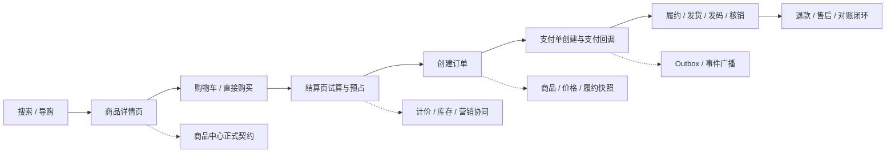
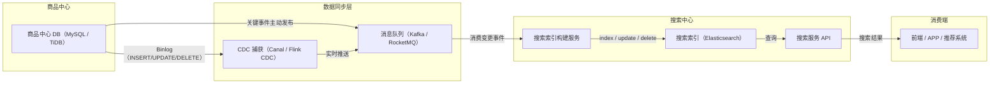
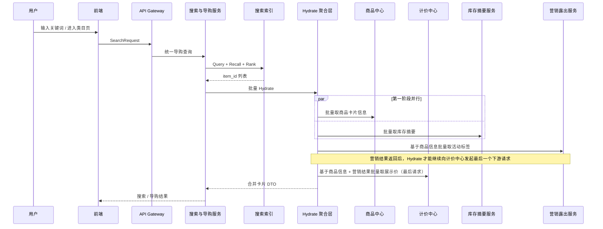
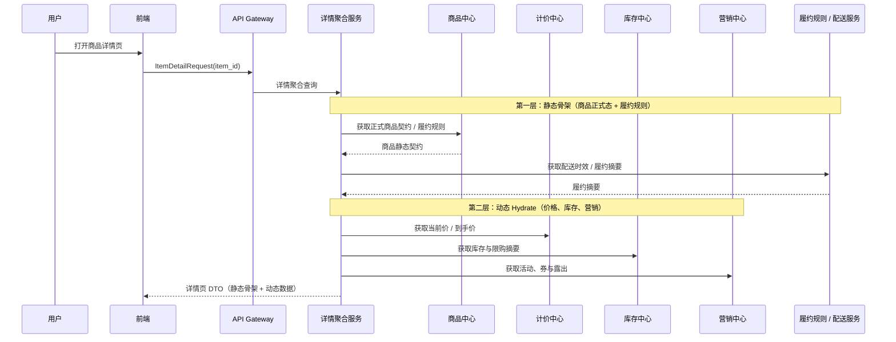
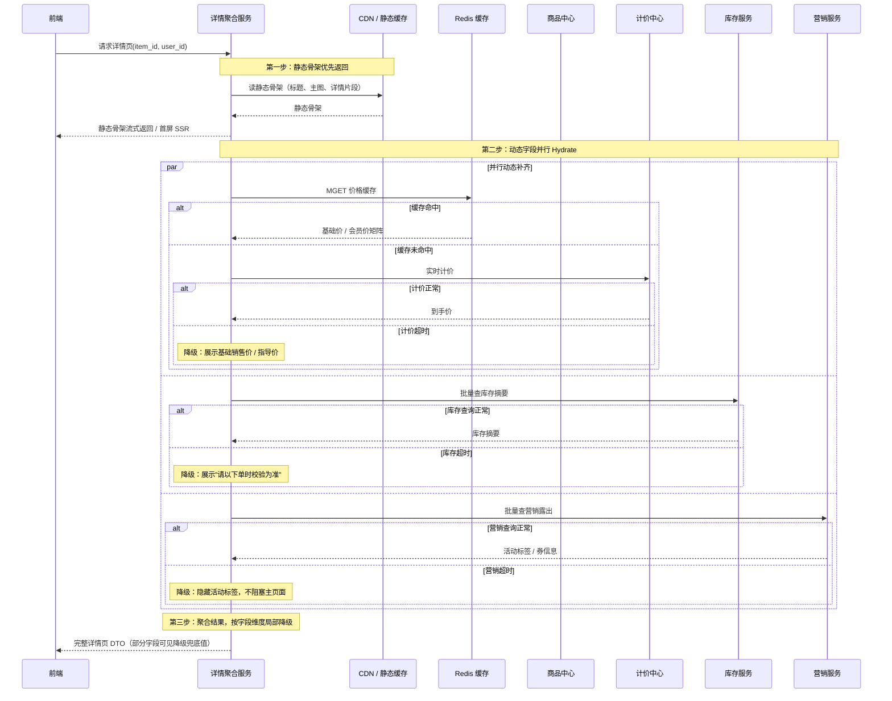
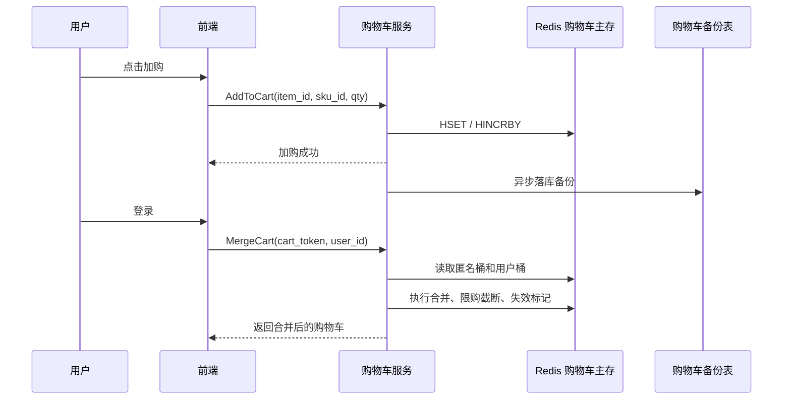
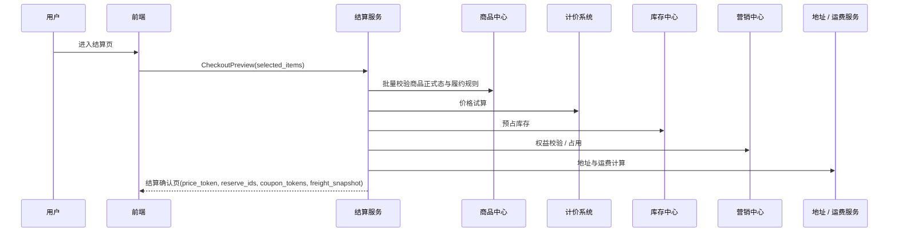
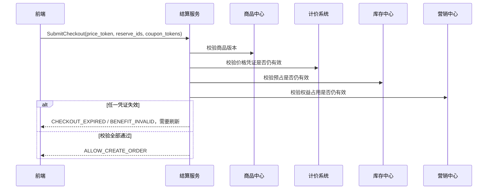

# 第 14 章 电商商品发现与交易准备：搜索、详情、购物车与结算

> **本章定位**：本章沿用户旅程讲清如何找到商品、理解商品、暂存购买意愿并形成可提交的结算凭证。重点是读链路的数据新鲜度、交易前校验和资源预占边界；订单创建后的资金、履约与售后闭环见[第 15 章](15-ecommerce-order-fulfillment.md)。

本章与第 15 章共同覆盖 C 端交易全生命周期。阅读时可把它们看成两个连续单元：第 14 章止于结算凭证准备完成，第 15 章从创单开始，继续处理订单、支付、履约和售后。

本章主要回答：

1. 搜索与详情如何在低延迟和数据新鲜度之间取舍？
2. 购物车保存什么事实，为什么它不锁定库存？
3. 结算如何组合计价、库存、营销和履约约束？
4. 怎样把展示信息和真正可成交的事实区分开？

配合阅读：[第 11 章 商品中心、商品供给与生命周期治理](11-product-center-supply-lifecycle.md)、[第 12 章 库存系统](12-inventory-system.md)、[第 13 章 营销与计价系统](13-marketing-pricing-system.md)。

---
## 14.1 核心场景、目标与边界

很多团队讲 C 端架构时，会按系统模块切开：搜索一章、购物车一章、订单一章、支付一章。这样当然清楚，但读者很容易失去真正的主线，因为用户不会感知自己“正在使用哪个中台系统”，他只会感知：

> 我能不能找到商品、看懂规则、拿到正确价格、顺利下单、正常支付、按承诺履约，以及出问题后能不能退款。

### 14.1.1 搜索与导购找商品

用户进入平台后的第一步，通常不是直接下单，而是先找到“值得交易的候选集”。

| 场景 | 用户动作 | 典型特征 | 系统重点 |
| --- | --- | --- | --- |
| 关键词搜索 | 搜品牌、搜型号、搜服务词 | 强相关性、结果多 | Query 理解、召回、排序、Hydrate |
| 类目导购 | 逛频道、逛类目、逛店铺 | 弱文本、强筛选 | 类目树、Facet、稳定排序 |
| 活动导购 | 进会场、看榜单、看运营专区 | 强陈列、强运营控制 | 搜索索引 + 运营露出 + 营销标 |

这一阶段要回答几个问题：

1. 搜索结果页为什么可以弱一致。
2. 为什么列表页不直接读商品中心主库。
3. 为什么用户看到的“列表价”和最终下单价不一定完全相同。

### 14.1.2 详情页理解商品

详情页是用户第一次把“可检索商品”理解为“可交易契约”的地方。

| 用户关注点 | 背后依赖的域 |
| --- | --- |
| 商品标题、主图、卖点、规格 | 商品中心 |
| 当前价格、到手价、阶梯价、实时价 | 计价中心 |
| 库存是否充足、是否限购 | 库存中心 |
| 活动、优惠券、赠品、满减露出 | 营销中心 |
| 发货时效、门店核销、预约规则、退款规则 | 商品中心 / 履约规则域 |

这意味着详情页本质上不是“查一张表”，而是一个 **多域聚合页**。它天然带来两个工程问题：

1. 详情页为什么不能直接等于下单事实。
2. 商品、价格、库存、营销版本不一致时，到底以谁为准。

### 14.1.3 加购与购物车暂存

购物车表达的是“用户意愿”，而不是“交易事实”。

| 场景 | 典型动作 | 关键差异 |
| --- | --- | --- |
| 未登录加购 | 用 `cart_token` 暂存 | 允许匿名、弱一致、可过期 |
| 登录后加购 | 绑定用户购物车 | 支持跨端同步 |
| 登录合并 | 匿名购物车合并到用户态 | 要处理数量合并、失效商品、限购截断 |

这里最重要的判断是：

- 购物车里为什么不锁库存。
- 为什么购物车允许展示价滞后，但结算必须实时试算。

### 14.1.4 结算、校验与提交订单

结算页是整条 C 端链路第一次真正进入 **强一致交易编排** 的地方。

| 结算阶段动作 | 关键系统 |
| --- | --- |
| 价格试算 | 计价系统 |
| 库存预占 | 库存系统 |
| 优惠校验 / 占用 | 营销系统 |
| 地址与运费计算 | 地址 / 运费系统 |
| 商品静态合规校验 | 商品中心 |

这一步要回答：

1. 为什么购物车不锁库存，结算才预占库存。
2. 为什么订单提交前要再次做版本校验。
3. 为什么结算页的本质是一个短生命周期 Saga，而不是简单表单确认。

### 14.1.5 下单、支付、履约与售后

用户点击“提交订单”之后，系统就从“交易前”进入“交易中与交易后”。

| 阶段 | 用户看到的动作 | 系统主导域 |
| --- | --- | --- |
| 下单 | 生成订单、等待支付 | 订单中心 |
| 支付 | 调起收银台、支付结果回流 | 支付中心 |
| 履约 | 发货、发码、预约、核销 | 履约 / 券码 / 供应商域 |
| 售后 | 退款、退货、取消、争议 | 订单 / 支付 / 履约协同 |

这阶段的核心问题包括：

1. 订单为什么必须保存商品、价格、履约快照。
2. 支付为什么不能直接决定商品状态和库存真相。
3. 为什么售后必须基于订单事实，而不是去查最新商品。

### 14.1.6 场景到系统问题的映射

| 场景类型 | 典型问题 |
| --- | --- |
| 搜索导购 | 弱一致索引、动态 Hydrate、排序与活动露出 |
| 商品详情 | 多域聚合、库存与价格展示口径、规则解释 |
| 购物车 | 匿名暂存、登录合并、失效商品治理 |
| 结算 | 价格试算、库存预占、优惠校验、提交前最终校验 |
| 下单支付 | 幂等、快照、支付回调、状态机推进 |
| 履约售后 | 发货 / 发码 / 核销、退款回补、历史订单解释 |

---

## 14.2 交易域模型、职责边界与一致性语义

这一节按照“先看系统边界，再看主链路，最后看关键决策”的顺序展开。先把商品、库存、计价、营销、订单、支付和履约各自的职责划清楚，再把这些系统放进一条 C 端完整交易主链路中理解，最后集中讨论搜索弱一致、详情聚合、结算预占、订单快照和售后事实这些关键设计选择。

### 14.2.1 系统边界和职责

| 系统 | 负责什么 | 不负责什么 |
| --- | --- | --- |
| 商品中心 | 正式商品契约、履约规则、退款规则、商品快照 | 购物车暂存、库存事实、支付状态 |
| 搜索与导购 | 商品召回、排序、导购投影 | 商品正式真相、订单事实 |
| 购物车与结算 | 用户意愿暂存、结算编排、试算与预占协同 | 正式创单、支付状态机 |
| 计价系统 | 实时报价、到手价解释、价格快照 | 订单状态推进、库存扣减 |
| 库存系统 | 可售库存事实、预占、确认、释放、消费 | 购物车、订单金额、营销规则 |
| 营销系统 | 优惠规则、券可用性、权益占用与释放 | 商品正式态、库存总账 |
| 订单系统 | 订单事实、订单状态机、交易快照 | 渠道支付、库存脚本实现 |
| 支付系统 | 支付单、渠道交互、支付事实 | 订单商品解释、商品真相 |
| 履约 / 核销 / 售后 | 发货、发码、核销、退款闭环 | 商品供给、搜索索引 |

最重要的三条原则是：

1. 搜索和详情服务用户发现，订单和支付服务用户承诺，履约和售后服务用户交付。
2. 商品中心负责交易前契约，订单中心负责交易事实，支付中心负责资金事实。
3. 订单之后，任何解释都优先基于快照和履约事实，而不是基于最新主数据。

### 14.2.2 C 端交易主链路总览



这条主链路表达的是：

1. 搜索、列表和详情是交易前的信息发现链路，允许适度弱一致。
2. 结算、下单、支付是交易承诺链路，必须逐步收紧校验口径。
3. 履约和售后是交易后事实链路，必须围绕订单快照和支付结果闭环。

### 14.2.3 决策点 1：为什么 C 端不能只用一个“大前台服务”承接全部链路

如果把搜索、详情、购物车、结算、订单、支付、履约全塞进一个“大前台交易服务”，短期当然看似简单，但长期一定会失控。

| 方案 | 优点 | 缺点 / 风险 | 推荐结论 |
| --- | --- | --- | --- |
| 方案 A：大一统前台服务 | 入口统一、联调简单 | 搜索弱一致和交易强一致混在一起；边界塌陷；状态机膨胀 | 不推荐 |
| 方案 B：按交易旅程拆域 | 职责清晰；一致性口径可分层；便于扩容和治理 | 系统间编排更复杂 | 推荐 |

推荐结论：

- 搜索 / 导购负责发现。
- 商品详情负责解释。
- 购物车负责意愿暂存。
- 结算负责强校验编排。
- 订单负责承诺落地。
- 支付负责资金事实。
- 履约与售后负责交易后闭环。

### 14.2.4 决策点 2：为什么搜索结果和详情页允许不同一致性口径

搜索结果页面对的是高 QPS 召回，详情页面对的是单商品强解释。

| 对象 | 推荐一致性 | 原因 |
| --- | --- | --- |
| 搜索结果页 | 弱一致 | 索引是投影，允许短暂滞后 |
| 详情页 | 近实时一致 | 需要展示交易前关键信息 |
| 下单 / 支付 | 强校验 | 不能靠展示信息直接成交 |

推荐结论：

- 搜索索引和列表投影可以异步刷新。
- 搜索结果页不是“所有字段都由 ES 直接吐出”；只有参与召回、过滤、排序且可容忍滞后的骨架字段进索引，高频强一致字段要通过商品中心、计价和库存批量 Hydrate。
- 详情页必须以正式商品契约为底，再补充当前价、库存和营销。
- 下单永远不能只信列表或详情页展示结果。

### 14.2.5 决策点 3：为什么购物车不锁库存，结算才预占库存

购物车表达的是“想买”，不是“已经占用交易资源”。

| 方案 | 风险 | 推荐结论 |
| --- | --- | --- |
| 购物车加购即锁库存 | 大量僵尸占用；资源利用率极差；售罄假象 | 不推荐 |
| 结算时再预占库存 | 只在交易临门一脚时收紧资源 | 推荐 |

推荐结论：

- 购物车只保存用户意愿。
- 进入结算页时，库存中心才执行 `ReserveInventory`。
- 支付失败、超时取消、风控拒绝后，必须显式释放预占。

### 14.2.6 决策点 4：为什么订单必须保存商品 / 价格 / 履约快照

如果订单创建后还依赖“实时查最新商品”，未来只会产生解释灾难。

| 事实 | 为什么要快照 |
| --- | --- |
| 商品标题、规格、履约规则 | 商品可能后续被改名、改规格、改退款口径 |
| 价格与优惠结果 | 价格和活动经常变化 |
| 履约参数 | 发码、预约、核销规则可能调整 |

推荐结论：

- 订单保存或引用创单时的商品快照、价格快照、履约快照。
- 售后和客服解释历史订单时，只认快照，不认最新商品。

### 14.2.7 决策点 5：为什么支付不能反向驱动订单主状态机

支付是资金事实，但不是订单全业务事实。

| 方案 | 风险 | 推荐结论 |
| --- | --- | --- |
| 支付中心直接改订单所有主状态 | 状态主权错位；订单域被支付绑死 | 不推荐 |
| 支付中心发支付事实事件，订单域自行推进状态 | 支付和订单解耦；幂等更清晰 | 推荐 |

推荐结论：

- 支付系统只负责支付单与支付结果。
- 订单系统消费支付成功 / 失败事件，自行推进自己的状态机。

### 14.2.8 决策点 6：为什么售后必须基于订单事实，而不是回查最新商品

退款、退货、取消和争议处理面对的是“历史承诺”，不是“当前最新售卖状态”。

推荐结论：

- 售后判断以订单快照、支付结果、履约状态和库存回补策略为准。
- 不允许用最新商品标题、最新价格、最新规则反向解释旧单。

### 14.2.9 统一业务模型：意愿、凭证、承诺与事实

把搜索、购物车、结算、订单、支付、履约和售后放在同一张图里观察，可以发现它们并不是七个互相独立的 CRUD 系统，而是在推动四类业务对象依次变形：

| 业务对象 | 产生位置 | 生命周期 | 允许被什么覆盖 | 不能被什么替代 |
| --- | --- | --- | --- | --- |
| 意愿 | 搜索、详情、购物车 | 分钟到数月 | 用户主动修改、商品失效标记 | 不能当作库存或订单承诺 |
| 凭证 | 结算、库存、营销、计价 | 秒级到分钟级 | 刷新、过期、撤销 | 不能当作最终订单事实 |
| 承诺 | 订单与订单项 | 订单全生命周期 | 合法的取消、退款、售后状态 | 不能被最新商品配置覆盖 |
| 事实 | 支付、履约、核销、退款 | 永久留痕 | 纠错事件和审计记录 | 不能靠页面展示推断 |

这四类对象必须有清晰的转换条件。购物车中的意愿只有在商品可售、价格有效、库存预占、营销占用和用户约束都通过后，才能生成一组结算凭证；凭证被订单中心消费并写入本地事务后，才形成订单承诺；支付、发货、核销和退款的外部结果，再以事实事件的形式推动承诺的状态变化。

这一模型可以避免一个常见误区：把任何接口返回的数据都叫作“订单状态”。例如，搜索索引中的 `available=true` 只是召回条件，库存服务返回的 `reserved` 只是临时资源凭证，支付渠道返回的 `succeeded` 只是资金事实。它们都不能直接替代订单域的状态主权。分布式事务研究强调，跨资源的长期业务事务应拆成可提交、可补偿的业务步骤，而不是依赖一个持续持锁的全局事务。[1][2] 因此在本场景中，我们把每次转换的输入、输出和补偿动作都显式建模。

### 14.2.10 权威数据源与状态主权

每个字段都应该有且只有一个权威写入者，其他系统只保存投影、快照或引用。建议在设计评审时强制填写下面的“事实归属表”：

| 事实 | 权威系统 | 其他系统可以保存 | 其他系统不能做 |
| --- | --- | --- | --- |
| 商品可售、规格、类目 | 商品中心 | 搜索索引、订单快照 | 不能由搜索索引反写商品正式态 |
| 当前价格与优惠计算 | 计价 / 营销中心 | 结算凭证、订单价格快照 | 不能由前端金额直接覆盖 |
| 可用库存与预占 | 库存中心 | 结算凭证、订单资源引用 | 不能由订单状态猜库存余额 |
| 订单主状态 | 订单中心 | 读模型、消息消费者状态 | 支付或履约系统不能直接改主状态 |
| 支付结果 | 支付中心及渠道凭证 | 订单支付投影、对账记录 | 不能由前端回调参数直接认定成功 |
| 履约结果 | 仓配、发码、预约等履约域 | 订单履约投影、客服视图 | 不能用商品配置推断已经履约 |
| 退款结果 | 支付 / 售后域 | 订单售后投影、审计记录 | 不能只凭申请成功显示退款完成 |

“权威”不等于“所有请求都必须同步访问主库”。它表示发生冲突时谁拥有最终解释权。搜索可以从索引读取，订单列表可以读取投影，客服可以读宽表；但发生金额争议时，应回到订单价格快照和支付凭证，发生库存争议时，应回到库存流水和预占记录。数据密集型系统设计通常把派生数据视为可重建投影，把不可替代的业务事实与投影分离。[4] 本书进一步把这一原则应用到电商：所有可重建的数据都要带版本、来源和更新时间，所有不可重建的数据都要落本地事实或外部凭证。

### 14.2.11 一致性分层：展示、交易前提与交易事实

本章不把“一致性”当作一个二元开关，而是按用户动作分成三层：

| 层次 | 典型请求 | 可接受延迟 | 失败时的用户体验 | 设计重点 |
| --- | --- | --- | --- | --- |
| 展示一致性 | 搜索列表、推荐、普通购物车读取 | 秒级到分钟级 | 刷新、提示数据已变化 | 缓存、索引、降级、版本标记 |
| 前提一致性 | 价格试算、库存预占、优惠占用 | 通常需要在线确认 | 阻断提交并指导刷新 | 凭证、TTL、版本校验、释放 |
| 事实一致性 | 订单落库、支付入账、退款完成 | 必须可追溯 | 显示处理中并异步收敛 | 本地事务、幂等、事件、对账 |

展示层允许短暂滞后，并不意味着交易可以信任展示结果。反过来，交易事实需要可追溯，也不意味着所有下游都必须在一个同步请求里完成。Google SRE 关于过载和尾延迟的实践指出，系统应明确哪些请求可以降级，哪些请求必须被拒绝或延后，否则低价值读流量会挤压高价值写入。[5][6] 因此在本章中，搜索可以返回“价格待刷新”，结算可以返回“优惠已失效”，订单提交则宁可快速失败，也不接受未经验证的旧凭证。

### 14.2.12 跨域协作的最小契约

跨域接口不应该只返回一个布尔值。一个可重试、可审计、可补偿的交易接口，至少需要包含：

| 契约部分 | 示例 | 作用 |
| --- | --- | --- |
| 请求身份 | `request_id`、`idempotency_key`、`user_id` | 防止重复执行和越权 |
| 业务版本 | `product_version`、`price_version`、`rule_version` | 判断凭证是否过期 |
| 资源引用 | `reserve_id`、`coupon_token`、`payment_intent_id` | 将短期资源与订单绑定 |
| 时间边界 | `expires_at`、`created_at` | 限制重放和无限等待 |
| 结果语义 | `accepted`、`confirmed`、`rejected`、`pending` | 区分收到请求与事实已完成 |
| 纠错入口 | `query_status`、`cancel`、`compensate` | 超时和异常时反查或补偿 |

接口成功的含义必须写清楚。例如库存 `Reserve` 成功只代表库存中心创建了预占记录，不代表订单已经创建；支付 `CreatePayment` 成功只代表支付单可被继续支付，不代表资金已入账；退款申请受理也不等于渠道已经退款完成。事件驱动系统通常需要同时处理重复、乱序和延迟消息，CloudEvents 对事件元数据的规范化以及企业集成模式中的幂等消费者模式，都说明了“可识别、可追踪、可重放”应成为跨域契约的一部分。[3][7][16] 在本章的实现里，所有事实事件都携带 `event_id`、`aggregate_id`、`event_type`、`occurred_at`、`schema_version` 和 `trace_id`。

---

## 14.3 搜索导购、详情与交易前读链路

### 14.3.1 场景画像

从用户进入平台到决定”我要不要买”，通常依次经过两种读路径：

1. 搜索 / 导购结果页：看的是候选集。
2. 商品详情页：看的是交易前解释。

这两条链路看起来都只是”读”，但它们的职责截然不同：

- 搜索结果页服务于召回和转化，强调高吞吐和可排序。
- 详情页服务于交易前理解，强调解释性和当前性。

从系统角度看，搜索、导购、详情之间不能揉成一个系统，也不能简单地串成一条长链路，而应该按各自的职责边界和一致性要求独立设计，再通过编排层聚合。

### 14.3.2 关键技术点

这一节先前置所有高价值架构结论，后续场景化时序图再展开具体调用关系。


**为什么搜索、导购、详情不能揉成一个系统**


很多团队早期会把”商品搜索、类目导购、详情查询”统一塞进一个搜索服务里，代码复用率高，看起来也方便。但这会带来三个致命问题：

- **职责塌陷**：搜索负责高吞吐召回和排序，导购负责多维度筛选和聚合卡片展示，详情负责多域事实聚合。三者面对的下游依赖链、缓存策略、降级粒度完全不同，揉在一起只会让每个场景都背上不该背的依赖。
- **一致性口子撕裂开**：搜索页天然允许弱一致，详情页需要近实时一致。如果把两个场景放在同一个服务里，开发人员很难在代码层面区分”这个字段可以滞后 5 分钟”和”这个字段必须实时校验”。
- **大促放大故障面**：搜索页 QPS 远高于详情页。一旦合并在同一个服务里，高并发搜索流量会直接把详情页的计价、库存、营销下游一起拖垮。

因此推荐结论很明确：

- 搜索服务解决召回、筛选、排序。
- 导购服务解决聚合卡片展示。
- 详情聚合服务解决多域事实聚合。


**哪些字段来自 ES，哪些字段来自商品中心**


这条链路里最关键的设计点，不是”多调了几个下游”，而是：**搜索结果页到底哪些数据应该直接来自搜索中心，哪些数据应该回商品中心 / 计价 / 库存实时补齐**。

决策原则只有三条：

1. **是否参与召回、过滤、排序**：参与这些能力的字段，优先放到 ES。
2. **变动频次高不高**：高频变化字段不要把绝对真相压进 ES。
3. **对准确性要求高不高**：一旦字段直接影响成交，就应该让实时权威域说了算。

因此，搜索结果页通常采用”**ES 出骨架，商品中心与交易相关域补血肉**”的模式：

| 字段类型 | 主要来源 | 为什么这么设计 |
| --- | --- | --- |
| 标题、副标题、主图、品牌、类目、属性标签 | 搜索中心 / ES | 这些字段参与检索、过滤、聚合或高频展示，适合做索引骨架。 |
| 上下架状态、可搜状态 | 搜索中心 / ES 过滤 | 必须在搜索阶段先过滤掉不可售对象，避免返回无意义结果。 |
| 销量、评分、热度等排序因子 | 搜索中心 / ES | 直接用于粗排或综合排序，允许弱一致。 |
| 实时到手价、会员价、促销价 | 计价中心 / 商品中心 Hydrate | 高敏感、高频变化，列表允许短暂滞后，但展示时最好用实时结果覆盖。 |
| 绝对库存数、紧张库存文案 | 库存中心 Hydrate | 属于高频高并发变化字段，不能让 ES 承担绝对数写入。 |
| 活动标签、圈品命中、促销露出 | 营销中心 Hydrate | 露出逻辑变化快，且失败时可以局部降级。 |
| 冷门说明类字段 | 商品中心 | 不参与搜索与排序，没必要进 ES。 |

一个很实用的判断方法是：

- **只要字段决定”搜不搜得到、排在第几位、能不能按它筛选”**，就应该优先放进 ES。
- **只要字段决定”现在到底多少钱、到底还有没有货、这个活动此刻还能不能领”**，就应该优先让商品中心、计价或库存域返回实时结果。


**搜索结果页为什么只认 ES 骨架，不直接等于交易事实**


搜索结果页的目标是高吞吐召回、排序和转化，不承担交易真相主权。它展示的是”当前最有可能被用户点击的候选集”，不是”此刻可以直接下单成交的最终合同”。

因此，搜索页允许：

- 索引异步刷新
- 列表字段局部滞后
- 某些弱展示字段降级缺失

但它不能越界去承担：

- 实时价格真相
- 实时库存真相
- 权益资格最终裁决

这也意味着：**下单前必须重新校验价格、库存、权益**。搜索结果页拿到的是”可浏览卡片”，不是”可下单事实”。


**搜索结果页的 Hydrate 编排为什么不是纯串行，也不是无脑全并行**


Hydrate 层最容易被低估的一个问题是：**下游依赖到底应该串行调用，还是并行调用**。

如果完全按照”商品中心 -> 库存中心 -> 营销中心 -> 计价中心”的直觉串行走，业务理解上很顺，但性能上很危险。因为只要每个 RPC 平均耗时 20ms，四段串行下来就已经接近 80ms；任意一个下游轻微抖动，整条列表页链路就会很容易冲到 150ms 以上。

更稳妥的工程实践通常不是”全串行”，也不是”无脑全并行”，而是**带依赖关系的半并行编排**：

1. **第一阶段并行**
   - 商品中心：拿商品卡片骨架、类目、品牌、商家等基础信息
   - 库存中心：拿库存摘要、是否有货、紧张状态
2. **第二阶段**
   - 营销中心：基于商品基础信息和用户上下文，先判断活动命中、优惠资格、券与满减露出
3. **第三阶段**
   - 计价中心：在拿到营销结果之后，再基于商品基础信息、营销结果和用户上下文计算展示价、会员价、到手价

这样做的原因是：

- **库存中心通常只依赖 item_id / sku_id**，并不依赖商品标题、品牌、类目这些骨架字段；
- **商品中心也不依赖价格和库存**，它本身就是卡片骨架来源；
- **营销中心** 往往依赖商品类目、商家、售卖属性来判断露出与资格；
- **计价中心** 在很多实现里并不是独立”拍脑袋算价”，而是要把营销命中的结果、优惠叠加关系、会员折扣、活动门槛一起折进最终展示价，所以它天然位于营销之后。

这种编排的总耗时，更接近：

- `max(商品中心, 库存中心) + 营销中心 + 计价中心`

而不是四段简单相加。所以它通常仍然明显优于”商品 -> 库存 -> 营销 -> 计价”的纯串行模式，同时又不会像”盲目全并行”那样把前置依赖关系搞乱。

如果业务继续追求更低的列表页延迟，还可以进一步演进到**近似全并行**：在计价中心和营销中心内部也冗余一份极简的商品基础信息，例如：

- `item_id -> 类目`
- `item_id -> 商家`
- `item_id -> 基础售卖属性`

这样一来，Hydrate 层在收到 ES 返回的 item_id 列表后，就可以：

- 同时查商品中心
- 同时查库存中心
- 同时查营销中心
- 等营销结果返回后，再调计价中心

因为营销不再必须等待商品中心先返回类目信息，而计价至少不需要再回头额外查一次商品中心。这本质上是：

> **用数据冗余换实时编排延迟。**

但要注意，这种”绝对并行”只适合在两个前提下使用：

1. 营销和计价中心内部维护的商品轻量副本足够新鲜；
2. 你们愿意承担多一层数据同步和一致性治理的复杂度。

所以默认推荐结论是：

> **Hydrate 层优先采用”商品 + 库存第一阶段并行，营销第二阶段，计价第三阶段”的半并行架构；只有在对延迟极度敏感、且下游已经具备足够商品副本和营销结果缓存时，才继续压缩计价前置依赖。**


**详情页为什么必须做动静分离**


商品详情页（PDP）是交易漏斗里最核心的读页面之一。它的特点是：

- 流量极大
- 读多写少
- 高可用要求极苛刻
- 用户对页面解释能力和加载速度都极其敏感

因此，详情页不能做成”每次请求实时查所有下游”的重聚合链路，而要先做**动静分离**。

从工程上看，详情页的数据通常可以拆成两类：

- **静态数据**：
  - 标题、副标题
  - 主图、详情图
  - 商品参数说明
  - 低频变化的文案和结构化描述
- **动态数据**：
  - 当前到手价
  - 库存摘要
  - 当前用户可见的权益和促销露出
  - 配送时效、门店核销、预约规则、评价摘要

更稳妥的详情页架构通常是：

1. **静态骨架优先**
   - 商品静态内容通过静态 JSON、静态片段或 CDN 化页面骨架快速返回。
   - 用户先看到稳定的页面结构、标题和主图，而不是等待所有后端系统都准备完毕。
2. **动态数据异步 Hydrate**
   - 前端或详情聚合层再去批量拿价格、库存、营销和履约数据。
   - 动态内容可以稍晚几十毫秒填充，但不能把首屏完全卡死。

为了让这条链路在大促和高并发下仍然稳定，通常要配合**多级缓存**：

- **CDN / 静态内容缓存**
  - 兜底标题、主图、详情骨架
- **聚合层本地缓存（如 Caffeine）**
  - 缓住极短时间内的重复请求和热点详情
- **分布式缓存（如 Redis）**
  - 缓住基础价、库存摘要、详情聚合片段或短期动态结果

这样做的目标不是追求”所有详情字段都绝对实时”，而是：

> **先保证详情页稳定打开，再保证动态关键信息足够新鲜，最后在创单前做最终强校验。**


**详情页里的实时计价、库存摘要与大促降级**


详情页里最敏感的两个问题，永远是：

1. 现在多少钱
2. 现在还有没有货

这两个字段之所以难，是因为它们都不适合做成简单的全量缓存。

对于**价格**来说，真正的到手价往往同时受以下因素影响：

- 会员等级
- 商品基础价
- 店铺活动
- 平台券 / 品类券
- 用户专属权益

因此更常见的做法不是缓存”所有用户的最终价”，而是：

- 缓存**基础价 / 会员价矩阵 / 基础促销价**
- 在详情请求进来时，再结合用户上下文和营销命中做轻量实时计算

对于**库存**来说，详情页一般不追求展示精确库存数字，而是展示：

- 有货
- 无货
- 紧张库存
- 仅剩少量

这样可以显著降低库存读压力，同时也避免把高频变化的绝对库存数暴露到前台。

但真正的大问题出现在**大促、热点商品和下游抖动**场景下。此时详情页必须具备明确的降级能力：

- **计价服务超时**
  - 优先展示基础销售价或指导价
- **库存摘要超时**
  - 退化为保守文案，如”库存确认中”或”请以下单时校验为准”
- **营销露出超时**
  - 隐藏活动标签，不阻塞主页面
- **Redis 或下游依赖异常**
  - 先用本地缓存或静态兜底页保证详情可打开

对热点商品，还要配合：

- 热 Key 探测
- 本地热点缓存
- 限流与线程池隔离

这样即使某个爆款详情在几秒内被打到极高 QPS，也不至于把 Redis、计价、库存或营销服务一起拖崩。

所以详情页的核心不是”把所有数据都实时算到最准”，而是：

> **在可接受的一致性范围内，把最重要的动态字段算出来，把不重要的字段降级掉，并且永远保证详情页页面本身不因为单个下游故障而整体不可用。**


**搜索与详情的一致性边界怎么定**


第 2 节已经给出了整体一致性分层，这里把结论聚焦到搜索和详情内部：

| 对象 | 推荐一致性 | 原因 |
| --- | --- | --- |
| 搜索结果页 | 弱一致 | 索引是投影，允许短暂滞后 |
| 详情页静态骨架 | 近实时一致 | 商品契约信息，变更频率低，可缓存 |
| 详情页动态字段 | 允许短暂偏差 | 计价、库存、营销可能发生秒级变化 |
| 创单 / 结算 | 强校验 | 不能靠展示信息直接成交 |

推荐结论：

- 搜索索引和列表投影可以异步刷新。
- 搜索结果页不是”所有字段都由 ES 直接吐出”；只有参与召回、过滤、排序且可容忍滞后的骨架字段进索引，高频强一致字段要通过商品中心、计价和库存批量 Hydrate。
- 详情页必须以正式商品契约为底，再补充当前价、库存和营销。
- 下单永远不能只信列表或详情页展示结果。


**为什么详情页之后还需要结算页和订单快照**


详情页虽然比列表页更接近交易真相，但它仍然只是用户下单前的解释界面。它需要把：

- 正式商品契约
- 当前价格
- 当前库存摘要
- 营销露出
- 履约规则

聚合成一个可理解的商品页面，但它仍然不能替代：

- 结算页的价格试算
- 预占库存
- 优惠校验
- 创单前最终版本校验

一句话：**搜索与详情只负责”看”，结算与订单才负责”认”**。订单快照则是把”认下来的事实”持久化，确保后续履约和售后不再回头依赖最新商品真相。


**高并发下如何保护搜索 Hydrate 下游**


搜索和详情链路的 Hydrate 阶段依赖多个下游：商品中心、库存中心、营销中心、计价中心。高并发下，这些下游很容易被放大后的请求量打穿。

工程上推荐用分层保护策略：

- **批量接口**：Hydrate 层不再逐条调用下游 RPC，而是按 item_id 列表做批量查询，减少 RPC 数量。
- **线程池隔离 / 舱壁隔离**：为商品、库存、营销、计价分别分配独立线程池，避免某一个下游慢调用占满公共线程池。
- **超时控制**：每个下游 RPC 独立设置超时时间，任一超时触发即时降级。
- **局部降级**：超时后按字段维度降级（如计价超时不阻断整个卡片，只用基础价兜底），而不是整页失败。
- **热点缓存**：热点商品在本地缓存和 Redis 里保护下游不被击穿。

这些技术和 3.6 的场景三时序图互相呼应，形成”文字说明原则 + 图说明流程”的对照。


**为什么酒店要单独作为特殊场景处理**


普通实物电商商品，信息变更以商品本身为主（价格、库存、活动）。但酒店天然带有 **日期维度** 与 **用户上下文**。同一家酒店，在不同入住日、房型、会员等级和连住天数下，真实价格和真实可售状态都可能完全不同。这意味着：

- 酒店的”可检索属性”和”可交易真相”之间的鸿沟比普通商品大得多；
- 搜索索引、详情聚合、结算校验三层之间的一致性治理复杂度远高于标品；
- 价格排序、深翻页、实时房态一致性等问题需要专门的架构策略。

因此本章将酒店相关内容统一收口到 3.8 节作为独立特殊场景处理。以下内容从 3.3 开始按场景化时序图展开。


**统一 scene 查询服务与四阶段流水线**


搜索与结构化导购可以共享一条查询内核，但不能共享一套含糊的业务语义。推荐由导购查询服务对外暴露统一接口，用 `scene` 表达用户意图，用结构化约束表达过滤条件，再在内部依次完成 Query、Recall、Rank、Hydrate 四个阶段。这样搜索、类目浏览和店铺内浏览共享批量接口、日志和降级机制，同时保留各自的产品目标。

| 场景 | 用户输入 | 主要约束 | 召回与排序重点 | 结果解释 |
| --- | --- | --- | --- | --- |
| `keyword` | 关键词、类目、品牌、筛选项 | 文本相关性与可售过滤 | 分词、同义词、相关性、业务排序 | 为什么匹配这个词 |
| `category` | 类目、品牌、属性筛选 | 类目树和 Facet 组合 | 稳定排序、运营陈列、库存信号 | 当前筛选条件是什么 |
| `shop` | 店铺、关键词、店内筛选 | 店铺边界与商家状态 | 店内相关性、店铺运营规则 | 商品属于哪个店铺 |

请求上下文至少携带 `query_id`、`scene`、用户和设备匿名标识、`filter_version`、`rank_version`、实验桶以及数据新鲜度要求。`scene` 不是前端随意传入的字符串，而应由网关或查询服务校验枚举、字段白名单和分页上限。若把排序逻辑散落在多个 BFF，后续会出现同一个商品在搜索、类目和店铺页的排序口径无法解释，实验也无法回滚。

四阶段的输入输出要明确：Query 阶段把用户输入转换为归一化查询和意图特征；Recall 阶段从索引、运营池或规则集合获得候选商品 ID；Rank 阶段在候选集上执行相关性、业务权重和实验配置；Hydrate 阶段批量补齐价格、库存、营销和履约摘要。每一阶段都应记录耗时、候选数量、丢弃原因和版本，避免只监控一个“搜索接口总耗时”。


**索引是版本化投影，不是第二个商品主库**


搜索索引的数据流应从商品中心、上架系统、生命周期治理和运营配置产生事件，经消息总线进入索引 Worker，再写入 Elasticsearch 的写别名或新版本索引。索引 Worker 只拥有“如何构建搜索投影”的职责，不拥有商品正式状态、价格真相或库存总账。派生投影可重建这一点意味着：索引文档必须保留来源版本、更新时间和构建版本，不能只保存最终字段而丢失判断依据。[4]

增量更新至少需要三道保护。第一，以 `spu_id` 或 `sku_id` 作为分区键，让同一聚合的事件尽量有序；第二，在文档中写入 `source_version`，消费端使用版本条件更新，拒绝旧事件覆盖新事件；第三，消费者记录 `event_id` 和处理结果，重复投递只重放幂等写入。Kafka 的至少一次投递和幂等生产者可以降低重复风险，但不能替代索引文档版本和业务对账。[7][8]

全量重建不能直接覆盖线上索引。更稳妥的流程是创建带 `mapping_version` 的新索引，执行全量快照和增量追平，抽样比较文档数量、版本和关键字段，再通过原子别名切换读流量。切换后保留旧索引一段观察窗口，以便在零结果率、召回量或排序指标异常时快速回滚。别名切换的原子性只能保证读入口的一致，不能保证新索引已经包含所有最新事件，因此切换前后的版本差异仍需由对账任务检查。


**Query、Recall、Rank、Hydrate 的性能边界**


四个阶段的优化目标不同，不能用“整体加机器”替代边界设计：

| 阶段 | 主要工作 | 关键指标 | 典型失败处理 |
| --- | --- | --- | --- |
| Query | 分词、纠错、同义词、意图和过滤归一 | 改写命中率、非法条件率、耗时 | 使用安全的原词或返回可解释空结果 |
| Recall | 倒排、结构化过滤、运营池、多路召回 | 候选数、零结果率、召回耗时 | 关闭高成本召回，保留主索引 |
| Rank | 相关性、业务权重、实验和稳定排序 | P99、排序版本、分桶差异 | 回退到稳定排序版本 |
| Hydrate | 商品、价格、库存、营销批量补齐 | 依赖成功率、字段缺失率、尾延迟 | 局部字段降级，不阻塞整页 |

Elasticsearch 的查询应尽量把过滤条件放在 filter 语义中，把不需要参与评分的限制从相关性计算中分离；排序字段需要评估 `doc_values`、内存和写入代价。`from/size` 深分页会随着页码增加而扩大协调节点和分片的工作量，面向用户的连续翻页应优先采用带稳定排序键的 `search_after`，并限制游标有效期。`search_after` 不是任意跳页方案，产品必须明确是否支持跳到第 N 页、结果快照是否需要稳定，以及索引切换后游标如何失效。[11]

排序必须有稳定的兜底键，例如业务排序值、更新时间和唯一 ID 的组合，不能只按一个会频繁变化的热度字段排序。否则同一用户连续翻页时会出现重复和漏项，Hydrate 后的局部重新排序也可能让用户感觉页面不稳定。对酒店等动态报价场景，可以先用基础价粗排，再对当前页做受控的实时修正，但不应把实时修正结果伪装成全局精确排序。


**缓存、热点和实验必须绑定版本**


搜索缓存应区分查询结果缓存、静态详情缓存和动态 Hydrate 缓存。查询结果缓存的 key 至少包含归一化 query、scene、过滤条件、分页游标、站点和 `rank_version`；Hydrate 缓存还要包含用户权益上下文的必要摘要、价格版本或库存新鲜度边界。只用关键词作为 key，会把一次实验结果、过期价格或错误降级结果污染到其他用户。

热点保护通常分三层：边缘或网关短缓存吸收重复请求，搜索服务本地缓存保护最热 query，ES 和 Hydrate 下游使用限流、舱壁和批量接口控制放大倍数。对 suggest、联想词和热门榜单要设置独立配额，因为输入框每敲一个字符都会生成请求；不能让低价值的联想流量挤占交易前详情和结算的资源。

零结果率是搜索质量和数据健康的共同信号。零结果上升时，先区分用户真的没有匹配、索引延迟、过滤条件互斥、词典改错还是查询超时；可以在不改变交易事实的前提下回退同义词、放宽非关键筛选或展示类目引导，但不能为了降低零结果率返回已经下架或不合规的商品。实验请求要把 `exp_id` 和配置版本贯穿日志、缓存、排序和指标，影子流量或回放结果用于验证新排序，指标异常时能够按版本快速停止。


**搜索结果的可解释性与交易衔接**


搜索不是只返回商品 ID。面向用户的结果应能解释命中、筛选、价格和可售状态的来源与新鲜度；面向工程和客服的结果还要带 `query_id`、索引版本、排序版本、Hydrate 依赖结果和降级原因。这样用户看到“参考价”“库存确认中”时，产品话术与后端事实是一致的，客服也能根据版本和 trace 还原问题。

搜索结果离开读链路进入详情、结算或订单时，必须显式丢弃“可直接成交”的假设：商品详情重新确认正式商品契约，结算重新试算价格和营销，库存重新预占，订单写入快照。读模型的版本可以作为校验输入，不能成为订单金额或库存的最终来源。这个边界把搜索的高吞吐优势与交易的资金安全连接起来，也避免把 ES 变成事实主库。


**删除、下架与索引修复的语义**


搜索投影对删除和下架不能只做“把文档删掉”这一种处理。商品被软删除、下架、审核拒绝、店铺冻结或生命周期过期时，事件应携带原因、来源版本和生效时间；索引消费者根据事件类型决定是从可搜索集合移除、保留不可见文档供历史回放，还是只更新过滤字段。这样客服和数据团队仍能区分“用户没有搜到”与“商品本来存在但当前不可搜”，也便于重新上架时从主数据重建完整文档。

删除事件同样可能重复、乱序或丢失。推荐把“可搜索”作为带版本的投影字段，而不是仅依赖物理删除：较新的下架版本可以把文档标记为不可召回，后台异步清理；较旧的上架事件不能重新打开文档。索引抽样对账时，应同时检查主数据中的合规状态、投影的可搜索状态、最后来源版本和删除事件是否闭合。对账任务生成修复队列后，可以按聚合重放事件或从主数据重建单个文档，不能直接批量把 ES 字段改成猜测值。

查询回放还应区分“同一请求的结果可复现”和“线上结果必须永久冻结”。搜索通常只要求前者：保留归一化 query、scene、排序配置、索引别名和 Hydrate 结果摘要，就能在脱敏测试数据上重放并解释差异；详情和结算则要把价格、库存、营销版本固化为快照。这个边界既支持相关性和实验排障，也不会把高成本的全量搜索快照误当成交易凭证。

排序治理还要把相关性目标和商业规则分开。文本相关性、类目匹配和用户输入意图决定基础排序，运营加权、广告露出、库存状态和商家策略只能在声明的约束范围内参与，且每次调整都要记录规则版本、适用 scene 和影响指标。不能用一个不可解释的综合分数同时解决相关性、毛利、库存和活动目标，否则一旦转化下降，团队既无法定位是哪条规则生效，也无法在不重建全部索引的情况下回滚。


**查询契约要表达用户语义，而不是暴露索引细节**


统一查询服务的接口不应让调用方直接传 Elasticsearch DSL。DSL 是当前检索实现的内部协议，一旦把它暴露给 App、运营后台或多个 BFF，任何一个调用方都可能依赖某个字段名、默认排序或脚本行为，最终导致索引 mapping 无法演进。更稳妥的接口是以业务语义表达请求：`scene`、关键词、类目、店铺、筛选条件、排序意图、分页游标、站点、用户上下文摘要和数据新鲜度要求。服务端负责校验字段白名单、规范化条件、补齐默认过滤，并将内部查询计划记录下来。

查询契约还要明确“没有提供”和“明确选择空值”的区别。例如用户未选择品牌，意味着不增加品牌过滤；用户选择“无品牌”或某个空属性，则可能是一个合法筛选条件。价格区间、时间区间、地理半径和库存状态也不能只用字符串传递，否则不同客户端会对边界、时区和单位产生不同解释。接口层应输出规范化后的条件摘要和拒绝原因，使日志能够回答“用户到底请求了什么”，而不是只留下一个无法复现的原始 URL。

查询取消同样属于契约的一部分。用户快速修改关键词时，前一个请求即使已经发出，也不应继续无限消耗召回、排序和 Hydrate 预算。网关可以使用请求截止时间和取消信号，服务内部在阶段边界检查剩余预算；已经进入不可取消的批量调用时，则通过小批量、连接池隔离和结果丢弃避免把过时请求写入缓存。W3C Trace Context 规定的传播字段可以帮助跨网关、查询编排和下游依赖关联同一条调用链，[12] 但 `trace_id` 只用于技术关联，不能替代业务上的 `query_id`、实验桶和结果版本。[13]

这一区分在故障排查时尤其重要：同一个 `trace_id` 可能因为重试产生多条尝试，而同一个 `query_id` 代表用户界面上的一次查询意图；页面刷新、自动补全和主搜索也应有不同的请求类型。若把这些标识混成一个字段，指标会把取消请求、重试请求和真正完成的请求混在一起，既无法计算搜索转化漏斗，也无法判断下游超时是用户主动离开还是系统确实变慢。


**多路召回必须有预算、去重和质量闭环**


单路关键词召回并不能覆盖所有商品表达，但增加类目召回、品牌召回、运营池、历史点击召回或向量召回后，复杂度不会只增加一个接口。每一路都要声明候选上限、超时预算、过滤条件、优先级、去重键和失败语义。查询编排器先为每一路分配预算，再以展示单元的稳定 ID 去重，最后将候选集交给粗排和精排；任何一路超时，都应允许主链路使用其余候选完成，而不是把所有结果判为失败。

| 召回来源 | 适合解决的问题 | 需要控制的风险 | 建议的质量信号 |
| --- | --- | --- | --- |
| 关键词倒排 | 用户明确表达的意图 | 同义词不足、拼写噪声 | 命中率、零结果率、点击位置 |
| 类目与属性 | 结构化浏览和筛选 | 条件互斥、类目挂错 | Facet 使用率、过滤后候选数 |
| 运营池 | 会场、榜单和活动陈列 | 过度插入、规则污染相关性 | 资源位点击、投诉率、回滚次数 |
| 向量或行为召回 | 语义近似和长尾表达 | 不可解释、召回漂移 | 独立覆盖率、离线相关性、延迟 |

多路召回的合并不应直接按来源顺序拼接。若运营池永远排在关键词结果前面，用户会认为搜索不相关；若向量候选数量没有上限，泛化商品会挤掉精确匹配；若历史行为召回带入了用户不再允许看到的商品，还可能绕过合规过滤。因此，所有候选在合并前都必须经过统一的可搜索、站点、商家、类目和合规过滤，去重后再按来源配额进入排序。来源配额、截断数量和过滤原因要作为 `rank_version` 的一部分记录，便于解释某次结果为什么变化。

质量闭环也要区分“没有召回”和“召回后没有展示”。前者可能是词典、索引或过滤问题，后者可能是排序、去重、资源位或合规过滤问题。日志至少记录每个候选的 `recall_source`、进入和离开各阶段的原因、最终位置以及是否被 Hydrate 丢弃。这样离线评估可以构造“召回覆盖—排序质量—展示可用性”的分层指标，而不是只用最终点击率反推所有问题。对含有个性化行为的召回，还要遵守最小化采集和脱敏原则，避免把搜索框中的手机号、地址或订单号写入长期训练数据。


**Hydrate 的并发控制决定读链路是否会反噬交易链路**


Hydrate 看似只是批量补字段，实际是一个跨域扇出器。假设一页有 50 个展示单元，同时需要价格、库存、营销和履约摘要，如果每个单元分别调用四个服务，就会把一次用户请求放大成数百次 RPC。批量接口只能降低网络次数，不能自动消除下游计算压力；查询服务还要按照依赖的容量、超时和业务重要性设置独立舱壁、并发上限和批次大小。

推荐把卡片字段分成三类：第一类是没有它就无法理解结果的核心字段，如标题、主图和商品标识；第二类是影响决策但可以显示“确认中”的动态字段，如参考价、库存摘要和配送时效；第三类是增强体验的可选字段，如活动标签、推荐理由和扩展卖点。核心字段失败时可以减少结果数量或切换到索引中的安全骨架，动态字段失败时要明确标注新鲜度，增强字段失败时直接省略。这个分层比对所有依赖设置同一个总超时更能保护用户语义。

Hydrate 的并发预算还应按照入口隔离。搜索主结果、详情页相似商品、购物车推荐、自动补全和运营后台不能共用一套无上限的线程池；suggest 的单字符请求量通常很高，但它对成交事实的价值低于结算前的价格和库存校验。每个入口应有最大候选数、最大批次数和最大下游等待时间，超出预算就返回部分结果。下游返回部分失败时，结果中应保留字段级状态，例如 `price_status=stale`、`inventory_status=unknown`，而不是将空值解释成“零元”或“无库存”。

价格和库存的降级尤其需要防止语义越界。索引中的基础价可以用于筛选和粗排，但不能在用户点击购买时继续沿用；库存摘要可以显示“有货”“库存紧张”或“确认中”，但不能把“确认中”渲染成已经锁定。进入详情、结算和创单时，系统必须重新读取权威计价和库存服务，按照当前用户、地址、优惠和时间窗口生成新的报价与预占。HTTP 的错误语义和问题详情格式可以帮助调用方区分参数错误、依赖不可用和请求过期，[14][15] 但最终能否下单仍由交易域的不变量决定。


**排序、词典和索引发布要形成可回放的变更流水线**


搜索质量的发布对象不只有代码。分词器、同义词、类目映射、过滤规则、排序权重、模型、索引 mapping、运营资源位和缓存版本都可能改变结果。每次发布应生成一个不可变配置包，至少包含配置版本、适用 scene、输入数据快照或摘要、预期影响、回滚动作和责任人。索引映射变更要通过新物理索引验证，排序和词典变更则要先用固定 query 集离线回放；不能只在开发者自己的几个关键词上确认“结果看起来正常”。

回放数据应覆盖头部 query、长尾 query、零结果 query、品牌歧义、类目筛选、店铺搜索、活动资源位以及敏感词边界。对每个样本，比较候选覆盖、首屏相关性、过滤正确性、排序稳定性、响应大小和各阶段延迟；对于个性化结果，使用脱敏后的特征摘要和固定实验桶，避免把一次线上用户画像误当成通用结论。离线指标改善也不能直接等于线上收益，线上还要观察搜索到详情、详情到结算、价格投诉、取消和退款等后续信号。

实验平台应支持至少三种操作：shadow 只计算新方案但不影响用户，灰度按稳定用户或设备分桶，紧急停止按 `exp_id` 和配置版本关闭。缓存 key、日志和下游 Hydrate 请求必须带上实验上下文，否则用户已经被分到新方案，缓存却返回旧方案结果，指标会出现虚假的随机波动。实验结束后要清理失效配置和缓存命名空间，保留汇总结果、样本规模和统计口径；长期不清理的实验开关会把排序系统变成无法审计的条件树。

搜索读模型还应具备最小的隐私和合规治理：原始 query 按最小必要原则保留，账号、手机号、地址、支付信息等疑似敏感片段要脱敏或丢弃；运营人员只能看到完成授权的数据范围；删除用户数据时，查询日志、实验样本和离线回放副本也要有可执行的删除策略。搜索系统不是因为只读就天然没有合规责任，尤其当它同时沉淀用户意图、价格偏好和行为反馈时，数据生命周期应与交易审计、客服排障和模型训练分别定义。

由此可以把搜索读链路的验收标准收敛成四个问题：查询是否能被准确解释，候选是否在预算内产生，动态字段是否标明真实新鲜度，结果是否能安全地衔接到交易校验。四个问题分别对应查询契约、召回治理、Hydrate 降级和权威事实边界。任何一个问题没有答案，系统即使在压测中拥有很高吞吐，也仍然可能在大促、索引切换或价格波动时把读模型问题放大成交易投诉。

### 14.3.3 场景一：搜索索引视图的构建

在深入搜索结果页、详情页的查询链路之前，必须先回答一个更前置的问题：**搜索中心的索引数据到底是怎么从商品中心同步过来的**。

电商系统中，商品中心是商品数据的"权威源"（Source of Truth），存储在关系型数据库（如 MySQL、TiDB）中。而搜索中心使用专业的搜索引擎（如 Elasticsearch、OpenSearch）构建倒排索引。搜索中心本质上不是另一套"商品数据库"，而是商品中心数据的 **索引视图**。因此，索引视图的构建质量直接决定了搜索、导购和详情链路上所有查询的可用性和准确性。


**整体架构流程**




这条链路的核心思想是：**商品中心负责写入真相，搜索中心通过可靠的异步管道构建索引视图，搜索服务再基于索引视图对外提供高吞吐的读能力**。


**数据同步机制**


搜索中心不能直接读写商品中心的库，而是通过以下方式同步数据。

**（1）增量同步（推荐主路径）**

- **CDC（Change Data Capture）**：使用 Canal、Flink CDC、Debezium 等工具监听商品中心数据库的 Binlog，捕获 `INSERT / UPDATE / DELETE` 操作，实时推送到 Kafka。
- **消息队列主动发布**：商品中心在商品创建、更新、上下架、价格变更等关键事件时，主动发布事件到 Kafka / RocketMQ。搜索中心消费者订阅消息，解析后更新索引。

**（2）全量同步**

定时任务（每天 / 每周）或手动触发，通过 DataX、Spark 等工具全量导出商品数据重建索引。用于新品类上线、索引重建、Mapping 字段调整等场景。

**（3）一致性保证**

- 搜索结果是 **最终一致**，允许秒级延迟（电商搜索通常可接受 1~5 秒）。
- 增量管道结合 Kafka 分区键（使用 `spu_id`），保证同一商品的消息有序消费。
- 使用版本号或 `seq_no` 控制更新顺序，防止消息乱序导致旧数据覆盖新数据（详见 3.3.4）。


**字段选择、映射与 ETL**


从商品中心提取关键字段并映射到搜索索引，是索引构建中最核心的设计决策。

| 字段类型 | 示例字段 | 映射类型（Elasticsearch） | 用途 |
| --- | --- | --- | --- |
| 全文检索 | `title`, `subtitle`, `desc` | `text`（IK / jieba 分词） | 搜索匹配 |
| 精确匹配 / 过滤 | `spu_id`, `sku_id`, `brand_id`, `category_id`, `status` | `keyword` | 精确过滤 |
| 数值 | `price`, `sale_price`, `stock`, `sales`, `rating` | `integer` / `float` / `scaled_float` | 范围查询、排序 |
| 数组 / 分面 | `attrs`（颜色、尺寸等规格属性）, `tags` | `nested` / `object` | 多维度筛选 |
| 地理 | `location` | `geo_point` | 附近门店 / LBS 排序 |
| 权重 / 时间 | `create_time`, `update_time`, `weight` | `date` / `integer` | 排序、boost |

在写入索引之前，通常还需要经过一层轻量 ETL：

- **清洗**：去除 HTML 标签、特殊字符，统一单位。
- **丰富**：拆分 SKU 属性为独立字段或 `nested` 对象；生成搜索建议（`completion suggester`）；加入同义词（"手机"→"智能手机"）；计算动态权重（销量 × 0.4 + 评分 × 0.3 + 新品加分等）。
- **去重**：以 SPU 为维度聚合 SKU 信息。

**索引构建方式**：

- **单索引 + alias**：大多数情况用一个主索引 + alias 切换。
- **零停机重建**：新建索引 `products-2026-06-10-v2` → 全量导入 → 验证通过后切换 alias → 删除旧索引。
  - 中小型项目用 `products_v2` 命名即可。
  - 中大型或亿级以上数据，推荐**日期命名 + alias** 的方式，天然支持滚动索引和按时间归档。


**版本控制与更新顺序保证**


搜索结果允许最终一致，但绝不能出现"旧数据覆盖新数据"。在 CDC / 消息队列场景下，网络乱序、消费者重平衡等都可能导致消息乱序到达，因此必须引入版本控制。

**核心机制**：

- **Elasticsearch 内置 `_version`**：每个文档都有内部版本号。使用 `version_type=external` 时，Elasticsearch 直接使用你传入的版本号（如商品 `update_time` 的毫秒时间戳，或数据库自增 `seq_no`）。只有当传入版本严格大于当前版本时才会写入，否则返回 `409 Conflict`。
- **消费者侧 seq_no 比对**：在消费 Kafka 消息时，消费者先提取消息中携带的业务 `seq_no`，查询当前索引中该文档已存的 `seq_no`（自定义字段），仅在新 `seq_no` 更大时才执行更新。
- **Kafka 分区键**：使用 `spu_id` 作为分区键，保证同一商品的消息天然有序。

这套机制的核心原则是：

> **用版本号做乐观锁，旧消息到了直接丢弃，新消息到了才覆盖。网络乱序不伤害数据正确性。**


**Nested 对象与 SKU 规格处理**


**Nested** 是 Elasticsearch 中处理一对多关联字段的关键技术，在电商商品属性（多规格筛选）上几乎是必备。

**为什么需要 Nested**：普通 `object` 类型在数组场景下会被扁平化，导致 `key-value` 关联丢失。例如商品属性 `[{"颜色": "红色"}, {"尺寸": "XL"}]`，用 `object` 存储后，ES 会把所有 key 和 value 拆成两个独立集合，查询 `颜色=红色 AND 尺寸=XL` 时可能错误匹配到其他组合。而 `nested` 把每个对象作为独立的内部子文档存储，查询时必须使用 `nested query`，才能保证字段间的关联性。

**电商典型用途**：

- SKU 规格组合（颜色 + 尺码 + 版本）
- 商品动态属性（不同类目下的属性差异大）
- 商品标签列表、促销信息

**注意事项**：`nested` 会增加索引体积和查询开销（内部是隐藏的子文档），建议单个文档内 `nested` 对象不超过几百个。对于高频筛选的关键属性（如 `color`、`size`），可以同时提升为顶层 `keyword` 字段以加速过滤。


**高并发与大促下的索引写入保护**


搜索索引不仅要承受高并发查询，还要承受商品变更带来的写入压力。大促期间，库存和价格高频变更会把写入放大到峰值，读写混合压力下 Elasticsearch 容易出现 `refresh` 积压和 GC 抖动。

工程上的保护策略通常包括：

- **价格与库存不压进搜索索引**：只在 ES 里保留用于排序的粗粒度 `base_min_price` 和 `has_stock` 标记，真实价格和库存摘要通过 Hydrate 层从商品中心、计价、库存服务实时补齐。这是 3.5、3.6、3.7 三张时序图的共同前提。
- **写入限流与批量提交**：索引构建服务控制写入并发度，合并小请求为 `_bulk` 批量提交。
- **冷热分离**：热数据（在售商品）与冷数据（下架 / 历史商品）分索引存放，减少单索引体积和写入放大面。

### 14.3.4 场景二：搜索结果页查询时序图

这张图的主旨是：**ES 负责召回、筛选、粗排，Hydrate 负责把搜索骨架补成用户能看的卡片**。商品骨架 + 库存摘要并行查询，再查营销，最后请求计价（因为计价依赖营销结果）。



> **关键点**：
>
> - 搜索页拿到的是”可浏览卡片”，不是”可下单事实”。
> - 计价请求是最后一步，因为它依赖营销结果。

### 14.3.5 场景三：详情页聚合查询时序图

这张图的主旨是：**详情页是一个多域聚合页**——先拿商品正式态与履约规则作为骨架，再进入动态 Hydrate 补齐价格、库存、营销和履约摘要。详情页看到的动态值仍只是”当前展示真相”，后续进入结算与创单时仍需重新校验。



> **关键点**：
>
> - 详情页看到的动态值仍然只是”当前展示真相”，不是最终交易事实。
> - 后续进入结算与创单时仍需重新校验价格、库存和权益。

### 14.3.6 场景四：详情页动态 Hydrate 与降级时序图

这张图承接 3.2.5、3.2.6 和 3.2.9 中关于详情页动静分离、大促降级和高并发保护的内容，用一条时序图把”正常路径 + 降级路径”同时表达清楚。

核心思想是：**详情静态骨架优先返回，动态字段并行 / 半并行补齐；任一下游超时后，详情聚合服务按字段维度降级，而不是整页失败。**



> **降级分支总结**：
>
> | 异常场景 | 降级策略 | 对用户体验的影响 |
> | --- | --- | --- |
> | 计价超时 | 展示基础销售价 / 指导价 | 到手价可能不够精确，但不影响浏览决策 |
> | 库存摘要超时 | 展示”请以下单时校验为准” | 用户无法在详情页看到库存余量 |
> | 营销露出超时 | 隐藏活动标签 | 用户看不到当前活动权益，但不阻塞页面 |
> | Redis 缓存异常 | 走本地缓存 / CDN 兜底 | 动态数据可能不够新鲜，但不影响页面打开 |

### 14.3.7 特殊场景：酒店搜索与动态报价

酒店搜索比普通实物电商更复杂，因为它的库存和价格天然带有 **日期维度** 与 **用户上下文**。同一家酒店，在不同入住日、房型、会员等级和连住天数下，真实价格和真实可售状态都可能完全不同。本节统一收口前面积累的酒店案例，用酒店证明：当商品是强时空属性资源时，搜索和详情链路必须做专门的动态报价与库存治理。


**酒店哪些信息放 ES，哪些信息回商品中心 / 报价引擎**


酒店搜索的字段边界比标品电商更严格：

- **来自搜索中心 / ES 的信息**：
  - 酒店名称、别名、地址、经纬度、星级、品牌、设施标签、商圈、地标、基础房型名
  - 粗粒度的 `has_room`
  - 用于价格粗排的 `base_min_price`
- **来自商品中心 / 报价引擎的实时信息**：
  - 指定入住日到离店日之间的真实可售房态
  - 具体房型在该日期区间下的实时到手价、会员价、连住价
  - 退改政策、确认时效、最晚保留时间

所以酒店搜索的标准模式通常是：

1. ES 先负责按城市、星级、地理位置、设施等条件召回和粗排。
2. 搜索服务拿着 `hotel_ids + checkin + checkout + user_id` 去商品中心 / 计价 / 库存资源域批量查询。
3. 用实时价格和真实房态覆盖掉 ES 的粗粒度字段，再返回给前端。

这也解释了为什么列表页不能直接把 ES 的价格和库存当成交易真相：

- ES 擅长做大规模检索和排序。
- 商品中心、计价、库存才是交易前最后的权威真相。


**酒店列表页如何做价格排序**


酒店搜索里，”按价格从低到高排序”是一个典型的工程取舍点。难点在于：**ES 必须先拿到一个字段值才能完成全局排序，但酒店的真实价格又是动态计算出来的**，它同时受到入住日期、连住天数、会员等级、售卖计划、实时促销和税费规则影响。

如果试图把”所有用户、所有日期、所有房型组合下的真实到手价”全部塞进 ES，不但索引维度会爆炸，写入频率也会把搜索集群拖垮。因此主结论固定为：

1. **ES 按 `base_min_price` 粗排**：ES 用基础价完成全局排序和分页。
2. **当前页实时查 30 家**：搜索服务拿当前页酒店 ID 去商品中心 / 计价引擎算真实价。
3. **当前页内存二次微调排序**：对这 30 条结果按真实价做轻量重排，确保用户看到的顺序基于真实到手价。

可以把它理解成两层排序：

- **第一层：ES 粗排**
  - 目标：快速筛出大体上价格更低的候选酒店。
  - 使用字段：`base_min_price`、地理距离、评分等低频或可容忍滞后的排序因子。
- **第二层：当前页精展 + 微调**
  - 目标：把当前用户、当前日期区间下的真实到手价展示给用户，并在当前页内按真实价微调顺序。
  - 使用输入：`hotel_ids + checkin + checkout + user_id + member_level`。

这种做法的优点是：

- ES 可以继续承担高并发检索和翻页，不会因为实时价格频繁变动而被拖垮。
- 商品中心只需要对当前页有限数量的酒店做实时算价，成本可控。
- 最终展示价足够新鲜，不至于让用户看到完全错误的成交价格。

它的代价也要诚实承认：**可能存在轻微排序错位**。例如某酒店在 ES 粗排时基础价更高，但在当前会员和促销条件下真实价反而更低。工程上通常接受这种小范围偏差，因为相比”绝对精确排序”，大促和高并发场景下的系统可用性更重要。


**深翻页怎么处理**


在 ES 里，深翻页不是看”一个城市总共有多少家酒店”，而是看 **`from + size` 有多深**。默认情况下，`max_result_window = 10000`，超过这个窗口 ES 会直接拒绝请求。

因此，”一个城市 1000 家酒店”本身不算问题；真正的问题是：

- 用户是否在持续向后翻页；
- 系统是否还想对越往后的结果继续做高成本的实时算价和二次精排。

这也是酒店搜索比普通商品搜索更难的地方。因为一旦用户选择”按价格排序”，后端往往不只是简单翻页，而是在做：

1. ES 先按基础价召回一批候选；
2. 商品中心对候选酒店批量算真实价；
3. 搜索服务在内存里重新精排；
4. 再截取当前页返回。

如果对所有翻页都维持这套逻辑，哪怕用户只翻到第 3 页，后端也可能已经在做”前 100 条甚至前 300 条候选的批量算价和内存重排”，这就进入了**类深翻页**问题：不是 ES 一定先死，而是商品中心和 Hydrate 编排先被拖垮。

酒店搜索里更稳妥的处理方式通常有三层：

1. **产品侧先限深**
   - C 端列表采用懒加载，而不是允许无限页码跳转。
   - 滚到较深位置时，优先引导用户缩小日期、商圈、价格区间、设施等筛选范围。
   - 这一步往往比任何底层技术优化都更有效。

2. **ES 侧用 `search_after`，不用无脑 `from + size`**
   - 对 C 端连续下拉场景，使用 `search_after` 更合适。
   - 它不支持任意跳页，但非常适合移动端”下一页、再下一页”的滚动浏览。
   - 这样可以避免 ES 为了翻到更后面的页而反复丢弃前面的大量结果。

3. **精排只保证前 N 条，后面自动降级**
   - 可以定义一个”最高精排桶”，例如只保证前 100 家酒店的价格排序绝对精准。
   - 前 100 条以内：走”扩大召回 + 批量算价 + 内存精排”。
   - 超过 100 条之后：只对当前页做实时价覆盖，不再对更大候选集做二次精排。
   - 这样既保住前几屏的用户体验，也不会让后端为极低转化概率的深页结果付出无限成本。

为了进一步保护商品中心的报价引擎，通常还会加一层 **批量报价缓存**：

- 当用户带着同一组条件（如入住日、离店日、人数、会员等级）连续翻页时；
- 商品中心第一次批量算出来的结果可以短暂缓存；
- 后续翻页优先走缓存或 MGET，而不是每翻一页都重新全量计算。

因此，这里的推荐结论可以落成：

> **酒店搜索要把”深翻页问题”和”动态价格排序问题”一起看。ES 负责可扩展的游标翻页，商品中心只为前部高价值结果做精排和算价，越往后越要主动降级，而不是对所有结果做无限精确排序。**


**房态与价格的一致性怎么处理**


酒店搜索里还有一个非常高频的决策点：**列表页到底应不应该实时去查 30 家酒店的价格和房态**。

这个问题没有统一答案，关键看两件事：

1. 单次批量查询的真实耗时能不能稳定控制在可接受范围内。
2. 高并发、大促、爬虫和跨境供应商抖动时，底层资源层能不能扛住放大的吞吐压力。

如果压测结果表明：

- 同一批次实时查询 30 家酒店的价格与房态只需大约 100ms；
- 且这条链路经过了限流、隔离、超时和降级设计；

那么列表页采用”**ES 粗排 + 当前页 30 家实时查询**”是完全合理的，并且会比死缓存带来更好的用户体验。因为它能显著减少”列表页看到 300 元有房，点进详情页变成 500 元或满房”的落差。

但这里真正的难点，不是”单次 100ms 能不能做到”，而是以下三个工程问题。

**第一，怎么扛住高并发下的整体吞吐量。**

单次查 30 家只要 100ms，不代表在大促、暑期、国庆或被外部爬虫高频抓取时依然成立。因为一旦搜索 QPS 被放大，请求总量会迅速变成：

- `搜索 QPS × 每次查询酒店数`

这时候真正需要保护的不是搜索服务本身，而是后面的：

- 商品中心 / 报价引擎
- 库存 / 房态资源层
- 海外供应商接口

因此更稳妥的做法是：

- 在搜索服务到资源层之间做 **线程池隔离 / 舱壁隔离**
- 对供应商或报价 RPC 做 **超时控制与限流**
- 对异常来源流量做 **防刷与防爬**
- 超过保护阈值时，自动退化为”ES 基础价 + 粗房态”模式

也就是说，**实时查 30 家可以作为主路径，但必须有明确的降级开关**。

**第二，怎么避免慢供应商拖垮整个列表页。**

酒店列表经常会混入海外供应商或跨境资源方，它们的接口 RT 波动可能远大于本地酒店资源系统。如果 30 家里有 2~3 家供应商超时，不能让整页结果跟着被拖慢。

因此列表页更推荐采用：

- 批量并行查询
- 严格的总超时预算
- 单酒店或单供应商分支的独立超时中断

在这种模式下：

- 100ms 内成功返回的酒店正常展示实时价
- 超时或失败的酒店退化成 ES 基础价、基础房态或”参考价”文案
- 绝不允许少数慢分支把整页响应时间拉穿

**第三，实时查和价格排序怎么同时成立。**

这正是为什么 3.7.2 里强调”**ES 粗排，当前页实时价覆盖 + 局部内存微调**”。因为即使当前页 30 家的实时查询只要 100ms，ES 在全局排序时也不可能提前知道所有酒店对当前用户、当前入住日期下的真实到手价。所以更现实的做法仍然是：

1. ES 先按 `base_min_price` 做全局粗排。
2. 取出当前页 30 家酒店 ID。
3. 搜索服务实时查这 30 家的真实价格与真实房态。
4. 在内存中对这 30 条结果做一次轻量二次微调排序。

同时，**必须在进入详情或结算时再做更强的校验**，因为：

- 列表页允许轻微延迟；
- 当前页 30 家虽然可实时查，但受总超时预算约束；
- 用户点进详情或进入结算时，才是真正要收紧校验口径的节点。

因此，这里的推荐结论不是”必须缓存”或”必须实时查”，而是：

> **酒店列表页可以实时查当前页 30 家数据，但前提是这条路径经过限流、隔离、超时和降级保护；真正的主架构仍然是 ES 负责粗排，商品中心 / 报价引擎负责当前页实时修正；进入详情和结算时再做更强的真实性校验。**

### 14.3.8 搜索、导购与详情链路的统一架构原则

最后，用 4 句话收口，和第 4、5、6 节保持风格一致：

1. 搜索负责召回和排序，不负责给出交易最终真相。
2. 详情页负责多域聚合展示，不负责生成交易事实。
3. 搜索与详情允许弱一致和局部降级，但结算与订单必须强校验。
4. ES 提供骨架，商品、库存、营销、计价提供动态血肉，订单只认快照与凭证。

把这 4 句话和第 3 节的技术要点、时序图、酒店特殊场景串在一起，搜索、导购与详情链路的全貌就已经足够清晰，也为后续第 4 节”购物车与结算链路”和第 5 节”下单、支付与订单编排链路”做好了准确的边界铺垫。

---

## 14.4 购物车、结算与资源预占

### 14.4.1 场景画像

购物车和结算虽然常常出现在同一个前端页面体系里，但它们在系统设计上承担完全不同的角色：

- 购物车是“意愿篮”，弱一致、可长期暂存。
- 结算页是“交易前总校验器”，会触发价格试算、库存预占和优惠校验。

用户从加购到结算，通常会依次跨过下面几种典型动作：

1. 未登录用户把商品先放进匿名购物车。
2. 登录后把匿名购物车和账号购物车合并。
3. 在购物车里勾选部分商品进入结算页。
4. 结算服务对商品、价格、库存、权益、运费做一次交易前汇总校验。
5. 用户点击“提交订单”前，系统再次确认这些结算结果是否还有效。

因此，购物车与结算链路的本质不是“把商品列出来然后直接下单”，而是：

- 购物车负责保存用户意图；
- 结算负责把用户意图收敛成一次可提交的交易尝试；
- 订单创建必须建立在结算凭证仍然有效的前提之上。

### 14.4.2 关键技术点


**为什么购物车不锁库存，而要等到结算阶段才预占**


购物车天然是一个长生命周期容器，商品可能被用户放进去几分钟、几小时，甚至几天。如果在加购时就锁库存，会出现两个严重问题：

- 资源被大量无效占用，真实买家反而看见“无货”；
- 购物车会从“意愿篮”退化成“半订单系统”，导致系统复杂度失控。

因此更合理的边界是：

- **加购阶段只记录意愿，不锁任何资源；**
- **结算阶段才做短 TTL 的库存预占和权益占用。**


**为什么购物车服务和结算服务要分开**


购物车服务面对的是：

- 高读写、弱一致、频繁加减数量；
- 匿名态与登录态合并；
- 失效商品标记、限购截断、展示优化。

结算服务面对的是：

- 商品正式态校验；
- 价格试算与营销试算；
- 库存预占、权益占用；
- 生成一组可供订单提交消费的结算凭证。

二者虽然都服务于“买东西”，但读写模型完全不同。如果把它们揉进一个服务里，最终会变成：

- 购物车流量冲击交易校验逻辑；
- 结算逻辑污染购物车的简单读写路径；
- 系统很难分别做缓存、限流、降级和扩展。

所以更清晰的职责划分是：

- **购物车服务**负责意愿存储和合并；
- **结算服务**负责交易前编排和凭证生成。


**结算页为什么本质上是一笔短生命周期 Saga**


进入结算页时，系统需要跨多个域临时拿到“当前这笔交易是否可成立”的真相：

- 商品是否仍然可售；
- 当前价格和优惠是否仍有效；
- 库存是否足够；
- 地址、运费、履约规则是否匹配。

这些结果不是永久事实，而是一组**瞬时成立的交易前提**。因此结算页本质上不是订单，而是一笔短生命周期的 Saga 编排，其输出通常包括：

- `price_token / price_snapshot_id`
- `reserve_ids`
- `coupon_tokens / benefit_tokens`
- `freight_snapshot`

这些凭证只在短时间内有效，供后续提交订单消费。


**结算页为什么必须返回凭证，而不是只返回一个总价**


如果结算页只把“总价 299 元”返回给前端，而不携带任何可验证的结算凭证，那么提交订单时系统无法判断：

- 这个价格是不是旧价格；
- 这个优惠是不是已经失效；
- 这批库存是不是已经被别人买走；
- 用户有没有抓包篡改前端金额。

因此结算页必须返回可验证的凭证集合，而不是一个纯展示结果。到了提交订单阶段，结算服务或订单中心才能拿这些凭证再次校验，确认这次提交是否仍然合法。


**购物车合并为什么不是简单的“两个列表拼起来”**


匿名购物车和登录购物车合并时，至少要处理下面几类现实问题：

- 同一 `sku` 在两个桶里都存在，需要合并数量；
- 合并后可能触发限购上限，需要截断；
- 某些商品已经下架、缺货或不可售，需要打失效标记；
- 某些商品规格变了、价格变了，需要提示刷新；
- 不同端（H5、App、小程序）带来的本地购物车格式可能不同。

所以购物车合并的正确语义不是“简单拼数组”，而是：

> **以用户账号购物车为权威桶，对匿名购物车做一次规则化并入。**


**结算确认为什么必须支持“失效与刷新”**


用户进入结算页到真正提交订单，中间可能经过几十秒甚至几分钟。期间世界已经变了：

- 商品被下架；
- 价格发生变化；
- 优惠券被别的订单占用了；
- 库存被抢空；
- 配送范围或运费模板发生变化。

所以结算确认一定要支持：

- 显式校验失效；
- 告知前端“哪些条件失效了”；
- 允许用户一键刷新结算页重新生成凭证。

这也是为什么订单系统只认**校验通过后的结算凭证**，而不认用户页面上肉眼看到的旧数据。


**购物车数据模型：把意愿和展示状态分开**


购物车最容易被低估的地方，是它同时承载了用户意愿、商品展示和跨端同步三个问题。建议将购物车项拆成“用户选择字段”和“系统观察字段”：

```text
CartItem
├── user_id / cart_id
├── sku_id / quantity / selected
├── added_at / updated_at
├── client_source / merge_version
├── last_seen_product_version
├── display_price_snapshot（仅展示）
├── invalid_reason（缺货、下架、超限、规格失效）
└── extension（端侧可扩展字段）
```

其中 `quantity`、`selected` 和 `sku_id` 是用户意愿，`display_price_snapshot` 和 `invalid_reason` 是系统观察结果，不能让后者覆盖前者。用户打开购物车时看到“价格已变动”，仍然可以保留该项并让用户决定是否刷新；系统也不能因为一次价格查询失败就静默删除购物车项。

在存储上，热点购物车适合使用按用户或购物车分桶的 KV 结构，必要时使用 Hash 保存商品项。Redis Hash 适合对字段进行增量更新，但它本身不提供跨多个业务动作的完整交易语义，因此“修改购物车、记录版本、写事件”不能仅凭多次普通命令完成。[9] 购物车主存可以使用 Redis 提升响应速度，同时以异步备份或可重建事件保留恢复能力；恢复时应以最新有效版本合并，而不是用旧备份覆盖用户最近一次操作。


**匿名购物车、登录合并与并发写**


匿名购物车合并至少存在三种并发：用户在多个设备同时操作、登录合并与另一个加购请求并发、过期清理与用户读取并发。可以为每个购物车维护 `cart_version`，写操作携带客户端已知版本，服务端使用乐观并发校验：

1. 读取购物车版本 `v`。
2. 计算本次加购、删除或合并后的候选状态。
3. 只有当前版本仍为 `v` 时才提交为 `v+1`。
4. 版本冲突时重新读取并按业务规则重放用户操作。

合并动作要记录 `merge_id`，这样同一个登录重试不会将匿名数量重复并入账号购物车。对同一 `sku` 的数量合并可采用“相加后按限购截断”，但对不同销售主体、不同履约仓或不同促销资格的商品，不能仅凭 `sku_id` 合并，必须把销售主体和履约约束作为聚合键。这个判断属于本书对常见电商模型的推导，具体聚合键应由商品、库存和营销领域共同定义。


**结算凭证的生命周期与安全边界**


结算凭证不是把金额加密后放进前端的字符串，而是服务端可查询、可撤销、可审计的资源引用。推荐的状态机如下：

```text
CREATED -> VALIDATING -> RESERVED -> CONSUMED
    |          |           |
    |          |           +--> RELEASED
    |          +--------------> EXPIRED
    +-------------------------> INVALID
```

每个凭证应至少绑定用户、购物车或会话、商品版本、数量、金额摘要、资源 ID、创建时间和过期时间。提交订单时要校验：

- 凭证归属的用户与当前认证身份一致；
- `sku_id`、数量、销售主体和履约方式没有被替换；
- 价格版本和营销规则仍在允许窗口内；
- 预占资源处于可消费状态，且没有被其他订单消费；
- 凭证只被当前订单消费一次。

如果凭证放入 Redis，`EXPIRE` 可以限制自然过期，但过期并不等于所有外部资源都自动回补；库存和优惠仍需要显式 `Release` 或由延迟任务扫描。[10] 凭证消费可以使用一次性状态转移或 Lua 原子脚本，不能依赖“先查询再删除”的两个非原子步骤。Stripe 的幂等请求实践也提醒我们，幂等键应与请求参数绑定并保留足够长的窗口，防止同一键被用于不同业务请求。[19]


**资源预占的补偿矩阵**


结算编排不能只写成功路径，还要为每个已成功动作指定回滚动作和兜底查询：

| 已完成动作 | 后续失败 | 同步动作 | 异步兜底 | 最终状态 |
| --- | --- | --- | --- | --- |
| 商品校验通过 | 价格校验失败 | 直接返回失效项 | 无 | CHECKOUT_REJECTED |
| 价格试算成功 | 库存预占失败 | 取消价格上下文 | 过期清理价格上下文 | CHECKOUT_REJECTED |
| 库存预占成功 | 营销占用失败 | 释放库存 | 预占超时扫描 | RESERVE_RELEASED |
| 营销占用成功 | 订单落库失败 | 释放库存和权益 | 按 `checkout_id` 反查订单 | COMPENSATING |
| 订单已落库 | 支付未完成 | 保持待支付 | 超时关闭并回补 | CLOSED / EXPIRED |

这张表的关键不是“每一步都同步回滚”，而是为每一步保留可识别的凭证和可重试的补偿入口。Transactional Outbox 与 Polling Publisher 模式把本地事务中的业务事实和待发送消息绑定，再由发布器可靠投递，适合把订单落库与补偿事件连接起来。[17][18] 但 Outbox 只解决“事件不丢”的一部分问题，消费端仍必须幂等，外部资源仍必须支持查询和撤销。


**结算性能预算与降级顺序**


结算是交易前同步链路，不能把所有可选权益都堆进主请求。可以按以下优先级做预算：

| 优先级 | 依赖 | 超时或不可用时的处理 |
| --- | --- | --- |
| P0 | 商品可售、库存预占、订单约束 | 直接阻断提交 |
| P1 | 基础计价、运费、支付方式 | 返回可解释错误，允许重试或更换方式 |
| P2 | 优惠券、会员权益、推荐权益 | 在明确告知的前提下关闭复杂优惠或重新计算 |
| P3 | 推荐、埋点、个性化展示 | 静默降级，不影响创单 |

每个下游要有独立超时、并发上限和熔断状态；不能因为营销服务重试，就拖住库存连接池。Google SRE 将过载处理视为服务设计的一部分，建议通过负载削减、排队和降级保护关键路径。[5] 本章因此把“优惠计算超时”定义为可解释失败，把“推荐超时”定义为无感降级，并把这两种结果写入统一的结算诊断字段，便于后续分析转化损失。

### 14.4.3 场景一：加购与购物车合并时序图



### 14.4.4 场景二：进入结算页的 Saga 编排时序图



### 14.4.5 场景三：结算确认页失效与刷新时序图



### 14.4.6 购物车与结算链路的统一架构原则

购物车保存意愿，结算生成凭证；提交前校验后才能落订单事实。

---

## 14.5 搜索读链路的可靠性与治理

搜索读链路需要一组独立于交易写链路的观测面板：索引事件延迟和版本差异、Query 归一化失败率、各路召回贡献、零结果率、Rank P99、`search_after` 游标失效率、Hydrate 端到端成功率、各依赖超时比例、热点缓存命中率、实验分桶差异以及用户从搜索到详情的价格投诉率。指标必须按 `scene`、站点、类目、索引版本和实验版本切分，否则总体平均值会掩盖某个热门类目或某个排序版本的故障。分布式系统监控应同时关注技术信号和用户可感知结果，并让告警对应明确的恢复动作。[20]

搜索问题的告警也应关联可行动的恢复入口：索引延迟升高触发消费者扩容或重放，版本差异触发对账队列，ES 慢查询触发高成本 DSL 限制，Hydrate 依赖超时触发字段级降级，零结果异常触发词典和过滤规则检查。把指标、用户语义和恢复动作绑定起来，才能避免“搜索接口成功率 99.9%”却已经让大批用户找不到可售商品的假健康状态。

## 14.6 本章总结、搜索 ADR 与评审清单

本章从商品发现一直走到结算凭证形成，建议记住三个判断：

1. 搜索结果页是弱一致投影，详情页解释当前商品，结算和创单再校验交易事实。
2. 购物车保存的是购买意愿，不代表库存或营销资源已被占用。
3. 结算将价格、库存、营销和履约约束收敛为有期限、可校验的提交凭证。

### 14.6.1 ADR-搜索：采用“异步版本化索引 + 受控实时 Hydrate”

- **背景与问题**：搜索和导购需要承受远高于交易写路径的读流量，索引字段又存在异步延迟；价格、库存、营销和履约摘要随用户和时间变化，不能全部固化在 ES，也不能每次列表请求都串行访问所有权威系统。
- **决策驱动因素**：召回吞吐、尾延迟、结果可解释性、数据新鲜度、索引可重建、下游隔离和交易前事实安全。
- **候选方案**：所有字段实时查询；所有字段写入 ES；异步索引承载检索骨架并对动态字段做批量 Hydrate。
- **最终决策**：商品、上架和生命周期事件通过版本化管道构建可重建索引；统一 scene 查询服务执行 Query → Recall → Rank；当前页通过有预算的批量 Hydrate 补齐动态字段；详情、结算和创单再次访问权威域并进行强校验。
- **获得的能力**：高吞吐召回、可控的实时字段、索引别名切换与回滚、按依赖局部降级、排序实验可复现、索引和主数据可对账。
- **主动牺牲的能力**：搜索结果可能短暂滞后，列表价可能只是参考价；需要维护索引重建、版本追平、缓存失效和 Hydrate 降级机制；不能支持任意深页的强快照语义。
- **已接受的风险**：索引事件乱序、ES 慢查询、热点 query 和实时依赖超时会造成局部体验下降；通过版本条件更新、别名切换、`search_after` 限制、舱壁隔离和用户话术控制风险。
- **验证指标**：索引版本延迟、零结果率、Recall 候选量、Rank P99、Hydrate 成功率、动态字段缺失率、搜索到详情价格差异率、实验回滚时间和主数据对账差异数。
- **重新评估条件**：搜索结果需要法律或业务上不可接受的实时性，或动态字段规模使 Hydrate 成本持续超过索引冗余收益时，再评估按场景拆分读模型；不能直接把 ES 升级为交易事实库。


### 14.6.2 搜索与详情评审清单

评审搜索与详情读链路时，重点确认：

1. 搜索请求是否有统一 `scene`、查询版本、排序版本和可回放的 `query_id`？
2. 索引文档的来源版本、事件幂等、别名切换和全量重建是否可验证、可回滚？
3. 深分页、热点 query、suggest、缓存 key 和实验分桶是否有边界与独立配额？
4. 搜索降级时是否明确区分参考价、库存摘要和可成交事实，并在详情与结算阶段重新校验？

### 14.6.3 参考资料

[1] Hector Garcia-Molina, Kenneth Salem, “Sagas”, ACM SIGMOD Record, 1987, https://doi.org/10.1145/38713.38742

[2] Pat Helland, “Life Beyond Distributed Transactions: An Apostate’s Opinion”, CIDR, 2007, https://www.cidrdb.org/cidr2007/papers/cidr07p15.pdf

[3] Gregor Hohpe, Bobby Woolf, “Enterprise Integration Patterns”, official pattern catalog, https://www.enterpriseintegrationpatterns.com/

[4] Martin Kleppmann, “Designing Data-Intensive Applications”, author resources, 2017, https://martin.kleppmann.com/2017/03/27/designing-data-intensive-applications.html

[5] Google SRE, “Handling Overload”, Google SRE Book, https://sre.google/sre-book/handling-overload/

[6] Jeffrey Dean, Luiz André Barroso, “The Tail at Scale”, Communications of the ACM, 2013, https://research.google/pubs/the-tail-at-scale/

[7] Apache Kafka, “Design: Message Delivery Semantics”, official documentation, https://kafka.apache.org/08/design/design/

[8] Apache Kafka, “Upgrade Notes: Idempotent and Transactional Producers”, official documentation, https://kafka.apache.org/38/getting-started/upgrade/

[9] Redis, “Hashes”, official documentation, https://redis.io/docs/latest/develop/data-types/hashes/

[10] Redis, “EXPIRE command”, official documentation, https://redis.io/docs/latest/commands/expire/

[11] Elastic, “Optimistic Concurrency Control”, Elasticsearch Reference, https://www.elastic.co/docs/reference/elasticsearch/rest-apis/optimistic-concurrency-control

[12] World Wide Web Consortium, “Trace Context”, W3C Recommendation, https://www.w3.org/TR/trace-context/

[13] OpenTelemetry, “General Semantic Conventions”, official specification, https://opentelemetry.io/docs/specs/semconv/general/

[14] IETF, “HTTP Semantics”, RFC 9110, 2022, https://datatracker.ietf.org/doc/rfc9110/

[15] IETF, “Problem Details for HTTP APIs”, RFC 9457, 2023, https://datatracker.ietf.org/doc/html/rfc9457

[16] Cloud Native Computing Foundation, “CloudEvents”, official specification, https://cloudevents.io/

[17] Chris Richardson, “Pattern: Transactional outbox”, microservices.io, https://microservices.io/patterns/data/transactional-outbox

[18] Chris Richardson, “Pattern: Polling publisher”, microservices.io, https://microservices.io/patterns/data/polling-publisher.html

[19] Stripe, “Idempotent requests”, official API documentation, https://docs.stripe.com/api/idempotent_requests

[20] Google SRE, “Monitoring Distributed Systems”, Google SRE Book, https://sre.google/sre-book/monitoring-distributed-systems/
