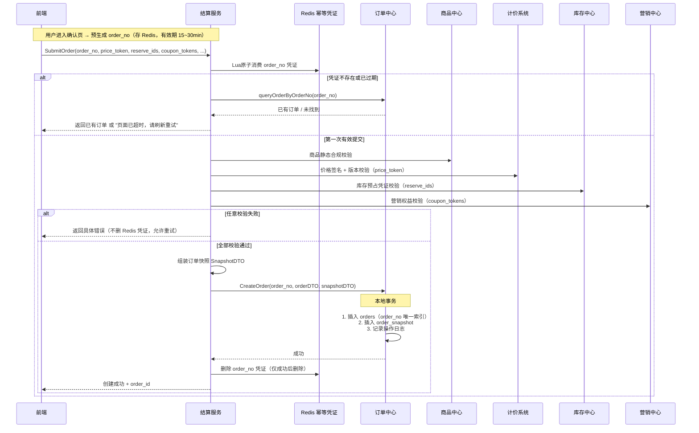
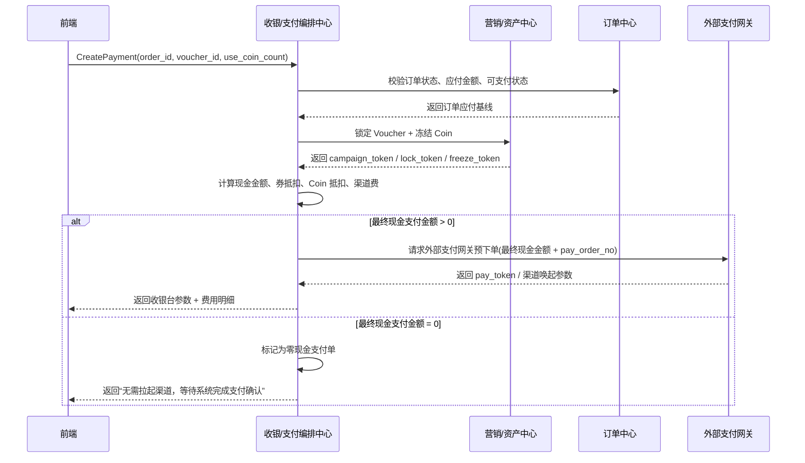
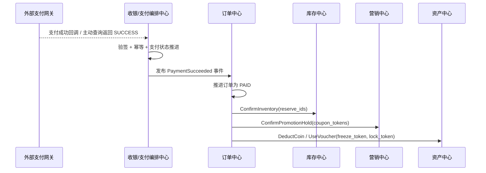
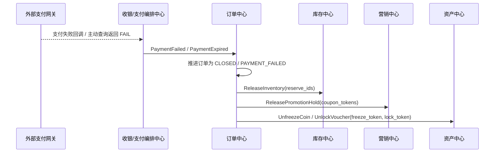
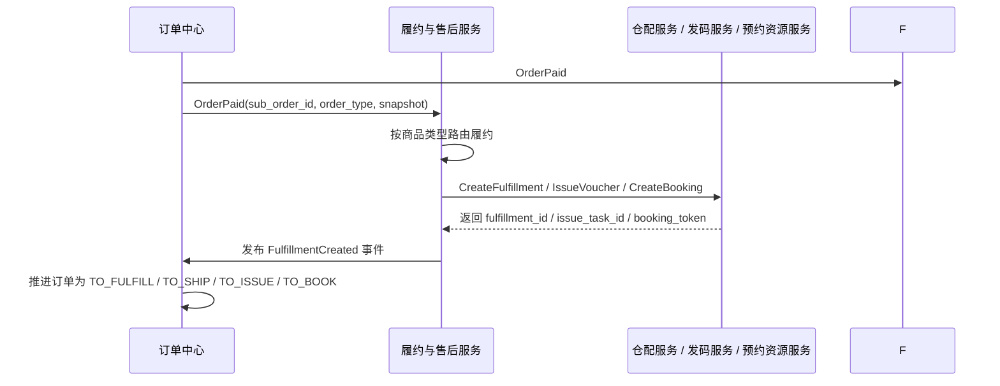
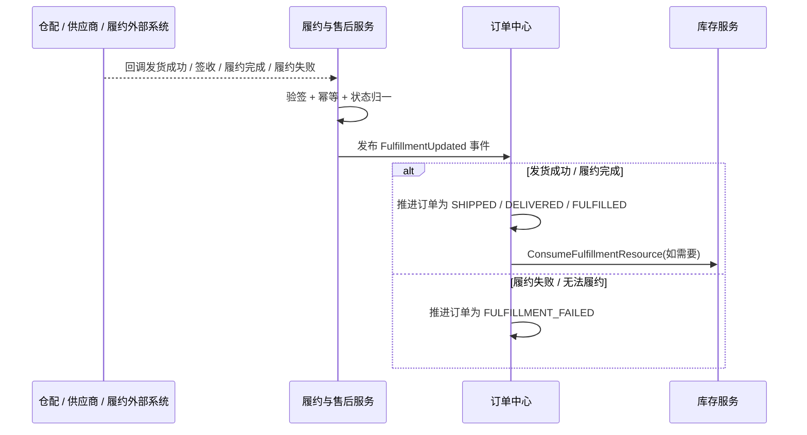
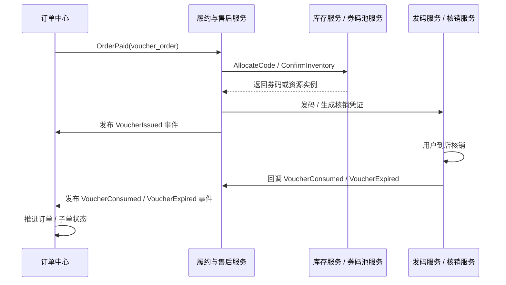
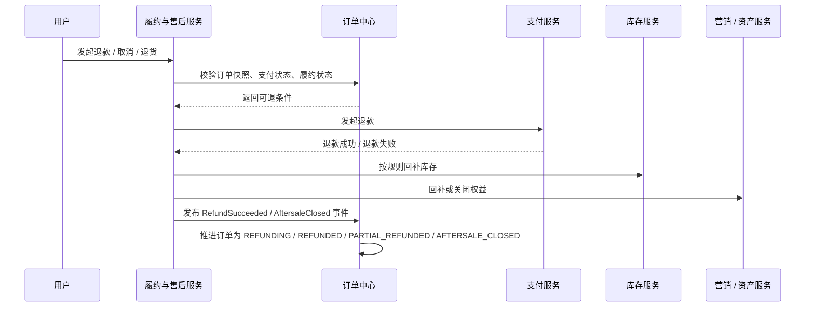

# 第 15 章 电商订单与履约全生命周期：创单、支付、履约与售后

> **本章定位**：本章承接第 14 章形成的结算凭证，从创单开始建立订单事实，继续讲解支付确认、履约推进、售后退款和长期治理。订单、支付与履约各自拥有明确的状态主权，并通过可重试、可对账的事实事件协作。

建议先阅读[第 14 章《电商商品发现与交易准备》](14-ecommerce-customer-lifecycle.md)，了解搜索、购物车和结算如何形成交易输入；本章重点回答这些输入怎样转化为可恢复、可审计的订单与资金事实。

配合阅读：[第 11 章 商品中心、商品供给与生命周期治理](11-product-center-supply-lifecycle.md)、[第 12 章 库存系统](12-inventory-system.md)、[第 13 章 营销与计价系统](13-marketing-pricing-system.md)。

---
## 15.1 创单、订单数据模型与订单状态机

### 15.1.1 场景画像

用户点击“提交订单”后，订单中心依据结算凭证落地商品、价格和履约快照，再由支付结果推进状态；失败、超时或风控拒绝必须释放库存与权益。


### 15.1.2 关键技术点

创单阶段的关键追问集中在幂等、凭证、快照、补偿和安全边界；下文用数据模型、状态机、时序和 ADR 分别展开，不在此重复问答表。


### 15.1.3 订单数据模型：主单、子单、订单项与快照

订单不是一个只有金额和状态的表，而是一组需要共同解释交易的事实集合。推荐按下面的关系拆分：

```text
Order（主单）
├── OrderSubOrder（销售主体 / 履约主体 / 店铺维度）
│   ├── OrderItem（sku、数量、成交金额、资源引用）
│   ├── ProductSnapshot（标题、规格、图片、规则摘要）
│   ├── PriceSnapshot（原价、成交价、优惠分摊、税费、运费）
│   └── FulfillmentSnapshot（地址、履约方式、预约或核销规则）
├── PaymentOrder（支付单、渠道、支付状态）
├── InventoryReservationRef（预占引用与释放状态）
├── AfterSaleCase（售后单及其范围）
└── OrderEvent / Outbox（事实事件与待投递消息）
```

主单适合表达用户一次提交的交易聚合，子单表达销售主体或履约主体的独立推进，订单项表达可售卖的最小业务单位。支付单不能简单等同于主单，因为一个主单可以合并支付多个子单，一个子单也可能拆成多次退款。售后单也不应覆盖订单原始字段，而应引用订单项和快照，记录“针对哪一项事实提出了什么后续请求”。

快照至少要满足三个条件：第一，字段足以支持客服、售后和争议解释；第二，快照有生成时间、来源版本和摘要校验；第三，快照在订单创建后不可被普通商品更新覆盖。并不是所有商品富文本都要塞进订单库，推荐保留标题、规格、销售主体、成交价格、优惠分摊、履约规则摘要和必要的图片 / 文案版本，长描述和展示素材可以通过不可变版本存储或归档引用获取。


### 15.1.4 订单状态机与不变量

订单状态机要先区分“用户可见主状态”和“内部协作状态”。例如库存预占失败、支付渠道处理中、物流回调重复等情况，未必都需要新增一个用户可见状态，但必须在内部事件和诊断字段中留下痕迹。

标准实物订单可以抽象为：

```text
CREATED -> PENDING_PAYMENT -> PAID -> FULFILLING -> SHIPPED
    |            |             |          |             |
    |            |             |          |             +--> DELIVERED
    |            |             |          +----------------> FULFILLMENT_FAILED
    |            |             +---------------------------> REFUNDING
    |            +------------------------------------------> CLOSED
    +-------------------------------------------------------> CANCELED
```

不同商品类型可以复用 `CREATED`、`PENDING_PAYMENT`、`PAID`、`REFUNDING` 等公共状态，再由履约子状态表达“待发码、已发码、已核销、已预约、已入住”等差异。状态迁移必须由事件和前置条件驱动，而不是由任意接口直接写字符串。建议为每条迁移记录：`from_state`、`event_id`、`event_type`、`actor`、`occurred_at`、`reason_code` 和 `to_state`。

至少要维护以下不变量：

1. 已支付金额不能超过订单应付金额，退款累计不能超过已支付金额。
2. 已确认的订单项数量不能大于提交时的数量，除非存在明确的拆单、换货或补发事实。
3. 订单进入 `PAID` 前不能产生“支付成功”的用户可见语义；收到重复支付通知只能返回幂等成功。
4. 订单进入 `CANCELED` 后不能再被普通支付成功事件推进为 `PAID`，异常情况必须转人工或进入纠错流程。
5. 售后完成必须引用支付、履约和退款事实，不能只凭售后申请记录关闭订单。
6. 主单状态由子单状态聚合得出时，聚合规则必须固定并可测试，不能依赖消息到达顺序。

这些不变量比“最终状态有哪些枚举值”更重要。事件乱序、重复和延迟是分布式系统的常态，Kafka 的交付语义文档也明确区分了至少一次、至多一次和恰好一次处理边界；业务状态机仍需要用事件 ID 和版本检查实现自己的幂等。[9] 因此，订单状态更新应使用 `order_id + version` 的乐观并发条件，更新失败时重新读取最新状态并判断事件是否已经生效。


### 15.1.5 创单本地事务与消息发布

提交订单的本地事务只做本域必须同时成立的事情：验证凭证归属、写入订单主单与子单、写入订单项和快照、创建支付单引用、生成初始状态事件或 Outbox 记录。它不应该在数据库事务中同步等待支付渠道、物流系统或所有回补动作。

事务边界可以表达为：

```text
BEGIN
  consume checkout token
  insert order / sub_order / item
  insert snapshots
  insert payment_order
  insert outbox(OrderCreated)
COMMIT

publisher -> payment / inventory / marketing / fulfillment
consumer  -> idempotent state transition
reconciler -> query status and compensate
```

Outbox 记录和订单事实必须在同一个本地事务提交，否则会出现“订单已经创建但没有事件”或“事件已发送但订单并不存在”的裂缝。[18] 发布器允许重复发送，因此事件消费者要以 `event_id` 或业务聚合版本去重；不能把“发布器没有收到确认”误判成“业务没有执行”。当发布器连续失败时，要有积压指标、重试退避、死信和人工重放入口。

MySQL InnoDB 的事务模型可以为本地订单事实提供行级锁和隔离保证，但数据库事务只覆盖同一个资源边界，不能自动把外部支付和库存纳入同一个可靠提交。[13] 本章选择短本地事务加异步恢复，主动放弃跨服务瞬时原子可见，缩短本地锁持有窗口并减少跨域同步等待；实际吞吐仍需压测。这个牺牲必须在 ADR 中明确，不能包装成“系统已经一致”。


### 15.1.6 主单、子单与合并支付

当一次提交包含多个店铺、仓库或履约类型时，主单只是用户视角的聚合，真正可独立履约的单位是子单。设计时要明确三组映射：

| 关系 | 例子 | 作用 |
| --- | --- | --- |
| 主单到子单 | 一个主单拆为多个店铺子单 | 展示一次提交与分别履约并存 |
| 子单到支付单 | 多个子单共用一个支付单 | 支持合并支付和统一收银台 |
| 订单项到资源 | 一个订单项对应预占、券码或预约资源 | 售后和补偿定位到最小范围 |

主单不能因为某个子单发货就直接显示“已完成”，也不能因为一个子单退款就把全部子单金额退回。可以定义聚合规则：全部子单支付完成才是主单支付完成；全部子单进入终态且没有待处理售后才是主单完成；部分退款以金额和订单项范围计算。聚合规则需要覆盖空集合、部分失败、部分取消和退款中的中间态。


### 15.1.7 创单时机、编排归属与提交流程

**订单应该在“提交订单”时创建，还是在“点击支付”时创建**

讨论创单时机时，先区分支付意图与正式订单。无论采用哪种方案，都应在请求渠道之前持久化可查询的交易意图、金额快照和幂等标识；“延后正式订单”不等于不记录用户已经发起的交易。还要区分支付授权与实际扣款：授权通常只是资金冻结，capture/扣款才形成实际资金变动，具体语义取决于支付渠道。

| 阶段 | 方案 A：提交订单时创建待支付单 | 方案 B：延后创建正式订单 |
| --- | --- | --- |
| 用户提交/点击支付 | 本地事务创建待支付订单、价格快照和支付意图 | 先持久化 TradeIntent、金额快照和稳定幂等键；暂不创建正式订单 |
| 库存资格 | 创建支付单前预占库存，记录过期时间与订单归属 | 在请求支付授权或扣款前取得有效库存预占/购买资格；若业务无法保证资源，必须明确告知结果可能退款 |
| 渠道调用 | 建立支付尝试后请求授权或扣款 | 优先使用“先授权、后 capture”：授权后提交正式订单，再 capture；若渠道只支持即时扣款，则扣款前仍须持有有效库存资格 |
| 权威事实 | 支付渠道成功结果经回调、主动查询或对账核验后记为支付事实；订单记录早已存在 | TradeIntent 是请求已受理的本地事实；渠道确认的授权/扣款是资金事实；正式订单须在本地提交后才算订单事实 |
| 失败收敛 | 待支付超时后条件取消并幂等释放预占；未知支付结果先查单，不按超时直接关单 | 授权后订单提交失败时撤销授权；即时扣款后订单暂不可写时保留 `PAYMENT_SUCCEEDED_ORDER_PENDING` 并重试落单；库存或业务资格最终不成立时按渠道能力幂等退款/冲正，并通知用户，未知结果先查单，不能直接发起新扣款 |

方案 B 的关键是把“减少正式订单写入”与“先扣款再争库存”分开。只要先扣款、后竞争库存，就可能产生已扣款但无资源的结果；后续退款可以收敛资金，却会增加用户等待、渠道费用和客服处置成本。即使 TradeIntent 已持久化，也不能把它当成正式订单或库存承诺。

| 决策约束 | 方案 A 更合适的条件 | 方案 B 可评估的条件 |
| --- | --- | --- |
| 资源承诺 | 需要进入收银台前确定订单、价格和库存 | 有独立的短时资格/库存令牌，或商品本身不受稀缺库存限制 |
| 支付渠道 | 普通支付即可，支付成功后更新已有订单 | 支持授权与 capture/撤销，或即时扣款后的退款流程和对账能力成熟 |
| 高峰治理 | 可用限流、排队、分段库存和异步下游降低压力 | 已测量正式订单写入确为瓶颈，且 TradeIntent、幂等、查单、退款和客服链路具备容量 |
| 用户与资金风险 | 需要稳定的待支付订单、催付和继续支付体验 | 可以接受短暂“支付确认中”，并能对退款时限和用户告知负责 |

本章主线采用 **方案 A：提交订单时创建待支付单**：购物车 -> 结算 -> 提交订单 -> 支付 -> 履约。订单先承接商品、价格和履约快照；支付结果只推进既有订单状态。方案 B 只有在测量证明正式订单写入构成瓶颈，且库存资格、渠道授权/扣款、未知结果查单、退款与人工治理都已设计并演练时才值得采用。秒杀或高并发本身不足以构成采用方案 B 的理由。

**订单提交流程应该由独立聚合服务编排，还是由订单中心自己协调下游**


这也是交易架构里非常经典的一个分歧点，通常存在两种方案：

- **方案 A：单独起一个结算 / 交易聚合服务**
  - 由结算服务或 Trade-CO 统一去协调商品、库存、计价、营销，再把最终结果交给订单中心落单。
- **方案 B：前端直接调用订单中心，由订单中心自己协调下游**
  - 订单中心既管订单写库，又去调用商品、库存、计价、营销这些服务完成前置校验与编排。

这两种方案的本质区别是：**交易主流程编排逻辑，是放在订单领域之外的场景聚合层，还是直接压进订单中心内部。**

| 方案 | 优点 | 风险 | 适用场景 |
| --- | --- | --- | --- |
| 独立聚合服务 | 订单中心更纯净；读写压力与场景编排隔离；更适合复杂结算页和多业务协同 | 多一跳 RPC；多一个服务需要治理 | 中大型电商、业务复杂、团队分工清晰、存在独立预结算页 |
| 订单中心自己协调 | 链路短；服务更少；前期开发快 | 订单中心容易膨胀成万能大管家；读写混合；迭代风险高 | 小团队、早期系统、短期快速上线 |

从工程演进角度看，很多系统早期会采用“订单中心自己协调”的方式快速上线，但随着以下问题出现，通常都会向独立聚合服务演进：

- 结算页逻辑越来越复杂
- 商品、计价、库存、营销团队开始独立演进
- 订单中心既要承接创单写流量，又要承接大量预览与预结算读流量
- 大促时希望把“重编排逻辑”和“订单写库主链路”物理隔离

本章默认采用的是 **方案 A：独立结算聚合服务编排，下游原子服务各自归位**。原因是：

- 结算页本身就天然是一个跨商品、库存、计价、营销、地址的聚合场景；
- 订单中心更适合回归为“交易事实持久化 + 状态机推进”的原子领域服务；
- 支付、履约、售后后续也都更容易围绕清晰的订单事实展开。

因此这里的推荐结论是：

> **当系统存在独立的确认订单页 / 预结算页，且交易链路已经明显跨多个领域服务时，优先采用“结算聚合服务编排，下游原子服务落地”的架构；只有在系统非常轻量时，才让订单中心临时兼做协调者。**

### 15.1.8 创单幂等、防重与超时反查

客户端看到“提交超时”时，服务端可能已经完成创单。正确处理不是立即再写一笔订单，而是按幂等键、业务订单号或结算凭证反查：

1. 按 `idempotency_key` 查询提交记录。
2. 查不到时按 `checkout_id` 和用户身份查询订单。
3. 查到待支付订单，返回原订单并允许继续支付。
4. 查到已支付订单，返回支付状态而不是重新创单。
5. 仍查不到且凭证已过期，提示刷新结算，不继续消费旧资源。

对外接口应使用明确的 HTTP 语义和问题详情，区分参数错误、凭证过期、资源不足、处理中和服务暂不可用；RFC 9110 定义了 HTTP 语义，RFC 9457 则提供了机器可读的错误详情表达方式。[16][17] 本章建议错误响应至少包含 `type`、`code`、`title`、`detail`、`retryable`、`request_id` 和可选的 `next_action`，使前端能选择“重试、刷新、换货或联系人工”，而不是把所有错误显示成“系统繁忙”。

**创单接口的幂等性应该怎么设计**


创单接口的幂等性，不能只理解成“用户重复点按钮怎么办”。它真正要解决的是：

- 同一个下单意图因为网络抖动、页面重试、MQ 重放或用户多次点击而重复到达时；
- 系统最多只能创建一笔订单；
- 如果第一次其实已经成功了，后续重试还应该尽量返回第一次成功的结果，而不是简单报错。

这类设计在工程上通常不是靠单点手段，而是靠一套**分层防御模型**完成：

- **第一层：前端轻量防抖**
  - 用户点击“提交订单”后，按钮立刻置灰
  - 页面进入 loading 状态，减少肉眼可见的重复点击
- **第二层：结算服务前置防重**
  - 用户进入确认订单页时，后端生成一个全局唯一的 `submit_token`
  - 提交订单时，前端必须把这个 `submit_token` 原样透传回来
  - 结算服务先在 Redis 上做一次幂等拦截，例如：
  - `SET submit_lock:{submit_token} 1 NX EX 30`
  - 如果没有拿到锁，说明相同提交意图正在处理中，或者已经处理过
- **第三层：订单中心存储级最终兜底**
  - Redis 分布式锁并不是绝对强一致的
  - 极端情况下，主从切换、锁过期或网络抖动仍然可能让重复请求穿透
  - 所以订单中心在落库时，仍然必须对 `submit_token` 做唯一约束
  - 即使两个请求同时穿透了 Redis，MySQL 也只能允许一笔订单真正写成功
- **第四层：结果幂等与顺水推舟**
  - 如果第一次创单已经成功，但响应前端时网络丢包
  - 第二次相同请求进来，不应该只返回“重复提交”
  - 更好的做法是缓存 `submit_token -> {status, order_id}`
  - 后续重试命中后，直接返回第一次成功的 `order_id`，把用户平滑带到收银台

这几层的职责并不相同：

| 防线 | 核心目标 | 典型实现 |
| --- | --- | --- |
| 前端防抖 | 减少普通重复点击 | 按钮置灰、loading、防重复提交 |
| Redis 防重 | 前置消峰，保护下游资源 | `submit_token` + 分布式锁 / SETNX |
| DB 唯一约束 | 存储层最终绝对幂等 | 订单表或防重表上的唯一索引 |
| 结果缓存 | 平滑处理“成功但回包丢失” | `submit_token -> order_id` 结果映射 |

面试里经常会被继续追问两个极端场景。

**场景一：业务还没执行完，Redis 锁先过期怎么办？**

如果创单链路比较长，固定的 `EX 30` 很容易在高峰期被打穿。更稳妥的工程实现通常是：

- 使用具备看门狗续期能力的分布式锁实现；
- 业务未结束时自动续期；
- 业务结束后显式解锁。

这样可以避免“创单事务还没跑完，锁却先失效”的幂等击穿问题。

**场景二：Redis 锁挡住了大部分流量，但极端情况下仍然漏了怎么办？**

这里真正的底线是：

> **Redis 负责前置消峰，MySQL 唯一键负责最终闭环。**

也就是说，Redis 锁不是为了替代数据库唯一约束，而是为了减少无意义的重复流量冲击商品、库存、营销和订单中心。

因此这里更稳妥的结论是：

> **创单幂等要做成“前端防抖 + 结算服务 submit_token 防重 + 订单中心唯一索引兜底 + 结果缓存顺水推舟”的四层模型。Redis 负责前置消峰，数据库负责最终绝对幂等。**

**预生成的订单号能不能直接作为创单幂等 token**


在创单幂等设计里，还有一个非常实用的工程化问题：

- 结算页是不是一定要单独发一个随机 `submit_token`；
- 还是说，**预生成的订单号本身就可以兼做创单幂等键**。

答案是：**可以，而且在很多系统里这是更推荐的做法。**

这里的关键不是“先写一条待支付订单”，而是：

- 用户进入确认订单页时，系统先生成一个全局唯一的 `order_no`；
- 这个 `order_no` 先不落订单主表；
- 而是先作为一次性的创单提交凭证，写入 Redis，设置合理的过期时间；
- 真正提交订单时，前端带着这个 `order_no` 回来，由后端原子消费它，再执行正式创单。

这意味着，一个预生成订单号同时承担了两层身份：

- **业务主键**：后续支付、履约、售后都围绕这个订单号推进；
- **提交幂等键**：用于防止同一个结算确认页被重复提交多次。

与“纯随机 token”相比，它的优势很明显：

- 不需要再维护一套独立 token 体系；
- 幂等键和订单主键天然合一，链路更清晰；
- 如果提交时 Redis token 已经过期，后端可以直接按 `order_no` 去订单库反查是否已经成功创单；
- 即使前端回包丢失，用户重试时也更容易平滑返回已有订单。

但要想把这个方案用稳，必须满足几个前提：

| 设计点 | 要求 |
| --- | --- |
| 订单号生成时机 | 必须在确认订单页阶段就预生成，而不是创单事务最后才生成 |
| Redis 侧 | `order_no` 要作为一次性可消费凭证写入缓存，并设置 TTL |
| MySQL 侧 | 订单表必须对 `order_no` 做唯一索引，承担最终兜底 |
| 提交失败处理 | Redis token 失效后，不能直接报错，要先按 `order_no` 反查订单是否已存在 |

本案例采用以下提交流程：

1. 用户进入确认订单页；
2. 结算服务预生成 `order_no`；
3. Redis 写入 `order:submit:{order_no}`，TTL 例如 15~30 分钟；
4. 前端提交订单时，原样带回这个 `order_no`；
5. 后端先原子消费 Redis 中的提交凭证；
6. 再进入正式创单事务；
7. 订单表以 `order_no unique` 最终兜底。

这里尤其要注意一个容易答错的点：

> **token 过期，不等于订单一定创建失败。**

所以当 Redis 里发现 `order_no` 已不存在时，更合理的后端处理顺序是：

- 先按 `order_no` 去订单库查；
- 如果已经有订单，直接返回这笔已有订单；
- 如果没有订单，再提示用户“页面已超时，请刷新后重新提交”。

当然，这种方案也有边界：

- 不要直接暴露纯自增订单号；
- 更适合使用 Snowflake、号段 + 随机扰动、带业务前缀的全局唯一号；
- 并且 Redis 只负责前置防重，**绝不能替代数据库唯一约束**。

因此这里更稳妥的结论是：

> **预生成订单号完全可以直接作为创单幂等 token。最佳实践是“预生成订单号 = 提交幂等键 = 订单业务主键”，再配合 Redis 一次性消费和数据库唯一索引，形成一前一后的双保险。**

**技术幂等和业务重复单提醒，为什么要分两层设计**


创单链路里还有一个很容易被忽略的点：

- **技术幂等**，解决的是“同一个请求重复到达，系统不要创建两笔订单”；
- **业务重复单提醒**，解决的是“同一个用户在很短时间内，可能无意中下了两笔高度相似的订单”。

这两者看起来都在处理“重复”，但其实完全不是一回事。

**技术幂等**的典型触发原因通常是：

- 用户重复点击提交；
- 网络抖动导致前端自动重试；
- 网关超时后客户端再次发起请求；
- 消息重发或服务重试。

它的目标非常纯粹：

> **同一个下单请求，多次到达，只能被系统真正处理一次。**

而**业务重复单提醒**更偏用户体验和业务治理，它处理的是：

- 用户已经成功下过一笔极其相似的订单；
- 但因为没注意页面状态、没看到待支付订单、或者切了支付方式，又重新下了一笔；
- 这两笔订单在技术上是两次不同请求，但在业务上很可能是用户误操作。

它的目标不是强拦截，而是：

> **在不破坏正常下单自由度的前提下，提示用户“你刚刚可能已经下过一笔类似订单了”。**

所以一个成熟的订单系统，通常要把这两层拆开设计：

| 层次 | 目标 | 典型手段 |
| --- | --- | --- |
| 技术幂等 | 防止同一请求被重复处理 | `submit_token/order_no`、Redis 一次性消费、数据库唯一索引 |
| 业务重复单提醒 | 防止用户短时间内误下两笔相似订单 | 按用户、商品、地址、金额、时间窗口做相似订单检测，并给出二次确认提示 |

业务重复单提醒一般不会像技术幂等那样做成强约束唯一键，而是更偏“软校验”。例如：

- 同一用户；
- 在最近 1~5 分钟；
- 针对相同商品 / SKU / 房型 / 行程；
- 收货地址、数量、金额高度一致；
- 且前一笔订单还处于待支付或刚支付状态。

这时系统更合理的动作通常是：

- 弹出提醒：
  - “你刚刚已经提交过一笔相似订单，是否继续下单？”
- 给用户两个选择：
  - 去查看已有订单；
  - 继续提交当前订单。

这样做的原因是：

- 有些重复单确实是误操作；
- 但也有些重复单是用户有意为之，例如：
  - 给不同人各买一份相同商品；
  - 同一酒店房型连续下两间；
  - 同一活动商品分开下单。

如果把业务重复单也像技术幂等一样硬挡掉，反而会伤害真实交易。

因此更稳妥的结论是：

> **技术幂等和业务重复单提醒必须分层设计：技术幂等前置，负责防止同一请求被系统处理两次；业务重复单提醒后置，负责识别“相似订单”并给用户二次确认。技术幂等优先，业务提醒辅助。**

### 15.1.9 创单失败后的资源补偿

**创单失败后，库存预占和权益占用怎么做最终一致性补偿**


这也是结算编排里非常关键的一道资损防线。

在标准的提单链路里，前面往往已经发生了这些动作：

- 价格快照已经生成
- 库存已经预占，拿到了 `reserve_ids`
- 营销权益已经占用，拿到了 `coupon_tokens`

这时如果最后一步：

- `结算服务 -> 订单中心 CreateOrder`

在写库时因为数据库超时、网络断开、主从抖动等原因失败，系统就会落入一个非常危险的中间态：

- 前端看到的是“创单失败”
- 但库存和权益其实已经被前置链路冻结住了

如果不处理，就会出现：

- 僵尸库存预占
- 优惠券被卡死
- 用户无法再次下单
- 商家可售资源被无故锁住

本案例的外部支付不能加入 XA，且创单、支付与资源释放跨越不同时间窗口，因此不选择跨全链路的 XA 提交。Seata 支持不同事务模式，不能把整个框架等同于 XA；具体选择取决于参与方协议、资源预留能力和恢复成本。本章采用的做法是：

- **主链路快速失败**
- **异步补偿兜底**
- **延迟反查再兜底**

推荐的补偿模型一般有两层：

**第一层：消息补偿**

当结算服务或订单中心感知到创单明确失败时，发布一条 `OrderCreateFailedEvent`：

- 库存中心订阅后释放 `reserve_ids`
- 营销中心订阅后释放 `coupon_tokens`

这样可以把大部分“明确失败”的场景快速回滚掉，而不需要让前台请求同步等待所有补偿完成。

**第二层：下游主动反查 + 延迟释放**

为了防止消息丢失、网络抖动或“创单结果未知”这种灰色状态，库存中心和营销中心本身还应该有一层延迟自愈：

- 在预占 / 占用成功时，挂一条延迟检查任务
- 到达超时时间后，主动去订单中心反查：
  - 这个 `reserve_ids` / `coupon_tokens` 对应的订单到底创建成功了吗
- 如果订单不存在，或者订单已经被关闭 / 取消，就自动释放资源

这意味着：

- 结算服务负责主流程编排
- 订单中心负责创单真相
- 库存和营销中心各自对自己的冻结资源负责自我救赎

因此这里更稳妥的结论是：

> **创单失败后的最终一致性，不能依赖运行时强事务，而要依赖“失败事件补偿 + 延迟反查释放”的双层自愈机制。**

### 15.1.10 下单价格与订单快照校验

**价格防篡改应该重新计算一遍，还是依赖价格签名 / 版本核销**


创单链路里还有一个非常关键的安全问题：**前端提交的价格到底能不能信**。

如果黑客通过抓包改包，把前端传给 `SubmitOrder` 的金额从 5999 改成 0.01，而后端又没有做价格防篡改校验，就会直接造成巨大资损。

本例比较两种防护方案：

- **方案 A：无状态签名校验**
  - 预结算时由计价系统生成一个 `price_token`
  - 它通常由 `item_id + user_id + price + timestamp + secret` 等因子签名得到
  - 创单时前端把价格和 `price_token` 一起透传回来
  - 结算服务或计价服务重新验签，确认价格未被改包
- **方案 B：有状态版本核销**
  - 预结算时由计价系统生成一个 `price_version_id`
  - 并把对应价格结果写到 Redis 或计价缓存中
  - 创单时前端只透传版本号
  - 后端按版本号回查真实价格，再以缓存中的真相落单

这两种方案的本质区别是：

- 方案 A 更像“**数学签名防篡改**”
- 方案 B 更像“**后端状态核销防篡改**”

| 方案 | 优点 | 风险 | 适用场景 |
| --- | --- | --- | --- |
| 无状态签名校验 | 不需要高频读 Redis；延迟低；更适合高并发 | 如果只做简单签名，天然不防重放；仍需额外处理超时窗口和 nonce | 高并发场景、性能优先场景 |
| 有状态版本核销 | 安全边界清晰；天然适合做一次性核销；方便过期控制 | 对 Redis / 状态存储依赖更强；预结算和创单时会增加缓存 IO 压力 | 安全要求高、流程较长、可接受缓存成本的场景 |

在价格结果能够固化为有期限凭证的本案例中，默认采用：

- 以 **无状态签名** 作为主防线，防止前端改价
- 再加上 **时间窗口 + nonce 防重放**
- 如有必要，再用轻量 Redis 记录短期 nonce 或一次性 token

这样既能保持高并发下的低延迟，又能防止用户把一个合法的价格签名反复提交多次。

因此这里更稳妥的结论是：

> **高并发电商链路里，优先采用“价格签名校验 + 时间窗口 / nonce 防重放”的轻量方案；只有在业务对一次性核销、价格版本冻结要求特别强时，再演进到有状态版本核销。**

**订单快照应该由谁构建：商品中心、订单中心，还是结算服务**


订单快照的职责划分也是一个非常容易设计错的点。这里真正的问题不是“谁能拿到商品标题”，而是：

- 谁手里拥有最完整的下单上下文；
- 谁最适合在创单前把商品、价格、履约三类事实揉成一份订单解释材料；
- 谁应该只负责持久化，而不要再次退化成交易大管家。

这类职责一般会出现三种候选方案：

- **方案 A：由商品中心构建快照**
  - 看起来商品中心最懂商品，但它只拥有“当前商品真相”
  - 它并不知道这次交易用了什么券、最终成交价是多少、履约承诺是什么
  - 如果让商品中心在提单时参与组装订单快照，会把交易上下文反向污染到商品域
- **方案 B：由订单中心构建快照**
  - 订单中心在收到创单请求时，理论上可以再去查商品、计价、营销、履约
  - 但这会让订单中心重新变成“大管家”
  - 创单链路的耗时、依赖数和失败面都会急剧上升
- **方案 C：由结算服务构建快照，订单中心只负责落库**
  - 结算服务在提交订单前，本来就已经拿到了：
  - 商品静态信息
  - 价格明细和优惠分摊结果
  - 履约承诺与交付上下文
  - 它是最适合在内存里把这些信息揉成 `SnapshotDTO` 的那一层
  - 订单中心收到后，只需要把订单事实和快照 JSON 一起持久化

三种方案的关键差异如下：

| 方案 | 优点 | 风险 | 推荐度 |
| --- | --- | --- | --- |
| 商品中心构建 | 商品标题、主图、类目天然可得 | 职责越界；不拥有价格与履约上下文；容易把交易逻辑污染回商品域 | 不推荐 |
| 订单中心构建 | 创单和落库在一个服务里闭环 | 订单中心重新退化成大管家；创单链路变重；依赖面暴涨 | 谨慎使用 |
| 结算服务构建 | 最接近完整交易上下文；适合在创单前聚合和揉快照 | 需要明确快照字段边界，避免把无意义大字段塞进快照 | 推荐 |

因此这里更稳妥的结论是：

> **订单快照应由结算服务在提交订单前完成组装，订单中心只负责把订单事实与快照结果持久化；商品中心提供静态契约，但不直接参与快照构建。**

进一步说，快照也不能无限膨胀。真正应该进入订单快照的，通常是：

- 商品 ID、SKU ID、标题、下单时主图 URL、规格属性；
- 成交单价、原价、优惠分摊、券抵扣、运费、税费；
- 履约类型、承诺送达时间、退改规则摘要。

而像商品详情图文、长文本介绍、视频等大字段，不应该进入订单快照。订单列表查询也不应该把大 JSON 混在主表里，而应该通过独立的 `order_snapshot` 之类的附表按需读取。

**订单中心负责交易事实编排，商品中心负责交易前静态契约**


商品中心负责“商品身份与价格合规”的静态校验，订单中心负责“交易行为与流水合规”的最终编排。

**订单必须保存商品快照、价格快照和履约快照**


订单必须保存商品快照、价格快照和履约快照，而不是回读最新商品。

### 15.1.11 订单数据模型演进与主权边界

**订单模型的演进：从支付单 + 订单，到主单 / 子单 / 商品维度退款**


订单模型的演进，本质上是在回答一个问题：系统到底要先解决“支付聚合”，还是先解决“履约拆分、售后拆分和商品维度退款”。

在业务早期，很多系统只有三张核心表：

- `pay_order_tab`
- `order_tab`
- `refund_tab`

这套模型足以支撑最基础的交易闭环：

- 一个支付单对应一个或多个订单
- 一个订单下挂多个订单明细
- 退款主要按整单维度处理

它的优点是简单、上线快、链路短。但当业务开始出现下面这些诉求时，模型就会越来越吃力：

- 一个支付单下挂多个业务订单，需要合并支付
- 一个用户视角上的“大订单”需要按商家、仓库、履约方式拆成多个子单
- 售后不再只是整单退款，而是按某个商品、某个 `order_item` 退款
- 后续还可能出现部分发货、部分签收、部分退款、部分核销

这时候，更稳妥的演进方向是把“支付域聚合”和“订单域聚合”拆开：

- `pay_order_tab`：属于支付域，只解决一次支付要付多少钱、走哪个渠道、支付状态是什么
- `parent_order`：属于订单域，解决用户视角和业务聚合问题
- `order_tab`：承载子单，解决分商家、分仓、分履约、分售后的独立处理
- `order_item_tab`：承载商品维度事实，给商品维度退款、部分售后、部分履约提供锚点
- `refund_tab`：从“只关联合同/整单”演进到既可关联订单，也可关联 `order_item_id`

可以用一句话概括这种演进模型：

> 主单解决“支付和用户视角的统一”问题，子单解决“履约、结算、售后等多维度独立处理”问题。

一个比较务实的演进顺序通常是三步走：

1. 先保留现有 `pay_order_tab + order_tab + refund_tab`，快速支撑基础交易。
2. 在订单域引入 `parent_order`，或者至少先在 `order_tab` 上补 `parent_order_id`，开始支持合并支付和业务聚合。
3. 在 `refund_tab` 上增加 `order_item_id`，让退款能力从整单退款演进到商品维度退款。

这里有一个很重要的边界要守住：

- `pay_order_tab` 不应该替代 `parent_order`
- 支付单是支付域对象，关注资金流
- 主单是订单域对象，关注用户视角、履约拆分和售后聚合

也就是说，支付单可以聚合多笔业务订单，但它不应该承接“用户看到的是一单还是多单”“履约怎么拆”“退款按哪个粒度处理”这类订单域问题。

如果系统还处在简单阶段，完全没必要一开始就把主单、子单、订单项、退款项全部做满；但设计时要预留一条清晰演进路径：

- 简单模式先跑通支付和整单退款
- 复杂模式再逐步引入主单、子单和商品维度退款

这样既能避免过度设计，也不会在后期被早期模型彻底卡死。

### 15.1.12 场景一：提交订单时序图




### 15.1.13 特殊场景：预售订单

预售订单的本质，不是“普通订单加一个活动标签”，而是**延迟履约 + 分阶段支付 + 长周期资源占用**。它和现货单最大的区别在于：交易事实可以先成立，但资源最终确认和履约发生在更晚的时间点。


**业务生命周期**


一个典型的预售订单，通常会经历下面几个阶段：

- 预热期：用户可以浏览和加购，但还不能正式下单
- 定金期：用户支付定金，锁定购买资格
- 尾款期：活动切换到尾款支付窗口，用户补齐尾款
- 履约期：尾款支付成功后，订单才进入正常发货 / 履约流程
- 异常终止：定金支付后尾款超时、用户主动取消、活动终止

因此，预售订单不是一次支付完成全部交易，而是把“购买承诺”和“最终成交”拆成了两个时间点。


**核心模型**


预售订单建议显式建模，而不是把逻辑散落在普通订单字段里拼凑：

- `order_type = PRESALE`
- `presale_end_time`：尾款支付截止时间
- `delivery_time`：预计发货时间
- `lock_deadline`：库存锁定截止时间

其中最关键的是“分阶段支付”模型。更推荐单独抽一层 `pay_stage` 或等价支付阶段表，而不是在 `pay_order_tab` 上硬塞一组定金 / 尾款字段。原因很简单：

- 每个阶段都可能有独立的支付流水 `trade_no`
- 退款时可能只退定金，或者只退尾款
- 财务对账更容易按阶段落账
- 后续即使出现三阶段支付，也不需要推翻原模型


**与其他服务的交互边界**


预售单会把多个中心的责任拉得更长，因此边界必须先钉死：

- 商品中心：提供预售商品快照，尤其是定金金额、尾款金额、预计发货时间、活动承诺文案
- 营销中心：提供预售活动规则，如定金比例、尾款优惠、限购数量
- 库存中心：在定金支付成功后做长时间预占；在尾款支付成功后再转成最终 Confirm
- 消息中心：在尾款截止前做多轮提醒，例如提前 24 小时、3 小时、30 分钟

这里的设计重点是：

> 结算服务在定金阶段解决“资格锁定”，订单中心在尾款支付完成后才把这笔交易推进到真正可履约状态。


**预售链路的关键挑战**


预售最大的风险，不在于普通创单，而在于它把资源和资金拉成了一个长周期博弈。

**挑战一：用户付了定金，但长时间不付尾款**

- 风险：库存被长时间占用，影响后续售卖
- 处理：库存中心使用长 TTL 预占；尾款超时后由订单中心通过 Outbox 异步 Cancel；必要时按规则扣除部分定金作为违约成本

**挑战二：尾款支付窗口集中爆发**

- 风险：大量用户在最后几小时同时补尾款，触发支付、库存 Confirm、营销结算的洪峰
- 处理：尾款支付仍然走普通支付主链路的幂等、防重、Outbox、Confirm 编排，不因为它是“第二阶段支付”就绕开主流程

**挑战三：退款复杂度更高**

- 风险：预售退款不再是简单整单退款，而可能区分定金退款、尾款退款、履约前退款
- 处理：退款模型增加 `refund_stage = DEPOSIT / FINAL` 一类字段，显式标记退款属于哪个支付阶段


**推荐的落地原则**


预售场景最容易犯的错误，是把它当成“普通订单 + 两次付款”来实现。更稳妥的思路是：

- 把预售当成一种独立 `order_type`
- 把定金和尾款视为两个支付阶段
- 把库存看成“长预占 + 最终确认”的两段式资源状态
- 把尾款超时和活动终止视为标准 Saga Cancel 场景

一句话总结：

> 预售订单的核心，不是先收一笔钱，而是先锁定资格，再在更晚的时间点完成真正成交与履约。


### 15.1.14 特殊场景：0 元购订单

0 元购的本质，不是“没有支付所以更简单”，而是**营销驱动的超高风险低价订单**。它的目标通常是拉新、促活、带动搭售，但系统设计上反而要更谨慎，因为一旦风控、营销核销或库存确认做得不严，很容易直接形成资损。


**业务本质与核心模型**


0 元购订单建议也显式建模，而不是混在普通订单里只靠金额判断：

- `order_type = ZERO_YUAN`
- `real_pay_amount`：实际支付金额，很多场景为 `0`
- `marketing_discount_amount`：营销补贴金额，给财务和活动归因使用
- `campaign_token`：营销中心返回的强凭证，后续用于核销和反查
- `risk_score / risk_level`：风控打分结果

这里要特别强调一个设计边界：

> 0 元购不是“没有成本”，只是用户不付钱，平台通过营销补贴替用户付款。

因此，订单里必须保留补贴金额和活动凭证，否则后续对账、活动归因、反作弊和财务核销都会变得很被动。


**是否一定要走支付网关**


0 元购最常见的设计争议，是要不要经过支付网关。

推荐结论是：

- 如果用户仍需支付运费或其他附加费用，就必须走正常支付链路
- 如果商品、运费、附加费用全部为 `0`，可以跳过第三方支付网关

但即使跳过真实支付，也建议保留一笔 `pay_order_tab` 记录，原因包括：

- 用户订单列表和交易流水仍需要一条完整支付事实
- 财务和活动分析需要知道这笔单是“0 元成交”，不是“没有支付过程”
- 后续退款、活动冲正、对账也更容易统一模型

也就是说，0 元购可以**跳过外部支付渠道**，但不应该跳过系统内部的支付事实建模。


**库存、营销和风控的处理原则**


0 元购最容易犯的错误，是把它当成“福利单”，然后在库存和营销链路上放松规则。更稳妥的做法是：

- 库存仍然走正常的 `Reserve -> Confirm / Cancel`
- 营销权益建议在订单创建成功后异步核销，而不是在主请求里同步硬卡死
- 风控必须前置，并且允许在订单创建后继续异步二次审查

为什么营销核销更推荐异步？

- 同步核销会把营销中心稳定性直接传染给下单主链路
- 0 元购经常是活动洪峰场景，营销系统更容易成为热点瓶颈
- 订单事实先落下，再通过 Outbox 异步核销，更符合本章的最终一致性设计


**风控是 0 元购的第一优先级**


0 元购的最大风险，不是支付失败，而是被羊毛党刷穿。推荐采用三层风控：

**事前风控**

- 用户画像
- 设备指纹
- 历史 0 元购记录
- IP / 设备 / 账号限频

**事中风控**

- 营销中心限购规则
- 实时风险打分
- 对高风险请求直接拒绝创单

**事后风控**

- 订单创建成功后做异步复审
- 对异常订单做人工审核、活动回收或后续履约拦截

典型规则包括：

- 单用户 / 单设备每日限购 N 单
- 新用户 + 老设备组合高风险
- 短时间内同一商品出现大量 0 元单，直接熔断活动入口


**0 元购的共性架构要求**


虽然预售和 0 元购看起来很不一样，但它们都在提醒我们一件事：

> 不要把所有业务特性都塞进一个大状态机，而要通过 `order_type + 扩展字段 + 异步编排` 来承接复杂场景。

因此，这类特殊订单更适合统一遵守下面几条原则：

- 基础交易状态仍保持简单：`PENDING -> PAID -> FULFILLING -> COMPLETED`
- 业务差异通过 `order_type` 和专属扩展字段表达
- 营销核销、库存确认、风控补偿通过 Outbox 交接已提交意图，再依靠幂等状态机、查询、有限重试和对账推进终态；Outbox 本身不保证每项动作最终成功
- 关键峰值场景仍要靠 Redis + 幂等 + 唯一索引兜底

一句话总结：

> 0 元购不是“省掉支付就结束了”，而是把支付简化成了营销补贴问题，同时把风控和最终一致性的要求提高到了更高优先级。


### 15.1.15 结算服务中的“预占凭证 + 本地事务 + 异步确认”Saga 编排

在本章默认的“支付前可预占、支付后确认、失败可释放”交易场景中，结算服务不是自己执行所有最终扣减，而是把交易链路组织成：

- **创单前只做预占（Reserve）**
- **创单成功后保存订单事实**
- **支付成功后再做确认（Confirm）**
- **创单失败、支付失败、超时取消后再做取消（Cancel）**

本例将这些步骤组织为持久化的 **Saga 编排**。它的核心思想是：

> **库存和有限权益提供可查询的预占、确认与释放能力；结算服务组织预占并校验报价凭证；订单中心保存交易事实与后续动作意图，由持久化编排通过 Outbox 交接确认或取消。支付渠道不被假定为可参与同一资源预占协议。**

这样设计的原因很直接：

- 结算服务面对的是商品、库存、营销、价格等多个下游域；
- 如果在提交订单时就要求所有域同步做最终扣减，主链路会非常重；
- 订单落库失败时，需要明确查询与释放已占资源的跨域恢复责任；
- 在这些资源确实可预留的前提下，先建立可查询、可确认、可释放的资源凭证，可以把临时占用与最终消耗分开。

这个模式通常会落成三段：

| 阶段 | 动作 | 目标 |
| --- | --- | --- |
| 创单前 | `Reserve` | 预占库存、预占权益、冻结报价结果，拿到 `reserve_ids / coupon_tokens / price_token` |
| 支付成功后 | `Confirm` | 正式确认库存消耗、权益消耗，把预占资源转成成交事实 |
| 失败或取消后 | `Cancel` | 释放库存、释放权益、失效价格凭证，避免僵尸资源 |

因此，结算服务在创单阶段的职责不是：

- 直接扣库存；
- 直接核销券；
- 直接把营销权益变成最终消耗。

而是：

- 收集并校验这些预占凭证是否有效；
- 把它们和订单事实绑定在一起；
- 在订单创建成功后，把后续确认责任交给订单中心；
- 通过本地消息表 / Outbox，把“确认”或“取消”动作异步可靠地下发给库存中心和营销中心。

一个更贴近落地的职责分工可以概括为：

| 系统 | 在 Saga 中的职责 |
| --- | --- |
| 结算服务 | 组织预占、校验凭证、提交创单请求 |
| 订单中心 | 落交易事实，成为后续确认 / 取消的协调点 |
| 库存中心 | 提供 `Reserve / Confirm / Cancel` 三段式库存能力 |
| 营销中心 | 提供权益占用、权益确认、权益释放三段式能力 |
| 支付中心 | 提供支付事实，不直接操作库存和营销资源 |

这里尤其要强调一个经常被问到的点：

> **为什么创单时只做预占，支付成功后再 Confirm？**

因为创单阶段的核心目标是：

- 快速、安全地把用户带到收银台；
- 让订单中心先拿到一笔清晰、可解释的交易事实；
- 把真正不可逆的资源消耗动作，推迟到“支付成功”这个更强的业务事实之后。

所以本案例的选择是：

> **预占资源的持久化编排式 Saga + 订单本地事务 + Outbox。**

也就是说：

- **创单时做资源预占**
- **支付成功后 Confirm 库存和权益**
- **创单失败、支付失败或超时后 Cancel 资源**
- **通过 Outbox 可靠交接本地已提交事实，后续状态由幂等、查询、补偿与对账收敛**

它的优势在于：

- 不要求所有资源加入一次跨整个支付生命周期的 XA 提交；
- 下游域边界清楚，各自只负责自己的资源预占、确认和释放；
- 网络抖动或部分失败时有可查询的恢复入口，但补偿也可能失败，需要冻结或人工接管。


**按参与方能力比较，而不是按方案名称排名**

第 4 章定义提交协议、流程编排、资源预留和可靠事件的不同边界。本节只比较它们在本案例中的作用，详细机制见[第 4 章资源预留模型](../part01/04-large-transaction-orchestration.md#tcc-resource-model)；完整决策保留在 [15.6.2 ADR-01](#transaction-create-adr)。

| 路线 | 参与方前提 | 保证范围与隔离手段 | 失败恢复和主要成本 | 本案例的判断 |
| --- | --- | --- | --- | --- |
| XA 资源上的 2PC | 纳入提交的资源支持协议；事务能在短窗口结束 | 协议范围内的统一提交决定；隔离级别另由资源管理器实现 | in-doubt 恢复、协调器与资源占用；不能仅凭协议名断言线性一致 | 外部支付不加入该协议，因此不覆盖整条生命周期；不排除独立短内部事务使用 |
| 编排式或协同式 Saga | 各步骤有本地事务、可查询结果、业务恢复路径 | 不自动提供跨域隔离；可结合预占、版本和语义锁保护竞争 | 持久化步骤、重试与补偿，处理不可逆动作与未知结果 | 使用编排式，便于集中解释订单状态与恢复责任 |
| TCC | 参与方能实现可靠 Try/Confirm/Cancel 及共同决策恢复 | 预留保护指定资源；不由三段式接口名自动获得全局原子可见 | 幂等、空回滚、悬挂和确认/取消恢复；资源占用及参与方改造 | 对需要共同确认决定的可预留资源另行评估，不限于金融场景 |
| Outbox | 业务事实与事件意图能在同一数据库事务写入 | 本地事实与待发事件原子提交；不决定下游是否成功 | Relay 重投、消费幂等、积压与清理 | 作为所选编排的事件基座，不与 Saga/TCC 当作互斥事务路线 |

Saga 的正向步骤可以是“预占”，不必先执行不可逆的真实消耗；TCC 的确认也不必被解释成一条永不重试的同步 RPC 链。Seata 的不同模式或工作流运行时是实现选择，不是额外一致性级别。[20][21][22] 本书把“预占 + 编排 + Outbox”作为本案例组合，不另造“工业级改良 Saga”标准。

**资源预占必须兑现哪些条件**

- Reserve 在权威库通过条件更新建立唯一预占，返回资源范围、数量、版本、有效期和幂等结果；缓存令牌不自动代替这个事实。
- Confirm 和 Cancel 使用同一预占身份及合法前置状态，终态只能被合法迁移推进；重复命令不产生第二次消耗或释放。
- 取消先于迟到 Reserve 到达时，应有取消凭证或等价版本门禁拒绝旧意图，防止资源重新悬挂。
- TTL 到期不等于渠道一定没扣款。支付结果未知时先查单并冻结后续危险动作，按业务协议续占或终止；资源已释放但随后查明成功时保留资金事实，按规则退款或人工处理，不抢回已承诺给他人的资源。
- Outbox 只证明本地意图已提交。确认迟迟无法完成时，要能查询、重试、隔离、对账和人工接管；成功、取消或有证据的人工处置都是恢复终态，不把消息最终送达当成业务一定成功。

**本案例的选择与重评**

在外部支付不能加入 XA、库存和有限权益可形成有效预占、业务允许后续状态异步收敛的前提下，选择持久化编排式 Saga。订单本地事务保存订单、快照和待执行意图；Worker 交接与反查，库存和营销各自提交 Confirm/Cancel。获得短本地事务与明确恢复边界，主动接受跨域可见性延迟、预占占用成本及长期补偿治理。

如果可预留资源不能兑现上述条件，先调整承诺时机或拒绝风险交易，不能因使用 Saga 名称就放行。若共同确认决定、补偿成本或等待跨度改变，再评估 TCC、局部 XA 或持久化工作流，依据资源协议和测量结果重做 ADR，不用“金融级”“最优”代替约束分析。

---


## 15.2 支付、交易编排与最终一致性

### 15.2.1 支付不是一个按钮，而是两条事实链

支付链路至少包含“发起支付”和“确认支付结果”两条不同的事实链：

1. 订单中心依据订单应付金额创建或获取支付单。
2. 收银台向用户展示支付方式并向渠道发起支付。
3. 渠道可能同步返回成功、失败或处理中。
4. 渠道还可能通过异步通知、查询接口或对账文件给出最终结果。
5. 支付中心归一化渠道结果，订单中心消费支付事实并推进订单状态。

同步返回只代表一次请求的即时结果，不能自动覆盖异步通知和对账事实。尤其是移动端、网页支付和银行转账场景，用户可能在客户端超时后已经完成扣款，或者渠道通知先于前端响应到达。支付中心应维护支付单状态、渠道流水号、金额、币种、渠道和通知版本；订单中心只消费标准化的 `PaymentSucceeded`、`PaymentFailed`、`PaymentPending`、`RefundSucceeded` 等事实事件。

对外支付接口要采用幂等键。AWS Builders’ Library 将幂等 API 视为安全重试的基础：客户端可以重试同一请求，而服务端不会因为网络丢包重复创建副作用。[7] Stripe 的接口文档也将幂等键与请求参数绑定，避免同一个键被意外用于不同的请求。[23] 在本章的交易模型中，支付幂等键至少应包含订单或支付单身份，不能只使用用户 ID 或任意随机请求 ID。


**支付域中的四类对象**


支付系统最容易出现的模型错误，是只设计一张“支付表”，让订单号、渠道号、退款号和分账信息都堆在同一行。支付过程至少包含四类对象，它们的生命周期和事实主权不同：

| 对象 | 作用 | 关键字段 | 生命周期 | 不能替代什么 |
| --- | --- | --- | --- | --- |
| 支付意图 | 表达订单希望完成的一次资金收口 | 订单、应付金额、币种、过期时间 | 从收银台创建到支付终态 | 不能直接证明渠道已扣款 |
| 支付尝试 | 表达一次具体的支付方式和渠道尝试 | 支付方式、渠道、商户号、路由版本 | 可因失败换渠道而产生多次 | 不能覆盖支付意图的累计金额 |
| 渠道交易 | 表达外部机构接收或完成的交易 | 渠道流水号、受理状态、原始报文摘要 | 受渠道查询和对账闭合 | 不能直接修改订单主状态 |
| 退款单 | 表达对已成立资金事实的逆向请求 | 原支付单、退款金额、原因、退款流水 | 从申请到渠道完成或人工终止 | 不能把原支付事实抹掉 |

因此，订单与支付之间更适合使用 `payment_intent_id` 关联，而不是让订单直接保存一个会不断变化的渠道流水号。一个支付意图可以有多次支付尝试，一个支付尝试可能因为渠道超时处于未知状态，渠道交易则需要由回调、主动查询和对账文件共同解释。退款也应独立建模，因为一次支付可以发生多次部分退款，退款完成时间和原支付完成时间并不相同。

这个拆分还有一个实际好处：用户点击“换一种支付方式”时，系统可以创建新的支付尝试，但仍然沿用同一个支付意图和金额快照；渠道回调到达时，只需依据渠道流水号定位尝试，再汇总到支付意图，而不会因为一次失败尝试覆盖另一条已经成功的渠道事实。支付域的金额计算、渠道状态归一和退款累计校验由支付系统负责；订单域只接收支付意图层面的标准事实。


**支付核心的分层与数据边界**


原支付系统可以抽象为接入层、应用编排层、支付核心、渠道适配层和清结算层。分层的价值不在于增加服务数量，而在于隔离变更原因：换微信或银行卡 SDK 不应修改退款金额规则，调整商家结算周期也不应污染回调验签逻辑。

| 层次 | 主要职责 | 可依赖 | 不应承担 |
| --- | --- | --- | --- |
| 接入层 | 鉴权、限流、防重、原始通知接收 | 网关、密钥服务 | 订单状态推进和资金记账 |
| 应用编排层 | 创建支付、发起退款、主动查单、对账任务 | 支付核心、路由、任务队列 | 渠道字段的长期透传 |
| 支付核心 | 支付意图、尝试、状态机、金额闭合、事实事件 | 本地数据库、Outbox | 直接依赖某个渠道 SDK |
| 渠道适配层 | 报文转换、验签、预下单、查询、退款 | 第三方渠道 | 解释订单履约状态 |
| 清结算层 | 分账规则、结算批次、渠道账单、差错工单 | 支付事实、财务规则 | 伪造支付成功事实 |

支付主表宜保持窄表：状态、金额、币种、订单关联、渠道标识、幂等键、版本和时间边界是高频访问字段；原始回调、渠道扩展字段和大体积报文应放入追加式通知表、扩展表或受控对象存储。这样既能减少支付状态更新时的行放大，又能保留审计需要的原始证据。敏感报文的留存时间、访问权限和脱敏方式应由合规要求决定，不应为了排障把完整卡号、验证码或渠道密钥复制到普通业务日志中。[19]


### 15.2.2 支付状态机、渠道通知与验签

支付单可以使用独立于订单主状态的状态机：

```text
INIT -> REQUIRES_ACTION -> PROCESSING -> SUCCEEDED
  |          |                 |             |
  |          |                 |             +--> REFUNDING -> REFUNDED
  |          |                 +----------------> FAILED
  |          +----------------------------------> CANCELED
  +---------------------------------------------> EXPIRED
```

渠道回调处理顺序不能只是“收到成功就改状态”，而应是：验签、校验商户号和环境、校验订单与金额、校验通知时间窗口、按渠道流水号去重、按支付单版本推进、记录原始回调摘要、发布标准事件。Adyen 的 Webhook 处理建议也强调验签、持久化事件、返回成功响应以及异步处理业务动作；本章将其抽象为适用于多渠道的回调接入规范。[24]

回调可能重复、乱序或迟到，因此状态迁移需要定义优先级。例如 `SUCCEEDED` 已经成立后，迟到的 `PROCESSING` 只能记录为过时事件，不能把支付单退回处理中；已退款的支付单收到重复退款通知，只能幂等确认。每个渠道适配器负责将渠道状态翻译为内部语义，订单中心不应感知支付宝、微信、银行卡或钱包渠道的原始枚举。


**渠道路由不是简单的支付方式映射**


“用户选择微信，所以调用微信接口”只是最小实现。生产路由还要考虑商户号、销售主体、币种、地区、渠道限额、费率、成功率、响应延迟、风控结果、渠道维护窗口和灰度比例。路由决策必须生成可追溯的快照，至少记录候选渠道、被选渠道、路由规则版本、商户号和选择原因；否则同一订单在重试或对账时无法解释为什么走了不同渠道。

可以把路由拆成三步：先做硬约束过滤，再对可用渠道评分，最后生成带版本的路由决策。硬约束包括支付方式是否支持、金额和币种是否在限额内、商户主体是否具备资质、渠道是否在当前地区开放；评分项才包括成功率、费率和延迟。渠道健康度只能影响未来尝试，不能把已经发生的渠道交易重新“切换”到另一渠道。

| 路由阶段 | 输入 | 输出 | 失败处理 |
| --- | --- | --- | --- |
| 资格过滤 | 用户、订单主体、币种、金额、地区 | 可用渠道集合 | 无可用渠道，返回明确不可支付 |
| 健康评分 | 渠道成功率、延迟、限额、费率 | 首选渠道与备用渠道 | 健康数据过期时使用保守规则 |
| 决策落库 | 路由规则、灰度桶、商户号 | `route_snapshot` | 不能仅放缓存，需可审计 |
| 尝试执行 | 支付意图、尝试号、渠道命令 | 受理结果或未知状态 | 只对幂等操作重试，未知写结果先查单 |

备用渠道并不等于可以无条件切换。若首选渠道的预下单已经返回未知，系统必须先查询首选渠道，确认没有形成资金事实，或者根据渠道明确支持的幂等语义关闭该尝试，才能创建下一次尝试；否则用户可能在两个渠道都完成扣款。这个约束也是为什么支付尝试要独立于支付意图建模。


**回调入口与主动查单的双保险**


回调入口应与普通收银台查询路径隔离。入口层完成 TLS、来源校验、限流和轻量验签后，先把原始通知摘要及正文指纹以追加方式保存，再向渠道返回满足协议要求的确认响应；支付状态推进、订单事件和履约触发放入异步处理。这样即使下游订单服务抖动，渠道也不会因为平台迟迟不响应而无限重试，同时平台仍保留之后重放所需的证据。

主动查单是回调的补偿路径，不是回调的替代品。对处于 `PROCESSING` 的支付尝试，应按渠道建议的间隔查询，并根据支付意图的过期时间、渠道最终性和重试预算决定是否继续等待。查单结果也必须经过金额、商户号、渠道流水号和订单关联校验，不能因为渠道接口返回“成功”字符串就直接写入本地。回调和查单同时到达时，使用同一状态迁移函数和数据库条件更新，确保只有一个合法版本能够产生支付成功事件。

```text
通知接收 -> 保存原始证据 -> 验签与字段校验 -> 支付尝试状态迁移
                                      |                 |
                                      |                 +--> Outbox: PaymentSucceeded
                                      +--> 失败或未知 -> 查单任务 -> 对账闭合
```

这条路径中，“收到通知”“本地状态已更新”“订单已消费事件”“渠道账单已对账”是四个不同的完成层级。前端只需要得到面向用户的处理中或成功提示，运营和财务则需要能看到每个层级分别是否完成。


### 15.2.3 场景二：提交支付时序图




### 15.2.4 场景三：支付结果回调与订单编排时序图




### 15.2.5 场景四：支付失败与超时回滚时序图




### 15.2.6 支付成功后的确认、履约和库存确认

支付成功并不意味着所有下游事实已完成。订单中心收到支付成功后，通常需要依次或并行触发：库存 `Confirm`、营销权益确认、履约创建、发票或会员权益发放。这个阶段的关键是让每个动作都具备幂等键和可查询结果：

| 动作 | 幂等键 | 成功含义 | 失败后的动作 |
| --- | --- | --- | --- |
| 库存确认 | `order_id + item_id` | 预占转为已售 | 重试、查询预占、人工对账 |
| 权益确认 | `order_id + benefit_id` | 优惠或资产正式消费 | 取消订单项或回补权益 |
| 履约创建 | `sub_order_id` | 生成仓配、券码或预约任务 | 延迟重试、转履约失败 |
| 发票申请 | `order_id` | 形成开票任务 | 保留待处理，不影响已支付事实 |

库存确认需要可靠投递、业务幂等和可查询结果。支付成功与库存 Confirm 的本地事务边界、Outbox 表和 Worker 重试方式见 [15.2.13](#15213-outbox-如何可靠驱动库存-confirm)；Kafka 的幂等生产者和事务能力只能减少特定消息链路中的重复，不能保证外部库存、支付和订单数据库之间的业务恰好一次。[9][10]


### 15.2.7 超时关闭与补偿顺序

待支付订单的超时关闭是一个竞争问题：关闭任务可能与支付成功通知同时到达，库存释放任务可能与支付成功后的库存确认同时到达。正确做法不是依赖定时任务先后，而是用订单版本和支付事实做条件判断：

```text
close_worker(order)
  -> lock or CAS order version
  -> query payment status
  -> if payment is SUCCEEDED: do not cancel
  -> if payment is PROCESSING: enter PAYMENT_PENDING and retry query
  -> if payment is FAILED or EXPIRED: move to CANCELED
  -> publish resource-release command
```

释放动作也要遵循“先确认事实、再释放资源”。不能仅因支付查询超时就释放库存；应先把订单置为处理中，经过重试窗口和渠道查询仍无结果后，才按照业务策略关闭。AWS Well-Architected 对重试限制的建议强调要设置重试预算和退避，避免多个层级各自重试导致重试风暴。[8] 因此支付服务、订单服务、库存服务不能各自无限重试，必须由一个明确的编排层控制总重试次数。


### 15.2.8 混合支付、部分支付与 0 元订单

混合支付把一个订单的应付金额拆成余额、优惠券、积分、银行卡或钱包等多个资金来源，不能用一个简单的 `paid=true` 字段描述。支付单应记录支付分摊明细和各渠道状态，订单只有在满足“应付金额已被合法覆盖”时才进入支付完成：

```text
ORDER_CREATED
  -> PAYMENT_PLAN_CREATED
  -> [balance authorized, coupon consumed, external payment pending]
  -> PAYMENT_PARTIALLY_AUTHORIZED
  -> PAYMENT_SUCCEEDED
```

某个渠道失败时，需要决定是释放所有已占用资产重新让用户支付，还是允许更换支付方式继续支付。对于优惠券、积分等资产，最好先产生可撤销的授权或冻结记录，等支付事实成立后再确认消费；否则外部支付失败会留下难以解释的资产损失。0 元订单可以跳过外部支付渠道，但不能跳过订单、风控、库存、权益和审计：它仍然要产生可追踪的“应付为零、支付条件满足、权益正式发放”的事实。

多种资产参与时，应把资金和权益的变化拆成三个阶段：

| 阶段 | 动作 | 目标 |
| --- | --- | --- |
| 冻结 | `Lock Voucher`、`Freeze Coin` | 先锁定可用权益，不直接确认消耗 |
| 确认 | `Use Voucher`、`Deduct Coin` | 收到支付成功事实后再正式消费 |
| 释放 | `Unlock Voucher`、`Unfreeze Coin` | 取消、超时或支付失败时归还资源 |

营销和资产服务应提供 `Lock / Freeze`、`Confirm / Use / Deduct`、`Cancel / Unlock / Unfreeze` 等显式接口；订单和支付服务根据下游凭证推进流程，不自行推导权益状态。这样能把多资产链路分成可逆与不可逆阶段，降低并发死锁和部分失败后的回滚难度。账务侧还要保留现金实付、平台补贴、优惠抵扣、积分扣减和渠道手续费等分摊事实，确保后续部分退款和结算沿用下单时的原始口径。

### 15.2.9 退款状态与逆向交易


退款需要单独的退款单、退款项和退款状态机。创建退款时先读取订单快照和支付事实，计算原支付金额、已经成功退款金额、当前申请金额及剩余可退金额，并以条件更新或锁定方式保证累计值不超过可退上限。一个支付单允许多次部分退款，但每一笔退款都必须有业务原因、申请人、订单项分摊和渠道退款幂等键。

退款状态可以简化为 `REQUESTED -> PROCESSING -> SUCCEEDED / FAILED`。`FAILED` 不代表原支付失败，而只代表本次逆向动作未完成；若渠道支持安全重试，可以继续处理，若渠道返回未知，则保持处理中并进入主动查询和对账队列。退款成功后，支付域发布退款事实，订单售后域再决定是否把库存、优惠、积分、赠品或履约任务回补。支付系统不应因为退款成功就自行把订单改成“已取消”。

营销资金和平台补贴的回冲需要沿用下单时的分摊快照，而不是重新按当前规则计算。比如用户当时使用平台券、商家券和余额共同支付，部分退款时应先明确退款对象是某个订单项还是整单比例，再根据原始资金来源计算各方应回收或承担的金额。金额分摊、舍入和最小货币单位必须在退款创建时冻结，否则多次部分退款会出现累计误差或补贴被重复退回。

| 退款场景 | 支付域要记录 | 售后/履约域要处理 |
| --- | --- | --- |
| 未履约整单退款 | 原支付单、全额退款申请、渠道退款流水 | 关闭未执行履约、释放未消费权益 |
| 单项部分退款 | 订单项、数量、分摊金额、税费和优惠归属 | 回补对应库存或取消对应履约任务 |
| 已发货退货退款 | 退货验收事实、退款原因、退款金额 | 逆向物流、库存质检、重新入库策略 |
| 已核销商品退款 | 核销时间、核销状态、可退规则 | 判断是否允许人工售后或拒绝退款 |
| 渠道退款未知 | 请求幂等键、渠道受理号、查询次数 | 不重复发起，保持退款中并告警 |

退款闭环的判断句是：原支付事实不能删除，退款只能追加新的资金事实；库存、权益和履约是否回滚，必须由各自领域依据订单快照和售后规则决定。


### 15.2.10 对账、审计与敏感数据边界

支付系统的最终自愈依赖对账。至少要做三种对账：支付单与订单对账、支付单与渠道流水对账、退款申请与渠道退款结果对账。对账不是单纯比金额，还要比订单身份、渠道流水号、币种、支付时间、退款累计金额和状态版本。

对账差异应分类处理：

| 差异 | 可能原因 | 处理 |
| --- | --- | --- |
| 订单待支付、渠道已成功 | 回调丢失或消费积压 | 查询渠道并补发标准支付事件 |
| 订单已支付、渠道无流水 | 测试数据、错误环境或状态污染 | 冻结自动履约，进入人工核验 |
| 退款已申请、渠道处理中 | 渠道异步处理 | 保持退款中，按退避查询 |
| 订单退款金额大于支付金额 | 重复消费或分摊错误 | 阻断后续退款，生成高优先级告警 |

PCI DSS 资料库对支付卡数据保护、访问控制、监测和测试提出了正式要求；本章不把完整合规清单展开成实现细节，但坚持支付卡敏感数据最小化、令牌化、分权访问、审计留痕和环境隔离原则。[19] 订单快照也不应保存不必要的完整卡号、验证码或渠道密钥。


**清分、结算与财务总账的边界**


清算、分账和结算经常被混称为“支付成功后的钱”，但它们回答的问题不同：清分是把一笔支付按平台、商家、服务商、税费和营销补贴拆成可核算的份额；结算是按冻结期、履约完成、售后窗口和渠道到账周期把可结算份额释放给收款主体；财务总账则按照会计科目和凭证规则记录账务。支付系统可以产出资金事实和分账明细，但不应直接冒充财务总账。

建议以“结算批次 + 结算明细 + 结算凭证”组织模型：结算批次绑定销售主体、账期、币种和规则版本；明细引用订单、支付、退款和分账快照；凭证记录批次冻结、审核、出款、失败和重试结果。结算计算必须可重算但不能静默覆盖历史结果，规则变更后应创建新的版本和差异报告。对于 B2B2C 场景，平台佣金、商家应收、供应商分成和营销补贴要分别列示，不能只保存一个“商家到账金额”。

| 层级 | 权威事实 | 典型状态 | 主要消费者 |
| --- | --- | --- | --- |
| 支付 | 渠道是否受理、扣款、退款 | 处理中、成功、失败、退款中 | 订单、售后、对账 |
| 清分 | 每笔资金应归属于谁 | 待清分、已清分、待结算 | 结算、财务核算 |
| 结算 | 哪个主体何时可收到钱 | 冻结、待审核、已出款、失败 | 商家、供应商、财务 |
| 总账 | 会计科目和凭证是否平衡 | 待入账、已入账、冲正 | 财务报表、审计 |

这一区分能避免两个危险做法：一是订单支付成功后立刻把所有钱标记为商家可提现，绕过履约和售后冻结；二是为了让财务报表对上，直接修改支付单状态。正确方式是追加清分、结算或冲正事实，并通过对账任务解释每一次差异。


**对账流程与差错闭环**


日终或 T+N 对账应当是可重复执行的批处理，而不是一次性脚本。基本流程是：下载并校验渠道账单元数据，按渠道流水号和商户号解析，写入不可变的账单记录；读取平台支付、退款和分账事实；按币种和账单日期比对数量、金额、状态和退款累计；生成差异项；对可自动修复的差异执行查询或补发事件；其余差异进入人工工单并记录 SLA。

对账任务本身也需要幂等：同一渠道、日期、商户号和账单版本只能产生一个对账批次；账单下载成功不代表解析成功，解析成功不代表比对完成，比对完成也不代表差异已关闭。每个阶段都要有独立状态和重试入口。渠道账单可能晚到、重复下载或分片生成，因此不能以文件名作为唯一事实，应校验账单摘要、日期、渠道账号、版本和记录数。

自动修复必须有边界。仅缺失回调且渠道明确成功、金额和商户号都一致时，可以补发支付成功事件；金额不一致、币种不一致、平台不存在对应支付意图或退款累计超限时，应停止自动推进，冻结相关结算并创建高优先级工单。人工处理只能追加调整或冲正记录，不能直接删除平台账或覆盖原始渠道账单。


### 15.2.11 观测支付链路的完整性

支付链路需要同时具备业务指标和技术指标。业务指标包括支付发起成功率、支付成功率、支付处理中比例、回调延迟、退款成功率和对账差异率；技术指标包括接口延迟、渠道错误码分布、通知积压、重试次数、幂等命中率和死信数量。Google SRE 建议监控分布式系统时围绕延迟、流量、错误和饱和度组织指标，并使用面向用户可感知结果的告警。[5][6]

每次支付请求、渠道通知、订单状态迁移和库存确认都要通过 `trace_id` 关联。W3C Trace Context 规定了跨服务传播追踪上下文的标准字段，OpenTelemetry 语义约定则提供了统一的服务、HTTP、消息和数据库观测维度。[14][15] 因此，客服查询一笔“已扣款未出单”时，应能沿着订单号、支付单号、渠道流水号和 trace ID 找到完整证据，而不需要在多个系统中凭时间猜测。


### 15.2.12 库存确认与支付结果查单的依赖方向

**为什么库存 Confirm 不应该反查订单中心，而订单中心必须主动查询支付网关**


这两个场景表面上都像“结果确认”，但它们的依赖方向其实完全不同。

| 维度 | 库存 Confirm | 支付结果查询 |
| --- | --- | --- |
| 对象 | 库存中心（内部服务） | 支付网关（外部第三方） |
| 控制权 | 我们完全可控 | 我们不可控 |
| 推荐方向 | 订单中心主动调用库存 Confirm | 订单中心主动查询支付网关状态 |
| 是否希望被动反查订单中心 | 不希望 | 不适用 |
| 核心原因 | 避免内部服务双向依赖和职责污染 | 第三方回调不可靠，必须主动核实 |

库存中心之所以**不应该反查订单中心**，核心原因有三个：

- **避免循环依赖**
  - 订单中心调用库存中心做 `Reserve / Confirm / Cancel` 是合理的单向依赖；
  - 如果库存中心再反过来查询订单中心，就会形成双向耦合。
- **保持库存中心职责纯净**
  - 库存中心的职责是管理库存资源和 `reserve_token` 状态；
  - 它不应该理解“这个订单是不是已经支付成功”这样的订单域语义。
- **防止订单中心膨胀成上帝服务**
  - 如果库存、营销、物流都回头查订单中心，订单中心会变成整个交易系统的公共查询枢纽；
  - 这会放大瓶颈，也会放大故障传播面。

因此，更合理的做法是：

- 订单中心作为协调者，在支付成功后主动调用库存中心做 `Confirm`；
- 库存中心只根据 `reserve_token` 做幂等状态流转：
  - `RESERVED -> CONFIRMED`
  - 或 `RESERVED -> CANCELED`

这也意味着，**订单中心必须能正确处理库存 Confirm 的响应结果**：

- `SUCCESS`
- `ALREADY_CONFIRMED`
- `RESERVE_TOKEN_NOT_FOUND`
- 网络超时 / 调用失败

并且这条 `Confirm` 调用本身必须支持幂等重试。通常的推荐做法是：

- 支付成功后，订单中心在本地事务里写一条待确认库存的 Outbox / 本地消息；
- 异步 Worker 调用库存中心 `ConfirmInventory(reserve_token)`；
- 只有收到明确成功响应，才把本地消息标记为完成；
- 若响应丢失或调用失败，则按退避策略重试；
- 多次失败后，把订单打到“支付成功_库存确认异常”状态，进入自动退款或人工补偿。

和库存中心不同，**支付网关必须允许订单中心主动查询**。原因也非常明确：

- 它是外部第三方，我们无法完全掌控回调行为；
- 回调可能丢失、延迟、重复甚至异常；
- 所以只依赖回调不足以支撑订单状态推进。

因此支付结果的推荐模型通常是：

- **以回调为主**
- **以主动查询为兜底**

也就是说：

- 支付网关回调来了，订单中心先按回调推进支付事实；
- 如果回调迟迟不来，订单中心可以通过定时任务、用户主动查询或收银台轮询去调用支付网关 `query` 接口确认状态；
- 一旦确认支付成功，再继续触发库存 Confirm、权益 Confirm 和履约编排。

一句话总结就是：

> **库存是我们的内部资源中心，要保持干净、独立、单向依赖；支付网关是外部不可信第三方，订单中心必须主动多长一个心眼去确认它的最终状态。**

### 15.2.13 Outbox 如何可靠驱动库存 Confirm

**Outbox 本地消息表：支付成功后如何可靠驱动库存 Confirm**


如果订单中心承担了主动 `ConfirmInventory` 的职责，接下来最关键的问题就是：

- 支付成功后，怎么保证这条 Confirm 动作一定会被发出去；
- 如果调用库存中心时网络超时、响应丢失，怎么继续重试；
- 如果系统重启、进程崩溃，怎么保证这条确认任务不会消失。

当订单事实与待执行意图能够在同一个数据库事务中提交时，本案例采用 **Outbox Pattern（本地消息表模式）**；它可靠交接本地意图，下游确认仍依赖幂等、查询与恢复。[18]

核心思想是：

> **把“订单状态更新”和“待确认库存消息写入”放进同一个本地事务里，先把消息落到订单库自己的 `outbox` 表，再由异步 Worker 扫描并可靠投递。**

这里推荐表名直接使用 `outbox`，而不是 `local_message`，原因有三点：

- `outbox` 更符合行业标准语义；
- 在面试和评审里，一说就能让人联想到 Outbox Pattern；
- 后续如果再引入 `inbox`、事件总线或双向事件处理，命名也更自然。

推荐的表结构大致如下：

```sql
CREATE TABLE `outbox` (
    `id` BIGINT(20) NOT NULL AUTO_INCREMENT COMMENT '主键',
    `message_id` VARCHAR(64) NOT NULL COMMENT '全局唯一消息ID',
    `biz_type` VARCHAR(32) NOT NULL COMMENT '业务类型：INVENTORY_CONFIRM、MARKETING_CONFIRM 等',
    `biz_key` VARCHAR(64) NOT NULL COMMENT '业务唯一键，如 order_no',
    `payload` JSON NOT NULL COMMENT '消息体',
    `status` VARCHAR(20) NOT NULL DEFAULT 'PENDING' COMMENT 'PENDING/PROCESSING/SUCCESS/FAILED/DEAD',
    `retry_count` INT NOT NULL DEFAULT 0 COMMENT '重试次数',
    `next_retry_time` DATETIME NOT NULL COMMENT '下次重试时间',
    `create_time` DATETIME NOT NULL DEFAULT CURRENT_TIMESTAMP COMMENT '创建时间',
    `update_time` DATETIME NOT NULL DEFAULT CURRENT_TIMESTAMP ON UPDATE CURRENT_TIMESTAMP COMMENT '更新时间',
    PRIMARY KEY (`id`),
    UNIQUE KEY `uk_message_id` (`message_id`),
    UNIQUE KEY `uk_biz` (`biz_type`, `biz_key`),
    KEY `idx_status_retry` (`status`, `next_retry_time`),
    KEY `idx_create_time` (`create_time`)
) ENGINE=InnoDB DEFAULT CHARSET=utf8mb4 COMMENT='Outbox 表（本地消息表）';
```

几个关键字段的职责分别是：

| 字段 | 作用 |
| --- | --- |
| `message_id` | 全局唯一消息标识，方便排障和防重 |
| `biz_type` | 区分库存确认、营销确认、退款等不同任务 |
| `biz_key` | 业务唯一键，通常用 `order_no` 或 `reserve_token` |
| `payload` | 真正的调用参数，如 `reserve_token / order_no / sku_list` |
| `status` | 当前处理状态，支持重试和死信管理 |
| `retry_count` | 已重试次数 |
| `next_retry_time` | 下一次允许被扫描和重试的时间点 |

对应到库存 Confirm 场景，订单中心最典型的本地事务写法就是：

1. 支付回调确认成功；
2. 在同一个数据库事务里：
   - 更新订单状态为 `PAID`
   - 插入一条 `biz_type = INVENTORY_CONFIRM` 的 Outbox 记录
3. 事务提交后，异步 Worker 扫描 `PENDING/FAILED` 且 `next_retry_time <= now()` 的消息；
4. Worker 调用库存中心 `ConfirmInventory(reserve_token)`；
5. 若收到明确成功响应，则把 Outbox 记录标记为 `SUCCESS`；
6. 若调用失败或响应丢失，则把状态改成 `FAILED`，并按指数退避推进 `next_retry_time`。

这里尤其要注意两层幂等：

- **订单中心侧幂等**
  - 同一笔 `biz_type + biz_key` 的 Outbox 记录只能插一次；
  - Worker 重复扫描时，也不能重复推进本地状态。
- **库存中心侧幂等**
  - 以 `reserve_token` 为主键推进状态机：
  - `RESERVED -> CONFIRMED`
  - 重复 Confirm 返回成功或 `ALREADY_CONFIRMED`

因此，订单中心处理库存 Confirm 的推荐口径可以总结成：

- 同步调用可以有，但**不能只依赖同步 response**；
- 最终必须以 Outbox + Worker 重试为准；
- 只有收到明确成功响应，才把本地消息标记完成；
- 多次重试仍失败，就把订单打到“支付成功_库存确认异常”状态，进入自动退款或人工补偿。

如果用 Go 落地，这个 Worker 的职责通常就是：

- 周期性扫描 `outbox`
- 反序列化 `payload`
- 调库存中心 Confirm 接口
- 根据返回结果更新 `status / retry_count / next_retry_time`

也就是说，Go 代码真正需要保证的不是“调一次 RPC 就好”，而是：

> **订单状态推进、Outbox 持久化、异步 Worker 重试、库存 Confirm 幂等，这四层一起构成最终一致性。**

## 15.3 履约、售后与历史事实

### 15.3.1 场景画像

订单支付成功只是用户交易旅程的中点，不是终点。后面的系统挑战包括：

- 实物商品怎么发货、签收、退货退款。
- 券码商品怎么发码、核销、退款。
- 酒旅、到店和预约型商品怎么预约、履约、取消和退款。

这里最重要的统一原则是：

> **订单之后，系统不再回头依赖最新商品真相，而是基于订单快照和履约事实继续推进。**


### 15.3.2 关键技术点

履约、发码、核销、退款、库存回补、权益回补，看起来像很多独立动作，但真正落地时不能让订单中心自己直接编排所有下游，否则它会再次膨胀成“大管家”。

因此，第 6 节建议显式引入一个统一角色：

> **履约与售后服务**

它的职责不是拥有订单主状态，而是承接支付之后的流程编排：

- 组织履约创建
- 接收外部履约回调
- 路由发码、核销、预约等不同履约分支
- 编排退款、库存回补、权益回补
- 把这些结果统一翻译成订单中心可消费的标准化事实

这套设计里需要先钉死 5 个原则：

1. **订单中心拥有交易主事实和用户可见订单状态。**
   履约与售后服务只负责组织流程，不直接决定最终订单展示语义。

2. **履约结果、核销结果、退款结果都只是事实输入。**
   外部仓配、发码、核销、退款系统只负责回传“发生了什么”，状态推进仍由订单中心完成。

3. **售后必须基于订单快照、支付事实和履约事实。**
   不能在退款时重新查当前商品价格、当前详情页规则或当前库存展示。

4. **实物、券码、预约型商品虽然路径不同，但必须复用同一套幂等、回调归一和补偿机制。**

5. **外部回调先进入履约与售后服务，再由订单中心消费标准化事件。**
   不让仓配、核销、退款系统直接改订单主状态。

可以把它和第 5 节做一个镜像理解：

- 结算服务解决“如何生成一笔订单”
- 履约与售后服务解决“订单支付之后如何被执行、被核销、被退款、被回补”


### 15.3.3 场景一：履约发起时序图




### 15.3.4 场景二：履约结果回调与订单编排时序图




### 15.3.5 场景三：券码发码与核销时序图




### 15.3.6 场景四：售后退款与库存 / 权益回补时序图




### 15.3.7 特殊场景：预约 / 酒旅 / 到店履约

这几类场景看起来不像传统“发货”，但它们并不是独立订单系统，而只是履约与售后服务下的不同履约分支。

它们的共同点是：

- 都不再依赖最新商品真相
- 都依赖订单快照和支付后的履约事实推进
- 都需要把外部世界的状态翻译成订单中心可理解的标准化事件

其中最典型的事实包括：

- 预约 / 酒旅：
  - `BookingConfirmed`
  - `CheckedIn`
  - `CheckedOut`
  - `BookingCanceled`
- 到店 / 券码：
  - `VoucherIssued`
  - `VoucherConsumed`
  - `VoucherExpired`

也就是说，履约与售后服务本质上承担了一个“协议翻译层”的角色：

- 下游系统说的是“已发码”“已预约”“已入住”“已核销”
- 订单中心认的是“这笔订单现在是否已履约、是否可退款、是否已完结”


### 15.3.8 履约与售后服务的统一架构原则

第 6 节之所以也需要一个明确的编排角色，原因和第 5 节是对称的：

- 第 5 节有结算服务 / 支付编排服务，解决“怎么生成一笔订单”
- 第 6 节有履约与售后服务，解决“订单支付之后如何被执行、核销、退款、回补”

如果没有这一层，订单中心就必须直接对接：

- 仓配
- 发码
- 核销
- 预约资源
- 退款
- 库存回补
- 权益回补

这样它会再次膨胀成“大管家”，把整个后交易阶段的复杂性都吸进去。

因此本章的统一结论是：

- 订单中心拥有订单主事实和用户可见订单状态
- 履约与售后服务拥有支付后的流程编排职责
- 下游仓配、发码、核销、退款、回补服务只提供事实，不直接拥有订单主状态

最后用一句话收口：

> 结算服务解决“如何生成订单”，履约与售后服务解决“订单支付之后如何被执行、被核销、被退款、被回补”。

---


## 15.4 端到端案例与特殊订单类型

### 15.4.1 实物电商主链路

用户搜索手机 → 看详情页 → 加购物车 → 进入结算页试算和预占 → 创建订单 → 支付成功 → 仓配发货 → 签收完成 → 可发起退货退款。

这一链路的核心风险在于：

- 列表页展示价与下单价不一致。
- 支付失败后库存未释放。
- 发货后退款和库存回补规则错乱。


### 15.4.2 券码 / 到店商品主链路

用户搜索餐饮券或景区票 → 详情页看使用规则 → 结算页试算与预占 → 支付成功 → 发码 → 到店核销 → 核销完成 → 按规则退款或不可退。

这一链路的核心风险在于：

- 发空码。
- 券码核销与订单状态不一致。
- 退款后券码或权益没有正确回收。


### 15.4.3 酒旅 / 预约型商品主链路

用户查看房型、日期、价格日历 → 结算页锁房 / 预占 → 创建订单 → 支付成功 → 预约 / 确认单生成 → 入住 / 出行 / 使用完成 → 按取消规则退款。

这一链路的核心风险在于：

- 详情页看见的日期价与下单时的真实价格不一致。
- 预约资源已变动但订单仍按旧状态继续推进。
- 售后取消没有依据订单时的规则解释。

---


## 15.5 订单、支付与履约的可靠性治理和演进

### 15.5.1 端到端失败矩阵

可靠性设计不能只按服务名列故障，而要按一笔交易已经走到哪一步来定义处理。下面的矩阵把“用户看到什么、系统保存什么、后台做什么”放在一起：

| 故障点 | 已发生事实 | 用户侧语义 | 后台动作 | 最终判定 |
| --- | --- | --- | --- | --- |
| 搜索索引落后 | 商品中心已更新 | 允许展示旧候选，但详情和结算需刷新 | 异步重建索引 | 读投影收敛 |
| 购物车写入超时 | 未知是否写入 | 允许查询后重试 | 按请求键反查版本 | 意愿不重复 |
| 价格成功、库存失败 | 价格上下文已生成 | 提示暂不可购买 | 释放或过期价格上下文 | 结算拒绝 |
| 库存成功、创单超时 | 可能已预占 | 不立即重复提交 | 按结算凭证反查订单并补偿 | 订单或预占收敛 |
| 创单成功、支付未返回 | 订单事实已落库 | 显示待支付 / 处理中 | 查询支付，超时关闭 | 订单有明确终态 |
| 渠道已扣款、订单未支付 | 外部资金事实存在 | 显示处理中，不允许重复支付 | 查询渠道、补发支付事件 | 支付与订单对账一致 |
| 支付成功、履约创建失败 | 资金事实已成立 | 显示支付成功、履约处理中 | 重试履约并告警 | 不回滚支付事实 |
| 发货回调重复 | 履约事实已处理 | 状态不变 | 事件幂等、记录重复通知 | 不重复发货 |
| 退款处理中 | 申请已受理 | 显示退款中 | 查询渠道、限制重复申请 | 退款最终收敛 |

这里有一个重要边界：补偿不是把时间倒流，而是产生新的业务事实。例如支付成功后不能简单把订单删除来“回滚”，而应保留支付记录，依据库存、履约和退款策略生成取消、退款或人工介入事实。Saga 的核心价值就在于把长事务拆成可补偿步骤，但补偿动作本身也必须幂等并可观测。[1][2]


### 15.5.2 幂等、防重与乱序处理

幂等要按层设计，而不是只加一个 Redis 锁：

| 层次 | 机制 | 解决的问题 | 不能解决的问题 |
| --- | --- | --- | --- |
| 客户端 | 防抖、按钮状态、提交令牌 | 减少重复点击 | 无法防网络重试和恶意请求 |
| 网关 | 用户 / IP / 设备限流 | 削减重复流量 | 无法保证业务只执行一次 |
| 服务接口 | 幂等键、参数摘要、结果缓存 | 同一请求重复调用 | 无法处理跨接口的业务冲突 |
| 数据库 | 唯一键、版本条件更新 | 最终事实防重 | 不能替代补偿和消息投递 |
| 消费端 | `event_id`、聚合版本、处理表 | 重复和乱序消息 | 不能自动修复错误业务规则 |
| 对账任务 | 状态查询、差异清单 | 长时间未知状态 | 不能替代实时用户体验 |

对于事件消费者，推荐使用“事件 ID 去重 + 聚合版本检查 + 业务前置条件”三道判断：先判断是否处理过，再判断版本是否更新，最后判断当前订单状态是否允许这次迁移。版本落后但事件未处理时不能简单丢弃，应按事件类型进入重放或反查队列；因为有些事件虽然晚到，仍可能代表一个尚未被当前读模型吸收的事实。


### 15.5.3 重试、退避、死信与人工接管

重试策略应由错误类型驱动：

- 参数错误、签名错误、权限错误：不重试，记录并告警。
- 资源暂时不足、连接超时、服务过载：有限次数重试，使用指数退避和抖动。
- 外部渠道处理中：按渠道建议间隔查询，不盲目重复发起支付或退款。
- 状态未知且超过自动窗口：进入对账队列或人工接管。
- 业务规则冲突：冻结当前聚合，保留证据，等待修复或人工决定。

重试预算应该在整条调用链上计算。例如前端最多重试 2 次，网关重试 1 次，服务内部重试 3 次，下游消息再重试 5 次，并不代表系统最多执行 11 次；嵌套重试可能形成乘法放大。AWS 的可靠性指导把限制重试、设置退避和避免跨层重复重试作为过载防护的一部分。[8] 本章建议把 `attempt`、`retry_budget`、`next_retry_at` 和 `last_error_class` 写入任务记录。

死信不是垃圾桶。死信消息必须带有原始事件、失败次数、最后错误、首次失败时间、所属聚合和可执行动作。运维人员重放前要确认当前状态、版本和补偿风险，重放后要能看到结果。对于支付、退款和库存这类敏感动作，人工操作也必须经过权限审批并留下审计记录。


**支付与退款的安全治理**


支付系统的安全边界不能只靠“回调验签”四个字概括。至少要把身份、完整性、重放、权限和审计分开治理：

| 风险 | 需要证明的事实 | 控制措施 | 发现问题后的动作 |
| --- | --- | --- | --- |
| 伪造回调 | 通知确实来自渠道且未被篡改 | 渠道证书、公钥轮换、验签、时间窗口 | 拒绝处理并记录安全事件 |
| 金额篡改 | 渠道金额等于本地支付快照 | 订单号、商户号、币种、金额交叉校验 | 冻结支付尝试和相关结算 |
| 重放通知 | 同一渠道流水未重复产生副作用 | 通知指纹、流水号唯一键、版本条件更新 | 返回幂等成功但不重复发事件 |
| 越权退款 | 操作人和订单状态具备退款权限 | 角色分权、审批、订单项范围校验 | 拒绝并保留审计记录 |
| 敏感数据泄露 | 日志和快照不包含不必要的支付数据 | 令牌化、脱敏、密钥托管、最小权限 | 吊销凭证并启动安全响应 |
| 重试双扣 | 外部未知时没有重复创建扣款 | 幂等键、先查单后切换、重试预算 | 转处理中或人工核验 |

密钥轮换不能只替换配置文件。渠道适配器需要同时支持旧公钥和新公钥的过渡窗口，并记录每次验签使用的 key version；否则轮换期间的失败会被误判成渠道故障。支付通知的原文也不应永久暴露在日志系统，应该保留受访问控制保护的原始证据引用、摘要和脱敏字段。

退款和调账尤其需要职责分离：提出退款申请的人不应同时批准高风险退款，执行渠道退款的人不应拥有修改原始支付金额的权限。人工纠错不能直接改支付主表的金额或状态，而应生成带原因、审批人、前后差异和关联工单的纠错事件，再由状态机按规则应用。这样既能保留审计证据，也能避免“为了让页面显示正确”破坏对账依据。


**多渠道容量隔离与降级**


渠道接入的容量曲线通常不同：某个渠道可能限制每秒请求数，另一个渠道可能在高峰时尾延迟显著上升，银行转账还可能依赖批量文件而不是实时接口。因此支付网关不能使用一个共享线程池和一个全局超时。应按渠道、商户号和操作类型隔离连接池、并发配额、超时和重试预算；支付创建、查单、退款和账单下载也要分开，避免账单任务占满实时支付资源。

降级必须保护资金事实而不是只保护接口成功率：

- 渠道预下单不可用时，可以隐藏该支付方式或切换到经过确认的备用渠道，但不能对未知扣款直接重发。
- 渠道回调处理积压时，可以让收银台显示处理中，不能把超时订单直接标成失败并释放资源。
- 对账文件晚到时，可以延后结算批次，但不能静默跳过差异。
- 退款渠道异常时，应保持退款中并展示预计处理状态，不能为了降低失败率重复扣减可退余额。

因此支付服务的核心 SLO 不应只有接口可用率，还应包含成功事实不重复率、未知状态闭合时延、退款累计金额不变量、回调积压时间和对账差异关闭时延。Google SRE 关于过载处理的观点可以支撑“先保护关键事实，再降低非关键体验”的排序；本章进一步将其推导到支付场景，即宁可让用户暂时看见处理中，也不能为了即时返回而制造重复资金动作。[4]


商品发现的索引、Query/Rank、Hydrate 和搜索实验故障由[第 14 章搜索治理矩阵](14-ecommerce-customer-lifecycle.md#搜索读链路的故障矩阵)统一展开。本章只保留其交易影响：旧列表价或库存摘要不能成为成交依据，交易准备必须重新核验权威事实；无法校验时返回明确拒绝或可查询的处理中状态，不静默放行。


### 15.5.4 可观测性：从技术指标到业务不变量

常规的 CPU、内存和接口 RT 不足以判断交易系统是否健康。至少需要四类指标：

1. **用户结果**：搜索成功率、结算成功率、创单成功率、支付成功率、履约及时率、退款完成时延。
2. **状态流转**：各状态停留时间、状态迁移失败数、重复事件数、乱序事件数、待处理聚合数。
3. **资源与消息**：库存预占量、预占超时量、Outbox 积压、消费者延迟、死信数、对账差异数。
4. **安全与合规**：签名失败、越权访问、异常支付频率、敏感字段访问、人工纠错操作。

告警要围绕“用户结果和不变量”设定，而不是为每个指标设置阈值。例如“支付成功但 10 分钟后仍无履约任务”的比例，比单独监控履约服务 CPU 更能发现真实故障；“退款累计金额大于支付金额”的不变量违反，应立即告警，即使服务总体错误率很低。Google SRE 的监控和告警原则要求告警能够驱动明确行动，并尽量减少无法行动的噪声。[5][6]

链路追踪要贯穿用户请求、结算凭证、订单、支付单、事件和下游任务。日志字段至少统一：`trace_id`、`request_id`、`user_id_hash`、`order_id`、`sub_order_id`、`payment_id`、`event_id`、`attempt`、`state_version` 和 `error_code`。个人信息与支付敏感字段要脱敏，日志不能为了方便排查而复制完整地址、身份证号、卡号或验证码。

支付治理还需要把指标组织成可验证的不变量，而不是只看各系统自己的成功率。可以每天或每小时计算以下关系：支付意图的成功金额不应大于订单应付金额；一笔支付的成功金额减去成功退款金额不应小于零；同一渠道流水号只能对应一个本地渠道交易；已发布的支付成功事件数量应能与支付状态历史中的成功迁移数量解释；已结算金额不应超过已确认支付金额扣除冻结和退款后的可结算金额。指标出现偏差时，先生成差异快照和影响范围，再决定是否暂停履约或结算，不能直接用批量更新把数字抹平。

这类不变量最好由独立的治理任务计算，而不是由支付主链路临时查询多个系统。治理任务读取不可变支付流水、退款流水、结算明细和事件投递记录，生成带时间窗口与版本的检查结果；检查结果本身也要可审计。这样既能避免高峰期把在线支付链路拖慢，也能让运营在故障复盘时回答“问题从哪个时间窗口开始、影响了多少金额、哪些订单已经自动收敛”。

### 15.5.5 灰度、回滚与数据修复

交易链路的灰度不能只按服务实例比例切流，还要考虑订单状态和数据版本。推荐按用户、设备、销售主体或订单号做稳定路由，并为每次变更记录：协议版本、状态机版本、快照 schema、事件 schema、回滚条件和观测窗口。

涉及状态机或金额计算的变更，应采用兼容优先的双读 / 双写策略：先让新版本能够读取旧快照和旧事件，再逐步写出新字段；确认新旧结果一致后，才切换主读路径。事件 schema 需要版本化，消费者要能在一段迁移窗口内处理至少两个版本。回滚应用版本不等于回滚已经产生的订单事实，数据修复应通过受控的纠错事件完成。

数据修复至少要遵循：先冻结自动动作、导出证据、计算影响范围、生成可审计的修复计划、小批量执行、复核结果、解除冻结。不能直接批量改订单状态来“修好看板”，否则会破坏支付、履约、售后和对账证据链。


### 15.5.6 容量估算与隔离

容量设计要按交易阶段拆分，而不是拿站点总访问量平均分配。设每日访问用户为 (U)，商品详情转化率为 (c_d)，加购率为 (c_a)，结算率为 (c_c)，支付率为 (c_p)，则可以用下列假设估算日级业务量：

```text
detail_views  = U × c_d
cart_actions  = detail_views × c_a
checkouts     = cart_actions × c_c
orders        = checkouts × c_p
```

峰值不能简单等于日均除以 86400，应另外给出峰值系数、活动集中系数和热点 SKU 系数。搜索和详情读流量通常数量级更大，应与结算、创单和支付写流量隔离；热点库存、支付回调、Outbox 消费和对账任务也应分别设置连接池、线程池和限流器。

容量估算最重要的不是得到一个“准确数字”，而是说明假设改变时哪个边界先失效。若支付成功率不变但结算转化率突然提升，库存预占和订单库写入可能先成为瓶颈；若支付渠道变慢，待处理支付和订单保留量会先膨胀。每个容量结论都要配套一个降级动作和一个扩容触发指标。


### 15.5.7 演进路线：从单体交易模块到领域协作

不建议一开始就把所有能力拆成大量微服务。可以按事实主权和变化速度分阶段演进：

1. 第一阶段：单体内按商品、购物车、结算、订单、支付、履约模块分层，先建立快照、状态机和幂等契约。
2. 第二阶段：将搜索读模型、购物车存储、支付渠道适配和履约回调接入独立出来，降低读写和外部不稳定性的影响。
3. 第三阶段：按销售主体和履约边界拆分订单子域，引入 Outbox、事件版本和对账平台。
4. 第四阶段：对高峰流量、跨境履约和复杂预约引入工作流编排，但保留订单事实和支付事实的主权边界。

拆分标准不是“服务越多越先进”，而是某个边界是否拥有独立的数据主权、容量曲线、发布节奏和故障隔离收益。Enterprise Integration Patterns 对消息通道、路由、转换、幂等接收者和事务消息等模式的总结，可作为跨域协作设计的共同语言。[3] 本章结合电商场景的推导是：只有当一个边界能够定义自己的事实、事件、补偿和运维责任时，才值得成为独立服务。


## 15.6 本章总结、ADR、评审清单与参考资料

订单创建之后，关键是让资金、订单和履约事实逐步收敛，同时保留可解释、可恢复的证据：

1. 订单是交易事实，支付事实由支付域拥有，订单域根据标准事实推进自己的状态机。
2. 支付成功后，库存、权益和履约通过幂等事件确认；未知状态由查单、对账和补偿闭合。
3. 售后基于订单快照和履约事实处理，不能依赖商品当前配置重建历史交易。

### 15.6.1 ADR-00：支付采用“支付意图—支付尝试—渠道交易”三级模型

- **背景与问题**：一个订单可能更换支付方式、重复打开收银台、收到重复或乱序通知，渠道同步返回也可能只是受理结果。若订单只保存一个渠道流水号，未知状态和部分退款会被迫覆盖原事实。
- **决策驱动因素**：资金安全、渠道可替换、幂等重试、对账可追溯、部分退款和多币种扩展能力。
- **候选方案**：订单直接绑定渠道交易；支付中心只维护一张支付表；支付意图、支付尝试和渠道交易分层建模。
- **最终决策**：支付意图绑定订单应付快照，支付尝试记录一次方式和路由决策，渠道交易保存外部流水与原始证据；退款单和结算明细继续作为独立事实对象。
- **获得的能力**：可以在不覆盖历史事实的前提下切换支付方式、处理未知状态和多次部分退款，并且能够按渠道流水号完成回调、查单和对账闭合。
- **主动牺牲的能力**：数据模型和查询编排更复杂，前端需要理解处理中状态，财务与客服需要使用多个关联号排查问题。
- **已接受的风险**：对象之间可能出现暂时未收敛的关联；通过唯一键、版本条件更新、Outbox、主动查单和对账批次控制风险。
- **验证指标**：重复扣款率、支付尝试未知状态闭合时间、支付与渠道流水匹配率、部分退款超限数、渠道路由切换后的成功率和对账差异关闭时间。
- **重新评估条件**：出现新的资金来源、跨境币种或监管要求，导致当前三级模型无法表达资金归属时，新增明确的事实对象，不把新字段继续堆到支付主表。


<a id="transaction-create-adr"></a>
### 15.6.2 ADR-01：采用“结算凭证 + 订单本地事务 + 异步补偿”

- **背景与问题**：结算需要接入商品、价格、库存、营销和履约规则。若让支付等待窗口也占用跨资源 prepare 状态，会扩大资源占用与恢复成本；本案例的外部支付又不能加入 XA，不能把整条生命周期包装成一个全局提交。
- **决策驱动因素**：吞吐、尾延迟、资源隔离、补偿能力、团队可运维性和外部系统可控程度。
- **候选方案**：在协议兼容的短资源边界使用 XA/2PC；同步调用加恢复；持久化编排式 Saga；资源参与者采用 TCC。Outbox 是可靠事件基座，不是另一种互斥提交协议。
- **最终决策**：在外部支付不能加入 XA、库存和有限权益可预留、后续状态允许异步收敛的本案例中，采用预占资源的持久化编排式 Saga。结算产生带身份、版本和 TTL 的报价及资源凭证；订单本地事务保存订单、快照和待发意图；下游按权威预占状态幂等 Confirm/Cancel，长期未知结果由查单、对账和人工处理推进。
- **获得的能力**：短本地事务、较少的跨域同步等待、明确的资源释放入口，以及按域治理容量与恢复的边界；不承诺未经压测的固定吞吐。
- **主动牺牲的能力**：不保证跨所有域的瞬时强一致；用户可能短暂看到“处理中”；补偿和对账系统必须长期运行。
- **已接受的风险**：重复消息、乱序事件、预占过期和迟到支付事实增加状态机复杂度；Confirm/Cancel 需要条件更新，未知支付不能直接释放或再次扣款，补偿失败可能转为人工处置。
- **验证指标**：结算成功率、凭证失效率、预占超时量、补偿成功率、Outbox 延迟、支付成功后履约创建时延和对账差异率。
- **重新评估条件**：参与资源需要共同确认决定、当前预占无法保护业务不变量、补偿成本持续高于收益或等待跨度明显增长时，重新评估 TCC、协议兼容的局部 XA 与持久化工作流。Seata 官方资料区分 AT、TCC、Saga 等模式；框架选择不能替代业务保证，也不由“金融级”标签决定。[20][21][22]


<a id="1563-adr-02订单保存不可变快照搜索与详情使用分层读模型"></a>
### 15.6.3 ADR-02：订单保存不可变交易快照

- **背景与问题**：订单和售后需要解释当时的成交事实，不能依赖不断变化的商品、价格或搜索投影。
- **决策驱动因素**：快照完整性、版本身份、退款复算、客服解释、审计与存储成本。
- **候选方案**：仅保存当前商品引用；只保存外部快照引用；保存交易必需的本地不可变快照并关联来源版本。
- **最终决策**：订单本地事务保存商品、价格组件、分摊、资源凭证与履约规则的必要快照及来源版本。后续商品或规则更新不覆盖它；纠错产生受控新事实，不改写原成交解释。
- **获得的能力**：历史订单可解释，部分退款可按原分摊复算，跨域故障时仍能查询当时承诺。
- **主动牺牲的能力**：增加快照存储、版本治理和数据保留成本；交易前必须校验，快照不能证明外部资源当前仍可用。
- **已接受的风险**：提交时来源变化、字段遗漏或保存过多敏感数据；通过凭证有效期、必填字段、访问控制与审计约束处理。
- **验证指标**：快照完整率、版本绑定错误数、退款复算差异和订单争议可解释率。
- **重新评估条件**：新品类承诺、售后规则或保留要求变化时复核快照字段。搜索与详情读模型选型由[第 14 章搜索 ADR](14-ecommerce-customer-lifecycle.md#search-read-adr)负责，Elasticsearch 并发控制和缓存只承担读模型职责，不能证明交易事实。[11][12]


### 15.6.4 ADR-03：状态机由订单域拥有，支付与履约通过标准事实事件驱动

- **背景与问题**：支付、仓配、发码、预约和退款都有自己的状态，但用户需要一个统一、可解释的订单状态。
- **最终决策**：订单中心拥有用户可见主状态和状态迁移规则；支付中心拥有支付事实；履约与售后服务拥有流程编排；外部系统通过验签、幂等和事件归一后输入标准事实。
- **获得的能力**：状态主权清晰、渠道可替换、事件可重放、售后基于事实解释。
- **主动牺牲的能力**：订单详情可能短暂显示处理中；跨域排障需要 trace、事件和对账工具；各域要维护自己的幂等与补偿。
- **重新评估条件**：如果某个履约领域形成独立产品、拥有独立状态和独立 SLO，可以把它拆为更明确的子域，但不能通过让外部系统直接写订单主状态来“简化”当前链路。


### 15.6.5 订单、支付与履约评审清单

评审订单之后的交易链路时，重点确认：

1. 每个关键事实的权威系统是谁？其他系统保存的是投影、快照还是引用？
2. 展示数据、交易前提和交易事实分别允许多大延迟？
3. 结算凭证绑定了哪些身份、版本、金额、资源和过期信息？
4. 同一请求、同一事件、同一订单状态被重复处理时会发生什么？
5. 超时后如何反查，消息失败后如何重试，长期未知后谁来对账？
6. 订单快照是否足以解释客服、售后、退款和争议？是否误存敏感支付数据？
7. 支付成功后库存确认、权益确认和履约创建的幂等键分别是什么？
8. 是否有部分支付、部分退款、拆单、预售、0 元订单和预约商品的状态模型？
9. 是否能从 `trace_id`、订单号、支付单号和事件 ID 还原一条完整证据链？
10. 每个降级、回滚和人工接管动作是否有明确的触发条件、权限和审计记录？

### 15.6.6 参考资料

[1] Hector Garcia-Molina, Kenneth Salem, “Sagas”, ACM SIGMOD Record, 1987, https://doi.org/10.1145/38713.38742

[2] Pat Helland, “Life Beyond Distributed Transactions: An Apostate’s Opinion”, CIDR, 2007, https://www.cidrdb.org/cidr2007/papers/cidr07p15.pdf

[3] Gregor Hohpe, Bobby Woolf, “Enterprise Integration Patterns”, official pattern catalog, https://www.enterpriseintegrationpatterns.com/

[4] Google SRE, “Handling Overload”, Google SRE Book, https://sre.google/sre-book/handling-overload/

[5] Google SRE, “Monitoring Distributed Systems”, Google SRE Book, https://sre.google/sre-book/monitoring-distributed-systems/

[6] Google SRE, “Practical Alerting from Time-Series Data”, Google SRE Book, https://sre.google/sre-book/practical-alerting/

[7] Amazon Web Services, “Making Retries Safe with Idempotent APIs”, Builders’ Library, https://aws.amazon.com/builders-library/making-retries-safe-with-idempotent-APIs/

[8] Amazon Web Services, “Limit Retries”, Well-Architected Framework, https://docs.aws.amazon.com/wellarchitected/latest/framework/rel_mitigate_interaction_failure_limit_retries.html

[9] Apache Kafka, “Design: Message Delivery Semantics / Using Transactions”, 4.1 版本文档, https://kafka.apache.org/41/design/design/，核验日期：2026-10-09。

[10] Apache Kafka, “Upgrade Notes: Idempotent and Transactional Producers”, official documentation, https://kafka.apache.org/38/getting-started/upgrade/

[11] Elastic, “Optimistic Concurrency Control”, Elasticsearch Reference, https://www.elastic.co/docs/reference/elasticsearch/rest-apis/optimistic-concurrency-control

[12] Elastic, “Shard Request Cache”, Elasticsearch Reference, https://www.elastic.co/docs/reference/elasticsearch/rest-apis/shard-request-cache

[13] Oracle, “InnoDB Transaction Model”, MySQL 8.4 Reference Manual, https://dev.mysql.com/doc/refman/8.4/en/innodb-transaction-model.html，核验日期：2026-10-09。

[14] World Wide Web Consortium, “Trace Context”, W3C Recommendation, https://www.w3.org/TR/trace-context/

[15] OpenTelemetry, “General Semantic Conventions”, official specification, https://opentelemetry.io/docs/specs/semconv/general/

[16] IETF, “HTTP Semantics”, RFC 9110, 2022, https://datatracker.ietf.org/doc/rfc9110/

[17] IETF, “Problem Details for HTTP APIs”, RFC 9457, 2023, https://datatracker.ietf.org/doc/html/rfc9457

[18] Chris Richardson, “Pattern: Transactional outbox”, microservices.io, https://microservices.io/patterns/data/transactional-outbox

[19] PCI Security Standards Council, “Document Library”, official standards library, https://www.pcisecuritystandards.org/document_library/

[20] Apache Seata, “What is Seata?”, 中文官方文档, https://seata.apache.org/zh-cn/docs/overview/what-is-seata/

[21] Apache Seata, “Saga 模式”, 中文官方文档, https://seata.apache.org/zh-cn/docs/user/mode/saga/

[22] Apache Seata, “Seata TCC Mode”, v2.6 官方文档, https://seata.apache.org/docs/user/mode/tcc/，核验日期：2026-10-09。

[23] Stripe, “Idempotent requests”, official API documentation, https://docs.stripe.com/api/idempotent_requests

[24] Adyen, “Handle webhook events”, official documentation, https://docs.adyen.com/development-resources/webhooks/handle-webhook-events
