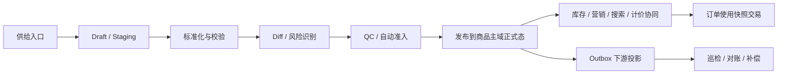
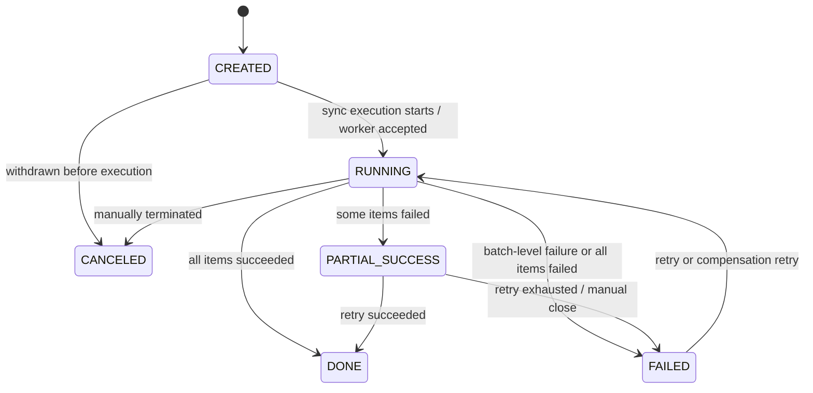
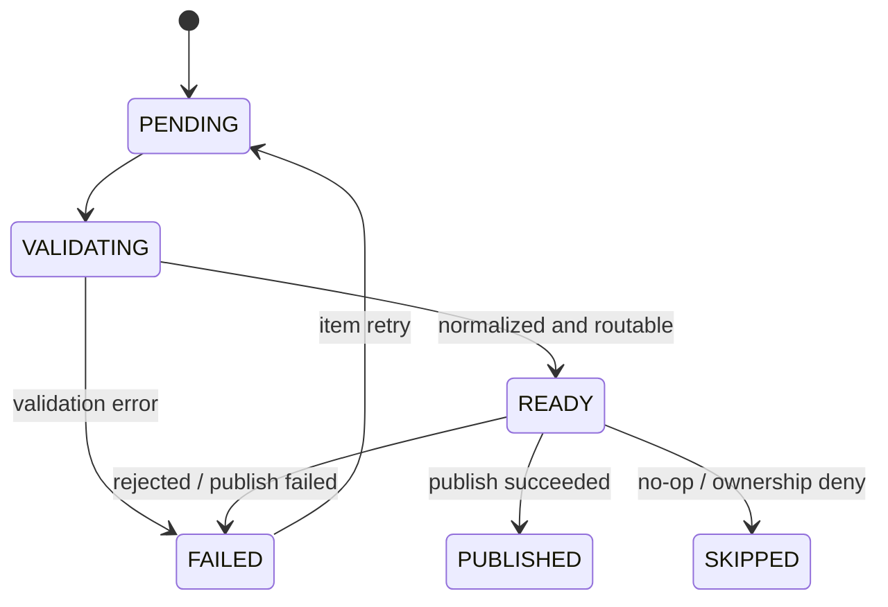
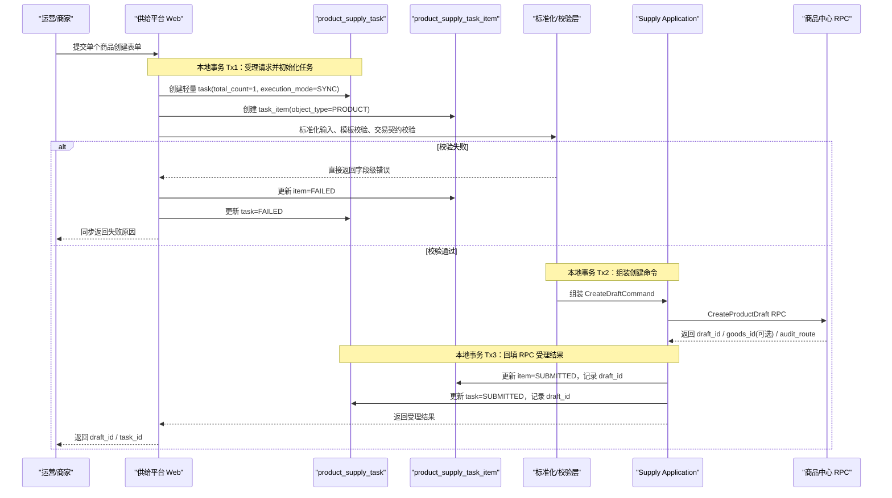
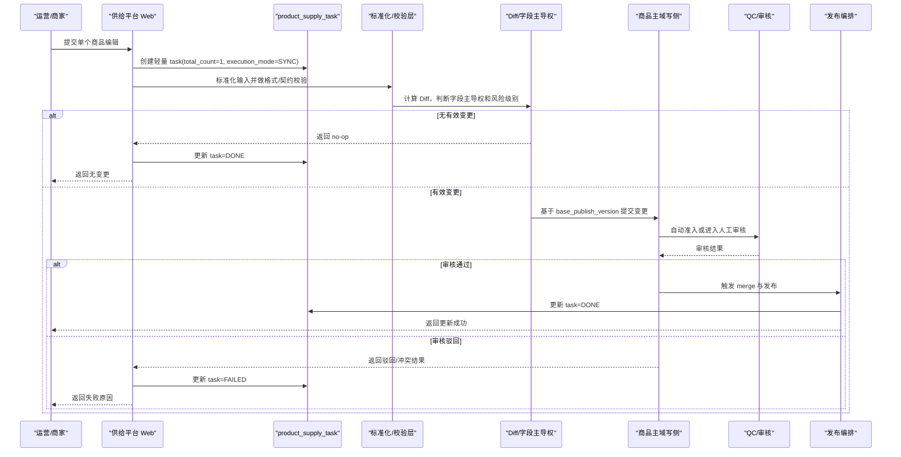
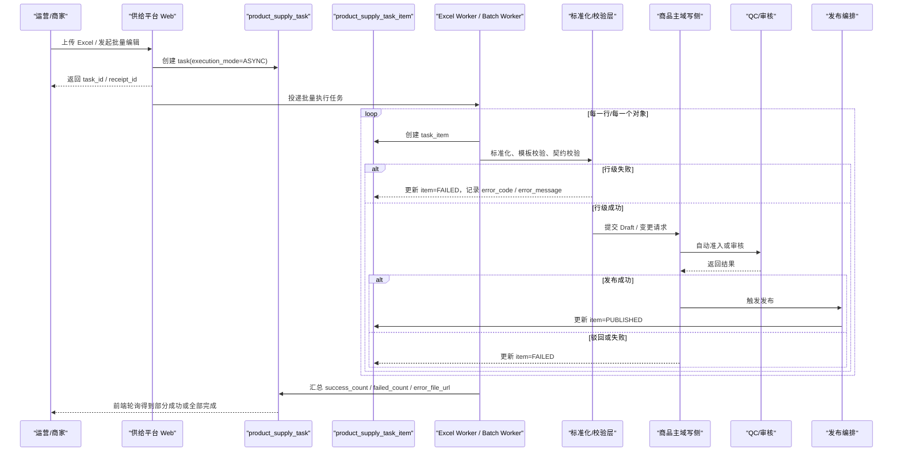
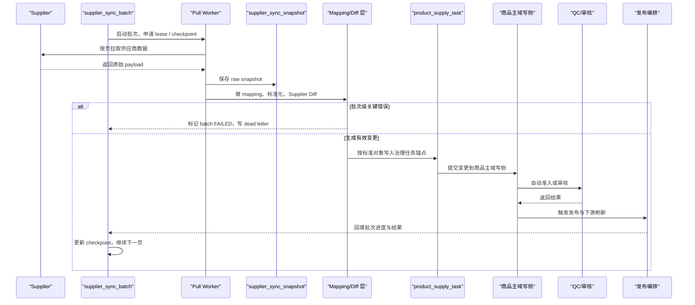

# 商品、供给、库存、上架、QC 与运营的全生命周期设计

> **本章定位**：这不是对“商品中心”“供给平台”“库存系统”三篇文章的简单拼接，而是站在平台生命周期视角，把商品如何进入平台、如何被治理、如何形成正式交易契约、如何建立可售库存、如何持续编辑和运营、以及如何与搜索、营销、订单、履约保持一致，收敛成一条完整主线。

如果前面的专题章节分别回答的是“某个系统内部怎么设计”，这一章回答的则是：

1. 平台到底在处理哪些高频使用场景。
2. 这些场景为什么不能用一个后台 CRUD 搞定。
3. `Draft`、`Staging`、正式商品、库存事实、审核状态、发布版本应该分别放在哪里。
4. 为什么库存运营入口和库存事实归属必须分离。
5. 为什么真正难的不是建几张表，而是跨系统一致性、任务化、幂等、补偿和资损防控。

建议配合以下章节交叉阅读：

- [第 21 章 商品中心系统](../part02/03-product-center.md)
- [第 22 章 库存系统](../part02/04-inventory-system.md)
- [第 24 章 商品供给、编辑、运营与生命周期治理](../part02/02-product-supply-lifecycle-ops.md)

---

## 1. 核心使用场景：系统到底在处理什么问题

很多团队一开始会从系统模块讲起：商品中心一章、库存系统一章、审核后台一章、供应商同步一章。这样讲虽然清楚，但读者很容易失去真正的主线，因为业务里遇到的从来不是“我现在只在操作商品中心”，而是：

> 一个商品从创建、审核、发布、补库存、改标题、供应商同步、搜索刷新到订单履约，会跨越多少系统边界，以及这些边界怎么保证不打架。

### 1.1 商品创建场景

商品创建并不是单一操作，而是至少五类不同来源的组合：

| 场景 | 典型触发方 | 特征 | 体验要求 | 系统重点 |
| --- | --- | --- | --- | --- |
| 本地运营手工创建 | 平台运营 | 低频、强交互、可信来源 | 同步保存、秒级回执 | Draft、强校验、自动准入 |
| 商家后台单品上传 | 商家 | 数据质量波动大 | 同步提交、异步审核 | 默认 QC、素材校验、风控 |
| Excel 批量导入 | 运营 / 商家 | 高吞吐、行级失败 | 快速返回任务 ID | 任务化、错误文件、重试 |
| API / ISV 推送建品 | ERP / 开放平台 | 中高频、天然重试 | 先确认接收，再异步完成 | 幂等键、回调、批次治理 |
| 供应商首次同步建品 | 第三方供应商 | 海量、离线、外部不稳定 | 纯异步 | Checkpoint、Mapping、归一化 |

这些场景共同逼着系统回答几个问题：

1. 手工创建和批量导入能否走同一条治理主线。
2. 供应商同步是“创建”还是“Upsert”。
3. 外部来源的数据先放哪里，什么时候才算正式商品。
4. 审核和发布失败后如何定位到具体行、具体字段、具体来源。

### 1.2 商品编辑场景

商品一旦上线，编辑链路往往比创建链路更复杂，因为它直接影响线上交易和历史一致性。

| 场景 | 典型触发方 | 是否影响线上存量商品 | 常见风险 | 推荐模式 |
| --- | --- | --- | --- | --- |
| 运营手工改单品 | 运营后台 | 是 | 标题、类目、价格误改 | 变更请求 + 审核发布 |
| 商家批量编辑标题 / 属性 | 商家 | 是 | 批量污染、类目错挂 | 批量任务 + 行级校验 |
| 供应商增量同步更新 | 供应商 | 是 | 覆盖人工改动、脏数据反写 | 差异识别 + 策略路由 |
| 高频价格 / 库存变更 | ERP / 自动化系统 | 是 | 生效滞后、重复覆盖 | 局部旁路 + 幂等更新 |
| 风控 / 合规强制下架 | 法务 / 风控 | 是 | 即时停止可售 | 平台裁决直达正式态 |

这里最关键的分歧不是“能不能改”，而是：

- 哪些字段必须先进 `Staging` 再发布。
- 哪些字段可以走快速旁路。
- 哪些变更必须保留审批与审计链路。
- 供应商同步和人工编辑冲突时谁优先。

### 1.3 库存运营场景

库存不是一个孤立的“数字服务”，B 端运营视角里它至少包含以下场景：

| 场景 | 典型对象 | 目标 | 风险 | 归属建议 |
| --- | --- | --- | --- | --- |
| 初始化库存 | 新商品 / 新 SKU | 建立首批可售能力 | 初始配置错误 | 供给平台发起，库存系统落账 |
| 补货 / 扣减 / 调整 | 数量库存 | 改变可售量 | 超卖 / 错减 | 运营工作台 + 库存命令 |
| 券码导入 | 卡密 / 礼品卡 / 券类 | 增加唯一资源池 | 泄露 / 重复导入 | 批量任务 + 码池账本 |
| 系统生码 | 平台生成券码 | 自动补足供给 | 生成失败 / 碰撞 | 异步批任务 |
| 锁库存 / 解锁库存 | 大促 / 风控 / 活动 | 临时冻结可售 | 漏解锁 | 显式命令 + 审计 |
| 门店 / 日期 / 批次调整 | O2O / 酒店 / 票务 | 精细化承诺 | 维度错配 | 范围化建模 |

库存场景的难点不是表单操作，而是：

- 库存运营入口要不要直接放在库存系统。
- 数量库存和券码库存能否共用一个模型。
- Redis 里的热数据是不是事实来源。
- 订单预占、支付确认、超时释放怎么和库存账本对齐。

### 1.4 生命周期治理场景

治理场景决定了这个系统是不是“平台”：

| 场景 | 目标 | 为什么重要 |
| --- | --- | --- |
| 提交审核 | 把编辑结果送入准入链路 | 防止半成品直接污染线上 |
| 自动准入 | 让低风险变更快速生效 | 降低人工成本，提升运营效率 |
| 人工 QC | 人工兜底高风险变更 | 处理类目、素材、合规风险 |
| 驳回 / 撤回 / 重提 | 形成运营闭环 | 让失败可修复、可追踪 |
| 发布 / 下架 / 归档 | 管理线上资产状态 | 区分流程态与正式态 |

这部分要解决的核心问题是：流程状态、审核状态和正式商品状态能不能混在一起。答案通常是否定的。

### 1.5 供应商协同场景

供应商同步既是供给入口，也是持续运营的一部分：

| 场景 | 特征 | 关键能力 |
| --- | --- | --- |
| 全量拉取 | 海量、慢、成本高 | 分片、快照、断点续跑 |
| 增量同步 | 高频、可重复 | 指纹、幂等、对齐 |
| Push 回调 | 外部主动通知 | 签名校验、重放防护 |
| 人工刷新 | 定向修复 | 单资源重跑、人工兜底 |

供应商协同最大的工程难点不是“能不能接上接口”，而是：

- 供应商数据是不是可以直接覆盖正式商品。
- 同步失败后如何知道哪一批、哪一页、哪个资源出问题。
- 供应商变更和人工编辑冲突时谁说了算。

### 1.6 场景到系统问题的映射

| 场景类型 | 典型问题 |
| --- | --- |
| 商品创建 | 入口统一、同步/异步分层、草稿归属、批量错误隔离 |
| 商品编辑 | 差异化审核、线上版本保护、供应商冲突治理 |
| 库存运营 | 入口与事实分离、账本可追溯、预占释放一致性 |
| 生命周期治理 | 状态分层、审计留痕、重提与补偿闭环 |
| 供应商协同 | 幂等、断点续跑、数据质量评估、Mapping 管理 |
| 发布协同 | 版本化发布、Outbox、搜索/缓存/订单最终一致 |

---

## 2. 整体方案设计

这一节按照“先看系统边界，再看主链路，最后看关键决策”的顺序展开。先把商品主域、供给平台、库存系统、营销、搜索和订单各自的职责划清楚，再把这些系统放进一条完整的生命周期主链路中理解，最后集中讨论 `Draft / Staging`、同步 / 异步、资产归属和库存边界这些关键设计选择。

### 2.1 系统的边界和职责

| 系统 | 负责什么 | 不负责什么 |
| --- | --- | --- |
| 商品主域（写侧） | 可审核、可发布的 `Draft / Staging`、正式商品主数据、交易前契约、发布版本、商品快照 | 商家接入、文件导入界面、错误文件分发、供应商抓取编排 |
| 供给与运营平台 | 入口、标准化、Task、Validation、QC 工作台、发布编排、运营工作台 | 库存最终事实、搜索索引直写、订单状态维护、正式商品资产主权 |
| 库存系统 | 库存事实、预占、确认、释放、账本、券码池 | 商品标题、类目、审核流、营销规则 |
| 营销系统 | 活动、圈品、预算、优惠规则、营销库存 | 商品正式发布事务、库存总账 |
| 搜索系统 | 索引、召回、排序、可检索投影 | 商品发布事务、库存事实 |
| 订单系统 | 订单状态、商品/报价/履约快照引用 | 最新商品配置维护 |

边界划分里最重要的三条原则是：

1. 供给平台负责接脏数据、洗数据、做任务和审核编排，但不持有正式商品资产主权。
2. 商品主域写侧负责可审核、可发布的草稿资产、版本冻结和正式落库闭环。
3. 库存系统负责库存事实和账本，不负责 B 端商品编辑与审核流程。

### 2.2 全生命周期主链路总览



这条主链路表达的是统一供给治理平台的基本职责：

1. 所有供给动作先进入 `Draft / Staging`，而不是直接污染正式商品。
2. 标准化、校验、Diff、风险识别和审核，构成正式发布前的质量门禁。
3. 发布之后不是“流程结束”，而是进入库存、营销、搜索、计价和订单快照的协同阶段。
4. 最终通过 Outbox、巡检、对账和补偿保证一致性，而不是要求一次同步调用把所有下游都写成功。

### 2.3 决策点 1：为什么不能继续在原商品系统上打补丁，而是需要新增 `Draft` 表

#### 场景与问题

很多团队在系统演进早期都会问一个问题：既然原来已经有商品系统，为什么不继续在原表上加几个字段、补几个状态、加几段审核逻辑，而是要显式引入 `Draft` 表甚至新的写模型？

短期当然可以继续打补丁，但问题是业务模型已经变了。早期很多商品系统主要承载的是自运营的相对简单的配置型商品，商品本身更像一个后台配置对象；后面商品开始承载外部供给接入、审核流程、库存策略、履约规则、退款口径、供应商同步和版本化发布之后，它已经不再只是“静态配置”，而是在向“可治理的交易资产”演进。

如果继续把这些新能力都硬塞进原商品系统的单一正式表或单一状态字段里，短期看似节省改造成本，长期却会持续累积三类问题：

1. **边界继续塌陷**

   原商品系统原本只负责正式商品表达，如果继续往里塞草稿、审核、导入状态、供应商同步中间态，它就会同时承担接入层、流程层和资产层职责，后面每接一个新品类或一个新供给来源，复杂度都会继续上升。

2. **正式资产被流程态污染**

   一旦把“待审、驳回、文件解析中、待补图、供应商刷新中”这些状态混进正式商品表，商品主域的语义就不再稳定，搜索、缓存、计价、订单也更容易误读这些半成品或中间态。

3. **演进成本越来越高**

   继续打补丁的本质是拿局部 if/else 和临时字段去扛新的业务模型。前期似乎更快，但后期每增加一种商品类型、每新增一种审核策略、每接一种库存模式，都要在旧结构上继续叠复杂度，风险和维护成本只会越来越高。

所以这次改造的本质不是简单重构代码，而是**边界重划**：把正式商品、可发布草稿、流程任务、审核工作台、库存事实这些不同层次的数据重新分层。也正因为如此，系统才需要显式引入 `Draft` 或 `Staging` 这类新写模型，而不是继续在原商品表上追加字段和状态。

#### 方案对比

| 方案 | 优点 | 缺点 / 风险 | 适用场景 | 推荐结论 |
| --- | --- | --- | --- | --- |
| 方案 A：继续在原商品系统上打补丁 | 短期改造快；不需要新增模型和表 | 边界塌陷；流程态污染正式态；复杂度滚雪球增长 | 早期、简单、低变化系统 | 过渡方案 |
| 方案 B：新增 `Draft` 表和独立写模型 | 语义分层清晰；便于审核、发布、版本冻结和演进 | 初期改造成本更高 | 中长期演进、复杂商品平台 | 推荐 |

#### 推荐方案

推荐方案 B。判断标准不是“新增表是不是更优雅”，而是业务模型是否已经发生质变。

一旦商品开始承载供给接入、审核治理、库存协同、履约规则和版本化发布，原商品系统就不再适合只靠补字段和补状态来演进。此时新增 `Draft` 表，本质上是在承认“正式商品”和“待治理草稿”是两种不同层次的数据，应该被显式建模。

### 2.4 决策点 2：`Draft` 属于供给平台还是商品主域写侧，QC 挂在哪层快照上

#### 场景与问题

这是整个商品生命周期架构里最容易引发争论的一个决策点。按业务流程直觉看，商家和运营是在供给平台改商品，所以草稿似乎天然应该留在供给侧；但从资产主权、事务边界、版本冻结和长期演进看，`Draft` 又更像商品主域内部的未生效版本。

这个问题不能只看“草稿表放哪里”，还必须连着 QC 链路一起看。因为真正的架构问题不是：

> `Draft` 在供给还是在商品中心？

而是：

> **可审核、可发布的草稿资产归谁持有，QC 又应该挂在哪一层冻结快照上做裁判？**

如果 `Draft` 留在供给侧，QC 往往也只能围绕供给侧草稿运行，链路就会自然变成：

```text
供给(draft)
  → QC
  → 商品正式态
```

如果 `Draft` 已进入商品主域写侧，QC 更合理的形态则是：

```text
供给接入
  → 商品主域 Draft / Staging
  → QC
  → 本地 Merge 到正式 Item
```

这两条链路看起来只差了一个步骤，底层却是两种完全不同的资产主权和版本控制模型。

这里先给出结论，再展开论证：

> 如果 `Draft` 只是浏览器表单保存、文件上传中的临时缓存，它可以短暂停留在供给侧；但一旦 `Draft` 进入待审核、待发布、可版本冻结、可与正式商品合流的阶段，它本质上已经属于商品主域的写模型，而不应该长期留在供给接入层。

换句话说，这一节讨论的不是“前端临时草稿存哪里”，而是“可审核、可发布的商品草稿资产归谁持有”。

#### 方案 A：`Draft` 留在供给平台

这种方案的出发点非常自然：供给平台负责对接商家、运营、供应商和 ERP，商品变更从这里进入，审核工作台、批量任务、错误文件也在这里，于是团队很容易顺着流程心智把 `Draft` 一起留在供给层。

在这种设计下，QC 也通常会变成“前置流式审核”，即先在供给侧审核，再把通过后的 DTO 推给商品主域落正式态。

##### 优点

- 业务流程看起来更顺，商家上传、审核流、任务进度都集中在一个平台。
- 供给平台天然适合承接脏数据、错误文件、批量导入和人工修复。
- 对早期团队来说，上线速度快，不需要商品主域一开始就承接完整的草稿写模型。

##### 缺点 / 风险

1. **资产主权分裂**

   同一个商品会被拆成两份核心表达：供给平台里的草稿资产，以及商品中心里的正式资产。草稿和正式商品其实只是同一资产的不同阶段，却被两个服务分别持有，后续版本控制、冲突治理和审计解释都会变复杂。

2. **发布合流链路跨服务，放大批量窗口风险**

   当 QC 判定通过时，系统需要把草稿 merge 到正式商品。如果草稿在供给、正式表在商品中心，发布就必须走跨服务 RPC 或异步命令。单次发布未必是灾难，但一旦进入凌晨供应商大批量更新、大促前批量调价、酒店政策全量同步等场景，发布链路时延、锁竞争、失败点和重试成本都会明显放大，也更容易在批量窗口冲击商品主域写链路。

3. **类目属性契约和校验逻辑容易进入“双写地狱”**

   商品草稿模型与正式模型往往高度同构：类目、属性、多规格 SKU、阶梯价、履约规则、退款规则都要表达。商品主域一旦新增类目契约、修改必填属性或调整校验规则，供给平台就很容易被迫同步修改草稿表结构和复制一套校验逻辑。久而久之，两个服务会演变成披着接口外衣的伪单体。

4. **版本冻结与防篡改更难做**

   如果审核看的数据在供给侧，而最终发布动作发生在商品主域，审核中途还要面对商家、运营、供应商同步并发修改同一商品的问题。理论上可以通过版本号、快照和锁机制解决，但复杂度明显高于把可发布草稿直接内聚在商品主域本地。

5. **QC 更难锁定真正的裁判快照**

   这是这条链路最微妙、也是最危险的问题。QC 在供给侧看到的是版本 A，但在审核通过到跨服务发布的窗口里，供给侧草稿可能已经被另一个并发修改线程推进到版本 B。最终就可能出现“审的是 A，发的是 B”的时空撕裂问题。

6. **多版本乱序容易导致线上数据回滚**

   商家短时间连续提交多个版本时，机审秒过的版本 B 可能先发布，而人工审核较慢的版本 A 后通过。如果发布动作只是“审核通过后把 DTO 再推给商品主域”，旧版本 A 就可能在更晚的时间反向覆盖新版本 B，形成线上数据时间倒流。

##### 适用场景

- 早期系统
- 类目简单、审核弱、供应商同步不重
- 商品主域还没有成熟的写模型和发布版本体系

#### 方案 B：`Draft` 收拢到商品主域写侧

这里的“放在商品中心”需要说得更精确一些：不是把 `Draft` 直接放进 C 端线上 `product_item` 表，而是放进商品主域自己的 `draft / staging / version / publish merge` 写模型中。商品主域对这份草稿资产拥有版本冻结、发布合流和正式落库的主权。

在这种设计下，QC 不再审核供给平台里那份可变草稿，而是基于商品主域已经落库、已经冻结版本号的 `Draft / Staging` 快照做裁判。QC 回传的也不再是完整商品 DTO，而只是轻量的判决结果，例如：

```json
{
  "draft_id": 555,
  "publish_version": 102,
  "result": "PASS"
}
```

##### 优点

1. **资产主权统一**

   无论是线上售卖商品，还是待审核的未生效版本，本质上都是同一份商品资产的不同形态。把它们收在商品主域写侧，领域边界最稳定。

2. **合流可以本地事务闭环**

   `product_draft_tab`、`product_staging_tab`、`product_item_tab`、`publish_version` 都在商品主域本地时，QC 通过后的 merge 可以在本地事务内完成。这样发布路径更短，也更容易做版本校验、幂等发布和失败回滚。

3. **版本冻结与快照锁定更自然**

   供给平台把数据清洗成标准 DTO 后推给商品主域，商品主域将其落成 `Draft` 或 `Staging` 并生成版本号。QC 审核的是这份冻结后的本地快照，而不是仍然暴露在接入层并发修改风险中的动态数据。

4. **契约和校验逻辑只维护一份**

   类目、属性、SKU、Offer、履约、退款等商品主契约只需在一个主域里演进，避免供给和商品两边长期维护两套同构模型。

5. **发布事件与读模型刷新更容易统一**

   正式商品落库、快照生成、Outbox 写入、搜索/缓存/计价/营销投影刷新都可以由商品主域统一发起，链路更可解释。

6. **QC 能基于冻结快照做真正的版本裁判**

   数据一旦进入商品主域落成 `Draft` 或 `Staging`，系统就可以为它分配明确的业务版本号，并在送审期间锁定这份快照。商家若继续修改，必须生成新的版本而不是覆写旧版本。这样 QC 审核的是确定版本，发布的也是同一个确定版本。

7. **QC 回传 verdict，商品主域本地事务完成 merge**

   QC 审核通过后，不需要再跨服务传一份巨大的商品 DTO 回商品主域，只需要回传“哪一个草稿版本审核通过”的轻量判决。商品主域随后在本地事务里将该版本 merge 到正式 `Item`，并统一完成快照、Outbox、缓存刷新等后续动作。

##### 缺点 / 风险

1. **B 端写压力会向商品主域集中**

   零散保存、批量导入、供应商同步、错误重提等写流量都会压到商品主域写侧。

2. **商品主域会承接更多流程复杂度**

   如果团队边界没划清，商品主域很容易被误用成“供给后台本体”，把本该属于供给平台的任务、审核工作台、文件处理逻辑全堆进来。

##### 化解施策

方案 B 的关键不是“把所有东西都塞进一个商品服务”，而是：

- 供给平台继续负责入口、清洗、任务、审核工作台、供应商同步编排。
- 商品主域只负责可审核、可发布的草稿资产，以及正式落库闭环。
- `product_draft_tab` 与 `product_item_tab` 物理隔离，避免草稿写洪峰污染线上正式资产。
- 条件成熟时，可以拆成 `product-writer` 和 `product-reader`：前者承接草稿、审核、发布；后者只服务 C 端读流量和缓存。

##### 适用场景

- 中大型平台
- 类目复杂、供应商同步重、审核和版本治理要求高
- 希望长期保持商品主权统一的系统

#### 方案对比

| 方案 | 优点 | 缺点 / 风险 | 适用场景 | 推荐结论 |
| --- | --- | --- | --- | --- |
| 方案 A：`Draft` 留在供给平台，QC 前置审核 | 流程直觉强；任务与审核工作台集中；早期交付快 | 资产主权分裂；发布跨服务；契约双写；QC 难锁定冻结快照；易发生版本乱序覆盖 | 早期系统、低复杂度业务 | 过渡方案 |
| 方案 B：`Draft` 收拢到商品主域写侧，QC 基于本地快照裁判 | 主权统一；本地事务 merge；版本冻结自然；契约单一演进；QC verdict 轻量回传 | 写压力上移；需要 writer/reader 与冷热隔离 | 中大型平台、长期治理 | 推荐 |

#### 推荐方案

推荐方案 B，但需要准确理解为：

> `Draft` 不应该长期留在供给接入层，也不应该直接混进 C 端线上商品表，而应该归商品主域写侧管理。

供给平台的定位更像“流量入口、数据加工厂与流程编排层”：

- 负责接外部脏数据
- 负责把数据清洗成标准 DTO
- 负责任务、审核工作台、错误文件和供应商同步流程

而商品主域才真正负责：

- `Draft / Staging / Version`
- 版本冻结与防篡改
- QC 裁判快照锚定
- 本地事务 merge
- 正式商品落库
- Outbox 与下游投影事件

因此，更完整的架构判断不是“`Draft` 属于供给平台还是商品中心”二选一，而是：

- **入口态临时数据** 可以短暂停在供给侧
- **可审核、可发布的草稿资产** 应归商品主域写侧
- **QC 应该裁判商品主域中已经冻结版本的快照**

这也是为什么在平台化电商架构里，真正成熟的设计通常都不会让供给平台长期持有商品草稿的最终主权。

### 2.5 决策点 3：是否需要 `Staging`，单 `Draft` + `Operation Log` 是否可行

#### 场景与问题

当团队决定引入 `Draft` 之后，下一步一定会遇到两个高度关联的问题：

1. 只有 `Draft` 和正式 `Item` 两层够不够，是否还需要单独的 `Staging`。
2. 如果想尽量轻量化，单 `Draft` + `Operation Log` 能不能替代 `Draft + Staging + Item` 三层模型。

这两个问题最好放在一起讨论，因为它们本质上都在回答同一件事：

> 商品写模型到底需不需要三层隔离，以及单草稿方案的边界在哪里。

这里先给出一个压缩结论：

- `Draft` 解决的是“脏数据吸收、审核沙盒、并行编辑”。
- `Staging` 解决的是“已通过 QC 的干净版本如何等待生效、切渠道、做回滚”。
- `Operation Log` 适合作为单草稿方案的差分增强，但它不能完全替代 `Staging` 在时间轴、渠道隔离和回滚上的作用。

#### `Draft` 与 `Staging` 的职责差异

| 维度 | `Draft` | `Staging` |
| --- | --- | --- |
| 核心语义 | 正在编辑、待治理的工作副本 | 已通过 QC、待激活的静态快照 |
| 数据纯净度 | 可能仍在被修改，存在未审核内容 | 100% 已过审，版本已冻结 |
| 解决的问题 | 审核沙盒、并行编辑、脏写隔离 | 定时生效、多渠道隔离、快速回滚 |
| 是否面向 C 端 | 否 | 当前不可见，但可视为“下一任合法继承人” |

如果没有 `Staging`，系统就只能在“审核通过后立刻发布”和“继续停留在 Draft 里等待后续动作”之间二选一，这会让定时生效、多渠道未来版本和回滚变得很别扭。

#### 方案 A：只有 `Draft`，无 `Staging`

##### 优点

- 模型简单，表和状态少。
- 审核通过后直接发布，链路短。
- 对小系统或低变更频率系统来说，心智负担低。

##### 缺点 / 风险

1. **已提交版本和正在编辑版本容易混淆**

   如果没有 `Staging`，系统很难清晰表达“这份数据已经通过 QC，但暂时还不应该生效”的状态。

2. **定时生效和渠道隔离能力弱**

   大促零点变价、不同渠道未来版本、供应商已过审但待外部确认的场景，都需要一个“已过审但未激活”的物理缓冲区。

3. **回滚确定性弱**

   没有 `Staging` 的物理快照，回滚通常要依赖历史版本重算、日志回放或脚本修复。

##### 适用场景

- 小团队
- 商品结构简单
- 几乎没有定时生效、多渠道隔离和秒级回滚要求

#### 方案 B：单 `Draft` + `Operation Log`

这是很多中型系统会选择的折中方案：一个商品只保留一个 `Draft`，再配套 `Operation Log / Diff Map` 记录价格、标题、库存等字段差分。

##### 优点

- 比三层模型更轻量，只需要 `Item + Draft + Operation Log`。
- 某些低风险变更可以直接 patch 当前草稿，避免“一个商品只能改一次”的业务阻塞。
- 存储成本、索引成本和模型心智都比较低。

##### 缺点 / 风险

1. **多任务审核容易撕裂**

   标题改动需要人工审核 3 小时，价格改动 100ms 秒过，如果它们都 patch 到同一个 `Draft` 上，价格就无法安全独立发布。

2. **激活时需要动态归并日志**

   没有 `Staging` 的完整待发布快照，系统只能在生效瞬间做 `Operation Log` 的 Reduce 和字段级 patch，这会把计算压力带到高峰时刻。

3. **多渠道隔离与一键回滚能力弱**

   单 `Draft` 很难同时表达多个未来渠道版本；一旦线上数据洗脏，回滚通常要依赖逆向回放 `Operation Log`，确定性弱于直接切回上一个 `Staging` 版本。

##### 适用场景

- 中等复杂度系统
- 审核策略比较一致
- 定时生效和多渠道未来版本需求不强

#### 方案 C：`Draft + Staging + Item`

##### 优点

- `Draft` 负责吸收脏写流量和并行编辑，`Staging` 负责沉淀通过 QC 的完整待发布版本。
- 多个 Draft 可以并行加工，但最终只在 `Staging` 中形成有序的未来版本时间轴。
- 到激活时不再做复杂归并，而是把已经组装好的快照本地 merge 到 `Item`。
- 支持定时发布、多渠道隔离、灰度切换和秒级回滚。

##### 缺点 / 风险

- 物理数据副本更多，模型更重。
- 需要额外的激活调度、版本治理和清理策略。
- 对团队的数据建模要求更高。

##### 适用场景

- 中大型平台
- 审核存在快慢混合链路
- 大促定时变价、跨渠道供给隔离较多
- 需要高确定性的回滚和版本切换

#### 方案对比

| 方案 | 优点 | 缺点 / 风险 | 适用场景 | 推荐结论 |
| --- | --- | --- | --- | --- |
| 方案 A：只有 `Draft`，无 `Staging` | 简单、状态少、上手快 | 难表达“已过审待生效”；定时发布和渠道隔离弱 | 小系统 | 有条件可用 |
| 方案 B：单 `Draft` + `Operation Log` | 轻量、节省存储、开发快 | 多任务审核撕裂；激活时要动态归并；回滚能力弱 | 中等复杂度系统 | 可行但有天花板 |
| 方案 C：`Draft + Staging + Item` | 状态分层清晰；激活轻量；支持多版本、多渠道、回滚 | 模型更重，存储更多 | 中大型供给中台 | 推荐 |

#### 推荐方案

推荐方案 C 作为复杂供给中台的目标形态，但不是所有系统第一天就必须上三层模型。

更务实的判断标准是：

- 如果系统当前仍以单渠道、弱审核、低频定时发布为主，方案 B 完全可以作为高性价比方案。
- 一旦系统开始出现多路并行修改、价格和图文审核时效分裂、大促零点定时生效、跨渠道未来版本和秒级回滚要求，就应从单 `Draft` 进化到 `Draft + Staging + Item`。

换句话说，`Staging` 不是“为了优雅而优雅”的抽象，而是当系统需要时间轴、渠道隔离和高确定性回滚时，最自然的一层写模型。

### 2.6 决策点 4：同步体验和异步任务如何分层

| 方案 | 优点 | 缺点 / 风险 | 适用场景 | 推荐结论 |
| --- | --- | --- | --- | --- |
| 方案 A：全部同步处理 | 用户感知简单 | 批量导入、供应商同步会拖垮接口 | 小流量、低复杂度 | 不推荐 |
| 方案 B：全部异步任务化 | 统一执行模型 | 单品创建体验差，交互成本高 | 内部工具型系统 | 不推荐 |
| 方案 C：单品同步体验，批量与长链路异步任务化 | 体验与治理平衡 | 需要双模式编排 | 平台型业务 | 推荐 |

推荐方案是方案 C：表单手工创建、低风险单品编辑保留同步交互；批量导入、批量编辑、券码导入、供应商同步全部任务化。

### 2.7 决策点 5：单商品创建也需要写入任务表吗

#### 场景与问题

这个问题在很多团队里都会被直觉性地处理成“单品同步接口就直接写数据库，不要引入任务表”，因为从前端交互看，运营或商家只是在页面上点一次提交，系统秒级返回，看起来不像一个需要任务化治理的场景。

但如果把链路往后多看几步，就会发现单商品创建后面仍然会经过：

- 标准化与校验
- 交易契约检查
- 风险识别
- 送商品主域写侧冻结快照
- 审核或自动准入
- 发布编排
- 下游刷新
- 失败补偿与审计追踪

如果单品场景完全不落 `task`，它就会和 Excel、API/ISV 推送、批量编辑形成两套完全不同的排障、审计和补偿口径。

#### 方案对比

| 方案 | 优点 | 缺点 / 风险 | 适用场景 | 推荐结论 |
| --- | --- | --- | --- | --- |
| 方案 A：单商品创建不写任务表 | 实现最轻；同步链路最短 | 审计不统一；无法统一补偿；发布追踪割裂 | 非常早期、极简后台 | 不推荐 |
| 方案 B：单商品创建只写 `operation_id`，不写 `task` | 比方案 A 多一层链路锚点 | 仍然和批量链路分叉；任务视图不统一 | 过渡期系统 | 可过渡 |
| 方案 C：单商品创建写轻量 `task(total_count=1, execution_mode=SYNC)` | 审计、发布、补偿、状态跟踪统一 | 需要多维护一张轻量任务记录 | 平台型系统 | 推荐 |

#### 推荐方案

推荐方案 C。单商品创建虽然是同步交互，但后端仍建议写入一条轻量 `product_supply_task`，并在需要时配一条 `task_item`。这样可以统一：

- 入口受理号 `receipt_id`
- 操作链路 `operation_id`
- 发布记录 `publish_record`
- 失败补偿入口
- 运营侧任务查询与审计口径

这条任务记录不是为了把单品交互“强行异步化”，而是为了让同步体验和长链路治理共用同一套后端锚点。

一句话说，就是：

> 单商品创建可以同步执行，但不应该脱离任务模型。

### 2.8 决策点 6：库存配置与库存事实是否放在同一系统

#### 场景与问题

商品上线前常常需要配置库存策略，例如是数量库存、券码库存还是供应商库存；但上线后真正的库存余额、预占和账本又属于交易硬约束。

#### 方案对比

| 方案 | 优点 | 缺点 / 风险 | 适用场景 | 推荐结论 |
| --- | --- | --- | --- | --- |
| 方案 A：库存配置和库存事实全放商品/供给侧 | 简化初期集成 | 后期库存服务难独立；交易与运营耦合过深 | 早期单体系统 | 不推荐 |
| 方案 B：库存配置可在商品/供给链路表达，库存事实由库存系统维护 | 符合职责边界；账本和交易链路更稳 | 需要命令与事件协同 | 平台化和多品类系统 | 推荐 |

#### 推荐方案

推荐方案 B：库存配置是交易契约的一部分，可以在商品发布时一并声明；库存余额、预占、确认、释放、券码状态机必须由库存系统维护。

---

## 3. 详细设计 - 供给平台

这一节不再讨论“商品资产最终长什么样”，而是专门回答供给平台如何承接多入口流量、如何隔离不同入口的资源和执行策略、如何把脏输入治理成标准对象，并如何把结果交给商品主域写侧与库存系统。

这里先钉死三个边界：

1. 供给平台负责接入、标准化、任务编排、发布编排和失败运营化。
2. 供给平台不持有 `Draft / Staging / QC` 主权，这些状态与快照属于商品主域写侧。
3. 供给平台承接库存运营入口，但不持有库存事实、预占、账本和券码池主权。

### 3.1 平台定位与职责边界

供给平台的定位更接近一个 **B 端接入与治理控制面**，而不是商品资产或库存事实的权威持有者。

| 能力 | 供给平台负责什么 | 不负责什么 |
| --- | --- | --- |
| 入口接入 | 商家上传、运营创建、Excel 导入、API/ISV 推送、供应商 Pull/Push | 正式商品读模型 |
| 输入治理 | 标准化、格式校验、映射补齐、错误文件、幂等受理 | `Draft / Staging / QC` 主权 |
| 任务编排 | `task / task_item`、执行模式、进度跟踪、部分成功 | 商品正式态本地 merge |
| 发布协同 | 触发发布命令、跟踪发布结果、记录 publish record | 正式商品版本落库 |
| 库存入口 | 创建库存变更单、券码导入、生码、锁库存命令入口 | 库存事实、账本、预占 |
| 供应商同步 | Batch、Checkpoint、Snapshot、映射、DLQ | 供应商数据最终是否成为正式商品版本的裁决权 |

一句话总结：

> 供给平台负责把外部和 B 端的复杂输入组织成可治理、可编排、可恢复的标准化变更；商品主域写侧负责把这些变更冻结、审核、发布为正式商品；库存系统负责把库存命令落成事实。

### 3.2 供给入口四象限隔离架构

整个接入层不应该只按“来源”分类，更应该按 **交互频率 × 数据吞吐量** 做资源隔离。表面上看 Excel 导入和 ERP 推送都是“批量数据”，但它们对时延、容错、资源竞争和用户心理预期完全不同。

#### 3.2.1 Local 单个创建 / 单个编辑

- 典型来源：运营后台、商家后台单品表单。
- 交互特征：强交互、低吞吐、秒级预期。
- 执行方式：同步提交，同步返回。
- 资源隔离：独立 Web 线程池或独立同步请求配额，不允许被批量任务排队拖死。
- 编排锚点：后端仍建议创建轻量 `task(total_count=1, execution_mode=SYNC)`，统一审计、状态跟踪和发布编排。

#### 3.2.2 Local Excel 批量导入

- 典型来源：商家后台导表、运营批量建品、批量编辑。
- 交互特征：高交互异步任务，中等吞吐，用户盯着进度条等待结果。
- 执行方式：上传后立刻返回 `task_id`，由专属 Excel Worker 异步解析和处理。
- 资源隔离：独立 Excel Worker Pool，不能和 Supplier Push/Pull 共用。
- 输出特征：部分成功、错误文件、错题本下载、分钟级结果反馈。

#### 3.2.3 Supplier API / ERP 实时推送

- 典型来源：三方 ERP、ISV、供应商开放接口 Push。
- 交互特征：无交互、低时效、超大吞吐，允许延迟消费。
- 执行方式：接口层只做签名校验、幂等受理和快速 ACK，然后写专属 MQ。
- 资源隔离：专属 MQ + 专属 Consumer，不共用本地运营导表线程池。
- 设计目标：即使 ERP 在大促前疯狂重试，也只能把压力堆在 MQ，不应拖垮本地商家后台。

#### 3.2.4 Supplier Full Sync / Pull 批量拉取

- 典型来源：酒店、票务、供应商平台全量 / 增量拉取。
- 交互特征：长任务、海量吞吐、可恢复优先于低延迟。
- 执行方式：`Batch + Checkpoint + Lease + Raw Snapshot`。
- 资源隔离：独立 Batch Worker，与 Local 单品和 Excel 链路物理隔离。
- 设计目标：保证任务能断点续跑、限流熔断、按批补偿，而不是追求“立即完成”。

### 3.3 统一任务模型与执行框架

这里的“统一任务模型”不是指所有入口都共用一套执行线程池，而是指 **Local 单品、Excel、API/ISV 推送、运营批量编辑** 这些供给治理型入口共用一套治理任务锚点：

- `product_supply_task`
- `product_supply_task_item`
- `receipt_id`
- `trigger_id`
- `operation_id`
- `execution_mode`

#### 共用范围

| 入口 | 是否共用 `product_supply_task` | 推荐模式 |
| --- | --- | --- |
| Local 单品创建/编辑 | 是 | 轻量 `task(total_count=1, execution_mode=SYNC)` |
| Excel 批量导入 | 是 | `task + task_item`，异步执行 |
| API / ISV 推送 | 是 | 受理后落治理任务，异步处理 |
| 运营批量编辑 | 是 | `task + task_item`，支持部分成功 |
| Supplier 同步执行层 | 否 | 独立 `supplier_sync_*` 模型 |

因此需要在正文中明确一句：

> Local 任务与 Supplier 任务在治理层复用发布编排锚点，但执行层不共用线程池、队列和 Worker 模型。

#### 任务状态机

统一任务模型除了统一表结构，还要统一状态机。否则单品、批量、API 推送虽然都写进了 `product_supply_task`，但每条链路各自发明一套状态语义，最后还是会退化成多套排障和审计口径。

推荐把状态拆成两层：

- `product_supply_task` 负责表达“这一批整体走到哪里了”
- `product_supply_task_item` 负责表达“这一行 / 这一对象具体成没成功”





推荐语义如下：

| 层级 | 状态 | 含义 |
| --- | --- | --- |
| `task` | `CREATED` | 已受理，还未开始执行 |
| `task` | `RUNNING` | 已进入同步执行或异步 Worker 执行 |
| `task` | `PARTIAL_SUCCESS` | 部分对象成功、部分失败，通常需要错误文件或重试 |
| `task` | `DONE` | 全部对象成功结束 |
| `task` | `FAILED` | 整体失败，或全部对象失败 |
| `task` | `CANCELED` | 执行前撤回，或人工终止 |
| `task_item` | `PENDING` | 已入队，尚未处理 |
| `task_item` | `VALIDATING` | 正在标准化、校验、计算 Diff |
| `task_item` | `READY` | 已通过供给治理，可提交商品主域写侧 |
| `task_item` | `PUBLISHED` | 已完成发布 |
| `task_item` | `FAILED` | 行级校验失败、审核驳回或发布失败 |
| `task_item` | `SKIPPED` | 无有效变更、字段主导权不允许覆盖等 |

这套状态机要强调两个边界：

- `task` 状态不等于商品状态。`DONE` 只表示供给任务处理完了，不代表商品一定已经 `ONLINE`。
- `task_item.READY` 也不等于正式发布成功，它只表示该对象已经完成供给平台治理，可以进入商品主域写侧的 `Draft / Staging / QC` 链路。

### 3.4 接入层资源池与执行隔离策略

供给平台的执行架构不能只讲“有任务表”，还要讲“不同任务跑在哪些资源池上”。

| 链路 | 资源池 / 介质 | 设计原则 |
| --- | --- | --- |
| Local 单品创建/编辑 | 独立 Web 线程池 | 不排队，秒级返回 |
| Local Excel 导入 | 独立 Excel Worker Pool | 保证分钟级反馈，不被 ERP 洪峰拖垮 |
| Supplier Push | 独立 MQ + Consumer | 接口快速 ACK，后端慢消费 |
| Supplier Pull | 独立 Batch Worker | 支持长任务、Checkpoint、Lease |

这一层要强调两个底线：

1. Excel 导入与 Supplier ERP/API 推送不共用线程池。
2. Supplier Push 和 Supplier Pull 也不应混在同一个执行池中，因为一个偏实时受理，一个偏长任务恢复。

### 3.5 典型场景时序图：标准化、校验与变更编排

这一节不再抽象罗列“标准化、校验、Diff、路由”这些动作，而是直接按 4 类典型场景展开时序图。这样读者能更直观看到：供给平台负责接入、标准化、校验、任务编排和发布触发，但 `Draft / Staging / QC` 的资产主权始终留在商品主域写侧。

#### 3.5.1 单个创建



这条链路如果要突出供给侧细节，关键不在商品中心后续如何审核和发布，而在于供给平台在调用 RPC 之前到底做了什么。推荐把职责拆成四层：

1. **Web / BFF 层**  
   负责接收表单、鉴权、幂等校验、保存 `task` 和返回同步结果。

2. **标准化 / 校验层**  
   负责把页面表单转成统一商品 DTO，并完成类目模板校验、字段格式校验、交易前契约校验。

3. **Supply Application 层**  
   负责把标准 DTO 组装成商品中心可识别的 `CreateDraftCommand`，并补齐任务上下文。

4. **商品中心 RPC 边界**  
   供给平台只调用“创建草稿”或“提交草稿”的语义化 RPC，不关心商品中心内部如何继续流转到 QC、发布和下游投影。

如果要把供给侧写得更落地，建议不要只建一个 `task`，而是至少形成一个“请求受理 + 标准化校验 + RPC 调用”的最小闭环。下面这组就是单个创建链路里真正必要的供给侧表：

```text
1. product_supply_task
   - task_id
   - task_type=LOCAL_CREATE
   - execution_mode=SYNC
   - source_type=LOCAL_UI / MERCHANT_UI
   - operator_id
   - category_id
   - payload_hash
   - status

2. product_supply_task_item
   - item_id
   - task_id
   - object_type=PRODUCT
   - object_key(client_generated_key / external_ref)
   - normalized_snapshot
   - status

3. product_supply_request_log
   - request_id
   - task_id
   - api_name=CreateProductDraft
   - rpc_target=ProductWriteService
   - request_payload_hash
   - response_code
   - response_message
   - latency_ms
   - created_at

4. CreateDraftCommand
   - request_id
   - task_id
   - item_id
   - source_type
   - operator_id
   - category_id
   - base_goods_id(新建为空)
   - product_payload
   - validation_summary
   - idempotency_key
```

其中几张表的职责可以明确拆开：

- `product_supply_task`
  记录一次供给动作，回答“谁在什么时候发起了什么操作”。
- `product_supply_task_item`
  记录当前这次创建对应的对象级明细。虽然单个创建只有一条，但保留这一层后，单品和批量才能共用同一套治理模型。
- `product_supply_request_log`
  记录供给平台调用商品中心 RPC 的请求与返回，便于排查“供给侧已受理但商品中心未落 Draft”这类问题。

对于单个创建链路，校验失败直接报错返回即可，不需要再额外落独立的“校验结果表”或“变更请求表”。这一层的重点是：

- 供给侧要先把请求受理下来；
- 要有 `task` 和 `task_item` 作为审计锚点；
- 要把调用商品中心 RPC 的请求结果记录清楚；
- 至于商品中心后续怎么进入 QC、怎么发布，不属于这一段要展开的范围。

这一段还需要明确事务边界。供给侧至少有三个本地事务：

1. **Tx1：请求受理事务**  
   创建 `product_supply_task`、`product_supply_task_item`，确保请求先有审计锚点。

2. **Tx2：校验与命令组装事务**  
   校验失败直接返回；校验通过后组装 `CreateDraftCommand`。

3. **Tx3：RPC 结果回填事务**  
   商品中心返回 `draft_id` 后，回填 `task` / `task_item` 状态和 `draft_id`。

供给侧不应追求把“本地落表 + 商品中心建 Draft RPC”做成跨服务分布式大事务。更合理的目标是：

- 供给侧本地状态有完整审计链；
- RPC 调用有明确请求日志；
- 失败后可重试、可补偿、可追查。

因此，供给平台调用商品中心时，RPC 可以细化成：

```text
ProductWriteService.CreateProductDraft(CreateProductDraftRequest)
```

请求里至少要有：

```text
request_id
task_id
source_type
operator_id
category_id
product_payload
payload_hash
idempotency_key
```

同步返回建议只关心供给侧真正需要的结果：

```text
draft_id
goods_id(optional)
audit_route
accepted
error_code
error_message
```

这样写的好处是：

- 供给平台有完整的任务锚点和审计上下文。
- 供给侧自己的状态沉淀是完整的，不会只剩一条 `task` 记录。
- 商品中心拥有 `Draft` 资产主权。
- 时序图不会越界写到商品中心内部细节，章节边界更清楚。

#### 3.5.2 单个更新



这条链路比单个创建多了两个核心动作：一是基于正式版本做 `Diff` 和 `base_publish_version check`；二是字段主导权判断，避免供应商字段和运营字段互相覆盖。

#### 3.5.3 批量创建 / 批量更新



这条链路的重点是：任务级状态和行级状态必须分离，批量链路允许部分成功，最终要能生成错题本或错误文件，而不是把整个批次一刀切打回。

#### 3.5.4 供应商 Pull 场景



这条链路最重要的边界是：供应商同步执行层独立建模，负责 `Batch / Checkpoint / Lease / Snapshot / DLQ`；但标准化后的有效变更仍然进入统一治理与发布编排链路，而不是绕过商品主域直接改正式商品。

### 3.6 校验策略分流：Excel 与 ERP 为什么不能共用同一套容错机制

这是供给平台里最容易被低估的一个设计点。两者都是“批量数据”，但容错心智完全不同。

#### Excel 导入

- 用户在页面前等待结果
- 接受部分成功
- 允许行级失败继续往下处理
- 最终要产出错题本、错误文件、修复建议

#### ERP / API 推送

- 没有人盯进度条
- 更关注接口高可用和标准错误码
- 对关键批次错误通常采取整批阻断
- 依赖幂等重试和批次隔离

因此，第 3 节要明确区分：

- **可行级跳过的错误**：字段格式错、个别映射缺失、单行类目异常
- **必须整批失败的错误**：签名失败、密钥过期、核心模板不匹配、批次结构畸形

### 3.7 发布编排与商品主域交互

供给平台在这一层不做正式落库，而是负责把治理结果编排成可执行的发布动作。

重点内容：

- 发布命令
- `base_publish_version`
- `product_publish_record`
- `product_outbox_event`
- 搜索 / 缓存 / 计价 / 营销协同

这里要钉死一句：

> 供给平台负责编排和触发发布；`Draft / Staging / QC / publish merge` 由商品主域写侧闭环完成。

### 3.8 库存运营入口设计

供给平台要承接库存相关的 B 端操作入口，但不负责库存事实。

推荐在这一小节只讲命令入口和边界，不深入库存内部模型：

- `CreateInventory`
- `AdjustInventory`
- `ImportCodeBatch`
- `GenerateCodeBatch`
- `LockInventory`

核心表达：

- 入口归供给
- 事实归库存
- 发布后可触发库存初始化或库存变更任务
- 供给平台保留权限、审批、操作理由、审计和错误文件能力

### 3.9 供应商同步专项链路

供应商同步要明确和 `3.3` 的关系：

- 执行层独立
- 治理层复用

这一节建议覆盖的执行层模型：

- `supplier_sync_task`
- `supplier_sync_batch`
- `supplier_sync_snapshot`
- `supplier_sync_diff_log`
- `supplier_sync_dead_letter`
- `supplier_product_mapping_tab`

以及四类关键能力：

- Push / Pull / Full Sync / Incremental Sync
- Batch / Checkpoint / Lease
- Raw Snapshot 与标准化结果分离
- 执行失败进入专项 DLQ，再进入统一治理链路

### 3.10 异常处理与运营闭环

供给平台最终要把失败运营化，而不是把问题藏在日志里。

这一小节建议覆盖：

- 错误文件
- 部分成功
- DLQ
- 补偿任务
- 人工修复
- 审计日志
- 质量看板

对运营侧要能回答：

- 哪个任务失败了
- 哪一行失败了
- 为什么失败
- 是交互型导入问题还是系统型同步问题
- 能否下载错误文件修复
- 是否可以重新投递

### 3.11 供给平台表清单与使用场景

这一小节建议显式列出供给平台权威表，避免和商品主域写侧、库存系统混淆。

#### A. 接入与任务编排表

| 表 | 使用场景 | 解决的问题类型 |
| --- | --- | --- |
| `product_supply_task` | 单品创建、运营编辑、Excel 导入、API/ISV 推送 | 交互型导入问题 / 统一编排锚点 |
| `product_supply_task_item` | Excel 每行、批量编辑每条、标准化后每个对象 | 交互型导入问题 / 行级状态 |
| `product_supply_operation_log` | 提交、重试、撤回、错误文件、补偿触发 | 交互型与系统型共同审计 |

这 3 张表建议这样设计：

##### `product_supply_task`

| 字段 | 含义 | 设计要点 |
| --- | --- | --- |
| `id` | 任务主键 | 雪花 ID 或 UUID |
| `task_no` | 任务号 | 对外展示，便于运营检索 |
| `task_type` | 任务类型 | `CREATE / EDIT / IMPORT / API_PUSH / BATCH_EDIT` |
| `source_type` | 来源类型 | `LOCAL / EXCEL / API / ISV / OPS` |
| `biz_scope` | 业务范围 | 例如 `PRODUCT / INVENTORY_ENTRY / PUBLISH` |
| `receipt_id` | 受理号 | 入口受理即返回，用于异步查询 |
| `trigger_id` | 触发源 ID | 例如上传文件、按钮点击、定时任务实例 |
| `operation_id` | 操作链路 ID | 串起任务、发布、补偿、审计 |
| `execution_mode` | 执行模式 | `SYNC / ASYNC`；单品常为 `SYNC`，批量常为 `ASYNC` |
| `operator_type` | 操作人类型 | `MERCHANT / OPS / SYSTEM / ISV` |
| `operator_id` | 操作人 ID | 人工或系统主体 |
| `merchant_id` | 商家 ID | 本地运营场景可为空 |
| `tenant_id` | 租户 ID | 多租户场景需要 |
| `status` | 任务状态 | `CREATED / RUNNING / PARTIAL_SUCCESS / FAILED / DONE / CANCELED` |
| `total_count` | 总对象数 | 单品场景固定为 `1` |
| `success_count` | 成功数 | 任务汇总字段 |
| `failed_count` | 失败数 | 任务汇总字段 |
| `risk_level` | 整体风险级别 | `LOW / MEDIUM / HIGH`，供后续路由 |
| `error_file_url` | 错题本地址 | Excel 导入常用 |
| `ext_json` | 扩展字段 | 存任务级上下文，如模板、入口配置 |
| `created_at` | 创建时间 | 审计基础字段 |
| `updated_at` | 更新时间 | 审计基础字段 |

##### `product_supply_task_item`

| 字段 | 含义 | 设计要点 |
| --- | --- | --- |
| `id` | 行级主键 | 雪花 ID 或 UUID |
| `task_id` | 所属任务 ID | 关联 `product_supply_task.id` |
| `item_no` | 行号/序号 | Excel 行号或批量对象序号 |
| `object_type` | 对象类型 | `PRODUCT / SKU / OFFER / INVENTORY_ENTRY` |
| `object_key` | 对象业务键 | 如外部商品 ID、临时对象键 |
| `item_action` | 本行动作 | `CREATE / UPDATE / UPSERT / DELETE / PUBLISH` |
| `raw_ref` | 原始输入引用 | Excel 行引用、上传对象引用、消息体引用 |
| `normalized_snapshot` | 标准化快照 | 结构化 JSON，供后续校验与发布编排 |
| `diff_summary` | 变更摘要 | 记录关键字段差异 |
| `status` | 行级状态 | `PENDING / VALIDATING / READY / FAILED / PUBLISHED / SKIPPED` |
| `error_code` | 错误码 | 面向机器处理 |
| `error_message` | 错误信息 | 面向运营排查 |
| `retry_count` | 重试次数 | 行级重试控制 |
| `publish_record_id` | 发布记录 ID | 成功进入发布编排后回填 |
| `ext_json` | 扩展字段 | 存模板版本、路由策略等 |
| `created_at` | 创建时间 | 审计基础字段 |
| `updated_at` | 更新时间 | 审计基础字段 |

##### `product_supply_operation_log`

| 字段 | 含义 | 设计要点 |
| --- | --- | --- |
| `id` | 日志主键 | 雪花 ID 或 UUID |
| `operation_id` | 操作链路 ID | 审计主锚点 |
| `task_id` | 关联任务 ID | 可为空，兼容轻量同步场景 |
| `task_item_id` | 关联行级 ID | 行级事件可回填 |
| `event_type` | 事件类型 | `SUBMIT / RETRY / WITHDRAW / GENERATE_ERROR_FILE / TRIGGER_COMPENSATION / PUBLISH` |
| `event_stage` | 事件阶段 | `INGEST / VALIDATE / ROUTE / PUBLISH / COMPENSATE` |
| `operator_type` | 操作人类型 | `MERCHANT / OPS / SYSTEM / SCHEDULER` |
| `operator_id` | 操作人 ID | 触发主体 |
| `before_snapshot` | 变更前摘要 | 不建议存整行大对象，只存关键摘要 |
| `after_snapshot` | 变更后摘要 | 只存关键摘要 |
| `result_status` | 结果状态 | `SUCCESS / FAILED / SKIPPED` |
| `result_code` | 结果码 | 便于分类统计 |
| `message` | 审计说明 | 面向运营和排障 |
| `trace_id` | 链路追踪 ID | 打通日志平台 |
| `created_at` | 事件时间 | 审计基础字段 |

推荐索引：

- `product_supply_task`
  - 唯一索引：`uk_receipt_id`
  - 普通索引：`idx_operation_id`
  - 普通索引：`idx_source_type_status_created_at`
- `product_supply_task_item`
  - 普通索引：`idx_task_id_status`
  - 普通索引：`idx_object_key`
  - 普通索引：`idx_publish_record_id`
- `product_supply_operation_log`
  - 普通索引：`idx_operation_id_created_at`
  - 普通索引：`idx_task_id_event_type`
  - 普通索引：`idx_trace_id`

其中有两个实现细节需要明确：

- Local 单品创建/编辑虽然是同步交互，但后端仍建议创建轻量 `product_supply_task(total_count=1, execution_mode=SYNC)`，这样才能统一审计、发布追踪和失败补偿。
- `product_supply_task_item.normalized_snapshot` 保存的是供给平台完成标准化后的对象快照，用于校验、Diff 和发布编排；它不是商品主域写侧的 `Draft / Staging` 资产本体。

#### B. 标准化与冲突治理补充表

| 表 | 使用场景 | 解决的问题类型 |
| --- | --- | --- |
| `product_field_ownership` | 供应商字段与运营字段冲突 | 系统型同步问题 |

#### C. 发布编排与追踪表

| 表 | 使用场景 | 解决的问题类型 |
| --- | --- | --- |
| `product_publish_record` | 一次任务最终触发了哪次发布 | 交互型与系统型共同发布追踪 |
| `product_supply_object_mapping` | 供给对象与正式 `item_id` 映射 | 交互型与系统型共同追溯 |
| `product_outbox_event` | 下游刷新事件跟踪 | 交互型与系统型共同一致性 |

#### D. 失败恢复与运营治理表

| 表 | 使用场景 | 解决的问题类型 |
| --- | --- | --- |
| `product_supply_dead_letter` | 发布失败、重试超限、关键校验失败 | 交互型与系统型共同失败恢复 |
| `product_compensation_task` | 下游刷新失败、库存初始化失败、事件重投 | 系统一致性问题 |
| `product_quality_issue` | 巡检发现缺履约、缺库存配置、搜索滞后 | 质量治理问题 |

#### E. 供应商同步执行层表

| 表 | 使用场景 | 解决的问题类型 |
| --- | --- | --- |
| `supplier_sync_task` | 定义要同步什么、怎么同步 | 系统型同步问题 |
| `supplier_sync_batch` | 一次执行批次、进度、水位、租约 | 系统型同步问题 |
| `supplier_sync_snapshot` | 保存供应商原始数据快照 | 系统型同步问题 |
| `supplier_sync_diff_log` | 记录供应商侧差异识别 | 系统型同步问题 |
| `supplier_sync_dead_letter` | 分页失败、字段缺失、映射失败 | 系统型同步问题 |
| `supplier_product_mapping_tab` | 外部资源到平台资源映射 | 系统型同步问题 |

这里还要明确反向排除：

- `product_supply_draft`
- `product_supply_staging`
- `product_qc_review`

这些不应列为供给平台权威表，而应归商品主域写侧。

---

## 4. 正式商品模型：发布后平台到底沉淀什么

### 4.1 正式商品的核心组成

商品中心沉淀的不是“后台录入过程”，而是正式交易契约：

- `Resource`：卖的是什么资源，例如酒店、门店、活动、充值运营商。
- `SPU / SKU`：资源如何被定义为可售商品和规格。
- `Offer / Rate Plan`：按什么渠道、价格、销售期、履约规则去卖。
- `Input Schema`：用户下单前必须提供哪些信息。
- `Fulfillment Rule`：发券、充值、出票、预约等怎么履约。
- `Refund Rule`：退款、取消、售后口径。
- `publish_version`：哪一个正式版本当前生效。
- `Product Snapshot`：订单创建时引用或复制的解释事实。

### 4.2 决策点 8：正式商品表是否承接 `DRAFT / QC_PENDING / REJECTED`

#### 方案对比

| 方案 | 优点 | 缺点 / 风险 | 适用场景 | 推荐结论 |
| --- | --- | --- | --- | --- |
| 方案 A：正式商品表混合流程状态 | 表少、查询直接 | 语义污染；状态机失控；误触发搜索和缓存刷新 | 小规模系统 | 不推荐 |
| 方案 B：流程态留在供给与商品主域写侧，正式读模型只保存正式态 | 语义清晰；读写边界稳定；订单快照更可解释 | 发布编排更复杂 | 中大型平台 | 推荐 |

#### 推荐方案

推荐方案 B。正式商品表中更适合出现的状态是：

```text
PUBLISHED / ONLINE / OFFLINE / ENDED / BANNED / ARCHIVED
```

而不应出现：

```text
DRAFT / QC_PENDING / REJECTED / PARSING / VALIDATING
```

---

## 5. 供给入口统一治理：商品从哪里来

### 5.1 统一治理，不是统一入口

供给入口可以分散，但治理框架最好统一：

```text
本地运营创建
商家上传
Excel 批量导入
API / ISV 推送
供应商 Pull / Push
  ↓
标准化
  ↓
Staging
  ↓
Validation / Diff / Review / Publish / Outbox
```

### 5.2 决策点 9：不同入口是多套流程，还是统一治理框架

| 方案 | 优点 | 缺点 / 风险 | 适用场景 | 推荐结论 |
| --- | --- | --- | --- | --- |
| 方案 A：每个入口各做一套 | 每个团队可独立优化 | 规则分叉；一致性差；审计和补偿分散 | 极小团队、阶段性方案 | 不推荐 |
| 方案 B：入口分开、标准化后治理合流 | 审核、发布、补偿、审计可复用 | 抽象设计要求更高 | 平台化系统 | 推荐 |

#### 推荐方案

推荐方案 B。入口的差异保留在“接入层与执行策略”，治理则尽量收敛到统一主线。

---

## 6. 上架、QC 与运营编辑：生命周期里的关键控制点

### 6.1 三类关键动作

| 动作 | 关注点 |
| --- | --- |
| 新商品上架 | 从无到有，完整建模与准入 |
| 已上线商品编辑 | 保护线上版本，控制变更风险 |
| 强制下架 / 禁售 | 合规、风控、资损止血 |

### 6.2 决策点 10：所有变更是否统一人工审核

| 方案 | 优点 | 缺点 / 风险 | 适用场景 | 推荐结论 |
| --- | --- | --- | --- | --- |
| 方案 A：全部人工审核 | 风险保守 | 效率低，运营成本高 | 早期高风险行业 | 局部可用 |
| 方案 B：差异化审核 | 效率更高；风险更细粒度 | 需要规则引擎和审计 | 中大型平台 | 推荐 |

推荐差异化审核：标题、类目、履约规则、退款规则等高风险字段走审核；小幅价格或库存变化可按策略旁路。

### 6.3 决策点 11：运营编辑是否直接改正式商品

| 方案 | 优点 | 缺点 / 风险 | 适用场景 | 推荐结论 |
| --- | --- | --- | --- | --- |
| 方案 A：直接改正式商品 | 实现简单，立即生效 | 线上版本易被污染；缺少审计和回滚边界 | 低风险后台 | 不推荐作为默认 |
| 方案 B：先进变更请求 / `Staging` 再审核发布 | 保护正式版本；易于比对和回滚 | 过程更长 | 中大型平台 | 推荐 |

#### 推荐方案

高风险字段默认走方案 B；低风险、高频字段可在策略允许下走旁路更新，但必须仍然保留幂等、审计和回放能力。

---

## 7. 库存如何接入生命周期，而不是孤立存在

### 7.1 库存接入的三个层次

1. 商品发布时声明库存策略与范围。
2. 运营通过工作台发起库存相关动作。
3. 库存系统维护可售承诺、账本与状态机。

### 7.2 典型库存模式

| 类型 | 适合场景 | 核心特点 |
| --- | --- | --- |
| 数量库存 | 实物、普通券类、门店配额 | 聚合数量模型 |
| 券码库存 | 礼品卡、兑换码、卡密 | 一码一实例，必须有码池 |
| 供应商库存 | 酒店、票务、实时报价商品 | 可售量受外部事实影响 |

### 7.3 决策点 12：库存创建/补货入口归供给平台还是库存系统

| 方案 | 优点 | 缺点 / 风险 | 适用场景 | 推荐结论 |
| --- | --- | --- | --- | --- |
| 方案 A：库存系统直接承接所有 B 端操作 | 路径最短 | 工作流、审核、文件任务、运营体验都堆进库存系统 | 简单内部系统 | 不推荐 |
| 方案 B：供给/运营平台承接工作流，库存系统维护事实和账本 | 平台边界清晰；库存专注事实 | 需要命令协同 | 平台化交易系统 | 推荐 |

#### 推荐方案

推荐方案 B。供给平台发起 `CreateInventory / AdjustInventory / ImportCodeBatch / GenerateCodeBatch / LockInventory`，库存系统幂等执行并记录账本。

---

## 8. 库存系统内部模型：可售承诺如何落地

### 8.1 最小权威模型

| 模型 | 作用 |
| --- | --- |
| `inventory_config` | 定义扣减时机、管理方式、是否允许超卖 |
| `inventory_balance` | 当前聚合库存视图 |
| `inventory_reservation` | 某个订单占了多少库存 |
| `inventory_ledger` | 每次变动的权威账本 |
| `inventory_code_pool_xx` | 券码池权威表 |

### 8.2 决策点 13：Redis 是否作为库存权威

| 方案 | 优点 | 缺点 / 风险 | 适用场景 | 推荐结论 |
| --- | --- | --- | --- | --- |
| 方案 A：Redis 作为库存权威 | 热路径极快 | 崩溃恢复难；审计弱；对账困难 | 极简秒杀模型 | 不推荐 |
| 方案 B：Redis 作为热视图，MySQL 账本为权威 | 易恢复；可对账；适配复杂库存 | 实现更重 | 多场景库存系统 | 推荐 |

#### 推荐方案

推荐方案 B。Redis 负责高并发热路径，MySQL 账本负责最终解释和恢复。

---

## 9. 发布一致性：商品、库存、搜索、营销、订单如何一起生效

### 9.1 发布的目标

发布不是“把一行商品写进表”，而是让一组正式契约一起进入可交易世界：

- 商品主数据正式生效。
- 库存控制面或初始化命令就绪。
- 搜索与缓存接收到新版本。
- 计价、营销、数据平台拿到一致事件。
- 订单以后只能基于快照解释。

### 9.2 决策点 14：发布时是否同步写下游系统

| 方案 | 优点 | 缺点 / 风险 | 适用场景 | 推荐结论 |
| --- | --- | --- | --- | --- |
| 方案 A：发布事务内同步调用所有下游 | 逻辑直观 | 事务长、耦合重、下游故障放大 | 小系统 | 不推荐 |
| 方案 B：正式主数据提交 + Outbox 异步投影 | 可恢复；幂等；下游解耦 | 最终一致，需要监控补偿 | 平台化架构 | 推荐 |

#### 推荐方案

推荐方案 B。一个常见的发布链路如下：

```text
Publish Command
  → 校验 base_publish_version
  → 写正式商品 / 发布版本 / 快照
  → 写 Outbox
  → 搜索 / 缓存 / 计价 / 营销 / 数据平台按版本消费
```

订单系统不直接接受“商品被发布”的写入，而是在创单时读取当时有效的商品、库存、价格、履约上下文，并保存快照。

---

## 10. 状态机与任务模型设计

### 10.1 不要用一个大状态字段表达全部生命周期

下面这些状态不是一个层面的东西：

- `Draft` / `Staging`
- `QC_PENDING` / `APPROVED` / `REJECTED`
- `PUBLISHED` / `ONLINE` / `OFFLINE`
- `RESERVED` / `CONFIRMED` / `RELEASED`
- `RUNNING` / `FAILED` / `PARTIAL_SUCCESS`

### 10.2 决策点 15：是否只用一个大状态字段表达全部生命周期

| 方案 | 优点 | 缺点 / 风险 | 适用场景 | 推荐结论 |
| --- | --- | --- | --- | --- |
| 方案 A：单一大状态字段 | 表面简单 | 状态爆炸；语义冲突；难扩展 | 原型期 | 不推荐 |
| 方案 B：拆分任务状态、审核状态、正式商品状态、库存状态 | 语义清晰；便于治理 | 模型设计要求更高 | 中大型系统 | 推荐 |

#### 推荐方案

建议至少拆成四层：

| 状态层 | 示例 |
| --- | --- |
| 任务状态 | `CREATED / RUNNING / PARTIAL_SUCCESS / FAILED / DONE` |
| 审核状态 | `PENDING / APPROVED / REJECTED / WITHDRAWN` |
| 正式商品状态 | `ONLINE / OFFLINE / ENDED / BANNED / ARCHIVED` |
| 库存状态 | `AVAILABLE / RESERVED / CONFIRMED / RELEASED / LOCKED` |

### 10.3 任务模型

批量与长链路建议采用：

- `product_supply_task`
- `product_supply_task_item`
- `product_publish_record`

供应商同步可在执行层再增加：

- `supplier_sync_batch`
- `supplier_sync_checkpoint`
- `supplier_mapping`

---

## 11. 异常治理：怎么发现问题、修复问题、避免资损

### 11.1 常见异常

| 异常 | 典型表现 | 需要的治理能力 |
| --- | --- | --- |
| 校验失败 | 文件部分行失败、素材不合规 | 行级错误、错误文件、重提 |
| 重复提交 | API 超时重试、消息重复消费 | 幂等键、唯一索引、状态机终态 |
| 搜索 / 缓存漂移 | 商品已发布但列表未更新 | 版本比对、补偿刷新 |
| 库存漂移 | Redis、账本、订单口径不一致 | 对账、修复任务、人工兜底 |
| 供应商脏数据 | 错误价格、下架误推送 | 质量评分、灰度、隔离 |

### 11.2 决策点 16：失败后是重试覆盖，还是保留审计链路 + 补偿闭环

| 方案 | 优点 | 缺点 / 风险 | 适用场景 | 推荐结论 |
| --- | --- | --- | --- | --- |
| 方案 A：失败后直接重试覆盖 | 逻辑简单 | 失败原因丢失；难对账；问题不可追 | 低风险内部工具 | 不推荐 |
| 方案 B：保留审计链路 + 补偿闭环 | 可回放、可归因、可人工修复 | 成本更高 | 平台型业务 | 推荐 |

#### 推荐方案

推荐方案 B。真正的平台能力不只是自动成功，更是失败后还能解释、还能修回来。

---

## 12. 典型业务场景串讲

### 12.1 本地生活券商品创建到上线

1. 运营在后台表单创建商品，先写 `Draft`。
2. 系统做类目、素材、履约、退款、库存策略校验。
3. 低风险字段自动准入，高风险字段进入 QC。
4. 审核通过后发布到商品主域正式态，初始化库存配置。
5. Outbox 驱动搜索、缓存、营销圈品刷新。

### 12.2 券码库存导入与发码

1. 运营上传券码文件，供给平台创建批量任务。
2. 解析成功后调用库存系统 `ImportCodeBatch`。
3. 券码入 `inventory_code_pool_xx`，Redis 仅保存可发放热视图。
4. 订单支付成功后预占并发码，失败则回补或标记人工处理。

### 12.3 酒店商品同步与变更发布

1. 供应商全量或增量拉取原始资源。
2. 通过 `supplier_mapping` 映射到平台资源。
3. 归一化后进入 `Staging`。
4. 差异识别决定哪些字段自动更新，哪些字段进审核。
5. 发布版本递增，下游按版本消费事件。

### 12.4 运营批量编辑

1. 运营上传 Excel 批量改标题、价格、上下架。
2. 系统为每行生成 `task_item` 和校验结果。
3. 标题和类目等高风险字段进入审核；价格小改可旁路。
4. 任务完成后生成错误文件和成功报告。

### 12.5 风控强制下架

1. 风控命中违规商品。
2. 平台裁决链路直接将正式商品切为 `BANNED` 或 `OFFLINE`。
3. 搜索、营销、库存侧同步收敛到不可售。
4. 保留审计链路，必要时支持申诉和恢复。

---

## 13. 面试答辩与工程总结

如果要把这一章压缩成一句面试表达，可以这样说：

> 商品、供给、库存、上架、QC 和运营不是几个孤立后台，而是一条受治理的生命周期流水线。入口态数据从供给侧进入，`Draft / Staging` 归商品主域写侧管理，正式商品读模型只承接已发布正式态，库存事实归库存系统，发布通过版本和 Outbox 保证最终一致，所有批量与外部同步链路都要任务化、幂等化、可补偿、可审计。

面试里建议重点讲清五个判断：

1. `Draft` 不属于正式商品读模型，可审核、可发布的草稿资产应归商品主域写侧。
2. `Staging` 的价值是隔离“正在编辑”和“已提交待发布”的快照。
3. 库存运营入口可以在供给平台，但库存事实必须归库存系统。
4. 发布不能同步写所有下游，应该用版本化 + Outbox。
5. 真正的平台设计重点不是 CRUD，而是状态分层、任务化、审计、补偿和资损防控。

如果读者能把这五个判断讲清楚，就已经从“会画商品系统架构图”进入“能解释平台治理设计”的阶段了。
