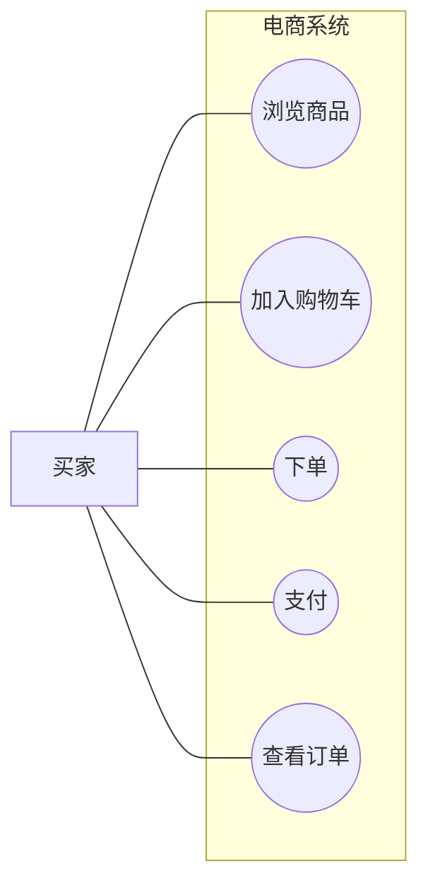
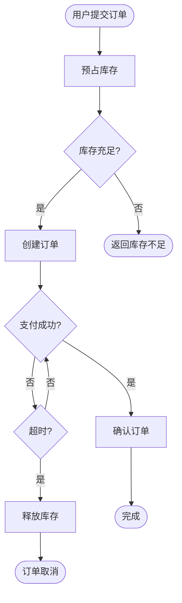
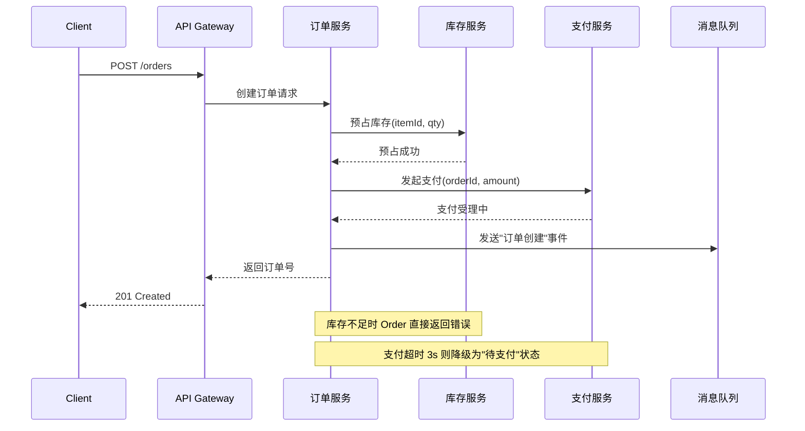
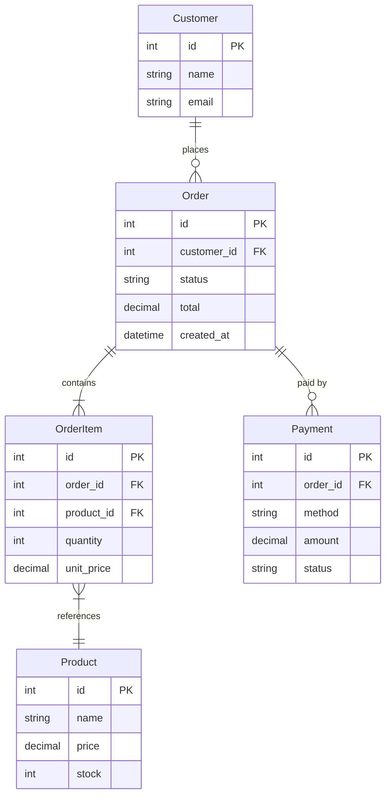
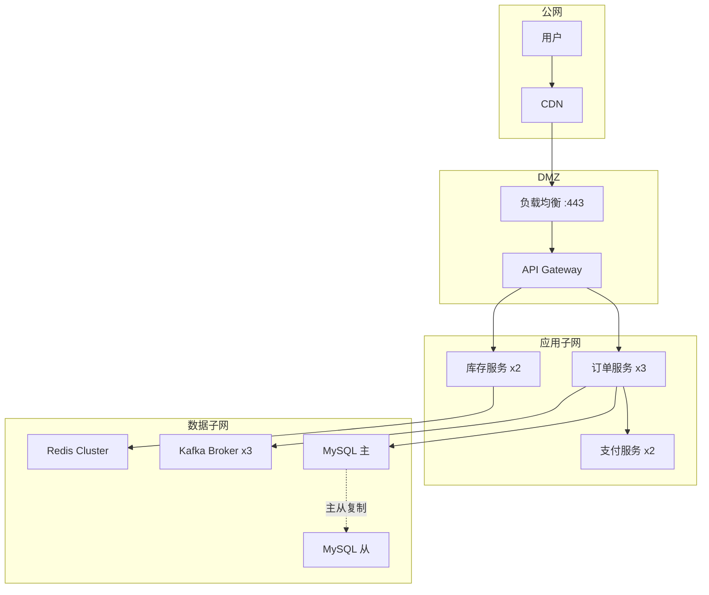
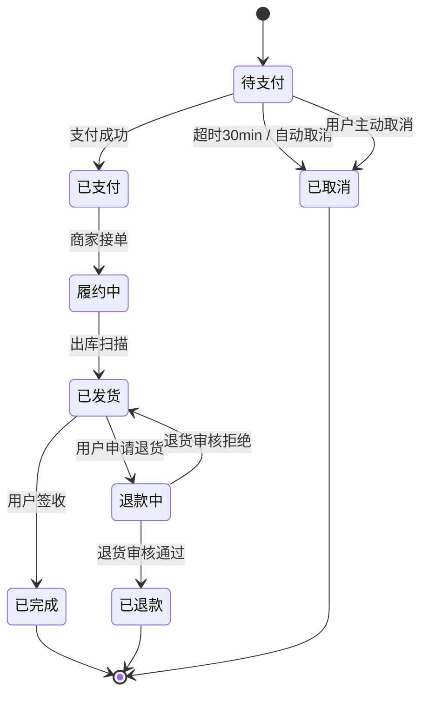

# 第 1 章 系统设计完全指南与技术方案方法论

> 从系统设计总论到技术方案落地，建立架构师的问题判断、方案表达与评审推进能力。

很多人把系统设计理解成“高并发组件大全”，或者把技术方案理解成“把接口、表结构和流程图拼在一起的文档”。这两种理解都抓住了一部分现实，但都不够完整。

系统设计真正关心的是：在业务目标、资源预算和风险约束下，如何做出一条可落地、可演进、可运维的系统路径。技术方案真正关心的是：如何把这条路径写成一份可评审、可执行、可复盘的设计文档，让不同角色都能基于同一份材料做判断和协作。

所以这一章不再把“系统设计通识”和“技术方案设计方法论”割裂开来，而是把它们放在同一个认知骨架里：

- **前半部分回答“系统设计到底在权衡什么”**
- **后半部分回答“架构师如何把这些权衡写成一份真实可执行的 TD”**

读完这一章，你应该至少能回答三件事：

- 系统设计不是背组件，而是做边界清晰的工程决策。
- 架构师写 TD 不是堆图和堆接口，而是把关键取舍显式化。
- 一份好的技术方案，既要让评审者看懂，也要让实现者、测试和运维真正能落地。

---

## 一、系统设计总论

### 1.1 系统设计的核心问题

系统设计并不是“把几个中间件背熟”，而是在给定业务目标、资源预算和风险约束下，设计一条可落地、可演进、可运维的系统路径。无论是做业务系统还是准备面试，真正反复出现的核心问题其实都很稳定：

- 系统要解决什么问题，成功指标是什么。
- 请求链路会经过哪些模块，哪里最容易成为瓶颈。
- 数据放在哪里，以什么方式读写、复制、缓存和恢复。
- 当流量上涨、依赖抖动、机器故障时，系统如何维持可接受的服务质量。
- 当成本、人力和交付时间有限时，哪些复杂度值得引入，哪些应该延后。

很多人把系统设计理解成“画一张架构图”。架构图当然重要，但它只是表达形式，不是设计本身。真正的设计工作包括问题定义、容量估算、模块划分、数据模型、一致性策略、容灾方案、可观测性，以及对各种取舍的显式说明。

如果把系统设计抽象成一句话，可以理解为：**围绕性能、容量、可靠性与成本，持续做出边界清晰的工程决策。**

### 1.2 性能、容量与成本的基本权衡

系统几乎不可能同时在所有维度上最优。多数设计问题，最后都落到性能、容量与成本三者之间的平衡。

#### 性能不是只看响应时间

性能通常至少包含两个维度：

- 延迟：单个请求从发起到完成需要多久。
- 吞吐：单位时间内系统能处理多少请求或任务。

低延迟并不等于高吞吐。一个同步串行、逻辑简单的服务可以把单次请求做得很快，但在高并发下很容易被线程、连接数或数据库写入能力卡住。反过来，批处理、异步削峰、顺序写磁盘等策略可能提升整体吞吐，却拉高了单次请求完成时间。

#### 容量估算决定方案上限

很多架构失误不是技术不会，而是没有先做数量级判断。至少要回答这些问题：

- 峰值 QPS 和平均 QPS 分别是多少。
- 读写比是多少，热点是否集中。
- 单条数据多大，按日、按月的增长量如何。
- 可接受的响应时间、失败率、恢复时间分别是多少。

例如，一个读多写少的商品详情系统，常见手段是缓存、读写分离、CDN 和多级副本；而一个写多且顺序性要求高的订单流水系统，就更关注数据库写入能力、消息队列削峰和分库分表策略。同样的“高并发”标签，背后对应的设计完全不同。

#### 成本不仅是机器费用

设计里最容易被低估的，是复杂度带来的隐性成本：

- 开发成本：系统越分散，联调、测试和发布成本越高。
- 运维成本：组件越多，监控、告警、升级、容灾演练越重。
- 认知成本：团队越难理解系统，越容易出现误用和故障。
- 迁移成本：未来替换存储、重构链路、扩容架构时的代价。

所以系统设计不是“配置越豪华越好”，而是“当前阶段最合适”。对小流量业务，上来就做多机房多活通常是不划算的；对资金交易、库存扣减等核心链路，过度节省又会把风险留到线上。

### 1.3 一致性、可用性与扩展性的取舍

分布式系统设计之所以难，是因为很多需求天然彼此拉扯。

#### 一致性与可用性

一旦进入副本复制、跨机房部署和异步链路，一致性就出现层次差异：

- 强一致性：适合金融交易、余额扣减、强约束库存。
- 最终一致性：适合评论计数、消息通知、搜索索引同步。
- 会话一致性或读己之写：适合用户中心、个人设置等体验敏感场景。

一致性要求越强，往往意味着写入路径更重、故障场景更复杂、可用性成本更高。相反，如果系统接受短暂不一致，就能利用缓存、异步复制、消息队列和多副本读扩展获得更好的可用性与吞吐。

#### 可扩展性不是简单“加机器”

扩展性至少分三类：

- 垂直扩展：升级单机 CPU、内存、磁盘。
- 水平扩展：增加实例、副本、分片。
- 功能扩展：在不推翻既有系统的前提下增加新能力。

水平扩展是互联网系统的主路线，但代价是系统从“本地调用”变成“远程协作”：需要负载均衡、服务发现、分布式缓存、消息重试、链路追踪、配置管理，以及对网络分区和局部失败的处理。

#### 常见权衡例子

| 场景 | 优先目标 | 常见手段 | 代价 |
| --- | --- | --- | --- |
| 商品详情、资讯流 | 可用性与读性能 | CDN、缓存、读写分离 | 可能读到旧数据 |
| 订单创建、支付扣减 | 一致性与正确性 | 事务、幂等、串行化关键写路径 | 吞吐更低，链路更重 |
| 日志采集、行为埋点 | 吞吐与扩展性 | 批量、异步、消息队列 | 端到端延迟更高 |
| 搜索与推荐 | 可扩展性与演进速度 | 索引异步构建、近实时更新 | 数据收敛有延迟 |

成熟的答案不是“既强一致又高可用还能无限扩容”，而是先确认业务优先级，再说明愿意牺牲什么、换来什么。

### 1.4 从单机到分布式的思维切换

系统设计能力真正的分水岭，在于能否完成从单机程序思维到分布式系统思维的转变。

在单机开发中，我们默认很多事情天然成立：

- 函数调用几乎总能立即返回。
- 内存共享简单直接。
- 时钟、状态和数据都集中在本地。
- 故障通常表现为进程退出，而不是链路局部异常。

这些默认前提一旦搬到分布式环境，大部分都失效了。进入分布式系统后，你必须默认以下事实：

- 网络不可靠，调用可能超时、重试、乱序、重复到达。
- 带宽有限，跨机房通信代价高于机房内调用。
- 节点会宕机，副本会延迟，拓扑会变化。
- 远程调用比本地调用慢几个数量级。
- 局部故障很常见，系统要学会降级而不是等全局恢复。

也正因为如此，系统设计会反复出现这些基础设施组件：DNS、负载均衡、反向代理、缓存、消息队列、服务发现、监控告警、链路追踪。它们本质上都是为了应对“单机默认成立、分布式默认不成立”的现实。

### 1.5 常见系统设计误区

#### 误区一：只背组件，不理解问题

把 MySQL、Redis、Kafka、Elasticsearch、Kubernetes 分别背得很熟，并不自动等于会做系统设计。组件只是手段，关键是知道为什么引入、什么时候不用、出现问题如何兜底。

#### 误区二：先讲方案，后补需求

很多设计讨论一开始就说“这里上 Redis、那里上 MQ”。如果需求边界、读写模型、容量目标都没澄清，方案几乎注定会跑偏。

#### 误区三：忽略数量级

“数据量很大”“流量很高”这种说法几乎没有工程价值。没有 QPS、峰值、存储增长、延迟目标，设计就是悬空的。

#### 误区四：过度追求完美架构

新业务起步阶段最需要的往往不是“终局架构”，而是足够稳定且便于迭代的起点。过早引入微服务、多活、复杂编排，常常会先把团队拖垮。

#### 误区五：只考虑正常流程，不考虑失败流程

一个设计如果没有回答超时、重试、幂等、限流、熔断、降级、回滚、监控这些问题，那它往往只能在 PPT 上运行。

#### 误区六：把面试答案讲成组件清单

好的系统设计表达不是罗列名词，而是沿着“需求 -> 估算 -> 方案 -> 取舍 -> 风险”的顺序推进，让听者知道你是在做工程决策，而不是在背模板。

### 1.6 系统设计总论小结

系统设计的核心不在于记住多少术语，而在于能否围绕业务目标做出清晰、可解释、可落地的工程选择。到这里先建立三个基本视角：

- 用性能、容量、成本一起看问题，而不是只盯单点优化。
- 用一致性、可用性、扩展性的冲突理解分布式设计的难点。
- 用分布式现实校正单机直觉，接受网络、节点和依赖都会失败。

但对架构师来说，这还不够。真正的挑战不是“想清楚”，而是“写清楚、讲清楚、推动落地”。这也是为什么懂系统设计，最后会自然过渡到会写技术方案。

---

## 二、技术方案设计方法论

### 2.1 为什么架构师必须会写 TD

很多技术方案质量不高，不是因为实现能力不足，而是因为问题定义模糊、边界不清、关键取舍没有显式化。一个成熟的架构师，不能只会想方案，还必须会把方案写成一份不同角色都能消费的 TD（Technical Design）。

一份好的 TD 至少承担五个作用：

- **对齐理解**：让业务、研发、测试、运维对目标和边界达成一致。
- **显式决策**：把关键取舍写出来，而不是藏在作者脑子里。
- **组织协作**：让跨团队依赖、前置条件、owner、上线顺序变得可讨论。
- **降低返工**：在实现前暴露问题，比上线后补锅便宜得多。
- **沉淀知识**：后续 review、复盘、交接、新人 onboarding 都能复用。

很多人把 TD 写成三种危险形态：

- **方案写成实施手册**：命令、SQL、接口、页面路径很多，但核心设计决策不清楚。
- **方案写成大纲汇总**：背景、目标、接口、排期都列了，但没有一条主链路和关键判断。
- **方案写成记录本**：会议纪要、争议点、草图、截图都堆在一起，读者无法快速定位“这份方案最终到底怎么定”。

架构师写 TD 的价值，不是文档漂亮，而是让评审者能在有限时间内看清楚：

- 这件事为什么值得做
- 这次到底怎么做
- 为什么这么做
- 哪些地方有风险
- 如果做坏了怎么退

### 2.2 需求澄清与问题定义

在进入方案设计前，至少要回答以下问题：

- 这个系统服务谁，核心使用场景是什么。
- 当前方案或旧系统的痛点是什么。
- 哪些指标是必须达成的，例如延迟、吞吐、稳定性、正确性。
- 哪些内容属于非目标，本期明确不做。
- 外部依赖有哪些，是否受别的团队、第三方服务或基础设施约束。

一个常见错误是把“背景”写成“解决方案摘要”。背景部分应该聚焦现状、问题和目标，而不是提前给出实现细节。否则评审者很难区分哪些是事实，哪些是方案假设。

#### 目标与非目标必须显式写

设计不是追求完美，而是追求平衡。把目标和非目标显式写出来，有两个好处：

- 帮助评审者理解你的取舍依据。
- 防止项目在推进过程中不断被隐性扩 scope。

例如，一个面向内部运营的报表系统，本期目标可能是“支持 T+1 数据更新、百人级并发查询、操作留痕”，非目标则可能包括“实时分析”“跨地域多活”“统一对外开放 API”。这些边界会直接影响存储、链路和投入方式。

### 2.3 容量估算与真实约束

好的方案不是从组件清单开始，而是从数字开始。数字不需要百分之百精确，但必须足够支撑决策。

#### 为什么容量估算是设计入口

容量估算回答的是两个问题：

- 方案大概要承受多大规模。
- 哪些约束会成为架构边界。

缺少数量级，很多讨论都会变成空话。比如“是否需要分库分表”“要不要上消息队列”“缓存层值不值得做”，都依赖数据规模与流量模型。

#### 至少要估哪些数字

常见估算维度包括：

- 请求量：平均 QPS、峰值 QPS、突发流量倍数。
- 数据量：单条大小、日增量、冷热分布、保留周期。
- 读写模型：读多写少、写多读少、是否存在热点。
- 时延目标：接口 RT、异步任务完成时间、批处理窗口。
- 可用性目标：SLA、可接受失败率、恢复时间目标。
- 外部约束：预算、人力、上线时间、合规、安全审计。

#### 识别真实约束，而不是理想约束

工程里最重要的约束往往不是技术本身，而是现实条件：

- 项目只有两周交付，意味着不能引入过多新基础设施。
- 团队没人维护分布式存储，意味着方案要优先复用成熟组件。
- 依赖下游 SLA 很弱，意味着要提前设计降级、重试和隔离。
- 数据涉及权限和审计，意味着安全、追踪和权限模型必须前置。

容量估算的意义，不只是为了“算多大”，更是为了知道系统最先会被什么限制住。

### 2.4 核心链路与职责拆解

当问题和约束清楚之后，才进入架构拆解。拆解的目标不是把图画复杂，而是把职责边界、调用方向和关键路径讲明白。

一个合格的高层设计，通常应该先回答：

- 系统由哪些核心模块组成。
- 请求从入口到结果返回，会经过哪些关键环节。
- 哪些模块在主链路上，哪些是异步旁路。
- 哪些依赖来自外部系统，失败时如何影响主流程。

#### 核心链路比全景图更重要

很多设计评审失败，不是因为没有覆盖面，而是没有突出核心链路。所谓核心链路，就是最能决定系统价值和风险的那条主路径。例如：

- 下单系统中的“校验库存 -> 扣减库存 -> 生成订单 -> 支付确认”
- 内容平台中的“写入内容 -> 审核 -> 建索引 -> 用户检索”
- 配置发布系统中的“冻结输入 -> 构建产物 -> 切换版本 -> 验证可读 -> 收敛状态”

如果核心链路没有讲清楚，后面的高可用、扩展性和风险管理就很难讨论扎实。

#### 职责拆解的最低要求

架构师至少要回答：

- 谁是入口方，谁是编排方，谁是状态拥有者。
- 谁负责写入真相源，谁负责投影、索引、缓存或通知。
- 哪些步骤必须同步完成，哪些允许异步收敛。
- 哪些模块承担主链路责任，哪些模块只是辅助能力。

### 2.5 数据流、状态流与边界划分

系统设计不只是模块设计，更是数据与状态的设计。模块边界一旦模糊，最终往往会在一致性、权限和故障恢复上出问题。

#### 数据流回答“信息怎么走”

设计数据流时，至少要说明：

- 数据从哪里来，由谁写入。
- 哪些服务读主库，哪些走缓存、副本或索引。
- 哪些数据需要同步返回，哪些允许异步收敛。
- 数据在不同存储之间如何复制、投递、校验和修复。

#### 状态流回答“系统怎么演进”

很多业务的复杂度不在 CRUD，而在状态机。订单、审批、履约、任务调度都属于典型状态驱动场景。设计时要明确：

- 系统有哪些核心状态。
- 状态转移由谁触发，是否允许回滚或补偿。
- 并发更新时如何防止状态错乱。
- 失败重试会不会造成重复执行。

#### 边界划分回答“谁负责什么”

边界划分的目标是高内聚、低耦合、隔离变化。可以借助这些原则检查设计：

- 一个模块的职责是否足够单一。
- 一个接口是否暴露了过多实现细节。
- 一个服务是否承担了本不属于它的状态管理责任。
- 未来变化最频繁的部分，是否被隔离到了独立边界内。

SOLID、正交性、高内聚、低耦合，本质上都在强调同一件事：系统应该把容易变化的部分隔离开，让稳定部分尽量少受影响。

### 2.6 一份好 TD 的 8 段式骨架

真实项目里，评审者很少有耐心跟着作者的思路一点点猜。你需要把最关键的信息按一种稳定顺序摆出来。实践中，我更推荐以下 8 段式骨架：

1. `Background / Objective / Scope`
2. `Current State / Problem Statement`
3. `Key Decisions`
4. `End-to-End Flow / Responsibility Split`
5. `API / Data Contract`
6. `Dependency / Rollout / Risk / Rollback`
7. `Open Questions / Assumptions`
8. `Work Breakdown / Owner / Timeline`

#### 为什么这 8 段是评审最关心的顺序

- 先看 **为什么做**，再看 **做什么**
- 先看 **问题是否成立**，再看 **方案是否合理**
- 先看 **关键取舍**，再看 **细节接口**
- 先看 **风险与 rollout**，再看 **排期和 owner**

这个顺序不是为了“写得规范”，而是为了降低评审摩擦。评审会上最常见的问题，本质上都在追问这 8 段里的某一段。

#### 每一段分别回答什么

**1. Background / Objective / Scope**

- 为什么现在要做这件事
- 成功标准是什么
- 本期明确不做什么

**2. Current State / Problem Statement**

- 当前系统或流程是什么样
- 痛点是实际存在的，还是假设出来的
- 如果不改会怎样

**3. Key Decisions**

- 这次最关键的 2-5 个设计决定是什么
- 候选方案有哪些
- 为什么选这个，不选那个
- 代价和 fallback 是什么

**4. End-to-End Flow / Responsibility Split**

- 从输入到输出，链路怎么走
- 哪个系统在什么步骤负责什么
- 同步 / 异步边界在哪里

**5. API / Data Contract**

- 请求、响应、事件、状态字段分别是什么意思
- 哪些字段是兼容新增，哪些字段会改变行为
- 幂等、顺序、版本、精度是否说清楚

**6. Dependency / Rollout / Risk / Rollback**

- 依赖谁
- blocker 是什么
- 上线顺序是什么
- 出问题怎么降级、怎么退

**7. Open Questions / Assumptions**

- 哪些问题还没定
- 哪些地方是在基于默认假设推进
- 哪些结论要等外部条件成立才有效

**8. Work Breakdown / Owner / Timeline**

- 工作怎么拆
- 谁负责
- 哪些步骤有先后依赖
- 如何判断“设计准备完成，可以进入实现”

### 2.7 关键设计决策怎么写

很多方案不是没列选项，而是没有把“决策标准”写清楚。结果读者看完知道有 A、B、C 三个方案，却不知道为什么最后选了 B。

一个合格的决策段落，至少要包含：

- 候选方案
- 选择结果
- 选择依据
- 明确代价
- fallback 或后续迁移路径

推荐写法：

```text
决策：发布链路采用“先冻结输入，再构建不可变产物，再切换版本指针”的状态机模型。

候选方案：
- 方案 A：直接同步覆盖多处存储
- 方案 B：引入 snapshot + task + pointer

选择依据：
- A 实现简单，但状态难以收敛，回滚困难
- B 增加模型复杂度，但能显式表达发布状态并支持补偿与回滚

代价：
- 需要新增状态表、补偿任务和观测指标

Fallback：
- 第一阶段只在试点配置上启用新状态机，其他配置维持旧路径
```

### 2.8 风险、依赖、灰度与回滚

很多文档前面分析得很好，到了 rollout 和 rollback 就开始写模板套话，这是最容易被架构评审打回来的地方。

#### 风险不是“列几个大词”

真正有价值的风险描述要回答：

- 风险是什么
- 何时会发生
- 影响范围是什么
- 如何发现
- 如何缓解
- 如果缓解失败，怎么回滚

#### 依赖必须集中表达

依赖和 blocker 不应散落在各章节里。建议统一收口：

- 依赖的系统 / 团队 / 第三方
- 当前状态
- 若依赖不满足，本方案会卡在哪
- 临时兜底方案是什么

#### rollout 必须能执行

上线方案至少要说清：

- 是一次性切换还是灰度放量
- 灰度维度是什么：用户、流量、市场、类目、开关
- 观测指标是什么
- 失败阈值是什么
- 谁负责拍板扩大或停止

#### rollback 必须能落地

回滚不是“有问题就回滚”这一句话，而是：

- 回滚对象是什么：版本、快照、开关、配置、数据批次
- 回滚动作由谁执行
- 回滚前需要检查什么
- 回滚后如何确认系统回到稳定态

### 2.9 方案评审与推进

一份技术方案写完并不代表工作结束。评审和风险管理，决定了方案能否真正落地。

#### 评审到底在评什么

评审不是挑文档格式，而是检查这几个层面：

- 问题定义是否准确，目标和非目标是否清晰。
- 方案是否能支撑容量、性能和稳定性目标。
- 关键取舍是否解释充分，是否讨论过替代方案。
- 风险是否被识别，是否有缓解和回滚措施。
- 任务拆分、排期和依赖是否现实。

#### 评审者视角不同，问题也不同

- **业务 / 产品**：目标是否清楚，边界是否合理
- **架构师**：关键决策是否站得住，tradeoff 是否充分
- **实现者**：职责、链路、接口、状态是否足够明确
- **运维 / 稳定性角色**：灰度、监控、回滚、人工介入是否准备好

如果作者自己没有带着这四种视角审一遍，评审会上通常会被打得很散。

### 2.10 高质量 TD 的常见反模式

结合真实项目 review，最常见的高频失败模式有这些：

- **方案写成实施手册**：命令、表结构、接口细节很多，但缺少主设计决策。
- **选项列了但没有决策标准**：A/B 方案并列展示，却没有说明为什么选这个。
- **字段语义不统一**：金额、状态、快照、版本等核心字段在不同章节含义漂移。
- **依赖和 blocker 散落在正文里**：读者要靠自己拼图。
- **rollout 和 rollback 只有模板占位**：看起来写了，实际上不可执行。
- **开放问题没有显式出口**：真正没定的内容被埋在自然语言里。
- **设计与运行手册混写**：评审想看系统行为，却被后台操作步骤淹没。

评审时，真正值得优先指出的，永远是这些结构性问题，而不是措辞或排版。

### 2.11 TD 模板、AI Skill 与方法论沉淀

方法论最终不能只停留在脑子里。一个成熟团队通常会把它沉淀成三类工件：

- **TD 模板**：统一结构，让作者少走弯路
- **Review Checklist**：统一审查口径，让评审少遗漏关键风险
- **AI Skill / 写作助手**：把结构化 author/review 工作流自动化，降低表达成本

例如一个公开版的 `td-writing-review` skill，可以服务三类输入：

- 技术方案草稿
- 需求摘要 / 会议纪要
- 已完成但结构混乱的设计文档

它的价值不在于“帮你润色”，而在于：

- author 模式先帮助作者收敛 **Top Decisions**
- review 模式先暴露 **决策缺口、风险缺口、责任缺口**
- 统一作者、评审者和实现者对一份 TD 的阅读顺序

从这个角度看，书里的方法论回答“为什么这样写”，skill 回答“如何把它操作化”。两者不是替代关系，而是同一套认知的不同形态。

### 2.12 技术方案方法论小结

技术方案设计的本质，是把一个模糊问题逐步收敛为一套可评审、可实施、可演进的工程决策。本部分的方法论可以压缩为一条主线：

1. 先澄清问题与边界，再谈方案。
2. 先用数据识别容量与约束，再谈组件选型。
3. 先讲核心链路、数据流和状态流，再补充横切能力。
4. 再用 8 段式骨架把关键信息按评审顺序摆出来。
5. 最后用评审、风险、灰度和回滚把方案从“想法”变成“工程计划”。

---


## 三、软件工程绘图完全指南

从系统设计与 TD 方法论继续往前走，架构师还必须掌握另一项核心表达能力：把抽象的边界、链路、状态与决策画成不同角色都能快速理解的图。下面这部分内容整体保留原有写法，只调整标题层级，把它作为第 1 章的第三部分。

> 从图种基础到架构心法，建立软件工程师的绘图全栈能力。


### 3.1 软件工程绘图全景

#### 3.1.1 画图是工程师的"第二语言"

写代码是对机器的表达，画图是对人的表达。一个只会写代码但不擅长画图的工程师，面对跨团队协作、技术评审、向上汇报时，沟通成本会指数级上升。

反过来说，一张好图能在 3 分钟内讲清 30 分钟白板都讲不清的事。这不是天赋，是技能——可以学，也必须学。

#### 3.1.2 图的四象限分类体系

软件工程中需要画的图，可以归入四个维度。先建立这个分类框架，后面每学一种图种，都能找到它在框架中的位置：

| 维度 | 核心问题 | 典型图种 |
|------|---------|---------|
| **结构图** | 系统"有什么"？模块怎么划分？ | 类图、ER 图、包图、组件图、部署图 |
| **行为图** | 系统"怎么动"？数据怎么流转？ | 时序图、活动图、状态图、流程图 |
| **交互图** | "谁调了谁"？依赖方向是什么？ | 组件图、集成图、数据流图 |
| **物理图** | "跑在哪里"？机器怎么连？ | 部署拓扑图、网络拓扑图 |

简单记忆：**结构图看盒子，行为图看时间线，交互图看箭头方向，物理图看机器。**

#### 3.1.3 图种误用的三种典型反模式

在进入具体画法之前，先看看最常见的三种"画错图"：

**反模式一：用技术架构图向老板汇报。** 框图里塞满 Kafka、Redis、Saga、DLQ，老板只想知道"你的系统能支撑什么业务，边界在哪"。结果：老板迷失，方案被否。

**反模式二：画时序图不标注异常路径。** 大多数时序图只画"正常流程"——A 调 B，B 调 C，返回 OK。真实系统里，超时怎么办？重试几次？降级到哪个兜底逻辑？不标注这些的时序图，等于没画。

**反模式三：用一张图解释一切。** 试图在一张图里塞进业务架构、技术架构、部署架构、数据流。结果所有人都不满意。**一张图只解决一个视角的问题。**

#### 3.1.4 场景 → 图种速查表

遇到以下场景，查这张表就知道该画什么：

| 场景 | 首选图种 | 配合图种 |
|------|---------|---------|
| 需求澄清 & 用户故事 | 用例图 | 活动图（描述主流程） |
| 业务流程梳理 | 流程图 / 活动图 | 状态图（关键对象） |
| 接口设计 & 调用链 | 时序图 | — |
| 数据模型设计 | ER 图 | 类图（面向对象项目） |
| 领域建模（DDD） | 限界上下文图 | 时序图（验证依赖方向） |
| 架构评审（技术） | 技术治理图 + 核心时序图 | 部署拓扑图 |
| 架构评审（业务） | 全景功能架构图 | — |
| 故障复盘 | 故障传播时序图 | 恢复流程图 |
| 新人 Onboarding | 系统全景图 + 部署拓扑图 | 核心链路时序图 |
| 技术方案文档 | 4+1 视图套件 | — |

---

### 3.2 图种实战手册

每种图按统一模板讲解：**一句话定义 → 何时用 → 核心要素 → 画法步骤 → 常见错误 → Mermaid 模板**。

#### 3.2.1 用例图（Use Case Diagram）

**一句话定义**：描述"谁"（Actor）能用系统"做什么"（Use Case）。

**何时用**：
- 项目启动阶段，与产品/业务方对齐功能范围
- 梳理用户角色及其可操作的功能边界
- 新人快速理解系统对外提供的能力清单

**核心要素**：
- **Actor（参与者）**：人形图标，代表用户角色或外部系统
- **Use Case（用例）**：椭圆，代表一个功能目标
- **系统边界**：矩形框，框住所有用例，表示系统范围
- **关联线**：连接 Actor 和 Use Case

**画法步骤**：
1. 确定系统边界——画一个矩形框，写上系统名称
2. 列出所有 Actor（用户角色、外部系统）——画在框外
3. 对每个 Actor，列出它触发的用例（动词+名词，如"下单""查看订单"）——画在框内
4. 连线：Actor 到用例

**常见错误**：
- 把用例拆得太细（"输入用户名""输入密码""点击登录"不是用例，应以用户目标为单位）
- 用例之间用箭头连线形成"流程图"（用例图只表达功能包含关系，不表达先后顺序）
- 在用例图上标注技术细节（如"调用 Redis 缓存"）

**Mermaid 模板**：



#### 3.2.2 流程图 & 活动图（Flowchart & Activity Diagram）

**一句话定义**：描述一个业务流程或算法中"先做什么、判断什么、再做什么"的执行顺序。

**何时用**：
- 梳理业务流程（如订单状态流转、退款审批）
- 描述算法逻辑（分治、回溯、状态机）
- 对账、补偿、异常处理流程

**核心要素**：
- **开始/结束节点**：圆角矩形或椭圆
- **处理步骤**：矩形
- **判断节点**：菱形（一个入口，至少两个出口，标注判定条件）
- **流向箭头**：连接各节点

**画法步骤**：
1. 确定起点和终点
2. 梳理"主执行轴"——正常流程走完的 5-8 个核心节点
3. 在每个判断节点处，画出分支（是/否，成功/失败）
4. 补充分支的汇合点（分支最终要去哪）
5. 对异常分支特别标注（超时、重试、降级）

**常见错误**：
- 主流程和异常流程混在一起，分不清楚"正常路径"和"兜底路径"
- 判断节点只画出口不标条件（菱形两条线出去，没写"是/否"）
- 流程线交叉缠绕（必要时应拆分或使用子流程）

**Mermaid 模板**：



#### 3.2.3 时序图（Sequence Diagram）

**一句话定义**：描述一次请求中，多个参与者（服务、模块、组件）之间按时间顺序发生的消息交互。

**何时用**：
- 接口设计：描述一次 API 调用涉及哪些服务及调用顺序
- 技术评审：展示核心链路的数据流转
- 故障排查：还原故障发生时的调用链
- 方案对比：展示重构前后调用链的变化

**核心要素**：
- **生命线（Lifeline）**：每个参与者一条垂直虚线，从上到下表示时间推进
- **激活条（Activation Bar）**：生命线上的矩形，表示该参与者正在处理请求
- **消息（Message）**：水平箭头，表示调用/返回
- **自调用（Self Message）**：指向自己的箭头

**画法步骤**：
1. 列出参与交互的所有角色（服务、模块、数据库、消息队列等）
2. 从左到右排列参与者（按调用顺序：调用方在左，被调用方在右）
3. 沿时间线，逐条画出消息交互（每一条线就是一个 RPC/HTTP/MQ 消息）
4. 标注关键参数和返回值
5. **重点：标注异常分支**——超时、重试、降级、熔断

**常见错误**：
- 只画正常流程，不画异常路径（超时怎么办？依赖挂了怎么办？）
- 参与者太多（超过 6-7 个时应考虑抽象或拆分为多张图）
- 忘记标注同步/异步（实线箭头=同步，虚线箭头=异步返回）
- 激活条缺失或长度不对（应精确表示处理开始和结束的时间）

**Mermaid 模板**：



#### 3.2.4 类图 & ER 图（Class Diagram & ER Diagram）

**一句话定义**：类图描述代码层面的类、接口及其关系；ER 图描述数据库层面的实体、属性和关系。两者都是"结构建模"的核心工具，但面向不同层级。

**何时用**：
- 类图：面向对象设计、代码评审、设计模式沟通
- ER 图：数据库建模、表结构设计、数据治理

**核心要素（类图）**：
- **类**：三层矩形（类名 / 属性 / 方法）
- **关系**：继承（空心三角实线）、实现（空心三角虚线）、关联（实线箭头）、聚合（空心菱形）、组合（实心菱形）、依赖（虚线箭头）
- **多重性**：1、0..1、1..\*、\*

**核心要素（ER 图）**：
- **实体**：矩形（表名）
- **属性**：椭圆或列表（列名 + 类型）
- **关系**：菱形或连线（1:1、1:N、N:M）
- **主键/外键**：下划线或 PK/FK 标注

**画法步骤**：
1. 识别核心实体/类（先列出来，不连线）
2. 标注每个实体/类的关键属性（3-5 个，不是全部）
3. 确定关系类型（"一个订单包含多个订单项"→ 1:N）
4. 连线并标注多重性
5. 检查：能否用这张图回答"某个查询要 join 哪些表"？

**常见错误**：
- 把类图画成"所有属性和方法的大全"（类图应高亮关键结构和关系，不是代码镜像）
- ER 图中所有关系都用 N:M（实际大部分可以化简为 1:N）
- 遗漏外键或关联条件标注
- 类图和 ER 图画成同一张图（混用会导致抽象层次混乱）

**Mermaid 模板（ER 图）**：



#### 3.2.5 部署图 & 拓扑图（Deployment Diagram & Topology Diagram）

**一句话定义**：描述系统的物理部署形态——哪些服务跑在哪些节点上，节点之间通过什么网络协议通信。

**何时用**：
- 技术评审：说明系统如何部署、是否高可用
- 运维交接：让运维团队理解服务分布和依赖
- 容量规划：展示各节点的资源规格和扩缩容策略
- 安全审计：标明网络区域、防火墙、加密边界

**核心要素**：
- **节点（Node）**：物理/虚拟机器、容器、Pod
- **组件（Component）**：跑在节点上的服务/进程
- **通信路径**：节点间的连线（标注协议和端口，如 `HTTPS:443`、`gRPC:9090`）
- **网络区域**：用不同颜色或边界线区分（公网/DMZ/内网/数据库子网）

**画法步骤**：
1. 划分网络区域（公有云区域、VPC、子网）
2. 画出各区域的节点（标注机型、核心数、内存）
3. 在节点上放置服务组件
4. 连线并标注协议、端口、是否加密
5. 标注高可用特性（多 AZ、主从、集群）

**常见错误**：
- 物理节点和逻辑服务混在一张图（应将部署图和组件图分开）
- 忽略网络区域划分（所有节点放在一起，没有安全边界意识）
- 不标注端口和协议（运维无法据此配置防火墙规则）

**Mermaid 模板**：



#### 3.2.6 状态图（State Diagram）

**一句话定义**：描述一个对象或系统从创建到消亡的完整生命周期，以及在什么事件触发下发生状态转移。

**何时用**：
- 订单、支付、审批等有明确状态机的业务对象
- 设计状态机实现前，先画状态图与产品确认
- 排查"为什么订单卡在待支付状态不动了"之类的问题

**核心要素**：
- **状态节点**：圆角矩形，表示对象在某一时刻的状态
- **转移箭头**：标注 `事件 [守卫条件] / 动作`
- **初始状态**：实心圆
- **终态**：实心圆 + 外圈

**画法步骤**：
1. 画出初始状态（对象被创建时的状态）
2. 逐个添加"可能到达的状态"节点
3. 在每个转移箭头上标注"什么事件触发"+"什么条件"+"执行什么动作"
4. 检查每个状态是否都有"出边"（除了终态）——确保没有"死状态"
5. 与产品/业务方逐条确认状态流转逻辑

**常见错误**：
- 只画主流程状态，遗漏异常状态（退款中、已取消、已超时）
- 转移条件不写清楚（"支付成功" vs "支付超时" vs "支付失败"是不同的转移）
- 一个状态图塞进多个对象的生命周期

**Mermaid 模板**：



---

### 3.3 架构图的黄金法则

掌握了基础图种之后，进入架构师层面的进阶话题：**如何用图推动决策、争取资源、对齐团队**。

#### 3.3.1 铁律一：视图分离——看人下菜，明确沟通对象

**核心原则**：没有一张架构图能讲清楚所有事情。面向不同的听众，必须切换不同的视觉语言。

#### 第一类听众：高层 / 产品 / 业务（战略宣讲）

**关注点**：系统能支撑什么？业务资产怎么划分？团队边界在哪？

**对应图种**：全景功能架构图。

**画法**：
- 横向分层（用户层、能力层、底层核心），纵向分域（如将大盘划分为"稳健供给"与"炽烈运营"）
- 方框里只写业务能力名称，不出现任何技术术语
- 用颜色区分自研（核心域）、外采（支撑域）、外包（通用域）

**禁忌**：绝对不要出现 Kafka、Redis、Saga、ACL 等底层技术名词。听众会在 10 秒内失去兴趣。

#### 第二类听众：架构师 / 核心开发 / 测试（技术评审）

**关注点**：数据怎么进？怎么保证不丢？挂了怎么兜底？

**对应图种**：流式技术治理图 + 核心链路时序图。

**画法**：
- 强烈的 Pipeline 推进感（分阶段流水线），粗线条高亮"黄金主执行轴"
- 必须挂载横向的治理层（分布式事务、防资损）、设施层与 SRE 保障层（熔断限流、DLQ 死信队列）
- 时序图必须标注异常路径：超时时间、重试次数、降级策略

**禁忌**：不要只画"理想状态下的正常流程"——评审的核心价值恰在于挑战你的异常处理。

#### 第三类听众：组织架构 / 核心开发（DDD 落地）

**关注点**：谁听谁的？依赖方向是什么？防腐层在哪？

**对应图种**：限界上下文图（Context Map）。

**画法**：
- 只画限界上下文的"圈子"和显式连线
- 连线标注关系类型：ACL（防腐层）、Hydrate（灌注）、Domain Event（领域事件）、Upstream/Downstream
- 圈的大小可以暗示职责轻重（核心域画大一点）

**禁忌**：不要在 DDD 图上画技术实现细节——这是战略设计图，不是战术设计图。

#### 3.3.2 铁律二：动态与静态结合，不要画"死图"

很多架构图画完就像一张安静的"功能方块阵列"，看图的人完全不知道系统在真实运转时会发生什么。

**静态定边界（方块）**：方块的作用仅仅是定义"职责与高内聚的限界"。例如商品中心、计价中心，它们是一个静态的盒子——盒子内部你可以再画一张图去展开。

**动态拉主轴（连线/流水线）**：必须引入"时间线/生命周期"来激活静态图。

做法一：像流式治理图一样，顶部拉出 `1 → 2 → 3 → 4 → 5` 的数据流向阶段。

做法二：在静态图的底部，加一条带箭头的横向长条，写明核心交易生命周期（如：预览 → 试算 → 下单 → 履约 → 对账），并用虚线与上方的功能方块关联，表明"在下单阶段，交易中心会调用计价中心的哪个网关"。

**核心技巧**：静态盒子定义"谁是谁"，动态时间线回答"然后呢"。两者都画清楚，读者才能真正理解系统。

#### 3.3.3 铁律三：在图上明确表达架构决策

好的架构图不只是画出方块，它是在画出你的**架构决策**。

#### 表达"收敛态势"

如果你在推动某个核心模块的收敛（如统一计价中心、统一用户中心），不要把它缩在角落。**把它放在图的核心中枢或公共腰带位置**，让上游的各个模块形成"向心力"向它收敛，而它向下游发起调用。可视化本身就是说服力。

#### 表达"防腐与隔离（ACL）"

在对接外部系统或脏数据源时，图上必须显式画出一个隔离带（防腐层）。例如：供给中心接进来的三方脏数据，必须经过清洗、标准化映射（Normalize）后才能进入纯净的主数据中心。这在图上要用**颜色或虚线框**明确标出——"这是脏数据暂存区，这是纯净的标准域"。

#### 表达"容错与补偿（降级兜底）"

一个合格的战术架构图，必须在底层标出 Saga 逆向补偿、DLQ 死信队列、人工修复工作台和降级策略。例如在图注或连线旁写上一行小字："当营销中心发生熔断时，计价中心降级为仅计算商品原价"。这能证明你的方案不是空中楼阁，而是具备线上生产力保障的。

#### 3.3.4 架构图的演进：从概念到落地

一张好图会在项目的不同阶段"长"出不同的形态：

| 阶段 | 图的形态 | 特征 |
|------|---------|------|
| **POC/预研** | 概念草图 | 只有大块服务和大致数据流，方块少连线粗，表达"这个方向可行" |
| **详细设计** | 战术行军图 | 细化每个节点的内部结构，标注接口、协议、异常路径 |
| **上线后** | 实况图 | 补上实际部署后的拓扑、监控埋点、容灾切换路径 |

**关键实践**：将图源文件（如 `.drawio`、`.excalidraw`）纳入 Git 管理，与设计文档放在同一目录。每次架构变更时，同时更新图和文档。**图文不一致的架构文档，比没有文档更危险。**

#### 3.3.5 在架构图中表达非功能性需求

非功能性需求（性能、可用性、安全、成本）往往是评审的核心关注点，但大部分架构图中它们完全缺席。以下是在图中表达它们的技巧：

- **性能**：在关键调用连线上标注 `P99 < 50ms` 或 `QPS 峰值 5000`
- **可用性**：用虚线画出故障切换路径（主库 → 从库的箭头），标注 `RTO < 5min`
- **安全性**：用锁图标或颜色标记加密通信（mTLS）、敏感数据存储（加密列）
- **容量**：在服务节点上标注资源规格（`4C8G × 3，峰值 QPS 2000`）
- **成本**：在技术栈旁边标注大致的成本估算（如"Redis Cluster 32G 约 ¥3000/月"）

---

### 3.4 按场景组合出招

技能学了，图种会了，心法懂了。但面对真实工作场景，真正的问题变成：**这次我到底该画哪几张图？**

以下六种常见场景的组合策略，直接可用。

#### 3.4.1 向上汇报：让老板一眼看懂

**场景**：向 CTO/VP/业务负责人汇报新系统方案或重构计划。

**核心目标**：让对方在 1 分钟内理解"这个系统能支撑什么业务、边界在哪、为什么值得做"。

**图件组合**：
- **1 张全景功能架构图**：横向分层（用户层→能力层→核心层），纵向分域（按业务能力划分）。只写业务名词，不出现技术组件。
- **可选：1 张"改造前后对比"简化图**：左边画当前痛点（箭头散乱、重复建设），右边画改造后（统一收敛、边界清晰）。

**注意**：不要画时序图、不要画部署图。这些是技术评审用的，在上层汇报中只会分散注意力。

#### 3.4.2 技术评审：经得起挑战的方案

**场景**：向架构师委员会/核心开发团队/测试团队做方案评审。

**核心目标**：证明方案在正常流程、异常流程、高并发、故障恢复四个维度都经得起推敲。

**图件组合**：
- **1 张技术治理图**：Pipeline 式的主执行轴 + 横向治理层（事务、防资损、SRE 保障）
- **1-2 张核心链路时序图**：展示最关键的 1-2 条链路的完整调用链，标注异常路径
- **1 张对账与补偿流程图**：如果涉及资金/库存，必须画出对账流程和异常补偿流程
- **1 张部署拓扑图**：展示多 AZ 部署、主从架构、容灾切换

#### 3.4.3 领域建模：让 DDD 落地

**场景**：团队进行领域驱动设计（DDD）的战略设计阶段，需要对齐领域边界和依赖关系。

**核心目标**：让所有人对"哪个上下文负责什么"和"上下文之间怎么协作"达成共识。

**图件组合**：
- **1 张限界上下文图（Context Map）**：圈出每个限界上下文，标注关系（ACL / 领域事件 / 上下游）
- **2-3 张关键场景的时序图**：选最复杂的 2-3 个跨上下文协作场景画时序图，验证依赖方向是否合理（核心域不应该依赖通用域）
- **可选：每个核心上下文的内部类图**：只在代码实现前画

#### 3.4.4 故障复盘：讲清楚"发生了什么"

**场景**：线上故障后的复盘会议，需要还原故障过程、分析根因、提出改进措施。

**核心目标**：让所有参与者（开发/运维/产品/管理者）对故障全貌有一致理解。

**图件组合**：
- **1 张故障传播时序图**：关键——用红色标记故障起点和传播路径，标出每个节点响应时间的变化（正常 50ms → 超时 3000ms），标出熔断和降级的触发点
- **1 张恢复流程图**：描述故障发生后人工介入的完整过程（谁发现了→怎么定位→什么操作→怎么确认恢复）
- **1 张改进措施对照表**：左列问题根因，右列改进措施及负责人，附上预计完成时间

#### 3.4.5 新人 Onboarding：最快的上手路径

**场景**：新同事入职，需要在最短时间内理解系统全貌和核心工作流。

**核心目标**：先给全景，再给抓手，让新人知道"出了问题去哪看、找谁"。

**图件组合**：
- **1 张系统全景图**：展示所有服务/模块及其职责的一句话描述，不展开内部细节
- **1 张核心链路时序图**：展示"一次用户请求从进入到返回"的完整路径，这是新人理解系统运行方式的最佳入口
- **1 张部署拓扑图**：标注各个环境的访问地址、日志查看方式、监控大盘链接
- **可选：团队与系统对照表**：每个系统/模块对应的 Owner 团队，让新人知道找谁

#### 3.4.6 写设计文档：标准图件套件

**场景**：正式的技术方案文档，需要覆盖多个视角。

**核心目标**：让阅读者从逻辑、进程、物理、开发四个视角完整理解方案。这里借鉴"4+1 视图"的思想：

| 视角 | 对应图种 | 回答的问题 |
|------|---------|----------|
| **逻辑视图** | 类图 / 包图 / 模块图 | 代码怎么组织的？模块怎么划分？ |
| **进程视图** | 时序图 / 活动图 | 运行时怎么协作？数据怎么流转？ |
| **物理视图** | 部署图 / 拓扑图 | 服务跑在哪？怎么容灾？ |
| **开发视图** | 组件图 / 分层图 | 代码仓库怎么拆分？模块间依赖？ |
| **场景视图** | 用例图 + 核心时序图 | 关键业务场景怎么贯穿各层？ |

注意：不是每次都要画满 4+1。小需求 2-3 张图足够，大型项目按需补齐。

---

### 3.5 工具与视觉规范

#### 3.5.1 工具矩阵对比

没有"最好的绘图工具"，只有"最适合你场景的工具"。以下是按六个维度对主流工具的对比：

| 工具 | 架构图 | UML 标准 | 时序图 | ER 图 | 团队协作 | Git 友好 | 适用人群 |
|------|--------|---------|--------|-------|---------|---------|---------|
| **Draw.io** | ⭐⭐⭐ | ⭐⭐⭐ | ⭐⭐ | ⭐⭐⭐ | ⭐⭐ | ⭐⭐（XML 文件） | 全能型，免费 |
| **Excalidraw** | ⭐⭐⭐ | ⭐（无标准 UML） | ⭐⭐ | ⭐ | ⭐⭐ | ⭐⭐⭐（JSON 文件） | 手绘风格，适合快速表达想法 |
| **PlantUML** | ⭐⭐ | ⭐⭐⭐ | ⭐⭐⭐ | ⭐⭐⭐ | ⭐⭐⭐（纯文本协作） | ⭐⭐⭐（文本 diff） | 代码驱动，CI 友好 |
| **Mermaid** | ⭐⭐ | ⭐⭐ | ⭐⭐⭐ | ⭐⭐⭐ | ⭐⭐⭐（Markdown 原生） | ⭐⭐⭐（内嵌 Markdown） | GitHub/GitLab 原生渲染 |
| **Figma/FigJam** | ⭐⭐ | ⭐ | ⭐ | ⭐ | ⭐⭐⭐ | ⭐（二进制文件） | 设计师协作 |
| **ProcessOn** | ⭐⭐⭐ | ⭐⭐ | ⭐⭐ | ⭐⭐ | ⭐⭐⭐（在线协作） | ⭐ | 国内团队，快速上手 |
| **Lucidchart** | ⭐⭐⭐ | ⭐⭐⭐ | ⭐⭐ | ⭐⭐⭐ | ⭐⭐⭐ | ⭐ | 企业级，付费 |

**选购建议**：
- **个人学习 / 博客配图**：Mermaid（直接写在 Markdown 里）或 Excalidraw（快速画草图）
- **团队协作 / 设计文档**：Draw.io + Git 管理源文件
- **CI/CD 集成 / 自动化文档**：PlantUML 或 Mermaid
- **正式架构评审**：Draw.io 或 ProcessOn（视觉效果更好）

#### 3.5.2 大厂视觉规范：让你的图具备技术高级感

##### 3.5.2.1 三色原则

全图的主色调控制在 **3 种以内**。大厂常用配色：

- **浅蓝**：通用域 / 基础能力（消息队列、网关、监控）
- **浅绿**：支撑域 / 适度定制（运营后台、配置中心）
- **浅橙 / 浅红**：核心域 / 重点自研（业务核心链路，如计价、交易）

不要把图画成彩虹——颜色越多，视觉权重越分散，信息的层级感越弱。

##### 3.5.2.2 粗细线条区分主次

- **普通服务间调用**：最细的灰色线条（`#999`, 1px）
- **核心主执行轴**：粗彩色线条（3-4px 明蓝或橙色），横向贯穿全图
- **异常/降级路径**：虚线
- 在主轴下方配一行小字手写体注脚，例如：`supplier_sync → mapping_normalize → product_sku`

##### 3.5.2.3 图例说明（Legend）是强制项

图的右上角或右下角，必须放一个干净的**图例说明框**。至少标出：
- 每种颜色的含义（核心域 / 支撑域 / 通用域）
- 每种线型的含义（同步调用 / 异步消息 / 降级路径）
- 特殊符号的含义（锁=加密、盾牌=安全边界）

##### 3.5.2.4 标注让图从"好看"变成"有用"

- 在关键连线旁标注接口名或事件名（如 `OrderCreated` 而不是"发消息"）
- 在服务节点标注 QPS 峰值或资源规格
- 在数据库旁标注容量（如 `500GB, QPS 3000`）

#### 3.5.3 代码即图：Mermaid & PlantUML 的工程优势

传统拖拽式绘图的问题是：改一张图要重新打开工具、拖拽、对齐、导出、替换。而代码驱动的绘图方案有三大工程优势：

**优势一：Git Diff 友好。** 图的变更是纯文本，Code Review 时能精确看到"哪条连线被改了"。

**优势二：CI 可检查。** 可以在 CI 流水线中渲染验证，图挂了构建就报错。

**优势三：复用与模板化。** 团队的公共组件可以抽象成模板，新人复制模板改节点名即可，不需要从头学习工具操作。

**核心原则**：代码驱动画"规范型"的图（时序图、ER 图、状态图，这些有严格语法），拖拽工具画"表达型"的图（架构图、全景图，这些需要自由排布视觉权重）。

#### 3.5.4 版本管理与团队协作

**图源文件管理策略**：
```
docs/
├── design-doc.md
├── diagrams/
│   ├── architecture.drawio          # 架构图源文件
│   ├── order-sequence.md            # Mermaid 源码（嵌入文档或独立存放）
│   └── er-diagram.puml              # PlantUML 源文件
```

**图文一致性检查清单**：
1. 代码接口变了 → 时序图更新了吗？
2. 新加了服务 → 架构图更新了吗？
3. 改了数据库 Schema → ER 图更新了吗？
4. 调整了依赖方向 → 限界上下文图更新了吗？

**团队图库建设**：建立团队的"图模板库"（Excalidraw 的 Library 功能），包含：标准服务节点样式、标准连线样式、标准网络区域模板、标准图例框。所有人从模板出发，视觉语言自然统一。

---

### 3.6 总结

#### 3.6.1 软件工程绘图的三个层次

```
        ┌───────────────────────────┐
        │  层次三：架构决策的表达    │  ← 第三、四章
        │  图是你的说服力和领导力    │
        ├───────────────────────────┤
        │  层次二：图种的选择与组合  │  ← 第二章
        │  知道什么场景画什么图      │
        ├───────────────────────────┤
        │  层次一：图种的画法基本功  │  ← 第二章
        │  掌握每类图的核心要素      │
        └───────────────────────────┘
```

**最核心的一句话**：画图之前先想听众，定义好边界再连线，用动态主轴激活静态方块，用底层底座展现高可用防线，用异常路径证明你的方案经过深思熟虑。

**最后的建议**：把画图当成和写代码同等重要的技能来刻意练习。每次写设计文档时，问自己：如果只能放三张图，我选哪三张？每张图要回答的**那一个问题**是什么？图上的每一根线、每一个字，都应该是答案的一部分。

## 四、本章小结

这一章前半部分讲的是系统设计的判断框架，后半部分讲的是技术方案的表达与推进方法。两部分看似不同，本质上是在回答同一个问题：

> **架构师如何在现实约束下，把复杂问题做成一套可落地、可协作、可复盘的工程决策。**

如果只懂前半部分，你可能能想清楚问题，却很难推动团队按同一套理解落地；如果只会后半部分，你可能能写出格式完整的 TD，却缺少真正的系统设计判断力。

所以真正成熟的能力不是“会画图”“会写接口”“会背组件”，而是：

- 能定义问题
- 能识别约束
- 能做关键取舍
- 能把取舍写清楚
- 能带着评审视角推进方案落地

后续章节会继续展开：

- 本章第三部分：软件工程绘图完全指南
- 第 3 章：架构师的武器库
- 第 4 章：编码原则与设计模式

---

## 五、本章面试题与追问

1. 什么是系统设计？系统设计面试到底在考什么？
   追问：你会如何区分“会用组件”和“有设计能力”？
2. 为什么系统设计里一定要先做容量估算？
   追问：如果没有精确数据，你会如何给出合理区间？
3. 高并发系统为什么不能只靠加机器解决？
   追问：哪些瓶颈是水平扩展也解决不了的？
4. 强一致性和最终一致性分别适合哪些业务？
   追问：订单、评论数、搜索索引分别怎么选，为什么？
5. 为什么说可扩展性会带来复杂度？
   追问：从单体走向微服务后，通常新增了哪些治理问题？
6. Redis、Kafka、MySQL 在系统设计里分别解决什么类型的问题？
   追问：什么时候不该引入它们？
7. 为什么分布式系统必须重视超时、重试和幂等？
   追问：如果客户端重试导致重复下单，你会怎么兜底？
8. 负载均衡和缓存分别解决什么问题？
   追问：它们引入了哪些新的故障模式？
9. 为什么架构师不能只会画图或列接口？
   追问：一份真正可评审的 TD 至少要回答哪些关键问题？
10. 技术方案里的关键设计决策应该怎么写？
    追问：如果你列了 A/B 方案，怎么证明你选的那个更合理？
11. 为什么很多 TD 会在 rollout 和 rollback 上被打回？
    追问：你会如何把灰度、观测、回滚写成可执行方案？
12. 如果让你在 5 分钟内回答一道系统设计题，你会按什么顺序组织表达？
    追问：这个顺序和你写真实 TD 时有什么共通点？
