# 第 24 章 商品供给、编辑、运营与生命周期治理

在大型电商系统中，供给平台（Supply Platform）和运营平台（Operation Platform）通常是两个独立但又紧密交织的系统平台。供给平台负责“把货搞进来并管好”，运营平台负责“把货卖出去并卖得好”，而商品生命周期负责把供给态、运营态和交易态串成一套可治理、可发布、可追溯的状态演进机制。

因此，本章不再把商品供给管理、统一治理平台、供应商同步拆成三篇平行章节，而是把它们收敛到同一条主线上理解：

```text
供给入口
  -> 治理控制面
  -> 商品生命周期
  -> 库存 / 营销 / 搜索 / 订单协同
  -> 供应商同步与持续运维
```

为了方便阅读，本章将从商品如何进入平台、如何被治理与发布、如何与库存和运营协同、以及如何通过供应商同步持续更新四个视角展开。


> **本章定位**：承接第 22 章「商品中心」的 Resource、SPU/SKU、Offer、库存可售、搜索索引和订单快照模型，讨论商品如何进入平台、如何被审核发布、如何创建和修改库存、上线后如何持续运营，以及商品生命周期如何与供给任务、供应商同步、库存控制面、营销协同和下游投影保持一致。

商品供给管理不是后台 CRUD。它是一条长期运行的供给治理流水线：

```text
供给入口
  → Draft / Staging
  → Task / Item
  → 标准化与校验
  → Diff 与风险识别
  → 来源准入策略：商家 QC，本地运营自动准入
  → 版本化发布
  → 库存控制面 / 营销协同 / 交易契约生效
  → Outbox 下游投影刷新
  → DLQ / 补偿 / 质量巡检
```

本章要回答五个问题：

1. **商品生命周期如何设计？** Draft、Staging、QC、正式 Item、Task 状态不能混成一个字段。
2. **供给入口如何统一？** 人工创建、批量导入、运营编辑、库存创建 / 修改、供应商同步都进入统一治理框架，但执行策略不同。
3. **库存创建和修改归谁管？** 供给平台承接库存配置、补货、券码导入、生码和锁库存的运营工作流，库存系统维护库存事实和账本。
4. **同步与异步如何取舍？** 单商品创建和编辑需要同步体验，批量导入、批量编辑、库存批量导入和供应商同步必须异步任务化。
5. **发布如何保证一致？** 商品主数据、库存控制面、营销协同、交易契约、搜索缓存、计价上下文和订单快照要通过版本、命令和 Outbox 形成最终一致。

本章后半部分会继续展开统一治理平台控制面与供应商同步专项链路，不再拆成独立平行章节。

本章建议配合三张图阅读：

1. 主图用泳道流程图回答“谁在什么时候做什么”。

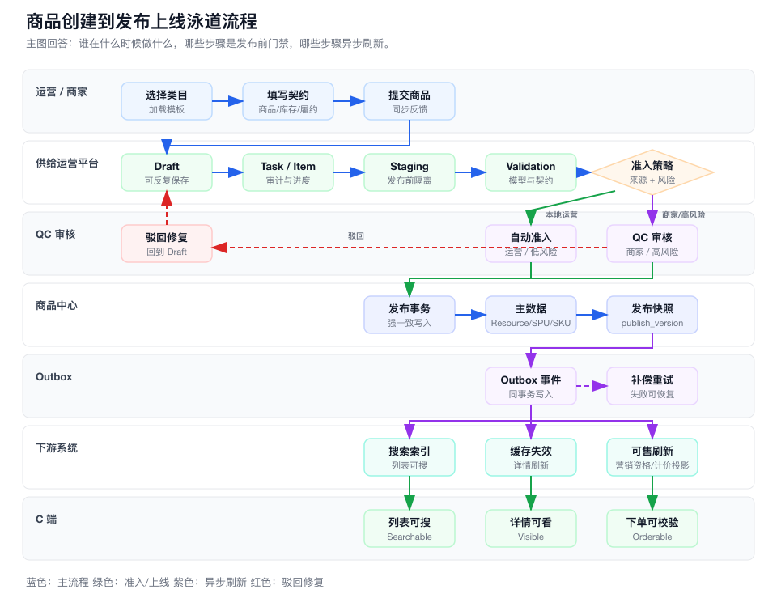

2. 辅助图用状态机回答“商品状态怎么变”。


3. 辅助图用 Data Flow Diagram 回答“数据在哪些表之间流转”。


图源文件：

- `books/system-design-architecture-book/images/product-create-publish-swimlane.svg`
- `books/system-design-architecture-book/images/product-lifecycle-state-machine.svg`
- `books/system-design-architecture-book/images/product-supply-data-flow.svg`

---

## 24.1 系统定位与边界

### 24.1.1 为什么不是商品中心 CRUD

商品中心负责主数据模型和查询契约；供给与运营平台负责商品进入平台和持续维护的流程治理。

| 系统 | 负责什么 | 不负责什么 |
|------|----------|------------|
| 商品中心 | Resource、SPU、SKU、Offer、类目、属性、正式发布版本 | 文件导入进度、审核队列、错误文件、运营任务 |
| 供给与运营平台 | 入口、草稿、任务、暂存、校验、QC 准入、发布编排、库存创建 / 修改的运营入口、营销活动配置入口、补偿、审计 | C 端高 QPS 查询、库存扣减、库存账本事实、计价试算、搜索索引直写、订单状态维护、营销优惠计算 |
| 库存系统 | 库存事实、库存创建命令执行、库存预占、扣减、释放、券码池、库存账本 | 商品标题、图片、类目治理、运营审核流 |
| 计价系统 | 基础价、渠道价、试算、优惠叠加、结算价 | 商品上架流程和审核流 |
| 营销系统 | 活动、券、补贴、预算、营销库存、圈品规则、优惠计算规则 | 商品供给流程、商品生命周期和库存账本 |
| 搜索系统 | 索引、召回、排序、可检索投影 | 商品发布事务 |
| 订单系统 | 商品快照、报价快照、履约契约快照 | 最新商品配置维护 |

供给平台与搜索、计价、订单的关系不是“后台同步调用并写入对方系统”。供给平台完成发布后写 Outbox，搜索索引、缓存、计价上下文、数据平台等由各自消费者按版本重建投影；订单系统不接收供给平台的直接写入，而是在创单时读取当时可交易上下文并保存商品、报价、履约和退款快照。

供给平台与营销系统的关系更近，但仍然是控制面协同：供给平台可以承接“这个商品参加什么活动、圈选哪些 SKU、活动资格何时生效”的运营入口，并向营销系统提交活动配置或圈品命令；营销系统负责活动规则、预算、券、补贴、营销库存和最终优惠计算。不要把活动价、优惠叠加结果或券核销状态写回商品供给表。

如果运营后台直接修改商品正式表，会快速产生几个问题：

1. 导入半成品污染线上。
2. 审核和变更原因不可追溯。
3. 搜索、缓存、计价上下文刷新不一致，营销活动协同状态不可见。
4. 历史订单被最新商品配置影响。
5. 供应商同步和人工编辑互相覆盖。

因此，供给与运营平台的核心不是“把商品写进数据库”，而是：

> 让一个商品从供给入口到可被搜索、可被下单、可被履约、可被追溯。

这里要特别区分 **运营入口归属** 和 **事实归属**：创建库存、补货、导入券码、系统生码、锁库存、门店库存调整、日期库存调整，都应该在供给与运营平台里有工作台、审批、任务进度、错误文件和审计记录；但最终的库存余额、券码状态机、预占记录和账本流水，必须由库存系统维护。供给平台发起 `CreateInventory / AdjustInventory / ImportCodeBatch / GenerateCodeBatch / LockInventory` 命令，库存系统幂等执行并返回 `InventoryReady / InventoryChanged / InventoryFailed`。

### 24.1.2 五类供给入口

商品供给来源通常有五类：

| 入口 | 典型场景 | 入口特点 | 执行方式 |
|------|----------|----------|----------|
| 本地运营创建 | 平台运营创建本地生活券、礼品卡、充值套餐、账单缴费入口 | 低量、强交互、可信操作源 | 同步体验 + 自动准入 + 发布治理 |
| 商家上传 | 商家自助上传门店、套餐、服务商品、素材 | 外部操作源，质量不稳定 | 同步提交 + 默认 QC |
| 批量导入 | 大促前批量创建商品、门店、套餐、价格计划、券码池 | 大量、行级失败、需要错误文件 | 异步任务 |
| 运营编辑 | 修改标题、图片、类目、价格、库存、上下架、退款规则 | 基于线上版本变更，风险差异大 | 同步提交 + 审核/发布 |
| 供应商同步 | 酒店、影院、票务、活动等外部数据全量/增量/Push/刷新 | 长任务、外部不稳定、需要断点续跑 | 专项同步链路 |

这五类入口不能完全拆成五套系统。更合理的设计是：

```text
入口层分开
  → 执行策略分开
  → 标准化后进入统一 Staging
  → 统一 Validation / Diff / Review / Publish / Outbox
```

### 24.1.3 主链路与专项链路

供应商同步属于商品供给链路，但它不是商品供给链路的全部。

```text
商品供给与运营治理平台
  ├─ 人工创建 / 商家上传
  ├─ 批量导入
  ├─ 运营编辑
  ├─ 库存创建 / 补货 / 券码导入
  └─ 供应商同步
```

供应商同步因为涉及 Raw Snapshot、Checkpoint、Worker Lease、Sync Batch Version、Supplier Mapping、新鲜度和供应商质量治理，所以执行层需要单独设计。

但发布治理层应该合流：

```text
supplier_sync_batch
  → Normalize
  → product_supply_task(task_type=SUPPLIER_SYNC_IMPORT)
  → product_supply_task_item
  → product_supply_staging
  → product_validation_result
  → product_change_request
  → Publish
```

一句话总结：

> 供应商同步执行层独立，商品发布治理层复用。

### 24.1.4 典型场景地图

为了让读者先建立整体感，再进入后面的状态机、任务模型和发布细节，可以先用三张“场景地图”理解本章。

商品创建场景：

| 场景 | 典型来源 | 流量特征 | 用户时效预期 | 推荐处理模式 |
|------|----------|----------|--------------|--------------|
| 表单手动创建 | 商家后台、运营后台 | 低频、离散、低并发 | 强同步，秒级回执 | 直接写 Draft |
| Excel 批量导入 | 商家批量上新、运营代建 | 高吞吐、突发、文件流 | 异步，返回任务 ID | 流式解析 + MQ |
| API / ISV 推送 | ERP、开放平台、KA 商家 | 中高频、小批次、可重试 | 半同步，回执后异步完成 | `receipt_id` + MQ + 回调 |
| 主动拉取同步 | 某酒店供应商 / 某外部供应商等 | 海量、长周期、离线批处理 | 纯离线 | 分片任务 + 指纹过滤 |

商品编辑场景：

| 场景 | 典型来源 | 是否进草稿 | 是否需要审核 | 生效时效 |
|------|----------|------------|--------------|----------|
| 单品表单编辑 | 商家后台、运营后台 | 是 | 通常需要 | 保存后待审 |
| Excel 批量编辑 | 商家批量调标题 / 属性 | 是 | 通常需要 | 异步待审 |
| 供应商全量对齐 | 定时 Pull | 是 | 视字段与来源策略而定 | 离线批量更新 |
| 高频价格 / 库存同步 | ERP、自动控价系统 | 否或局部旁路 | 通常免审 | 秒级生效 |
| 平台风控强制下架 | 法务、风控、合规 | 否 | 平台内部裁决 | 立即生效 |

库存模型差异：

| 维度 | 数字库存 | 券码库存 |
|------|----------|----------|
| 数据模型 | 单行数量模型 | 一码一实例模型 |
| B 端加库存 | 直接调数量或 Delta | 必须导入新增券码 |
| B 端减库存 | 直接扣减数量 | 必须选择具体券码作废 |
| C 端扣减 | Redis 计数器 | Redis 队列化发号 |
| 核心风险 | 超卖、写放大 | 一券多卖、券码泄露 |

这三张地图和后文的关系是：

- 24.3 解释“状态怎么流转”。
- 24.4、24.7、24.8、24.9 解释“不同入口怎么执行”。
- 24.6 解释“库存任务和券码任务如何治理”。

### 24.1.5 商品创建场景摘要

从执行方式看，商品创建并不是一条链路，而是四类不同入口的组合。它们共享统一的发布治理框架，但同步 / 异步策略完全不同。

#### 表单手动创建

- 适用对象：新商家、小 B 商家、平台运营。
- 特点：低频、离散、低并发。
- 体验要求：同步保存，秒级回执。
- 推荐方式：直接写 `Draft`，前端和网关都做强校验，不合规数据就地拦截。

#### Excel 批量导入

- 适用对象：批量上新、批量初始化商品库。
- 特点：高吞吐、突发、文件流。
- 体验要求：快速返回 `task_id`，后台异步处理。
- 推荐方式：流式解析、行级错误隔离、按批投递 MQ，由商品中心异步消费。

#### API / ISV 推送

- 适用对象：ERP、开放平台、KA 商家系统接入。
- 特点：小批次、中高频、重试风险高。
- 体验要求：先返回“已接收”，再异步完成。
- 推荐方式：返回 `receipt_id`，后台异步建品，成功后回调或供对方查询。

#### 主动拉取同步

- 适用对象：供应商全量或大批量静态资源接入。
- 特点：海量、长周期、纯离线。
- 体验要求：稳定、可分片、可断点续跑。
- 推荐方式：Master-Worker 分片、分页抓取、内容指纹过滤、只让变更数据进入发布链路。

### 24.1.6 商品编辑场景摘要

商品编辑比创建多了一层“线上版本覆盖”的复杂度，因此要先区分普通编辑路径和高频旁路路径。

#### 单品表单编辑

- 编辑页必须读取当前线上版本。
- 保存时必须带版本号，例如 `biz_version`。
- 如果线上版本已变化，应立即拒绝并提示刷新。
- 保存结果进入 `Draft`，再走 Diff、审核和发布。

#### Excel 批量编辑

- 上传后立即返回 `task_id`。
- 行级校验失败写错误文件，成功行按批进入 `SUPPLY_EDIT_TOPIC`。
- 商品中心消费后写草稿并统一进入待审状态。

#### 供应商全量对齐

- 指纹未变的数据不应反复进入商品中心。
- 指纹变更的数据进入影子行和送审链路。
- 批次结束后可通过 `batch_no` 做清尾下架。

#### 高频价格 / 库存同步

- 价格和库存不适合每次都写草稿。
- 这类字段更适合走库存域或价格域专用接口。
- 目标是秒级生效，而不是进入人审队列。

#### 平台风控强制下架

- 这是一条逆向控制流，不回到供给平台。
- 商品中心直接切换正式商品状态。
- 同时强制刷新缓存和搜索索引，确保全站不可见。

---

## 24.2 核心难点与设计策略：从供给治理到可售闭环

商品供给管理真正难的不是“建几张商品表”，而是把不同入口、不同状态、不同事实源和不同交易风险收敛成一条可治理、可回放、可补偿的供给链路。

| 核心矛盾 | 典型表现 | 设计策略 |
|----------|----------|----------|
| 多入口 | 人工创建、批量导入、运营编辑、库存创建 / 修改、供应商同步都会改变供给能力 | 入口分开，标准化后统一进入 Supply Task、Staging、Validation、Publish |
| 多状态 | Draft、Staging、QC、正式商品、库存任务、Outbox 都有自己的状态 | 谁拥有生命周期，谁拥有状态字段，避免一个 `status` 表达所有语义 |
| 多事实源 | 商品、库存、计价、营销、搜索、订单都关心商品变化，但事实归属不同 | 供给平台做控制面，事实数据留在各自系统，通过命令和事件协作 |
| 多交易风险 | 缺图、缺价、无库存、无履约规则、活动配置失败都会导致不可售 | 发布版本、交易契约、库存任务、营销协同和可售投影分层推进 |
| 多失败形态 | 导入失败、审核失败、发布失败、下游投影失败、库存创建失败 | DLQ、错误文件、补偿任务和运营看板把失败运营化 |

这一章后续所有设计都围绕六个目标展开：

1. **入口统一**：所有供给动作都有任务、来源、操作者和 TraceID。
2. **线上隔离**：草稿、导入中数据、未审核变更不进入正式表。
3. **质量可控**：标准化、类目模板、主数据校验、交易契约校验和风险规则形成发布门禁。
4. **状态分离**：发布、上线、可售、库存 ready、营销 ready 不能混成一个状态。
5. **最终一致**：正式表、快照、Outbox 同事务，读侧投影和营销协同异步完成。
6. **失败可运营**：任务、Item、DLQ、错误文件、补偿任务和可售诊断形成闭环。

### 24.2.1 供给链路的核心矛盾：多入口、多状态、多事实源

商品供给平台看上去像一个后台，但它本质上是供给控制面。控制面不直接承诺“库存一定够”“价格一定正确”“活动一定可用”“订单一定能履约”，它承诺的是：任何供给变更都必须有入口、有证据、有校验、有发布版本、有审计和可补偿路径。

一个商品从进入平台到被用户购买，至少会经过三类对象：

| 对象类型 | 例子 | 设计重点 |
|----------|------|----------|
| 流程对象 | Draft、Task、Task Item、Staging、QC Review | 记录供给变更如何被提交、校验、审核和发布 |
| 正式对象 | Resource、SPU、SKU、Offer、Rate Plan、交易前契约 | 支撑 C 端查询、交易校验和订单快照 |
| 派生对象 | 搜索索引、商品缓存、计价上下文、营销资格、可售投影 | 面向读性能、导购体验和交易前判断，可以异步重建 |

如果把这三类对象混在一张宽表里，短期会觉得简单，长期一定会遇到几个问题：未审核数据污染线上，供应商同步覆盖人工修复，库存补货绕过账本，搜索索引和商品版本对不上，历史订单无法解释当时为什么能买、为什么这个价。

### 24.2.2 发布、上线与可售三态分离

电商系统里最容易被混淆的三个词是：发布、上线、可售。

| 状态 | 含义 | 典型判断 |
|------|------|----------|
| `PUBLISHED` | 正式商品版本已经生成，交易契约和发布快照已经落库 | `publish_version` 递增，Outbox 已写入 |
| `ONLINE` | 商品生命周期允许 C 端展示和进入交易前校验 | 商品未下架、未封禁、未结束销售，当前时间在销售窗口内 |
| `SELLABLE` | 当前渠道、当前时间、当前范围内可以承诺给用户 | 商品在线，库存 ready，价格 ready，营销资格 ready，履约和风控通过 |

因此，审核通过不等于发布成功，发布成功不等于商品上线，商品上线也不等于可售。更稳的链路应该是：

```text
QC Approved
  → Publish Transaction
  → ProductPublished
  → InventoryReady / PricingContextReady / MarketingEligibilityReady
  → AvailabilityProjected
  → Search / Cache / Detail Page refresh
```

这样做的好处是，运营后台可以清楚解释“商品为什么不能卖”：

```text
商品已发布，但不可售：
- 库存创建任务失败：券码文件存在重复码
- 计价上下文未刷新：基础价版本落后
- 营销活动绑定失败：活动预算已关闭
- 搜索索引落后：等待 Outbox 补偿重放
```

### 24.2.3 供给控制面与事实数据面的边界

供给平台负责让变更安全进入平台，但不能替代各个事实系统。边界可以这样理解：

| 系统 | 在供给链路里的角色 | 权威事实 |
|------|--------------------|----------|
| 供给运营平台 | 入口、任务、暂存、校验、审核、发布编排、补偿和审计 | 供给流程事实 |
| 商品中心 | 正式商品主数据、交易前契约、发布版本和快照 | 商品定义事实 |
| 库存系统 | 库存实例、券码池、预占、扣减、释放和账本 | 库存事实 |
| 计价系统 | 基础价、渠道价、优惠叠加、试算和结算价 | 价格事实 |
| 营销系统 | 活动、券、补贴、预算、营销库存和优惠规则 | 营销事实 |
| 搜索系统 | 可检索投影、召回、排序和索引版本 | 搜索读模型 |
| 订单系统 | 商品快照、报价快照、履约和退款契约快照 | 订单交易事实 |

这里的关键不是“供给平台能不能调用别的系统”，而是“调用表达什么语义”。供给平台可以发起 `CreateInventory`、`BindProductToCampaign`、`PublishProductVersion` 这类业务命令；但不能直接更新库存余额、直接写 ES、直接写最终成交价，也不能修改订单状态。

### 24.2.4 库存创建 / 修改的运营归属

库存创建和修改属于供给运营平台的业务工作，但不属于供给运营平台的数据事实。原因很简单：库存动作往往带有强运营属性。

| 场景 | 为什么需要供给运营平台承接 |
|------|----------------------------|
| 简单数量库存随商品发布创建 | 需要和商品类目、Offer、销售范围、扣减时机一起校验 |
| 后台补货 / 调库存 / 锁库存 | 需要权限、审批、操作原因、风险提示和审计 |
| 手动上传券码 | 需要文件上传、行级错误、重复码提示、错误文件和任务进度 |
| 系统生成券码 | 需要生码规则、数量、有效期、审批和批次追踪 |
| 门店 / 日期 / 时段库存 | 需要门店范围、营业时间、节假日、批量复制和局部调整 |
| 批量编辑库存 | 需要异步任务、部分成功、失败重试和运营可见进度 |

所以更准确的说法是：

```text
供给运营平台：负责库存任务的入口、审批、编排、进度、错误文件和审计
库存系统：负责库存实例、余额、券码状态机、预占、扣减、释放和账本
```

库存任务会在 24.6 单独展开。这里先建立一个原则：**供给平台发起库存命令，库存系统幂等执行库存事实变更。**

### 24.2.5 发布后的最终一致与可售投影

### 24.2.6 三个关键架构决策

这一章里最容易反复争论的，其实不是字段怎么命名，而是三个结构性问题：草稿放哪里、QC 放哪里、QC 状态和草稿状态是否合一。

#### 决策点一：草稿应放在哪里

推荐把 `Draft` 放在商品中心，而不是供给平台。

原因有三点：

1. `Draft` 最终要 Merge 到正式商品，放在同域内更容易做本地事务和版本控制。
2. Diff 强依赖草稿和线上正式版本的对比，放在商品中心可以避免跨服务高频读取。
3. 发布成功后的缓存刷新、索引更新和交易契约生效，都更适合由商品中心在同一条发布链路中完成。

代价是商品中心写流量会上升，但这个问题可以通过草稿表和正式表分表、读写分离、冷热隔离缓解。

#### 决策点二：为什么不能设计成“供给 -> QC -> 商品”

这个流程看起来顺手，但有两个致命问题：

1. **Diff 无法本地完成**  
   如果 QC 位于供给平台后面，就必须频繁回查商品中心线上数据；批量场景下会制造跨服务读风暴。

2. **审核结果可能被并发污染**  
   QC 审通过的是供给侧某个瞬间的版本；但在结果写回商品中心前，供给侧数据可能又被改写，导致“审核的是旧版本，生效的是新版本”。

更稳的链路应该是：

```text
供给平台
  → 商品中心写草稿并锁定快照
  → 发送送审事件
  → QC 旁路审核
  → QC 返回 PASS / REJECT
  → 商品中心本地事务合流
```

#### 决策点三：QC 状态与草稿状态是否要分开

结论是要分开。

商品中心草稿表维护“货品视角”的粗粒度状态，例如：

| 字段 | 含义 | 示例 |
|------|------|------|
| `draft_id` | 草稿 ID | `10001` |
| `goods_id` | 对应正式商品 ID | `88888` |
| `audit_status` | 草稿审核状态 | `DRAFT / PENDING / PASS / REJECT` |
| `biz_version` | 乐观锁版本 | `5` |

QC 中心工单表维护“审批流视角”的细粒度状态，例如：

| 字段 | 含义 | 示例 |
|------|------|------|
| `task_id` | 工单 ID | `90001` |
| `source_ref_id` | 关联草稿 ID | `10001` |
| `task_status` | 审批流状态 | `MACHINE_REVIEW / HUMAN_QUEUE / HUMAN_REVIEW / DONE` |
| `reject_reason` | 驳回原因 | `标题包含敏感词` |

这样做的好处是：

- 商品中心只关心“这个草稿能不能合流到正式商品”。
- QC 中心可以自由演进机审、人审、挂起、申诉等复杂流程。
- 避免 QC 的高频状态变更持续写爆商品中心数据库。

供给发布事务内只做商品中心必须强一致的事情：写正式商品主数据、交易前契约、发布版本、发布快照、变更日志和 Outbox。事务外再由不同系统异步完成读模型和可售能力刷新。

```text
Publish Transaction
  → ProductPublished Outbox
  → Inventory Command / Inventory Event
  → Pricing Context Consumer
  → Marketing Command / Eligibility Event
  → Search Indexer / Cache Invalidator
  → Availability Projector
```

可售投影不替代任何事实系统。它只回答一个面向交易入口的问题：**当前这个商品，在这个渠道、这个城市、这个门店、这个时间点，能不能展示、能不能下单、为什么不能下单。**

```text
Sellable =
  product_status == ONLINE
  AND now in sale_time_window
  AND inventory_status in READY/AVAILABLE
  AND price_status == READY
  AND marketing_status in READY/NONE_REQUIRED
  AND fulfillment_status == READY
  AND channel_policy allows current channel
  AND risk_status not in BLOCKED
```

一个成熟平台最需要避免的反模式是：

1. 供给后台直接改库存余额，绕过库存账本。
2. 库存系统直接决定商品上下架，绕过发布版本和审核。
3. 商品发布事务同步调用 ES、计价、营销和订单，导致发布链路被下游拖垮。
4. 把活动价、最终优惠金额写回商品表，导致计价口径和营销成本无法解释。
5. 历史订单回读最新商品配置，导致售后和财务无法复盘。

---

## 24.3 商品生命周期管理

### 24.3.1 状态归属原则

商品供给系统最容易犯的错误，是把 Draft、Staging、QC、正式商品状态都塞进一个 `status` 字段。这样一来，状态很快会变成“大杂烩”：`DRAFT`、`QC_PENDING`、`ONLINE`、`REJECTED`、`PUBLISHING` 同时出现在同一张表里，最后没人说得清这个状态到底是在描述“编辑工作区”“提交快照”“审核工单”，还是“线上商品”。

更稳的建模方式是：**谁拥有生命周期，谁拥有状态字段**。

| 对象 | 表 | 状态回答的问题 | 典型状态 |
|------|----|----------------|----------|
| Draft | `product_supply_draft` | 这份草稿是否还能编辑 | `DRAFT/SUBMITTED/DISCARDED/ARCHIVED` |
| Staging | `product_supply_staging` | 这份提交快照走到校验、审核、发布的哪一步 | `VALIDATED/QC_PENDING/APPROVED/PUBLISH_PENDING/PUBLISHED/REJECTED/WITHDRAWN/CANCELLED/VERSION_CONFLICT` |
| QC Review | `product_qc_review` | 这张审核单是否被批准、驳回或撤销 | `PENDING/REVIEWING/APPROVED/REJECTED/CANCELLED/PUBLISHED` |
| Product Item | `product_item_tab` 或商品中心正式表 | 这个正式商品在线上是否可见、可售、可归档 | `PUBLISHED/ONLINE/OFFLINE/ENDED/BANNED/ARCHIVED` |
| Task / Task Item | `product_supply_task`、`product_supply_task_item` | 一次同步、导入、编辑任务执行到哪里 | `RUNNING/VALIDATING/QC_REVIEWING/PUBLISHING/PARTIAL_FAILED/SUCCESS` |

一个商品可以同时有多套状态，但它们属于不同对象：

```text
正式商品：
  item_id = item_80001
  item_status = ONLINE
  publish_version = 3

编辑草稿：
  draft_id = draft_20001
  draft_status = DRAFT

待审提交：
  staging_id = stg_20001
  staging_status = QC_PENDING

审核单：
  review_id = qc_20001
  qc_status = PENDING
```

这不是重复设计，而是避免“一个字段表达四种语义”。正式 `item_tab` 不应该出现 `DRAFT`、`QC_PENDING`、`REJECTED` 这类供给流程状态；新建商品在发布前甚至还没有正式 `item_id`。

### 24.3.2 六套核心状态机

#### 24.3.2.1 Draft 状态机

Draft 是编辑工作区，允许反复保存。它不进入审核，也不代表线上商品。

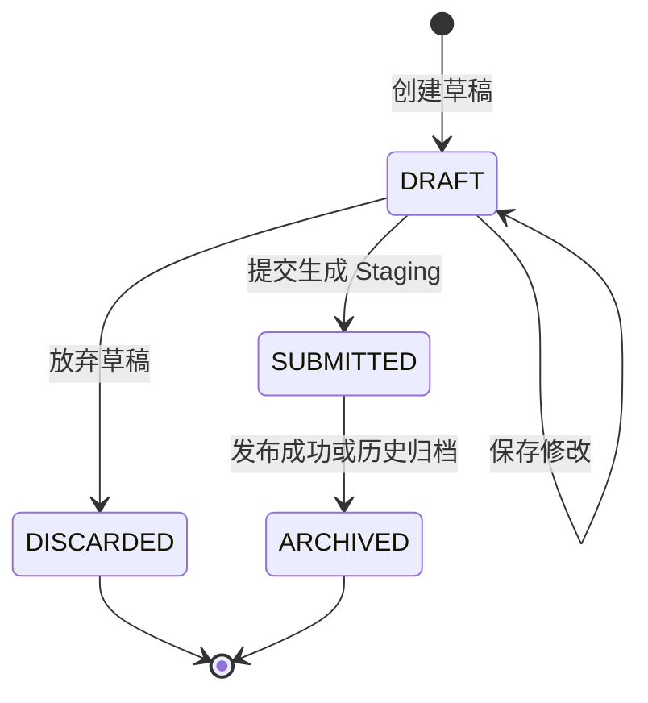
```mermaid
stateDiagram-v2
  [*] --> DRAFT: 创建草稿
  DRAFT --> DRAFT: 保存修改
  DRAFT --> SUBMITTED: 提交生成 Staging
  DRAFT --> DISCARDED: 放弃草稿
  SUBMITTED --> ARCHIVED: 发布成功或历史归档
  DISCARDED --> [*]
  ARCHIVED --> [*]
```

Draft 状态说明：

| 状态 | 含义 | 是否可编辑 |
|------|------|------------|
| `DRAFT` | 未提交草稿 | 是 |
| `SUBMITTED` | 已提交并生成 Staging | 否 |
| `DISCARDED` | 用户主动丢弃 | 否 |
| `ARCHIVED` | 发布成功或历史归档 | 否 |

如果 Pending 后撤回或 Rejected 后修改，推荐基于原 Staging 生成新的 Draft，而不是直接修改已提交 Draft。

#### 24.3.2.2 Staging 状态机

Staging 是提交快照，进入校验、风险评估、审核和发布。它的业务 payload 应该冻结，流程字段可以变化。

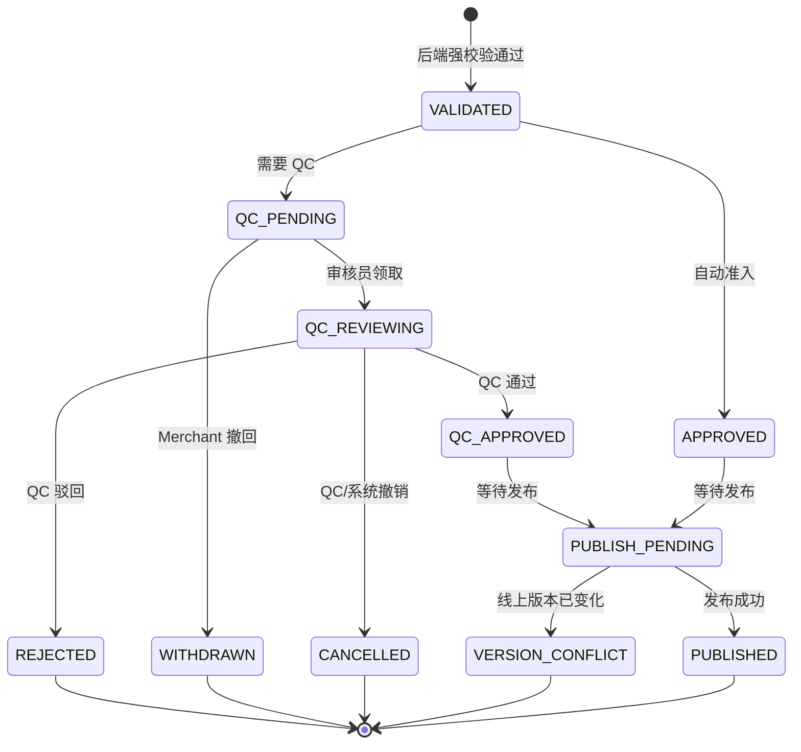
```mermaid
stateDiagram-v2
  [*] --> VALIDATED: 后端强校验通过
  VALIDATED --> QC_PENDING: 需要 QC
  VALIDATED --> APPROVED: 自动准入
  QC_PENDING --> QC_REVIEWING: 审核员领取
  QC_REVIEWING --> QC_APPROVED: QC 通过
  QC_REVIEWING --> REJECTED: QC 驳回
  QC_PENDING --> WITHDRAWN: Merchant 撤回
  QC_REVIEWING --> CANCELLED: QC/系统撤销
  QC_APPROVED --> PUBLISH_PENDING: 等待发布
  APPROVED --> PUBLISH_PENDING: 等待发布
  PUBLISH_PENDING --> PUBLISHED: 发布成功
  PUBLISH_PENDING --> VERSION_CONFLICT: 线上版本已变化
  REJECTED --> [*]
  WITHDRAWN --> [*]
  CANCELLED --> [*]
  VERSION_CONFLICT --> [*]
  PUBLISHED --> [*]
```

Staging 状态说明：

| 状态 | 含义 |
|------|------|
| `VALIDATED` | 提交快照已通过后端强校验 |
| `QC_PENDING` | 等待 QC 审核 |
| `QC_REVIEWING` | QC 审核中 |
| `QC_APPROVED` | QC 通过，但还未进入发布等待区 |
| `APPROVED` | 自动准入通过 |
| `PUBLISH_PENDING` | 允许发布，等待自动、手动或定时发布 |
| `PUBLISHED` | 已发布为正式商品版本 |
| `REJECTED` | QC 驳回 |
| `WITHDRAWN` | Merchant 主动撤回 |
| `CANCELLED` | QC、系统或任务主动撤销 |
| `VERSION_CONFLICT` | 编辑基于的 `base_publish_version` 已过期 |

#### 24.3.2.3 QC 状态机

QC Review 是审核工单，不保存完整商品正文，只保存审核对象、风险原因、审核结论、审核人和驳回原因。

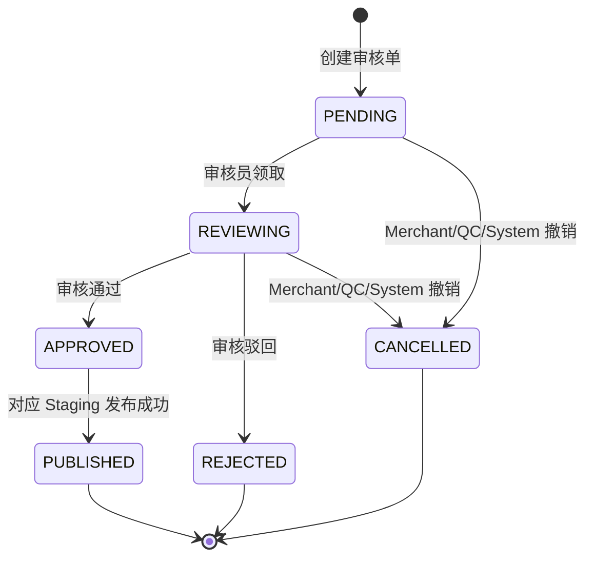
```mermaid
stateDiagram-v2
  [*] --> PENDING: 创建审核单
  PENDING --> REVIEWING: 审核员领取
  REVIEWING --> APPROVED: 审核通过
  REVIEWING --> REJECTED: 审核驳回
  PENDING --> CANCELLED: Merchant/QC/System 撤销
  REVIEWING --> CANCELLED: Merchant/QC/System 撤销
  APPROVED --> PUBLISHED: 对应 Staging 发布成功
  REJECTED --> [*]
  CANCELLED --> [*]
  PUBLISHED --> [*]
```

QC 状态说明：

| 状态 | 含义 |
|------|------|
| `PENDING` | 等待审核 |
| `REVIEWING` | 审核中 |
| `APPROVED` | 审核通过，允许进入发布 |
| `REJECTED` | 审核驳回，展示给商家或运营修复 |
| `CANCELLED` | 审核单被撤销，不计入驳回率 |
| `PUBLISHED` | 对应提交已发布成功 |

`REJECTED` 和 `CANCELLED` 要严格区分：前者代表内容不合规，后者代表审核单不应该继续处理，例如重复单、任务取消、版本冲突或审核路由错误。

#### 24.3.2.4 正式 Item 状态机

正式 Item 是商品中心里的线上资产。它只关心商品是否可见、可售、下架、封禁或归档，不关心草稿是否提交、QC 是否驳回。

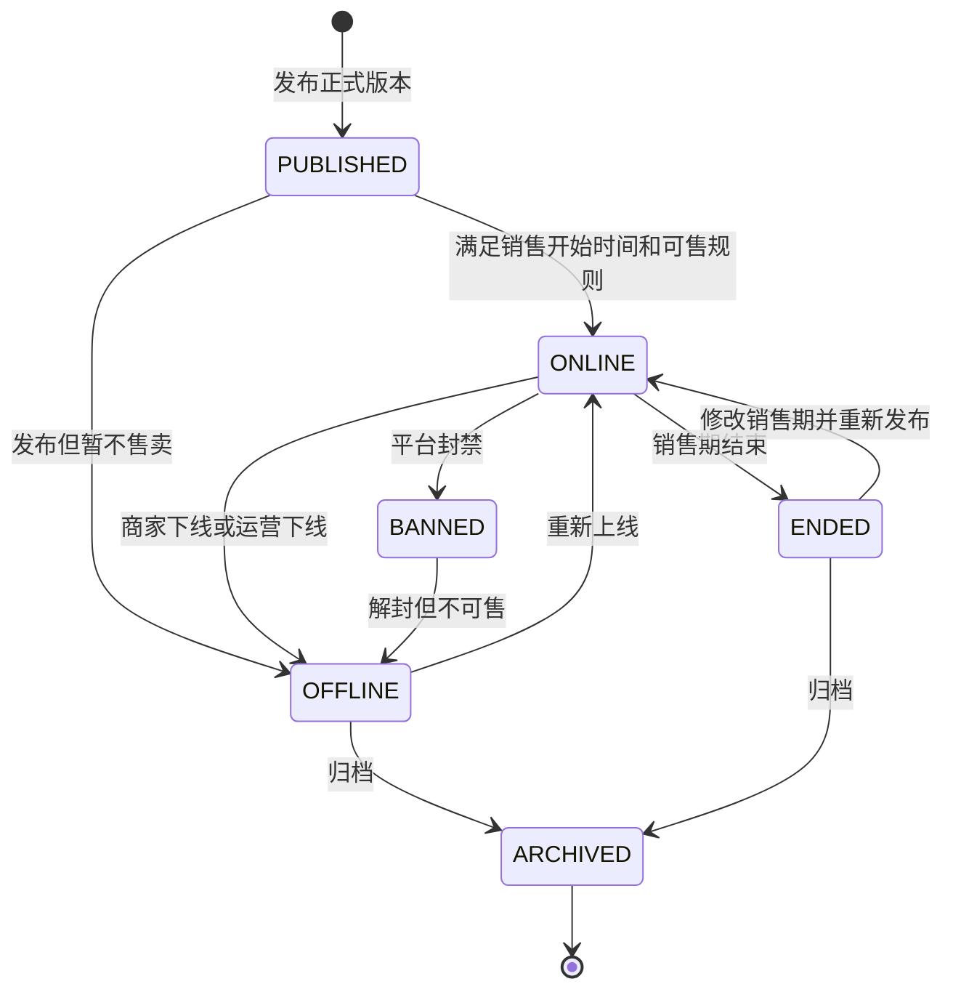
```mermaid
stateDiagram-v2
  [*] --> PUBLISHED: 发布正式版本
  PUBLISHED --> ONLINE: 满足销售开始时间和可售规则
  PUBLISHED --> OFFLINE: 发布但暂不售卖
  ONLINE --> OFFLINE: 商家下线或运营下线
  ONLINE --> ENDED: 销售期结束
  ONLINE --> BANNED: 平台封禁
  OFFLINE --> ONLINE: 重新上线
  ENDED --> ONLINE: 修改销售期并重新发布
  BANNED --> OFFLINE: 解封但不可售
  OFFLINE --> ARCHIVED: 归档
  ENDED --> ARCHIVED: 归档
  ARCHIVED --> [*]
```

正式 Item 状态说明：

| 状态 | 含义 |
|------|------|
| `PUBLISHED` | 已有正式版本，但还未满足上线条件 |
| `ONLINE` | C 端可见且可下单 |
| `OFFLINE` | 人工下线或暂不售卖 |
| `ENDED` | 销售期结束 |
| `BANNED` | 平台封禁，不允许商家直接上线 |
| `ARCHIVED` | 归档，只保留历史查询和审计 |

正式商品表建议把“商品生命周期状态”和“交易可售状态”拆开：

```text
product_item_tab.item_status:
  PUBLISHED / ONLINE / OFFLINE / ENDED / BANNED / ARCHIVED

product_item_tab.sellable_status:
  SELLABLE / UNSALEABLE / NOT_STARTED / SOLD_OUT / EXPIRED / RISK_BLOCKED

product_item_tab.publish_version:
  当前正式发布版本
```

`item_status` 描述商品资产是否上线、下线、封禁、归档；`sellable_status` 描述当前是否允许交易。比如商品可以是 `ONLINE`，但因为库存为 0 而 `sellable_status=SOLD_OUT`。

对于编辑已上线商品，正式 Item 通常保持 `ONLINE`，新的 Draft、Staging、QC 在供给侧流转。只有发布事务成功后，正式 Item 的 `publish_version` 才递增。

#### 24.3.2.5 Task 状态机

批量任务除了商品对象本身的状态机，还应该有独立的 `task` 状态机。`task` 负责表达整批任务当前所处阶段，并为后台展示、超时回收、重试补偿、报告生成提供统一锚点。

批量 Task 是执行编排对象。它不描述“商品是否在线”，而描述“一整批导入、编辑、审核、发布任务现在走到了哪一步”。

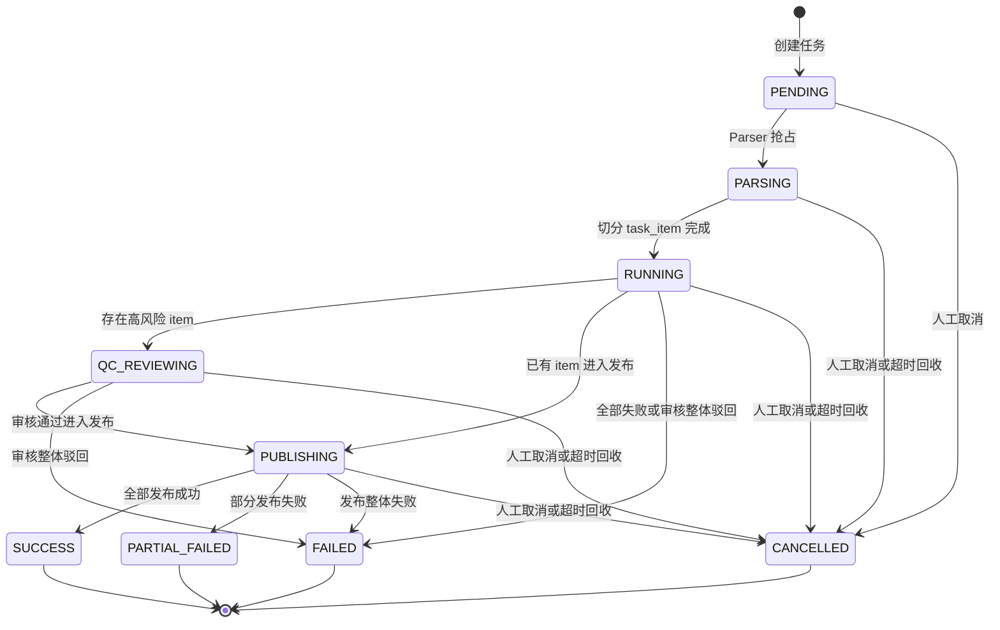
```mermaid
stateDiagram-v2
  [*] --> PENDING: 创建任务
  PENDING --> PARSING: Parser 抢占
  PARSING --> RUNNING: 切分 task_item 完成
  RUNNING --> QC_REVIEWING: 存在高风险 item
  RUNNING --> PUBLISHING: 已有 item 进入发布
  QC_REVIEWING --> PUBLISHING: 审核通过进入发布
  PUBLISHING --> SUCCESS: 全部发布成功
  PUBLISHING --> PARTIAL_FAILED: 部分发布失败
  RUNNING --> FAILED: 全部失败或审核整体驳回
  QC_REVIEWING --> FAILED: 审核整体驳回
  PUBLISHING --> FAILED: 发布整体失败
  PENDING --> CANCELLED: 人工取消
  PARSING --> CANCELLED: 人工取消或超时回收
  RUNNING --> CANCELLED: 人工取消或超时回收
  QC_REVIEWING --> CANCELLED: 人工取消或超时回收
  PUBLISHING --> CANCELLED: 人工取消或超时回收
  SUCCESS --> [*]
  PARTIAL_FAILED --> [*]
  FAILED --> [*]
  CANCELLED --> [*]
```

Task 状态说明：

| 状态 | 含义 |
|------|------|
| `PENDING` | 任务已创建，等待 Parser 抢占 |
| `PARSING` | 正在解析源文件、生成 `task_item` |
| `RUNNING` | item 已开始异步处理 |
| `QC_REVIEWING` | 存在高风险 item 等待审核 |
| `PUBLISHING` | 已有通过准入的 item 进入发布 |
| `SUCCESS` | 全部 item 成功发布 |
| `PARTIAL_FAILED` | 部分成功，部分失败 / 驳回 / DLQ |
| `FAILED` | 整批失败、审核整体驳回，或最终没有可用结果 |
| `CANCELLED` | 人工取消或超时回收结束 |

Task 状态通常由 item 聚合而来，但不等于简单计数求和。一个实用的聚合规则如下：

| Item 汇总结果 | Task 状态 |
|---------------|-----------|
| 全部 `SUCCESS` | `SUCCESS` |
| 部分 `SUCCESS`，部分 `FAILED/DLQ/REJECTED` | `PARTIAL_FAILED` |
| 全部失败或全部被驳回 | `FAILED` |
| 存在 `QC_PENDING/QC_REVIEWING` | `QC_REVIEWING` |
| 存在 `PUBLISHING` | `PUBLISHING` |
| 尚未开始处理，仅完成建 task | `PENDING` |
| Parser 已抢占但未完成切 item | `PARSING` |
| item 已启动执行但未进入 QC / 发布 | `RUNNING` |

#### 24.3.2.6 Task Item 状态机

`task_item` 是批量任务里的行级执行单元，它描述“这一行数据在标准化、校验、审核、发布中的推进情况”，不应和正式商品状态混在一起。

Task Item 关注的是“这一行数据现在处在处理链路的哪一环”，因此状态机会比 Task 更细，但仍应保持单向推进为主。

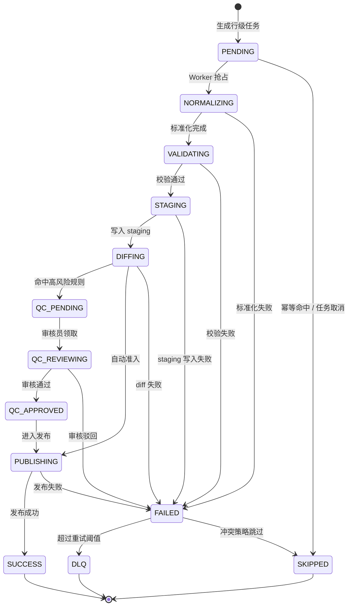
```mermaid
stateDiagram-v2
  [*] --> PENDING: 生成行级任务
  PENDING --> NORMALIZING: Worker 抢占
  NORMALIZING --> VALIDATING: 标准化完成
  VALIDATING --> STAGING: 校验通过
  STAGING --> DIFFING: 写入 staging
  DIFFING --> QC_PENDING: 命中高风险规则
  DIFFING --> PUBLISHING: 自动准入
  QC_PENDING --> QC_REVIEWING: 审核员领取
  QC_REVIEWING --> QC_APPROVED: 审核通过
  QC_APPROVED --> PUBLISHING: 进入发布
  PUBLISHING --> SUCCESS: 发布成功
  NORMALIZING --> FAILED: 标准化失败
  VALIDATING --> FAILED: 校验失败
  STAGING --> FAILED: staging 写入失败
  DIFFING --> FAILED: diff 失败
  QC_REVIEWING --> FAILED: 审核驳回
  PUBLISHING --> FAILED: 发布失败
  FAILED --> DLQ: 超过重试阈值
  PENDING --> SKIPPED: 幂等命中 / 任务取消
  FAILED --> SKIPPED: 冲突策略跳过
  SUCCESS --> [*]
  DLQ --> [*]
  SKIPPED --> [*]
```

Task Item 状态说明：

| 状态 | 含义 |
|------|------|
| `PENDING` | 已生成行级任务，等待消费 |
| `NORMALIZING` | 正在按模板做标准化 |
| `VALIDATING` | 正在执行结构、主数据、交易契约校验 |
| `STAGING` | 已写入 staging，准备做 diff |
| `DIFFING` | 正在和线上版本比较差异 |
| `QC_PENDING` | 命中高风险规则，等待审核 |
| `QC_REVIEWING` | 审核中 |
| `QC_APPROVED` | 审核通过，等待进入发布 |
| `PUBLISHING` | 正在发布正式版本 |
| `SUCCESS` | 已成功完成发布 |
| `FAILED` | 执行失败，可重试或导出错误文件 |
| `DLQ` | 多次失败后进入死信队列 |
| `SKIPPED` | 被幂等、撤销、冲突策略跳过 |

### 24.3.3 状态联动规则

六套状态机不是互相复制，而是通过明确动作联动。

| 动作 | Draft | Staging | QC Review | 正式 Item |
|------|-------|---------|-----------|-----------|
| 新建草稿 | `DRAFT` | 无 | 无 | 无 |
| 提交草稿 | `SUBMITTED` | `VALIDATED/QC_PENDING/APPROVED` | 按策略创建 `PENDING` 或不创建 | 新建商品无 `item_id`；编辑商品不变 |
| QC 领取 | 不变 | `QC_REVIEWING` | `REVIEWING` | 不变 |
| QC 通过 | 不变 | `QC_APPROVED` 或 `PUBLISH_PENDING` | `APPROVED` | 不变 |
| QC 驳回 | 不变 | `REJECTED` | `REJECTED` | 新建商品仍无 `item_id`；编辑商品旧版本继续在线 |
| Merchant 撤回 | 新建或恢复可编辑 Draft | `WITHDRAWN` | `CANCELLED` | 不变 |
| QC/系统撤销 | 按 `cancel_action` 决定 | `CANCELLED/VERSION_CONFLICT` | `CANCELLED` | 不变 |
| 发布成功 | `ARCHIVED` | `PUBLISHED` | `PUBLISHED` 或无 QC | 创建或更新正式 Item，递增 `publish_version` |
| 下线 | 无关 | 无关 | 无关 | `ONLINE → OFFLINE/ENDED/BANNED` |

发布前要做 CAS 校验：

```text
Staging.base_publish_version == Item.current_publish_version
```

如果不相等，说明有人已经发布了更新版本，当前 Staging 不能继续发布，应进入 `VERSION_CONFLICT`，并要求基于最新版本重新编辑。

### 24.3.4 状态日志与生命周期事件

每个对象都要记录自己的状态变化，但落库可以收敛到通用操作流水和正式变更日志，避免为 Draft、Staging、QC 各建一套高度相似的日志表。

| 日志 | 记录什么 |
|------|----------|
| `product_supply_operation_log` | Draft 创建、保存、提交、丢弃、Staging 校验、进入 QC、撤回、驳回、QC 领取、撤销、发布完成 |
| `product_publish_record` | 发布批次、发布版本、发布结果 |
| `product_change_log` | 正式商品上线、下线、封禁、过期、归档、回滚等发布后变更 |

日志至少包含：

```text
object_type
object_id
old_status
new_status
operator_type
operator_id
reason
rule_code
supply_trace_id
operation_id
publish_version
created_at
```

生命周期事件也要分层：

| 事件 | 触发时机 | 典型消费者 |
|------|----------|------------|
| `ProductDraftCreated` | Draft 创建 | 运营后台 |
| `ProductSupplySubmitted` | Draft 提交并生成 Staging | 审核系统、通知系统 |
| `ProductQcApproved` | QC 通过 | 发布 Worker、通知系统 |
| `ProductQcRejected` | QC 驳回 | 商家 Portal、运营后台 |
| `ProductPublished` | 正式版本发布成功 | 搜索索引、缓存、计价上下文、数据平台、营销资格消费者 |
| `ProductMarketingEligibilityChanged` | 商品活动资格、圈品范围或活动标签变化 | 营销系统 |
| `ProductOnline` | 正式商品上线 | 搜索、推荐、营销资格消费者 |
| `ProductOffline` | 正式商品下架 | 搜索、订单前校验、运营看板 |
| `ProductArchived` | 正式商品归档 | 数据平台、审计系统 |

对搜索、缓存、计价上下文这类读侧投影来说，真正有交易意义的是 `ProductPublished/ProductOnline/ProductOffline`。营销系统既可以消费商品发布事件更新活动资格，也可以接收供给平台发起的活动配置命令，但供给平台不直接写营销规则和优惠计算结果。Draft、Staging、QC 事件主要服务于 B 端运营、审核、通知和审计。

事件发布建议走 Outbox：

```text
更新商品状态 / 写发布版本
  → 同事务写 product_outbox_event
  → Dispatcher 投递 Kafka
  → 消费者按 event_id 幂等处理
```

消费者侧要使用 `publish_version` 或事件版本防止旧事件覆盖新状态。

### 24.3.5 从 Draft 到下线的端到端流程

商品生命周期可以按“供给侧对象”和“商品中心正式对象”两条线理解：

```text
供给侧对象：
Draft
  → Staging Ticket
  → QC Ticket
  → Publish Record
  → Operation Log

商品中心正式对象：
item_id
  → publish_version
  → item_status / sellable_status
```

新建商品在 Draft、Staging、QC 阶段没有正式 `item_id`；编辑已有商品时，Draft 和 Staging 会指向已有 `item_id` 和 `base_publish_version`。无论创建还是编辑，`supply_trace_id` 都用于串起同一个商品生命周期，`operation_id` 用于标识一次创建、一次编辑、一次下线或一次重新上线操作。正式 `item_tab` 只保存正式商品资产状态，不保存 Draft、QC Pending、Rejected 这些供给流程状态。

#### 24.3.5.1 新建商品：Create Draft

Merchant 或 Local Ops 创建商品时，供给平台先创建 Draft，而不是直接创建商品中心正式商品。

```text
点击 Create
  → 后端生成 supply_trace_id
  → 后端生成 operation_id
  → 后端生成 draft_id
  → 保存 draft_payload
  → Draft.status = DRAFT
```

新建 Draft 示例：

```json
{
  "draft_id": "draft_10001",
  "draft_type": "CREATE",
  "supply_trace_id": "pst_90001",
  "operation_id": "op_10001",
  "item_id": null,
  "base_publish_version": null,
  "temporary_object_key": "tmp_item_10001",
  "source_type": "MERCHANT",
  "merchant_id": "merchant_001",
  "operator_id": "user_001",
  "category_code": "LOCAL_SERVICE",
  "draft_payload": {
    "item_name": "KFC Voucher 50K",
    "market_price": 70000,
    "discount_price": 50000,
    "stock": 1000,
    "redeem_methods": ["BSC", "CSB"]
  },
  "status": "DRAFT"
}
```

这里最重要的是：

| 字段 | 新建 Draft 的含义 |
|------|-------------------|
| `supply_trace_id` | 商品生命周期追踪 ID，首次创建时生成，后续编辑复用 |
| `operation_id` | 本次创建操作 ID，每次操作新生成 |
| `draft_id` | 草稿 ID，每份草稿新生成 |
| `item_id` | 为空，因为还没有正式商品 |
| `temporary_object_key` | 创建前临时对象键，用于 Staging、QC 和后续映射 |

#### 24.3.5.2 商家提交：Draft 到 Staging / QC

商家提交 Draft 后，系统不直接审核 Draft，而是生成一份不可随意修改的 Staging Ticket。QC Ticket 指向 Staging Ticket。

Draft 是工作区，允许商家反复保存、修改、预览；Staging Ticket 是提交快照，用来承载本次审核和发布。提交之后不能直接修改 Staging 的业务 payload，否则会出现“QC 审核的是 A，最终发布的是 B”的问题。

```text
Merchant Submit Draft
  → 后端强校验
  → 标准化 payload
  → 生成 staging_ticket_id
  → 生成 change_id
  → 判断 qc_policy
  → 创建 qc_ticket_id
  → Draft.status = SUBMITTED
  → Staging.status = QC_PENDING
  → QC.status = PENDING
```

新建商品提交后：

```text
staging_ticket_id = stg_10001
qc_ticket_id = qc_10001
supply_trace_id = pst_90001
operation_id = op_10001
item_id = NULL
temporary_object_key = tmp_item_10001
qc_policy = QC_REQUIRED
```

商家创建商品默认进入 QC。Local Ops 创建商品默认自动准入，但也必须经过 Staging、Validation、Publish，不允许绕过发布事务直接写正式表。

```text
MERCHANT:
  Validation Passed
    → QC_REQUIRED
    → QC Ticket

LOCAL_OPS:
  Validation Passed
    → AUTO_APPROVE
    → Publish
```

如果同一次编辑里既有“不需要 QC”的字段，又有“需要 QC”的字段，整份 Staging 应该一起等 QC 通过后发布，不能先发布一部分字段。否则同一次操作会拆成多个线上版本，审计和用户体验都会变复杂。

Staging 可以更新的是流程字段：

```text
status
qc_status
publish_status
reviewer_id
reject_reason
published_at
```

Staging 不应该直接更新的是商品业务字段：

```text
item_name
image_list
price
stock_rule
available_store_ids
fulfillment_rule
refund_rule
```

如果商家在 Pending 阶段发现内容填错，不能直接编辑这份待审 Staging，而应该走“撤回后编辑”的流程。

#### 24.3.5.3 QC 通过后：自动发布或等待手动 Publish

QC 通过只代表“允许发布”，不一定代表“已经发布”。是否立即发布由 `publish_policy` 决定。

```text
QC APPROVED
  → publish_policy = AUTO_PUBLISH
      → Publish Worker 自动发布

QC APPROVED
  → publish_policy = MANUAL_PUBLISH
      → Staging.status = PUBLISH_PENDING
      → 等商家或运营点击 Publish
```

推荐发布策略：

| 策略 | 含义 | 适用场景 |
|------|------|----------|
| `AUTO_PUBLISH` | QC 通过后自动进入发布事务 | 普通商家商品、低风险运营商品 |
| `MANUAL_PUBLISH` | QC 通过后等待点击 Publish | 活动商品、需要商家确认上线窗口 |
| `SCHEDULED_PUBLISH` | 到指定时间自动发布 | 大促、预售、定时上新 |

#### 24.3.5.4 Publish 背后的实际流程

Publish 是供给链路到交易链路的边界动作。它把 Staging 数据转换成商品中心正式模型，并生成版本、快照和下游刷新事件。

发布前必须重新校验：

```text
1. Staging.status 是否允许发布。
2. QC.status 是否 APPROVED，或 qc_policy 是否 AUTO_APPROVE。
3. operation_id / staging_ticket_id 是否已经发布过。
4. 编辑场景下 base_publish_version 是否等于线上当前版本。
5. 商品是否被删除、冻结、封禁。
6. 库存、券码池、门店、履约、退款、结算信息是否完整。
```

发布事务：

```text
BEGIN
  → 新建商品：生成 item_id
  → 编辑商品：锁定 item_id 当前版本
  → 写 product_item
  → 写价格、库存配置、门店映射
  → 写履约规则、退款规则、输入 Schema
  → 生成 new_publish_version
  → 写 product_publish_snapshot
  → 写 product_change_log
  → 写 product_outbox_event
  → 写 product_publish_record
COMMIT
```

新建商品发布成功后：

```text
temporary_object_key = tmp_item_10001
  → item_id = item_80001
  → publish_version = 1
```

编辑商品发布成功后：

```text
item_id = item_80001
publish_version: 3 → 4
```

正式 `item_id` 不变，只递增 `publish_version`。发布成功后，供给平台要把 Staging、QC、Task、Draft 状态推进到完成态：

```text
Staging.status = PUBLISHED
QC.status = PUBLISHED
TaskItem.status = SUCCESS
Task.status = PUBLISHED 或 PARTIAL_FAILED
Draft.status = ARCHIVED
```

#### 24.3.5.5 编辑在线商品：Edit Active Item

商品已经在线后，商家或运营再次编辑，必须基于正式 `item_id` 和当前 `publish_version` 创建新的编辑 Draft。

```text
打开 Active 商品
  → 读取 item_id
  → 读取 current_publish_version
  → 反查 supply_trace_id
  → 新建 operation_id
  → 新建 edit_draft_id
  → 预填当前线上版本
```

编辑 Draft 示例：

```json
{
  "draft_id": "draft_20001",
  "draft_type": "EDIT",
  "supply_trace_id": "pst_90001",
  "operation_id": "op_20001",
  "item_id": "item_80001",
  "base_publish_version": 3,
  "source_type": "MERCHANT",
  "draft_payload": {
    "item_name": "KFC Voucher 50K - Weekend Special",
    "discount_price": 48000,
    "add_stock": 200
  },
  "changed_fields": [
    {
      "field": "item_name",
      "old": "KFC Voucher 50K",
      "new": "KFC Voucher 50K - Weekend Special",
      "need_qc": true
    },
    {
      "field": "discount_price",
      "old": 50000,
      "new": 48000,
      "need_qc": true
    },
    {
      "field": "add_stock",
      "old": null,
      "new": 200,
      "need_qc": false
    }
  ],
  "qc_policy": "QC_REQUIRED",
  "status": "DRAFT"
}
```

编辑 Active 商品时的 ID 规则：

| ID | 是否新建 | 说明 |
|----|----------|------|
| `supply_trace_id` | 否 | 复用原商品生命周期 ID |
| `item_id` | 否 | 正式商品 ID 不变 |
| `operation_id` | 是 | 一次编辑一个新操作 |
| `draft_id` | 是 | 一份编辑草稿 |
| `staging_ticket_id` | 是 | 一份待发布快照 |
| `qc_ticket_id` | 按策略 | 商家编辑默认创建，本地运营默认不创建 |
| `publish_version` | 发布后递增 | `3 → 4` |

#### 24.3.5.6 QC 驳回、撤回和重新提交

QC 驳回后，不修改正式商品。对于新建商品，因为还没有 `item_id`，只影响 Staging 和 Draft；对于编辑商品，线上旧版本继续售卖。

这里要区分三种容易混淆的动作：

| 动作 | 发起方 | 业务含义 | QC 状态 | Staging 状态 | Merchant 端展示 | 后续动作 |
|------|--------|----------|---------|--------------|-----------------|----------|
| Merchant 撤回 | 商家 | 商家主动终止本次待审提交 | `CANCELLED` | `WITHDRAWN` | 回到 Draft 或从 Pending 消失 | 修改后重新提交 |
| QC 驳回 | 审核员 | 本次提交内容不符合平台要求 | `REJECTED` | `REJECTED` | Rejected Tab 展示驳回原因 | 点击 Revise 生成新 Draft |
| QC 主动撤销 | 审核员/系统 | 这张审核单不应该继续审核 | `CANCELLED` | `CANCELLED` | 通常不进 Rejected Tab | 按撤销原因返回 Draft、关闭或转风险单 |

QC 驳回用于表达“内容不通过”，例如图片违规、标题敏感、资质缺失、退款规则不符合平台要求。驳回必须带结构化原因，最好能落到字段级别：

```text
QC REJECTED
  → QC.status = REJECTED
  → Staging.status = REJECTED
  → 写 product_qc_review_item.reject_reason
  → 写 product_supply_operation_log(QC_REJECTED)
  → 通知 Merchant
  → Merchant 在 Rejected Tab 看到 Staging Ticket
  → 点击 Revise
  → 基于 rejected staging 生成新的 Draft 或恢复到 Draft
  → 修改后重新提交
```

QC 驳回不应该自动生成新 Draft。原因是驳回只是审核结论，是否修改、怎么修改，应该由商家或运营确认后再创建新草稿。这样可以避免系统自动生成大量无人处理的 Draft。

QC 主动撤销不是驳回。它适用于“审核单本身不应该继续走下去”的场景：

| 场景 | 为什么不是驳回 | 推荐处理 |
|------|----------------|----------|
| 商家已发起撤回，但 QC 页面还未刷新 | 商家主动终止，不是内容不合规 | `cancel_source=MERCHANT`，Staging `WITHDRAWN` |
| 重复提交了两张相同审核单 | 不是商品内容问题 | 保留最新单，旧单 `CANCELLED` |
| 商家账号、门店或类目权限失效 | 审核对象前置条件已失效 | `CANCELLED`，必要时创建风险单 |
| 任务被运营取消 | 批量任务不再执行 | 关联 TaskItem 标记 `CANCELLED` |
| 审核策略配置错误，需要重新路由 | 原审核队列不正确 | `CANCELLED` 后重新生成 QC Ticket |
| 线上版本已变化，当前 Staging 过期 | `base_publish_version` 不再匹配 | `CANCELLED` 或 `VERSION_CONFLICT`，要求重新编辑 |

QC 主动撤销流程：

```text
QC Cancel
  → 校验 QC.status IN (PENDING, REVIEWING)
  → 填写 cancel_reason
  → QC.status = CANCELLED
  → QC.cancel_source = QC 或 SYSTEM
  → QC.cancel_reason = ...
  → Staging.status = CANCELLED
  → 写 product_supply_operation_log(QC_CANCELLED)
  → 根据 cancel_action 决定后续动作
```

`cancel_action` 可以设计成：

| `cancel_action` | 含义 | 适用场景 |
|-----------------|------|----------|
| `RETURN_TO_DRAFT` | 回到草稿，允许修改后重新提交 | 审核策略错误、资料需补充 |
| `CLOSE_ONLY` | 只关闭审核单，不生成草稿 | 重复单、任务取消 |
| `CREATE_RISK_CASE` | 转成风险/合规问题单 | 商家资质失效、疑似违规 |
| `RECREATE_QC` | 重新生成审核单并路由到正确队列 | 审核队列配置错误 |

Merchant 也可以在 Pending 阶段撤回：

```text
Withdraw
  → QC.status = CANCELLED
  → QC.cancel_source = MERCHANT
  → QC.cancel_reason = merchant withdraw
  → Staging.status = WITHDRAWN
  → 基于 Staging 生成新的 Draft，或恢复原 Draft
  → OperationLog 记录 WITHDRAWN
```

Pending 阶段的编辑规则建议设计成：

| 当前状态 | 是否直接编辑 Staging | 推荐动作 |
|----------|----------------------|----------|
| `DRAFT` | 不涉及 | 直接编辑 Draft，保存或提交 |
| `QC_PENDING` | 不允许 | 查看详情、撤回、基于 Staging 生成新 Draft |
| `REJECTED` | 不允许改原 Staging | 点击 Revise，生成新 Draft 后重新提交 |
| `APPROVED` 但未发布 | 不建议改原 Staging | Publish、Withdraw，或创建新 Revision |
| `PUBLISHED` | 不允许改历史 Staging | 基于正式 `item_id` 创建编辑 Draft |

如果产品希望 Pending 页面也展示 `Edit` 按钮，底层语义也应该是：

```text
Edit Pending
  = Withdraw 当前 QC Ticket
  + Staging.status = WITHDRAWN
  + 基于当前 Staging payload 生成 draft_new
  + 用户编辑 draft_new
  + Submit 后生成 stg_new 和 qc_new
```

示例：

```text
draft_10001
  → submit
  → stg_10001
  → qc_10001(PENDING)

用户发现内容有误
  → withdraw qc_10001
  → stg_10001 = WITHDRAWN
  → draft_10002 基于 stg_10001 生成
  → submit draft_10002
  → stg_10002
  → qc_10002(PENDING)
```

撤回和驳回都不影响正式商品表。对于 Active 商品编辑，Active Tab 仍然展示当前线上版本；Pending / Rejected Tab 展示 Staging Ticket 中的待审或驳回版本。

#### 24.3.5.7 商品下线：Offline / Ended / Ban

下线不是删除商品。下线只是让商品不再对 C 端可见或不可下单，历史订单、核销、退款、结算仍然要能查到商品快照。

下线触发来源：

| 触发来源 | 示例 | 处理方式 |
|----------|------|----------|
| Merchant 主动下线 | 商家点击 Deactivate | 校验权限，更新商品状态为 `OFFLINE` |
| Ops Ban | 平台审核发现违规 | 更新状态为 `BANNED/OFFLINE`，记录 ban reason |
| 系统自动过期 | 销售结束时间已过 | 系统任务更新为 `ENDED/OFFLINE` |
| 库存不可售 | 库存为 0 或券码池为空 | 可进入 `SOLD_OUT` 或保持在线但不可下单 |
| 风控拦截 | 敏感内容、资质问题 | 强制下线并通知商家修复 |

Merchant 主动下线流程：

```text
点击 Deactivate
  → 校验商品属于该商家
  → 校验商品未被锁定发布中
  → 生成 operation_id
  → 写状态变更记录
  → BEGIN
      → item.status = OFFLINE
      → 写 product_status_log
      → 写 product_outbox_event(ProductOffline)
    COMMIT
  → 搜索下架 / 缓存失效 / 订单前校验不可下单
```

Ops Ban 流程：

```text
Ops Ban
  → 选择 ban_reason
  → item.status = BANNED
  → sellable_status = UNSALEABLE
  → 写 product_status_log
  → 写 ProductOffline / ProductBanned Outbox
  → Merchant 端展示 Ban Reason
```

自动过期流程：

```text
定时任务扫描 end_selling_at < now
  → item.status = ENDED
  → sellable_status = UNSALEABLE
  → 写 ProductOffline Outbox
```

下线后是否能重新上线，要看下线原因：

| 当前状态 | 是否可重新上线 | 条件 |
|----------|----------------|------|
| `OFFLINE` | 可以 | 商家手动下线且商品未过期 |
| `ENDED` | 可以 | 修改销售时间并重新发布 |
| `BANNED` | 不可直接上线 | 必须修复后提交 QC 或 Ops 解封 |
| `ARCHIVED` | 通常不可 | 只保留历史和审计 |

#### 24.3.5.8 列表读模型

Merchant Portal 不能只读正式商品表。不同 Tab 的数据源不同：

| Tab | 数据源 | 展示内容 |
|-----|--------|----------|
| Active | 正式商品表 | 当前线上版本 |
| Ended / Offline | 正式商品表 | 已下线、过期、手动停用商品 |
| Draft | `product_supply_draft` | 未提交草稿 |
| Pending | `product_supply_staging + product_qc_review` | 已提交、待审核、审核中、审核通过待发布版本 |
| Rejected | `product_supply_staging + product_qc_review` | 被驳回的提交版本和驳回原因 |

Draft Tab 只读 Draft，不直接读 Staging。Rejected 或 Withdrawn 的 Staging 只有在用户点击 Revise 或 Withdraw 后，才会派生出新的 Draft，进入 Draft Tab。

推荐过滤条件：

```text
Draft Tab:
  product_supply_draft.status = DRAFT

Pending Tab:
  product_supply_staging.status IN (
    QC_PENDING,
    QC_REVIEWING,
    QC_APPROVED,
    APPROVED,
    PUBLISH_PENDING
  )

Rejected Tab:
  product_supply_staging.status = REJECTED
  AND product_qc_review.status = REJECTED
```

同一个商品可以同时出现在 Active 和 Pending：

```text
Active Tab:
  item_id = item_80001
  展示 publish_version = 3

Pending Tab:
  staging_ticket_id = stg_20001
  展示待审编辑版本
  base_publish_version = 3
```

这样线上用户继续看到稳定版本，商家也能看到自己提交中的新版本。

#### 24.3.5.9 全链路日志

查看一个商品从 Draft 到下线的完整日志，靠 `supply_trace_id` 串联：

```text
DRAFT_CREATED
DRAFT_SUBMITTED
VALIDATION_PASSED
QC_CREATED
QC_APPROVED
PUBLISH_STARTED
PUBLISH_SUCCEEDED
PRODUCT_ONLINE
EDIT_DRAFT_CREATED
EDIT_SUBMITTED
QC_REJECTED
EDIT_RESUBMITTED
PUBLISH_SUCCEEDED
PRODUCT_OFFLINE
PRODUCT_REACTIVATED
PRODUCT_ARCHIVED
```

查询方式：

```sql
SELECT *
FROM product_supply_operation_log
WHERE supply_trace_id = ?
ORDER BY created_at ASC;
```

如果 Merchant 传入的是正式 `item_id`，后端先查映射表：

```sql
SELECT supply_trace_id
FROM product_supply_object_mapping
WHERE item_id = ?;
```

一句话总结：

> Draft / Staging / QC 是供给侧流程对象，`item_id / publish_version` 是商品中心正式对象。创建商品时先没有 `item_id`，QC 通过并 Publish 后才生成；编辑商品时复用 `item_id` 和 `supply_trace_id`，新建本次操作的 Draft、Staging、QC；下线只改变正式商品可售状态，不删除历史版本和订单快照。

### 24.3.6 用 Git 理解供给生命周期

商品供给生命周期和 Git 的版本化协作很像。它们本质上都在解决同一个问题：**如何把一次变更变成可审核、可发布、可回滚、可追溯的版本**。

| 商品供给链路 | Git 类比 | 含义 |
|--------------|----------|------|
| Draft | Working Tree | 本地正在编辑的工作区 |
| Draft 保存 | 保存文件 | 只是保存工作进度，还没有进入正式历史 |
| Staging Ticket | Commit Candidate / PR Candidate | 准备提交给系统审核和发布的一份确定内容 |
| QC Review | Code Review / PR Review | 审核这次提交是否允许进入正式版本 |
| Publish | Merge / Release | 正式进入线上商品版本 |
| `publish_version` | Release Tag / Commit Version | 线上版本号 |
| `product_publish_snapshot` | Commit Snapshot | 某个发布版本的完整内容快照 |
| `product_change_log` | Commit Diff | 这次版本相对上个版本改了什么 |
| `product_supply_operation_log` | Git Log / Reflog | 谁在什么时候做了什么 |
| `base_publish_version` | Base Commit | 本次编辑基于哪个线上版本 |
| `VERSION_CONFLICT` | Rebase Conflict / Merge Conflict | 编辑基于旧版本，但线上版本已经变化 |
| Withdraw | Close PR | 不继续审核这次提交 |
| Rejected | Request Changes | 审核没过，需要修改后重新提交 |

最关键的类比是：

```text
Draft
  ≈ Working Tree

Staging Ticket
  ≈ Commit / PR Candidate

QC
  ≈ Code Review

Publish
  ≈ Merge to main / Release
```

例如，一个线上商品当前是 `publish_version=3`，可以类比成主分支当前 commit 是 `C3`：

```text
线上商品 publish_version = 3
  ≈ main 当前 commit = C3

商家编辑 Draft
  ≈ 修改 working tree

提交 Draft 生成 Staging
  ≈ create commit / create PR，base = C3

QC 审核
  ≈ code review

发布成功
  ≈ merge 到 main，生成 C4
```

如果审核期间线上商品已经被另一次操作发布到了 `publish_version=4`，当前 Staging 仍然基于 `base_publish_version=3`，就应该进入 `VERSION_CONFLICT`：

```text
Staging.base_publish_version = 3
Item.current_publish_version = 4
  → VERSION_CONFLICT
  → 要求基于最新版本重新编辑
```

这和 Git 里的 rebase conflict 或 merge conflict 很像：不是简单拒绝变更，而是要求操作者基于最新版本重新生成 Diff。

不过商品供给比 Git 更复杂。Git 主要管理代码文件；商品供给还会影响价格、库存、履约、退款、搜索缓存、订单快照和供应商映射。因此发布时不能只“合并内容”，还要生成交易前契约、发布快照和 Outbox 事件，确保 C 端可搜、可买、可履约、可售后。

---

## 24.4 供给入口与执行方式

### 24.4.1 同步与异步的取舍

供给平台不能所有动作都异步，也不能所有动作都同步。

| 场景 | 推荐方式 | 原因 |
|------|----------|------|
| 单商品草稿保存 | 同步 | 运营需要立即看到保存结果 |
| 单商品提交校验 | 同步为主 | 基础错误要即时反馈 |
| 单商品发布 | 可同步也可异步 | 简单品类可同步，复杂品类进入发布任务 |
| 批量导入商品 | 异步 | 文件解析、行级错误、部分成功、错误文件 |
| 批量编辑价格 / 上下架 | 异步 | 风险高、影响面大，需要进度和审核 |
| 供应商全量同步 | 异步 | 长任务，需要 checkpoint、lease、DLQ |
| 供应商 Push 单条变更 | 异步优先 | 需要幂等、削峰、失败补偿 |

统一抽象：

```text
product_supply_task.execution_mode = SYNC / ASYNC
```

单商品创建也可以生成 `product_supply_task(total_count=1)`，这样审计、审核、发布记录统一。

### 24.4.2 来源与 QC 准入策略

商品上传是否需要 QC，不能只看字段风险，还要看来源和操作者信任等级。一个简单但实用的默认策略是：

```text
本地运营上传
  → Validation 通过
  → 自动准入
  → 发布事务

商家上传
  → Validation 通过
  → 默认进入 QC
  → QC 通过后发布
```

也就是说，本地运营是平台内部可信操作源，默认不需要 QC；商家是外部操作源，默认需要 QC。二者都不能绕过 Validation、Staging、发布版本和 Outbox。

| 来源 | 示例 | 默认 QC 策略 | 仍然必须做什么 |
|------|------|--------------|----------------|
| `LOCAL_OPS` | 平台本地运营创建商品、上传素材、配置套餐 | `AUTO_APPROVE`，不创建 QC 审核单 | 强校验、审计、发布版本、Outbox |
| `MERCHANT` | 商家自助上传门店、套餐、服务商品、图片 | `QC_REQUIRED`，默认创建 QC 审核单 | 强校验、字段 Diff、QC 通过后发布 |
| `SUPPLIER` | 供应商同步酒店、票务、活动商品 | 按风险分流，低风险自动准入，高风险 QC | Raw Snapshot、Diff、字段主导权、补偿 |
| `SYSTEM` | 补偿任务、质量修复任务、系统迁移 | 继承原任务策略或按规则准入 | 幂等、审计、可回放 |

本地运营“不需要 QC”不等于“可以直接写正式表”。它只是跳过人工审核工单，仍然要走：

```text
Draft / Task
  → Staging
  → Validation
  → Diff / Risk
  → AUTO_APPROVE
  → Publish
```

对于本地运营的超高风险动作，例如大批量改价、退款规则大范围变更、类目迁移，可以不走普通 QC，但要通过更合适的控制手段：

1. 高权限校验。
2. 二次确认。
3. 变更窗口。
4. 发布后巡检。
5. 快速回滚。

### 24.4.3 人工创建

人工创建是“从 0 到 1”生成商品，核心是完整性。这里要区分本地运营创建和商家自助创建：本地运营创建默认自动准入，商家创建默认进入 QC。

```text
选择类目
  → 加载类目模板
  → 填写 Resource / SPU / SKU / Offer / Rule
  → 前端实时校验
  → 后端同步强校验
  → 保存 Draft
  → 提交生成 Staging
  → 质量校验和风险判断
  → 来源准入策略：LOCAL_OPS 自动准入，MERCHANT 进入 QC
  → 发布正式表
```

人工创建必须一次性收齐交易前契约：

| 契约 | 示例 |
|------|------|
| 商品模型 | Resource、SPU、SKU、Offer、Rate Plan |
| 库存契约 | 库存来源、券码池、供应商实时库存能力 |
| 输入契约 | 手机号、账单号、入住人、乘客证件 |
| 履约契约 | 充值、发券、出票、预订确认 |
| 售后契约 | 退款规则、取消政策、过期处理 |

如果这些契约不完整，商品即使写入主表，也不能认为创建成功。

### 24.4.4 批量导入

批量导入适合大促、类目迁移、商家批量上新、套餐批量配置。

```text
下载模板
  → 上传文件
  → 文件格式预检
  → 创建 product_supply_task(status=PENDING, execution_mode=ASYNC)
  → Parser Worker 流式解析
  → 每行生成 product_supply_task_item
  → Item Worker 分批标准化和校验
  → 按来源生成准入策略
  → LOCAL_OPS 成功项进入发布
  → MERCHANT 成功项进入 QC
  → 失败项生成错误文件
  → 汇总任务状态
```

批量导入的重点不是“快”，而是：

1. 可恢复。
2. 可解释。
3. 可部分成功。
4. 可生成错误文件。
5. 可控制下游压力。

### 24.4.5 运营编辑

运营编辑是“基于线上版本的变更”，核心是 Diff、风险和主导权。

```text
读取 current_publish_version
  → 创建编辑 Draft
  → 修改字段
  → 提交生成 Staging
  → 与线上版本做 Diff
  → 判断字段主导权
  → 计算风险等级
  → 来源准入策略 / QC 审核 / 阻断
  → 发布新 publish_version
```

常见风险：

| 变更 | 风险 | 策略 |
|------|------|------|
| 标题、描述、小图修正 | 低 | 自动准入，记录变更日志 |
| 普通图片变更 | 低/中 | 图片质量校验后发布 |
| 库存水位调整 | 中 | 自动校验，通过后发布，异常告警 |
| 价格或 Offer 规则变更 | 中高 | 超阈值进入 QC |
| 类目变更 | 高 | 强制 QC |
| 履约类型或退款规则变更 | 高 | 强制 QC |
| Resource / Supplier Mapping 变更 | 高 | 强制 QC 并触发巡检 |

### 24.4.6 供应商同步

供应商同步是自动化程度最高、数据治理要求最强的入口。

它需要独立执行层：

```text
supplier_sync_task
  → supplier_sync_batch
  → Page / Cursor Fetch
  → Raw Snapshot
  → Normalize
  → Supplier Mapping
  → Diff
  → product_supply_staging
  → Publish
```

供应商同步不应该直接写正式商品表。它应该先保存 Raw Snapshot，再标准化、校验、映射、Diff，然后进入统一发布治理链路。

---

## 24.5 核心表模型

供给与运营链路的表设计要围绕十类能力组织：草稿、任务、行级处理、暂存、校验、QC 审核、Diff / Change、发布快照、下游一致性、补偿审计。

重新 review 表模型时，要先确认每张表回答的问题：

| 问题 | 应该由谁回答 |
|------|--------------|
| 用户正在编辑哪份内容 | Draft |
| 提交给审核和发布的是哪份冻结快照 | Staging |
| 这次变更为什么需要审核 | Change Request / Risk |
| 审核员审核了什么、结论是什么 | QC Review |
| 为什么不能发布 | Validation / DLQ |
| 已经发布了哪个正式版本 | Publish Record / Publish Snapshot |
| 搜索、缓存、计价上下文是否收到变更，营销活动协同是否完成 | Outbox / Compensation |
| 从 Draft 到下线的全链路日志怎么查 | Operation Log / Object Mapping |

### 24.5.1 表分组

| 表组 | 典型表 | 作用 |
|------|--------|------|
| Draft 草稿表 | `product_supply_draft`、`product_supply_draft_version` | 保存单商品创建和编辑过程中的草稿 |
| Task 任务表 | `product_supply_task` | 记录一次供给动作 |
| Task Item 明细表 | `product_supply_task_item` | 记录每一行、每个商品、每个 Offer 或每条规则的处理状态 |
| Staging 暂存表 | `product_supply_staging`、`product_supply_staging_snapshot` | 保存已提交、已标准化、但未发布的数据 |
| Validation 校验表 | `product_validation_result` | 保存字段、类目、主数据、交易契约、风险规则的校验结果 |
| QC Review 审核表 | `product_qc_review`、`product_qc_review_item` | 保存发布前 QC 审核单、审核项、审核结论和驳回原因 |
| Change / Audit 表 | `product_change_request`、`product_supply_operation_log`、`product_field_ownership` | 保存 Diff、风险等级、审核策略、字段主导权和操作流水 |
| Publish / Snapshot 表 | `product_publish_record`、`product_publish_snapshot`、`product_change_log` | 保存发布批次、商品快照和变更日志 |
| Mapping 表 | `product_supply_object_mapping` | 串联 `supply_trace_id`、临时对象键和正式 `item_id` |
| Outbox / DLQ / Compensation 表 | `product_outbox_event`、`product_supply_dead_letter`、`product_compensation_task`、`product_quality_issue` | 保证下游一致性和失败补偿 |

第一期最小闭环建议：

```text
product_supply_draft
product_supply_task
product_supply_task_item
product_supply_staging
product_validation_result
product_qc_review
product_qc_review_item
product_change_request
product_field_ownership
product_supply_operation_log
product_supply_object_mapping
product_publish_record
product_publish_snapshot
product_change_log
product_outbox_event
product_supply_dead_letter
product_compensation_task
product_quality_issue
```

二期再补强：

```text
product_supply_draft_version
product_supply_staging_snapshot
```

### 24.5.2 Draft 表

Draft 偏编辑态，允许反复保存，不进入审核，不影响线上。

```sql
CREATE TABLE product_supply_draft (
    id BIGINT PRIMARY KEY AUTO_INCREMENT,
    draft_id VARCHAR(64) NOT NULL,
    draft_type VARCHAR(32) NOT NULL COMMENT 'CREATE/EDIT',
    supply_trace_id VARCHAR(64) NOT NULL COMMENT '同一商品供给生命周期追踪 ID',
    operation_id VARCHAR(64) NOT NULL COMMENT '本次创建、编辑、撤回或重新提交操作 ID',
    category_code VARCHAR(32) NOT NULL,
    source_type VARCHAR(32) NOT NULL COMMENT 'LOCAL_OPS/MERCHANT/SUPPLIER/SYSTEM',
    merchant_id VARCHAR(64) DEFAULT NULL,
    operator_id VARCHAR(64) NOT NULL,
    item_id VARCHAR(64) DEFAULT NULL COMMENT '正式商品 ID，新建发布前为空',
    temporary_object_key VARCHAR(128) DEFAULT NULL COMMENT '新建商品发布前的临时对象键',
    platform_resource_id BIGINT DEFAULT NULL,
    spu_id BIGINT DEFAULT NULL,
    sku_id BIGINT DEFAULT NULL,
    offer_id BIGINT DEFAULT NULL,
    source_staging_id VARCHAR(64) DEFAULT NULL COMMENT '从 Rejected/Withdrawn Staging 派生草稿时记录来源',
    parent_draft_id VARCHAR(64) DEFAULT NULL,
    draft_version INT NOT NULL DEFAULT 1,
    base_publish_version BIGINT DEFAULT NULL,
    draft_payload JSON NOT NULL,
    status VARCHAR(32) NOT NULL COMMENT 'DRAFT/SUBMITTED/DISCARDED/ARCHIVED',
    created_at DATETIME NOT NULL,
    submitted_at DATETIME DEFAULT NULL,
    archived_at DATETIME DEFAULT NULL,
    updated_at DATETIME NOT NULL,
    UNIQUE KEY uk_draft_id (draft_id),
    KEY idx_trace (supply_trace_id),
    KEY idx_item_status (item_id, status),
    KEY idx_operator_status (operator_id, status)
) ENGINE=InnoDB DEFAULT CHARSET=utf8mb4 COMMENT='商品供给草稿';
```

### 24.5.3 Task 表

Task 管一次供给动作的整体状态。

```sql
CREATE TABLE product_supply_task (
    id BIGINT PRIMARY KEY AUTO_INCREMENT,
    task_id VARCHAR(64) NOT NULL,
    task_type VARCHAR(32) NOT NULL
        COMMENT 'MANUAL_CREATE/MANUAL_EDIT/BATCH_IMPORT/BATCH_EDIT/SUPPLIER_SYNC_IMPORT',
    execution_mode VARCHAR(16) NOT NULL COMMENT 'SYNC/ASYNC',
    source_type VARCHAR(32) NOT NULL COMMENT 'LOCAL_OPS/MERCHANT/SUPPLIER/SYSTEM',
    source_id VARCHAR(64) DEFAULT NULL,
    category_code VARCHAR(32) NOT NULL,
    operator_id VARCHAR(64) DEFAULT NULL,
    supply_trace_id VARCHAR(64) DEFAULT NULL COMMENT '单商品任务可直接关联，多商品任务为空',
    operation_id VARCHAR(64) DEFAULT NULL COMMENT '单商品创建、编辑、上下线操作 ID',
    draft_id VARCHAR(64) DEFAULT NULL,
    operator_trust_level VARCHAR(32) DEFAULT NULL COMMENT 'INTERNAL/TRUSTED/EXTERNAL',
    qc_policy VARCHAR(32) DEFAULT NULL COMMENT 'AUTO_APPROVE/QC_REQUIRED/BLOCK',
    trigger_id VARCHAR(64) DEFAULT NULL,
    template_version VARCHAR(64) DEFAULT NULL,
    status VARCHAR(32) NOT NULL
        COMMENT 'DRAFT/PENDING/PARSING/RUNNING/VALIDATING/QC_PENDING/QC_REVIEWING/QC_APPROVED/APPROVED/PUBLISHING/PUBLISHED/PARTIAL_FAILED/FAILED/CANCELLED',
    total_count INT NOT NULL DEFAULT 0,
    parsed_count INT NOT NULL DEFAULT 0,
    success_count INT NOT NULL DEFAULT 0,
    failed_count INT NOT NULL DEFAULT 0,
    skipped_count INT NOT NULL DEFAULT 0,
    current_stage VARCHAR(64) DEFAULT NULL,
    input_file_ref VARCHAR(512) DEFAULT NULL,
    input_file_name VARCHAR(256) DEFAULT NULL,
    input_file_hash VARCHAR(64) DEFAULT NULL,
    input_file_size BIGINT DEFAULT NULL,
    input_file_content_type VARCHAR(128) DEFAULT NULL,
    parse_checkpoint VARCHAR(1024) DEFAULT NULL,
    error_file_ref VARCHAR(512) DEFAULT NULL,
    error_file_name VARCHAR(256) DEFAULT NULL,
    report_file_ref VARCHAR(512) DEFAULT NULL,
    report_file_name VARCHAR(256) DEFAULT NULL,
    publish_version BIGINT DEFAULT NULL,
    worker_id VARCHAR(64) DEFAULT NULL,
    lease_token VARCHAR(64) DEFAULT NULL,
    lease_until DATETIME DEFAULT NULL,
    heartbeat_at DATETIME DEFAULT NULL,
    created_at DATETIME NOT NULL,
    started_at DATETIME DEFAULT NULL,
    finished_at DATETIME DEFAULT NULL,
    updated_at DATETIME NOT NULL,
    UNIQUE KEY uk_task_id (task_id),
    UNIQUE KEY uk_task_trigger (task_type, trigger_id),
    KEY idx_trace (supply_trace_id),
    KEY idx_status (status),
    KEY idx_category_status (category_code, status)
) ENGINE=InnoDB DEFAULT CHARSET=utf8mb4 COMMENT='商品供给任务';
```

批量导入相关文件元数据直接放在 `product_supply_task` 中：源文件、错误文件和质量报告都通过 `*_file_ref`、`*_file_name`、`input_file_hash` 这类字段管理。这样第一期模型更简单，运营后台也可以通过 task 直接拿到文件地址和校验信息。

### 24.5.4 Task Item 表

Task Item 是批量任务的核心表，也是失败定位单元。

```sql
CREATE TABLE product_supply_task_item (
    id BIGINT PRIMARY KEY AUTO_INCREMENT,
    task_id VARCHAR(64) NOT NULL,
    item_no VARCHAR(64) NOT NULL COMMENT '文件行号、对象序号或外部对象序号',
    item_type VARCHAR(32) NOT NULL COMMENT 'RESOURCE/SPU/SKU/OFFER/RATE_PLAN/STOCK/RULE',
    idempotency_key VARCHAR(128) NOT NULL,
    supply_trace_id VARCHAR(64) DEFAULT NULL,
    operation_id VARCHAR(64) DEFAULT NULL,
    draft_id VARCHAR(64) DEFAULT NULL,
    item_id VARCHAR(64) DEFAULT NULL,
    platform_resource_id BIGINT DEFAULT NULL,
    spu_id BIGINT DEFAULT NULL,
    sku_id BIGINT DEFAULT NULL,
    offer_id BIGINT DEFAULT NULL,
    status VARCHAR(32) NOT NULL
        COMMENT 'PENDING/NORMALIZING/VALIDATING/STAGING/DIFFING/QC_PENDING/QC_REVIEWING/QC_APPROVED/PUBLISHING/SUCCESS/FAILED/DLQ/SKIPPED',
    risk_level VARCHAR(32) DEFAULT NULL COMMENT 'LOW/MEDIUM/HIGH',
    qc_policy VARCHAR(32) DEFAULT NULL COMMENT 'AUTO_APPROVE/QC_REQUIRED/BLOCK',
    error_code VARCHAR(128) DEFAULT NULL,
    error_message VARCHAR(1024) DEFAULT NULL,
    raw_row_ref VARCHAR(512) DEFAULT NULL,
    normalized_ref VARCHAR(512) DEFAULT NULL,
    staging_id VARCHAR(64) DEFAULT NULL,
    change_id VARCHAR(64) DEFAULT NULL,
    retry_count INT NOT NULL DEFAULT 0,
    next_retry_at DATETIME DEFAULT NULL,
    created_at DATETIME NOT NULL,
    updated_at DATETIME NOT NULL,
    UNIQUE KEY uk_task_item (task_id, item_no),
    UNIQUE KEY uk_task_idempotency (task_id, idempotency_key),
    KEY idx_trace (supply_trace_id),
    KEY idx_item_status (item_id, status),
    KEY idx_task_status (task_id, status)
) ENGINE=InnoDB DEFAULT CHARSET=utf8mb4 COMMENT='商品供给任务明细';
```

### 24.5.5 Staging 表

Staging 是正式表前的隔离层。

```sql
CREATE TABLE product_supply_staging (
    id BIGINT PRIMARY KEY AUTO_INCREMENT,
    staging_id VARCHAR(64) NOT NULL,
    task_id VARCHAR(64) NOT NULL,
    item_no VARCHAR(64) NOT NULL,
    draft_id VARCHAR(64) DEFAULT NULL,
    supply_trace_id VARCHAR(64) NOT NULL,
    operation_id VARCHAR(64) NOT NULL,
    object_type VARCHAR(32) NOT NULL COMMENT 'RESOURCE/SPU/SKU/OFFER/RATE_PLAN/STOCK/RULE',
    object_key VARCHAR(128) NOT NULL,
    item_id VARCHAR(64) DEFAULT NULL COMMENT '正式商品 ID，新建发布前为空',
    temporary_object_key VARCHAR(128) DEFAULT NULL COMMENT '新建商品发布前的临时对象键',
    source_type VARCHAR(32) NOT NULL,
    change_id VARCHAR(64) DEFAULT NULL,
    qc_policy VARCHAR(32) DEFAULT NULL COMMENT 'AUTO_APPROVE/QC_REQUIRED/BLOCK',
    risk_level VARCHAR(32) DEFAULT NULL COMMENT 'LOW/MEDIUM/HIGH',
    publish_policy VARCHAR(32) DEFAULT NULL COMMENT 'AUTO_PUBLISH/MANUAL_PUBLISH/SCHEDULED_PUBLISH',
    publish_after DATETIME DEFAULT NULL,
    raw_payload_ref VARCHAR(512) DEFAULT NULL,
    normalized_payload JSON NOT NULL,
    payload_hash VARCHAR(64) NOT NULL,
    base_publish_version BIGINT DEFAULT NULL,
    status VARCHAR(32) NOT NULL
        COMMENT 'VALIDATED/QC_PENDING/QC_REVIEWING/QC_APPROVED/APPROVED/PUBLISH_PENDING/PUBLISHED/REJECTED/WITHDRAWN/CANCELLED/VERSION_CONFLICT',
    created_at DATETIME NOT NULL,
    updated_at DATETIME NOT NULL,
    UNIQUE KEY uk_staging_id (staging_id),
    UNIQUE KEY uk_task_object (task_id, object_type, object_key),
    KEY idx_trace (supply_trace_id),
    KEY idx_item_status (item_id, status)
) ENGINE=InnoDB DEFAULT CHARSET=utf8mb4 COMMENT='商品供给暂存数据';
```

`base_publish_version` 很重要。运营编辑或批量导入可能基于旧版本，如果发布时线上版本已经变化，必须识别冲突，不能静默覆盖。

### 24.5.6 QC 审核表

QC 审核表位于“标准化校验之后、正式发布之前”。它不是商品正式数据表，而是发布准入工单。商品数据仍然保存在 Draft、Staging、Snapshot 或正式商品表中；QC 表只记录谁审核、审核什么、为什么需要审核、审核结论是什么。

```text
Staging
  → Validation
  → Diff / Risk
  → QC Review
  → Publish
```

QC 审核要同时支持单商品和批量任务：

| 场景 | QC 粒度 | 说明 |
|------|---------|------|
| 单商品创建 | 一个审核单对应一个商品上下文 | 审核 Resource、SPU/SKU、Offer、交易契约是否完整 |
| 单商品编辑 | 一个审核单对应一次字段变更 | 审核字段 Diff、风险原因和历史版本 |
| 批量导入 | 一个任务下多个审核项 | 低风险项自动准入，高风险行进入 QC |
| 批量编辑 | 按商品、SKU、Offer 或规则生成审核项 | 避免整批等待一个高风险项 |
| 供应商同步 | 按 Diff 风险生成审核项 | 坐标漂移、类目变化、映射变化、退款规则变化进入 QC |
| 质量巡检 | 按问题单生成审核项 | 缺图、缺价、不可履约等问题修复后再发布 |

审核主表：

```sql
CREATE TABLE product_qc_review (
    id BIGINT PRIMARY KEY AUTO_INCREMENT,
    review_id VARCHAR(64) NOT NULL,
    task_id VARCHAR(64) DEFAULT NULL,
    source_type VARCHAR(32) NOT NULL COMMENT 'LOCAL_OPS/MERCHANT/SUPPLIER_SYNC/QUALITY_INSPECTION',
    review_type VARCHAR(32) NOT NULL COMMENT 'CREATE/EDIT/DIFF/RISK/QUALITY_FIX',
    category_code VARCHAR(32) NOT NULL,
    supply_trace_id VARCHAR(64) NOT NULL,
    operation_id VARCHAR(64) NOT NULL,
    item_id VARCHAR(64) DEFAULT NULL,
    platform_resource_id BIGINT DEFAULT NULL,
    spu_id BIGINT DEFAULT NULL,
    sku_id BIGINT DEFAULT NULL,
    offer_id BIGINT DEFAULT NULL,
    staging_id VARCHAR(64) DEFAULT NULL,
    change_id VARCHAR(64) DEFAULT NULL,
    base_publish_version BIGINT DEFAULT NULL,
    risk_level VARCHAR(32) NOT NULL COMMENT 'LOW/MEDIUM/HIGH',
    review_policy VARCHAR(32) NOT NULL COMMENT 'AUTO_APPROVE/QC_REQUIRED/BLOCK',
    status VARCHAR(32) NOT NULL
        COMMENT 'PENDING/REVIEWING/APPROVED/REJECTED/CANCELLED/PUBLISHED',
    cancel_source VARCHAR(32) DEFAULT NULL COMMENT 'MERCHANT/QC/SYSTEM/TASK',
    cancel_reason VARCHAR(1024) DEFAULT NULL,
    cancel_action VARCHAR(32) DEFAULT NULL COMMENT 'RETURN_TO_DRAFT/CLOSE_ONLY/CREATE_RISK_CASE/RECREATE_QC',
    submitter_id VARCHAR(64) DEFAULT NULL,
    reviewer_id VARCHAR(64) DEFAULT NULL,
    review_note VARCHAR(1024) DEFAULT NULL,
    reject_reason VARCHAR(1024) DEFAULT NULL,
    submitted_at DATETIME DEFAULT NULL,
    reviewed_at DATETIME DEFAULT NULL,
    cancelled_at DATETIME DEFAULT NULL,
    created_at DATETIME NOT NULL,
    updated_at DATETIME NOT NULL,
    UNIQUE KEY uk_review_id (review_id),
    KEY idx_trace (supply_trace_id),
    KEY idx_item_status (item_id, status),
    KEY idx_task_status (task_id, status),
    KEY idx_status_risk (status, risk_level),
    KEY idx_object (platform_resource_id, spu_id, sku_id, offer_id)
) ENGINE=InnoDB DEFAULT CHARSET=utf8mb4 COMMENT='商品供给 QC 审核单';
```

审核明细表：

```sql
CREATE TABLE product_qc_review_item (
    id BIGINT PRIMARY KEY AUTO_INCREMENT,
    review_id VARCHAR(64) NOT NULL,
    task_id VARCHAR(64) DEFAULT NULL,
    item_no VARCHAR(64) DEFAULT NULL,
    object_type VARCHAR(32) NOT NULL COMMENT 'RESOURCE/SPU/SKU/OFFER/RATE_PLAN/STOCK/RULE',
    object_key VARCHAR(128) NOT NULL,
    staging_id VARCHAR(64) DEFAULT NULL,
    change_id VARCHAR(64) DEFAULT NULL,
    changed_fields JSON NOT NULL,
    risk_reasons JSON NOT NULL,
    evidence_ref VARCHAR(512) DEFAULT NULL COMMENT '原始文件、供应商快照、图片质检或巡检证据',
    status VARCHAR(32) NOT NULL COMMENT 'PENDING/APPROVED/REJECTED/CANCELLED/SKIPPED',
    reviewer_id VARCHAR(64) DEFAULT NULL,
    review_note VARCHAR(1024) DEFAULT NULL,
    reject_reason VARCHAR(1024) DEFAULT NULL,
    created_at DATETIME NOT NULL,
    updated_at DATETIME NOT NULL,
    UNIQUE KEY uk_review_item (review_id, object_type, object_key),
    KEY idx_task_item (task_id, item_no),
    KEY idx_status (status)
) ENGINE=InnoDB DEFAULT CHARSET=utf8mb4 COMMENT='商品供给 QC 审核明细';
```

`product_qc_review` 管一次审核工单，`product_qc_review_item` 管工单下的审核项。对于单商品，通常一张审核单只有一个或少量 item；对于批量导入，可能一个任务生成多个 QC item，QC 通过的 item 可以继续发布，驳回的 item 回到草稿、错误文件或 DLQ。

QC 状态和任务状态要分开。一个 `product_supply_task` 可以处于 `QC_REVIEWING` 或 `PARTIAL_FAILED`，其中部分 `product_qc_review_item` 已经 `APPROVED` 并发布，另一些仍然 `PENDING` 或 `REJECTED`。不要把整批任务强行卡成一个大审核单。

`REJECTED` 和 `CANCELLED` 也要分开统计。`REJECTED` 表示审核员认为本次提交内容不符合平台要求，应计入 QC 驳回率；`CANCELLED` 表示审核单被商家、QC、系统或任务主动终止，不应计入驳回率，而应单独看撤销率和撤销原因分布。

### 24.5.7 Validation 校验结果表

Validation 负责保存“为什么不能进入 Staging、QC 或 Publish”。错误文件、表单错误提示、DLQ 修复建议都应该从这里或 Task Item 中生成，而不是从日志里拼。

```sql
CREATE TABLE product_validation_result (
    id BIGINT PRIMARY KEY AUTO_INCREMENT,
    validation_id VARCHAR(64) NOT NULL,
    task_id VARCHAR(64) DEFAULT NULL,
    item_no VARCHAR(64) DEFAULT NULL,
    draft_id VARCHAR(64) DEFAULT NULL,
    staging_id VARCHAR(64) DEFAULT NULL,
    supply_trace_id VARCHAR(64) DEFAULT NULL,
    operation_id VARCHAR(64) DEFAULT NULL,
    item_id VARCHAR(64) DEFAULT NULL,
    validation_layer VARCHAR(64) NOT NULL
        COMMENT 'SCHEMA/MASTER_DATA/MODEL/TRADE_CONTRACT/SELLABLE/RISK',
    field_path VARCHAR(256) DEFAULT NULL,
    severity VARCHAR(32) NOT NULL COMMENT 'INFO/WARN/BLOCK',
    error_code VARCHAR(128) NOT NULL,
    error_message VARCHAR(1024) NOT NULL,
    suggested_action VARCHAR(512) DEFAULT NULL,
    status VARCHAR(32) NOT NULL COMMENT 'OPEN/RESOLVED/IGNORED',
    created_at DATETIME NOT NULL,
    resolved_at DATETIME DEFAULT NULL,
    updated_at DATETIME NOT NULL,
    UNIQUE KEY uk_validation_id (validation_id),
    KEY idx_task_item (task_id, item_no),
    KEY idx_staging (staging_id),
    KEY idx_trace (supply_trace_id),
    KEY idx_status_error (status, error_code)
) ENGINE=InnoDB DEFAULT CHARSET=utf8mb4 COMMENT='商品供给校验结果';
```

### 24.5.8 Change Request 表

Change Request 保存字段 Diff、风险等级和准入策略。QC 审核的是 Change Request 对应的 Staging，而不是直接审核 Draft。

```sql
CREATE TABLE product_change_request (
    id BIGINT PRIMARY KEY AUTO_INCREMENT,
    change_id VARCHAR(64) NOT NULL,
    task_id VARCHAR(64) DEFAULT NULL,
    item_no VARCHAR(64) DEFAULT NULL,
    draft_id VARCHAR(64) DEFAULT NULL,
    staging_id VARCHAR(64) NOT NULL,
    supply_trace_id VARCHAR(64) NOT NULL,
    operation_id VARCHAR(64) NOT NULL,
    item_id VARCHAR(64) DEFAULT NULL,
    object_type VARCHAR(32) NOT NULL COMMENT 'RESOURCE/SPU/SKU/OFFER/RATE_PLAN/STOCK/RULE',
    object_key VARCHAR(128) NOT NULL,
    change_type VARCHAR(32) NOT NULL COMMENT 'CREATE/EDIT/OFFLINE/ONLINE/ARCHIVE/SUPPLIER_DIFF',
    base_publish_version BIGINT DEFAULT NULL,
    changed_fields JSON NOT NULL,
    risk_level VARCHAR(32) NOT NULL COMMENT 'LOW/MEDIUM/HIGH',
    risk_reasons JSON DEFAULT NULL,
    qc_policy VARCHAR(32) NOT NULL COMMENT 'AUTO_APPROVE/QC_REQUIRED/BLOCK',
    publish_policy VARCHAR(32) DEFAULT NULL COMMENT 'AUTO_PUBLISH/MANUAL_PUBLISH/SCHEDULED_PUBLISH',
    status VARCHAR(32) NOT NULL
        COMMENT 'CREATED/VALIDATED/QC_PENDING/APPROVED/REJECTED/PUBLISHING/PUBLISHED/CANCELLED',
    created_at DATETIME NOT NULL,
    updated_at DATETIME NOT NULL,
    UNIQUE KEY uk_change_id (change_id),
    KEY idx_task_item (task_id, item_no),
    KEY idx_staging (staging_id),
    KEY idx_trace (supply_trace_id),
    KEY idx_item_status (item_id, status)
) ENGINE=InnoDB DEFAULT CHARSET=utf8mb4 COMMENT='商品供给变更请求';
```

### 24.5.9 发布记录与发布快照表

Publish Record 记录一次发布动作，Publish Snapshot 保存发布后的正式商品上下文。订单快照、回滚、对账、问题排查都依赖发布快照。

```sql
CREATE TABLE product_publish_record (
    id BIGINT PRIMARY KEY AUTO_INCREMENT,
    publish_id VARCHAR(64) NOT NULL,
    task_id VARCHAR(64) DEFAULT NULL,
    item_no VARCHAR(64) DEFAULT NULL,
    staging_id VARCHAR(64) NOT NULL,
    change_id VARCHAR(64) DEFAULT NULL,
    review_id VARCHAR(64) DEFAULT NULL,
    supply_trace_id VARCHAR(64) NOT NULL,
    operation_id VARCHAR(64) NOT NULL,
    item_id VARCHAR(64) NOT NULL,
    old_publish_version BIGINT DEFAULT NULL,
    new_publish_version BIGINT NOT NULL,
    publish_type VARCHAR(32) NOT NULL COMMENT 'CREATE/EDIT/OFFLINE/ONLINE/ARCHIVE/ROLLBACK',
    status VARCHAR(32) NOT NULL COMMENT 'PENDING/PUBLISHING/SUCCESS/FAILED/CANCELLED',
    error_code VARCHAR(128) DEFAULT NULL,
    error_message VARCHAR(1024) DEFAULT NULL,
    operator_id VARCHAR(64) DEFAULT NULL,
    created_at DATETIME NOT NULL,
    published_at DATETIME DEFAULT NULL,
    updated_at DATETIME NOT NULL,
    UNIQUE KEY uk_publish_id (publish_id),
    UNIQUE KEY uk_item_version (item_id, new_publish_version),
    KEY idx_staging (staging_id),
    KEY idx_trace (supply_trace_id),
    KEY idx_status (status)
) ENGINE=InnoDB DEFAULT CHARSET=utf8mb4 COMMENT='商品供给发布记录';
```

```sql
CREATE TABLE product_publish_snapshot (
    id BIGINT PRIMARY KEY AUTO_INCREMENT,
    snapshot_id VARCHAR(64) NOT NULL,
    publish_id VARCHAR(64) NOT NULL,
    item_id VARCHAR(64) NOT NULL,
    publish_version BIGINT NOT NULL,
    category_code VARCHAR(32) NOT NULL,
    snapshot_type VARCHAR(32) NOT NULL COMMENT 'FULL/RESOURCE/SPU/SKU/OFFER/RULE',
    snapshot_payload JSON NOT NULL,
    payload_hash VARCHAR(64) NOT NULL,
    payload_ref VARCHAR(512) DEFAULT NULL,
    created_at DATETIME NOT NULL,
    UNIQUE KEY uk_snapshot_id (snapshot_id),
    UNIQUE KEY uk_item_version_type (item_id, publish_version, snapshot_type),
    KEY idx_publish (publish_id)
) ENGINE=InnoDB DEFAULT CHARSET=utf8mb4 COMMENT='商品发布快照';
```

### 24.5.10 商品变更日志表

`product_change_log` 是正式发布后的变更流水，用于后台展示、审计、回滚和数据平台消费。

```sql
CREATE TABLE product_change_log (
    id BIGINT PRIMARY KEY AUTO_INCREMENT,
    change_log_id VARCHAR(64) NOT NULL,
    publish_id VARCHAR(64) NOT NULL,
    item_id VARCHAR(64) NOT NULL,
    old_publish_version BIGINT DEFAULT NULL,
    new_publish_version BIGINT NOT NULL,
    change_type VARCHAR(32) NOT NULL COMMENT 'CREATE/EDIT/OFFLINE/ONLINE/BAN/UNBAN/ARCHIVE/ROLLBACK',
    changed_fields JSON DEFAULT NULL,
    operator_type VARCHAR(32) NOT NULL COMMENT 'LOCAL_OPS/MERCHANT/SYSTEM/SUPPLIER',
    operator_id VARCHAR(64) DEFAULT NULL,
    reason VARCHAR(1024) DEFAULT NULL,
    created_at DATETIME NOT NULL,
    UNIQUE KEY uk_change_log_id (change_log_id),
    KEY idx_item_version (item_id, new_publish_version),
    KEY idx_publish (publish_id)
) ENGINE=InnoDB DEFAULT CHARSET=utf8mb4 COMMENT='商品正式发布变更日志';
```

### 24.5.11 Outbox 事件表

Outbox 解决“商品正式表已变更，但搜索、缓存、计价上下文或营销资格消费者没收到事件”的问题。商品正式写入、发布记录、Outbox 必须在同一个事务里完成。

```sql
CREATE TABLE product_outbox_event (
    id BIGINT PRIMARY KEY AUTO_INCREMENT,
    event_id VARCHAR(64) NOT NULL,
    aggregate_type VARCHAR(64) NOT NULL COMMENT 'PRODUCT_ITEM/SUPPLY_TASK/PUBLISH_RECORD',
    aggregate_id VARCHAR(64) NOT NULL,
    event_type VARCHAR(128) NOT NULL COMMENT 'ProductPublished/ProductOnline/ProductOffline/ProductQcRejected',
    item_id VARCHAR(64) DEFAULT NULL,
    publish_version BIGINT DEFAULT NULL,
    payload JSON NOT NULL,
    status VARCHAR(32) NOT NULL DEFAULT 'PENDING'
        COMMENT 'PENDING/SENDING/SENT/FAILED/DLQ',
    retry_count INT NOT NULL DEFAULT 0,
    next_retry_at DATETIME DEFAULT NULL,
    last_error_message VARCHAR(1024) DEFAULT NULL,
    created_at DATETIME NOT NULL,
    sent_at DATETIME DEFAULT NULL,
    updated_at DATETIME NOT NULL,
    UNIQUE KEY uk_event_id (event_id),
    KEY idx_status_retry (status, next_retry_at),
    KEY idx_item_version (item_id, publish_version)
) ENGINE=InnoDB DEFAULT CHARSET=utf8mb4 COMMENT='商品供给 Outbox 事件';
```

### 24.5.12 DLQ 表

DLQ 是运营可处理的问题单，不是简单日志。它要能支持自动重试、人工分派、修复备注和重新投递。

```sql
CREATE TABLE product_supply_dead_letter (
    id BIGINT PRIMARY KEY AUTO_INCREMENT,
    dead_letter_id VARCHAR(64) NOT NULL,
    task_id VARCHAR(64) DEFAULT NULL,
    item_no VARCHAR(64) DEFAULT NULL,
    draft_id VARCHAR(64) DEFAULT NULL,
    staging_id VARCHAR(64) DEFAULT NULL,
    review_id VARCHAR(64) DEFAULT NULL,
    publish_id VARCHAR(64) DEFAULT NULL,
    supply_trace_id VARCHAR(64) DEFAULT NULL,
    operation_id VARCHAR(64) DEFAULT NULL,
    item_id VARCHAR(64) DEFAULT NULL,
    error_stage VARCHAR(64) NOT NULL COMMENT 'PARSE/VALIDATION/STAGING/QC/PUBLISH/OUTBOX/INDEX/CACHE',
    error_type VARCHAR(64) NOT NULL COMMENT 'RETRYABLE/NON_RETRYABLE/MANUAL_FIX/RISK_BLOCKED',
    error_code VARCHAR(128) NOT NULL,
    error_message VARCHAR(1024) NOT NULL,
    payload_ref VARCHAR(512) DEFAULT NULL,
    status VARCHAR(32) NOT NULL DEFAULT 'PENDING'
        COMMENT 'PENDING/RETRYING/MANUAL_FIX/RESOLVED/IGNORED/FAILED',
    retry_count INT NOT NULL DEFAULT 0,
    max_retry_count INT NOT NULL DEFAULT 5,
    next_retry_at DATETIME DEFAULT NULL,
    assignee VARCHAR(64) DEFAULT NULL,
    fix_note VARCHAR(1024) DEFAULT NULL,
    created_at DATETIME NOT NULL,
    updated_at DATETIME NOT NULL,
    resolved_at DATETIME DEFAULT NULL,
    UNIQUE KEY uk_dead_letter_id (dead_letter_id),
    KEY idx_status_retry (status, next_retry_at),
    KEY idx_task_item (task_id, item_no),
    KEY idx_trace (supply_trace_id),
    KEY idx_item_status (item_id, status)
) ENGINE=InnoDB DEFAULT CHARSET=utf8mb4 COMMENT='商品供给死信问题单';
```

### 24.5.13 对象映射表

`product_supply_object_mapping` 用来解决“创建前没有 `item_id`，发布后如何从 `item_id` 反查整个供给生命周期”的问题。

```sql
CREATE TABLE product_supply_object_mapping (
    id BIGINT PRIMARY KEY AUTO_INCREMENT,
    mapping_id VARCHAR(64) NOT NULL,
    supply_trace_id VARCHAR(64) NOT NULL,
    temporary_object_key VARCHAR(128) DEFAULT NULL,
    item_id VARCHAR(64) NOT NULL,
    first_draft_id VARCHAR(64) DEFAULT NULL,
    first_staging_id VARCHAR(64) DEFAULT NULL,
    first_publish_id VARCHAR(64) DEFAULT NULL,
    source_type VARCHAR(32) NOT NULL COMMENT 'LOCAL_OPS/MERCHANT/SUPPLIER/SYSTEM',
    category_code VARCHAR(32) NOT NULL,
    status VARCHAR(32) NOT NULL COMMENT 'ACTIVE/ARCHIVED',
    created_at DATETIME NOT NULL,
    updated_at DATETIME NOT NULL,
    UNIQUE KEY uk_mapping_id (mapping_id),
    UNIQUE KEY uk_trace (supply_trace_id),
    UNIQUE KEY uk_item_id (item_id),
    KEY idx_temp_key (temporary_object_key)
) ENGINE=InnoDB DEFAULT CHARSET=utf8mb4 COMMENT='供给对象与正式商品映射';
```

### 24.5.14 操作流水表

`product_supply_operation_log` 串联 Draft、Staging、QC、Publish、Item Status，是 B 端“View Log”的主要数据源。

```sql
CREATE TABLE product_supply_operation_log (
    id BIGINT PRIMARY KEY AUTO_INCREMENT,
    log_id VARCHAR(64) NOT NULL,
    supply_trace_id VARCHAR(64) NOT NULL,
    operation_id VARCHAR(64) DEFAULT NULL,
    object_type VARCHAR(64) NOT NULL COMMENT 'DRAFT/STAGING/QC/PUBLISH/ITEM/TASK/DLQ',
    object_id VARCHAR(64) NOT NULL,
    action VARCHAR(64) NOT NULL COMMENT 'DRAFT_CREATED/SUBMITTED/QC_APPROVED/PUBLISHED/OFFLINE',
    old_status VARCHAR(64) DEFAULT NULL,
    new_status VARCHAR(64) DEFAULT NULL,
    operator_type VARCHAR(32) NOT NULL COMMENT 'LOCAL_OPS/MERCHANT/SYSTEM/SUPPLIER/QC',
    operator_id VARCHAR(64) DEFAULT NULL,
    reason VARCHAR(1024) DEFAULT NULL,
    ext_info JSON DEFAULT NULL,
    created_at DATETIME NOT NULL,
    UNIQUE KEY uk_log_id (log_id),
    KEY idx_trace_time (supply_trace_id, created_at),
    KEY idx_object (object_type, object_id)
) ENGINE=InnoDB DEFAULT CHARSET=utf8mb4 COMMENT='商品供给操作流水';
```

### 24.5.15 字段主导权表

字段主导权用于解决供应商同步和人工运营编辑互相覆盖的问题。没有这张表，供应商同步很容易把运营刚修复的标题、坐标、退款规则覆盖掉。

```sql
CREATE TABLE product_field_ownership (
    id BIGINT PRIMARY KEY AUTO_INCREMENT,
    ownership_id VARCHAR(64) NOT NULL,
    item_id VARCHAR(64) NOT NULL,
    field_path VARCHAR(256) NOT NULL,
    owner_type VARCHAR(32) NOT NULL COMMENT 'SUPPLIER/LOCAL_OPS/MERCHANT/PLATFORM_RULE',
    owner_id VARCHAR(64) DEFAULT NULL,
    override_until DATETIME DEFAULT NULL,
    override_reason VARCHAR(1024) DEFAULT NULL,
    status VARCHAR(32) NOT NULL COMMENT 'ACTIVE/EXPIRED/CANCELLED',
    created_at DATETIME NOT NULL,
    updated_at DATETIME NOT NULL,
    UNIQUE KEY uk_ownership_id (ownership_id),
    UNIQUE KEY uk_item_field (item_id, field_path),
    KEY idx_status_until (status, override_until)
) ENGINE=InnoDB DEFAULT CHARSET=utf8mb4 COMMENT='商品字段主导权';
```

### 24.5.16 补偿任务表

Outbox 自身可以重试事件投递，但商品供给还需要更宽的补偿任务：重建搜索索引、刷新缓存、修复发布版本和索引不一致、重新生成错误文件、重新投递质量修复结果等。这类任务不要混在业务 Task 里，否则运营看板会分不清“供给任务失败”和“下游补偿任务失败”。

```sql
CREATE TABLE product_compensation_task (
    id BIGINT PRIMARY KEY AUTO_INCREMENT,
    compensation_id VARCHAR(64) NOT NULL,
    source_type VARCHAR(64) NOT NULL COMMENT 'OUTBOX/DLQ/QUALITY_CHECK/MANUAL/SYSTEM',
    source_id VARCHAR(64) DEFAULT NULL,
    compensation_type VARCHAR(64) NOT NULL
        COMMENT 'REBUILD_INDEX/INVALIDATE_CACHE/REPLAY_OUTBOX/RETRY_PUBLISH/REGENERATE_ERROR_FILE/QUALITY_FIX',
    item_id VARCHAR(64) DEFAULT NULL,
    publish_version BIGINT DEFAULT NULL,
    task_id VARCHAR(64) DEFAULT NULL,
    dead_letter_id VARCHAR(64) DEFAULT NULL,
    payload JSON DEFAULT NULL,
    status VARCHAR(32) NOT NULL DEFAULT 'PENDING'
        COMMENT 'PENDING/RUNNING/SUCCESS/FAILED/CANCELLED',
    retry_count INT NOT NULL DEFAULT 0,
    max_retry_count INT NOT NULL DEFAULT 5,
    next_retry_at DATETIME DEFAULT NULL,
    worker_id VARCHAR(64) DEFAULT NULL,
    lease_token VARCHAR(64) DEFAULT NULL,
    lease_until DATETIME DEFAULT NULL,
    error_code VARCHAR(128) DEFAULT NULL,
    error_message VARCHAR(1024) DEFAULT NULL,
    created_at DATETIME NOT NULL,
    started_at DATETIME DEFAULT NULL,
    finished_at DATETIME DEFAULT NULL,
    updated_at DATETIME NOT NULL,
    UNIQUE KEY uk_compensation_id (compensation_id),
    KEY idx_status_retry (status, next_retry_at),
    KEY idx_item_version (item_id, publish_version),
    KEY idx_source (source_type, source_id)
) ENGINE=InnoDB DEFAULT CHARSET=utf8mb4 COMMENT='商品供给补偿任务';
```

### 24.5.17 质量问题表

质量巡检发现的问题要变成可分派、可跟进、可统计的问题单。它和 DLQ 的区别是：DLQ 通常来自链路执行失败，质量问题表来自发布后巡检、数据对账和运营治理。

```sql
CREATE TABLE product_quality_issue (
    id BIGINT PRIMARY KEY AUTO_INCREMENT,
    issue_id VARCHAR(64) NOT NULL,
    issue_type VARCHAR(64) NOT NULL
        COMMENT 'MISSING_IMAGE/MISSING_PRICE/NO_STOCK/MAPPING_MISSING/RULE_MISSING/INDEX_INCONSISTENT/FIELD_OWNERSHIP_EXPIRED',
    category_code VARCHAR(32) NOT NULL,
    item_id VARCHAR(64) NOT NULL,
    publish_version BIGINT DEFAULT NULL,
    object_type VARCHAR(32) DEFAULT NULL COMMENT 'RESOURCE/SPU/SKU/OFFER/RULE/INDEX',
    object_key VARCHAR(128) DEFAULT NULL,
    severity VARCHAR(32) NOT NULL COMMENT 'LOW/MEDIUM/HIGH/CRITICAL',
    issue_payload JSON DEFAULT NULL,
    status VARCHAR(32) NOT NULL DEFAULT 'OPEN'
        COMMENT 'OPEN/ASSIGNED/FIXING/FIX_SUBMITTED/RESOLVED/IGNORED',
    owner_team VARCHAR(64) DEFAULT NULL,
    assignee VARCHAR(64) DEFAULT NULL,
    source_task_id VARCHAR(64) DEFAULT NULL,
    related_dead_letter_id VARCHAR(64) DEFAULT NULL,
    fix_staging_id VARCHAR(64) DEFAULT NULL,
    fix_publish_id VARCHAR(64) DEFAULT NULL,
    created_at DATETIME NOT NULL,
    updated_at DATETIME NOT NULL,
    resolved_at DATETIME DEFAULT NULL,
    UNIQUE KEY uk_issue_id (issue_id),
    KEY idx_item_status (item_id, status),
    KEY idx_type_status (issue_type, status),
    KEY idx_severity (severity)
) ENGINE=InnoDB DEFAULT CHARSET=utf8mb4 COMMENT='商品质量问题单';
```

### 24.5.18 表模型 review 结论

这一组表的边界可以这样记：

| 表 | 一句话定位 |
|----|------------|
| `product_supply_draft` | 可编辑工作区 |
| `product_supply_task` | 一次供给动作的执行批次 |
| `product_supply_task_item` | 批量任务的行级处理单元 |
| `product_supply_staging` | 已提交冻结快照 |
| `product_validation_result` | 为什么不能继续流转 |
| `product_change_request` | 改了什么、风险多高、需不需要 QC |
| `product_qc_review` | 审核工单 |
| `product_qc_review_item` | 审核工单里的字段或对象级审核项 |
| `product_publish_record` | 发布动作 |
| `product_publish_snapshot` | 发布后的正式商品上下文 |
| `product_change_log` | 正式商品发布后的变更流水 |
| `product_outbox_event` | 通知下游 |
| `product_supply_dead_letter` | 可运营的问题单 |
| `product_supply_object_mapping` | 从临时对象追到正式 `item_id` |
| `product_supply_operation_log` | 从 Draft 到下线的完整日志 |
| `product_field_ownership` | 防止同步覆盖人工治理字段 |
| `product_compensation_task` | 下游刷新、重放和一致性修复任务 |
| `product_quality_issue` | 发布后质量巡检问题单 |

正式商品主数据表，例如 `resource_tab`、`product_spu_tab`、`product_sku_tab`、`product_offer_tab`、`stock_config_tab`、`fulfillment_rule_tab`、`refund_rule_tab`，仍然属于商品中心和交易前契约，不属于供给任务表。供给平台只通过发布事务写入它们。

---

## 24.6 库存运营任务：从库存创建、补货到券码池管理

库存系统负责库存事实，但库存任务的运营入口应该在供给平台。原因是库存创建、补货、券码导入、系统生码、门店日期库存调整，往往不是一个纯技术接口调用，而是一组带有类目约束、审批、批量进度、错误文件、风险提示和审计要求的运营工作。

本节讨论的是 **库存任务如何被供给平台发起和治理**，不是库存系统内部如何扣减。库存系统内部的余额、预占、扣减、释放、券码状态机和账本，仍然属于第 23 章库存系统。

### 24.6.1 为什么库存任务属于供给运营平台

有些库存很简单，商品发布时顺手创建一行数量库存即可；有些库存很复杂，需要运营手动上传券码、系统生成券码、按门店和日期批量物化库存切片，还要支持后续补货、锁库存、局部调整和错误修复。如果这些入口散落在库存后台、商品后台、商家后台和供应商同步任务里，后续一定会出现三类问题：

1. **入口不可控**：同一个 SKU 的库存可以从多个后台修改，谁改的、为什么改、基于哪个商品版本改，很难追踪。
2. **风险不可审**：大额补货、批量锁库存、券码导入失败、活动前临时调库存，没有统一的风险评分和审批。
3. **失败不可运营**：文件第几行错了、哪批券码重复、哪些门店日期库存创建失败，如果只在库存系统日志里，运营无法闭环。

因此更合理的分工是：

```text
供给运营平台：
  负责库存任务的入口、表单、审批、任务编排、进度、错误文件、补偿和审计

库存系统：
  负责库存配置、余额、券码池、预占、扣减、释放、账本和对账
```

这个边界和商品发布一致：供给平台不直接改正式商品表，也不直接改库存余额。它发起表达业务意图的命令，由库存系统幂等执行。

### 24.6.2 库存任务的通用模型

库存运营任务可以复用供给平台的 Task / Task Item / DLQ 模型，文件元数据直接挂在 Task 上，但要有清晰的 `task_type` 和执行阶段。

常见 `task_type`：

| 任务类型 | 说明 | 典型触发 |
|----------|------|----------|
| `INVENTORY_CREATE` | 创建初始库存实例 | 商品发布、供应商商品首次映射 |
| `INVENTORY_ADJUST` | 数量补货、盘点调整、扣减修正 | 运营补货、库存盘点、售后修正 |
| `INVENTORY_LOCK` | 锁定或解锁库存范围 | 风控、质检、活动预留、门店停业 |
| `CODE_IMPORT` | 手动上传券码或卡密文件 | 运营导入、供应商批量交付 |
| `CODE_GENERATE` | 系统生成券码 | 平台自营券、礼品卡、充值码 |
| `TIME_STORE_STOCK_MATERIALIZE` | 门店、日期、时段库存物化 | 本地生活、预约、票务、酒店库存日历 |
| `INVENTORY_BULK_EDIT` | 批量编辑库存配置或库存水位 | 大促前批量调整、门店批量上下线 |

任务状态建议和普通供给任务保持一致，但要额外表达库存系统执行结果：

```text
DRAFT
  → SUBMITTED
  → VALIDATING
  → REVIEWING
  → APPROVED
  → DISPATCHING
  → EXECUTING
  → SUCCESS

EXECUTING
  → PARTIAL_FAILED
  → DLQ

任意非终态
  → CANCELLED
```

供给平台里的任务状态回答“运营任务走到哪一步”；库存系统里的命令结果回答“库存事实是否已经变更”。两者不要合成一个字段，否则会出现“任务已审批但库存未 ready”“库存部分成功但任务显示成功”这类语义混乱。

库存命令至少要携带：

```text
operation_id
task_id
item_no
source_type
source_id
item_id / sku_id / offer_id
inventory_key
inventory_type
scope_type / scope_id
quantity_delta / initial_quantity
code_batch_id
effective_time
operator_id
reason
idempotency_key
publish_version
```

其中 `idempotency_key` 很关键。它通常来自：

```text
商品发布创建库存：publish_id + sku_id + inventory_scope
运营补货：task_id + item_no
券码导入：batch_id + code_hash
系统生码：task_id + generation_seq
门店日期库存：task_id + store_id + date + time_slot
```

### 24.6.3 数量制库存：随商品发布自动创建

简单数量制库存通常和商品发布强相关。例如平台自营的充值套餐、通用券包、虚拟权益包，商品创建时就知道库存类型、初始数量、销售范围和扣减时机。此时可以让库存创建随商品发布自动触发，但仍然不要把库存创建放进商品发布事务里同步执行。

推荐链路：

```text
Publish Transaction
  → 写商品正式表、库存配置、交易契约、Outbox
  → ProductPublished
  → InventoryCreateCoordinator 消费事件
  → 生成 CreateInventory 命令
  → 库存系统创建 inventory_config / inventory_balance
  → 写 INIT / INBOUND 账本
  → InventoryReady / InventoryCreateFailed
  → 可售投影刷新
```

这种设计有几个好处：

1. 商品发布事务不会被库存系统写放大拖慢。
2. 同一个 `publish_id + inventory_key` 可以幂等创建，Outbox 重放不会重复加库存。
3. 库存创建失败可以展示为“商品已发布但库存未 ready”，由运营重试或修复。
4. 库存系统仍然通过账本解释初始库存来源，而不是凭空出现一行余额。

数量制库存也要区分三个概念：

| 概念 | 含义 | 是否可以直接改 |
|------|------|----------------|
| `initial_quantity` | 初始化或本次入库数量 | 只能通过创建 / 入库命令产生 |
| `available_quantity` | 当前可承诺数量 | 由库存系统根据预占、扣减、释放计算 |
| `locked_quantity` | 被运营、风控或活动锁住的数量 | 通过锁定 / 解锁命令变化 |

供给平台可以展示这些数值，但不能执行：

```sql
UPDATE inventory_balance SET available_quantity = ? WHERE inventory_key = ?;
```

### 24.6.4 数量制库存：后台补货、调库存与锁库存

商品上线后，运营仍然会做补货、盘点调整、锁库存和解锁。它们都属于库存任务，但业务语义不同，不能都叫“改库存”。

| 操作 | 业务语义 | 典型风险 | 库存系统动作 |
|------|----------|----------|--------------|
| 补货 | 增加可售供给 | 补错 SKU、补错门店、活动前超卖 | 写入库流水，增加可用或总量 |
| 盘点调整 | 修正账实差异 | 人工改错导致账本不可解释 | 写调整流水，保留原因和审批单 |
| 锁库存 | 暂停某部分库存继续售卖 | 误锁导致大面积售罄 | 增加锁定量或锁定范围 |
| 解锁库存 | 恢复被锁库存可售 | 解锁已售或异常库存 | 校验状态后释放锁定 |
| 活动预留 | 给营销活动预留一部分库存 | 与普通售卖池冲突 | 生成独立 reservation 或 lock reason |

补货任务建议至少经过：

```text
创建补货草稿
  → 选择商品 / SKU / 门店 / 日期范围
  → 输入补货数量和原因
  → 风险校验：数量阈值、活动中商品、历史投诉、供应商主导权
  → 自动通过 / 人工审批
  → 发 AdjustInventory 命令
  → 库存系统 CAS 执行并写 inventory_ledger
  → 返回 InventoryChanged
```

锁库存任务要更加谨慎。它经常来自风控、质检、履约异常、供应商停供或门店停业。锁定后不能删除库存行，也不能影响历史订单和已预占记录；它只应该阻止新的 Reserve。

### 24.6.5 券码制库存：手动上传券码批次

券码制库存不能只用一个数量字段表达。每个券码都是一份可交付资源，必须一码一行、有状态机、有加密存储、有去重能力、有订单关联和审计记录。

手动上传券码推荐链路：

```text
上传券码文件
  → 创建 CODE_IMPORT task
  → 在 task 中写入 input_file_ref / input_file_hash
  → Parser Worker 流式解析
  → 生成 task_item(row_no, code_hash, raw_ref)
  → 校验格式、重复码、有效期、批次、SKU 归属
  → 低风险自动通过 / 高风险进入审批
  → 发 ImportCodeBatch 命令
  → 库存系统加密写 inventory_code_batch
  → 分表写 inventory_code_pool_XX
  → Redis LIST 预热 code_id
  → 返回 CodeBatchReady / CodeBatchPartialFailed
```

`inventory_code_pool_XX` 的核心原则是：**一码一行，MySQL 状态机是权威，Redis LIST 只保存 `code_id` 热数据。**

```text
inventory_code_pool_XX
  code_id
  batch_id
  inventory_key
  sku_id / offer_id
  code_cipher
  code_hash
  status
  reservation_id
  order_id
  user_id
  booked_at
  sold_at
  expire_at
  version
```

券码导入要特别注意：

1. 明文码不进入日志、错误文件和 Redis。
2. `code_hash` 用于去重和问题排查，`code_cipher` 用于加密交付。
3. 重复码、格式错误、过期码要行级失败，不能拖垮整批。
4. MySQL CAS 成功后才算锁码成功，Redis 弹出 `code_id` 只是候选。
5. `SOLD` 码不要因为退款直接回到可售池，退款要走售后和履约规则。

### 24.6.6 券码制库存：系统生码与码池初始化

系统生码和手动上传券码相似，但多了生码规则和安全要求。供给平台负责生码任务配置，库存系统负责真正生成、落库和维护状态机。

生码任务通常包含：

```text
sku_id / offer_id
generate_count
code_length
code_prefix
validity_start / validity_end
redeem_channel
merchant_id / supplier_id
batch_reason
approval_id
idempotency_key
```

系统生码的关键不是“生成随机字符串”，而是保证不可猜测、不可重复、可审计、可恢复：

1. 使用足够熵的随机源，避免连续号或可推导规则。
2. 生成前先创建 `inventory_code_batch`，所有码归属同一批次。
3. 每个 `code_hash` 有唯一约束，重复生成要丢弃并补足数量。
4. 生成成功后先写 MySQL，再按需预热 Redis `code_id`。
5. 任务失败可以按 `task_id + generation_seq` 恢复，不重复生成已成功的码。

对于大批量生码，建议分片执行：

```text
CODE_GENERATE task
  → task_item 1: generate 1 - 10000
  → task_item 2: generate 10001 - 20000
  → ...
```

这样可以支持进度展示、部分失败重试和批次级对账。

### 24.6.7 门店 / 日期 / 时段库存：批量物化与局部调整

本地生活、预约、票务、酒店、活动类商品经常不是一行全局库存，而是按门店、日期、时段、房型、场次等维度切片。供给平台要提供适合运营使用的批量工具，库存系统负责物化和扣减。

典型库存范围：

```text
GLOBAL
STORE
CITY
DATE
STORE_DATE
STORE_DATE_TIME_SLOT
SUPPLIER_SKU
CHANNEL
```

门店日期库存任务要支持三种创建方式：

| 创建方式 | 适用场景 | 设计要点 |
|----------|----------|----------|
| 提前物化 | 热门门店、热门日期、活动库存 | 发布后批量创建未来 N 天切片 |
| 懒创建 | 长尾门店、低频日期 | 首次查询或首次编辑时创建库存行 |
| 模板复制 | 多门店同规则、多日期同库存 | 从营业模板、节假日模板或门店分组复制 |

例如运营要给 100 家门店创建未来 30 天、每天 6 个时段的库存，任务会展开成 18000 个库存切片。这个操作不能同步阻塞在页面提交里，必须任务化、分批执行、展示进度、支持部分失败。

局部调整也很重要。例如某门店临时停业，只应该锁定该门店未来几天的库存切片，不应该下架整个商品；某个时段履约能力不足，也只应该调整这个时段的可售能力。

### 24.6.8 库存批量编辑任务：行级处理、部分成功与错误文件

库存批量编辑和商品批量导入一样，必须按任务和行级明细设计。常见文件行可能长这样：

```text
row_no
sku_id
store_id
date
time_slot
operation_type
quantity_delta
lock_reason
effective_time
idempotency_key
```

处理流程：

```text
上传库存批量文件
  → 校验模板版本和列结构
  → 流式解析为 task_item
  → 行级校验：SKU 是否存在、门店是否有效、日期是否合法、数量是否越界
  → 风险评分：大额调整、活动商品、供应商主导字段、临近开售
  → 自动通过 / 人工审批
  → 分批发送库存命令
  → 聚合成功、失败、跳过、DLQ
  → 生成错误文件
```

部分成功是必须能力。10000 行库存调整里 100 行门店不存在，不应该让 9900 行全部失败。错误文件要能让运营直接修复，至少包含：

```text
row_no
sku_id
store_id
date
operation_type
error_code
error_message
suggestion
retryable
```

### 24.6.9 库存任务状态机与幂等设计

库存任务最怕重复执行。重复导入券码会造成重复码，重复补货会造成库存虚增，重复锁库存会导致可售水位异常。因此每一层都要有幂等键。

| 层级 | 幂等 Key | 作用 |
|------|----------|------|
| 任务层 | `task_type + trigger_id` | 防止同一次发布或同一个文件重复创建任务 |
| 行级层 | `task_id + item_no` 或业务 `idempotency_key` | 防止重复处理同一行 |
| 库存命令层 | `operation_id` | 防止命令重复投递 |
| 券码层 | `batch_id + code_hash` | 防止重复码入库 |
| 库存切片层 | `inventory_key + scope + date + slot` | 防止重复物化切片 |
| 账本层 | `operation_id + ledger_type` | 防止重复写入入库、调整或锁定流水 |

任务状态推进建议用 CAS：

```sql
UPDATE product_supply_task
SET status = 'EXECUTING',
    updated_at = NOW()
WHERE task_id = ?
  AND status = 'APPROVED';
```

库存系统执行命令也要返回明确结果：

```text
SUCCESS
DUPLICATE_IGNORED
PARTIAL_FAILED
VALIDATION_FAILED
CONFLICT
RETRYABLE_FAILED
```

`DUPLICATE_IGNORED` 不是失败，而是说明幂等命中；`CONFLICT` 通常需要运营重新基于最新库存状态编辑。

### 24.6.10 供给平台与库存系统的命令边界

供给平台和库存系统之间建议使用业务命令，而不是让供给平台直连库存表。

| 命令 | 语义 | 返回事件 |
|------|------|----------|
| `CreateInventory` | 创建库存配置和初始库存实例 | `InventoryReady / InventoryCreateFailed` |
| `AdjustInventory` | 补货、盘点调整、修正库存 | `InventoryChanged / InventoryAdjustFailed` |
| `LockInventory` | 锁定库存范围或数量 | `InventoryLocked / InventoryLockFailed` |
| `UnlockInventory` | 解锁库存范围或数量 | `InventoryUnlocked / InventoryUnlockFailed` |
| `ImportCodeBatch` | 导入券码批次 | `CodeBatchReady / CodeBatchPartialFailed` |
| `GenerateCodeBatch` | 系统生成券码批次 | `CodeBatchReady / CodeBatchFailed` |
| `MaterializeTimeStoreStock` | 物化门店、日期、时段库存 | `StockSliceReady / StockSlicePartialFailed` |
| `RebuildAvailability` | 触发可售投影重建 | `AvailabilityProjected / AvailabilityProjectFailed` |

命令请求里要带 `operator_id`、`reason`、`source_type`、`task_id`、`operation_id` 和 `publish_version`。库存系统写账本时也要保存这些字段，后续才能从一条库存流水反查到对应的供给任务、审批单和发布版本。

### 24.6.11 库存任务的审计、补偿与可售诊断

库存任务完成后，运营后台不能只显示“成功 / 失败”。更好的展示是：

```text
任务状态：PARTIAL_FAILED
总行数：10000
成功：9850
失败：120
跳过：30
库存系统命令成功率：98.5%
错误文件：可下载
影响商品：128 个
影响门店：46 个
可售投影：等待 12 个商品刷新
```

补偿要区分三类：

| 失败类型 | 示例 | 处理方式 |
|----------|------|----------|
| 供给侧失败 | 文件格式错误、字段缺失、门店不存在 | 生成错误文件，运营修复后重新提交 |
| 库存侧失败 | 库存系统超时、CAS 冲突、重复码 | 自动重试、DLQ、人工确认 |
| 投影侧失败 | 可售投影刷新失败、缓存未失效、搜索状态落后 | Outbox 重放、补偿任务重建 |

最终运营要能看到一条完整链路：

```text
谁在什么时间
基于哪个商品版本
因为什么原因
创建了哪个库存任务
影响了哪些库存实例或券码批次
库存系统是否执行成功
可售投影是否刷新成功
如果失败，下一步该谁处理
```

这就是把库存运营任务放在供给平台里的价值：库存事实不被供给平台篡改，但库存变更过程被供给平台治理起来。

### 24.6.12 Deal 商品与券码接入检查清单

对于 Deal 类型商品（囤券、团购套餐、电子凭证），商品创建和券码资产初始化往往是同一条业务链路。为了便于评审和落地，可以在本节补一张检查清单。

先区分两类模式：

| 模式 | 适用场景 | 推荐策略 |
|------|----------|----------|
| 平台自发码 | 平台自己定义券码规则 | 交易成功后动态生成 |
| 商家 / 三方自带码 | 电影票、外部卡密、外部凭证 | 创建时前置校验并落库 |

如果是商家 / 三方自带码，推荐使用“两阶段激活”：

1. 提单阶段：商品中心写 `draft_tab`，库存中心接收券码并写入实例表，状态标记为 `PENDING_REVIEW`。
2. 发布阶段：QC 通过后，商品中心 Merge 正式商品并发出 `ItemPublishedEvent`，库存中心再把券码批量激活为 `AVAILABLE`。

这样可以避免“商品成功了，券码没准备好”或“券码入库了，商品回滚了”的孤儿资产问题。

券码安全也要单独强调：

- 数据库不要明文存储券码。
- 用 `SHA-256(code + salt)` 一类哈希值做唯一索引。
- 真正券码内容使用对称加密存储。
- 服务间传输默认脱敏，只有在用户真正查看券码时才解密展示。

高并发发号则应避免直接撞数据库：

- 商品发布成功后，把可用券码预热到 Redis 队列。
- 交易时使用 `LPOP` 或 Lua 脚本原子取码。
- 取码成功后立即与 `order_id` 绑定，再异步回写数据库实例状态。

建议在设计文档里固定检查以下五项：

| 检查维度 | 红线 |
|----------|------|
| 券码归属 | 必须先明确是平台自发码还是商家自带码 |
| 事务边界 | 审核通过前券码不得对 C 端可见 |
| 唯一性 | 底层必须能阻断一券多卖 |
| 安全 | 严禁明文存储和明文扩散 |
| 性能 | 发号链路不要直接撞 MySQL |

一句话总结：Deal 商品不是“商品 + 库存”这么简单，而是“商品外壳 + 券码资产 + 激活状态机 + 高并发发号器”的组合系统。

---

## 24.7 单商品创建和编辑链路

### 24.7.1 单商品创建

单商品创建要保证运营体验，所以保存和基础校验走同步；正式发布仍然走治理链路。

```text
选择类目
  → 加载类目模板
  → 填写商品信息
  → 前端实时校验
  → 保存 Draft
  → 提交
  → 后端同步强校验
  → 生成 Staging
  → 生成 product_supply_task(total_count=1, execution_mode=SYNC)
  → 生成 product_supply_task_item
  → Validation
  → Diff / Risk
  → 自动准入 / QC 审核 / 阻断
  → Publish
  → Outbox
```

同步接口可以返回：

```json
{
  "task_id": "task_001",
  "draft_id": "draft_001",
  "staging_id": "stg_001",
  "status": "VALIDATED",
  "validation_errors": []
}
```

如果校验失败，必须返回字段级错误，而不是只说“提交失败”：

```json
{
  "status": "FAILED",
  "errors": [
    {
      "field": "refund_rule",
      "error_code": "REFUND_RULE_MISSING",
      "message": "hotel offer requires refund rule"
    }
  ]
}
```

### 24.7.2 单商品编辑

编辑比创建更复杂，因为它基于线上版本修改。

```text
打开商品详情
  → 读取 current_publish_version
  → 创建编辑 Draft
  → 修改字段
  → 保存草稿
  → 提交编辑
  → 同步校验
  → 生成 Staging
  → 与 current_publish_version 做 Diff
  → 判断字段主导权
  → 计算风险等级
  → 自动准入 / 创建 QC 审核单 / 阻断
  → 发布新 publish_version
```

单商品编辑必须具备三种能力：

| 能力 | 说明 |
|------|------|
| 版本锁 | 编辑基于 `base_publish_version`，发布时如果线上版本已变化，要提示冲突 |
| 字段 Diff | 审核员看到字段级变化，而不是整段 JSON |
| 字段主导权 | 判断运营编辑是否可以覆盖供应商同步字段 |

编辑示例：

| 操作 | 策略 |
|------|------|
| 改标题 | 低风险，自动准入 |
| 改主图 | 图片质量校验，通过后自动准入或进入 QC |
| 改价格 | 超过阈值进入 QC |
| 改退款规则 | 高风险，强制 QC |
| 改供应商映射 | 高风险，强制 QC 并触发巡检 |

### 24.7.3 Draft 与 Staging 的区别

| 层 | 作用 | 是否影响线上 |
|----|------|--------------|
| Draft | 编辑中的草稿，允许反复保存 | 否 |
| Staging | 提交后的待发布快照，进入校验、审核、发布 | 否 |
| 正式表 | C 端、搜索、订单真正读取的数据 | 是 |

```text
Draft
  → 用户可反复修改

Staging
  → 系统校验、审核、发布使用

正式表
  → 只有发布事务能写入
```

---

## 24.8 批量导入和批量编辑链路

批量链路要按“任务 + 行级明细 + 暂存快照 + 错误文件 + 补偿”设计，不能把整个 Excel 读进内存后循环写正式表。

### 24.8.1 异步执行总流程

```text
上传文件 / 批量提交
  → 创建 product_supply_task(status=PENDING, execution_mode=ASYNC)
  → 在 task 中写入 input_file_ref / input_file_name / input_file_hash
  → Parser Worker 抢占任务并流式解析文件
  → 批量写入 product_supply_task_item
  → Item Worker 分批处理 item
  → 标准化 / 校验 / Staging / Diff
  → 低风险自动准入，高风险生成 QC item
  → QC 通过项进入发布，驳回项进入错误文件或 DLQ
  → Publish Worker 发布正式表并写 Outbox
  → 生成错误文件 / DLQ / 质量报告
```

这个拆法有三个好处：

1. 解析失败不会污染正式商品表。
2. 行级失败不会拖垮整批任务。
3. 发布和下游刷新可以限速、重试和补偿。

### 24.8.2 提交任务

“提交任务”阶段只负责保存源文件和任务元数据，不直接解析 Excel，也不直接写正式商品表。

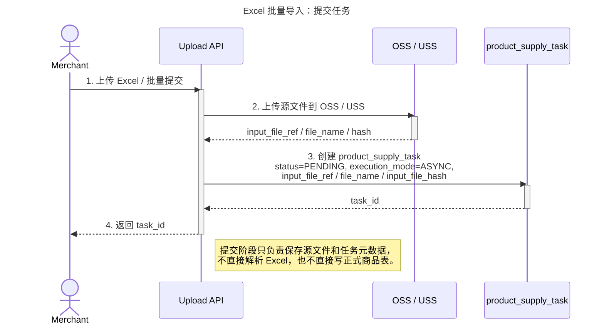
```mermaid
sequenceDiagram
  title Excel 批量导入：提交任务
  actor Merchant
  participant API as Upload API
  participant FileStore as OSS / USS
  participant TaskDB as product_supply_task

  Merchant->>API: 1. 上传 Excel / 批量提交
  activate API
  API->>FileStore: 2. 上传源文件到 OSS / USS
  activate FileStore
  FileStore-->>API: input_file_ref / file_name / hash
  deactivate FileStore

  API->>TaskDB: 3. 创建 product_supply_task<br/>status=PENDING, execution_mode=ASYNC,<br/>input_file_ref / file_name / input_file_hash
  activate TaskDB
  TaskDB-->>API: task_id
  deactivate TaskDB

  API-->>Merchant: 4. 返回 task_id
  deactivate API

  Note right of API: 提交阶段只负责保存源文件和任务元数据，<br/>不直接解析 Excel，也不直接写正式商品表。
```

### 24.8.3 Parser Worker

Parser Worker 只负责解析，不负责发布。

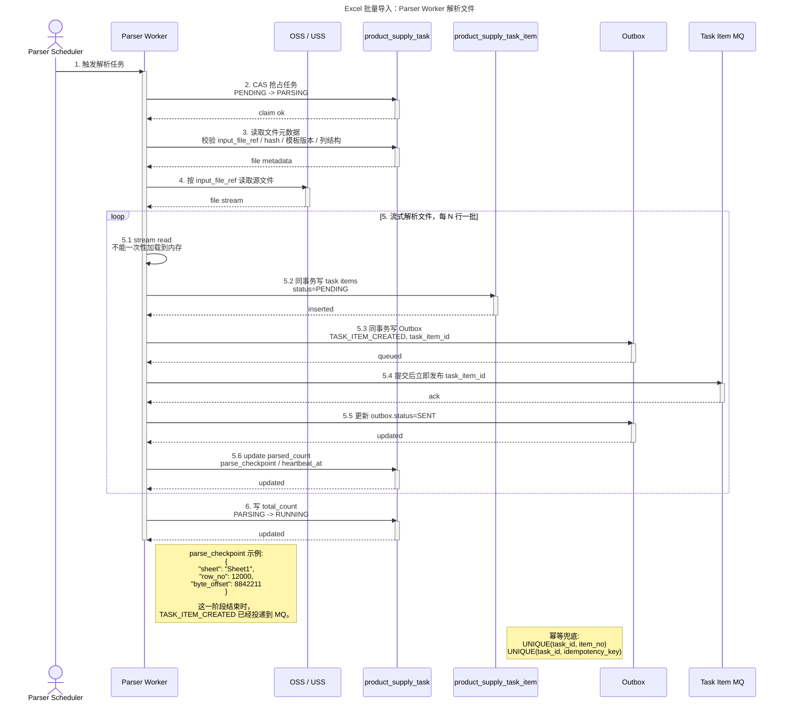
```mermaid
sequenceDiagram
  title Excel 批量导入：Parser Worker 解析文件
  actor Scheduler as Parser Scheduler
  participant Parser as Parser Worker
  participant FileStore as OSS / USS
  participant TaskDB as product_supply_task
  participant ItemDB as product_supply_task_item
  participant Outbox
  participant ItemMQ as Task Item MQ

  Scheduler->>Parser: 1. 触发解析任务
  activate Parser
  Parser->>TaskDB: 2. CAS 抢占任务<br/>PENDING -> PARSING
  activate TaskDB
  TaskDB-->>Parser: claim ok
  deactivate TaskDB

  Parser->>TaskDB: 3. 读取文件元数据<br/>校验 input_file_ref / hash / 模板版本 / 列结构
  activate TaskDB
  TaskDB-->>Parser: file metadata
  deactivate TaskDB

  Parser->>FileStore: 4. 按 input_file_ref 读取源文件
  activate FileStore
  FileStore-->>Parser: file stream
  deactivate FileStore

  loop 5. 流式解析文件，每 N 行一批
    Parser->>Parser: 5.1 stream read<br/>不能一次性加载到内存
    Parser->>ItemDB: 5.2 同事务写 task items<br/>status=PENDING
    activate ItemDB
    ItemDB-->>Parser: inserted
    deactivate ItemDB

    Parser->>Outbox: 5.3 同事务写 Outbox<br/>TASK_ITEM_CREATED, task_item_id
    activate Outbox
    Outbox-->>Parser: queued
    deactivate Outbox

    Parser->>ItemMQ: 5.4 提交后立即发布 task_item_id
    activate ItemMQ
    ItemMQ-->>Parser: ack
    deactivate ItemMQ

    Parser->>Outbox: 5.5 更新 outbox.status=SENT
    activate Outbox
    Outbox-->>Parser: updated
    deactivate Outbox

    Parser->>TaskDB: 5.6 update parsed_count<br/>parse_checkpoint / heartbeat_at
    activate TaskDB
    TaskDB-->>Parser: updated
    deactivate TaskDB
  end

  Parser->>TaskDB: 6. 写 total_count<br/>PARSING -> RUNNING
  activate TaskDB
  TaskDB-->>Parser: updated
  deactivate TaskDB
  deactivate Parser

  Note right of Parser: parse_checkpoint 示例:<br/>{<br/>  "sheet": "Sheet1",<br/>  "row_no": 12000,<br/>  "byte_offset": 8842211<br/>}<br/><br/>这一阶段结束时，<br/>TASK_ITEM_CREATED 已经投递到 MQ。
  Note right of ItemDB: 幂等兜底:<br/>UNIQUE(task_id, item_no)<br/>UNIQUE(task_id, idempotency_key)
```

```text
1. CAS 抢占 product_supply_task
2. 读取 product_supply_task 中的文件元数据，校验 input_file_ref、文件 hash、模板版本和列结构
3. 流式读取文件，不能一次性加载到内存
4. 每 N 行批量插入 product_supply_task_item
5. 更新 parsed_count、parse_checkpoint、heartbeat_at
6. 解析完成后写 total_count
7. task.status 从 PARSING 推进到 RUNNING
```

`parse_checkpoint` 示例：

```json
{
  "sheet": "Sheet1",
  "row_no": 12000,
  "byte_offset": 8842211
}
```

Excel 不一定天然支持稳定的 `byte_offset` 恢复。工程上可以先把上传文件转换成规范化 CSV 或行级 JSONL，再按 offset 恢复；也可以按 `row_no` 从头快速跳过。

重复解析靠唯一键兜住：

```text
UNIQUE(task_id, item_no)
UNIQUE(task_id, idempotency_key)
```

### 24.8.4 Item Worker

Item Worker 的主链路应改为消费 `Task Item MQ`，而不是高频扫表抢小批量 item。扫表只保留给补偿、超时回收和死信重放。

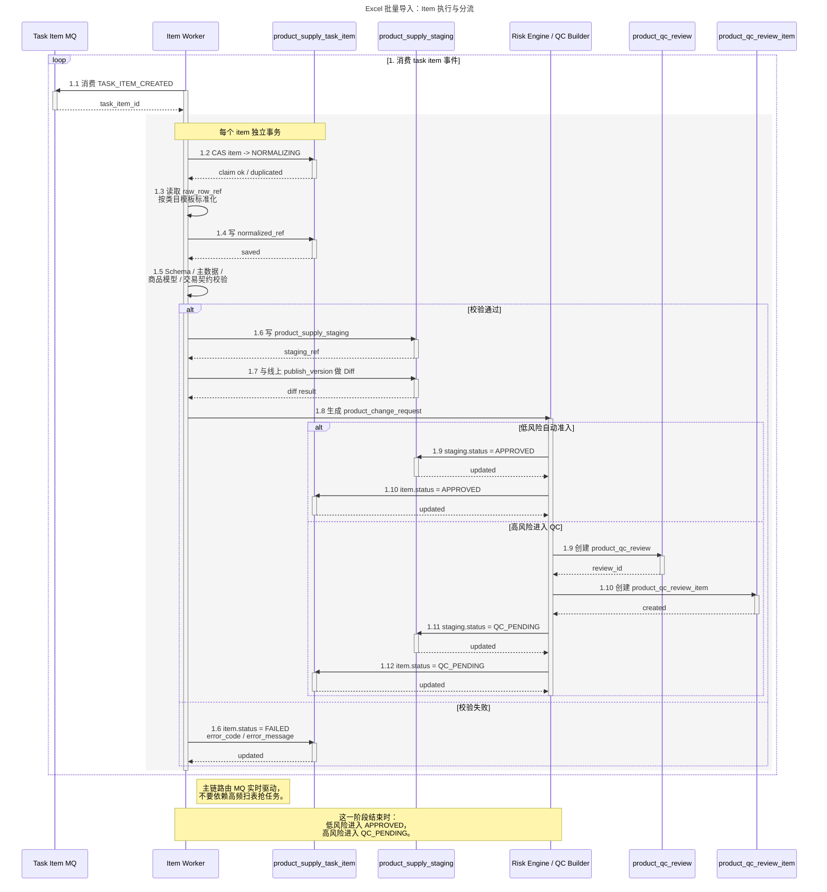
```mermaid
sequenceDiagram
  title Excel 批量导入：Item 执行与分流
  participant ItemMQ as Task Item MQ
  participant ItemWorker as Item Worker
  participant ItemDB as product_supply_task_item
  participant StagingDB as product_supply_staging
  participant Risk as Risk Engine / QC Builder
  participant QCDB as product_qc_review
  participant QCItemDB as product_qc_review_item

  loop 1. 消费 task item 事件
    ItemWorker->>ItemMQ: 1.1 消费 TASK_ITEM_CREATED
    activate ItemWorker
    activate ItemMQ
    ItemMQ-->>ItemWorker: task_item_id
    deactivate ItemMQ

    rect rgb(245, 245, 245)
      Note over ItemWorker,ItemDB: 每个 item 独立事务
      ItemWorker->>ItemDB: 1.2 CAS item -> NORMALIZING
      activate ItemDB
      ItemDB-->>ItemWorker: claim ok / duplicated
      deactivate ItemDB

      ItemWorker->>ItemWorker: 1.3 读取 raw_row_ref<br/>按类目模板标准化
      ItemWorker->>ItemDB: 1.4 写 normalized_ref
      activate ItemDB
      ItemDB-->>ItemWorker: saved
      deactivate ItemDB

      ItemWorker->>ItemWorker: 1.5 Schema / 主数据 /<br/>商品模型 / 交易契约校验

      alt 校验通过
        ItemWorker->>StagingDB: 1.6 写 product_supply_staging
        activate StagingDB
        StagingDB-->>ItemWorker: staging_ref
        deactivate StagingDB

        ItemWorker->>StagingDB: 1.7 与线上 publish_version 做 Diff
        activate StagingDB
        StagingDB-->>ItemWorker: diff result
        deactivate StagingDB

        ItemWorker->>Risk: 1.8 生成 product_change_request
        activate Risk

        alt 低风险自动准入
          Risk->>StagingDB: 1.9 staging.status = APPROVED
          activate StagingDB
          StagingDB-->>Risk: updated
          deactivate StagingDB
          Risk->>ItemDB: 1.10 item.status = APPROVED
          activate ItemDB
          ItemDB-->>Risk: updated
          deactivate ItemDB
        else 高风险进入 QC
          Risk->>QCDB: 1.9 创建 product_qc_review
          activate QCDB
          QCDB-->>Risk: review_id
          deactivate QCDB
          Risk->>QCItemDB: 1.10 创建 product_qc_review_item
          activate QCItemDB
          QCItemDB-->>Risk: created
          deactivate QCItemDB
          Risk->>StagingDB: 1.11 staging.status = QC_PENDING
          activate StagingDB
          StagingDB-->>Risk: updated
          deactivate StagingDB
          Risk->>ItemDB: 1.12 item.status = QC_PENDING
          activate ItemDB
          ItemDB-->>Risk: updated
          deactivate ItemDB
        end

        deactivate Risk
      else 校验失败
        ItemWorker->>ItemDB: 1.6 item.status = FAILED<br/>error_code / error_message
        activate ItemDB
        ItemDB-->>ItemWorker: updated
        deactivate ItemDB
      end
    end

    deactivate ItemWorker
  end

  Note right of ItemWorker: 主链路由 MQ 实时驱动，<br/>不要依赖高频扫表抢任务。
  Note over ItemWorker,Risk: 这一阶段结束时：<br/>低风险进入 APPROVED，<br/>高风险进入 QC_PENDING。
```

每个 item 或小批次独立事务：

```text
读取 raw_row_ref
  → CAS 将 item 推进到 NORMALIZING
  → 按类目模板标准化
  → 写 normalized_ref
  → 执行 Schema / 主数据 / 商品模型 / 交易契约校验
  → 校验通过后写 product_supply_staging
  → 与线上 publish_version 做 Diff
  → 生成 product_change_request
  → 根据 risk_level 将 staging / item 分流到 APPROVED 或 QC_PENDING
  → 更新 item.status
```

不要用一个大事务包住 500 行。否则一行失败会拖垮整批，也会造成长事务和锁等待。补偿任务如果需要扫表，也应该只扫超时未完成、需要重试或进入 DLQ 回放的少量 item，而不是作为主执行路径。

### 24.8.5 QC 流程

QC 流程应从 Item 主链路里拆开。Item Worker 只负责把高风险变更送进 `QC_PENDING`，后续由审核工作台和 QC Worker 推进。

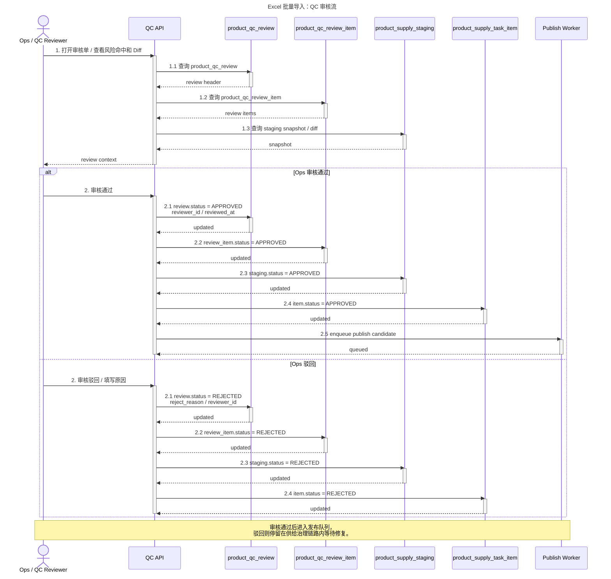
```mermaid
sequenceDiagram
  title Excel 批量导入：QC 审核流
  actor Ops as Ops / QC Reviewer
  participant QCAPI as QC API
  participant QCDB as product_qc_review
  participant QCItemDB as product_qc_review_item
  participant StagingDB as product_supply_staging
  participant ItemDB as product_supply_task_item
  participant Publish as Publish Worker

  Ops->>QCAPI: 1. 打开审核单 / 查看风险命中和 Diff
  activate QCAPI
  QCAPI->>QCDB: 1.1 查询 product_qc_review
  activate QCDB
  QCDB-->>QCAPI: review header
  deactivate QCDB
  QCAPI->>QCItemDB: 1.2 查询 product_qc_review_item
  activate QCItemDB
  QCItemDB-->>QCAPI: review items
  deactivate QCItemDB
  QCAPI->>StagingDB: 1.3 查询 staging snapshot / diff
  activate StagingDB
  StagingDB-->>QCAPI: snapshot
  deactivate StagingDB
  QCAPI-->>Ops: review context
  deactivate QCAPI

  alt Ops 审核通过
    Ops->>QCAPI: 2. 审核通过
    activate QCAPI
    QCAPI->>QCDB: 2.1 review.status = APPROVED<br/>reviewer_id / reviewed_at
    activate QCDB
    QCDB-->>QCAPI: updated
    deactivate QCDB
    QCAPI->>QCItemDB: 2.2 review_item.status = APPROVED
    activate QCItemDB
    QCItemDB-->>QCAPI: updated
    deactivate QCItemDB
    QCAPI->>StagingDB: 2.3 staging.status = APPROVED
    activate StagingDB
    StagingDB-->>QCAPI: updated
    deactivate StagingDB
    QCAPI->>ItemDB: 2.4 item.status = APPROVED
    activate ItemDB
    ItemDB-->>QCAPI: updated
    deactivate ItemDB
    QCAPI->>Publish: 2.5 enqueue publish candidate
    activate Publish
    Publish-->>QCAPI: queued
    deactivate Publish
    deactivate QCAPI
  else Ops 驳回
    Ops->>QCAPI: 2. 审核驳回 / 填写原因
    activate QCAPI
    QCAPI->>QCDB: 2.1 review.status = REJECTED<br/>reject_reason / reviewer_id
    activate QCDB
    QCDB-->>QCAPI: updated
    deactivate QCDB
    QCAPI->>QCItemDB: 2.2 review_item.status = REJECTED
    activate QCItemDB
    QCItemDB-->>QCAPI: updated
    deactivate QCItemDB
    QCAPI->>StagingDB: 2.3 staging.status = REJECTED
    activate StagingDB
    StagingDB-->>QCAPI: updated
    deactivate StagingDB
    QCAPI->>ItemDB: 2.4 item.status = REJECTED
    activate ItemDB
    ItemDB-->>QCAPI: updated
    deactivate ItemDB
    deactivate QCAPI
  end

  Note over Ops,Publish: 审核通过后进入发布队列，<br/>驳回则停留在供给治理链路内等待修复。
```

```text
item.status = QC_PENDING
  → 创建 product_qc_review / product_qc_review_item
  → 审核员领取 review
  → 逐条查看 diff / 风险原因 / 规则命中
  → 审核通过: item.status = QC_APPROVED, staging.status = APPROVED
  → 审核驳回: item.status = FAILED 或 QC_REJECTED, staging.status = REJECTED
```

工程上要注意两点：

1. `product_qc_review` 适合作为审核单头，`product_qc_review_item` 作为行级审核项。
2. 审核动作要记录 reviewer、decision、reason、reviewed_at，避免只改状态不留审计。

### 24.8.6 Publisher 流程

Publisher 也应从 Item Worker 中拆开。它只消费已经进入 `APPROVED / QC_APPROVED` 的 staging 或 publish candidate，不再重复做标准化和风险判断。

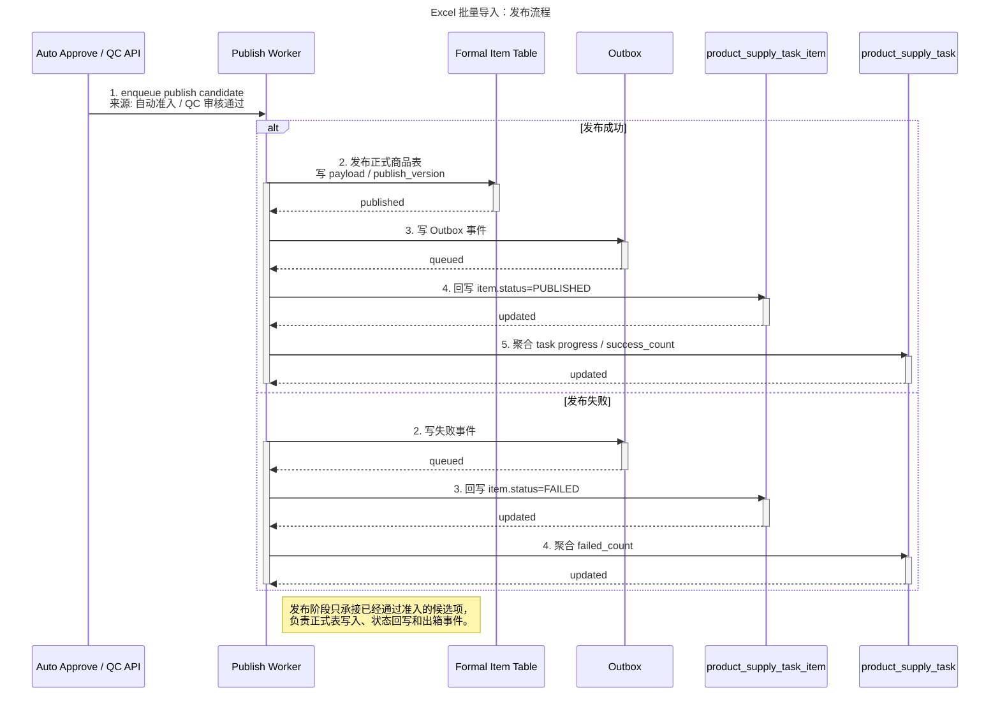
```mermaid
sequenceDiagram
  title Excel 批量导入：发布流程
  participant Trigger as Auto Approve / QC API
  participant Publish as Publish Worker
  participant FormalTable as Formal Item Table
  participant Outbox
  participant ItemDB as product_supply_task_item
  participant TaskDB as product_supply_task

  Trigger->>Publish: 1. enqueue publish candidate<br/>来源: 自动准入 / QC 审核通过

  alt 发布成功
    Publish->>FormalTable: 2. 发布正式商品表<br/>写 payload / publish_version
    activate Publish
    activate FormalTable
    FormalTable-->>Publish: published
    deactivate FormalTable

    Publish->>Outbox: 3. 写 Outbox 事件
    activate Outbox
    Outbox-->>Publish: queued
    deactivate Outbox

    Publish->>ItemDB: 4. 回写 item.status=PUBLISHED
    activate ItemDB
    ItemDB-->>Publish: updated
    deactivate ItemDB

    Publish->>TaskDB: 5. 聚合 task progress / success_count
    activate TaskDB
    TaskDB-->>Publish: updated
    deactivate TaskDB
    deactivate Publish
  else 发布失败
    Publish->>Outbox: 2. 写失败事件
    activate Publish
    activate Outbox
    Outbox-->>Publish: queued
    deactivate Outbox

    Publish->>ItemDB: 3. 回写 item.status=FAILED
    activate ItemDB
    ItemDB-->>Publish: updated
    deactivate ItemDB

    Publish->>TaskDB: 4. 聚合 failed_count
    activate TaskDB
    TaskDB-->>Publish: updated
    deactivate TaskDB
    deactivate Publish
  end

  Note right of Publish: 发布阶段只承接已经通过准入的候选项，<br/>负责正式表写入、状态回写和出箱事件。
```

```text
Publish Worker
  → 领取 APPROVED / QC_APPROVED 的 staging
  → CAS staging -> PUBLISHING
  → 写正式商品表 / 索引刷新 / 缓存失效
  → 同事务写 Outbox
  → 更新 item.status = SUCCESS
  → 更新 staging.status = PUBLISHED
```

如果发布失败：

```text
PUBLISHING
  → RETRY_WAITING / FAILED / DLQ
```

这样拆开以后，职责边界更清晰：

| 组件 | 主要职责 |
|------|----------|
| Item Worker | 标准化、校验、写 staging、风险分流 |
| QC Worker / 审核台 | 人工审核高风险变更 |
| Publish Worker | 只处理已准入的发布动作 |
| Report Generator | 聚合终态结果，生成错误文件与质量报告 |

### 24.8.7 Report / 错误文件生成流程

Report Generator 可以独立于 Publish Worker。它订阅任务终态事件，或扫描已经进入终态的 task，聚合行级错误、QC 结果和发布结果，生成运营可读的错误文件与质量报告。

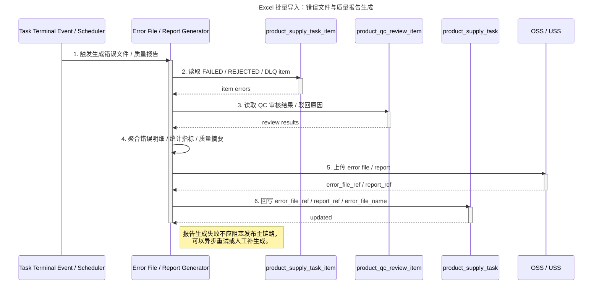
```mermaid
sequenceDiagram
  title Excel 批量导入：错误文件与质量报告生成
  participant Trigger as Task Terminal Event / Scheduler
  participant Report as Error File / Report Generator
  participant ItemDB as product_supply_task_item
  participant QCDB as product_qc_review_item
  participant TaskDB as product_supply_task
  participant FileStore as OSS / USS

  Trigger->>Report: 1. 触发生成错误文件 / 质量报告
  activate Report
  Report->>ItemDB: 2. 读取 FAILED / REJECTED / DLQ item
  activate ItemDB
  ItemDB-->>Report: item errors
  deactivate ItemDB

  Report->>QCDB: 3. 读取 QC 审核结果 / 驳回原因
  activate QCDB
  QCDB-->>Report: review results
  deactivate QCDB

  Report->>Report: 4. 聚合错误明细 / 统计指标 / 质量摘要
  Report->>FileStore: 5. 上传 error file / report
  activate FileStore
  FileStore-->>Report: error_file_ref / report_ref
  deactivate FileStore

  Report->>TaskDB: 6. 回写 error_file_ref / report_ref / error_file_name
  activate TaskDB
  TaskDB-->>Report: updated
  deactivate TaskDB
  deactivate Report

  Note right of Report: 报告生成失败不应阻塞发布主链路，<br/>可以异步重试或人工补生成。
```

```text
Report Generator
  → 监听 task 终态事件或定时扫描终态 task
  → 聚合 FAILED / REJECTED / DLQ item
  → 拼装错误文件和质量报告
  → 上传文件存储
  → 回写 product_supply_task.error_file_ref / report_ref
```

### 24.8.8 状态机引用

批量导入链路中的 `task` 与 `task_item` 状态机，建议统一收敛到 [24.3 商品生命周期管理](#/part02/05-product-supply-ops.html?highlight=24.3) 中维护，避免在执行链路章节重复定义后逐渐漂移。

在本节里可以只记住两点：

1. `task` 负责表达整批任务的阶段推进，如 `PENDING → PARSING → RUNNING → QC_REVIEWING → PUBLISHING → SUCCESS/PARTIAL_FAILED/FAILED`。
2. `task_item` 负责表达行级执行状态，如标准化、校验、进入 QC、发布成功、失败重试或进入 DLQ。

具体状态定义、状态说明和聚合规则，见 `24.3.2.5 Task 状态机` 与 `24.3.2.6 Task Item 状态机`。

### 24.8.9 错误文件

错误文件要能指导运营修复，而不是只写“导入失败”。

```text
row_no, object_key, field, error_code, error_message, suggestion
12, SKU_001, price, PRICE_TOO_LOW, price lower than floor price, adjust price >= 100
25, OFFER_014, refund_rule, REFUND_RULE_MISSING, refund rule is required, choose a refund template
31, HOTEL_020, city_code, CITY_NOT_FOUND, city cannot map to platform city, add city mapping first
```

错误文件应该从 `product_supply_task_item` 和 `product_validation_result` 生成，而不是从日志里拼。

生成错误文件后，直接回写 `product_supply_task.error_file_ref` 和 `error_file_name`，这样运营后台可以通过 task 直接找到源文件和错误文件。

---

## 24.9 供应商商品同步链路

### 24.9.1 为什么单独设计

供应商同步和批量导入有相似之处：都是外部或非正式数据进入平台商品模型，都需要任务、明细、标准化、校验、Diff、发布和补偿。

但供应商同步还有额外复杂度：

| 维度 | 批量导入 / 批量编辑 | 供应商同步 |
|------|---------------------|------------|
| 来源 | 运营、商家、内部系统 | 外部供应商 |
| 触发方式 | 人工上传、运营操作 | 定时、全量、增量、Push、刷新 |
| 数据形态 | Excel、CSV、表单 | API、消息、分页、游标 |
| 失败原因 | 格式错误、字段缺失、人工误操作 | 超时、限流、5xx、游标失效、字段漂移 |
| 恢复重点 | 错误文件、失败行重提 | Checkpoint、Worker Lease、Raw Snapshot、DLQ |
| 新鲜度 | 通常不是秒级 | 很多品类强依赖新鲜度 |
| 交易前确认 | 多数依赖平台配置 | Hotel / Flight / Movie 必须实时确认 |

### 24.9.2 推荐架构

```text
Supplier Adapter
  → Sync Task / Batch
  → Page / Cursor Fetch
  → Raw Snapshot
  → Normalize
  → Quality Check
  → Supplier Mapping
  → Diff
  → product_supply_staging
  → Auto Approve / QC Review
  → Publish
  → Search / Cache / Downstream Event
  → Metrics / DLQ / Compensation
```

同步执行层使用专项表：

```text
supplier_sync_task
supplier_sync_batch
supplier_sync_snapshot
supplier_sync_diff_log
supplier_sync_dead_letter
```

发布治理层复用供给平台：

```text
product_supply_task
product_supply_task_item
product_supply_staging
product_validation_result
product_change_request
product_qc_review
product_qc_review_item
product_publish_snapshot
product_outbox_event
```

### 24.9.3 新鲜度分层

不同数据的刷新策略不同。

| 数据类型 | 示例 | 新鲜度要求 | 策略 |
|----------|------|------------|------|
| 静态资源 | 酒店名称、地址、设施、机场、车站 | 小时级或天级 | 全量 + 增量同步 |
| 半动态数据 | 酒店最低价、可售状态、热门库存水位 | 分钟级 | 定时刷新 + 热门加频 |
| 强动态数据 | 机票报价、座位图、下单前房态房价 | 秒级或实时 | 搜索缓存，详情刷新，下单实时确认 |
| 交易契约 | 退款规则、履约参数、供应商映射 | 强一致倾向 | 发布版本控制，不随意覆盖 |

原则是：

> 列表页可以快，详情页要准，创单必须安全。

---

## 24.10 标准化、质量校验与风险审核

### 24.10.1 标准化

不同入口的数据格式不同，但必须统一到平台商品模型：

```text
入口数据
  → Resource
  → SPU / SKU
  → Offer / Rate Plan
  → Stock Config / Sellable Rule
  → Input Schema
  → Fulfillment Rule
  → Refund Rule
```

标准化阶段要记录字段来源和 payload hash：

```text
field_source:
  title: OPS
  hotel_address: SUPPLIER
  refund_rule: PLATFORM
```

这对字段主导权、供应商覆盖、事故追溯非常重要。

### 24.10.2 质量校验

质量校验不能只做字段必填。

| 校验层 | 校验内容 | 失败处理 |
|--------|----------|----------|
| Schema 校验 | 类型、必填、枚举、长度、格式 | 行级失败 |
| 类目模板校验 | 类目要求的对象和字段是否完整 | 阻断提交 |
| 主数据校验 | 城市、商户、品牌、Resource 是否存在 | 进入人工映射 |
| 商品模型校验 | SPU、SKU、Offer、Rate Plan 关系是否成立 | 阻断发布 |
| 交易契约校验 | 库存来源、Input Schema、履约规则、退款规则 | 阻断发布 |
| 可售校验 | 商品状态、库存、价格、渠道、站点是否允许售卖 | 阻断上线或告警 |
| 风险校验 | 价格、类目、履约、退款、映射是否高风险 | 自动准入、进入 QC 或阻断 |

### 24.10.3 来源准入与风险审核

审核策略应该差异化，而不是所有变更都人工 QC。这里的“审核”落库到 `product_qc_review` 和 `product_qc_review_item`，`product_change_request` 负责记录字段 Diff 和风险结论，QC 表负责记录审核工单和审核结论。

准入策略先看来源，再看风险：

```text
qc_policy =
  source_policy
  + operator_trust_level
  + risk_level
  + category_policy
  + field_policy
```

默认推荐：

| 来源 | 默认策略 | 说明 |
|------|----------|------|
| `LOCAL_OPS` | `AUTO_APPROVE` | 本地运营是内部可信操作源，校验通过后自动准入，不创建 QC 审核单 |
| `MERCHANT` | `QC_REQUIRED` | 商家是外部操作源，上传创建和编辑默认进入 QC |
| `SUPPLIER` | 风险分流 | 静态低风险字段可自动准入，高风险 Diff 进入 QC |
| `SYSTEM` | 继承策略 | 补偿、回放、迁移任务继承原始任务或质量问题单策略 |

这个策略能避免两个极端：一是把本地运营所有动作都堆进 QC，导致运营效率很低；二是让商家自助上传绕过 QC，导致低质量商品污染线上。

```text
risk_score =
  field_weight
  + change_ratio_weight
  + category_weight
  + operator_risk_weight
  + product_heat_weight
  + supplier_quality_weight
```

| 变更类型 | 风险等级 | 策略 |
|----------|----------|------|
| 本地运营创建商品 | 低/中 | 校验通过后自动准入，不创建 QC |
| 商家上传商品 | 低/中 | 默认进入 QC，审核素材、类目、交易契约 |
| 标题、描述、小图修正 | 低 | 本地运营自动准入，商家进入 QC |
| 普通图片变更 | 低/中 | 图片质量校验通过后，本地运营自动准入，商家进入 QC |
| 库存水位调整 | 中 | 自动校验，通过后发布，异常告警 |
| 价格或 Offer 规则变更 | 中高 | 超阈值进入 QC |
| 类目变更 | 高 | 强制 QC |
| 履约类型或退款规则变更 | 高 | 强制 QC |
| Resource / Supplier Mapping 变更 | 高 | 强制 QC 并触发巡检 |

QC 审核单要保存：

```text
review_id
task_id
source_type
staging_id
change_id
changed_fields
risk_level
review_policy
reviewer_id
review_note
reject_reason
status
```

审核员看到的不是一段 JSON，而是字段级 Diff、风险原因、历史版本、供应商原始数据或运营输入证据。

### 24.10.4 QC 阶段位置

QC 是发布前质量闸口，不是录入阶段，也不是最终商品主表。但并不是所有来源都需要 QC：商家上传默认需要，本地运营上传默认不需要。

```text
供给入口
  → Draft / Task / Item
  → Staging
  → Validation
  → Diff / Risk
  → Source Policy
  → Auto Approve / QC Pending / Block
  → QC Review
  → Publish
```

不同入口的 QC 处理方式不同：

| 入口 | QC 触发点 | 处理方式 |
|------|-----------|----------|
| 本地运营单商品创建 | 后端强校验通过后 | 自动准入，不创建 QC 审核单 |
| 商家单商品创建 | 后端强校验通过后 | 创建 QC 审核单，QC 通过后发布 |
| 本地运营编辑 | 字段 Diff 和风险评分后 | 默认自动准入，高危动作走权限和二次确认 |
| 商家编辑 | 字段 Diff 和风险评分后 | 默认进入 QC，驳回后回到 Draft |
| 本地运营批量导入 | 每个 `product_supply_task_item` 校验完成后 | 成功项自动准入，失败项生成错误文件 |
| 商家批量导入 | 每个 `product_supply_task_item` 校验完成后 | 成功项生成 QC item，不阻塞失败项错误文件 |
| 批量编辑 | 每个商品、SKU、Offer 或规则 Diff 后 | 按来源和风险生成准入策略，支持部分通过、部分驳回 |
| 供应商同步 | Normalize + Diff 后 | 高风险差异进入 QC，低风险差异自动发布 |
| 质量巡检 | 缺陷修复提交后 | 修复结果进入 QC，避免修复动作二次污染线上 |

QC 的关键原则是：**QC 通过才允许进入发布事务，QC 驳回不能修改正式商品表**。驳回项应该回到 Draft、错误文件、DLQ 或质量问题单，由运营修复后重新提交。

---

## 24.11 发布一致性设计

QC 通过或自动准入不代表商品已经可售。发布要保证商品主数据、资源映射、交易契约、库存可售、搜索缓存和下游系统最终一致。

### 24.24.1 发布事务

```text
QC 通过 / 自动准入
  → 开启发布事务
  → 写 Resource / SPU / SKU / Offer / Rate Plan
  → 写 Stock Config / Sellable Rule
  → 写 Input Schema / Fulfillment Rule / Refund Rule
  → 生成 publish_version
  → 写 product_publish_snapshot
  → 写 product_change_log
  → 写 product_outbox_event
  → 提交事务
  → 异步刷新搜索、缓存、计价上下文、数据平台
  → 如涉及活动配置，异步调用营销系统命令
```

发布事务内只做商品中心必须强一致的事情。ES 刷新、缓存失效、计价上下文刷新都通过 Outbox 异步执行；营销活动配置走营销系统命令或营销资格事件，不放进商品发布事务同步调用。

发布前必须二次确认 QC 状态：

```sql
SELECT status
FROM product_qc_review
WHERE review_id = ?
  AND status = 'APPROVED';
```

如果高风险变更没有对应的 `APPROVED` QC 审核单，Publish Worker 必须拒绝发布。这样可以防止绕过审核接口直接调用发布接口。

### 24.24.2 发布版本和快照

每次发布生成 `publish_version`：

```text
product_id = 10001
old_publish_version = 21
new_publish_version = 22
```

发布快照用于：

1. 订单创单保存商品上下文。
2. 事故回滚。
3. 对账和排查。
4. 审核复盘。
5. 搜索索引一致性校验。

订单系统不能回读最新商品解释历史订单，必须保存：

```text
商品快照
报价快照
履约契约快照
退款规则快照
供应商映射快照
```

### 24.24.3 Outbox

Outbox 事件示例：

```text
ProductPublished
ProductContentChanged
OfferChanged
SellableRuleChanged
FulfillmentRuleChanged
SearchIndexRefreshRequired
ProductCacheInvalidationRequired
```

`product_outbox_event` 至少包含：

```text
event_id
event_type
aggregate_type
aggregate_id
publish_version
payload
status
retry_count
next_retry_at
```

如果搜索刷新失败，不回滚商品发布，而是进入 Outbox 补偿。

---

## 24.12 运营管理能力

### 24.12.1 字段主导权

字段主导权解决的是“供应商同步和人工运营谁覆盖谁”。

| 字段 | 主导方 | 供应商同步能否覆盖 | 运营策略 |
|------|--------|-------------------|----------|
| 标题、卖点、活动标签 | 平台运营 | 否 | 运营编辑为准 |
| 酒店名称、地址、设施 | 供应商/平台治理 | 低风险可覆盖，高风险审核 | 可人工修正并设置保护期 |
| 展示图片 | 平台运营/供应商 | 取决于来源质量 | 图片变更需要质量校验 |
| 基础价、Rate Plan | 供应商/计价 | 取决于品类 | 超阈值审核 |
| 库存水位、可售状态 | 库存域/供应商 | 是 | 人工覆盖必须有有效期 |
| 退款规则、履约规则 | 平台/供应商契约 | 高风险覆盖 | 强制 QC |
| 类目、Resource 映射 | 平台治理 | 否 | 强制 QC 和数据巡检 |

当运营覆盖供应商字段时，建议记录：

```text
field_path
owner_type
override_until
override_reason
operator_id
```

供应商同步遇到保护字段时，不自动覆盖，只记录 Diff 和冲突日志。

### 24.12.2 权限与审计

权限要拆成两层：

1. **功能权限**：是否能创建、编辑、导入、审核、发布。
2. **数据范围权限**：能操作哪些类目、商家、供应商、站点、渠道。

审计日志至少记录：

```text
who
when
what
before
after
reason
trace_id
task_id
publish_version
```

高风险操作必须强制备注，例如：

1. 批量改价。
2. 类目迁移。
3. 退款规则变更。
4. 供应商映射变更。
5. 热门商品下架。

### 24.12.3 回滚与灰度

回滚不是简单把字段改回去。需要区分：

| 回滚对象 | 处理 |
|----------|------|
| 商品主数据 | 回滚到指定 `publish_version` |
| 搜索索引 | 根据快照重建索引 |
| 缓存 | 失效或刷新旧版本 |
| 营销圈品 | 重新向营销系统提交活动配置命令，或重新投递商品营销资格事件 |
| 订单 | 不回滚历史订单快照 |

灰度发布可以按：

1. 站点。
2. 渠道。
3. 城市。
4. 白名单用户。
5. 商品热度。

---

## 24.13 DLQ、补偿与质量巡检

### 24.13.1 失败分类

| 失败类型 | 示例 | 处理 |
|----------|------|------|
| 输入失败 | Excel 字段非法、必填缺失 | 生成错误文件，运营修复后重新提交 |
| 映射失败 | 城市、商户、品牌、Resource 找不到 | 进入人工映射队列 |
| 审核失败 | 高风险变更被驳回 | 回到草稿，保留驳回原因 |
| 发布失败 | DB 冲突、版本过期 | 重试或要求基于最新版本重新编辑 |
| 下游失败 | ES 刷新失败、缓存失效失败 | Outbox 补偿 |
| 质量失败 | 缺图、缺价、无库存、不可履约 | 质量巡检下架或告警 |

### 24.13.2 DLQ 表

`product_supply_dead_letter` 是可运营问题单，不只是消息队列里的失败消息。

```text
dead_letter_id
task_id
item_no
error_stage
error_type
error_code
error_message
raw_payload_ref
status
retry_count
next_retry_at
assignee
fix_note
```

DLQ 状态机：

```text
PENDING
  → RETRYING
  → RESOLVED

PENDING
  → MANUAL_FIX
  → RETRYING
  → RESOLVED

PENDING
  → IGNORED

RETRYING
  → FAILED
```

### 24.13.3 质量巡检

质量巡检要覆盖：

1. 缺图商品。
2. 缺价商品。
3. 无库存商品。
4. 无履约规则商品。
5. 退款规则缺失商品。
6. 供应商映射缺失商品。
7. 发布版本与搜索索引不一致。
8. 运营覆盖字段过期。

质量指标：

```text
商品质量缺陷率 = 缺陷商品数 / 在线商品数
发布失败率 = 发布失败任务 / 发布任务
索引刷新成功率 = ES 刷新成功 / 总刷新
DLQ 修复率 = RESOLVED DLQ / TOTAL DLQ
```

---

## 24.14 可观测性与稳定性

### 24.14.1 任务看板

运营后台至少要能看到：

```text
任务进度：总数、成功、失败、跳过、当前阶段
失败原因：错误码、错误字段、建议修复方式、错误文件
审核队列：风险等级、命中规则、Diff、责任人
发布结果：publish_version、Outbox 状态、索引/缓存刷新状态
质量看板：缺图、缺价、无库存、无履约规则、映射缺失
```

核心指标：

| 指标 | 说明 |
|------|------|
| 任务成功率 | 成功任务 / 总任务 |
| 行级成功率 | 成功 item / 总 item |
| 任务完成耗时 | 从创建到发布完成 |
| 自动准入占比 | 自动准入 / 总提交 |
| QC 驳回率 | 驳回 / QC 提交 |
| 发布失败率 | 发布失败 / 发布任务 |
| 索引刷新成功率 | ES 刷新成功 / 总刷新 |
| 商品质量缺陷率 | 缺图、缺价、无库存、映射缺失商品占比 |

### 24.14.2 隔离与限流

批量任务不能拖垮交易链路。

建议隔离：

1. 批量导入队列。
2. 批量发布队列。
3. 供应商同步队列。
4. Outbox 刷新队列。
5. 质量巡检队列。

大促前夜，运营批量改价、供应商全量同步、搜索索引重建如果共用同一组 Worker 和数据库连接池，很容易互相放大故障。默认策略应该是：

```text
交易读链路优先
单商品编辑优先
小批量发布优先
大批量任务限速
供应商异常熔断
```

### 24.14.3 幂等与并发

幂等分层：

| 层级 | 幂等 Key |
|------|----------|
| 任务触发 | `task_type + trigger_id` |
| 批量行级 | `task_id + item_no`、`task_id + idempotency_key` |
| 暂存对象 | `task_id + object_type + object_key` |
| 发布 | `object_id + payload_hash + base_publish_version` |
| Outbox | `event_id` |

并发控制：

1. 编辑基于 `base_publish_version`。
2. 发布时 CAS 校验版本。
3. 失败后要求重新基于最新版本生成 Diff。
4. 供应商同步遇到运营保护字段时不覆盖。

---

## 24.15 与其他系统的集成

### 24.15.1 商品中心

供给平台通过命令 API 写商品中心，不直连商品正式表。

命令应该表达业务意图：

```text
CreateProductDefinition
ChangeProductContent
ChangeOfferRule
ChangeRefundRule
PublishProductVersion
OfflineProduct
```

不要让运营后台执行：

```sql
UPDATE product_sku SET price = ? WHERE sku_id = ?;
```

### 24.15.2 库存系统

库存创建和修改的运营入口在供给平台，但库存事实必须留在库存系统。24.6 已经展开库存运营任务的设计，这里只强调系统集成边界：供给平台发起库存命令，库存系统幂等执行事实变更并返回事件。

供给平台可以发起的库存命令包括：

1. `CreateInventory`：初始化库存来源、范围、扣减时机和初始库存实例。
2. `AdjustInventory`：数量补货、库存调整、锁定和解锁。
3. `ImportCodeBatch / GenerateCodeBatch`：导入或生成券码批次，由库存系统加密落库和维护状态机。
4. `MaterializeTimeStoreStock`：创建门店、日期、时段等库存切片。
5. `RebuildAvailability`：发布可售规则并刷新可售投影。
6. 创单时仍由交易链路调用库存系统 Reserve / Confirm / Release。

这里的底线是：供给平台负责表单、审批、任务、错误文件、进度和审计；库存系统负责幂等执行、CAS、预占、账本和对账。不要让运营后台执行：

```sql
UPDATE inventory_balance SET available_stock = ? WHERE inventory_key = ?;
```

### 24.15.3 营销系统

供给平台可以和营销系统集成，但集成的是活动配置、圈品和营销资格，不是优惠计算。常见动作包括：

1. `BindProductToCampaign`：把商品、SKU 或门店范围加入活动。
2. `UpdatePromotionEligibility`：同步商品是否具备参加活动的资格。
3. `SyncProductMarketingTags`：同步活动标签、频道标签或运营分组。
4. `UnbindProductFromCampaign`：商品下架、售罄、禁售或活动结束时解除圈品。

边界要清楚：供给平台负责表单、审批、Diff、发布版本和审计；营销系统负责活动规则、预算、券、补贴、营销库存、优惠叠加和成本归因。供给平台不要保存最终活动价，也不要直接核销券或锁定营销预算。

活动配置不能放进商品发布事务里同步调用。更稳妥的链路是：

```text
商品发布 / 活动资格变更
  → 写 product_outbox_event
  → Marketing Coordinator 消费事件
  → 调用营销系统命令
  → 营销系统返回 CampaignBindingReady / Failed
  → 供给运营后台展示协同状态和补偿入口
```

### 24.15.4 计价系统

商品供给发布的是基础价格事实和 Offer 规则，计价系统根据商品版本、渠道、会员、营销活动和结算规则做试算。供给平台不要直接调用计价系统写最终成交价，发布后只通过 Outbox 让计价上下文消费者重建价格投影。

不要把活动价手填到商品表里，否则会造成：

1. 计价口径漂移。
2. 营销成本无法对账。
3. 退款时无法解释优惠来源。

### 24.15.5 搜索系统

发布后通过 Outbox 刷新搜索索引。供给平台不直接写 ES，也不把 ES 写入成功作为商品发布事务的一部分。

搜索索引要保存：

```text
product_id
publish_version
title
category
tags
display_price
sellable_status
updated_at
```

索引版本落后时，巡检任务要能发现：

```text
product_publish_version != search_index_publish_version
```

### 24.15.6 订单系统

供给平台不直接调用订单系统修改订单，也不向订单系统推送“最新商品配置”。订单系统只在创单时读取当时可交易上下文，并保存商品、报价、履约和退款规则快照。

订单创建时不能只保存 `sku_id`，还要保存商品上下文快照。

```text
product_snapshot
offer_snapshot
price_snapshot
input_schema_snapshot
fulfillment_rule_snapshot
refund_rule_snapshot
supplier_mapping_snapshot
```

这样后续商品改价、下架、退款规则调整，不影响历史订单解释。

---

## 24.16 答辩材料

本章相关总结、常见问题和参考要点已统一收录到[第 36 章](../part03/04-product-inventory-marketing-pricing-interview.md)。

**延伸阅读建议**：

- 第 22 章：商品中心模型（Resource、SPU/SKU、Offer、类目属性）
- 第 24 章：营销系统
- 第 26 章：计价系统设计与实现
- 第 24 章后半部分：统一供给与运营治理平台
- 第 24 章后半部分：供应商数据同步链路

---


## 24.17 统一供给与运营治理平台


### 24.17.1 背景

商品供给与运营治理平台解决的是“商品如何进入平台、如何被审核发布、如何创建和修改库存、上线后如何持续维护”的问题。它不是运营后台的 CRUD，也不是供应商同步的一组定时任务，而是一条长期运行的供给治理流水线。

在数字商品平台中，商品供给来源通常有五类：

```text
人工创建/上传
  → 运营或商家从 0 到 1 创建商品

批量导入
  → 通过模板、Excel、CSV 或文件批量创建和修改商品

运营编辑
  → 对线上商品做标题、图片、类目、价格、库存、上下架、履约和退款规则变更

库存创建 / 修改
  → 初始化库存、补货、导入券码、系统生码、锁库存、门店和日期库存调整

供应商同步
  → 从外部供应商全量、增量、Push 或主动刷新供给数据
```

供应商同步属于商品供给链路，但它不是商品供给链路的全部。更合理的设计是：用一套统一的供给治理控制面承接五类入口，共享任务模型、暂存区、校验、审核、发布版本、Outbox、DLQ、补偿和质量监控；其中供应商同步因为有长任务、Checkpoint、Raw Snapshot、Worker 租约和数据新鲜度问题，单独作为专项链路展开，详见本章后续的 `24.18` 小节。

本附录聚焦统一供给治理平台，尤其补足人工上传、批量导入、运营编辑和库存运营四条控制面链路。

### 24.17.2 整体方案介绍

这一节先不进入表设计和执行细节，而是先用一条主链路把统一供给治理平台串起来。核心目标是让读者先看到“整体怎么转”，再理解为什么后面需要 `Draft`、`Staging`、任务化执行、Outbox、DLQ 和补偿机制。

#### 24.17.2.1 全生命周期主链路总览

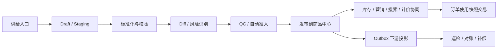
```mermaid
flowchart LR
    A["供给入口"] --> B["Draft / Staging"]
    B --> C["标准化与校验"]
    C --> D["Diff / 风险识别"]
    D --> E["QC / 自动准入"]
    E --> F["发布到商品中心"]
    F --> G["库存 / 营销 / 搜索 / 计价协同"]
    G --> H["订单使用快照交易"]
    F --> I["Outbox 下游投影"]
    I --> J["巡检 / 对账 / 补偿"]
```

这条主链路表达的是统一供给治理平台的核心职责：

1. 所有供给动作先进入 `Draft / Staging`，而不是直接污染正式商品。
2. 标准化、校验、Diff、风险识别和审核，构成正式发布前的门禁。
3. 发布之后不是“流程结束”，而是进入库存、营销、搜索、计价、缓存和订单快照的协同阶段。
4. 通过 Outbox、巡检、对账和补偿保证最终一致，而不是要求一次同步调用把所有下游都写成功。

#### 24.17.2.2 决策点：是否需要 `Staging`

很多系统只有 `Draft` 和 `Published` 两层，觉得“提交审核前是草稿，审核通过后是正式”就够了。但一旦涉及批量导入、供应商同步、差异审核和回滚，`Draft` 往往不够表达“已提交但未正式发布的快照”。

| 方案 | 优点 | 缺点 / 风险 | 适用场景 | 推荐结论 |
| --- | --- | --- | --- | --- |
| 方案 A：无 `Staging`，`Draft` 直接审核发布 | 状态简单 | 已提交版本和正在编辑版本难区分；批量治理困难 | 简单后台 | 有条件可用 |
| 方案 B：引入 `Staging` 作为提交快照 | 更适合审核、Diff、回滚、批处理 | 模型稍复杂 | 中大型供给平台 | 推荐 |

推荐方案是方案 B。`Draft` 表示“正在编辑的工作副本”，`Staging` 表示“已提交、待审核或待发布的静态快照”，两者语义不同，不建议合并。

#### 24.17.2.3 决策点：同步体验和异步任务如何分层

| 方案 | 优点 | 缺点 / 风险 | 适用场景 | 推荐结论 |
| --- | --- | --- | --- | --- |
| 方案 A：全部同步处理 | 用户感知简单 | 批量导入、供应商同步会拖垮接口 | 小流量、低复杂度 | 不推荐 |
| 方案 B：全部异步任务化 | 统一执行模型 | 单品创建体验差，交互成本高 | 内部工具型系统 | 不推荐 |
| 方案 C：单品同步体验，批量与长链路异步任务化 | 体验与治理平衡 | 需要双模式编排 | 平台型业务 | 推荐 |

推荐方案是方案 C：表单手工创建、低风险单品编辑保留同步交互；批量导入、批量编辑、券码导入、供应商同步全部任务化。

#### 24.17.2.4 设计目标

1. **入口统一**：人工创建、批量导入、运营编辑、库存创建 / 修改、供应商同步进入统一任务和发布框架。
2. **线上隔离**：所有未校验、未审核、未发布的数据只进入 Draft / Staging，不污染正式商品表。
3. **质量可控**：通过类目模板、主数据校验、交易契约校验、风险规则和审核流控制发布质量。
4. **发布一致**：商品主数据、资源映射、Offer、库存控制面、履约规则、退款规则、营销协同、搜索索引、缓存和计价上下文最终一致。
5. **失败可恢复**：任务、行级明细、错误文件、DLQ、Outbox 和补偿任务形成闭环。
6. **变更可追溯**：每次发布都有 Diff、审核记录、操作者、TraceID、发布版本和商品快照。
7. **运营可用**：运营能看到任务进度、失败原因、错误文件、审核状态、发布结果和质量报表。

### 24.17.3 核心难点与解决方法

| 难点 | 典型表现 | 风险 | 解决方法 |
|------|----------|------|----------|
| 入口多且语义不同 | 人工创建、批量导入、运营编辑、库存创建 / 修改、供应商同步都在改变供给能力 | 流程混乱、重复逻辑、审计缺失 | 统一为 Supply Task，但按 `task_type` 路由不同策略 |
| 未发布数据污染线上 | 表单保存、导入半成品直接写商品正式表 | 前台展示脏数据，订单拿到半成品契约 | Draft / Staging 与正式表分离，只有发布事务写正式表 |
| 类目差异大 | 酒店、话费、账单、券码、电影票字段完全不同 | 表单和校验 if-else 爆炸 | 类目模板 + 能力矩阵 + Schema 驱动表单和校验 |
| 批量导入规模大 | 大促前一次导入 10 万行商品或价格 | 内存爆、长事务、失败难定位 | 流式解析、行级任务、分批处理、部分成功、错误文件 |
| 运营误操作 | 批量改价、类目迁移、退款规则变更 | 资损、投诉、履约失败 | Diff、风险评分、二次确认、人工审核、灰度发布 |
| 供应商与运营冲突 | 供应商同步覆盖运营修正字段 | 运营修复失效，线上数据反复抖动 | 字段主导权、保护期、版本锁、冲突日志 |
| 审核策略粗糙 | 所有变更都人工审核或全部自动通过 | 效率低或风险失控 | 风险分级：低风险自动，中风险规则校验，高风险强审 |
| 发布不一致 | DB 成功，ES / 缓存 / 计价上下文没刷新，或营销活动协同失败 | 搜不到、价格错、活动不可用、下单失败 | 发布事务 + Outbox + 营销命令 + 异步投影 + 补偿重试 |
| 历史订单受影响 | 商品改价、改退款规则后影响旧订单 | 售后争议、财务对不上 | 创单保存商品快照、报价快照、履约和退款规则快照 |
| 失败不可运营 | 只在日志里记录导入失败 | 运营不知道怎么修 | MySQL DLQ + 错误文件 + 修复建议 + 重新投递 |
| 质量缺陷长期存在 | 缺图、缺价、无库存、无履约规则 | 转化差、履约失败 | 商品质量巡检、质量分、自动下架或告警 |

核心判断已统一收录到[第 36 章](../part03/04-product-inventory-marketing-pricing-interview.md)。

### 24.17.4 总体架构

架构图如下：

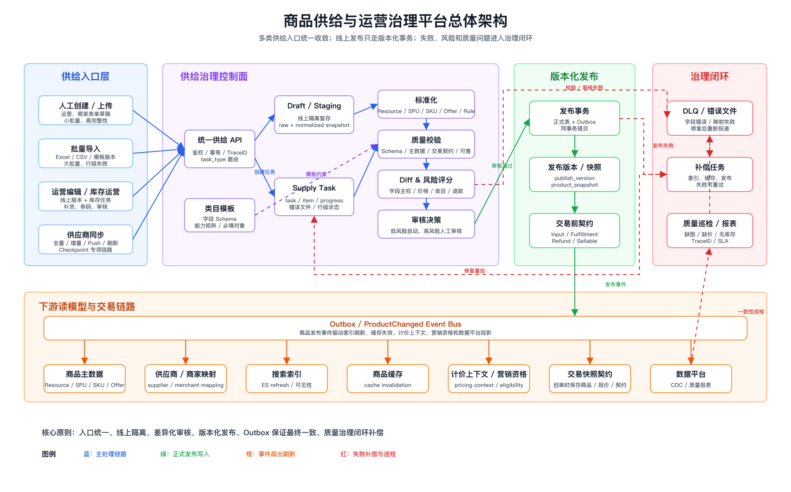

图源文件：

- `books/system-design-architecture-book/images/product-supply-ops-architecture.png`
- `books/system-design-architecture-book/images/product-supply-ops-architecture.svg`
- `source/diagrams/Excalidraw/product-supply-ops-architecture.excalidraw`

```text
Supply Entry
  → Draft / Staging
  → Supply Task
  → Standardization
  → Quality Validation
  → Diff & Risk Scoring
  → Review / Auto Approval
  → Publish Transaction
  → Outbox Event
  → Search / Cache / Pricing Context / Data Platform
  → Marketing Command / Eligibility Event
  → DLQ / Compensation / Quality Inspection
```

分层职责如下：

| 层级 | 职责 | 关键产物 |
|------|------|----------|
| 供给入口层 | 接收表单、文件、API、供应商同步数据 | 原始输入、来源、操作者、TraceID |
| 暂存层 | 保存未发布数据 | Draft、Staging Snapshot、payload hash |
| 任务层 | 编排一次供给动作 | Task、Task Item、进度、错误文件 |
| 标准化层 | 转成平台统一模型 | Resource、SPU、SKU、Offer、Rule |
| 校验层 | 判断是否完整、合法、可售 | 校验结果、错误码、质量分 |
| 风险审核层 | 判断是否自动通过或人工审核 | Diff、风险等级、审核单 |
| 发布层 | 写正式表、生成版本 | publish version、product snapshot |
| 集成层 | 通过 Outbox 通知搜索、缓存、计价上下文和数据平台，通过营销命令协同活动配置 | Outbox、索引任务、缓存失效任务、营销协同任务 |
| 治理层 | 失败补偿、质量巡检、报表 | DLQ、补偿任务、质量日报 |

### 31.1 核心表分组

商品供给与运营链路的表设计要覆盖草稿、任务、行级处理、暂存、校验、变更审核、发布、补偿审计八类能力。

| 表组 | 典型表 | 作用 |
|------|--------|------|
| Draft 草稿表 | `product_supply_draft`、`product_supply_draft_version` | 保存单商品创建、单商品编辑过程中的草稿，草稿可反复保存，不进入发布 |
| Task 任务表 | `product_supply_task` | 记录一次供给动作：单商品创建、单商品编辑、批量导入、批量编辑、供应商同步后的商品变更 |
| Task Item 明细表 | `product_supply_task_item` | 记录任务中每一行、每个商品、每个 Offer 或每条规则的处理状态 |
| Staging 暂存表 | `product_supply_staging`、`product_supply_staging_snapshot` | 保存已经提交、已经标准化、但还没有发布到正式表的数据 |
| Validation 校验表 | `product_validation_result` | 保存字段、类目、主数据、商品模型、交易契约、风险规则的校验结果 |
| Change / Audit 表 | `product_change_request`、`product_audit_log` | 保存字段 Diff、风险等级、审核策略、审核人、审核结论和驳回原因 |
| Publish / Snapshot 表 | `product_publish_record`、`product_publish_snapshot`、`product_change_log` | 保存发布批次、商品完整快照和正式发布后的变更日志 |
| Outbox / DLQ / Compensation 表 | `product_outbox_event`、`product_supply_dead_letter`、`product_compensation_task`、`product_quality_issue` | 保证下游一致性，承接失败问题单、补偿任务和质量巡检 |

这些表不是为了把商品中心再复制一遍。供给平台负责流程治理和发布编排，正式商品数据仍然写入商品中心主数据表，例如：

```text
resource_tab
product_spu_tab
product_sku_tab
product_offer_tab
rate_plan_tab
stock_config_tab
sellable_rule_tab
fulfillment_rule_tab
refund_rule_tab
```

第一期建议保留最小闭环：

```text
product_supply_draft
product_supply_task
product_supply_task_item
product_supply_staging
product_validation_result
product_change_request
product_audit_log
product_publish_snapshot
product_change_log
product_outbox_event
product_supply_dead_letter
```

供应商同步执行层独立维护 `supplier_sync_task`、`supplier_sync_batch`、`supplier_sync_snapshot`、`supplier_sync_dead_letter`，但标准化后的商品变更要进入供给平台：

```text
supplier_sync_batch
  → Normalize
  → product_supply_task(task_type=SUPPLIER_SYNC_IMPORT)
  → product_supply_task_item
  → product_supply_staging
  → product_validation_result
  → product_change_request
  → Publish
```

### 24.17.5 领域边界

商品供给与运营平台不应该替代商品中心、库存系统、计价系统、搜索系统、订单系统或营销系统。它的职责是“供给流程和发布治理”，不是所有商品数据的唯一存储，也不是到处同步写下游的超级后台。

| 系统 | 负责什么 | 不负责什么 |
|------|----------|------------|
| 供给与运营平台 | 入口、任务、暂存、校验、审核、发布编排、库存创建 / 修改运营入口、营销活动配置入口、补偿、审计 | C 端高 QPS 商品查询、库存扣减、库存账本事实、计价试算、搜索索引直写、订单状态维护、营销优惠计算 |
| 商品中心 | Resource、SPU、SKU、Offer、Rate Plan、类目、属性正式模型 | 运营任务进度和错误文件 |
| 库存系统 | 库存事实、库存创建命令执行、库存扣减、券码池、实时可售、库存账本 | 商品标题、图片、类目、运营审核流 |
| 计价系统 | 价格规则、试算、应付金额、优惠叠加 | 商品生命周期审核 |
| 营销系统 | 活动、券、补贴、预算、营销库存、圈品规则、优惠计算规则 | 商品供给流程、商品生命周期和库存账本 |
| 搜索系统 | 可检索字段、召回、排序、索引刷新 | 商品发布事务 |
| 订单系统 | 商品快照、报价快照、履约契约快照 | 商品最新主数据维护 |

设计原则：

1. 供给平台负责流程，商品中心负责正式模型。
2. 库存创建 / 修改的运营入口在供给平台，库存事实和扣减账本在库存系统。
3. 搜索、缓存、计价上下文和数据平台通过 Outbox 事件感知变更，不由运营后台直接写入。
4. 营销系统通过活动配置命令或营销资格事件协同，但活动规则、预算、券、补贴、营销库存和优惠计算仍归营销系统。
5. 订单只相信创单时保存的快照，不回读最新商品配置解释历史订单，也不由供给平台直接修改订单。

### 24.17.6 任务模型

### 31.1 Task：一次供给动作

`product_supply_task` 记录一次人工创建、批量导入、运营编辑或供应商同步动作。

```sql
CREATE TABLE product_supply_task (
    id BIGINT PRIMARY KEY AUTO_INCREMENT,
    task_id VARCHAR(64) NOT NULL,
    task_type VARCHAR(32) NOT NULL
        COMMENT 'MANUAL_CREATE/BATCH_IMPORT/OPS_EDIT/SUPPLIER_SYNC',
    execution_mode VARCHAR(16) NOT NULL DEFAULT 'SYNC'
        COMMENT 'SYNC/ASYNC',
    source_type VARCHAR(32) NOT NULL COMMENT 'OPS/MERCHANT/SUPPLIER/SYSTEM',
    source_id VARCHAR(64) DEFAULT NULL,
    category_code VARCHAR(32) NOT NULL,
    operator_id VARCHAR(64) DEFAULT NULL,
    trigger_id VARCHAR(64) DEFAULT NULL COMMENT '外部幂等 ID',
    template_version VARCHAR(64) DEFAULT NULL,
    status VARCHAR(32) NOT NULL
        COMMENT 'DRAFT/PENDING/PARSING/RUNNING/VALIDATING/REVIEWING/APPROVED/PUBLISHING/PUBLISHED/PARTIAL_FAILED/REJECTED/FAILED/CANCELLED',
    total_count INT NOT NULL DEFAULT 0,
    parsed_count INT NOT NULL DEFAULT 0,
    success_count INT NOT NULL DEFAULT 0,
    failed_count INT NOT NULL DEFAULT 0,
    skipped_count INT NOT NULL DEFAULT 0,
    current_stage VARCHAR(64) DEFAULT NULL,
    input_file_ref VARCHAR(512) DEFAULT NULL,
    parse_checkpoint VARCHAR(1024) DEFAULT NULL,
    error_file_ref VARCHAR(512) DEFAULT NULL,
    publish_version BIGINT DEFAULT NULL,
    worker_id VARCHAR(64) DEFAULT NULL,
    lease_token VARCHAR(64) DEFAULT NULL,
    lease_until DATETIME DEFAULT NULL,
    heartbeat_at DATETIME DEFAULT NULL,
    created_at DATETIME NOT NULL,
    started_at DATETIME DEFAULT NULL,
    finished_at DATETIME DEFAULT NULL,
    updated_at DATETIME NOT NULL,
    UNIQUE KEY uk_task_id (task_id),
    UNIQUE KEY uk_task_trigger (task_type, trigger_id),
    KEY idx_status (status),
    KEY idx_category_status (category_code, status),
    KEY idx_operator_time (operator_id, created_at)
) ENGINE=InnoDB DEFAULT CHARSET=utf8mb4 COMMENT='商品供给任务';
```

### 31.2 Task Item：行级或对象级明细

批量导入和供应商同步必须支持部分成功，因此任务要拆到 item 维度。

```sql
CREATE TABLE product_supply_task_item (
    id BIGINT PRIMARY KEY AUTO_INCREMENT,
    task_id VARCHAR(64) NOT NULL,
    item_no VARCHAR(64) NOT NULL COMMENT '文件行号、表单对象序号或外部对象序号',
    item_type VARCHAR(32) NOT NULL COMMENT 'RESOURCE/SPU/SKU/OFFER/RATE_PLAN/STOCK/RULE',
    idempotency_key VARCHAR(128) NOT NULL,
    platform_resource_id BIGINT DEFAULT NULL,
    spu_id BIGINT DEFAULT NULL,
    sku_id BIGINT DEFAULT NULL,
    offer_id BIGINT DEFAULT NULL,
    status VARCHAR(32) NOT NULL
        COMMENT 'PENDING/NORMALIZING/VALIDATING/STAGING/DIFFING/REVIEWING/PUBLISHING/SUCCESS/FAILED/DLQ/SKIPPED',
    risk_level VARCHAR(32) DEFAULT NULL COMMENT 'LOW/MEDIUM/HIGH',
    error_code VARCHAR(128) DEFAULT NULL,
    error_message VARCHAR(1024) DEFAULT NULL,
    raw_row_ref VARCHAR(512) DEFAULT NULL,
    staging_id VARCHAR(64) DEFAULT NULL,
    change_id VARCHAR(64) DEFAULT NULL,
    normalized_ref VARCHAR(512) DEFAULT NULL,
    normalized_payload_hash VARCHAR(64) DEFAULT NULL,
    retry_count INT NOT NULL DEFAULT 0,
    max_retry_count INT NOT NULL DEFAULT 5,
    next_retry_at DATETIME DEFAULT NULL,
    created_at DATETIME NOT NULL,
    updated_at DATETIME NOT NULL,
    UNIQUE KEY uk_task_item (task_id, item_no),
    UNIQUE KEY uk_task_idempotency (task_id, idempotency_key),
    KEY idx_task_status (task_id, status),
    KEY idx_platform_object (platform_resource_id, spu_id, sku_id, offer_id)
) ENGINE=InnoDB DEFAULT CHARSET=utf8mb4 COMMENT='商品供给任务明细';
```

### 31.3 状态机

```text
DRAFT
  → PENDING
  → PARSING
  → RUNNING
  → VALIDATING
  → REVIEWING
  → APPROVED
  → PUBLISHING
  → PUBLISHED

PARSING / RUNNING / VALIDATING / REVIEWING / PUBLISHING
  → PARTIAL_FAILED / FAILED / REJECTED

PENDING / PARSING / RUNNING / VALIDATING / REVIEWING
  → CANCELLED
```

状态说明：

| 状态 | 含义 |
|------|------|
| `DRAFT` | 表单草稿或导入任务草稿 |
| `PENDING` | 已提交，等待执行 |
| `PARSING` | 批量任务正在解析文件并生成 item |
| `RUNNING` | 批量任务正在分批处理 item |
| `VALIDATING` | 正在标准化和质量校验 |
| `REVIEWING` | 有高风险项进入审核 |
| `APPROVED` | 审核通过，等待发布 |
| `PUBLISHING` | 正在写正式表和 Outbox |
| `PUBLISHED` | 全部发布成功 |
| `PARTIAL_FAILED` | 部分 item 成功、部分失败 |
| `REJECTED` | 审核驳回 |
| `FAILED` | 整体失败 |
| `CANCELLED` | 人工取消 |

### 24.17.7 暂存区与快照

所有入口都必须先写暂存区，不能直接写商品正式表。

```sql
CREATE TABLE product_supply_staging (
    id BIGINT PRIMARY KEY AUTO_INCREMENT,
    staging_id VARCHAR(64) NOT NULL,
    task_id VARCHAR(64) NOT NULL,
    item_no VARCHAR(64) NOT NULL,
    object_type VARCHAR(32) NOT NULL
        COMMENT 'RESOURCE/SPU/SKU/OFFER/RATE_PLAN/STOCK_CONFIG/INPUT_SCHEMA/FULFILLMENT_RULE/REFUND_RULE',
    object_key VARCHAR(128) NOT NULL,
    source_type VARCHAR(32) NOT NULL,
    source_ref VARCHAR(512) DEFAULT NULL,
    raw_payload_ref VARCHAR(512) DEFAULT NULL,
    normalized_payload JSON NOT NULL,
    payload_hash VARCHAR(64) NOT NULL,
    base_publish_version BIGINT DEFAULT NULL,
    status VARCHAR(32) NOT NULL
        COMMENT 'DRAFT/VALIDATED/REVIEWING/APPROVED/PUBLISHED/REJECTED',
    created_at DATETIME NOT NULL,
    updated_at DATETIME NOT NULL,
    UNIQUE KEY uk_staging_id (staging_id),
    UNIQUE KEY uk_task_object (task_id, object_type, object_key),
    KEY idx_status (status),
    KEY idx_object_key (object_type, object_key)
) ENGINE=InnoDB DEFAULT CHARSET=utf8mb4 COMMENT='商品供给暂存数据';
```

暂存区的作用：

1. 保护线上正式表，不让半成品商品被搜索或下单。
2. 支持审核员查看发布前快照。
3. 支持 Diff、风险评分、回放和问题排查。
4. 支持失败后修复并重新发布。

### 24.17.8 人工创建链路

人工创建适合运营或商家少量创建商品，例如本地生活券、礼品卡、账单缴费入口、活动套餐。

```text
选择类目
  → 加载类目模板
  → 填写 Resource / SPU / SKU / Offer / Rule
  → 前端实时校验
  → 保存 Draft
  → 提交 Supply Task
  → 后端强校验
  → 生成 Staging Snapshot
  → 审核
  → 发布
```

关键难点：

| 难点 | 解决方法 |
|------|----------|
| 不同品类字段差异巨大 | 类目模板驱动表单，模板定义字段、类型、是否必填、校验规则 |
| 运营只填商品标题和价格，遗漏交易契约 | 提交时强校验 Offer、库存来源、履约规则、退款规则、Input Schema |
| 新商品审核缺少上下文 | 审核页展示标准化快照、类目模板、风险命中、历史相似商品 |
| 草稿反复修改 | Draft 与 Staging 分离，草稿不生成发布版本 |
| 创建成功但无法下单 | 发布后做可售校验：库存、价格、履约、退款、搜索索引状态 |

类目模板示例：

```json
{
  "category_code": "HOTEL",
  "required_objects": ["RESOURCE", "SPU", "OFFER", "RATE_PLAN", "REFUND_RULE"],
  "fields": [
    {"name": "hotel_name", "type": "string", "required": true},
    {"name": "city_code", "type": "string", "required": true},
    {"name": "geo.lat", "type": "decimal", "required": true},
    {"name": "geo.lng", "type": "decimal", "required": true}
  ]
}
```

### 24.17.9 批量导入链路

批量导入适合大促、类目迁移、商家批量上新、套餐批量配置。

```text
下载模板
  → 上传文件
  → 文件格式预检
  → 创建 product_supply_task
  → 流式解析
  → 每行生成 product_supply_task_item
  → 分批标准化
  → 行级校验
  → 成功项发布或审核
  → 失败项生成错误文件
  → 汇总任务状态
```

核心难点与解决方法：

| 难点 | 解决方法 |
|------|----------|
| 文件过大 | 流式解析，不一次性读入内存 |
| 导入耗时长 | 分批提交，后台异步执行，前台轮询进度 |
| 局部失败 | 行级状态，成功项继续，失败项生成错误文件 |
| 重复上传 | `task_type + trigger_id` 幂等，行级 `idempotency_key` 去重 |
| 模板演进 | 文件记录 `template_version`，旧模板兼容或拒绝 |
| 批量事故 | 高风险字段批量变更进入抽样审核或二次确认 |
| 下游被打爆 | 发布和索引刷新限速，使用 Outbox 背压 |

### 31.1 异步执行总流程

批量导入和批量编辑不能只有一个后台线程从头跑到尾。更稳妥的方式是拆成解析、行级处理、审核发布和结果归档几个阶段。

```text
上传文件 / 批量提交
  → 创建 product_supply_task(status=PENDING, execution_mode=ASYNC)
  → Parser Worker 流式解析文件
  → 批量写入 product_supply_task_item
  → Item Worker 分批处理 item
  → 标准化 / 校验 / Staging / Diff
  → 低风险自动发布，高风险进入审核
  → Publish Worker 发布正式表并写 Outbox
  → 生成错误文件 / DLQ / 质量报告
```

这个拆法有三个好处：

1. 解析失败不会污染正式商品表。
2. 行级失败不会拖垮整批任务。
3. 发布和下游刷新可以限速、重试和补偿。

### 31.2 Parser Worker：只解析，不发布

Parser Worker 的职责边界要非常窄：只负责把文件拆成 `product_supply_task_item`，不做正式发布。

```text
1. CAS 抢占 product_supply_task
2. 校验 input_file_ref、文件 hash、模板版本和列结构
3. 流式读取文件，不能一次性加载到内存
4. 每 N 行批量插入 product_supply_task_item
5. 更新 parsed_count、parse_checkpoint、heartbeat_at
6. 解析完成后写 total_count
7. task.status 从 PARSING 推进到 RUNNING
```

`parse_checkpoint` 用来恢复解析进度：

```json
{
  "sheet": "Sheet1",
  "row_no": 12000,
  "byte_offset": 8842211
}
```

如果 Parser Worker 在第 12000 行宕机，下次恢复时允许重复解析上一小批。重复数据由两个唯一键兜住：

```text
UNIQUE(task_id, item_no)
UNIQUE(task_id, idempotency_key)
```

注意：Excel 这类格式不一定天然支持稳定的 `byte_offset` 恢复。工程上可以先把上传文件转换成规范化 CSV 或行级 JSONL，再按 offset 恢复；也可以按 `row_no` 从头快速跳过。核心原则是 checkpoint 控制重跑范围，幂等保证重复处理不写错。

### 31.3 Task Item：行级事实表

`product_supply_task_item` 是批量链路里最重要的表。Task 只说明“这次批量任务怎么样”，Item 才能回答“第几行、哪个商品、哪个 Offer 为什么失败”。

Item 状态机建议设计为：

```text
PENDING
  → NORMALIZING
  → VALIDATING
  → STAGING
  → DIFFING
  → REVIEWING
  → PUBLISHING
  → SUCCESS

失败分支：
NORMALIZING / VALIDATING / STAGING / DIFFING / PUBLISHING
  → FAILED / DLQ / SKIPPED
```

关键字段含义：

| 字段 | 作用 |
|------|------|
| `item_no` | 文件行号或批量对象序号 |
| `idempotency_key` | 行级业务幂等键，防止重复导入 |
| `raw_row_ref` | 原始行数据引用，方便生成错误文件和回放 |
| `normalized_ref` | 标准化后 payload 引用 |
| `staging_id` | 通过校验后的暂存数据 |
| `change_id` | Diff 后生成的变更单 |
| `retry_count` / `next_retry_at` | 自动重试控制 |

### 31.4 Item Worker：分批处理行级任务

Item Worker 不按“整个文件”处理，而是扫描一小批待处理 item。

```sql
SELECT *
FROM product_supply_task_item
WHERE task_id = ?
  AND status IN ('PENDING', 'FAILED')
  AND next_retry_at <= NOW()
ORDER BY item_no ASC
LIMIT 500;
```

每个 item 或小批次使用独立事务：

```text
读取 raw_row_ref
  → CAS 将 item 推进到 NORMALIZING
  → 按类目模板标准化成 Resource / SPU / SKU / Offer / Rule
  → 写 normalized_ref
  → 执行 Schema / 主数据 / 商品模型 / 交易契约校验
  → 校验通过后写 product_supply_staging
  → 与线上 publish_version 做 Diff
  → 生成 product_change_request
  → 根据 risk_level 自动发布或进入 REVIEWING
  → 更新 item.status
```

不要用一个大事务包住 500 行。正确做法是行级或小批次事务，否则一行失败会拖垮整批，也会造成长事务、锁等待和回滚成本过高。

### 31.5 Staging、Diff 与发布合流

Item Worker 校验通过后，只能写 `product_supply_staging`，不能直接写正式商品表。

```text
product_supply_task_item
  → product_supply_staging
  → product_change_request
  → product_publish_snapshot
  → product_outbox_event
```

`base_publish_version` 很重要。批量导入或批量编辑可能基于旧版本生成，如果发布时线上商品已经被别人改过，必须识别版本冲突，不能静默覆盖。

风险分流建议如下：

| 风险等级 | 处理 |
|----------|------|
| `LOW` | 自动准入，进入发布 |
| `MEDIUM` | 规则校验通过后发布，异常进入审核 |
| `HIGH` | 强制进入人工审核 |

Publish Worker 只处理已经 `APPROVED` 或 `AUTO_APPROVE` 的变更：

```text
读取 approved change
  → 开启发布事务
  → 写 Resource / SPU / SKU / Offer / Rule
  → 写 publish_snapshot
  → 写 product_change_log
  → 写 product_outbox_event
  → 提交事务
  → item.status = SUCCESS
```

ES、缓存和计价上下文不要放在发布事务里同步调用，统一由 Outbox 消费者异步刷新；营销活动配置走营销系统命令或营销资格事件，不在发布事务内同步写营销规则。

### 31.6 Task 状态汇总

Task 状态不要靠 Worker 主观判断，而要从 item 状态聚合。

| Item 汇总结果 | Task 状态 |
|---------------|-----------|
| 全部 `SUCCESS` | `PUBLISHED` |
| 部分 `SUCCESS`，部分 `FAILED/DLQ` | `PARTIAL_FAILED` |
| 全部失败 | `FAILED` |
| 存在 `REVIEWING` | `REVIEWING` |
| 存在 `PUBLISHING` | `PUBLISHING` |
| 任务被人工取消 | `CANCELLED` |

统计可以每批 item 处理完成后增量更新，也可以由定时聚合 Job 修正。运营后台看到的进度来自 task 计数，但失败定位必须下钻到 item。

### 31.7 失败处理

批量异步链路的失败要按阶段处理：

| 失败阶段 | 示例 | 处理 |
|----------|------|------|
| 文件级失败 | 文件损坏、模板版本不支持、列结构缺失 | task 直接 `FAILED`，不生成大量 item |
| 行级格式失败 | 价格非法、字段缺失、枚举非法 | item `FAILED`，写错误文件 |
| 主数据失败 | 城市、商户、品牌不存在 | item `DLQ` 或 `MANUAL_FIX` |
| 风险失败 | 改价过大、退款规则变化 | change_request `REVIEWING` |
| 发布失败 | 版本冲突、DB 冲突、唯一键冲突 | item 延迟重试，超过次数进 DLQ |
| 下游失败 | ES、缓存刷新失败 | Outbox 补偿，不回滚发布事务 |

错误文件应该从 `product_supply_task_item` 和 `product_validation_result` 生成，而不是从日志拼出来。

### 31.8 设计原则

1. **Parser Worker 只解析，不发布。**
2. **Item Worker 按行级状态推进，支持部分成功。**
3. **所有 item 处理必须幂等。**
4. **Staging 是正式表前的隔离层。**
5. **发布必须版本化，不能覆盖未知的新版本。**
6. **下游刷新走 Outbox，不阻塞发布事务。**
7. **Task 管整体进度，Item 才是真正的问题定位单元。**

错误文件要能指导运营修复，而不是只写“导入失败”：

```text
row_no, object_key, field, error_code, error_message, suggestion
12, SKU_001, price, PRICE_TOO_LOW, price lower than floor price, adjust price >= 100
25, OFFER_014, refund_rule, REFUND_RULE_MISSING, refund rule is required, choose a refund template
31, HOTEL_020, city_code, CITY_NOT_FOUND, city cannot map to platform city, add city mapping first
```

### 24.17.10 运营编辑链路

运营编辑针对线上商品，需要解决“谁能改、改什么、是否覆盖供应商数据、什么时候生效、如何回滚”的问题。

```text
读取当前 publish_version
  → 创建编辑草稿
  → 修改字段
  → 生成 Diff
  → 字段主导权判断
  → 风险评分
  → 自动通过 / 人工审核 / 阻断
  → 发布新 publish_version
  → Outbox 通知读侧投影
  → 营销活动配置异步协同
```

### 31.1 字段主导权

| 字段 | 主导方 | 供应商同步能否覆盖 | 运营策略 |
|------|--------|-------------------|----------|
| 标题、卖点、活动标签 | 平台运营 | 否 | 运营编辑为准 |
| 酒店名称、地址、设施 | 供应商/平台治理 | 低风险可覆盖，高风险审核 | 可人工修正并设置保护期 |
| 展示图片 | 平台运营/供应商 | 取决于来源质量 | 图片变更需要质量校验 |
| 基础价、Rate Plan | 供应商/计价 | 取决于品类 | 超阈值审核 |
| 库存水位、可售状态 | 库存域/供应商 | 是 | 人工覆盖必须有有效期 |
| 退款规则、履约规则 | 平台/供应商契约 | 高风险覆盖 | 强制审核 |
| 类目、Resource 映射 | 平台治理 | 否 | 强制审核和数据巡检 |

### 31.2 冲突处理

常见冲突：

```text
运营改了酒店名称
  → 供应商增量同步又推回旧名称

运营批量下架一批商品
  → 供应商同步推送可售状态为可售

运营修复城市映射
  → 供应商全量同步发现城市字段不同
```

解决方法：

1. 对每个字段定义 `owner_type`：OPS、SUPPLIER、SYSTEM。
2. 运营覆盖供应商字段时记录 `override_until` 和 `override_reason`。
3. 供应商同步遇到运营保护字段时只记录 Diff，不自动覆盖。
4. 高风险冲突进入审核队列。
5. 保护期到期后由巡检任务决定是否恢复供应商主导。

### 24.17.11 标准化与质量校验

质量校验要分层，不要只做字段必填。

| 校验层 | 校验内容 | 失败处理 |
|--------|----------|----------|
| Schema 校验 | 类型、必填、枚举、长度、格式 | 行级失败 |
| 类目模板校验 | 类目要求的对象和字段是否完整 | 阻断提交 |
| 主数据校验 | 城市、商户、品牌、Resource 是否存在 | 进入人工映射 |
| 商品模型校验 | SPU、SKU、Offer、Rate Plan 关系是否成立 | 阻断发布 |
| 交易契约校验 | 库存来源、Input Schema、履约规则、退款规则 | 阻断发布 |
| 可售校验 | 商品状态、库存、价格、渠道、站点是否允许售卖 | 阻断上线或告警 |
| 风险校验 | 价格、类目、履约、退款、映射是否高风险 | 进入审核 |

质量分可以作为运营看板：

```text
quality_score =
  content_score
  + model_score
  + sellability_score
  + fulfillment_score
  + risk_score
```

如果商品缺图、缺价、无库存、无履约规则，即使主表写入成功，也不能认为供给成功。

### 24.17.12 Diff 与风险审核

审核不是所有变更都走人工。系统应该根据 Diff 和风险规则决定处理方式。

```sql
CREATE TABLE product_change_request (
    id BIGINT PRIMARY KEY AUTO_INCREMENT,
    change_id VARCHAR(64) NOT NULL,
    task_id VARCHAR(64) NOT NULL,
    object_type VARCHAR(32) NOT NULL,
    object_id BIGINT DEFAULT NULL,
    old_publish_version BIGINT DEFAULT NULL,
    new_staging_id VARCHAR(64) NOT NULL,
    changed_fields JSON NOT NULL,
    risk_level VARCHAR(32) NOT NULL COMMENT 'LOW/MEDIUM/HIGH',
    review_policy VARCHAR(32) NOT NULL COMMENT 'AUTO_APPROVE/MANUAL_REVIEW/BLOCK',
    status VARCHAR(32) NOT NULL COMMENT 'PENDING/APPROVED/REJECTED/PUBLISHED',
    reviewer_id VARCHAR(64) DEFAULT NULL,
    review_note VARCHAR(1024) DEFAULT NULL,
    created_at DATETIME NOT NULL,
    updated_at DATETIME NOT NULL,
    UNIQUE KEY uk_change_id (change_id),
    KEY idx_task (task_id),
    KEY idx_status_risk (status, risk_level)
) ENGINE=InnoDB DEFAULT CHARSET=utf8mb4 COMMENT='商品供给变更单';
```

风险策略：

| 变更类型 | 风险等级 | 策略 |
|----------|----------|------|
| 标题、描述、小图修正 | 低 | 自动通过，记录日志 |
| 普通图片变更 | 低/中 | 图片质量校验通过后发布 |
| 库存水位调整 | 中 | 自动校验，通过后发布，异常告警 |
| 价格或 Offer 规则变更 | 中高 | 超阈值人工审核 |
| 类目变更 | 高 | 强制审核 |
| 履约类型或退款规则变更 | 高 | 强制审核 |
| Resource / Supplier Mapping 变更 | 高 | 强制审核并触发巡检 |

风险评分示例：

```text
risk_score =
  field_weight
  + change_ratio_weight
  + category_weight
  + product_heat_weight
  + operator_history_weight
  + source_trust_weight
```

### 24.17.13 发布一致性设计

审核通过不等于商品可售。发布阶段要把商品主数据和交易前契约一次性落到可追溯版本上。

```text
开始发布事务
  → 校验 base_publish_version
  → 写 Resource / SPU / SKU / Offer / Rate Plan
  → 写 Stock Config / Sellable Rule
  → 写 Input Schema / Fulfillment Rule / Refund Rule
  → 写 Supplier Mapping 或 Merchant Mapping
  → 生成 publish_version
  → 生成 product_snapshot
  → 写 product_change_log
  → 写 outbox_event
提交事务
  → 异步刷新搜索、缓存、计价上下文、数据平台
  → 如涉及活动配置，异步调用营销系统命令
```

关键设计：

| 设计点 | 解决的问题 |
|--------|------------|
| `base_publish_version` 乐观锁 | 防止基于旧版本覆盖新版本 |
| `publish_version` | 支持回滚、审计、对账 |
| `product_snapshot` | 支持订单快照、问题排查 |
| `outbox_event` | 防止商品已变更但下游没收到事件 |
| 异步刷新 | 避免发布事务被 ES、缓存、计价上下文和营销协同拖慢 |
| 补偿任务 | 下游刷新失败后可重试 |

Outbox 事件：

```text
ProductPublished
ProductContentChanged
OfferChanged
RatePlanChanged
SellableRuleChanged
FulfillmentRuleChanged
RefundRuleChanged
SearchIndexRefreshRequired
ProductCacheInvalidationRequired
```

### 24.17.14 DLQ 与补偿

人工供给和运营编辑也需要 DLQ。它们的失败通常不是供应商接口失败，而是输入错误、映射错误、审核驳回、版本冲突、发布失败和下游刷新失败。

```sql
CREATE TABLE product_supply_dead_letter (
    id BIGINT PRIMARY KEY AUTO_INCREMENT,
    dead_letter_id VARCHAR(64) NOT NULL,
    task_id VARCHAR(64) NOT NULL,
    task_type VARCHAR(32) NOT NULL,
    item_no VARCHAR(64) DEFAULT NULL,
    object_type VARCHAR(32) DEFAULT NULL,
    object_key VARCHAR(128) DEFAULT NULL,
    platform_resource_id BIGINT DEFAULT NULL,
    spu_id BIGINT DEFAULT NULL,
    sku_id BIGINT DEFAULT NULL,
    offer_id BIGINT DEFAULT NULL,
    error_stage VARCHAR(64) NOT NULL COMMENT 'PARSE/VALIDATION/MAPPING/REVIEW/PUBLISH/OUTBOX/INDEX/CACHE',
    error_type VARCHAR(64) NOT NULL COMMENT 'RETRYABLE/NON_RETRYABLE/MAPPING_REQUIRED/RISK_BLOCKED/VERSION_CONFLICT',
    error_code VARCHAR(128) NOT NULL,
    error_message VARCHAR(1024) NOT NULL,
    payload_ref VARCHAR(512) DEFAULT NULL,
    status VARCHAR(32) NOT NULL DEFAULT 'PENDING'
        COMMENT 'PENDING/RETRYING/MANUAL_FIX/RESOLVED/IGNORED/FAILED',
    retry_count INT NOT NULL DEFAULT 0,
    max_retry_count INT NOT NULL DEFAULT 5,
    next_retry_at DATETIME DEFAULT NULL,
    owner_team VARCHAR(64) DEFAULT NULL,
    assignee VARCHAR(64) DEFAULT NULL,
    fix_note VARCHAR(1024) DEFAULT NULL,
    created_at DATETIME NOT NULL,
    updated_at DATETIME NOT NULL,
    resolved_at DATETIME DEFAULT NULL,
    UNIQUE KEY uk_dead_letter_id (dead_letter_id),
    KEY idx_status_next_retry (status, next_retry_at),
    KEY idx_task (task_id),
    KEY idx_error_code (error_code)
) ENGINE=InnoDB DEFAULT CHARSET=utf8mb4 COMMENT='商品供给死信队列';
```

补偿策略：

| 失败类型 | 示例 | 处理方式 |
|----------|------|----------|
| 可重试失败 | DB 短暂失败、Outbox 发送失败 | 指数退避重试 |
| 输入失败 | 文件字段非法、必填缺失 | 生成错误文件，运营修复后重新提交 |
| 映射失败 | 城市、商户、品牌找不到 | 人工补映射后重新投递 |
| 风险阻断 | 价格异常、退款规则风险 | 人工审核或驳回 |
| 版本冲突 | 基于旧版本编辑 | 重新拉取最新版本再编辑 |
| 下游失败 | ES、缓存刷新失败 | Outbox 补偿重试 |

### 24.17.15 可观测性

运营后台和监控系统要能回答五个问题：

1. 任务跑到哪里了？
2. 为什么失败？
3. 谁需要处理？
4. 修复后如何重新投递？
5. 发布后前台是否真的可见、可买、可履约？

核心指标：

| 指标类型 | 指标 |
|----------|------|
| 任务进度 | 总数、成功数、失败数、跳过数、当前阶段 |
| 效率指标 | 任务完成耗时、P95 / P99、排队时间 |
| 质量指标 | 字段缺失率、映射失败率、缺图率、缺价率、无库存率 |
| 审核指标 | 自动审核占比、人工审核耗时、驳回率 |
| 发布指标 | 发布成功率、版本冲突数、回滚次数 |
| 下游指标 | ES 刷新失败数、缓存失效失败数、Outbox 堆积 |
| 运营指标 | 错误文件下载次数、人工修复耗时、DLQ 修复率 |

质量巡检任务：

1. 缺图商品巡检。
2. 缺价商品巡检。
3. 无库存商品巡检。
4. 无履约规则商品巡检。
5. 退款规则缺失巡检。
6. 搜索索引与发布版本一致性巡检。
7. 缓存版本与发布版本一致性巡检。
8. 运营覆盖字段到期巡检。

### 24.17.16 典型异常场景

| 异常 | 风险 | 处理 |
|------|------|------|
| 运营重复点击提交 | 重复创建任务 | `task_type + trigger_id` 幂等 |
| 导入文件 10 万行中 500 行失败 | 整批回滚影响效率 | 部分成功，失败行生成错误文件 |
| 发布时发现版本冲突 | 覆盖别人刚发布的变更 | `base_publish_version` 乐观锁，要求重新编辑 |
| 审核通过但 ES 刷新失败 | 前台搜不到 | Outbox 补偿刷新 |
| 商品发布成功但库存未初始化 | 前台可见不可买 | 可售校验不通过，不进入 ONLINE |
| 运营改标题后被供应商覆盖 | 人工修复失效 | 字段主导权和保护期 |
| 大批量改价低于底价 | 资损 | 风险规则阻断，人工审核 |
| 退款规则变更影响历史订单 | 售后争议 | 订单保存退款规则快照 |
| 质量巡检发现缺履约规则 | 下单后无法履约 | 自动下架或阻断可售，进入 DLQ |

### 24.17.17 与供应商同步的关系

统一供给治理平台和供应商同步专项链路的关系如下：

```text
统一供给治理平台
  → 统一任务模型
  → 统一暂存与发布模型
  → 统一校验、Diff、审核、Outbox、补偿

供应商同步专项链路
  → Raw Snapshot
  → Sync Batch
  → Checkpoint
  → Worker Lease
  → Supplier Mapping
  → 数据新鲜度
```

供应商同步产生的标准化数据最终也应该进入供给治理平台的校验、Diff、审核和发布机制。不同点在于，供应商同步多了拉取、分页、断点续跑、租约抢占、原始快照和供应商质量监控。

### 24.17.18 答辩材料

本专题相关总结、常见问题和参考回答已统一收录到[第 36 章](../part03/04-product-inventory-marketing-pricing-interview.md)。


## 24.18 供应商数据同步链路


### 24.18.1 背景

数字商品平台需要从外部供应商同步供给数据。本方案讨论的是一条通用的供应商数据同步链路，并以**酒店供给全量同步**为例展开。酒店数据规模大、结构复杂、变化频率不一致：酒店名称、地址、设施、图片等静态信息变化较慢；房型、套餐、最低价、可售状态等半动态信息需要更高频刷新；下单前房态房价必须实时确认。

本设计聚焦一个典型任务：

```text
通过遍历所有城市，从供应商拉取酒店信息
酒店规模约 100 万
任务预计运行 10 小时
需要支持断点续跑、失败补偿、数据追溯和质量监控
```

这类任务不能只依赖进程内状态做一个长循环。第一阶段更推荐设计成 **Batch + Checkpoint + DLQ** 的可恢复流水线：任务可以按城市和分页顺序遍历，进度持久化在数据库里，失败后从 checkpoint 继续。任务分片和分布式 Worker 抢占可以作为后续优化项目，而不是一开始就进入主链路。

### 24.18.2 设计目标

1. **可恢复**：任务中断后可以从 checkpoint 继续，不从头重跑。
2. **可追溯**：保存供应商原始数据 Raw Snapshot，支持问题排查和回放。
3. **可治理**：通过标准化、质量校验、Diff、版本控制，避免错误数据污染平台模型。
4. **可补偿**：失败数据进入 DLQ，支持自动重试、人工修复和重新投递。
5. **可观测**：实时查看任务进度、失败原因、供应商质量和业务影响指标。
6. **不影响交易安全**：列表页可缓存，详情页更接近实时，创单前必须实时确认。

### 24.18.3 核心难点

| 难点 | 说明 | 设计策略 |
|------|------|----------|
| 任务时间长 | 100 万酒店跑 10 小时，中途失败概率高 | Batch + Page/Cursor Checkpoint |
| 数据量大 | 全量同步可能包含酒店、房型、图片、设施等大 payload | Raw Snapshot 存引用，主表保持轻量 |
| 供应商不稳定 | 超时、限流、5xx、分页游标失效 | 限流、熔断、指数退避、DLQ |
| 模型不一致 | 供应商酒店/房型/套餐与平台 Resource/SPU/SKU/Offer 不一致 | 标准化映射 + supplier mapping |
| 数据质量不稳定 | 字段缺失、城市映射失败、价格异常、坐标漂移 | 分层质量校验 + 部分成功 |
| 发布风险 | 同步成功不代表可以发布 | sync version、snapshot version、publish version 分离 |
| 下游一致性 | DB 更新成功但 ES、缓存、事件可能失败 | Outbox + 索引补偿 |

### 24.18.4 总体架构

```text
Full Sync Task
  → Sync Batch
  → Page Fetch
  → Raw Snapshot
  → Normalize
  → Quality Check
  → Resource Mapping
  → Diff
  → Publish
  → Search / Cache / Downstream Event
  → Metrics / DLQ / Compensation
```

架构图见：


Data Flow Diagram 见：


图文件：

- `books/system-design-architecture-book/images/supplier-sync-architecture.png`
- `books/system-design-architecture-book/images/supplier-sync-architecture.svg`
- `books/system-design-architecture-book/images/supplier-sync-data-flow.png`
- `books/system-design-architecture-book/images/supplier-sync-data-flow.svg`

### 24.18.5 任务模型

### 30.1 Task：同步任务定义

`supplier_sync_task` 描述“要同步什么、怎么同步、多久同步一次”。

```sql
CREATE TABLE supplier_sync_task (
    id BIGINT PRIMARY KEY AUTO_INCREMENT,
    task_code VARCHAR(64) NOT NULL,
    supplier_id BIGINT NOT NULL,
    category_code VARCHAR(32) NOT NULL,
    sync_mode VARCHAR(32) NOT NULL COMMENT 'FULL/INCREMENTAL/PUSH/REFRESH',
    data_scope VARCHAR(64) NOT NULL COMMENT 'RESOURCE/PRODUCT/OFFER/STOCK_PRICE',
    schedule_type VARCHAR(32) NOT NULL COMMENT 'CRON/MANUAL/PUSH',
    cron_expr VARCHAR(64) DEFAULT NULL,
    status VARCHAR(32) NOT NULL COMMENT 'ENABLED/DISABLED',
    concurrency_policy VARCHAR(32) NOT NULL DEFAULT 'SKIP_IF_RUNNING'
        COMMENT 'SKIP_IF_RUNNING/CANCEL_PREVIOUS/ALLOW_PARALLEL',
    last_batch_id VARCHAR(64) DEFAULT NULL,
    owner_team VARCHAR(64) DEFAULT NULL,
    created_at DATETIME NOT NULL,
    updated_at DATETIME NOT NULL,
    UNIQUE KEY uk_task_code (task_code),
    KEY idx_supplier_category (supplier_id, category_code)
) ENGINE=InnoDB DEFAULT CHARSET=utf8mb4 COMMENT='供应商同步任务定义';
```

样例：

```text
task_code: hotel_supplier_full_resource
supplier_id: 1001
category_code: HOTEL
sync_mode: FULL
data_scope: RESOURCE
schedule_type: MANUAL
status: ENABLED
concurrency_policy: SKIP_IF_RUNNING
owner_team: product-sync
```

### 30.2 Batch：一次任务执行批次

`supplier_sync_batch` 记录一次任务执行的状态、水位、统计和版本。

```sql
CREATE TABLE supplier_sync_batch (
    id BIGINT PRIMARY KEY AUTO_INCREMENT,
    batch_id VARCHAR(64) NOT NULL,
    task_code VARCHAR(64) NOT NULL,
    trigger_source VARCHAR(32) NOT NULL COMMENT 'CRON/MANUAL/COMPENSATION',
    trigger_id VARCHAR(64) DEFAULT NULL COMMENT '外部触发幂等 ID',
    supplier_id BIGINT NOT NULL,
    category_code VARCHAR(32) NOT NULL,
    sync_mode VARCHAR(32) NOT NULL,
    data_scope VARCHAR(64) NOT NULL,
    status VARCHAR(32) NOT NULL COMMENT 'PENDING/RUNNING/SUCCESS/PARTIAL_FAILED/FAILED/CANCELLED',
    sync_batch_version BIGINT NOT NULL,
    start_checkpoint VARCHAR(512) DEFAULT NULL,
    end_checkpoint VARCHAR(512) DEFAULT NULL,
    total_count INT NOT NULL DEFAULT 0,
    success_count INT NOT NULL DEFAULT 0,
    failed_count INT NOT NULL DEFAULT 0,
    skipped_count INT NOT NULL DEFAULT 0,
    current_city_code VARCHAR(64) DEFAULT NULL,
    current_page INT DEFAULT NULL,
    progress_percent DECIMAL(5,2) NOT NULL DEFAULT 0.00,
    worker_id VARCHAR(64) DEFAULT NULL,
    lease_token VARCHAR(64) DEFAULT NULL,
    lease_until DATETIME DEFAULT NULL,
    heartbeat_at DATETIME DEFAULT NULL,
    last_heartbeat_stage VARCHAR(64) DEFAULT NULL,
    last_heartbeat_message VARCHAR(512) DEFAULT NULL,
    last_checkpoint_at DATETIME DEFAULT NULL,
    created_at DATETIME NOT NULL,
    started_at DATETIME DEFAULT NULL,
    finished_at DATETIME DEFAULT NULL,
    updated_at DATETIME NOT NULL,
    error_message VARCHAR(1024) DEFAULT NULL,
    UNIQUE KEY uk_batch_id (batch_id),
    UNIQUE KEY uk_task_trigger (task_code, trigger_id),
    KEY idx_task_status (task_code, status),
    KEY idx_status_lease (status, lease_until),
    KEY idx_supplier_time (supplier_id, started_at)
) ENGINE=InnoDB DEFAULT CHARSET=utf8mb4 COMMENT='供应商同步批次';
```

样例：

```text
batch_id: batch_20260427_hotel_full_001
task_code: hotel_supplier_full_resource
trigger_source: MANUAL
trigger_id: req_20260427_0001
supplier_id: 1001
category_code: HOTEL
sync_mode: FULL
data_scope: RESOURCE
status: RUNNING
sync_batch_version: 202604270001
total_count: 1000000
success_count: 688200
failed_count: 320
skipped_count: 12000
current_city_code: BKK
current_page: 120
progress_percent: 68.82
worker_id: hotel-sync-worker-pod-a1b2c3-12345-20260427T103000Z
lease_token: 7f2d4c77-5d5b-4f1f-aeb0-74f7f21c6e2a
lease_until: 2026-04-27 10:35:00
heartbeat_at: 2026-04-27 10:30:00
last_heartbeat_stage: FETCHING
last_heartbeat_message: fetching city=BKK page=120
last_checkpoint_at: 2026-04-27 10:29:50
```

### 24.18.6 任务创建、互斥与执行恢复

### 30.1 任务创建流程

一次同步任务通常由定时调度、运营手动触发或系统补偿触发。无论来源是什么，都不应该直接启动一个进程开始跑，而是先创建 batch，再由执行器领取 batch。

```text
触发同步
  → 查询 supplier_sync_task
  → 检查任务是否 ENABLED
  → 检查 trigger_id 幂等
  → 检查互斥策略
  → 创建 supplier_sync_batch(status=PENDING)
  → 执行器抢占 batch
  → 执行同步
```

创建 batch 时要初始化：

| 字段 | 说明 |
|------|------|
| `batch_id` | 本次执行唯一 ID |
| `trigger_source` / `trigger_id` | 触发来源和外部请求幂等 ID |
| `sync_batch_version` | 本次同步批次版本 |
| `status` | 初始为 `PENDING` |
| `start_checkpoint` | 本次任务起点，通常为空或上次成功水位 |
| `end_checkpoint` | 当前进度，任务执行过程中不断推进 |
| `total_count` | 预计处理数量，可先为空或估算 |
| `worker_id` / `lease_token` | 执行器抢占后写入 |

任务创建也要做幂等。运营后台重复点击、调度器重试、网络超时后重发，都可能重复触发同一个任务。推荐由调用方传入 `trigger_id`，例如运营后台的 `manual_request_id` 或调度系统的 `fire_id`：

```text
同一个 task_code + trigger_id
  → 只允许创建一个 batch
  → 重复请求直接返回已存在 batch
```

如果是定时任务，可以用计划触发时间生成 `trigger_id`：

```text
trigger_id = hotel_supplier_full_resource:2026-04-27T02:00:00Z
```

### 30.2 上一次任务还没执行完怎么办

同一个供应商、同一个品类、同一个数据范围的全量任务，通常不应该同时跑多个，否则会造成供应商限流、重复写入、发布版本乱序和进度混乱。这里需要显式定义互斥策略。

| 策略 | 含义 | 适用场景 |
|------|------|----------|
| `SKIP_IF_RUNNING` | 如果已有运行中的 batch，新触发直接跳过 | 定时全量同步、普通刷新 |
| `CANCEL_PREVIOUS` | 取消旧 batch，启动新 batch | 人工修复后需要重新跑全量 |
| `ALLOW_PARALLEL` | 允许并行，但必须保证数据范围不重叠 | 不同城市、不同供应商、不同数据 scope |

默认建议使用 `SKIP_IF_RUNNING`。创建 batch 前先检查：

```sql
SELECT batch_id, status, heartbeat_at, lease_until
FROM supplier_sync_batch
WHERE task_code = ?
  AND status IN ('PENDING', 'RUNNING')
ORDER BY created_at DESC
LIMIT 1;
```

如果存在未完成 batch：

```text
concurrency_policy = SKIP_IF_RUNNING
  → 不创建新 batch，记录 SKIPPED 日志

concurrency_policy = CANCEL_PREVIOUS
  → 将旧 batch 标记 CANCELLED
  → 创建新 batch

concurrency_policy = ALLOW_PARALLEL
  → 检查数据范围是否重叠
  → 不重叠才允许创建
```

相关答辩提示已统一收录到[第 35 章](../part03/03-ecommerce-architecture-interview.md)。

### 30.3 Batch 抢占

即使第一阶段不做任务分片，也建议 batch 由执行器通过 CAS 抢占，避免多个进程同时执行同一个 batch。抢占不是“查出来再更新”，而是用一条带条件的 `UPDATE` 完成。

```sql
UPDATE supplier_sync_batch
SET status = 'RUNNING',
    worker_id = ?,
    lease_token = ?,
    lease_until = DATE_ADD(NOW(), INTERVAL 5 MINUTE),
    heartbeat_at = NOW(),
    last_heartbeat_stage = 'CLAIMED',
    last_heartbeat_message = 'batch claimed',
    started_at = IFNULL(started_at, NOW()),
    updated_at = NOW()
WHERE batch_id = ?
  AND status = 'PENDING';
```

`rows_affected = 1` 表示抢占成功；`rows_affected = 0` 表示已经被其他执行器抢走，当前 worker 必须放弃执行。

对于机器重启、进程 OOM、发布中断后遗留的 `RUNNING` batch，可以允许抢占 lease 已经过期的 batch：

```sql
UPDATE supplier_sync_batch
SET worker_id = ?,
    lease_token = ?,
    lease_until = DATE_ADD(NOW(), INTERVAL 5 MINUTE),
    heartbeat_at = NOW(),
    last_heartbeat_stage = 'RECLAIMED',
    last_heartbeat_message = 'expired batch reclaimed',
    updated_at = NOW()
WHERE batch_id = ?
  AND status = 'RUNNING'
  AND lease_until < NOW();
```

注意，这里只抢占“租约过期”的任务，不抢占“心跳正常”的任务。否则一个慢请求、一次 GC 或一次网络抖动都可能导致双 worker 写同一个 batch。

### 30.4 `worker_id` 与 `lease_token`

`worker_id` 用来标识“哪个执行器实例在跑任务”，`lease_token` 用来标识“本次抢占的所有权”。两者要同时使用。

| 字段 | 作用 | 是否稳定 |
|------|------|----------|
| `worker_id` | 标识执行器实例，方便排查、日志关联和监控展示 | 进程生命周期内稳定 |
| `lease_token` | 标识一次抢占行为，防止旧 worker 恢复后覆盖新 worker | 每次抢占重新生成 |

`worker_id` 可以用“服务名 + 机器/容器名 + 进程号 + 启动时间”生成：

```go
func GenerateWorkerID(serviceName string) string {
    host := os.Getenv("POD_NAME")
    if host == "" {
        host = os.Getenv("HOSTNAME")
    }
    if host == "" {
        host, _ = os.Hostname()
    }

    pid := os.Getpid()
    startedAt := time.Now().UTC().Format("20060102T150405Z")
    return fmt.Sprintf("%s-%s-%d-%s", serviceName, host, pid, startedAt)
}
```

示例：

```text
worker_id   = hotel-sync-worker-pod-a1b2c3-12345-20260427T103000Z
lease_token = 7f2d4c77-5d5b-4f1f-aeb0-74f7f21c6e2a
```

为什么还需要 `lease_token`？因为容器名或机器名可能复用，旧进程在长 GC 后也可能恢复。只有 `worker_id` 不够严格；`lease_token` 能保证“只有当前这次抢占的持有者”才能续租、推进 checkpoint 和结束任务。

所有关键更新都必须带上三个条件：

```sql
WHERE batch_id = ?
  AND worker_id = ?
  AND lease_token = ?
```

如果更新影响行数为 0，要立即停止当前任务，并记录 `LEASE_LOST` 日志。

### 30.5 心跳与租约

长任务不能只依赖 `status=RUNNING` 判断是否还活着。机器重启、进程 OOM、发布重启都可能导致状态永远卡在 `RUNNING`。因此 batch 要同时有“租约”和“心跳”。

| 概念 | 解决的问题 | 典型字段 |
|------|------------|----------|
| 心跳 Heartbeat | worker 是否还活着 | `heartbeat_at`、`last_heartbeat_stage` |
| 租约 Lease | 当前谁拥有任务执行权 | `worker_id`、`lease_token`、`lease_until` |
| Checkpoint | 任务恢复时从哪里继续 | `end_checkpoint`、`last_checkpoint_at` |

执行器每 15 到 30 秒续租一次，租约建议设置为 2 到 5 分钟。心跳间隔要远小于租约时长，给短暂网络抖动留下余量。

```sql
UPDATE supplier_sync_batch
SET heartbeat_at = NOW(),
    lease_until = DATE_ADD(NOW(), INTERVAL 5 MINUTE),
    last_heartbeat_stage = ?,
    last_heartbeat_message = ?,
    updated_at = NOW()
WHERE batch_id = ?
  AND worker_id = ?
  AND lease_token = ?
  AND status = 'RUNNING';
```

心跳建议上报的不只是“我还活着”，还要包含当前阶段：

| 阶段 | 含义 | 示例 message |
|------|------|--------------|
| `FETCHING` | 正在请求供应商接口 | `fetching city=BKK page=120` |
| `SNAPSHOT_SAVING` | 正在保存 Raw Snapshot | `saving raw snapshot page=120` |
| `NORMALIZING` | 正在做字段标准化 | `normalizing 100 hotels` |
| `VALIDATING` | 正在做质量校验 | `validating schema and city mapping` |
| `PUBLISHING` | 正在发布平台模型 | `publishing resource changes` |
| `CHECKPOINTING` | 正在推进 checkpoint | `checkpoint to page=121` |

如果心跳更新失败：

```text
rows_affected = 0
  → 当前 worker 不再拥有任务
  → 停止拉取供应商
  → 停止写平台表
  → 打印 LEASE_LOST 日志
  → 退出执行
```

这一步非常关键。不能因为“当前进程还活着”就继续跑，因为数据库里的执行权可能已经被新 worker 抢走。

### 30.6 心跳正常但 Checkpoint 不动怎么办

心跳和 checkpoint 是两个维度。心跳正常只能说明 worker 还活着，不代表任务在前进。可能出现：

1. 供应商接口一直卡在慢请求。
2. 某个城市数据量异常大。
3. Raw Snapshot 存储变慢。
4. 发布阶段被数据库锁阻塞。
5. worker 进入了内部死循环，但心跳线程仍然正常。

因此需要同时监控：

```text
heartbeat_lag = now - heartbeat_at
checkpoint_lag = now - last_checkpoint_at
```

处理策略：

| 现象 | 判断 | 动作 |
|------|------|------|
| `heartbeat_lag` 超过租约 | worker 失联 | 允许新 worker 抢占 |
| `heartbeat_lag` 正常，`checkpoint_lag` 过大 | worker 活着但进度卡住 | 告警，不立即抢占 |
| `heartbeat_lag` 正常，阶段长期不变 | 某阶段阻塞 | 根据阶段定位供应商、存储或发布问题 |

不要在心跳正常时强行抢占。否则可能造成两个 worker 同时处理同一页，只是其中一个更慢。

### 30.7 机器重启后如何恢复

机器重启后，原 worker 不再续租。调度器或新 worker 会发现：

```sql
SELECT batch_id
FROM supplier_sync_batch
WHERE status = 'RUNNING'
  AND lease_until < NOW();
```

恢复流程：

```text
worker-01 执行 batch
  → 机器重启，心跳停止
  → lease_until 过期
  → worker-02 生成新的 worker_id 和 lease_token
  → worker-02 抢占过期 batch
  → 读取 end_checkpoint
  → 从 city/page/cursor 继续
```

这时可能重复处理上一页，所以处理逻辑必须幂等：

```text
supplier_id + supplier_resource_code + supplier_product_code
```

Checkpoint 负责减少重跑范围，幂等负责保证重复处理也不会写错。

### 30.8 进度上报

进度不要只写日志，要落到 batch 表，便于运营后台、告警系统和排查工具读取。

每处理完一页，更新 checkpoint、统计、进度和心跳：

```sql
UPDATE supplier_sync_batch
SET end_checkpoint = ?,
    current_city_code = ?,
    current_page = ?,
    success_count = success_count + ?,
    failed_count = failed_count + ?,
    skipped_count = skipped_count + ?,
    progress_percent = ?,
    heartbeat_at = NOW(),
    lease_until = DATE_ADD(NOW(), INTERVAL 5 MINUTE),
    last_heartbeat_stage = 'CHECKPOINTING',
    last_heartbeat_message = ?,
    last_checkpoint_at = NOW(),
    updated_at = NOW()
WHERE batch_id = ?
  AND worker_id = ?
  AND lease_token = ?
  AND status = 'RUNNING';
```

上报频率建议按“页”或“固定时间窗口”控制：

| 上报方式 | 优点 | 缺点 |
|----------|------|------|
| 每条酒店上报 | 精确 | DB 写入过多 |
| 每页上报 | 性能和准确性平衡 | 失败时最多重复一页 |
| 每 30 秒上报 | 写入少 | 进度略滞后 |

推荐：**每页处理完成后推进 checkpoint，同时每 15 到 30 秒续租心跳**。如果一页处理时间可能超过心跳间隔，则需要独立心跳协程，不能等整页处理完成才心跳。

### 30.9 边界场景处理

| 场景 | 风险 | 处理 |
|------|------|------|
| 定时任务重复触发 | 同一任务多个 batch 并发 | `concurrency_policy=SKIP_IF_RUNNING` |
| 人工重复点击执行 | 重复创建全量任务 | 用 `task_code + status` 互斥 |
| 机器重启 | batch 卡在 RUNNING | lease 过期后新 worker 抢占 |
| 旧 worker 恢复 | 覆盖新 worker checkpoint | 更新时校验 `worker_id + lease_token` |
| 心跳正常但 checkpoint 不动 | worker 活着但卡住 | 告警定位，不立即抢占 |
| checkpoint 更新失败 | 下次重复处理上一页 | 页内写入必须幂等 |
| checkpoint 先更新后处理失败 | 数据被跳过 | 必须先处理成功再推进 checkpoint |
| 供应商短暂失败 | 任务频繁失败 | 指数退避、限流、熔断 |
| 任务被取消 | 仍有 worker 在跑 | worker 每页检查 batch status |
| 发布新版本 | 进程退出 | checkpoint + lease 恢复 |

### 24.18.7 Checkpoint 与断点续跑

### 30.1 为什么需要 Checkpoint

100 万酒店、10 小时任务，如果只把进度放在内存里，会有三个问题：

1. 任务中断后恢复困难。
2. 机器重启后只能从头开始。
3. 进度不可观测，不知道当前卡在哪里。

因此，第一阶段主设计不引入任务分片，而是在 `supplier_sync_batch` 上保存 checkpoint。任务仍然可以按城市和分页遍历，但每处理完一页就推进一次 checkpoint。

```text
batch_001
  → city = BKK, page = 1
  → city = BKK, page = 2
  → ...
  → city = JKT, page = 1
  → ...
```

### 30.2 Checkpoint 存储

Checkpoint 可以先复用 `supplier_sync_batch.start_checkpoint` 和 `supplier_sync_batch.end_checkpoint`，也可以在后续演进中拆出独立 checkpoint 表。

主链路里的 checkpoint 建议记录：

| 字段 | 含义 |
|------|------|
| `city_code` | 当前遍历到哪个城市 |
| `page` | 当前处理到第几页 |
| `cursor` | 供应商返回的下一页游标 |
| `last_supplier_hotel_id` | 上一次成功处理的供应商酒店 ID |
| `success_count` | 当前批次已成功处理数量 |
| `failed_count` | 当前批次失败数量 |
| `updated_at` | checkpoint 更新时间 |

### 30.3 Checkpoint 是什么

Checkpoint 是同步任务“跑到哪里了”的进度记录。它用于断点续跑。

示例：

```json
{
  "city_code": "BKK",
  "page": 120,
  "cursor": "abc123",
  "last_supplier_hotel_id": "H998877"
}
```

如果 Bangkok 第 120 页失败，下次可以从 page 120 或 cursor `abc123` 继续，而不是从第一页重跑。

### 30.4 Checkpoint 怎么使用

推荐顺序是：**先处理本页数据，再推进 checkpoint**。

```text
拉取 BKK page=120
  → 保存 Raw Snapshot
  → 标准化
  → 质量校验
  → 平台模型映射
  → Diff / Publish
  → 本页处理成功
  → checkpoint = BKK page=121
```

不要先推进 checkpoint 再处理数据，否则机器在中间宕机会跳过未处理页面。

机器重启时的恢复流程：

```text
机器重启 / 进程退出
  → 调度器重新启动 batch
  → 读取 batch.end_checkpoint
  → 从 city/page/cursor 继续拉取
  → 已处理过的一页允许重复处理
  → 通过 supplier_id + supplier_resource_code 幂等去重
```

Checkpoint 只能保证“不大范围重跑”，不能保证“绝不重复处理”。因此它必须和幂等设计配合使用。

### 24.18.8 拉取与限流

同步任务按城市和分页拉取：

```text
city = BKK
page_size = 100
page = 1..N
```

容量估算：

```text
1000000 hotels / 10 hours = 27.8 hotels/s
```

如果每页 100 个酒店：

```text
1000000 / 100 = 10000 pages
10000 pages / 10 hours = 0.28 page/s
```

如果需要逐个拉酒店详情：

```text
1000000 detail calls / 10 hours = 27.8 QPS
```

拉取并发度要受供应商限流约束：

```text
fetch_concurrency = min(供应商限流 QPS / 单请求 QPS, 系统处理能力)
```

必须支持：

1. 每供应商限流。
2. 每城市请求节流。
3. 超时控制。
4. 失败指数退避。
5. 供应商异常时熔断。

### 24.18.9 Raw Snapshot 与标准化

### 30.1 Raw Snapshot

Raw Snapshot 是供应商原始响应数据的快照。它不是平台商品模型，也不是最终发布数据，而是证据和可回放数据。

作用：

1. 排查问题：线上价格或酒店信息异常时，可以还原供应商当时返回了什么。
2. 支持回放：修复映射规则后，可以用原始数据重新跑同步。
3. 支持 Diff：比较本次和上次数据变化。
4. 明确责任：区分供应商数据错误和平台清洗映射错误。

### 30.2 Snapshot 表

```sql
CREATE TABLE supplier_sync_snapshot (
    id BIGINT PRIMARY KEY AUTO_INCREMENT,
    snapshot_id VARCHAR(64) NOT NULL,
    batch_id VARCHAR(64) NOT NULL,
    supplier_id BIGINT NOT NULL,
    category_code VARCHAR(32) NOT NULL,
    supplier_resource_code VARCHAR(128) DEFAULT NULL,
    supplier_product_code VARCHAR(128) DEFAULT NULL,
    snapshot_type VARCHAR(32) NOT NULL COMMENT 'RAW/NORMALIZED',
    snapshot_version BIGINT NOT NULL,
    payload_ref VARCHAR(512) DEFAULT NULL,
    payload_hash VARCHAR(64) NOT NULL,
    created_at DATETIME NOT NULL,
    UNIQUE KEY uk_snapshot_id (snapshot_id),
    KEY idx_batch (batch_id),
    KEY idx_supplier_object (supplier_id, supplier_resource_code, supplier_product_code)
) ENGINE=InnoDB DEFAULT CHARSET=utf8mb4 COMMENT='供应商同步快照';
```

样例：

```text
snapshot_id: rs_20260427_000001
batch_id: batch_20260427_hotel_full_001
supplier_id: 1001
category_code: HOTEL
supplier_resource_code: hotel_8848
supplier_product_code: room_deluxe
snapshot_type: RAW
snapshot_version: 8
payload_ref: s3://hotel-sync/raw/2026/04/27/batch001/BKK/page120.json
payload_hash: 9a0f...e31c
```

### 30.3 标准化

供应商字段需要转换成平台标准模型：

| 供应商字段 | 平台字段 |
|-----------|----------|
| `supplier_hotel_id` | `supplier_resource_code` |
| `hotel_name` | `resource_name` |
| `city_code` | `platform_city_id` |
| `address` | `address` |
| `latitude` | `geo.lat` |
| `longitude` | `geo.lng` |
| `facilities` | `ext_info.facilities` |

标准化后生成 `NORMALIZED` snapshot。

### 24.18.10 质量校验

质量校验分为五层：

| 校验层 | 校验内容 | 失败处理 |
|--------|----------|----------|
| Schema 校验 | 必填字段、类型、枚举、时间格式、货币单位 | 进入失败明细 |
| 主数据校验 | 城市、国家、商圈、品牌是否存在 | 进入人工映射 |
| 模型校验 | 是否能映射 Resource / SPU / SKU / Offer | 阻断发布 |
| 交易校验 | 价格异常、库存异常、可售状态矛盾 | 高风险拦截 |
| 业务规则校验 | 站点、渠道、品类是否允许售卖 | 审核或灰度 |

质量校验要支持部分成功。100 万酒店同步中，不能因为 100 条失败就整批失败。

```text
成功数据：继续发布
失败数据：写入 DLQ
高风险数据：进入审核或人工修复
```

### 24.18.11 平台模型映射

酒店通常作为 `Resource` 沉淀：

```text
supplier_hotel_id
  → supplier_product_mapping
  → platform_resource_id
```

如果 mapping 存在：

```text
更新 resource / ext_info / room 信息
```

如果 mapping 不存在：

```text
创建 resource
创建 supplier mapping
必要时创建 SPU / SKU / Offer
```

酒店同步的核心落库模型：

| 平台模型 | 说明 |
|----------|------|
| `resource_tab` | 酒店资源 |
| `resource_ext_hotel_tab` | 酒店扩展信息，如地址、设施、坐标、评分 |
| `supplier_product_mapping_tab` | 供应商酒店 ID 与平台酒店 ID 的映射 |
| `product_spu_tab` | 需要平台售卖承接时创建 |
| `product_sku_tab` | 固定售卖单元，部分酒店业务可不沉淀完整 SKU |
| `product_offer_tab` | 套餐、房型、房价计划等销售配置 |

### 24.18.12 版本与 Diff

版本分为三类：

| 版本 | 含义 | 用途 |
|------|------|------|
| `sync_batch_version` | 本次同步任务版本 | 排查哪次同步带来了变化 |
| `data_snapshot_version` | 原始/标准化数据快照版本 | 支持回放、diff、回滚 |
| `publish_version` | 平台正式发布版本 | 控制搜索、缓存、下游事件一致性 |

Diff 是标准化后的数据与当前线上发布版本之间的变化。

```text
Normalized Snapshot
  vs
Current Published Resource
```

Diff 类型：

| Diff 类型 | 示例 | 动作 |
|-----------|------|------|
| `NO_CHANGE` | 无变化 | 跳过 |
| `CONTENT_CHANGED` | 酒店名称、地址变化 | 更新详情缓存 |
| `IMAGE_CHANGED` | 图片变化 | 更新图片和缓存 |
| `GEO_CHANGED` | 城市、坐标变化 | 高风险，进入审核 |
| `ROOM_CHANGED` | 房型变化 | 更新房型或 Offer |
| `SELLABILITY_CHANGED` | 可售状态变化 | 刷新可售状态 |

Diff 表：

```sql
CREATE TABLE supplier_sync_diff_log (
    id BIGINT PRIMARY KEY AUTO_INCREMENT,
    diff_id VARCHAR(64) NOT NULL,
    batch_id VARCHAR(64) NOT NULL,
    supplier_id BIGINT NOT NULL,
    category_code VARCHAR(32) NOT NULL,
    supplier_resource_code VARCHAR(128) DEFAULT NULL,
    supplier_product_code VARCHAR(128) DEFAULT NULL,
    platform_resource_id BIGINT DEFAULT NULL,
    spu_id BIGINT DEFAULT NULL,
    sku_id BIGINT DEFAULT NULL,
    offer_id BIGINT DEFAULT NULL,
    old_publish_version BIGINT DEFAULT NULL,
    new_snapshot_version BIGINT NOT NULL,
    diff_type VARCHAR(64) NOT NULL COMMENT 'NO_CHANGE/CONTENT_CHANGED/PRICE_CHANGED/STOCK_CHANGED/RULE_CHANGED',
    changed_fields JSON NOT NULL,
    risk_level VARCHAR(32) NOT NULL COMMENT 'LOW/MEDIUM/HIGH',
    action VARCHAR(64) NOT NULL COMMENT 'IGNORE/AUTO_PUBLISH/REVIEW/DLQ',
    created_at DATETIME NOT NULL,
    UNIQUE KEY uk_diff_id (diff_id),
    KEY idx_batch (batch_id),
    KEY idx_action (action)
) ENGINE=InnoDB DEFAULT CHARSET=utf8mb4 COMMENT='供应商同步差异日志';
```

样例：

```text
diff_id: diff_20260427_000001
batch_id: batch_20260427_hotel_full_001
supplier_id: 1001
category_code: HOTEL
supplier_resource_code: hotel_8848
platform_resource_id: 50001
old_publish_version: 22
new_snapshot_version: 8
diff_type: CONTENT_CHANGED
changed_fields:
[
  {"field": "address", "old": "Old Road", "new": "New Road"},
  {"field": "facilities", "old": ["wifi"], "new": ["wifi", "pool"]}
]
risk_level: LOW
action: AUTO_PUBLISH
```

### 24.18.13 发布与下游刷新

发布时生成新的 `publish_version`：

```text
resource_id = 50001
old_publish_version = 21
new_publish_version = 22
```

发布后通过 Outbox 发事件：

```text
HotelResourceUpdated
HotelMappingCreated
HotelContentChanged
HotelSearchIndexRefreshRequired
```

下游动作：

1. 搜索索引刷新。
2. 详情缓存失效。
3. 商品质量报表更新。
4. 数据平台 CDC。
5. 营销、计价、订单读取新版本商品上下文。

### 24.18.14 DLQ 与补偿

### 30.1 为什么用 MySQL DLQ

酒店同步失败通常不是单纯消息失败，而是字段缺失、映射失败、价格异常、发布失败、索引失败等需要人工修复、状态流转和审计的问题。因此推荐：

```text
Kafka DLQ：短期失败消息缓冲，可选
MySQL DLQ：权威问题单和补偿状态
```

### 30.2 DLQ 表

```sql
CREATE TABLE supplier_sync_dead_letter (
    id BIGINT PRIMARY KEY AUTO_INCREMENT,
    dead_letter_id VARCHAR(64) NOT NULL,
    batch_id VARCHAR(64) NOT NULL,
    task_code VARCHAR(64) NOT NULL,
    sync_mode VARCHAR(32) NOT NULL,
    category_code VARCHAR(32) NOT NULL,
    supplier_id BIGINT NOT NULL,
    supplier_resource_code VARCHAR(128) DEFAULT NULL,
    supplier_product_code VARCHAR(128) DEFAULT NULL,
    platform_resource_id BIGINT DEFAULT NULL,
    spu_id BIGINT DEFAULT NULL,
    sku_id BIGINT DEFAULT NULL,
    offer_id BIGINT DEFAULT NULL,
    error_stage VARCHAR(64) NOT NULL COMMENT 'ADAPTER/VALIDATION/MAPPING/PUBLISH/INDEX',
    error_type VARCHAR(64) NOT NULL COMMENT 'RETRYABLE/NON_RETRYABLE/MAPPING_REQUIRED/RISK_BLOCKED',
    error_code VARCHAR(128) NOT NULL,
    error_message VARCHAR(1024) NOT NULL,
    raw_payload_ref VARCHAR(512) DEFAULT NULL,
    raw_payload_hash VARCHAR(64) DEFAULT NULL,
    normalized_payload_ref VARCHAR(512) DEFAULT NULL,
    status VARCHAR(32) NOT NULL DEFAULT 'PENDING'
        COMMENT 'PENDING/RETRYING/MANUAL_FIX/RESOLVED/IGNORED/FAILED',
    retry_count INT NOT NULL DEFAULT 0,
    max_retry_count INT NOT NULL DEFAULT 5,
    next_retry_at DATETIME DEFAULT NULL,
    last_retry_at DATETIME DEFAULT NULL,
    owner_team VARCHAR(64) DEFAULT NULL,
    assignee VARCHAR(64) DEFAULT NULL,
    fix_note VARCHAR(1024) DEFAULT NULL,
    created_at DATETIME NOT NULL,
    updated_at DATETIME NOT NULL,
    resolved_at DATETIME DEFAULT NULL,
    UNIQUE KEY uk_dead_letter_id (dead_letter_id),
    UNIQUE KEY uk_dedup (
        batch_id,
        supplier_id,
        supplier_resource_code,
        supplier_product_code,
        error_stage,
        raw_payload_hash
    ),
    KEY idx_status_next_retry (status, next_retry_at),
    KEY idx_supplier_status (supplier_id, status),
    KEY idx_category_status (category_code, status)
) ENGINE=InnoDB DEFAULT CHARSET=utf8mb4 COMMENT='供应商同步死信队列';
```

样例：

```text
dead_letter_id: dlq_20260427_000001
batch_id: batch_20260427_hotel_full_001
task_code: hotel_supplier_full_resource
sync_mode: FULL
category_code: HOTEL
supplier_id: 1001
supplier_resource_code: hotel_8848
error_stage: MAPPING
error_type: MAPPING_REQUIRED
error_code: CITY_NOT_FOUND
error_message: supplier city code BKK-OLD cannot map to platform city
raw_payload_ref: s3://hotel-sync/raw/2026/04/27/batch001/BKK/page120.json
status: MANUAL_FIX
owner_team: product-sync
assignee: ops_user_01
```

### 30.3 状态机

```text
PENDING
  → RETRYING
  → RESOLVED

PENDING
  → MANUAL_FIX
  → RETRYING
  → RESOLVED

PENDING
  → IGNORED

RETRYING
  → FAILED
```

### 30.4 补偿 Job

```sql
SELECT *
FROM supplier_sync_dead_letter
WHERE status IN ('PENDING', 'FAILED')
  AND next_retry_at <= NOW()
  AND retry_count < max_retry_count
ORDER BY next_retry_at ASC
LIMIT 100;
```

重试时间使用指数退避：

```text
next_retry_at = now + min(2^retry_count minutes, 1 hour)
```

### 24.18.15 监控指标

| 指标类型 | 指标 |
|----------|------|
| 任务进度 | 总城市数、已完成城市数、当前城市、当前 page/cursor |
| 处理统计 | 酒店总数、成功数、失败数、跳过数 |
| 性能指标 | 任务耗时、供应商 QPS、平均耗时、P99 耗时 |
| 质量指标 | 字段缺失率、映射失败率、重复数据率、异常价格率 |
| 新鲜度指标 | 数据延迟、过期数据比例、热门酒店刷新延迟 |
| 补偿指标 | DLQ 数量、重试成功率、人工修复数量 |
| 下游指标 | ES 刷新失败数、缓存刷新失败数、事件发布失败数 |

核心指标公式：

```text
同步成功率 = 成功处理酒店数 / 总酒店数
映射失败率 = 映射失败酒店数 / 总酒店数
字段缺失率 = 缺失关键字段酒店数 / 总酒店数
数据新鲜度延迟 = now - last_success_sync_time
DLQ 修复率 = resolved_dlq_count / total_dlq_count
```

### 24.18.16 异常场景

| 异常 | 处理 |
|------|------|
| 某城市同步失败 | 从该城市对应 checkpoint 继续 |
| 某页接口超时 | 从 page checkpoint 重试 |
| 单个酒店字段缺失 | 写入 DLQ，不阻塞整批 |
| 供应商限流 | 降低 worker 数，指数退避 |
| 城市映射失败 | 进入人工映射，修复后重新投递 |
| ES 刷新失败 | Outbox 补偿重试 |
| 发布版本异常 | 保留旧版本，新版本不生效 |

### 24.18.17 答辩材料

本专题相关总结、常见问题和参考回答已统一收录到[第 35 章](../part03/03-ecommerce-architecture-interview.md)。

### 24.18.18 后续优化项目

### 30.1 任务分片

当单批次同步时间继续变长，或者需要多个 Worker 并行提升吞吐时，可以把任务从“Batch + Checkpoint”演进为“Batch + Shard + Checkpoint”。

典型分片方式：

```text
batch_001
  ├─ city_shard_BKK
  ├─ city_shard_JKT
  ├─ city_shard_SIN
  └─ ...
```

Shard 表可以这样设计：

```sql
CREATE TABLE supplier_sync_shard (
    id BIGINT PRIMARY KEY AUTO_INCREMENT,
    batch_id VARCHAR(64) NOT NULL,
    shard_type VARCHAR(32) NOT NULL COMMENT 'CITY',
    shard_key VARCHAR(128) NOT NULL COMMENT 'city_code or city_id',
    status VARCHAR(32) NOT NULL COMMENT 'PENDING/RUNNING/SUCCESS/FAILED',
    checkpoint VARCHAR(1024) DEFAULT NULL,
    total_count INT DEFAULT 0,
    success_count INT DEFAULT 0,
    failed_count INT DEFAULT 0,
    skipped_count INT DEFAULT 0,
    worker_id VARCHAR(64) DEFAULT NULL,
    lease_token VARCHAR(64) DEFAULT NULL,
    lease_until DATETIME DEFAULT NULL,
    heartbeat_at DATETIME DEFAULT NULL,
    started_at DATETIME DEFAULT NULL,
    finished_at DATETIME DEFAULT NULL,
    updated_at DATETIME NOT NULL,
    UNIQUE KEY uk_batch_shard (batch_id, shard_key),
    KEY idx_status (status),
    KEY idx_lease (status, lease_until),
    KEY idx_updated_at (updated_at)
) ENGINE=InnoDB DEFAULT CHARSET=utf8mb4 COMMENT='供应商同步分片';
```

### 30.2 分布式 Worker 抢占

多个 Worker 可以通过数据库 CAS 抢占 `PENDING` shard：

```sql
UPDATE supplier_sync_shard
SET status = 'RUNNING',
    worker_id = 'worker-01',
    lease_token = 'token-abc',
    lease_until = DATE_ADD(NOW(), INTERVAL 5 MINUTE),
    heartbeat_at = NOW(),
    updated_at = NOW()
WHERE id = 123
  AND status = 'PENDING';
```

`rows_affected = 1` 表示抢占成功，`rows_affected = 0` 表示已经被其他 Worker 抢走。

执行过程中 Worker 定期续租：

```sql
UPDATE supplier_sync_shard
SET heartbeat_at = NOW(),
    lease_until = DATE_ADD(NOW(), INTERVAL 5 MINUTE)
WHERE id = ?
  AND worker_id = ?
  AND lease_token = ?
  AND status = 'RUNNING';
```

如果 Worker 宕机，租约过期后，调度器把 shard 释放回 `PENDING`，其他 Worker 读取 shard checkpoint 继续执行。

### 30.3 Redis 抢占与数据库权威状态

当 batch 或 shard 数量非常多，多个 worker 高频抢占数据库导致压力上升时，可以引入 Redis 作为抢占加速层。

基本做法：

```text
worker 抢 Redis 锁
  → SET lock:sync:batch:{batch_id} value NX EX 300
  → 抢到 Redis 锁后，再 CAS 更新 MySQL batch
  → MySQL 更新成功，才真正执行任务
  → 执行期间同时续 Redis 锁和 MySQL lease
```

Redis 抢锁示例：

```text
SET lock:sync:batch:batch_001 worker_id:lease_token NX EX 300
```

续租和释放必须用 Lua 校验 value，不能直接 `DEL`：

```text
if redis.call("GET", key) == value then
    return redis.call("EXPIRE", key, ttl)
else
    return 0
end
```

释放锁同理：

```text
if redis.call("GET", key) == value then
    return redis.call("DEL", key)
else
    return 0
end
```

Redis 抢占的关键原则：

1. Redis 只做短期锁，不做任务事实表。
2. MySQL 仍然是 batch 状态、checkpoint、统计和审计的权威存储。
3. worker 只有同时持有 Redis 锁和 MySQL lease，才允许继续执行。
4. 如果 Redis 锁续租失败，但 MySQL lease 还在，可以选择停止任务并释放 MySQL lease，避免双写风险。
5. 如果 MySQL lease 更新失败，即使 Redis 锁还在，也必须停止任务。

是否使用 Redis，要看瓶颈在哪里。对于“一个 10 小时酒店全量任务”的第一阶段，MySQL CAS 足够简单可靠；对于“上万个 shard、大量 worker 高频抢占”的阶段，Redis 才更有价值。

### 30.4 为什么放在后续优化

任务分片和分布式 Worker 会引入额外复杂度：

1. Shard 状态机。
2. Worker 租约和心跳。
3. 旧 Worker 恢复后的并发写保护。
4. 跨 shard 的批次统计聚合。
5. 热点城市和长尾城市的任务倾斜。

如果第一阶段的 10 小时任务可以接受，优先实现 Batch + Checkpoint + DLQ 的简单闭环。等同步窗口、供应商限流、数据规模或恢复时间成为瓶颈，再引入 shard 和分布式 Worker。


## 24.19 本章小结

商品供给不是单一后台功能，而是一套围绕供给入口、治理控制面、商品生命周期、库存与营销协同、以及供应商持续同步形成的系统化能力。把这几部分放在同一章里，能更清楚地看到：供给负责把货组织成平台资产，运营负责把资产组织成销售结果，而生命周期与治理机制负责确保整个过程可控、可追溯、可恢复。
