# 第 31 章 电商商品供给、库存、审核与运营全生命周期设计

> **本章定位**：这不是对“商品中心”“供给平台”“库存系统”三篇文章的简单拼接，而是站在平台生命周期视角，把商品如何进入平台、如何被治理、如何形成正式交易契约、如何建立可售库存、如何持续编辑和运营、以及如何与搜索、营销、订单、履约保持一致，收敛成一条完整主线。

如果前面的专题章节分别回答的是“某个系统内部怎么设计”，这一章回答的则是：

1. 平台到底在处理哪些高频使用场景。
2. 这些场景为什么不能用一个后台 CRUD 搞定。
3. `Draft`、`Staging`、正式商品、库存事实、审核状态、发布版本应该分别放在哪里。
4. 为什么库存运营入口和库存事实归属必须分离。
5. 为什么真正难的不是建几张表，而是跨系统一致性、任务化、幂等、补偿和资损防控。

建议配合以下章节交叉阅读：

- [第 21 章 商品中心系统](../part02/03-product-center.md)
- [第 22 章 库存系统](../part02/04-inventory-system.md)
- [第 24 章 商品供给、编辑、运营与生命周期治理](../part02/02-product-supply-lifecycle-ops.md)

---

## 1. 核心使用场景：系统到底在处理什么问题

很多团队一开始会从系统模块讲起：商品中心一章、库存系统一章、审核后台一章、供应商同步一章。这样讲虽然清楚，但读者很容易失去真正的主线，因为业务里遇到的从来不是“我现在只在操作商品中心”，而是：

> 一个商品从创建、审核、发布、补库存、改标题、供应商同步、搜索刷新到订单履约，会跨越多少系统边界，以及这些边界怎么保证不打架。

### 1.1 商品创建场景

商品创建并不是单一操作，而是至少五类不同来源的组合：

| 场景 | 典型触发方 | 特征 | 体验要求 | 系统重点 |
| --- | --- | --- | --- | --- |
| 本地运营手工创建 | 平台运营 | 低频、强交互、可信来源 | 同步保存、秒级回执 | Draft、强校验、自动准入 |
| 商家后台单品上传 | 商家 | 数据质量波动大 | 同步提交、异步审核 | 默认 QC、素材校验、风控 |
| Excel 批量导入 | 运营 / 商家 | 高吞吐、行级失败 | 快速返回任务 ID | 任务化、错误文件、重试 |
| API / ISV 推送建品 | ERP / 开放平台 | 中高频、天然重试 | 先确认接收，再异步完成 | 幂等键、回调、批次治理 |
| 供应商首次同步建品 | 第三方供应商 | 海量、离线、外部不稳定 | 纯异步 | Checkpoint、Mapping、归一化 |

这些场景共同逼着系统回答几个问题：

1. 手工创建和批量导入能否走同一条治理主线。
2. 供应商同步是“创建”还是“Upsert”。
3. 外部来源的数据先放哪里，什么时候才算正式商品。
4. 审核和发布失败后如何定位到具体行、具体字段、具体来源。

但真正落到业务现场时，**“创建商品” 往往并不只是在建一条商品记录，而是在同时决定这个商品如何建立可售库存能力**。尤其在酒旅、到店餐饮、景区票务和本地生活券场景里，商品创建常常天然伴随着库存创建。

典型地会出现 3 类组合场景：

| 场景 | 商品创建时的库存动作 | 库存真相来源 | 系统重点 |
| --- | --- | --- | --- |
| 纯数字库存商品 | 手工填写初始库存数字 | 数量 | 创建商品时同步初始化库存 |
| 系统动态发券商品 | 手工填写初始库存数字，并声明发券规则 | 数量 + 券码生成规则 | 商品创建时同步建立库存与发券策略 |
| 外部死码池商品 | 先声明 `EXT_POOL` 模式，后续导入券码 Excel | 券码池 | 商品创建与券码导入分阶段完成 |

这意味着系统在创建商品时，至少还要回答两个额外问题：

1. 创建商品时，是否必须同步声明 `inventory_mode`。
2. 商品创建和库存初始化，是不是要被收敛到同一个供给任务里。

也正因为如此，后面第 `3.7` 节讨论的“库存入口设计”，并不是独立于商品创建存在的附属能力，而是商品供给主链路的一部分。

### 1.2 商品编辑场景

商品一旦上线，编辑链路往往比创建链路更复杂，因为它直接影响线上交易和历史一致性。

| 场景 | 典型触发方 | 是否影响线上存量商品 | 常见风险 | 推荐模式 |
| --- | --- | --- | --- | --- |
| 运营手工改单品 | 运营后台 | 是 | 标题、类目、价格误改 | 变更请求 + 审核发布 |
| 商家批量编辑标题 / 属性 | 商家 | 是 | 批量污染、类目错挂 | 批量任务 + 行级校验 |
| 供应商增量同步更新 | 供应商 | 是 | 覆盖人工改动、脏数据反写 | 差异识别 + 策略路由 |
| 高频价格 / 库存变更 | ERP / 自动化系统 | 是 | 生效滞后、重复覆盖 | 局部旁路 + 幂等更新 |
| 风控 / 合规强制下架 | 法务 / 风控 | 是 | 即时停止可售 | 平台裁决直达正式态 |

这里最关键的分歧不是“能不能改”，而是：

- 哪些字段必须先进 `Staging` 再发布。
- 哪些字段可以走快速旁路。
- 哪些变更必须保留审批与审计链路。
- 供应商同步和人工编辑冲突时谁优先。

### 1.3 库存运营场景

库存不是一个孤立的“数字服务”，B 端运营视角里它至少包含以下场景：

| 场景 | 典型对象 | 目标 | 风险 | 归属建议 |
| --- | --- | --- | --- | --- |
| 初始化库存 | 新商品 / 新 SKU | 建立首批可售能力 | 初始配置错误 | 供给平台发起，库存系统落账 |
| 补货 / 扣减 / 调整 | 数量库存 | 改变可售量 | 超卖 / 错减 | 运营工作台 + 库存命令 |
| 券码导入 | 卡密 / 礼品卡 / 券类 | 增加唯一资源池 | 泄露 / 重复导入 | 批量任务 + 码池账本 |
| 系统生码 | 平台生成券码 | 自动补足供给 | 生成失败 / 碰撞 | 异步批任务 |
| 锁库存 / 解锁库存 | 大促 / 风控 / 活动 | 临时冻结可售 | 漏解锁 | 显式命令 + 审计 |
| 门店 / 日期 / 批次调整 | O2O / 酒店 / 票务 | 精细化承诺 | 维度错配 | 范围化建模 |

库存场景的难点不是表单操作，而是：

- 库存运营入口要不要直接放在库存系统。
- 数量库存和券码库存能否共用一个模型。
- Redis 里的热数据是不是事实来源。
- 订单预占、支付确认、超时释放怎么和库存账本对齐。

### 1.4 生命周期治理场景

治理场景决定了这个系统是不是“平台”：

| 场景 | 目标 | 为什么重要 |
| --- | --- | --- |
| 提交审核 | 把编辑结果送入准入链路 | 防止半成品直接污染线上 |
| 自动准入 | 让低风险变更快速生效 | 降低人工成本，提升运营效率 |
| 人工 QC | 人工兜底高风险变更 | 处理类目、素材、合规风险 |
| 驳回 / 撤回 / 重提 | 形成运营闭环 | 让失败可修复、可追踪 |
| 发布 / 下架 / 归档 | 管理线上资产状态 | 区分流程态与正式态 |

这部分要解决的核心问题是：流程状态、审核状态和正式商品状态能不能混在一起。答案通常是否定的。

### 1.5 供应商协同场景

供应商同步既是供给入口，也是持续运营的一部分：

| 场景 | 特征 | 关键能力 |
| --- | --- | --- |
| 全量拉取 | 海量、慢、成本高 | 分片、快照、断点续跑 |
| 增量同步 | 高频、可重复 | 指纹、幂等、对齐 |
| Push 回调 | 外部主动通知 | 签名校验、重放防护 |
| 人工刷新 | 定向修复 | 单资源重跑、人工兜底 |

供应商协同最大的工程难点不是“能不能接上接口”，而是：

- 供应商数据是不是可以直接覆盖正式商品。
- 同步失败后如何知道哪一批、哪一页、哪个资源出问题。
- 供应商变更和人工编辑冲突时谁说了算。

### 1.6 场景到系统问题的映射

| 场景类型 | 典型问题 |
| --- | --- |
| 商品创建 | 入口统一、同步/异步分层、草稿归属、批量错误隔离、创建商品时是否同步创建库存 |
| 商品编辑 | 差异化审核、线上版本保护、供应商冲突治理 |
| 库存运营 | 入口与事实分离、账本可追溯、预占释放一致性、库存模式路由 |
| 生命周期治理 | 状态分层、审计留痕、重提与补偿闭环 |
| 供应商协同 | 幂等、断点续跑、数据质量评估、Mapping 管理 |
| 发布协同 | 版本化发布、Outbox、搜索/缓存/订单最终一致 |

---

## 2. 整体方案设计

这一节按照“先看系统边界，再看主链路，最后看关键决策”的顺序展开。先把商品主域、供给平台、库存系统、营销、搜索和订单各自的职责划清楚，再把这些系统放进一条完整的生命周期主链路中理解，最后集中讨论 `Draft / Staging`、同步 / 异步、资产归属和库存边界这些关键设计选择。

### 2.1 系统的边界和职责

| 系统 | 负责什么 | 不负责什么 |
| --- | --- | --- |
| 商品主域（写侧） | 可审核、可发布的 `Draft / Staging`、正式商品主数据、交易前契约、发布版本、商品快照 | 商家接入、文件导入界面、错误文件分发、供应商抓取编排 |
| 供给与运营平台 | 入口、标准化、Task、Validation、QC 工作台、发布编排、运营工作台 | 库存最终事实、搜索索引直写、订单状态维护、正式商品资产主权 |
| 库存系统 | 库存事实、预占、确认、释放、账本、券码池 | 商品标题、类目、审核流、营销规则 |
| 营销系统 | 活动、圈品、预算、优惠规则、营销库存 | 商品正式发布事务、库存总账 |
| 搜索系统 | 索引、召回、排序、可检索投影 | 商品发布事务、库存事实 |
| 订单系统 | 订单状态、商品/报价/履约快照引用 | 最新商品配置维护 |

边界划分里最重要的三条原则是：

1. 供给平台负责接脏数据、洗数据、做任务和审核编排，但不持有正式商品资产主权。
2. 商品主域写侧负责可审核、可发布的草稿资产、版本冻结和正式落库闭环。
3. 库存系统负责库存事实和账本，不负责 B 端商品编辑与审核流程。

### 2.2 全生命周期主链路总览

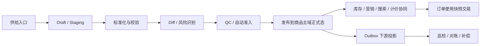
```mermaid
flowchart LR
    A["供给入口"] --> B["Draft / Staging"]
    B --> C["标准化与校验"]
    C --> D["Diff / 风险识别"]
    D --> E["QC / 自动准入"]
    E --> F["发布到商品主域正式态"]
    F --> G["库存 / 营销 / 搜索 / 计价协同"]
    G --> H["订单使用快照交易"]
    F --> I["Outbox 下游投影"]
    I --> J["巡检 / 对账 / 补偿"]
```

这条主链路表达的是统一供给治理平台的基本职责：

1. 所有供给动作先进入 `Draft / Staging`，而不是直接污染正式商品。
2. 标准化、校验、Diff、风险识别和审核，构成正式发布前的质量门禁。
3. 发布之后不是“流程结束”，而是进入库存、营销、搜索、计价和订单快照的协同阶段。
4. 最终通过 Outbox、巡检、对账和补偿保证一致性，而不是要求一次同步调用把所有下游都写成功。

### 2.3 决策点 1：为什么不能继续在原商品系统上打补丁，而是需要新增 `Draft` 表

#### 场景与问题

很多团队在系统演进早期都会问一个问题：既然原来已经有商品系统，为什么不继续在原表上加几个字段、补几个状态、加几段审核逻辑，而是要显式引入 `Draft` 表甚至新的写模型？

短期当然可以继续打补丁，但问题是业务模型已经变了。早期很多商品系统主要承载的是自运营的相对简单的配置型商品，商品本身更像一个后台配置对象；后面商品开始承载外部供给接入、审核流程、库存策略、履约规则、退款口径、供应商同步和版本化发布之后，它已经不再只是“静态配置”，而是在向“可治理的交易资产”演进。

如果继续把这些新能力都硬塞进原商品系统的单一正式表或单一状态字段里，短期看似节省改造成本，长期却会持续累积三类问题：

1. **边界继续塌陷**

   原商品系统原本只负责正式商品表达，如果继续往里塞草稿、审核、导入状态、供应商同步中间态，它就会同时承担接入层、流程层和资产层职责，后面每接一个新品类或一个新供给来源，复杂度都会继续上升。

2. **正式资产被流程态污染**

   一旦把“待审、驳回、文件解析中、待补图、供应商刷新中”这些状态混进正式商品表，商品主域的语义就不再稳定，搜索、缓存、计价、订单也更容易误读这些半成品或中间态。

3. **演进成本越来越高**

   继续打补丁的本质是拿局部 if/else 和临时字段去扛新的业务模型。前期似乎更快，但后期每增加一种商品类型、每新增一种审核策略、每接一种库存模式，都要在旧结构上继续叠复杂度，风险和维护成本只会越来越高。

所以这次改造的本质不是简单重构代码，而是**边界重划**：把正式商品、可发布草稿、流程任务、审核工作台、库存事实这些不同层次的数据重新分层。也正因为如此，系统才需要显式引入 `Draft` 或 `Staging` 这类新写模型，而不是继续在原商品表上追加字段和状态。

#### 方案对比

| 方案 | 优点 | 缺点 / 风险 | 适用场景 | 推荐结论 |
| --- | --- | --- | --- | --- |
| 方案 A：继续在原商品系统上打补丁 | 短期改造快；不需要新增模型和表 | 边界塌陷；流程态污染正式态；复杂度滚雪球增长 | 早期、简单、低变化系统 | 过渡方案 |
| 方案 B：新增 `Draft` 表和独立写模型 | 语义分层清晰；便于审核、发布、版本冻结和演进 | 初期改造成本更高 | 中长期演进、复杂商品平台 | 推荐 |

#### 推荐方案

推荐方案 B。判断标准不是“新增表是不是更优雅”，而是业务模型是否已经发生质变。

一旦商品开始承载供给接入、审核治理、库存协同、履约规则和版本化发布，原商品系统就不再适合只靠补字段和补状态来演进。此时新增 `Draft` 表，本质上是在承认“正式商品”和“待治理草稿”是两种不同层次的数据，应该被显式建模。

### 2.4 决策点 2：`Draft` 属于供给平台还是商品主域写侧，QC 挂在哪层快照上

#### 场景与问题

这是整个商品生命周期架构里最容易引发争论的一个决策点。按业务流程直觉看，商家和运营是在供给平台改商品，所以草稿似乎天然应该留在供给侧；但从资产主权、事务边界、版本冻结和长期演进看，`Draft` 又更像商品主域内部的未生效版本。

这个问题不能只看“草稿表放哪里”，还必须连着 QC 链路一起看。因为真正的架构问题不是：

> `Draft` 在供给还是在商品中心？

而是：

> **可审核、可发布的草稿资产归谁持有，QC 又应该挂在哪一层冻结快照上做裁判？**

如果 `Draft` 留在供给侧，QC 往往也只能围绕供给侧草稿运行，链路就会自然变成：

```text
供给(draft)
  → QC
  → 商品正式态
```

如果 `Draft` 已进入商品主域写侧，QC 更合理的形态则是：

```text
供给接入
  → 商品主域 Draft / Staging
  → QC
  → 本地 Merge 到正式 Item
```

这两条链路看起来只差了一个步骤，底层却是两种完全不同的资产主权和版本控制模型。

这里先给出结论，再展开论证：

> 如果 `Draft` 只是浏览器表单保存、文件上传中的临时缓存，它可以短暂停留在供给侧；但一旦 `Draft` 进入待审核、待发布、可版本冻结、可与正式商品合流的阶段，它本质上已经属于商品主域的写模型，而不应该长期留在供给接入层。

换句话说，这一节讨论的不是“前端临时草稿存哪里”，而是“可审核、可发布的商品草稿资产归谁持有”。

#### 方案 A：`Draft` 留在供给平台

这种方案的出发点非常自然：供给平台负责对接商家、运营、供应商和 ERP，商品变更从这里进入，审核工作台、批量任务、错误文件也在这里，于是团队很容易顺着流程心智把 `Draft` 一起留在供给层。

在这种设计下，QC 也通常会变成“前置流式审核”，即先在供给侧审核，再把通过后的 DTO 推给商品主域落正式态。

##### 优点

- 业务流程看起来更顺，商家上传、审核流、任务进度都集中在一个平台。
- 供给平台天然适合承接脏数据、错误文件、批量导入和人工修复。
- 对早期团队来说，上线速度快，不需要商品主域一开始就承接完整的草稿写模型。

##### 缺点 / 风险

1. **资产主权分裂**

   同一个商品会被拆成两份核心表达：供给平台里的草稿资产，以及商品中心里的正式资产。草稿和正式商品其实只是同一资产的不同阶段，却被两个服务分别持有，后续版本控制、冲突治理和审计解释都会变复杂。

2. **发布合流链路跨服务，放大批量窗口风险**

   当 QC 判定通过时，系统需要把草稿 merge 到正式商品。如果草稿在供给、正式表在商品中心，发布就必须走跨服务 RPC 或异步命令。单次发布未必是灾难，但一旦进入凌晨供应商大批量更新、大促前批量调价、酒店政策全量同步等场景，发布链路时延、锁竞争、失败点和重试成本都会明显放大，也更容易在批量窗口冲击商品主域写链路。

3. **类目属性契约和校验逻辑容易进入“双写地狱”**

   商品草稿模型与正式模型往往高度同构：类目、属性、多规格 SKU、阶梯价、履约规则、退款规则都要表达。商品主域一旦新增类目契约、修改必填属性或调整校验规则，供给平台就很容易被迫同步修改草稿表结构和复制一套校验逻辑。久而久之，两个服务会演变成披着接口外衣的伪单体。

4. **版本冻结与防篡改更难做**

   如果审核看的数据在供给侧，而最终发布动作发生在商品主域，审核中途还要面对商家、运营、供应商同步并发修改同一商品的问题。理论上可以通过版本号、快照和锁机制解决，但复杂度明显高于把可发布草稿直接内聚在商品主域本地。

5. **QC 更难锁定真正的裁判快照**

   这是这条链路最微妙、也是最危险的问题。QC 在供给侧看到的是版本 A，但在审核通过到跨服务发布的窗口里，供给侧草稿可能已经被另一个并发修改线程推进到版本 B。最终就可能出现“审的是 A，发的是 B”的时空撕裂问题。

6. **多版本乱序容易导致线上数据回滚**

   商家短时间连续提交多个版本时，机审秒过的版本 B 可能先发布，而人工审核较慢的版本 A 后通过。如果发布动作只是“审核通过后把 DTO 再推给商品主域”，旧版本 A 就可能在更晚的时间反向覆盖新版本 B，形成线上数据时间倒流。

##### 适用场景

- 早期系统
- 类目简单、审核弱、供应商同步不重
- 商品主域还没有成熟的写模型和发布版本体系

#### 方案 B：`Draft` 收拢到商品主域写侧

这里的“放在商品中心”需要说得更精确一些：不是把 `Draft` 直接放进 C 端线上 `product_item` 表，而是放进商品主域自己的 `draft / staging / version / publish merge` 写模型中。商品主域对这份草稿资产拥有版本冻结、发布合流和正式落库的主权。

在这种设计下，QC 不再审核供给平台里那份可变草稿，而是基于商品主域已经落库、已经冻结版本号的 `Draft / Staging` 快照做裁判。QC 回传的也不再是完整商品 DTO，而只是轻量的判决结果，例如：

```json
{
  "draft_id": 555,
  "publish_version": 102,
  "result": "PASS"
}
```

##### 优点

1. **资产主权统一**

   无论是线上售卖商品，还是待审核的未生效版本，本质上都是同一份商品资产的不同形态。把它们收在商品主域写侧，领域边界最稳定。

2. **合流可以本地事务闭环**

   `product_draft_tab`、`product_staging_tab`、`product_item_tab`、`publish_version` 都在商品主域本地时，QC 通过后的 merge 可以在本地事务内完成。这样发布路径更短，也更容易做版本校验、幂等发布和失败回滚。

3. **版本冻结与快照锁定更自然**

   供给平台把数据清洗成标准 DTO 后推给商品主域，商品主域将其落成 `Draft` 或 `Staging` 并生成版本号。QC 审核的是这份冻结后的本地快照，而不是仍然暴露在接入层并发修改风险中的动态数据。

4. **契约和校验逻辑只维护一份**

   类目、属性、SKU、Offer、履约、退款等商品主契约只需在一个主域里演进，避免供给和商品两边长期维护两套同构模型。

5. **发布事件与读模型刷新更容易统一**

   正式商品落库、快照生成、Outbox 写入、搜索/缓存/计价/营销投影刷新都可以由商品主域统一发起，链路更可解释。

6. **QC 能基于冻结快照做真正的版本裁判**

   数据一旦进入商品主域落成 `Draft` 或 `Staging`，系统就可以为它分配明确的业务版本号，并在送审期间锁定这份快照。商家若继续修改，必须生成新的版本而不是覆写旧版本。这样 QC 审核的是确定版本，发布的也是同一个确定版本。

7. **QC 回传 verdict，商品主域本地事务完成 merge**

   QC 审核通过后，不需要再跨服务传一份巨大的商品 DTO 回商品主域，只需要回传“哪一个草稿版本审核通过”的轻量判决。商品主域随后在本地事务里将该版本 merge 到正式 `Item`，并统一完成快照、Outbox、缓存刷新等后续动作。

##### 缺点 / 风险

1. **B 端写压力会向商品主域集中**

   零散保存、批量导入、供应商同步、错误重提等写流量都会压到商品主域写侧。

2. **商品主域会承接更多流程复杂度**

   如果团队边界没划清，商品主域很容易被误用成“供给后台本体”，把本该属于供给平台的任务、审核工作台、文件处理逻辑全堆进来。

##### 化解施策

方案 B 的关键不是“把所有东西都塞进一个商品服务”，而是：

- 供给平台继续负责入口、清洗、任务、审核工作台、供应商同步编排。
- 商品主域只负责可审核、可发布的草稿资产，以及正式落库闭环。
- `product_draft_tab` 与 `product_item_tab` 物理隔离，避免草稿写洪峰污染线上正式资产。
- 条件成熟时，可以拆成 `product-writer` 和 `product-reader`：前者承接草稿、审核、发布；后者只服务 C 端读流量和缓存。

##### 适用场景

- 中大型平台
- 类目复杂、供应商同步重、审核和版本治理要求高
- 希望长期保持商品主权统一的系统

#### 方案对比

| 方案 | 优点 | 缺点 / 风险 | 适用场景 | 推荐结论 |
| --- | --- | --- | --- | --- |
| 方案 A：`Draft` 留在供给平台，QC 前置审核 | 流程直觉强；任务与审核工作台集中；早期交付快 | 资产主权分裂；发布跨服务；契约双写；QC 难锁定冻结快照；易发生版本乱序覆盖 | 早期系统、低复杂度业务 | 过渡方案 |
| 方案 B：`Draft` 收拢到商品主域写侧，QC 基于本地快照裁判 | 主权统一；本地事务 merge；版本冻结自然；契约单一演进；QC verdict 轻量回传 | 写压力上移；需要 writer/reader 与冷热隔离 | 中大型平台、长期治理 | 推荐 |

#### 推荐方案

推荐方案 B，但需要准确理解为：

> `Draft` 不应该长期留在供给接入层，也不应该直接混进 C 端线上商品表，而应该归商品主域写侧管理。

供给平台的定位更像“流量入口、数据加工厂与流程编排层”：

- 负责接外部脏数据
- 负责把数据清洗成标准 DTO
- 负责任务、审核工作台、错误文件和供应商同步流程

而商品主域才真正负责：

- `Draft / Staging / Version`
- 版本冻结与防篡改
- QC 裁判快照锚定
- 本地事务 merge
- 正式商品落库
- Outbox 与下游投影事件

因此，更完整的架构判断不是“`Draft` 属于供给平台还是商品中心”二选一，而是：

- **入口态临时数据** 可以短暂停在供给侧
- **可审核、可发布的草稿资产** 应归商品主域写侧
- **QC 应该裁判商品主域中已经冻结版本的快照**

这也是为什么在平台化电商架构里，真正成熟的设计通常都不会让供给平台长期持有商品草稿的最终主权。

### 2.5 决策点 3：是否需要 `Staging`，单 `Draft` + `Operation Log` 是否可行

#### 场景与问题

当团队决定引入 `Draft` 之后，下一步一定会遇到两个高度关联的问题：

1. 只有 `Draft` 和正式 `Item` 两层够不够，是否还需要单独的 `Staging`。
2. 如果想尽量轻量化，单 `Draft` + `Operation Log` 能不能替代 `Draft + Staging + Item` 三层模型。

这两个问题最好放在一起讨论，因为它们本质上都在回答同一件事：

> 商品写模型到底需不需要三层隔离，以及单草稿方案的边界在哪里。

这里先给出一个压缩结论：

- `Draft` 解决的是“脏数据吸收、审核沙盒、并行编辑”。
- `Staging` 解决的是“已通过 QC 的干净版本如何等待生效、切渠道、做回滚”。
- `Operation Log` 适合作为单草稿方案的差分增强，但它不能完全替代 `Staging` 在时间轴、渠道隔离和回滚上的作用。

#### `Draft` 与 `Staging` 的职责差异

| 维度 | `Draft` | `Staging` |
| --- | --- | --- |
| 核心语义 | 正在编辑、待治理的工作副本 | 已通过 QC、待激活的静态快照 |
| 数据纯净度 | 可能仍在被修改，存在未审核内容 | 100% 已过审，版本已冻结 |
| 解决的问题 | 审核沙盒、并行编辑、脏写隔离 | 定时生效、多渠道隔离、快速回滚 |
| 是否面向 C 端 | 否 | 当前不可见，但可视为“下一任合法继承人” |

如果没有 `Staging`，系统就只能在“审核通过后立刻发布”和“继续停留在 Draft 里等待后续动作”之间二选一，这会让定时生效、多渠道未来版本和回滚变得很别扭。

#### 方案 A：只有 `Draft`，无 `Staging`

##### 优点

- 模型简单，表和状态少。
- 审核通过后直接发布，链路短。
- 对小系统或低变更频率系统来说，心智负担低。

##### 缺点 / 风险

1. **已提交版本和正在编辑版本容易混淆**

   如果没有 `Staging`，系统很难清晰表达“这份数据已经通过 QC，但暂时还不应该生效”的状态。

2. **定时生效和渠道隔离能力弱**

   大促零点变价、不同渠道未来版本、供应商已过审但待外部确认的场景，都需要一个“已过审但未激活”的物理缓冲区。

3. **回滚确定性弱**

   没有 `Staging` 的物理快照，回滚通常要依赖历史版本重算、日志回放或脚本修复。

##### 适用场景

- 小团队
- 商品结构简单
- 几乎没有定时生效、多渠道隔离和秒级回滚要求

#### 方案 B：单 `Draft` + `Operation Log`

这是很多中型系统会选择的折中方案：一个商品只保留一个 `Draft`，再配套 `Operation Log / Diff Map` 记录价格、标题、库存等字段差分。

##### 优点

- 比三层模型更轻量，只需要 `Item + Draft + Operation Log`。
- 某些低风险变更可以直接 patch 当前草稿，避免“一个商品只能改一次”的业务阻塞。
- 存储成本、索引成本和模型心智都比较低。

##### 缺点 / 风险

1. **多任务审核容易撕裂**

   标题改动需要人工审核 3 小时，价格改动 100ms 秒过，如果它们都 patch 到同一个 `Draft` 上，价格就无法安全独立发布。

2. **激活时需要动态归并日志**

   没有 `Staging` 的完整待发布快照，系统只能在生效瞬间做 `Operation Log` 的 Reduce 和字段级 patch，这会把计算压力带到高峰时刻。

3. **多渠道隔离与一键回滚能力弱**

   单 `Draft` 很难同时表达多个未来渠道版本；一旦线上数据洗脏，回滚通常要依赖逆向回放 `Operation Log`，确定性弱于直接切回上一个 `Staging` 版本。

##### 适用场景

- 中等复杂度系统
- 审核策略比较一致
- 定时生效和多渠道未来版本需求不强

#### 方案 C：`Draft + Staging + Item`

##### 优点

- `Draft` 负责吸收脏写流量和并行编辑，`Staging` 负责沉淀通过 QC 的完整待发布版本。
- 多个 Draft 可以并行加工，但最终只在 `Staging` 中形成有序的未来版本时间轴。
- 到激活时不再做复杂归并，而是把已经组装好的快照本地 merge 到 `Item`。
- 支持定时发布、多渠道隔离、灰度切换和秒级回滚。

##### 缺点 / 风险

- 物理数据副本更多，模型更重。
- 需要额外的激活调度、版本治理和清理策略。
- 对团队的数据建模要求更高。

##### 适用场景

- 中大型平台
- 审核存在快慢混合链路
- 大促定时变价、跨渠道供给隔离较多
- 需要高确定性的回滚和版本切换

#### 方案对比

| 方案 | 优点 | 缺点 / 风险 | 适用场景 | 推荐结论 |
| --- | --- | --- | --- | --- |
| 方案 A：只有 `Draft`，无 `Staging` | 简单、状态少、上手快 | 难表达“已过审待生效”；定时发布和渠道隔离弱 | 小系统 | 有条件可用 |
| 方案 B：单 `Draft` + `Operation Log` | 轻量、节省存储、开发快 | 多任务审核撕裂；激活时要动态归并；回滚能力弱 | 中等复杂度系统 | 可行但有天花板 |
| 方案 C：`Draft + Staging + Item` | 状态分层清晰；激活轻量；支持多版本、多渠道、回滚 | 模型更重，存储更多 | 中大型供给中台 | 推荐 |

#### 推荐方案

推荐方案 C 作为复杂供给中台的目标形态，但不是所有系统第一天就必须上三层模型。

更务实的判断标准是：

- 如果系统当前仍以单渠道、弱审核、低频定时发布为主，方案 B 完全可以作为高性价比方案。
- 一旦系统开始出现多路并行修改、价格和图文审核时效分裂、大促零点定时生效、跨渠道未来版本和秒级回滚要求，就应从单 `Draft` 进化到 `Draft + Staging + Item`。

换句话说，`Staging` 不是“为了优雅而优雅”的抽象，而是当系统需要时间轴、渠道隔离和高确定性回滚时，最自然的一层写模型。

### 2.6 决策点 4：同步体验和异步任务如何分层

| 方案 | 优点 | 缺点 / 风险 | 适用场景 | 推荐结论 |
| --- | --- | --- | --- | --- |
| 方案 A：全部同步处理 | 用户感知简单 | 批量导入、供应商同步会拖垮接口 | 小流量、低复杂度 | 不推荐 |
| 方案 B：全部异步任务化 | 统一执行模型 | 单品创建体验差，交互成本高 | 内部工具型系统 | 不推荐 |
| 方案 C：单品同步体验，批量与长链路异步任务化 | 体验与治理平衡 | 需要双模式编排 | 平台型业务 | 推荐 |

推荐方案是方案 C：表单手工创建、低风险单品编辑保留同步交互；批量导入、批量编辑、券码导入、供应商同步全部任务化。

### 2.7 决策点 5：单商品创建也需要写入任务表吗

#### 场景与问题

这个问题在很多团队里都会被直觉性地处理成“单品同步接口就直接写数据库，不要引入任务表”，因为从前端交互看，运营或商家只是在页面上点一次提交，系统秒级返回，看起来不像一个需要任务化治理的场景。

但如果把链路往后多看几步，就会发现单商品创建后面仍然会经过：

- 标准化与校验
- 交易契约检查
- 风险识别
- 送商品主域写侧冻结快照
- 审核或自动准入
- 发布编排
- 下游刷新
- 失败补偿与审计追踪

如果单品场景完全不落 `task`，它就会和 Excel、API/ISV 推送、批量编辑形成两套完全不同的排障、审计和补偿口径。

#### 方案对比

| 方案 | 优点 | 缺点 / 风险 | 适用场景 | 推荐结论 |
| --- | --- | --- | --- | --- |
| 方案 A：单商品创建不写任务表 | 实现最轻；同步链路最短 | 审计不统一；无法统一补偿；发布追踪割裂 | 非常早期、极简后台 | 不推荐 |
| 方案 B：单商品创建只写 `operation_id`，不写 `task` | 比方案 A 多一层链路锚点 | 仍然和批量链路分叉；任务视图不统一 | 过渡期系统 | 可过渡 |
| 方案 C：单商品创建写轻量 `task(total_count=1, execution_mode=SYNC)` | 审计、发布、补偿、状态跟踪统一 | 需要多维护一张轻量任务记录 | 平台型系统 | 推荐 |

#### 推荐方案

推荐方案 C。单商品创建虽然是同步交互，但后端仍建议写入一条轻量 `product_supply_task`，并在需要时配一条 `task_item`。这样可以统一：

- 入口受理号 `receipt_id`
- 操作链路 `operation_id`
- 发布记录 `publish_record`
- 失败补偿入口
- 运营侧任务查询与审计口径

这条任务记录不是为了把单品交互“强行异步化”，而是为了让同步体验和长链路治理共用同一套后端锚点。

一句话说，就是：

> 单商品创建可以同步执行，但不应该脱离任务模型。

### 2.8 决策点 6：库存配置与库存事实是否放在同一系统

#### 场景与问题

商品上线前常常需要配置库存策略，例如是数量库存、券码库存还是供应商库存；但上线后真正的库存余额、预占和账本又属于交易硬约束。

#### 方案对比

| 方案 | 优点 | 缺点 / 风险 | 适用场景 | 推荐结论 |
| --- | --- | --- | --- | --- |
| 方案 A：库存配置和库存事实全放商品/供给侧 | 简化初期集成 | 后期库存服务难独立；交易与运营耦合过深 | 早期单体系统 | 不推荐 |
| 方案 B：库存配置可在商品/供给链路表达，库存事实由库存系统维护 | 符合职责边界；账本和交易链路更稳 | 需要命令与事件协同 | 平台化和多品类系统 | 推荐 |

#### 推荐方案

推荐方案 B：库存配置是交易契约的一部分，可以在商品发布时一并声明；库存余额、预占、确认、释放、券码状态机必须由库存系统维护。

### 2.9 决策点 7：供应商同步的无效流量过滤，应该放在供给侧还是商品中心

#### 场景与问题

供应商同步场景里，经常会遇到一个非常诱人的优化点：既然 100w 级对象里可能有 70%~80% 根本没有实质变化，那么是不是应该在供给侧先基于业务指纹做一轮粗过滤，把无效数据直接蒸发在上游？

这个思路在算力和带宽上很有吸引力，但它会立即引出一个更危险的问题：

> 供给侧是否真的拥有足够权威的“真相”，来判断一条供应商数据应该被跳过？

如果供给侧维护了一套自己的指纹或状态镜像，而商品中心又是正式商品的唯一真相源，那么一旦出现：

- 上一轮同步失败
- 消息在 MQ 中长时间排队
- 运营在商品中心人工改价或锁定字段
- 多条链路同时修改同一商品

供给侧就很容易基于一份“过期状态”做出错误过滤，最终把本应进入商品中心重试或更新的数据静默跳过，形成最危险的“丢单式不一致”。

#### 方案对比

| 方案 | 优点 | 缺点 / 风险 | 适用场景 | 推荐结论 |
| --- | --- | --- | --- | --- |
| 方案 A：供给侧基于业务指纹做过滤 | 上游 MQ、Consumer、RPC 压力更小；看起来更省算力 | 供给侧需要维护商品状态镜像；失败状态和线上真相容易不一致；最容易产生静默跳过和幽灵覆盖 | 真相源就在上游、链路极短、失败模型简单的系统 | 不推荐 |
| 方案 B：供给侧忠实搬运，商品中心负责幂等去重与 Diff 裁剪 | 真相源单一；最终判断权收敛到商品主域；不容易出现跨系统状态分裂 | 下游商品中心需要承担更强的幂等和 Diff 压力 | 平台化商品主域、多链路并发更新场景 | 推荐 |

很多团队在这里还会想到一个“折中优化”：

- 在 `supplier_sync_state_ledger` 中增加 `hash_sign`
- Consumer 先把本次供应商对象的核心字段做 MD5
- 如果和 `state_ledger.hash_sign` 完全一致，就直接在供给侧把对象切成 `SKIPPED`
- 不再请求商品中心

这个方案看上去能进一步削减商品中心压力，但它本质上仍属于“由供给侧模拟商品真相”的思路，因此需要单独评估：

| 方案 | 优点 | 缺点 / 风险 | 适用场景 | 推荐结论 |
| --- | --- | --- | --- | --- |
| 方案 C：在 `supplier_sync_state_ledger` 中维护 `hash_sign`，由供给侧先做 hash 过滤 | 能在供应商链路最前面蒸发一部分无变化流量；减少 MQ 后续处理和商品中心反查压力 | `hash_sign` 代表的是供给侧曾经看到的状态，不一定等于商品中心当前真相；一旦上次失败、超时未知、运营手工改价、字段锁定或版本演进，就可能在上游形成错误 `SKIPPED`，导致静默丢单 | 极短链路、真相源几乎就在上游、且下游没有复杂并发来源的系统 | 不推荐作为主方案 |

因此，对于 `hash_sign` 这类设计，书里建议明确区分 **“观测字段”** 和 **“裁决字段”**：

- 可以把 `hash_sign` 作为一种辅助观测字段，用来统计“本批次疑似无变化对象占比”、辅助排障和大盘分析
- 但不建议由供给侧据此直接裁决 `SKIPPED`

核心原因很简单：

1. **供给侧的 `hash_sign` 不代表正式商品当前真相**  
   它最多只代表“上一次供给链路认为自己处理过什么”。一旦上次写商品失败、超时未知、被运营锁定、被别的链路改过，这个 hash 就可能已经过期。

2. **供应商视角的“没变”，不等于商品中心视角的“可跳过”**  
   商品中心还要看：
   - 当前 `publish_version`
   - 字段主导权
   - 运营锁定状态
   - 是否存在其他来源并发修改  
   这些信息都不是供应商同步链路自己能最终裁决的。

3. **上游错误过滤比多打一条消息更危险**  
   多打一条 MQ、让商品中心多做一次只读反查，最多是多一点算力开销；但如果上游错误地把一条本该重试或更新的数据切成 `SKIPPED`，它就会变成最难排查的静默丢单。

不过，这并不意味着供给侧就只能做“纯搬运”，一条无效流量都不能拦。更准确的说法是：

> **供给侧不能做最终业务去重裁决，但可以做安全过滤。**

这里的“安全过滤”有一个很严格的边界：它只能基于 **供给链路自身的确定性状态**，去切掉那些数学上或流程上绝对无效的流量，不能去猜测“商品中心现在是不是没变”。

推荐保留的安全过滤包括：

1. **同一批次内的重复页 / 游标漂移过滤**
   - 如果同一个 `outer_goods_id` 在同一 `current_batch_id` 下已经进入 `PROCESSING / SUCCESS`
   - 且本次报文 `payload_hash` 与刚处理过的内容一致
   - 可以安全短路，避免因为供应商翻页重叠导致重复投递

2. **无映射死链过滤**
   - 如果对象状态已经明确是业务阻断态，比如 `BLOCKED / UNMAPPED`
   - 且错误码是 `MAPPING_MISSING / MAPPING_REMOVED`
   - 则可以在供给侧直接抑制，不再重复把这类对象送入商品中心
   - 当运营补齐映射时，再通过事件把状态重新拨回 `INIT`

3. **并发重投 / 幽灵消息过滤**
   - 如果对象已经被另一个 Consumer 成功 CAS 强占到 `PROCESSING`
   - 当前这条消息就是明显的重投或短暂并发踩脚
   - 可以直接丢弃或延迟重试，而不必重复读 HBase 和反查商品中心

4. **已明确成功投递过商品中心的数据的重复过滤**
   - 如果在 **同一批次** 内，该对象已经明确完成过一次成功投递，并且当前重入消息与上一次处理内容一致
   - 则可以在供给侧短路，避免把同一条成功消息重复送到商品中心
   - 这里的关键前提是“**已经明确成功投递过商品中心**”，而不是仅仅因为本地 hash 看起来没变

所以最终边界应该这样理解：

- **供给侧允许做拓扑级、流程级、安全型过滤**
- **商品中心负责最终业务级、版本级、真相级幂等去重**

#### 推荐方案

推荐方案 B：**供给侧不承担最终过滤主权，由商品中心自己基于正式真相做幂等去重和 Diff 裁剪；供给侧仅保留安全过滤。**

这背后的核心判断是：

1. **商品中心才是正式商品的唯一真相源**

   供应商同步、运营手工编辑、商家后台修改、营销锁价都可能同时作用于同一商品。只有商品中心知道当前线上正式版本、字段锁定状态和最终主导权，因此也只有它最适合做“是否真要写入”的最终裁决。

2. **上游过滤最怕静默丢单**

   一旦供给侧的指纹、状态或失败记录与商品中心不一致，就会出现“上游判定没变，实际下游没成功”的黑洞。这类错误比多发几条 MQ 更危险，因为它既难发现，又直接导致数据永远不同步。

3. **幂等和去重本来就是商品主域必须具备的底线能力**

   即使没有供应商 Pull，商品中心也必须面对：
   - 同一消息重投
   - 多链路并发更新
   - 旧版本晚到
   - 运营人工修改和自动同步打架

   所以把去重主权收拢到商品中心，不是额外负担，而是让商品主域回到它本来就该承担的职责。

#### 设计收束

这条决策最终会把供应商同步链路压缩成一种更稳定的非对称结构：

- **供给侧**：负责串行拉取、快照落盘、状态台账、MQ 投递、任务与批次管理，并只做安全过滤
- **商品中心**：负责基于正式 DTO、`publish_version`、字段主导权和乐观锁做最终幂等拦截

一句话说：

> 上游允许做拓扑级安全过滤，但最终业务去重不能离开商品中心。  
> 对供应商同步来说，供给侧只能切掉“绝对无效”的流量，最终是否真要跳过，必须在商品主域的最终写入前裁决。

### 2.10 决策点 8：订单商品快照应该由订单中心在下单时拍，还是由商品中心提前固化

#### 场景与问题

订单要解决的不是“此刻商品线上长什么样”，而是“用户下单那一刻，平台承诺交易的到底是什么”。

这就自然引出一个高频架构问题：

> 既然订单最终要把商品快照写进 `order_item`，为什么不让订单中心在创单时自己实时抓商品、自己组装并保存快照？

这个问题表面上看是“少一张表、少一层对象”的简化，但它背后其实是在问：

- 商品结构与交易结构的主权应该落在哪个领域
- 创单链路是否应该承担商品快照组装成本
- 商品快照到底是“交易临时拼装物”，还是“商品主域提前固化的解释事实”

#### 方案对比

| 方案 | 优点 | 缺点 / 风险 | 适用场景 | 推荐结论 |
| --- | --- | --- | --- | --- |
| 方案 A：订单中心在下单时实时读取商品并自己拍快照 | 表面上少一层商品中心快照对象；订单侧实现直观 | 商品领域结构泄露到交易域；订单中心必须理解规格、属性、多媒体、类目等复杂字段；创单高峰会把商品中心读压力推到交易链路；订单和商品 DTO 强耦合 | 商品结构极简单、交易量低、无高并发要求的小系统 | 不推荐 |
| 方案 B：商品中心在正式发布时提前固化 `item_snapshot`，订单中心只关联 `item_snapshot_id` | 商品主权清晰；交易链路只传结构化标量；创单时不再实时组装复杂商品 DTO；订单解释事实稳定 | 商品中心需要多维护一层快照对象 | 平台型商品中心、复杂商品结构和高并发交易场景 | 推荐 |

#### 推荐方案

推荐方案 B：**商品快照由商品中心在发布时提前固化，订单中心在下单时只引用 `item_snapshot_id`，不自己拼装快照。**

核心原因有 3 个：

1. **商品结构主权在商品中心，不在订单中心**

   商品的结构远不只是标题和价格，往往还包括：
   - 多规格与规格组合
   - 扩展属性
   - 类目树与类目口径
   - 图文与多媒体资产
   - 履约、交易、营销可见字段

   这些结构的业务语义都属于商品域。如果让订单中心自己去“抓商品再拍快照”，商品领域代码就会反向泄露到交易域，最终形成 DTO 强耦合和边界污染。

2. **交易链路应该传引用，不应该现场组装复杂商品对象**

   在高并发下单、秒杀或大促场景里，如果订单中心每次都要实时请求商品中心、拉取完整商品对象、再本地拼成订单商品快照，会把商品中心的读性能直接暴露给交易洪峰。

   相反，如果商品中心在发布时就把 `item_snapshot` 预先固化好，那么订单中心创单时只需要拿到：
   - `item_id`
   - `item_snapshot_id`
   - 当时有效的价格、库存、履约上下文引用

   这样交易链路会退化成结构化标量与引用传递，吞吐量和稳定性都会更好。

3. **订单解释事实必须依赖已冻结的商品快照**

   订单一旦成立，之后无论商品标题、图文、规格文案甚至履约说明怎样变化，订单都必须能回到“下单时平台承诺给用户的那一版商品事实”。

   这个“解释事实”应该是商品中心提前冻结好的 `item_snapshot`，而不是订单中心事后临时拼出来的一份影子 DTO。

#### 设计收束

因此，这个决策点的最终边界可以这样钉死：

- **商品中心**负责生成和维护 `item_snapshot`
- **订单中心**只在创单时绑定 `item_snapshot_id`
- 订单解释基于快照，不基于“当前线上商品”

一句话说：

> 商品中心负责定义“当时卖的是什么”，订单中心负责记录“用户买的是哪一版”。  
> 快照应该由商品主域提前固化，而不是由交易域在下单瞬间临时拼装。

### 2.11 决策点 9：供给、商品、库存、搜索、营销、订单的发布一致性应该如何设计

#### 场景与问题

当商家或运营在 B 端点击“发布”时，真正被改变的往往不只是商品中心一张表，而是整条交易主链路上的多个领域：

- 供给平台要推进任务和发布状态
- 商品中心要把 `Draft` merge 成正式 `Item`
- 库存中心可能要更新库存配置或资源路由
- 搜索域要刷新索引与检索快照
- 营销域要刷新价格、券适用性或促销上下文
- 订单域要基于最新版本判断确认页快照是否失效

这里最大的风险不是“某一个服务没更新”，而是 **多个服务更新节奏不同**。

最典型的资损场景是：

- 商品价格已经上调
- 营销优惠先发布生效
- 搜索或商品详情还停留在旧价格
- 用户用旧价叠加大额券瞬间下单

因此，这个决策点要回答的不是抽象的“是否一致”，而是：

> **供给、商品、库存、搜索、营销、订单等多域之间，应该采用什么样的发布一致性模型，既保证 B 端发布体验，又死守 C 端资金安全。**

#### 方案对比

| 方案 | 优点 | 缺点 / 风险 | 推荐结论 |
| --- | --- | --- | --- |
| 方案 A：运行时强一致分布式事务（XA / AT / Seata） | 表面上“一次发布，多域同时成功或失败” | 发布 RT 极高；跨域长事务锁住多个库；任何一个下游慢都会拖垮整条发布链路；高峰期极易放大为全站雪崩 | 不推荐 |
| 方案 B：领域事件驱动的最终一致性 | 发布主链路短；各域解耦；更适合大规模微服务体系 | 必须处理消息至少一次、乱序、延迟和旁路对账 | 推荐 |

#### 为什么不能用运行时强一致

很多同学在面对“商品、库存、搜索、营销一起发布”时，第一反应是：

> 用分布式事务把这些服务串起来。

但在真实生产环境里，这几乎一定会出问题。

原因有 3 个：

1. **B 端发布体验会被拖死**
   - 发布动作会同步等待商品、库存、搜索、营销全部返回
   - 只要其中一个服务网络抖动或处理变慢，整个运营后台就会卡死
2. **跨域长事务会把数据库行锁拖进交易高峰**
   - 库存、营销、商品等库都可能被长事务锁住
   - C 端下单、查价、扣库存会被 B 端发布操作反向拖垮
3. **失败点越多，回滚越脆弱**
   - 搜索是 ES
   - 营销有缓存和规则引擎
   - 订单有确认页快照
   - 这些本来就不是天然适合 XA 的事务参与者

因此，这里的行业共识应该被明确钉死：

> **放弃运行时强一致，采用“本地事务 + Outbox 事件广播 + 下游幂等消费 + 版本乱序拦截 + 延迟对账兜底”的发布模型。**

#### 推荐方案：基于逻辑版本号驱动的最终一致发布

整套工业级发布一致性链路可以压缩成 4 个动作：

1. **源头状态机推进**
   - 供给平台或商品中心只在本地事务内推进自己的发布状态
   - 同时写入 Outbox 事件
2. **事务消息广播**
   - 通过 MQ / Outbox 扫描器把商品变更事件 fan-out 给库存、搜索、营销等域
3. **消费端版本校验**
   - 下游各域只接受比自己当前 `last_processed_version` 更新的消息
   - 旧消息、乱序消息直接丢弃
4. **旁路延迟对账**
   - 基于 Binlog / Canal / Debezium 或定时审计任务，对多域最终状态做迟到核对与冲正

#### 核心设计点 1：源头必须先状态机化，再发事件

发布动作不能直接“改完数据库顺手发一条 MQ”，而必须先在源头服务中把发布建模成状态机，例如：

- `EDITING`
- `PUBLISHING`
- `PUBLISHED`
- `FAILED`

以供给平台或商品中心为源头时，本地事务至少做两件事：

1. 推进本地状态到 `PUBLISHING`
2. 在同一个事务里写一条 `ItemChangedEvent` 到 Outbox

这一步的关键是：

- 先把本地真相拉平
- 再把“应该通知外界的事实”可靠广播出去

而不是反过来先发消息再祈祷本地和下游都成功。

#### 核心设计点 2：多域广播靠事件，不靠同步 RPC 链式调用

一条商品变更事件发出去后，库存、搜索、营销、数据平台等域应该独立异步消费，而不应该挂成一条“商品调库存、库存调搜索、搜索再调营销”的同步调用链。

这样做的原因是：

- fan-out 广播更容易横向扩展
- 每个域都可以按自己的节奏消费
- 某一个域短时失败不会拖垮整个发布入口

这也意味着：

- 商品中心负责商品正式真相
- 库存域负责库存配置或库存路由真相
- 搜索域负责检索投影
- 营销域负责促销上下文

它们彼此独立，但都围绕同一个 **发布版本号** 或 **逻辑版本号** 收敛。

#### 核心设计点 3：下游必须用 `version` 做乱序拦截

这是整个发布一致性设计里最关键的一道防线。

运营可能在 1 秒内连续改两次价格：

- 第一次把价格改成 100
- 第二次立刻改成 150

如果“150”的消息先到、而“100”的旧消息后到，下游如果无脑覆盖，就会把正确价格覆盖回旧值，直接造成资损。

因此，源头发出的事件必须至少携带：

- `item_id / sku_id`
- `version`
- `op_time`
- 本次变化的核心字段

典型事件体可以抽象成：

```json
{
  "item_id": "ITEM_8888",
  "event_type": "ITEM_UPDATE",
  "price": 15000,
  "version": 1002,
  "op_time": 1780900000
}
```

下游服务必须在自己的余额表、配置表或投影表里冗余：

- `last_processed_version`

并在更新时做原子谓词检查：

```sql
UPDATE projection_xxx
SET item_price = :price,
    last_processed_version = :version
WHERE item_id = :item_id
  AND :version > last_processed_version;
```

如果 `affected_rows == 0`，说明这是一条迟到的老消息，应直接丢弃。

一句话说：

> 发布一致性的核心不是“消息有没有到”，而是“老消息永远不能覆盖新版本”。

#### 核心设计点 4：订单域必须用确认页快照隔离版本漂移

订单域是最不能“等最终一致慢慢修”的地方，因为用户是在交易链路里直接下单和付钱。

这里不能简单地说“商品最终会一致”，而要明确：

- 用户点击“去结算”时，必须生成一份确认页快照
- 这份快照里锁定当时的 `item_id / price / version`

后续在 `CreateOrder` 时，订单服务要拿着这份版本去做最终校验：

- 如果商品仍是同一版本，允许下单
- 如果商品已经推进到更高版本，例如改价或下架，直接提示用户刷新确认页

也就是说：

- 搜索和营销可以接受短暂的投影延迟
- 订单不能接受“旧快照直接落单”

#### 各业务域的协同策略

1. **商品域 → 搜索域**
   - 搜索收到变更后批量写 ES
   - 考虑 ES 近实时刷新延迟，可同时刷新 Redis 商品检索快照
   - C 端详情直达优先读 Redis 快照，缓冲 ES 延迟

2. **商品域 → 营销域**
   - 营销收到价格、上下架、品类变化后刷新自身投影
   - 但营销在最终核价时，仍应回查或读取高性能缓存里的当前商品正式价格版本
   - 一旦发现版本不一致，应宁可降级不用优惠，也不要放行“低价高券”

3. **商品域 → 库存域**
   - 如果商品改动涉及库存配置、履约方式、资源路由或扣减时机，库存域消费事件后应更新自己的配置投影
   - 同样要使用 `last_processed_version` 防止旧配置覆盖新配置

4. **商品域 → 订单域**
   - 订单域不实时追商品所有细节
   - 只在确认页和创单时拿着 `version` 做关键校验
   - 商品快照与版本对不上时，直接拒绝旧确认页继续下单

#### 终极兜底：旁路延迟对账与自动冲正

即使前面的 Outbox、MQ、版本拦截都做对了，真实生产环境里依然可能发生：

- 消息漏投
- 消费者卡死
- 搜索 / 营销某个域长时间没消费成功

所以还必须有一条**不依赖主业务链路的旁路审计机制**。

推荐做法是：

1. 在商品发布成功后，基于 Binlog 订阅（Canal / Debezium）或审计任务记录发布事实
2. 延迟几分钟再触发跨域核对，给异步消费预留静默窗口
3. 对库存、搜索、营销、商品详情投影、价格快照等关键域做版本和关键字段核对
4. 一旦发现某个域还停留在旧版本：
   - 触发自动冲正
   - 或调用受控后台接口强制回刷
   - 同时报警

这条链路的定位非常重要：

- 它不是主发布路径
- 它是**最终一致性的独立审计者**

#### 推荐方案

推荐采用：

> **本地事务状态机 + Outbox 广播 + 下游版本拦截 + 订单快照隔离 + 延迟对账兜底**

这套方案的核心判断是：

1. 发布链路的第一目标不是“所有域瞬时同时成功”，而是 **源头状态确定、事件可靠发出**
2. 下游一致性的第一目标不是“每条消息都严格按网络顺序到达”，而是 **旧版本永远不能覆盖新版本**
3. 交易安全的第一目标不是“营销和搜索马上变对”，而是 **订单不能基于过期价格版本落单**
4. 最终一致性的最后一层，不是业务代码里的 if/else，而是 **旁路审计和自动冲正**

一句话说：

> 在超大规模电商里，多域发布一致性不是靠运行时强一致来硬扛，而是靠“版本化事件广播 + 消费端乱序拦截 + 订单快照隔离 + 旁路延迟对账”这套组合拳，把发布体验、系统吞吐和资金安全同时守住。

### 2.12 状态机与任务模型设计

#### 2.12.1 生命周期不能只用一个大状态字段表达

整套系统里最容易做错的一件事，就是试图用一个大状态字段表达所有生命周期。

但实际上，下面这些状态并不处于同一层：

- `DRAFT / QC_PENDING / PUBLISHED`
- `ONLINE / OFFLINE / BANNED / ARCHIVED`
- `AVAILABLE / RESERVED / CONFIRMED / RELEASED / CONSUMED`
- `CREATED / RUNNING / PARTIAL_SUCCESS / FAILED / DONE`

如果把它们强行塞进一个统一状态字段里，短期看起来省表、省字段，长期一定会出现：

- 状态爆炸
- 语义互相污染
- 不同系统职责无法切开
- 补偿、审计和恢复策略无从落地

因此这里必须先统一一条系统级原则：

> 生命周期不是一条线，而是多层状态机的组合。  
> 任务状态、审核状态、正式商品状态、库存状态必须显式分层，不能混成一个大状态字段。

#### 2.12.2 决策点 10：是否只用一个大状态字段表达全部生命周期

| 方案 | 优点 | 缺点 / 风险 | 推荐结论 |
| --- | --- | --- | --- |
| 方案 A：单一大状态字段 | 表面简单；早期实现快 | 状态爆炸；语义冲突；难扩展；补偿和审计口径混乱 | 不推荐 |
| 方案 B：拆分任务状态、审核状态、正式商品状态、库存状态 | 语义清晰；职责边界明确；便于治理、审计和补偿 | 模型设计要求更高 | 推荐 |

推荐方案是方案 B。

原因不在于“拆得越多越优雅”，而在于不同状态层在回答不同问题：

- **任务状态**：这次任务有没有执行完
- **审核状态**：这次变更有没有被裁判通过
- **正式商品状态**：这个商品现在能不能被平台售卖
- **库存状态**：这份库存或资源当前处在什么履约阶段

如果把这些问题混在一起，最终就会得到一套谁也解释不清、谁也不敢改的状态系统。

#### 2.12.3 任务状态、审核状态、正式商品状态、库存状态的分层设计

建议至少拆成 4 层：

| 状态层 | 示例 | 回答的问题 |
| --- | --- | --- |
| 任务状态 | `CREATED / RUNNING / PARTIAL_SUCCESS / FAILED / DONE` | 这次任务处理完了没有 |
| 审核状态 | `PENDING / APPROVED / REJECTED / WITHDRAWN` | 这次变更是否被审核通过 |
| 正式商品状态 | `ONLINE / OFFLINE / ENDED / BANNED / ARCHIVED` | 这个商品现在是否允许售卖 |
| 库存状态 | `AVAILABLE / RESERVED / CONFIRMED / RELEASED / LOCKED / CONSUMED` | 这份库存是否可售、已占、已消费 |

进一步讲，它们之间的关系应该是：

- **任务状态** 驱动“有没有处理完”
- **审核状态** 驱动“能不能进入正式发布”
- **正式商品状态** 驱动“平台货架能不能卖”
- **库存状态** 驱动“用户当前能不能占、能不能扣、能不能核销”

它们彼此关联，但不互相替代。

例如：

- 一个任务可以 `FAILED`，但商品正式状态仍然是 `ONLINE`
- 一个商品可以 `OFFLINE`，但历史库存资源仍可能处于 `CONFIRMED` 或 `CONSUMED`
- 一个审核可以 `REJECTED`，但这并不等于库存要发生任何状态变化

所以这部分最终要落成的系统心智是：

> 不同状态层服务于不同的治理目标。  
> 任务解决执行闭环，审核解决裁判闭环，商品状态解决售卖闭环，库存状态解决履约闭环。

---

## 3. 详细设计 - 供给平台

这一节不再讨论“商品资产最终长什么样”，而是专门回答供给平台如何承接多入口流量、如何隔离不同入口的资源和执行策略、如何把脏输入治理成标准对象，并如何把结果交给商品主域写侧与库存系统。

这里先钉死三个边界：

1. 供给平台负责接入、标准化、任务编排、发布编排和失败运营化。
2. 供给平台不持有 `Draft / Staging / QC` 主权，这些状态与快照属于商品主域写侧。
3. 供给平台承接库存运营入口，但不持有库存事实、预占、账本和券码池主权。

### 3.1 平台定位与职责边界

供给平台的定位更接近一个 **B 端接入与治理控制面**，而不是商品资产或库存事实的权威持有者。

| 能力 | 供给平台负责什么 | 不负责什么 |
| --- | --- | --- |
| 入口接入 | 商家上传、运营创建、Excel 导入、API/ISV 推送、供应商 Pull/Push | 正式商品读模型 |
| 输入治理 | 标准化、格式校验、映射补齐、错误文件、幂等受理 | `Draft / Staging / QC` 主权 |
| 任务编排 | `task / task_item`、执行模式、进度跟踪、部分成功 | 商品正式态本地 merge |
| 发布协同 | 触发发布命令、跟踪发布结果、记录 publish record | 正式商品版本落库 |
| 库存入口 | 创建库存变更单、券码导入、生码、锁库存命令入口 | 库存事实、账本、预占 |
| 供应商同步 | Batch、Checkpoint、Snapshot、映射、DLQ | 供应商数据最终是否成为正式商品版本的裁决权 |

一句话总结：

> 供给平台负责把外部和 B 端的复杂输入组织成可治理、可编排、可恢复的标准化变更；商品主域写侧负责把这些变更冻结、审核、发布为正式商品；库存系统负责把库存命令落成事实。

### 3.2 决策点

这一节后面会进入大量实现细节。为了避免决策点散落在各个小节里，供给平台相关的关键取舍统一先收口在 `3.2`。后续如果继续新增决策点，也优先继续挂到这里。

#### 3.2.1 决策点 1：任务抢占使用 DB 还是 Redis 分布式锁

Parser Worker 抢占 `PENDING` 任务时，行业里最主流的两套方案就是：

- 基于 MySQL 行锁 / 轻量 CAS 的 DB 抢占
- 基于 Redis `SETNX` / Redisson 的分布式锁抢占

这两套方案都能做，但它们解决问题的侧重点完全不同。

| 对比维度 | 方案 A：基于 DB 的轻量 CAS / 行锁抢占 | 方案 B：基于 Redis 分布式锁抢占 | 推荐结论 |
| --- | --- | --- | --- |
| 底层原理 | 依赖 MySQL 单行条件更新和 MVCC，在数据库里一步完成状态推进与租约占有 | 先在 Redis 抢锁，再去 DB 改状态，锁与状态分属两个组件 | 对 B 端批量任务更推荐方案 A |
| 架构复杂度 | 低，无额外中间件依赖 | 中，需要 Redis 集群和分布式锁客户端 | 批量任务优先简单可靠 |
| 抢占吞吐 | 中等，但对 B 端批处理完全够用 | 极高，适合超高频短平快抢占 | Parser 抢占通常不需要 Redis 级吞吐 |
| 状态一致性 | 强。状态、租约、进度都在 DB 权威方闭环 | 弱一些。加锁和改状态跨组件，天然存在双写不一致风险 | B 端供应链更看重一致性 |
| 续租机制 | 需要自己维护 `heartbeat_at / lease_until` | 可借助 Redisson Watchdog 自动续租 | 自动续租是优点，但不是决定性优势 |
| 脑裂 / 猝死恢复 | 强。旧 Worker 恢复后因为 `worker_id + lease_token` 不匹配而自然失效 | 弱一些。Redis 主从异步复制、锁提前过期、假死恢复都可能带来双 Worker 风险 | 批量主链路不应把风险转移到锁组件 |
| 运维与排障 | 简单，直接查 `product_supply_task` 就能看到状态、租约、进度 | 更复杂，需要同时查 DB 和 Redis 锁状态 | 批量链路更适合单主权排障模型 |

推荐结论是：

> 对 Excel 批量导入这类 **长生命周期、低 TPS、强一致、强审计** 的 B 端任务，优先使用 **DB CAS 抢占**；  
> 对秒杀、轻量定时任务、超高频短平快加锁场景，才优先考虑 Redis 分布式锁。

原因不在于 Redis 不够快，而在于这类批处理任务真正敏感的不是“抢占吞吐”，而是：

- 状态是否原子闭环
- 容灾恢复是否确定
- 排障路径是否单一
- 是否会因为锁和状态分离而产生脑裂

因此在当前这条链路里，更稳的选择是：

- 任务状态、租约、进度全部沉淀在 `product_supply_task`
- 通过一条带条件的 `UPDATE ... WHERE status='PENDING'` 或 `lease_until < NOW()` 完成抢占
- 由旁路恢复逻辑接管过期租约任务

一句话讲清楚就是：

> 这条链路要优先追求 **状态强一致和容灾确定性**，而不是为了追求更高的锁吞吐，把抢占权拆到 Redis 去制造新的双写不一致面。

#### 3.2.2 决策点 2：多入口是否需要按交互频率与数据吞吐量做物理隔离

供给平台的入口很多，但真正困难的地方从来不是“入口多”，而是不同入口的**时效预期、吞吐规模、失败容忍度和用户心理完全不同**。如果把单品同步提交、Excel 导入、ERP Push、Supplier Pull 全塞进一套线程池、一套队列、一套 Worker，短期看架构很简单，长期一定会在高峰窗口自相残杀。

这里要回答的不是抽象地“要不要隔离”，而是一个更具体的工程问题：

> 供给平台应该“一套执行池跑所有入口”，还是应该按交互频率和数据吞吐量做物理隔离。

先给结论：

> 应该按 **交互频率 × 数据吞吐量** 做物理隔离。  
> 多入口可以复用治理模型，但不应该共用执行资源池、队列和容错策略。

| 方案 | 优点 | 缺点 / 风险 | 适用场景 | 推荐结论 |
| --- | --- | --- | --- | --- |
| 方案 A：所有入口共用一套线程池 / 队列 / Worker | 架构简单；早期开发快；运维对象少 | 高峰时互相拖垮；交互型链路被系统型流量吞掉；长任务与短任务争抢资源；容错策略互相污染 | 早期、小流量、单一入口系统 | 过渡方案 |
| 方案 B：按四象限做物理隔离，治理层复用 | 时效和吞吐边界清晰；本地运营体验更稳；便于限流、背压、分级容错 | 资源池更多；执行面稍复杂；入口分层要求更高 | 中大型供给平台、多入口系统 | 推荐 |

为什么这件事必须作为独立决策点先钉死：

1. **用户心智不同**

   单品创建/编辑是秒级心智；Excel 导入是分钟级、盯着进度条的交互心智；ERP Push 只要求快速 ACK 和高可用；Supplier Pull 更偏向长任务、可恢复优先。把这些链路混在一起，本质上是在让最脆弱的交互型链路去为最大吞吐的系统型流量垫背。

2. **资源模型不同**

   单品提交主要吃 Web 线程和 RPC RT；Excel 导入吃文件 IO、流式解析和批量落盘；ERP Push 吃 MQ 堆积和 Consumer 匀速消费；Supplier Pull 吃 Batch Worker、Checkpoint、Lease、Snapshot 和外部限流。它们根本不是同一种执行问题。

3. **容错策略不同**

   Excel 需要部分成功、错题本和行级修复；ERP/API 需要在签名失败、模板错配、批次结构畸形时整批阻断；Supplier Pull 还要区分批次级、页面级、对象级失败。执行层不隔离，最后连错误模型都会互相污染。

4. **高峰窗口最容易出现跨链路拖垮**

   凌晨供应商同步百万级对象、ERP 疯狂重试、Supplier Pull 长时间占用 Worker 时，如果 Excel 导入和单品创建还共用这套执行资源，前台商家可能连一个 20 行的小 Excel 都要排很久，甚至单品保存都会被拖慢。

**落地结构：四象限入口设计**

整个接入层不应该只按“来源”分类，更应该按 **交互频率 × 数据吞吐量** 做资源隔离。

| 象限 | 典型入口 | 交互/吞吐特征 | 执行方式 | 核心目标 |
| --- | --- | --- | --- | --- |
| Local 单品 | 运营后台、商家后台单品表单 | 强交互、低吞吐、秒级预期 | 同步提交、同步返回 | 不卡前台，不排队 |
| Local Excel | 商家导表、运营批量建品/编辑 | 高交互异步任务、中等吞吐 | 上传后返回 `task_id`，专属 Excel Worker 异步解析和处理 | 分钟级反馈、错题本、部分成功 |
| Supplier Push | 三方 ERP、ISV、供应商开放接口 Push | 无交互、低时效、超大吞吐 | 接口快速 ACK，写专属 MQ，Consumer 匀速消费 | 抗洪峰，不拖垮本地后台 |
| Supplier Pull | 酒店、票务、供应商平台全量/增量拉取 | 长任务、海量吞吐、可恢复优先 | `Batch + Checkpoint + Lease + Raw Snapshot` | 可恢复、可补偿、可追溯 |

**落地结构：资源池 / 队列 / Worker 对应关系**

隔离不是概念隔离，而是要落到具体执行介质上：

| 链路 | 资源池 / 介质 | 设计原则 |
| --- | --- | --- |
| Local 单品创建/编辑 | 独立 Web 线程池或独立同步请求配额 | 不排队，秒级返回 |
| Local Excel 导入 | 独立 Excel Worker Pool | 保证分钟级反馈，不被 ERP 洪峰拖垮 |
| Supplier Push | 独立 MQ + Consumer | 接口快速 ACK，后端慢消费 |
| Supplier Pull | 独立 Batch Worker | 支持长任务、Checkpoint、Lease |

这里要钉死两个底线：

1. Excel 导入与 Supplier ERP/API 推送不共用线程池、队列和容错模型。
2. Supplier Push 和 Supplier Pull 也不应共用同一执行池，因为一个偏实时受理，一个偏长任务恢复。

**推荐方案**

推荐的落地原则是：

- **治理层复用**
  - 统一 `task / task_item / publish_record / operation_log`
  - 统一校验结果、Diff、发布编排和错误运营化
- **执行层隔离**
  - Local 单品：独立同步链路
  - Local Excel：独立 Excel Worker Pool
  - Supplier Push：独立 MQ + Consumer
  - Supplier Pull：独立 Batch Worker + Checkpoint / Lease

#### 3.2.3 决策点 3：Excel 与 ERP/API 是否可以共用同一套容错机制

这是供给平台里最容易被低估的一个设计点。两者都叫“批量数据”，但它们面对的是两种完全不同的用户心智和恢复语义：

- Excel 导入是 **交互型导入**
- ERP/API 推送是 **系统型同步**

真正的问题不是“是不是都可能失败”，而是：

> 供给平台应该给所有批量入口一套统一错误模型，还是应该按交互型导入和系统型同步拆分容错机制。

先给结论：

> 不应该共用同一套容错机制。  
> Excel 导入应以**部分成功、行级失败、错题本、人工修复**为核心；  
> ERP/API 推送应以**关键错误整批阻断、标准错误码、幂等重试、批次隔离**为核心。

| 方案 | 优点 | 缺点 / 风险 | 适用场景 | 推荐结论 |
| --- | --- | --- | --- | --- |
| 方案 A：统一容错模型 | 规则少；实现看起来简单；错误处理路径统一 | 用户心智混乱；交互型导入和系统型同步互相迁就；结果输出和重试语义容易错位 | 早期、小流量、单一入口系统 | 过渡方案 |
| 方案 B：按交互型导入 vs 系统型同步拆分容错模型 | 用户体感更合理；错误粒度更贴近场景；便于部分成功和批次阻断分别治理 | 需要维护两套错误语义和输出模型 | 中大型供给平台、多入口系统 | 推荐 |

为什么必须拆：

1. **用户心智不同**

   Excel 导入的操作者坐在页面前等待结果，接受“99 行成功、1 行失败，给我错题本”；ERP/API 推送没有人在等进度条，更在意接口高可用、标准错误码和是否能稳定重试。

2. **错误粒度不同**

   Excel 更适合行级错误隔离；ERP/API 更适合批次级阻断。把两者混成一种模型，要么 Excel 体验过于僵硬，要么 ERP 批次语义被稀释。

3. **恢复方式不同**

   Excel 的恢复动作往往是“下载错题本、修复后重传”；ERP/API 的恢复动作通常是“幂等重试、重新推送整批、按错误码修复上游数据”。

4. **结果输出不同**

   Excel 需要错误文件、错题本、行级提示；ERP/API 需要标准响应码、批次状态、重试与死信策略。结果载体本身就不是一回事。

**推荐方案**

推荐把两类入口的错误模型明确拆开：

- **Excel 导入**
  - 支持部分成功
  - 允许行级失败继续向下处理
  - 生成错题本和错误文件
  - 支持运营人工修复后再提交
- **ERP/API 推送**
  - 关键错误整批阻断
  - 返回标准错误码
  - 依赖幂等重试和批次隔离
  - 超过阈值进入死信或问题单

**错误分级规则**

第 3 节应该明确区分：

- **可行级跳过的错误**
  - 字段格式错
  - 个别映射缺失
  - 单行类目异常
- **必须整批失败的错误**
  - 签名失败
  - 密钥过期
  - 核心模板不匹配
  - 批次结构畸形

#### 3.2.4 决策点 4：Excel 批量链路为什么不能继续用传统串行流程

很多团队在批量导入场景的第一版实现里，都会自然地选择“一把梭”串行流程：

- 上传文件
- 接口线程直接开始解析
- 逐行调用下游
- 最后在接口或单机后台线程里给出结果

这种做法在数据量小、链路短的时候能跑通，但一旦进入真正的供给平台场景，问题会迅速暴露出来。Excel 批量创建和更新并不是“把单品流程循环 N 次”那么简单，它面对的是：

- 文件 IO 和业务处理耦合
- 大文件导致的内存和线程占用
- 单行失败拖垮整批
- 系统重启后任务蒸发
- 下游抖动时无法削峰和背压
- 结果文件、错题本、部分成功难以可靠生成

所以这里真正要回答的问题不是“要不要异步”，而是：

> Excel 批量链路应该继续沿用传统串行处理，还是升级为任务化、分阶段、可恢复的异步流水线。

| 方案 | 优点 | 缺点 / 风险 | 适用场景 | 推荐结论 |
| --- | --- | --- | --- | --- |
| 方案 A：传统串行流程 | 实现快；组件少；早期容易跑通 | 文件解析和业务处理耦合；接口长时间占用；一行失败拖垮整批；系统重启难恢复；难做错题本和部分成功 | 低流量、临时工具型系统 | 过渡方案 |
| 方案 B：任务化、分阶段、可恢复的异步流水线 | 可削峰、可恢复、可审计、支持部分成功和错题本 | 需要 `task / task_item / parser worker / MQ / 结果归档` 等配套 | 平台型批量供给链路 | 推荐 |

| 维度 | 传统串行流程 | 当前新流程 |
| --- | --- | --- |
| 提交阶段 | 上传后直接开始处理，接口可能长时间占用 | 只收单，创建 `task`，秒级返回 `task_id` |
| 解析方式 | 一个线程从头读到尾，解析和处理耦合 | Parser Worker 负责流式解析，行级明细先落盘 |
| 执行模型 | 单机线程池直接逐行调用下游 | 解析后投递 MQ，Consumer 集群匀速消费 |
| 状态表达 | 只有“成功/失败”或粗糙进度 | `task` 与 `task_item` 分层状态机 |
| 失败处理 | 一行失败容易拖垮整批 | 行级沙盒隔离，允许 `PARTIAL_SUCCESS` |
| 恢复能力 | 进程重启往往只能从头重跑 | `parse_checkpoint + lease + MQ retry` 支持恢复 |
| 结果输出 | 靠日志排查 | 自动生成错题本和错误文件 |

推荐把 Excel 批量链路升级成：

- 提交任务
- 解析 Excel
- 处理任务
- 产生结果文件

这不是为了“架构更复杂”，而是为了把批量链路从单机脚本思维升级成：

> **任务化、分阶段、可恢复、可审计、可部分成功** 的工业级流水线。

#### 3.2.5 决策点 5：供应商定时同步链路为什么要单独拆分出来

供应商定时同步链路通常来自三方 ERP 的定时批量同步、货期库存批量回传、接口增量推送等场景。它在后端履约阶段，确实可以复用 Excel 批量链路的部分底座，比如：

- 行级 `task_item` 落盘
- MQ 行级解耦消费
- `Diff / 字段主导权 / base_publish_version` 校验
- 结果文件或问题单回填

但它在接入层、吞吐模型、容错语义和监控容灾心智上，必须单独拆出来。原因不是“供应商同步更高级”，而是它和 Excel 批量链路面对的是两种完全不同的世界。

先给结论：

> 供应商定时同步链路应该独立成一条接入链路和执行链路，但可以复用批量治理底座。  
> 也就是“接入层分流，履约层收口”。

| 方案 | 优点 | 缺点 / 风险 | 适用场景 | 推荐结论 |
| --- | --- | --- | --- | --- |
| 方案 A：供应商同步和 Excel 批量共用一套接入池、解析器和容错模型 | 实现看起来统一；入口少；早期开发快 | 运营导表和 ERP 洪峰互相拖垮；文件流和 JSON/RPC 混在一起；错误语义错位；凌晨同步会把前台 Excel 链路堵死 | 低流量、单入口、临时工具型系统 | 过渡方案 |
| 方案 B：供应商同步单独拆分接入链路，履约层复用批量治理底座 | 接入隔离清晰；监控和背压策略可独立；Excel 体验不被洪峰拖垮；错误模型更契合 ERP 协议 | 入口更多；执行面要分层；治理底座需要共用接口 | 中大型供给平台、多入口系统 | 推荐 |

为什么要单独拆分，核心是四组对立面：

1. **流量特征不同**
   - Excel 是商家手动上传，流量散落、低频、文件大对象。
   - 供应商同步是 ERP 定时洪峰，流量集中、周期性强、瞬时并发高。
   - 如果共用接入池，ERP 洪峰会把 Excel 导入和单品保存一起拖慢。

2. **数据载体不同**
   - Excel 的输入是文件流，需要 Parser Worker、流式解析、Checkpoint 和断点续跑。
   - 供应商同步的输入通常是 JSON/RPC 报文或消息，不需要文件解析器。
   - 如果混用，接入层会被迫同时支持文件解析和报文拆分，代码会快速面条化。

3. **容错语义不同**
   - Excel 面向人，追求错题本、部分成功、行级修复。
   - 供应商同步面向机器，追求标准错误码、批次阻断、幂等重试。
   - 把两者的错误模型揉成一套，会让人和机器都不好用。

4. **优先级与背压不同**
   - Excel 导表通常是高优先级交互任务，要求尽快反馈。
   - 供应商同步更像低优先级高吞吐的后台洪峰，需要更严格的背压和限流。
   - 如果不拆，凌晨同步会抢占商家白天操作的宝贵资源。

所以，供应商同步链路在架构上应该做成：

- 接入层独立
  - Excel 走文件流接入
  - ERP/ISV 走 API / MQ 接入
- 执行层可复用
  - 最终都沉淀为 `task_item`
  - 后续共用校验、Diff、发布治理和补偿框架
- 监控容灾独立
  - Excel 盯错题本、部分成功和任务进度
  - 供应商同步盯批次水位、checkpoint、死信和重试

一句话收束就是：

> Excel 批量链路和供应商定时同步链路可以共用“履约底座”，但不能共用“接入心智”和“容错模型”。  
> 供应商同步必须单独拆分出来，才能保证 ERP 洪峰不会拖垮运营导表体验。

#### 3.2.6 决策点 6：一次同步任务需要几个小时，是否需要任务分片

当一次供应商同步任务可能持续几个小时，甚至覆盖 100w 级资源时，真正要回答的问题不是“能不能把任务切得更碎”，而是：

> **面对慢源、强频控和长时间排队，最稳的长任务模型应该怎么选。**

对 Agoda 这类供应商，推荐答案不是“任务分片并发拉取”，而是：

- 上游接入层保持 **单 Worker 串行 Pull**
- 每次只拉一页或一个 cursor
- 每页成功后立即写快照、写状态、丢 MQ
- 下游 Consumer 集群再慢慢做 `Diff / publish_version / 商品 RPC upsert`

这里的核心不是分片，而是下面 5 个关键点：

1. **统一时刻单例运行与断点续传**  
   同步窗口可能横跨数小时，昨天的批次没跑完，今天的调度又来了。  
   所以 `supplier_sync_batch` 必须具备 `status=RUNNING + lease_until` 的租约机制：  
   - 如果存在未过期的运行中批次，本次调度直接阻断  
   - 如果租约已过期，新 Worker 通过 CAS 接管批次，并从 `current_checkpoint` 继续跑

2. **非对称双库物化分流**  
   100w 酒店的巨型异构 JSON 不适合直接压到 MySQL。  
   - `HBase / Object Store` 负责吞 RAW / NORMALIZED 快照
   - MySQL 负责批次、状态、映射和治理锚点
   这不是为了“上大数据组件”，而是为了把“存大对象”和“管状态”拆开。

3. **接入层页级物化收拢**  
   串行拉回一页后，不能做 500 次单条 Upsert。  
   更稳的做法是：
   - HBase 侧按页批量刷写原始快照
   - MySQL 侧按页批量 Upsert 状态台账 / 行级锚点
   - 再按页批量投递 MQ
   接入层要尽量消灭单条循环写。

4. **时间差下的版本保护**  
   这类同步里，上游拉取和下游消费之间可能相隔数小时。  
   - 供给侧负责忠实搬运，不承担最终过滤主权
   - Consumer 在写商品主域前必须实时反查版本和锁定状态
   - 商品中心在最终写入前用版本、主导权和幂等能力完成最后裁决
   目标不是在供给侧裁掉数据，而是防止旧消息在长时间排队后覆盖新版本。

5. **动态多阶计数器与终结标记**  
   串行 Pull 在拉到最后一页前并不知道总对象数，所以不能沿用“固定总数计数器”的套路。  
   更适合的是：
   - Worker 每投一页就 `INCRBY`
   - 拉到尾页时写入 `end_of_stream=true`
   - 下游 Consumer 每处理一条就 `DECR`
   - 计数归零且终结标记为真时，再触发收尾

| 方案 | 优点 | 缺点 / 风险 | 适用场景 | 推荐结论 |
| --- | --- | --- | --- | --- |
| 方案 A：任务分片并发拉取 | 理论吞吐更高；单次窗口可能更短 | 接入复杂；容易把慢源打挂；恢复复杂；需要额外分片管理 | 供应商接口很快、允许并发拉取 | 不推荐 |
| 方案 B：单 Worker 串行拉取，逐页 checkpoint，拉完即投 MQ | 接入最稳；对供应商友好；断点续传简单；容易做单例控制和动态计数 | 接入吞吐不高，但通常足够 | Agoda 这类慢源、频控严的同步 | 推荐 |

推荐的长任务结构是：

- 定时任务先创建或接管 `supplier_sync_batch`
- 一个独占 Worker 串行拉取供应商页面
- 每页成功后立即做页级物化：快照、状态台账、MQ 投递
- `current_checkpoint` 只记录“已经安全拉回并送入 MQ 的最高水位线”
- RAW / NORMALIZED 快照落 HBase / 对象存储
- MySQL 只保留批次、状态台账、映射、治理锚点
- 下游 Consumer 再慢慢做 `Diff / publish_version / 商品 RPC upsert`

一句话收束就是：

> 对于性能一般、频控严格、同步窗口很长的供应商，关键不是任务分片，而是 **单例运行、串行拉取、页级物化、下游强幂等与版本拦截**。  
> 最合适的结构是“单 Worker 串行 Pull + checkpoint + MQ 异步消化”的线性流水线。

#### 3.2.7 决策点 7：供应商只提供全量 List，如何识别应该下线的对象

供应商同步还有一个非常难啃的问题：很多供应商只会告诉你“我现在还有什么”，不会告诉你“我刚刚删除了什么”。

这会形成典型的“沉默的消失”：

- 创建 / 更新很好处理：List 里有的对象，系统里没有就创建，有了就更新
- 下线最难处理：如果供应商在自己的系统里下掉了一个对象，它不会发 `DELETE` 事件，而只是让这个对象从下一次 List 里消失

这里真正的难点不是“怎么比一次”，而是：

> **在供应商只给全量 List 的前提下，如何把“缺失对象识别”设计成可恢复、可审计、可熔断的批次收尾动作。**

推荐先给结论：

- 默认采用 **时间戳游标对账法**
- 对误下线极其敏感的场景，再升级到 **影子快照表对账法**

| 方案 | 做法 | 优点 | 风险 / 成本 | 适用场景 | 推荐结论 |
| --- | --- | --- | --- | --- | --- |
| 方案 A：时间戳游标对账法 | 以本次同步启动时间 `T_start` 为锚点；本批次命中的对象完成“存活打卡”；批次结束后，把仍在线但最后打卡时间早于 `T_start` 的对象判为候选下线集 | 轻量、无锁、无需额外影子表；容易并入批次收尾 | 如果过早执行，或供应商本次文件明显残缺，可能误杀 | 大多数供应商全量同步 | 默认推荐 |
| 方案 B：影子快照表对账法 | 先把本次全量 List 的对象主键完整写入影子快照表，再与当前在线集合做差集，找出本次缺失者 | 更安全，适合高敏感业务 | 多一张影子表，多一步批次清理，实现更重 | 对误下线极度敏感、供应商稳定性差 | 高风险场景使用 |

为什么默认推荐时间戳游标法？因为它不要求每次都建立完整影子表，也不需要做大范围 `NOT IN` 式对账。更稳的思路是：

1. 批次启动时记录 `T_start`
2. 本次 List 中出现并成功进入处理链路的对象，在状态台账里完成“存活打卡”
3. 当且仅当本批次已经 **拉取结束 + 下游消费完成收敛**，再统一识别那些“本次没有打卡”的在线对象
4. 这些对象进入“候选下线集”
5. 先做比例熔断，再决定是否批量下线

这里有两条必须锁死的安全红线：

1. **绝不能在消费尚未完成时提前下线**  
   必须等 `end_of_stream=true` 且对象级处理已收敛，才能开始识别候选下线对象。否则会把还在 MQ 排队的正常对象误杀。

2. **必须有数量安全阈值熔断**  
   如果本次候选下线对象比例异常高，比如一次要下线 80% 甚至 95%，默认应该认为是供应商漏传、文件不完整或接口故障，而不是“真的大规模下架”。此时必须阻断自动下线，转入告警和人工介入。

所以，这个问题的最终答案不是“做一条大 SQL 找差集”，而是：

> 用 **批次时间锚点 + 对象打卡 + 收尾时统一盘点 + 下线比例熔断**，把“沉默的消失”收敛成一个可控、可补偿、可审计的批次收尾步骤。

### 3.3 统一任务模型与执行框架

入口隔离和执行资源划分已经在 `3.2.2` 定义完成。这一节开始只讨论统一任务锚点、状态机和抢占模型，而不再重复解释为什么要做四象限隔离。

这里的“统一任务模型”不是指所有入口都共用一套执行线程池，而是指 **Local 单品、Excel、API/ISV 推送、运营批量编辑** 这些供给治理型入口共用一套治理任务锚点：

- `product_supply_task`
- `product_supply_task_item`
- `receipt_id`
- `trigger_id`
- `operation_id`
- `execution_mode`

#### 共用范围

| 入口 | 是否共用 `product_supply_task` | 推荐模式 |
| --- | --- | --- |
| Local 单品创建/编辑 | 是 | 轻量 `task(total_count=1, execution_mode=SYNC)` |
| Excel 批量导入 | 是 | `task + task_item`，异步执行 |
| API / ISV 推送 | 是 | 受理后落治理任务，异步处理 |
| 运营批量编辑 | 是 | `task + task_item`，支持部分成功 |
| Supplier 同步执行层 | 否 | 独立 `supplier_sync_*` 模型 |

因此需要在正文中明确一句：

> Local 任务与 Supplier 任务在治理层复用发布编排锚点，但执行层不共用线程池、队列和 Worker 模型。

#### 任务状态机

统一任务模型除了统一表结构，还要统一状态机。否则单品、批量、API 推送虽然都写进了 `product_supply_task`，但每条链路各自发明一套状态语义，最后还是会退化成多套排障和审计口径。

推荐把状态拆成两层：

- `product_supply_task` 负责表达“这一批整体走到哪里了”
- `product_supply_task_item` 负责表达“这一行 / 这一对象具体成没成功”

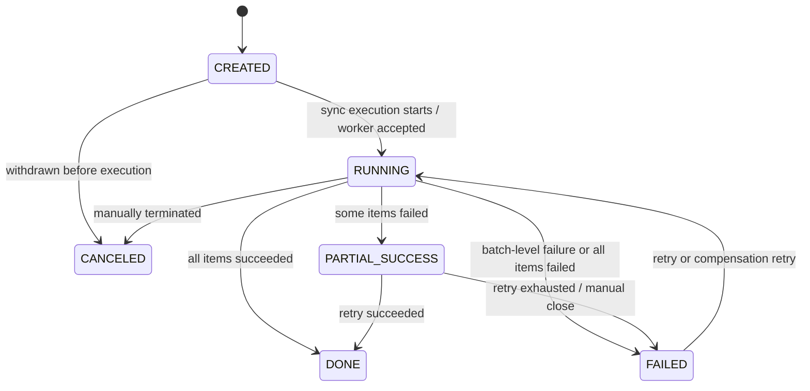
```mermaid
stateDiagram-v2
    [*] --> CREATED
    CREATED --> RUNNING: sync execution starts / worker accepted
    CREATED --> CANCELED: withdrawn before execution
    RUNNING --> DONE: all items succeeded
    RUNNING --> PARTIAL_SUCCESS: some items failed
    RUNNING --> FAILED: batch-level failure or all items failed
    RUNNING --> CANCELED: manually terminated
    PARTIAL_SUCCESS --> DONE: retry succeeded
    PARTIAL_SUCCESS --> FAILED: retry exhausted / manual close
    FAILED --> RUNNING: retry or compensation retry
```

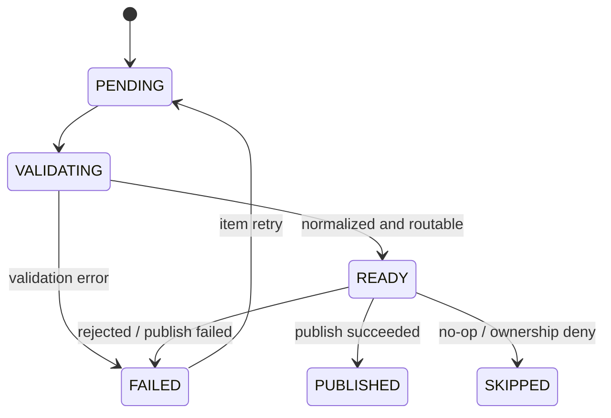
```mermaid
stateDiagram-v2
    [*] --> PENDING
    PENDING --> VALIDATING
    VALIDATING --> FAILED: validation error
    VALIDATING --> READY: normalized and routable
    READY --> PUBLISHED: publish succeeded
    READY --> FAILED: rejected / publish failed
    READY --> SKIPPED: no-op / ownership deny
    FAILED --> PENDING: item retry
```

推荐语义如下：

| 层级 | 状态 | 含义 |
| --- | --- | --- |
| `task` | `CREATED` | 已受理，还未开始执行 |
| `task` | `RUNNING` | 已进入同步执行或异步 Worker 执行 |
| `task` | `PARTIAL_SUCCESS` | 部分对象成功、部分失败，通常需要错误文件或重试 |
| `task` | `DONE` | 全部对象成功结束 |
| `task` | `FAILED` | 整体失败，或全部对象失败 |
| `task` | `CANCELED` | 执行前撤回，或人工终止 |
| `task_item` | `PENDING` | 已入队，尚未处理 |
| `task_item` | `VALIDATING` | 正在标准化、校验、计算 Diff |
| `task_item` | `READY` | 已通过供给治理，可提交商品主域写侧 |
| `task_item` | `PUBLISHED` | 已完成发布 |
| `task_item` | `FAILED` | 行级校验失败、审核驳回或发布失败 |
| `task_item` | `SKIPPED` | 无有效变更、字段主导权不允许覆盖等 |

这套状态机要强调两个边界：

- `task` 状态不等于商品状态。`DONE` 只表示供给任务处理完了，不代表商品一定已经 `ONLINE`。
- `task_item.READY` 也不等于正式发布成功，它只表示该对象已经完成供给平台治理，可以进入商品主域写侧的 `Draft / Staging / QC` 链路。

#### 3.3.1 任务抢占设计

异步任务模型一旦进入多 Worker 部署，就不能默认“只有一个执行器会来处理这条任务”。如果没有显式抢占机制，最常见的后果就是：

- 两个 Worker 同时处理同一条任务
- 旧进程恢复后覆盖新进程进度
- 任务卡在 `RUNNING / PARSING` 无法恢复
- 解析进度和执行进度被重复推进

因此，`product_supply_task` 建议内建一套 **数据库权威的任务抢占模型**，至少包括：

- `worker_id`
- `lease_token`
- `lease_until`
- `heartbeat_at`
- `parse_checkpoint` 或等价进度字段

推荐原则是：

- 任务事实以 MySQL 为权威
- 抢占通过数据库 CAS 完成
- 只有租约持有者才能续租、推进 checkpoint、结束任务
- 只允许抢占租约过期任务，不强抢心跳正常任务

这套设计最好拆成“首次抢占、周期续租、租约过期接管、旧进程失效”四个阶段来看，避免把它误解成一次简单的 `UPDATE ... WHERE status='PENDING'`。

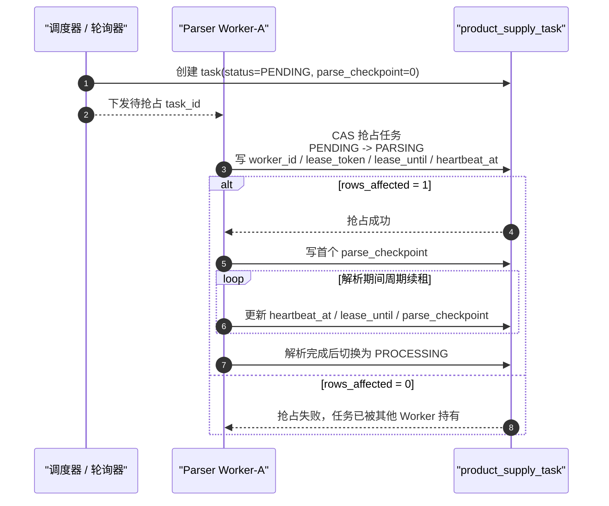
```mermaid
sequenceDiagram
    autonumber
    participant SCH as "调度器 / 轮询器"
    participant W1 as "Parser Worker-A"
    participant T as "product_supply_task"

    SCH->>T: 创建 task(status=PENDING, parse_checkpoint=0)
    SCH-->>W1: 下发待抢占 task_id
    W1->>T: CAS 抢占任务<br/>PENDING -> PARSING<br/>写 worker_id / lease_token / lease_until / heartbeat_at
    alt rows_affected = 1
        T-->>W1: 抢占成功
        W1->>T: 写首个 parse_checkpoint
        loop 解析期间周期续租
            W1->>T: 更新 heartbeat_at / lease_until / parse_checkpoint
        end
        W1->>T: 解析完成后切换为 PROCESSING
    else rows_affected = 0
        T-->>W1: 抢占失败，任务已被其他 Worker 持有
    end
```

这一小节最重要的不是“如何生成一个 `worker_id`”，而是把所有权边界钉死：

| 设计点 | 说明 |
| --- | --- |
| DB 权威抢占 | 抢占不是“先查再改”，而是带条件的 `UPDATE` CAS。`rows_affected = 1` 才表示当前 Worker 真正拿到了执行权。 |
| 双因子所有权 | `worker_id` 标识是哪台执行器，`lease_token` 标识本次抢占行为。只有两者同时匹配，才允许续租、推进 checkpoint 和结束任务。 |
| 续租与心跳 | `heartbeat_at` 说明 Worker 还活着，`lease_until` 说明执行权何时失效。续租要周期执行，不能等整批解析完再更新。 |
| 只抢过期任务 | 只允许抢占 `lease_until < now()` 的任务，不抢心跳正常任务，避免双 Worker 同时处理一条任务。 |
| checkpoint 恢复 | 抢占恢复时不从头重跑，而是从 `parse_checkpoint` 或等价进度字段继续，允许小范围重复处理，真正防重依赖幂等键。 |
| 旧进程失效 | 旧 Worker 即使恢复，也因为 `worker_id + lease_token` 不再匹配，无法继续推进任务状态，避免脏回写。 |

这张图只保留任务抢占的最小闭环，重点是：

- 第一次抢占必须由数据库 CAS 原子完成，不能先查再改。
- 续租必须同时更新心跳、租约和 checkpoint。
- 旧 Worker 失去租约后就不能再写回状态。

#### 3.3.2 供给治理任务数据库权威抢占模型

根据 `3.2.1 决策点 1：任务抢占使用 DB 还是 Redis 分布式锁`，供给平台统一采用 **MySQL CAS + Lease** 作为任务抢占模型，不再引入 Redis 分布式锁。原因很直接：对于 Excel 批量、运营批量编辑这类 B 端长任务，最重要的不是极限抢占吞吐，而是状态、租约、进度、恢复都必须沉淀在同一权威主表中。

这个模型依赖两个核心前提：

- **数据库是唯一状态权威**
- **双因子所有权校验：`worker_id + lease_token`**

`worker_id` 用来表达“哪台物理执行器正在持有任务”，`lease_token` 用来表达“这一次抢占行为的唯一租约实例”。只有两者同时匹配，当前 Worker 才有资格续租、推进 checkpoint、回写状态。这样即使旧 Worker 假死后恢复，也无法越权回写。

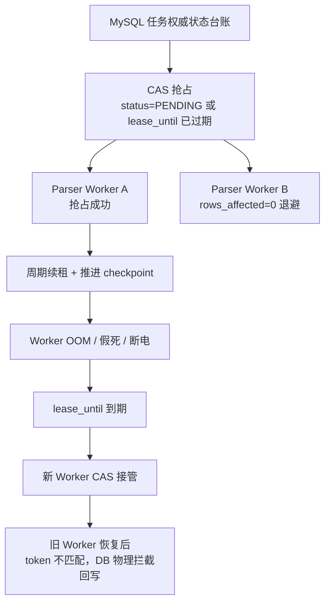
```mermaid
flowchart TD
    DB["MySQL 任务权威状态台账"] --> CAS["CAS 抢占<br/>status=PENDING 或 lease_until 已过期"]
    CAS --> WA["Parser Worker A<br/>抢占成功"]
    CAS --> WB["Parser Worker B<br/>rows_affected=0 退避"]
    WA --> HB["周期续租 + 推进 checkpoint"]
    HB --> FAIL["Worker OOM / 假死 / 断电"]
    FAIL --> EXPIRE["lease_until 到期"]
    EXPIRE --> TAKEOVER["新 Worker CAS 接管"]
    TAKEOVER --> BLOCK["旧 Worker 恢复后<br/>token 不匹配，DB 物理拦截回写"]
```

建议 `product_supply_task` 至少具备下面这些字段，来支撑数据库权威抢占：

```sql
ALTER TABLE `product_supply_task`
ADD COLUMN `status` VARCHAR(32) NOT NULL DEFAULT 'PENDING' COMMENT '任务级状态机',
ADD COLUMN `worker_id` VARCHAR(64) NULL COMMENT '当前持有任务的物理节点标识',
ADD COLUMN `lease_token` VARCHAR(64) NULL COMMENT '每次抢占生成的唯一租约令牌(UUID)',
ADD COLUMN `lease_until` DATETIME(3) NULL COMMENT '租约失效绝对截止时间',
ADD COLUMN `heartbeat_at` DATETIME(3) NULL COMMENT '最后一次心跳时间',
ADD COLUMN `parse_checkpoint` VARCHAR(512) NULL COMMENT '解析进度锚点 JSON',
ADD COLUMN `last_heartbeat_stage` VARCHAR(64) NULL COMMENT '最后心跳所处阶段(CLAIMED/PARSING/DISPATCHING)',
ADD INDEX `idx_status_lease` (`status`, `lease_until`);
```

首次抢占与僵尸接管可以统一为一条 CAS SQL：

```java
public Optional<TaskLease> tryClaimTask(Long taskId) {
    String workerId = localHost() + "_" + threadId();
    String leaseToken = UUID.randomUUID().toString();
    Date now = new Date();
    Date leaseUntil = new Date(now.getTime() + 30_000);

    int rows = db.executeUpdate(
        "UPDATE product_supply_task SET " +
        " status = 'PARSING', worker_id = ?, lease_token = ?, " +
        " lease_until = ?, heartbeat_at = ?, last_heartbeat_stage = 'CLAIMED' " +
        "WHERE id = ? AND (" +
        " status = 'PENDING' OR " +
        " (status IN ('PARSING','PROCESSING') AND lease_until < ?)" +
        ")",
        workerId, leaseToken, leaseUntil, now, taskId, now
    );

    if (rows == 1) {
        return Optional.of(new TaskLease(taskId, workerId, leaseToken));
    }
    return Optional.empty();
}
```

周期续租和 checkpoint 推进必须绑定双因子所有权：

```java
public boolean renewLease(TaskLease lease, String checkpointJson, int parsedCount) {
    Date now = new Date();
    Date leaseUntil = new Date(now.getTime() + 30_000);

    int rows = db.executeUpdate(
        "UPDATE product_supply_task SET " +
        " lease_until = ?, heartbeat_at = ?, parse_checkpoint = ?, parsed_count = ?, " +
        " last_heartbeat_stage = 'PARSING' " +
        "WHERE id = ? AND worker_id = ? AND lease_token = ? AND status = 'PARSING'",
        leaseUntil, now, checkpointJson, parsedCount,
        lease.getTaskId(), lease.getWorkerId(), lease.getLeaseToken()
    );

    return rows == 1;
}
```

这套模型最重要的收益不是“谁先抢到了任务”，而是把下面四件事锁死在同一条数据库事实线上：

- 抢占主权
- 续租主权
- 进度推进主权
- 旧进程失效主权

#### 3.3.3 全局发布协同与状态机转移矩阵

根据 `3.1 平台定位与职责边界`，供给平台不持有正式态商品落库主权，也不持有库存账本主权。它真正持有的是 **任务编排主权、状态表达主权、结果归档主权**。因此，这里的状态机不能只写成“跑起来了 / 失败了”，而要能明确表达不同阶段的物理意义。

`product_supply_task` 解决的是“这一批整体走到哪里了”，`product_supply_task_item` 解决的是“这一行具体成没成功、失败在哪一层”。

**任务级状态转移矩阵**

| 原始状态 | 触发事件 | 变更条件 / 校验卡点 | 目标状态 | 后置动作 / 物理回写 |
| --- | --- | --- | --- | --- |
| `PENDING` | `WorkerClaimEvent` | `tryClaimTask()` 成功，`rows_affected=1` | `PARSING` | 开启续租线程，启动流式解析器 |
| `PENDING` | `UserCancelEvent` | 解析尚未开始，且用户手工撤回 | `CANCELED` | 释放文件句柄，写终态 |
| `PARSING` | `ParseSuccessEvent` | 文件解析完毕，行级记录全部成功物化落盘 | `PROCESSING` | 批量投递 `task_item_id` 到 MQ |
| `PARSING` | `ParseFatalErrorEvent` | 文件损坏、模板不匹配、本地 OOM 等不可恢复错误 | `FAILED` | 记录系统异常日志，不再分发消息 |
| `PROCESSING` | `ItemCountZeroEvent` | Redis 计数器归零，或 DB 扫描确认所有行已完成 | `GENERATING_RESULT` | 唤醒结果归档 Worker |
| `PROCESSING` | `BatchFatalErrorEvent` | 批次级系统异常，且不适合继续消费 | `FAILED` | 回填批次错误码，终止后续分发 |
| `GENERATING_RESULT` | `ResultArchiveEvent` | 无错误行，或错题本已成功上传 OSS | `DONE / PARTIAL_SUCCESS` | 回填 `error_file_url` 与统计计数 |

**行级明细状态转移矩阵**

| 原始状态 | 触发事件 | 核心过滤与判断内核 | 目标状态 | 后置动作 / 物理回写 |
| --- | --- | --- | --- | --- |
| `INIT` | `ConsumerAcceptEvent` | Consumer 从队列拉取明细并成功占有 | `PROCESSING` | 进入标准化、校验与 Diff 组件 |
| `PROCESSING` | `ValidateFailEvent` | 必填项缺失、类目映射失败、模板错误 | `FAILED` | 回填结构化错误码与友好提示 |
| `PROCESSING` | `DiffNoOpEvent` | 仅更新场景触发：字段裁剪后无有效变更 | `SKIPPED` | 不调用商品主域写侧，直接 `DECR` |
| `PROCESSING` | `RpcSubmitEvent` | 通过供给治理防线，商品主域已受理 | `SUBMITTED` | 回填 `draft_id / goods_id`，触发 `DECR` |
| `PROCESSING` | `RpcTimeoutEvent` | 调商品主域写侧超时或 UNKNOWN | `PROCESSING` | 暂不 `DECR`，交给旁路自愈任务 |
| `FAILED` | `RetryEvent` | 人工修复或补偿触发 | `INIT` | 重新进入队列等待处理 |

这套矩阵的设计重点有两个：

1. **任务级状态和行级状态必须分层表达**。否则你只能知道“这批差不多失败了”，却永远回答不了“哪一行失败、是校验失败还是写入超时”。
2. **超时未知必须留在中间态**。`RpcTimeoutEvent` 不能简单写成 `FAILED`，否则旁路自愈和假失败拨正都会失去抓手。

### 3.4 核心功能：单个创建和编辑

#### 3.4.1 场景画像

单个创建和单个编辑都属于强交互、低吞吐、秒级反馈的入口，但它们的难点并不相同：

- 单个创建关注“从无到有”的受理、校验、建草稿和返回受理结果
- 单个编辑关注“基于哪个正式版本改”的 `Diff`、`base_publish_version` 和字段主导权

两者的共同点是：

- 前端体验是同步的
- 后端仍然要写轻量 `task(total_count=1, execution_mode=SYNC)`
- 供给平台负责受理、标准化、校验和 RPC 编排
- `Draft / Staging / QC` 主权仍在商品主域写侧

#### 3.4.2 单个创建完整时序图

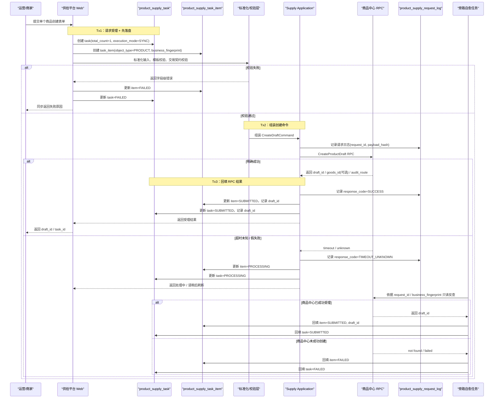
```mermaid
sequenceDiagram
    participant U as "运营/商家"
    participant W as "供给平台 Web"
    participant T as "product_supply_task"
    participant I as "product_supply_task_item"
    participant V as "标准化/校验层"
    participant A as "Supply Application"
    participant P as "商品中心 RPC"
    participant R as "product_supply_request_log"
    participant H as "旁路自愈任务"

    U->>W: 提交单个商品创建表单
    Note over W,T: Tx1：请求受理 + 先落盘
    W->>T: 创建 task(total_count=1, execution_mode=SYNC)
    W->>I: 创建 task_item(object_type=PRODUCT, business_fingerprint)
    W->>V: 标准化输入、模板校验、交易契约校验
    alt 校验失败
        V-->>W: 返回字段级错误
        W->>I: 更新 item=FAILED
        W->>T: 更新 task=FAILED
        W-->>U: 同步返回失败原因
    else 校验通过
        Note over V,A: Tx2：组装创建命令
        V->>A: 组装 CreateDraftCommand
        A->>R: 记录请求日志(request_id, payload_hash)
        A->>P: CreateProductDraft RPC
        alt 明确成功
            P-->>A: 返回 draft_id / goods_id(可选) / audit_route
            Note over A,T: Tx3：回填 RPC 结果
            A->>R: 记录 response_code=SUCCESS
            A->>I: 更新 item=SUBMITTED，记录 draft_id
            A->>T: 更新 task=SUBMITTED，记录 draft_id
            A-->>W: 返回受理结果
            W-->>U: 返回 draft_id / task_id
        else 超时未知 / 假失败
            P--xA: timeout / unknown
            A->>R: 记录 response_code=TIMEOUT_UNKNOWN
            A->>I: 更新 item=PROCESSING
            A->>T: 更新 task=PROCESSING
            A-->>W: 返回处理中 / 请稍后刷新
            H->>P: 依据 request_id / business_fingerprint 只读反查
            alt 商品中心已成功受理
                P-->>H: 返回 draft_id
                H->>I: 回填 item=SUBMITTED, draft_id
                H->>T: 回填 task=SUBMITTED
            else 商品中心未成功创建
                P-->>H: not found / failed
                H->>I: 回填 item=FAILED
                H->>T: 回填 task=FAILED
            end
        end
    end
```

#### 3.4.3 单个编辑完整时序图

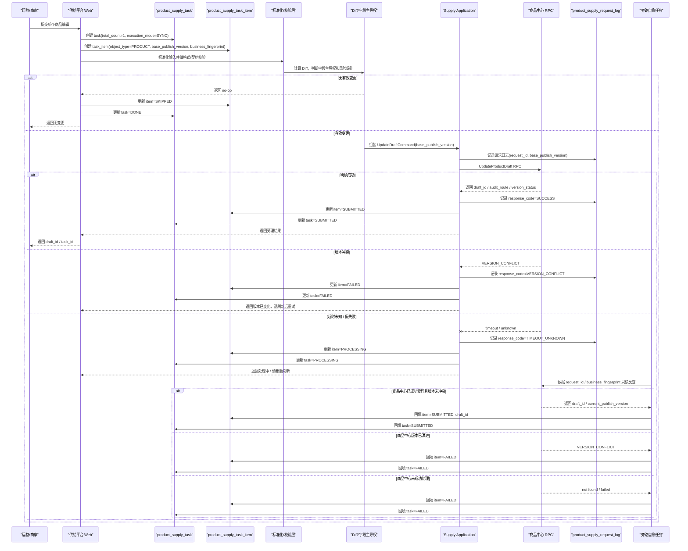
```mermaid
sequenceDiagram
    participant U as "运营/商家"
    participant W as "供给平台 Web"
    participant T as "product_supply_task"
    participant I as "product_supply_task_item"
    participant V as "标准化/校验层"
    participant D as "Diff/字段主导权"
    participant A as "Supply Application"
    participant P as "商品中心 RPC"
    participant R as "product_supply_request_log"
    participant H as "旁路自愈任务"

    U->>W: 提交单个商品编辑
    W->>T: 创建 task(total_count=1, execution_mode=SYNC)
    W->>I: 创建 task_item(object_type=PRODUCT, base_publish_version, business_fingerprint)
    W->>V: 标准化输入并做格式/契约校验
    V->>D: 计算 Diff，判断字段主导权和风险级别
    alt 无有效变更
        D-->>W: 返回 no-op
        W->>I: 更新 item=SKIPPED
        W->>T: 更新 task=DONE
        W-->>U: 返回无变更
    else 有效变更
        D->>A: 组装 UpdateDraftCommand(base_publish_version)
        A->>R: 记录请求日志(request_id, base_publish_version)
        A->>P: UpdateProductDraft RPC
        alt 明确成功
            P-->>A: 返回 draft_id / audit_route / version_status
            A->>R: 记录 response_code=SUCCESS
            A->>I: 更新 item=SUBMITTED
            A->>T: 更新 task=SUBMITTED
            A-->>W: 返回受理结果
            W-->>U: 返回 draft_id / task_id
        else 版本冲突
            P-->>A: VERSION_CONFLICT
            A->>R: 记录 response_code=VERSION_CONFLICT
            A->>I: 更新 item=FAILED
            A->>T: 更新 task=FAILED
            A-->>W: 返回版本已变化，请刷新后重试
        else 超时未知 / 假失败
            P--xA: timeout / unknown
            A->>R: 记录 response_code=TIMEOUT_UNKNOWN
            A->>I: 更新 item=PROCESSING
            A->>T: 更新 task=PROCESSING
            A-->>W: 返回处理中 / 请稍后刷新
            H->>P: 依据 request_id / business_fingerprint 只读反查
            alt 商品中心已成功受理且版本未冲突
                P-->>H: 返回 draft_id / current_publish_version
                H->>I: 回填 item=SUBMITTED, draft_id
                H->>T: 回填 task=SUBMITTED
            else 商品中心版本已演进
                P-->>H: VERSION_CONFLICT
                H->>I: 回填 item=FAILED
                H->>T: 回填 task=FAILED
            else 商品中心未成功处理
                P-->>H: not found / failed
                H->>I: 回填 item=FAILED
                H->>T: 回填 task=FAILED
            end
        end
    end
```

#### 3.4.4 关键设计点

| 设计点 | 说明 |
| --- | --- |
| 轻量任务锚点 | 单品同步链路也要写轻量 `task` 和 `task_item`，否则单品与批量的审计、补偿、发布追踪会分裂成两套口径。 |
| 先落盘再透传 | 前端同步链路看似可以直接把 DTO 透传到商品中心，但工业级中台更稳的做法是“无条件先落盘”。这样单品、批量、API、ERP 同步都能百川归海到同一套操作日志、发布追踪和审计模型；同时还能在网络超时、进程假死、商品中心假失败时保留本地操作沙盒，不至于让商家输入在链路中蒸发。 |
| 受理优先于 RPC | 单个创建的关键是“请求先受理，再校验，再调用商品中心 RPC”，不要把本地受理和跨服务 RPC 强行做成分布式大事务。 |
| 业务指纹幂等 | 幂等 Key 不能直接对整段 JSON 做 MD5，因为请求里经常带时间戳、随机数、操作人等噪音字段。更合理的方式是抽取决定业务唯一性的核心特征，生成稳定的业务指纹，并作为 `task_item` 或等价明细记录的唯一键，从数据库层物理拦截狂点和重复重试。 |
| 假失败自愈 | RPC 发生超时未知时，不能简单把超时当失败返回给前端。否则商家重试时会撞上本地幂等锁，形成“提示失败、实则成功、再次提交又冲突”的死局。更稳的做法是把任务定格在 `PROCESSING/UNKNOWN`，由旁路自愈任务拿业务指纹或请求键去商品中心只读反查，再把本地状态拨正为 `SUCCESS` 或 `FAILED`。 |
| 编辑的版本约束 | 单个编辑比单个创建多两件事：一是基于当前正式版本做 `Diff`；二是带上 `base_publish_version` 防止旧版本覆盖新版本。 |
| `base_publish_version` 的双向保护 | `base_publish_version` 不只是同步链路上的乐观锁，也是异步补偿链路的污染防线。同步提交时它能识别并发编辑冲突并柔性提示前端刷新；异步自愈或重放时，如果商品中心版本已经演进，乐观锁会在物理层阻断旧命令，确保补偿动作不会把新版本再覆盖脏。 |
| 字段主导权 | 字段主导权判断必须出现在编辑链路里，避免运营人工修复字段被供应商来源字段反向覆盖。 |
| RPC 边界 | 供给平台调用的是语义化 RPC，如 `CreateProductDraft`、`UpdateProductDraft`，而不是直接写商品中心内部表。 |

#### 3.4.5 表和版本映射

| 对象 | 作用 | 关键字段 |
| --- | --- | --- |
| `product_supply_task` | 单次同步交互的任务锚点 | `task_type / execution_mode / source_type / operator_id / status` |
| `product_supply_task_item` | 单对象明细 | `object_type / object_key / normalized_snapshot / status` |
| `product_supply_request_log` | 记录供给平台到商品中心 RPC 请求结果 | `request_id / api_name / request_payload_hash / response_code / latency_ms` |

### 3.5 核心功能：Excel 批量创建和更新

#### 3.5.1 场景画像

Excel 批量创建和更新属于高交互异步任务：用户上传文件后会盯着进度条等结果，期望分钟级反馈，并且接受“部分成功、部分失败、最后给我错题本”。

这条链路真正的工业级做法，不是“上传文件后一个线程从头跑到尾”，而是拆成四个阶段：

1. **提交任务**：只收单，不处理，秒级返回 `task_id`
2. **解析 Excel**：流式解析，行级明细落盘
3. **处理任务**：通过 MQ 行级解耦，Consumer 匀速顶下游
4. **产生结果文件**：汇总成功/失败/跳过，生成错题本

这条链路的核心不是“批量更大”，而是：

- 任务级状态和行级状态必须分离
- 文件 IO、行级处理、商品中心 RPC、结果归档必须分阶段解耦
- 创建和更新会混在同一批文件里
- 更新行要带上 `base_publish_version` 或当前正式对象引用
- 处理阶段要靠 MQ 削峰和背压，不能靠单机线程池硬顶
- 收尾阶段要能在分布式消费结束后可靠触发，而不是人工扫表碰运气
- 创建和更新虽然共享同一批量底座，但在阶段三“处理任务”的治理内核必须分流

这里不再重复讨论为什么 Excel 批量链路必须任务化、分阶段和异步化，这个架构取舍已经在 `3.2.4 决策点 4：Excel 批量链路为什么不能继续用传统串行流程` 中统一说明。
#### 3.5.2 批量任务状态机

Excel 批量任务必须显式区分 **任务级状态机** 和 **行级状态机**。否则系统只能告诉运营“这批任务大概失败了”，却回答不了“哪一行失败、失败在哪个阶段、是否还能继续重试”。

推荐把这一节的状态机写成更贴近 Excel 批量场景的两层：

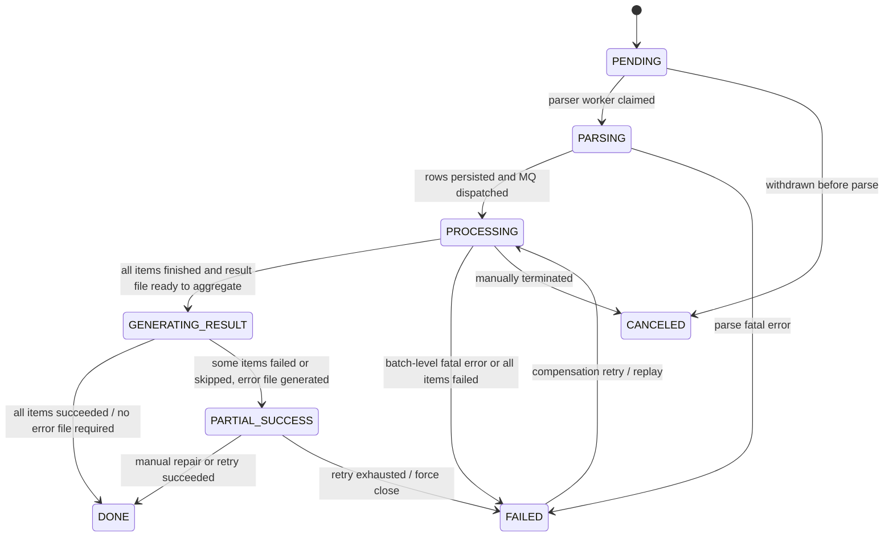
```mermaid
stateDiagram-v2
    [*] --> PENDING
    PENDING --> PARSING: parser worker claimed
    PENDING --> CANCELED: withdrawn before parse
    PARSING --> PROCESSING: rows persisted and MQ dispatched
    PARSING --> FAILED: parse fatal error
    PROCESSING --> GENERATING_RESULT: all items finished and result file ready to aggregate
    PROCESSING --> FAILED: batch-level fatal error or all items failed
    PROCESSING --> CANCELED: manually terminated
    GENERATING_RESULT --> DONE: all items succeeded / no error file required
    GENERATING_RESULT --> PARTIAL_SUCCESS: some items failed or skipped, error file generated
    PARTIAL_SUCCESS --> DONE: manual repair or retry succeeded
    PARTIAL_SUCCESS --> FAILED: retry exhausted / force close
    FAILED --> PROCESSING: compensation retry / replay
```

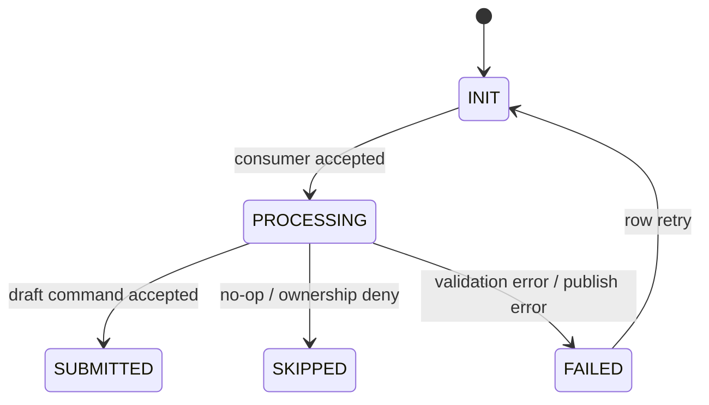
```mermaid
stateDiagram-v2
    [*] --> INIT
    INIT --> PROCESSING: consumer accepted
    PROCESSING --> SUBMITTED: draft command accepted
    PROCESSING --> SKIPPED: no-op / ownership deny
    PROCESSING --> FAILED: validation error / publish error
    FAILED --> INIT: row retry
```

这两层状态分别解决不同问题：

| 层级 | 状态 | 含义 |
| --- | --- | --- |
| `task` | `PENDING` | 任务已受理，文件还未被 Parser Worker 抢占 |
| `task` | `PARSING` | 正在流式解析 Excel，并持续推进 `parse_checkpoint` |
| `task` | `PROCESSING` | 行级明细已落盘，正在 MQ 消费和调用商品主域 |
| `task` | `GENERATING_RESULT` | 所有行已完成处理，正在汇总结果并生成错题本 |
| `task` | `PARTIAL_SUCCESS` | 至少一部分行成功，但仍有失败或跳过项，需要错题本或重试 |
| `task` | `DONE` | 全部有效行已成功处理，结果文件已生成或无需生成 |
| `task` | `FAILED` | 解析致命失败、整批失败，或全部行失败 |
| `task` | `CANCELED` | 执行前撤回或人工终止 |
| `task_item` | `INIT` | 行已落盘，尚未进入消费处理 |
| `task_item` | `PROCESSING` | 正在校验、Diff 或调用商品中心 RPC |
| `task_item` | `SUBMITTED` | 行级命令已被商品主域受理 |
| `task_item` | `SKIPPED` | 无有效变更、字段主导权不允许覆盖等 |
| `task_item` | `FAILED` | 行级校验失败、版本冲突、RPC 失败等 |

这套状态机有 3 个关键点：

1. `PARSING` 是 Excel 批量独有的重要中间态，单个同步任务通常不会经历这个阶段。
2. `PARTIAL_SUCCESS` 是批量任务里最关键的任务级状态之一，单个任务几乎不会真正用到它。
3. `task_item` 的状态必须能独立重试，否则错题本修复和局部补偿就无从谈起。
4. 创建和更新可以共用这套状态机外壳，但更新链路通常会多一个“实时补齐版本 + Diff 裁剪”的隐含处理层。
5. `GENERATING_RESULT` 是批量任务专有的收尾态，它把“行级消费完成”和“任务最终归档”拆开，避免把结果文件生成逻辑硬塞回 `PROCESSING`。

#### 3.5.3 批量创建与批量更新的核心差异

批量创建和批量更新虽然共用同一套四阶段异步流水线外壳，但在阶段三“处理任务”的内核策略完全不同。两者最本质的差别，不是谁调用了不同的 RPC，而是它们对商品主数据做的是两种相反的物理动作：

- 批量创建追求 **完备性与防冗余**
- 批量更新追求 **增量安全与抗并发**

也正因为如此，同一套 Excel 跑批外壳下，创建和更新必须走不同的卡点设计。

**差异 1：对象存在性的前置判断不同**

- 批量创建：
  - 逻辑是“对象绝对不该存在”
  - Consumer 拿到一行后，先基于 `business_fingerprint` 或等价唯一特征反查
  - 如果系统里已经存在同指纹商品，该行直接失败并进入错题本，防止重复创建
- 批量更新：
  - 逻辑是“对象必须存在”
  - Consumer 拿着 `goods_id / item_id / spu_id` 等正式对象标识反查
  - 如果根本找不到对应正式商品，该行直接失败，因为失去了更新主体

**差异 2：版本号的防御姿态不同**

- 批量创建：
  - 不依赖 `base_publish_version`
  - 属于从 0 到 1 的初始化过程
  - 创建命令只要满足完备性和防重要求即可
- 批量更新：
  - 必须在消费阶段实时反查并补齐 `base_publish_version`
  - 更新命令必须显式带上版本约束
  - 这是更新链路最关键的抗并发底线，用来阻断旧版本覆盖新版本

**差异 3：数据剪裁与组装机制不同**

- 批量创建：
  - 更像胖报文
  - 关注“合规的最小完备集”
  - 少一个必填项就应直接失败
- 批量更新：
  - 更像瘦报文
  - 先做 Diff
  - 再做字段主导权裁剪
  - 再做缺失字段补全
  - 绝不能用 Excel 里的空字段覆盖线上已有值

**差异 4：并发与锁竞争退避策略不同**

- 批量创建：
  - 风险点是重复创建和指纹碰撞
  - 更依赖本地 `task_item` 唯一指纹索引
  - 同批内还可以先做内存去重
- 批量更新：
  - 风险点是下游已存在热点行的锁竞争
  - 更需要 `merchant_id / item_id` 局部 Hash 顺序路由
  - 把无序并发写驯化成顺序消费，给下游主库卸压

| 维度 | 批量创建 | 批量更新 |
| --- | --- | --- |
| 业务前置条件 | 对象绝对不该存在 | 对象必须存在 |
| 版本号心智 | 无需关注 `base_publish_version` | 必须实时补齐 `base_publish_version` |
| 报文完整度 | 胖报文，强调最小完备集 | 瘦报文，强调增量字段 |
| 核心底层组件 | 标准化校验组件 | Diff 引擎 + 字段主导权矩阵 |
| 防重 / 幂等主战场 | 本地唯一指纹索引 | 中台版本乐观锁 + 本地任务幂等 |
| 下游主库风险 | 重复创建、索引分裂、资产冗余 | 热点行锁竞争、锁等待、版本回滚覆盖 |
| 主要退避策略 | 指纹去重、同批内存 Group By | 局部 Hash 顺序路由、版本补齐、Diff 裁剪 |

一句话收束就是：

> 批量创建和批量更新共享的是同一种跑批外壳，但在处理内核上必须做“非对称卡点”：创建防冗余，更新防并发。

#### 3.5.4 任务抢占与批量处理时序图

##### 3.5.4.1 任务抢占时序图

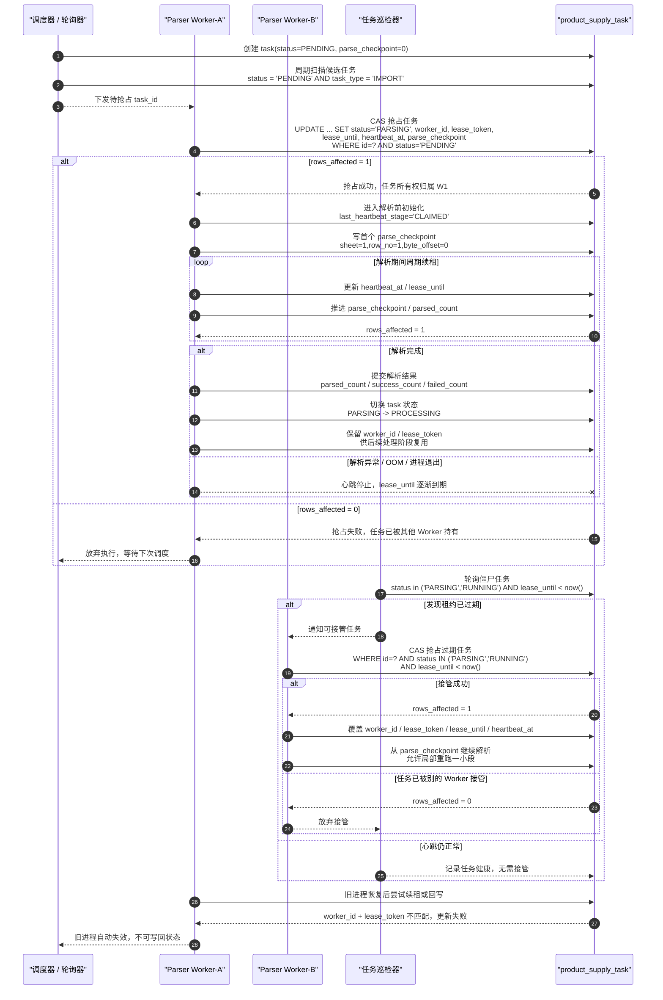
```mermaid
sequenceDiagram
    autonumber
    participant SCH as "调度器 / 轮询器"
    participant W1 as "Parser Worker-A"
    participant W2 as "Parser Worker-B"
    participant MON as "任务巡检器"
    participant T as "product_supply_task"

    SCH->>T: 创建 task(status=PENDING, parse_checkpoint=0)
    SCH->>T: 周期扫描候选任务<br/>status = 'PENDING' AND task_type = 'IMPORT'
    SCH-->>W1: 下发待抢占 task_id

    W1->>T: CAS 抢占任务<br/>UPDATE ... SET status='PARSING', worker_id, lease_token,<br/>lease_until, heartbeat_at, parse_checkpoint<br/>WHERE id=? AND status='PENDING'
    alt rows_affected = 1
        T-->>W1: 抢占成功，任务所有权归属 W1
        W1->>T: 进入解析前初始化<br/>last_heartbeat_stage='CLAIMED'
        W1->>T: 写首个 parse_checkpoint<br/>sheet=1,row_no=1,byte_offset=0

        loop 解析期间周期续租
            W1->>T: 更新 heartbeat_at / lease_until
            W1->>T: 推进 parse_checkpoint / parsed_count
            T-->>W1: rows_affected = 1
        end

        alt 解析完成
            W1->>T: 提交解析结果<br/>parsed_count / success_count / failed_count
            W1->>T: 切换 task 状态<br/>PARSING -> PROCESSING
            W1->>T: 保留 worker_id / lease_token<br/>供后续处理阶段复用
        else 解析异常 / OOM / 进程退出
            W1--x T: 心跳停止，lease_until 逐渐到期
        end
    else rows_affected = 0
        T-->>W1: 抢占失败，任务已被其他 Worker 持有
        W1-->>SCH: 放弃执行，等待下次调度
    end

    MON->>T: 轮询僵尸任务<br/>status in ('PARSING','RUNNING') AND lease_until < now()
    alt 发现租约已过期
        MON-->>W2: 通知可接管任务
        W2->>T: CAS 抢占过期任务<br/>WHERE id=? AND status IN ('PARSING','RUNNING')<br/>AND lease_until < now()
        alt 接管成功
            T-->>W2: rows_affected = 1
            W2->>T: 覆盖 worker_id / lease_token / lease_until / heartbeat_at
            W2->>T: 从 parse_checkpoint 继续解析<br/>允许局部重跑一小段
        else 任务已被别的 Worker 接管
            T-->>W2: rows_affected = 0
            W2-->>MON: 放弃接管
        end
    else 心跳仍正常
        MON-->>T: 记录任务健康，无需接管
    end

    W1->>T: 旧进程恢复后尝试续租或回写
    T-->>W1: worker_id + lease_token 不匹配，更新失败
    W1-->>SCH: 旧进程自动失效，不可写回状态
```

##### 3.5.4.2 批量创建完整时序图

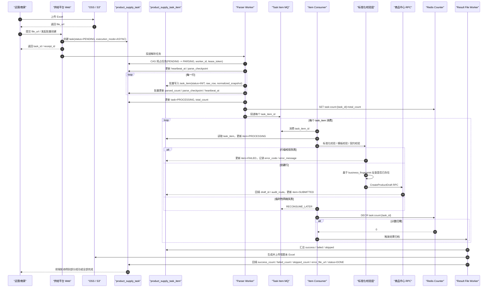
```mermaid
sequenceDiagram
    autonumber
    participant U as "运营/商家"
    participant W as "供给平台 Web"
    participant OSS as "OSS / S3"
    participant T as "product_supply_task"
    participant I as "product_supply_task_item"
    participant PX as "Parser Worker"
    participant MQ as "Task Item MQ"
    participant C as "Item Consumer"
    participant V as "标准化/校验层"
    participant P as "商品中心 RPC"
    participant RC as "Redis Counter"
    participant F as "Result File Worker"

    U->>OSS: 上传 Excel
    OSS-->>U: 返回 file_url
    U->>W: 提交 file_url / 发起批量创建
    W->>T: 创建 task(status=PENDING, execution_mode=ASYNC)
    W-->>U: 返回 task_id / receipt_id
    W->>PX: 投递解析任务
    PX->>T: CAS 抢占任务(PENDING -> PARSING, worker_id, lease_token)
    PX->>T: 更新 heartbeat_at / parse_checkpoint
    loop 每一行
        PX->>I: 批量写入 task_item(status=INIT, raw_row, normalized_snapshot)
        PX->>T: 批量更新 parsed_count / parse_checkpoint / heartbeat_at
    end
    PX->>T: 更新 task=PROCESSING, total_count
    PX->>RC: SET task:count:{task_id}=total_count
    PX->>MQ: 投递每个 task_item_id
    loop 每个 task_item 消费
        C->>MQ: 消费 task_item_id
        C->>I: 读取 task_item，更新 item=PROCESSING
        C->>V: 标准化校验 / 模板校验 / 契约校验
        alt 行级校验失败
            V-->>I: 更新 item=FAILED，记录 error_code / error_message
        else 创建行
            V->>V: 基于 business_fingerprint 反查是否已存在
            V->>P: CreateProductDraft RPC
            P-->>I: 回填 draft_id / audit_route，更新 item=SUBMITTED
        else 临时性网络失败
            C-->>MQ: RECONSUME_LATER
        end
        C->>RC: DECR task:count:{task_id}
        alt 计数归零
            RC-->>C: 0
            C->>F: 触发结果归档
        end
    end
    F->>I: 汇总 success / failed / skipped
    F->>OSS: 生成并上传错题本 Excel
    F->>T: 回填 success_count / failed_count / skipped_count / error_file_url / status=DONE
    T-->>U: 前端轮询得到部分成功或全部完成
```

##### 3.5.4.3 批量编辑完整时序图

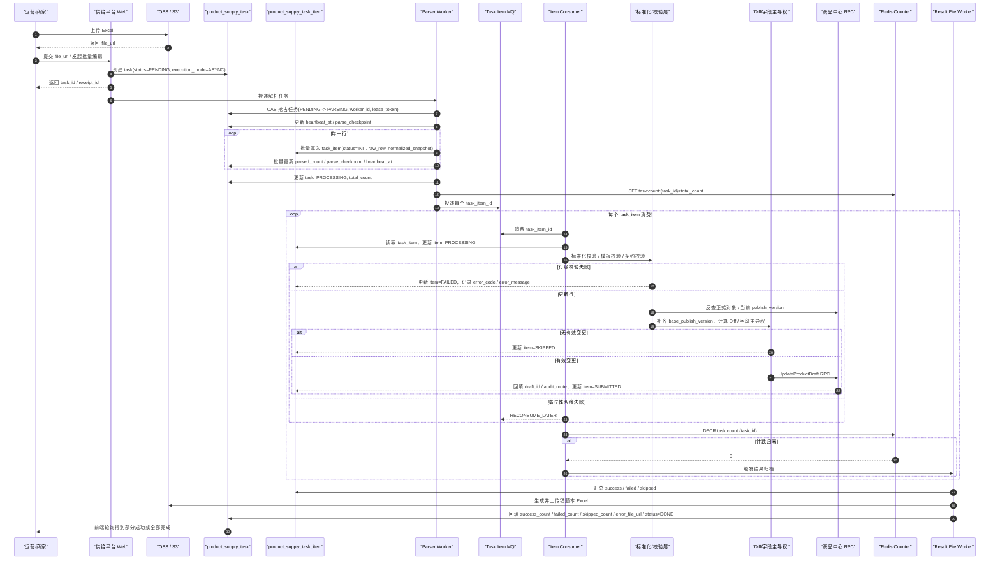
```mermaid
sequenceDiagram
    autonumber
    participant U as "运营/商家"
    participant W as "供给平台 Web"
    participant OSS as "OSS / S3"
    participant T as "product_supply_task"
    participant I as "product_supply_task_item"
    participant PX as "Parser Worker"
    participant MQ as "Task Item MQ"
    participant C as "Item Consumer"
    participant V as "标准化/校验层"
    participant D as "Diff/字段主导权"
    participant P as "商品中心 RPC"
    participant RC as "Redis Counter"
    participant F as "Result File Worker"

    U->>OSS: 上传 Excel
    OSS-->>U: 返回 file_url
    U->>W: 提交 file_url / 发起批量编辑
    W->>T: 创建 task(status=PENDING, execution_mode=ASYNC)
    W-->>U: 返回 task_id / receipt_id
    W->>PX: 投递解析任务
    PX->>T: CAS 抢占任务(PENDING -> PARSING, worker_id, lease_token)
    PX->>T: 更新 heartbeat_at / parse_checkpoint
    loop 每一行
        PX->>I: 批量写入 task_item(status=INIT, raw_row, normalized_snapshot)
        PX->>T: 批量更新 parsed_count / parse_checkpoint / heartbeat_at
    end
    PX->>T: 更新 task=PROCESSING, total_count
    PX->>RC: SET task:count:{task_id}=total_count
    PX->>MQ: 投递每个 task_item_id
    loop 每个 task_item 消费
        C->>MQ: 消费 task_item_id
        C->>I: 读取 task_item，更新 item=PROCESSING
        C->>V: 标准化校验 / 模板校验 / 契约校验
        alt 行级校验失败
            V-->>I: 更新 item=FAILED，记录 error_code / error_message
        else 更新行
            V->>P: 反查正式对象 / 当前 publish_version
            V->>D: 补齐 base_publish_version，计算 Diff / 字段主导权
            alt 无有效变更
                D-->>I: 更新 item=SKIPPED
            else 有效变更
                D->>P: UpdateProductDraft RPC
                P-->>I: 回填 draft_id / audit_route，更新 item=SUBMITTED
            end
        else 临时性网络失败
            C-->>MQ: RECONSUME_LATER
        end
        C->>RC: DECR task:count:{task_id}
        alt 计数归零
            RC-->>C: 0
            C->>F: 触发结果归档
        end
    end
    F->>I: 汇总 success / failed / skipped
    F->>OSS: 生成并上传错题本 Excel
    F->>T: 回填 success_count / failed_count / skipped_count / error_file_url / status=DONE
    T-->>U: 前端轮询得到部分成功或全部完成
```

#### 3.5.5 关键设计点

##### 3.5.5.1 提交阶段的设计点

| 设计点 | 说明 |
| --- | --- |
| 四阶段生命周期 | 批量任务要明确拆成“提交任务 → 解析 Excel → 处理任务 → 产生结果文件”四个阶段，而不是让一个线程从头跑到尾。 |
| 新旧流程差异 | 新流程不是简单把旧流程异步化，而是显式拆出提交、解析、处理、收尾四阶段，并引入 `task/task_item` 分层状态、MQ 解耦和结果归档。 |
| 提交阶段只收单 | 提交阶段只做文件合规校验、创建 `product_supply_task(status=PENDING)`、返回 `task_id`，不直接解析 Excel，也不直接写正式商品表。 |
| 任务级中间态 | Excel 批量任务要显式经历 `PENDING -> PARSING -> PROCESSING`，这和单任务常见的 `CREATED -> RUNNING` 有明显差异。 |
| 任务与行级分层 | `task` 和 `task_item` 必须拆开，Task 表达整批阶段，Item 表达第几行为什么失败。 |
| 创建 vs 更新分流 | 创建和更新共享同一跑批外壳，但阶段三必须做非对称内核分流：创建追求完备性与防冗余，更新追求增量安全与抗并发。 |

##### 3.5.5.2 Parser Worker 解析阶段的设计点

| 设计点 | 说明 |
| --- | --- |
| Parser Worker 只解析不发布 | Parser Worker 的职责边界要非常窄：只负责抢占任务、流式解析文件、生成 `task_item` 和投递 MQ，不直接调用商品中心，也不做正式发布。 |
| DB 任务抢占 | Parser Worker 建议通过数据库 CAS 抢占 `product_supply_task`：`PENDING -> PARSING`，并同时写入 `worker_id / lease_token / lease_until / heartbeat_at`。`rows_affected=1` 才表示抢占成功，`rows_affected=0` 说明任务已被其他执行器抢走。 |
| 续租与恢复 | Parser 抢占后要持续更新 `heartbeat_at / lease_until / parse_checkpoint`。如果进程 OOM 或机器重启，新 Worker 只能抢占 `lease_until` 已过期的任务；如果心跳正常，就不允许强抢，避免双 Parser 同时切同一个文件。 |
| 流式解析落盘 | 解析阶段必须流式读取 Excel，并把每一行转成 `product_supply_task_item` 持久化下来，避免一次性读大文件导致 OOM，也避免系统重启后整批数据蒸发。 |
| 解析进度 checkpoint | 解析阶段要把 `parse_checkpoint` 作为权威恢复点持久化，至少记录 `sheet / row_no / byte_offset(或等价位置)`。恢复时允许从最近 checkpoint 附近重跑一小段，真正防重依赖幂等键和唯一索引。 |

##### 3.5.5.3 处理与收尾阶段的设计点

| 设计点 | 说明 |
| --- | --- |
| MQ 行级解耦 | 解析阶段结束后，不是单机线程池直接处理所有行，而是把 `task_item_id` 投递到 MQ，让 Consumer 集群按安全 QPS 匀速消费，实现削峰、背压和横向扩展。 |
| 同批混合动作 | 创建行和更新行在同一个 Excel 里可以共存，但消费时要分流成 `CREATE / UPDATE / SKIP` 不同动作。 |
| 创建的完备性校验 | 创建行必须满足最小完备集，并优先做业务指纹反查和唯一索引拦截，防止重复建品。 |
| 更新的版本约束 | 更新行不能直接覆盖正式版本，仍然要经过 `Diff`、`base_publish_version` 和字段主导权判断。 |
| 更新的版本补齐 | Excel 本身没有版本概念，更新行必须在消费第一秒实时补齐 `base_publish_version`，再进入更新命令组装。 |
| 更新的顺序路由 | 对同商家、同商品或同热点对象的大量更新，建议做局部 Hash 顺序路由，降低下游行锁竞争和锁等待。 |
| 行级沙盒隔离 | 某一行因为网络失败、版本冲突、校验失败而报错，只更新该 `task_item` 状态，绝不因为一行异常回滚整批任务。 |
| MQ 重试与 DLQ | 临时网络失败、商品中心短暂抖动等可交给 MQ 自动重试；超过阈值的硬失败再回填 `task_item=FAILED` 或进入问题单。 |

##### 3.5.5.4 结果文件与收尾阶段的设计点

这一阶段的核心目标不是“再处理一批数据”，而是把分布式消费后的行级结果重新收口成一个商家可感知的最终产物。也就是：由谁来判断批次已经全部完成，谁来汇总成功/失败/跳过，谁来生成可下载的错题本 Excel，并把结果回填到主任务表。

推荐做法是把“完成判定”和“结果文件生成”拆成两步：

1. 在解析阶段结束后，由 `Parser Worker` 先把 Redis 原子计数器初始化为本批次总行数，例如 `SET task:count:{task_id} = total_count`。
2. 所有 `task_item` 被 MQ Consumer 处理完后，无论成功、失败还是跳过，都在本地事务回写行级状态，然后执行一次 `DECR task:count:{task_id}`。
3. 当某个 Consumer 执行 `DECR` 后拿到的结果正好等于 `0`，它就成为本批次的“终结者线程”，并先把主任务切换为 `GENERATING_RESULT`。
4. 终结者线程异步汇总 `product_supply_task_item` 的行级状态，计算 `success_count / failed_count / skipped_count`。
5. 如果存在失败行，就按照原始行数据 + `error_code / error_message` 流式生成错题本 Excel，上传到 OSS/S3，得到 `error_file_url`。
6. 最后由终结者线程在一个轻量本地事务里回填 `product_supply_task`：`status=DONE` 或 `status=PARTIAL_SUCCESS`、`success_count`、`failed_count`、`skipped_count`、`error_file_url`。

如果 Redis 计数器因为漏计、超时或者 Consumer 猝死没有自然归零，系统还需要一个旁路兜底定时器定期扫描 `PROCESSING` / `GENERATING_RESULT` 的任务和 `task_item` 状态：

- 如果 DB 聚合结果已经显示所有行都处理完成，但 Redis 计数器没归零，则由定时器补触发一次 `GENERATING_RESULT` 和结果文件生成。
- 如果 DB 仍然有未完成行，则任务继续保持 `PROCESSING`，等待后续 Consumer 或恢复 Worker 继续完成。

这也是为什么“Redis 闪电收尾 + DB 旁路盘点”必须同时存在：

- Redis 负责高性能、低成本地找出最后一个完成者。
- DB 负责在异常场景下给出最终真相，避免计数器漏计把结果文件永远卡住。
- 结果文件生成不是一个纯内存事件，而是一个必须能被数据库复核、补触发、补回填的任务收尾动作。

| 设计点 | 说明 |
| --- | --- |
| Redis 终结者收尾 | 分布式消费后，不能靠扫表猜测是否结束。更稳的做法是用 Redis 原子计数器 `DECR task:count:{task_id}`，最后一个归零的 Consumer 触发结果文件生成和主任务收尾。 |
| DB 旁路盘点 | 如果 Redis 漏计或 Consumer 猝死导致计数器悬空，旁路定时器需要扫描 `PROCESSING / GENERATING_RESULT` 的任务和 `task_item`，一旦 DB 已确认全量完成，就补触发结果文件生成和主任务回填。 |
| 部分成功模型 | 批量任务允许部分成功，不应因为 1 行失败拖垮整批。 |
| 错题本生成 | 错题本不能从日志拼，要从 `task_item.error_code / error_message` 和原始行数据动态生成，并回填 `error_file_url`。 |

#### 3.5.6 批量链路交付级核心表结构

对于 Excel 批量链路，真正的底座就是两张表：

- `product_supply_task`：承载任务级状态机、双因子租约、错题本与统计计数
- `product_supply_task_item`：承载行级明细沙盒、幂等、防冗余、错误归因

下面这组 DDL 不要求你逐字段 1:1 照搬，但字段职责最好不要偏离。

```sql
CREATE TABLE `product_supply_task` (
  `id` BIGINT UNSIGNED NOT NULL AUTO_INCREMENT COMMENT '主键ID',
  `receipt_id` VARCHAR(64) NOT NULL COMMENT '对外受理凭证号',
  `task_type` VARCHAR(32) NOT NULL DEFAULT 'IMPORT' COMMENT 'IMPORT / SYNC / BATCH_EDIT',
  `execution_mode` VARCHAR(32) NOT NULL DEFAULT 'ASYNC' COMMENT 'SYNC / ASYNC',
  `source_type` VARCHAR(32) NOT NULL COMMENT 'MERCHANT_BACKEND / OPERATOR_ADMIN / ERP_API / SUPPLIER_PULL',
  `operator_id` VARCHAR(64) NOT NULL COMMENT '操作人/系统标识',
  `merchant_id` BIGINT NOT NULL COMMENT '商家/供应商ID',
  `status` VARCHAR(32) NOT NULL DEFAULT 'PENDING' COMMENT '任务级状态机',
  `worker_id` VARCHAR(64) DEFAULT NULL COMMENT '当前持有任务的物理节点',
  `lease_token` VARCHAR(64) DEFAULT NULL COMMENT '当前租约令牌',
  `lease_until` DATETIME(3) DEFAULT NULL COMMENT '租约到期时间',
  `heartbeat_at` DATETIME(3) DEFAULT NULL COMMENT '最后心跳时间',
  `last_heartbeat_stage` VARCHAR(64) DEFAULT NULL COMMENT '最后心跳阶段',
  `parse_checkpoint` VARCHAR(512) DEFAULT NULL COMMENT '解析断点 JSON',
  `file_url` VARCHAR(512) DEFAULT NULL COMMENT '原始 Excel 文件路径',
  `error_file_url` VARCHAR(512) DEFAULT NULL COMMENT '错题本路径',
  `total_count` INT NOT NULL DEFAULT 0 COMMENT '总有效行数',
  `parsed_count` INT NOT NULL DEFAULT 0 COMMENT '已解析行数',
  `success_count` INT NOT NULL DEFAULT 0 COMMENT '成功行数',
  `failed_count` INT NOT NULL DEFAULT 0 COMMENT '失败行数',
  `skipped_count` INT NOT NULL DEFAULT 0 COMMENT '跳过行数',
  `gmt_create` DATETIME NOT NULL DEFAULT CURRENT_TIMESTAMP COMMENT '创建时间',
  `gmt_modified` DATETIME NOT NULL DEFAULT CURRENT_TIMESTAMP ON UPDATE CURRENT_TIMESTAMP COMMENT '更新时间',
  PRIMARY KEY (`id`),
  UNIQUE KEY `uk_receipt_id` (`receipt_id`),
  KEY `idx_status_lease` (`status`, `lease_until`),
  KEY `idx_merchant_create` (`merchant_id`, `gmt_create`)
) ENGINE=InnoDB DEFAULT CHARSET=utf8mb4 COMMENT='供给平台统一任务控制主表';
```

```sql
CREATE TABLE `product_supply_task_item` (
  `id` BIGINT UNSIGNED NOT NULL AUTO_INCREMENT COMMENT '明细主键ID',
  `task_id` BIGINT UNSIGNED NOT NULL COMMENT '关联任务ID',
  `row_number` INT NOT NULL COMMENT 'Excel 绝对行号',
  `object_type` VARCHAR(32) NOT NULL DEFAULT 'PRODUCT' COMMENT 'PRODUCT / COMBINED_PRODUCT / INVENTORY_COMMAND',
  `goods_id` BIGINT UNSIGNED DEFAULT NULL COMMENT '正式商品ID',
  `business_fingerprint` VARCHAR(64) NOT NULL COMMENT '业务指纹',
  `base_publish_version` INT UNSIGNED DEFAULT NULL COMMENT '更新链路版本锚点',
  `status` VARCHAR(32) NOT NULL DEFAULT 'INIT' COMMENT '行级状态机',
  `raw_row_data` LONGTEXT DEFAULT NULL COMMENT '原始行数据快照',
  `normalized_snapshot` LONGTEXT DEFAULT NULL COMMENT '标准化后 DTO 快照',
  `error_code` VARCHAR(64) DEFAULT NULL COMMENT '结构化错误码',
  `error_message` VARCHAR(1024) DEFAULT NULL COMMENT '友好错误提示',
  `gmt_create` DATETIME NOT NULL DEFAULT CURRENT_TIMESTAMP COMMENT '创建时间',
  `gmt_modified` DATETIME NOT NULL DEFAULT CURRENT_TIMESTAMP ON UPDATE CURRENT_TIMESTAMP COMMENT '更新时间',
  PRIMARY KEY (`id`),
  UNIQUE KEY `uk_task_fingerprint` (`task_id`, `business_fingerprint`),
  KEY `idx_task_status` (`task_id`, `status`),
  KEY `idx_goods_id` (`goods_id`)
) ENGINE=InnoDB DEFAULT CHARSET=utf8mb4 COMMENT='供给平台任务行级明细沙盒表';
```

这两张表最重要的设计收益不是“字段很全”，而是：

- 抢占、续租、解析、处理、收尾全都能在数据库里找到权威锚点
- 单行失败、局部重试、错题本回放都不需要回头翻日志
- `task` 和 `task_item` 的边界天然支持部分成功和补偿闭环

#### 3.5.7 四阶段流水线的全生命周期战术推演

这一节把前面零散出现的“提交、解析、处理、收尾”收成一条完整流水线，方便直接指导实现。

**阶段 1：提交任务（收单解耦面）**

- 商家点击上传并提交
- 供给平台 Web 只校验扩展名、文件大小、模板基础合法性
- 创建唯一 `receipt_id`
- 在 `product_supply_task` 中插入一条 `status=PENDING` 的任务
- 立即返回 `receipt_id + task_id`

这一阶段的目标不是处理业务，而是把“用户提交”可靠地转换成一个可追踪、可抢占、可恢复的任务锚点。

**阶段 2：解析 Excel（流式物化面）**

- Parser Worker 通过 `3.3.2` 的 CAS + Lease 模型抢占任务
- 抢占成功后，把任务推进到 `PARSING`
- 使用流式解析组件读取 Excel，而不是一次性全量读入内存
- 每解析一批行，就批量插入 `product_supply_task_item`
- 同时推进 `parse_checkpoint`
- 解析完成后，把 `total_count` 写入 Redis 计数器，并把任务切到 `PROCESSING`
- 随后批量投递 `task_item_id` 到 MQ

这里的关键不是“能读 Excel”，而是把文件 IO 风险安全地转化成数据库里的原子行记录。

**阶段 3：处理任务（异步治理分流面）**

- Item Consumer 集群根据下游商品主域写侧的承载能力匀速消费
- 创建行走“完备性 + 防冗余”路径
- 更新行走“版本补齐 + Diff + 字段主导权裁剪”路径
- 行处理结束后，立刻回写 `task_item.status / error_code / error_message`
- 然后执行一次 `DECR task:count:{task_id}`

这一步最重要的是 **行级沙盒隔离**：

- 一行失败，只影响这一行
- 不会把整批任务拖回滚
- 也不会阻断其他行继续向前推进

**阶段 4：产生结果文件（分布式收尾归档面）**

- 某个 Consumer 执行 `DECR` 后返回值正好等于 `0`
- 它成为“终结者线程”
- 先把主任务从 `PROCESSING` 切到 `GENERATING_RESULT`
- 然后聚合 `task_item` 状态
- 若存在失败行，则用 `raw_row_data + error_message` 流式生成错题本 Excel
- 上传 OSS / S3，得到 `error_file_url`
- 最后回填主任务终态：

```sql
UPDATE product_supply_task
SET status = IF(failed_count > 0, 'PARTIAL_SUCCESS', 'DONE'),
    success_count = ?,
    failed_count = ?,
    skipped_count = ?,
    error_file_url = ?
WHERE id = ?;
```

如果 Redis 计数器漏计、Consumer 猝死或最后一个 `DECR` 没有自然归零，则由旁路定时器兜底：

- 扫描 `PROCESSING / GENERATING_RESULT`
- 聚合 `task_item`
- 如果 DB 已确认没有未完成行，就补触发结果文件生成与主任务回填

因此这一阶段不是“顺手做个文件导出”，而是整条异步流水线从分布式并发重新收敛为可交付结果的总收官。

#### 3.5.8 表和版本映射

| 对象 | 作用 | 关键字段 |
| --- | --- | --- |
| `product_supply_task` | 一次 Excel 批次任务 | `task_type=IMPORT / execution_mode=ASYNC / worker_id / lease_token / parse_checkpoint / error_file_url / success_count / failed_count` |
| `product_supply_task_item` | 每一行的对象级状态 | `item_no / item_action / object_key / business_fingerprint / status / error_code / publish_record_id` |
| `normalized_snapshot` | 每行标准化后的对象快照 | `category_id / product_payload / ext_json` |
| `diff_summary` | 更新行差分摘要 | `changed_fields / risk_level / ownership_result` |
| `draft_id` | 商品主域草稿引用 | `draft_id / audit_route` |
| `base_publish_version` | 更新行的版本锚点 | `item_id / base_publish_version` |
| `routing_key` | 更新行顺序路由键 | `hash(merchant_id,item_id)` |

### 3.6 核心功能：供应商同步

#### 3.6.1 场景画像

供应商同步是整个供给平台里最复杂的一类自动化链路。它不只是 “Pull 一批 JSON 回来”，而是同时覆盖：

- Supplier Push
- Supplier Pull
- Full Sync
- Incremental Sync

这条链路为什么要单独拆出来，在 `3.2.5` 已经做过统一决策：它可以复用批量治理底座，但不能和 Excel 批量共用接入层、线程池和错误模型。这里开始只讲供应商同步链路本身的实现。

其中，Agoda 这类慢源 Pull 长任务最有代表性。它和单商品创建、Excel 导入最大的不同，不是“批量更大”，而是同时叠加了这些现实约束：

- 供应商接口性能一般，QPS 严格受限
- 同步窗口可能长达数小时，甚至 10 小时以上
- 外部供应商接口不稳定，可能限流、超时、5xx、cursor 失效
- 上游拉取与下游消费天然存在时间差，旧数据覆盖新数据是核心资损风险
- 任务中断后必须能从 `current_checkpoint` 恢复，而不是从头重跑
- 供应商原始返回值必须保留为证据和回放素材

对 Agoda 这类供应商，更合适的是保持单 Worker 串行拉取：一次只拉一页或一个 cursor，每次成功拉回就立即推 MQ，然后推进 `current_checkpoint`。换句话说，`supplier_sync_batch` 只是管理“这次同步怎么跑”的外层壳，真正跑数时用的是“串行拉取 + checkpoint + MQ”的线性流水线，而不是并发切片。

这里直接定调：

> 对 Agoda 这类慢源，正确答案不是“分片并发拉”，而是“串行慢拉 + MQ 蓄水 + 下游并发消峰”。

所以供应商同步这类链路的本质不是“收一批外部数据”，而是：

> 如何在超长任务、不稳定外部系统和正式发布治理之间，实现 **可恢复、可追溯、可治理、可补偿**。

#### 3.6.2 时序图

##### 3.6.2.1 定时任务触发与串行接入落盘时序图

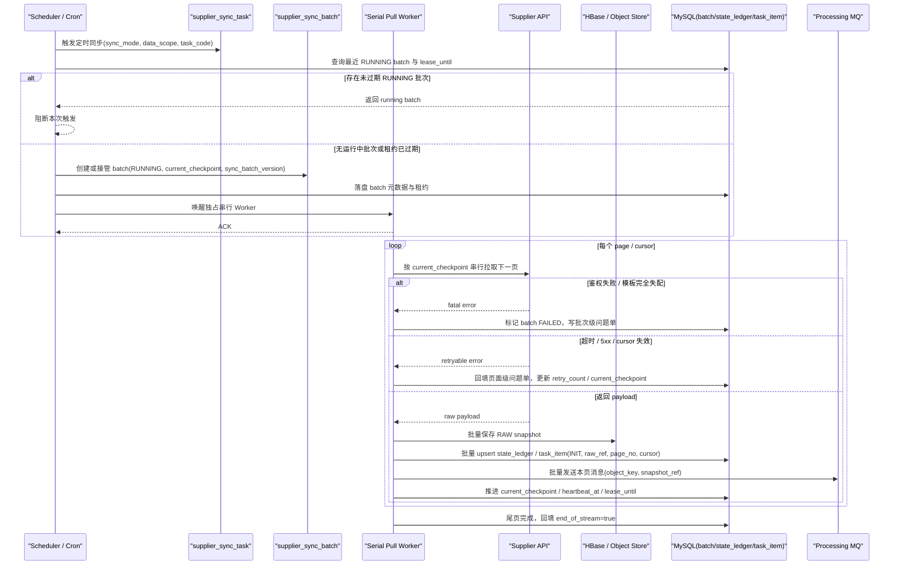
```mermaid
sequenceDiagram
    participant SCH as "Scheduler / Cron"
    participant ST as "supplier_sync_task"
    participant SB as "supplier_sync_batch"
    participant W as "Serial Pull Worker"
    participant SUP as "Supplier API"
    participant HDB as "HBase / Object Store"
    participant MYSQL as "MySQL(batch/state_ledger/task_item)"
    participant MQP as "Processing MQ"

    SCH->>ST: 触发定时同步(sync_mode, data_scope, task_code)
    SCH->>MYSQL: 查询最近 RUNNING batch 与 lease_until
    alt 存在未过期 RUNNING 批次
        MYSQL-->>SCH: 返回 running batch
        SCH-->>SCH: 阻断本次触发
    else 无运行中批次或租约已过期
        SCH->>SB: 创建或接管 batch(RUNNING, current_checkpoint, sync_batch_version)
        SCH->>MYSQL: 落盘 batch 元数据与租约
        SCH->>W: 唤醒独占串行 Worker
        W-->>SCH: ACK
    end

    loop 每个 page / cursor
        W->>SUP: 按 current_checkpoint 串行拉取下一页
        alt 鉴权失败 / 模板完全失配
            SUP-->>W: fatal error
            W->>MYSQL: 标记 batch FAILED，写批次级问题单
        else 超时 / 5xx / cursor 失效
            SUP-->>W: retryable error
            W->>MYSQL: 回填页面级问题单，更新 retry_count / current_checkpoint
        else 返回 payload
            SUP-->>W: raw payload
            W->>HDB: 批量保存 RAW snapshot
            W->>MYSQL: 批量 upsert state_ledger / task_item(INIT, raw_ref, page_no, cursor)
            W->>MQP: 批量发送本页消息(object_key, snapshot_ref)
            W->>MYSQL: 推进 current_checkpoint / heartbeat_at / lease_until
        end
    end

    W->>MYSQL: 尾页完成，回填 end_of_stream=true
```

这张图只回答一个问题：**定时器触发后，串行 Worker 如何在单线程拉取、落盘、投递 MQ、推进 checkpoint 之间形成一条线性的同步流水线。**

这里的批次级运行状态，主要沉淀在 `supplier_sync_batch`。它记录的是“这次同步整体怎么跑、现在跑到哪、谁在跑、租约是否有效”，而不是每个酒店对象的明细结果。

一个典型的 `supplier_sync_batch` 可以长这样：

| 字段 | 含义 | Agoda 串行 Pull 示例 |
| --- | --- | --- |
| `batch_id` | 本次执行批次 ID | `sb_20260604_0001` |
| `task_code` | 对应哪个业务同步任务 | `AGODA_HOTEL_PULL_DAILY` |
| `status` | 批次状态 | `RUNNING` |
| `sync_batch_version` | 本次批次版本号 | `20260604-1` |
| `trigger_id` | 哪次调度触发的 | `xxljob-20260604-020000` |
| `worker_id` | 当前执行 Worker | `sw-03` |
| `lease_token` | 当前租约 Token | `lt_8f7a9c21` |
| `lease_until` | 租约过期时间 | `2026-06-04 02:15:15` |
| `heartbeat_at` | 最近心跳时间 | `2026-06-04 02:10:15` |
| `current_checkpoint` | 已安全推进的游标 | `cursor=abc123&page=250` |
| `last_checkpoint_at` | 最近推进 checkpoint 的时间 | `2026-06-04 02:09:58` |
| `page_no` | 当前处理到第几页 | `250` |
| `pulled_count` | 已成功拉回的对象数 | `125000` |
| `enqueued_count` | 已成功投 MQ 的对象数 | `125000` |
| `success_count` | 下游成功处理数 | `118420` |
| `failed_count` | 下游失败处理数 | `312` |
| `skipped_count` | 下游跳过数 | `6268` |
| `end_of_stream` | 是否已经拉到尾页 | `false` |
| `last_error_code` | 最近一次批次级错误码 | `` |
| `last_error_message` | 最近一次批次级错误信息 | `` |

如果用一条样例记录来表达，可以写成：

```json
{
  "batch_id": "sb_20260604_0001",
  "task_code": "AGODA_HOTEL_PULL_DAILY",
  "status": "RUNNING",
  "sync_batch_version": "20260604-1",
  "trigger_id": "xxljob-20260604-020000",
  "worker_id": "sw-03",
  "lease_token": "lt_8f7a9c21",
  "lease_until": "2026-06-04 02:15:15",
  "heartbeat_at": "2026-06-04 02:10:15",
  "current_checkpoint": "cursor=abc123&page=250",
  "last_checkpoint_at": "2026-06-04 02:09:58",
  "page_no": 250,
  "pulled_count": 125000,
  "enqueued_count": 125000,
  "success_count": 118420,
  "failed_count": 312,
  "skipped_count": 6268,
  "end_of_stream": false,
  "last_error_code": null,
  "last_error_message": null
}
```

##### 3.6.2.2 处理阶段时序图

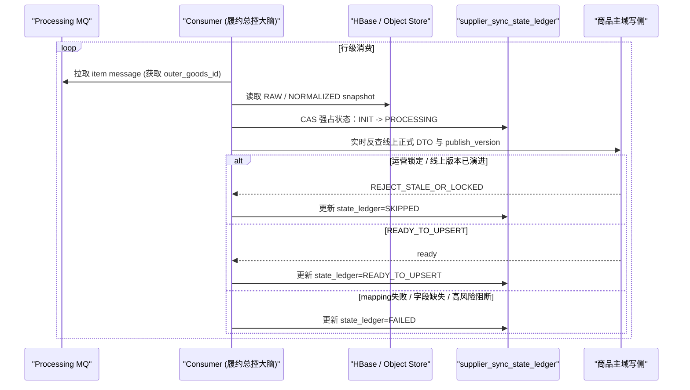
```mermaid
sequenceDiagram
    participant MQP as "Processing MQ"
    participant CONS as "Consumer (履约总控大脑)"
    participant HDB as "HBase / Object Store"
    participant SL as "supplier_sync_state_ledger"
    participant P as "商品主域写侧"

    loop 行级消费
        CONS->>MQP: 拉取 item message (获取 outer_goods_id)
        CONS->>HDB: 读取 RAW / NORMALIZED snapshot
        CONS->>SL: CAS 强占状态：INIT -> PROCESSING
        CONS->>P: 实时反查线上正式 DTO 与 publish_version
        alt 运营锁定 / 线上版本已演进
            P-->>CONS: REJECT_STALE_OR_LOCKED
            CONS->>SL: 更新 state_ledger=SKIPPED
        else READY_TO_UPSERT
            P-->>CONS: ready
            CONS->>SL: 更新 state_ledger=READY_TO_UPSERT
        else mapping失败 / 字段缺失 / 高风险阻断
            CONS->>SL: 更新 state_ledger=FAILED
        end
    end
```

这张图只回答第三个问题：**Consumer 如何在处理阶段完成标准对象准备，并拦截因为队列时间差导致的旧数据覆盖新数据。**

##### 3.6.2.3 消费后请求商品主域写侧时序图

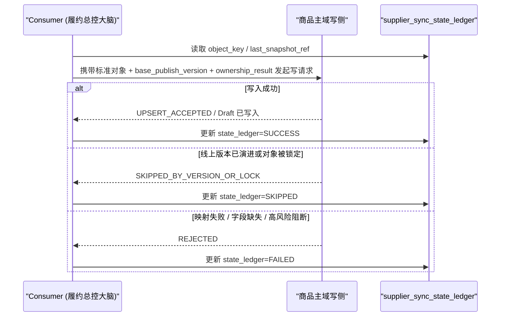
```mermaid
sequenceDiagram
    participant CONS as "Consumer (履约总控大脑)"
    participant P as "商品主域写侧"
    participant SL as "supplier_sync_state_ledger"

    CONS->>SL: 读取 object_key / last_snapshot_ref
    CONS->>P: 携带标准对象 + base_publish_version + ownership_result 发起写请求
    alt 写入成功
        P-->>CONS: UPSERT_ACCEPTED / Draft 已写入
        CONS->>SL: 更新 state_ledger=SUCCESS
    else 线上版本已演进或对象被锁定
        P-->>CONS: SKIPPED_BY_VERSION_OR_LOCK
        CONS->>SL: 更新 state_ledger=SKIPPED
    else 映射失败 / 字段缺失 / 高风险阻断
        P-->>CONS: REJECTED
        CONS->>SL: 更新 state_ledger=FAILED
    end
```

这张图只回答第四个问题：**Consumer 在完成处理后，如何把结果请求到商品主域写侧。**

#### 3.6.3 关键设计点

这里要特别强调一点：在 RAW / NORMALIZED 报文已经全量交给 `HBase / Object Store` 的情况下，MySQL 里的 `supplier_sync_state_ledger` 仍然不是可选项。

如果说 `HBase` 是装满原始货物的“大仓库”，那么 `supplier_sync_state_ledger` 就是整条同步流水线的“调度指挥中心”。它负责承接四类关键主权：

- **并发主权**：Consumer 通过状态机和 CAS 抢占对象级执行权，避免 MQ 重投后的并发踩脚。
- **对账主权**：大盘进度、成功/失败/跳过统计不能去扫 HBase，只能依赖 MySQL 轻量聚合。
- **补偿主权**：失败对象必须能被精准捞出做二次重试，而不是把 100w 对象整批重跑。
- **时间差防线**：消息在 MQ 里排队数小时后，Consumer 仍可结合状态台账和实时版本做写前保护，阻断旧数据覆盖新数据。

换句话说，`HBase` 负责“存数据”，`supplier_sync_state_ledger` 负责“驱动状态机”。没有这张表，整条长任务链路就会从“可对账、可恢复、可裁剪”的工业流水线，退化成一条状态不可见的黑盒。

##### 3.6.3.1 定时触发与串行接入阶段的设计点

| 设计点 | 说明 |
| --- | --- |
| 单例运行与租约接管 | `supplier_sync_batch` 需要 `status=RUNNING + lease_until` 的单例控制。租约未过期时，新触发直接阻断；租约过期时，新 Worker 通过 CAS 接管并继承 `current_checkpoint`。 |
| 串行 checkpoint 恢复 | Agoda 这类慢源不适合并发拉取。更稳的做法是一次只拉一页或一个 cursor，成功后推进 `current_checkpoint`，机器重启后从最近水位继续。 |
| HBase 吞数据，MySQL 管状态 | 原始报文和标准化对象进入 HBase 或对象存储；MySQL 只负责批次、状态台账、映射和治理锚点。 |
| 页级批量物化 | 串行拉回一页后，要按页批量写快照、批量 Upsert 状态台账、批量投 MQ，避免接入层做大量单条循环写。 |
| 供给侧不做最终过滤裁决 | 上游供应商同步链路负责忠实搬运与状态推进，不基于本地镜像去做最终跳过判断。否则最容易因为失败状态、排队延迟或运营改动造成静默丢单。 |
| Push / Pull 介质分离 | Push 更偏接口受理 + MQ 削峰，Pull 更偏单 Worker 串行拉取 + checkpoint；两者执行模型不同，但治理主线复用。 |
| Supplier Mapping 独立持久化 | 外部资源和平台资源的映射不能只靠内存或日志，要有权威 `supplier_product_mapping_tab`。 |

##### 3.6.3.2 行级消费与商品主域写入阶段的设计点

| 设计点 | 说明 |
| --- | --- |
| `supplier_sync_state_ledger` 是状态主权中心 | 这张表不是简单的辅助索引，而是整个长任务的状态机中枢。它记录对象当前是 `INIT / PROCESSING / SUCCESS / FAILED / SKIPPED`，用来支撑并发防踩脚、大盘聚合、局部重试和幽灵消息裁剪。 |
| CAS 强占消费权 | Consumer 不能拿到消息就直接处理，而要先把对象状态从 `INIT` 原子推进到 `PROCESSING`，这样才能避免 MQ 重投或多机并发时重复处理同一对象。 |
| 供给侧允许做安全过滤，但不能做最终业务去重 | 供给侧可以基于 `state_ledger` 做同批次重复页、无映射死链、并发重投、以及“同批次内已明确成功投递过商品中心的重复消息”这类安全过滤；但不能仅凭 `hash_sign` 去猜测商品中心真相并直接裁决最终 `SKIPPED`。 |
| `hash_sign` 只能做辅助观测或安全短路条件 | 如果状态台账里维护了 `hash_sign` / `payload_hash`，它更适合用于大盘分析、排障，以及配合“同批次已成功投递”做局部短路；不建议把它当作跨批次最终业务去重依据。 |
| 商品中心死守强幂等 | 最终去重、幂等和写拦截必须收敛到商品中心。供给侧允许忠实重发，商品主域用 `publish_version`、乐观锁和字段主导权做最终写前保护。 |
| 版本反查防旧数据覆盖 | 由于拉取和消费之间可能相隔数小时，Consumer 必须在写商品主域前实时反查版本和锁定状态，拦截旧数据覆盖新数据。 |
| 执行层与治理层边界 | Pull 执行层独立，Consumer 负责对象级消费控制和请求编排，但不能直接改正式商品表，只能通过商品主域写侧接口完成更新。 |
| 对象级补偿必须可精准捞取 | 当 100w 对象里只有 1w 失败时，系统必须能直接通过 `state_ledger=FAILED` 拉出问题对象，而不是整批重跑。 |

##### 3.6.3.3 收尾与对账阶段的设计点

| 设计点 | 说明 |
| --- | --- |
| 对账与终结判定依赖状态台账 | 跑批进行中不能去遍历 HBase 里的海量 KV 做统计。更稳的方式是基于 `supplier_sync_state_ledger` 做轻量聚合，实时得出 `SUCCESS / FAILED / SKIPPED / PROCESSING` 大盘。 |
| 动态计数器与终结标志 | 由于串行 Pull 事先不知道总量，接入层应采用 `INCRBY + end_of_stream + DECR` 的动态计数协议，而不是固定总数计数器。 |
| DB 旁路盘点兜底 | Redis 或 Consumer 猝死导致收尾漏触发时，需要由 DB 旁路定时器盘点状态台账，补触发归档。 |

##### 3.6.3.4 全量 List 下的自动下线设计点

当供应商只提供全量 List、不提供显式下线增量通知时，供应商同步链路必须自己解决“沉默的消失”：哪些对象本次没有再出现，因此应该被自动下线。

这件事不适合设计成“每消费一条消息顺便判断一次”的行级逻辑，更合适的方式是把它设计成 **批次收尾动作**。因为只有等整批 List 拉取结束、且对象级消费已经完成收敛时，系统才知道“谁在本次真正缺席了”。

| 设计点 | 说明 |
| --- | --- |
| 全量下线判断必须是批次级动作 | 下线不是单条对象能判断出来的，它依赖“本次全量 List 已经完整处理完”的全局前提，因此必须放在批次收尾阶段。 |
| 时间戳游标是默认解法 | 批次启动时记录 `T_start`；本次 List 中命中的对象，在 `supplier_sync_state_ledger` 中刷新最近打卡时间；批次收尾时，再找出 `supplier_id` 下仍在线、但最近打卡时间早于 `T_start` 的对象，作为候选下线集。 |
| 只有绝对安全瞬间才能触发下线盘点 | 必须同时满足 `end_of_stream=true` 且本批次对象处理已收敛，才能开始候选下线识别。不能在 MQ 还没消费完时提前执行，否则极易误杀还在排队的正常对象。 |
| 先找候选下线集，再做比例熔断 | 候选下线对象不能直接批量执行下线。必须先计算占比；如果缺失比例异常高，默认视为供应商漏传、文件不完整或接口故障，自动下线应当立即熔断。 |
| 影子快照表是高安全等级备选 | 如果业务对误下线极度敏感，可以先把本次全量 List 的对象主键完整写入影子快照表，再与当前在线集合做差集。这样更安全，但更重。 |
| 下线应该通过统一治理链路发起 | 候选下线对象识别出来后，不应直接绕过商品主域写侧改正式状态，而应通过统一的下线命令或治理链路进入商品主域 / 库存协同。 |
| 下线必须保留原因与批次归因 | 自动下线要记录 `off_reason / supplier_id / batch_id / trigger_id`，保证后续能够追溯“它是因为哪一次全量同步缺失而下线的”。 |

如果采用时间戳游标法，批次收尾时的候选下线识别通常会长这样：

```sql
UPDATE supplier_sync_state_ledger
SET state = 'OFFLINE_CANDIDATE',
    off_reason = 'SUPPLIER_MISSING_IN_FULL_LIST',
    off_batch_id = :current_batch_id
WHERE supplier_id = :supplier_id
  AND state = 'ONLINE'
  AND last_seen_at < :batch_start_time;
```

这里的 `last_seen_at < T_start` 不是“马上执行正式下线”，而是先把对象打入 **候选下线集合**。真正执行下线前，还要经过：

- 下线比例熔断
- 人工审核或自动风控
- 批量异步投递下线命令

这样整条链路的心智就很清楚：

1. 本批次出现过的对象完成“存活打卡”
2. 本批次结束后，没打卡的对象进入候选下线集
3. 候选下线集先经过风控比例熔断
4. 通过后再进入统一下线治理链路

它的本质不是“查缺失”，而是：

> 把供应商只给全量 List 的不确定性，收敛成一个可恢复、可熔断、可审计的批次收尾步骤。

#### 3.6.4 表和版本映射

| 对象 | 作用 | 关键字段 |
| --- | --- | --- |
| `supplier_sync_task` | 定义同步任务 | `task_code / sync_mode / data_scope / concurrency_policy` |
| `supplier_sync_batch` | 一次执行批次与租约控制 | `batch_id / status / sync_batch_version / current_checkpoint / worker_id / lease_token / lease_until / heartbeat_at / end_of_stream` |
| `supplier_sync_state_ledger` | 供应商对象状态台账 | `supplier_id / outer_goods_id / last_batch_id / state / last_snapshot_ref` |
| `supplier_product_mapping_tab` | 外部资源到平台资源映射 | `supplier_id / external_resource_id / internal_object_id / mapping_status` |
| `publish_version` | 平台正式发布版本 | `item_id / publish_version` |

#### 3.6.5 Agoda 酒店同步样例数据

下面给一组简化样例，帮助把这些表和 Agoda 酒店同步场景串起来。这里默认同步对象是 `AGD_HOTEL_78231`，同步模式是串行 Pull，目标是把供应商侧的酒店基础信息、房型信息和价格/库存差异同步到平台治理链路。

| 对象 | 样例数据 | 说明 |
| --- | --- | --- |
| `supplier_sync_task` | `task_code=AGODA_HOTEL_PULL_DAILY`<br>`sync_mode=PULL`<br>`data_scope=HOTEL`<br>`concurrency_policy=SINGLE_WORKER` | 业务级同步定义，表达“每天串行拉取 Agoda 酒店数据” |
| `supplier_sync_batch` | `batch_id=sb_20260604_0001`<br>`status=RUNNING`<br>`sync_batch_version=20260604-1`<br>`current_checkpoint=cursor=abc123`<br>`worker_id=sw-03`<br>`lease_token=lt_8f7a`<br>`lease_until=2026-06-04 02:15:15`<br>`heartbeat_at=2026-06-04 02:10:15`<br>`end_of_stream=false` | 一次实际执行批次，记录当前拉到哪了、由谁跑、租约是否有效，以及是否已经拉到尾页 |
| `supplier_sync_state_ledger` | `supplier_id=agoda`<br>`outer_goods_id=AGD_HOTEL_78231`<br>`last_batch_id=sb_20260604_0001`<br>`state=INIT`<br>`last_snapshot_ref=oss://agoda-sync/raw/78231.json` | 记录 Agoda 某个酒店对象在这次同步中的最新状态和最近快照引用，用来支撑状态推进、补偿和收口 |
| `HBase / Object Store` | `raw_ref=oss://agoda-sync/raw/78231.json`<br>`normalized_ref=oss://agoda-sync/norm/78231.json` | 原始报文和标准化对象都沉淀到 HBase / 对象存储，供回放、复算和审计使用 |
| `supplier_product_mapping_tab` | `supplier_id=agoda`<br>`external_resource_id=AGD_HOTEL_78231`<br>`internal_object_id=hotel_10086`<br>`mapping_status=ACTIVE` | 维护 Agoda 酒店 ID 到平台酒店对象 ID 的权威映射 |
| `publish_version` | `item_id=hotel_10086`<br>`publish_version=18` | 平台当前正式发布版本，用于 Diff 和版本保护 |

如果继续细化到对象级状态，可以直接在 `supplier_sync_state_ledger` 上看到这种结果：

| 对象 | 样例数据 | 说明 |
| --- | --- | --- |
| `supplier_sync_state_ledger` | `supplier_id=agoda`<br>`outer_goods_id=AGD_HOTEL_78231`<br>`last_batch_id=sb_20260604_0001`<br>`state=SUCCESS`<br>`last_snapshot_ref=oss://agoda-sync/raw/78231.json` | 表示 Agoda 酒店 78231 在版本校验通过后成功进入商品主域写侧 |
| `supplier_sync_state_ledger` | `supplier_id=agoda`<br>`outer_goods_id=AGD_HOTEL_78232`<br>`last_batch_id=sb_20260604_0001`<br>`state=SKIPPED`<br>`last_snapshot_ref=oss://agoda-sync/raw/78232.json` | 表示该对象在消费时发现线上版本已经演进或被运营锁定，因此不再请求商品主域写侧 |
| `supplier_sync_state_ledger` | `supplier_id=agoda`<br>`outer_goods_id=AGD_HOTEL_78233`<br>`last_batch_id=sb_20260604_0001`<br>`state=FAILED`<br>`last_snapshot_ref=oss://agoda-sync/raw/78233.json` | 表示某个房型无法映射到平台对象，因此停留在失败状态，等待补偿或人工修复 |

### 3.7 核心功能：库存

#### 3.7.1 场景画像

供给平台里的库存能力，不是库存中心那套账本、预占、确认、释放的权威事实模型，而是 **库存 B 端入口与操作编排层**。

这一节要覆盖的，不只是“调库存”这种通用动作，更重要的是：**创建商品时，如何兼容创建库存**。

在酒旅、到店餐饮、景区票务和本地生活券这类场景里，创建库存至少要支持 3 种完全不同的模式：

1. **`QTY`：纯数字库存**

   - 创建商品时，运营手工填写库存数字，例如 `100`
   - 供给平台只需要声明初始数量
   - 库存中心持有真实可售数量
   - 下单时扣减的是数字，不是预先存在的券码

2. **`SYS_GEN`：系统动态发券**

   - 创建商品时，同样填写一个库存数字，例如 `500`
   - 但用户支付成功后，平台会按规则动态生成核销券码或二维码
   - 库存本体仍然是数量，券码只是履约载体
   - 除了初始数量外，还要声明券码生成规则或生成策略

3. **`EXT_POOL`：外部死码池**

   - 创建商品时，不能把“手填数量”当成库存真相
   - 运营必须上传 Excel 或外部批次文件，文件内包含真实券码、密码、有效期等信息
   - 库存的真正来源是券码池里的有效行数
   - 用户下单时不是“数字减一”，而是从券码池中占用一张真实的死码

因此，供给平台在“创建商品”时，必须同步声明一项关键业务属性：

- `inventory_mode = QTY / SYS_GEN / EXT_POOL`

商品创建成功后，供给平台再根据这个模式，把库存初始化动作路由到不同的命令编排路径，而不是所有商品都走同一种 `CreateInventory`。

这一节后续要覆盖的典型动作包括：

- 初始化库存
- 调整库存
- 导入券码
- 生码
- 锁库存

核心边界要先钉死：

> 入口归供给，事实归库存。

也就是说，供给平台负责承接操作入口、审批、权限、审计、错误文件和命令编排，但不持有库存事实、预占、账本或券码池权威状态。

#### 3.7.2 创建商品时顺带创建库存的时序图

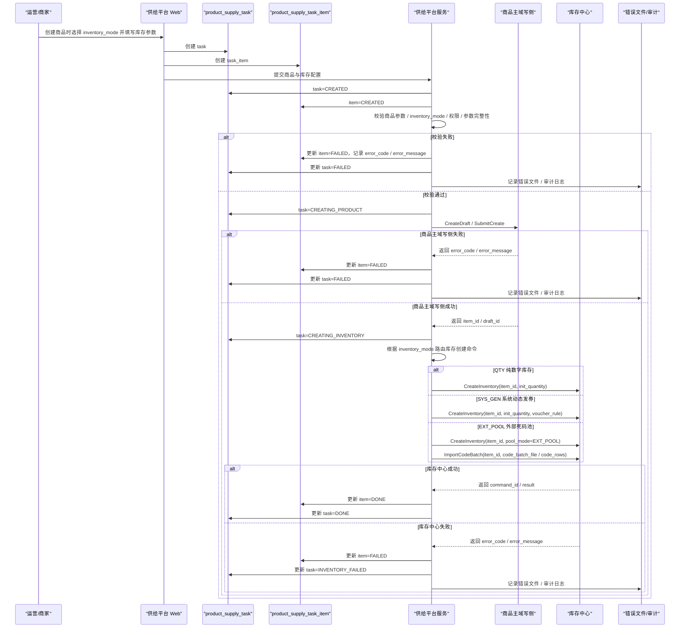
```mermaid
sequenceDiagram
    participant U as "运营/商家"
    participant W as "供给平台 Web"
    participant T as "product_supply_task"
    participant I as "product_supply_task_item"
    participant S as "供给平台服务"
    participant P as "商品主域写侧"
    participant IC as "库存中心"
    participant F as "错误文件/审计"

    U->>W: 创建商品时选择 inventory_mode 并填写库存参数
    W->>T: 创建 task
    W->>I: 创建 task_item
    W->>S: 提交商品与库存配置
    S->>T: task=CREATED
    S->>I: item=CREATED
    S->>S: 校验商品参数 / inventory_mode / 权限 / 参数完整性
    alt 校验失败
        S->>I: 更新 item=FAILED，记录 error_code / error_message
        S->>T: 更新 task=FAILED
        S->>F: 记录错误文件 / 审计日志
    else 校验通过
        S->>T: task=CREATING_PRODUCT
        S->>P: CreateDraft / SubmitCreate
        alt 商品主域写侧失败
            P-->>S: 返回 error_code / error_message
            S->>I: 更新 item=FAILED
            S->>T: 更新 task=FAILED
            S->>F: 记录错误文件 / 审计日志
        else 商品主域写侧成功
            P-->>S: 返回 item_id / draft_id
            S->>T: task=CREATING_INVENTORY
            S->>S: 根据 inventory_mode 路由库存创建命令
            alt QTY 纯数字库存
                S->>IC: CreateInventory(item_id, init_quantity)
            else SYS_GEN 系统动态发券
                S->>IC: CreateInventory(item_id, init_quantity, voucher_rule)
            else EXT_POOL 外部死码池
                S->>IC: CreateInventory(item_id, pool_mode=EXT_POOL)
                S->>IC: ImportCodeBatch(item_id, code_batch_file / code_rows)
            end
            alt 库存中心成功
                IC-->>S: 返回 command_id / result
                S->>I: 更新 item=DONE
                S->>T: 更新 task=DONE
            else 库存中心失败
                IC-->>S: 返回 error_code / error_message
                S->>I: 更新 item=FAILED
                S->>T: 更新 task=INVENTORY_FAILED
                S->>F: 记录错误文件 / 审计日志
            end
        end
    end
```

这张图只回答一个问题：

> 当“创建商品”和“创建库存”被收敛到同一个供给任务里时，供给中心如何先完成商品创建，再按库存类型路由库存初始化。

因此它故意不展开库存中心内部怎么记账、怎么预占、怎么维护券码池，只强调供给中心这一侧的 4 个动作：

- 商品创建和库存初始化共用一个任务锚点
- 商品创建阶段必须先声明 `inventory_mode`
- 供给中心先调商品主域写侧创建商品，再根据结果决定是否进入库存初始化
- 供给中心先把库存初始化操作任务化、审计化
- 供给中心根据 `inventory_mode` 决定库存初始化走哪条命令路径
- `QTY` 和 `SYS_GEN` 都以“数量”为库存源头
- `EXT_POOL` 以“券码池”为库存源头，手填数量不是最终真相

#### 3.7.3 商品已存在时单独创建或增加库存的时序图

如果商品已经创建完成，后续还需要支持一种更轻量的库存入口：**单独创建库存或增加库存**。这时不再需要走商品创建链路，而是直接围绕既有 `item_id` 发起库存操作。

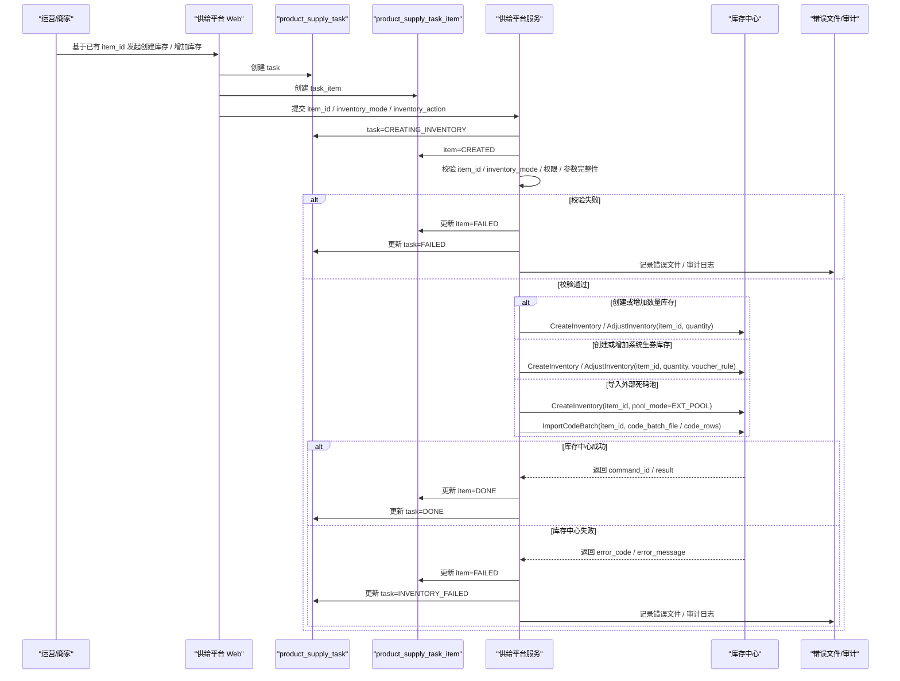
```mermaid
sequenceDiagram
    participant U as "运营/商家"
    participant W as "供给平台 Web"
    participant T as "product_supply_task"
    participant I as "product_supply_task_item"
    participant S as "供给平台服务"
    participant IC as "库存中心"
    participant F as "错误文件/审计"

    U->>W: 基于已有 item_id 发起创建库存 / 增加库存
    W->>T: 创建 task
    W->>I: 创建 task_item
    W->>S: 提交 item_id / inventory_mode / inventory_action
    S->>T: task=CREATING_INVENTORY
    S->>I: item=CREATED
    S->>S: 校验 item_id / inventory_mode / 权限 / 参数完整性
    alt 校验失败
        S->>I: 更新 item=FAILED
        S->>T: 更新 task=FAILED
        S->>F: 记录错误文件 / 审计日志
    else 校验通过
        alt 创建或增加数量库存
            S->>IC: CreateInventory / AdjustInventory(item_id, quantity)
        else 创建或增加系统生券库存
            S->>IC: CreateInventory / AdjustInventory(item_id, quantity, voucher_rule)
        else 导入外部死码池
            S->>IC: CreateInventory(item_id, pool_mode=EXT_POOL)
            S->>IC: ImportCodeBatch(item_id, code_batch_file / code_rows)
        end
        alt 库存中心成功
            IC-->>S: 返回 command_id / result
            S->>I: 更新 item=DONE
            S->>T: 更新 task=DONE
        else 库存中心失败
            IC-->>S: 返回 error_code / error_message
            S->>I: 更新 item=FAILED
            S->>T: 更新 task=INVENTORY_FAILED
            S->>F: 记录错误文件 / 审计日志
        end
    end
```

这张补充图只回答另一个问题：

> 当商品已经存在时，供给中心如何围绕既有 `item_id` 单独创建库存或增加库存。

它和前一张图的区别在于：

- 不再调用商品主域写侧创建商品
- 任务直接从 `CREATING_INVENTORY` 开始
- 入口重点变成已有商品的库存补建、补量、导码和补码

#### 3.7.4 创建商品与创建库存共用任务的状态机

当商品创建和库存初始化被收敛到同一个 `product_supply_task` 时，任务状态机要同时表达两段动作：

- 商品是否已经成功创建
- 库存是否已经成功初始化

推荐的任务级状态如下：

| 状态 | 含义 |
| --- | --- |
| `CREATED` | 任务刚被受理，商品和库存都还未开始处理 |
| `CREATING_PRODUCT` | 供给中心正在请求商品主域写侧创建商品 |
| `CREATING_INVENTORY` | 商品已创建成功，供给中心正在按 `inventory_mode` 请求库存中心初始化库存 |
| `DONE` | 商品创建成功，库存初始化也成功，整个联合任务结束 |
| `FAILED` | 商品创建阶段失败，库存阶段不会继续执行 |
| `INVENTORY_FAILED` | 商品已创建成功，但库存初始化失败，需要错误文件、补偿或人工修复 |
| `CANCELED` | 人工取消或系统撤销任务 |

如果希望进一步表达行级明细，`product_supply_task_item` 可以保持轻量：

| `task_item.status` | 含义 |
| --- | --- |
| `CREATED` | 明细刚受理 |
| `FAILED` | 参数校验或执行失败 |
| `DONE` | 商品与库存动作都已完成 |

这个状态机的关键点不是追求状态越多越好，而是要明确区分两类失败：

- **商品没建成**：`FAILED`
- **商品建成了，但库存没建成**：`INVENTORY_FAILED`

只有这样，运营侧才能知道是整单回退，还是只需要补库存。

#### 3.7.5 关键设计点

如果把这一节再往上提炼，供给平台在“商品创建 + 库存创建”这条链路上，真正要解决的是 4 个高风险技术点：

1. 多模式库存建模怎么统一入口、分离事实。
2. 商品创建和库存初始化如何用一个联合任务表达半成功。
3. 单品页面直接改库存时，为什么不能把绝对值直接写回库存中心。
4. 外部死码池为什么必须走“资源导入”，而不是“数量加减”。

| 设计点 | 说明 |
| --- | --- |
| 商品创建必须显式声明库存模式 | 供给平台在创建商品时，不能只收商品信息而不收库存模式。至少要支持 `QTY / SYS_GEN / EXT_POOL` 三种模式，否则后续库存初始化会失去路由依据。 |
| 创建商品时就要决定库存创建路径 | 这不是商品创建完成后的附属动作，而是商品创建契约的一部分。供给中心在创建商品时就要知道是走数量库存、系统生券，还是外部死码池。 |
| 商品创建与库存初始化可以共用一个任务 | 对运营侧来说，这通常是“一次提交”。因此可以共用一个 `product_supply_task`，但状态机必须至少拆出 `CREATING_PRODUCT` 和 `CREATING_INVENTORY` 两段。 |
| 多模式库存建模要“一元化商品契约，分流化库存命令” | 商品侧不应该为 `QTY / SYS_GEN / EXT_POOL` 割裂成三套建模，而是通过统一的 `inventory_mode` 把商品契约收口，再由供给中心的策略路由把库存初始化分流成不同命令。这样商品主域仍保持一元化表达，库存事实则在库存中心按模式落地。 |
| 商品主数据与库存事实要在契约层耦合、在事实层解耦 | 商品创建时可以声明 `inventory_mode / init_quantity / voucher_rule` 等契约字段，但真正的库存余额、券码池、预占和账本仍归库存中心。 |
| 命令入口与库存事实分离 | 供给平台承接的是库存操作入口，不是库存事实库。真正的余额、账本、预占、券码池权威状态仍归库存中心。 |
| 操作要任务化 | 初始化库存、批量调库存、导入券码等操作都建议写入 `product_supply_task / task_item`，统一审计、补偿和错误文件输出。 |
| `QTY` 与 `SYS_GEN` 共享数量型库存底座 | 这两类模式在创建商品时都可以录入初始数量。差异在于：`QTY` 只关心可售数，`SYS_GEN` 还要附带券码生成规则，但它们都不是预先导入死码池。 |
| `EXT_POOL` 必须走池化库存模型 | 对外购死码场景，Excel 中的券码行才是真实库存来源。供给平台可以收“预计数量”做提示，但不能把手填数量当库存真相。 |
| 券码导入与数量调整分离 | 券码导入是唯一资源导入问题，数量调整是数值变化问题，不能混成同一种库存命令模型。`ImportCodeBatch` 和 `AdjustInventory` 应走两套不同命令。 |
| 动态发券与死码导入分离 | 系统生码是“支付后印券”，外部死码是“创建前已有券”。两者虽然都叫券，但库存建模完全不同，不能共用一张“券码导入”表来表达。 |
| 联合任务必须显式表达“库存失败但商品已成功” | 商品创建成功、库存初始化失败，是本地生活和酒旅供给里最典型的半成功状态。用 `INVENTORY_FAILED` 单独承接这类失败，能避免重复建商品，也能把补偿动作收敛成“只补库存、不回滚商品”的柔性修复链路。 |
| 单品页面编辑库存时，供给中心应把绝对值转成 Delta | 运营在页面上输入的是把 `20` 改成 `50` 这种绝对值，但供给中心发往库存中心的命令应是 `AdjustInventory(+30)`。否则在用户下单、高频扣减或多人盘点的并发窗口里，直接写绝对值会抹掉中间发生的真实库存变化。 |
| Delta 调整要绑定 `base_inventory_version` | 把绝对值转换成 Delta 还不够。供给中心还应带上页面打开时看到的 `base_inventory_version`，让库存中心用乐观锁校验版本是否已被他人改动。版本冲突时，应返回可运营化的错误，而不是静默覆盖。 |
| 供给平台保留审批与理由 | 库存变更往往涉及资损风险，供给平台应保留审批、操作理由、权限校验和审计日志。 |
| 发布后可触发库存初始化 | 商品发布后，供给平台可以负责编排库存初始化或默认库存配置。对于 `EXT_POOL`，更常见的是“先创建库存容器，再导入券码批次”。 |
| `EXT_POOL` 的数量必须强锚定资源行数 | 对外购死码商品，库存中心感知到的“加库存 1000”不应该来自一个手填数字，而必须来自成功导入的 1000 行有效券码。也就是说，库存数量是池化资源导入的影子结果，不是独立的人工输入事实。 |
| 资源导入与数值变更要物理隔离 | `EXT_POOL` 的导码本质是唯一资源写入，`QTY / SYS_GEN` 的调库存本质是数值增量。两者在命令模型、幂等语义、审计要求和失败补偿上都不一样，必须分开建模。 |
| 失败运营化 | 库存命令失败后，供给平台要能输出错误文件、审计日志和补偿入口，而不是让问题停留在下游日志里。 |
| 不展开库存中心内部账本 | 这一节只讲供给侧库存能力，不在这里重复库存中心的 `inventory_balance / reservation / ledger` 内部模型。 |

#### 3.7.6 表和版本映射

| 对象 | 作用 | 关键字段 |
| --- | --- | --- |
| `product_supply_task` | 一次库存操作任务锚点 | `task_type / execution_mode / source_type / operator_id / status` |
| `product_supply_task_item` | 单次库存操作明细 | `object_type / object_key / status / error_code / item_id` |
| `inventory_mode` | 商品创建时声明的库存模式 | `QTY / SYS_GEN / EXT_POOL` |

这一节刻意不再把库存入口拆成太多请求对象。对于供给平台来说，最重要的是：

- 任务锚点是否存在
- 任务明细是否能表达失败和补偿
- 商品创建时是否声明了正确的 `inventory_mode`

像 `base_inventory_version`、导码文件引用、券码规则等更细的字段，继续在 `3.7.5 关键设计点` 和具体时序图里表达即可，不必在这里再拆成一串对象清单。

### 3.8 发布编排、商品主域交互与外部系统集成

供给平台在这一层不做正式落库，而是负责把治理结果编排成可执行的发布动作，并把结果扩散给商品主域和外部协同系统。

建议把这一节拆成三类内容来讲：

1. **商品主域交互**

   - 发布命令
   - `base_publish_version`
   - `product_publish_record`
   - `Draft / Staging / QC / merge` 边界

2. **外部系统集成**

   - 搜索
   - 缓存
   - 计价
   - 营销
   - 数据平台 / 画像 / 订阅方

3. **一致性表达**

   - 供给平台不做正式落库
   - 供给平台负责发布编排和跟踪
   - 商品主域负责正式 merge
   - 外部系统通过事件 / Outbox / 投影刷新感知

这里要钉死一句：

> 供给平台负责编排和触发发布；`Draft / Staging / QC / publish merge` 由商品主域写侧闭环完成；搜索、缓存、计价、营销和数据平台等外部系统通过投影刷新或事件订阅感知变更。

### 3.9 异常处理与运营闭环

供给平台最终要把失败运营化，而不是把问题藏在日志里。

这里要先钉死一条异常治理总原则：

> 失败后不能只靠“直接重试覆盖”来掩盖问题，而应该保留完整的审计链路、错误归因和补偿闭环。  
> 只有这样，系统才具备可回放、可追责、可人工修复的工程确定性。

这一小节建议覆盖：

- 错误文件
- 部分成功
- DLQ
- 补偿任务
- 人工修复
- 审计日志
- 质量看板
- 同步任务卡死
- 下架误推送
- mapping 失效后的人工介入与重试

对运营侧要能回答：

- 哪个任务失败了
- 哪一行失败了
- 为什么失败
- 是交互型导入问题还是系统型同步问题
- 能否下载错误文件修复
- 是否可以重新投递

### 3.10 供给平台表清单与使用场景

这一小节建议显式列出供给平台权威表，避免和商品主域写侧、库存系统混淆。

#### 3.10.1 每个表的使用场景

这里先回答“这张表为什么存在”。保持当前按职责分类的方式不变，但只讨论每张表的使用场景、负责链路和关键边界；字段和 schema 统一收口到 `3.10.2`。

##### A. 接入与任务编排表

| 表 | 使用场景 | 解决的问题类型 |
| --- | --- | --- |
| `product_supply_task` | 单品创建、运营编辑、Excel 导入、API/ISV 推送 | 交互型导入问题 / 统一编排锚点 |
| `product_supply_task_item` | Excel 每行、批量编辑每条、标准化后每个对象 | 交互型导入问题 / 行级状态 |
| `product_supply_operation_log` | 提交、重试、撤回、错误文件、补偿触发 | 交互型与系统型共同审计 |

##### B. 标准化与冲突治理补充表

| 表 | 使用场景 | 解决的问题类型 |
| --- | --- | --- |
| `product_field_ownership` | 供应商字段与运营字段冲突 | 系统型同步问题 |

##### C. 发布编排与追踪表

| 表 | 使用场景 | 解决的问题类型 |
| --- | --- | --- |
| `product_publish_record` | 一次任务最终触发了哪次发布 | 交互型与系统型共同发布追踪 |
| `product_supply_object_mapping` | 供给对象与正式 `item_id` 映射 | 交互型与系统型共同追溯 |
| `product_outbox_event` | 下游刷新事件跟踪 | 交互型与系统型共同一致性 |

##### D. 失败恢复与运营治理表

| 表 | 使用场景 | 解决的问题类型 |
| --- | --- | --- |
| `product_supply_dead_letter` | 发布失败、重试超限、关键校验失败 | 交互型与系统型共同失败恢复 |
| `product_compensation_task` | 下游刷新失败、库存初始化失败、事件重投 | 系统一致性问题 |
| `product_quality_issue` | 巡检发现缺履约、缺库存配置、搜索滞后 | 质量治理问题 |

##### E. 供应商同步执行层表

| 表 | 使用场景 | 解决的问题类型 |
| --- | --- | --- |
| `supplier_sync_task` | 定义要同步什么、怎么同步 | 系统型同步问题 |
| `supplier_sync_batch` | 一次执行批次、进度、水位、租约 | 系统型同步问题 |
| `supplier_sync_state_ledger` | 记录对象级状态、水位和最近快照引用 | 系统型同步问题 |
| `supplier_product_mapping_tab` | 外部资源到平台资源映射 | 系统型同步问题 |

这里还要明确反向排除：

- `product_supply_draft`
- `product_supply_staging`
- `product_qc_review`

这些不应列为供给平台权威表，而应归商品主域写侧。

#### 3.10.2 每个表的 Schema

这里再回答“这张表长什么样”。字段口径、推荐索引和 DDL 示例统一放在这一小节，避免和 `3.10.1` 的用途说明重复。

先看最核心的接入与任务编排表。

这 3 张表建议这样设计：

##### `product_supply_task`

| 字段 | 含义 | 设计要点 |
| --- | --- | --- |
| `id` | 任务主键 | 雪花 ID 或 UUID |
| `task_no` | 任务号 | 对外展示，便于运营检索 |
| `task_type` | 任务类型 | `CREATE / EDIT / IMPORT / API_PUSH / BATCH_EDIT` |
| `source_type` | 来源类型 | `LOCAL / EXCEL / API / ISV / OPS` |
| `biz_scope` | 业务范围 | 例如 `PRODUCT / INVENTORY_ENTRY / PUBLISH` |
| `receipt_id` | 受理号 | 入口受理即返回，用于异步查询 |
| `trigger_id` | 触发源 ID | 例如上传文件、按钮点击、定时任务实例 |
| `operation_id` | 操作链路 ID | 串起任务、发布、补偿、审计 |
| `execution_mode` | 执行模式 | `SYNC / ASYNC`；单品常为 `SYNC`，批量常为 `ASYNC` |
| `operator_type` | 操作人类型 | `MERCHANT / OPS / SYSTEM / ISV` |
| `operator_id` | 操作人 ID | 人工或系统主体 |
| `merchant_id` | 商家 ID | 本地运营场景可为空 |
| `tenant_id` | 租户 ID | 多租户场景需要 |
| `status` | 任务状态 | `CREATED / RUNNING / PARTIAL_SUCCESS / FAILED / DONE / CANCELED` |
| `total_count` | 总对象数 | 单品场景固定为 `1` |
| `success_count` | 成功数 | 任务汇总字段 |
| `failed_count` | 失败数 | 任务汇总字段 |
| `risk_level` | 整体风险级别 | `LOW / MEDIUM / HIGH`，供后续路由 |
| `error_file_url` | 错题本地址 | Excel 导入常用 |
| `ext_json` | 扩展字段 | 存任务级上下文，如模板、入口配置 |
| `created_at` | 创建时间 | 审计基础字段 |
| `updated_at` | 更新时间 | 审计基础字段 |

##### `product_supply_task_item`

| 字段 | 含义 | 设计要点 |
| --- | --- | --- |
| `id` | 行级主键 | 雪花 ID 或 UUID |
| `task_id` | 所属任务 ID | 关联 `product_supply_task.id` |
| `item_no` | 行号/序号 | Excel 行号或批量对象序号 |
| `object_type` | 对象类型 | `PRODUCT / SKU / OFFER / INVENTORY_ENTRY` |
| `object_key` | 对象业务键 | 如外部商品 ID、临时对象键 |
| `item_action` | 本行动作 | `CREATE / UPDATE / UPSERT / DELETE / PUBLISH` |
| `raw_ref` | 原始输入引用 | Excel 行引用、上传对象引用、消息体引用 |
| `normalized_snapshot` | 标准化快照 | 结构化 JSON，供后续校验与发布编排 |
| `diff_summary` | 变更摘要 | 记录关键字段差异 |
| `status` | 行级状态 | `PENDING / VALIDATING / READY / FAILED / PUBLISHED / SKIPPED` |
| `error_code` | 错误码 | 面向机器处理 |
| `error_message` | 错误信息 | 面向运营排查 |
| `retry_count` | 重试次数 | 行级重试控制 |
| `publish_record_id` | 发布记录 ID | 成功进入发布编排后回填 |
| `ext_json` | 扩展字段 | 存模板版本、路由策略等 |
| `created_at` | 创建时间 | 审计基础字段 |
| `updated_at` | 更新时间 | 审计基础字段 |

##### `product_supply_operation_log`

| 字段 | 含义 | 设计要点 |
| --- | --- | --- |
| `id` | 日志主键 | 雪花 ID 或 UUID |
| `operation_id` | 操作链路 ID | 审计主锚点 |
| `task_id` | 关联任务 ID | 可为空，兼容轻量同步场景 |
| `task_item_id` | 关联行级 ID | 行级事件可回填 |
| `event_type` | 事件类型 | `SUBMIT / RETRY / WITHDRAW / GENERATE_ERROR_FILE / TRIGGER_COMPENSATION / PUBLISH` |
| `event_stage` | 事件阶段 | `INGEST / VALIDATE / ROUTE / PUBLISH / COMPENSATE` |
| `operator_type` | 操作人类型 | `MERCHANT / OPS / SYSTEM / SCHEDULER` |
| `operator_id` | 操作人 ID | 触发主体 |
| `before_snapshot` | 变更前摘要 | 不建议存整行大对象，只存关键摘要 |
| `after_snapshot` | 变更后摘要 | 只存关键摘要 |
| `result_status` | 结果状态 | `SUCCESS / FAILED / SKIPPED` |
| `result_code` | 结果码 | 便于分类统计 |
| `message` | 审计说明 | 面向运营和排障 |
| `trace_id` | 链路追踪 ID | 打通日志平台 |
| `created_at` | 事件时间 | 审计基础字段 |

推荐索引：

- `product_supply_task`
  - 唯一索引：`uk_receipt_id`
  - 普通索引：`idx_operation_id`
  - 普通索引：`idx_source_type_status_created_at`
- `product_supply_task_item`
  - 普通索引：`idx_task_id_status`
  - 普通索引：`idx_object_key`
  - 普通索引：`idx_publish_record_id`
- `product_supply_operation_log`
  - 普通索引：`idx_operation_id_created_at`
  - 普通索引：`idx_task_id_event_type`
  - 普通索引：`idx_trace_id`

##### 核心表 Schema 示例

前面的表清单和字段说明，解决的是“这张表负责什么”。如果要真正指导团队落库实现，还需要再往下一层，明确这些核心表的 schema 轮廓。

这里不追求一开始就给出百分之百完整的线上 DDL，而是给出一版 **足够指导实现、且能稳定支撑当前设计心智** 的 schema 示例。团队在落地时可以按业务规模再补分库分表键、审计字段和冷热分层策略。

##### `product_supply_task`

```sql
CREATE TABLE `product_supply_task` (
  `id` BIGINT UNSIGNED NOT NULL AUTO_INCREMENT COMMENT '任务主键ID',
  `task_no` VARCHAR(64) NOT NULL COMMENT '对外任务号',
  `receipt_id` VARCHAR(64) NOT NULL COMMENT '受理号',
  `trigger_id` VARCHAR(64) DEFAULT NULL COMMENT '触发源ID',
  `operation_id` VARCHAR(64) NOT NULL COMMENT '操作链路ID',
  `task_type` VARCHAR(32) NOT NULL COMMENT 'CREATE / EDIT / IMPORT / API_PUSH / BATCH_EDIT',
  `source_type` VARCHAR(32) NOT NULL COMMENT 'LOCAL / EXCEL / API / ISV / OPS',
  `biz_scope` VARCHAR(32) NOT NULL COMMENT 'PRODUCT / INVENTORY_ENTRY / PUBLISH',
  `execution_mode` VARCHAR(16) NOT NULL COMMENT 'SYNC / ASYNC',
  `operator_type` VARCHAR(16) NOT NULL COMMENT 'MERCHANT / OPS / SYSTEM / ISV',
  `operator_id` VARCHAR(64) NOT NULL COMMENT '操作人ID',
  `merchant_id` BIGINT DEFAULT NULL COMMENT '商家ID',
  `tenant_id` BIGINT DEFAULT NULL COMMENT '租户ID',
  `status` VARCHAR(32) NOT NULL COMMENT '任务状态',
  `worker_id` VARCHAR(64) DEFAULT NULL COMMENT '持有任务的执行器',
  `lease_token` VARCHAR(64) DEFAULT NULL COMMENT '租约令牌',
  `lease_until` DATETIME(3) DEFAULT NULL COMMENT '租约过期时间',
  `heartbeat_at` DATETIME(3) DEFAULT NULL COMMENT '最后心跳时间',
  `last_heartbeat_stage` VARCHAR(64) DEFAULT NULL COMMENT '最后心跳阶段',
  `parse_checkpoint` VARCHAR(512) DEFAULT NULL COMMENT '解析进度断点',
  `file_url` VARCHAR(512) DEFAULT NULL COMMENT '原始上传文件地址',
  `error_file_url` VARCHAR(512) DEFAULT NULL COMMENT '错题本地址',
  `total_count` INT NOT NULL DEFAULT 0 COMMENT '总对象数',
  `success_count` INT NOT NULL DEFAULT 0 COMMENT '成功数',
  `failed_count` INT NOT NULL DEFAULT 0 COMMENT '失败数',
  `skipped_count` INT NOT NULL DEFAULT 0 COMMENT '跳过数',
  `risk_level` VARCHAR(16) DEFAULT NULL COMMENT 'LOW / MEDIUM / HIGH',
  `ext_json` JSON DEFAULT NULL COMMENT '扩展上下文',
  `created_at` DATETIME NOT NULL DEFAULT CURRENT_TIMESTAMP COMMENT '创建时间',
  `updated_at` DATETIME NOT NULL DEFAULT CURRENT_TIMESTAMP ON UPDATE CURRENT_TIMESTAMP COMMENT '更新时间',
  PRIMARY KEY (`id`),
  UNIQUE KEY `uk_task_no` (`task_no`),
  UNIQUE KEY `uk_receipt_id` (`receipt_id`),
  KEY `idx_operation_id` (`operation_id`),
  KEY `idx_status_lease` (`status`, `lease_until`),
  KEY `idx_source_type_status_created_at` (`source_type`, `status`, `created_at`)
) ENGINE=InnoDB DEFAULT CHARSET=utf8mb4 COMMENT='供给平台统一任务主表';
```

##### `product_supply_task_item`

```sql
CREATE TABLE `product_supply_task_item` (
  `id` BIGINT UNSIGNED NOT NULL AUTO_INCREMENT COMMENT '行级主键ID',
  `task_id` BIGINT UNSIGNED NOT NULL COMMENT '所属任务ID',
  `item_no` INT NOT NULL COMMENT '行号/序号',
  `object_type` VARCHAR(32) NOT NULL COMMENT 'PRODUCT / SKU / OFFER / INVENTORY_ENTRY',
  `object_key` VARCHAR(128) NOT NULL COMMENT '对象业务键',
  `item_action` VARCHAR(32) NOT NULL COMMENT 'CREATE / UPDATE / UPSERT / DELETE / PUBLISH',
  `raw_ref` VARCHAR(512) DEFAULT NULL COMMENT '原始输入引用',
  `normalized_snapshot` JSON DEFAULT NULL COMMENT '标准化快照',
  `diff_summary` JSON DEFAULT NULL COMMENT '差异摘要',
  `business_fingerprint` VARCHAR(64) DEFAULT NULL COMMENT '业务指纹',
  `base_publish_version` BIGINT DEFAULT NULL COMMENT '更新链路版本锚点',
  `publish_record_id` BIGINT DEFAULT NULL COMMENT '发布记录ID',
  `status` VARCHAR(32) NOT NULL COMMENT '行级状态',
  `error_code` VARCHAR(64) DEFAULT NULL COMMENT '错误码',
  `error_message` VARCHAR(1024) DEFAULT NULL COMMENT '错误信息',
  `retry_count` INT NOT NULL DEFAULT 0 COMMENT '重试次数',
  `ext_json` JSON DEFAULT NULL COMMENT '扩展字段',
  `created_at` DATETIME NOT NULL DEFAULT CURRENT_TIMESTAMP COMMENT '创建时间',
  `updated_at` DATETIME NOT NULL DEFAULT CURRENT_TIMESTAMP ON UPDATE CURRENT_TIMESTAMP COMMENT '更新时间',
  PRIMARY KEY (`id`),
  KEY `idx_task_id_status` (`task_id`, `status`),
  KEY `idx_object_key` (`object_key`),
  KEY `idx_publish_record_id` (`publish_record_id`)
) ENGINE=InnoDB DEFAULT CHARSET=utf8mb4 COMMENT='供给平台任务行级明细表';
```

##### `product_supply_operation_log`

```sql
CREATE TABLE `product_supply_operation_log` (
  `id` BIGINT UNSIGNED NOT NULL AUTO_INCREMENT COMMENT '日志主键ID',
  `operation_id` VARCHAR(64) NOT NULL COMMENT '操作链路ID',
  `task_id` BIGINT UNSIGNED DEFAULT NULL COMMENT '关联任务ID',
  `task_item_id` BIGINT UNSIGNED DEFAULT NULL COMMENT '关联行级ID',
  `event_type` VARCHAR(32) NOT NULL COMMENT 'SUBMIT / RETRY / WITHDRAW / GENERATE_ERROR_FILE / TRIGGER_COMPENSATION / PUBLISH',
  `event_stage` VARCHAR(32) NOT NULL COMMENT 'INGEST / VALIDATE / ROUTE / PUBLISH / COMPENSATE',
  `operator_type` VARCHAR(16) NOT NULL COMMENT 'MERCHANT / OPS / SYSTEM / SCHEDULER',
  `operator_id` VARCHAR(64) NOT NULL COMMENT '触发主体',
  `before_snapshot` JSON DEFAULT NULL COMMENT '变更前摘要',
  `after_snapshot` JSON DEFAULT NULL COMMENT '变更后摘要',
  `result_status` VARCHAR(16) NOT NULL COMMENT 'SUCCESS / FAILED / SKIPPED',
  `result_code` VARCHAR(64) DEFAULT NULL COMMENT '结果码',
  `message` VARCHAR(1024) DEFAULT NULL COMMENT '审计说明',
  `trace_id` VARCHAR(128) DEFAULT NULL COMMENT '链路追踪ID',
  `created_at` DATETIME NOT NULL DEFAULT CURRENT_TIMESTAMP COMMENT '事件时间',
  PRIMARY KEY (`id`),
  KEY `idx_operation_id_created_at` (`operation_id`, `created_at`),
  KEY `idx_task_id_event_type` (`task_id`, `event_type`),
  KEY `idx_trace_id` (`trace_id`)
) ENGINE=InnoDB DEFAULT CHARSET=utf8mb4 COMMENT='供给平台操作审计日志表';
```

##### `supplier_sync_task`

```sql
CREATE TABLE `supplier_sync_task` (
  `id` BIGINT UNSIGNED NOT NULL AUTO_INCREMENT COMMENT '主键ID',
  `task_code` VARCHAR(64) NOT NULL COMMENT '业务任务编码',
  `supplier_id` BIGINT NOT NULL COMMENT '供应商ID',
  `sync_mode` VARCHAR(16) NOT NULL COMMENT 'PULL / PUSH',
  `data_scope` VARCHAR(32) NOT NULL COMMENT 'HOTEL / PRODUCT / OFFER',
  `concurrency_policy` VARCHAR(32) NOT NULL COMMENT 'SINGLE_WORKER / SERIAL_BATCH',
  `status` VARCHAR(16) NOT NULL COMMENT 'ACTIVE / PAUSED',
  `cron_expr` VARCHAR(64) DEFAULT NULL COMMENT '调度表达式',
  `ext_json` JSON DEFAULT NULL COMMENT '扩展配置',
  `created_at` DATETIME NOT NULL DEFAULT CURRENT_TIMESTAMP,
  `updated_at` DATETIME NOT NULL DEFAULT CURRENT_TIMESTAMP ON UPDATE CURRENT_TIMESTAMP,
  PRIMARY KEY (`id`),
  UNIQUE KEY `uk_task_code` (`task_code`),
  KEY `idx_supplier_id_status` (`supplier_id`, `status`)
) ENGINE=InnoDB DEFAULT CHARSET=utf8mb4 COMMENT='供应商同步任务定义表';
```

##### `supplier_sync_batch`

```sql
CREATE TABLE `supplier_sync_batch` (
  `id` BIGINT UNSIGNED NOT NULL AUTO_INCREMENT COMMENT '主键ID',
  `batch_id` VARCHAR(64) NOT NULL COMMENT '批次ID',
  `task_code` VARCHAR(64) NOT NULL COMMENT '业务任务编码',
  `supplier_id` BIGINT NOT NULL COMMENT '供应商ID',
  `status` VARCHAR(32) NOT NULL COMMENT 'RUNNING / FAILED / DONE / PARTIAL_SUCCESS',
  `sync_batch_version` VARCHAR(64) NOT NULL COMMENT '批次版本号',
  `trigger_id` VARCHAR(64) DEFAULT NULL COMMENT '触发源ID',
  `worker_id` VARCHAR(64) DEFAULT NULL COMMENT '执行worker',
  `lease_token` VARCHAR(64) DEFAULT NULL COMMENT '租约令牌',
  `lease_until` DATETIME(3) DEFAULT NULL COMMENT '租约到期时间',
  `heartbeat_at` DATETIME(3) DEFAULT NULL COMMENT '最后心跳时间',
  `current_checkpoint` VARCHAR(512) DEFAULT NULL COMMENT '当前checkpoint',
  `last_checkpoint_at` DATETIME(3) DEFAULT NULL COMMENT '最近推进checkpoint时间',
  `page_no` INT NOT NULL DEFAULT 0 COMMENT '当前页号',
  `pulled_count` BIGINT NOT NULL DEFAULT 0 COMMENT '已拉取数量',
  `enqueued_count` BIGINT NOT NULL DEFAULT 0 COMMENT '已投MQ数量',
  `success_count` BIGINT NOT NULL DEFAULT 0 COMMENT '成功数',
  `failed_count` BIGINT NOT NULL DEFAULT 0 COMMENT '失败数',
  `skipped_count` BIGINT NOT NULL DEFAULT 0 COMMENT '跳过数',
  `end_of_stream` TINYINT(1) NOT NULL DEFAULT 0 COMMENT '是否拉到尾页',
  `last_error_code` VARCHAR(64) DEFAULT NULL COMMENT '最近错误码',
  `last_error_message` VARCHAR(1024) DEFAULT NULL COMMENT '最近错误信息',
  `created_at` DATETIME NOT NULL DEFAULT CURRENT_TIMESTAMP,
  `updated_at` DATETIME NOT NULL DEFAULT CURRENT_TIMESTAMP ON UPDATE CURRENT_TIMESTAMP,
  PRIMARY KEY (`id`),
  UNIQUE KEY `uk_batch_id` (`batch_id`),
  KEY `idx_task_code_status` (`task_code`, `status`),
  KEY `idx_status_lease` (`status`, `lease_until`)
) ENGINE=InnoDB DEFAULT CHARSET=utf8mb4 COMMENT='供应商同步批次表';
```

##### `supplier_sync_state_ledger`

```sql
CREATE TABLE `supplier_sync_state_ledger` (
  `id` BIGINT UNSIGNED NOT NULL AUTO_INCREMENT COMMENT '主键ID',
  `supplier_id` BIGINT NOT NULL COMMENT '供应商ID',
  `outer_goods_id` VARCHAR(128) NOT NULL COMMENT '外部对象ID',
  `last_batch_id` VARCHAR(64) DEFAULT NULL COMMENT '最近处理批次',
  `state` VARCHAR(32) NOT NULL COMMENT 'INIT / PROCESSING / SUCCESS / FAILED / SKIPPED / BLOCKED / OFFLINE_CANDIDATE',
  `last_snapshot_ref` VARCHAR(512) DEFAULT NULL COMMENT '最近快照引用',
  `payload_hash` VARCHAR(64) DEFAULT NULL COMMENT '供应商报文哈希，仅用于观测或安全短路',
  `last_seen_at` DATETIME(3) DEFAULT NULL COMMENT '最近打卡时间',
  `off_reason` VARCHAR(128) DEFAULT NULL COMMENT '下线原因',
  `off_batch_id` VARCHAR(64) DEFAULT NULL COMMENT '候选下线批次',
  `error_code` VARCHAR(64) DEFAULT NULL COMMENT '最近错误码',
  `error_message` VARCHAR(1024) DEFAULT NULL COMMENT '最近错误信息',
  `created_at` DATETIME NOT NULL DEFAULT CURRENT_TIMESTAMP,
  `updated_at` DATETIME NOT NULL DEFAULT CURRENT_TIMESTAMP ON UPDATE CURRENT_TIMESTAMP,
  PRIMARY KEY (`id`),
  UNIQUE KEY `uk_supplier_outer_goods` (`supplier_id`, `outer_goods_id`),
  KEY `idx_last_batch_id_state` (`last_batch_id`, `state`),
  KEY `idx_supplier_state_seen` (`supplier_id`, `state`, `last_seen_at`)
) ENGINE=InnoDB DEFAULT CHARSET=utf8mb4 COMMENT='供应商同步状态台账表';
```

这些 schema 的核心价值不在于字段有多全，而在于它们把供给平台真正承担的三类主权表达清楚了：

- **任务编排主权**：`task / task_item`
- **审计与补偿主权**：`operation_log`
- **供应商长任务状态主权**：`supplier_sync_task / batch / state_ledger`

其中有两个实现细节需要明确：

- Local 单品创建/编辑虽然是同步交互，但后端仍建议创建轻量 `product_supply_task(total_count=1, execution_mode=SYNC)`，这样才能统一审计、发布追踪和失败补偿。
- `product_supply_task_item.normalized_snapshot` 保存的是供给平台完成标准化后的对象快照，用于校验、Diff 和发布编排；它不是商品主域写侧的 `Draft / Staging` 资产本体。


---

## 4. 详细设计 - 商品中心

### 4.1 商品中心定位与职责边界

商品中心不是“后台录入页面直接写的数据库”，而是 **商品主域写侧 + 正式读模型** 的组合体。

它负责：

- `Draft / Item / Item Snapshot / Merge`
- 正式商品的版本演进与发布
- 订单可解释的交易快照
- 面向搜索、缓存、计价、营销、数据平台的正式事件输出

它不负责：

- 供给入口线程池、Excel 跑批、供应商接入
- 库存账本、预占释放、券码池
- 人工审核工作台和审核队列

在这套架构里：

- 供给平台负责接入、标准化、任务编排和发布触发
- QC 平台负责机审核、人工审核和 verdict
- 库存中心负责库存事实和扣减账本
- 商品中心负责把“一个可编辑草稿”收敛成“一个可交易的正式版本”

一句话说，商品中心沉淀的不是录入过程，而是 **正式交易契约与其可发布版本**。

### 4.2 决策点

#### 4.2.1 决策点 1：为什么正式商品表不能直接承接后台录入流程

| 方案 | 优点 | 缺点 / 风险 | 推荐结论 |
| --- | --- | --- | --- |
| 方案 A：后台直接改正式商品表 | 实现简单 | 正式态与流程态混杂；审核、驳回、撤回难以表达；旧数据容易污染线上 | 不推荐 |
| 方案 B：拆 `Draft / Item` | 流程态和正式态分离；商品中心可以承接审核态锁定、本地 merge 和正式版本推进 | 比直接改正式表更复杂 | 推荐 |

结论：

- 商品中心必须显式拆开 `Draft / Item`
- 正式表只表达正式商品，不承接 `DRAFT / QC_PENDING / REJECTED` 这类流程态

#### 4.2.2 决策点 2：只有一个 Draft，提交审核后锁定不允许编辑，是否还需要 `Staging`

| 方案 | 优点 | 缺点 / 风险 | 推荐结论 |
| --- | --- | --- | --- |
| 方案 A：单 `Draft` + 审核态锁定 | 模型简单；数据天然一份；实现成本低；审核与发布链路短 | 审核期间运营无法继续修改；QC 回调丢失会形成僵尸草稿；长审核周期下体验较差 | 当前采用 |
| 方案 B：`Draft + Staging + Item` | 审核对象完全冻结；运营可并行准备下一版；更适合未来版本、回滚和复杂时间轴 | 模型更重；需要维护额外副本与状态 | 未来可演进 |

结论：

- 当前设计只保留一个 `Draft`
- 提交审核后，将 `Draft` 切换到 `QC_PENDING` 并禁止继续编辑，用“审核态锁定”保证审的是 A，发的也是 A
- 这个方案本质上是“用运营阻塞换系统简单”，适合审核时间短、运营冲突低、商品结构相对稳定的阶段
- 若未来出现长审核周期、并行准备多个未来版本、定时生效或高确定性版本回滚要求，再演进为 `Draft + Staging + Item`

#### 4.2.3 决策点 3：商品中心是否需要 `base_publish_version`

| 方案 | 优点 | 缺点 / 风险 | 推荐结论 |
| --- | --- | --- | --- |
| 方案 A：不带版本锚点，直接覆盖 | 调用简单 | 旧编辑覆盖新版本；补偿重放污染线上 | 不推荐 |
| 方案 B：编辑链路强制带 `base_publish_version` | 能识别并发冲突；能阻断旧版本回滚 | 需要版本校验和冲突提示 | 推荐 |

结论：

- 编辑链路必须携带 `base_publish_version`
- 商品中心是最终的版本冲突裁决者

#### 4.2.4 决策点 4：`publish_version` 是否需要单独成表

| 方案 | 优点 | 缺点 / 风险 | 推荐结论 |
| --- | --- | --- | --- |
| 方案 A：轻量方案，`publish_version` 只内联在 `product_item_tab` 上 | 模型轻；实现简单；足以承接 `base_publish_version` 校验、并发保护和正式态版本推进 | 缺少完整版本历史；版本级审计、回滚和外部对账能力较弱 | 当前采用 |
| 方案 B：独立 `publish_version` 表，承接正式版本历史 | 发布历史完整；易做版本审计、历史回溯和版本级回滚 | 模型更重；需要额外维护版本副本与一致性 | 未来可演进 |

结论：

- 当前商品中心先采用轻量方案，在 `product_item_tab` 上只保留一个当前 `publish_version` 数字
- 只要能满足 `base_publish_version` 校验、并发保护和正式态版本推进，就不必先引入独立版本历史表
- 当后续需要完整发布历史、版本审计、版本级回滚或版本级外部对账时，再平滑演进为独立 `publish_version` 表

#### 4.2.5 决策点 5：发布时是否允许跨服务长事务

| 方案 | 优点 | 缺点 / 风险 | 推荐结论 |
| --- | --- | --- | --- |
| 方案 A：商品、QC、搜索、营销同步长事务提交 | 表面一致 | 耦合重；回滚困难；下游故障放大 | 不推荐 |
| 方案 B：商品中心内部本地 merge + Outbox 异步投影 | 正式态闭环清晰；下游解耦；易补偿 | 接受最终一致 | 推荐 |

结论：

- 商品中心内部本地事务完成 `merge`
- 外部系统通过 Outbox / 事件驱动刷新投影

#### 4.2.6 决策点 6：无效变更过滤应该放在供给侧还是商品中心

| 方案 | 优点 | 缺点 / 风险 | 推荐结论 |
| --- | --- | --- | --- |
| 方案 A：供给侧做最终无效变更裁决 | 上游流量少 | 供给侧不掌握正式真相，容易误跳过 | 不推荐 |
| 方案 B：商品中心承担最终 Diff / 版本保护 / 幂等裁决 | 真相源统一；可结合正式 DTO、版本和字段主导权裁决 | 商品中心承担更多过滤职责 | 推荐 |

结论：

- 最终业务级 Diff、幂等和真相裁决由商品中心承担
- 供给侧只做安全过滤，不做最终业务跳过裁决

#### 4.2.7 决策点 7：重复商品识别和供应商无效更新过滤，是否应该前移到供给侧

| 方案 | 优点 | 缺点 / 风险 | 推荐结论 |
| --- | --- | --- | --- |
| 方案 A：供给侧识别重复商品并做最终无效更新过滤 | 上游压力更小；进入商品中心的流量更少 | 供给侧不掌握正式商品真相；不同来源的商品语义唯一键难统一；容易误判重复或误跳过真实变更 | 不推荐 |
| 方案 B：商品中心负责重复商品识别与最终无效更新过滤 | 自然键、正式 DTO、字段主导权和 `publish_version` 全在商品中心闭环；裁决更准确 | 商品中心要承担更多前置比较和幂等逻辑 | 推荐 |

结论：

- **重复商品识别** 和 **最终无效更新过滤** 都收敛到商品中心
- 供给侧只做拓扑级安全过滤，例如同批次重复页、重投踩脚、无映射死链
- 商品中心负责：
  - 基于业务自然键识别重复商品
  - 基于正式 DTO、字段主导权和 `base_publish_version` 过滤掉无效更新
  - 基于乐观锁阻断并发覆盖

#### 4.2.8 决策点 8：商品中心写模型的幂等，应该靠单点防重还是多层立体防御

| 方案 | 优点 | 缺点 / 风险 | 推荐结论 |
| --- | --- | --- | --- |
| 方案 A：只靠单一防重表或单一请求 ID | 实现简单；入门成本低 | 只能挡住部分重复请求，无法同时解决重复创建、旧版本覆盖、状态乱序推进 | 不推荐 |
| 方案 B：请求级、对象级、版本级、状态机级四层立体防御 | 能分别拦截网络重试、自然键冲突、旧版本覆盖和状态乱序；和商品中心真相模型天然对齐 | 设计更复杂，需要把幂等分层落实到接口、表结构和状态机 | 推荐 |

结论：

- 商品中心写模型幂等不能靠单一“防重表”解决
- 在当前 **单 `Draft` + `product_item_tab.publish_version` + 本地 merge** 的设计中，应采用四层立体防御：
  - **请求级幂等**：`request_id / operation_id`
  - **对象级幂等**：业务自然键唯一约束
  - **版本级幂等**：`draft.base_publish_version` vs `item.publish_version`
  - **状态机幂等**：状态推进必须条件更新
- 这四层分别拦截：
  - 网络重试 / MQ 重投
  - 重复商品创建
  - 旧请求覆盖新版本
  - 状态乱序推进与僵尸回调

#### 4.2.9 决策点 9：异构异质多品类（服务、时空资源、契约）商品应该如何组织

这个决策点本质上是在权衡：

- 商品中心是否要把话费充值、账单还款、酒店、电影、演出票、优惠券都建成同一种“重商品对象”
- 还是只维护统一交易货架，把真正复杂的物理资源、时空资源和渠道契约下沉到垂直业务域

这里需要先看清 4 个核心冲突：

1. **资产属性冲突**
   - 实物、券码更接近静态实体
   - 酒店、电影属于时空资源，价格和可售性跟日期、场次、房型强绑定
   - 话费、账单更接近 API 驱动的数据服务，本身并没有稳定的“自建库存商品”
2. **写频率冲突**
   - 实物标题、图文、卖点更新频率低
   - 酒店房态价、话费渠道进价高频波动
   - 如果全部走标准 `Draft -> QC -> Publish`，正式版本号会被高频资源波动打爆
3. **状态主权冲突**
   - 平台是否允许卖某个品类是一层主权
   - 某一家酒店、某一个电影场次、某一个充值通道是否可卖是另一层主权
   - 如果所有资源都塞进商品中心统一状态机，写模型会过度膨胀
4. **交易底座共用需求**
   - 尽管供给模型差异极大，但购物车、营销、支付、收银台仍然希望看到统一交易契约

| 方案 | 优点 | 缺点 / 风险 | 推荐结论 |
| --- | --- | --- | --- |
| 方案 A：大一统宽表模型 | 交易系统只认一套 DTO，看起来最统一 | 异构字段混杂；代码充满 `if biz_type == HOTEL`；高频资源波动会把商品中心写模型拖垮 | 不推荐 |
| 方案 B：完全垂直分治模型 | 各业务高内聚，独立演进快 | 交易、营销、支付、结算无法共底座；多品类合单和统一治理能力很弱 | 不推荐 |
| 方案 C：中台化“主干 + 品类外挂 Schema / 资源域”模型 | 兼顾统一交易货架和垂直业务灵活性；商品中心保持轻，资源域承接高频复杂变化 | 前期模型设计更抽象，需要明确主干契约与资源主权边界 | 推荐 |

结论：

- 当前商品中心采用 **“主干交易契约 + 垂直资源域”** 的组织模型
- 商品中心维护的是全平台统一的 **售卖货架与交易契约**
- 真正复杂的资源真相下沉到各自垂直业务域治理，例如：
  - 酒店域维护 `hotel_id / room_type / date -> price & availability`
  - 电影域维护 `cinema_id / show_id / seat -> inventory`
  - 充值域维护 `carrier / amount / channel -> price & capability`

进一步的落地结论是：

1. **商品中心维护的是 Meta Item，而不是全量物理资源**
   - 不为每一家物理酒店、每一个场次、每一个充值通道都创建重商品对象
   - 商品中心只维护少量可交易的“品类元商品”或统一货架契约
2. **交易链路通过动态参数携带具体资源上下文**
   - 例如 `hotel_id`、`room_type`、`biz_date`、`phone_number`、`carrier_code`
   - 商品中心在交易时负责返回统一交易契约，不负责承载所有资源细节
3. **订单快照通过运行时多态合成**
   - 订单侧拿到 `item_id + ext_params`
   - 商品中心以主干 Item 为底稿，按需向垂直资源域取当时真相，合成 `item_snapshot`
   - 这样既保证统一交易格式，又不把高频资源变化硬塞进商品中心主表
4. **生命周期采用双层状态防御**
   - 商品中心状态只表达“平台是否允许售卖这一类商品契约”
   - 具体某家酒店、某个场次、某条充值通道是否可售，由垂直资源域继续判定

一句话说：

> 商品中心写的核心，不是去记录这个世界上所有物理资源的变化，而是去维护全平台统一的交易货架与售卖契约。让商品中心保持轻量，让资源复杂度回归垂直业务域，通过运行时快照在交易发生的瞬间完成真相交汇。

### 4.3 商品中心核心模型

商品中心当前只显式建模这 3 个核心对象：

- `Draft`
- `Item`
- `Item Snapshot`

#### 4.3.1 `Draft`

- 待审核、待发布、可编辑
- 是供给平台与商品中心交互时最主要的写入对象
- 同一时刻只保留一个当前 `Draft`
- 提交审核后会被锁定，直到审核结论返回或人工撤回

#### 4.3.2 `Item`

- 只表达正式可交易商品
- 承担对外读模型主权
- 不能混入草稿、审核中的流程态
- `publish_version` 当前作为 `Item` 的内联字段存在，是并发保护与正式版本推进的锚点

#### 4.3.3 `Item Snapshot`

- 是订单解释事实
- 订单只信交易时绑定的 `item_snapshot`
- 不依赖“当前线上商品是否又被改过”

#### 4.3.4 对象关系与核心字段

| 对象 | 角色 | 关键字段 | 备注 |
| --- | --- | --- | --- |
| `Draft` | 可编辑流程态 | `draft_id / base_publish_version / status` | 审核中会被锁定 |
| `Item` | 正式交易对象 | `item_id / publish_version` | 只承接正式态 |
| `Item Snapshot` | 订单解释事实 | `item_snapshot_id` | 交易快照 |

### 4.4 核心功能：创建商品草稿与审核态锁定

#### 4.4.1 场景画像

这个场景解决的是：

- 供给平台提交一份标准化商品 DTO
- 商品中心不直接生成正式 `Item`
- 而是先创建一个可审核、可锁定、可追溯的 `Draft`

核心目标是：

- 创建草稿不等于正式发布
- 审核对象必须稳定
- 供给侧拿到的是 `draft_id`，不是正式商品主权

#### 4.4.2 完整时序图

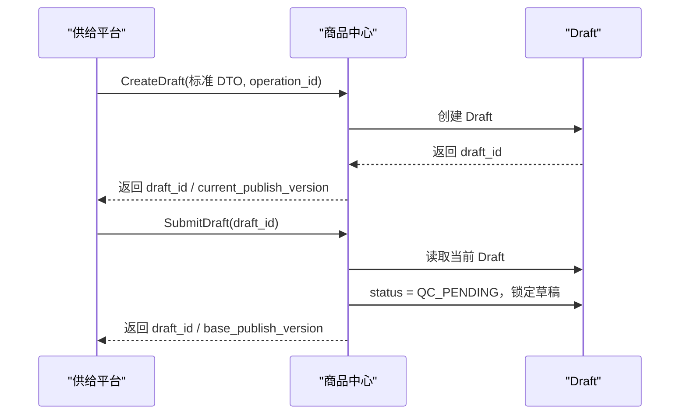
```mermaid
sequenceDiagram
    participant S as "供给平台"
    participant P as "商品中心"
    participant D as "Draft"

    S->>P: CreateDraft(标准 DTO, operation_id)
    P->>D: 创建 Draft
    D-->>P: 返回 draft_id
    P-->>S: 返回 draft_id / current_publish_version

    S->>P: SubmitDraft(draft_id)
    P->>D: 读取当前 Draft
    P->>D: status = QC_PENDING，锁定草稿
    P-->>S: 返回 draft_id / base_publish_version
```

#### 4.4.3 关键技术点

| 技术点 | 说明 |
| --- | --- |
| 创建草稿不等于正式发布 | 商品中心先落 `Draft`，不直接改正式 `Item`。 |
| 审核态锁定是当前设计的核心防线 | 提交审核后将 `Draft` 切到 `QC_PENDING`，物理拒绝后续编辑，避免“审的是 A，发的是 B”。 |
| 商品中心返回的是可审核对象 | 返回 `draft_id / base_publish_version`，而不是正式商品主权。 |
| 当前版本锚点直接来自 `Item` | `current_publish_version` 与 `base_publish_version` 都直接对齐 `product_item_tab.publish_version`。 |

### 4.5 核心功能：商品编辑、版本冲突与增量保护

#### 4.5.1 场景画像

这个场景解决的是：

- 运营或供给侧基于当前正式版本做编辑
- 多人并发或异步补偿重放时，如何防止旧版本覆盖新版本
- 最终的 Diff、字段主导权和版本裁决应该由谁负责

#### 4.5.2 完整时序图

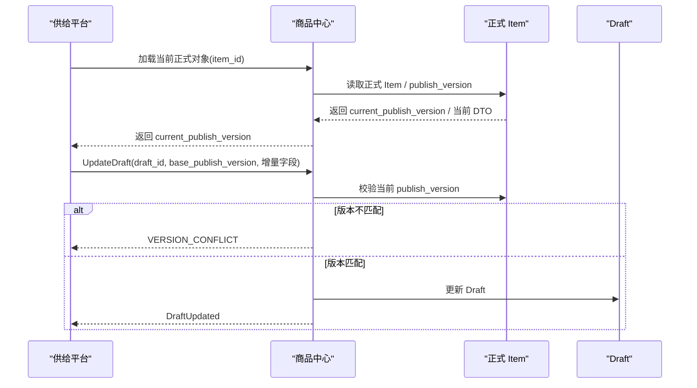
```mermaid
sequenceDiagram
    participant S as "供给平台"
    participant P as "商品中心"
    participant I as "正式 Item"
    participant D as "Draft"

    S->>P: 加载当前正式对象(item_id)
    P->>I: 读取正式 Item / publish_version
    I-->>P: 返回 current_publish_version / 当前 DTO
    P-->>S: 返回 current_publish_version

    S->>P: UpdateDraft(draft_id, base_publish_version, 增量字段)
    P->>I: 校验当前 publish_version
    alt 版本不匹配
        P-->>S: VERSION_CONFLICT
    else 版本匹配
        P->>D: 更新 Draft
        P-->>S: DraftUpdated
    end
```

#### 4.5.3 关键技术点

| 技术点 | 说明 |
| --- | --- |
| 必须带 `base_publish_version` | 没有版本锚点，就无法阻断旧编辑覆盖新版本。 |
| 商品中心承担最终 Diff 与版本校验 | 商品中心拥有正式真相，不能把最终裁决主权上移到供给侧。 |
| 旧版本回调或旧数据写入必须被拦截 | 无论同步提交还是异步补偿，旧版本都应被物理拒绝。 |
| 重复商品识别要基于业务自然键而不是 `item_id` | 创建链路不能等拿到 `item_id` 才判断重复。商品中心应基于标品条码、品牌 + 型号、供应商 ID + 外部 SPU 等自然键建立唯一约束，必要时可加 Redis / 布隆过滤器做前置拦截。 |
| 供应商无效更新过滤是“商品中心内存 Diff + 字段主导权”的组合防线 | 商品中心在进入本地事务前，应先基于当前正式 DTO 做轻量字段级 Diff；若供应商传来的字段在主导权矩阵下没有任何有效变化，则直接返回成功，不惊动正式落库、快照和 Outbox。 |
| 字段主导权矩阵决定“哪些变化算有效变化” | 价格、库存、状态等高频字段通常允许供应商驱动；标题、主图、类目、规格等一旦经过人工治理，主权应收归商品中心。供应商即使传了这些字段，也必须先经过主导权裁剪，再参与 Diff。 |
| 前置 Diff 只能裁决流量，后置版本锚点裁决并发 | 即使前置 Diff 认为是有效变化，也不能直接覆盖正式态。真正进入更新链路后，仍然要依赖 `base_publish_version` 与 `product_item_tab.publish_version` 的比较，防止两个并发更新请求互相覆盖。 |

商品中心对“是否跳过本次更新”的判断，建议遵循下面这条心智：

1. 先读取当前正式 `Item` DTO 与 `publish_version`
2. 依据字段主导权矩阵裁掉供应商无权覆盖的字段
3. 对保留下来的有效字段做轻量内存 Diff
4. 如果有效字段完全一致，则直接判定为 `NO_OP` 并返回成功
5. 如果存在有效变化，再进入正式的版本校验和本地事务 merge

在 Go 里的典型实现，可以是这种“强类型快路径 + 版本锚点兜底”的组合：

```go
type SPUTruth struct {
    Title     string   `json:"title"`
    BrandID   int64    `json:"brand_id"`
    Price     int64    `json:"price"`
    ImageURLs []string `json:"image_urls"`
}

func ShouldSkipUpdate(currentLive SPUTruth, incomingReq SPUTruth) bool {
    if currentLive.Title == incomingReq.Title &&
        currentLive.BrandID == incomingReq.BrandID &&
        currentLive.Price == incomingReq.Price &&
        sliceEqual(currentLive.ImageURLs, incomingReq.ImageURLs) {
        return true
    }
    return false
}
```

这里的 `ShouldSkipUpdate()` 只负责过滤掉 **完全没有有效变化** 的请求；真正的并发保护仍然依赖：

- `base_publish_version`
- `product_item_tab.publish_version`
- merge 时的乐观锁或版本校验

### 4.6 核心功能：审核输入、发布编排与本地 Merge

#### 4.6.1 场景画像

这个场景解决的是：

- 商品中心如何接收 QC verdict
- verdict 与当前锁定草稿不一致时如何阻断
- 发布时如何在本地事务中完成 merge，而不是依赖跨服务长事务

#### 4.6.2 完整时序图

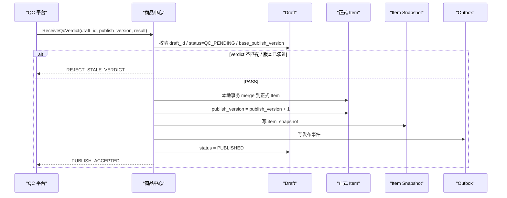
```mermaid
sequenceDiagram
    participant Q as "QC 平台"
    participant P as "商品中心"
    participant D as "Draft"
    participant I as "正式 Item"
    participant SNAP as "Item Snapshot"
    participant O as "Outbox"

    Q->>P: ReceiveQcVerdict(draft_id, publish_version, result)
    P->>D: 校验 draft_id / status=QC_PENDING / base_publish_version
    alt verdict 不匹配 / 版本已演进
        P-->>Q: REJECT_STALE_VERDICT
    else PASS
        P->>I: 本地事务 merge 到正式 Item
        P->>I: publish_version = publish_version + 1
        P->>SNAP: 写 item_snapshot
        P->>O: 写发布事件
        P->>D: status = PUBLISHED
        P-->>Q: PUBLISH_ACCEPTED
    end
```

#### 4.6.3 关键技术点

| 技术点 | 说明 |
| --- | --- |
| verdict 只是轻量判决书 | QC 回传的是审核结果，不是整份商品资产。 |
| 商品中心自己完成最终 merge | 正式态落库必须在商品中心内部闭环完成。 |
| 发布不依赖跨服务长事务 | 商品中心内部本地提交，外部通过 Outbox 异步感知。 |
| 正式版本号直接推进在 `Item` 上 | 当前轻量方案不单独维护 `publish_version` 表，merge 成功后直接推进 `product_item_tab.publish_version`。 |
| 紧急下架优先级高于审核与发布 | `OFFLINE` 属于高主权运营动作，不需要再走 QC。一旦运营在正式商品上执行紧急下架，而当前 `Draft` 正处于 `QC_PENDING`，商品中心必须在同一控制动作中把 `product_item_tab.status` 切为 `OFFLINE`，并将当前锁定草稿从 `QC_PENDING` 强制熔断为 `TERMINATED` 或可恢复的 `EDITING`。否则旧的 QC PASS 回调晚到时，会把已经下架的商品重新推回线上。 |
| 平台封禁会冻结整个写模型 | `BANNED` 是平台级否决态，比普通 `OFFLINE` 更强。一旦商品进入 `BANNED`，商品中心必须在最外层校验中直接拒绝 `CreateDraft`、`UpdateDraft`、`SubmitDraft` 和 `Publish`，直到解除封禁。这样可以防止供给侧、供应商或异步补偿把已经被平台封禁的商品重新带回编辑或发布链路。 |
| 归档不是下架的别名，而是历史终态 | `ARCHIVED` 用于表达长期退出经营、只保留历史解释能力的正式商品。进入 `ARCHIVED` 后，不应再直接复用原对象进入正常编辑和发布链路；如需恢复，更推荐复制为新草稿或走显式恢复动作，避免历史态和新经营态混淆。 |

### 4.7 核心功能：商品编辑历史与审计轨迹

#### 4.7.1 场景画像

这个场景解决的是：

- 运营、商家或系统在商品中心里到底改过什么
- 谁在什么时间点修改了哪些字段
- 一次修改到底属于草稿编辑、审核流转，还是正式发布
- 当线上商品出现争议时，如何回放“这版商品是怎么变成现在这样”的路径

这里的目标不是做一份通用日志，而是沉淀一条 **商品中心可解释的编辑历史链路**：

- 面向运营，能回答“谁改了什么”
- 面向排障，能回答“这版数据从哪来”
- 面向审计，能回答“这是 Draft、QC，还是 Publish 阶段的动作”
- 面向前台展示，能直接渲染出“字段从旧值变成新值”的结构化 Diff，而不是只给一条“某某改了商品”的流水文本

因此这里不能只做一张泛化操作日志，而是要先把历史分成 3 类，再决定每类记录什么：

1. **Draft 历史**
   - 表示草稿编辑阶段的字段变更
   - 重点回答：谁改了哪些字段
   - 典型动作：`EDIT_DRAFT / WITHDRAW / RESUBMIT`

2. **QC 历史**
   - 表示审核流转阶段的状态动作
   - 重点回答：谁在什么时候提交审核、驳回、重新提交、通过
   - 典型动作：`SUBMIT_FOR_QC / REJECT / APPROVE / ABORT`
   - QC 历史更偏“流程动作”，不一定总有字段级 Diff

3. **Publish 历史**
   - 表示锁定草稿最终如何进入正式态
   - 重点回答：哪一个 `Draft` 在什么时候发布成了哪一个正式版本
   - 典型动作：`PUBLISH / ROLLBACK / OFFLINE`
   - Publish 历史要和 `publish_version`、`item_snapshot` 绑定，保证正式版本可解释

这意味着商品中心保存的不应该只是“操作事件”，而应该是 **对象级 / 字段级的变更差异**。例如：

- 商品标题：`iPhone 15 基础版` -> `iPhone 15 降价促销版`
- 商品底价：`5999.00` -> `5499.00`
- 发货时效：`48h` -> `24h`

而不是仅仅记录：

- 张三在 2026-06-05 12:00 修改了商品

#### 4.7.2 完整时序图

```mermaid
sequenceDiagram
    participant S as "供给平台 / 运营后台"
    participant P as "商品中心"
    participant D as "Draft"
    participant H as "Edit History"
    participant I as "正式 Item"

    S->>P: UpdateDraft(draft_id, base_publish_version, 增量字段, operator)
    P->>D: 读取当前 Draft
    P->>D: 更新 Draft
    P->>H: 记录字段级 Diff(change_payload, operator)
    P-->>S: DraftUpdated

    S->>P: SubmitDraft(draft_id, operator)
    P->>H: 记录 QC 历史(action=SUBMIT_FOR_QC)
    P-->>S: Submitted

    S->>P: Publish(draft_id, operator)
    P->>I: merge 到正式 Item
    P->>H: 对比旧 Item 与锁定 Draft，记录 Publish 历史(action=PUBLISH, publish_version, change_payload)
    P-->>S: PublishAccepted
```

#### 4.7.3 关键技术点

| 技术点 | 说明 |
| --- | --- |
| 编辑历史是商品主域能力，不是外围日志拼接 | 只有商品中心最清楚草稿、审核和正式发布之间的对象关系，因此编辑历史必须在商品中心内生成。 |
| 历史必须先分层再落库 | 不能把 Draft、QC、Publish 全混成一条“操作流水”。至少要能从 `action_stage=DRAFT / QC / PUBLISH` 看出动作所处阶段。 |
| 核心不是“有人改过”，而是“到底改了什么” | 编辑历史要沉淀成字段级 Diff，而不是只有一条操作流水。日志主载荷应该是 `change_payload=[{field, old, new}]` 这一类结构化变更报文。 |
| 最优生成时机是商品中心事务内闭环 | 不推荐在 Controller/AOP 层截请求，因为那时只知道“上游传了什么”，不知道“正式对象最终变成了什么”。更合理的做法是在商品中心完成 Draft 更新或本地 merge 时，拿“旧真相”和“新真相”做 Diff，再与业务对象一起落库。 |
| 不追求存整份大对象，重点记录“谁、何时、改了哪些字段” | 审计记录要以 `operator / action / changed_fields / change_payload / before_summary / after_summary` 为核心，避免把日志表变成第二份商品主表。 |
| Draft、QC、Publish 要分别记录 | “改草稿”“提交/驳回审核”“正式发布”不是一回事，必须能从审计链路上区分动作阶段、动作类型和是否带字段 Diff。 |
| 大字段要分级降级 | 标题、价格、状态等小字段可以精确记录 `old/new`；图文 HTML、长图列表、超大 SKU 结构不直接整段塞进日志，只记录 `changed=true` 或摘要。需要深度比对时，再按 `publish_version` 或 `snapshot_id` 去异步拉两份快照做前端 Diff。 |
| Go 语言里的 DiffUtil 优先走“轻量反射 + 结构化输出” | 在 Go 里最务实的实现通常是基于 `reflect` 的轻量通用 Diff：通过结构体标签控制字段名与忽略策略，输出 `[{field, old, new}]` 形式的 `change_payload`。如果模型嵌套极深，也可以引入 `go-cmp` 或 JSON Patch 作为补充，但核心目标仍是产出结构化差异，而不是一段不可查询的文本。 |
| 高并发事务内不能无脑深度 `reflect.DeepEqual` | 反射比对在复杂对象上会带来明显 CPU 和逃逸开销，因此要做三层防线：先走快路径拦截（例如指针、版本、轻字段快速比较），再做有限字段 Diff；对大文本和复杂 SKU 结构只记 `changed=true`；真正昂贵的深度比对通过异步审计或前端本地 Diff 解决。 |
| 极端性能场景可以用代码生成替代反射 | 如果商品 DTO 很大、发布吞吐高，Go 里可以通过 `go generate` 或静态生成函数的方式，为核心 DTO 产出专用 `CustomDiff()`，把运行时反射替换成编译期硬编码字段比较，进一步降低事务内开销。 |
| 历史记录服务于解释和回放，不承担正式真相主权 | 真正的正式商品仍以 `product_item_tab` 为准；编辑历史负责解释这版数据是如何演进而来的。 |

建议的 `change_payload` 形态示例：

```json
[
  {
    "field": "title",
    "label": "商品标题",
    "old": "iPhone 15 基础版",
    "new": "iPhone 15 降价促销版"
  },
  {
    "field": "price",
    "label": "商品底价(元)",
    "old": 5999.00,
    "new": 5499.00
  },
  {
    "field": "detail_html",
    "label": "商品详情",
    "changed": true
  }
]
```

在 Go 里的实现建议是：

1. **默认方案：轻量反射 Diff**
   - 基于 `reflect` 遍历 DTO 字段
   - 结合结构体标签控制：
     - 字段展示名
     - 是否参与 Diff
   - 输出统一的 `change_payload=[{field, label, old, new}]`

2. **复杂嵌套补充：`go-cmp` / JSON Patch**
   - 如果对象层级非常深，可以引入：
     - `github.com/google/go-cmp/cmp`
     - `github.com/evanphx/json-patch`
   - 但它们更适合作为辅助工具，不建议直接把原始文本 Diff 结果塞进主日志表

3. **高性能优化：代码生成**
   - 若事务内反射成本过高，可以为核心 DTO 生成专用 Diff 方法
   - 例如：

```go
func (old *ProductDTO) CustomDiff(new *ProductDTO) []ChangeLogDetail
```

   - 用原生 `if old.Price != new.Price` 这类静态比较替换反射
   - 适合高频发布、深对象和严格事务延迟场景

一句话说：

> Go 里的 DiffUtil 不追求“最炫的通用框架”，而追求“结构化输出、事务内足够轻、重 Diff 可以延后”。

前台展示心智应该是：

- 操作人：张三
- 时间：2026-06-05 12:00:00
- 生效版本：V3
- 变更内容：
  - 修改了商品标题：`iPhone 15 基础版` -> `iPhone 15 降价促销版`
  - 修改了商品底价：`5999.00` -> `5499.00`
  - 修改了商品详情：点击查看 Diff

### 4.8 发布后读模型与外部投影

商品中心正式发布后，要统一驱动：

- 搜索索引刷新
- 缓存刷新
- 计价上下文更新
- 营销圈品
- 数据平台投影
- 订单快照读取

这里的边界要明确：

- 商品中心负责发布正式事件
- 外部系统自己消费并刷新投影
- 订单只认 `item_snapshot`，不认“此刻线上商品”

### 4.9 异常处理与版本恢复

这一节要回答的不是“如何永不失败”，而是失败后如何解释、恢复、阻断污染。

商品中心写链路的终极心智是：

> 在商品中心主域里，永远不要试图去“修改”或“倒退”历史。所有的修改、发布、下架、封禁，甚至是回滚，在底层的物理世界上，都是一次携带着最新版本锚点的正向时间演进（`+1`）。只要把住这条铁律，商品中心的写模型就立于不败之地。

| 异常类型 | 触发条件 | 风险 | 处理策略 |
| --- | --- | --- | --- |
| 版本冲突 | `base_publish_version` 不匹配 | 旧编辑覆盖新版本 | 直接拒绝提交，返回版本冲突 |
| 旧审核回调乱序 | 旧 verdict 晚于新版本到达 | 用旧审核结果污染新版本 | 校验 `draft_id + status=QC_PENDING + base_publish_version`，不匹配直接拒绝 |
| 紧急下架与 QC 并发 | 商品已被运营切到 `OFFLINE`，但旧的 PASS 回调晚到 | 已下架商品被“死灰复燃”重新上架 | 下架动作为高优先级主权动作。执行下架时同步终止当前 `QC_PENDING` 草稿，将其切为 `TERMINATED` 或恢复到 `EDITING`；后续旧 verdict 因 `draft_id + status + base_publish_version` 校验失败被直接丢弃 |
| 平台封禁后的写请求 | 商品已进入 `BANNED`，供给侧仍发来创建、编辑或发布请求 | 被平台封禁的商品重新进入可售链路 | 在商品中心写模型最外层直接校验 `item.status=BANNED`，返回 `ITEM_BANNED` 并拒绝生成或推进任何 Draft；解除封禁前冻结版本推进和发布路径 |
| 发布成功但投影失败 | Item 已 merge，下游未刷新 | 外部系统短暂不一致 | 依赖 Outbox 重试与补偿，不回滚正式 Item |
| Draft 已建成但 verdict 丢失 | QC 长时间未回调 | 草稿悬空 | 标记超时待处理，允许重新提交或人工干预 |
| merge 失败 | 本地事务中断 | 新版本未生效 | 事务回滚，保留 Draft，待补偿重试 |
| 大字段 Diff 内存耗尽 | 超长图文详情、复杂 SKU 结构在事务内做深度 Diff | CPU 飙高、内存逃逸、事务耗时拉长 | 事务内只做轻字段 Diff 和 `changed=true` 标记，不在本地事务里计算大文本逐字差异；重 Diff 延迟到异步审计或前端本地渲染 |
| snapshot 未成功落盘 | 正式商品已写，快照未固化 | 订单解释事实缺失 | `item_snapshot` 必须与正式 Item merge 处于同一个本地事务；快照写失败直接回滚整个事务，阻断发布完成态，等待上游重试 |

目标是：

- 阻断旧版本回滚污染
- 保证正式态始终可解释
- 补偿不跨越商品中心真相边界

### 4.10 商品中心表清单与使用场景

#### 4.10.1 每个表的使用场景

| 表 | 使用场景 | 关键边界 |
| --- | --- | --- |
| `product_draft_tab` | 承接待审、待编辑草稿 | 可编辑流程态，不是正式商品 |
| `product_item_tab` | 承接正式商品与当前正式版本号 | 只表达正式可交易商品；`publish_version` 当前以内联字段存在 |
| `item_snapshot` | 订单解释事实 | 订单只信快照 |
| `product_edit_history_log` | 记录商品 Draft/QC/Publish 三阶段历史 | 负责解释演进路径和字段 Diff，不承接正式商品真相 |

如果后续第 6 章把 QC 平台表完全独立出来，则：

- `product_qc_review` 在第 4 章只作为交互对象提及
- 不应列为商品中心权威表

#### 4.10.2 每个表的 Schema

##### `product_draft_tab`

| 字段 | 含义 |
| --- | --- |
| `draft_id` | 草稿主键 |
| `item_id` | 对应正式商品 ID，可为空 |
| `base_publish_version` | 基于哪个正式版本开始编辑 |
| `draft_snapshot` | 当前草稿对象快照 |
| `status` | `EDITING / QC_PENDING / APPROVED / REJECTED / PUBLISHED / WITHDRAWN / TERMINATED` |
| `created_at / updated_at` | 审计时间 |

##### `product_item_tab`

| 字段 | 含义 |
| --- | --- |
| `item_id` | 正式商品主键 |
| `publish_version` | 当前正式版本 |
| `item_snapshot_ref` | 当前正式快照引用 |
| `status` | `ONLINE / OFFLINE / ENDED / BANNED / ARCHIVED` |
| `updated_at` | 最近正式态变更时间 |

##### `item_snapshot`

| 字段 | 含义 |
| --- | --- |
| `snapshot_id` | 快照主键 |
| `item_id` | 对应正式商品 |
| `publish_version` | 快照对应版本 |
| `snapshot_payload` | 交易快照内容 |
| `created_at` | 快照时间 |

##### `product_edit_history_log`

| 字段 | 含义 |
| --- | --- |
| `history_id` | 编辑历史主键 |
| `item_id` | 对应正式商品，可为空 |
| `draft_id` | 对应草稿 |
| `action_stage` | `DRAFT / QC / PUBLISH` |
| `publish_version` | 若为发布动作，对应正式版本 |
| `action` | `EDIT_DRAFT / SUBMIT_FOR_QC / PUBLISH / WITHDRAW / REJECT` |
| `operator_id` | 操作人或系统标识 |
| `operator_name` | 操作人展示名称 |
| `op_time` | 操作时间 |
| `changed_fields` | 本次改动涉及的字段列表 |
| `change_payload` | 字段级变更 Diff，如 `[{field, old, new}]` |
| `before_summary` | 变更前摘要 |
| `after_summary` | 变更后摘要 |
| `created_at` | 事件时间 |

---

## 5. 详细设计 - 库存中心

### 5.1 库存中心定位与职责边界

库存中心管理的不是一个简单数字，而是平台对用户的一种 **可承诺供给能力**。

它负责：

- 库存对象与范围建模
- 可售量、预占、确认、释放
- 券码池、锁库存、账本
- 对账、修复、热视图恢复

它不负责：

- B 端商品编辑
- 商品审核流程
- 正式商品资产主权

### 5.2 决策点

#### 5.2.1 决策点 1：库存中心是否只管理一个数字

| 方案 | 优点 | 缺点 / 风险 | 推荐结论 |
| --- | --- | --- | --- |
| 方案 A：只维护一个可售数量字段 | 模型简单 | 无法表达预占、确认、释放、锁定、券码和资源实例；也无法解释库存为什么变成现在这样 | 不推荐 |
| 方案 B：库存中心管理“可承诺供给能力” | 能同时承接余额、预占、账本、券码池和修复治理 | 模型更复杂 | 推荐 |

结论：

- 库存中心管理的不是一个单纯数字，而是用户可被平台承诺的供给能力
- 余额只是当前视图，真正的库存事实还包括预占、账本和资源实例

#### 5.2.2 决策点 2：库存是否统一按 SKU 管，还是按 `inventory_key` 管

| 方案 | 优点 | 缺点 / 风险 | 推荐结论 |
| --- | --- | --- | --- |
| 方案 A：所有库存统一只按 SKU 管 | 看起来直观 | 无法覆盖门店、日期、渠道、批次、券码池、场次等差异维度 | 不推荐 |
| 方案 B：按 `inventory_key` 统一表达库存范围 | 能把商品、门店、日期、渠道、资源池等范围抽象收口 | 对 key 设计要求更高 | 推荐 |

结论：

- 库存不天然只按 SKU 管，而是按“承诺范围”管
- 推荐以 `inventory_key` 统一表达范围，典型维度包括：
  - 商品 / SKU
  - 门店
  - 日期
  - 渠道
  - 批次
  - 券码池 / 资源池

#### 5.2.3 决策点 3：热路径 Redis 与 MySQL 权威账本的职责分离

| 方案 | 优点 | 缺点 / 风险 | 推荐结论 |
| --- | --- | --- | --- |
| 方案 A：Redis 同时承担热路径和权威真相 | 延迟低，路径短 | 一旦故障或漂移，无法解释“库存为什么变成这样”；热视图和事实混在一起，恢复成本极高 | 不推荐 |
| 方案 B：Redis 负责热路径裁决，MySQL 负责权威余额与账本 | 吞吐、延迟、可解释性和可恢复性兼顾 | 要接受异步落库、热视图重建和最终一致治理 | 推荐 |

结论：

- Redis 负责 **C 端热路径裁决**
- MySQL 负责 **库存中心唯一的权威余额与权威账本**
- Redis 只是 **可丢弃、可重建、可漂移的热视图**
- 所有落库解释、冲正修复、全量恢复都必须以 MySQL 为准，绝不能反向用 Redis 改写账本

一句话说：

> Redis 解决“现在能不能卖得出去”，MySQL 解决“库存最终为什么会变成这样”。

#### 5.2.4 决策点 4：数量库存、系统发券库存、外部死码库存能否共用一套事实模型

| 方案 | 优点 | 缺点 / 风险 | 推荐结论 |
| --- | --- | --- | --- |
| 方案 A：全部退化成普通数字库存 | 模型统一；实现快 | 无法表达系统发券规则和外部死码的唯一资源事实；极易产生“有数无码”的资损 | 不推荐 |
| 方案 B：交易命令统一，事实模型分流 | 对外命令保持统一，对内根据 `QTY / SYS_GEN / EXT_POOL` 走不同事实模型 | 需要清楚区分数量视图和资源真相 | 推荐 |

结论：

- `QTY / SYS_GEN / EXT_POOL` 可以共用命令层表达
- 但事实模型必须分流
- 尤其 `EXT_POOL` 必须走资源型库存，不允许退化为一串数字

#### 5.2.5 决策点 5：库存调整应该传绝对值还是 Delta

| 方案 | 优点 | 缺点 / 风险 | 推荐结论 |
| --- | --- | --- | --- |
| 方案 A：直接把页面上的绝对值写入库存中心 | 接口简单 | 会抹掉并发扣减、他人盘点和预占过程中的真实变化，导致账本失真 | 不推荐 |
| 方案 B：库存中心只接受带 `base_inventory_version` 的 Delta | 能准确表达“在当前事实基础上加减多少”，并用版本锚点防并发覆盖 | 上游需要做绝对值到 Delta 的转换 | 推荐 |

结论：

- B 端看到的是绝对值
- 但库存中心只接受带 `base_inventory_version` 的 Delta 命令
- 库存事实的版本裁决必须由库存中心完成

#### 5.2.6 决策点 6：资源型库存（券码、座位、房态）是否应该折算成普通数字库存

| 方案 | 优点 | 缺点 / 风险 | 推荐结论 |
| --- | --- | --- | --- |
| 方案 A：只保存聚合数字 | 模型看起来统一 | 丢失唯一资源真相；无法解释坏码、漏码、重复发码、座位冲突、房态冲突 | 不推荐 |
| 方案 B：数字视图 + 资源实例事实双层模型 | 既能给交易链路提供聚合余额，又能保留唯一资源级真相 | 模型更重 | 推荐 |

结论：

- 资源型库存不能折算成普通数字库存
- 数字只是影子，权威真相仍在资源实例表

#### 5.2.7 决策点 7：供应商实时库存是否直接写库存中心正式账本

| 方案 | 优点 | 缺点 / 风险 | 推荐结论 |
| --- | --- | --- | --- |
| 方案 A：供应商实时库存直接覆盖库存中心正式账本 | 接入路径短 | 容易把外部抖动、脏数据、时间差和误推送直接变成平台正式真相 | 不推荐 |
| 方案 B：通过资源域或库存命令层受控进入 | 能先做受控校验、限流、路由和幂等，再进入库存事实层 | 接入链路更长 | 推荐 |

结论：

- 供应商实时库存不应直接盲写库存中心正式账本
- 应先经过资源域或库存命令层受控进入

#### 5.2.8 决策点 8：库存编辑中的 `+10 / -10` 增量操作，应该直接改余额，还是走原子增量 + 账本幂等

| 方案 | 优点 | 缺点 / 风险 | 推荐结论 |
| --- | --- | --- | --- |
| 方案 A：先查当前余额，再在应用内做加减，最后覆盖写回 | 实现直观 | 在高并发下会发生 Lost Update；网络重试会导致重复加减；出错后无法追溯是哪次操作造成的 | 不推荐 |
| 方案 B：数据库原子增量 + 流水账本 + 请求号幂等 | 能防并发覆盖、能防网络重试、能完整追溯每一次变更来源 | 模型和事务更重 | 推荐 |

结论：

- 库存中心必须把 `+10 / -10` 这类操作建模成 **增量命令**
- 余额表更新必须采用数据库原子更新，不能先查再算再覆盖
- 同一个事务内必须同时完成两件事：
  - 向 `inventory_ledger` 写入一条增量流水
  - 对 `inventory_balance` 执行原子增量更新
- 所有增量命令都必须携带全局唯一的 `request_no / operation_id`
- `inventory_ledger` 必须对该请求号建立唯一索引，用于拦截网络超时重试带来的重复加减

典型落地形态是：

```sql
UPDATE inventory_balance
SET usable_qty = usable_qty + :delta,
    updated_at = NOW()
WHERE inventory_key = :inventory_key
  AND (usable_qty + :delta) >= 0;
```

以及：

```sql
UNIQUE KEY uk_request_no (request_no)
```

一句话说：

> 库存中心里真正的真相不是“当前余额是多少”，而是“每一次 `+10 / -10` 到底是谁、在什么时候、基于什么请求号改进去的”。余额只是聚合结果，账本和请求号幂等才是准确性的底座。

#### 5.2.9 决策点 9：库存追加或调整的审批流，应该放在库存中心还是供给平台

| 方案 | 优点 | 缺点 / 风险 | 推荐结论 |
| --- | --- | --- | --- |
| 方案 A：审批流直接下沉到库存中心 | 看起来链路更短，库存变更和审批状态靠得更近 | 会把库存事实层污染成流程平台；审批人、附件、驳回、OA 单号、权限校验等流程语义侵入库存域；后续不同入口都要重复适配审批语义 | 不推荐 |
| 方案 B：供给平台负责编排审批流，库存中心只接收已获批命令 | 业务流程和库存事实边界清晰；供给平台统一承接 B 端入口、审批、理由、附件、任务状态和审计；库存中心专注账本、余额、资源池和幂等执行 | 供给平台到库存中心之间多一层命令编排 | 推荐 |

结论：

- 审批流属于 **业务流程主权**，应放在供给平台
- 库存中心只负责 **事实执行主权**
- 供给平台应负责：
  - 发起库存调整申请
  - 审批流转
  - 操作理由、附件、OA 单号、权限校验
  - 审批通过后的正式命令编排
- 库存中心只接收“已经获批、允许执行”的命令，例如：
  - `AdjustInventory(delta, request_no, approval_no)`
  - `ImportCodeBatch(task_id, approval_no)`
  - `GenerateCodeBatch(task_id, request_no, approval_no)`

这样可以形成稳定分层：

- 供给平台负责“谁申请、谁审批、为什么改”
- 库存中心负责“到底加了多少、减了多少、写进了哪条账本、当前余额变成多少”

一句话说：

> 审批属于流程治理，应该放在供给平台；库存中心只做库存事实的受控执行，不演化成审批工作流平台。

### 5.3 库存中心核心模型

库存中心建议显式建模以下对象：

| 对象 | 作用 | 关键边界 |
| --- | --- | --- |
| `inventory_config` | 定义库存管理方式、扣减时机、是否允许超卖、资源模式 | 配置，不是事实 |
| `inventory_key` | 统一表达库存承诺范围 | 库存按范围表达，不等于天然只按 SKU |
| `inventory_balance` | 当前聚合库存视图 | 负责当前可售量，不负责解释全部历史 |
| `inventory_reservation` | 记录订单或业务流程中的预占 | 过程态事实，不等于最终账本 |
| `inventory_ledger` | 每次库存变动的权威账本 | 真正解释“为什么变成今天这样”的事实源 |
| `inventory_code_pool_xx` | 券码 / 唯一资源实例池 | 资源型库存事实，不是数字余额的附属字段 |

这里的模型边界要钉死：

- `inventory_balance` 不是审计真相，只是当前聚合视图
- `inventory_ledger` 才是库存中心的最终解释事实
- `inventory_code_pool_xx` 是资源型库存的主权表，不应被压扁成数字字段

### 5.4 核心功能：B 端库存初始化与库存类型路由

#### 5.4.1 场景画像

这个场景解决的是：

- 创建商品时如何同步初始化库存
- 已有商品如何单独创建库存
- `inventory_mode = QTY / SYS_GEN / EXT_POOL` 如何路由到不同初始化路径

库存中心面对的不是一个“永远只有数字”的世界，而是三类差异很大的初始化入口：

- `QTY`：直接初始化数量库存
- `SYS_GEN`：库存中心负责闭环生成券码，供给平台只负责发起生成任务和跟踪进度
- `EXT_POOL`：初始化动作不接受手填数量，而是等待唯一资源导入来生成数量影子

#### 5.4.2 场景一：`QTY` 数量库存初始化时序图

```mermaid
sequenceDiagram
    participant S as "供给平台"
    participant IC as "库存中心"
    participant CFG as "inventory_config"
    participant BAL as "inventory_balance"

    S->>IC: CreateInventory(item_id, inventory_mode=QTY, init_quantity)
    IC->>CFG: 写库存配置
    IC->>BAL: 初始化 available_qty
    IC-->>S: INIT_SUCCESS
```

#### 5.4.3 场景二：`EXT_POOL` 外部死码导入初始化时序图

```mermaid
sequenceDiagram
    autonumber
    actor O as "运营 / 供应商"
    participant S as "供给平台"
    participant IC as "库存中心"
    participant CFG as "inventory_config / inventory_balance"
    participant POOL as "inventory_code_pool_xx"
    participant MQ as "Message Queue / Outbox Event"

    O->>S: 上传券码 Excel
    S->>S: 生成 task_id，状态=PROCESSING
    S->>IC: CreateInventory(item_id, inventory_mode=EXT_POOL, task_id)
    IC->>CFG: 创建配置，init_status=PENDING_IMPORT, usable_qty=0
    IC-->>S: INIT_PENDING

    loop 分批导码
        S->>S: 清洗本批券码，去除文件内重复
        S->>IC: ImportCodeBatch(item_id, codes_chunk[], task_id)
        IC->>POOL: INSERT IGNORE 批量落库
        IC-->>S: 返回本批成功数
    end

    S->>IC: CompleteImport(item_id, task_id)
    IC->>POOL: COUNT 有效券码真相
    IC->>CFG: usable_qty = real_count, init_status = READY
    IC->>MQ: 事务内写完成事件
    MQ-->>S: INVENTORY_IMPORT_COMPLETED(task_id, real_count)
    S->>S: CAS 更新任务状态为 SUCCESS
    S-->>O: 前台进度条完成 / 通知完成
```

#### 5.4.4 场景三：`SYS_GEN` 系统活码生成与回调时序图

```mermaid
sequenceDiagram
    autonumber
    actor O as "运营 / 供应商"
    participant S as "供给平台"
    participant IC as "库存中心"
    participant W as "Inventory Gen Worker"
    participant CFG as "inventory_config / inventory_balance"
    participant POOL as "inventory_code_pool_xx"
    participant MQ as "Message Queue / Outbox Event"

    O->>S: 发布商品并要求系统生成 target_qty 个券码
    S->>S: 初始化生成任务 task_id，状态=PROCESSING
    S->>IC: CreateInventory(item_id, inventory_mode=SYS_GEN, target_qty, task_id)
    IC->>CFG: 创建配置，init_status=PENDING_GEN, usable_qty=0
    IC-->>S: TASK_ACCEPTED
    S-->>O: 商品已发布，后台造码中

    IC->>W: 异步触发内部造码 Worker
    loop 直到物理有效码数达到 target_qty
        W->>W: 生成一批带盐随机券码
        W->>POOL: INSERT IGNORE 批量落库
        W->>POOL: COUNT 当前真实有效码数
    end

    W->>CFG: usable_qty = target_qty, init_status = READY
    W->>MQ: 事务内写 INVENTORY_GEN_COMPLETED 事件
    MQ-->>S: INVENTORY_GEN_COMPLETED(task_id, real_count)
    S->>S: CAS 更新任务状态为 SUCCESS
    S-->>O: 进度条拉满 / 通知完成
```

#### 5.4.5 场景四：`QTY` 数量库存追加时序图

```mermaid
sequenceDiagram
    autonumber
    actor O as "运营 / 供给平台"
    participant IC as "库存中心"
    participant BAL as "inventory_balance"
    participant LED as "inventory_ledger"

    O->>IC: AdjustInventory(item_id, delta=+10, request_no, base_inventory_version)
    IC->>LED: 事务内插入 +10 流水（request_no 唯一）
    IC->>BAL: usable_qty = usable_qty + 10（原子更新）
    IC-->>O: ADJUST_SUCCESS
```

#### 5.4.6 场景五：`EXT_POOL` 外部死码追加时序图

```mermaid
sequenceDiagram
    autonumber
    actor O as "运营 / 供应商"
    participant S as "供给平台"
    participant IC as "库存中心"
    participant POOL as "inventory_code_pool_xx"
    participant LED as "inventory_ledger"
    participant BAL as "inventory_balance"

    O->>S: 上传包含 10 个新券码的 Excel
    S->>S: 创建追加任务 task_id，状态=PROCESSING

    loop 分批导码
        S->>IC: ImportCodeBatch(item_id, codes_chunk[], task_id)
        IC->>POOL: INSERT IGNORE 批量落库
        IC-->>S: 返回本批真实成功行数
    end

    S->>IC: CompleteImport(item_id, task_id)
    IC->>POOL: COUNT 本次任务真实新增有效码数
    IC->>LED: 事务内写 delta_qty = +real_count 流水
    IC->>BAL: usable_qty = usable_qty + real_count
    IC-->>S: IMPORT_SUCCESS(real_count)
    S-->>O: 提示“上传 10 个码，成功导入 9 个，库存追加 9”
```

#### 5.4.7 场景六：`SYS_GEN` 系统活码追加时序图

```mermaid
sequenceDiagram
    autonumber
    actor O as "运营 / 供应商"
    participant S as "供给平台"
    participant IC as "库存中心"
    participant W as "Inventory Gen Worker"
    participant POOL as "inventory_code_pool_xx"
    participant LED as "inventory_ledger"
    participant BAL as "inventory_balance"
    participant MQ as "Message Queue / Outbox Event"

    O->>S: 输入“追加 10 个系统券码”
    S->>S: 创建追加任务 task_id，状态=PROCESSING
    S->>IC: GenerateCodeBatch(item_id, target_qty=10, task_id, request_no)
    IC-->>S: TASK_ACCEPTED

    IC->>W: 异步触发内部造码 Worker
    loop 直到真实新增 10 个有效码
        W->>W: 生成一批带盐随机券码
        W->>POOL: INSERT IGNORE 批量落库
        W->>POOL: COUNT 本次任务真实新增有效码数
    end

    W->>LED: 事务内写 delta_qty = +10 流水
    W->>BAL: usable_qty = usable_qty + 10
    W->>MQ: 事务内写 INVENTORY_GEN_COMPLETED 事件
    MQ-->>S: INVENTORY_GEN_COMPLETED(task_id, real_count=10)
    S->>S: CAS 更新任务状态为 SUCCESS
    S-->>O: 追加完成，库存已增加 10
```

#### 5.4.8 关键技术点

| 技术点 | 说明 |
| --- | --- |
| 初始化命令是库存中心入口，不是商品事实 | 商品主域负责商品契约，库存中心负责库存事实，两者在初始化命令处衔接。 |
| `QTY` 是同步初始化，`EXT_POOL / SYS_GEN` 是异步装填 | 数量库存可以秒级完成初始化；导码和造码都属于长任务，不应阻塞商品发布和供给平台前台操作。 |
| `EXT_POOL` 不能手填数量 | 外部死码库存的数量必须由成功导入的资源行数决定，不能来自一个孤立数字。 |
| `SYS_GEN` 由库存中心闭环生成，而不是供给平台生成后灌入 | 券码唯一性、防碰撞补齐、安全加盐和全局 UK 去重都应放在最靠近库存数据库的一侧，也就是库存中心。供给平台只负责编排任务和展示进度。 |
| `SYS_GEN` 完成后必须异步回调供给平台 | 库存中心在本地事务里把 `init_status` 改为 `READY` 的同时，要通过 Outbox 写出 `INVENTORY_GEN_COMPLETED` 事件。供给平台收到事件后，再用 CAS 把自己的任务状态从 `PROCESSING` 推进到 `SUCCESS`。 |
| `EXT_POOL` 与 `SYS_GEN` 都要以物理 COUNT 作为真相收尾 | 无论是导入外部死码，还是库存中心内部造码，最终都不能盲信累计计数，必须对底层 `inventory_code_pool_xx` 做物理盘点，再回写 `usable_qty`。 |
| `QTY` 的追加必须走“流水 + 原子更新” | 对 `+10 / -10` 这类数字库存变更，绝对不能先查余额再覆盖写回，必须在一个事务内先落 `inventory_ledger`，再对 `inventory_balance` 执行原子增量。 |
| `EXT_POOL` 的追加不是“+10”，而是“导入多少有效资源就加多少” | 运营表面上是在追加库存，但对死码池来说，真正的增量来自成功导入的有效码行数。上传 10 个码，撞重后只有 9 个落库成功，库存就只能加 9。 |
| `SYS_GEN` 的追加是“输入目标数，后台闭环补齐真实资源” | 运营输入的是目标增量 10，但库存中心真正写账前，必须先在码池里把 10 个真实有效的新码造出来。只有真实资源存在，账本和余额才允许记 `+10`。 |
| 追加库存和初始化库存都必须带任务化与幂等约束 | 对 `EXT_POOL / SYS_GEN` 这类长任务，供给平台必须挂任务状态；库存中心必须用 `task_id + request_no` 防止重复导入、重复造码和重复记账。 |
| 商品契约层耦合、库存事实层解耦 | 商品创建时可声明 `inventory_mode`，但真实余额、资源池和账本仍归库存中心。 |
| 初始化失败要允许独立补偿 | 商品成功但库存初始化失败时，库存中心要允许后续单独补建库存，而不是逼迫商品重建。 |

### 5.5 核心功能：C 端预占、确认、释放与订单链路联动

#### 5.5.1 场景画像

这个场景解决的是：

- 下单时如何先预占库存，避免超卖
- 支付失败、超时取消或风控拦截时如何归还库存
- 支付成功后如何确认扣减，并把库存状态推进到可履约
- 履约发货或到店核销时，如何继续沿着订单生命周期推进资源状态

库存中心不能只表达“当前剩余多少”，还必须承接 C 端交易过程态：

- `AVAILABLE`
- `RESERVED`
- `CONFIRMED`
- `RELEASED`
- `LOCKED`
- `CONSUMED`

#### 5.5.2 场景一：下单预占库存时序图

```mermaid
sequenceDiagram
    participant O as "订单中心"
    participant IC as "库存中心"
    participant BAL as "inventory_balance"
    participant RES as "inventory_reservation"
    participant LED as "inventory_ledger"

    O->>IC: ReserveInventory(order_id, inventory_key, qty)
    IC->>BAL: 扣减可售 / 写预占视图
    IC->>RES: 写 reservation
    IC->>LED: 写预占账本
    IC-->>O: RESERVED
```

#### 5.5.3 场景二：支付失败、超时取消与风控拦截后的库存归还时序图

```mermaid
sequenceDiagram
    participant O as "订单中心"
    participant IC as "库存中心"
    participant BAL as "inventory_balance"
    participant RES as "inventory_reservation"
    participant LED as "inventory_ledger"

    O->>IC: ReleaseInventory(order_id)
    IC->>BAL: 回补可售
    IC->>RES: 标记 RELEASED
    IC->>LED: 写释放账本
    IC-->>O: RELEASED
```

#### 5.5.4 场景三：支付成功后的库存确认时序图

```mermaid
sequenceDiagram
    participant O as "订单中心"
    participant IC as "库存中心"
    participant RES as "inventory_reservation"
    participant LED as "inventory_ledger"

    O->>IC: ConfirmInventory(order_id)
    IC->>RES: 标记 CONFIRMED
    IC->>LED: 写确认账本
    IC-->>O: CONFIRMED
```

#### 5.5.5 场景四：实物发货或履约完成后的库存消费时序图

```mermaid
sequenceDiagram
    participant O as "订单中心 / 履约中心"
    participant IC as "库存中心"
    participant RES as "inventory_reservation"
    participant LED as "inventory_ledger"

    O->>IC: ConsumeInventory(order_id)
    IC->>RES: 标记 CONSUMED
    IC->>LED: 写消费 / 履约完成账本
    IC-->>O: CONSUMED
```

#### 5.5.6 场景五：到店核销或券码核销时序图

```mermaid
sequenceDiagram
    participant O as "订单中心 / 核销中心"
    participant IC as "库存中心"
    participant RES as "inventory_reservation"
    participant LED as "inventory_ledger"

    O->>IC: VerifyAndConsume(order_id, code)
    IC->>RES: 标记 CONSUMED
    IC->>LED: 写核销消费账本
    IC-->>O: VERIFIED_AND_CONSUMED
```

#### 5.5.7 关键技术点

| 技术点 | 说明 |
| --- | --- |
| 预占和确认必须拆开 | 下单不等于支付成功，库存中心必须能表达“已占未成”的中间态。先预扣，再根据支付结果决定确认还是归还。 |
| 支付失败、超时取消和风控失败都要走显式释放 | 这几类失败都不是“没发生过预占”，而是“预占之后未成交”。库存中心必须留下一条可解释的释放轨迹。 |
| 支付成功不等于库存生命周期结束 | 对实物履约、酒店到店、券码核销这类业务，支付成功只是把库存从 `RESERVED` 推进到 `CONFIRMED`。后续还要继续走发货、履约完成或核销消费。 |
| 核销场景也属于库存生命周期的一部分 | 对券码、门票、到店服务等资源型库存，最终交易闭环不是发货，而是核销。库存中心应能表达 `CONFIRMED -> CONSUMED`。 |
| 幂等预占、重复确认、重复释放要单独防重 | 订单链路天然存在超时重试和重复回调，库存中心要基于 `reservation_id / order_id` 做命令幂等。 |
| 高并发下先裁决过程态，再推进最终余额 | 只有把 `RESERVED -> CONFIRMED / RELEASED` 独立出来，才能避免重复扣减、重复回补和负库存。 |
| 资源型库存也要走同样的过程态 | 券码、座位、房态虽然不是简单数字，但预占、确认、释放仍然成立，只是命中的对象变成资源实例。 |

### 5.6 核心功能：券码池与唯一资源型库存

#### 5.6.1 场景画像

这个场景解决的是：

- 导码
- 生码
- 发码
- 回补
- 坏码、失效码和重复发放的治理

券码库存不是数字库存的一个附属字段，而是一套独立的一码一实例模型。

#### 5.6.2 完整时序图

```mermaid
sequenceDiagram
    participant S as "供给平台 / 运营后台"
    participant IC as "库存中心"
    participant POOL as "inventory_code_pool_xx"
    participant BAL as "inventory_balance"
    participant O as "订单中心"

    S->>IC: ImportCodeBatch(item_id, code_rows)
    IC->>POOL: 批量写入唯一资源
    IC->>BAL: 根据有效资源行数回写聚合数量
    IC-->>S: IMPORT_SUCCESS

    O->>IC: ReserveInventory(order_id, item_id, qty=1)
    IC->>POOL: 锁定一张可用券码
    IC->>BAL: 扣减聚合数量
    IC-->>O: RESERVED(code_id)

    alt 支付成功 / 发码成功
        O->>IC: ConfirmInventory(order_id)
        IC->>POOL: 标记券码 CONFIRMED / USED
    else 取消 / 失败
        O->>IC: ReleaseInventory(order_id)
        IC->>POOL: 券码回补为可用
        IC->>BAL: 回补聚合数量
    end
```

#### 5.6.3 关键技术点

| 技术点 | 说明 |
| --- | --- |
| 券码池不能退化成一个数字 | 数字只是发放能力的影子，真正的事实是每一张码的状态。 |
| 一码一实例要有独立状态机 | 导入、锁定、确认、释放、失效、坏码都应落在资源实例表上。 |
| 数量和资源实例要强锚定 | `inventory_balance` 的可售数量必须始终由可发放的资源实例数推导出来。 |
| 外部死码导入必须做去重与审计 | 要防止跨批次重复导入、坏码污染和重复发放。 |

### 5.7 热视图、账本与高并发治理

#### 5.7.1 场景画像

这一节只回答库存中心在 **C 端高并发交易热路径** 下的热点治理问题，不重复 `5.8` 的异常矩阵。

当面对大促、爆款秒杀、热门房态和热门场次时，如果让每一次 `ReserveInventory` 都直接穿透到 MySQL：

- `inventory_balance` 单行会形成排他锁串行排队
- 订单链路 RT 会被瞬间拉高
- 热点对象会把交易数据库拖入雪崩

因此库存中心在 C 端场景下采用的是：

- **Redis 做热路径状态裁决**
- **Redis 内同步推进逻辑位点 `seq`**
- **MQ 做削峰与异步落库**
- **MySQL 做权威账本、权威余额和已处理水位线**
- **定时对账 + 动态冲正 + 极端容灾重建** 做最终一致修复

这里的核心口径是：

- Redis 是“出纳快照”，负责快速判断能不能卖，并在热路径内推进逻辑时钟
- MySQL 是“会计真相”，负责解释每一笔库存到底怎么变来的，并记录当前已经处理到哪个逻辑位点
- 视图允许短期漂移，但账本必须最终正确
- 只有当 Redis 与 MySQL 的逻辑位点完全对齐时，系统才进入“时空静默”窗口，允许执行安全冲正

#### 5.7.2 C 端高并发预占与异步落库时序图

```mermaid
sequenceDiagram
    autonumber
    participant O as "订单中心"
    participant IC as "库存中心"
    participant R as "Redis 热路径裁决"
    participant MQ as "Message Queue / Outbox Event"
    participant W as "Inventory Persist Worker"
    participant BAL as "MySQL inventory_balance"
    participant LED as "MySQL inventory_ledger"

    O->>IC: ReserveInventory(order_id, inventory_key, qty)
    IC->>R: 执行 Lua 原子预占脚本(扣减 + 推进 seq)

    alt Redis 裁决库存不足
        R-->>IC: return INSUFFICIENT
        IC-->>O: RESERVE_REJECTED
    else Redis 裁决预占成功
        R-->>IC: return RESERVED, seq=N
        IC->>R: HSET reserve_cache:{order_id}
        IC->>MQ: 写 INVENTORY_RESERVE_EVT(order_id, inventory_key, qty, seq=N)
        IC-->>O: RESERVED

        MQ->>W: 异步消费预占事件
        W->>BAL: SELECT last_processed_seq FOR UPDATE
        alt seq 已落后于 DB 水位线
            W->>LED: 写存证流水（order_id 作为 request_no）
            W-->>MQ: ACK_STALE_EVENT
        else seq 正常推进
            W->>LED: 写 RESERVE 流水（order_id 作为 request_no, seq=N）
            W->>BAL: 事务内更新权威余额 + last_processed_seq=N
            W-->>MQ: ACK
        end
    end
```

#### 5.7.3 Redis Lua 热路径原语

为了防止“先 GET 再 SET”带来的竞态条件，Redis 热路径必须走 Lua 原子脚本，而不能在应用层拆成多次命令。

典型预占脚本思路如下：

```lua
local key_avail = "inventory:available_qty:" .. KEYS[1]
local key_reserve = "inventory:reserved_qty:" .. KEYS[1]
local key_seq = "inventory:seq:" .. KEYS[1]
local qty = tonumber(ARGV[1])

local current_avail = redis.call('GET', key_avail)
if not current_avail or tonumber(current_avail) < qty then
    return {-1, 0}
end

redis.call('DECRBY', key_avail, qty)
redis.call('INCRBY', key_reserve, qty)
local new_seq = redis.call('INCR', key_seq)
return {1, new_seq}
```

这条脚本的边界要讲清楚：

- Lua 负责热路径原子裁决与逻辑位点推进
- Lua 不负责生成最终解释账本
- MQ 消息必须携带这个 `seq`，把 Redis 热路径和 MySQL 慢路径绑在同一条逻辑时间线上
- 真正的库存真相仍以后续落到 `inventory_ledger + inventory_balance` 的结果为准

#### 5.7.4 热视图漂移、单向对账与动态冲正

由于 Redis 天然存在：

- AOF / RDB 异步落盘窗口
- 主从切换丢失瞬时状态
- 异步消息重放乱序
- B 端直接改账本而热视图未同步

所以 Redis 与 MySQL 之间出现短期漂移是系统设计内允许发生的事情。

库存中心不追求“Redis 和 DB 永远瞬时强一致”，而是通过 **逻辑水位线 + 定时准实时对账 + 动态冲正修复** 来收敛。

对账 Worker 至少会取到 4 个关键值：

- `GET inventory:seq:{key}`
- `GET inventory:available_qty:{key}`
- `inventory_balance.last_processed_seq`
- `inventory_balance.available_qty`

随后分 3 种情况处理：

1. **`redis_seq > mysql_seq`**
   - 说明高并发热路径仍在向前推进，异步落库仍在追赶
   - 正常情况下直接 `IN_FLIGHT_SKIP`
   - 若 MySQL 很久没有推进，说明异步消费可能卡死，应报警而不是贸然修复
2. **`redis_seq == mysql_seq`**
   - 说明 Redis 与 MySQL 在逻辑时间线上已经完全对齐，进入可安全对账窗口
   - 如果数量也一致，则系统健康
   - 如果数量不一致，则以 MySQL 为准计算 `drift_delta`，对 Redis 执行 **增量冲正**
3. **`redis_seq < mysql_seq`**
   - 正常生产环境中几乎不应该出现
   - 一旦出现，通常意味着 Redis 重启、热视图丢失或极端故障恢复后的基准回退
   - 此时应触发 Redis 冷启动重建，而不是普通增量修补

这里的原则必须锁死：

- **绝不能用 Redis 覆盖 MySQL**
- 只能用 MySQL 的权威真相去重建 Redis 热视图
- 所谓“对账”不是 Redis 和 MySQL 平等互相纠偏，而是 **Redis 向 MySQL 单向收敛**
- 冲正也不应直接 `SET` 绝对值覆盖，而应优先采用基于差值的增量修补；只有 Redis 崩溃冷启动这类极端场景，才允许全量基准重建

#### 5.7.5 Redis 全量故障下的受控慢路径降级

如果 Redis 分片集群整体故障，库存中心仍要尽量保证核心交易不中断，只是吞吐和 RT 降级。

推荐策略是：

1. 配置中心下发降级开关，热路径切到 “DB 受控慢路径”
2. 网关或订单入口对热点商品执行限流、排队和熔断
3. 预占直接走 MySQL 条件更新，例如：

```sql
UPDATE inventory_balance
SET available_qty = available_qty - :qty,
    reserved_qty = reserved_qty + :qty,
    last_processed_seq = last_processed_seq + 1
WHERE inventory_key = :inventory_key
  AND available_qty >= :qty;
```

4. Redis 恢复后，由对账任务按 MySQL 当前余额和预占量全量重刷热视图
5. 确认重建完成后，再切回 Redis 热路径

这条链路的核心目标不是“性能不受影响”，而是：

- 在 Redis 不可用时，交易链路仍能 **带降级地活下去**
- 在 Redis 恢复后，热视图能 **重新从权威账本拉平**
- 在 Redis 位点归零时，库存中心还能基于 `last_processed_seq` 把逻辑时钟顶回正确基准

对于 Redis 崩溃且位点丢失的极端情况，推荐专门走“冷启动重建”：

1. 读取 `inventory_balance.available_qty / reserved_qty / last_processed_seq`
2. 使用高危受控脚本重置：
   - `SET inventory:available_qty:{key} = mysql_available`
   - `SET inventory:reserved_qty:{key} = mysql_reserved`
   - `SET inventory:seq:{key} = mysql_last_processed_seq`
3. 记录 `inventory_repair_task`
4. 放开流量并恢复 Redis 热路径

当某个商品首次跌到 0 时，还应向应用层广播“售罄信号”，让 App 节点在本地短期缓存 `is_sold_out:{inventory_key}`，把后续洪峰尽量挡在 Redis 之前。

#### 5.7.6 关键技术点

| 技术点 | 说明 |
| --- | --- |
| Redis 只负责热路径状态裁决和逻辑位点推进，不负责最终解释 | Redis 的使命是挡住高并发洪峰，让 C 端在毫秒级得到“有货 / 无货”的裁决，并为每次成功操作分配一个严格递增的逻辑位点。 |
| C 端预占成功后要异步落库，而不是同步穿透 DB | 订单中心拿到 Redis 预占成功后即可返回，真正的账本写入由 MQ / Worker 慢路径异步完成，从而把热点写流量从数据库上剥离掉。 |
| MQ 的价值在于削峰，并把 `seq` 绑定给 MySQL 慢路径 | MQ 不只是削峰，还承担把 Redis 热路径产生的逻辑位点稳定地传给 MySQL 侧，形成统一时间线。 |
| MySQL 权威余额要保存 `last_processed_seq` | 这样异步消费者才能识别老消息、乱序消息和 Redis 崩溃后的基准恢复点。 |
| 乱序消息必须以前置水位线拦截，而不是落库后再“猜” | 当消息 `seq <= last_processed_seq` 时，它属于过期事件，不得再改写权威余额。 |
| Redis 热视图允许短期漂移，但必须等水位线对齐后再修 | 只有 `redis_seq == mysql_seq` 时，才能安全判断数量漂移并执行冲正，避免在高并发飞行中误修复。 |
| 对账修复必须“以账本为准冲正热视图” | 任何漂移修复都必须从 MySQL 向 Redis 单向纠偏，绝不能反过来让 Redis 改写账本。 |
| Redis 宕机时要允许受控慢路径兜底 | 降级到 DB 会变慢，但只要配合热点限流、排队和条件更新，库存中心仍能保住交易连续性。 |
| Redis 崩溃恢复要连同位点一起重建 | 重建的不只是可售量，还包括 `inventory:seq:{key}`，否则恢复后的第一批请求会发生时间线回退。 |
| Redis 是出纳，MySQL 是会计 | 这是这一节最重要的架构心智：出纳可以快、可以短期漂，但会计必须准，最终所有热路径都要回到账本真相上闭环。 |
| 库存中心不存在“Redis 真相”和“MySQL 真相”两套口径 | 库存中心只有一套权威真相：MySQL。Redis 只是为了性能引入的派生视图，不参与真相裁决。 |

### 5.8 异常处理与对账修复

库存中心不是“永远不出错”，而是出错后必须可解释、可回放、可对账、可修复。

| 异常类型 | 触发条件 | 风险 | 处理策略 |
| --- | --- | --- | --- |
| 负库存 | 高并发扣减、顺序错误或异常回补 | 超卖、账本失真 | 立刻熔断写路径，冻结热点对象，按 `inventory_ledger` 回放并修复 |
| 预占泄漏 | 订单超时但未收到释放 | 可售量长期偏低，形成假售罄 | 通过超时巡检扫描 `inventory_reservation`，按状态和时间窗自动释放 |
| Redis 与账本漂移 | 热视图丢失、异步更新失败、重放乱序 | 前台看到的可售量与权威真相不一致 | 以 MySQL 余额和账本为准重建热视图，Redis 不参与最终裁决 |
| 券码坏码 / 重码 / 漏码 | 导码错误、供应商脏数据或批次处理异常 | 有数无码、重复发码、履约失败 | 券码实例要有坏码状态、批次去重和回收机制，并支持按批次重算数量 |
| 超时订单未释放 | 支付回调丢失、订单状态未闭环 | 长时间占用库存 | 通过订单状态对账任务补发 `ReleaseInventory` 或直接做库存修复 |
| 重复确认 / 重复释放 | 上游重试或回调重复 | 重复扣减、重复回补 | 基于 `reservation_id / order_id` 做命令幂等，状态流转必须条件更新 |
| 热视图丢失 | Redis 故障、分片切换、缓存淘汰 | 读侧可售量瞬时失真 | 允许热视图快速重建，期间交易链路回退到受控慢路径或降级路径 |
| 资源域状态变化导致库存失真 | 酒店房态、座位、券码资源域状态变化未及时反映 | 聚合数量与资源真相不一致 | 通过资源域回查、对账任务和增量修复把数量视图重新锚回资源事实 |

### 5.9 库存中心表清单与使用场景

#### 5.9.1 每个表的使用场景

| 表 | 使用场景 | 关键边界 |
| --- | --- | --- |
| `inventory_config` | 定义库存管理方式、扣减时机、资源模式 | 配置层，不直接承接交易事实 |
| `inventory_balance` | 承接当前聚合可售视图 | 当前视图，不是最终审计真相 |
| `inventory_reservation` | 承接订单过程中的预占记录 | 过程态事实，不等于最终账本 |
| `inventory_ledger` | 记录每次库存变动 | 权威解释事实 |
| `inventory_code_pool_xx` | 管理券码、卡密、唯一资源实例 | 资源型库存主权表，不是数字库存附属字段 |
| `inventory_reconcile_task` | 对账巡检、重建热视图、发现漂移 | 治理表，不参与实时交易事实 |
| `inventory_repair_task` | 承接人工或系统修复动作 | 修复闭环，不直接承接交易事实 |

#### 5.9.2 每个表的 Schema

##### `inventory_config`

| 字段 | 含义 |
| --- | --- |
| `inventory_key` | 库存范围标识 |
| `inventory_mode` | `QTY / SYS_GEN / EXT_POOL` |
| `deduct_timing` | 扣减时机 |
| `allow_oversell` | 是否允许超卖 |
| `status` | 配置状态 |

##### `inventory_balance`

| 字段 | 含义 |
| --- | --- |
| `inventory_key` | 库存范围标识 |
| `available_qty` | 当前可售量 |
| `reserved_qty` | 当前预占量 |
| `confirmed_qty` | 已确认量 |
| `last_processed_seq` | MySQL 已确认处理到的 Redis 逻辑位点 |
| `version` | 库存版本号 |
| `updated_at` | 最近更新时间 |

##### `inventory_reservation`

| 字段 | 含义 |
| --- | --- |
| `reservation_id` | 预占主键 |
| `order_id` | 对应订单 |
| `inventory_key` | 对应库存范围 |
| `qty` | 预占数量 |
| `status` | `RESERVED / CONFIRMED / RELEASED` |
| `expire_at` | 预占超时时间 |

##### `inventory_ledger`

| 字段 | 含义 |
| --- | --- |
| `ledger_id` | 账本主键 |
| `inventory_key` | 对应库存范围 |
| `biz_type` | 业务类型，如初始化、预占、确认、释放、回补 |
| `delta` | 本次增减变化 |
| `seq` | 对应 Redis 热路径逻辑位点 |
| `request_no` | 幂等请求号，如 order_id / operation_id |
| `before_value / after_value` | 变更前后数量 |
| `biz_id` | 关联订单、任务或批次 |
| `created_at` | 账本时间 |

##### `inventory_code_pool_xx`

| 字段 | 含义 |
| --- | --- |
| `code_id` | 资源实例主键 |
| `inventory_key` | 对应库存范围 |
| `code_value` | 券码 / 卡密 / 唯一资源值 |
| `status` | `INIT / RESERVED / CONFIRMED / RELEASED / INVALID` |
| `batch_no` | 所属导入或生成批次 |
| `order_id` | 若被占用，对应订单 |

##### `inventory_reconcile_task`

| 字段 | 含义 |
| --- | --- |
| `task_id` | 对账任务主键 |
| `scope` | 对账范围 |
| `status` | 任务状态 |
| `drift_summary` | 漂移摘要 |
| `created_at / updated_at` | 时间 |

##### `inventory_repair_task`

| 字段 | 含义 |
| --- | --- |
| `repair_id` | 修复任务主键 |
| `inventory_key` | 修复对象 |
| `repair_type` | 修复类型 |
| `reason` | 修复原因 |
| `status` | 修复状态 |
| `created_at / updated_at` | 时间 |

---

## 6. 详细设计 - QC 和治理

### 6.1 QC 平台定位与职责边界

这里的 QC 指的是 **商品侧 / 供给侧审核中心**，不指库存质检。

QC 平台负责：

- 机审核
- 人工审核
- 审核编排
- 审核审计
- 审核治理看板

QC 平台不负责：

- 正式商品主权
- 商品本地 merge
- 库存事实

### 6.2 为什么 QC 要独立于供给平台和商品中心

QC 独立出来的价值在于：

- 审核规则演进更快
- 人工审核工作台可以独立建设
- 策略编排和审核审计不污染供给平台
- 风控和合规逻辑不耦合进商品中心事务链路

### 6.3 机审核设计

机审核关注的是高频、可规则化的风险拦截，例如：

- 敏感词
- 类目规则
- 素材规则
- 资质规则
- 价格异常规则
- 交易契约异常规则

推荐把机审核的结果分成：

- 自动通过
- 自动驳回
- 转人工审核

### 6.4 人工审核设计

人工审核要解决的不是“再看一眼”，而是工作台和队列编排问题，包括：

- 审核池
- 抢单 / 分单
- 审核结果
- 审核备注
- 驳回原因
- 复审机制

### 6.5 审核路由与分级策略

审核不能一刀切，推荐差异化路由：

- 低风险字段自动准入
- 高风险字段转人工
- 按字段风险分级
- 按品类风险分级
- 按供应商来源差异化审核

### 6.6 审核对象与冻结快照

这一节要明确：

- QC 审的是冻结版本
- 不是供给侧动态草稿
- 也不是最终线上商品表

这里要把 `draft_id / publish_version / snapshot` 的关系讲清楚，避免出现“审的是 A，发的是 B”。

### 6.7 审核 verdict 与商品中心交互

QC 平台回传的应该是轻量 verdict，而不是整份商品 DTO。例如：

```json
{
  "draft_id": 555,
  "publish_version": 102,
  "result": "PASS"
}
```

商品中心收到 verdict 后，再在本地事务里完成 merge 和正式发布。

### 6.8 QC 治理闭环

审核系统的闭环包括：

- 驳回
- 撤回
- 重提
- 审核超时
- 回调乱序
- 规则误判
- 人工审核积压
- 审计日志
- 治理看板

### 6.9 QC 表清单与使用场景

这一节建议显式列出 QC 平台表：

- `product_qc_review`
- `product_qc_review_item`
- `qc_rule`
- `qc_route`
- `qc_audit_log`
- `qc_work_queue`

---

## 7. 典型业务场景串讲

### 7.1 本地生活券商品创建到上线

1. 运营在后台表单创建商品，先写 `Draft`。
2. 系统做类目、素材、履约、退款、库存策略校验。
3. 低风险字段自动准入，高风险字段进入 QC。
4. 审核通过后发布到商品主域正式态，初始化库存配置。
5. Outbox 驱动搜索、缓存、营销圈品刷新。

### 7.2 券码库存导入与发码

1. 运营上传券码文件，供给平台创建批量任务。
2. 解析成功后调用库存系统 `ImportCodeBatch`。
3. 券码入 `inventory_code_pool_xx`，Redis 仅保存可发放热视图。
4. 订单支付成功后预占并发码，失败则回补或标记人工处理。

### 7.3 酒店商品同步与变更发布

1. 供应商全量或增量拉取原始资源。
2. 通过 `supplier_mapping` 映射到平台资源。
3. 归一化后进入 `Draft` 或供应商同步治理链路。
4. 差异识别决定哪些字段自动更新，哪些字段进审核。
5. 发布版本递增，下游按版本消费事件。

### 7.4 运营批量编辑

1. 运营上传 Excel 批量改标题、价格、上下架。
2. 系统为每行生成 `task_item` 和校验结果。
3. 标题和类目等高风险字段进入审核；价格小改可旁路。
4. 任务完成后生成错误文件和成功报告。

### 7.5 风控强制下架

1. 风控命中违规商品。
2. 平台裁决链路直接将正式商品切为 `BANNED` 或 `OFFLINE`。
3. 搜索、营销、库存侧同步收敛到不可售。
4. 保留审计链路，必要时支持申诉和恢复。

---

## 8. 面试答辩与工程总结

如果要把这一章压缩成一句面试表达，可以这样说：

> 商品、供给、库存、上架、QC 和运营不是几个孤立后台，而是一条受治理的生命周期流水线。入口态数据从供给侧进入，`Draft / Staging` 归商品主域写侧管理，正式商品读模型只承接已发布正式态，库存事实归库存系统，发布通过版本和 Outbox 保证最终一致，所有批量与外部同步链路都要任务化、幂等化、可补偿、可审计。

面试里建议重点讲清五个判断：

1. `Draft` 不属于正式商品读模型，可审核、可发布的草稿资产应归商品主域写侧。
2. `Staging` 的价值是隔离“正在编辑”和“已提交待发布”的快照。
3. 库存运营入口可以在供给平台，但库存事实必须归库存系统。
4. 发布不能同步写所有下游，应该用版本化 + Outbox。
5. 真正的平台设计重点不是 CRUD，而是状态分层、任务化、审计、补偿和资损防控。

如果读者能把这五个判断讲清楚，就已经从“会画商品系统架构图”进入“能解释平台治理设计”的阶段了。
