# 第 32 章 电商用户 C 端搜索、交易、履约与售后全生命周期设计

> **本章定位**：如果第 31 章回答的是“平台怎样把商品供给进来、治理好、发布出去”，这一章回答的就是“用户怎样从发现商品一路走到支付、履约、核销与售后”。它不是对搜索、购物车、订单、支付四章的简单拼接，而是站在 **C 端交易旅程** 视角，把弱一致读链路、强一致交易链路、履约后链路以及解释历史事实的快照体系收敛成一条完整主线。

如果前面的专题章节分别回答的是“某个系统内部怎么设计”，这一章回答的则是：

1. 用户在 C 端到底会经历哪些关键交易阶段。
2. 为什么搜索、详情、购物车、结算、订单、支付、履约、售后不能揉成一个系统。
3. 为什么搜索和详情可以弱一致，而下单和支付必须强校验。
4. 为什么订单之后不应该再依赖“最新商品真相”，而要依赖快照和履约事实。
5. 为什么真正难的不是画一条交易链路，而是跨商品、库存、营销、计价、订单、支付、履约之间的一致性和资损防控。

建议配合以下章节交叉阅读：

- [第 26 章 搜索与导购](../part02/07-search-discovery.md)
- [第 27 章 购物车与结算](../part02/08-cart-checkout.md)
- [第 28 章 订单系统](../part02/09-order-system.md)
- [第 29 章 支付系统](../part02/10-payment-system.md)
- [第 21 章 商品中心系统](../part02/03-product-center.md)
- [第 22 章 库存系统](../part02/04-inventory-system.md)
- [第 25 章 计价系统设计与实现](../part02/06-pricing-system.md)

---

## 1. 核心使用场景：C 端用户到底在完成什么交易动作

很多团队讲 C 端架构时，会按系统模块切开：搜索一章、购物车一章、订单一章、支付一章。这样当然清楚，但读者很容易失去真正的主线，因为用户不会感知自己“正在使用哪个中台系统”，他只会感知：

> 我能不能找到商品、看懂规则、拿到正确价格、顺利下单、正常支付、按承诺履约，以及出问题后能不能退款。

### 1.1 搜索与导购找商品

用户进入平台后的第一步，通常不是直接下单，而是先找到“值得交易的候选集”。

| 场景 | 用户动作 | 典型特征 | 系统重点 |
| --- | --- | --- | --- |
| 关键词搜索 | 搜品牌、搜型号、搜服务词 | 强相关性、结果多 | Query 理解、召回、排序、Hydrate |
| 类目导购 | 逛频道、逛类目、逛店铺 | 弱文本、强筛选 | 类目树、Facet、稳定排序 |
| 活动导购 | 进会场、看榜单、看运营专区 | 强陈列、强运营控制 | 搜索索引 + 运营露出 + 营销标 |

这一阶段要回答几个问题：

1. 搜索结果页为什么可以弱一致。
2. 为什么列表页不直接读商品中心主库。
3. 为什么用户看到的“列表价”和最终下单价不一定完全相同。

### 1.2 详情页理解商品

详情页是用户第一次把“可检索商品”理解为“可交易契约”的地方。

| 用户关注点 | 背后依赖的域 |
| --- | --- |
| 商品标题、主图、卖点、规格 | 商品中心 |
| 当前价格、到手价、阶梯价、实时价 | 计价中心 |
| 库存是否充足、是否限购 | 库存中心 |
| 活动、优惠券、赠品、满减露出 | 营销中心 |
| 发货时效、门店核销、预约规则、退款规则 | 商品中心 / 履约规则域 |

这意味着详情页本质上不是“查一张表”，而是一个 **多域聚合页**。它天然带来两个工程问题：

1. 详情页为什么不能直接等于下单事实。
2. 商品、价格、库存、营销版本不一致时，到底以谁为准。

### 1.3 加购与购物车暂存

购物车表达的是“用户意愿”，而不是“交易事实”。

| 场景 | 典型动作 | 关键差异 |
| --- | --- | --- |
| 未登录加购 | 用 `cart_token` 暂存 | 允许匿名、弱一致、可过期 |
| 登录后加购 | 绑定用户购物车 | 支持跨端同步 |
| 登录合并 | 匿名购物车合并到用户态 | 要处理数量合并、失效商品、限购截断 |

这里最重要的判断是：

- 购物车里为什么不锁库存。
- 为什么购物车允许展示价滞后，但结算必须实时试算。

### 1.4 结算、校验与提交订单

结算页是整条 C 端链路第一次真正进入 **强一致交易编排** 的地方。

| 结算阶段动作 | 关键系统 |
| --- | --- |
| 价格试算 | 计价系统 |
| 库存预占 | 库存系统 |
| 优惠校验 / 占用 | 营销系统 |
| 地址与运费计算 | 地址 / 运费系统 |
| 商品静态合规校验 | 商品中心 |

这一步要回答：

1. 为什么购物车不锁库存，结算才预占库存。
2. 为什么订单提交前要再次做版本校验。
3. 为什么结算页的本质是一个短生命周期 Saga，而不是简单表单确认。

### 1.5 下单、支付、履约与售后

用户点击“提交订单”之后，系统就从“交易前”进入“交易中与交易后”。

| 阶段 | 用户看到的动作 | 系统主导域 |
| --- | --- | --- |
| 下单 | 生成订单、等待支付 | 订单中心 |
| 支付 | 调起收银台、支付结果回流 | 支付中心 |
| 履约 | 发货、发码、预约、核销 | 履约 / 券码 / 供应商域 |
| 售后 | 退款、退货、取消、争议 | 订单 / 支付 / 履约协同 |

这阶段的核心问题包括：

1. 订单为什么必须保存商品、价格、履约快照。
2. 支付为什么不能直接决定商品状态和库存真相。
3. 为什么售后必须基于订单事实，而不是去查最新商品。

### 1.6 场景到系统问题的映射

| 场景类型 | 典型问题 |
| --- | --- |
| 搜索导购 | 弱一致索引、动态 Hydrate、排序与活动露出 |
| 商品详情 | 多域聚合、库存与价格展示口径、规则解释 |
| 购物车 | 匿名暂存、登录合并、失效商品治理 |
| 结算 | 价格试算、库存预占、优惠校验、提交前最终校验 |
| 下单支付 | 幂等、快照、支付回调、状态机推进 |
| 履约售后 | 发货 / 发码 / 核销、退款回补、历史订单解释 |

---

## 2. 整体方案设计

这一节按照“先看系统边界，再看主链路，最后看关键决策”的顺序展开。先把商品、库存、计价、营销、订单、支付和履约各自的职责划清楚，再把这些系统放进一条 C 端完整交易主链路中理解，最后集中讨论搜索弱一致、详情聚合、结算预占、订单快照和售后事实这些关键设计选择。

### 2.1 系统边界和职责

| 系统 | 负责什么 | 不负责什么 |
| --- | --- | --- |
| 商品中心 | 正式商品契约、履约规则、退款规则、商品快照 | 购物车暂存、库存事实、支付状态 |
| 搜索与导购 | 商品召回、排序、导购投影 | 商品正式真相、订单事实 |
| 购物车与结算 | 用户意愿暂存、结算编排、试算与预占协同 | 正式创单、支付状态机 |
| 计价系统 | 实时报价、到手价解释、价格快照 | 订单状态推进、库存扣减 |
| 库存系统 | 可售库存事实、预占、确认、释放、消费 | 购物车、订单金额、营销规则 |
| 营销系统 | 优惠规则、券可用性、权益占用与释放 | 商品正式态、库存总账 |
| 订单系统 | 订单事实、订单状态机、交易快照 | 渠道支付、库存脚本实现 |
| 支付系统 | 支付单、渠道交互、支付事实 | 订单商品解释、商品真相 |
| 履约 / 核销 / 售后 | 发货、发码、核销、退款闭环 | 商品供给、搜索索引 |

最重要的三条原则是：

1. 搜索和详情服务用户发现，订单和支付服务用户承诺，履约和售后服务用户交付。
2. 商品中心负责交易前契约，订单中心负责交易事实，支付中心负责资金事实。
3. 订单之后，任何解释都优先基于快照和履约事实，而不是基于最新主数据。

### 2.2 C 端交易主链路总览

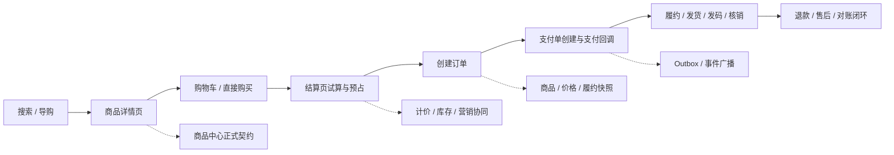

这条主链路表达的是：

1. 搜索、列表和详情是交易前的信息发现链路，允许适度弱一致。
2. 结算、下单、支付是交易承诺链路，必须逐步收紧校验口径。
3. 履约和售后是交易后事实链路，必须围绕订单快照和支付结果闭环。

### 2.3 决策点 1：为什么 C 端不能只用一个“大前台服务”承接全部链路

如果把搜索、详情、购物车、结算、订单、支付、履约全塞进一个“大前台交易服务”，短期当然看似简单，但长期一定会失控。

| 方案 | 优点 | 缺点 / 风险 | 推荐结论 |
| --- | --- | --- | --- |
| 方案 A：大一统前台服务 | 入口统一、联调简单 | 搜索弱一致和交易强一致混在一起；边界塌陷；状态机膨胀 | 不推荐 |
| 方案 B：按交易旅程拆域 | 职责清晰；一致性口径可分层；便于扩容和治理 | 系统间编排更复杂 | 推荐 |

推荐结论：

- 搜索 / 导购负责发现。
- 商品详情负责解释。
- 购物车负责意愿暂存。
- 结算负责强校验编排。
- 订单负责承诺落地。
- 支付负责资金事实。
- 履约与售后负责交易后闭环。

### 2.4 决策点 2：为什么搜索结果和详情页允许不同一致性口径

搜索结果页面对的是高 QPS 召回，详情页面对的是单商品强解释。

| 对象 | 推荐一致性 | 原因 |
| --- | --- | --- |
| 搜索结果页 | 弱一致 | 索引是投影，允许短暂滞后 |
| 详情页 | 近实时一致 | 需要展示交易前关键信息 |
| 下单 / 支付 | 强校验 | 不能靠展示信息直接成交 |

推荐结论：

- 搜索索引和列表投影可以异步刷新。
- 搜索结果页不是“所有字段都由 ES 直接吐出”；只有参与召回、过滤、排序且可容忍滞后的骨架字段进索引，高频强一致字段要通过商品中心、计价和库存批量 Hydrate。
- 详情页必须以正式商品契约为底，再补充当前价、库存和营销。
- 下单永远不能只信列表或详情页展示结果。

### 2.5 决策点 3：为什么购物车不锁库存，结算才预占库存

购物车表达的是“想买”，不是“已经占用交易资源”。

| 方案 | 风险 | 推荐结论 |
| --- | --- | --- |
| 购物车加购即锁库存 | 大量僵尸占用；资源利用率极差；售罄假象 | 不推荐 |
| 结算时再预占库存 | 只在交易临门一脚时收紧资源 | 推荐 |

推荐结论：

- 购物车只保存用户意愿。
- 进入结算页时，库存中心才执行 `ReserveInventory`。
- 支付失败、超时取消、风控拒绝后，必须显式释放预占。

### 2.6 决策点 4：为什么订单必须保存商品 / 价格 / 履约快照

如果订单创建后还依赖“实时查最新商品”，未来只会产生解释灾难。

| 事实 | 为什么要快照 |
| --- | --- |
| 商品标题、规格、履约规则 | 商品可能后续被改名、改规格、改退款口径 |
| 价格与优惠结果 | 价格和活动经常变化 |
| 履约参数 | 发码、预约、核销规则可能调整 |

推荐结论：

- 订单保存或引用创单时的商品快照、价格快照、履约快照。
- 售后和客服解释历史订单时，只认快照，不认最新商品。

### 2.7 决策点 5：为什么支付不能反向驱动订单主状态机

支付是资金事实，但不是订单全业务事实。

| 方案 | 风险 | 推荐结论 |
| --- | --- | --- |
| 支付中心直接改订单所有主状态 | 状态主权错位；订单域被支付绑死 | 不推荐 |
| 支付中心发支付事实事件，订单域自行推进状态 | 支付和订单解耦；幂等更清晰 | 推荐 |

推荐结论：

- 支付系统只负责支付单与支付结果。
- 订单系统消费支付成功 / 失败事件，自行推进自己的状态机。

### 2.8 决策点 6：为什么售后必须基于订单事实，而不是回查最新商品

退款、退货、取消和争议处理面对的是“历史承诺”，不是“当前最新售卖状态”。

推荐结论：

- 售后判断以订单快照、支付结果、履约状态和库存回补策略为准。
- 不允许用最新商品标题、最新价格、最新规则反向解释旧单。

---

## 3. 商品搜索、导购与详情链路

### 3.1 场景画像

从用户进入平台到决定“我要不要买”，通常依次经过两种读路径：

1. 搜索 / 导购结果页：看的是候选集。
2. 商品详情页：看的是交易前解释。

这两条链路看起来都只是“读”，但它们的职责截然不同：

- 搜索结果页服务于召回和转化，强调高吞吐和可排序。
- 详情页服务于交易前理解，强调解释性和当前性。

### 3.2 关键技术点

#### 3.2.1 搜索结果页本质上是弱一致投影

搜索结果页的目标是高吞吐召回、排序和转化，不承担交易真相主权。它展示的是“当前最有可能被用户点击的候选集”，不是“此刻可以直接下单成交的最终合同”。

因此，搜索页允许：

- 索引异步刷新
- 列表字段局部滞后
- 某些弱展示字段降级缺失

但它不能越界去承担：

- 实时价格真相
- 实时库存真相
- 权益资格最终裁决

#### 3.2.2 列表页的第一责任是高效召回和可排序，而不是输出所有实时交易字段

这条链路里最关键的设计点，不是“多调了几个下游”，而是：**搜索结果页到底哪些数据应该直接来自搜索中心，哪些数据应该回商品中心 / 计价 / 库存实时补齐**。

决策原则只有三条：

1. **是否参与召回、过滤、排序**：参与这些能力的字段，优先放到 ES。
2. **变动频次高不高**：高频变化字段不要把绝对真相压进 ES。
3. **对准确性要求高不高**：一旦字段直接影响成交，就应该让实时权威域说了算。

因此，搜索结果页通常采用“**ES 出骨架，商品中心与交易相关域补血肉**”的模式：

| 字段类型 | 主要来源 | 为什么这么设计 |
| --- | --- | --- |
| 标题、副标题、主图、品牌、类目、属性标签 | 搜索中心 / ES | 这些字段参与检索、过滤、聚合或高频展示，适合做索引骨架。 |
| 上下架状态、可搜状态 | 搜索中心 / ES 过滤 | 必须在搜索阶段先过滤掉不可售对象，避免返回无意义结果。 |
| 销量、评分、热度等排序因子 | 搜索中心 / ES | 直接用于粗排或综合排序，允许弱一致。 |
| 实时到手价、会员价、促销价 | 计价中心 / 商品中心 Hydrate | 高敏感、高频变化，列表允许短暂滞后，但展示时最好用实时结果覆盖。 |
| 绝对库存数、紧张库存文案 | 库存中心 Hydrate | 属于高频高并发变化字段，不能让 ES 承担绝对数写入。 |
| 活动标签、圈品命中、促销露出 | 营销中心 Hydrate | 露出逻辑变化快，且失败时可以局部降级。 |
| 冷门说明类字段 | 商品中心 | 不参与搜索与排序，没必要进 ES。 |

一个很实用的判断方法是：

- **只要字段决定“搜不搜得到、排在第几位、能不能按它筛选”**，就应该优先放进 ES。
- **只要字段决定“现在到底多少钱、到底还有没有货、这个活动此刻还能不能领”**，就应该优先让商品中心、计价或库存域返回实时结果。

#### 3.2.3 详情页是多域聚合页，但它依然只是“交易前解释”，不是订单事实

详情页虽然比列表页更接近交易真相，但它仍然只是用户下单前的解释界面。它需要把：

- 正式商品契约
- 当前价格
- 当前库存摘要
- 营销露出
- 履约规则

聚合成一个可理解的商品页面，但它仍然不能替代：

- 结算页的价格试算
- 预占库存
- 优惠校验
- 创单前最终版本校验

#### 3.2.4 酒店搜索场景：哪些信息来自 ES，哪些信息来自商品中心

酒店搜索比普通实物电商更复杂，因为它的库存和价格天然带有 **日期维度** 与 **用户上下文**。同一家酒店，在不同入住日、房型、会员等级和连住天数下，真实价格和真实可售状态都可能完全不同。

因此在酒店搜索里，字段边界通常这样划：

- **来自搜索中心 / ES 的信息**：
  - 酒店名称、别名、地址、经纬度、星级、品牌、设施标签、商圈、地标、基础房型名
  - 粗粒度的 `has_room`
  - 用于价格粗排的 `base_min_price`
- **来自商品中心 / 资源域的实时信息**：
  - 指定入住日到离店日之间的真实可售房态
  - 具体房型在该日期区间下的实时到手价、会员价、连住价
  - 退改政策、确认时效、最晚保留时间

所以酒店搜索的标准模式通常是：

1. ES 先负责按城市、星级、地理位置、设施等条件召回和粗排。
2. 搜索服务拿着 `hotel_ids + checkin + checkout + user_id` 去商品中心 / 计价 / 库存资源域批量查询。
3. 用实时价格和真实房态覆盖掉 ES 的粗粒度字段，再返回给前端。

这也解释了为什么列表页不能直接把 ES 的价格和库存当成交易真相：

- ES 擅长做大规模检索和排序。
- 商品中心、计价、库存才是交易前最后的权威真相。

#### 3.2.5 酒店搜索中的价格排序：为什么要“ES 粗排，商品中心精展”

酒店搜索里，“按价格从低到高排序”是一个典型的工程取舍点。难点在于：**ES 必须先拿到一个字段值才能完成全局排序，但酒店的真实价格又是动态计算出来的**，它同时受到入住日期、连住天数、会员等级、售卖计划、实时促销和税费规则影响。

如果试图把“所有用户、所有日期、所有房型组合下的真实到手价”全部塞进 ES，不但索引维度会爆炸，写入频率也会把搜索集群拖垮。因此，业界更常见也更稳妥的方案是：

1. **ES 存基础价或粗粒度低价**，例如 `base_min_price`。
2. **ES 用这个基础价完成粗排和分页**。
3. **搜索服务再拿当前页酒店 ID 去商品中心 / 计价引擎算真实价**。
4. **前端最终展示真实价，而不是 ES 里的基础价**。

可以把它理解成两层排序：

- **第一层：ES 粗排**
  - 目标：快速筛出大体上价格更低的候选酒店。
  - 使用字段：`base_min_price`、地理距离、评分等低频或可容忍滞后的排序因子。
- **第二层：商品中心精展**
  - 目标：把当前用户、当前日期区间下的真实到手价展示给用户。
  - 使用输入：`hotel_ids + checkin + checkout + user_id + member_level`。

这种做法的优点是：

- ES 可以继续承担高并发检索和翻页，不会因为实时价格频繁变动而被拖垮。
- 商品中心只需要对当前页有限数量的酒店做实时算价，成本可控。
- 最终展示价足够新鲜，不至于让用户看到完全错误的成交价格。

它的代价也要诚实承认：**可能存在轻微排序错位**。例如某酒店在 ES 粗排时基础价更高，但在当前会员和促销条件下真实价反而更低。工程上通常接受这种小范围偏差，因为相比“绝对精确排序”，大促和高并发场景下的系统可用性更重要。

如果业务规模较小，且平台对“价格排序绝对精准”要求极高，也可以采用“扩大召回 + 内存二次精排”的方案：

1. ES 先按基础价或日期维度价格取前 50～100 条候选。
2. 商品中心批量算出这些候选的真实到手价。
3. 搜索服务在内存中对这批结果按真实价重新排序。
4. 最后截取前 20 条返回前端。

这种方案体验更精确，但成本也更高：

- 商品中心一次性算价对象更多；
- 分页会更复杂；
- 在高并发场景下更容易放大下游 RPC 压力。

因此，对于大多数中大型酒旅平台，更推荐的默认结论是：

> **价格排序粗排交给 ES，真实价格展示交给商品中心；宁可接受轻微排序偏差，也不要让搜索集群承担实时交易字段的高频写压力。**

#### 3.2.6 酒店搜索中的深翻页：为什么不能一边无限翻页，一边无限精排

在 ES 里，深翻页不是看“一个城市总共有多少家酒店”，而是看 **`from + size` 有多深**。默认情况下，`max_result_window = 10000`，超过这个窗口 ES 会直接拒绝请求。

因此，“一个城市 1000 家酒店”本身不算问题；真正的问题是：

- 用户是否在持续向后翻页；
- 系统是否还想对越往后的结果继续做高成本的实时算价和二次精排。

这也是酒店搜索比普通商品搜索更难的地方。因为一旦用户选择“按价格排序”，后端往往不只是简单翻页，而是在做：

1. ES 先按基础价召回一批候选；
2. 商品中心对候选酒店批量算真实价；
3. 搜索服务在内存里重新精排；
4. 再截取当前页返回。

如果对所有翻页都维持这套逻辑，哪怕用户只翻到第 3 页，后端也可能已经在做“前 100 条甚至前 300 条候选的批量算价和内存重排”，这就进入了**类深翻页**问题：不是 ES 一定先死，而是商品中心和 Hydrate 编排先被拖垮。

酒店搜索里更稳妥的处理方式通常有三层：

1. **产品侧先限深**
   - C 端列表采用懒加载，而不是允许无限页码跳转。
   - 滚到较深位置时，优先引导用户缩小日期、商圈、价格区间、设施等筛选范围。
   - 这一步往往比任何底层技术优化都更有效。

2. **ES 侧用 `search_after`，不用无脑 `from + size`**
   - 对 C 端连续下拉场景，使用 `search_after` 更合适。
   - 它不支持任意跳页，但非常适合移动端“下一页、再下一页”的滚动浏览。
   - 这样可以避免 ES 为了翻到更后面的页而反复丢弃前面的大量结果。

3. **精排只保证前 N 条，后面自动降级**
   - 可以定义一个“最高精排桶”，例如只保证前 100 家酒店的价格排序绝对精准。
   - 前 100 条以内：走“扩大召回 + 批量算价 + 内存精排”。
   - 超过 100 条之后：只对当前页做实时价覆盖，不再对更大候选集做二次精排。
   - 这样既保住前几屏的用户体验，也不会让后端为极低转化概率的深页结果付出无限成本。

为了进一步保护商品中心的报价引擎，通常还会加一层 **批量报价缓存**：

- 当用户带着同一组条件（如入住日、离店日、人数、会员等级）连续翻页时；
- 商品中心第一次批量算出来的结果可以短暂缓存；
- 后续翻页优先走缓存或 MGET，而不是每翻一页都重新全量计算。

因此，这里的推荐结论可以落成：

> **酒店搜索要把“深翻页问题”和“动态价格排序问题”一起看。ES 负责可扩展的游标翻页，商品中心只为前部高价值结果做精排和算价，越往后越要主动降级，而不是对所有结果做无限精确排序。**

#### 3.2.7 酒店房态与价格的秒级缓存一致性：什么时候应该实时查，什么时候必须缓存

酒店搜索里还有一个非常高频的决策点：**列表页到底应不应该实时去查 30 家酒店的价格和房态**。

这个问题没有统一答案，关键看两件事：

1. 单次批量查询的真实耗时能不能稳定控制在可接受范围内。
2. 高并发、大促、爬虫和跨境供应商抖动时，底层资源层能不能扛住放大的吞吐压力。

如果你们的业务压测结果表明：

- 同一批次实时查询 30 家酒店的价格与房态只需要大约 100ms；
- 且这条链路经过了限流、隔离、超时和降级设计；

那么列表页采用“**ES 粗排 + 当前页 30 家实时查询**”是完全合理的，并且会比死缓存带来更好的用户体验。因为它能显著减少“列表页看到 300 元有房，点进详情页变成 500 元或满房”的落差。

但这里真正的难点，不是“单次 100ms 能不能做到”，而是以下三个工程问题。

**第一，怎么扛住高并发下的整体吞吐量。**

单次查 30 家只要 100ms，不代表在大促、暑期、国庆或被外部爬虫高频抓取时依然成立。因为一旦搜索 QPS 被放大，请求总量会迅速变成：

- `搜索 QPS × 每次查询酒店数`

这时候真正需要保护的不是搜索服务本身，而是后面的：

- 商品中心 / 报价引擎
- 库存 / 房态资源层
- 海外供应商接口

因此更稳妥的做法是：

- 在搜索服务到资源层之间做 **线程池隔离 / 舱壁隔离**
- 对供应商或报价 RPC 做 **超时控制与限流**
- 对异常来源流量做 **防刷与防爬**
- 超过保护阈值时，自动退化为“ES 基础价 + 粗房态”模式

也就是说，**实时查 30 家可以作为主路径，但必须有明确的降级开关**。

**第二，怎么避免慢供应商拖垮整个列表页。**

酒店列表经常会混入海外供应商或跨境资源方，它们的接口 RT 波动可能远大于本地酒店资源系统。如果 30 家里有 2~3 家供应商超时，不能让整页结果跟着被拖慢。

因此列表页更推荐采用：

- 批量并行查询
- 严格的总超时预算
- 单酒店或单供应商分支的独立超时中断

在这种模式下：

- 100ms 内成功返回的酒店正常展示实时价
- 超时或失败的酒店退化成 ES 基础价、基础房态或“参考价”文案
- 绝不允许少数慢分支把整页响应时间拉穿

换句话说，酒店列表的目标不是“每一条都实时且完整”，而是：

> **绝大多数酒店在预算时间内拿到实时结果，少量超时酒店局部降级，但整页体验必须稳定。**

**第三，实时查和价格排序怎么同时成立。**

这正是为什么前面 `3.2.5` 里强调“**ES 粗排，商品中心精展**”。

因为即使当前页 30 家的实时查询只要 100ms，ES 在全局排序时也不可能提前知道所有酒店对当前用户、当前入住日期下的真实到手价。所以更现实的做法仍然是：

1. ES 先按 `base_min_price` 做全局粗排。
2. 取出当前页 30 家酒店 ID。
3. 搜索服务实时查这 30 家的真实价格与真实房态。
4. 在内存中对这 30 条结果做一次轻量二次微调排序。

这样可以兼顾：

- ES 的可扩展粗排能力
- 当前页实时价格展示的准确性
- 以及不把整条链路压成“全量动态排序”的系统风险

因此，这里的推荐结论不是“必须缓存”或“必须实时查”，而是：

> **酒店列表页可以实时查当前页 30 家数据，但前提是这条路径经过限流、隔离、超时和降级保护；真正的主架构仍然是 ES 负责粗排，商品中心 / 报价引擎负责当前页实时修正。**

如果业务已经压测证明当前页实时查询稳定在 100ms 左右，那么比起把价格和房态死死缓存住，这种“**小批量实时查 + 局部降级 + 全局粗排**”往往是更符合真实酒旅体验的工程方案。

#### 3.2.8 Hydrate 编排应该纯串行还是半并行

Hydrate 层最容易被低估的一个问题是：**下游依赖到底应该串行调用，还是并行调用**。

如果完全按照“商品中心 -> 库存中心 -> 营销中心 -> 计价中心”的直觉串行走，业务理解上很顺，但性能上很危险。因为只要每个 RPC 平均耗时 20ms，四段串行下来就已经接近 80ms；任意一个下游轻微抖动，整条列表页链路就会很容易冲到 150ms 以上。

更稳妥的工程实践通常不是“全串行”，也不是“无脑全并行”，而是**带依赖关系的半并行编排**：

1. **第一阶段并行**
   - 商品中心：拿商品卡片骨架、类目、品牌、商家等基础信息
   - 库存中心：拿库存摘要、是否有货、紧张状态
2. **第二阶段**
   - 营销中心：基于商品基础信息和用户上下文，先判断活动命中、优惠资格、券与满减露出
3. **第三阶段**
   - 计价中心：在拿到营销结果之后，再基于商品基础信息、营销结果和用户上下文计算展示价、会员价、到手价

这样做的原因是：

- **库存中心通常只依赖 item_id / sku_id**，并不依赖商品标题、品牌、类目这些骨架字段；
- **商品中心也不依赖价格和库存**，它本身就是卡片骨架来源；
- **营销中心** 往往依赖商品类目、商家、售卖属性来判断露出与资格；
- **计价中心** 在很多实现里并不是独立“拍脑袋算价”，而是要把营销命中的结果、优惠叠加关系、会员折扣、活动门槛一起折进最终展示价，所以它天然位于营销之后。

这种编排的总耗时，更接近：

- `max(商品中心, 库存中心) + 营销中心 + 计价中心`

而不是四段简单相加。所以它通常仍然明显优于“商品 -> 库存 -> 营销 -> 计价”的纯串行模式，同时又不会像“盲目全并行”那样把前置依赖关系搞乱。

如果业务继续追求更低的列表页延迟，还可以进一步演进到**近似全并行**：在计价中心和营销中心内部也冗余一份极简的商品基础信息，例如：

- `item_id -> 类目`
- `item_id -> 商家`
- `item_id -> 基础售卖属性`

这样一来，Hydrate 层在收到 ES 返回的 item_id 列表后，就可以：

- 同时查商品中心
- 同时查库存中心
- 同时查营销中心
- 等营销结果返回后，再调计价中心

因为营销不再必须等待商品中心先返回类目信息，而计价至少不需要再回头额外查一次商品中心。这本质上是：

> **用数据冗余换实时编排延迟。**

但要注意，这种“绝对并行”只适合在两个前提下使用：

1. 营销和计价中心内部维护的商品轻量副本足够新鲜；
2. 你们愿意承担多一层数据同步和一致性治理的复杂度。

所以默认推荐结论是：

> **Hydrate 层优先采用“商品 + 库存第一阶段并行，营销第二阶段，计价第三阶段”的半并行架构；只有在对延迟极度敏感、且下游已经具备足够商品副本和营销结果缓存时，才继续压缩计价前置依赖。**

#### 3.2.9 详情页的核心架构思想：动静分离与多级缓存

商品详情页（PDP）是交易漏斗里最核心的读页面之一。它的特点是：

- 流量极大
- 读多写少
- 高可用要求极苛刻
- 用户对页面解释能力和加载速度都极其敏感

因此，详情页不能做成“每次请求实时查所有下游”的重聚合链路，而要先做**动静分离**。

从工程上看，详情页的数据通常可以拆成两类：

- **静态数据**：
  - 标题、副标题
  - 主图、详情图
  - 商品参数说明
  - 低频变化的文案和结构化描述
- **动态数据**：
  - 当前到手价
  - 库存摘要
  - 当前用户可见的权益和促销露出
  - 配送时效、门店核销、预约规则、评价摘要

更稳妥的详情页架构通常是：

1. **静态骨架优先**
   - 商品静态内容通过静态 JSON、静态片段或 CDN 化页面骨架快速返回。
   - 用户先看到稳定的页面结构、标题和主图，而不是等待所有后端系统都准备完毕。
2. **动态数据异步 Hydrate**
   - 前端或详情聚合层再去批量拿价格、库存、营销和履约数据。
   - 动态内容可以稍晚几十毫秒填充，但不能把首屏完全卡死。

为了让这条链路在大促和高并发下仍然稳定，通常要配合**多级缓存**：

- **CDN / 静态内容缓存**
  - 兜底标题、主图、详情骨架
- **聚合层本地缓存（如 Caffeine）**
  - 缓住极短时间内的重复请求和热点详情
- **分布式缓存（如 Redis）**
  - 缓住基础价、库存摘要、详情聚合片段或短期动态结果

这样做的目标不是追求“所有详情字段都绝对实时”，而是：

> **先保证详情页稳定打开，再保证动态关键信息足够新鲜，最后在创单前做最终强校验。**

#### 3.2.10 详情页里的实时计价、库存摘要与大促降级

详情页里最敏感的两个问题，永远是：

1. 现在多少钱
2. 现在还有没有货

这两个字段之所以难，是因为它们都不适合做成简单的全量缓存。

对于**价格**来说，真正的到手价往往同时受以下因素影响：

- 会员等级
- 商品基础价
- 店铺活动
- 平台券 / 品类券
- 用户专属权益

因此更常见的做法不是缓存“所有用户的最终价”，而是：

- 缓存**基础价 / 会员价矩阵 / 基础促销价**
- 在详情请求进来时，再结合用户上下文和营销命中做轻量实时计算

对于**库存**来说，详情页一般不追求展示精确库存数字，而是展示：

- 有货
- 无货
- 紧张库存
- 仅剩少量

这样可以显著降低库存读压力，同时也避免把高频变化的绝对库存数暴露到前台。

但真正的大问题出现在**大促、热点商品和下游抖动**场景下。此时详情页必须具备明确的降级能力：

- **计价服务超时**
  - 优先展示基础销售价或指导价
- **库存摘要超时**
  - 退化为保守文案，如“库存确认中”或“请以下单时校验为准”
- **营销露出超时**
  - 隐藏活动标签，不阻塞主页面
- **Redis 或下游依赖异常**
  - 先用本地缓存或静态兜底页保证详情可打开

对热点商品，还要配合：

- 热 Key 探测
- 本地热点缓存
- 限流与线程池隔离

这样即使某个爆款详情在几秒内被打到极高 QPS，也不至于把 Redis、计价、库存或营销服务一起拖崩。

所以详情页的核心不是“把所有数据都实时算到最准”，而是：

> **在可接受的一致性范围内，把最重要的动态字段算出来，把不重要的字段降级掉，并且永远保证详情页页面本身不因为单个下游故障而整体不可用。**

### 3.3 搜索结果页查询时序图

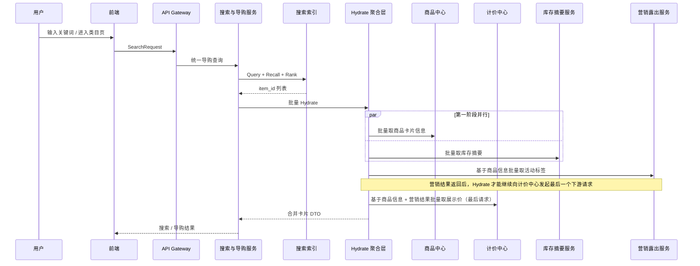

### 3.4 详情页聚合查询时序图

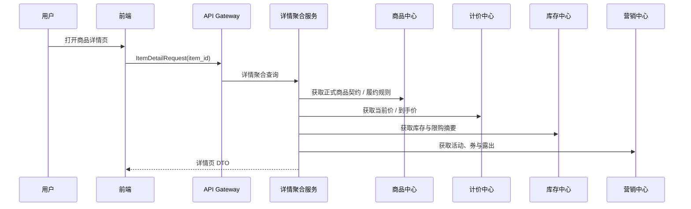

---

## 4. 购物车与结算链路

### 4.1 场景画像

购物车和结算虽然常常出现在同一个前端页面体系里，但它们在系统设计上承担完全不同的角色：

- 购物车是“意愿篮”，弱一致、可长期暂存。
- 结算页是“交易前总校验器”，会触发价格试算、库存预占和优惠校验。

### 4.2 加购与购物车合并时序图

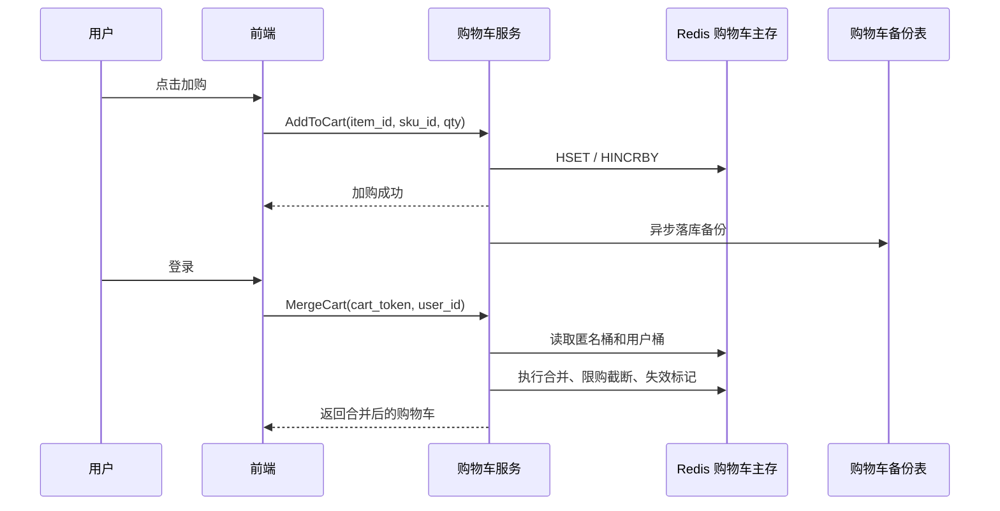

### 4.3 进入结算页的 Saga 编排时序图

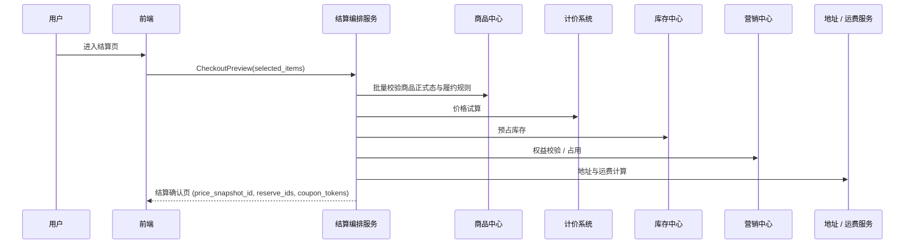

### 4.4 结算确认页失效与刷新时序图

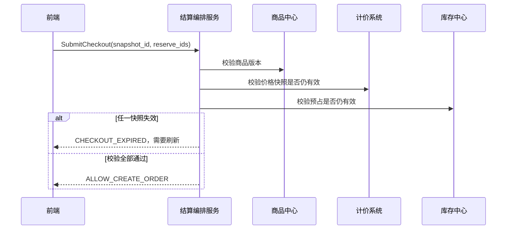

### 4.5 关键技术点

1. 购物车不锁资源，只保存意愿。
2. 结算页是短生命周期的 Saga 编排器，负责把分散的规则、价格、库存和权益收敛成一次可提交的交易尝试。
3. 结算确认页必须携带价格快照、库存预占凭证和权益占用凭证。
4. 提交订单前必须再次做最终校验，防止“页面看到的是旧状态，点击下单时世界已经变了”。

---

## 5. 下单、支付与订单编排链路

### 5.1 场景画像

用户点击“提交订单”时，系统会从“交易前校验”进入“交易事实落地”：

1. 订单中心基于结算凭证创建订单。
2. 订单保存商品、价格和履约快照。
3. 支付系统创建支付单并和外部渠道交互。
4. 支付结果回流后，订单状态推进。
5. 支付失败、超时取消或风控拒绝时，显式释放库存与权益。

### 5.2 关键技术点

#### 5.2.1 订单应该在“提交订单”时创建，还是在“点击支付”时创建

这在电商里是一个非常经典的交易架构决策点，通常有两种主流方案：

- **方案 A：提单时创单**
  - 用户点击“提交订单”时，先创建一笔待支付订单，再进入收银台选择支付渠道。
- **方案 B：支付时创单**
  - 用户点击“立即支付”时才真正建单；支付成功后，再落最终订单事实。

二者的本质区别在于：**库存锁定发生得早还是晚、订单事实生成得早还是晚**。

| 方案 | 优点 | 风险 | 适用场景 |
| --- | --- | --- | --- |
| 提单时创单 | 用户一旦进入收银台，库存和交易资格通常已经预留；支持待支付、催付、继续支付 | 更容易被恶意占库存；高并发时前置写库和锁资源压力更大 | 实物电商、大多数标准电商、酒店、机酒票务、重体验场景 |
| 支付时创单 | 极大减轻前置创单压力；不容易被恶意占库存；更适合极端高并发 | 可能出现“钱付了但后置建单 / 扣库存失败”的补偿复杂度；用户体验更容易受损 | 秒杀、抢购、部分虚拟商品、部分极端高并发场景 |

这章默认采用的是 **方案 A：提单时创单**。原因是本章的主线更偏向：

- 购物车 -> 结算 -> 提交订单 -> 支付 -> 履约

这类标准交易旅程。它的优点是：

- 订单能够稳定承接商品、价格、履约快照；
- 用户进入收银台后，交易关系已经明确；
- 支付结果回调只需要推进订单状态，而不是同时承担“先建单、再扣库存、再补偿”的复杂责任。

但也要明确：**这不是唯一正确答案**。如果业务是：

- 极端高并发秒杀
- 超稀缺票券抢购
- 低客单价虚拟商品

那么“支付时创单”往往更合理，因为它能把大量无效创单和恶意占坑挡在支付前面。

因此这里更稳妥的结论是：

> **标准电商与重体验商品，优先采用“先创单、后支付”；极端高并发和强防刷场景，再考虑“支付时创单”。**

#### 5.2.2 订单提交流程应该由独立聚合服务编排，还是由订单中心自己协调下游

这也是交易架构里非常经典的一个分歧点，通常存在两种方案：

- **方案 A：单独起一个结算 / 交易聚合服务**
  - 由结算服务或 Trade-CO 统一去协调商品、库存、计价、营销，再把最终结果交给订单中心落单。
- **方案 B：前端直接调用订单中心，由订单中心自己协调下游**
  - 订单中心既管订单写库，又去调用商品、库存、计价、营销这些服务完成前置校验与编排。

这两种方案的本质区别是：**交易主流程编排逻辑，是放在订单领域之外的场景聚合层，还是直接压进订单中心内部。**

| 方案 | 优点 | 风险 | 适用场景 |
| --- | --- | --- | --- |
| 独立聚合服务 | 订单中心更纯净；读写压力与场景编排隔离；更适合复杂结算页和多业务协同 | 多一跳 RPC；多一个服务需要治理 | 中大型电商、业务复杂、团队分工清晰、存在独立预结算页 |
| 订单中心自己协调 | 链路短；服务更少；前期开发快 | 订单中心容易膨胀成万能大管家；读写混合；迭代风险高 | 小团队、早期系统、短期快速上线 |

从工程演进角度看，很多系统早期会采用“订单中心自己协调”的方式快速上线，但随着以下问题出现，通常都会向独立聚合服务演进：

- 结算页逻辑越来越复杂
- 商品、计价、库存、营销团队开始独立演进
- 订单中心既要承接创单写流量，又要承接大量预览与预结算读流量
- 大促时希望把“重编排逻辑”和“订单写库主链路”物理隔离

本章默认采用的是 **方案 A：独立结算聚合服务编排，下游原子服务各自归位**。原因是：

- 结算页本身就天然是一个跨商品、库存、计价、营销、地址的聚合场景；
- 订单中心更适合回归为“交易事实持久化 + 状态机推进”的原子领域服务；
- 支付、履约、售后后续也都更容易围绕清晰的订单事实展开。

因此这里的推荐结论是：

> **当系统存在独立的确认订单页 / 预结算页，且交易链路已经明显跨多个领域服务时，优先采用“结算聚合服务编排，下游原子服务落地”的架构；只有在系统非常轻量时，才让订单中心临时兼做协调者。**

#### 5.2.3 创单接口的幂等性应该怎么设计

创单接口的幂等性，不能只理解成“用户重复点按钮怎么办”。它真正要解决的是：

- 同一个下单意图因为网络抖动、页面重试、MQ 重放或用户多次点击而重复到达时；
- 系统最多只能创建一笔订单；
- 如果第一次其实已经成功了，后续重试还应该尽量返回第一次成功的结果，而不是简单报错。

这类设计在工程上通常不是靠单点手段，而是靠一套**分层防御模型**完成：

- **第一层：前端轻量防抖**
  - 用户点击“提交订单”后，按钮立刻置灰
  - 页面进入 loading 状态，减少肉眼可见的重复点击
- **第二层：结算服务前置防重**
  - 用户进入确认订单页时，后端生成一个全局唯一的 `submit_token`
  - 提交订单时，前端必须把这个 `submit_token` 原样透传回来
  - 结算服务先在 Redis 上做一次幂等拦截，例如：
  - `SET submit_lock:{submit_token} 1 NX EX 30`
  - 如果没有拿到锁，说明相同提交意图正在处理中，或者已经处理过
- **第三层：订单中心存储级最终兜底**
  - Redis 分布式锁并不是绝对强一致的
  - 极端情况下，主从切换、锁过期或网络抖动仍然可能让重复请求穿透
  - 所以订单中心在落库时，仍然必须对 `submit_token` 做唯一约束
  - 即使两个请求同时穿透了 Redis，MySQL 也只能允许一笔订单真正写成功
- **第四层：结果幂等与顺水推舟**
  - 如果第一次创单已经成功，但响应前端时网络丢包
  - 第二次相同请求进来，不应该只返回“重复提交”
  - 更好的做法是缓存 `submit_token -> {status, order_id}`
  - 后续重试命中后，直接返回第一次成功的 `order_id`，把用户平滑带到收银台

这几层的职责并不相同：

| 防线 | 核心目标 | 典型实现 |
| --- | --- | --- |
| 前端防抖 | 减少普通重复点击 | 按钮置灰、loading、防重复提交 |
| Redis 防重 | 前置消峰，保护下游资源 | `submit_token` + 分布式锁 / SETNX |
| DB 唯一约束 | 存储层最终绝对幂等 | 订单表或防重表上的唯一索引 |
| 结果缓存 | 平滑处理“成功但回包丢失” | `submit_token -> order_id` 结果映射 |

面试里经常会被继续追问两个极端场景。

**场景一：业务还没执行完，Redis 锁先过期怎么办？**

如果创单链路比较长，固定的 `EX 30` 很容易在高峰期被打穿。更稳妥的工程实现通常是：

- 使用具备看门狗续期能力的分布式锁实现；
- 业务未结束时自动续期；
- 业务结束后显式解锁。

这样可以避免“创单事务还没跑完，锁却先失效”的幂等击穿问题。

**场景二：Redis 锁挡住了大部分流量，但极端情况下仍然漏了怎么办？**

这里真正的底线是：

> **Redis 负责前置消峰，MySQL 唯一键负责最终闭环。**

也就是说，Redis 锁不是为了替代数据库唯一约束，而是为了减少无意义的重复流量冲击商品、库存、营销和订单中心。

因此这里更稳妥的结论是：

> **创单幂等要做成“前端防抖 + 结算服务 submit_token 防重 + 订单中心唯一索引兜底 + 结果缓存顺水推舟”的四层模型。Redis 负责前置消峰，数据库负责最终绝对幂等。**

#### 5.2.4 创单失败后，库存预占和权益占用怎么做最终一致性补偿

这也是结算编排里非常关键的一道资损防线。

在标准的提单链路里，前面往往已经发生了这些动作：

- 价格快照已经生成
- 库存已经预占，拿到了 `reserve_ids`
- 营销权益已经占用，拿到了 `coupon_tokens`

这时如果最后一步：

- `结算服务 -> 订单中心 CreateOrder`

在写库时因为数据库超时、网络断开、主从抖动等原因失败，系统就会落入一个非常危险的中间态：

- 前端看到的是“创单失败”
- 但库存和权益其实已经被前置链路冻结住了

如果不处理，就会出现：

- 僵尸库存预占
- 优惠券被卡死
- 用户无法再次下单
- 商家可售资源被无故锁住

这里不能靠 Seata / XA 这类强一致事务硬拉平，因为它们会把高并发交易主链路拖得过重。更可落地的做法是：

- **主链路快速失败**
- **异步补偿兜底**
- **延迟反查再兜底**

推荐的补偿模型一般有两层：

**第一层：消息补偿**

当结算服务或订单中心感知到创单明确失败时，发布一条 `OrderCreateFailedEvent`：

- 库存中心订阅后释放 `reserve_ids`
- 营销中心订阅后释放 `coupon_tokens`

这样可以把大部分“明确失败”的场景快速回滚掉，而不需要让前台请求同步等待所有补偿完成。

**第二层：下游主动反查 + 延迟释放**

为了防止消息丢失、网络抖动或“创单结果未知”这种灰色状态，库存中心和营销中心本身还应该有一层延迟自愈：

- 在预占 / 占用成功时，挂一条延迟检查任务
- 到达超时时间后，主动去订单中心反查：
  - 这个 `reserve_ids` / `coupon_tokens` 对应的订单到底创建成功了吗
- 如果订单不存在，或者订单已经被关闭 / 取消，就自动释放资源

这意味着：

- 结算服务负责主流程编排
- 订单中心负责创单真相
- 库存和营销中心各自对自己的冻结资源负责自我救赎

因此这里更稳妥的结论是：

> **创单失败后的最终一致性，不能依赖运行时强事务，而要依赖“失败事件补偿 + 延迟反查释放”的双层自愈机制。**

#### 5.2.5 价格防篡改应该重新计算一遍，还是依赖价格签名 / 版本核销

创单链路里还有一个非常关键的安全问题：**前端提交的价格到底能不能信**。

如果黑客通过抓包改包，把前端传给 `SubmitOrder` 的金额从 5999 改成 0.01，而后端又没有做价格防篡改校验，就会直接造成巨大资损。

这类防护一般有两种主流方案：

- **方案 A：无状态签名校验**
  - 预结算时由计价系统生成一个 `price_token`
  - 它通常由 `item_id + user_id + price + timestamp + secret` 等因子签名得到
  - 创单时前端把价格和 `price_token` 一起透传回来
  - 结算服务或计价服务重新验签，确认价格未被改包
- **方案 B：有状态版本核销**
  - 预结算时由计价系统生成一个 `price_version_id`
  - 并把对应价格结果写到 Redis 或计价缓存中
  - 创单时前端只透传版本号
  - 后端按版本号回查真实价格，再以缓存中的真相落单

这两种方案的本质区别是：

- 方案 A 更像“**数学签名防篡改**”
- 方案 B 更像“**后端状态核销防篡改**”

| 方案 | 优点 | 风险 | 适用场景 |
| --- | --- | --- | --- |
| 无状态签名校验 | 不需要高频读 Redis；延迟低；更适合高并发 | 如果只做简单签名，天然不防重放；仍需额外处理超时窗口和 nonce | 高并发场景、性能优先场景 |
| 有状态版本核销 | 安全边界清晰；天然适合做一次性核销；方便过期控制 | 对 Redis / 状态存储依赖更强；预结算和创单时会增加缓存 IO 压力 | 安全要求高、流程较长、可接受缓存成本的场景 |

工业界更常见的落地方式，往往是：

- 以 **无状态签名** 作为主防线，防止前端改价
- 再加上 **时间窗口 + nonce 防重放**
- 如有必要，再用轻量 Redis 记录短期 nonce 或一次性 token

这样既能保持高并发下的低延迟，又能防止用户把一个合法的价格签名反复提交多次。

因此这里更稳妥的结论是：

> **高并发电商链路里，优先采用“价格签名校验 + 时间窗口 / nonce 防重放”的轻量方案；只有在业务对一次性核销、价格版本冻结要求特别强时，再演进到有状态版本核销。**

#### 5.2.6 订单快照应该由谁构建：商品中心、订单中心，还是结算服务

订单快照的职责划分也是一个非常容易设计错的点。这里真正的问题不是“谁能拿到商品标题”，而是：

- 谁手里拥有最完整的下单上下文；
- 谁最适合在创单前把商品、价格、履约三类事实揉成一份订单解释材料；
- 谁应该只负责持久化，而不要再次退化成交易大管家。

这类职责一般会出现三种候选方案：

- **方案 A：由商品中心构建快照**
  - 看起来商品中心最懂商品，但它只拥有“当前商品真相”
  - 它并不知道这次交易用了什么券、最终成交价是多少、履约承诺是什么
  - 如果让商品中心在提单时参与组装订单快照，会把交易上下文反向污染到商品域
- **方案 B：由订单中心构建快照**
  - 订单中心在收到创单请求时，理论上可以再去查商品、计价、营销、履约
  - 但这会让订单中心重新变成“大管家”
  - 创单链路的耗时、依赖数和失败面都会急剧上升
- **方案 C：由结算服务构建快照，订单中心只负责落库**
  - 结算服务在提交订单前，本来就已经拿到了：
  - 商品静态信息
  - 价格明细和优惠分摊结果
  - 履约承诺与交付上下文
  - 它是最适合在内存里把这些信息揉成 `SnapshotDTO` 的那一层
  - 订单中心收到后，只需要把订单事实和快照 JSON 一起持久化

三种方案的关键差异如下：

| 方案 | 优点 | 风险 | 推荐度 |
| --- | --- | --- | --- |
| 商品中心构建 | 商品标题、主图、类目天然可得 | 职责越界；不拥有价格与履约上下文；容易把交易逻辑污染回商品域 | 不推荐 |
| 订单中心构建 | 创单和落库在一个服务里闭环 | 订单中心重新退化成大管家；创单链路变重；依赖面暴涨 | 谨慎使用 |
| 结算服务构建 | 最接近完整交易上下文；适合在创单前聚合和揉快照 | 需要明确快照字段边界，避免把无意义大字段塞进快照 | 推荐 |

因此这里更稳妥的结论是：

> **订单快照应由结算服务在提交订单前完成组装，订单中心只负责把订单事实与快照结果持久化；商品中心提供静态契约，但不直接参与快照构建。**

进一步说，快照也不能无限膨胀。真正应该进入订单快照的，通常是：

- 商品 ID、SKU ID、标题、下单时主图 URL、规格属性；
- 成交单价、原价、优惠分摊、券抵扣、运费、税费；
- 履约类型、承诺送达时间、退改规则摘要。

而像商品详情图文、长文本介绍、视频等大字段，不应该进入订单快照。订单列表查询也不应该把大 JSON 混在主表里，而应该通过独立的 `order_snapshot` 之类的附表按需读取。

#### 5.2.7 订单中心负责交易事实编排，商品中心负责交易前静态契约

商品中心负责“商品身份与价格合规”的静态校验，订单中心负责“交易行为与流水合规”的最终编排。

#### 5.2.8 订单必须保存商品快照、价格快照和履约快照

订单必须保存商品快照、价格快照和履约快照，而不是回读最新商品。

#### 5.2.9 支付发起和支付结果回调是两条不同链路

支付发起和支付结果回调是两条不同链路：前者负责创建支付单，后者负责提供支付事实。

#### 5.2.10 支付系统只提供支付事实，订单系统自己推进状态机

支付系统只提供支付事实，订单系统自行推进自己的状态机。

#### 5.2.11 支付成功之后，订单中心再去编排库存确认、权益确认和后续履约触发

支付成功回调之后，订单中心才去编排库存确认、权益确认和后续履约触发。

#### 5.2.12 支付失败、超时取消和风控拒绝后，库存和营销权益必须显式释放

支付失败、超时取消和风控拒绝后，库存和营销权益必须显式释放。

### 5.3 场景一：提交订单时序图

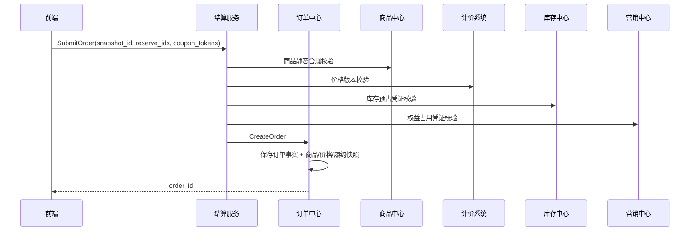

### 5.4 场景二：提交支付时序图

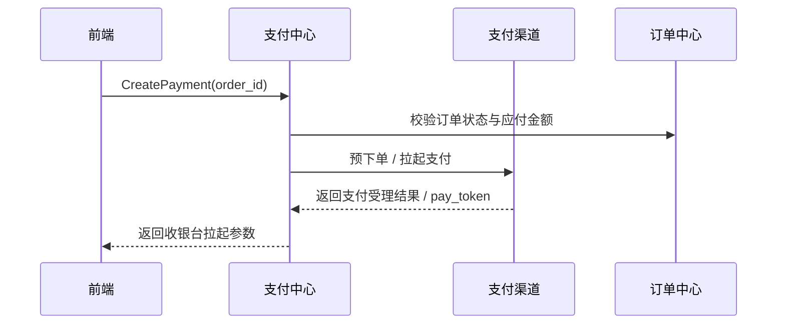

### 5.5 场景三：支付结果回调与订单编排时序图

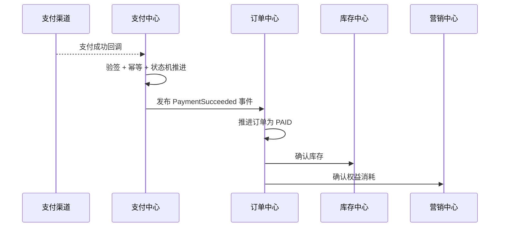

### 5.6 场景四：支付失败与超时回滚时序图

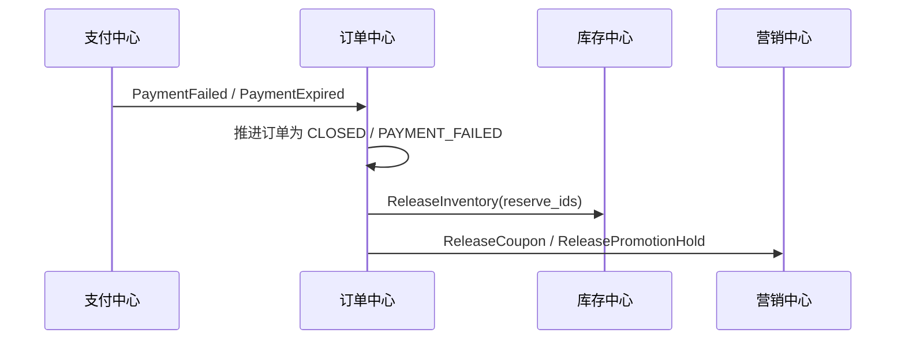

---

## 6. 履约、发货、核销与售后闭环

### 6.1 场景画像

订单支付成功只是用户交易旅程的中点，不是终点。后面的系统挑战包括：

- 实物商品怎么发货、签收、退货退款。
- 券码商品怎么发码、核销、退款。
- 酒旅、到店和预约型商品怎么预约、履约、取消和退款。

这里最重要的统一原则是：

> **订单之后，系统不再回头依赖最新商品真相，而是基于订单快照和履约事实继续推进。**

### 6.2 履约发起时序图

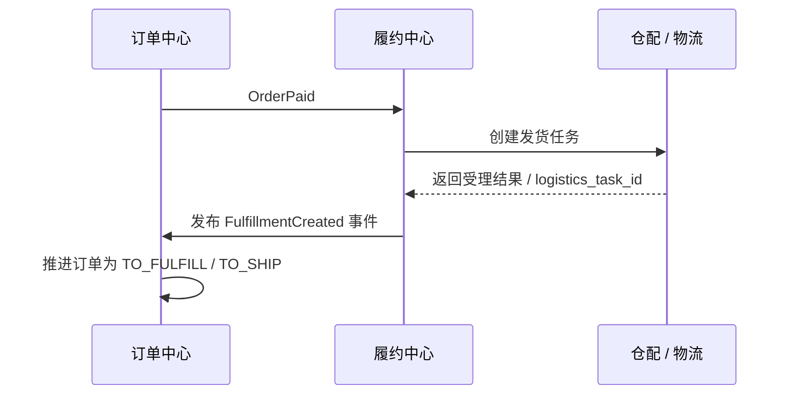

### 6.3 履约结果回调与订单编排时序图

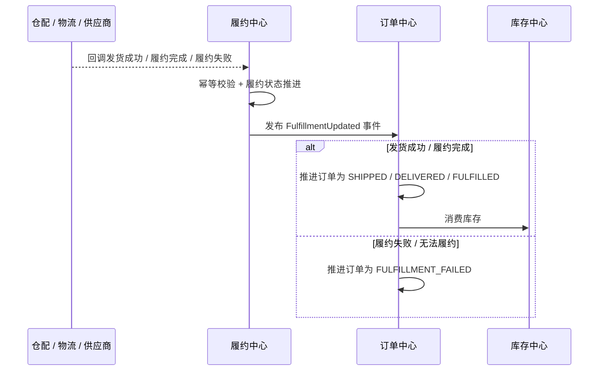

### 6.4 券码发码与核销时序图

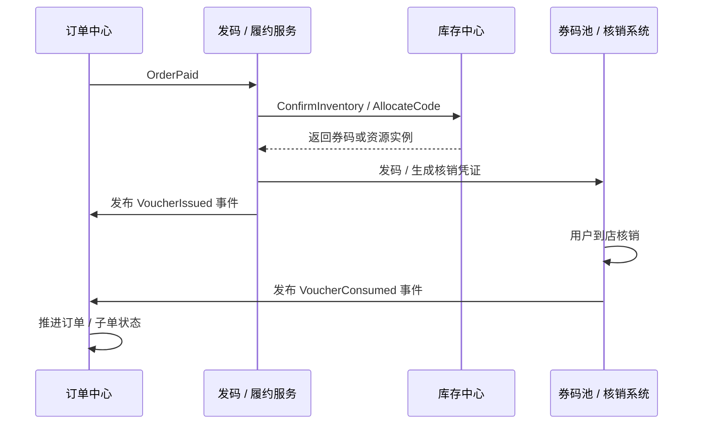

### 6.5 售后退款与库存 / 权益回补时序图

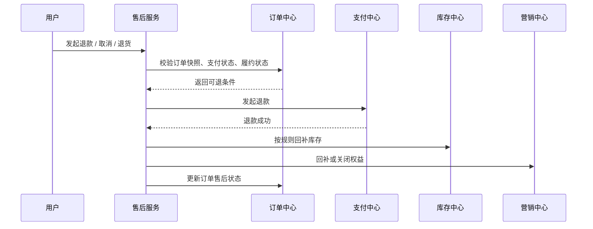

### 6.6 关键技术点

1. 实物、券码、预约型商品的履约路径不同，但都必须围绕订单快照推进。
2. 履约发起和履约结果回调是两条不同链路：前者负责创建履约任务，后者负责把外部履约事实回推给订单中心。
3. 订单中心始终是交易主状态机的拥有者，履约中心只发布履约事实，不直接改订单最终业务语义。
4. 发码、核销、发货和签收都不应该回头依赖最新商品主数据。
5. 售后退款要同时看订单事实、支付事实和履约事实，而不是看当前商品页展示什么。
6. 是否回补库存、是否回退权益、是否允许取消，必须按订单时的规则和当前履约状态共同决定。

---

## 7. 典型业务场景串讲

### 7.1 实物电商主链路

用户搜索手机 → 看详情页 → 加购物车 → 进入结算页试算和预占 → 创建订单 → 支付成功 → 仓配发货 → 签收完成 → 可发起退货退款。

这一链路的核心风险在于：

- 列表页展示价与下单价不一致。
- 支付失败后库存未释放。
- 发货后退款和库存回补规则错乱。

### 7.2 券码 / 到店商品主链路

用户搜索餐饮券或景区票 → 详情页看使用规则 → 结算页试算与预占 → 支付成功 → 发码 → 到店核销 → 核销完成 → 按规则退款或不可退。

这一链路的核心风险在于：

- 发空码。
- 券码核销与订单状态不一致。
- 退款后券码或权益没有正确回收。

### 7.3 酒旅 / 预约型商品主链路

用户查看房型、日期、价格日历 → 结算页锁房 / 预占 → 创建订单 → 支付成功 → 预约 / 确认单生成 → 入住 / 出行 / 使用完成 → 按取消规则退款。

这一链路的核心风险在于：

- 详情页看见的日期价与下单时的真实价格不一致。
- 预约资源已变动但订单仍按旧状态继续推进。
- 售后取消没有依据订单时的规则解释。

---

## 8. 面试答辩与工程总结

如果面试官问“C 端交易链路最难的地方是什么”，比较好的回答不是背一串系统名词，而是先给出总心智：

> C 端系统的难点，不是把搜索、购物车、订单、支付这些服务拆出来，而是让用户在整条交易旅程里既感受到响应足够快，又始终不会用旧价格、旧库存、旧规则成功交易，更不会在支付后、履约后和售后阶段失去解释依据。

这章建议记住 6 句话：

1. 搜索结果页是弱一致投影，详情页是交易前解释，创单时再做强校验。
2. 购物车保存的是意愿，不是资源占用。
3. 结算页是一次短生命周期的 Saga，负责把价格、库存、营销和地址收敛成可提交交易。
4. 订单是交易事实，不是“重新查商品”的入口。
5. 支付系统提供资金事实，订单系统自己推进状态。
6. 订单之后，任何履约和售后都优先基于快照和履约事实解释。

当你能把这 6 句话和上面的时序图、快照、预占、幂等、回补策略串起来时，这一章就不只是一个“电商流程介绍”，而是一套真正可落地、可答辩、可治理的 C 端全生命周期设计。
